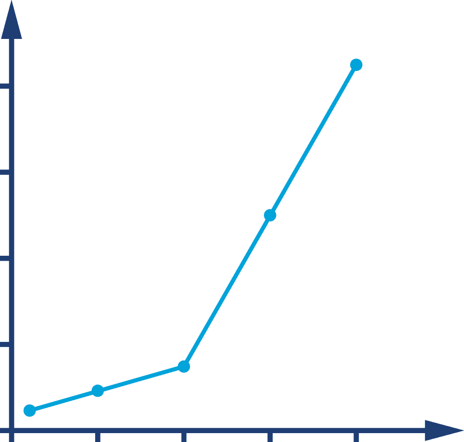
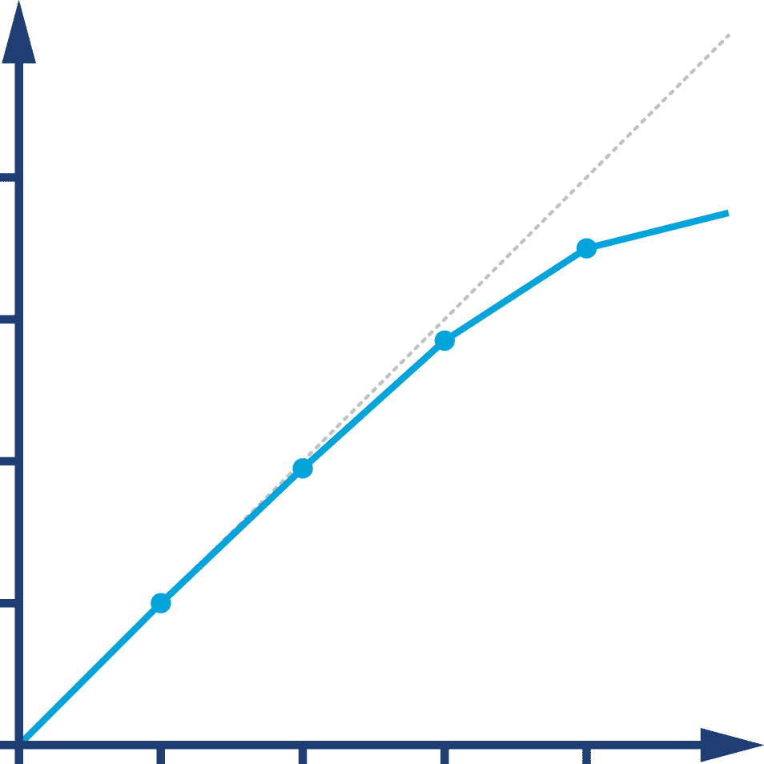
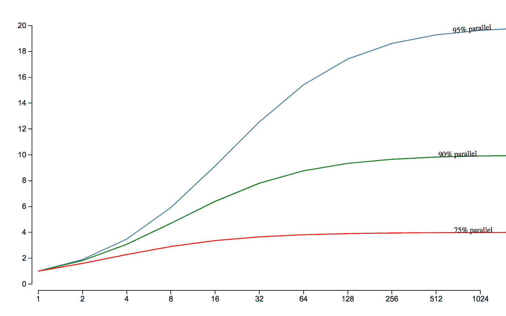
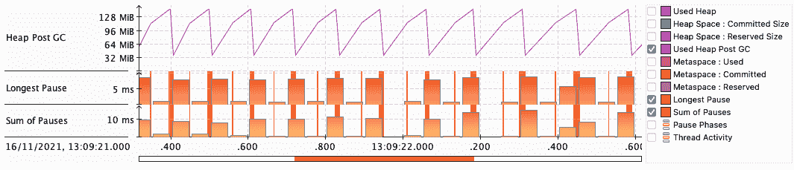
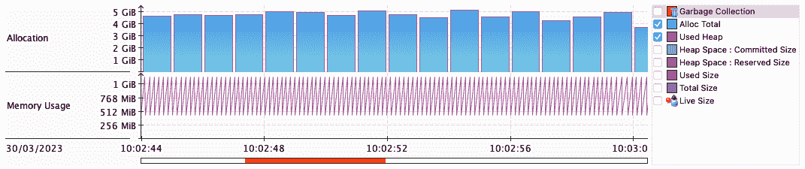
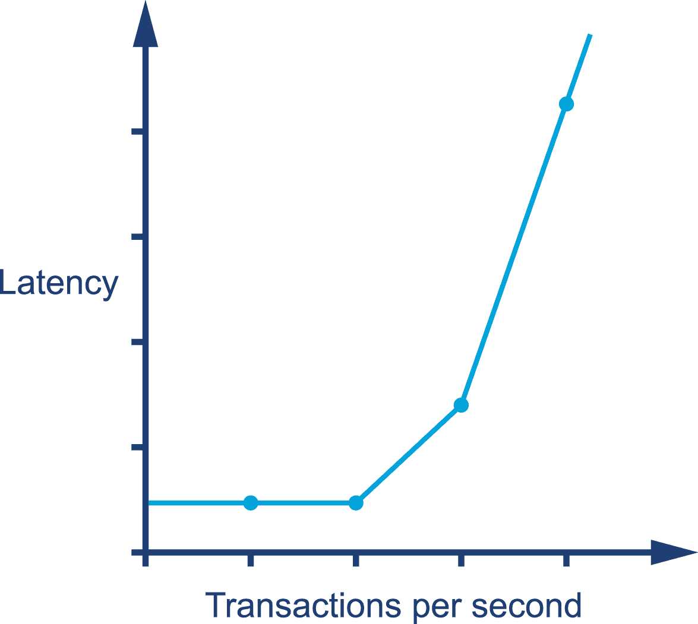

# 第一章 优化与性能定义

优化 Java（或任何其他类型的代码）的性能通常被视为黑魔法。关于性能分析有一种神秘感——它通常被视为一种由“独行侠黑客，思考深刻”的技艺（好莱坞对计算机及其操作者最喜欢的题材之一）。这种形象是一个能深入了解系统并提出魔法解决方案使系统更快运行的个人形象。

这种情况经常伴随着不幸的（但却太常见）情况，即性能成为软件团队的次要关注点。这种情况造成了一个场景，即只有在系统陷入困境时才进行分析，因此需要一个性能“英雄”来拯救它。然而，现实却有些不同。

真相是，性能分析是一种奇怪的硬经验主义和软的人类心理学的结合体。重要的是，同时关注可观测指标的绝对数值以及最终用户和利益相关者的感受。解决这一明显悖论的方式是本书其余部分的主题。

自第一版出版以来，这种情况变得更加尖锐。随着越来越多的工作负载转移到云中，并且系统变得越来越复杂，将非常不同的因素结合在一起的奇怪混合物变得更加重要和普遍。关注性能的工程师需要操作的“关注领域”继续扩展。

这是因为生产系统变得更加复杂。现在更多的系统除了要考虑单个应用程序进程的性能外，还具有分布式系统的方面。随着系统架构变得更大更复杂，必须关注性能的工程师的数量也在增加。

本书的新版本通过提供四个内容来回应我们行业中的这些变化：

+   需要深入探讨单个 JVM 内运行的应用代码的性能

+   JVM 内部的讨论

+   现代云堆栈与 Java/JVM 应用程序的互动细节

+   首次查看在云环境中运行的 Java 应用程序集群行为

在本章中，我们将通过一些定义来开始，建立一个关于性能讨论的框架——从一些问题和常见的 Java 性能讨论陷阱开始。

# Java 性能——错误的方式

多年来，“Java 性能调优”在 Google 的前三大热门搜索中之一是一篇来自 1997-1998 年的文章，这篇文章早在 Google 历史早期就被纳入了索引。这篇页面显然一直保持在前列，因为其初始排名积极地吸引流量，从而形成了一个反馈循环。

页面上的建议完全过时，不再正确，并且在许多情况下对应用程序有害。然而，它在搜索引擎结果中的优势位置导致许多开发人员接受了糟糕的建议。

例如，早期版本的 Java 存在糟糕的方法调度性能。作为解决方法，一些 Java 开发人员主张避免小方法，而是编写单块方法。当然，随着时间的推移，虚拟分派的性能显著改善。

不仅如此，但是通过现代 JVM 技术（特别是自动管理的内联），在大量——甚至是多数——调用站点上，虚拟分派现在已经被消除了。遵循“将所有内容整合到一个方法中”的建议的代码现在处于明显的劣势，因为对现代即时编译器（JIT）非常不友好。

我们无法知道应用程序的性能受到了多大程度的损害，但这个案例清楚地展示了不使用定量和可验证的方法来处理性能的危险。这也再次非常好地说明了为什么不应该相信互联网上的所有内容。

###### 注意

Java 代码的执行速度非常动态，基本上取决于底层的 Java 虚拟机。即使是一段老旧的 Java 代码，在更新的 JVM 上也可能会执行得更快，即使没有重新编译 Java 源代码。

你可能会想象，出于这个原因（以及我们稍后将讨论的其他原因），这本书不是性能技巧的烹饪书，适用于您的代码。相反，我们专注于一系列因素，这些因素共同作用以产生良好的性能工程：

+   整个软件生命周期内的性能方法论

+   测试理论在性能上的应用

+   测量、统计和工具

+   分析技能（系统和数据）

+   底层技术和机制

通过将这些方面综合起来，意图是帮助您建立一个可以广泛应用于您可能面对的各种性能情况的理解。

书中稍后我们将介绍一些启发式和代码级优化技术，但这些都伴随着开发人员在使用之前应该了解的注意事项和权衡。

###### 提示

请不要跳过这些部分，并开始应用详细描述的技术，而不正确地理解给出建议的背景。如果缺乏正确的应用理解，所有这些技术都可能带来更多的伤害而不是好处。

总的来说，有：

+   JVM 没有魔法“加速”开关

+   没有“技巧和窍门”可以让 Java 运行更快

+   没有被隐藏的秘密算法

当我们探索我们的主题时，我们将详细讨论这些误解，以及开发人员在接近 Java 性能分析和相关问题时经常犯的一些其他常见错误。

我们的“无提示和技巧”方法延伸到了我们对云技术的覆盖。你几乎找不到关于云超大规模（AWS、Azure、GCP、OpenShift 等）上的特定供应商技术的讨论。这有两个主要原因：

+   这会扩展书籍的范围，并使其变得难以管理。

+   在如此广阔的主题领域中保持最新是不可能的。

那些产品开发团队的进展会使得任何关于它们的详细信息在书籍出版时都已经过时。因此，在云章节中，我们侧重于基础知识和模式，而这些无论应用程序部署在哪个超大规模云平台上都有效。

你还在这里？很好。那么让我们谈谈性能。

# Java 性能概述

要理解为什么 Java 性能是这样的，让我们从考虑 Java 的创始人詹姆斯·高斯林的经典语录开始：

> Java 是一门蓝领语言。它不是博士论文的材料，而是为了工作的语言。^(1)
> 
> 詹姆斯·高斯林

换句话说，Java 一直是一门极其实用的语言。它最初对性能的态度是，只要环境足够*快*，那么如果开发者的生产力得到提升，就可以牺牲原始性能。因此，直到相对最近，随着 HotSpot 等 JVM（如 Java 虚拟机）日益成熟和复杂，Java 环境才适合高性能计算应用。

这种实用性在 Java 平台上以多种方式显现，但其中最明显的之一是使用*管理子系统*。这个想法是，开发者放弃了低级控制的一些方面，换取不必担心管理能力的某些细节。

最明显的例子当然是内存管理。JVM 通过可插拔的*垃圾收集*子系统（通常称为 GC）提供自动内存管理，这样程序员就不必手动跟踪内存。

###### 注意

管理子系统遍布 JVM 的各个部分，并且它们的存在在 JVM 应用的运行时行为中引入了额外的复杂性。

正如我们将在下一节讨论的那样，JVM 应用的复杂运行时行为要求我们将应用视为正在测试的实验。这导致我们考虑观察测量的统计学，而在这里我们做出了一个不幸的发现。

JVM 应用的观察性能测量很多时候不是正态分布的。这意味着基本的统计技术（尤其是*标准偏差*和*方差*等）不适合处理来自 JVM 应用的结果。这是因为许多基本的统计方法对结果分布的正态性有隐含的假设。

理解这一点的一种方法是，对于 JVM 应用程序来说，异常值可能非常重要—例如，对于低延迟交易应用程序。这意味着测量的抽样也是有问题的，因为很容易错过最重要的事件。

最后，警告一句。通过 Java 的性能测量很容易被误导。环境的复杂性意味着很难分离系统的各个方面。

测量也会带来开销，频繁采样（或记录每个结果）可能会对记录的性能数字产生明显影响。Java 性能数字的本质需要一定的统计学技术，而天真的技术在应用于 Java/JVM 应用程序时经常会产生错误结果。

这些问题也对云原生应用程序领域产生影响。自动管理应用程序已经成为云原生体验的一部分—特别是随着诸如 Kubernetes 等技术的兴起。在云原生应用程序的架构中，平衡数据收集成本和收集足够数据以得出结论的需要也非常重要—我们将在第十章进一步讨论这一点。

# 性能作为一门实验科学

Java/JVM 软件堆栈，就像大多数现代软件系统一样，非常复杂。事实上，由于 JVM 的高度优化和自适应特性，建立在 JVM 之上的生产系统可能具有一些微妙而复杂的性能行为。这种复杂性得益于摩尔定律及其代表的硬件能力的前所未有的增长。

> 计算机软件行业最令人惊讶的成就是其不断抵消计算机硬件行业所取得的稳定而惊人的进步。
> 
> 亨利·彼得罗斯基（归属性）

虽然一些软件系统已经浪费了行业的历史收益，但 JVM 则代表了工程上的一种胜利。自从 1990 年代末问世以来，JVM 已经发展成为一个非常高性能的通用执行环境，充分利用了这些收益。

然而，与任何复杂的高性能系统一样，JVM 需要一定的技能和经验才能发挥其最佳性能。

> 如果目标没有明确定义，则测量就比没有用的还糟糕。^(2)
> 
> [埃利·戈德拉特](https://en.wikipedia.org/wiki/Eliyahu_M._Goldratt)

JVM 性能调优因此是技术、方法论、可测量数量和工具的综合体。它的目标是以系统的所有者或用户期望的方式产生可衡量的输出。换句话说，性能是一门实验科学—它通过以下方式实现期望的结果：

+   定义期望的结果

+   测量现有系统

+   确定如何实现要求

+   进行改进练习

+   重新测试

+   确定是否已经达到目标

确定和定义期望的性能结果的过程建立了一组定量目标。建立应该测量的内容并记录这些目标是重要的，这些目标随后成为项目成果和交付物的一部分。从中，我们可以看到性能分析是基于定义，然后实现非功能性需求。

如前所述，这个过程并不是读取鸡肠或其他占卜方法的过程。相反，我们依靠统计数据和对结果的适当处理（和解释）。

在本章中，我们将讨论这些技术如何应用于单个 JVM。在第二章中，我们将介绍一些基本的统计技术，这些技术对于准确处理从 JVM 性能分析项目中生成的数据是必需的。稍后，主要在第十章中，我们将讨论这些技术如何推广到一个集群应用程序，并产生可观察性的概念。

需要认识到，对于许多现实世界的项目来说，对数据和统计的更复杂的理解无疑是必需的。因此，建议将本书中找到的统计技术视为一个起点，而不是一个明确的陈述。

# 性能的分类

在本节中，我们介绍了一些性能分析的基本可观察量。这些提供了性能分析的词汇，并将允许您以定量术语框定调整项目的目标。这些目标是定义性能目标的非功能性要求。请注意，这些量并不一定在所有情况下直接可用，有些可能需要一些工作才能从我们系统得到的原始数据中获得。

一个常见的基本性能可观察集是：

+   吞吐量

+   延迟

+   容量

+   利用率

+   效率

+   可伸缩性

+   退化

我们将依次简要讨论每个问题。请注意，对于大多数性能项目，不会同时优化每个指标。在单个性能迭代中仅改善少数指标的情况更为常见，这可能是可以同时调整的指标数量。在现实世界的项目中，优化一个指标很可能会损害另一个指标或一组指标。

## 吞吐量

吞吐量是一个表示系统或子系统可以执行的工作速率的指标。这通常表示为某个时间段内的工作单位数量。例如，我们可能对系统每秒执行多少个事务感兴趣。

在真实的性能测试中，吞吐量数值的意义在于应包括所获得的参考平台的描述。例如，硬件规格、操作系统和软件堆栈都与吞吐量相关，以及测试系统是单服务器还是集群。此外，事务（或工作单位）在测试之间应保持一致。基本上，我们应该努力确保吞吐量测试的工作负载在运行之间保持一致。

有时会通过引用管道等隐喻来解释性能指标。如果我们采纳这个观点，那么如果水管每秒可以产生 100 升水，则在 1 秒钟内产生的体积（100 升）就是吞吐量。请注意，此值取决于水的速度和管道的横截面积。

## 延迟

继续上一节的隐喻，延迟是指给定升数通过管道的时间。这取决于管道的长度和水流速度。然而，它与管道直径无关。

在软件中，延迟通常被引用为端到端时间，即处理单个事务并查看结果所需的时间。它取决于工作负载，因此常见的方法是生成一个显示延迟作为增加工作负载函数的图表。我们将在“阅读性能图表”中看到这种类型的图表示例。

## 容量

容量是系统拥有的工作并行性的量度，即可以同时进行的工作单位（例如，事务）的数量。

容量显然与吞吐量相关，我们应该期望随着系统的并发负载增加，吞吐量（和延迟）会受到影响。因此，通常会引用在给定延迟或吞吐量值时可用的处理能力。

## 利用率

性能分析中最常见的任务之一是实现系统资源的有效利用。理想情况下，CPU 应该用于处理工作单元，而不是空闲（或者花时间处理操作系统或其他管理任务）。

根据工作负载的不同，不同资源的利用率水平可能存在巨大差异。例如，计算密集型工作负载（如图形处理或加密）可能接近 100%的 CPU 使用率，但只使用了少量可用内存。

除了 CPU 之外，其他类型的资源，如网络、内存和（有时候）存储 I/O 子系统，在云原生应用中成为管理的重要资源。对于许多应用程序来说，内存的浪费比 CPU 更多，对于许多微服务来说，网络流量已成为真正的瓶颈。

## 效率

将系统的吞吐量除以利用的资源可以衡量系统的整体效率。直观地讲，这是有道理的，因为为了产生相同的吞吐量而需要更多资源是对效率低下的一个有用定义。

处理较大系统时，也可以使用一种成本会计来衡量效率。如果解决方案 A 的总拥有成本（TCO）是解决方案 B 的两倍，但吞吐量相同，则显然效率是后者的一半。

## 可扩展性

一个系统的吞吐量或容量当然取决于可用于处理的资源。系统或应用程序的可扩展性可以用多种方式来定义，但其中一个有用的方式是随着资源的增加而吞吐量的变化。系统可扩展性的圣杯是让吞吐量与资源的变化完全同步。

考虑一个基于服务器集群的系统。例如，如果扩展集群，使其大小加倍，那么可以实现什么样的吞吐量？如果新的集群能处理两倍于原来的交易量，那么系统就表现出“完美的线性扩展”。这在实践中非常难以实现，尤其是在可能的负载范围很广的情况下。

系统可扩展性取决于许多因素，并且通常不是简单的线性关系。一个系统在某些资源范围内通常会接近线性地扩展，但是在更高的负载下会遇到某种限制，阻止了完美的扩展。

## 退化

如果我们增加系统的负载，无论是增加请求到达的速率还是增加单个请求的大小，都可能导致观察到的延迟和/或吞吐量发生变化。

注意这种变化取决于利用率。如果系统利用率不足，那么在观察值发生变化之前应该有一些余地，但如果资源已被充分利用，则我们预期会看到吞吐量停止增加或延迟增加。这些变化通常称为系统在额外负载下的退化。

## 观察值之间的相关性

各种性能观察指标的行为通常以某种方式相互关联。这种连接的细节取决于系统是否运行在峰值效用。例如，通常情况下，当系统负载增加时，利用率会发生变化。然而，如果系统利用率不足，则增加负载可能不会明显增加利用率。相反，如果系统已经受到压力，则增加负载的影响可能会体现在其他观察值中。

举个例子，可扩展性和退化都代表系统在增加负载时行为的变化。对于可扩展性而言，随着负载的增加，可用资源也在增加，核心问题是系统是否能够利用它们。另一方面，如果增加负载但未提供额外资源，则某些性能观察值（例如延迟）的退化是预期的结果。

###### 注意

在罕见情况下，额外的负载可能导致出乎意料的结果。例如，如果负载的变化导致系统的某部分切换到资源消耗更多但性能更高的模式，则总体效果可能是降低延迟，即使接收到更多请求。

举个例子，在第六章中我们将详细讨论 HotSpot 的 JIT 编译器。要考虑作为 JIT 编译的候选方法，“必须在解释模式下执行足够频繁”。因此，在低负载下，关键方法可能会停留在解释模式，但随着方法调用频率的增加，这些方法可能在更高负载时变得适合编译。这导致对同一方法的后续调用比早期执行快得多。

不同的工作负载可能具有非常不同的特性。例如，金融市场上的一项交易从开始到结束可能需要几小时甚至几天的执行时间（即延迟）。然而，在任何给定时间，一家主要银行可能有数百万个交易正在进行。因此，系统的容量非常大，但延迟也很大。

然而，让我们只考虑银行内的单个子系统。买方和卖方的匹配（本质上是各方就价格达成一致）被称为*订单匹配*。这个单独的子系统在任何给定时间可能只有数百个待处理订单，但是从接受订单到完成匹配的延迟可能只有 1 毫秒（或者在“低延迟”交易的情况下甚至更少）。

在本节中，我们遇到了最常见的性能观察值。偶尔会使用稍有不同的定义，甚至不同的指标，但在大多数情况下，这些将是通常用来指导性能调整的基本系统数字，并作为讨论感兴趣系统性能的分类法。

# 阅读性能图表

总结本章，让我们来看看在性能测试中经常出现的一些行为模式。我们将通过查看实际可观察的图表来探索这些模式，随着进一步的进行，我们还将遇到许多其他数据图表的例子。

图中的图 1-1 显示了在增加负载时（通常称为*性能拐点*）性能（在本例中是延迟）突然而意外的下降。

###### 图 1-1\. 性能拐点

相比之下，图 1-2 展示了通过向集群添加机器来几乎线性扩展的吞吐量的更加愉快的情况。这接近理想行为，并且只有在极其有利的情况下才可能实现——例如，使用单个服务器扩展无需会话亲和性的无状态协议。

###### 图 1-2\. 近线性扩展

在第十三章中，我们将会遇到阿姆达尔定律，这个定律以著名计算机科学家（“大型机之父”）IBM 的基因·阿姆达尔命名。图 1-3 展示了他关于可伸缩性的基本限制的图形表示；它展示了作为处理器数量函数的最大可能加速度。

###### 图 1-3\. 阿姆达尔定律

我们展示了三种情况：底层任务的可并行性分别为 75%、90%和 95%。这清楚地表明，每当工作负载有必须串行执行的部分时，线性可伸缩性就不可能存在，并且对可实现的可伸缩性有严格的限制。这证实了对图 1-2 的评论——即使在最好的情况下，线性可伸缩性几乎不可能实现。

阿姆达尔定律施加的限制令人惊讶地严格。特别注意图的 x 轴是对数刻度，因此即使是一个 95%可并行化的算法（因此只有 5%串行化），也需要 32 个处理器才能实现 12 倍的加速。更糟糕的是，无论使用多少核心，该算法的最大加速度仅为 20 倍。在实践中，许多算法的串行部分远远超过 5%，因此其最大可能的加速度更为受限。

软件系统中性能图的另一个常见来源是内存利用率。正如我们将在第四章中看到的那样，JVM 的垃圾收集子系统中的底层技术自然地导致了健康应用程序中内存使用的“锯齿”模式。我们可以在图 1-4 中看到一个示例——这是来自由 Eclipse Adoptium 提供的 Mission Control 工具（JMC）的截图的近距离观察。

###### 图 1-4\. 健康的内存使用

JVM 的一个关键性能指标是分配率——即它可以多快地创建新对象（以字节每秒计）。我们将在第四章和第五章详细讨论 JVM 性能的这一方面。

在图 1-5 中，我们可以看到分配率的放大视图，也是从 JMC 捕获的。这是从一个故意对 JVM 内存子系统施加压力的基准程序生成的。我们尝试让 JVM 达到每秒 8GiB 的分配，但正如我们所见，这超出了硬件的能力，因此系统的最大分配率在 4 到 5GiB/s 之间。

###### 图 1-5\. 样本问题的分配率

注意，分配达到极限与系统存在资源泄漏是不同的问题。在这种情况下，它常常表现为类似于图 1-6 所示的方式，其中一个可观察指标（在本例中是延迟）随着负载增加而逐渐恶化，然后在达到一个拐点后系统迅速恶化。

###### 图 1-6\. 在高负载下延迟恶化

让我们继续讨论一些在处理云系统时需要考虑的额外事项。

# 云系统性能

现代云系统几乎总是由节点集群（JVM 实例）通过共享网络资源进行交互操作的分布式系统。这意味着除了单节点系统的所有复杂性外，还必须解决另一个层次的复杂性。

分布式系统的运营人员必须考虑以下问题：

+   工作如何在集群中的节点之间分配？

+   我们如何将软件的新版本（或新配置）推广到集群？

+   当节点离开集群时会发生什么？

+   当新节点加入集群时会发生什么？

+   如果新节点在某些方面配置错误会发生什么？

+   如果新节点在某些方面与集群中的其余部分行为不同会发生什么？

+   如果控制集群本身的代码出现问题会怎样？

+   如果整个集群或其依赖的某些基础设施发生灾难性故障会怎样？

+   如果基础设施中支持集群的某个组件是有限资源并且成为可扩展性的瓶颈会怎么样？

这些问题我们稍后会在本书中全面探讨，它们对云系统的行为有重大影响。它们影响关键性能指标，如吞吐量、延迟、效率和利用率。

不仅如此，还有两个非常重要的方面——与单个 JVM 情况不同——可能对初接触云系统的新手不明显。第一个是由集群的内部行为引起的许多可能影响，这对性能工程师可能是不透明的。

当我们在第十章详细讨论现代系统中的可观察性及如何实施解决方案以解决这一可见性问题时，我们会深入探讨这一点。

第二点是，服务在使用云提供商时的效率和利用率直接影响运行该服务的成本。低效和配置错误可能会直接体现在服务的成本基础上。事实上，这是考虑云兴起的一种方式。

在过去，团队通常会拥有位于数据中心专用区域（通常称为*cages*）内的实际物理服务器。购买这些服务器代表了*资本支出*，这些服务器被视为资产。当我们使用云服务提供商（如 AWS 或 Azure）时，我们租用的是实际由亚马逊或微软等公司拥有的机器时间。这是*运营支出*，是一种成本（或责任）。这种转变意味着我们系统的计算需求现在更容易被财务人员审查。

总体来说，重要的是要认识到云系统在根本上是由进程集群（在我们的情况下是 JVM）组成的，这些集群会随时间动态变化。这些集群可以增长或缩小，但即使不这样做，参与的进程随时间也会发生变化。这与传统基于主机的系统形成鲜明对比，那些形成集群的进程通常更长寿，并且属于已知且稳定的主机集合。

# 总结

在本章中，我们开始讨论 Java 性能的真实情况。我们介绍了经验科学和测量的基本主题，以及良好性能练习中将使用的基本词汇和可观察现象。我们介绍了从性能测试中常见的一些案例。最后，我们介绍了在云系统中可能出现的各种基本问题。

让我们继续讨论性能测试的一些重要方面，以及如何处理这些测试生成的数据。

^(1) J. Gosling，《The feel of Java》，*Computer*，第 30 卷，第 6 号（1997 年 6 月）：53-57

^(2) E. Goldratt 和 J. Cox，《The Goal》，（Gower Publishing，1984）
