# 第二章。性能测试方法论

进行性能测试有多种原因。在本章中，我们将介绍团队可能希望执行的不同类型的性能测试，并讨论每个子类型测试的一些最佳实践。

本章稍后我们将讨论统计数据和一些非常重要的人因素，这些因素在考虑性能问题时经常被忽视。

# 性能测试类型

经常以错误的原因进行性能测试，或者测试做得很差。造成这种情况的原因各不相同，但通常根源于未能理解性能分析的本质以及认为“做点什么总比什么都不做好”的信念。正如我们将在本书中多次看到的那样，这种信念通常最多只能算是半个真理，却往往是危险的。

一个更常见的错误是泛泛地谈论“性能测试”，而不深入讨论具体问题。事实上，可以对系统进行许多不同类型的大规模性能测试。

###### 注意

良好的性能测试是定量的。它们提出能够产生数值答案的问题，并且可以作为实验输出进行统计分析。

本书将讨论的性能测试类型通常具有独立的（但有些重叠的）目标。因此，在决定应进行哪种类型的测试之前，了解您试图回答的定量问题非常重要。

这并不一定那么复杂——仅仅写下测试意图要回答的问题可能就足够了。然而，通常考虑为何这些测试对应用程序很重要，并通过应用程序所有者（或关键客户）确认这一点是常见的。

一些最常见的测试类型及其每种类型的示例问题如下：

延迟测试

系统的端到端事务时间是多少？

吞吐量测试

当前系统容量能够处理多少并发事务？

负载测试

系统能够处理特定负载吗？

压力测试

系统的破坏点在哪里？

耐久性测试

系统长时间运行时会发现什么性能异常？

容量规划测试

当增加额外资源时，系统是否按预期扩展？

退化

当系统部分失败时会发生什么？

让我们依次更详细地查看每种测试类型。

## 延迟测试

延迟通常是性能测试中最常见的类型之一，因为它通常是一个系统可观察的重点，对管理层（和用户）而言尤为关注：我们的客户等待交易（或页面加载）多长时间？

这可能是一个两面刃，因为延迟测试试图回答的问题的简单性可能会导致团队过分关注延迟。这反过来可能导致团队忽视识别其他类型性能测试的定量问题的必要性。

###### 注意

延迟调优的目标通常是直接改善用户体验或满足服务级别协议。

然而，即使在最简单的情况下，延迟测试也有一些必须谨慎处理的微妙之处。其中最显著的之一是简单均值（平均值）并不是衡量应用程序对请求反应的非常有用的度量。我们将在 “JVM 性能统计” 中更全面地讨论这个主题，并探索额外的度量方法。

## 吞吐量测试

在性能测试中，吞吐量可能是第二常见的测试量。从某些角度来看，它甚至可以被视为延迟的对偶。

例如，当我们进行延迟测试时，重要的是在生成延迟结果分布时说明（和控制）并发事务计数。同样地，当我们进行吞吐量测试时，我们必须确保关注延迟，并检查在逐渐增加时它是否会增加到无法接受的值。

###### 注意

系统的观察到的延迟应在已知和受控的吞吐量水平下进行说明，反之亦然。

我们通过注意到延迟分布突然变化的时刻来确定“最大吞吐量” —— 这实际上是系统的“突破点”（也称为*拐点*）。正如我们将在接下来的部分看到的，压力测试的目标是找到这些点及其发生的负载水平。

另一方面，吞吐量测试是关于在系统开始恶化之前测量观察到的最大吞吐量。再次强调，这些测试类型虽然单独讨论，但在实践中很少真正独立。

## 压力测试

将压力测试视为确定系统剩余空间的一种方法。测试通常通过将系统置于交易稳定状态来进行，即指定的吞吐量水平（通常是当前峰值）。然后，测试会逐渐增加并发事务，直到系统的观测值开始恶化。

在可观察到的开始恶化之前的数值决定了压力测试中达到的最大吞吐量。

## 负载测试

负载测试与吞吐量测试（或压力测试）不同，通常以二进制测试的形式出现：“系统能否处理预期的负载？”负载测试有时会在预期的业务事件之前进行，例如预计会大幅增加应用程序流量的新客户或市场上线。

可能需要执行这种类型测试的其他示例事件包括广告活动、社交媒体事件和“病毒式内容”。

## 耐久性测试

有些问题只在更长时间段（通常以天计）内显现。这些问题包括慢速内存泄漏、缓存污染和内存碎片化（特别是对于可能最终遭受 GC 并发模式失败的应用程序；有关更多细节，请参阅第五章）。

要检测这些问题类型，耐久性测试（也称为浸泡测试）是通常的方法。这些测试在系统的观察到的实际负载范围内以平均（或高）利用率运行。在测试期间，会密切监控资源水平，以发现任何资源耗尽或耗尽的情况。

这种测试在低延迟系统中更为常见，因为这些系统很常见地无法容忍因全 GC 周期（见第四章及后续章节了解有关全停顿事件和相关 GC 概念的更多信息）引起的停顿事件的长度。

耐久性测试并不像它们应有的频率那样经常进行，因为它们运行时间长且非常昂贵——但是没有捷径。另外，长时间内使用真实数据或使用模式进行测试也存在困难。这可能是团队最终“在生产环境中测试”的主要原因之一。

这种类型的测试在微服务或其他架构中并不总是适用，因为在短时间内可能会部署许多代码更改。

## 容量规划测试

容量规划测试与压力测试有很多相似之处，但它们是不同类型的测试。压力测试的作用是找出当前系统能够承受什么，而容量规划测试更具前瞻性，旨在找出升级系统能够处理的负载。

出于这个原因，容量规划测试通常作为计划性规划活动的一部分进行，而不是对特定事件或威胁的响应。

## 降级测试

曾经，严格的故障转移和恢复测试实际上只在最高度规范和审查的环境中（包括银行和金融机构）进行。然而，随着应用程序迁移到云端，基于 Kubernetes 等的集群部署变得越来越普遍。这带来的一个主要后果是，越来越多的开发人员现在需要意识到集群应用可能的故障模式。

###### 注意

本书不包括所有弹性和故障转移测试的全面讨论。在第十五章中，我们将讨论云系统中出现部分集群故障或需要恢复时可能见到的一些较简单的影响。

在本节中，我们将仅讨论一种弹性测试类型，即降级测试——这种测试也被称为*部分失效*测试。

这种测试的基本方法是观察系统在模拟负载下运行时，当组件或整个子系统突然失去容量时的行为。例如，可能是应用服务器集群突然失去成员，或者网络带宽突然下降。

降级测试期间的关键观测点包括事务延迟分布和吞吐量。

部分故障测试中一个特别有趣的子类型被称为[*Chaos Monkey*](https://github.com/Netflix/chaosmonkey)。这是 Netflix 为验证其基础设施的稳健性而开展的一个项目的名字。

Chaos Monkey 的想法是，在一个真正具有弹性的架构中，单个组件的故障不应该导致级联故障或对整体系统产生有意义的影响。

Chaos Monkey 通过在生产环境中随机终止活跃进程，迫使系统操作员面对这种可能性。

要成功实施 Chaos Monkey 类型的系统，组织必须拥有非常高的系统卫生、服务设计和运营卓越水平。尽管如此，它仍然是越来越多公司和团队感兴趣和渴望的领域。

# 最佳实践指南

在决定在性能调优中集中精力的地方时，有三个黄金规则可以提供有用的指导：

+   确定你关心的内容，并找出如何衡量它。

+   优化重要的，而不是容易优化的。

+   先处理主要问题。

第二点的反面是提醒自己不要陷入过于重视任何容易测量的量的陷阱。不所有可观察的指标对业务都重要，但有时报告容易测量的指标，而不是正确的指标是很有诱惑的。

关于第三点，优化小事情的陷阱也很容易让人陷入，只是为了优化而优化。

## 自上而下的性能

Java 性能的一个方面，许多工程师初看时会忽略的是，大规模基准测试 Java 应用程序通常比尝试获得小代码段的准确数据要容易得多。

这是一个广泛误解的观点，为了刻意弱化它，我们在主要书文本中根本没有讨论*微基准测试*。相反，在附录 A 中讨论，这更准确地反映了该技术对大多数应用的实用性。

###### 注意

从整个应用程序的性能行为开始的方法通常称为*自上而下*性能。

为了充分利用自上而下的方法，测试团队需要一个测试环境，清楚了解需要测量和优化的内容，并了解性能测试如何融入整体软件开发生命周期。

## 创建测试环境

设置测试   设置测试环境是大多数性能测试团队需要首先完成的任务。尽可能地，这应该是生产环境的准确复制，所有方面都要一致。

###### 注意

一些团队可能会被迫放弃测试环境，仅使用现代部署和可观察性技术在生产中进行测量。这是第十章的主题，但除非必要，不建议采用这种方法。

这不仅包括应用服务器（应该具有相同数量的 CPU、相同版本的操作系统和 Java 运行时环境等），还包括 Web 服务器、数据库、消息队列等。任何服务（例如，难以复制或没有足够 QA 能力处理与生产等效负载的第三方网络服务）都需要为代表性性能测试环境进行模拟。

###### 注意

通常无法有效运行的性能测试环境与它们所代表的生产部署明显不同——它们未能产生在实际环境中有用或具有预测力的结果。

对于传统（即非基于云的）环境，理论上实现类似生产环境的性能测试环境相对较为简单——团队只需购买与生产环境中使用的机器数量相同的机器，然后以与生产配置完全相同的方式配置它们。

管理层有时会对这种额外基础设施成本表示抵触。这几乎总是一种错误的经济理念，但遗憾的是，许多组织未能正确考虑停机的成本。这可能导致一种信念，即不拥有准确的性能测试环境的节省是有意义的，因为它未能正确计算由于 QA 环境与生产环境不匹配而引入的风险。

云技术的出现改变了这一局面。现在普遍采用更动态的基础设施管理方法。这包括按需和自动扩展基础设施，以及不可变基础设施的方法，也称为将服务器基础设施视为“牲畜而非宠物”。

理论上，这些趋势使得构建类似生产环境的性能测试环境变得更加容易。然而，这里存在一些微妙之处。例如：

+   有一个允许首先在测试环境中进行更改，然后再迁移到生产环境的过程

+   确保测试环境不具有依赖于生产环境的某些被忽视的依赖关系

+   确保测试环境具有逼真的身份验证和授权系统，而不是虚拟组件

尽管存在这些担忧，能够在不使用时关闭测试环境的可能性是基于云的部署的一个关键优势。这可以为项目带来显著的成本节省，但需要一个适当的启动和按计划关闭环境的过程。

## 确定性能需求

系统的整体性能不仅仅由您的应用程序代码决定。正如我们将在本书的其余部分中发现的那样，容器、操作系统和硬件都起着重要作用。

因此，我们用来评估性能的度量标准不应仅仅考虑代码方面。相反，我们必须将系统作为一个整体和对客户和管理层重要的可观察量考虑进去。这些通常被称为性能 *非功能性需求*（NFRs），是我们想要优化的关键指标。

###### 注意

在第七章中，我们将会遇到一个简单的系统模型，更详细地描述了操作系统、硬件、JVM 和代码之间的交互如何影响性能。

一些性能目标显而易见：

+   减少 95% 百分位事务时间，减少 100 毫秒。

+   改进系统，使得在现有硬件上的吞吐量提高 5 倍成为可能。

+   改善平均响应时间 30%。

其他可能不太明显：

+   减少为服务平均客户的资源成本 50%。

+   确保系统即使在应用程序集群降级了 50% 的情况下，仍保持在响应目标的 25% 范围内。

+   通过减少 10 毫秒的延迟来将客户“流失”率减少 25%。

与利益相关者进行开放讨论，确切地确定应该测量什么以及应该达到什么目标是至关重要的。理想情况下，这种讨论应该成为任何性能练习的第一次启动会议的一部分。

## 作为 SDLC 的一部分的性能测试

一些公司和团队更倾向于将性能测试视为偶发的、一次性的活动。然而，更复杂的团队往往会将持续性能测试，特别是性能回归测试，作为他们软件开发生命周期（SDLC）的一个组成部分。

这需要开发人员和基础设施团队之间的合作，以控制任何给定时间在性能测试环境中存在的代码版本。这也几乎不可能在没有专用测试环境的情况下实施。

## Java 特定问题

性能分析的许多科学方法适用于任何现代软件系统。然而，JVM 的性质使得性能工程师必须注意并仔细考虑某些额外的复杂性。这些主要源于 JVM 的动态自管理能力，如内存区域的动态调整和 JIT 编译等。

例如，现代 JVM 分析正在运行的方法，以识别适合进行 JIT 编译以优化机器代码的候选方法。这意味着如果一个方法没有被 JIT 编译，那么该方法可能存在以下两种情况之一：

+   它没有被频繁运行，因此不值得进行编译。

+   这种方法过于庞大或复杂，无法进行编译分析。

第二个情况比第一个情况要少得多。在第六章中，我们将详细讨论 JIT 编译，并展示一些简单的技术，确保应用程序的重要方法被 JVM 选中进行 JIT 编译。

在讨论了一些性能的最佳实践之后，现在让我们转向团队可能会陷入的陷阱和反模式。

# 性能反模式的原因

反模式是指软件项目或团队的一种不良行为，在许多项目中都能观察到。^(1) 发生频率导致结论（或怀疑）认为某些潜在因素导致了不良行为的产生。有些反模式乍一看似乎是合理的，其非理想的方面不会立即显现出来。其他反模式则是由负面项目实践随着时间的推移逐渐累积而成。

反模式的部分目录可以在附录 B 中找到—​第一类的一个例子是*Distracted By Shiny*，而*Tuning By Folklore*是第二类的例子。

在某些情况下，行为可能受到社会或团队的限制，或受到常见的错误管理技术的驱动，或者仅仅是人类（和开发者）的自然属性。通过对这些不良特征进行分类和归类，我们形成了一个用于讨论它们的*模式语言*，并希望能从我们的项目中消除它们。

性能调优应始终被视为一个非常客观的过程，在规划阶段早期设定明确的目标。这说起来容易做起来难：当团队承受压力或者不在合理的情况下运作时，这通常会被忽视。

许多读者可能会遇到这样的情况：一个新客户即将上线或者正在推出一个新功能，突然出现了故障—如果你运气好的话，是在用户验收测试（UAT）中，但通常是在生产环境中。然后团队只能抓瞎地寻找和修复导致瓶颈的原因。这通常意味着性能测试未进行，或者团队的“忍者”做出了假设，然后消失了（忍者在这方面很擅长）。

采用这种工作方式的团队往往比遵循良好性能测试实践并进行开放和理性对话的团队更容易陷入反模式。与许多开发问题一样，通常是人为因素，如沟通问题，而不是任何技术因素导致应用程序出现问题。

一个有趣的分类可能性在 Carey Flichel 的博客文章中提到，文章名为[“为什么开发者继续做出糟糕的技术选择”](http://www.carfey.com/blog/why-developers-keep-making-bad-technology-choices/)。这篇文章明确指出了导致开发者做出糟糕选择的五个主要原因。让我们依次看一看。

## 无聊

大多数开发人员在工作中都曾经历过无聊的时刻，对一些人来说，这在他们寻求新的挑战或在公司内部或其他地方寻找新角色之前不必持续太长时间。然而，在组织中可能不存在其他机会，而去其他地方也可能不可行。

很可能许多读者遇到过一个只是在混日子的开发人员，甚至可能在积极寻求更轻松的生活。然而，无聊的开发人员可能以多种方式损害项目。

例如，他们可能会引入不需要的代码复杂性，比如在代码中直接编写排序算法，而简单的`Collections.sort()`就足够了。他们还可能通过使用未知的技术构建组件，或许并不适合使用情况，只是为了利用这些技术的机会来表达他们的无聊—这导致我们进入下一节。

## 简历填充

有时，技术的过度使用并不是由于无聊，而是开发人员利用机会来增加他们在简历（或 CV）上对特定技术的经验。

在这种情况下，开发人员正在积极尝试提高他们重新进入职场时的潜在薪水和市场竞争力。在一个运作良好的团队内，很少有人能逃脱这样做，但这仍然可能是导致项目走上不必要道路的根源选择。

由于开发人员无聊或简历填充而添加不必要的技术，其后果可能是深远的，而且持续时间很长，甚至在原始开发人员离开多年后仍然存在。

## 社会压力

在技术决策的时候，如果担忧没有被表达或讨论，通常会出现最糟糕的情况。这可能以几种方式表现出来；例如，也许一位初级开发人员不想在他们团队的更高级成员面前犯错，或者一位开发人员担心在某个特定主题上显得无知。

另一种特别有毒的社会压力类型是对于竞争激烈的团队来说，他们希望被视为开发速度很高，从而在完全探索所有后果之前匆忙做出关键决策。

## 缺乏理解

开发人员可能会试图引入新的工具来帮助解决问题，因为他们不了解当前工具的全部功能。通常会诱人的是转向一个新的和令人兴奋的技术组件，因为它擅长执行一个特定的任务。然而，引入更多的技术复杂性必须与当前工具的实际能力取得平衡。

例如，Hibernate 有时被视为简化领域对象和数据库之间转换的答案。如果团队对 Hibernate 的理解有限，开发人员可能会根据在另一个项目中看到它的使用情况做出适用性的假设。

这种缺乏理解可能导致对 Hibernate 的过度复杂使用和无法恢复的生产停机。相比之下，使用简单的 JDBC 调用重写整个数据层允许开发人员保持在熟悉的领域。

其中一位作者曾教授过一门包含一个与这种情况完全相同的参与者的 Hibernate 课程；他们试图学习足够的 Hibernate 以查看应用程序是否可以恢复，但最终在周末期间不得不将 Hibernate 剔除—绝对不是令人羡慕的处境。

## 被误解/不存在的问题。

开发人员经常使用技术来解决特定问题，其中问题空间本身尚未充分调查。如果没有测量性能值，几乎无法理解特定解决方案的成功性。通常汇总这些性能指标可以更好地理解问题。

要避免反模式，重要的是确保技术问题的沟通对所有团队成员开放，并积极鼓励。在事情不明确的情况下，收集事实依据并进行原型工作可以帮助引导团队决策。技术可能看起来很有吸引力；然而，如果原型不符合要求，团队可以做出更明智的决定。

想了解这些潜在原因如何导致各种性能反模式的读者可以查阅附录 B。

# JVM 性能统计。

如果性能分析确实是一门实验科学，那么我们将不可避免地发现自己在处理结果数据的分布。统计学家和科学家知道，来自现实世界的结果几乎永远不会被清晰地表现出来。我们必须应对我们所发现的世界，而不是我们希望找到的过度理想化状态。

> 我们信赖上帝；其他人必须使用数据。^(2)
> 
> W. Edwards Deming（归因）

所有测量都包含一定程度的误差。在下一节中，我们将描述 Java 开发人员在进行性能分析时可能遇到的两种主要类型的误差。

## 错误类型。

工程师可能遇到的两种主要误差源是：

随机误差。

测量误差或未连接因素以不相关方式影响结果。

系统误差。

一个未经考虑的因素以相关方式影响可观察量的测量结果。

每种误差类型都有特定的词汇。例如，*准确性*用于描述测量中系统误差的水平；高准确性对应低系统误差。同样，*精度*是与随机误差对应的术语；高精度意味着低随机误差。

图 2-1 中的图形显示了这两种误差对测量的影响。最左边的图像显示了（代表我们的测量）在真实结果周围聚集的射击。这些测量具有高精度和高准确度。

第二张图片存在系统效应（可能是误校准的准星？），导致所有射击偏离目标，因此这些测量具有高精度但低准确度。第三张图片显示射击基本在目标周围松散聚集，因此精度低但准确度高。最后一张图片显示没有明显的模式，因此既精度低又准确度低。


###### 图 2-1\. 不同类型的误差

让我们继续详细探讨这些类型的误差，从随机误差开始。

### 随机误差

随机误差对大多数人来说应该很熟悉，它们是一个非常熟悉的领域。然而，在这里仍然值得一提，因为任何观察到或实验数据的处理都需要在某种程度上处理它们。

###### 注

讨论假设读者熟悉基本的正态分布测量统计处理（均值、模式、标准差等）；若读者不熟悉，应参考基础教材，比如[*生物统计手册*](http://biostathandbook.com/)^(3)。

随机误差是由环境中未知或不可预测的变化引起的。在一般科学用法中，这些变化可能发生在测量仪器或环境中的任一方，但对于软件而言，我们假设我们的测量工具是可靠的，因此随机误差的来源只能是操作环境。

随机误差通常认为服从高斯（也称正态）分布。图 2-2 展示了几个典型的高斯分布示例。

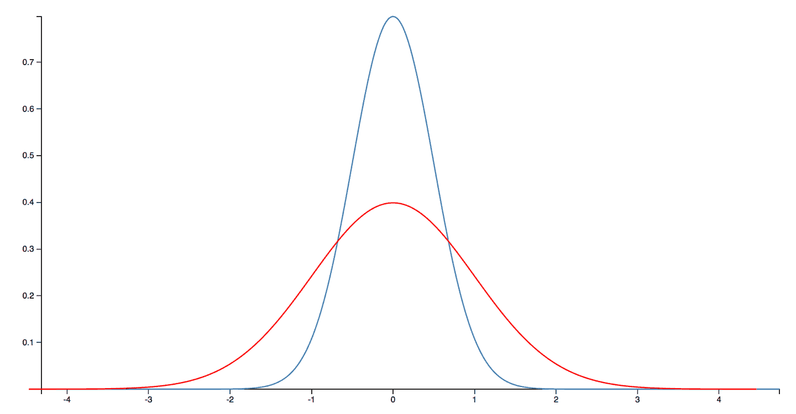

###### 图 2-2\. 高斯分布（又称正态分布或钟形曲线）

这种分布是当一个误差对观测值可能产生正面或负面贡献时的良好模型。然而，正如我们将在非正态统计部分中看到的那样，JVM 测量的情况稍微复杂一些。

### 系统误差

举例说明系统误差，考虑针对一组后端 Java Web 服务运行的性能测试，这些服务发送和接收 JSON。当直接使用应用程序前端进行负载测试存在问题时，这种类型的测试非常常见。

图 2-3 由 Apache JMeter 负载生成工具生成。图中实际上有两种系统效应。首先是顶部线路（异常服务）中观察到的线性模式，代表某些有限服务器资源的慢耗尽。


###### 图 2-3\. 系统误差

这种模式通常与内存泄漏或在请求处理期间由线程使用但未释放的其他资源相关，并且可能需要调查——看起来可能是一个真正的问题。

###### 注意

需要进一步分析以确认受影响的资源类型；我们不能简单地得出这是内存泄漏的结论。

应该注意到的第二个效应是大多数其他服务在约 180 毫秒水平上的一致性。这是值得怀疑的，因为服务在响应请求时做的工作量差异很大。那么为什么结果如此一致呢？

答案是，虽然测试中的服务位于伦敦，但这次负载测试是从印度孟买进行的。观察到的响应时间包括从孟买到伦敦的不可避免的往返网络延迟。这个范围是 120-150 毫秒，因此占据了除异常值之外服务的绝大部分观察时间。

这种大规模的系统效应淹没了实际响应时间的差异（因为服务实际上的响应时间远远小于 120 毫秒）。这是一个例子，说明了一个系统误差，并不代表我们的应用存在问题。

相反，这个错误源于我们的测试设置存在问题，因此好消息是当从伦敦重新运行测试时，这个人为因素完全消失了（如预期的那样）。

结束本节时，让我们快速看一下经常伴随系统误差出现的一个臭名昭著的问题——虚假相关性。

### 虚假相关性

统计学中关于“相关性不意味着因果关系”的最著名的格言之一是“相关性不意味着因果关系”——也就是说，只因为两个变量表现出类似的行为并不意味着它们之间存在根本联系。

在最极端的例子中，如果从业者足够努力地寻找，就可以发现[完全不相关的测量结果](http://tylervigen.com/spurious-correlations)之间存在关联。例如，在图 2-4 中，我们可以看到美国的鸡肉消费与原油总进口存在很好的相关性。^(4)

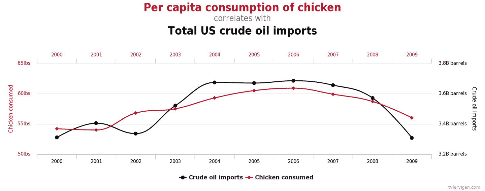

###### 图 2-4。一个完全虚假的相关性（Vigen）

这些数字显然没有因果关系；没有任何因素同时推动原油进口和鸡肉食用。然而，从业者需要警惕的不是荒谬和可笑的相关性。

在图 2-5 中，我们看到视频游戏机所产生的收入与授予的计算机科学博士学位的数量相关。可以想象一项社会学研究声称这些可观察到的变量之间存在联系，也许会认为“压力山大的博士生通过几个小时的视频游戏来放松”。尽管事实上并不存在这样的共同因素，但这类主张却是令人沮丧地常见的。

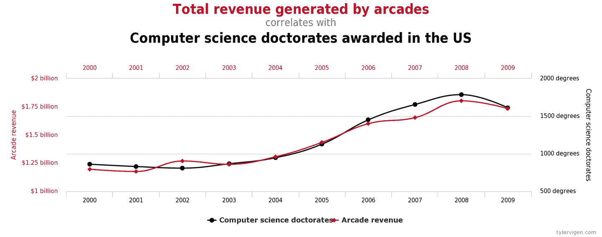

###### 图 2-5\. 一个不那么虚假的相关性？（维根）

在 JVM 和性能分析领域，我们需要特别小心，不要仅仅基于相关性就断定因果关系“看起来合理”。

> 第一原则是你不能欺骗自己——你是最容易被自己欺骗的人。^(5)
> 
> 理查德·费曼

我们已经见过一些错误来源的例子，并提到了虚假相关性和自欺欺人的陷阱，所以现在让我们继续讨论一下 JVM 性能测量的一个方面，这需要特别注意细节。

## 非正态统计

基于正态分布的统计学并不需要太多数学复杂性。因此，通常在高中或大学本科阶段教授的统计学标准方法，重点放在正态分布数据的分析上。

学生们被教导计算均值和标准差（或方差），有时还包括更高阶的矩，如偏度和峰度。然而，这些技术有一个严重的缺陷，即如果分布中有一些偏离较远的点，结果很容易变得扭曲。

###### 注

在 Java 性能中，异常值代表了慢速交易和不满意的客户。我们需要特别注意这些点，并避免那些削弱异常值重要性的技术。

从另一个角度考虑：除非已有大量客户在投诉，否则改善平均响应时间可能并不是一个有用的性能目标。当然，这样做会改善每个人的体验，但往往只有少数不满的客户才是延迟调优的原因。这意味着异常事件可能比那些接受满意服务的大多数人更值得关注。

在图 Figure 2-6 中，我们可以看到方法（或事务）时间可能分布的更真实的曲线。显然，这不是一个正态分布。

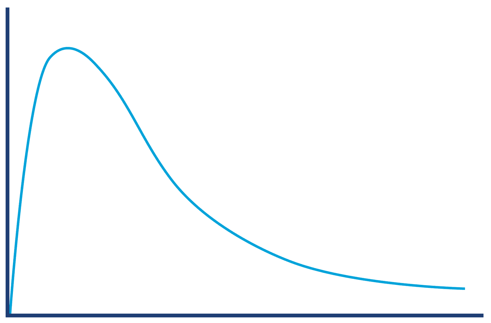

###### 图 2-6\. 更真实地展示了交易时间分布的视角

在图 Figure 2-6 中显示的分布形状，直观上展示了我们对 JVM 的认知：它具有“热路径”，所有相关代码已经 JIT 编译，没有 GC 周期等。这代表了一个最佳情况（尽管是常见情况）；因此，没有因随机效应而“稍微快一些”的调用。

这违反了高斯统计的基本假设，并迫使我们考虑非正态分布的情况。

###### 注

对于非正态分布的情况，许多正态分布统计的“基本规则”都被违反了。特别是，标准差/方差以及其他更高阶的矩基本上是无用的。

处理 JVM 生成的非正常“长尾”分布非常有用的一种技术是使用百分位数的修改方案。请记住，分布是一整套点的集合——数据的形状，并且不适合用单个数字来代表。

我们可以使用百分位数的采样，而不是仅仅计算平均值，后者试图用单一结果来表达整个分布。当用于正态分布数据时，通常会在固定间隔内进行采样。然而，通过小幅调整，该技术可以更有效地用于 JVM 统计数据。

修改的方法是使用从平均值开始的采样，然后是第 90 百分位数，然后按对数方式向外移动，如下所示的方法定时结果。这意味着我们按照更符合数据形状的模式进行采样：

```java
50.0% level was 23 ns
90.0% level was 30 ns
99.0% level was 43 ns
99.9% level was 164 ns
99.99% level was 248 ns
99.999% level was 3,458 ns
99.9999% level was 17,463 ns
```

样本告诉我们，虽然平均执行获取器方法的时间为 23 ns，但每 1,000 次请求中有一次的时间比平均值差一个数量级，而每 1,000,000 次请求中有一次的时间比平均值差*两个*数量级。

长尾分布也可以称为*高动态范围*分布。可观察量的动态范围通常定义为最大记录值除以最小记录值（假设非零）。

对数百分位数是理解长尾的一种有用的简单工具。然而，对于更复杂的分析，我们可以使用处理高动态范围数据集的公共领域库。该库称为 HdrHistogram，可以从[Github 上获取](https://github.com/HdrHistogram/HdrHistogram)。最初由 Gil Tene（Azul Systems）创建，Mike Barker 和其他贡献者进行了额外工作。

###### 注意

直方图是通过使用有限的一组范围（称为*桶*）来总结数据，并显示数据落入每个桶的频率的一种方法。

HdrHistogram 也可以在 Maven 中心获取。在撰写本文时，当前版本为 2.1.12，您可以通过将此依赖项段添加到*pom.xml*来将其添加到您的项目中：

```java
<dependency>
    <groupId>org.hdrhistogram</groupId>
    <artifactId>HdrHistogram</artifactId>
    <version>2.1.12</version>
</dependency>
```

让我们看一个使用 HdrHistogram 的简单例子。此示例接受数字文件并计算连续结果之间的 HdrHistogram：

```java
public class BenchmarkWithHdrHistogram {
    private static final long NORMALIZER = 1_000_000;

    private static final Histogram HISTOGRAM
            = new Histogram(TimeUnit.MINUTES.toMicros(1), 2);

    public static void main(String[] args) throws Exception {
        final List<String> values = Files.readAllLines(Paths.get(args[0]));
        double last = 0;
        for (final String tVal : values) {
            double parsed = Double.parseDouble(tVal);
            double gcInterval = parsed - last;
            last = parsed;
            HISTOGRAM.recordValue((long)(gcInterval * NORMALIZER));
        }
        HISTOGRAM.outputPercentileDistribution(System.out, 1000.0);
    }
}
```

输出显示了连续垃圾收集之间的时间间隔。正如我们将在第四章和第五章看到的那样，GC 并不是以固定的间隔发生的，理解它发生频率的分布可能会很有用。以下是直方图绘制器为示例 GC 日志生成的内容：

```java
       Value     Percentile TotalCount 1/(1-Percentile)

       14.02 0.000000000000          1           1.00
     1245.18 0.100000000000         37           1.11
     1949.70 0.200000000000         82           1.25
     1966.08 0.300000000000        126           1.43
     1982.46 0.400000000000        157           1.67

...

    28180.48 0.996484375000        368         284.44
    28180.48 0.996875000000        368         320.00
    28180.48 0.997265625000        368         365.71
    36438.02 0.997656250000        369         426.67
    36438.02 1.000000000000        369
#[Mean    =      2715.12, StdDeviation   =      2875.87]
#[Max     =     36438.02, Total count    =          369]
#[Buckets =           19, SubBuckets     =          256]
```

格式化程序的原始输出相当难以分析，但幸运的是，HdrHistogram 项目包含一个[在线格式化程序](http://hdrhistogram.github.io/HdrHistogram/plotFiles.xhtml)，可用于从原始输出生成可视化直方图。

例如，对于此示例，它生成类似于图 2-7 所示的输出。

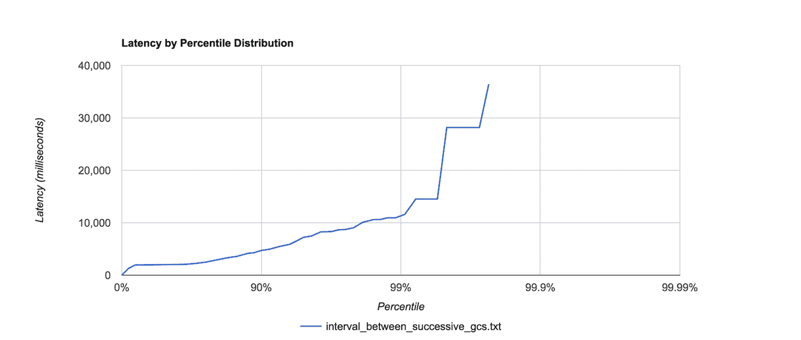

###### 图 2-7\. 示例 HdrHistogram 可视化

对于许多我们希望在 Java 性能调优中测量的可观测量，统计数据通常是高度非正态的，而 HdrHistogram 可以是帮助理解和可视化数据形状的非常有用的工具。

# 统计解释

经验数据和观察结果并不孤立存在，从我们测量应用程序获得的结果来看，最困难的工作之一往往在于解释这些结果。

> 无论问题是什么，它始终是一个人的问题。
> 
> 杰拉尔德·温伯格（署名）

在图 2-8 中，我们展示了一个真实 Java 应用程序的示例内存分配速率。此示例适用于性能良好的应用程序。

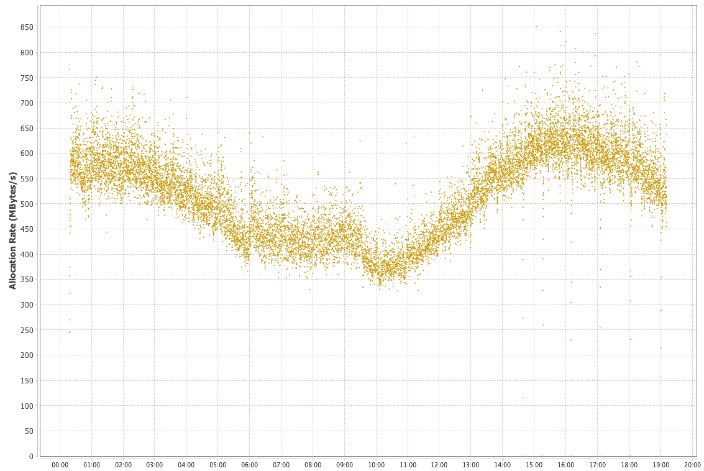

###### 图 2-8\. 示例分配速率

分配数据的解释相对直观，因为存在明显的信号。在覆盖的时间段内（接近一天），分配速率基本稳定在每秒 350 到 700 MB 之间。大约在 JVM 启动后的 5 小时左右开始出现下降趋势，并在 9 到 10 小时之间达到明显的最低点，之后分配速率开始再次上升。

这类可观测量的趋势非常普遍，因为分配速率通常会反映应用程序实际执行的工作量，而这将根据一天中的时间段而大幅变化。然而，当我们解释真实的可观测量时，情况可能会迅速变得更加复杂。

这可能导致所谓的“帽子/大象”问题，源自《小王子》中安东尼·德·圣-埃克苏佩里的一段文字。在这本书中，叙述者描述自己六岁时画了一幅吞食大象的蟒蛇的图画。然而，由于视角是外部的，这幅画在故事中成人们无知的眼中只是一个略显无形的帽子。

这个隐喻作为对读者的告诫，要有想象力，要更深入地思考你所看到的东西，而不是仅仅接受表面上的浅显解释。

应用于软件的问题可以通过图 2-9 来说明。最初我们只能看到一个复杂的 HTTP 请求-响应时间直方图。然而，就像书中的讲述者一样，如果我们能够多想象或分析一些，我们就会发现这个复杂的画面实际上是由几个相当简单的部分组成的。

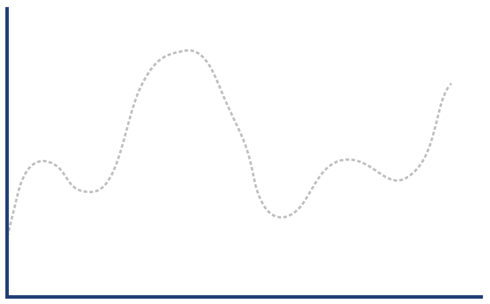

###### 图 2-9\. 帽子，或被蟒蛇吞食的大象？

解码响应直方图的关键在于意识到“Web 应用程序响应”是一个非常一般的类别，包括成功的请求（所谓的 2xx 响应）、客户端错误（4xx，包括臭名昭著的 404 错误）和服务器错误（5xx，尤其是 500 服务器内部错误）。

每种类型的响应时间分布特征各不相同。如果客户端请求一个没有映射的 URL（即 404），那么 Web 服务器可以立即回复一个响应。这意味着仅客户端错误响应的直方图看起来更像是图 2-10。

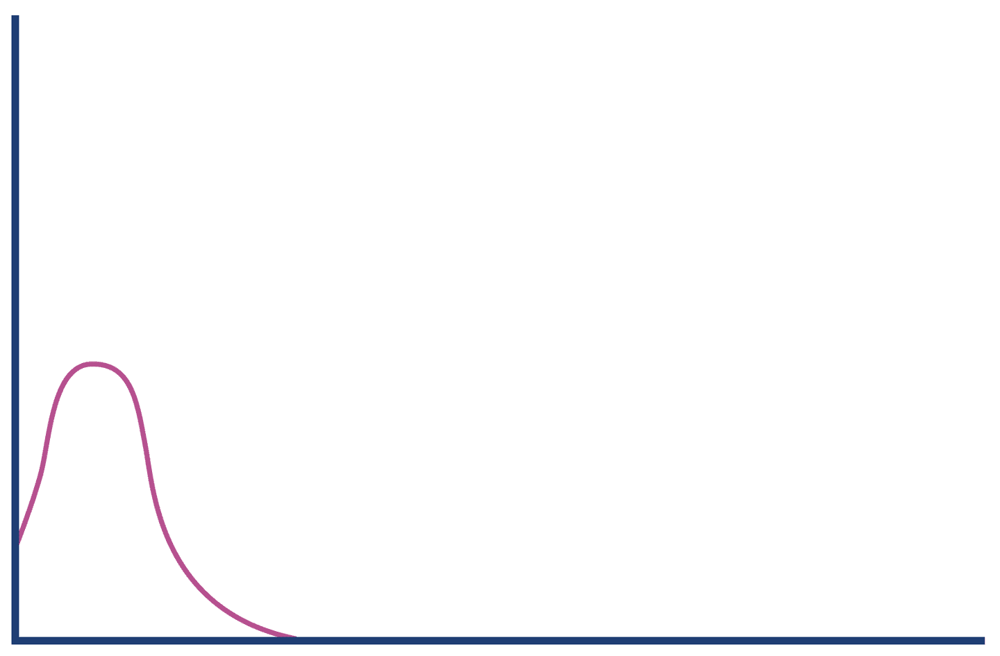

###### 图 2-10\. 客户端错误

相比之下，服务器错误通常发生在大量处理时间消耗后（例如，由于后端资源压力或超时），因此服务器错误响应的直方图可能看起来像图 2-11。

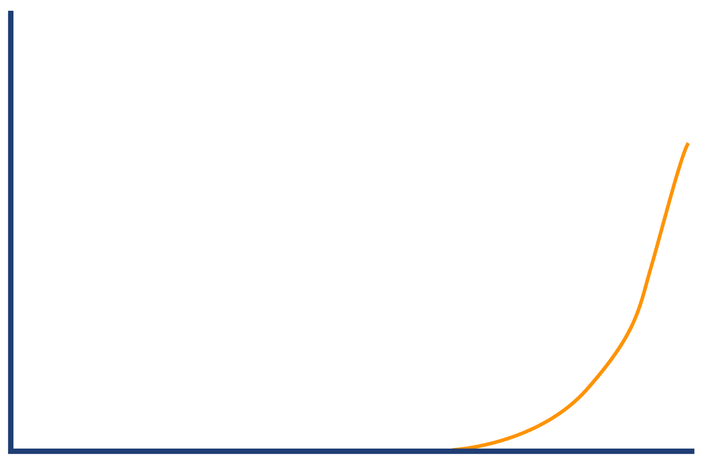

###### 图 2-11\. 服务器错误

成功的请求将具有长尾分布，但实际上我们可能预期响应分布是“多模态”的，并且具有几个局部最大值。例如，图 2-12 中显示的例子，代表了应用程序可能存在两条常见执行路径，其响应时间完全不同的可能性。

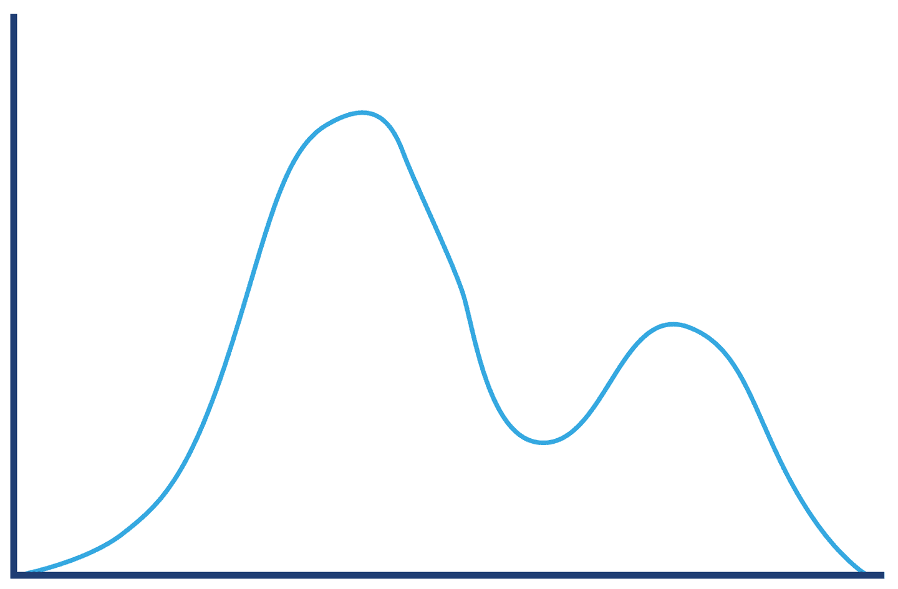

###### 图 2-12\. 成功请求

将这些不同类型的响应合并到单个图表中，结果如图 2-13 所示的结构。我们已经从分开的直方图中重新推导出了我们最初的“帽子”形状。

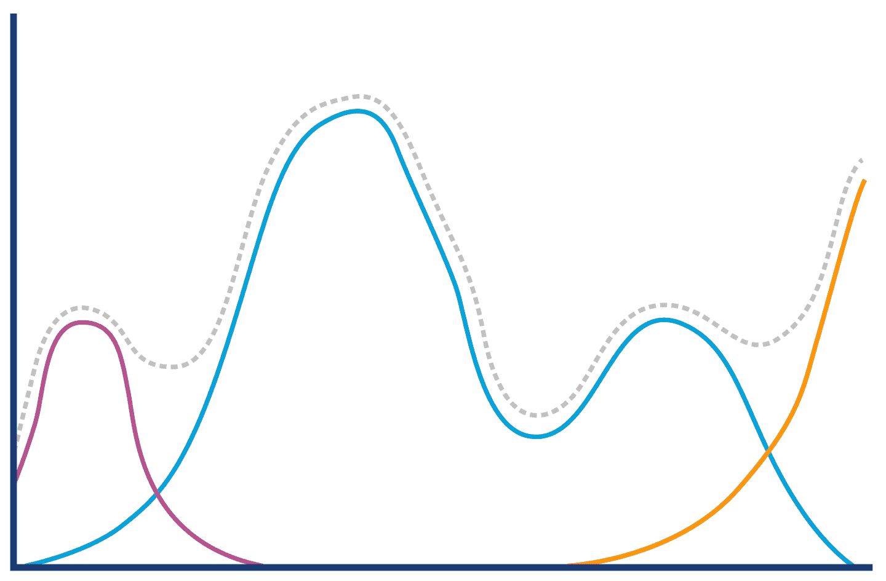

###### 图 2-13\. 帽子或大象再访

将一个普通的可观察现象分解成更有意义的子群体的概念非常有用。这表明在我们试图从结果推断结论之前，我们需要确保充分理解我们的数据和领域。例如，成功的请求可能在主要是读取的请求和更新或上传的请求之间具有非常不同的分布。

PayPal 的工程团队已经广泛地写了关于他们使用统计和分析的内容；[他们有一个博客](https://www.paypal-engineering.com/)，其中包含了很多优秀的资源。特别是 Mahmoud Hashemi 的文章[“软件统计”](https://medium.com/paypal-tech/statistics-for-software-e395ca08005d/)，是对他们方法论的很好介绍，并包含了前面讨论过的帽子/大象问题的版本。

还值得一提的是“数据龙头十二” ——一组具有相同基本统计特征但外观迥异的数据集。^(6)

# 认知偏差与性能测试

人类在迅速形成准确观点方面可能表现不佳——即使面对可以借鉴过去经验和类似情况的问题。

认知偏差是一种心理效应，导致人类大脑得出错误的结论。这种情况尤为棘手，因为表现出此类偏差的人通常并不自知，并可能认为自己的行为是理性的。

我们观察到的许多性能分析反模式（例如附录 B 中的反模式，您可能希望与本节一起阅读）的原因，全部或部分是由于一个或多个认知偏见造成的，这些偏见又基于无意识的假设。

例如，对于*Blame Donkey*反模式，如果某个组件导致了几次最近的故障，团队可能会倾向于期望同一组件导致任何新的性能问题。分析的任何数据，如果确认了 Blame Donkey 组件负责，可能更容易被视为可信。

该反模式结合了被称为确认偏见和最近性偏见的偏见的方面（即倾向于认为最近发生的事情将继续发生）。

###### 注

在 Java 中，一个单一组件在运行时优化的方式可能会导致在不同应用程序中表现不同。为了消除任何已有的偏见，重要的是要整体看待应用程序。

偏见可以相互补充或对立。例如，一些开发人员可能倾向于假设问题根本不是与软件相关，而是软件运行的基础设施；这在*Works for Me*反模式中很常见，其特征是“在 UAT 中运行良好，所以问题一定是生产环境设备有问题。”反之则是假设每个问题都必须由软件引起，因为这是开发人员了解并直接影响的系统部分。

让我们来认识一些每个性能工程师都应该警惕的最常见偏见。

> 知道陷阱在哪里——这是规避它的第一步。^(7)
> 
> 杜克·莱托·亚特雷德一世

通过认识自己和他人中的这些偏见，我们增加了进行合理性能分析和解决系统问题的可能性。

## 简化思维

简化思维认知偏见基于一种分析方法，预设如果将系统分解得足够小，就可以通过理解其组成部分来理解它。理解每个部分意味着减少可能出现错误假设的机会。

这种观点的主要问题很容易解释——在复杂系统中，这并不成立。非平凡的软件（或物理）系统几乎总是展示出新兴行为，整体远大于其部分简单加总的表现。

## 确认偏见

当涉及性能测试或试图主观地查看应用程序时，确认偏见可能会导致重大问题。确认偏见通常是无意中引入的，当选择了不良的测试集或者测试结果没有以统计学上合理的方式进行分析时。确认偏见很难对抗，因为通常会涉及强烈的动机或情感因素（例如团队中的某人试图证明一个观点）。

考虑一个反模式，比如*Distracted by Shiny*，团队成员试图引入最新和最棒的 NoSQL 数据库。他们对不像生产数据的数据进行了一些测试，因为完整表示整个模式对于评估目的来说太复杂了。

他们很快证明了在测试集上，NoSQL 数据库在他们的本地机器上产生了优越的访问时间。开发者已经告诉大家这将会发生，并且在看到结果后，他们继续进行了全面实施。这里存在几种反模式，都导致了新的库堆栈中的未经验证的假设。

## 战争迷雾（行动偏向）

战争迷雾偏见通常在停机或系统表现不如预期并且团队处于压力下的情况下显现。一些常见的原因包括：

+   对系统运行的基础设施进行更改，可能没有通知或意识到会产生影响

+   更改系统依赖的库

+   一个奇怪的 bug 或竞争条件，表现出来，但只在繁忙的日子里

在一个良好维护的应用程序中，具有足够的日志记录和监控，这些应该会生成清晰的错误消息，将引导支持团队找到问题的原因。

然而，太多的应用程序没有测试失败场景，并且缺乏适当的日志记录。在这些情况下，即使是经验丰富的工程师也会陷入需要感觉正在解决停机问题并将运动误认为速度的陷阱中——“战争迷雾”降临。

此时，如果参与者对问题的处理方法不够系统化，本章讨论的许多人类因素可能会发挥作用。

例如，*Blame Donkey*这样的反模式可能会捷径一次全面的调查，并引导生产团队沿着特定的调查路径进行—通常会忽视更大的局面。类似地，团队可能会诱使将系统分解为其组成部分，并在低级别查看代码，而不先确定问题真正存在于哪个子系统中。

## 风险偏向

人类天生对风险保守且抗拒变化。主要是因为人们见过变化如何导致问题，因此他们试图避免这种风险。当然，当小心计算的风险可以推动产品发展时，这种风险规避可能非常令人沮丧。大部分这种风险规避来自于团队不愿意进行可能修改应用程序性能配置文件的更改。

通过拥有一套强大的单元测试和生产回归测试，我们可以显著减少这种风险偏好。性能回归测试是将系统非功能性需求纳入的好地方，并确保这些 NFR 所代表的关注点在回归测试中得到反映。

然而，如果团队对其中任何一方缺乏足够的信任，改变将变得极其困难，风险因素也无法控制。这种偏见通常表现为未能从应用程序问题（包括服务停机）中吸取教训并实施适当的缓解措施。

# 摘要

在评估性能结果时，必须以适当的方式处理数据，并避免陷入非科学和主观思维。这包括在不适当时避免依赖高斯模型的统计陷阱。

在本章中，我们遇到了一些不同类型的性能测试、测试最佳实践以及性能分析本地化的人类问题。

在下一章中，我们将继续介绍 JVM 的概述，介绍基本子系统，“经典” Java 应用程序的生命周期，以及首次了解监控和工具。

^(1) 这个术语由 William J. Brown、Raphael C. Malvo、Hays W. McCormick III 和 Thomas J. Malbray 的书《反模式：重构软件、架构和项目危机》（纽约：Wiley，1998 年）普及。

^(2) M. Walton，《丁宁管理方法》（Mercury Books，1989 年）

^(3) John H. McDonald，《生物统计手册》，第 3 版（马里兰州巴尔的摩：Sparky House Publishing，2014 年）。

^(4) 本节中的伪相关性来自 Tyler Vigen 的网站，并在此处根据 CC BY 4.0 许可证重新使用。如果您喜欢，可以从他的网站上获取更多有趣的例子。

^(5) R. Feynman 和 R. Leighton，《你一定在开玩笑，费曼先生》（W.W. Norton，1985 年）

^(6) J. Matejka 和 G. Fitzmaurice，“同样的统计数据，不同的图形：通过模拟退火生成外观各异但统计数据相同的数据集”，CHI 2017，美国丹佛（2017）

^(7) F. Herbert，《沙丘》（Chilton Books，1965 年）
