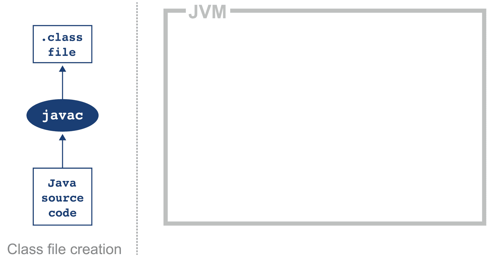
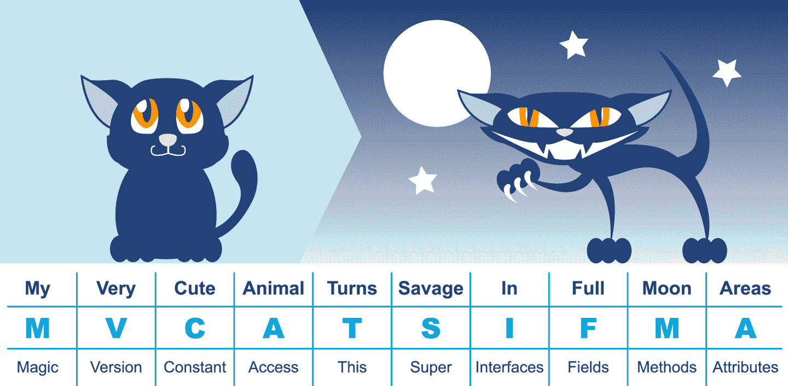
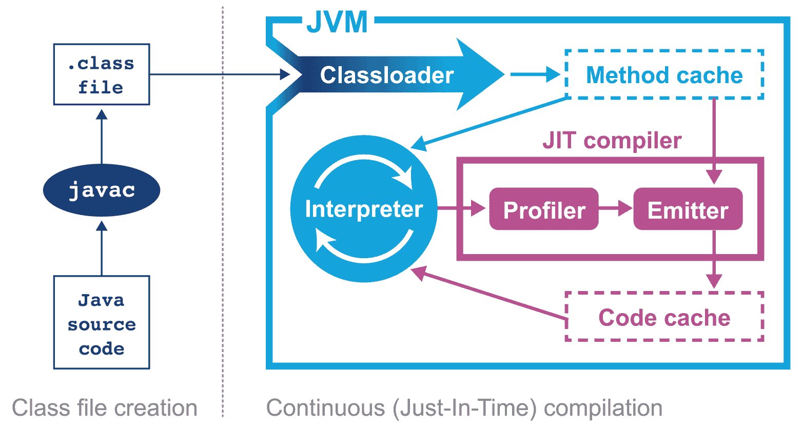
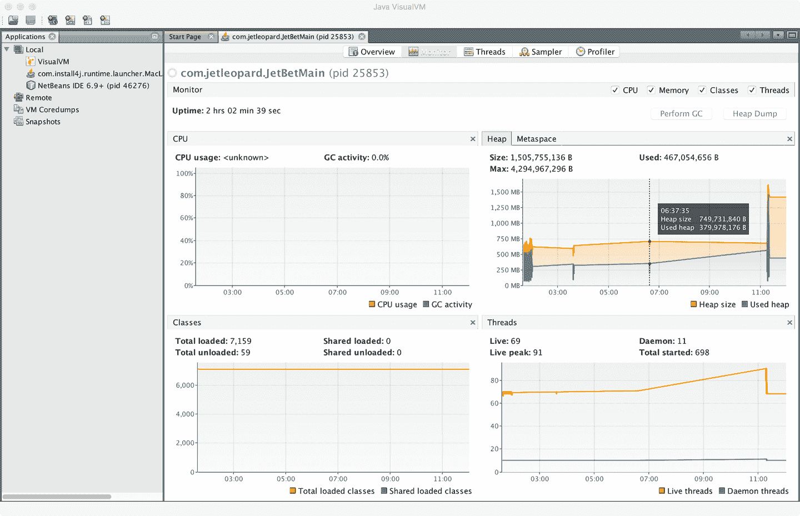

# 第三章。JVM 概述

毫无疑问，Java 是全球最大的技术平台之一——目前最佳估计是有超过 10 百万的开发者在使用 Java。

Java 系统的设计是*完全管理*的——像垃圾收集和执行优化等方面是由 JVM 代表开发者控制的。Java 专门面向主流开发者，加上完全管理的平台，导致许多开发者在日常工作中不需要了解平台的低级复杂性。因此，开发者可能并不经常接触到这些内部方面——只有在出现例如客户投诉性能问题的情况时才会涉及。

然而，对于对性能感兴趣的开发者来说，了解 JVM 技术栈的基础是非常重要的。理解 JVM 技术使开发者能够编写更好的软件，并提供了调查与性能相关问题所需的理论背景。

本章介绍了 JVM 如何执行 Java，为后面更深入地探讨这些主题提供了基础。特别是第六章对字节码进行了深入讨论，这与此处的讨论互补。

我们建议您先阅读本章，但在阅读完第六章后再回来复习一遍。

# 解释与类加载

根据定义 Java 虚拟机的规范（通常称为 VM 规范），JVM 是一个基于堆栈的解释机器。这意味着它不像物理硬件 CPU 那样有寄存器，而是使用部分结果的执行堆栈，并通过对堆栈顶部值（或值）进行操作来执行计算。

如果您对解释器的工作原理不熟悉，那么您可以将 JVM 解释器的基本行为想象为“`switch`在`while`循环内”。解释器独立处理程序的每个操作码，并使用评估堆栈来保存计算结果和中间结果。

###### 注意

当我们深入研究 Oracle/OpenJDK VM（HotSpot）的内部时，我们将看到真实的生产级 Java 解释器的情况更加复杂，但在此时使用堆栈解释器内部的“switch-inside-while”作为一个可接受的心理模型。

当我们使用`java HelloWorld`命令启动我们的应用程序时，操作系统会启动虚拟机进程（`java`二进制文件）。这设置了 Java 虚拟环境并初始化了实际执行`HelloWorld.class`文件中用户代码的解释器。

应用程序的入口点将是`HelloWorld.class`的`main()`方法。为了将控制权交给这个类，在执行之前必须由虚拟机加载它。

为此，使用了 Java 类加载机制。当初始化新的 Java 进程时，使用一系列类加载器。初始加载器称为引导类加载器（历史上也称为“原始类加载器”），它加载核心 Java 运行时中的类。引导类加载器的主要目的是加载一组最小的类（其中包括`java.lang.Object`、`Class`和`Classloader`等必需品），以允许其他类加载器启动系统的其余部分。

此时讨论 Java 模块系统（有时称为 JPMS）如何在某种程度上改变了应用程序启动的情况也是有益的。从 Java 9 开始，所有 JVM 都是模块化的—​不存在恢复 Java 8 单片式 JVM 运行时的“兼容性”或“经典”模式。

这意味着在启动期间始终构建模块图，即使应用本身是非模块化的。这必须是有向无环图（DAG），如果应用程序的模块元数据试图构建包含循环的模块图，则这将是致命错误。

模块图具有各种优势，包括：

+   只加载所需的模块

+   可以在启动时确认模块间元数据是否良好

模块图具有一个主模块，其中包含入口类。如果应用程序尚未完全模块化，则将同时具有模块路径和类路径，而应用程序代码可能位于`UNNAMED`模块中。

###### 注意

本书不涉及模块系统的详细信息。可以在[*Java in a Nutshell (8th Edition)*](https://www.oreilly.com/library/view/java-in-a/9781098130992/)（O’Reilly 出版）由 Benjamin J. Evans、Jason Clark 和 David Flanagan 或更深入的参考资料，如[*Java 9 Modularity*](https://www.oreilly.com/library/view/java-9-modularity/9781491954157/)（O’Reilly 出版）由 Sander Mak 和 Paul Bakker 找到扩展的处理方法。

实际上，引导类加载器的工作涉及加载`java.base`和一些其他支持模块（包括一些可能令人惊讶的条目，如`java.security.sasl`和`java.datatransfer`）

Java 将类加载器视为其运行时和类型系统中的对象，因此需要一种方式来将一组初始类带入存在。否则，定义类加载器将存在循环问题。

引导类加载器不验证其加载的类（主要是为了提高启动性能），并且依赖于引导类路径的安全性。由引导类加载的任何内容都被授予完全的安全权限，因此这组模块被尽可能保持限制。

###### 注意

Java 的旧版本，包括 8 及之前版本，使用了单片式运行时，引导类加载器加载了`rt.jar`的内容。

剩余的基础系统（即在版本 8 及更早版本中使用的旧 `rt.jar` 的相当部分）由 *平台类加载器* 加载，并可通过方法 `ClassLoader::getPlatformClassLoader` 访问。它的父加载器是引导类加载器，因为旧的扩展类加载器已被移除。

在新的 Java 模块化实现中，启动 Java 进程所需的代码大大减少，因此，尽可能多的 JDK 代码（现在表示为模块）已移出引导加载器的范围，并移到了平台加载器中。

最后，创建了应用程序类加载器；它负责从定义的类路径中加载用户类。不幸的是，有些文本将其称为“系统”类加载器。出于简单的原因，应避免使用这个术语，因为它并不加载系统类（引导类加载器和平台类加载器会这么做）。应用程序类加载器非常常见，并且它的父加载器是平台加载器。

Java 在程序执行过程中首次遇到新类时会加载其依赖项。如果类加载器无法找到类，则通常会将查找委托给父加载器。如果查找链达到引导类加载器并且未找到，则会抛出 `ClassNotFoundException`。开发人员使用与将在生产中使用的完全相同的类路径进行有效编译是非常重要的，因为这有助于减轻这种潜在问题。

通常情况下，Java 只会加载一个类一次，并创建一个 `Class` 对象来代表运行时环境中的类。然而，重要的是要意识到，在某些情况下，同一个类可以被不同的类加载器加载两次。因此，系统中的类由加载它的类加载器以及完全限定的类名（包括包名）来标识。

###### 注意

在某些执行环境中，比如应用服务器（例如 Tomcat 或 JBoss EAP），当服务器中存在多个租户应用时会显示此行为。

还有一些工具（例如 Java 代理）可以作为字节码织入的一部分重新加载和重转换类——这些工具通常用于监控和可观察性。

# 执行字节码

很重要的是要理解，Java 源代码在执行之前经历了大量的转换过程。首先是使用 Java 编译器 `javac` 进行的编译步骤，通常作为更大构建过程的一部分而调用。

`javac` 的工作是将 Java 代码转换为包含字节码的 *.class* 文件。它通过对 Java 源代码进行相当直接的翻译来实现这一点，如 图 3-1 所示。`javac` 在编译过程中几乎没有进行任何优化，生成的字节码在使用反汇编工具（例如标准的 `javap`）查看时仍然非常清晰和可识别为 Java 代码。



###### 图 3-1\. Java 类文件编译

字节码是一种中间表示，与特定的机器架构无关。与机器架构解耦提供了可移植性，意味着已经开发（或编译）的软件可以在 JVM 支持的任何平台上运行，并且提供了对 Java 语言的抽象。这为我们对 JVM 执行代码的方式提供了第一个重要的见解。

###### 注意

Java 语言和 Java 虚拟机现在在一定程度上是独立的，因此 JVM 中的 J 可能有点误导性，因为 JVM 可以执行任何可以生成有效类文件的 JVM 语言。实际上，图 3-1 可以很容易地展示 Kotlin 编译器 `kotlinc` 生成的字节码用于在 JVM 上执行。

无论使用哪个源代码编译器，生成的类文件都具有由 VM 规范明确定义的非常清晰的结构。任何由 JVM 加载的类在允许运行之前都将被验证为符合预期格式。

表 3-1\. 类文件的解剖

| 组件 | 描述 |
| --- | --- |
| 魔数 | `0xCAFEBABE` |
| 类文件格式的版本 | 类文件的次要和主要版本 |
| 常量池 | 类的常量池 |
| 访问标志 | 类是否为抽象的、静态的等等 |
| 这个类 | 当前类的名称 |
| 超类 | 超类的名称 |
| 接口 | 类中的任何接口 |
| 字段 | 类中的任何字段 |
| 方法 | 类中的任何方法 |
| 属性 | 类的任何属性（例如，源文件的名称等） |

每个类文件以魔数 `0xCAFEBABE` 开头，这是 16 进制中的前 4 个字节，用于表示符合类文件格式。接下来的 4 个字节表示用于编译类文件的次要版本和主要版本，这些版本会被检查以确保 JVM 的版本不低于用于编译类文件的版本。类加载器会检查次要和主要版本以确保兼容性；如果不兼容，则会在运行时抛出 `UnsupportedClassVersionError`，表示运行时低于编译的类文件版本。

###### 注意

魔数为 Unix 环境提供了一种识别文件类型的方式（而 Windows 通常会使用文件扩展名）。因此，一旦确定，它们很难更改。不幸的是，这意味着 Java 在可预见的将来将继续使用相当尴尬和性别歧视的`0xCAFEBABE`，尽管 Java 9 引入了魔数`0xCAFEDADA`用于模块文件。

常量池在代码中保存常量值：例如，类、接口和字段的名称。当 JVM 执行代码时，常量池表用于引用值，而不必依赖于运行时内存结构的精确布局。

访问标志用于确定应用于类的修饰符。标志块的第一部分标识一般属性，例如一个类是否为公共的，接着是是否为 final，因此不能被子类化。标志还确定类文件是否表示一个接口或抽象类。标志块的最后部分指示类文件是否表示合成类（不在源代码中出现）、注解类型或枚举。

`this`类、超类和接口条目是索引到常量池的，用于标识属于类的类型层次结构。字段和方法定义了类似签名的结构，包括应用于字段或方法的修饰符。然后使用一组属性来表示更复杂和非固定大小结构的结构化项目。例如，方法使用`Code`属性来表示与该特定方法相关的字节码。

图 3-2 提供了一个记忆结构的助记符。



###### 图 3-2\. 类文件结构的助记符

在这个非常简单的代码示例中，可以观察运行`javac`的效果：

```java
public class HelloWorld {
    public static void main(String[] args) {
        for (int i = 0; i < 10; i++) {
            System.out.println("Hello World");
        }
    }
}
```

Java 附带了一个名为`javap`的类文件反汇编器，允许检查*.class*文件。取出*HelloWorld*类文件并运行`javap -c HelloWorld`，将得到以下输出：

```java
public class HelloWorld {
  public HelloWorld();
    Code:
       0: aload_0
       1: invokespecial #1    // Method java/lang/Object."<init>":()V
       4: return

  public static void main(java.lang.String[]);
    Code:
       0: iconst_0
       1: istore_1
       2: iload_1
       3: bipush        10
       5: if_icmpge     22
       8: getstatic     #2    // Field java/lang/System.out ...
      11: ldc           #3    // String Hello World
      13: invokevirtual #4    // Method java/io/PrintStream.println ...
      16: iinc          1, 1
      19: goto          2
      22: return
}
```

这个布局描述了文件*HelloWorld.class*的字节码。更详细的信息，`javap`还有一个`-v`选项，提供完整的类文件头信息和常量池详情。类文件包含两个方法，虽然源文件只提供了一个`main()`方法；这是`javac`自动向类中添加默认构造函数的结果。

构造函数中执行的第一条指令是`aload_0`，它将`this`引用放置在堆栈的第一个位置上。然后调用`invokespecial`命令，它调用具有特定处理调用超级构造函数和创建对象的实例方法。在默认构造函数中，调用与`Object`的默认构造函数匹配，因为未提供重写。

###### 注意

[JVM 中的操作码](https://en.wikipedia.org/wiki/List_of_Java_bytecode_instructions)简洁且表示类型、操作以及本地变量、常量池和堆栈之间的交互。

继续到`main()`方法，`iconst_0`将整数常量`0`推送到评估堆栈。`istore_1`将此常量值存储到偏移量 1 处的本地变量（在循环中表示为`i`）。本地变量偏移从 0 开始，但对于实例方法，第 0 个条目始终是`this`。然后再次将偏移量 1 处的变量加载回堆栈，并且使用`if_icmpge`推送常量`10`进行比较（“如果整数比较大或等于”）。只有当前整数 >= 10 时测试才会成功。

在前 10 次迭代中，此比较测试失败，因此我们继续到指令 8。在这里，来自`System.out`的静态方法被解析，随后从常量池加载“Hello World”字符串。接下来的`invokevirtual`调用基于类调用实例方法。然后对整数进行递增并且通过`goto`调用回到指令 2 继续循环。

此过程将持续直到`if_icmpge`比较最终成功（当循环变量 >= 10 时）；在循环的这一次迭代中，控制传递到指令 22 并且方法返回。

# 引入 HotSpot

1999 年 4 月，Sun 公司推出了对主导的 Java 实现最大的一次性性能改进。HotSpot 虚拟机是一个关键功能，经过演变使得性能可以与诸如 C 和 C++等语言相媲美（见图 3-3）。要解释这种可能性，让我们深入探讨一下设计用于应用程序开发的语言。



###### 图 3-3\. HotSpot JVM

语言和平台设计通常涉及在所需功能之间进行决策和权衡。在这种情况下，分歧在于“接近底层”的语言和依赖于“零成本抽象”等思想，以及支持开发者生产力和“完成任务”的语言，而不是严格的低级控制。

> 总体而言，C++实现遵循零开销原则：你不用的部分不需要付出代价。而且进一步说，你使用的部分，你手工编码也不会更好。¹
> 
> Bjarne Stroustrup

零开销原则在理论上听起来很棒，但它要求语言的所有用户处理操作系统和计算机实际工作的低级现实。这是一个额外的重大认知负担，可能不是开发者的主要目标关注的原始性能。

不仅如此，它还需要在构建时将源代码编译为特定于平台的机器代码—通常称为*提前*（AOT）编译。这是因为替代执行模型，如解释器、虚拟机和可移植性层，都绝对不是零开销。

短语“你使用的东西，你无法手动编写得更好”也有一个讽刺的意味。它意味着许多事情，但对我们来说最重要的是开发人员无法比自动系统（如编译器）生成更好的代码。

Java 从来没有订阅零开销抽象理念。相反，HotSpot 虚拟机采取的方法是分析程序的运行时行为，并在最有利于性能的地方智能应用优化。HotSpot VM 的目标是让您编写惯用的 Java 并遵循良好的设计原则，而不是扭曲您的程序以适应 VM。

## 介绍即时编译

Java 程序在字节码解释器中开始执行，在那里指令在虚拟堆栈机上执行。这种对 CPU 的抽象提供了类文件可移植性的好处，但要获得最佳性能，你的程序必须充分利用其本地特性。

HotSpot 通过将您程序的单元从解释的字节码编译成本地代码来实现这一点，然后直接执行，而不需要解释器的抽象开销。HotSpot VM 中的编译单元是方法和循环。这就是所谓的*即时*（JIT）编译。

JIT 编译通过在解释模式下监视应用程序并观察最频繁执行的代码部分来工作。在这个分析过程中，捕获了程序跟踪信息，这允许进行更复杂的优化。一旦特定方法的执行超过阈值，分析器将尝试编译和优化该代码段。

即时（JIT）编译方法有许多优点，但其中一个主要优点是它基于在方法被解释时收集的跟踪信息来制定编译器优化决策。这些信息使得 HotSpot 可以在方法有资格进行编译时进行更加明智的优化。

###### 注意

一些 JIT 编译器还具有在执行过程中更好的优化变得明显时重新 JIT 的能力。这包括一些 HotSpot 的编译器。

HotSpot 不仅如此，还有数百年（甚至更多）的工程开发归功于它，并且几乎每次新发布都会添加新的优化和好处。这意味着所有的 Java 应用都能从 VM 中最新的 HotSpot 性能优化中受益，甚至无需重新编译。

###### 提示

将 Java 源代码转换为字节码后，经过（JIT）编译的代码实际上与原始编写的源代码有很大的变化。这是一个关键的见解，它将驱动我们处理与性能相关的调查方法。

一般情况是，像 C++（以及崭露头角的 Rust）这样的语言倾向于具有更可预测的性能，但以迫使用户承担大量低级复杂性为代价。

还要注意，“更可预测”并不一定意味着“更好”。AOT 编译器生成的代码可能需要在广泛的处理器类上运行，并且通常不能假定特定处理器功能可用。

使用基于配置文件的优化（PGO）的环境，如 Java，有可能利用运行时信息，这对大多数 AOT 平台来说是不可能的。这可以提升性能，如动态内联和优化掉虚拟调用。HotSpot 甚至可以在 VM 启动时检测正在运行的精确 CPU 类型，并且可以利用此信息启用针对特定处理器功能设计的优化。

###### 提示

检测精确处理器能力的技术称为*JVM 内置功能*，不要与由`synchronized`关键字引入的内置锁混淆。

PGO 和 JIT 编译的全面讨论可参见第 6 和第十章。

HotSpot 采取的复杂方法对大多数普通开发者是一个巨大的好处，但这种权衡（放弃零开销抽象）意味着在高性能 Java 应用的特定情况下，开发者必须非常小心，避免“常识”推理和过于简单化的 Java 应用实际执行模型。

###### 注意

再次强调，分析小段 Java 代码的性能（*微基准测试*）通常比分析整个应用程序更加困难，这是大多数开发者不应该承担的非常专业化的任务。

HotSpot 的编译子系统是虚拟机提供的两个最重要的子系统之一。另一个是自动内存管理，自 Java 早期以来一直是其主要卖点之一。

# JVM 内存管理

在像 C、C++ 和 Objective-C 这样的语言中，程序员负责管理内存的分配和释放。自行管理内存和对象生命周期的好处是更确定的性能和将资源生命周期与对象的创建和删除绑定的能力。然而，这些好处是以巨大的成本为代价的——为了正确性，开发者必须能够准确地考虑内存。

不幸的是，几十年的实际经验表明，许多开发人员对内存管理的习惯用法和模式理解不足。后来的 C++和 Objective-C 版本通过在标准库中使用智能指针习惯改进了这一点。然而，在 Java 被创造时，糟糕的内存管理是应用程序错误的主要原因之一。这引起了开发人员和管理人员对处理语言特性而非为业务提供价值所花费的时间量的关注。

Java 通过引入自动管理堆内存的方式（称为*垃圾回收*（GC））来帮助解决这个问题。简而言之，垃圾回收是一种非确定性过程，当 JVM 需要更多内存进行分配时触发，以恢复和重用不再需要的内存。

GC 是有代价的：当它运行时，传统上会*停止整个世界*，这意味着应用程序会暂停。通常这些暂停时间非常短暂，但当应用程序面临压力时，这些时间可能会增加。

话虽如此，JVM 的垃圾回收是业界最佳的，远比计算机科学本科课程中常教授的初级算法要复杂得多。例如，在现代算法中，停止整个世界的必要性和侵入性大大降低，后面我们将会看到。

垃圾回收是 Java 性能优化中的一个重要主题，因此我们将在第四章和第五章详细讨论 Java GC 的细节。

# 线程和 Java 内存模型

Java 的第一个版本带来的一项主要进步是对多线程编程的内置支持。Java 平台允许开发人员创建新的执行线程。例如，在 Java 8 语法中：

```java
Thread t = new Thread(() -> {System.out.println("Hello World!");});
t.start();
```

不仅如此，基本上所有生产环境中的 JVM 都是多线程的—​这意味着所有 Java 程序本质上都是多线程的，因为它们作为 JVM 进程的一部分执行。

这一事实增加了 Java 程序行为的额外、不可简化的复杂性，并使性能分析师的工作更加困难。然而，它允许 JVM 利用所有可用的核心，为 Java 开发人员提供各种性能优势。

Java 对线程的概念（“应用程序线程”）与操作系统对线程的视图（“平台线程”）之间有着稍微有趣的历史。在平台的最早时期，对这两个概念有着明显的区分，并且应用程序线程会被*重新映射*或*多路复用*到一组平台线程中—​例如在 Solaris 的*M:N*或 Linux 的*green threads*模型中。

然而，这种方法被证明无法提供可接受的性能特性，并增加了不必要的复杂性。因此，在大多数主流 JVM 实现中，这种模型被更简单的模型所取代—​每个 Java 应用程序线程精确对应于一个专用的平台线程。

然而，这并不是故事的终点。

自从“应用线程 == 平台线程”转变以来的 20 多年间，应用程序已经大规模增长和扩展 —— 线程（或者更普遍地说，*执行上下文*）的数量也随之增加。这导致了“线程瓶颈”问题的出现，解决这一问题已经成为 OpenJDK 内的一个重要研究项目的焦点（项目 Loom）。

结果就是 *虚拟线程*，这是一种新形式的线程，只在 Java 21+ 中可用，可用于某些类型的任务 —— 特别是执行网络 I/O 的任务。

程序员必须明确选择将线程创建为虚拟线程 —— 否则它们就是平台线程，并保留与之前相同的行为（这样在具备虚拟线程功能的 JVM 上运行时，所有现有 Java 程序的语义仍然得以保留）。

###### 注意

可以安全地假设每个平台线程（或在 Java 21 之前的任何线程）都由一个唯一的操作系统线程支持，在对应的 `Thread` 对象上调用 `start()` 方法时创建。

虚拟线程是 Java 对各种现代语言中存在的一种思想的解决方案 —— 例如，Go 程序员可能会认为 Java 虚拟线程与 goroutine 在某种程度上相似。我们将在第十四章中更详细地讨论虚拟线程。

我们还应该简要讨论 Java 在处理多线程程序中的数据时的方法。这些方法可以追溯到 20 世纪 90 年代末，并具有以下基本设计原则：

+   Java 进程中的所有线程共享单一的垃圾收集堆。

+   任何一个线程创建的对象都可以被其他任何引用了该对象的线程访问。

+   对象默认是可变的；也就是说，对象字段中保存的值可以被更改，除非程序员显式使用 `final` 关键字将它们标记为不可变。

Java 内存模型（JMM）是一个正式的内存模型，解释了不同执行线程如何看待对象中存储值的变化。也就是说，如果线程 A 和线程 B 都有对对象 `obj` 的引用，并且线程 A 进行了修改，那么线程 B 中观察到的值会发生什么变化？

这个看似简单的问题实际上比看起来更为复杂，因为操作系统的调度器（我们将在第七章中介绍）可以强制从 CPU 核心中驱逐平台线程。这可能导致另一个线程开始执行并访问对象，而原始线程尚未完成对对象的处理，可能会看到对象处于先前或甚至是无效状态。

Java 核心提供的唯一防御措施是互斥锁，以防止在并发代码执行期间造成对象损坏，但在实际应用中使用起来可能非常复杂。第十三章详细讨论了 JMM 的工作原理以及处理线程和锁定的实际操作。

# 传统 Java 应用程序的生命周期

在本章的前面，我们通过类加载和字节码解释介绍了 Java 程序的执行方式—​但让我们更深入地了解当您键入`java HelloWorld`时实际发生了什么。

在较低级别上，类似于标准 Unix 的进程执行顺序发生以设置 JVM 进程。Shell 定位 JVM 二进制文件（例如，可能在 `$JAVA_HOME/bin/java` 中），并启动对应于该二进制文件的进程，传递参数（包括入口类名）。

新启动的进程分析命令行标志并准备进行 VM 初始化，这将通过标志（用于堆大小、GC 等）进行定制。此时，进程会探测其运行的机器，并检查各种系统参数，例如机器拥有多少 CPU 核心；有多少内存；可用的 CPU 指令集是什么。

这些非常详细的信息用于定制和优化 JVM 如何配置自身。例如，JVM 将使用核心数确定垃圾收集运行时要使用多少线程，并且调整线程的*通用池*的大小。

一个关键的早期步骤是为 Java 堆保留一个用户空间内存区域（来自 C 堆），大小等于 `Xmx`（或默认值）。另一个至关重要的步骤是初始化存储 Java 类和相关元数据的存储库（在 HotSpot 中称为 *Metaspace*）。

然后，VM 本身将被创建，通常是通过 `JNI_CreateJavaVM` 函数，在 HotSpot 上为新线程。VM 的自身线程—​例如 GC 线程和执行 JIT 编译的线程—​也需要启动起来。

正如之前讨论的，引导类被准备并初始化。当类加载时（例如，在引导类的类初始化器（`static {}`块，也称为`clinit`方法）中），第一批字节码会被执行，第一个对象也会被创建。

这一点的重要性在于 JVM 的基本进程—​如 JIT 编译和 GC—​从应用程序的生命周期早期就开始运行。随着 VM 的启动，甚至在控制流达到入口类之前，可能会有一些 GC 和 JIT 活动。一旦这样做了，随着应用程序开始执行并需要从类不存在于类元数据缓存中的类中运行代码时，将会发生进一步的类加载。

因此，对于大多数典型的生产应用程序，启动阶段的特征是类加载、JIT 和 GC 活动的激增，而应用程序达到稳定状态。一旦发生这种情况，JIT 和类加载的量通常会急剧下降，因为：

+   应用程序需要的类的“整个”世界已经加载完成

+   经常调用的一组方法已经被 JIT 编译器转换为机器码

然而，重要的是要认识到，“稳定状态”并不意味着“零变化”。应用程序经历进一步的类加载和 JIT 活动——例如*去优化*和*重新优化*是完全正常的。这可能是由于遇到了很少执行的代码路径并导致新类的加载。

另一个重要的启动-稳定状态模型的特殊情况有时被称为“两阶段类加载”。这发生在使用 Spring 和其他类似依赖注入技术的应用程序中。

在这种情况下，核心框架类首先被加载。之后，框架会检查主应用程序代码和配置，以确定需要实例化以激活应用程序的对象图。这触发了第二阶段的类加载，其中加载应用程序代码及其其他依赖项。

GC 行为的情况略有不同。在一个没有特定性能问题的应用程序中，当达到稳定状态时，GC 模式也很可能发生变化——但 GC 事件仍会发生。这是因为在任何 Java 应用程序中，对象被创建，存在一段时间，然后被自动收集——这是自动内存管理的全部意义。然而，稳定状态的 GC 模式可能看起来与启动阶段的完全不同。

从此描述中你应该得到的总体印象是一个高度动态的运行时环境。部署在其上的应用程序展示了明确定义的启动阶段的运行时特征，然后是稳定状态，在这个状态下发生的变化很少。

这是 Java 应用程序行为的标准心理模型，自 Java 具有 JIT 编译以来一直如此。然而，它确实有一些缺点——其中一个主要缺点是在应用程序过渡到稳定状态时执行时间可能会变慢（通常称为“JVM 热身”）。

这种过渡时间在应用程序启动后很容易延长到几十秒。对于长时间运行的应用程序，这通常不是问题——一个连续运行数小时（或数天或数周）的进程比启动时为其创建 JIT 编译代码所投入的一次性努力获得了更大的好处。

然而，在云原生世界中，进程可能存活时间较短。这引发了一个问题：Java 启动和 JIT 的摊销成本是否真的值得，如果不值得，可以采取哪些措施来加快 Java 应用程序的启动速度？

反过来，这引发了对 Java 新的操作和部署模式的兴趣——包括 AOT 编译（但不限于此，我们将在本书的其余部分看到）。社区已经采用了“动态 VM 模式”的术语来描述我们刚讨论过的传统生命周期。在本书的其余部分，我们将详细探讨与其相对立的新兴替代方案。

# JVM 的监控和工具

JVM 是一个成熟的执行平台，它为运行应用程序的仪表化、监视和可观测性提供了许多技术选择。针对 JVM 应用程序的这些类型的工具的主要技术有：

+   Java 管理扩展（JMX）

+   Java 代理

+   JVM 工具接口（JVMTI）

+   可服务性代理（SA）

JMX 是一种用于控制和监视 JVM 及其上运行的应用程序的通用技术。它提供了从客户端应用程序通用方式更改参数和调用方法的能力。如何实现这一点的全面讨论，不幸的是，超出了本书的范围。然而，JMX（及其相关的网络传输，*远程方法调用*或 RMI）是 JVM 管理能力的一个基本方面。

Java 代理是一个工具组件，用 Java 编写（因此得名），利用`java.lang.instrument`中的接口在加载类时修改方法的字节码。字节码修改允许添加仪表逻辑，如方法计时或分布式跟踪（有关详细信息，请参见第十章），以添加到任何应用程序中，即使该应用程序没有为这些问题提供任何支持。

这是一种非常强大的技术，安装代理会改变我们在上一节中介绍的标准应用程序生命周期。要安装代理，它必须打包为 JAR 并通过启动标志提供给 JVM：

```java
-javaagent:<path-to-agent-jar>=<options>
```

代理 JAR 必须包含一个清单文件，`META-INF/MANIFEST.MF`，并且必须包含属性`Premain-Class`。

此属性包含代理类的名称，该类必须实现一个公共静态的`premain()`方法，作为 Java 代理的注册挂钩。此方法将在应用程序的主线程*之前*（因此得名）运行`main()`方法。请注意，premain 方法必须退出，否则主应用程序将无法启动。

字节码转换是代理的通常意图，通过创建和注册字节码转换器——实现`ClassFileTransformer`接口的对象来实现。然而，Java 代理只是 Java 代码，因此它可以像任何其他 Java 程序一样做任何事情，即可以包含任意代码来执行。这种灵活性意味着，例如，代理可以启动额外的线程，这些线程可以持续整个应用程序的生命周期，并收集数据以发送到外部监控系统。

###### 注意

在第十一章中，我们将进一步讨论 JMX 和代理的使用，特别是它们在云可观测性工具中的应用。

如果 Java 仪器化 API 不足够，那么可以改用 JVMTI。这是 JVM 的本地接口，因此利用它的代理必须用本地编译语言编写，基本上是 C 或 C++。它可以被看作是允许本地代理通过 JVM 监控并被其事件通知的通信接口。要安装本地代理，提供稍微不同的标志：

```java
-agentlib:<agent-lib-name>=<options>
```

或：

```java
-agentpath:<path-to-agent>=<options>
```

JVMTI 代理必须用本地代码编写的要求意味着这些代理可能更难编写和调试。在 JVMTI 代理中的编程错误可能会损害正在运行的应用程序，甚至导致 JVM 崩溃。

因此，如果可能的话，通常更倾向于编写 Java 代理而不是 JVMTI 代码。代理要容易得多，但是一些信息无法通过 Java API 获得，而要访问这些数据可能只能通过 JVMTI。

最后的方法是可服务性代理。这是一组可以公开 Java 对象和 HotSpot 数据结构的 API 和工具。

SA 不需要在目标 VM 中运行任何代码。相反，HotSpot SA 使用诸如符号查找和读取进程内存等基元来实现调试能力。SA 能够调试活动的 Java 进程以及核心文件（也称为*崩溃转储文件*）。

## VisualVM

JDK 随附许多有用的附加工具，以及众所周知的二进制文件，如 `javac` 和 `java`。

一个经常被忽视的工具是 VisualVM，这是一个基于 NetBeans 平台的图形工具。VisualVM 曾作为 JDK 的一部分发布，但已从主发行版中移出，因此开发人员需要从[VisualVM 网站](https://visualvm.github.io/)单独下载二进制文件。下载后，您需要确保将 `visualvm` 二进制文件添加到您的路径中，否则可能会获取来自旧 Java 版本的过时版本。

###### 提示

`jvisualvm` 是较早 Java 版本中现已过时的 `jconsole` 工具的替代品。如果您仍在使用 `jconsole`，应迁移到 VisualVM（有兼容插件允许 `jconsole` 插件在 VisualVM 中运行）。

当首次启动 VisualVM 时，它将对其运行的机器进行校准，因此不应有其他可能影响性能校准的应用程序在运行。校准完成后，VisualVM 将完成启动并显示启动画面。VisualVM 最熟悉的视图是监视器视图，类似于图 3-4 中显示的视图。



###### 图 3-4\. VisualVM 监视器视图

VisualVM 用于实时监控正在运行的进程，并使用 JVM 的*附加机制*。这在处理本地或远程进程时稍有不同。

本地进程相当简单。VisualVM 将它们列在屏幕左侧。双击其中一个会在右侧窗格中显示为新选项卡。

要连接到远程进程，远程端必须接受入站连接（通过 JMX）。对于标准 Java 进程，这意味着远程主机上必须运行`jstatd`（有关更多详情，请参阅`jstatd`的手册页）。

###### 注意

许多应用服务器和执行容器直接在服务器中提供与`jstatd`等价的能力。这样的进程不需要单独的`jstatd`进程，只要能够进行 JMX 和 RMI 流量的端口转发即可。

要连接到远程进程，请输入主机名和将在选项卡上使用的显示名称。连接的默认端口是 1099，但这可以轻松更改。

VisualVM 默认呈现给用户五个选项卡：

概述

提供有关您的 Java 进程的信息摘要。这包括传递的所有标志和所有系统属性。还显示正在执行的确切 Java 版本。

监视器

这是与传统`jconsole`视图最相似的选项卡。它显示了 JVM 的高级遥测信息，包括 CPU 和堆使用情况。还显示了加载和卸载的类数量，以及运行的线程数量的概述。

线程

运行应用程序中的每个线程都显示在时间轴上。这包括应用程序线程和 VM 线程。可以看到每个线程的状态，还有一些历史记录。如果需要，还可以生成线程转储。

采样器和分析器

在这些视图中，可以访问对 CPU 和内存利用率的简化抽样。这将在第十一章中更详细地讨论。

VisualVM 的插件架构允许轻松添加额外的工具到核心平台以增强核心功能。这些包括允许与 JMX 控制台交互和桥接到传统 JConsole 的插件，以及非常有用的垃圾收集插件 VisualGC。

# Java 的实现、分发和发布

在本节中，我们将简要讨论 Java 实现和分发的情况，以及 Java 发布周期。

这个领域随时间变化很大，所以此描述仅在撰写时正确。例如，自那时以来，供应商可能已经进入（或退出）制作 Java 分发版的业务，或者发布周期可能已经改变。读者须注意！

许多开发人员可能只熟悉由 Oracle（Oracle JDK）生产的 Java 二进制文件。然而，截至 2023 年，我们有一个非常复杂的景观，了解构成“Java”基本组件非常重要。

首先，有将要构建成二进制文件的源代码。构建 Java 实现所需的源代码分为两部分：

+   虚拟机源代码

+   类库源代码

OpenJDK 项目位于[OpenJDK 网站](https://openjdk.org/)，这个项目是开发 Java 开源参考实现的项目——其许可证为 GNU 公共许可证第二版，并带有类路径例外（GPLv2+CE）。² 该项目由 Oracle 领导并支持——他们为 OpenJDK 代码库提供了大多数工程师。

关于 OpenJDK 的关键点是，它只提供*源代码*。这对于 VM（HotSpot）和类库都是如此。

HotSpot 和 OpenJDK 类库的结合构成了今天生产环境中使用的绝大部分 Java 发行版的基础（包括 Oracle 的）。然而，还有几个其他的 Java 虚拟机我们将会遇到——并在本书中简要讨论——包括 Eclipse OpenJ9 和 GraalVM。这些虚拟机也可以与 OpenJDK 类库结合，以产生完整的 Java 实现。

然而，仅有源代码本身对开发人员来说并不十分有用——它需要构建成二进制发行版，经过测试并可选地进行认证。

这在某种程度上类似于 Linux 的情况——源代码存在并且可以自由获取，但实际上除了正在开发下一版本的人之外，几乎没有人直接使用源代码。开发人员使用的是二进制 Linux 发行版。

在 Java 世界中，有许多供应商提供发行版，就像 Linux 一样。让我们认识这些供应商，快速查看它们的各种产品。

## 选择一个发行版

开发人员和架构师应仔细考虑他们的 JVM 供应商选择。一些大型组织——特别是 Twitter（截至 2022 年）和阿里巴巴——甚至选择维护自己的私有（或半公开）的 OpenJDK 版本，尽管这需要超出许多公司的工程能力。

在此基础上，组织通常关心的主要因素是：

1.  在生产环境中使用这个是否需要支付费用？

1.  我如何让我发现的任何错误得到修复？

1.  如何获取安全补丁？

依次处理这些问题：

从 OpenJDK 源代码构建的二进制文件（其使用 GPLv2+CE 许可证）可以在生产环境中免费使用。这包括来自 Eclipse Adoptium、Red Hat、Amazon 和 Microsoft 的所有二进制文件；以及来自 BellSoft 等较少知名供应商的二进制文件。Oracle 的某些二进制文件也属于此类，但不是全部。

接下来，要修复 OpenJDK 中的错误，发现者可以采取以下两种方式之一：购买支持合同并让供应商进行修复；或要求 OpenJDK 的作者提交一个错误报告到 OpenJDK 存储库，然后希望（或友好地要求）有人为您修复它。或者总是提供的第三种选择，即所有开源软件都提供的选择——自己修复然后提交补丁。

最后一点——关于安全更新——稍微复杂一些。首先要注意的是，几乎所有 Java 的更改都起始于 GitHub 上公开的 OpenJDK 仓库的提交。唯一的例外是某些尚未公开披露的安全修复。

当一个修复程序发布并公开时，有一个流程可以使补丁流回到各种 OpenJDK 仓库中。供应商随后将能够获取该源代码修复并构建和发布包含它的二进制文件。然而，这个过程有一些微妙之处，这也是为什么大多数 Java 商店更喜欢保持长期支持（或 LTS）版本的原因——在关于 Java 版本的部分我们将会有更多讨论。

现在我们已经讨论了选择发行版的主要标准，让我们来看看一些主要的可用选择：

Oracle

Oracle 的 Java（Oracle JDK）可能是最广为人知的实现。它本质上是 OpenJDK 代码库，以 Oracle 专有许可证重新许可，只有一些极小的差异（例如包含一些在开源许可证下不可用的附加组件）。Oracle 通过要求所有 OpenJDK 的贡献者签署许可协议来实现双重许可，允许其贡献同时采用 OpenJDK 的 GPLv2+CE 许可和 Oracle 的专有许可。³

Eclipse Adoptium

这个由社区领导的项目最初是 AdoptOpenJDK，在转变为 Eclipse 基金会时更名为 Adoptium。Adoptium 项目的成员（来自 Red Hat、Google、Microsoft 和 Azul 等公司）主要是构建和测试工程师，而不是开发工程师（负责实现新功能和修复错误）。这是有意设计的——Adoptium 的许多成员公司也为上游 OpenJDK 开发做出重大贡献，但是以各自公司的名义而不是 Adoptium 的名义进行。Adoptium 项目获取 OpenJDK 源代码并在多个平台上构建完全经过测试的二进制文件。作为一个社区项目，Adoptium 不提供付费支持，尽管成员公司可能选择这样做——例如 Red Hat 在某些操作系统上提供支持。

Red Hat

Red Hat 是 Java 二进制文件中历史最悠久的非 Oracle 生产商，也是 OpenJDK 的第二大贡献者（仅次于 Oracle）。他们为他们的操作系统（如 RHEL 和 Fedora）以及 Windows（出于历史原因）制作构建并提供支持。Red Hat 还发布基于他们的 Universal Base Image（UBI）Linux 系统的免费容器映像。

Amazon Corretto

Corretto 是亚马逊的 OpenJDK 发行版，主要用于 AWS 云基础设施。亚马逊还提供了 Mac、Windows 和 Linux 的构建，以提供一致的开发者体验，并鼓励开发者在所有环境中使用他们的构建。

Microsoft OpenJDK

自 2021 年 5 月起，Microsoft 开始为 Mac、Windows 和 Linux 生产二进制文件（OpenJDK 11.0.11）。与 AWS 类似，Microsoft 的发行版主要旨在为将在其 Azure 云基础设施上部署的开发人员提供便捷的入门途径。

Azul Systems

Zulu 是 Azul Systems 提供的免费 OpenJDK 实现，同时他们也为其 OpenJDK 二进制文件提供付费支持。Azul 还提供一款高性能的专有 JVM，名为“Azul 平台 Prime”（以前称为 Zing）。Prime 并非一个 OpenJDK 发行版。

GraalVM

GraalVM 是这个列表的一个相对较新的添加。最初是 Oracle Labs 的研究项目，现已发展为一个完全成熟的 Java 实现（以及更多其他功能）。GraalVM 可以在动态 VM 模式下运行，并包括基于 OpenJDK 的运行时——增强了用 Java 编写的 JIT 编译器。然而，GraalVM 也能够对 Java 进行本地编译，即 AOT 编译。关于这个主题，本书稍后将会详细介绍。

OpenJ9

OpenJ9 最初作为 IBM 的专有 JVM（当时称为 J9）而诞生，但在其寿命中段（就像 HotSpot 一样）于 2017 年开源。它现在建立在 Eclipse 开放运行时项目（OMR）之上，并且完全符合 Java 认证。IBM Semeru Runtimes 是使用 OpenJDK 类库和 Eclipse OpenJ9 JVM（受 Eclipse 许可证）构建的零成本运行时。

Android

Google 的 Android 项目有时被认为是“基于 Java”。但实际情况更为复杂。Android 使用交叉编译器将类文件转换为不同的（*.dex*）文件格式。这些`.dex`文件然后由 Android Runtime（ART）执行，ART 并不是一个 JVM。事实上，Google 现在推荐使用 Kotlin 语言来开发 Android 应用程序。由于这一技术栈与其他示例有较大不同，本书不再深入讨论 Android。

请注意，此列表并非全面之列——还有其他可用的发行版。

本书的绝大部分内容都集中在 HotSpot 技术上。这意味着这些材料同样适用于 Oracle 的 Java 以及 Adoptium、Red Hat、Amazon、Microsoft、Azul Zulu 等提供的发行版所使用的 JVM。

我们还包含了一些与 Eclipse Open J9 相关的内容。这旨在提供对替代选择的认识，而不是一个权威指南。一些读者可能希望深入了解这些技术，我们鼓励他们通过设定性能目标、进行测量和比较来进一步探索。

最后，在讨论 Java 发布周期之前，我们来谈谈各种 OpenJDK 发行版的性能特性。

团队偶尔会询问性能问题——有时是因为他们错误地认为某些发行版包含其他 OpenJDK 发行版中不可用的不同 JIT 或 GC 组件。

所以现在让我们澄清一下：所有 OpenJDK 发行版均来自同一源代码，并且在比较相同版本和构建标志配置时，不应存在*任何*系统性能相关差异。

###### 注意

一些供应商选择非常特定的构建标志组合，这些组合非常适合它们的云环境，一些研究表明这些组合*可能*对某些工作负载有帮助，但情况并不明确。

偶尔社交媒体激动地报道发现一些发行版之间存在显著的性能差异。然而，在足够受控的环境中进行这类测试是非常困难的——因此除非可以独立验证具有统计显著性，否则应对任何结果持健康的怀疑态度。

## Java 发布周期

现在我们可以通过简要讨论 Java 发布周期来完整地说明这个情况。

新功能开发是公开的——在一组 GitHub 存储库中进行。小到中等的功能和错误修复以拉取请求直接提交到主 OpenJDK 存储库的主分支中。⁴

每 6 个月，Java 会从主要版本中切出一个新版本。错过“列车”的功能必须等待下一个发布——自 2017 年 9 月以来，这种 6 个月的节奏和严格的时间表一直得到维持。这些发布被称为“功能发布”，由 Oracle 作为 Java 的管理者运行。

Oracle 在任何给定的功能版本发布后立即停止工作。然而，一个适当资格和能力的 OpenJDK 成员可以在 Oracle 退出后继续运行该版本。迄今为止，这仅发生在某些版本上——实际上是 Java 8、11、17 和 21，被称为*更新版本*。

这些版本的重要性在于它们符合 Oracle 的长期支持版本概念。从技术上讲，这纯粹是 Oracle 销售流程的构建——即那些不想每 6 个月升级 Java 的 Oracle 客户有某些稳定版本可供 Oracle 支持。

在实践中，Java 生态系统已经明显拒绝了官方 Oracle 的“每 6 个月升级您的 JDK”的教条——项目团队和工程经理根本不愿意这样做。相反，团队会从一个 LTS 版本升级到下一个，更新版本项目（如 8u、11u、17u 和 21u）仍然活跃，提供安全补丁和少量错误修复和反向移植。Oracle 和社区一起努力保持所有这些维护的代码流的安全性。

这是我们回答如何选择 Java 发行版的最后一部分。如果您想要一个零成本的 Java 发行版，它能够接收安全补丁并且有可能进行安全（以及可能的错误）修复，请选择您喜欢的 OpenJDK 供应商并坚持使用 LTS 版本。包括：Adoptium、Red Hat、Amazon、Microsoft 和 Azul 在内的任何一个都是一个不错的选择——其他一些也是如此。根据您部署软件的方式和位置（例如，在 AWS 上部署的应用程序可能更喜欢 Amazon 的 Corretto 发行版），您可能有理由选择其中之一。

要了解更多关于各种选项和一些许可复杂性的详细指南，您可以查阅[Java 仍然是免费的](https://medium.com/@javachampions/java-is-still-free-3-0-0-ocrt-2021-bca75c88d23b)。这份文件由[Java Champions](https://dev.java/community/jcs/)编写，他们是独立的 Java 专家和领导者。

# 总结

本章中，我们快速浏览了 JVM 的整体解剖，包括：字节码编译、解释、JIT 编译成本机代码、内存管理、线程、Java 进程监控的生命周期，以及最后讨论了 Java 的构建和分发。

我们只能触及一些最重要的主题，几乎这里提到的每个主题都有一个丰富的、完整的故事背后，进一步的调查将会有所收获。

在第四章中，我们将开始探讨垃圾收集的旅程，从标记-清除的基本概念入手，深入到具体细节，包括 HotSpot 如何实现 GC 的一些内部细节。

¹ B. Stroustrup，“抽象和 C++机器模型”，*计算机科学讲义*，第 3605 卷（Springer 2005）

² [*https://openjdk.org/legal/gplv2+ce.xhtml*](https://openjdk.org/legal/gplv2+ce.xhtml)

³ 后者已多次更改，因此链接到当前最新版本可能并不实用——到您阅读本文时可能已过时。

⁴ [*https://github.com/openjdk/jdk*](https://github.com/openjdk/jdk)
