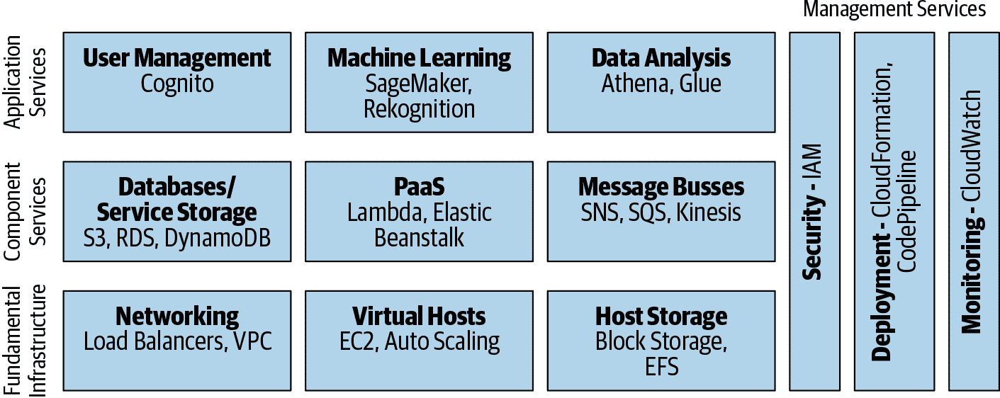
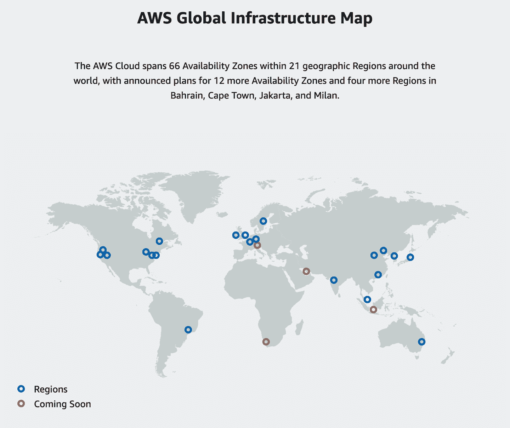
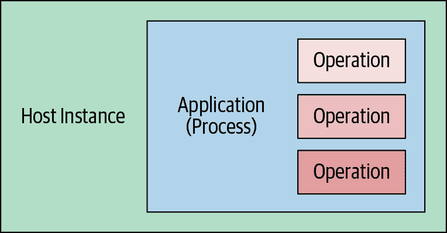
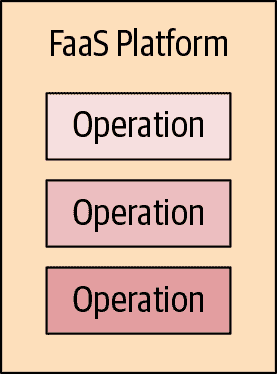

# 第一章：服务器无服务器、Amazon Web Services 和 AWS Lambda 介绍

要开始您的无服务器之旅，我们将带您简要了解云，并定义无服务器。之后，我们将深入探讨 Amazon Web Services（AWS）——这对一些人来说是新的，对另一些人来说是一个复习。

有了这些基础，我们介绍 Lambda——它是什么，为什么要使用它，你可以用 Lambda 构建什么，以及 Java 和 Lambda 如何协同工作。

# 一个快速的历史课

让我们穿越时空回到 2006 年。现在还没有人拥有 iPhone，Ruby on Rails 是一个炙手可热的新编程环境，Twitter 正在推出。然而，对我们来说更重要的是，在这个时候，许多人都在自己拥有并在数据中心中架设的物理服务器上托管他们的服务器端应用程序。

2006 年 8 月发生了一件事，将从根本上改变这种模式。亚马逊的新 IT 部门 AWS 宣布推出了[Elastic Compute Cloud（EC2）](https://aws.amazon.com/ec2)。

EC2 是最早的基础设施即服务（IaaS）产品之一。IaaS 允许公司租用计算能力——即用于运行其互联网服务器应用程序的主机——而不是购买自己的机器。它还允许他们及时提供主机，从请求机器到可用性的延迟大约为几分钟。在 2006 年，这一切都成为可能，因为虚拟化技术的进步——那时的所有 EC2 主机都是虚拟机器。

EC2 的五个关键优势是：

降低人工成本

在 IaaS 之前，公司需要雇佣特定的技术运维人员，在数据中心工作并管理他们的物理服务器。这意味着从电力和网络到机架和安装再到修复诸如坏的 RAM 之类的机器的物理问题，再到设置操作系统（OS）的一切都消失了。使用 IaaS，所有这些都消失了，而是成为 IaaS 服务提供商（在 EC2 的情况下是 AWS）的责任。

降低风险

当公司管理自己的物理服务器时，他们会暴露于由于未计划的事件（如硬件故障）引起的问题。这会导致高度不稳定长度的停机时间，因为硬件问题通常很少见，并且可能需要很长时间才能修复。使用 IaaS，客户在硬件故障发生时仍然需要做一些工作，但不再需要知道如何修复硬件。相反，客户可以简单地请求一个新的机器实例，几分钟内就可用，并重新安装应用程序，从而限制了面临此类问题的风险。

降低基础设施成本

在许多情况下，连接的 EC2 实例的成本比自己运行的硬件要便宜，尤其是当你只想连续运行几天或几周而不是数月或数年时，考虑到电力、网络等因素。同样，按小时租赁主机而不是直接购买它们允许不同的会计处理：EC2 机器是运营费用（Opex），而不是物理机器的资本支出（Capex），通常允许更灵活的会计处理方式。

扩展

考虑到 IaaS 带来的扩展性好处，基础设施成本显著下降。使用 IaaS，公司在扩展其运行的服务器数量和类型方面具有更大的灵活性。不再需要提前购买 10 台高端服务器，因为你认为未来几个月可能会需要它们。相反，你可以从一两台低功率、低成本的虚拟机（VM）开始，然后随着时间的推移扩展你的 VM 数量和类型，而无需任何负面成本影响。

交付时间

在自助托管服务器的旧时代，为新应用程序采购和配置服务器可能需要几个月的时间。如果你在几周内想尝试一个想法，那就太糟糕了。使用 IaaS，交付时间从几个月缩短到几分钟。这引领了快速产品实验的时代，正如[《精益创业》](http://theleanstartup.com)中鼓励的那样。

# 云计算的发展

IaaS 是云计算的第一批关键元素之一，与存储（例如 AWS 的[简单存储服务（S3）](https://aws.amazon.com/s3)）一起。AWS 是云服务的早期开拓者，仍然是主要提供商，但也有许多其他云供应商，如微软和谷歌。

云计算的下一个演变是平台即服务（PaaS）。最受欢迎的 PaaS 提供商之一是 Heroku。PaaS 在 IaaS 之上层，抽象了主机操作系统的管理。使用 PaaS，你只部署应用程序，平台负责操作系统安装、补丁升级、系统级监控、服务发现等。

使用 PaaS 的替代方案是使用容器。在过去几年中，[Docker](https://www.docker.com)作为一种更清晰地区分应用程序系统需求与操作系统细节的方法变得非常流行。有基于云的服务来代表团队托管和管理/编排容器，这些服务通常被称为容器即服务（CaaS）产品。亚马逊、谷歌和微软都提供 CaaS 平台。通过使用像[Kubernetes](https://kubernetes.io)这样的工具（例如谷歌的 GKE、亚马逊的 EKS 或微软的 AKS），管理 Docker 容器的数量变得更加容易，无论是自我管理的形式还是作为 CaaS 的一部分。

这三个概念——IaaS、PaaS 和 CaaS——都可以归为*作为服务的计算*；换句话说，它们是我们可以在其中运行我们自己专业软件的不同类型的通用环境。PaaS 和 CaaS 通过进一步提高抽象级别来与 IaaS 有所不同，允许我们将更多的“繁重工作”交给其他人处理。

# 进入 Serverless

Serverless 是云计算的下一个演进阶段，可以分为两个概念：Backend as a Service（BaaS）和 Functions as a Service（FaaS）。

## Backend as a Service

Backend as a service（BaaS）允许我们用现成的服务替换我们自己编写和/或管理的服务器端组件。它在概念上更接近软件即服务（SaaS）而不是像虚拟实例和容器之类的东西。SaaS 通常是外包业务流程，比如人力资源或销售工具，或者在技术方面像 GitHub 这样的产品；而使用 BaaS，我们将应用程序分解成更小的部分，并且完全使用外部托管的产品实现其中一些部分。

BaaS 服务是领域通用的远程组件（即不是进程内库），我们可以将其整合到我们的产品中，其中应用程序编程接口（API）是典型的集成范式。

BaaS 已经在开发移动应用程序或单页 Web 应用程序的团队中变得特别流行。许多这样的团队可以大量依赖第三方服务来执行本来需要自己完成的任务。让我们看几个例子。

首先我们有像 Google 的[Firebase](https://firebase.google.com)这样的服务。Firebase 是一个数据库产品，由供应商（在这种情况下是 Google）完全管理，可以直接从移动或 Web 应用程序访问，无需我们自己的中介应用服务器。这代表了 BaaS 的一个方面：管理数据组件的服务。

BaaS 服务还允许我们依赖他人已经实现的应用逻辑。一个很好的例子是认证——许多应用程序实现自己的代码来执行注册、登录、密码管理等操作，但这些代码通常在许多应用程序中是相似的。跨团队和企业的这种重复工作正好可以提取为外部服务，这正是像[Auth0](https://auth0.com)和亚马逊的[Cognito](https://aws.amazon.com/cognito)这样的产品的目标。这些产品允许移动应用程序和 Web 应用程序拥有完整的身份验证和用户管理功能，但不需要开发团队编写或管理实现这些功能的任何代码。

*BaaS*一词随着移动应用程序开发的兴起而显现出来；事实上，有时这个术语被称为*移动后端即服务*（MBaaS）。然而，使用完全外部管理的产品作为我们应用程序开发的一部分的关键思想并不局限于移动开发，甚至不限于前端开发。

## 作为服务的功能

无服务器的另一半是函数即服务（FaaS）。FaaS，像 IaaS、PaaS 和 CaaS 一样，是计算作为服务的另一种形式—一个通用的环境，在其中我们可以运行我们自己的软件。有些人喜欢使用术语*无服务器计算*来代替 FaaS。

使用 FaaS，我们将我们的代码部署为独立的函数或操作，并配置这些函数在 FaaS 平台内发生特定事件或请求时被调用或触发。平台本身通过为每个事件实例化专用环境来调用我们的函数—这个环境由一个临时的、完全托管的轻量级虚拟机或容器；FaaS 运行时；和我们的代码组成。

这种环境的结果是，我们不必关心我们代码的运行时管理，这与任何其他计算平台的风格都不同。

此外，由于我们稍后将描述的无服务器的几个因素，使用 FaaS 时我们不必担心主机或进程，并且缩放和资源管理由平台代为处理。

## 区分无服务器

使用外部托管的应用程序组件的想法，就像我们使用 BaaS 一样，不是新鲜事—人们已经使用托管的 SQL 数据库十年甚至更长时间了—那么是什么使得这些服务有资格作为后端服务呢？BaaS 和 FaaS 有哪些共同点，使我们将它们归为无服务器计算的概念？

有五个关键标准可以区分无服务器服务—包括 BaaS 和 FaaS—使我们能够以新的方式设计应用程序。这些标准如下：

不需要管理长期运行的主机或应用程序实例

这是无服务器的核心。操作服务器端软件的大多数其他方式都要求我们部署、运行和监视一个应用程序实例（无论是我们自己编写的还是其他人编写的），并且该应用程序的生命周期跨越一个以上的请求。无服务器则意味着相反：我们不需要管理长期运行的服务器进程或服务器主机。这并不意味着这些服务器不存在—它们绝对存在—但它们不是我们的关注或责任。

自动按负载自动调整和自动分配资源

自动缩放是系统根据负载动态调整容量需求的能力。大多数现有的自动缩放解决方案需要利用团队做一定的工作。无服务器服务从第一次使用起就能自动自动调整，无需任何努力。

无服务器服务在执行自动扩展时也会自动进行配置。它们消除了分配容量的所有工作，包括底层资源的数量和大小。这是一个巨大的操作负担减轻。

具有基于精确使用量的成本，从零到零的使用量

这与前一点密切相关——无服务器成本与使用量精确相关。例如，使用 BaaS 数据库的成本应与使用量紧密相关，而不是预定义的容量。此成本应主要来自实际使用的存储量和/或发出的请求。

请注意，我们并不是说成本应仅基于使用量——通常可能会有一些使用服务的基本成本——但是大部分成本应与细粒度的使用成正比。

具有以除主机大小/数量外的其他术语定义的性能能力

对于无服务器平台来说，暴露一些性能配置是合理且有用的。但是，这种配置应完全抽象出所使用的任何基础实例或主机类型。

具有隐式高可用性

在运行应用程序时，我们通常使用高可用性（HA）一词来表示即使底层组件失败，服务也将继续处理请求。对于无服务器服务，我们期望供应商为我们提供透明的 HA。

例如，如果我们正在使用 BaaS 数据库，我们假设提供商正在执行处理单个主机或内部组件失败所需的所有操作。

# 什么是 AWS？

在本章中，我们已经几次谈到了 AWS，现在是时候稍微详细地看一下这个云服务提供商的巨头了。

自 2006 年推出以来，AWS 以令人难以置信的速度增长，涉及的服务数量和类型，AWS 云提供的容量以及使用它的公司数量。让我们来看看所有这些方面。

## 服务类型

AWS 拥有一百多种不同的服务。其中一些是相当低级的——网络、虚拟机、基本块存储。在这些服务之上，在抽象层面上，是组件服务——数据库、平台即服务、消息总线。然后在所有这些服务之上，真正的应用程序组件——用户管理、机器学习、数据分析。

这个堆栈的侧面是必要的管理服务，用于以规模使用 AWS——安全性、成本报告、部署、监视等。

这些服务的组合如图 1-1 所示。

###### 图 1-1\. AWS 服务层

AWS 喜欢将自己宣传为终极 IT “乐高积木”提供商——它提供了大量可插拔类型的资源，可以组合在一起创建庞大、高度可扩展的企业级应用程序。

## 容量

AWS 将其计算机设施分布在全球 60 多个数据中心，如图 1-2 所示。在 AWS 术语中，每个数据中心对应一个*可用区（AZ）*，而紧邻的数据中心群组成*区域*。AWS 在 5 个大陆上拥有 20 多个不同的区域。

那是很多计算机。

尽管区域总数继续增长，但每个区域内的容量也在增加。大量美国互联网公司在北弗吉尼亚州的 us-east-1 区域（华盛顿特区外）运行其系统——公司在那里运行系统越多，AWS 在增加可用服务器数量方面就越有信心。这是亚马逊与其客户之间的良性循环。

###### 图 1-2\. AWS 区域（来源：[AWS](https://oreil.ly/61Ztd)）

当你使用亚马逊的一些低级服务，比如 EC2 时，通常会指定要使用的可用区。不过，对于高级服务，你通常只需指定一个区域，亚马逊将为你在单个数据中心级别处理任何问题。

亚马逊的区域模型的一个引人注目的方面是，从物流和软件管理的角度来看，每个区域基本上是独立的。这意味着，如果一个区域出现了像停电这样的物理问题，或者像部署错误这样的软件问题，其他区域几乎肯定不会受到影响。从我们用户的角度来看，区域模型确实会增加一些额外的工作量，但总体上它运行良好。

## 谁在使用 AWS？

AWS 拥有遍布全球的大量客户。大型企业、政府、初创公司、个人以及中间的所有人都在使用 AWS。你使用的许多互联网服务可能都托管在 AWS 上。

AWS 不仅适用于网站。许多公司已经将大部分“后端”IT 基础设施迁移到 AWS 上，发现这比运行自己的物理基础设施更具吸引力。

当然，AWS 并不垄断。在英语世界至少，谷歌和微软是它们最大的竞争对手，而阿里云则在不断增长的中国市场上与它们竞争。还有许多其他云服务提供商，提供适合特定类型客户的服务。

## 你如何使用 AWS？

你与 AWS 的第一次互动很可能是通过[AWS Web 控制台](https://console.aws.amazon.com)。为此，你将需要某种访问凭证，这将为你在一个*账户*内授予权限。账户是一个映射到结算（即向 AWS 支付你使用的服务费用）的概念，但它也是 AWS 内部定义的服务配置的分组。公司倾向于在一个账户中运行多个生产应用程序。（账户也可以有*子账户*，但在本书中我们不会过多讨论它们——只需知道如果使用公司提供的凭证，它们可能是为特定的子账户。）

如果公司没有向你提供凭证，你需要创建一个账户。你可以通过提供 AWS 你的信用卡详细信息来完成此操作，但要知道 AWS 提供了一个慷慨的*免费套餐*，如果你只是按照本书中的基本练习进行，应该不会需要支付 AWS 任何费用。

你的凭证可能采用典型的用户名和密码形式，也可能通过单点登录（SSO）工作流程（例如通过 Google Apps 或 Microsoft Active Directory）进行。无论哪种方式，最终你都将成功登录到 Web 控制台。第一次使用 Web 控制台可能会让人畏缩，因为有 100 多个 AWS 服务争相吸引你的注意——Amazon Polly 在与一个叫做 Macie 的奇怪东西平分秋色时大喊“选我！”。然后当然还有那些仅以首字母缩略词命名的服务——它们到底是什么呢？

AWS 控制台主页如此令人震惊的原因之一是因为它实际上并非作为一个产品开发的——它是作为一百个不同产品开发的，所有产品都在主页上得到了链接。此外，深入了解一个产品可能看起来与了解另一个产品大不相同，因为在 AWS 宇宙中，每个产品都被赋予了相当多的自治权。有时使用 AWS 可能感觉像是在探险中浏览 AWS 的公司组织——不用担心，我们都有这种感觉。

除了 Web 控制台，与 AWS 交互的另一种方式是通过其广泛的 API。亚马逊在其历史的早期甚至在 AWS 时代之前就拥有的一个伟大方面是，每个服务必须通过公共 API 完全可用，这意味着在 AWS 中可以配置的任何事情实际上都可以通过 API 完成。

API 的顶层是 CLI——命令行界面——这是我们在本书中使用的工具。CLI 最简单的描述是一个与 AWS API 通信的轻量级客户端应用程序。我们将在下一章讨论如何配置 CLI（“AWS 命令行界面”）。

# 什么是 AWS Lambda？

Lambda 是亚马逊的 FaaS 平台。我们在前面简要提到了 FaaS，但现在是时候更详细地挖掘它了。

## 作为服务的函数

正如我们之前介绍的，FaaS 是一种围绕部署单个函数或操作的构建和部署服务器端软件的新方式。FaaS 是关于无服务器的许多噪音的来源；事实上，许多人认为无服务器 *就是* FaaS，但他们忽略了完整的图景。虽然本书专注于 FaaS，我们鼓励您在构建更大型应用程序时也考虑 BaaS。

当我们部署传统的服务器端软件时，我们首先使用主机实例，通常是 VM 实例或容器（参见 图 1-3）。然后我们部署我们的应用程序，在主机内作为操作系统进程运行。通常，我们的应用程序包含多个不同但相关的操作的代码；例如，Web 服务可能允许检索和更新资源。

###### 图 1-3\. 传统服务器端软件部署

从所有权的角度来看，我们作为用户对此配置的三个方面负责——主机实例、应用程序进程，当然还有程序操作。

FaaS 改变了部署和所有权的模型（参见 图 1-4）。我们从模型中剥离了主机实例和应用程序进程。相反，我们专注于表达应用程序逻辑的单个操作或函数。我们将这些函数单独上传到 FaaS 平台，这个平台由云供应商负责，而不是我们。

###### 图 1-4\. FaaS 软件部署

函数在应用程序进程中不是持续活动的，而是处于空闲状态，直到需要运行它们，就像传统系统中的方式。相反，FaaS 平台被配置为为每个操作监听特定的事件。当事件发生时，平台实例化 FaaS 函数，然后调用它，传递触发事件。

当函数执行完成后，FaaS 平台可以自由地将其销毁。或者作为优化，它可以将函数保留一段时间，直到有另一个事件需要处理。

## Lambda 实现的 FaaS

AWS Lambda 在 2014 年推出，并且在范围、成熟度和使用率方面不断增长。某些 Lambda 函数可能吞吐量非常低——可能每天只执行一次，甚至更少。但是其他函数可能每天执行数十亿次。

Lambda 通过实例化短暂的托管 Linux 环境来实现 FaaS 模式，以托管每个函数实例。Lambda 保证每次只处理一个环境中的事件。在撰写本文时，Lambda 还要求函数在 15 分钟内完成对事件的处理；否则，执行将被中止。

Lambda 提供了一个异常轻量级的编程和部署模型——我们只需提供一个函数及其依赖项，打包成 ZIP 或 JAR 文件，Lambda 完全管理运行时环境。

Lambda 与许多其他 AWS 服务紧密集成。这对应于可以触发 Lambda 函数的许多不同类型的事件源，从而可以使用 Lambda 构建许多不同类型的应用程序。

Lambda 是一个完全无服务器的服务，根据我们与之前的区分标准定义的：

不需要管理长时间运行的主机或应用程序实例

使用 Lambda，我们完全抽象出运行我们代码的底层主机。此外，我们不管理长时间运行的应用程序——一旦我们的代码完成处理特定事件，AWS 就可以自由终止运行时环境。

自动按负载自动扩展和自动配置

这是 Lambda 的一个关键优势之一——资源管理和扩展是完全透明的。一旦我们上传函数代码，Lambda 平台将创建足够的环境来处理任何特定时间的负载。如果一个环境足够，Lambda 将在需要时创建环境。另一方面，如果需要数百个单独的实例，Lambda 将快速扩展，而我们无需任何努力。

具有基于精确使用量的费用结构，从零使用到上升

AWS 仅按照我们的代码在每个环境中执行的时间收费，精确到 100 毫秒。如果我们的函数每 5 分钟活动 200 毫秒，那么我们每小时只需支付 2.4 秒的使用费用。这种精确的使用费用结构，无论我们的函数需要一个实例还是一千个实例，都是相同的。

性能能力是根据除主机大小/数量以外的条件定义的。

由于 Lambda 完全抽象出底层主机，我们无法指定要使用的 EC2 实例的数量或类型。相反，我们指定我们的函数需要多少 RAM（最多 3GB），性能的其他方面也与此相关。我们将在本书后面更详细地探讨这个问题——参见“内存和 CPU”。

具有隐式高可用性

如果特定的基础主机失败，那么 Lambda 将自动在不同的主机上启动环境。同样，如果特定的数据中心/*可用区*失败，Lambda 将在同一*地区*的不同 AZ 中自动启动环境。请注意，作为 AWS 客户，我们需要处理*区域范围*的故障，我们将在本书末尾讨论这个问题——参见“全球分布式应用”。

## 为什么选择 Lambda？

正如我们之前所描述的，云的基本好处也适用于 Lambda——与其他类型的主机平台相比，它通常更便宜；运行 Lambda 应用程序需要的操作和时间更少；Lambda 的伸缩性灵活性超过了 AWS 内的任何其他计算选项。

然而，从我们的角度来看，最大的好处在于与其他 AWS 服务结合使用时，Lambda 可以多快地构建应用程序。我们经常听说公司可以在一两天内构建全新的应用程序，并将其部署到生产环境中。能够摆脱我们通常在常规应用程序中编写的大量基础设施相关代码，这是一个巨大的时间节省者。

Lambda 还比任何其他 FaaS 平台拥有更多的容量、成熟度和集成点。它并不完美，我们认为一些其他产品在开发者体验上比 Lambda 更好。但是在没有与现有云供应商的强大联系的情况下，我们会推荐 AWS Lambda，原因正如前面列出的那些。

## Lambda 应用程序是什么样子？

传统的长时间运行的服务器应用通常有两种启动工作的方式之一：它们可以打开 TCP/IP 套接字并等待传入连接，或者有一个内部调度机制，使它们可以访问远程资源以检查新的工作。由于 Lambda 基本上是一个事件驱动的平台，并且 Lambda 强制执行超时，所以这两种模式都不适用于 Lambda 应用程序。那么我们如何构建 Lambda 应用程序呢？

要考虑的第一点是，Lambda 函数在最低级别上可以通过两种方式调用：

+   Lambda 函数可以被称为同步调用，由 AWS 称为`RequestResponse`。在这种情况下，上游组件调用 Lambda 函数，并等待 Lambda 函数生成的任何响应。

+   或者，Lambda 函数可以异步调用，由 AWS 称为`Event`。这时来自上游调用者的请求会立即由 Lambda 平台响应，而 Lambda 函数继续处理请求。在这种情况下，不会向调用者返回进一步的响应。

这两种调用模型有各种其他行为，我们稍后会深入探讨，从“调用类型”开始。现在让我们看看它们在一些示例应用中的使用方式。

### Web API

一个显而易见的问题是 Lambda 是否可以用于实现 HTTP API，幸运的是答案是肯定的！虽然 Lambda 函数本身不是 HTTP 服务器，但我们可以使用另一个 AWS 组件*API Gateway*来提供 HTTP 协议和路由逻辑，这些通常在 Web 服务中使用（见图 1-5）。

###### 图 1-5\. 使用 AWS Lambda 的 Web API

上图显示了单页 Web 应用程序或移动应用程序使用的典型 API。用户客户端通过 HTTP 进行各种调用，以从后端检索数据和/或发起请求。在我们的情况下，处理请求的组件是亚马逊 API 网关——它是一个 HTTP 服务器。

我们通过将请求映射到处理程序来配置 API 网关（例如，如果客户端发出`GET /restaurants/123`请求，则可以设置 API 网关调用名为`RestaurantsFunction`的 Lambda 函数，并传递请求的详细信息）。API 网关将*同步*调用 Lambda 函数，并等待函数评估请求并返回响应。

由于 Lambda 函数实例本身不是可远程调用的 API，API 网关实际上会调用 Lambda 平台，指定要调用的 Lambda 函数、调用类型（`RequestResponse`）和请求参数。Lambda 平台随后会实例化一个`RestaurantsFunction`实例，并使用请求参数调用它。

Lambda 平台确实有一些限制，例如我们已经提到的最大超时时间，但除此之外，它基本上是一个标准的 Linux 环境。在`RestaurantsFunction`中，例如，我们可以调用数据库——亚马逊的 DynamoDB 是与 Lambda 一起使用的流行数据库之一，部分原因是两个服务的类似扩展能力。

一旦函数完成其工作，它会返回一个响应，因为它以同步方式调用。Lambda 平台将此响应传回 API 网关，后者将响应转换为 HTTP 响应消息，并将其传递回客户端。

通常，Web API 将满足多种类型的请求，映射到不同的 HTTP *路径* 和 *动词*（如 GET、PUT、POST 等）。在开发由 Lambda 支持的 Web API 时，通常会将不同类型的请求实现为不同的 Lambda 函数，尽管您不必使用这样的设计——如果愿意，可以将所有请求作为一个函数处理，并根据原始 HTTP 请求路径和动词在函数内部切换逻辑。

### 文件处理

Lambda 的常见用例是文件处理。让我们想象一个移动应用程序可以将照片上传到远程服务器，然后我们希望以不同的图像尺寸在我们的产品套件的其他部分中使用，如图 1-6 所示。

###### 图 1-6\. 使用 AWS Lambda 进行文件处理

S3 是亚马逊的简单存储服务，即 2006 年推出的同一服务。移动应用可以通过 AWS API 安全地将文件上传到 S3。

当文件上传时，可以配置 S3 来调用 Lambda 平台，指定要调用的函数，并传递文件路径。与前面的示例类似，Lambda 平台会实例化 Lambda 函数，并使用 S3 传递的请求详细信息调用它。但是，此时的调用是*异步*调用（S3 指定了`Event`调用类型）——不会向 S3 返回任何值，S3 也不会等待返回值。

这次我们的 Lambda 函数仅存在于*副作用*的目的——它加载由请求参数指定的文件，然后在不同的 S3 存储桶中创建新的调整大小版本的文件。副作用完成后，Lambda 函数的工作就完成了。由于它在 S3 存储桶中创建了文件，我们可以选择向该存储桶添加 Lambda 触发器，还可以调用进一步处理这些生成文件的 Lambda 函数，从而创建处理管道。

### Lambda 应用程序的其他示例

前两个示例展示了两种不同的 Lambda 事件源的场景。还有许多其他事件源可以使我们构建许多其他类型的应用程序。其中一些如下：

+   我们可以构建消息处理应用程序，使用消息总线，如简单通知服务（SNS）、简单队列服务（SQS）、事件桥或 Kinesis 作为事件源。

+   我们可以构建邮件处理应用程序，使用简单电子邮件服务（SES）作为事件源。

+   我们可以构建类似于 cron 程序的定时任务应用程序，使用 CloudWatch 计划事件作为触发器。

请注意，除 Lambda 外的许多服务都是*BaaS*服务，因此也是无服务器的。结合 FaaS 和 BaaS 来生成*无服务器架构*是一种非常强大的技术，因为它们具有类似的扩展性、安全性和成本特性。事实上，正是这些服务的组合推动了无服务器计算的流行。

我们在第五章中深入讨论了以这种方式构建应用程序的内容。

## AWS Lambda 在 Java 世界中

AWS Lambda 原生支持大量编程语言。JavaScript 和 Python 是 Lambda 的非常流行的“入门”语言（以及重要的生产应用程序语言），部分原因是它们的动态类型和非编译性质使得开发周期非常快速。

但是，我们起步时都使用 Java 与 Lambda。Java 在 Lambda 的世界中偶尔会有不良声誉——其中有些是合理的，有些则不是。然而，如果 Lambda 函数所需的内容可以用大约 10 行或更少的代码表达，通常在 JavaScript 或 Python 中快速组合会更快。但是，对于较大的应用程序，有许多很好的理由在 Java 中实现 Lambda 函数，其中一些如下：

+   如果您或您的团队比其他 Lambda 支持的语言更熟悉 Java，那么您将能够在一个新的运行时平台中重用这些技能和库。在 Lambda 生态系统中，Java 与 JavaScript、Python、Go 等一样是“一流语言”—Lambda 不会因为您使用 Java 而对您造成限制。此外，如果您已经在 Java 中实现了大量代码，则与其重新实现为其他语言相比，将其移植到 Lambda 可能会带来显著的时间市场优势。

+   在高吞吐量消息系统中，相比于 JavaScript 或 Python，Java 通常能带来显著的运行时性能优势。在任何系统中，“更快”通常意味着“更好”，而在 Lambda 中，“更快”还可能导致实际的成本优势，这是由于 Lambda 的定价模型。

对于 JVM 工作负载，在撰写本文时，Lambda 原生支持 Java 8 和 Java 11 运行时。Lambda 平台将在其 Linux 环境中实例化一个 Java 运行环境版本，然后在该 Java 虚拟机中运行我们的代码。因此，我们的代码必须与该运行时环境兼容，但我们不仅仅局限于使用 Java 语言。Scala、Clojure、Kotlin 等都可以在 Lambda 上运行（详见“其他 JVM 语言和 Lambda”）。

Lambda 还有一个高级选项，即定义自己的运行时环境，如果这两个 Java 版本都不够用，我们在“自定义运行时”中进一步讨论这一点。

Lambda 平台提供了一些基本的库与运行时（例如 AWS Java 库的一个小子集），但您的代码需要的任何其他库必须随代码本身提供。您将在“构建和打包”中学习如何做到这一点。

最后，虽然 Java 具有[*Lambda 表达式*](https://oreil.ly/nnjwh)的编程构造，但这与 AWS Lambda 函数无关。如果您愿意，您可以在 AWS Lambda 函数中使用 Java Lambda 表达式（因为 AWS Lambda 支持 Java 8 及更高版本），也可以选择不使用。

# 概要

在本章中，您了解到无服务器计算是云计算的下一个演进阶段—一种通过依赖处理资源管理、扩展等服务来构建应用程序的方式，而无需配置。

此外，您现在了解到函数即服务（FaaS）和后端即服务（BaaS）是无服务器的两个组成部分，其中 FaaS 是无服务器中的通用计算范式。有关无服务器的更多信息，请参阅我们的免费 O’Reilly 电子书[*什么是无服务器？*](https://oreil.ly/5YbLa)

您还至少对亚马逊 Web 服务有基本的了解—这是全球最流行的云平台之一。您了解到 AWS 具有托管应用程序的巨大容量，并且了解到如何通过 Web 控制台以及 API/CLI 访问 AWS。

您已经了解了 AWS Lambda—亚马逊的函数即服务产品。我们将“思考 Lambda”与传统构建的应用程序进行了比较，讨论了为什么您可能希望使用 Lambda 而不是其他函数即服务的实现，然后给出了一些使用 Lambda 构建的应用程序示例。

最后，您看到了 Java 作为 Lambda 语言选项的快速概述。

在第二章中，我们实现了我们的第一个 Lambda 函数—为一个全新的世界做好准备！

# 练习

1.  获取一个[AWS 账户](https://aws.amazon.com)的凭据。最简单的方法是创建一个新账户。正如我们之前提到的，如果您这样做，您将需要提供信用卡号码，但我们在本书中所做的一切应该都在免费层范围内，除非您在测试中非常热情！

    或者您可以使用现有的 AWS 账户，但如果这样做，我们建议使用一个“开发”账户，以免干扰任何“生产”系统。

    我们还强烈建议，无论您使用何种访问方式，都应该为您授予账户内的完全管理员权限；否则，您将因分散注意力的安全问题而陷入困境。

1.  登录到[AWS 控制台](https://console.aws.amazon.com)。找到 Lambda 部分—那里已经有任何函数了吗？

1.  *扩展任务*: 查看[Amazon 的无服务器营销页面](https://aws.amazon.com/serverless)，特别是它描述“无服务器平台”中各种服务的部分。哪些服务完全满足我们之前描述的无服务器服务的区分标准？哪些不满足，并且以什么方式它们“大部分”是无服务器的？
