# 第二章 开始使用 AWS Lambda

第一章为你提供了这本书其余部分的背景：云端、无服务器、AWS，以及对 Lambda 的介绍，它的工作原理及其用途。但这是一本实用的书籍，面向实际的人，所以在本章中，我们将卷起袖子，在云端部署一些工作函数。

我们将从使你更熟悉 AWS 控制台开始，然后部署和运行我们的第一个 Lambda 函数。之后，我们将准备一个本地开发环境，最后我们将构建并部署一个本地开发的函数到 Lambda。

###### 注意

如果你已经对 AWS 很有经验，请随时跳到“Lambda Hello World (尽快)”。

# AWS 控制台快速指南

第一章的前两个练习涉及获取 AWS 凭证，然后登录到[AWS Web 控制台](https://console.aws.amazon.com)。如果你还没有这样做，现在应该去做。

有点令人困惑的是，你可能使用了三种不同类型的凭据来登录：

+   你可能使用过账户“root”用户，使用电子邮件地址和密码登录。这相当于在 Linux 系统中使用 root 用户。

+   你可能使用了一个“IAM 用户”和密码。在这种情况下，你还需要提供数值 AWS 账户 ID（或 AWS 账户别名）。

+   最后，你可能使用了单一登录方法（例如通过 Google Apps 账户）。

现在你成功登录了吗？太棒了！让我们来一场关于 AWS 世界的小旅行。

###### 注意

首先，我要简要警告和解释一下。AWS Web 控制台经常进行用户体验（UX）改进，所以当你阅读这本书时，UI 可能与书中所示有所不同。我们会尽量解释示例的意图，而不仅仅是操作方式，这样当亚马逊改变其 UI 时，你仍然能够跟上。

## 区域

让我们开始吧。首先让我们谈谈区域。在右上角，你会看到当前选择的区域（见图 2-1](#currently-selected-region)）。


###### 图 2-1\. 当前选择的区域

正如你在第一章学到的，AWS 将其基础设施组织成称为*可用区*（AZs）的数据中心，然后将 AZs 集成到一个称为*区域*的紧密位于一起的组中。每个区域都是半自治的。现在你正在查看特定区域的 Web 控制台首页——在我们之前的例子中，那是俄勒冈州，也被称为 us-west-2 区域。

当你登录时，不一定要使用默认选择的区域——你可以自由地环游世界，寻找适合你的正确区域。点击区域名称，查看可用区域的列表（见图 2-2](#pick-a-region)）。

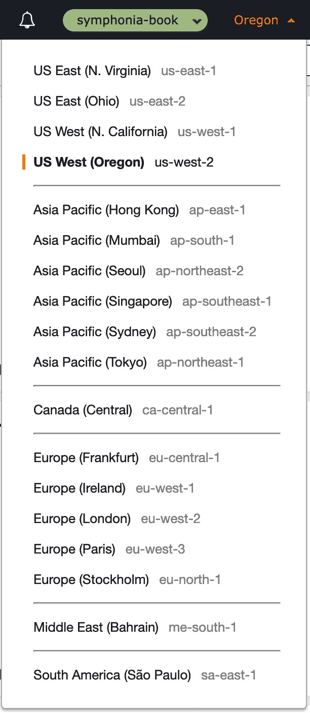

###### 图 2-2\. 选择一个区域

对于本书中要涵盖的内容，任何区域都应该足够。我们将在所有操作中都默认使用美国西部（俄勒冈州），如果你愿意，也可以选择更接近你家的区域作为备用选择。

## 身份和访问管理

现在让我们选择我们的第一个服务。在 Web 控制台首页上，展开所有服务，找到名为*IAM*的服务，或者在搜索框中搜索*IAM*，然后选择它。

IAM 是*身份和访问管理*的缩写——它是 AWS 中最基础的安全服务之一。它也是少数几个不绑定到任何特定区域的 AWS 服务之一（注意引用*全球*，以前用于定义你的区域）。

IAM 允许你创建“IAM 用户”、组、角色、策略等等。如果你使用为本书创建的 AWS 帐户（因此使用“根”电子邮件地址用户登录），我们建议为将来的工作创建一个 IAM 用户。我们将在“获取 AWS CLI 的凭证”中描述如何做到这一点。

*角色*类似于用户，可以用来允许人或过程获取特定的权限以完成任务。与用户不同的是，它们没有用户名或密码，而是必须*承担*角色才能使用。

AWS 是安全性的坚定支持者，这一点你很快就会发现。当你创建 Lambda 函数时，*必须*指定它执行时要承担的角色。如果没有指定角色，AWS *不会*为其提供默认角色。我们稍后将在创建第一个函数时看到这一点。

你必须对 IAM 有基本的理解，因为在 Lambda 开发中，像角色和策略这样的方面是无处不在的。我们会在“身份和访问管理”章节中为你提供 IAM 的全面基础知识。

# Lambda Hello World（尽快上手）

在本节中，我们将部署和运行我们的第一个 Lambda 函数。我们会告诉你一个小秘密——我们将使用 JavaScript 完成这个任务。嘘——别告诉我们的编辑——我们曾承诺这将是一本 Java 书籍！

之所以选择 JavaScript 作为第一个示例，是因为我们可以在 Web 浏览器中完全进行整个练习，让我们在几分钟内尝试 Lambda 的潜力。

首先，返回 AWS Web 控制台主屏幕，选择 Lambda。如果你以前没有在此帐户中使用 Lambda，你将看到类似于图 2-3 的屏幕。

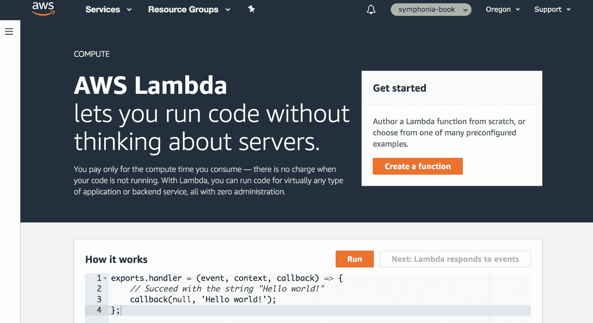

###### 图 2-3 Lambda 欢迎屏幕

如果在此帐户中之前使用过 Lambda，Web 控制台的外观会更像图 2-4。

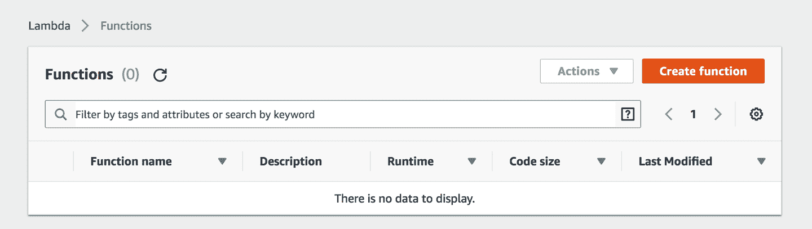

###### 图 2-4 Lambda 函数列表

由于亚马逊不断变化的 UI 设计，你阅读时可能会看到不同的外观。

无论哪种方式，点击*创建函数*，然后选择*从头开始编写*—这里有一些其他选项可供您开始使用更复杂的函数，但我们现在将做一些非常简单的事情。

在名称框中（参见图 2-5），输入**`HelloWorld`**，在*运行时*下点击*Node.js 10.x*。别担心，我们很快就会开始使用 Java！现在点击*创建函数*。

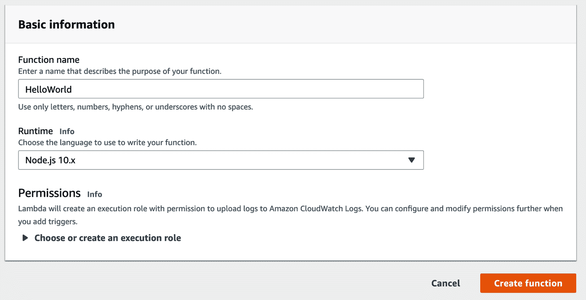

###### 图 2-5\. 创建 HelloWorld 函数

如果此后控制台扩展了权限部分，请在*执行角色*下拉菜单中选择*使用基本 Lambda 权限创建新角色*，然后再次点击*创建函数*（参见图 2-6）。

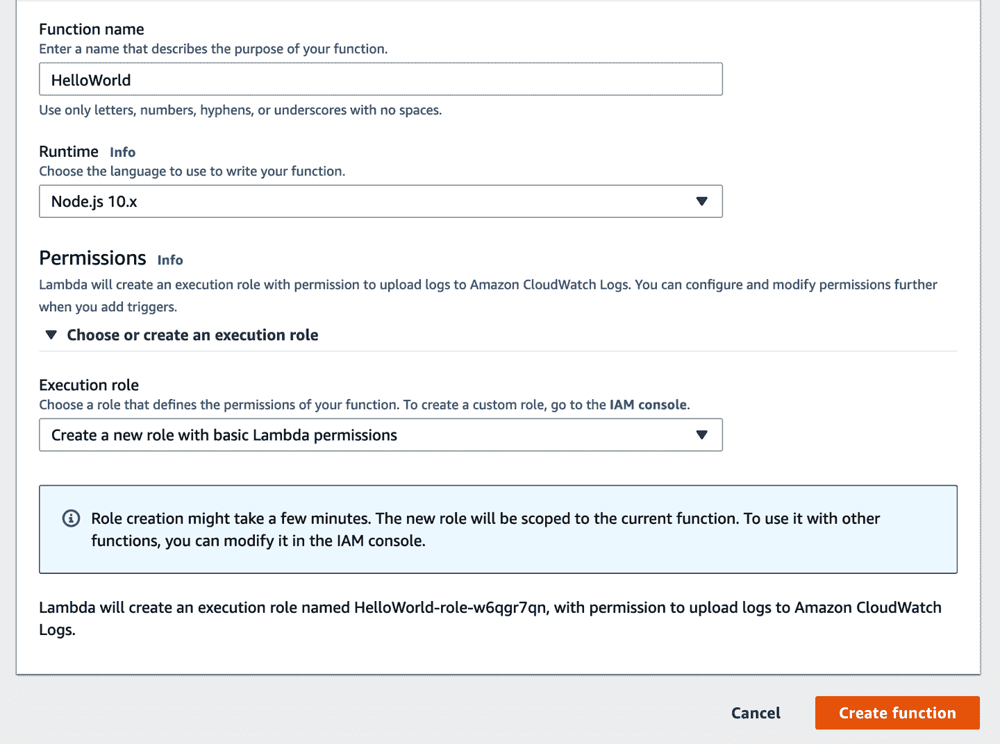

###### 图 2-6\. 创建 HelloWorld 函数，指定创建一个新角色

Lambda 将在 Lambda 平台内创建一个 Lambda 函数配置，并在短暂等待后将您带到 Lambda 函数的主控制台页面。

如果您向下滚动，您会看到它甚至已经为函数提供了一些默认代码—对我们来说，现在这些代码完全合适。

滚动回顶部，点击*测试*按钮。这将打开一个名为*配置测试事件*的对话框—在*事件名称*框中输入**`HelloWorldTest`**，然后点击*创建*。这将带您回到 Lambda 函数屏幕。现在再次点击*测试*。

这次 Lambda 将实际执行您的函数，并且会有一个短暂的延迟，因为它正在为代码实例化一个环境。然后您将看到一个*执行结果*的框—应该会显示函数执行成功！

展开*详细信息*控件，您将看到从函数返回的值，以及一些其他诊断信息（参见图 2-7）。

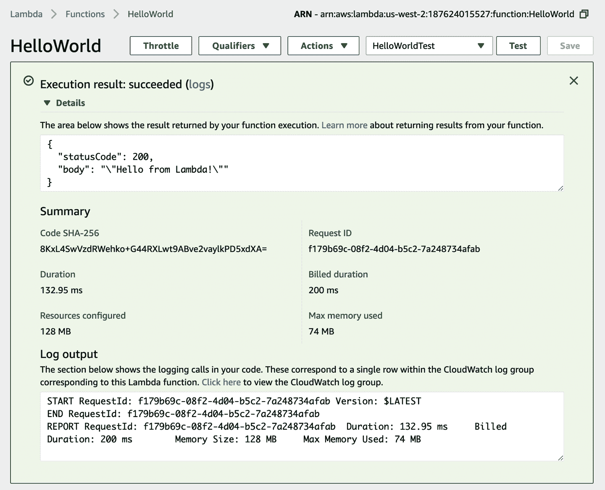

###### 图 2-7\. HelloWorld 执行

恭喜您—您已经创建并运行了您的第一个 Lambda 函数！

# 设置您的开发环境

现在您已经尝试了运行函数的一点（无服务器！），我们将转而实际构建和部署 Java Lambda 函数，这种方式更适合快速迭代和自动化。

首先，您需要设置一个本地开发环境。

## AWS 命令行界面

如果您以前使用过 AWS CLI 并且已在您的计算机上配置了它，您可以跳过这一步。

### 安装 AWS CLI

Amazon 和 AWS 都建立在 API 之上。在[Amazon API 命令的经典故事](https://oreil.ly/AixTf)中，我们看到“所有团队从现在开始都将通过服务接口公开其数据和功能”，以及“所有服务接口必须从头开始设计，以便能够外部化”。这意味着几乎我们可以通过 AWS Web 控制台 UI 做的任何事情，我们也可以通过 AWS API 和 CLI 完成。

AWS API 是一个大集合的 HTTP 终端点，我们可以调用它们在 AWS 内执行操作。虽然直接调用 API 得到了完全的支持，但由于诸如身份验证/请求签名、正确的序列化等问题，这也显得有些繁琐。因此，AWS 为我们提供了两个工具来简化操作 —— SDK 和 CLI。

软件开发工具包（SDK）是 AWS 提供的库，我们可以在代码中使用它们调用 AWS API，从而简化一些复杂或重复的工作，例如身份验证。我们稍后在本书中使用这些 SDK —— “示例：构建无服务器 API”深入探讨了这个主题。

现在，我们将使用 AWS CLI。CLI 是一个可以从终端使用的工具 —— 它包装了 AWS API，因此几乎可以通过 CLI 访问 API 提供的所有内容。

您可以在 macOS、Windows 和 Linux 上使用 CLI；但是，我们在这里给出的所有示例和建议都是针对 macOS 的。如果您的开发机器使用不同的操作系统，则应将此处的说明与 AWS CLI 文档中指定的内容结合使用。

按照以下说明来 [安装 CLI](https://oreil.ly/84dGt)。如果您使用 Mac 和 [Homebrew](https://brew.sh)，安装 CLI 就像运行 `brew install awscli` 一样简单。

要验证 CLI 安装的有效性，请从终端提示符下运行**`aws --version`**。它应该返回类似以下的内容：

```java
$ aws --version
aws-cli/1.15.30 Python/3.6.5 Darwin/17.6.0 botocore/1.10.30
```

准确的输出将取决于您的操作系统，以及其他因素。

### 获取 AWS CLI 的凭证

使用 AWS CLI 的凭证与您用于登录 AWS Web 控制台的凭证*不同*。对于 CLI，您需要两个值：一个*访问密钥 ID*及其*密钥访问密钥*。如果您已经有了这些值，可以跳过到下一节。

访问密钥 ID 和密钥访问密钥对是分配给*IAM 用户*的凭证。也可以将密钥和密钥分配给与电子邮件地址关联的帐户根用户，但出于安全原因，AWS 强烈建议不要这样做，我们也一样。

如果您还没有 IAM 用户（因为您使用了根用户登录，或者因为您使用了 SSO），您需要创建一个 IAM 用户。要执行此操作，请转到本章前面访问过的 AWS Web 控制台中的 IAM 控制台。单击*用户*，并仔细检查屏幕上是否有适合您的用户（参见图 2-8）。

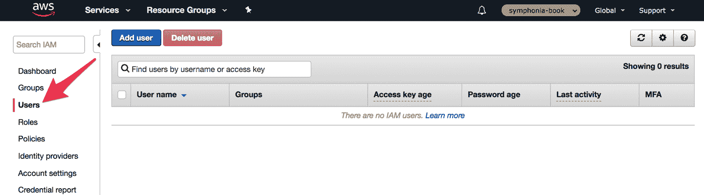

###### 图 2-8\. IAM 用户列表

如果您确实需要创建用户，请点击 *添加用户*。在第一个屏幕上，为您的用户取一个名称，并选择 *程序访问* 和 *AWS 管理控制台访问*。然后选择 *自定义密码* 并输入新密码 —— 这将是使用此新用户登录 AWS Web 控制台的密码，如果您希望这样做的话。取消选中 *密码重置*（见 图 2-9）。然后点击 *下一步：权限*。

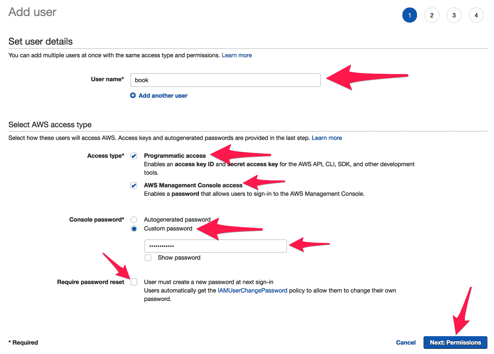

###### 图 2-9\. 添加 IAM 用户

在下一个屏幕上，选择 *直接附加现有策略* 并选择 *管理员访问*（见 图 2-10）。为了学习 Lambda，拥有具备完整权限的用户将使我们的生活更加轻松。在真实的生产账户中不应执行此操作。

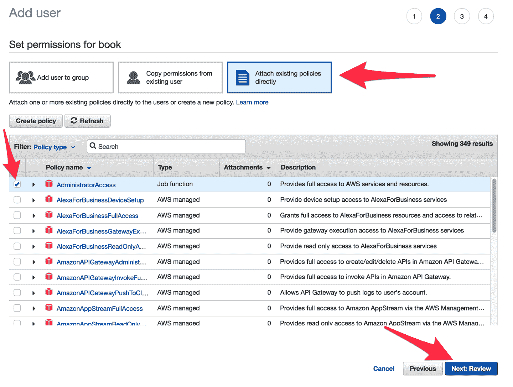

###### 图 2-10\. 添加 IAM 用户权限

点击 *下一步：标签*，然后在接下来的屏幕上点击 *下一步：审核*。

在下一个屏幕上，检查详细信息是否与我们刚刚描述的相符，并点击 *创建用户*。

在最后一个屏幕上，您将获得新用户的编程安全凭证！将访问密钥 ID 和秘密访问密钥（在显示后）复制到一个备忘录中（保持安全），或下载提供的 CSV 文件。最后，点击 *关闭*。

如果您已经有一个 IAM 用户，但没有编程凭证，或者您丢失了刚创建的账户的凭证，请返回 IAM 控制台中的用户列表，选择用户，然后选择 *安全凭证* 选项卡。您可以从那里创建新的访问密钥（及相关的秘密访问密钥 ID）。

### 配置 AWS CLI

现在是时候配置 CLI 了。从终端运行 **`aws configure`**。对于前两个字段，请粘贴您从上一节复制的值。对于默认区域名称，请输入与您选择的 AWS 区域相对应的区域代码。您可以在 Web 控制台的下拉菜单中看到区域代码（这些映射也可以在 [AWS 文档](https://oreil.ly/sV10t) 中找到）。因为我们在 Web 控制台中选择了 *Oregon* 作为示例，所以在终端的示例中我们将使用 us-west-2。最后，对于默认输出格式，请输入 **`json`**。

###### 警告

如果您已在 CLI 中配置了不同的 AWS 账户，并为本书添加了新账户，则需要创建一个不同的配置文件；否则，上述说明将替换您现有的凭证。使用 `aws configure` 的 `--profile` 选项，并查看更多细节 [在 AWS 文档中](https://oreil.ly/Aj5y5)。

要确认您的值，请再次运行 **`aws configure`**，您将看到类似以下设置的内容：

```java
$ aws configure
AWS Access Key ID [********************]:
AWS Secret Access Key [********************]:
Default region name [us-west-2]:
Default output format [json]:
```

快速验证 AWS 配置文件的一种好方法是运行命令 **`aws iam get-user`**，其输出应该类似于以下内容，其中 `UserName` 是正确 IAM 用户的名称：

```java
$ aws iam get-user
{
  "User": {
    "Path": "/",
    "UserName": "book",
    "UserId": "AIDA111111111111111111",
    "Arn": "arn:aws:iam::181111111111:user/book",
    "CreateDate": "2019-10-21T20:27:05Z"
  }
}
```

如果您需要更多帮助，请访问[文档](https://oreil.ly/JMtUt)。

## Java 设置

现在您已经有了本地 AWS 环境，是时候设置 Java 环境了。

AWS Lambda 支持 Java 8 和 Java 11，强烈建议您在本地配置 Lambda 函数时与您使用的 Java SE Development Kit 的主要版本保持一致。大多数操作系统支持安装多个版本的 Java。

如果您尚未安装 Java，则至少有几个选项可供选择：

+   其中一个是 AWS 自家的 Java 发行版——Corretto。Corretto，根据 AWS 的说法，“是一个无成本、多平台、生产就绪的 Open Java Development Kit (OpenJDK) 发行版。”详情请参阅[“Amazon Corretto 8 是什么？”](https://oreil.ly/9AYfs)了解 Java 8 或者[“Amazon Corretto 11 是什么？”](https://oreil.ly/SB2-J)了解 Java 11 的安装信息。

+   另一个选择是[Oracle 自家的发行版](https://oreil.ly/WnBD8)；但是现在这个版本带有许可限制，可能会影响您的使用。

就 Lambda 开发者而言，目前这两个选项的主要区别基本上是法律上的而非技术上的。然而，我们预计 AWS 将会在未来将所有的 Java 环境转移到 Corretto 上，因此如果有疑问，我们建议 Lambda 开发者选择 Corretto Java SDK。

要验证您的 Java 环境，请从终端运行**`java -version`**，您应该会看到类似以下内容的输出：

```java
$ java -version
openjdk version "1.8.0_232"
OpenJDK Runtime Environment Corretto-8.232.09.1 (build 1.8.0_232-b09)
OpenJDK 64-Bit Server VM Corretto-8.232.09.1 (build 25.232-b09, mixed mode)
```

Java 的精确构建版本并不重要（尽管保持与安全补丁的最新状态始终是明智的），但重要的是您有正确的基础版本。

我们还使用 Maven——构建和打包工具。如果您已经安装了 Maven，请确保它是比较更新的版本。如果您还没有安装 Maven 并且使用的是 Mac，那么我们建议使用 Homebrew 安装它——运行`brew install maven`。否则，请参阅[Maven 官网](https://maven.apache.org)获取安装指南。

打开终端并运行**`mvn -v`**来验证您的环境。您应该会看到类似以下内容开头的输出：

```java
$ mvn -v
Apache Maven 3.6.0 (97c98ec64a1fdfee77...
Maven home: /usr/local/Cellar/maven/3.6.0/libexec
Java version: 1.8.0_232, vendor: Amazon.com Inc., runtime: /Library/Java...
Default locale: en_US, platform encoding: UTF-8
OS name: "mac os x", version: "10.14.6", arch: "x86_64", family: "mac"
```

本书中的任何 3.x 版本的 Maven 都能够满足我们的需求。

最后，您应该能够在您选择的开发编辑器中轻松创建使用 Maven 的 Java 项目。我们使用的是免费版本的[IntelliJ IDEA](https://oreil.ly/RWtqv)，但您可以随意选择其他编辑器。

## AWS SAM CLI 安装

您还需要安装的最后一个工具是 AWS SAM CLI。SAM 代表 Serverless Application Model，我们稍后会探讨它在“CloudFormation 和 Serverless Application Model”中的应用。现在您只需要知道 SAM CLI 是在常规 AWS CLI 的基础上提供一些有用的额外工具。

要安装 SAM，请参考 [详细说明](https://oreil.ly/slxxA)。如果时间紧迫，可以跳过关于 Docker 的文档部分，因为起初我们不会使用它们！

###### 警告

我们使用 SAM CLI 的一些功能，这些功能在 2019 年末引入，所以如果你使用的是早期版本，请确保更新它。

# Lambda Hello World（正确的方式）

开发环境准备好后，现在是时候创建和部署一个用 Java 编写的 Lambda 函数了。

## 创建你的第一个 Java Lambda 项目

在构建和部署 Lambda 函数的自动化过程中，有一些“样板代码”是必需的。在本书的过程中，我们将详细介绍所有复杂性，但为了让您快速上手，我们已经创建了一个模板来加快速度。

首先，进入终端并运行以下命令：

```java
$ sam init --location gh:symphoniacloud/sam-init-HelloWorldLambdaJava
```

这将要求你提供一个 `project_name` 值，暂时只需按 Enter 使用默认值即可。

然后命令将生成一个项目目录。切换到该目录并查看。你将看到以下文件：

README.md

一些关于如何构建和部署项目的说明

pom.xml

一个 Maven 项目文件

template.yaml

一个 SAM 模板文件——用于将项目部署到 AWS

src/main/java/book/HelloWorld.java

一个 Lambda 函数的源代码

现在打开你选择的 IDE/editor 中的项目。如果你使用的是 Jetbrains IntelliJ IDEA，可以通过运行以下命令来打开：

```java
$ idea pom.xml
```

在 *pom.xml* 文件中，如果你愿意的话，将 `<groupId>` 更改为更适合你自己的值。

现在看一下 示例 2-1，显示的是 *src/main/java/book/HelloWorld.java* 文件。

##### 示例 2-1\. Hello World Lambda（Java 实现）

```java
package book;

public class HelloWorld {
  public String handler(String s) {
    return "Hello, " + s;
  }
}
```

这个类代表了一个完整的 Java Lambda 函数。很小，不是吗？不要太担心它的内容和原因；我们很快就会讲到。现在，让我们来构建我们的 Lambda 部署工件。

## 构建 Hello World

我们通过上传一个 ZIP 文件将代码部署到 Lambda 平台，或者在 Java 世界中，我们也可以部署一个 JAR 文件（JAR 文件只是一个包含了一些嵌入式元数据的 ZIP）。现在我们将创建一个 *uberjar* ——一个包含我们所有代码以及我们的代码需要的所有类路径依赖项的 JAR 文件。

刚刚创建的模板项目已设置好为您创建一个 uberjar。我们现在不会检查它，因为在 第四章 中，我们将更深入地探讨一个生成 Lambda ZIP 文件的更好方法（“组装 ZIP 文件”）。

要构建 JAR 文件，请从项目的工作目录运行 **`mvn package`**。这应该在结束时成功完成，并显示以下行：

```java
[INFO] ------------------------------------------------------------------------
[INFO] BUILD SUCCESS
[INFO] ------------------------------------------------------------------------
```

这也应该创建我们的 uberjar。运行 **`jar tf target/lambda.jar`** 来列出 JAR 文件的内容。输出应包括 `book/HelloWorld.class`，这是我们应用程序代码，嵌入在工件中。

## 创建 Lambda 函数

本章早些时候，我们通过 Web 控制台向您展示了如何创建 Lambda 函数。现在，我们将从终端执行同样的操作。我们将使用**`sam`**命令来完成这两个进一步的操作。

在此之前，我们需要在*S3* AWS 服务中创建或识别一个*暂存桶*，以存储临时构建构件。如果您按照 AWS 的 SAM CLI 安装说明或已知道当前 AWS 账户中有这样一个存储桶可用，请随意使用。否则，您可以使用以下命令创建一个，将自己的名称替换为`bucketname`。请注意，S3 存储桶名称需要在所有 AWS 账户中全局唯一，因此您可能需要尝试几个名称以找到一个可用的。

```java
$ aws s3 mb s3://bucketname
```

完成这些步骤后，请记录下这个存储桶名称——我们在本书的后续部分会经常使用它，并将其称为`$CF_BUCKET`。

###### 注意

从现在开始，无论何时看到`$CF_BUCKET`，请使用刚刚创建的存储桶名称。为什么叫`CF`？这代表*CloudFormation*，我们将在第 4 章中详细解释。

或者，如果您更熟悉 Shell 脚本，可以将此存储桶名称分配给名为`CF_BUCKET`的 Shell 变量，然后您可以直接使用对`$CF_BUCKET`的引用。

准备好 S3 存储桶后，我们可以创建 Lambda 函数。运行以下命令（在运行**`mvn package`**之后）：

```java
$ sam deploy \
  --s3-bucket $CF_BUCKET \
  --stack-name HelloWorldLambdaJava \
  --capabilities CAPABILITY_IAM
```

目前不要过多关注这些内容的含义——我们稍后会进行解释。如果操作正确，控制台输出应以以下内容结尾（尽管您的区域可能不同）：

```java
Successfully created/updated stack—HelloWorldLambdaJava in us-west-2
```

这意味着您的函数已部署并准备就绪，现在让我们运行它。

### 运行 Lambda 函数

返回 Lambda Web 控制台中的函数列表，您现在应该可以看到列出了两个函数：原始的`HelloWorld`和一个新的函数，其名称可能类似于`HelloWorldLambdaJava-HelloWorldLambda-YF5M2KZHXZF5`。如果没有看到新的 Java 函数，请确保您的终端和 Web 控制台的区域设置是同步的。

点击进入新的函数，查看配置屏幕。您会发现，由于函数是使用编译后的构件创建的，因此源代码已不再可用。

要测试此函数，我们需要创建一个新的测试事件。再次点击*Test*，在*配置测试事件*屏幕上（图 2-11），给事件命名为`HelloWorldJavaEvent`。在实际事件主体部分，输入以下内容：

```java
"Java World!"
```

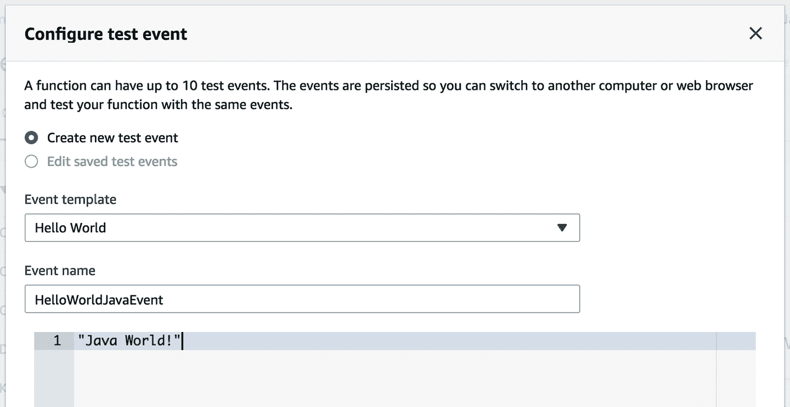

###### 图 2-11\. 配置 Java Lambda 函数的测试事件

点击*创建*以保存测试事件。

这将带您回到主要的 Lambda 屏幕，并选择新的测试事件（如果没有，请手动选择）。点击*Test*，您的 Lambda 函数将被执行！（参见图 2-12。）

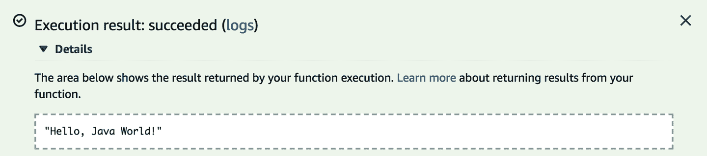

###### 图 2-12. Java 中 Hello World 的结果

# 概要

在本章中，您学习了如何登录 AWS Web 控制台并选择一个区域。然后，通过 Web 控制台创建并运行了您的第一个 Lambda 函数。

你还通过设置 AWS CLI、Java、Maven 和 AWS SAM CLI 为 Lambda 开发准备了本地环境。你通过在开发环境中创建项目、构建项目并使用 Amazon 的 SAM 工具部署项目，学习了用 Java 开发 Lambda 函数的基础知识。最后，你现在了解如何通过模拟事件使用 Web 控制台的测试事件机制来进行 Lambda 函数的简单测试。

在下一章中，我们将开始研究 Lambda 的工作原理以及这些原理对 Lambda 代码编写方式的影响。

# 练习

1.  如果您还没有按照本章的逐步说明进行操作，那么现在进行操作是很值得的，因为这是验证您环境的好方法。

1.  在`sam deploy`时，通过使用不同的`stack-name`值，创建一个具有稍微不同代码的新版本 Java Lambda 函数。注意您如何在 Web 控制台中选择这些函数之间的区别。
