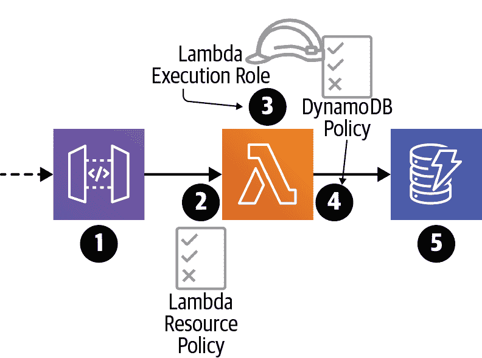

# 第四章 运行 AWS Lambda 函数

本章将介绍一种更高级的构建和打包基于 Java 的 AWS Lambda 函数的方法。我们还将更详细地介绍面向无服务器的 AWS 基础设施即代码工具 SAM 的版本，您在第二章中首次使用过。最后，我们将讨论 Lambda 函数和无服务器应用如何受 AWS 安全模型的影响，以及如何使用 SAM 自动实施无服务器应用的最小特权安全模型。

在继续之前，我们建议您如果尚未这样做，请下载本书的[代码示例](https://oreil.ly/t0Bgg)。

# 构建和打包

Lambda 平台期望所有用户提供的代码以 [ZIP](https://oreil.ly/aECWk) 归档文件的形式提供。根据您使用的运行时和实际业务逻辑，该 ZIP 文件可能包含源代码，或代码和库，或者在 Java 的情况下，已编译的字节码（类文件）和库。

在 Java 生态系统中，我们经常将代码打包成 JAR（Java ARchive）文件，通过 `java -jar` 命令运行，或者被其他应用程序用作库。事实证明，JAR 文件只是带有一些附加元数据的 ZIP 文件。Lambda 平台不会对 JAR 文件执行任何特殊处理——它将它们视为 ZIP 文件，就像对其他 Lambda 语言运行时一样。

使用像 Maven 这样的工具，我们可以指定代码依赖的其他库，并让 Maven 下载这些库的正确版本（以及它们可能具有的任何传递依赖关系），将我们的代码编译成 Java 类文件，并将所有内容打包到一个单独的 JAR 文件中（通常称为*uberjar*）。

# 超级 JAR

尽管在第二章和第三章中使用了超级 jar 方法，但在我们继续之前，值得指出一些它存在的问题。

首先，超级 jar 方法会在目标超级 jar 文件中解压并叠加库。在以下示例中，库 A 包含一个类文件和一个属性文件。库 B 包含一个不同的类文件和一个与库 A 的属性文件同名的属性文件。

```java
$ jar tf LibraryA.jar
book/
book/important.properties
book/A.class

$ jar tf LibraryB.jar
book/
book/important.properties
book/B.class
```

如果这些 JAR 文件用于创建超级 jar（正如我们在之前的章节中所做的那样），则结果将包含两个类文件和一个属性文件——但是该属性文件来源于哪个源 JAR？

```java
$ jar tf uberjar.jar
book/
book/important.properties # Which properties file is this?
book/A.class
book/B.class
```

因为 JAR 文件被解压和叠加，所以只有一个属性文件会进入最终的超级 JAR 文件，而且如果不深入了解 Maven 资源转换器的黑暗艺术，很难知道哪一个会获胜。

超级 JAR 方法的第二个主要问题与创建 JAR 文件有关——事实上，从 Maven 构建过程的角度来看，JAR 文件也是可以被 Lambda 运行时使用的 ZIP 文件的一个附属品。从这个 JAR 与 ZIP 的角度来看，有两个特定的问题。其中一个是 JAR 特定的元数据在 Lambda 运行时是无用的（实际上会被忽略）。例如，*MANIFEST.MF*文件中的`Main-Class`属性——这是 JAR 文件常见的元数据，在 Lambda 函数的上下文中是毫无意义的。

此外，JAR 文件创建过程本身会在构建过程中引入一定程度的非确定性。例如，工具版本和构建时间戳记录在*MANIFEST.MF*和*pom.properties*文件中，这使得无法每次都从相同的源代码可重现地构建相同的 JAR 文件。这种不可重复性会对下游的缓存、部署和安全流程造成严重影响，因此我们希望在可能的情况下避免这种情况。

由于我们实际上并不关心超级 JAR 文件的 JAR 特性，所以考虑根本不使用超级 JAR 过程对我们来说是有意义的。当然，超级 JAR 过程本身并不一定是构建过程中唯一的非确定性源，但我们将稍后处理其余部分。

尽管存在这些缺点，对于简单情况，特别是当 Lambda 函数几乎没有（或没有）第三方依赖时，超级 JAR 过程更简单配置和使用。这在第二章和第三章的示例中就是这种情况，这也是我们在这一点上使用超级 JAR 技术的原因，但对于任何规模较大的 Java 和 Lambda 的实际用途，我们建议采用接下来我们描述的 ZIP 文件方法。

# 组装 ZIP 文件

因此，在 Java 世界中，我们使用 ZIP 文件作为超级 JAR 文件的替代方案。在这种情况下，归档布局会有所不同，但我们将看到如何通过谨慎的方法避免超级 JAR 的问题，并为 Lambda 平台提供一个可用的工件。我们将讨论如何使用 Maven 来实现这一点，但当然，你可以随意将这种方法翻译成你喜欢的构建工具——结果比过程本身更重要。

为了举一个更有趣的例子，首先我们将在我们的 Maven 构建中为 Lambda 函数添加对 AWS SDK for DynamoDB 的依赖，参见“Lambda Hello World (the Proper Way)”。

向*pom.xml*文件添加一个`dependencies`部分：

```java
    <dependencies>
      <dependency>
        <groupId>com.amazonaws</groupId>
        <artifactId>aws-java-sdk-dynamodb</artifactId>
        <version>1.11.319</version>
      </dependency>
    </dependencies>
```

有了这个依赖项，对于我们简单的 Lambda 函数及其依赖项，期望的 ZIP 文件布局如下：

```java
$ zipinfo -1 target/lambda.zip
META-INF/
book/
book/HelloWorld.class
lib/
lib/aws-java-sdk-core-1.11.319.jar
lib/aws-java-sdk-dynamodb-1.11.319.jar
lib/aws-java-sdk-kms-1.11.319.jar
lib/aws-java-sdk-s3-1.11.319.jar
lib/commons-codec-1.10.jar
lib/commons-logging-1.1.3.jar
lib/httpclient-4.5.5.jar
lib/httpcore-4.4.9.jar
lib/ion-java-1.0.2.jar
lib/jackson-annotations-2.6.0.jar
lib/jackson-core-2.6.7.jar
lib/jackson-databind-2.6.7.1.jar
lib/jackson-dataformat-cbor-2.6.7.jar
lib/jmespath-java-1.11.319.jar
lib/joda-time-2.8.1.jar
```

除了我们的应用程序代码（*book/HelloWorld.class*）之外，我们还看到一个包含多个 JAR 文件的*lib*目录，其中包括 AWS DynamoDB SDK 的一个文件以及每个传递依赖项的文件。

我们可以使用 Maven Assembly 插件构建这个 ZIP 输出。这个插件允许我们向 Maven 构建的特定部分（在这种情况下是`package`阶段，在这个阶段中，Java 编译过程的结果会与其他资源一起打包成一组输出文件）添加一些特殊的行为。

首先，我们在项目的*pom.xml*文件中为 Maven Assembly 插件进行了配置，在`build`部分：

```java
<build>
  <plugins>
    <plugin>
      <artifactId>maven-assembly-plugin</artifactId>
      <version>3.1.1</version>
      <executions>
        <execution>
          <phase>package</phase>
          <goals>
            <goal>single</goal>
          </goals>
        </execution>
      </executions>
      <configuration>
        <appendAssemblyId>false</appendAssemblyId>
        <descriptors>
          <descriptor>src/assembly/lambda-zip.xml</descriptor>
        </descriptors>
        <finalName>lambda</finalName>
      </configuration>
    </plugin>
  </plugins>
</build>
```

这个配置的两个最重要的部分是装配`descriptor`，它是项目中另一个 XML 文件的路径，以及`finalName`，它指示插件将我们的输出文件命名为*lambda.zip*而不是其他名称。稍后我们会看到，选择一个简单的`finalName`将有助于快速迭代我们的项目，特别是在我们开始使用 Maven 子模块之后。

我们 ZIP 文件的大部分配置实际上位于装配`descriptor`文件中，这在之前的*pom.xml*文件中已经引用过。这个`assembly`配置描述了确切要包含在输出文件中的内容：

```java
<assembly>
  <id>lambda-zip</id> 
  <formats>
    <format>zip</format> 
  </formats>
  <includeBaseDirectory>false</includeBaseDirectory> 
  <dependencySets>
    <dependencySet> 
      <includes>
        <include>${project.groupId}:${project.artifactId}</include>
      </includes>
      <unpack>true</unpack>
      <unpackOptions>
        <excludes>
          <exclude>META-INF/MANIFEST.MF</exclude>
          <exclude>META-INF/maven/**</exclude>
        </excludes>
      </unpackOptions>
    </dependencySet>
    <dependencySet> 
      <useProjectArtifact>false</useProjectArtifact>
      <unpack>false</unpack>
      <scope>runtime</scope>
      <outputDirectory>lib</outputDirectory> 
    </dependencySet>
  </dependencySets>
</assembly>
```


我们给这个装配取了一个唯一的名称，`lambda-zip`。


输出格式本身将是`zip`类型。


输出文件将不会有基本目录 — 这意味着当我们解压缩时，ZIP 文件的内容将被解压到当前目录而不是新的子目录中。


第一个`dependencySet`部分明确包含了我们的应用代码，通过引用项目的`groupId`和`artifactId`属性。当我们开始使用 Maven 子模块时，这将需要进行修改。我们的应用代码将会被“解包”。也就是说，它不会被包含在一个 JAR 文件中；而是普通的目录结构和 Java 的`.class`文件。我们还明确地排除了不必要的*META-INF*目录。


第二个`dependencySet`部分处理我们应用的依赖项。我们排除了项目的构件（因为它在第一个`dependencySet`部分已经处理过了）。我们只包括`runtime`范围内的依赖项。我们不会解包依赖项，而是将它们作为 JAR 文件保留。


最后，我们不会在输出文件的根目录中包含所有的 JAR 文件，而是将它们全部放入一个*lib*目录中。

那么，这种复杂的新 Maven 配置如何帮助我们避免与 uberjar 相关的问题？

首先，我们剥离了一些不必要的 META-INF 信息。你会注意到我们有点选择性地做了一些处理 — 有些情况下保留 META-INF 信息（比如“services”）仍然很有价值，因此我们不希望完全摆脱它。

其次，我们已经包含了所有的依赖项，但是作为一个 *lib* 目录中的独立 JAR 文件。这样可以完全避免文件和路径覆盖问题。每个依赖 JAR 保持自包含。根据 AWS Lambda 的[最佳实践文档](https://oreil.ly/euF1U)，这种方法在某种程度上还带来了性能的提升，因为 Lambda 平台解压 ZIP 文件更快，JVM 从 JAR 文件加载类也更快。

# 可重现的构建

当我们的源代码或依赖关系发生变化时，我们期望部署包（uberjar 或 ZIP 文件）的内容也会随之变化（在运行构建和打包过程后）。然而，当我们的源代码和依赖关系不变时，即使再次执行构建和打包过程，部署包的内容也应保持不变。构建的输出应该是可重复的（例如，确定性的）。这一点很重要，因为下游过程（如部署流水线）通常根据内容的 MD5 哈希是否改变来触发，我们希望避免不必要地触发这些过程。

尽管我们使用 `lambda-zip` 组件描述符已经去除了自动生成的 *MANIFEST.MF* 和 *pom.properties* 文件，但我们仍然没有消除构建过程中所有潜在的不确定性来源。例如，当我们构建我们的应用代码（例如 `HelloWorld`）时，编译的 Java 类文件的时间戳可能会更改。这些更改后的时间戳会传播到 ZIP 文件中，然后 ZIP 文件内容的哈希值会更改，即使源代码没有变化。

幸运的是，我们的构建过程存在一个简单的 Maven 插件，可以消除这些源中的不确定性。`reproducible-build-maven-plugin` 可以在构建过程中执行，并且将我们的输出 ZIP 文件完全变为确定性的。它可以配置为 *pom.xml* 文件中 `build` 部分的一个 `plugin`：

```java
<plugin>
  <groupId>io.github.zlika</groupId>
  <artifactId>reproducible-build-maven-plugin</artifactId>
  <version>0.10</version>
  <executions>
    <execution>
      <phase>package</phase>
      <goals>
        <goal>strip-jar</goal>
      </goals>
    </execution>
  </executions>
</plugin>
```

现在，当我们多次使用相同的未更改源代码重新构建部署包时，哈希值始终保持不变。您将在下一节中看到这如何影响部署过程。

# 部署

有许多部署 Lambda 代码的选项。然而，在我们深入探讨之前，值得澄清一下我们所说的 *部署* 是什么意思。在这种情况下，我们仅仅是指通过 API 或其他服务更新特定 Lambda 函数或一组 Lambda 函数及相关 AWS 资源的代码或配置。我们没有将其定义扩展到包括部署编排（如 AWS CodeDeploy）。

Lambda 代码的部署方法无特定顺序，如下所示：

+   AWS Lambda Web 控制台

+   AWS CloudFormation/Serverless Application Model（SAM）

+   AWS CLI（使用 AWS API）

+   AWS Cloud 开发工具包（CDK）

+   其他由 AWS 开发的框架，如 Amplify 和 Chalice

+   针对主要基于 CloudFormation 构建的无服务器组件的第三方框架，例如 Serverless Framework

+   针对主要基于 AWS API 构建的无服务器组件的第三方工具和框架，例如 Claudia.js 和 `lambda-maven-plugin`（来自 Maven）

+   像 Ansible 或 Terraform 这样的通用第三方基础设施工具

在本书中，我们将讨论前两者（事实上，在第二章和第三章中我们已经涉及了 AWS Lambda Web 控制台和 SAM）。我们还使用 AWS CLI，尽管不是作为部署工具。通过对这些方法有坚实的了解，您应该能够评估其他选项，并决定其中之一是否更适合您的环境和用例。

# 基础设施即代码

当我们通过 Web 控制台或 CLI 与 AWS 进行交互时，我们是手动创建、更新和销毁基础设施。例如，如果我们使用 AWS Web 控制台创建一个 Lambda 函数，下次我们想要使用相同参数创建 Lambda 函数时，我们仍然必须通过 Web 控制台执行相同的手动操作。这一特性也适用于 CLI。

对于初步开发和实验，这是一个合理的方法。但是，当我们的项目开始积累动力时，手动管理基础设施的方法将成为一种障碍。解决这个问题的一个经过良好验证的方法称为*基础设施即代码*。

我们不必通过 Web 控制台或 CLI 手动与 AWS 交互，而是可以在 JSON 或 YAML 文件中声明性地指定我们期望的基础设施，并将该文件提交给 AWS 的基础设施即代码服务：CloudFormation。CloudFormation 服务接受我们的输入文件，并代表我们对 AWS 基础设施进行必要的更改，考虑资源依赖关系、先前部署的应用程序版本的当前状态以及各种 AWS 服务的特殊要求和特性。从 CloudFormation 模板文件创建的一组 AWS 资源称为*堆栈*。

CloudFormation 是 AWS 的专有基础设施即代码服务，但这并不是该领域的唯一选择。与 AWS 兼容的其他热门选择包括 Terraform、Ansible 和 Chef。每个服务都有自己的配置语言和模式，但都实现了基本相同的结果——从配置文件中提供云基础设施。

使用配置文件（而不是在控制台上点点点）的一个关键好处是，这些文件代表了我们的应用基础设施，可以与我们的应用源代码一起进行版本控制。我们可以使用与应用的其他部分相同的版本控制工具，查看我们基础设施的完整变更时间线。此外，我们可以将这些配置文件纳入我们的持续部署流水线中，因此当我们对应用基础设施进行更改时，这些更改可以使用行业标准工具安全地部署，与我们的应用代码一起。

# CloudFormation 和 Serverless 应用程序模型

尽管基础设施即代码方法有明显的好处，但 CloudFormation 本身以冗长、笨重和不灵活而闻名。即使是最简单的应用架构的配置文件也很容易超过数百或数千行的 JSON 或 YAML。当处理一个这样大小的现有 CloudFormation 堆栈时，不可避免地会有一种诱惑，即退回到使用 AWS Web 控制台或 CLI。

幸运的是，作为 AWS 无服务器开发人员，我们有幸能够使用称为 Serverless 应用程序模型（SAM）的 CloudFormation 的不同“口味”，我们在第二章和第三章中使用过。这本质上是 CloudFormation 的一个超集，允许我们使用一些特殊的资源类型和快捷方式来表示常见的无服务器组件和应用架构。它还包括一些特殊的 CLI 命令，以简化开发、测试和部署。

这是我们首次在“创建 Lambda 函数”中使用的 SAM 模板，已更新为使用我们的新 ZIP 部署包（请注意，`CodeUri`后缀已从`.jar`更改为`.zip`）：

```java
AWSTemplateFormatVersion: 2010-09-09
Transform: AWS::Serverless-2016-10-31
Description: Chapter 4

Resources:
  HelloWorldLambda:
    Type: AWS::Serverless::Function
    Properties:
      Runtime: java8
      MemorySize: 512
      Handler: book.HelloWorld::handler
      CodeUri: target/lambda.zip
```

我们可以使用第二章中学到的相同 SAM 命令部署新的基于 ZIP 的 Lambda 函数：

```java
$ sam deploy \
  --s3-bucket $CF_BUCKET \
  --stack-name chapter4-sam \
  --capabilities CAPABILITY_IAM
```

`sam deploy`首先将我们的部署包上传到 S3，但仅在该包的内容发生更改时才执行此操作。在本章的早些时候，我们花了一些时间设置可重现的构建，以便像此上传过程这样的操作不必在实际上没有发生更改时执行。

在幕后，`sam deploy`还创建了我们模板的修改版本（也存储在 S3 中），以引用新上传的 S3 位置的工件，而不是本地位置。这一步是必要的，因为 CloudFormation 要求模板中引用的任何工件在部署时都可在 S3 中使用。

###### 小贴士

存储在 S3 中的`s3 deploy`文件应仅视为部署过程中的临时版本，而不是要保留的应用程序工件。因此，如果您的 SAM S3 存储桶没有用于其他用途，我们建议您在其中设置“生命周期策略”，以便在一段时间后自动删除部署工件——通常我们将其设置为一周。

在上传步骤之后，如果在此 AWS 账户和区域中尚不存在具有提供名称的 CloudFormation 堆栈，则`sam deploy`命令将创建一个新的 CloudFormation 堆栈。如果堆栈已经存在，`sam deploy`命令将创建一个 CloudFormation *变更集*，其中列出了在执行操作之前将创建、更新或删除的资源。然后，`sam deploy`命令将应用变更集以更新 CloudFormation 堆栈。

列出堆栈资源时，我们可以看到 CloudFormation 不仅创建了我们的 Lambda 函数，还创建了支持的 IAM 角色和策略（稍后我们将进一步探讨），而无需显式指定它们：

```java
$ aws cloudformation list-stack-resources --stack-name chapter4-sam
{
  "StackResourceSummaries": [
    {
      "LogicalResourceId": "HelloWorldLambda",
      "PhysicalResourceId": "chapter4-sam-HelloWorldLambda-1HP15K6524D2E",
      "ResourceType": "AWS::Lambda::Function",
      "LastUpdatedTimestamp": "2019-07-26T19:16:34.424Z",
      "ResourceStatus": "CREATE_COMPLETE",
      "DriftInformation": {
        "StackResourceDriftStatus": "NOT_CHECKED"
      }
    },
    {
      "LogicalResourceId": "HelloWorldLambdaRole",
      "PhysicalResourceId":
        "chapter4-sam-HelloWorldLambdaRole-1KV86CI9RCXY0",
      "ResourceType": "AWS::IAM::Role",
      "LastUpdatedTimestamp": "2019-07-26T19:16:30.287Z",
      "ResourceStatus": "CREATE_COMPLETE",
      "DriftInformation": {
        "StackResourceDriftStatus": "NOT_CHECKED"
      }
    }
  ]
}
```

除了 Lambda 函数外，SAM 还包括用于 DynamoDB 表（`AWS::Serverless::SimpleTable`）和 API 网关（`AWS::Serverless::Api`）的资源类型。这些资源类型专注于流行的使用案例，可能无法适用于所有应用程序架构。然而，由于 SAM 是 CloudFormation 的超集，我们可以在 SAM 模板中使用普通的 CloudFormation 资源类型。这意味着我们可以在架构中混合和匹配无服务器和“普通”AWS 组件，从而获得两种方法的好处，以及 SAM 的`sam deploy`命令的幂等 CLI 语义。您将在第五章中看到将 SAM 和 CloudFormation 资源结合在一个模板中的示例。

# 安全性

安全问题贯穿 AWS 的各个方面。正如您在第二章中学到的那样，我们必须从一开始就处理 AWS 的安全层，称为身份和访问管理（IAM）。然而，我们不打算简单地以最广泛、最不安全的 IAM 权限集运行所有内容来概述细节，而是在本节中稍微深入讲解 Lambda 平台如何由 IAM 控制，以及这如何影响我们的函数与其他 AWS 资源的交互，以及 SAM 如何使构建安全应用程序变得更加简单。

## 最小权限原则

与传统的单体应用程序不同，在无服务器应用程序中，可能会有数百个独立的 AWS 组件，每个组件具有不同的行为和访问不同的信息的能力。如果我们简单地应用最广泛的安全权限，则每个组件都可以访问 AWS 账户中的每个其他组件和信息。我们在安全策略中留下的每一个漏洞都是信息泄露、丢失、修改或应用程序行为改变的机会。而且，如果一个组件被入侵，整个 AWS 账户（以及其中部署的任何其他应用程序）都面临风险。

我们可以通过将“最小权限”原则应用于我们的安全模型来解决这种风险。简而言之，该原则指出每个应用程序，实际上是每个应用程序的组成部分都应该具有执行其功能所需的最少访问权限。例如，让我们考虑一个从 DynamoDB 表中读取数据的 Lambda 函数。最广泛的权限将允许该 Lambda 函数读取、写入或以其他方式与 AWS 账户中的每个其他组件和信息进行交互。它可以从 S3 存储桶中读取数据，创建新的 Lambda 函数，甚至启动 EC2 实例。如果 Lambda 代码存在错误或漏洞（例如，在解析用户输入时），其行为可能会被改变，并且不受其 IAM 角色的限制。

将最小权限原则应用于此特定 Lambda 函数，将会导致一个 IAM 角色，该角色只允许函数访问 DynamoDB 服务。进一步地，我们可能只允许该函数从 DynamoDB 中读取数据，并移除其写入数据或创建或删除表格的能力。在这种情况下，我们甚至可以进一步限制函数只能基于执行该函数的用户读取单个 DynamoDB 表中的哪些条目。

将最小权限原则应用到我们的 Lambda 函数上后，我们现在将其访问权限限制为仅能执行其工作所需的特定资源。如果 Lambda 函数在某种方式上被攻击或者被入侵，其安全策略仍会限制它仅能读取单个 DynamoDB 表中的特定条目。然而，最小权限原则不仅适用于防止妥协。它也是限制应用程序代码中错误“爆炸半径”的有效手段。

假设我们的 Lambda 函数存在一个 bug，例如使用错误的值来删除数据。在一个开放的安全模型中，这个 bug 可能导致 Lambda 函数删除错误用户的数据！然而，通过为我们的 Lambda 函数应用最小权限原则，我们已经限制了 bug 的“爆炸半径”，因此这个特定问题可能会导致它仅仅无作为或抛出错误。

## 身份与访问管理

对于成功在 AWS 上构建任何类型的应用程序来说，IAM 的工作知识至关重要。正如我们在前一节讨论的那样，在构建无服务器应用程序时，有效地应用最小权限原则更为重要。IAM 是一个复杂且多方面的服务，在这里我们不可能详尽覆盖所有内容。相反，在本节中，我们只是从构建无服务器应用程序的角度深入探讨 IAM。IAM 在无服务器应用程序中最常见和频繁地发挥作用的地方是执行角色、附加到这些角色的策略，以及附加到特定 AWS 资源的策略。

### 角色与策略

IAM 角色是可以被 AWS 组件（如 Lambda 函数）扮演的身份。与 IAM 用户不同，角色可以被任何需要它的人（或事物）扮演，并且角色没有长期访问凭证。基于此，我们可以定义 IAM 角色为一个可扮演的身份，并附加一组权限。

“可扮演的身份”这个短语可能让人觉得任何人或任何事物都可以扮演 IAM 角色。如果是这样的话，使用角色就不会真正提供任何好处，因为对于扮演角色或任何给定用户或组件可以承担的操作不会有任何限制。幸运的是，IAM 角色并不是任何人都可以扮演的。在构建角色时，我们必须明确指定谁（或什么）可以扮演该角色。例如，如果我们正在为 Lambda 函数构建一个角色，我们必须明确授予 Lambda 服务（在这种情况下是数据平面）扮演该角色的权限，通过指定以下“信任关系”：

```java
{
  "Version": "2012-10-17",
  "Statement": [
    {
      "Effect": "Allow",
      "Principal": {
        "Service": "lambda.amazonaws.com"
      },
      "Action": "sts:AssumeRole"
    }
  ]
}
```

此声明指定了一个效果（`Allow`），适用于一个操作（`sts:AssumeRole`）。然而，更重要的是，它指定了一个主体，即被允许扮演该角色的身份。在这种情况下，我们允许 Lambda 服务的数据平面（`lambda.amazonaws.com`）扮演这个角色。如果我们尝试将此角色与不同的服务，如 EC2 或 ECS，一起使用，除非我们更改主体，否则将无法正常工作。

现在我们已经确定了谁可以承担角色，我们需要添加权限。IAM 角色本身不具备访问资源或执行操作的任何权限。此外，IAM 的默认行为是拒绝权限，除非在策略中显式允许。这些权限在策略中使用以下结构说明：

+   一个*效果*（如 `Allow` 或 `Deny`）。

+   一组*操作*，通常是命名空间到特定的 AWS 服务（比如 `logs:PutLogEvents`）。

+   一组*资源*，通常是定义特定 AWS 组件的 Amazon 资源名称（ARN）。不同的服务支持不同级别的资源特定性。例如，DynamoDB 策略可以应用到表级别。

这里是一个允许一组操作针对“logs”服务（即 CloudWatch Logs）的策略示例，并且不限制这些操作对任何特定的“logs”资源：

```java
{
  "Version": "2012-10-17",
  "Statement": [
    {
      "Effect": "Allow",
      "Action": [
        "logs:CreateLogGroup",
        "logs:CreateLogStream",
        "logs:PutLogEvents"
      ],
      "Resource": "*"
    }
  ]
}
```

我们之前确定了谁可以承担角色（Lambda 服务的数据平面，由主体标识符 `lambda.amazonaws.com` 指定），以及角色具有的权限。然而，这个角色本身直到附加到 Lambda 函数时才会被使用，我们需要显式配置。也就是说，我们需要告诉 Lambda 服务在执行特定 Lambda 函数时使用这个角色。

### Lambda 资源策略。

就像安全和 IAM 的世界还不够复杂一样，AWS 偶尔也使用应用于资源（而不是身份）的 IAM 策略来控制操作和访问。资源策略与基于身份的 IAM 策略相比反转了控制：资源策略说明了其他主体可以对所涉及的资源做什么。特别是，这对于允许不同账户中的主体访问某些资源（如 Lambda 函数或 S3 存储桶）非常有用。

Lambda 函数调用资源策略由一系列语句组成，每个语句指定了一个主体、一组操作和一组资源。这些策略由 Lambda 数据平面使用，用于确定是否允许调用者（例如主体）成功调用函数。这里是一个示例 Lambda 资源策略（也称为*函数策略*），允许 API 网关服务调用特定函数：

```java
{
  "Version": "2012-10-17",
  "Id": "default",
  "Statement": [
    {
      "Sid": "Stmt001",
      "Effect": "Allow",
      "Principal": {
        "Service": "apigateway.amazonaws.com"
      },
      "Action": "lambda:invokeFunction",
      "Resource":
        "arn:aws:lambda:us-east-1:555555555555:function:MyLambda",
      "Condition": {
        "ArnLike": {
          "AWS:SourceArn": "arn:aws:execute-api:us-east-1:
 555555555555:xxx/*/GET/locations"
        }
      }
    }
  ]
}
```

在这个策略中，我们还添加了一个条件，更具体地限制了允许的操作来源，只允许具有 ID “xxx” 的 API 网关部署包含 “/GET/locations” 路径。条件是服务特定的，取决于调用者提供的信息。

让我们通过 API 网关调用 Lambda 函数的场景来详细讨论，使用 图 4-1。



###### 图 4-1\. Lambda 和 IAM 安全概述。

1.  调用者是否有权限调用 API？对于这种情况，我们假设答案是肯定的。有关更多信息，请参阅 [API Gateway 文档](https://oreil.ly/Sb6N2)。

1.  API Gateway API 正试图调用 Lambda 函数。Lambda 服务允许这样吗？这由 Lambda 函数调用资源策略控制。

1.  当 Lambda 执行时，函数代码应具有什么权限？这由 Lambda 执行角色控制，并且该角色通过与 Lambda 服务的信任关系来假定。

1.  Lambda 代码正在尝试将项目放入 DynamoDB 表中。它可以做到吗？这由一个权限控制，它来自附加到 Lambda 执行角色的 IAM 策略。

1.  DynamoDB 不使用资源策略，因此任何人（包括 Lambda 函数）的调用都是允许的，只要它们的角色（例如 Lambda 执行角色）允许。

### SAM IAM

不幸的是，IAM 的复杂性使其在快速原型设计工作流程中的有效使用有些不协调。将无服务器应用架构加入其中，难怪如此多的 Lambda 执行角色完全开放策略，允许对 AWS 账户中的每个资源进行各种形式的访问。尽管我们很容易认同最小权限原则提供了宝贵的好处，但面对使用 IAM 为数十甚至数百个 AWS 资源实施它的任务，许多本来很有责任心的工程师选择为简单起见放弃安全性。

#### 自动创建的执行角色和资源策略

幸运的是，Serverless Application Model 通过几种不同的方式解决了这个问题。在最简单的情况下，它将根据 SAM 基础设施模板中配置的各种函数和事件源自动创建适当的 Lambda 执行角色和函数策略。这样一来，能够执行 Lambda 函数并允许其他 AWS 服务调用它们的权限问题就能很好地解决。

例如，如果您配置了一个没有触发器的单个 Lambda 函数，SAM 将自动生成一个 Lambda 执行角色，使该函数能够写入 CloudWatch 日志。如果然后将 API Gateway 触发器添加到该 Lambda 函数中，SAM 将生成一个 Lambda 函数调用资源策略，允许 API Gateway 平台调用 Lambda 函数。这将在下一章中为我们的生活带来一些便利！

#### 常见的策略模板

当然，如果您的 Lambda 函数需要在代码中与其他 AWS 服务交互（例如向 DynamoDB 表写入数据），它可能需要额外的权限。对于这些情况，SAM 提供了一些常见的 IAM 策略模板，允许我们简明地指定权限和资源。这些模板在 SAM 部署过程中会扩展，并成为完全指定的 IAM 策略语句。在这里，我们在 SAM 模板中添加了一个 DynamoDB 表。我们使用了一个 SAM 策略模板来允许我们的 Lambda 函数对该 DynamoDB 表执行创建、读取、更新和删除操作（也称为 CRUD 操作）。

```java
AWSTemplateFormatVersion: 2010-09-09
Transform: AWS::Serverless-2016-10-31
Description: Chapter 4

Resources:

  HelloWorldLambda:
    Type: AWS::Serverless::Function
    Properties:
      Runtime: java8
      MemorySize: 512
      Handler: book.HelloWorld::handler
      CodeUri: target/lambda.zip
      Policies:
        — DynamoDBCrudPolicy:
          TableName: !Ref HelloWorldTable 

  HelloWorldTable:
    Type: AWS::Serverless::SimpleTable
```


在这里，我们使用了 CloudFormation 内部函数 [`Ref`](https://oreil.ly/ScQ9Q)，它允许我们使用资源的逻辑 ID（在本例中为 `HelloWorldTable`）作为资源的物理 ID 的占位符（例如 `stack-name-HelloWorldTable-ABC123DEF`）。CloudFormation 服务将在创建或更新堆栈时解析逻辑 ID 为物理 ID。

# 摘要

在本章中，我们介绍了以可复制、确定性方式构建和打包 Lambda 代码及其依赖项。我们开始使用 AWS 的 SAM 来以 YAML 代码指定基础设施（例如 Lambda 函数，稍后是 DynamoDB 表）——我们将在第五章中进一步探讨这一点。然后，我们探讨了影响 Lambda 函数的两种不同 IAM 构造：执行角色和资源策略。最后，使用 SAM 而不是原始 CloudFormation 意味着我们不必添加太多额外的 YAML 代码来将最小权限原则应用于 Lambda 函数的 IAM 角色和策略。

现在，我们几乎已经准备好使用 Lambda 和相关工具创建完整的应用程序的基本构建模块。在第五章中，我们将展示如何将 Lambda 函数与事件源绑定，然后构建两个示例应用程序。

# 练习

1.  在本章中，通过将`Handler`属性设置为`book.HelloWorld::foo`来故意配置 Lambda 函数。当函数部署时会发生什么？当您调用函数时会发生什么？

1.  阅读[IAM 参考指南](https://oreil.ly/nBdd9)以了解哪些 AWS 服务（和操作）可以具有细粒度的 IAM 权限。

1.  如果您想要额外的挑战，在*template.yaml*文件中将`AWS::Serverless::Function`替换为`AWS::Lambda::Function`。为了 CloudFormation 能够部署您的函数，您还需要进行哪些其他更改？如果遇到困难，您可以通过 CloudFormation Web 控制台查看原始堆栈的后转换模板。
