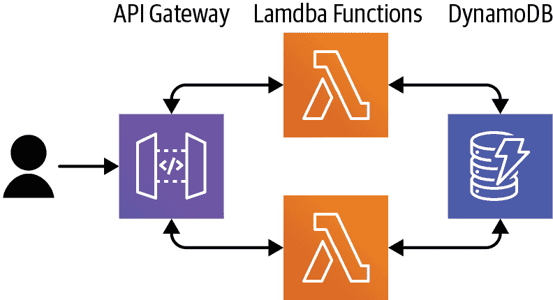
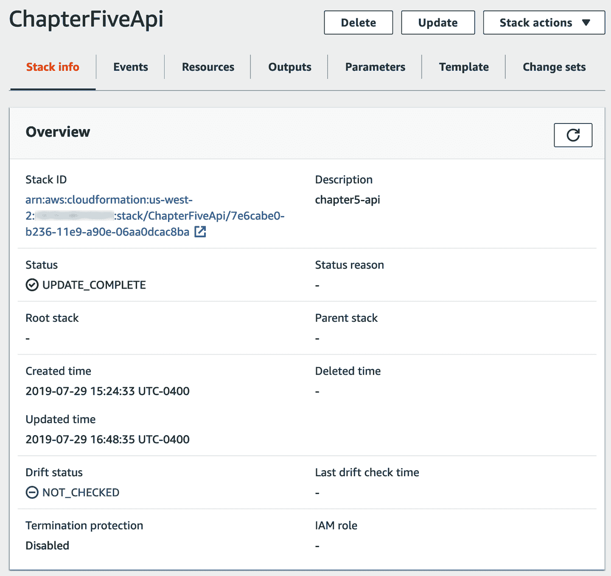
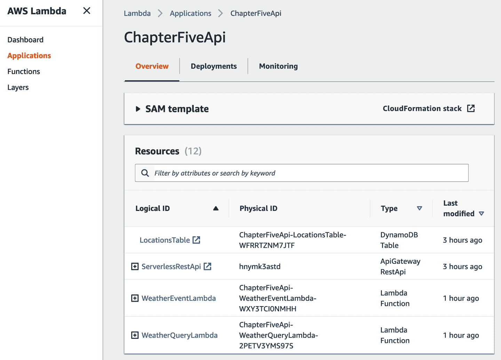
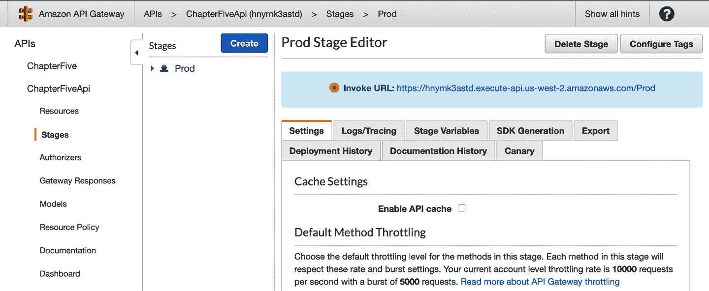
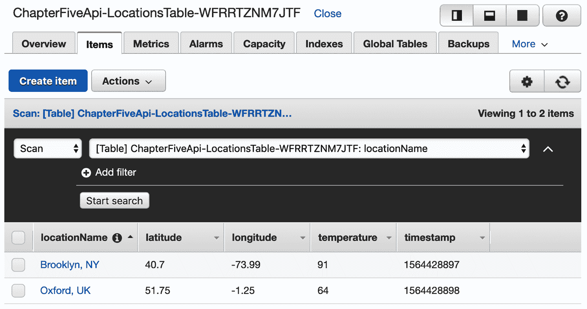
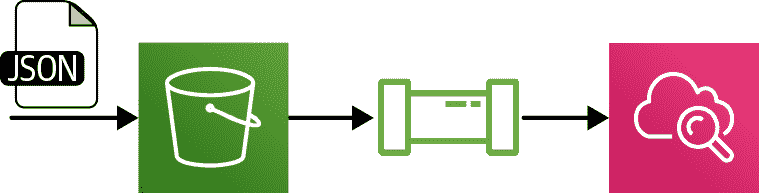
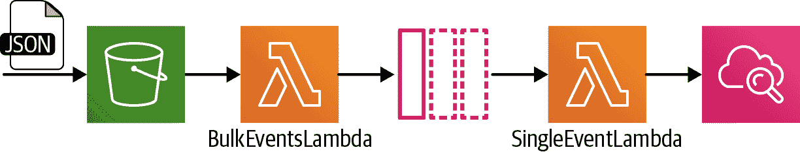
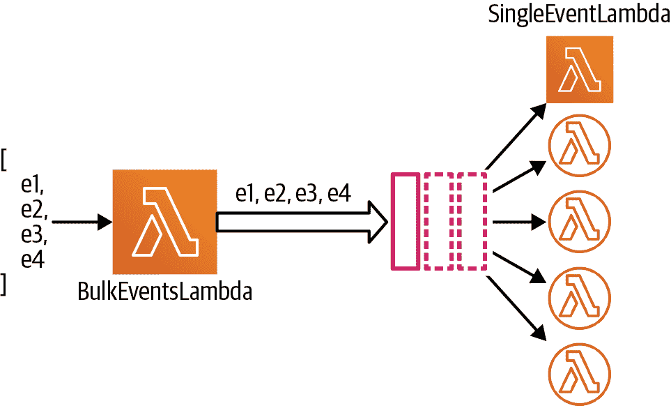
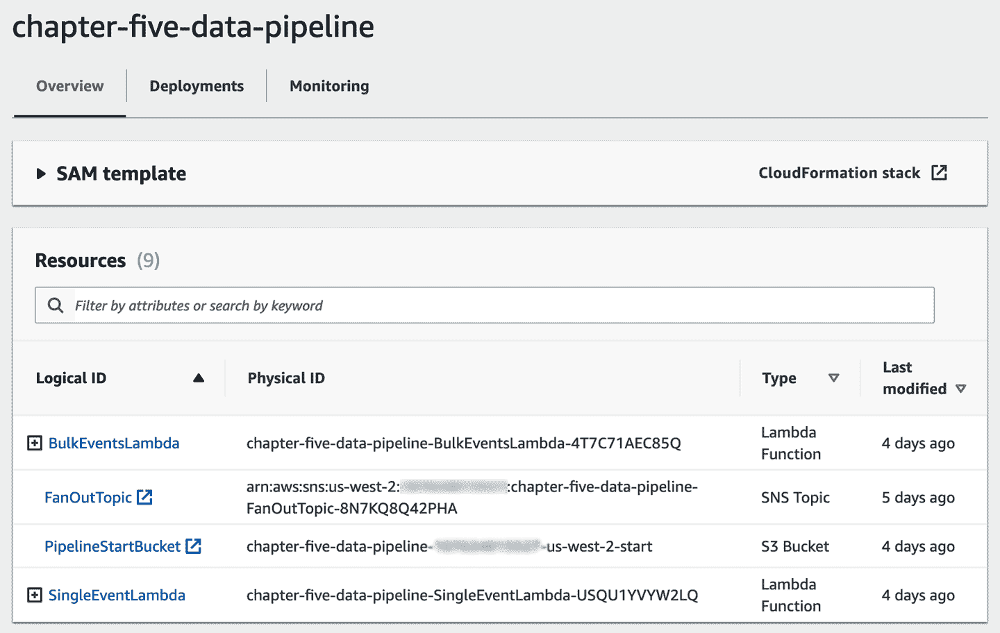

# 第五章：构建无服务器应用程序

到目前为止，我们已经大量讨论了 Lambda 函数——如何编写程序，如何打包和部署它们，如何处理输入和输出等等。然而，Lambda 的一个重要方面，到目前为止我们还没有涉及太多，那就是 Lambda 函数很少直接从我们在不同系统中编写的代码中被调用。相反，对于 Lambda 的绝大多数用法，我们会配置一个*事件源*或*触发器*，它是*另一个 AWS 服务*，然后让 AWS 代替我们调用我们的 Lambda 函数。

我们在“一个 Lambda 应用程序是什么样子？”中看了一些示例：

+   为了实现 HTTP API，我们将 AWS API Gateway 配置为事件源。

+   为了实现文件处理，我们将 S3 配置为事件源。

有许多不同的 AWS 服务直接与 Lambda 集成，甚至还有更多间接集成的服务。这意味着我们可以构建使用 Lambda 作为计算平台的*无服务器应用程序*，可以执行广泛范围的任务。

在本章中，我们将介绍如何将事件源与 Lambda 绑定，然后探讨如何使用这种技术构建特定类型的应用程序。在这个过程中，你将学到更多关于如何从前一章的知识构建、打包和部署基于 Lambda 的应用程序的架构知识。

如果你还没有这样做，你可能希望在尝试本章中的任何示例之前下载[示例源代码](https://oreil.ly/8DQe_)。

# Lambda 事件源

正如你刚刚学到的那样，Lambda 的典型使用模式是将函数绑定到事件源。在本节中，我们描述了构建 Lambda 函数以与特定上游服务集成时要遵循的工作流程。

## 编写代码以处理事件源的输入和输出

当编写 Lambda 函数以响应特定事件源时，你通常首先要做的事情是了解 Lambda 函数将接收到的事件的格式。

我们已经使用过的 SAM CLI 工具有一个有趣的命令可以帮助我们进行这个练习——`sam local generate-event`。如果你运行这个命令，`sam`会列出它可以为其生成存根事件的所有服务，然后你可以检查并使用这些事件来驱动你的代码。例如，`sam local generate-event`的部分输出如下所示：

```java
Commands:
  alexa-skills-kit
  alexa-smart-home
  apigateway
  batch
  cloudformation
  cloudfront
  cloudwatch
  codecommit
  codepipeline
```

假设我们有兴趣构建一个无服务器的 HTTP API。在这种情况下，我们使用 AWS API Gateway 作为我们的上游事件源。如果我们运行`sam local generate-event apigateway`，输出将包括以下内容：

```java
Commands:
  authorizer  Generates an Amazon API Gateway Authorizer Event
  aws-proxy   Generates an Amazon API Gateway AWS Proxy Event
```

原来 API Gateway 可以以多种方式与 Lambda 集成。我们通常从列表中想要的是 aws-proxy 事件，其中 API Gateway 充当 Lambda 函数前面的代理服务器，所以让我们试试这个。

```java
$ sam local generate-event apigateway aws-proxy

{
  "body": "eyJ0ZXN0IjoiYm9keSJ9",
  "resource": "/{proxy+}",
  "path": "/path/to/resource",
  "httpMethod": "POST",
  "isBase64Encoded": true,
  "queryStringParameters": {
    "foo": "bar"
  },
  ....
```

这个 JSON 对象是 Lambda 函数从 API Gateway 接收到的典型事件的完整示例。换句话说，当您设置 API Gateway 作为 Lambda 函数的触发器时，传递给 Lambda 函数的事件参数具有此结构。

这个示例事件并不一定帮助您理解与 API Gateway 集成的语义，但它确实给出了您的 Lambda 函数接收到的事件的结构，从而为编写代码提供了坚实的起点。您可以将此 JSON 对象作为灵感，或者更进一步，实际将其嵌入到一个测试中——详见第六章！

因为您现在知道了您的 Lambda 函数接收到的数据格式，所以可以创建一个处理此格式的处理程序签名。还记得“POJOs 和生态系统类型”吗？现在正要发挥作用了。

设置处理程序的一种选项是创建自己的 POJO 输入类型，以适合传入事件的结构，但仅创建您关心的属性字段。例如，如果您只关心 aws-proxy 事件的 `path` 和 `queryStringParameters` 属性，则可以创建如下的 POJO：

```java
package book.api;

import java.util.Map;

public class APIGatewayEvent {
  public String path;
  public Map<String, String> queryStringParameters;
}
```

第二个选项是使用 AWS 专门为此目的提供的类型库——“AWS Lambda Java Events Library”。如果使用此库，请参阅[文档](https://oreil.ly/5DMvp)，并查找 Maven Central 中的最新版本。

如果您想要使用此库来处理 aws-proxy 事件，那么您需要首先在 Maven 依赖项中包含一个库。如果尚未包含，请将 `<dependencies>` 部分添加到您的 *pom.xml* 文件的根部。否则，请将此 `<dependency>` 子部分添加到现有的 `<dependencies>` 部分中：

```java
<dependencies>
  <dependency>
    <groupId>com.amazonaws</groupId>
    <artifactId>aws-lambda-java-events</artifactId>
    <version>2.2.6</version>
  </dependency>
</dependencies>
```

通过进行这些更新，我们可以使用[`APIGatewayProxyRequestEvent` 类](https://oreil.ly/S1y95)作为我们的输入 POJO。

现在我们有一个代表我们的 Lambda 函数将接收的事件的类。接下来，让我们看看如何为将成为函数响应的事件执行相同的活动。正如您从“输入、输出”中所知，这里再次涉及到 POJOs。

SAM CLI 这次帮不上忙，因此您可以查阅[AWS 文档](https://oreil.ly/RnyUg)来查找有效的输出事件结构并生成自己的输出 POJO 类型，或者您可以再次使用 AWS Lambda Java Events Library。这次，如果要响应 API Gateway 代理事件，请使用 `APIGatewayProxyResponseEvent` 类（参见“API Gateway Proxy Events”）。

假设您想要构建自己的 POJO 类，并且只想在 HTTP 响应中返回一个 HTTP 状态码和 `body`。在这种情况下，您的 POJO 可能如下所示：

```java
package book.api;

public class APIGatewayResponse {
  public final int statusCode;
  public final String body;

  public APIGatewayResponse(int statusCode, String body) {
    this.statusCode = statusCode;
    this.body = body;
  }
}
```

是否使用 AWS 提供的 POJO 类型或自行编码并没有一个特别明确的选择。目前，出于几个原因，我们默认使用 AWS 库：

+   虽然过去这个库在 Lambda 平台上实际可用的内容上落后很多，但现在 AWS 在保持更新方面做得相当不错。

+   类似地，这个库过去引入了大量的 SDK 依赖项，因此会显著增加您的 artifact 大小。现在这方面得到了很大改进，基础 JAR 文件（对包括 API Gateway 和 SNS 在内的很多事件源都足够）不到 100KB。

尽管如此，编写自己的 POJOs 是一个完全合理的方法——这意味着您部署的 artifact 将会更小，减少了代码的库依赖数量（包括传递依赖），并且增加了代码的简洁性，有助于以后的可维护性。在本章中，我们给出了这两种方法的示例。

一旦你编写好基本的 Lambda 函数，就该进行下一步了——配置事件源以便部署。

## 配置 Lambda 事件源

就像有多种部署和配置 Lambda 函数的方式（还记得来自“部署”的长列表吗？），配置事件源也有多种方式。然而，由于本书中我们使用 SAM 来部署代码，因此尽可能多地使用 SAM 来配置我们的事件源是有道理的。

让我们继续我们的 API Gateway 示例。在 SAM 中定义 API Gateway 事件源的最简单方法是在您的 *template.yaml* 中更新 Lambda 函数定义如下：

```java
HelloAPIWorldLambda:
  Type: AWS::Serverless::Function
  Properties:
    Runtime: java8
    MemorySize: 512
    Handler: book.HelloWorldAPI::handler
    CodeUri: target/lambda.zip
    Events:
      MyApi:
        Type: Api
        Properties:
          Path: /foo
          Method: get
```

看看 `Events` 键——那里就是魔法发生的地方。在这种情况下，SAM 所做的事情包括创建一堆资源，包括一个全局可访问的 API 端点（我们在本章后面会详细讨论），但它还配置了 API Gateway 来触发您的 Lambda 函数。

SAM 可以直接配置[许多不同的事件源](https://oreil.ly/s_4W2)。然而，如果它对您的需求不足够，您总是可以降低到更低级别的 CloudFormation 资源。

## 理解不同的事件源语义

在第一章中我们描述了 Lambda 函数可以以两种方式被调用——同步和异步，并展示了这些不同的调用类型在不同场景中的应用。

不出所料，这意味着至少有两种不同类型的事件源——像 API Gateway 这样的，同步调用 Lambda 函数并等待回复（“同步事件源”），以及异步调用 Lambda 函数并且不等待回复的其他事件源（“异步事件源”）。

在前一组的情况下，您的 Lambda 函数需要返回适当类型的响应，就像我们之前在 API 网关中所做的那样。对于后一组，您的处理函数可以具有 `void` 返回类型，表明您不返回响应。

实际上，可以方便地说，*所有*事件源都适合这两种类型中的一种，但不幸的是，有一个小复杂性 —— 还有第三种类型，即流/队列事件源，例如：

+   Kinesis 数据流

+   DynamoDB Streams

+   简单队列服务（SQS）

在这三种情况下，我们都配置 Lambda *平台* 以从上游服务中*轮询*事件，与其他所有事件源不同，其中我们直接从上游服务配置 Lambda 触发器以*推送*事件到 Lambda。

对于流/队列源的这种反向操作对 Lambda 处理程序编程模型没有影响 —— 方法签名完全相同。例如，以下是 SQS 的 Lambda 处理程序事件格式（请注意 `Records` 数组）：

```java
{
  "Records": [
    {
      "messageId": "19dd0b57-b21e-4ac1-bd88-01bbb068cb78",
      "receiptHandle": "MessageReceiptHandle",
      "body": "Hello from SQS!",
      "attributes": {
        "ApproximateReceiveCount": "1",
        "SentTimestamp": "1523232000000",
        "SenderId": "123456789012",
        "ApproximateFirstReceiveTimestamp": "1523232000001"
      },
      "messageAttributes": {},
      "md5OfBody": "7b270e59b47ff90a553787216d55d91d",
      "eventSource": "aws:sqs",
      "eventSourceARN": "arn:aws:sqs:us-east-1:123456789012:MyQueue",
      "awsRegion": "us-east-1"
    }
  ]
}
```

表 5-1\. Lambda 事件源类型

| 事件源类型 | 事件源 |
| --- | --- |
| 同步 |

API 网关，Amazon CloudFront（Lambda@Edge），弹性负载均衡（应用程序负载均衡器），Cognito，Lex，Alexa，Kinesis 数据 Firehose

|

| 异步 |
| --- |

S3，SNS，Amazon SES，CloudFormation，CloudWatch 日志，CloudWatch 事件，CodeCommit，Config

|

| 流/队列 |
| --- |

Kinesis 数据流，DynamoDB Streams，简单队列服务（SQS）

|

流/队列事件源在错误处理方面也有一些不同（参见 “错误处理”）。但目前，我们已经了解了足够的关于事件源的信息，可以探索一些详细的示例。让我们深入研究我们的无服务器 HTTP API。

# 示例：构建无服务器 API

在第 1 章中，我们简要讨论了 Lambda 如何作为 Web API 的一部分使用。在本节中，我们将展示这是如何构建的。

## 行为

此应用程序允许客户端向 API 上传天气数据，然后允许其他客户端检索该数据（图 5-2）。



###### 图 5-2\. 使用 AWS Lambda 的 Web API

写入路径包括向端点 `/events` 发出 HTTP POST 请求，并在请求的 `body` 中包含以下 JSON 数据结构：

```java
{
  "locationName":"Brooklyn, NY",
  "temperature":91,
  "timestamp":1564428897,
  "latitude": 40.70,
  "longitude": -73.99
}
```

读取路径包括向端点 `/locations` 发出 GET 请求，该端点返回我们已保存数据的每个位置的最新天气数据。此数据的格式是一个 JSON 对象列表，格式与写入路径相同。可以添加可选的查询字符串参数 `limit` 到 GET 请求中，以指定返回的最大记录数。

## 架构

我们使用 AWS API Gateway 来实现此应用程序的所有 HTTP 元素。 读路径和写路径使用两个不同的 Lambda 函数实现。 这些由 API Gateway 触发。 我们将数据存储在 DynamoDB 表中。 DynamoDB 是亚马逊的“NoSQL”数据库服务。 对于许多无服务器系统来说，它是一个很好的选择，因为：

+   它提供与 Lambda 相同的“轻量级操作”模型——我们配置我们想要的表结构，亚马逊处理所有运行时考虑因素。

+   它可以在全“按需”缩放模式下使用，根据实际使用情况进行上下调整，就像 Lambda 一样。

因为 DynamoDB 是一种 NoSQL 技术，它并不适合所有应用程序，但它绝对是快速入门的一种方式。

在我们这个示例中的 DynamoDB 表中，我们声明了一个名为`locationName`的主键，并使用“按需”容量控制。

我们将所有这些资源——一个 API 网关定义、两个 Lambda 函数和一个 DynamoDB 表——视为一个统一的“无服务器应用程序”。 我们将代码、配置和基础设施定义作为一个整体部署单元。 尽管这不是一个新的想法，但将数据库封装在服务中是微服务架构的一个相当普遍的想法。

除了添加一个有用的分组外，使用无服务器应用程序的想法还有助于解决一些人在考虑他们在组织中可能拥有的 Lambda 函数数量时的担忧——已经足够困难组织成百上千个微服务，但一家公司可能最终会拥有数千或数万个 Lambda 函数。 我们如何管理所有这些函数？ 通过在无服务器应用程序内命名空间化函数，并通过标记或定位这些应用程序的部署版本来按环境/阶段进行分类，我们可以开始为混乱带来一些秩序。 无服务器应用程序的这个概念不仅仅是设计时的考虑——AWS 实际上直接支持它（参见“部署”）。

## Lambda Code

###### 注意

在本书的这一点上，我们不讨论错误检查或测试——我们为了例子的清晰性已经做过了。 别担心——这两个重要的主题稍后会在本书中讨论！

我们之前提到，当使用 Lambda 实现应用程序时，你需要做的第一件事情之一就是理解 Lambda 函数将接收的事件格式以及 Lambda 函数应返回的响应格式（如果有）。

我们之前已经检查了 API Gateway 的代理类型。 在这个天气 API 中，我们编写自己的类来进行 POJO 序列化和反序列化，而不是使用 AWS 提供的库。 例子 5-1 和 5-2 足以满足我们对两个 Lambda 函数的需求。

##### 示例 5-1\. 用于反序列化 API 请求

```java
package book.api;

import java.util.HashMap;
import java.util.Map;

public class ApiGatewayRequest {
  public String body;
  public Map<String, String> queryStringParameters = new HashMap<>();
}
```

##### 示例 5-2\. 用于序列化 API 响应

```java
package book.api;

public class ApiGatewayResponse {
  public Integer statusCode;
  public String body;

  public ApiGatewayResponse(Integer statusCode, String body) {
    this.statusCode = statusCode;
    this.body = body;
  }
}
```

总体上，我们并不推荐一般情况下采用这种方法——请参见前文有关是否使用 AWS POJO 类型库的讨论“编写用于事件源输入和输出的代码”——但我们希望展示两种方法的示例。本章的第二个示例使用了 AWS 库。当您使用 Lambda 构建自己的 HTTP API 的生产实现时，可以将`com.amazonaws.services.lambda.runtime.events`包中的`APIGatewayProxyRequestEvent`和`APIGatewayProxyResponseEvent`类替换为这些 DIY 类。

现在让我们详细查看实现此应用程序所需的代码。我们从写入路径开始。

### 使用 WeatherEventLambda 上传天气数据

我们知道，处理上传数据的代码大致的骨架如下：

```java
package book.api;

public class WeatherEventLambda {
  public ApiGatewayResponse handler(ApiGatewayRequest request) {
    // process request

    // send response
    return new ApiGatewayResponse(200, ..).;
  }
}
```

我们首先需要捕获事件的输入。Lambda 反序列化已经为我们开始了这项工作，而传递给我们函数的`ApiGatewayRequest`对象的结构如下：

```java
{
  "body": "{\"locationName\":\"Brooklyn, NY\", \"temperature\":91,...",
  "queryStringParameters": {}
}
```

在这个 Lambda 函数中，我们并不关心`queryStringParameters`字段——那将在查询函数中使用——因此我们现在可以忽略它。

那个`body`字段有点棘手——客户端上传的 JSON 对象仍然序列化为字符串值。这是因为 Lambda 仅对 API Gateway 创建的事件进行了反序列化；它也不能反序列化天气数据的“下一层级”。

不管怎样，我们可以对`body`进行自己的反序列化，其中一种方法是使用[Jackson 库](https://github.com/FasterXML/jackson)。

一旦我们反序列化了天气数据，我们就可以将其保存到数据库中。示例 5-3 展示了 Lambda 函数的完整代码——您可能还想打开*chapter5-api*目录中的示例代码。

##### 示例 5-3\. WeatherEventLambda 处理程序类

```java
package book.api;

import com.amazonaws.services.dynamodbv2.AmazonDynamoDBClientBuilder;
import com.amazonaws.services.dynamodbv2.document.DynamoDB;
import com.amazonaws.services.dynamodbv2.document.Item;
import com.amazonaws.services.dynamodbv2.document.Table;
import com.fasterxml.jackson.databind.DeserializationFeature;
import com.fasterxml.jackson.databind.ObjectMapper;

import java.io.IOException;

public class WeatherEventLambda {
  private final ObjectMapper objectMapper =
      new ObjectMapper()
          .configure(
              DeserializationFeature.FAIL_ON_UNKNOWN_PROPERTIES,
              false);
  private final DynamoDB dynamoDB = new DynamoDB(
      AmazonDynamoDBClientBuilder.defaultClient());
  private final String tableName = System.getenv("LOCATIONS_TABLE");

  public ApiGatewayResponse handler(ApiGatewayRequest request)
    throws IOException {

    final WeatherEvent weatherEvent = objectMapper.readValue(
        request.body,
        WeatherEvent.class);

    final Table table = dynamoDB.getTable(tableName);
    final Item item = new Item()
        .withPrimaryKey("locationName", weatherEvent.locationName)
        .withDouble("temperature", weatherEvent.temperature)
        .withLong("timestamp", weatherEvent.timestamp)
        .withDouble("longitude", weatherEvent.longitude)
        .withDouble("latitude", weatherEvent.latitude);
    table.putItem(item);

    return new ApiGatewayResponse(200, weatherEvent.locationName);
  }
}
```

首先，您可以看到我们在处理程序函数外创建了一些实例变量。我们在“扩展”中讨论了为什么要这样做，但总结一下，Lambda 平台通常会多次使用同一个 Lambda 函数实例（虽然不会同时），因此我们可以通过仅为 Lambda 函数实例的生命周期创建某些东西来优化性能。

第一个实例变量是 Jackson 的`ObjectMapper`，第二个是 DynamoDB SDK。第三个也是最后一个实例变量是我们想要使用的 DynamoDB 中的表名。其精确值来自我们的基础设施模板，因此我们使用环境变量来配置我们的 Lambda 函数，就像我们在“环境变量”中讨论的那样。

类的剩余部分是我们的 Lambda 处理函数。首先，您可以看到签名，与我们正在处理的事件源所期望的类型相符。不过，这里有一个小的额外声明，即我们的 Lambda 处理程序声明可能会抛出异常——这是完全有效的，我们在 “错误处理” 中进一步讨论错误处理。

处理程序的第一行对原始 HTTP 请求的 `body` 字段中嵌入的天气事件进行反序列化处理。`WeatherEvent` 在其自己的类中定义，详情见 示例 5-4。

##### 示例 5-4\. WeatherEvent 类

```java
package book.api;

public class WeatherEvent {
  public String locationName;
  public Double temperature;
  public Long timestamp;
  public Double longitude;
  public Double latitude;

  public WeatherEvent() {
  }

  public WeatherEvent(String locationName, Double temperature,
            Long timestamp, Double longitude, Double latitude) {

    this.locationName = locationName;
    this.temperature = temperature;
    this.timestamp = timestamp;
    this.longitude = longitude;
    this.latitude = latitude;
  }
}
```

在这种情况下，Jackson 使用无参构造函数，并根据原始 Lambda 事件的 `body` 字段中的值填充对象的字段。

现在我们已经捕获了完整的天气事件，我们可以将其保存到数据库中。我们不打算在这里详细介绍如何使用 DynamoDB，但从代码中可以看出：

+   我们使用表名的环境变量来连接到我们想要的表。

+   我们使用 DynamoDB Java SDK 的“文档模型”将数据保存到表中，使用位置名称作为主键。

最后，我们需要返回一个响应。由于到目前为止一切正常（目前为止！），返回 HTTP 200（“OK”）响应是正确的做法，为了让客户端更清楚我们实际做了什么，我们返回保存的位置名称。

这就是我们处理 API 写路径所需的所有代码。现在让我们看看读路径。

### 使用 WeatherQueryLambda 读取天气数据

如您所料，`WeatherQueryLambda` 类似于 `WeatherEventLambda`，但相反。代码详见 示例 5-5。

##### 示例 5-5\. WeatherQueryLambda 处理程序类

```java
package book.api;

import com.amazonaws.services.dynamodbv2.AmazonDynamoDB;
import com.amazonaws.services.dynamodbv2.AmazonDynamoDBClientBuilder;
import com.amazonaws.services.dynamodbv2.model.ScanRequest;
import com.amazonaws.services.dynamodbv2.model.ScanResult;
import com.fasterxml.jackson.databind.ObjectMapper;

import java.io.IOException;
import java.util.List;
import java.util.stream.Collectors;

public class WeatherQueryLambda {
  private final ObjectMapper objectMapper = new ObjectMapper();
  private final AmazonDynamoDB dynamoDB =
      AmazonDynamoDBClientBuilder.defaultClient();
  private final String tableName = System.getenv("LOCATIONS_TABLE");

  private static final String DEFAULT_LIMIT = "50";

  public ApiGatewayResponse handler(ApiGatewayRequest request)
    throws IOException {

    final String limitParam = request.queryStringParameters == null
        ? DEFAULT_LIMIT
        : request.queryStringParameters.getOrDefault(
            "limit", DEFAULT_LIMIT);
    final int limit = Integer.parseInt(limitParam);

    final ScanRequest scanRequest = new ScanRequest()
        .withTableName(tableName)
        .withLimit(limit);
    final ScanResult scanResult = dynamoDB.scan(scanRequest);

    final List<WeatherEvent> events = scanResult.getItems().stream()
        .map(item -> new WeatherEvent(
            item.get("locationName").getS(),
            Double.parseDouble(item.get("temperature").getN()),
            Long.parseLong(item.get("timestamp").getN()),
            Double.parseDouble(item.get("longitude").getN()),
            Double.parseDouble(item.get("latitude").getN())
        ))
        .collect(Collectors.toList());

    final String json = objectMapper.writeValueAsString(events);

    return new ApiGatewayResponse(200, json);
  }
}
```

我们看到一组类似的实例变量。DynamoDB 的变量略有不同，因为 DynamoDB SDK 的 API，但 Jackson 的变量是相同的，并且再次捕获指定表名的环境变量。

在 `WeatherEventLambda` 处理程序中，我们关注输入事件的 `body` 字段。这次我们关注 `queryStringParameters` 字段，特别是 `limit` 参数，如果设置了的话。如果设置了，我们就使用它。否则，默认情况下，我们从 DynamoDB 中检索的最大记录数为 50。

接下来的几个语句从 DynamoDB 中读取数据，在此之后，我们将 DynamoDB 结果转换回 `WeatherEvent` 对象。获取了天气事件之后，我们再次使用 Jackson 创建一个 JSON 字符串响应返回给客户端。

最后，我们发送我们的 API 响应——再次设置 200 OK 作为状态码，但这次将有用的响应放在 `body` 字段中。

这就是全部的代码了！即使使用 Java 的冗长，我们也有一个完整的 HTTP API，可以读取和写入数据库的值。但是，当然，定义应用程序不仅仅是我们的代码。正如我们在第四章中看到的，我们还需要构建和打包我们的代码。而且我们实际上还需要定义我们的基础设施。

接下来我们来看构建和打包。

## 使用 AWS SDK BOM 进行构建和打包

在第四章中，我们展示了如何使用 Maven 构建和打包 Lambda 应用程序。在这个示例中，我们将使用我们在那里描述的 ZIP 格式，所以我们需要一个*pom.xml*文件和一个组件描述文件。后者与我们之前看到的没有什么不同，所以我们在这里忽略它。

让我们快速看一下*pom.xml*文件，为了简洁起见稍微减少了一些内容：

##### 示例 5-6\. HTTP API 的部分 Maven POM 文件

```java
<project>
  <dependencyManagement>
    <dependencies>
      <dependency>
        <groupId>com.amazonaws</groupId>
        <artifactId>aws-java-sdk-bom</artifactId>
        <version>1.11.600</version>
        <type>pom</type>
        <scope>import</scope>
      </dependency>
    </dependencies>
  </dependencyManagement>

  <dependencies>
    <dependency>
      <groupId>com.amazonaws</groupId>
      <artifactId>aws-lambda-java-core</artifactId>
      <version>1.2.0</version>
      <scope>provided</scope>
    </dependency>
    <dependency>
      <groupId>com.amazonaws</groupId>
      <artifactId>aws-java-sdk-dynamodb</artifactId>
    </dependency>
    <dependency>
      <groupId>com.fasterxml.jackson.core</groupId>
      <artifactId>jackson-databind</artifactId>
      <version>2.10.1</version>
    </dependency>
  </dependencies>

  <!-- Other sections would follow -->
</project>
```

我们在这里添加的一个元素是自第四章以来的`<dependencyManagement>`部分。在这个标签中，我们引用了一个名为`aws-java-sdk-bom`的依赖关系。这个有用的元素是 Maven 的一个特性，称为“材料清单”（BOM），实质上它将一组库的版本依赖项分组。我们在这里使用它是为了确保我们使用的任何 AWS Java SDK 依赖项在版本上保持同步。

在这个特定项目中，我们实际上只使用了一个 AWS Java SDK 库——`aws-java-sdk-dynamodb`，因此对于这个示例来说使用 BOM 不是很必要。但是许多 Lambda 应用程序使用多个 AWS SDK，因此从稳定的基础开始是很有用的。

您还可以看到我们在`<dependency>`部分没有定义`aws-java-sdk-dynamodb`的版本，因为它使用 BOM 中定义的版本。但我们仍然需要声明`aws-lambda-java-core`的版本，因为它不是 AWS Java SDK 的一部分，因此不在 BOM 中——您可以从其名称中看出来它没有“sdk”。您可以在[这篇博客文章](https://oreil.ly/V1x9x)中了解更多关于 AWS Java SDK BOM 的信息。

在这个示例中，我们将两个不同的 Lambda 函数的代码收集到一个压缩包中。在本章后面的下一个示例中，我们展示如何将此包拆分为单独的构件。

定义了依赖项更新后，我们可以像往常一样使用`mvn package`来构建和打包我们的应用程序。

## 基础设施

我们仍然需要定义的一个元素是我们的基础设施模板。

到目前为止，在本书中我们只定义了 Lambda 资源。现在我们需要定义我们的 API Gateway 和我们的数据库。我们应该如何做？示例 5-7 展示了*template.yaml*。

##### 示例 5-7\. HTTP API 的 SAM 模板

```java
AWSTemplateFormatVersion: 2010-09-09
Transform: AWS::Serverless-2016-10-31
Description: chapter5-api

Globals:
  Function:
    Runtime: java8
    MemorySize: 512
    Timeout: 25
    Environment:
      Variables:
        LOCATIONS_TABLE: !Ref LocationsTable
  Api:
    OpenApiVersion: '3.0.1'

Resources:
  LocationsTable:
    Type: AWS::Serverless::SimpleTable
    Properties:
      PrimaryKey:
        Name: locationName
        Type: String

  WeatherEventLambda:
    Type: AWS::Serverless::Function
    Properties:
      CodeUri: target/lambda.zip
      Handler: book.api.WeatherEventLambda::handler
      Policies:
       — DynamoDBCrudPolicy:
           TableName: !Ref LocationsTable
      Events:
        ApiEvents:
          Type: Api
          Properties:
            Path: /events
            Method: POST

  WeatherQueryLambda:
    Type: AWS::Serverless::Function
    Properties:
      CodeUri: target/lambda.zip
      Handler: book.api.WeatherQueryLambda::handler
      Policies:
       — DynamoDBReadPolicy:
           TableName: !Ref LocationsTable
      Events:
        ApiEvents:
          Type: Api
          Properties:
            Path: /locations
            Method: GET
```

让我们从头开始过一遍。

首先我们有我们的 CloudFormation 和 SAM 头文件——这与我们之前见过的没有什么不同。

接下来是一个名为`Globals`的新顶级部分。`Globals`是 SAM 的一个代码优化特性，允许我们在应用程序中定义所有相同类型资源的一些常见属性。我们在这里主要用它来定义稍后在文件中声明的两个 Lambda 函数共同的一些属性。我们已经看到了`Runtime`、`MemorySize`和`Timeout`，但我们在`Environment`键中声明`LOCATIONS_TABLE`的方式，使用了`!Ref`字符串，这是新的——我们稍后会回到这一点。请注意，并非所有函数定义的属性都适用于`Globals`部分，这就是为什么您在`Globals`中没有看到`CodeUri`定义的原因。

最后，在`Globals`部分是 API Gateway 设置的小配置，以使用 SAM 的 API 配置的最新版本。

然后我们进入模板的其余部分，其中包含`Resources`元素。

第一个是新的——它是`AWS::Serverless::SimpleTable`类型。这是 SAM 定义 DynamoDB 数据库的方式。对于简单的配置，这在我们的示例中是可以的。

请注意，我们这里所做的并不仅仅是指向一个已经存在的数据库——我们实际上声明要求 CloudFormation 为我们创建一个数据库，并在与我们的 Lambda 函数等组件相同的堆栈中进行管理。我们所做的就是指定我们希望主键字段命名为什么，AWS 将为我们管理表的一切。

我们甚至不给表一个物理名称——CloudFormation 为我们基于堆栈名称、表的逻辑名称`LocationsTable`以及一些随机生成的唯一性生成一个唯一名称。这一切都很好，但如果我们不知道表的名称，我们怎么能从我们的 Lambda 函数中使用它呢？

这就是我们之前看到的`!Ref LocationsTable`值的作用。CloudFormation 用该字符串替换 DynamoDB 表的物理名称，因此我们的 Lambda 函数具有指向正确位置的环境变量。

离开 DynamoDB 表后，我们看到了我们两个 Lambda 函数的定义。这些元素包含了我们已经涵盖过的许多概念。我们在 第四章 中看到了`Policies`部分——请注意，我们通过以下方式支持最小权限原则：

+   仅允许我们的函数访问一个特定的 DynamoDB 表（见再次使用的`!Ref`）

+   仅为查询数据的 Lambda 函数提供只读访问（通过声明`DynamoDBReadPolicy`策略）

我们还在每个 Lambda 函数中看到了`Events`部分，我们在本章稍作介绍。正如我们当时提到的，这里发生的是 SAM 正在定义一个隐式的 API Gateway，并且将我们的 Lambda 函数与`Events`部分定义的`Path`和`Method`属性附加到该 Gateway。

在许多实际场景中，隐式 API Gateway 配置可能不够满足您的需求，在这种情况下，您可以定义显式的 SAM API Gateway 资源（使用`AWS::Serverless::Api`类型的资源），或者基础 CloudFormation API Gateway 资源类型。如果您使用这些选项中的第一个选项，您可以在 Lambda 函数的 API `Event`属性中添加一个 `RestApiId`属性，以将它们与您自定义的 API 绑定在一起。

您还可以在 CloudFormation/SAM 定义的 API Gateway 中使用 Swagger/Open API。这样，您将获得更好的文档，以及一定程度上的“无需代码”输入验证的机会——但绝对不要依赖 Swagger/API Gateway 作为完整的输入验证器。另外，有些 API Gateway 配置方面的内容只能使用 AWS 自己的[OpenAPI 扩展](https://oreil.ly/Cq-_T)来定义。如果需要的话，我们可以撰写一整本小书，但现在就让你去探索 AWS 文档吧！

这些都有点理论性，但幸运的是，我们已经完成了对模板的查看，所以现在是部署和测试我们的应用程序的时候了！

## 部署

###### 警告

在此示例中，API 是公开可访问的。虽然这对于实验（因为完整的 API 名称不容易被发现）来说是可以的，但这不是你想永远保留的东西，因为任何人都可以读取和写入这个 API。在生产环境中，您至少希望在写入路径周围添加一些安全性，但这超出了我们将在此处涵盖的范围。

部署应用程序时，请使用与之前完全相同的 `sam deploy` 命令（如果需要刷新记忆，请查看“CloudFormation 和 Serverless 应用程序模型”）。唯一可能想要更改的是 `stack-name`，这样你就可以将其部署到一个新的堆栈（例如，`ChapterFiveApi`）。

一旦 SAM 和 CloudFormation 完成，您就会在 CloudFormation 部分的 AWS Web 控制台中部署一个新的堆栈。我们可以在 CloudFormation 部分看到这一点（参见图 5-3）。



###### 图 5-3\. HTTP API 的 CloudFormation 堆栈

CloudFormation 有点低级，因此 AWS 还提供了一种称为*Serverless Application*的视图，可以在此视图中查看此部署，就像我们之前在“架构”中设计的那样。您可以通过 Lambda 控制台的应用程序选项卡访问此视图（参见图 5-4）。



###### 图 5-4\. HTTP API 的无服务器应用程序视图

在此视图中，您可以看到 DynamoDB 表、API Gateway（在 AWS 术语中称为 *RestAPI*）以及我们的两个 Lambda 函数。如果您点击其中任何资源，您将被带到正确的服务控制台，并进入该资源 — 尝试点击*ServerlessRestApi*资源。这将带您进入 API Gateway 控制台。在左侧点击 *Stages*，然后点击 *Prod* — 您应该会看到类似于 Figure 5-5 的内容。



###### Figure 5-5\. HTTP API 的 API Gateway 视图

*Invoke URL* 值是您的 API 的公共访问 URL — 记下来，因为您一会儿会需要它。

您还可以在*无服务器应用程序*视图中看到资源的物理名称具有部分生成/部分随机的结构，正如我们之前讨论的那样。例如，在这种情况下，我们的 DynamoDB 表实际上被命名为 *ChapterFiveApi-LocationsTable-WFRRTZNM7JTF*。确实，如果我们在 Lambda 控制台中查看此应用程序的两个函数之一，我们可以看到`LOCATIONS_TABLE`环境变量已正确设置为此值（参见 Figure 5-6）。


###### Figure 5-6\. HTTP API 的 API Gateway 视图

最后，让我们通过调用两个 API 路径来测试我们的部署。为此，您需要从一会儿前的 URL 获取。

首先，让我们发送一些数据。URL 的基础是来自 API Gateway 控制台的 URL，但我们附加 `/events`。例如，我们可以使用 curl 调用我们的 API，如下所示（请替换为您的 URL）：

```java
$ curl -d '{"locationName":"Brooklyn, NY", "temperature":91,
  "timestamp":1564428897, "latitude": 40.70, "longitude": -73.99}' \
  -H "Content-Type: application/json" \
  -X POST https://hnymk3astd.execute-api.us-west-2.amazonaws.com/Prod/events
```

```java
Brooklyn, NY
```

```java
$ curl -d '{"locationName":"Oxford, UK", "temperature":64,
  "timestamp":1564428898, "latitude": 51.75, "longitude": -1.25}' \
  -H "Content-Type: application/json" \
  -X POST https://hnymk3astd.execute-api.us-west-2.amazonaws.com/Prod/events
```

```java
Oxford, UK
```

这将两个新事件保存到 DynamoDB。您可以通过从无服务器应用程序控制台点击 DynamoDB 表，然后在进入 DynamoDB 控制台后点击*Items*选项卡来验证这一点（参见 Figure 5-7）。



###### Figure 5-7\. HTTP API 的 DynamoDB 表

现在我们可以使用我们应用程序的最后部分 — 从 API 读取。例如，我们可以再次使用 curl，将 `/locations` 添加到 API Gateway 控制台的 URL 中：

```java
$ curl https://hnymk3astd.execute-api.us-west-2.amazonaws.com/Prod/locations
```

```java
[{"locationName":"Oxford, UK","temperature":64.0,"timestamp":1564428898,
  "longitude":-1.25,"latitude":51.75},
  {"locationName":"Brooklyn, NY","temperature":91.0,
  "timestamp":1564428897,"longitude":-73.99,"latitude":40.7}]
```

正如预期的那样，这将返回我们已存储天气信息的位置列表。

恭喜！您已经构建了您的第一个完整的无服务器应用程序！虽然它只有一个简单的功能，但想象一下它具有的所有*非功能*能力 — 它可以自动扩展以处理大量负载，然后在不使用时自动缩减，它跨多个可用区具有容错能力，其基础设施会自动更新以包括关键安全补丁，并且除此之外，还有很多其他功能。

现在让我们看一个不同类型的应用程序，使用其他几个不同的 AWS 服务。

# 示例：构建无服务器数据流水线

在 第一章 中，我们列出了 Lambda 的两个用例（“Lambda 应用是什么样子？”）。第一个是我们刚刚详细描述的 HTTP API——Lambda 的同步使用示例。第二个用例是文件处理——将文件上传到 S3，然后使用 Lambda 处理该文件。

在这个示例中，我们在第二个想法的基础上构建了一个 *数据流水线*。数据流水线是一种模式，其中我们将多个异步阶段和数据处理分支串在一起。这是一种流行的模式，云资源的可伸缩性为批处理系统提供了实时的替代方案。

此示例的另一个重要元素是，我们将改变应用程序的构建和打包阶段，以创建每个 Lambda 函数的隔离输出工件。随着 Lambda 函数中代码的增加——无论是特定于函数的代码还是作为库导入的代码——部署和启动将变慢。分解打包工件是减轻这种问题的一种有效技术。

让我们开始吧。

## 行为

这个示例是我们在前一个示例中开始的另一种天气事件系统。这次，一个应用程序将一个 JSON 文件中的“天气事件”列表上传到 S3。数据流水线将处理这个文件，目前的副作用只是将事件记录到 AWS CloudWatch Logs 中（图 5-8）。



###### 图 5-8\. 数据流水线示例行为

## 架构

我们刚刚展示的是此应用程序的 *行为* ——*架构* 还有一些更多的细节（图 5-9）。



###### 图 5-9\. 数据流水线示例架构

我们从一个 S3 存储桶开始这个应用程序。将文件上传到 S3，或者按 S3 的术语说是一个 *对象*，将会（异步地）触发一个 Lambda 函数。这个第一个函数（`BulkEventsLambda`）将读取天气事件的 JSON 列表，将它们分开成单个事件，并且将每个事件发布到一个 SNS 主题上。这反过来会（再次异步地）触发第二个 Lambda 函数（`SingleEventLambda`），这个函数将处理每个天气事件。在我们的案例中，这仅仅意味着记录事件。

显然，这种架构对于仅记录上传文件的内容来说过于复杂了！然而，这个示例的重要之处在于它提供了一个应用程序的“行走骨架”，具有完整、可部署的、多阶段数据流水线。您可以将其作为添加有趣处理逻辑的起点。

所有这些组件都被视为一个统一部署的无服务器应用程序，就像我们在 HTTP API 示例中所做的那样。

现在我们将进一步深入讨论架构的每个阶段。

### S3

S3 是 AWS 中历史最悠久的服务之一，正如我们在“云的增长”中所描述的。虽然它经常在系统的应用架构中使用，但在部署和操作 AWS 应用程序时也很普遍——在本书中，我们在部署基于 Lambda 的应用程序时已多次使用了 S3。

此外，我们认为 S3 至少在 AWS 上是最早的无服务器 BaaS 产品之一。如果我们回顾第一章中“区分”无服务器的因素，我们可以看到它符合所有标准：

不需要管理长期运行的主机或应用实例

是的——当我们使用 S3 时，我们没有“文件服务器”或其他需要管理的内容。

自动按负载自动扩展和自动供应

是的，我们不需要手动配置 S3 的容量——它会自动扩展总存储空间和流量。

其费用基于精确的使用量，从零使用到高使用

是的！如果您有一个空的存储桶，您不需要支付任何费用。或者，您的费用将取决于存储的字节数量、流量量和存储类别（请参阅下一点）。

以除主机大小/数量以外的术语定义的性能能力

是的，再次确认！S3 的性能能力是您选择的存储类别——您需要多快访问数据。您希望能够更快地访问数据，您就需要支付更多费用。

具有隐式高可用性

是的。S3 在一个区域内的多个可用区之间复制数据。如果一个可用区出现问题，您仍然可以访问所有数据。

由于 S3 是无服务器的，它与 Lambda 是极好的伙伴，尤其是因为它们具有类似的扩展能力。此外，S3 通过允许 Lambda 函数在 S3 存储桶中的数据更改时触发 Lambda 函数，与 Lambda 直接集成。这种以事件驱动方式自动响应 S3 中的变化，而不是从长时间运行的传统进程中轮询 S3 查找变化，从基础设施成本的角度来看更清晰、更易于理解和更高效。

在这两个示例中使用的所有非 Lambda 服务——API 网关、DynamoDB、S3 和 SNS——都是 AWS 生态系统中的无服务器 BaaS 服务。

现在，我们不会在示例中提供将“上传客户端”到 S3，而是使用 AWS 工具来处理上传。在真实应用中，您可以选择允许您的最终用户客户端通过“签名 URL”直接上传到 S3——这是一种“纯”无服务器方法，因为您不仅不运行服务器，实际上还将行为推送到客户端，这可能是您以前在服务器端应用程序中实现的行为。

### Lambda 函数

当您稍后查看 Lambda 函数的代码时，您不会遇到任何新东西，因为您已经学到了所有的知识。与第一个示例不同的唯一真正区别是，这些函数不需要返回任何值，因为它们是异步调用的。

也许你心中会有一个问题，为什么我们要将每个事件的处理分别调用到单独的 Lambda 函数中呢？这种模式我们通常称为*扇出*。或者说，它是“映射-减少”系统中的“映射”部分，使用 Lambda 的原因有几点。

第一个原因是引入并行性。每个 SNS 消息将触发我们的`SingleEventLambda`函数的新调用。对于 Lambda 函数的每次调用，如果前一次调用未完成，Lambda 平台将自动创建 Lambda 函数的新实例，并调用该实例。在我们的示例应用程序中，如果您上传一个包含一百个事件的文件，而每个事件单独需要至少几秒钟来处理，那么 Lambda 将创建一百个`SingleEventLambda`实例，并并行处理每个天气事件（图 5-10）。



###### 图 5-10\. 数据管道扇出

Lambda 的这种可扩展性非常有价值，我们将在第八章进一步讨论（“扩展”](ch08.html#lambda-scaling)）。

引入扇出的第二个原因是，如果每个单独事件的处理时间较长——比如几分钟。在这种情况下，处理一百个天气事件将超过 Lambda 的最大 15 分钟超时限制，但是将每个事件放入其自己的 Lambda 调用中意味着我们可能可以避免超时问题。

还有其他解决 Lambda 超时限制的方法。一种替代方法（有些危险——请参阅以下警告！）是在 Lambda 函数中使用递归调用。在第三章（“超时”](ch03.html#lambda-timeout)）中，我们看到可以使用传递给 Lambda 处理程序的`Context`对象的`getRemainingTimeInMillis()`方法来跟踪函数直到超时的剩余时间。使用此值的策略是异步直接调用当前正在运行的相同 Lambda 函数，但仅使用剩余要处理的数据。

如果您的数据需要按线性顺序处理，这比“扇出”更好的选择。

###### 警告

当递归调用 Lambda 函数时要小心，因为很容易出现无法停止的情况，可能会出现两种情况：(a) 永远不会停止，和/或 (b) 扩展函数到数百或数千个实例宽度。这两种情况都会严重影响您的 AWS 账单！由于情况 (b)，我们建议在极少数情况下，递归 Lambda 调用有意义时，使用低“保留并发”配置（见“保留并发”）。

### SNS

SNS 是 AWS 的消息服务之一。一方面，SNS 提供了一个简单的[publish-subscribe 消息总线](https://oreil.ly/D5jdc)；另一方面，它还提供了发送*SMS*文本消息和类似的面向人类的消息的能力。在我们的示例中，我们只关心第一个！

SNS 是另一个无服务器服务。您需要负责请求 AWS 创建一个主题，然后 AWS 在幕后处理该主题的所有扩展和操作。

使用 SNS SDK 发布带有字符串内容的消息到主题非常简单，我们稍后会看到。SNS 还有多种订阅类型，但在这个例子中，我们（毫不意外地）只使用 Lambda 订阅类型。其工作原理是，当消息发布到主题时，该主题的所有订阅者都将收到消息。对于 Lambda 来说，Lambda 平台将接收消息，然后异步调用我们与订阅关联的 Lambda 函数。

在我们的示例中，我们希望每次上传文件中的天气事件时都会异步调用 Lambda 函数。我们本可以直接从 Lambda SDK 调用`Invoke`方法，直接（但异步地）从`BatchEventsLambda`调用`SingleEventLambda`，但我们选择了使用 SNS 作为中介——为什么呢？

这是因为我们希望减少两个 Lambda 函数之间的结构耦合。我们希望`BatchEventsLambda`知道它的责任是分割一批天气事件，但我们不一定希望它涉及接下来这些天气事件的处理。如果稍后决定改变我们的架构，使每个事件由多个消费者处理，或者可能用 AWS Step Functions 服务替代`SingleEventLambda`，那么`BatchEventsLambda`的代码就不需要改变。

最后，我们选择了 SNS，因为它在 Lambda 应用程序中简单且普遍存在。AWS 提供了许多其他的消息系统——SQS、Kinesis 和 Event Bridge 就是其中一些例子，你甚至可以使用 S3！选择哪种服务实际上取决于你的应用程序具体的需求，以及每种服务的不同能力。为应用程序选择正确的消息服务可能有些棘手，因此进行适当的研究是值得的。

## Lambda 代码

我们的代码由三个类组成。

第一个与我们在第一个示例中相同的`WeatherEvent`，但复制到一个新的包中，原因稍后将会更加清晰。

### 使用 BulkEventsLambda 处理批处理

接下来的类是我们的`BulkEventsLambda`代码。

正如我们已经讨论过的，首先要做的是了解输入事件的格式。

如果我们运行`sam local generate-event s3`，我们可以看到 S3 可以生成“puts”（创建和更新）和“deletes”事件。我们关心前者，示例事件如下（为了简洁起见做了一些修剪）：

```java
{
  "Records": [
    {
      "eventSource": "aws:s3",
      "awsRegion": "us-east-1",
      "eventTime": "1970-01-01T00:00:00.000Z",
      "eventName": "ObjectCreated:Put",
      "s3": {
        "bucket": {
          "name": "example-bucket",
          "arn": "arn:aws:s3:::example-bucket"
        },
        "object": {
          "key": "test/key",
          "size": 1024
        }
      }
    }
  ]
}
```

首先要注意的是，事件包含一个 `Records` 数组。实际上，S3 只会发送一个包含正好一个元素的数组，但是如果容易这样做，为此进行防御性编码是一个好的实践。

接下来要注意的是，我们知道是哪个对象引起了这个事件——在存储桶 `example-bucket` 中的 `test/key`。重要的是要记住，尽管我们经常将其视为文件系统，但 S3 实际上不是文件系统，它是一个键值存储，其中键可以看作是文件系统中的路径。

最后要注意的是，我们并不接收上传对象的内容，我们只知道对象的 *位置*。在我们的示例应用程序中，我们需要内容，因此我们需要自己从 S3 加载对象。

在这个示例中，我们将使用 `aws-lambda-java-events` 库中的 `S3Event` 类作为我们的输入事件 POJO。这个类引用了 `aws-java-sdk-s3` SDK 库中的其他类型，因此我们也需要在我们的库依赖中加入它。不过，从希望尽量减少库依赖的角度来看，因为我们在这个类中直接调用了 S3 SDK，所以这是可以接受的。

`S3Event` 对象及其字段包含了输入事件所需的一切，由于这个函数是异步的，所以没有返回类型。这意味着我们已经完成了 POJO 定义阶段，可以开始编写代码了。

我们将 Example 5-8 的 `package` 和 `import` 行省略了，因为它们太多了，但如果你有兴趣看到它们，请下载本书的示例代码。

##### 示例 5-8\. BulkEventsLambda.java

```java
public class BulkEventsLambda {
  private final ObjectMapper objectMapper =
      new ObjectMapper()
          .configure(
              DeserializationFeature.FAIL_ON_UNKNOWN_PROPERTIES,
              false);
  private final AmazonSNS sns = AmazonSNSClientBuilder.defaultClient();
  private final AmazonS3 s3 = AmazonS3ClientBuilder.defaultClient();
  private final String snsTopic = System.getenv("FAN_OUT_TOPIC");

  public void handler(S3Event event) {
    event.getRecords().forEach(this::processS3EventRecord);
  }

  private void processS3EventRecord(
      S3EventNotification.S3EventNotificationRecord record) {

    final List<WeatherEvent> weatherEvents = readWeatherEventsFromS3(
        record.getS3().getBucket().getName(),
        record.getS3().getObject().getKey());

    weatherEvents.stream()
        .map(this::weatherEventToSnsMessage)
        .forEach(message -> sns.publish(snsTopic, message));

    System.out.println("Published " + weatherEvents.size()
              + " weather events to SNS");
  }

  private List<WeatherEvent> readWeatherEventsFromS3(String bucket, String key) {
    try {
      final S3ObjectInputStream s3is =
          s3.getObject(bucket, key).getObjectContent();
      final WeatherEvent[] weatherEvents =
          objectMapper.readValue(s3is, WeatherEvent[].class);
      s3is.close();
      return Arrays.asList(weatherEvents);
    } catch (IOException e) {
      throw new RuntimeException(e);
    }
  }

  private String weatherEventToSnsMessage(WeatherEvent weatherEvent) {
    try {
      return objectMapper.writeValueAsString(weatherEvent);
    } catch (JsonProcessingException e) {
      throw new RuntimeException(e);
    }
  }
}
```

处理方法循环处理 `S3Event` 中的每个记录。我们知道应该只有一个记录，但如果不是这样，这段代码也能保险地处理。

代码的其余部分的要求相当简单：

1.  从 S3 中读取上传的 JSON 对象。

1.  将 JSON 对象反序列化为 `WeatherEvent` 对象列表。

1.  对于每个 `WeatherEvent` 对象，将其重新序列化为 JSON…

1.  …然后将其发布到 SNS。

如果您查看代码，您会看到所有这些都得到了表达。我们像在第一个示例中一样使用 Jackson 进行序列化/反序列化。我们两次使用 AWS SDK——一次从 S3 中读取 (`s3.getObject()`)，一次发布到 SNS (`sns.publish()`)。虽然这些是不同的 SDK，每个都需要自己的库依赖，但它们在使用上感觉与之前的 DynamoDB SDK 大致相同。

值得注意的一点是，就像第一个例子中一样，我们在创建与 AWS SDK 的连接时从未提供任何凭据：当我们在`AmazonSNSClientBuilder`和`AmazonS3ClientBuilder`上调用`defaultClient()`时，没有用户名或密码。这是因为在 Lambda 中运行时，Java AWS SDK 默认使用我们为 Lambda 配置的 Lambda 执行角色（我们在“身份和访问管理”中讨论过）。这意味着没有密码可以从我们的源代码中泄漏！

### 处理单个天气事件使用 SingleEventLambda

进入我们的最后一个类。你现在应该已经掌握了，所以让我们快速过一遍！

首先是输入事件。运行 `sam local generate-event sns notification` 给我们以下结果，再次略作修整：

```java
{
  "Records": [
    {
      "EventSubscriptionArn": "arn:aws:sns:us-east-1::ExampleTopic",
      "Sns": {
        "Type": "Notification",
        "MessageId": "95df01b4-ee98-5cb9-9903-4c221d41eb5e",
        "TopicArn": "arn:aws:sns:us-east-1:123456789012:ExampleTopic",
        "Subject": "example subject",
        "Message": "example message",
        "Timestamp": "1970-01-01T00:00:00.000Z",
        }
      }
  ]
}
```

与 S3 类似，我们的输入事件由单元素记录列表`Records`组成。在`Record`内部，以及其中的`Sns`对象中，有许多字段。在这个例子中，我们关心的是`Message`，但 SNS 消息还提供了一个`Subject`字段。

我们再次使用 `aws-lambda-java-events` 库，就像我们与 `BulkEventsLambda` 一样，但这次我们要使用 `SNSEvent` 类。 `SNSEvent` 不需要任何其他 AWS SDK 类，因此无需向我们的 Maven 依赖中添加任何进一步的库。

同样，这是一种异步事件类型，因此没有需要担心的返回类型。

现在看代码（参见示例 5-9）！这里再次省略了`package`和`import`语句，但如果你想看到它们，可以在书的可下载代码中找到。

##### 示例 5-9\. SingleEventLambda Handler 类

```java
public class SingleEventLambda {
  private final ObjectMapper objectMapper =
      new ObjectMapper()
          .configure(
              DeserializationFeature.FAIL_ON_UNKNOWN_PROPERTIES,
              false);

  public void handler(SNSEvent event) {
    event.getRecords().forEach(this::processSNSRecord);
  }

  private void processSNSRecord(SNSEvent.SNSRecord snsRecord) {
    try {
      final WeatherEvent weatherEvent = objectMapper.readValue(
          snsRecord.getSNS().getMessage(),
          WeatherEvent.class);
      System.out.println("Received weather event:");
      System.out.println(weatherEvent);
    } catch (IOException e) {
      throw new RuntimeException(e);
    }
  }
}
```

这次我们的代码更简单了：

1.  再次对多个 `SNSRecord` 事件进行防御性编码（尽管应该只有一个）。

1.  从 SNS 事件中反序列化 `WeatherEvent`。

1.  记录 `WeatherEvent` 的日志（我们将在第七章更详细地讨论日志记录）。

这次没有提及 SDK，因为输入事件包含了我们关心的所有数据。

## 使用多模块和隔离的构建和打包

所有代码编写完毕，现在是构建和打包我们的应用程序的时候了。

从流程角度来看，这个例子与我们之前覆盖的内容没有任何不同——我们将在运行 `sam deploy` 之前运行 `mvn package`。

不过，这个例子有一个重要的结构性差异——我们为每个 Lambda 函数创建单独的 ZIP 文件构件。每个 ZIP 文件仅包括一个 Lambda 处理程序的类及其所需的库依赖关系。

虽然对于这样大小的应用程序来说做这些有些不必要，但随着你的应用程序变得更大，考虑分解构件是有价值的几个原因：

+   冷启动时间将会缩短（我们将在“冷启动”中详细讨论冷启动）。

+   由于每次部署只上传与更改函数相关的工件（假设使用我们在第四章中介绍的可复制构建插件），因此从本地机器部署的时间通常会减少。

+   为了避免 Lambda 的工件大小限制，您可能需要这样做。

最后一点涉及 Lambda 中（未压缩）函数工件的 250MB 大小限制。如果您有 10 个 Lambda 函数，每个函数都有不同的依赖关系，并且它们的组合（未压缩）工件大小超过 250MB，那么您需要为每个函数分割工件，以确保可以进行部署。

那么我们该如何实现这一点呢？

一种思考方法是，我们实际上正在为我们的无服务器应用程序构建一个非常小的[单库](https://oreil.ly/p8jk_)。也许你可以将它想象成一个“无服务器应用程序 MiniMono”。常规的单库包含一个仓库中的多个项目；我们的 MiniMono 将包含一个 Maven 项目中的多个 Maven 模块。尽管 Maven 有其缺点，但作为声明多个组件之间的依赖关系及其对外部库依赖的方式，它确实表现得非常好。而 IntelliJ 在解析多模块 Maven 项目方面表现得非常出色。

正确配置多模块 Maven 项目有点繁琐，因此我们将在此逐步进行。我们强烈建议您下载示例代码并在 IntelliJ 中打开它，因为这样更容易理解。

### 顶层项目

我们的顶层*pom.xml*文件将类似于示例 5-10。我们已经剪切了一些内容以清楚解释。

##### 示例 5-10。数据管道应用程序的父项目 pom.xml

```java
<project>
  <groupId>my.groupId</groupId>
  <artifactId>chapter5-Data-Pipeline</artifactId>
  <version>1.0-SNAPSHOT</version>
  <packaging>pom</packaging>

  <modules>
    <module>common-code</module>
    <module>bulk-events-stage</module>
    <module>single-event-stage</module>
  </modules>

  <dependencyManagement>
    <dependencies>
      <dependency>
        <groupId>com.amazonaws</groupId>
        <artifactId>aws-java-sdk-bom</artifactId>
        <version>1.11.600</version>
        <type>pom</type>
        <scope>import</scope>
      </dependency>
      <dependency>
        <groupId>com.amazonaws</groupId>
        <artifactId>aws-lambda-java-events</artifactId>
        <version>2.2.6</version>
      </dependency>
      <!-- etc -->
    </dependencies>
  </dependencyManagement>

  <build>
    <pluginManagement>
      <plugins>
        <plugin>
          <artifactId>maven-assembly-plugin</artifactId>
          <version>3.1.1</version>
          <executions>
            <execution>
              <id>001-make-assembly</id>
              <phase>package</phase>
              <goals>
                <goal>single</goal>
              </goals>
            </execution>
          </executions>
          <configuration>
            <appendAssemblyId>false</appendAssemblyId>
            <descriptors>
              <descriptor>src/assembly/lambda-zip.xml</descriptor>
            </descriptors>
            <finalName>lambda</finalName>
          </configuration>
        </plugin>
        <plugin>
          <groupId>io.github.zlika</groupId>
          <artifactId>reproducible-build-maven-plugin</artifactId>
          <version>0.10</version>
          <executions>
            <execution>
              <id>002-strip-jar</id>
              <phase>package</phase>
              <goals>
                <goal>strip-jar</goal>
              </goals>
            </execution>
          </executions>
          <configuration>
            <outputDirectory>${project.build.directory}</outputDirectory>
          </configuration>
        </plugin>
      </plugins>
    </pluginManagement>
  </build>
</project>
```

这里有几个要点：

+   我们在顶层添加了`<packaging>pom</packaging>`标签——这表明这是一个多模块项目。

+   我们在`<modules>`部分包含模块列表。

+   注意，此时我们并不声明任何模块间的依赖关系。

+   所有我们的外部依赖项（不仅仅是 AWS SDK BOM）都移到了`<dependencyManagement>`部分。在此声明整个项目中的所有依赖关系会让生活更轻松，并且保证依赖版本在整个项目中是统一的，但您也不必这样做。

+   我们很快就会看到，模块将声明它们需要哪些外部依赖关系。

+   请注意，我们仍然有我们在第一个示例中讨论过的 AWS SDK BOM。我们将构建插件定义移动到`<pluginManagement>`部分，以便模块可以使用它们。

+   组装插件的配置仍然在*src/assembly/lambda-zip.xml*中，或者您可以使用我们在 Maven Central 为您创建的版本。

+   这里有很多其他“Maven 魔法”的细节我们就不深入讨论了！

有了我们的顶层项目，现在我们可以创建我们的模块了。

### 这些模块

我们为每个模块创建一个子目录，其名称与项目 *pom.xml* 中模块列表的各元素相同。

在每个模块子目录中，我们创建一个新的 *pom.xml*。我们从 *common-code* 开始，这让我们可以编写被 Lambda 构件共享的代码。在我们的示例中，它包含 `WeatherEvent` 类。

再次强调，所有这些 Maven 示例都稍作裁剪，请查看书籍源代码获取完整版本。

##### 示例 5-11\. *common-code* 的模块 pom.xml

```java
<project>
  <parent>
    <groupId>my.groupId</groupId>
    <artifactId>chapter5-Data-Pipeline</artifactId>
    <version>1.0-SNAPSHOT</version>
  </parent>

  <artifactId>common-code</artifactId>

  <build>
    <plugins>
      <plugin>
        <artifactId>reproducible-build-maven-plugin</artifactId>
        <groupId>io.github.zlika</groupId>
      </plugin>
    </plugins>
  </build>
</project>
```

我们声明我们的父级，我们模块的 `artifactId`（为了明智起见，应与模块名称相同），然后我们声明要使用的构建插件。对于这个模块，我们只创建一个常规的 JAR 文件，只包含模块本身的代码。这意味着我们不需要组装 ZIP 文件，但我们仍然希望利用可重复生成的构建插件。插件的配置来自父 bom 中 `<pluginManagement>` 部分的定义。

注意，由于此模块目前没有任何依赖项，因此没有 `<dependencies>` 部分。

接下来，在 *bulk-events-stage* 子目录中，我们按照 示例 5-12 中所示创建 *pom.xml*。

##### 示例 5-12\. *bulk-events-stage* 的模块 pom.xml

```java
<project>
  <parent>
    <groupId>my.groupId</groupId>
    <artifactId>chapter5-Data-Pipeline</artifactId>
    <version>1.0-SNAPSHOT</version>
  </parent>

  <artifactId>bulk-events-stage</artifactId>

  <dependencies>
    <dependency>
      <groupId>my.groupId</groupId>
      <artifactId>common-code</artifactId>
      <version>${project.parent.version}</version>
    </dependency>
    <dependency>
      <groupId>com.amazonaws</groupId>
      <artifactId>aws-lambda-java-events</artifactId>
    </dependency>
    <!-- etc. -->
  </dependencies>

  <build>
    <plugins>
      <plugin>
        <artifactId>maven-assembly-plugin</artifactId>
      </plugin>
      <plugin>
        <artifactId>reproducible-build-maven-plugin</artifactId>
        <groupId>io.github.zlika</groupId>
      </plugin>
    </plugins>
  </build>
</project>
```

`<parent>` 部分与 *common-code* 相同，`<artifactId>` 遵循之前的规则。

这次我们确实有依赖项。第一个是我们如何声明一个模块间的依赖，本例中是对 *common-code* 模块的依赖。请注意，我们从父模块中获取版本。然后我们声明所有外部依赖项。请注意，这些依赖项没有版本号—版本号来自父 *pom.xml* 中的 `<dependency-management>` 部分（或者从 AWS SDK BOM 中传递获取）。

最后，在 `<build>` 部分中，我们声明我们的构建插件。这次我们需要创建一个 ZIP 文件（这将是仅用于 `BulkEventsLambda` 函数的 ZIP 文件），因此我们包含对 `maven-assembly-plugin` 的引用。再次强调，插件的配置在父 *pom.xml* 中定义。

*single-event-stage* *pom.xml* 看起来几乎与 *bulk-events-stage* *pom.xml* 相同，但依赖项较少。

Maven POM 文件完成后，我们在每个模块中创建 *src* 目录。项目目录树的最终结果如下所示：

```java
.
+--> bulk-events-stage
|    +--> src/main/java/book/pipeline/bulk
|    |                                +--> BulkEventsLambda.java
|    +--> pom.xml
+--> common-code
|    +--> src/main/java/book/pipeline/common
|    |                                +--> WeatherEvent.java
|    +--> pom.xml
+--> single-event-stage
|    +--> src/main/java/book/pipeline/single
|    |                                +--> SingleEventLambda.java
|    +--> pom.xml
+--> src/assembly
|        +--> lambda-zip.xml
+--> pom.xml
+--> template.yaml
```

运行 `mvn package` 以创建此多模块项目中每个 Lambda 模块目录中的单独 *lambda.zip* 文件。

由于我们有互不依赖的并行模块，实际上我们可以微调 Maven 的使用以增加构建性能。运行 `mvn package -T 1C` 将使 Maven 在可以时使用多个操作系统线程，每个核心一个。

## 基础设施

尽管我们的 Java 项目结构发生了显著变化，但我们的 SAM 模板并没有变化很多。让我们看看它是如何变化的，以及我们在示例 5-13 中使用的其他 AWS 资源。

##### 示例 5-13\. 数据流水线的 SAM 模板

```java
AWSTemplateFormatVersion: 2010-09-09
Transform: AWS::Serverless-2016-10-31
Description: chapter5-data-pipeline

Globals:
  Function:
    Runtime: java8
    MemorySize: 512
    Timeout: 10

Resources:
  PipelineStartBucket:
    Type: AWS::S3::Bucket
    Properties:
      BucketName: !Sub ${AWS::StackName}-${AWS::AccountId}-${AWS::Region}-start

  FanOutTopic:
    Type: AWS::SNS::Topic

  BulkEventsLambda:
    Type: AWS::Serverless::Function
    Properties:
      CodeUri: bulk-events-stage/target/lambda.zip
      Handler: book.pipeline.bulk.BulkEventsLambda::handler
      Environment:
        Variables:
          FAN_OUT_TOPIC: !Ref FanOutTopic
      Policies:
       — S3ReadPolicy:
           BucketName: !Sub ${AWS::StackName}-${AWS::AccountId}-${AWS::Region}-start
       — SNSPublishMessagePolicy:
           TopicName: !GetAtt FanOutTopic.TopicName
      Events:
        S3Event:
          Type: S3
          Properties:
            Bucket: !Ref PipelineStartBucket
            Events: s3:ObjectCreated:

  SingleEventLambda:
    Type: AWS::Serverless::Function
    Properties:
      CodeUri: single-event-stage/target/lambda.zip
      Handler: book.pipeline.single.SingleEventLambda::handler
      Events:
        SnsEvent:
          Type: SNS
          Properties:
            Topic: !Ref FanOutTopic
```

首先，在我们的记忆中仍然清晰时，让我们看看多模块 Maven 项目引起的差异。唯一的更新是 Lambda 函数的`CodeUri`属性——在 API 示例中，我们曾经对两个函数都使用相同的`target/lambda.zip`值，现在对于`BulkEventsLambda`是`bulk-events-stage/target/lambda.zip`，对于`SingleEventLambda`是`single-event-stage/target/lambda.zip`。

好了，现在让我们回到顶部。

`Globals`部分这次稍微小了些。这是因为 Lambda 函数之间没有共享的环境变量，而且我们也不需要任何 API 配置。

在`Resources`下，首先声明了我们的 S3 存储桶。您可以在这里添加很多属性——与访问控制相关的属性尤其受欢迎。我们通常喜欢添加的一件事是服务器端加密以及生命周期策略。但在这里，我们保持默认设置。这里有一件事是显式声明的名称。通常情况下，我们不希望这样做，而是让 CloudFormation 为我们生成一个唯一的名称，但由于 CloudFormation 的 S3 资源的一个恼人的特性，如果我们不声明一个名称，那么我们将与文件的一些其他元素产生循环依赖。

S3 存储桶名称在所有 AWS 区域和账户中必须是全局唯一的。如果您在 us-east-1 区域创建一个名为*sheep*的存储桶，那么您不能在 us-west-2 中再创建另一个名为*sheep*的存储桶（除非您首先删除 us-east-1 中的存储桶），并且我根本无法创建名为“sheep”的存储桶。这意味着当您通过像 CloudFormation 这样的自动化工具显式创建存储桶名称时，您需要包含各种上下文唯一的方面，以避免命名冲突。

例如，我们使用以下声明的存储桶名称：

```java
!Sub ${AWS::StackName}-${AWS::AccountId}-${AWS::Region}-start
```

这里涉及一些 CloudFormation 的智能操作，所以让我们来详细解析一下。

首先，`!Sub`是另一个[*内部函数*](https://oreil.ly/NaRtL)，就像第一个示例中的`!Ref`一样。`!Sub`用于替换字符串中的变量。通常您会使用模板参数中声明的变量，但在这种情况下，我们使用 CloudFormation 的[*伪参数*](https://oreil.ly/LUtMC)——由 CloudFormation 代表我们定义的变量。假设我创建了一个名为*my-stack*的堆栈，我们的账户 ID 是 123456，并且我们在 us-west-2 中创建了该堆栈，那么该堆栈中的存储桶名称将是*my-stack-123456-us-west-2-start*。

下一个资源是我们的 SNS 主题。看——没有属性！SNS 部分可配置，但也可以完全不配置就使用。

然后我们有我们的两个 Lambda 函数。

`BulkEventsLambda` 具有一个环境变量，引用了 SNS 主题的 Amazon 资源名称 (ARN)。[SNS 主题 CloudFormation 文档](https://oreil.ly/r6oVW) 告诉我们，在 Topic 资源上调用 `!Ref` 返回其 ARN。

对于这个 Lambda 函数的安全性，我们需要从 S3 存储桶中读取数据（我们在首次声明存储桶时使用相同的名称），并且我们需要写入（或发布）到 SNS 主题。对于 SNS 主题，安全策略不需要 ARN（这是当我们在主题资源上调用 `!Ref` 时返回的内容），它需要主题的名称。为了获得该名称，我们使用第三个内置函数 `!GetAtt`。`!GetAtt` 允许我们从 CloudFormation 资源中读取次要返回值。同样地，在查看 SNS 文档时，我们可以看到在请求 `TopicName` 时返回的名称，因此值为 `!GetAtt FanOutTopic.TopicName`。

最后，对于 `BulkEventsLambda`，我们需要声明事件源。这是 S3 存储桶，并且我们在 `Events` 字段中声明我们关心的 S3 事件类型。如果您愿意，您可以在这里进行更详细的描述，例如包括过滤模式，以仅触发特定 S3 键的事件。

正如您所预期的那样，`SingleEventLambda` 更简单，因为它不调用任何 AWS 资源。对于这个函数，我们只需要声明事件源，即 SNS 主题，它通过主题的 ARN 引用。

## 部署

部署类似于您之前看到的内容。再次，我们使用无服务器应用程序的原则，将所有组件集体部署。

部署此应用程序有一个小的更改。因为我们在手动定义的 S3 存储桶名称中使用了堆栈名称，所以必须仅使用小写字母（因为 S3 存储桶不能以大写字母命名）：

```java
$ sam deploy \
  --s3-bucket $CF_BUCKET \
  --stack-name chapter-five-data-pipeline \
  --capabilities CAPABILITY_IAM
```

应用程序部署后，您可以通过 Lambda 应用程序控制台或 CloudFormation 控制台探索已部署的组件。图 5-11 展示了 Lambda 应用程序中的外观。



###### 图 5-11\. 数据管道的无服务器应用程序视图

单击资源将带您进入 AWS 控制台的各自部分。要测试此应用程序，我们需要将文件上传到 S3。其中一种选项是通过 Web 控制台手动执行此操作。

一个更加自动化的方法如下所示。

首先，查询 CloudFormation 获取 S3 存储桶的名称，并将其分配给一个 shell 变量：

```java
$ PIPELINE_BUCKET="$(aws cloudformation describe-stack-resource \
  --stack-name chapter-five-data-pipeline \
  --logical-resource-id PipelineStartBucket \
  --query 'StackResourceDetail.PhysicalResourceId' \
  --output text)"
```

现在使用 AWS CLI 来上传示例文件：

```java
$ aws s3 cp sampledata.json s3://${PIPELINE_BUCKET}/sampledata.json
```

现在查看 `SingleEventLambda` 函数的日志，您会看到，几秒钟后，每个天气事件都将分别记录。

恭喜！您已经构建了第二个无服务器应用程序！

想象一下，通过 AWS 提供的大量服务，可以构建无数种不同类型的无服务器应用程序。而且，这还没有考虑到从 Lambda 调用 AWS 之外的服务的完全有效能力！

我们希望本章为您展示了可能性。仅凭几个文本文件，几分钟或几秒钟就能部署完整的、多组件的应用程序，然后再将其拆除，这构建了一个非常有价值的“应用程序沙盒”环境，也能扩展到真正的生产使用。

# 摘要

我们从学习如何从其他 AWS 服务触发 Lambda 函数开始本章。理解这一点是接受无服务器架构的重要第一步。

接着，我们探讨了两个示例无服务器应用程序——完全包含的 AWS 资源组。第一个例子是一个基于数据库的 HTTP API，使用了两个同步调用的 Lambda 函数，以及 AWS 服务 API Gateway 和 DynamoDB。

第二个例子是一个由两个异步处理阶段组成的无服务器数据流水线，包括扇出设计。这个例子使用了 Lambda、S3 和 SNS。在这个例子中，我们还探讨了使用多模块 Maven 项目创建“无服务器应用 MiniMono”的方法。

您现在已经掌握了构建无服务器 AWS 应用程序的框架：

1.  确定您希望您的应用程序具有的*行为*。

1.  通过选择哪些服务来实现系统的不同方面，并定义这些服务之间的交互，设计您应用程序的*架构*。

1.  编写*Lambda 代码*来：

    +   处理正确的事件类型。

    +   在下游服务上执行必要的副作用。

    +   在相关情况下，返回正确的响应。

1.  使用 CloudFormation/SAM 模板配置您的*基础设施*。

1.  使用正确的 AWS 工具进行*部署*。

到目前为止，我们所有的测试都是非常手动的。我们如何利用自动化测试技术来做得更好？这是我们在下一章中要探讨的内容。

# 练习

1.  另一个很好的 Lambda“入门”事件源是 CloudWatch 定时事件，我们可以使用它来构建“无服务器定时任务”。我们在“示例：Lambda‘定时任务’”中描述了 Lambda 的这种使用方式。建立一个 Lambda 函数，每分钟运行一次，并且暂时只在调用时写出一个日志声明。请参阅[SAM 文档](https://oreil.ly/C_FhY)了解如何设置此触发器。

1.  更新上一个练习中的定时事件 Lambda，以将消息发布到 SNS，类似于本章前面所做的`BulkEventsLambda`。更新您的 SNS 主题，以向您的手机发送 SMS 或文本消息（请参阅[AWS 文档](https://oreil.ly/TrQct)以了解如何操作）。

1.  重新实现本章的数据管道示例，使用 SQS 队列而不是 SNS 主题，在两个 Lambda 之间传递消息。关于此，可以参考 Lambda 文档中的 [这里](https://oreil.ly/LKekx) 和 [这里](https://oreil.ly/Cbvb3)。
