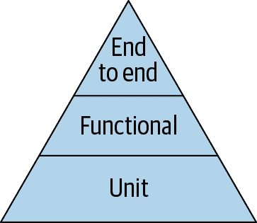

# 第六章。测试

一个良好的测试套件，就像房子的坚实基础一样，为我们提供了一个已知的系统行为基准，我们可以在其上放心地构建。这个基准给了我们信心，可以添加功能，修复错误，并进行重构，而不用担心会破坏系统的其他部分。当集成到开发工作流程中时，同样的测试套件还通过更容易维护现有测试和添加新测试来鼓励良好的实践。

当然，基础并非免费。维护测试的努力必须与测试提供的价值相平衡。如果我们把所有精力都花在测试上，就没有剩余精力来处理系统的其他部分了。

对于无服务器应用程序来说，划分有价值测试和脆弱技术债务之间的界限比以往任何时候都更加困难。幸运的是，我们可以使用一个熟悉的模型来帮助考虑这些权衡。

# 测试金字塔

经典的“测试金字塔”（来自 2009 年迈克·科恩的书《成功的敏捷》中，图 6-1 显示的图 6-1）对我们帮助决定写哪种测试是一个有用的指南。金字塔的比喻说明了在给定切片中测试的数量、这些测试的价值以及编写、运行和维护它们的成本之间的权衡。



###### 图 6-1。测试金字塔

在无服务器世界中进行测试与传统应用程序并没有实质性的区别，特别是在金字塔的基础部分。然而，与由不同组件和服务组成的任何分布式系统一样，更高级别的“端到端”测试更具挑战性。在本章中，我们将从金字塔底部到顶部讨论测试，并且会沿途提供大量示例。

## 单元测试

金字塔的基础是单元测试 —— 这些测试应该针对我们应用程序的特定组件进行测试，而不依赖于任何外部依赖项（如数据库）。单元测试应该快速执行，并且在开发过程中我们应该能够定期（甚至自动化地）运行它们，配置最小化且无需网络访问。我们应该有足够多的单元测试来确保我们的代码正常工作。单元测试不仅覆盖“正常路径”，还要彻底处理边缘情况和错误处理。即使是一个小应用程序也可能有数十甚至数百个单元测试。

## 功能测试

金字塔的中间是功能测试。像单元测试一样，这些测试应该快速执行，并且不应依赖外部依赖项。与单元测试不同的是，我们可能需要模拟或存根这些外部依赖项，以满足测试组件的运行时要求。

而不是试图详尽地执行我们代码的每个逻辑分支，我们的功能测试解决组件的主要代码路径，特别关注失败模式。

## 端到端测试

位于金字塔顶端的是端到端测试。端到端测试向应用程序提交输入（通常通过正常的用户界面或 API），然后对输出或副作用进行断言。与功能测试不同，端到端测试针对完整的应用程序及其所有外部依赖项在类似生产的环境中运行（尽管通常与生产隔离）。

因为端到端测试比功能和单元测试更昂贵（就运行时间和基础设施成本而言），通常您只应测试一些重要的情况。一个很好的经验法则是至少有一个端到端测试覆盖应用程序中最重要的路径（例如，在在线购物应用程序中的购买路径）。

# 重构以进行测试

我们将使用我们在第五章中构建的无服务器数据流水线作为基础，构建一套单元测试、功能测试和端到端测试。在我们开始之前，让我们做一点重构，使我们的数据流水线 Lambdas 更容易测试。

从前一节中回顾，单元测试会测试我们应用程序的特定组件的具体部分。在我们的情况下，我们指的是构成我们 Lambda 函数的 Java 类中的方法。我们希望编写测试，为某些方法提供输入，并断言这些方法的输出（或副作用）是否符合我们的预期。

首先，让我们回顾一下`BulkEventsLambda`，牢记测试金字塔的单元和功能切片。这个相对简单的 Lambda 函数与两个外部 AWS 服务（S3 和 SNS）以及序列化和反序列化 JSON 数据进行交互。

# 重访 BulkEventsLambda

每当文件上传到特定的 S3 存储桶时，就会触发`BulkEventsLambda`。处理程序方法会使用一个`S3Event`对象调用。对于该事件中的每个`S3EventNotificationRecord`，Lambda 会从 S3 存储桶中检索一个 JSON 文件。该 JSON 文件包含零个或多个 JSON 对象。Lambda 将 JSON 文件反序列化为一组`WeatherEvent` Java 对象。然后，每个 Java 对象都序列化为一个`String`并发布到一个 SNS 主题。最后，Lambda 函数会向 STDOUT（因此也会向 CloudWatch Logs）写入一个日志条目，指出发送到 SNS 的天气事件的数量。

您在第五章看到的代码是为了清晰而编写和组织的，但不一定是为了便于测试。让我们来看一下`BulkEvents Lambda`类中的四个方法。

首先，`handler`方法，接收一个`S3Event`对象：

```java
public void handler(S3Event event) {
  event.getRecords().forEach(this::processS3EventRecord);
}
```

这是类外唯一可访问的方法——没有重构的话，这意味着对这个类的任何测试*必须*使用一个`S3Event`对象调用此方法。此外，该方法具有`void`返回类型，因此很难断言成功或失败。

接下来，我们看到这个方法为每个传入的事件记录调用了`processS3EventRecord`：

```java
private void processS3EventRecord(
    S3EventNotification.S3EventNotificationRecord record) {

  final List<WeatherEvent> weatherEvents = readWeatherEventsFromS3(
    record.getS3().getBucket().getName(),
    record.getS3().getObject().getKey());

  weatherEvents.stream()
    .map(this::weatherEventToSnsMessage)
    .forEach(message -> sns.publish(snsTopic, message));

  System.out.println("Published " + weatherEvents.size()
    + " weather events to SNS");
}
```

此方法是私有的，因此无法在不将可见性更改为“包私有”（通过删除`private`关键字）的情况下进行测试。与`handler`函数一样，它具有 void 返回类型，因此我们进行的任何断言都将是关于方法的副作用而不是方法的返回值。此方法有两个明确的副作用：

+   `System.out.println`调用。

+   调用`sns.publish`方法，向由`snsTopic`字段命名的主题发送 SNS 消息。由于这是 AWS SDK 调用，必须考虑许多其他环境和系统属性：

    +   必须设置和正确配置适当的 AWS 配置。

    +   配置的 AWS API 端点必须通过网络访问。

    +   必须存在命名的 SNS 主题。

    +   我们正在使用的 AWS 凭据必须具有写入该 SNS 主题的访问权限。

要按照编写的方式调用`processS3EventRecord`，我们必须提前处理所有这些项目。对于单元测试来说，这是不可接受的开销。

此外，如果我们还想断言`processS3EventRecord`是否已正确运行，则需要一种方法来确保 SNS 消息已发送到正确的主题。做法之一是在我们的测试过程中订阅 SNS 主题，并等待预期的消息出现。与以前一样，这对于单元测试来说是不可接受的开销。

在 Java 中测试这些副作用的常见方法是使用诸如[Mockito](https://site.mockito.org)之类的工具来模拟或存根负责这些副作用的类。这使我们能够测试我们自己的应用程序类，这些类产生副作用，通过替换诸如 AWS SDK 之类的模拟对象，看起来和行为类似，但允许我们避免实际设置真实的 SNS 主题。使用诸如[参数捕获](https://oreil.ly/GPdlH)之类的技术，模拟对象还可以保存用于调用它们的参数，这使我们能够断言它们的调用方式——在本例中，我们可以断言`sns.publish`方法是否使用正确的主题名称和消息进行了调用。

要使用这样的模拟 AWS SDK 对象，我们需要一种将其注入到受测试类中的方式——通常是通过接受适当参数的构造函数完成的。`BulkEventsLambda`没有这样的构造函数，因此我们需要添加一个构造函数以便能够使用模拟对象。

`readWeatherEventsFromS3`方法是另一个具有副作用的方法的示例，本例中是远程 API 调用。在这种情况下，它使用 AWS S3 SDK 客户端的`getObject`调用从 S3 下载数据。

然后将数据反序列化为`WeatherEvent`对象集合并返回给调用方：

```java
private List<WeatherEvent> readWeatherEventsFromS3(String bucket, String key) {
  try {
    final S3ObjectInputStream s3is =
      s3.getObject(bucket, key).getObjectContent();
    final WeatherEvent[] weatherEvents =
      objectMapper.readValue(s3is, WeatherEvent[].class);
    s3is.close();
    return Arrays.asList(weatherEvents);
  } catch (IOException e) {
    throw new RuntimeException(e);
  }
}
```

这个方法做了两件完全不同的事情——它从 S3 下载数据，并对该数据进行反序列化。这种行为组合使我们难以测试每个功能片段是否独立。如果我们想测试 JSON 反序列化过程中如何处理错误，我们仍然需要确保方法的输入具有正确的 S3 存储桶和密钥，尽管这些信息与 JSON 处理无关。

最后，`weatherEventToSnsMessage`是一个应该很容易测试的方法示例（如果在`BulkEventsLambda`类外部可见的话）。它接受一个`Weather Event`对象并返回一个`String`，并且不会造成任何副作用。

# 重构 BulkEventsLambda

在审查了`BulkEventsLambda`中的四种方法之后，以下是一些可以更好地实现单元测试和功能测试的方法：

+   通过构造函数参数启用模拟 AWS SDK 类的注入。

+   隔离副作用，因此大多数方法可以在不使用模拟的情况下进行测试。

+   将方法拆分开来，使大多数方法只做一件事情。

## 添加构造函数

在牢记这些事情的情况下，让我们从添加一些构造函数开始：

```java
public BulkEventsLambda() {
  this(AmazonSNSClientBuilder.defaultClient(),
    AmazonS3ClientBuilder.defaultClient());
}

public BulkEventsLambda(AmazonSNS sns, AmazonS3 s3) {
  this.sns = sns;
  this.s3 = s3;
  this.snsTopic = System.getenv(FAN_OUT_TOPIC_ENV);

  if (this.snsTopic == null) {
    throw new RuntimeException(
      String.format("%s must be set", FAN_OUT_TOPIC_ENV));
  }
}
```

现在我们有了两个构造函数。正如我们在第三章中学到的那样，默认的无参数构造函数将在第一次运行我们的函数时由 Lambda 运行时调用。该默认构造函数创建了一个 AWS SDK SNS 客户端和一个 S3 客户端，并将这两个对象传递给第二个构造函数（这种技术称为*构造函数链*）。

第二个构造函数以这些客户端对象为参数。在测试中，我们可以使用这个构造函数来实例化具有模拟 AWS SDK 客户端的`BulkEventsLambda`类。该第二个构造函数还读取`FAN_OUT_TOPIC`环境变量，如果没有设置，则抛出异常。

## 隔离副作用

我们从`BulkEventsLambda`审查中注意到了三个副作用：

+   从 S3 下载 JSON 文件。

+   向 SNS 主题发布消息。

+   写入一条日志到 STDOUT。

前两个对测试环境有一些先决条件，减慢了测试执行速度，并使编写测试变得更加复杂。虽然我们肯定要测试这些副作用（同时使用模拟和实际的 AWS 服务），但将它们隔离到尽可能少的方法中将有助于使我们的单元测试简单而快速。

在那个基础上，让我们看一下两种新方法，以隔离 AWS 的副作用：

```java
private void publishToSns(String message) {
  sns.publish(snsTopic, message);
}

private InputStream getObjectFromS3(
      S3EventNotification.S3EventNotificationRecord record) {

  String bucket = record.getS3().getBucket().getName();
  String key = record.getS3().getObject().getKey();
  return s3.getObject(bucket, key).getObjectContent();
}
```

第一个方法`publishToSns`接受一个`String`参数并向 SNS 主题发布消息。第二个`getObjectFromS3`接受一个`S3EventNotification​Record`并从 S3 下载相应的文件。

现在从重构的`handler`方法中调用这两种方法，这是实现副作用隔离的实际位置：

```java
public void handler(S3Event event) {

  List<WeatherEvent> events = event.getRecords().stream()
    .map(this::getObjectFromS3)
    .map(this::readWeatherEvents)
    .flatMap(List::stream)
    .collect(Collectors.toList());

  // Serialize and publish WeatherEvent messages to SNS
  events.stream()
    .map(this::weatherEventToSnsMessage)
    .forEach(this::publishToSns);

  System.out.println("Published " + events.size()
    + " weather events to SNS");
}
```

在这个新的`handler`方法中还有更多的工作，但现在只需注意`get​ObjectFromS3`和`publishToSns`是从这里调用的（其他地方没有）。

## 分割方法

除了隔离我们的副作用外，新的`handler`方法现在也包含了我们大部分的处理逻辑。这看起来可能与我们的目标相反，但这种“粘合”逻辑协调了许多更简单、单一用途的方法，这些方法更容易进行单元测试。在这种情况下，`readWeatherEvents`方法不再需要访问 S3（或模拟的 S3 客户端）。它的唯一目的是将`InputStream`反序列化为一组`WeatherEvent`对象，并处理错误（通过重新抛出`RuntimeException`来停止 Lambda 函数）。

```java
List<WeatherEvent> readWeatherEvents(InputStream inputStream) {
  try (InputStream is = inputStream) {
    return Arrays.asList(
      objectMapper.readValue(is, WeatherEvent[].class));
  } catch (IOException e) {
    throw new RuntimeException(e);
  }
}
```

注意，我们现在使用了 Java 的[`try-with-resources`特性](https://oreil.ly/LxRNY)来自动关闭输入流。我们还从`weatherEventToSnsMessage`方法中移除了`private`关键字，这样我们的测试类可以根据需要访问它们两者。

# 测试 BulkEventsLambda

现在我们已经重构了代码，让我们为`BulkEventsLambda`添加一些单元测试。

## 单元测试

这些测试完全隔离了副作用 —— 我们无需配置或连接到任何 AWS 服务或其他外部依赖项。这种隔离也意味着这些测试执行速度快，仅需几毫秒。尽管`BulkEventsLambda`相当简单，我们只有几个测试，但是即使以这种风格编写数百个单元测试，也可以在几秒钟内运行。

这是`BulkEventsLambda`的`readWeatherEvents`方法的一个单元测试：

```java
public class BulkEventsLambdaUnitTest {

  @Test
  public void testReadWeatherEvents() {

    // Fixture data
    InputStream inputStream =
      getClass().getResourceAsStream("/bulk_data.json");

    // Construct Lambda function class, and invoke
    BulkEventsLambda lambda =
      new BulkEventsLambda(null, null);
    List<WeatherEvent> weatherEvents =
      lambda.readWeatherEvents(inputStream);

    // Assert
    Assert.assertEquals(3, weatherEvents.size());

    Assert.assertEquals("Brooklyn, NY",
      weatherEvents.get(0).locationName);
    Assert.assertEquals(91.0,
      weatherEvents.get(0).temperature, 0.0);
    Assert.assertEquals(1564428897L,
      weatherEvents.get(0).timestamp, 0);
    Assert.assertEquals(40.7,
      weatherEvents.get(0).latitude, 0.0);
    Assert.assertEquals(-73.99,
      weatherEvents.get(0).longitude, 0.0);

    Assert.assertEquals("Oxford, UK",
      weatherEvents.get(1).locationName);
    Assert.assertEquals(64.0,
      weatherEvents.get(1).temperature, 0.0);
    Assert.assertEquals(1564428897L,
      weatherEvents.get(1).timestamp, 0);
    Assert.assertEquals(51.75,
      weatherEvents.get(1).latitude, 0.0);
    Assert.assertEquals(-1.25,
      weatherEvents.get(1).longitude, 0.0);

    Assert.assertEquals("Charlottesville, VA",
      weatherEvents.get(2).locationName);
    Assert.assertEquals(87.0,
      weatherEvents.get(2).temperature, 0.0);
    Assert.assertEquals(1564428897L,
      weatherEvents.get(2).timestamp, 0);
    Assert.assertEquals(38.02,
      weatherEvents.get(2).latitude, 0.0);
    Assert.assertEquals(-78.47,
      weatherEvents.get(2).longitude, 0.0);
  }

}
```

为了方便起见，我们从磁盘上的 JSON 文件中读取输入数据。然后我们创建了一个`BulkEventsLambda`的实例 —— 请注意，我们只是简单地传入`null`作为 SNS 和 S3 客户端，因为在这个测试中它们根本不需要。调用了`readWeatherEvents`方法，并断言它产生了正确的对象。

我们甚至可以用更少的代码来测试失败的情况：

```java
public class BulkEventsLambdaUnitTest {

  @Rule
  public ExpectedException thrown = ExpectedException.none();

  @Rule
  public EnvironmentVariables environment = new EnvironmentVariables();

  @Test
  public void testReadWeatherEventsBadData() {

    // Fixture data
    InputStream inputStream =
      getClass().getResourceAsStream("/bad_data.json");

    // Expect exception
    thrown.expect(RuntimeException.class);
    thrown.expectCause(
      CoreMatchers.instanceOf(InvalidFormatException.class));
    thrown.expectMessage(
      "Can not deserialize value of type java.lang.Long from String");

    // Invoke
    BulkEventsLambda lambda = new BulkEventsLambda(null, null);
    lambda.readWeatherEvents(inputStream);
  }

}
```

这里我们使用了一个[Junit 规则](https://oreil.ly/YeLiW)，来断言我们的方法是否抛出了预期类型的异常。

就单元测试而言，这些都是简单有效的。对于更复杂的 Lambda 函数，我们可能会有数十个这样的测试，以测试尽可能多的逻辑路径和边缘情况。

## 功能测试

与单元测试类似，我们希望我们的功能测试在不连接到 AWS 的情况下运行。然而，与单元测试不同的是，我们希望将 Lambda 函数作为单个组件进行测试，这意味着我们必须让我们的代码认为它正在与云端通信！为了完成这种欺骗和欺骗的壮举，我们将使用 Mockito 来构建 AWS SDK 客户端的“模拟”实例，配置为返回预先安排的响应以响应方法调用。例如，如果我们的代码调用 S3 客户端的`getObject`方法，我们的模拟将返回一个包含固定测试数据的`S3Object`。

这是一个“正常路径”的功能测试：

```java
public class BulkEventsLambdaFunctionalTest {

  @Test
  public void testHandler() throws IOException {

    // Set up mock AWS SDK clients
    AmazonSNS mockSNS = Mockito.mock(AmazonSNS.class);
    AmazonS3 mockS3 = Mockito.mock(AmazonS3.class);

    // Fixture S3 event
    S3Event s3Event = objectMapper
      .readValue(getClass()
      .getResourceAsStream("/s3_event.json"), S3Event.class);
    String bucket =
      s3Event.getRecords().get(0).getS3().getBucket().getName();
    String key =
      s3Event.getRecords().get(0).getS3().getObject().getKey();

    // Fixture S3 return value
    S3Object s3Object = new S3Object();
    s3Object.setObjectContent(
      getClass().getResourceAsStream(String.format("/%s", key)));
    Mockito.when(mockS3.getObject(bucket, key)).thenReturn(s3Object);

    // Fixture environment
    String topic = "test-topic";
    environment.set(BulkEventsLambda.FAN_OUT_TOPIC_ENV, topic);

    // Construct Lambda function class, and invoke handler
    BulkEventsLambda lambda = new BulkEventsLambda(mockSNS, mockS3);
    lambda.handler(s3Event);

    // Capture outbound SNS messages
    ArgumentCaptor<String> topics =
      ArgumentCaptor.forClass(String.class);
    ArgumentCaptor<String> messages =
      ArgumentCaptor.forClass(String.class);
    Mockito.verify(mockSNS,
      Mockito.times(3)).publish(topics.capture(),
        messages.capture());

    // Assert
    Assert.assertArrayEquals(
      new String[]{topic, topic, topic},
      topics.getAllValues().toArray());
    Assert.assertArrayEquals(new String[]{
      "{\"locationName\":\"Brooklyn, NY\",\"temperature\":91.0,"
        + "\"timestamp\":1564428897,\"longitude\":-73.99,"
        + "\"latitude\":40.7}",
      "{\"locationName\":\"Oxford, UK\",\"temperature\":64.0,"
        + "\"timestamp\":1564428898,\"longitude\":-1.25,"
        + "\"latitude\":51.75}",
      "{\"locationName\":\"Charlottesville, VA\",\"temperature\":87.0,"
        + "\"timestamp\":1564428899,\"longitude\":-78.47,"
        + "\"latitude\":38.02}"
    }, messages.getAllValues().toArray());
  }
}
```

首先要注意的是，这个测试比我们的单元测试*长得多*。大部分额外的代码用于设置模拟对象并配置环境，使得我们的 Lambda 函数的`handler`方法认为自己在云中运行。

第二点需要注意的是，我们正在从磁盘上的文件中读取输入数据。*s3_event.json*是使用此`sam`命令生成的文件：

```java
$ sam local generate-event s3 put > src/test/resources/s3_event.json
```

然后，我们将`key`字段更改为引用另一个本地文件，*bulk_data.json*，它表示将存储在 S3 上的天气数据：

```java
{
  "Records": [
    {
      ...
      "s3": {
        "bucket": {
          "name": "example-bucket",
        ...
        },
        "object": {
          "key": "bulk_data.json",
        }
      }
    }
  ]
}
```

当调用`s3.getObject`方法时，我们的模拟 S3 客户端返回*bulk_data.json*文件的内容，而我们的 Lambda 函数对此一无所知。

最后，我们想要断言`BulkEventsLambda`向 SNS 发布消息，但实际上并不向 AWS 发送消息。在这里，我们使用我们的模拟 SNS 客户端，并捕获传递给`sns.publish`方法的参数。如果该方法以正确的参数调用了预期次数，我们的测试就会通过。

另一个功能测试断言，如果 Lambda 函数接收到不良输入数据，则会引发异常。最后一个测试断言，如果未设置`FAN_OUT_TOPIC`环境变量，则会引发异常。

这些功能测试编写起来更复杂，运行时间稍长，但它们确保了`BulkEventsLambda`在 Lambda 运行时调用`handler`函数并传递`S3Event`对象时的行为符合我们的预期。

# 端到端测试

通过我们的一系列单元测试和功能测试所获得的信心，我们可以将最复杂和成本最高的测试方法集中在应用程序的关键路径上。我们还可以利用基础设施即代码的方法部署我们的无服务器应用程序及其基础设施的完整版本到 AWS，专门用于运行端到端测试。当测试成功完成时，我们将进行清理和拆除。

要运行端到端测试，我们只需执行`mvn verify`命令。这使用了 Maven Failsafe 插件，它会查找以**IT*结尾的测试类，并使用 JUnit 运行它们。在这种情况下，IT 代表集成测试，但这只是 Maven 的命名惯例，我们可以配置 Failsafe 插件使用不同的后缀。

对于我们的端到端测试，我们确切地按照其在生产中的使用方式来运行我们的应用程序。我们将一个 JSON 文件上传到 S3 存储桶，然后断言`Single EventLambda`生成了正确的 CloudWatch Logs 输出。从测试的角度来看，我们的无服务器应用程序就是一个黑盒子。

这是测试方法的主体：

```java
@Test
public void endToEndTest() throws InterruptedException {
  String bucketName = resolvePhysicalId("PipelineStartBucket");
  String key = UUID.randomUUID().toString();
  File file = new File(getClass().getResource("/bulk_data.json").getFile());

  // 1\. Upload bulk_data file to S3
  s3.putObject(bucketName, key, file);

  // 2\. Check for executions of SingleEventLambda
  Thread.sleep(30000);
  String singleEventLambda = resolvePhysicalId("SingleEventLambda");
  Set<String> logMessages = getLogMessages(singleEventLambda);
  Assert.assertThat(logMessages, CoreMatchers.hasItems(
    "WeatherEvent{locationName='Brooklyn, NY', temperature=91.0, "
      + "timestamp=1564428897, longitude=-73.99, latitude=40.7}",
    "WeatherEvent{locationName='Oxford, UK', temperature=64.0, "
      + "timestamp=1564428898, longitude=-1.25, latitude=51.75}",
    "WeatherEvent{locationName='Charlottesville, VA', temperature=87.0, "
      + "timestamp=1564428899, longitude=-78.47, latitude=38.02}"
  ));

  // 3\. Delete object from S3 bucket (to allow a clean CloudFormation teardown)
  s3.deleteObject(bucketName, key);

  // 4\. Delete Lambda log groups
  logs.deleteLogGroup(
    new DeleteLogGroupRequest(getLogGroup(singleEventLambda)));
  String bulkEventsLambda = resolvePhysicalId("BulkEventsLambda");
  logs.deleteLogGroup(
    new DeleteLogGroupRequest(getLogGroup(bulkEventsLambda)));
}
```

从这个例子中有几个值得注意的点：

+   测试解析了 S3 存储桶的实际名称（在 AWS 术语中称为“物理 ID”），该技术用于资源发现非常有用，因为它允许我们部署命名堆栈而不明确指定资源的名称（或者将堆栈名称用作资源名称的一部分）。这意味着我们可以在同一账户和区域中多次部署同一应用，并使用不同的堆栈名称进行 CloudFormation 堆栈部署。

+   为了简单起见，我们的测试在检查`SingleEventLambda`是否执行之前简单地休眠 30 秒。另一种方法是主动轮询 CloudWatch 日志，这种方法更可靠，但显然更复杂。

+   我们在测试方法结束时清理一些资源。我们这样做是为了在测试失败时，这些资源仍然可用于我们对测试失败的调查。如果我们使用了 JUnit 的`@After`功能，即使测试失败，也会进行清理，从而阻碍调查工作。

现在你已经看到了测试方法本身，让我们看看如何设置和拆除测试基础设施。我们需要确保 S3 存储桶、SNS 主题和 Lambda 函数已经准备好以便我们的测试运行，但我们不希望单独创建这些资源。相反，我们想使用与生产环境相同的 SAM *template.yaml*文件。

对于这个例子，我们使用 Maven 的“exec”插件来连接到构建生命周期的“pre-integration”阶段，这将在端到端测试之前执行。在这里使用 Maven 并不可怕。你可以很容易地使用简单的 Shell 脚本或 Makefile 来做同样的事情。重要的是我们使用与生产环境相同的*template.yaml*文件，如果可能的话，使用相同的 AWS CLI 命令来部署我们的应用。

```java
<plugin>
  <groupId>org.codehaus.mojo</groupId>
  <artifactId>exec-maven-plugin</artifactId>
  <executions>
    <execution>
      <id>001-sam-deploy</id>
      <phase>pre-integration-test</phase>
      <goals>
        <goal>exec</goal>
      </goals>
      <configuration>
        <basedir>${project.parent.basedir}</basedir>
        <executable>sam</executable>
        <arguments>
          <argument>deploy</argument>
          <argument>--s3-bucket</argument>
          <argument>${integration.test.code.bucket}</argument>
          <argument>--stack-name</argument>
          <argument>${integration.test.stack.name}</argument>
          <argument>--capabilities</argument>
          <argument>CAPABILITY_IAM</argument>
        </arguments>
      </configuration>
    </execution>
  </executions>
</plugin>
```

需要多行 XML 来描述，但在此示例中，我们使用与我们在第五章中使用的相同参数调用 SAM CLI 二进制文件。

`${integration.test.code.bucket}`和`${integration.test.stack.name}`属性来自顶层*pom.xml*文件，并且定义如下：

```java
<properties>
  <maven.build.timestamp.format>
    yyyyMMddHHmmss
  </maven.build.timestamp.format>
  <integration.test.code.bucket>
    ${env.CF_BUCKET}
  </integration.test.code.bucket>
  <integration.test.stack.name>
    chapter6-it-${maven.build.timestamp}
  </integration.test.stack.name>
</properties>
```

我们的 Maven 过程使用`${integration.test.code.bucket}`的值来填充`$CF_BUCKET`环境变量的值，我们在前几章中已经使用过它。`${maven.build.timestamp.format}` [*pom.xml* 文档](https://oreil.ly/FIl7J)告诉 Maven 构建一个人类可读的数值时间戳，然后我们将其用作`${integration.test.stack.name}`的一部分。这为我们提供了一个（几乎）唯一的 CloudFormation 堆栈名称，因此可以在同一 AWS 账户和区域中同时运行多个端到端测试（只要它们不是在同一秒钟开始！）。

在这个 Maven 配置中看不到任何 AWS 凭据。由 Maven 的“exec”插件启动的进程将自动获取环境变量，因此这将使用我们在过去几章中一直在使用的 AWS 环境变量，而无需我们进一步配置。

在大多数情况下，您应该为您的测试环境使用单独的 AWS 帐户，以隔离测试基础设施和数据。要在这里实现这一点，只需通过环境变量提供不同的 AWS 凭据集。

在我们的端到端测试运行后，CloudFormation 栈的拆除工作以相同的方式进行，作为 Maven 的“post-integration-test”生命周期阶段的一部分：

```java
<execution>
  <id>001-cfn-delete</id>
  <phase>post-integration-test</phase>
  <goals>
    <goal>exec</goal>
  </goals>
  <configuration>
    <basedir>${project.parent.basedir}</basedir>
    <executable>aws</executable>
    <arguments>
      <argument>cloudformation</argument>
      <argument>delete-stack</argument>
      <argument>--stack-name</argument>
      <argument>${integration.test.stack.name}</argument>
    </arguments>
  </configuration>
</execution>
```

现在我们已经达到了测试金字塔的顶端。端到端测试带来了很多价值：它部署并运行整个应用程序。它测试了关键路径，就像在生产环境中执行的那样。然而，随着这个价值而来的是相当高的成本——我们需要大量额外的配置和设置以及拆除代码，以确保测试可以重复运行，并且不倾向于特定的 AWS 帐户或区域。尽管有这些努力，这个测试仍然容易受到供应商故障、环境变化以及在全球网络上操作固有的不确定行为的影响。

换句话说，与单元测试和功能测试相比，我们的端到端测试更加脆弱且维护成本高昂。因此，您应尽量少写端到端测试，并且更多地依赖成本较低的测试来全面测试您的应用程序。

# 本地云测试

多年来，一个良好的开发工作流的固有和不可动摇的特性是能够在不触及任何外部资源的情况下在本地运行整个应用程序或系统。对于传统的桌面或服务器应用程序，这可能意味着只运行应用程序本身，或者可能包括应用程序和数据库。对于 web 应用程序，需求列表可能包括反向代理、Web 服务器和作业队列。

但是，当我们开始使用供应商管理的云服务时会发生什么呢？我们最初的反应可能是尝试实现与以前相同的完全本地开发工作流程，使用像 [localstack](https://oreil.ly/TbcEo) 和 `sam local`（“sam local invoke”）这样的工具。这种方法起初可能看似可行，但很快就会与云优先架构相冲突，在这种架构中，我们希望充分利用由云供应商提供的可扩展、可靠、完全托管的服务。最重要的是，我们不希望将服务选择限制为仅允许我们的开发工作流程。这是本末倒置的问题！

在一个由供应商管理的云服务的世界里，完全本地开发存在哪些困难？根本问题是保真度：一个服务的本地版本（比如 S3 或 DynamoDB 或 Lambda）要具有与云版本相同的属性是完全不可能的。即使供应商（在这种情况下是 AWS）提供了本地模拟，它仍然会存在以下至少一些问题：

+   缺少功能

+   不同的（或者不存在的）控制平面行为（例如，创建 DynamoDB 表）

+   不同的扩展行为

+   不同的延迟（例如，与云服务相比，本地模拟的延迟非常低）

+   不同的故障模式

+   不同的（或者没有）安全控制

一次又一次地遇到这些问题后，我们倡导本章中采用的务实测试方法。我们广泛依赖单元测试来验证特定功能片段的行为，并且在开发各个 Lambda 函数时使用这些测试来快速迭代。功能测试使用模拟或存根来代替 AWS SDK 客户端和其他外部依赖项来执行 Lambda 函数的功能。最后，几个完整的端到端测试让我们在云中执行整个应用程序，使用相同的 SAM 基础设施模板和 CLI 命令，就像我们在生产环境中使用的那样。

# 云测试环境

对于我们在本章中描述的单元测试和功能测试，具有 Java、Maven 和您喜欢的 IDE 的本地环境将非常满足要求。对于端到端测试，您需要访问一个 AWS 账户。这对于单个开发人员在隔离环境中工作是非常简单的，但是当作为较大团队的一部分工作时，情况可能会变得更加复杂。

当您作为较大团队的一部分工作时，最佳的云资源工作方式是什么？我们发现一个好的起点是让每个开发人员拥有一个隔离的开发账户，并且整个团队为每个共享集成环境（例如，开发，测试，暂存）拥有一个账户。当依赖于真正共享的资源（如数据库或 S3 存储桶）时，情况可能会变得棘手，但总的来说，在快速开发过程中保持隔离可以防止从意外删除到资源争用等一系列问题。

严格的基础设施即代码方法使得在多个账户中管理资源变得更加容易。更进一步，基础设施即代码方法设置构建流水线意味着在新账户中部署无服务器应用可能就像部署一个代表构建流水线的单个 CloudFormation 栈那样简单，然后该栈将获取最新的源代码并部署应用程序。

# 概要

测试无服务器应用与测试传统应用没有本质区别——关键是找到覆盖范围、复杂性、成本和价值的平衡，并将我们的测试方法扩展到团队中使用。

在本章中，您学习到了测试金字塔如何指导您在无服务器应用程序中的测试策略。我们重构了我们的 Lambda 代码，以便轻松进行单元测试，并且能够在没有网络连接的情况下进行功能测试。端到端测试展示了基础设施即代码方法的有效性，以及测试分布式应用程序固有的高复杂度。

您看到了试图在本地运行云服务面临各种问题，特别是在本地无法达到的准确性。如果您想测试基于云的应用程序，最终您必须在云中实际运行它！最后，为了团队有效地工作，开发人员应该拥有隔离的云账户，团队应该有共享的集成环境。

通过测试，我们现在有信心我们的应用程序会按预期行事。在下一章中，我们将探讨如何通过日志记录、度量和跟踪来了解我们部署的应用程序的行为。

# 练习

本章的代码和测试涉及 S3 和 SNS。为第五章的应用编写一个集成测试，该测试使用 Java 从部署的 API Gateway 发出 HTTP 调用，然后断言其响应（及副作用）。如果有余力，可以使用[Java 11 的新原生 HTTP 客户端](https://oreil.ly/ctKPo)！
