# 第七章 日志记录、指标和跟踪

在本章中，我们将探讨如何通过日志记录、指标和跟踪来增强 Lambda 函数的可观察性。通过日志记录，您将学习如何从 Lambda 函数执行期间发生的特定事件中获取信息。平台和业务指标将揭示我们无服务器应用程序的运行健康状态。最后，分布式跟踪将让您看到请求如何流向组成我们架构的不同托管服务和组件。

我们将使用第五章的天气 API 来探索 AWS 无服务器应用程序中可用的广泛的日志记录、指标和跟踪选项。类似于我们在第六章中对数据管道所做的更改，您将注意到天气 API 的 Lambda 函数已经重构为使用`aws-lambda-java-events`库。

# 日志记录

根据以下日志消息，我们能推断出生成它的应用程序的状态是什么？

```java
Recorded a temperature of 78 F from Brooklyn, NY
```

我们知道一些数据的值（温度测量和位置），但不知道其他太多。这些数据是何时接收或处理的？在我们应用程序的更大上下文中，哪个请求生成了这些数据？哪个 Java 类和方法产生了这条日志消息？我们如何将其与其他可能相关的日志消息进行关联？

从本质上讲，这是一条没有帮助的日志消息。它缺乏上下文和具体性。如果像这样的消息被重复数百或数千次（可能使用不同的温度或位置值），它将失去意义。当我们的日志消息是散文（例如句子或短语）时，如果不使用正则表达式或模式匹配，解析它们会更加困难。

在探索 Lambda 函数中的日志记录时，请记住高价值日志消息的几个属性：

数据丰富

我们希望捕获尽可能多的数据，既可行又具有成本效益。我们拥有的数据越多，就越不需要在事后返回并添加更多日志记录。

高基数

使特定日志消息唯一的数据值尤为重要。例如，像请求 ID 这样的字段将具有大量唯一值，而像线程优先级这样的字段可能不会（尤其是在单线程 Lambda 函数中）。

可机读

使用 JSON 或其他易于机器读取的标准化格式（无需自定义解析逻辑）将通过下游工具简化分析。

## CloudWatch Logs

CloudWatch Logs 正如其名称所示，是 AWS 的日志收集、聚合和处理服务。通过各种机制，它接收来自应用程序和其他 AWS 服务的日志数据，并通过 Web 控制台以及 API 使这些数据可访问。

CloudWatch Logs 的两个主要组织组件是日志组和日志流。日志组是一组相关日志流的顶层分组。日志流是一系列日志消息的列表，通常来自单个应用程序或函数实例。

### Lambda 和 CloudWatch Logs

在无服务器应用程序中，默认情况下每个 Lambda 函数有一个日志组，其中包含许多日志流。每个日志流包含特定函数实例的所有函数调用的日志消息。回顾第三章，Lambda 运行时会捕获写入标准输出（Java 中的`System.out`）或标准错误（`System.err`）的任何内容，并将该信息转发给 CloudWatch Logs。

Lambda 函数的日志输出如下所示：

```java
START RequestId: 6127fe67-a406-11e8-9030-69649c02a345
  Version: $LATEST
Recorded a temperature of 78 F from Brooklyn, NY
END RequestId: 6127fe67-a406-11e8-9030-69649c02a345
REPORT RequestId: 6127fe67-a406-11e8-9030-69649c02a345
  Duration: 2001.52 ms
  Billed Duration: 2000 ms
  Memory Size: 512 MB
  Max Memory Used: 51 MB
```

`START`、`END`和`REPORT`行是 Lambda 平台自动添加的。特别感兴趣的是带有 UUID 值标记为`RequestId`的值。这是每次*请求的*Lambda 函数调用都唯一的标识符。日志中重复的`RequestId`值最常见的来源是当我们的函数出现错误并且平台重试执行时（参见“错误处理”）。除此之外，由于 Lambda 平台（像大多数分布式系统一样）具有“至少一次”语义，即使没有错误，平台偶尔也可能多次使用相同的`RequestId`值调用函数（我们在“至少一次传递”中研究了这种行为）。

## LambdaLogger

上面`START`和`END`行之间的日志行是使用`System.out.println`生成的。这是从简单的 Lambda 函数开始记录的一个完全合理的方法，但还有几种其他选项可以提供合理的行为和定制的组合。其中的第一种选择是 AWS 提供的[`LambdaLogger`](https://oreil.ly/lXGJB)类。

此记录器通过 Lambda `Context`对象访问，因此我们需要修改我们的`WeatherEvent` Lambda 处理函数以包括该参数，如下所示：

```java
public class WeatherEventLambda {
  …
  public APIGatewayProxyResponseEvent handler(
      APIGatewayProxyRequestEvent request,
      Context context
       ) throws IOException {

    context.getLogger().log("Request received");
    …
  }
}
```

此日志语句的输出看起来就像是使用`System.out.println`生成的一样：

```java
START RequestId: 4f40a12b-1112-4b3a-94a9-89031d57defa Version: $LATEST
Request received
END RequestId: 4f40a12b-1112-4b3a-94a9-89031d57defa
```

当输出包含换行符（例如堆栈跟踪）时，您可以看到`LambdaLogger`与`System println`方法之间的区别：

```java
public class WeatherEventLambda {
  …
  public APIGatewayProxyResponseEvent handler(
      APIGatewayProxyRequestEvent request,
      Context context
       ) throws IOException {

    StringWriter stringWriter = new StringWriter();
    Exception e = new Exception();
    e.printStackTrace(new PrintWriter(stringWriter));

    context.getLogger().log(stringWriter);
    …
  }
}
```

使用`System.err.println`打印的堆栈跟踪会生成多行 CloudWatch Logs 条目（图 7-1）。

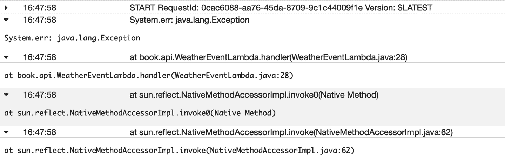

###### 图 7-1\. 使用 System.err.println 在 CloudWatch Logs 中输出的堆栈跟踪

使用 LambdaLogger，该堆栈跟踪是单个条目（可以在 Web 控制台中展开，如图 7-2 所示）。

仅这一特性就足以使用`LambdaLogger`而不是`System.out.println`或`System.err.println`，特别是在打印异常堆栈跟踪时。

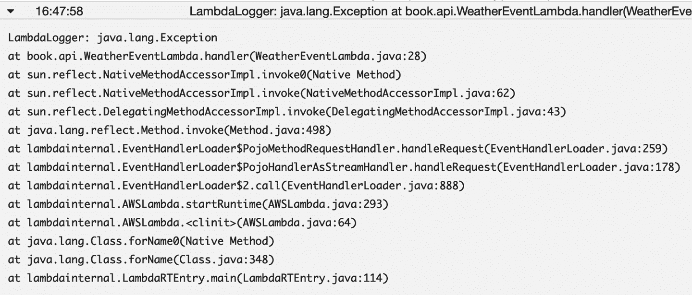

###### 图 7-2\. 使用 LambdaLogger 在 CloudWatch Logs 中输出堆栈跟踪

## Java 日志框架

`LambdaLogger` 对于简单的 Lambda 函数通常已经足够了。然而，正如本章后面将要介绍的，定制日志输出以满足特定需求，比如捕获业务指标或生成应用程序警报，通常更为有用。虽然可以使用 Java 的标准库（比如 [`String.format`](https://oreil.ly/9qlLO)）生成这种类型的输出，但使用像 Log4J 或 Java Commons Logging 这样的现有日志框架会更容易。这些框架提供了诸如日志级别、基于属性或文件的配置以及各种输出格式等便利功能。它们还可以轻松地在每条日志消息中包含相关的系统和应用程序上下文（如 AWS 请求 ID）。

当 Lambda 首次推出时，AWS 提供了一个非常旧且不支持的 Log4J 版本的自定义 appender。在基于 Lambda 的无服务器应用程序中使用这个旧版本的流行日志框架使得集成新的日志功能变得困难。因此，我们花费了相当多的时间和精力为 Lambda 函数构建了一个更现代化的日志解决方案，称为 `lambda-monitoring`，它使用了 SLF4J 和 Logback。

然而，AWS 现在提供了一个[库](https://oreil.ly/rywdy)，其中包含一个自定义的日志 appender，[它在底层使用 `LambdaLogger`](https://oreil.ly/CrRoX)，适用于最新版本的 [Log4J2](https://oreil.ly/8UEaw)。我们现在建议按照 AWS 在 Lambda 文档的 [Java logging section](https://oreil.ly/2YP8h) 中概述的方式进行设置。设置这种日志记录方法只需添加几个额外的依赖项、添加一个 *log4j2.xml* 配置文件，然后在我们的代码中使用 `org.apache.logging.log4j.Logger`。

这里是我们的 Weather API 项目的 *pom.xml* 添加部分：

```java
<dependencies>
  <dependency>
    <groupId>com.amazonaws</groupId>
    <artifactId>aws-lambda-java-log4j2</artifactId>
    <version>1.1.0</version>
  </dependency>
  <dependency>
    <groupId>org.apache.logging.log4j</groupId>
    <artifactId>log4j-core</artifactId>
    <version>2.12.1</version>
    </dependency>
  <dependency>
    <groupId>org.apache.logging.log4j</groupId>
    <artifactId>log4j-api</artifactId>
    <version>2.12.1</version>
  </dependency>
</dependencies>
```

*log4j2.xml* 配置文件对于使用过 Log4J 的人来说应该很熟悉。它使用 AWS 提供的 `Lambda` appender，并允许自定义日志模式：

```java
<?xml version="1.0" encoding="UTF-8"?>
<Configuration packages="com.amazonaws.services.lambda.runtime.log4j2">
  <Appenders>
    <Lambda name="Lambda">
      <PatternLayout>
        <pattern>
          %d{yyyy-MM-dd HH:mm:ss} %X{AWSRequestId} %-5p %c{1}:%L—%m%n
        </pattern>
      </PatternLayout>
    </Lambda>
  </Appenders>
  <Loggers>
    <Root level="info">
      <AppenderRef ref="Lambda"/>
    </Root>
  </Loggers>
</Configuration>
```

注意日志模式包括 Lambda 请求 ID（`%X{AWSRequestId}`）。在我们之前的日志示例中，大多数输出行中并没有包含该请求 ID —— 它只在调用的开头和结尾出现。通过在每一行中包含它，我们可以将每个输出片段与特定请求关联起来，这在使用其他工具检查这些日志或进行离线分析时非常有帮助。

在我们的 Lambda 函数中，我们设置了日志记录器并使用其 `error` 方法记录了一个 [`ERROR` level](https://oreil.ly/pygbx) 的消息以及异常信息：

```java
import org.apache.logging.log4j.LogManager;
import org.apache.logging.log4j.Logger;

public class WeatherEventLambda {
  private static Logger logger = LogManager.getLogger();
  …
  public APIGatewayProxyResponseEvent handler(
    APIGatewayProxyRequestEvent request, Context context)
    throws IOException {

    Exception e = new Exception("Test exception");
    logger.error("Log4J logger", e);
    ...
  }
}
```

Lambda Log4J2 appender 的输出显示在 图 7-3 中。

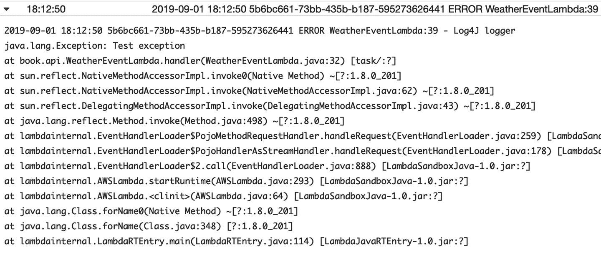

###### 图 7-3\. 使用 Log4J2 在 CloudWatch Logs 中输出堆栈跟踪

它包括时间戳、AWS 请求 ID、日志级别（本例中为 `ERROR`）、调用日志方法的文件和行，以及正确格式化的异常。我们可以使用 Log4J 提供的桥接库将其他日志框架的日志消息路由到我们的 Log4J appender。这种技术最有用的应用之一，至少对于我们的 `WeatherEventLambda` 来说，是深入了解使用 Apache Commons Logging（以前称为 Jakarta Commons Logging 或 JCL）的 AWS Java SDK 的行为。

首先，我们将 Log4J JCL 桥接库添加到我们 *pom.xml* 文件的 `dependencies` 部分：

```java
<dependency>
  <groupId>org.apache.logging.log4j</groupId>
  <artifactId>log4j-jcl</artifactId>
  <version>2.12.1</version>
</dependency>
```

接下来，我们在 *log4j2.xml* 文件的 `Loggers` 部分启用调试日志：

```java
<Loggers>
  <Root level="debug">
    <AppenderRef ref="Lambda"/>
  </Root>
</Loggers>
```

现在我们可以看到来自 AWS Java SDK 的详细日志信息（参见图 7-4）。

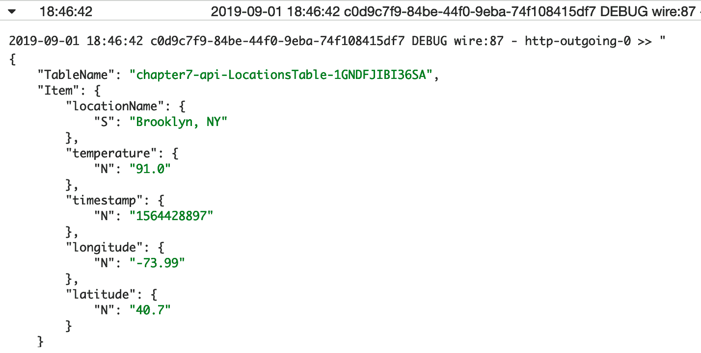

###### 图 7-4\. AWS SDK 的详细调试日志

我们可能不希望始终获取此信息，但是如果出现问题，调试时这将非常有用——在本例中，我们确切地看到了 DynamoDB `PutItem` API 调用的正文内容。

通过使用更复杂的日志框架，我们可以更深入地了解围绕日志输出的上下文。我们可以使用请求 ID 将不同 Lambda 请求的日志分开。使用日志级别，我们可以了解某些日志行是否表示错误，或者关于应用程序状态的警告，或者其他行是否可以忽略（或稍后分析），因为它们包含大量但不太相关的调试信息。

## 结构化日志

如前一节所述，我们的日志系统捕获了大量有用的信息和上下文，准备用于检查和改进我们的应用程序。

然而，当我们需要从这些大量的日志数据中提取某些值时，通常很难访问，查询起来很棘手，而且由于实际消息仍然基本上是自由形式的文本，通常必须使用一系列难以理解的正则表达式来精确查找您正在寻找的行。虽然有一些标准化的格式已经为某些空格或制表符分隔字段的值建立了约定，但不可避免地，正则表达式会在下游流程和工具中出现。

我们可以使用一种称为*结构化日志*的技术，而不是继续使用自由文本方式，标准化我们的日志输出，并通过标准查询语言轻松搜索所有日志。

以这条 JSON 日志条目为例：

```java
{
  "thread": "main",
  "level": "INFO",
  "loggerName": "book.api.WeatherEventLambda",
  "message": {
    "locationName": "Brooklyn, NY",
    "action": "record",
    "temperature": 78,
    "timestamp": 1564506117
  },
  "endOfBatch": false,
  "loggerFqcn": "org.apache.logging.log4j.spi.AbstractLogger",
  "instant": {
    "epochSecond": 1564506117,
    "nanoOfSecond": 400000000
  },
  "contextMap": {
    "AWSRequestId": "d814bbbe-559b-4798-aee0-31ddf9235a76"
  },
  "threadId": 1,
  "threadPriority": 5
}
```

我们可以使用 JSON 路径规范来提取信息，而不是依赖字段顺序。例如，如果我们想提取 `temperature` 字段，我们可以使用 JSON 路径 `.message.temperature`。CloudWatch Logs 服务支持在 Web 控制台中进行搜索（参见图 7-5），以及创建 Metric Filters，我们稍后会在本章中讨论。

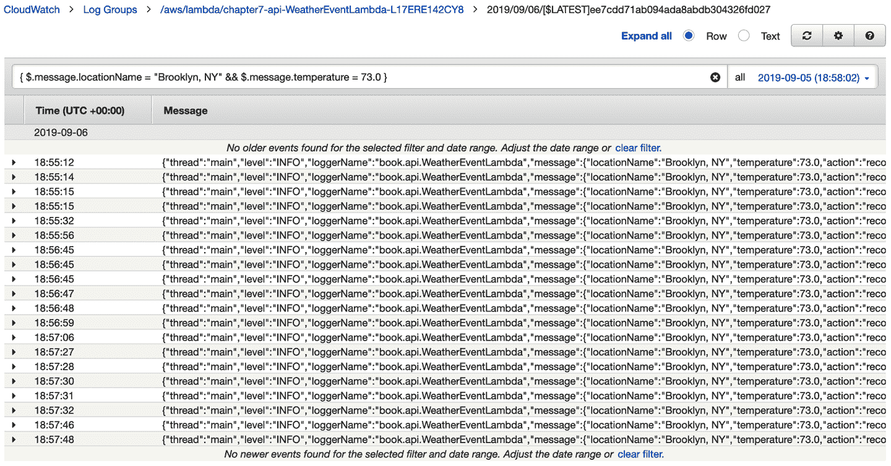

###### 图 7-5\. 使用 JSON Path 表达式在 CloudWatch Logs Web 控制台中进行搜索

## Java 中的结构化日志记录

现在我们理解了使用 JSON 格式进行结构化日志记录的好处，不幸的是，在尝试从基于 Java 的 Lambda 函数记录 JSON 时，我们立即遇到了困难。Java 中的 JSON 处理以冗长而出名，为构建日志输出添加大量样板代码似乎不是正确的方式。

幸运的是，我们可以使用 Log4J2 生成 JSON 格式的日志输出（[Log4J2 `JSONLayout`](https://oreil.ly/G4EYb)）。以下 *log4j2.xml* 配置将启用输出到`STDOUT`的 JSON 格式化输出，这对于我们的 Lambda 函数意味着输出将被发送到 CloudWatch Logs：

```java
<?xml version="1.0" encoding="UTF-8"?>
<Configuration packages="com.amazonaws.services.lambda.runtime.log4j2">
  <Appenders>
    <Lambda name="Lambda">
      <JsonLayout
        compact="true"
        eventEol="true"
        objectMessageAsJsonObject="true"
        properties="true"/>
    </Lambda>
  </Appenders>
  <Loggers>
    <Root level="info">
      <AppenderRef ref="Lambda"/>
    </Root>
  </Loggers>
</Configuration>
```

在我们的 Lambda 代码中，我们将 Log4J2 日志记录器设置为静态字段：

```java
...
private static Logger logger = LogManager.getLogger();
...
```

不再像`Recorded a temperature of 78 F from Brooklyn, NY`这样记录字符串，我们将构建一个包含键和值的`Map`，如下所示：

```java
HashMap<Object, Object> message = new HashMap<>();
message.put("action", "record");
message.put("locationName", weatherEvent.locationName);
message.put("temperature", weatherEvent.temperature);
message.put("timestamp", weatherEvent.timestamp);

logger.info(new ObjectMessage(message));
```

这是那条日志行的输出：

```java
{
  "thread": "main",
  "level": "INFO",
  "loggerName": "book.api.WeatherEventLambda",
  "message": {
    "locationName": "Brooklyn, NY",
    "action": "record",
    "temperature": 78,
    "timestamp": 1564506117
  },
  "endOfBatch": false,
  "loggerFqcn": "org.apache.logging.log4j.spi.AbstractLogger",
  "instant": {
    "epochSecond": 1564506117,
    "nanoOfSecond": 400000000
  },
  "contextMap": {
    "AWSRequestId": "d814bbbe-559b-4798-aee0-31ddf9235a76"
  },
  "threadId": 1,
  "threadPriority": 5
}
```

值得注意的一个警告是，与我们的应用程序相关的信息在`message`键下，但淹没在其他输出中。不幸的是，大部分输出都是 Log4J2 `JsonLayout` 固有的，因此我们无法在没有一些工作的情况下移除它。正如我们将在下一节看到的那样，然而，使用 JSON 格式化的日志事件的好处远远超过增加的冗长。

## CloudWatch Logs Insights

结构化日志使我们能够使用更复杂的工具来分析我们的日志，无论是实时还是事后。虽然原始的 CloudWatch Logs Web 控制台对使用 JSONPath 表达式查询日志数据有一定支持（如前所示），但真正复杂的分析直到最近才需要直接下载日志或将其转发到另一个服务。

[CloudWatch Logs Insights](https://oreil.ly/mPqKe) 是 CloudWatch Logs 生态系统的新成员，提供强大的搜索引擎和专门的查询语言，非常适合分析结构化日志。继续我们之前章节的示例 JSON 日志行，现在让我们假设我们有一个月的每小时数据已经记录到 CloudWatch Logs。我们可能希望对该日志数据进行一些快速分析，查看每天的最低、平均和最高温度，但仅限于 Brooklyn。

以下 CloudWatch Logs Insights 查询正好实现了这一点：

```java
filter message.action = "record"
    and message.locationName = "Brooklyn, NY"
| fields date_floor(concat(message.timestamp, "000"), 1d) as Day,
    message.temperature
| stats min(message.temperature) as Low,
    avg(message.temperature) as Average,
    max(message.temperature) as High by Day
| order by Day asc
```

让我们逐行查看这个查询在做什么：

1.  首先，我们将数据筛选到具有`message.action`字段中值为`record`和`message.locationName`字段中值为“Brooklyn, NY”的日志事件。

1.  在第二行中，我们提取了`message.timestamp`字段，并在传递给`date_floor`方法之前在末尾添加了三个零，这样可以用给定日期的最早时间戳值替换时间戳值（因为需要添加零以表示毫秒）。我们还提取了`message.temperature`字段。

1.  第三行计算了`message.temperature`字段在一天的日志事件中的最小值、平均值和最大值。

1.  最后一行按天对数据进行排序，从最早的一天开始。

我们可以在 CloudWatch Logs Insights Web 控制台中看到此查询的结果（参见图 7-6）。

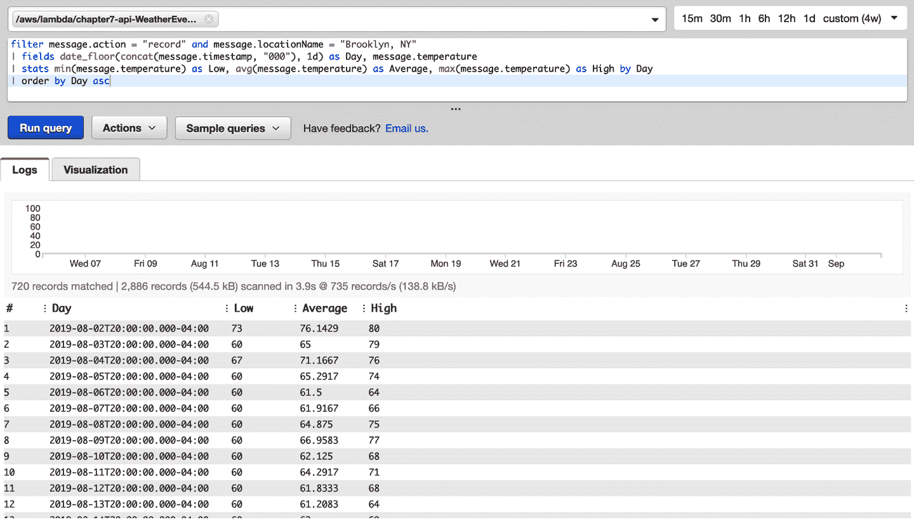

###### 图 7-6\. CloudWatch Logs Insights

这些结果可以导出为 CSV 文件，或使用内置的可视化工具绘制图表（参见图 7-7）。

关于 CloudWatch Logs Insights，需要记住一些注意事项。首先，尽管该工具可以有效地用于对日志数据进行即席探索，但目前还不能直接生成额外的自定义指标或其他数据产品（尽管我们将看到如何从 JSON 日志数据生成自定义指标的方法！）。但是，它提供了一个 API 接口用于运行查询和访问结果，因此可以自行解决问题。最后但同样重要的是，查询的定价是基于扫描的数据量。

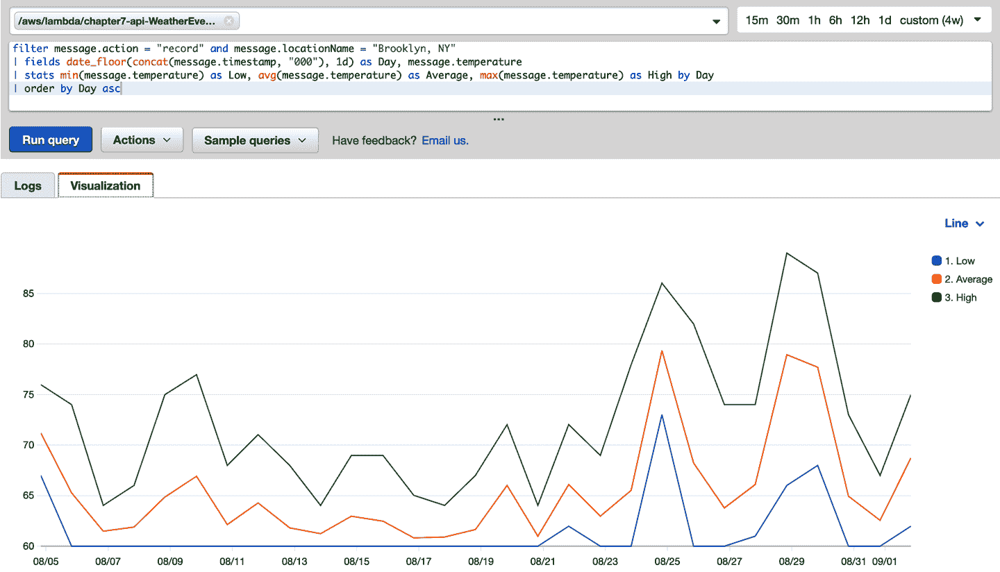

###### 图 7-7\. CloudWatch Logs Insights 可视化

# 指标

日志消息是对系统在特定时间点状态的离散快照。而指标则旨在在一段时间内产生系统状态的更高级别视图。虽然单个指标是时间点的快照，但一系列指标显示了系统在运行过程中的趋势和行为，长时间内的表现。

## CloudWatch 指标

CloudWatch 指标是 AWS 的指标存储服务。它从大多数 AWS 服务接收指标。在最基本的层次上，指标只是一组按时间排序的数据点。例如，在某一时刻，传统服务器的 CPU 负载可能为 64%。几秒钟后，它可能是 65%。在给定的时间段内，可以计算指标的最小值、最大值和其他统计数据（例如百分位数）。

指标按命名空间（例如 `/aws/lambda`）和指标名称（例如 `WeatherEventLambda`）分组。指标也可以有相关的维度，这些维度只是更细粒度的标识符，例如在跟踪非服务器应用程序中的应用程序错误的指标中，一个维度可能是服务器 IP。

CloudWatch 指标是监控 AWS 服务及我们自己应用行为的主要工具。

## Lambda 平台指标

AWS 提供了许多功能和账户级别的指标，用于监控无服务器应用程序的整体健康和可用性。我们将这些称为平台指标，因为它们由 Lambda 平台提供，无需额外配置。

对于各个函数，Lambda 平台提供以下指标：

`调用次数`

函数被调用的次数（无论成功与否）。

`限流`

平台限流平台尝试函数调用次数。

`Errors`

函数调用返回错误次数。

`Duration`

函数开始执行到停止之间的“经过的墙钟时间”的毫秒数。此指标还支持[百分位数](https://oreil.ly/-Njgn)。

`ConcurrentExecutions`

特定时间点函数的并发执行次数。

对于由 Kinesis 或 DynamoDB 流事件源调用的函数，`IteratorAge`指标跟踪函数接收记录批次与该批次中最后一条记录写入流之间的毫秒数。该指标有效地显示了 Lambda 函数在特定时间点在流中落后的程度。

对于配置了死信队列（DLQ）的函数，当函数无法将消息写入 DLQ 时会增加`DeadLetterErrors`指标（有关 DLQ 的更多信息，请参见“错误处理”）。

此外，平台会跨账户和地区聚合`Invocations`、`Throttles`、`Errors`、`Duration`和`ConcurrentExecutions`这些指标。`UnreservedConcurrentExecutions`指标会聚合账户和地区中所有未指定自定义并发限制的函数的并发执行次数。

Lambda 平台生成的指标还包括以下额外维度：`FunctionName`、`Resource`（例如函数版本或别名）和`ExecutedVersion`（用于别名调用，在下一章中讨论）。提到的每个函数级指标都可以具有这些维度。

## 业务指标

平台指标和应用程序日志是监控无服务器应用程序的重要工具，但在评估我们的应用程序是否正确和完全执行其业务功能方面并不有用。例如，捕获 Lambda 执行持续时间的指标有助于捕获意外的性能问题，但它并不告诉我们 Lambda 函数（或整个应用程序）是否正确处理了客户事件。另一方面，捕获为我们最受欢迎的位置成功处理的天气事件数量的指标告诉我们，无论底层技术实现如何，应用程序（或至少与处理天气事件相关的部分）都在正确工作。

这些*业务指标*不仅可以作为我们业务逻辑的脉搏检测，也可以作为不依赖于具体实现或平台的聚合指标。以我们之前的例子为例，如果 Lambda 执行时间增加了，这意味着什么？我们只是在处理更多的数据，还是配置或代码变更影响了函数的性能？这真的重要吗？然而，如果我们的应用处理的天气事件数量意外减少，我们知道有些问题，并且需要立即调查。

在传统应用中，我们可能直接使用 CloudWatch 指标 API，通过使用[`PutMetricData` API 调用](https://oreil.ly/zLHuA)在生成这些自定义指标时主动推送。更复杂的应用程序可能会定期以小批量推送指标。

Lambda 函数有两个特性使`PutMetricData`方法难以使用。首先，Lambda 函数可以快速扩展到数百或数千个并发执行。CloudWatch 指标 API 会对`PutMetricData`调用进行限流（[CloudWatch 限制](https://oreil.ly/q2jmF)），因此，试图持久化重要数据的行为可能导致指标丢失。其次，由于 Lambda 函数是短暂的，几乎没有机会或好处可以在单个执行期间批处理指标。不能保证后续执行会在相同的运行时实例中进行，因此跨调用进行批处理是不可靠的。

幸运的是，CloudWatch 指标有两个功能以可扩展且可靠的方式处理此情况，通过完全将 CloudWatch 指标数据的生成移出 Lambda 执行的过程。第一个和最新的功能称为[CloudWatch 嵌入式指标格式](https://oreil.ly/pkNXB)，它使用特殊的日志格式自动创建指标。这种特殊的日志格式目前 Log4J 还不支持（除非进行大量额外的工作），因此我们不会在这里使用它，但在其他情况下，这是在 Lambda 中生成指标的首选方法。

另一个功能，[CloudWatch 指标过滤器](https://oreil.ly/beOVU)，也可以使用 CloudWatch 日志数据生成指标。与嵌入式指标格式不同，它可以访问列格式和任意嵌套的 JSON 结构中的数据。这使得它成为我们这种情况的更好选择，因为我们不能轻松地将 JSON 键添加到日志语句的顶层。它通过扫描 CloudWatch 日志并将指标分批推送到 CloudWatch 指标服务来生成指标数据。

我们使用结构化日志记录使得设置度量过滤器变得简单，只需将以下内容添加到我们的*template.yaml*文件中：

```java
BrooklynWeatherMetricFilter:
  Type: AWS::Logs::MetricFilter
  Properties:
    LogGroupName: !Sub "/aws/lambda/${WeatherEventLambda}"
    FilterPattern: '{$.message.locationName = "Brooklyn, NY"}'
    MetricTransformations:
      — MetricValue: "1"
    MetricNamespace: WeatherApi
    MetricName: BrooklynWeatherEventCount
    DefaultValue: "0"
```

每当 JSON 日志行包含`message.locationName`字段为“纽约布鲁克林”时，此指标过滤器将增加`BrooklynWeatherEventCount`指标。我们可以通过 CloudWatch Metrics Web 控制台访问和可视化此指标，也可以像处理常规平台指标一样配置 CloudWatch 告警和操作。

在这个例子中，每次事件发生时我们有效地增加一个计数器，但在适当的情况下也可以（根据捕获日志行的数据）使用实际值。有关更多详情，请参阅[`MetricFilter MetricTransformation`](https://oreil.ly/ksKJu)文档。

## 告警

与所有 CloudWatch 指标一样，我们可以使用数据来建立警报，以便在出现问题时发出警告。至少，我们建议为`Errors`和`Throttles`平台指标设置警报，如果不是基于每个帐户的设置，则至少为生产函数设置。

对于由 Kinesis 或 DynamoDB 流事件源触发的函数，`IteratorAge`指标是函数是否跟上流事件数量的关键指示（这取决于流中的分片数、Lambda 事件源中配置的批量大小、[`ParallelizationFactor`](https://oreil.ly/ogUdK)以及 Lambda 函数本身的性能）。

在上一节中我们配置的`BrooklynWeatherEventCount`指标，以下是关联的 CloudWatch 告警的配置方式。如果该指标值在 60 秒内降至零（表示我们停止接收“纽约布鲁克林”的天气事件），则此告警将通过 SNS 消息提醒我们：

```java
BrooklynWeatherAlarm:
  Type: AWS::CloudWatch::Alarm
  Properties:
    Namespace: WeatherApi
    MetricName: BrooklynWeatherEventCount
    Statistic: Sum
    ComparisonOperator: LessThanThreshold
    Threshold: 1
    Period: 60
    EvaluationPeriods: 1
    TreatMissingData: breaching
    ActionsEnabled: True
    AlarmActions:
      — !Ref BrooklynWeatherAlarmTopic

BrooklynWeatherAlarmTopic:
  Type: AWS::SNS::Topic
```

图 7-8 展示了在 CloudWatch Web 控制台中查看该告警的视图。

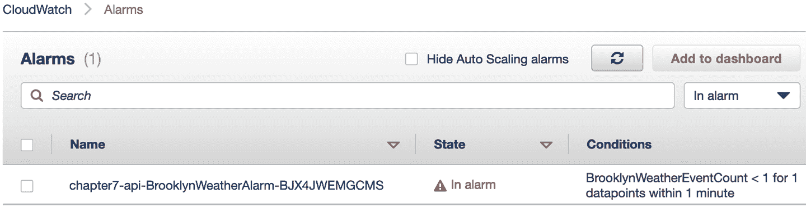

###### 图 7-8. BrooklynWeatherAlarm CloudWatch 告警

当前告警“触发”时生成的 SNS 消息可用于发送通知电子邮件，或触发像[PagerDuty](https://www.pagerduty.com)这样的第三方警报系统。

与 Lambda 函数和 DynamoDB 表等应用组件一样，我们强烈建议将 CloudWatch 指标过滤器、告警和所有其他基础设施都保存在与其他所有内容相同的*template.yaml*文件中。这不仅允许我们利用模板内部引用和依赖关系，还能将我们的指标和告警配置与应用程序紧密地联系在一起。如果您不希望为堆栈的开发版本生成这些运行资源，可以使用[CloudFormation 的`Conditions`功能](https://oreil.ly/iXXkw)。

## 分布式跟踪

到目前为止，我们介绍的度量和日志功能为我们提供了关于单个应用组件（如 Lambda 函数）的洞察力。然而，在涉及到许多组件的复杂应用中，我们很难将日志输出和度量数据拼凑成一个请求流，例如涉及 API Gateway、两个 Lambda 函数和 DynamoDB 表的情况。

幸运的是，AWS 的分布式追踪服务 X-Ray 正好可以处理这种用例。该服务基本上会为进入或由我们的应用程序生成的事件“打标记”，并在这些事件流经我们的应用程序时进行跟踪。当标记的事件触发 Lambda 函数时，X-Ray 可以跟踪 Lambda 函数所进行的外部服务调用，并将有关这些调用的信息添加到跟踪中。如果调用的服务也启用了 X-Ray，则跟踪将继续进行。通过这种方式，X-Ray 不仅跟踪特定事件，还生成了我们应用程序中所有组件的服务映射及其相互交互的图。

对于 AWS Lambda，有两种模式用于 [X-Ray 追踪](https://oreil.ly/juSOL)。第一种是 `PassThrough`，这意味着如果触发 Lambda 函数的事件已经被 X-Ray “标记”，则 Lambda 函数的调用将由 X-Ray 追踪。如果触发事件尚未被标记，则 Lambda 不会记录任何跟踪信息。相反，`Active` 追踪会主动将 X-Ray 跟踪 ID 添加到所有 Lambda 调用中。

在以下示例中，我们已启用 API Gateway 的追踪，该功能将为传入事件添加 X-Ray 跟踪 ID。Lambda 函数配置为 `PassThrough` 模式，因此当它由 API Gateway 的标记事件触发时，它将将该跟踪 ID 传播到下游服务。请注意，如果 Lambda 的 IAM 执行角色具有向 X-Ray 服务发送数据的权限，则默认情况下启用 *PassThrough* 模式；否则，如我们在此处所做的那样，可以显式配置（在这种情况下，SAM 将向 Lambda 执行角色添加适当的权限）。

这是我们 SAM *template.yaml* 文件中的 `Globals` 部分，从 第五章 更新以启用 API Gateway 追踪：

```java
Globals:
  Function:
    Runtime: java8
    MemorySize: 512
    Timeout: 25
    Environment:
      Variables:
        LOCATIONS_TABLE: !Ref LocationsTable
    Tracing: PassThrough
  Api:
    OpenApiVersion: '3.0.1'
    TracingEnabled: true
```

启用追踪功能后，我们还可以将 X-Ray 库添加到我们的 *pom.xml* 文件中。通过添加这些库，我们将在 Lambda 函数与 DynamoDB 和 SNS 等服务交互时享受到 X-Ray 追踪的好处，而无需修改我们的 Java 代码。

像 AWS SDK 一样，X-Ray 提供了一个材料清单（BOM），可以确保我们项目中使用的所有 X-Ray 库的版本保持同步。要使用 X-Ray BOM，请将其添加到顶层 *pom.xml* 文件的 `<dependencyManagement>` 部分：

```java
<dependency>
  <groupId>com.amazonaws</groupId>
  <artifactId>aws-xray-recorder-sdk-bom</artifactId>
  <version>2.3.0</version>
  <type>pom</type>
  <scope>import</scope>
</dependency>
```

现在我们需要添加三个 X-Ray 库，这些库将为我们的基于 Java 的 Lambda 函数进行仪器化：

```java
<dependency>
  <groupId>com.amazonaws</groupId>
  <artifactId>aws-xray-recorder-sdk-core</artifactId>
</dependency>
<dependency>
  <groupId>com.amazonaws</groupId>
  <artifactId>aws-xray-recorder-sdk-aws-sdk</artifactId>
</dependency>
<dependency>
  <groupId>com.amazonaws</groupId>
  <artifactId>aws-xray-recorder-sdk-aws-sdk-instrumentor</artifactId>
</dependency>
```

图 7-9 展示了我们 API 的 X-Ray 服务地图，来自 第五章，展示了 API Gateway、Lambda 平台、Lambda 函数和 DynamoDB 表：

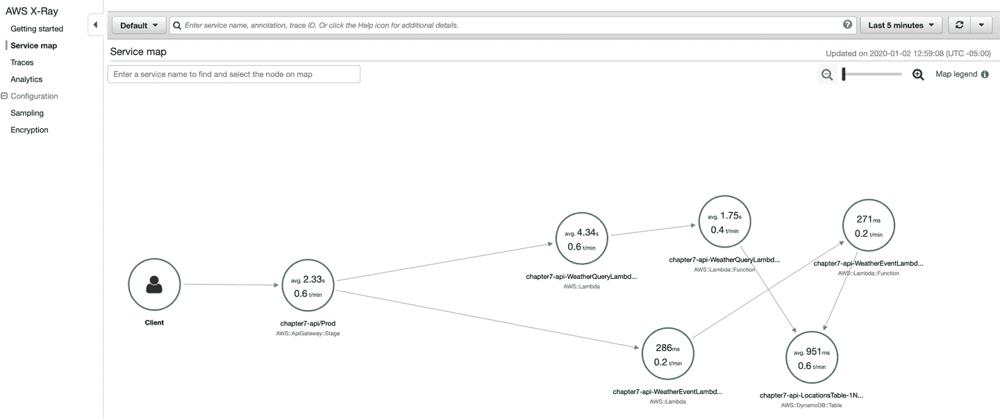

###### 图 7-9\. X-Ray 服务地图

我们还可以查看一个单独事件的追踪（在本例中为我们的 HTTP POST），该事件经过 API Gateway、Lambda 和 DynamoDB（图 7-10）。

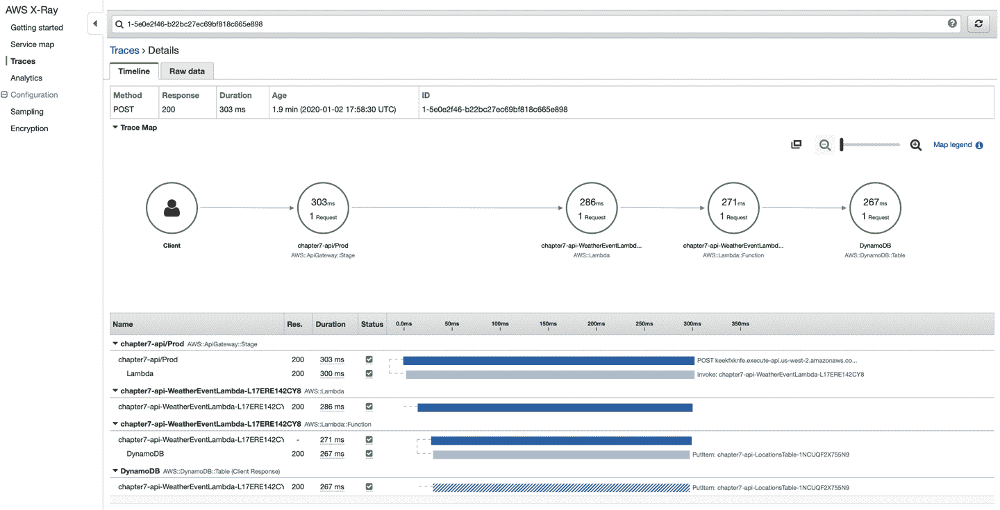

###### 图 7-10\. X-Ray 追踪

## 查找错误

当我们的 Lambda 函数抛出错误时会发生什么？我们可以通过 X-Ray 控制台调查错误，通过服务地图和跟踪界面两种方式。

首先，让我们通过移除 `WeatherEvent` Lambda 访问 DynamoDB 的权限，向该 Lambda 函数引入一个错误：

```java
  WeatherEventLambda:
    Type: AWS::Serverless::Function
    Properties:
      CodeUri: target/lambda.zip
      Handler: book.api.WeatherEventLambda::handler
 #      Policies:
 #        — DynamoDBCrudPolicy:
 #            TableName: !Ref LocationsTable
      Events:
        ApiEvents:
          Type: Api
          Properties:
            Path: /events
            Method: POST
```

在部署我们的无服务器应用程序堆栈后，我们可以向 `/events` 端点发送一个 HTTP POST 事件。当 `WeatherEvent` Lambda 尝试将该事件写入 DynamoDB 时，它失败并抛出异常。在此之后的 X-Ray 服务地图显示如下（图 7-11）。

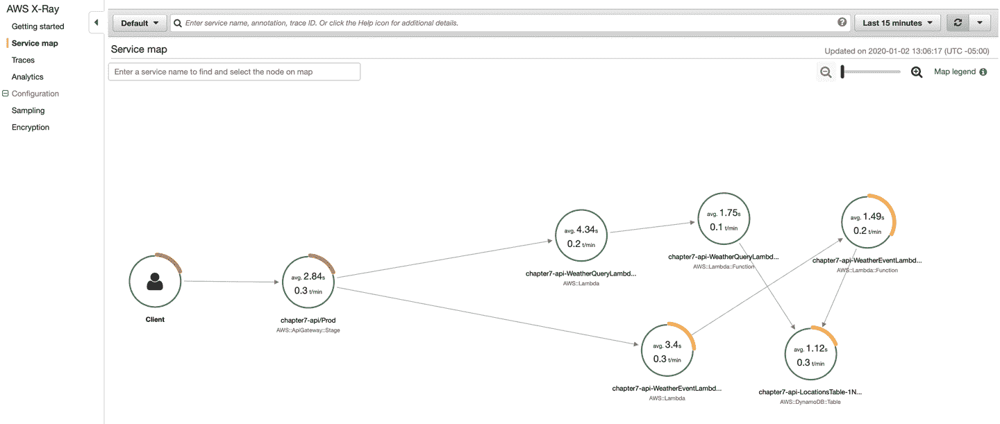

###### 图 7-11\. X-Ray 服务地图显示的错误

并且当我们深入研究导致错误的具体请求时，我们可以看到我们的 POST 请求返回了一个 HTTP 502 错误（图 7-12）。

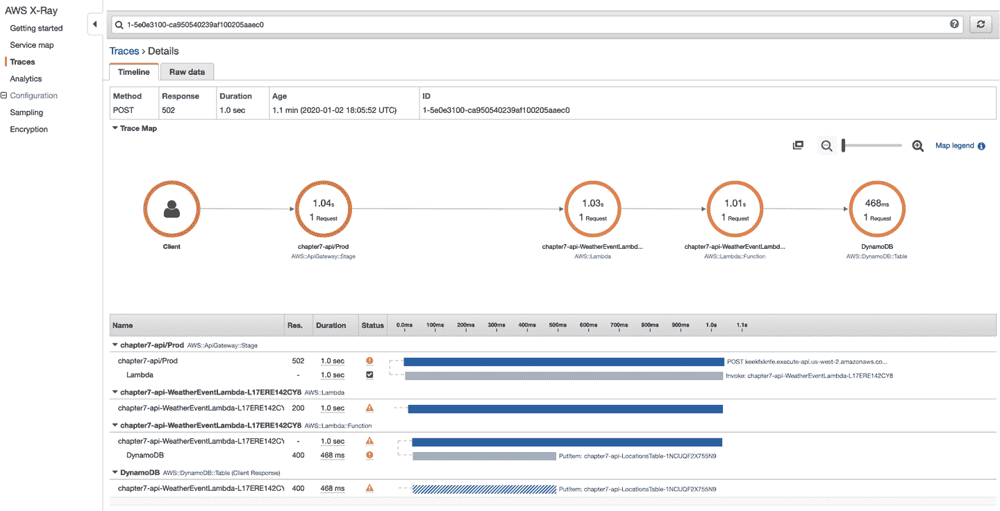

###### 图 7-12\. X-Ray 追踪显示的错误

然后，我们可以通过悬停在显示 Lambda 调用轨迹部分的错误图标上，轻松看到导致 Lambda 函数失败的具体 Java 异常（图 7-13）。

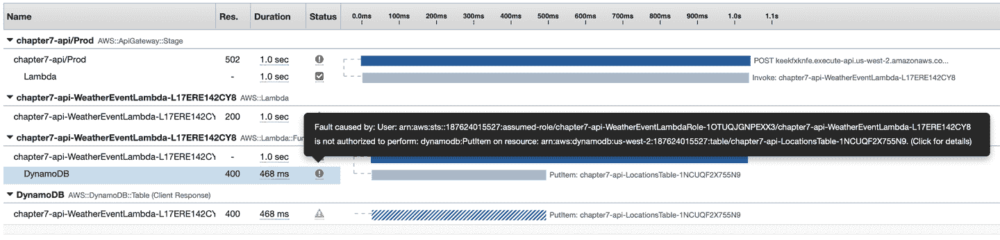

###### 图 7-13\. X-Ray 追踪显示的 Java 异常

点击后，我们可以从 X-Ray 追踪控制台完整地查看堆栈跟踪，即从 图 7-14 开始。

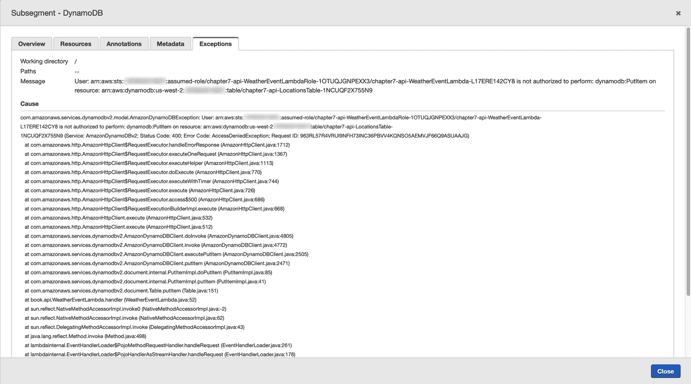

###### 图 7-14\. X-Ray 显示的 Java 异常堆栈跟踪

# 总结

在本章中，我们介绍了多种方式，可以详细了解我们的无服务器应用程序的执行和功能，无论是在单个函数或组件级别，还是作为完整应用程序。我们展示了如何使用结构化 JSON 日志记录实现可观察性，并使我们能够从高度可扩展的 Lambda 函数中提取有意义的业务指标，而无需超负荷使用 CloudWatch API。

最后，我们向我们的 Maven *pom.xml* 添加了一些依赖项，并解锁了完整功能的分布式跟踪能力，这不仅追踪单个请求，还自动构建了我们无服务器应用程序的所有组件地图，并允许我们轻松地深入错误或意外行为。

现在基础知识已经介绍完毕，在下一章中，我们将深入探讨高级 Lambda 技术，使我们的生产无服务器系统更加强大和可靠。

# 练习

1.  本章基于第五章的 API 网关代码进行构建。在来自第六章的更新数据流水线代码中添加 X-Ray 仪器，观察与 SNS 和 S3 的交互如何显示在 X-Ray 控制台中。

1.  除了像本章所做的那样增加一个度量标准外，CloudWatch Logs 度量过滤器可以解析日志行中的度量值。使用这种技术为纽约布鲁克林的温度生成 CloudWatch Logs 度量标准。为了额外加分，当温度低于 32 华氏度时，添加一个警报！
