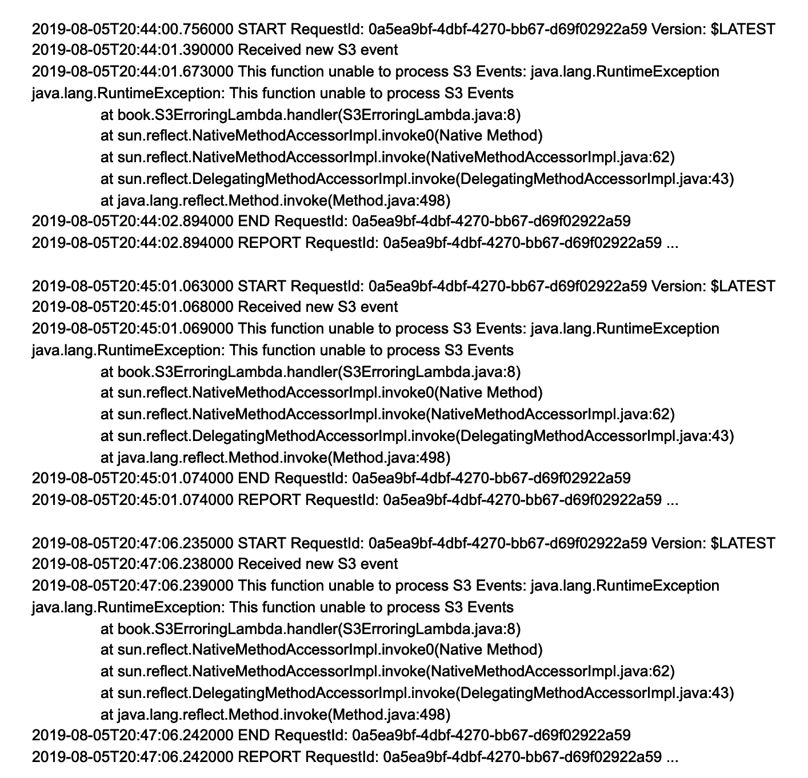
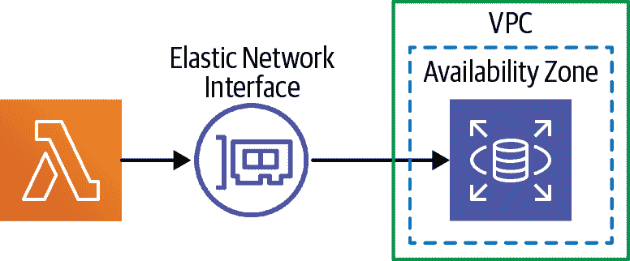

# 第八章：高级 AWS Lambda

随着我们接近本书的结尾，是时候学习一些 Lambda 的方面了，这些方面对于构建可用于生产的应用程序至关重要——例如错误处理、扩展以及 Lambda 的一些能力，我们并非总是使用，但在需要时很重要。

# 错误处理

到目前为止，我们所有的示例都生活在没有系统故障和没有人在编写代码时犯错误的美好世界中。当然，在现实世界中，事情会出错，任何有用的生产应用程序和架构都需要处理错误发生的时间，无论是在我们的代码中还是在我们依赖的系统中。

由于 AWS Lambda 是一个“平台”，在处理错误时有一定的限制和行为，本节我们将深入探讨可以发生哪些类型的错误，在哪些情境中发生以及我们如何处理它们。作为语言说明，我们将“错误”和“异常”这两个词互换使用，没有 Java 世界中两个术语之间的微妙差别。

## 错误类别

在使用 Lambda 时，可能会出现几种不同类别的错误。主要错误如下，按照事件处理过程中可能发生的时间顺序大致排列如下：

1.  初始化 Lambda 函数时出现的错误（加载我们的代码、定位处理程序或函数签名时的问题）

1.  将输入解析为指定函数参数时出现的错误

1.  与外部下游服务（数据库等）通信时出现的错误。

1.  在 Lambda 函数内部生成的错误（无论是在其代码中还是在其直接环境中，例如内存不足的问题）

1.  函数超时引起的错误

我们可以将错误分为已处理错误和未处理错误两类另一种方法。

例如，让我们考虑与下游微服务通过 HTTP 进行通信并且它抛出错误的情况。在这种情况下，我们可以选择在 Lambda 函数内部捕获错误并在那里处理（已处理错误），或者让错误传播到环境中（未处理错误）。

或者，假设我们在 Lambda 配置中指定了一个不正确的方法名。在这种情况下，我们无法在 Lambda 函数代码中捕获错误，因此这始终是一个未处理错误。

如果我们在代码中自行处理错误，那么 Lambda 实际上与我们的特定错误处理策略无关。我们可以选择像日志记录到标准错误一样，但正如我们在第七章中所看到的，Lambda 将标准错误与标准输出视为相同，如果内容发送到其中，不会引发任何警报。

因此，在 Lambda 处理错误时，所有的微妙之处都在于未处理的错误——即通过未捕获的异常将错误传递给 Lambda 运行时或外部发生的错误。这些错误会发生什么？有趣的是，这显著取决于触发 Lambda 函数的事件源类型，现在我们将详细探讨这一点。

## Lambda 错误处理的各种行为

Lambda 根据触发调用的事件源来处理错误。我们在第五章中列出了每一种事件源类型（表 5-1）：

+   同步事件源（例如，API 网关）

+   异步事件源（例如，S3 和 SNS）

+   流/队列事件源（例如，Kinesis 数据流和 SQS）

这些类别中的每一个都有一个不同的模型来处理 Lambda 函数抛出的错误，如下所示。

### 同步事件源

这是最简单的模型。对于以这种方式调用的 Lambda 函数，错误将向上传播到调用者，并且不会执行自动重试。错误如何暴露给上游客户端取决于调用 Lambda 函数的具体方式，因此您应该在代码中尝试强制错误，以查看此类问题如何暴露。

例如，如果 API 网关是事件源，那么 Lambda 函数抛出的错误将导致错误被发送回 API 网关。API 网关随后向原始请求者返回一个 500 的 HTTP 响应。

### 异步事件源

由于此调用模型是异步的或事件导向的，没有上游调用者可以对错误执行任何有用的操作，因此 Lambda 具有更复杂的错误处理模型。

首先，如果在这种调用模型中检测到错误，则 Lambda 将（默认情况下）重试处理事件多达两次（总共三次尝试），并在重试之间设置延迟（具体延迟未记录，但稍后我们将看到一个示例）。

如果 Lambda 函数在所有重试尝试失败时，事件将被发布到函数的错误目标和/或死信队列（如果已配置）；否则，事件将被丢弃和丢失。

### 流/队列事件源

在没有配置错误处理策略的情况下（参见“处理 Kinesis 和 DynamoDB 流错误”），如果在处理来自流/队列事件源的事件时，错误向上冒泡到 Lambda 运行时，则 Lambda 将持续重试该事件，直到（a）上游源中的失败事件过期或（b）问题解决。这意味着流或队列的处理实际上被阻塞，直到错误解决。请注意，在使用扩展到多个分片的流时，存在特定的细微差别，如果适用，请建议进行研究。

在考虑 Lambda 错误处理时，以下文档页面非常有用：

+   [AWS Lambda 中的错误处理和自动重试](https://oreil.ly/4wxMf)

+   [AWS Lambda 中的 Java 函数错误](https://oreil.ly/ag0cu)

## 深入了解异步事件源错误

异步事件源是 Lambda 的一种常见使用方式，并且具有复杂的错误处理模型，因此让我们通过一个例子更深入地了解这个主题。

### 重试

我们从以下代码开始：

```java
package book;

import com.amazonaws.services.lambda.runtime.events.S3Event;

public class S3ErroringLambda {
  public void handler(S3Event event) {
    System.out.println("Received new S3 event");
    throw new RuntimeException("This function unable to process S3 Events");
  }
}
```

我们以与第五章中`BatchEvents Lambda`函数相同的方式将其与 S3 存储桶连接，稍后我们将看到该 SAM 模板。

如果我们将文件上传到与此函数关联的 S3 存储桶中，我们在日志中看到图 8-1。

注意，Lambda 尝试处理 S3 事件共三次——首次在 20:44:00，然后约一分钟后，再约两分钟后。这是 Lambda 为异步事件源承诺的三次事件处理尝试。

我们能够使用单独的 CloudFormation 资源配置 Lambda 将执行的重试次数——0、1 或 2 次。例如，让我们配置 Lambda 不对`SingleEventLambda`函数进行任何重试，该函数来自于“示例：构建无服务器数据管道”。我们可以向应用程序模板添加以下资源：

```java
  SingleEventInvokeConfig:
    Type: AWS::Lambda::EventInvokeConfig
    Properties:
      FunctionName: !Ref SingleEventLambda
      Qualifier: "$LATEST"
      MaximumRetryAttempts: 0
```



###### 图 8-1\. S3 错误期间的 Lambda 日志

如果我们不做进一步的更改，Lambda 在所有重试（如果有）完成后将不会再执行任何操作——将会记录关于原始事件的简要数据，但最终将被丢弃。对于像 S3 这样的情况，这并不太糟糕——我们随时可以稍后列出 S3 中的所有对象。但对于其他事件源来说，如果在修复错误原因后无法重新生成事件，则可能会成为问题。这个问题有两种解决方案——DLQ 和目标。DLQ 已存在较长时间，因此我们将首先描述它们，但目标具有更多功能。

### 死信队列

Lambda 提供了自动转发事件的功能（对于失败所有重试的异步源）到死信队列（DLQ）。此 DLQ 可以是 SNS 主题或 SQS 队列。一旦事件进入 SNS 或 SQS，您可以立即处理，或稍后手动处理（对于 SQS 而言）。例如，您可以注册一个单独的 Lambda 函数作为 SNS 主题的监听器，将失败的事件副本发布到操作 Slack 频道进行手动处理。

DLQ 可以与 Lambda 函数的所有其他属性一起配置。例如，我们可以向我们的示例应用程序添加一个 DLQ，并且还可以添加一个 DLQ 处理函数，使用 SAM 模板。

##### 示例 8-1\. 带有 DLQ 和 DLQ 监听器的 SAM 模板

```java
AWSTemplateFormatVersion: 2010-09-09
Transform: AWS::Serverless-2016-10-31
Description: chapter8-s3-errors

Resources:
  DLQ:
    Type: AWS::SNS::Topic

  ErrorTriggeringBucket:
    Type: AWS::S3::Bucket
    Properties:
      BucketName: !Sub ${AWS::AccountId}-${AWS::Region}-errortrigger

  S3ErroringLambda:
    Type: AWS::Serverless::Function
    Properties:
      Runtime: java8
      MemorySize: 512
      Handler: book.S3ErroringLambda::handler
      CodeUri: target/lambda.zip
      DeadLetterQueue:
        Type: SNS
        TargetArn: !Ref DLQ
      Events:
        S3Event:
          Type: S3
          Properties:
            Bucket: !Ref ErrorTriggeringBucket
            Events: s3:ObjectCreated:*

  DLQProcessingLambda:
    Type: AWS::Serverless::Function
    Properties:
      Runtime: java8
      MemorySize: 512
      Handler: book.DLQProcessingLambda::handler
      CodeUri: target/lambda.zip
      Events:
        SnsEvent:
          Type: SNS
          Properties:
            Topic: !Ref DLQ
```

这里需要注意的重要元素如下：

+   我们定义自己的 SNS 主题以充当 DLQ。

+   在应用程序函数（`S3ErroringLambda`）内部，我们告诉 Lambda 我们希望为该函数设置 DLQ，其类型为 SNS，并且 DLQ 消息应发送到我们在此模板中创建的主题。

+   我们还定义了一个单独的函数（`DLQProcessingLambda`），该函数由发送到 DLQ 的事件触发。

我们的`DLQProcessingLambda`代码如下：

```java
package book;

import com.amazonaws.services.lambda.runtime.events.SNSEvent;

public class DLQProcessingLambda {
  public void handler(SNSEvent event) {
    event.getRecords().forEach(snsRecord ->
        System.out.println("Received DLQ event: " + snsRecord.toString())
    );
  }
}
```

现在，如果我们向 S3 上传文件，我们会在`DLQProcessing Lambda`的日志中看到以下内容，显示了对`S3ErroringLambda`的最终交付尝试后的处理：

```java
Received DLQ event: {sns: {messageAttributes:
    {RequestID={type: String,value: ff294606-e377-4bad-8f2a-4c5f88042656},
     ErrorCode={type: String,value: 200}, ...
```

发送到 DLQ 处理函数的事件包括失败的完整原始事件，允许您稍后保存并处理。它还包括原始事件的`RequestID`，允许您在应用程序 Lambda 函数的日志中搜索有关出错原因的线索。

虽然在这个示例中，我们将所有 DLQ 资源包含在应用程序模板中，但您可以选择在应用程序外使用资源，因此跨应用程序共享这些 DLQ 元素。

### 目标

在 2019 年底，AWS 推出了一个用于捕获失败事件的 DLQ 替代方案：[*destinations*](https://oreil.ly/XT6Ds)。目标实际上比 DLQ 更强大，因为您可以捕获错误和成功处理的异步事件。

此外，目标支持比 DLQ 更多类型的目标。支持 SNS 和 SQS，就像它们与 DLQ 一样，但您还可以直接路由到另一个 Lambda 函数（跳过消息总线部分）或 EventBridge。

要配置目标，我们使用与之前配置重试计数时创建的`AWS::Lambda::EventInvokeConfig`资源相同类型的资源（参见“重试”）。例如，让我们用目标替换前面示例中的 DLQ：

```java
AWSTemplateFormatVersion: 2010-09-09
Transform: AWS::Serverless-2016-10-31
Description: chapter8-s3-errors

Resources:
  ErrorTriggeringBucket:
    Type: AWS::S3::Bucket
    Properties:
      BucketName: !Sub ${AWS::AccountId}-${AWS::Region}-errortrigger

  S3ErroringLambda:
    Type: AWS::Serverless::Function
    Properties:
      Runtime: java8
      MemorySize: 512
      Handler: book.S3ErroringLambda::handler
      CodeUri: target/lambda.zip
      Events:
        S3Event:
          Type: S3
          Properties:
            Bucket: !Ref ErrorTriggeringBucket
            Events: s3:ObjectCreated:*
      Policies:
        — LambdaInvokePolicy:
            FunctionName: !Ref ErrorProcessingLambda

  ErrorProcessingLambda:
    Type: AWS::Serverless::Function
    Properties:
      Runtime: java8
      MemorySize: 512
      Handler: book.ErrorProcessingLambda::handler
      CodeUri: target/lambda.zip

  S3ErroringLambdaInvokeConfig:
    Type: AWS::Lambda::EventInvokeConfig
    Properties:
      FunctionName: !Ref S3ErroringLambda
      Qualifier: "$LATEST"
      DestinationConfig:
        OnFailure:
          Destination: !GetAtt ErrorProcessingLambda.Arn
```

从这个示例中可以注意到几个方面：

+   没有显式的队列或主题。

+   最后，目标定义了当`S3ErroringLambda`失败时，我们希望将事件发送到`ErrorProcessingLambda`。

+   应用程序函数需要被授予调用错误处理函数的权限，我们通过`S3Erroring Lambda`资源的`Policies`属性启用此权限。

发送到`ErrorProcessingLambda`的事件与发送到 DLQ 的事件类型不同。在撰写本文时，`aws-lambda-java-events`库尚未更新以包含目标类型，并且由于发送对象中字段的不幸命名，反序列化这些类型非常棘手。希望到您阅读本书时，这些问题已得到解决！

目标可能会取代大多数 DLQ 的使用方式，我们还对看到如何使用目标的`OnSuccess`版本来构建有趣的解决方案感兴趣。

## 处理 Kinesis 和 DynamoDB 流错误

2019 年末，AWS 向 Kinesis 和 DynamoDB 流事件源添加了许多[故障处理功能](https://oreil.ly/gWKX-)。这些新功能使得可以避免“毒丸”场景，其中单个不良记录可能会阻塞流（或分片）处理长达一周（取决于流保留记录的时间）。

故障处理功能可以通过 SAM（或 CloudFormation）进行配置，并且在 Lambda 函数无法处理来自 Kinesis 或 DynamoDB 流的记录批次时应用。新功能如下所示：

函数错误的二分法

这个功能不是简单地重试整个记录批次以用于失败的 Lambda 调用，而是将批次分成两部分。这些较小的批次将分别重试。这种方法可以自动将故障缩小到导致问题的任何个别记录，并且可以通过其他错误处理功能处理这些记录。

最大记录年龄

这指示 Lambda 函数跳过早于指定的最大记录年龄的记录（可以从 60 秒到 7 天）。

最大重试尝试次数

此功能将失败的批次重试可配置的次数，然后将有关批次记录的信息发送到配置的*失败目标*（列表中的下一个特性）。

失败时的目标

这是一个将接收有关失败批次信息的 SNS 主题或 SQS 队列。请注意，它不接收实际失败的记录——这些记录必须在它们过期之前从流中提取。

一个全面的错误处理方法可以（并且应该）结合所有这些特性。例如，一组失败的记录可以被分割（可能多次），直到有一个导致失败的单一记录批次。这个单一记录批次可能会重试 10 次，或者直到记录达到 15 分钟之后，此时批次的详细信息（包含其单个失败记录）将被发送到一个 SNS 主题。一个独立的 Lambda 可以订阅该 SNS 主题，自动从流中检索失败的记录，并将其存储在 S3 中以供后续调查。

## 使用 X-Ray 跟踪错误

如果您使用 AWS X-Ray（讨论见“分布式跟踪”），它将能够显示组件图中发生错误的位置。有关更多详细信息，请参阅“查找错误”和 X-Ray 文档。

## 错误处理策略

因此，考虑到我们现在对错误的所有了解，以及 Lambda 在处理它们时的能力和行为，我们应该如何选择处理错误？

对于未处理的错误，我们应该设置监控（参见“警报”），当错误发生时，我们可能需要某种形式的手动干预。这种紧急性取决于上下文，也取决于事件源的类型——请记住，在流/队列事件源的情况下，直到错误被清除之前，处理都会被阻塞。

对于处理过的错误，我们有一个有趣的选择。我们应该处理错误并重新抛出，还是捕获错误并清晰地退出函数？再次强调，这将取决于上下文和调用类型，但以下是一些思考。

对于同步事件源，您可能希望向原始调用者返回某种错误。通常情况下，您会希望在 Lambda 代码中明确地执行此操作，并返回格式良好的错误。然而，这里的一个问题是 Lambda 不知道这是否是一个错误，因此您需要手动跟踪此度量。让同步调用的 Lambda 中未处理的错误冒出的问题在于，您无法控制返回给上游客户端的错误。

对于异步事件源，您要做的事情很大程度上取决于您是否想要使用 DLQ 或目的地。如果是这样，那么让错误冒出或抛出自定义错误，然后在处理来自 DLQ/目的地的消息的过程中处理错误通常不会有什么坏处。如果不使用 DLQ/目的地，则在代码内发生错误时，您可能至少希望记录失败的输入事件。

对于 Kinesis 和 DynamoDB 流事件源，使用之前描述的某种故障处理功能允许在某些记录导致错误时继续处理。通过正确配置的*失败时目的地*，这是一种有效的错误处理策略，尽管这假定您的应用程序可以安全地处理可能无序的记录。如果不是这种情况，请考虑省略故障处理功能，并依赖平台的自动重试行为（在这种情况下，将阻塞处理直到错误解决或记录过期）。

对于 SQS，通常希望在代码内部处理错误，否则会阻塞后续处理。一个有效的方法是在处理函数中放置一个顶层的`try-catch`块。在这个块中，您可以设置自己的重试策略或记录失败事件并清晰地退出函数。在某些情况下，您确实希望阻止进一步的事件处理，直到导致错误的问题解决，此时您可以从顶层的 try-catch 块中抛出一个新错误，并使用平台的自动重试行为。

# 扩展

在第五章中，我们提到了 Lambda 最宝贵的一个方面之一——其能够在没有任何努力的情况下自动扩展（参见图 5-10）。在数据管道示例中，我们利用这种自动扩展能力实现了“扇出”模式——并行处理许多小事件。

这是 Lambda 扩展模型的关键——如果当前所有函数实例在收到新事件时都在使用中，则 Lambda 将自动创建一个新实例，*扩展*该函数，以处理新事件。

最终，在一段不活动时间之后，函数实例将被*收回*，*扩缩容*函数。

从成本的角度来看，Lambda 保证我们仅在处理事件时收费，因此以串行方式处理一百个 Lambda 事件在一个函数实例中与在一百个实例中并行处理它们的成本相同（在冷启动中可能存在额外的时间成本，我们稍后在本章中描述）。

当然，Lambda 的扩展是有限制的，我们稍后会详细讨论，但首先让我们来看一下 Lambda 的神奇自动扩展。

## 观察 Lambda 的扩展

让我们从以下代码开始：

```java
package book;

public class MyLambda {
  private static final String instanceID =
    java.util.UUID.randomUUID().toString();

  public String handler(String input) {
    return "This is function instance " + instanceID;
  }
}
```

函数处理程序类的静态和实例成员会每个函数实例实例化一次。我们稍后在冷启动部分进一步讨论这一点。因此，如果我们连续五次调用前面的代码，它将始终为 `instanceID` 成员返回相同的值。

现在让我们稍微修改一下代码，加入一个 `sleep` 语句：

```java
package book;

public class MyLambda {
  private static final String instanceID =
    java.util.UUID.randomUUID().toString();

  public String handler(String input) throws Exception {
    Thread.sleep(5000);
    return "This is function instance " + instanceID;
  }
}
```

确保如果您部署此代码，请包括至少六秒的 `Timeout` 配置；否则，您将看到超时错误的一个很好的例子！

现在并行多次调用该函数。一种方法是在多个终端标签页中运行相同的 `aws lambda invoke` 命令。根据您在导航终端会话时的快速程度，您将看到不同的容器 ID 用于不同的调用。

之所以能够观察到这种行为，是因为当 Lambda 收到第二个请求来调用您的函数时，之前用于第一个请求的容器仍在处理该请求，因此 Lambda 会创建一个新实例来处理第二个请求，自动扩展容量。如果您的速度足够快，这种新实例的创建也会发生在第三和第四个请求上。

这是直接调用 Lambda 函数的一个示例，但当 Lambda 被大多数事件源（包括 API Gateway、S3 或 SNS）调用时，我们看到相同的扩展行为，即当一个 Lambda 函数实例不足以跟上事件负载时，神奇的自动扩展，毫不费力！

## 缩放限制和限速

AWS 并不是一个无限的计算机，Lambda 的扩展是有限制的。亚马逊限制每个 AWS 帐户、每个区域的所有函数的并发执行次数。在撰写本文时，默认情况下，此限制为一千次，但您可以提出支持请求以增加此限制。部分原因是因为生活在物质宇宙的物理限制，部分原因是为了避免您的 AWS 账单激增到天文数字！

如果达到此限制，您将开始经历*限流*，您将因账户级别的 `Throttles` CloudWatch 指标为 Lambda 函数突然显示大于零的数量而知道这一点。这使其成为设置 CloudWatch 警报的优秀指标（我们在 “指标” 中讨论了内置指标和警报）。

当您的函数被限流时，AWS 表现出的行为类似于函数抛出错误时的行为（我们在本章前面讨论过的“Lambda 错误处理的各种行为”——“Lambda 错误行为”）——换句话说，这取决于事件源的类型。总结：

+   对于同步事件源（例如 API Gateway），Lambda 将将限流视为错误，并作为 HTTP 状态码 500 错误返回给调用者。

+   对于异步事件源（例如 S3），Lambda 默认会在最多六个小时内重试调用您的 Lambda 函数。可以通过例如使用 [`AWS::Lambda::EventInvokeConfig` CloudFormation 资源](https://oreil.ly/by8cO) 的 `MaximumEventAgeInSeconds` 属性进行配置，如我们在 “重试” 中介绍的那样。

+   对于流/队列事件源（例如 Kinesis），Lambda 将阻塞并重试，直到成功或数据过期。

基于流的源还可能有其他缩放限制，例如基于流的分片数量和配置的 [`ParallelizationFactor`](https://oreil.ly/4RSoj)。

由于 Lambda 并发限制是账户级别的，特别需要注意的一个方面是，一个扩展特别广的 Lambda 函数可能会影响同一 AWS 账户+地区中的每个其他 Lambda 函数。因此，强烈建议至少在生产和测试中使用单独的 AWS 账户——由于负载测试针对分级环境而故意造成 DoS（拒绝服务）攻击您的生产应用程序是一种特别尴尬的情况，需要解释清楚！

但是除了生产与测试账户分离之外，我们还建议在 AWS “组织” 内使用不同的 AWS “子账户” 为生态系统中的不同 “服务” 进行隔离，以进一步避免账户范围限制的问题。

### 突发限制

提及的限制和限流是指您的 Lambda 函数可用的总容量。然而，偶尔还需注意另一个限制——*突发限制*。这指的是您的 Lambda 函数可以扩展的速度（而不是范围）。默认情况下，Lambda 可以每分钟最多扩展一个函数到 500 个实例，可能在开始时有一个小的增加。如果您的工作负载比这更快地爆发（我们见过一些能做到的），那么您需要注意突发限制，并可能考虑请求 AWS 增加您的突发限制。

### 保留并发限制

我们刚才提到过一个 Lambda 函数，它的扩展特别广，可能会通过使用所有可用的并发量来影响账户中的其他函数。Lambda 有一个工具可以帮助解决这个问题——可选的 *保留并发量* 配置，可以应用于函数的配置中。

设置一个保留的并发值会做两件事：

+   它保证该特定函数将始终具有该可用并发量，而不管账户中的其他函数在做什么。

+   它将该函数限制在*不超过*该并发量的范围内。

这个第二个特性有一些有用的好处，我们在 “解决方案：使用保留的并发管理扩展” 中讨论过。

如果你正在使用 SAM 来定义应用程序的基础设施，你可以使用 `AWS::Serverless::Function` 资源类型的 `ReservedConcurrentExecutions` 属性来声明一个保留的并发设置。

## 线程安全

由于 Lambda 的扩展模型，我们可以保证每个函数实例在任何时候最多只处理一个事件。换句话说，在函数的运行时，你永远不需要担心多个事件同时被处理，更不用说在函数对象实例内部了。因此，除非你自己创建了任何线程，Lambda 编程是完全线程安全的。

## 垂直扩展

Lambda 几乎所有的扩展能力都是“水平”的——即，它能够扩展以处理多个事件并行处理。这与“垂直”扩展相对应——即通过增加单个节点的计算能力来处理更多的负载。

Lambda 还有一个基本的垂直扩展选项，但是它是通过内存配置来实现的。我们在 “内存和 CPU” 中讨论过这个问题。

# 版本和别名，流量转移

在你迄今为止对 Lambda 进行的实验中，你可能偶尔会看到字符串“`$LATEST`”出现。这是对 Lambda 函数的 *版本* 的引用。不过，版本远不止于 `$LATEST`，所以让我们来看看吧。

## Lambda 版本

每当我们部署了新的配置或新代码到我们的 Lambda 函数中，我们总是覆盖之前的内容。旧的函数已经过时，新函数永存。

然而，Lambda 支持保留这些旧函数，如果你愿意的话，这是通过 Lambda 函数版本控制这个功能来实现的。

如果不显式使用版本控制，Lambda 在任何时候都只有一个版本的函数。它的名称是“`$LATEST`”，你可以明确引用它；或者，如果你不指定版本（或别名，我们马上就会看到的），你也隐含地引用了“`$LATEST`”。

当你创建或更新一个函数时，可以在当时或之后某个时间点对该函数进行版本快照。版本的标识符是一个线性计数器，从 1 开始。你无法编辑一个版本，这意味着只有从当前的`$LATEST`版本创建版本化快照才有意义。

调用函数的一个版本时，可以通过将`：VERSION-IDENTIFIER`添加到其 ARN 中显式调用它，或者如果使用 AWS CLI，则可以在`aws lambda invoke`命令的`--qualifier` *`VERSION-IDENTIFIER`*参数中添加它。

可以使用各种 AWS CLI 命令或 Web 控制台创建版本。不能直接使用 SAM 显式创建版本，但在使用*别名*时可以隐式创建版本，我们接下来会解释这一点。

## Lambda 别名

尽管可以显式引用 Lambda 函数的编号版本，但在使用版本时，更典型的是使用*别名*。别名是指向 Lambda 版本的命名指针——可以是`$LATEST`，也可以是一个数字化的快照版本。可以随时更新别名以指向不同的版本。例如，您可以从`$LATEST`开始，但随后指向特定版本以增加别名的稳定性。

您以与函数版本完全相同的方式调用函数的别名——通过在 ARN 中指定它或在 CLI 的`--qualifier`参数中指定它。可以配置事件源以指向特定的别名，并且如果基础别名更新以指向新版本，则来自源的事件将流向该新版本。

在使用 SAM 部署 Lambda 函数时，可以定义一个别名，该别名会自动更新以指向最新发布的版本。您可以通过添加`AutoPublishAlias`属性并提供别名名称作为值来实现这一点。

然而，使用 SAM 时有一种更强大的使用别名的方式。

## 流量转移

如果在 SAM 中使用 Lambda 函数的`AutoPublishAlias`属性，则来自事件源的所有事件将立即路由到函数的新版本。如果出现问题，您可以手动更新别名以指向前一个版本。

Lambda 和 SAM 还具有通过首先给予分流流量的机能来改善此流程的功能，将一些流量发送到新版本，一些流量发送到旧版本。这意味着如果发生问题，并且需要回滚，则并非所有流量都受到问题的影响。

第二个改进是，如果检测到错误，可以自动执行回滚，您可以定义如何以几种不同的方式计算错误。

有许多移动部件涉及使其工作—Lambda 别名、Lambda 别名更新策略以及使用[AWS CodeDeploy](https://oreil.ly/t2gIB)服务。幸运的是，SAM 能很好地将所有这些包装起来，以便你不需要担心所有这些繁琐的细节。你主要需要做的是在 SAM 模板中的 Lambda 函数中添加一个`DeploymentPreference`属性，这在[详细文档](https://oreil.ly/EhJaS)中有说明。

使用流量转移时需要做出的选择是如何将你的流量转移到新别名上。这可以分为四个选项：

一次性全部

虽然这乍一看可能与`AutoPublishAlias`相同，但实际上它更加强大，因为你有机会通过“钩子”自动回滚部署，我们稍后将描述。这是 Lambda 的[*蓝绿部署*](https://oreil.ly/qowK1)的完全自动化实现。

金丝雀

向新版本发送少量流量，如果有效，则发送剩余流量；否则，回滚。

线性

与金丝雀类似，但向新版本发送逐渐增加的流量百分比，仍允许回滚。

自定义

决定如何在旧别名和新别名之间分配流量由你自己决定。

正如我们之前提到的，此功能的一个强大元素是可以通过两种不同的机制实现自动回滚—*钩子*和*警报*。

*钩子*触发的回滚适用于任何之前的方案。你可以定义*预流量钩子*和/或*后流量钩子*。这些钩子只是其他 Lambda 函数，它们将运行它们需要的任何逻辑来决定部署是否成功—无论是在任何流量路由到新别名之前还是在所有流量转移后。

*警报*适用于提供逐渐流量转移的方案。你可以定义任意数量的*CloudWatch 警报*（我们在“警报”中讨论过），如果其中任何警报转换为*警报*状态，则将执行回滚到原始别名。

欲了解有关 Lambda 流量转移的更多详细信息，请参阅[SAM 文档](https://oreil.ly/SXGLS)。

## 何时（不）使用版本和别名

Lambda 的流量转移能力非常强大，如果你在 Lambda 代码的上游尚未使用金丝雀发布方案，那么它可能对你有所帮助。

然而，除了流量转移之外，我们尽量避免使用版本和别名。我们发现它们通常增加了不必要的复杂性，而我们更倾向于使用其他技术。例如，对于代码的开发和生产版本的分离，我们更喜欢使用不同的部署堆栈。对于“回滚”代码，我们更倾向于使用快速运行的部署管道，并在源代码库中进行回滚，通过管道触发新的提交。

###### 注意

偶尔您会看到一些事件源使用并推荐使用 Lambda 别名。其中一个例子是将 Lambda 与[AWS 应用负载均衡器（ALB）](https://oreil.ly/4U1ZD)集成时。

如果您使用版本和别名，请注意除了之前提到的函数实例警告之外的一些“陷阱”：

+   版本不会自动清理，因此定期删除旧版本很重要。否则，您可能会发现自己达到账户级别的“函数和层存储”限制，即 75GB。

+   当您在使用 CloudWatch 指标时，请确保您明确指定要查看数据的版本或别名，因为 AWS Web 控制台中默认的 CloudWatch 指标视图在使用版本和别名时有点奇怪。

# 冷启动

现在我们来讨论*冷启动*这个棘手的问题。根据您与谁交流的不同，冷启动可能是 Lambda 开发者生活中的一个小注脚，也可能是阻止 Lambda 被视为有效计算平台的一个完全阻碍因素。我们发现如何最好地处理冷启动在这两个极端之间——值得深入理解和严谨对待，但在大多数情况下并非不可抗拒的因素。

但是冷启动是什么，何时发生，它们会产生什么影响，以及我们如何减轻它们的影响？关于冷启动有很多恐惧、不确定性和怀疑（FUD），我们希望在这里消除其中一些 FUD。让我们深入探讨。

## 什么是冷启动？

回顾第三章，我们探讨了当第一次调用 Lambda 函数时发生的活动链（图 3-1）——从启动主机 Linux 环境到调用我们的处理函数。在这两个活动之间，JVM 将被启动，Lambda Java 运行时将被启动，我们的代码将被加载，根据我们 Lambda 函数的具体特性，可能会发生更多其他活动。我们将这个链条总称为*冷启动*，它导致我们的 Lambda 函数的新*实例*（执行环境、运行时和我们的代码）可以处理事件。

这里一个重要的观点是，所有这些活动都发生在我们的 Lambda 函数被调用时，而不是之前。换句话说，Lambda 不仅在部署 Lambda 代码时创建函数实例，而是根据需要创建它们。

然而，冷启动是特殊事件，而不是每次调用都会发生的事情，因为通常 Lambda 不会为每个触发函数的事件执行冷启动。这是因为一旦我们的函数执行完毕，Lambda 可以[*冻结*](https://oreil.ly/YrC-W)实例并保留一段时间，以防接下来会有另一个事件发生。如果很快又发生了一个事件，Lambda 将*解冻*实例并用事件调用它。对于许多 Lambda 函数来说，冷启动实际上不到 1%的时间发生，但了解它们发生的时机仍然很有用。

## 冷启动何时发生？

当没有现有的函数实例可用来处理事件时，冷启动是必要的。这种情况发生在以下时候：

1.  当 Lambda 函数的代码或配置更改时（包括首次部署函数的第一个版本时）

1.  当所有之前的实例因为不活跃而被销毁

1.  当所有之前的实例因“老化”而被“清理”时

1.  当 Lambda 需要扩展，因为所有当前函数的实例都在处理事件

让我们更详细地看看这四种发生情况。

1.  当我们首次部署我们的函数时，Lambda 会创建一个我们函数的实例，正如我们已经见过的那样。然而，每当我们部署函数代码的新版本，或者更改函数的 Lambda 配置后，Lambda 也会创建一个新的实例当函数被调用。这样的配置不仅涵盖环境变量，还包括运行时方面，如超时设置，内存设置，DLQ 等。

    这个推论是 Lambda 函数的一个实例无论被调用多少次，保证都有相同的代码和配置。

1.  Lambda 会保留函数实例一段时间，以防会有“快”事件发生。关于“快”具体的定义没有文档说明，但可能在几分钟到几小时之间（并不一定是固定的）。换句话说，如果您的函数处理一个事件，然后一分钟后又发生了另一个事件，第二个事件很有可能使用同一个函数实例来处理第一个事件。然而，如果事件之间有一天或更长的时间间隔，您的函数很可能每次事件都会经历冷启动。过去，有些人使用“ping hack”来解决这个问题，并保持其函数“活跃”，但在 2019 年底，AWS 推出了预置并发（见“预置并发”）来解决这种问题。

1.  即使您的 Lambda 事件非常活跃，亚马逊也不会永远保留实例，即使它们每隔几秒钟被使用。AWS 保留实例的时间在撰写本文时为五到六小时，之后将被销毁。

1.  最后，如果函数的所有当前实例都在忙于处理事件并且 Lambda“扩展”，就像我们在本章前面描述的那样，冷启动将会发生。

## 识别冷启动

什么时候可以判断发生了冷启动呢？有很多种方法可以做到这一点，以下是其中一些。

首先，你会注意到延迟急剧增加。冷启动通常会使函数的延迟增加从 100 毫秒到 10 秒不等，具体取决于函数的组成。因此，如果你的函数通常需要的时间少于这个范围，冷启动在函数延迟指标中将很容易看到。

接下来，由于 Lambda 的日志记录方式，你将能够知道何时发生了冷启动。正如我们在“Lambda 和 CloudWatch Logs”中讨论的那样，当 Lambda 函数记录日志时，输出将被捕获在 CloudWatch Logs 中。一个函数的所有日志输出都在一个 CloudWatch Log *group*中可用，但是每个函数实例将写入日志 *stream*中的一个单独的流，位于日志组内。因此，如果你看到日志组中的日志流数量增加，那么你就知道发生了冷启动。

此外，你可以在代码中自行跟踪冷启动。由于包装处理程序的 Java 对象仅在实际函数运行时的每个实例中实例化一次，任何实例成员或静态成员初始化都将发生在冷启动时，并且在函数实例的生命周期内再也不会发生。因此，如果在代码中添加构造函数或静态初始化程序，它将仅在函数经历冷启动时调用。你可以在处理程序类构造函数中添加显式日志记录，以查看函数日志中发生的冷启动。或者，我们在本章前面看到了识别冷启动的示例。

你还可以使用 X-Ray 和一些第三方 Lambda 监控工具来识别冷启动。

## 冷启动的影响

到目前为止，我们已经描述了什么是冷启动，它们何时发生以及如何识别它们。但是，为什么你要关心冷启动呢？

正如我们在前一节中提到的，识别冷启动的一种方法是，当发生冷启动时，你通常会在事件处理中看到延迟急剧增加，这也是人们最关心的原因。虽然一个小型 Lambda 函数的端到端延迟在正常情况下可能为 50 毫秒，但是冷启动可能会增加*至少*200 毫秒到这个数量，而且根据各种因素，可能会增加秒数，甚至十几秒。冷启动增加延迟的原因是因为在创建函数实例期间需要进行的所有步骤。

这是否意味着我们*总是*需要关心冷启动呢？这在很大程度上取决于你的 Lambda 函数在做什么。

例如，假设您的函数是异步处理在 S3 中创建的对象，并且您对处理这些对象需要花费几分钟的时间并不在意。在这种情况下，您是否关心冷启动？可能不会。特别是当考虑到 S3 并没有保证事件的亚秒级交付时。

下面是另一个例子，您可能不会太在意冷启动：假设您有一个函数正在处理来自 Kinesis 的消息，每个事件处理大约需要 100 毫秒，通常总是有足够的数据使您的 Lambda 函数保持繁忙状态。在这种情况下，您的一个 Lambda 函数实例可能会处理 200,000 个事件，然后被“清除”。换句话说，*在 Lambda 调用中，冷启动可能仅影响 0.0005%*。即使冷启动使启动延迟增加了 10 秒，考虑到在实例的生命周期内对这段时间的摊销，很可能您在这种情况下会接受这样的影响。

另一方面，假设你正在构建一个 Web 应用程序，并且有一个特定的元素调用了一个 Lambda 函数，但该函数在 AWS 中每小时只被调用一次。这可能意味着每次调用函数时都会出现冷启动。进一步说，假设对于这个特定的函数，冷启动的开销是五秒钟。这会成为问题吗？可能会。如果是这样，这个开销能够减少吗？也许可以，在下一节我们将讨论这个问题。

尽管关于冷启动的关注几乎总是涉及延迟开销，但也要注意，如果您的函数在启动时从下游资源加载数据，那么每次发生冷启动时它都会这样做。在考虑 Lambda 函数对下游资源影响时，特别是在部署后所有实例都进行冷启动时，您可能需要考虑这一点。

## 缓解冷启动

Lambda 总是会发生冷启动，除非我们使用预置并发（在下一节中描述），这样的冷启动将会时不时地影响我们函数的性能。如果冷启动给您带来问题，那么有各种技术可以减少它们的影响。但请确保它们确实给您带来问题—就像其他形式的性能优化一样，您希望只在真正需要时才进行这项工作。

### 减少构件大小

在减少冷启动影响中，最有效的工具通常是减少我们代码构件的大小。我们可以通过两种主要方式实现这一点：

+   减少我们自己代码在构件中的量，只保留 Lambda 函数所需的部分（其中“量”指的是大小和类的数量）。

+   精简依赖项，使得构件中仅存储 Lambda 函数所需的库。

这里还有几种后续技术。首先，为每个 Lambda 函数创建一个不同的构件，并为每个构件执行任务。这是我们在第五章中所做的努力的目的，当时我们创建了多模块 Maven 项目。

其次，如果你想进一步优化库的依赖关系，那么考虑*将依赖的库拆分为仅包含你需要的代码*。甚至可以在你自己的代码中重新实现库的功能。显然，这需要一些正确和安全地完成的工作，但对你来说可能是一个有用的技术。

这些技术通过两种方式减少了冷启动的问题。首先，启动运行时之前需要复制和解压的文件更少。但更重要的是，运行时需要加载和初始化的代码更少。

所有这些技术在现代服务器端软件开发中都有些不同寻常。我们习惯于可以任意向项目中添加依赖项，创建多百兆字节的部署文件，而 Maven 或 NPM 则“下载互联网”。在传统的服务器端开发中，这通常足够了，因为磁盘空间便宜，网络快速，最重要的是，我们不太关心服务器的启动时间，至少不会在这里或那里几秒钟的顺序上。

但是对于函数即服务（FaaS），尤其是 Lambda，我们对启动时间的关注程度要高得多，因此我们需要更审慎地构建和打包我们的软件。

为了在 JVM 项目中减少依赖关系，你可能希望考虑使用[Apache Maven 依赖插件](https://oreil.ly/RZYMF)，它将报告项目中依赖项的使用情况，或者类似的工具。

### 使用更高效的加载速度的打包格式

正如我们在第四章中所提到的，[AWS 建议](https://oreil.ly/_S6Bb)使用 ZIP 文件方法打包 Lambda 函数，而不是使用 uberjar 方法，因为这样可以减少 Lambda 解压部署文件所需的时间。

### 减少启动逻辑

在本章后面，我们将讨论 Lambda 函数中的状态问题。不管你之前听到了什么，Lambda 函数并不是无状态的；只是在思考状态时有一个不同寻常的模型。

Lambda 函数中一个非常常见的做法是在首次调用函数时创建或加载各种资源。在第五章的示例中，我们在一定程度上看到了这一点，当时我们初始化了序列化库和 SDK。然而，对于某些函数来说，理解这一思想并创建一个大型的本地缓存，从其他资源加载，以更快地处理实例生命周期中的事件是有意义的。

这样的启动逻辑并非免费，会增加冷启动时间。如果你在冷启动时加载初始资源，你可能会发现在改善后续调用性能与初始调用时间之间需要做出权衡。如果可能的话，你可能希望考虑是否可以逐渐在一系列初始调用中“预热”函数的本地缓存。

###### 警告

缓慢启动的一个主要原因是使用像 Spring 这样的应用框架。正如我们稍后讨论的（见 “Lambda 和 Java 应用框架”），我们强烈反对在 Lambda 中使用这样的框架。如果冷启动给你造成了问题，并且你正在使用应用框架，那么我们建议你首先调查是否可以从 Lambda 函数中移除该框架。

### 语言选择

另一个可能影响冷启动时间的领域是语言运行时的选择。JavaScript、Python 和 Go 启动所需的时间比 JVM 或 .NET 运行时少。因此，如果你编写的是不经常调用的小函数，并且你关心尽可能减少冷启动影响，你可能会希望在其他开发方面相等的情况下选择 JavaScript、Python 或 Go 而不是 Java。

由于启动时间的差异，我们经常听到人们在一般情况下将 JVM 和 .NET 运行时作为 Lambda 运行时而忽略，但这是一种短视的观点。例如，在我们早些时候描述的 Kinesis 处理函数的情况中，如果平均情况下 JVM 函数处理一个事件需要 80 毫秒，而 JavaScript 等效函数需要 120 毫秒呢？在这种情况下，你的代码的 JavaScript 版本运行成本将是 JVM 版本的两倍（因为计费 Lambda 时间会向上取整到下一个 100 毫秒）。在这种情况下，JavaScript 可能不是运行时的正确选择。

完全可以在 Lambda 中使用替代（非 Java）JVM 语言（我们将在本章末尾进一步讨论）。但要记住的一点是，通常这些语言都带有自己的“语言运行时”和库，这两者都会增加冷启动时间。

最后，在选择语言这个话题上，当涉及到语言对冷启动或事件处理性能的影响时，保持一些视角是值得的。在语言选择中，最重要的因素是你如何有效地构建和维护你的代码——软件开发中的人为因素。与 Lambda 语言运行时之间的运行时性能差异相比，成本可能微不足道。

### 内存和 CPU

函数配置的某些方面也会影响冷启动时间。其中一个主要例子是你选择的 `MemorySize` 设置。更大的内存设置也会提供更多的 CPU 资源，因此较大的内存设置可能会加快 JVM 代码的 JIT 编译时间。

###### 注意

直到 2019 年底，Lambda 函数的另一个配置设置可能会显著增加冷启动时间，即是否使用*虚拟私有云（VPC）*。 我们稍后在本章中详细讨论 VPC，但目前您需要知道的是，如果您在任何地方看到有关因 VPC 导致 Lambda 启动时间恶化的警告文档，请放心，此问题现在已经解决。 有关 AWS 改进此问题的更多详细信息，请参见[此文章](https://oreil.ly/UnES6)。

## 预配并发

2019 年底，AWS 宣布了一项新的 Lambda 功能——*预配并发*。 预配并发（PC）允许工程师有效地“预热”Lambda 函数，从而消除（几乎）所有冷启动的影响。 在我们描述如何使用此功能之前，请注意以下一些重要的警告：

+   PC 会破坏 Lambda 的基于请求的成本模型。 使用 PC，您无论是否调用函数都需要付费。 因此，使用带有 PC 的 Lambda 抵消了无服务器的主要好处之一：成本可以缩减到零（请参阅“Lambda 实现的 FaaS”）。

+   为了避免支付与峰值使用相关的成本，您需要手动配置带有 PC 的 AWS 自动缩放（请参阅[此 AWS 博客文章以了解如何实现此操作](https://oreil.ly/9x0D6)）。 这会增加您的额外运维工作量。

+   PC 会增加显著的部署时间开销。 在我们的实验中，在撰写本文时，部署具有设置为 1 的 PC 的 Lambda 函数的开销约为四分钟。 使用设置为 10 或 100 的情况约为七分钟。

+   PC 需要使用版本或别名，我们在本章早些时候描述了它们（请参阅“版本和别名，流量转移”）。 如我们在该部分中提到的，我们不建议在大多数情况下使用版本或别名，因为它们带来了额外的复杂性。

###### 警告

鉴于这些重大注意事项，我们的建议是，只有在您*绝对需要时*才使用预配并发。 正如我们在本节摘要中提到的，我们发现，大多数最初关注冷启动的团队在开始在生产中大规模使用 Lambda 后，发现冷启动实际上没有什么效果，特别是如果团队遵循本章关于冷启动缓解的其他建议。

现在，我们告诉您为什么几乎肯定不应该使用预配并发，让我们谈谈它是什么！

PC，最简单地说，是一个数值（*n*），告诉 Lambda 平台始终保持*至少* *n* 个函数执行环境处于“热”状态。 这里的“热”意味着执行环境已创建，并且已实例化您的 Lambda 函数处理程序代码。 事实上，在预热期间执行了整个执行链（请参阅图 3-1），除了实际调用处理程序方法。

由于在 PC 环境下，Lambda 不会调用未预热的函数（除了我们稍后描述的一个关于扩展的细节），这确保了您不会有任何性能影响的冷启动！换句话说，*所有*函数调用都将在其常规的“预热”时间内响应。

PC 的另一个好处是，它仅在部署配置中定义——您不需要更改代码即可使用它（尽管您可能想要更改代码，我们将在稍后描述关于代码实例化的内容）。

让我们来看一个例子。假设我们在 SAM 模板中配置了以下函数：

```java
HelloWorldLambda:
Type: AWS::Serverless::Function
Properties:
  Runtime: java8
  MemorySize: 512
  Handler: book.HelloWorld::handler
  CodeUri: target/lambda.zip
  AutoPublishAlias: live
  ProvisionedConcurrencyConfig:
    ProvisionedConcurrentExecutions: 1
```

新增的内容在这里是最后三行。首先，您会看到我们正在使用别名——PC 要求为每个版本或别名配置`ProvisionedConcurrentExecutions`值。我们不能为`$LATEST`——默认版本配置`ProvisionedConcurrentExecutions`值。

在这个例子中，我们还指定要始终有一个实例的 Lambda 函数预热。

当我们首次部署此函数时，Lambda 将实例化 Java 类`HelloWorld`，其中包含我们的处理程序，甚至在发生任何调用之前。然后，当接收到函数的事件时，Lambda 将调用这个预热的函数。当我们*重新部署*函数时，Lambda 将继续将请求路由到旧版本（预热），并且只有在为该版本创建的所有预置实例之后才开始使用新版本。再次强调，这确保了函数调用不受冷启动的影响。

###### 提示

在其他第三方 Lambda 文档中，您可能会看到建议使用次要的定时“ping”函数来调用应用程序函数，以避免冷启动。PC，在设置为 1 的情况下，几乎在任何情况下都是这种机制的更有效替代品。

现在，让我们讨论您应该注意的一些细节。

首先是定价。正如提到的，在写作时，PC 与常规的“按需”Lambda 有着不同的成本模型。如“Lambda 的成本有多高？”中所述，按需 Lambda 的成本基于您的 Lambda 函数接收了多少请求以及 Lambda 函数执行的时间（持续时间）。对于 PC，您仍需支付请求成本，以及一个（较小的）持续时间成本，但您还需为函数部署期间的整个时间支付费用，而不仅仅是处理请求时。

让我们继续探讨“Lambda 的成本有多高？”中的内容，特别是针对 Web API 的示例。我们仅使用按需 Lambda 的成本估算为每月$21.60。使用预置并发的成本是多少呢？

同样，我们将假设 512 MB RAM，少于 100 ms 来处理请求和 864,000 次/天的情况。让我们从使用 PC 值为 10 开始，因为这是我们预计的峰值。在这种情况下，我们的 Lambda 成本如下：

+   请求成本每月保持不变为$5.18。

+   持续成本为 0.1 × 864000 × 0.5 × $0.000009722 = $0.42/天，或$12.60/月。

+   预置并发成本为 10 × 0.000004167 × 0.5 × 86400 = $1.80/天，或$54/月。

因此，总成本已经从每月约$22 增加到每月$72 的三倍多。哎呀！

现在，这很可能是一个“最坏的情况”，因为我们将 PC 设置为峰值。我们的一个选择是为 PC 手动配置自动扩展。这在[AWS 博客介绍 PC](https://oreil.ly/8p8K6)中有描述。假设这样做意味着我们的 PC 配置平均约为 2。在这种情况下，我们的总成本为每月$29。这仍然比按需贵 30%，而且现在我们还增加了管理 PC 自动扩展的复杂性。

在某些场景中，如果您有非常一致的使用模式，那么按需使用可能比按需使用更便宜，但在大多数情况下，您应该期望支付显著的额外开销以使用按需。

与成本相关的另一个问题是，您可能希望针对开发和生产使用不同的配置，以避免为开发环境支付“全天候”成本。您可以使用 CloudFormation 技术来实现这一点，但这会增加额外的心理负担。

关于成本的讨论就到此为止。让我们转移到另一个主题！

如果在某个时间点您的 PC 配置有更多的调用次数，会发生什么情况？正如我们在本章前面所讨论的，Lambda 始终会增加活动执行环境的数量以满足负载。例如，假设 Lambda 需要为您的函数使用第 11 个执行环境，但您的 PC 设置为 10——现在会发生什么？在这种情况下，Lambda 将以“传统”的按需模式为额外负载启动新的执行环境。您将按通常的按需方式收取此额外容量的费用，但请注意——使用该新额外环境的第一个事件也会以正常方式产生冷启动延迟！

最后，快速注意一下如何充分利用按需计算。在过去几年中，AWS 在减少*平台*冷启动开销方面表现出色，因此按需计算的主要目的大多是缓解*应用程序*的开销——即实例化语言运行时、代码和处理程序类所需的时间。最后一个元素——类实例化——非常重要，因为在预热期间会调用您的处理程序类构造函数。因此，您应该尽可能将应用程序设置移至类和对象实例化时间，而不是在处理程序方法本身中执行此操作。我们在本书中始终使用此模式，但如果您使用按需计算，则尤为重要。

鉴于我们对使用按需计算的所有严重警告，我们什么时候建议使用它呢？以下是我们可以想象使用按需计算的几种情况：

+   当您的 Lambda 函数调用非常不频繁（例如每小时一次或更长时间），而且您希望快速返回（亚秒级），并且愿意承担成本开销时。

+   如果你的应用程序具有极端的“突发”规模场景（请参阅“突发限制”），Lambda 无法默认处理，则可以预热足够的容量。

+   如果你的函数本身在代码级别有显着的冷启动时间（例如，几秒钟），这对于应用性能来说是不够的，并且你没有其他方法来缓解这种情况。如果你在 Lambda 代码中使用了一个庞大的应用程序框架，这种情况很典型。

## 冷启动摘要

冷启动可能不是你需要花太多精力的事情，这取决于你如何使用 Lambda，但这绝对是一个你应该了解的话题，因为冷启动是如何被缓解的通常与我们通常构建和打包系统的方式相反。

我们之前提到过关于冷启动的*FUD*，而冷启动也经常因实际上与冷启动无关的延迟问题而被“抛弃”。如果你担心延迟，请执行适当的延迟分析——确保你的实际问题不是，例如，你的代码如何与下游系统交互。

还要确保随着时间的推移继续测试延迟，特别是如果你因为冷启动而排除了 Lambda 的某种用法。AWS 在 Lambda 平台的这一部分已经做出了，并且正在继续做出重大改进。

根据我们的经验，当团队第一次使用 Lambda 时，冷启动会引起他们的关注，特别是在开发负载波动较大时，但一旦他们看到 Lambda 在生产负载下的表现，他们通常再也不会担心冷启动了。

# 状态

几乎任何应用程序都需要考虑状态。这种状态可能是*持久的*——换句话说，它捕获了需要满足后续请求的数据。或者，它可以是*缓存*状态——数据的副本，用于提高性能，持久化版本存储在其他位置。

尽管它偶尔会被认为是无状态的，Lambda 实际上*不是*无状态——数据可以在请求期间和跨请求期间存储在内存和磁盘上。

内存中的状态通过处理程序方法的对象和类成员可用——加载到这些成员中的任何数据在下次调用该函数实例时都可用，而且 Lambda 函数可以最多有 3GB RAM（其中一部分将被 Lambda 运行时使用）。

Lambda 函数实例还可以访问*/tmp*中的 512MB 本地磁盘存储。虽然这种状态不会自动在函数实例之间共享，但它将在同一函数实例的后续调用中再次可用。

然而，Lambda 的运行时模型的性质显著影响了这种状态如何被使用。

## 持久应用程序状态

Lambda 创建函数实例的方式，特别是它的扩展方式，对架构有重要影响。例如，我们绝对不能保证同一上游客户端的连续请求将由同一函数实例处理。Lambda 函数没有“客户端亲和性”。

这意味着我们*不能假设*在 Lambda 函数中一个请求中本地可用的任何状态（内存中或本地磁盘上）将在后续请求中可用。无论我们的函数是否扩展，这都是真实的——扩展只是强调这一点。

因此，我们想要在 Lambda 函数调用之间保留的所有持久应用程序状态都必须是*外部化的*。换句话说，这意味着我们想要在个别调用之外保留的任何状态都必须要么存储在我们的 Lambda 函数下游——在数据库、外部文件存储或其他下游服务中——要么在同步调用函数的情况下返回给调用者。

这听起来可能是一个巨大的限制，但事实上，这种构建服务器端软件的方式并不新鲜。多年来，许多人一直在宣扬[*12 因素架构*](https://12factor.net/)的优点，这种将状态外部化的方式体现在该范例的第六因素中。

话虽如此，这绝对是 Lambda 的一个限制，并且可能需要您对要迁移到 Lambda 的现有应用程序进行重大重新架构。这也可能意味着一些需要对状态进行特别低延迟访问的应用程序（例如，游戏服务器）不适合 Lambda，也不适合需要大量数据集在内存中以达到足够性能的应用程序。

人们常用的一些服务用于外部化他们与 Lambda 的应用程序状态：

DynamoDB

DynamoDB 是 AWS 的 NoSQL 数据库。我们在“示例：构建无服务器 API”中的 API 示例中使用了 DynamoDB。DynamoDB 的好处是它快速、操作和配置相对容易，并且具有非常相似的扩展属性。DynamoDB 的主要缺点是建模数据可能会变得棘手。

RDS

AWS 有各种关系型数据库，它们都被分组到关系/SQL 数据库服务（RDS）家族中，并且所有这些数据库都可以从 Lambda 中使用。在这个家族中相对新的一个选项是[*Aurora Serverless*](https://oreil.ly/2Kc4E)——Amazon 自己的*Aurora* MySQL 和 Postgres 引擎的自动扩展版本，专为无服务器应用程序而设计。使用 SQL 数据库而不是 NoSQL 数据库的好处是几十年来构建这种应用程序的经验。相对于 DynamoDB，缺点通常是更高的延迟和更多的操作开销（非无服务器 RDS）。

S3

简单存储服务（S3）——我们在本书中多次使用过——可以用作 Lambda 的数据存储。它易于使用，但在与某些数据库服务相比，查询能力有限，而且延迟并不低，除非您还使用 [Amazon Athena](https://aws.amazon.com/athena)。

ElastiCache

AWS 作为其 [ElastiCache](https://aws.amazon.com/elasticache) 家族的一部分提供了 Redis 持久缓存应用的托管版本。在这四个选项中，ElastiCache 通常提供最快的性能，但由于它不是真正的无服务器服务，因此需要一些操作开销。

自定义下游服务

或者，您可以选择在下游服务中实现自己的内存持久化，采用传统设计。

AWS 在这一领域继续进行有趣的发展，我们建议您在选择持久化解决方案时调查所有最近宣布的进展。

## 缓存

尽管我们不能依赖 Lambda 的状态能力来实现持久的应用程序状态，但我们绝对可以将其用于缓存数据，这些数据也可以存储在其他位置。换句话说，虽然我们无法保证一个 Lambda 函数实例将被多次调用，但根据调用频率，我们确实知道它*可能会*。因此，缓存状态是 Lambda 本地存储的候选项。

我们可以使用 Lambda 的内存或磁盘位置来缓存数据。例如，假设我们始终需要一组相当及时的参考数据来处理事件，但“相当及时”的定义是“在最后一天内有效”。在这种情况下，我们可以在函数实例的第一次调用时加载参考数据，然后将该数据存储在本地的静态或实例成员变量中。请记住，我们的处理函数实例对象将仅在运行时环境中实例化一次。

另一个例子，假设我们希望在执行过程中调用外部程序或库 —— Lambda 为我们提供了一个完整的 Linux 环境来执行此操作。该程序/库可能太大，无法适应 Lambda 代码存储库（未压缩时最多限制为 250MB）甚至 Lambda 层（请参见本章稍后有关层的部分）。因此，我们可以在函数实例首次需要它时，将外部代码从 S3 复制到 */tmp*，然后对于后续对该实例的请求，代码将已经在本地可用。

这两个示例都涉及由数据块组成的状态——应用程序数据或库和可执行文件。我们 Lambda 应用程序中的另一种形式的状态是代码本身的运行时结构，包括表示与外部服务连接的结构。这些运行时结构在函数调用时可能需要一定时间来创建，在服务连接的情况下可能需要时间来初始化，例如身份验证程序。在 Lambda 中，我们经常会将这些结构存储在比方法调用本身生命周期更长的程序元素中——在 Java 中，这意味着将它们存储在实例或静态成员中。

我们在本书的早些时候展示了这些例子。例如，在第五章的示例 5-3 中，我们将以下内容存储在实例成员中：

+   `ObjectMapper`实例，因为这是一个需要一定时间来实例化的程序结构

+   DynamoDB 客户端，它是连接到外部 DynamoDB 服务的连接

虽然我们通常出于性能原因在某些情况下使用这种形式的对象缓存，但它也可以显著提高我们整个系统的成本效益——详见“Lambda 运行模型及对下游系统成本影响”了解更多详情。

有时 Lambda 自身的状态能力是不足的——例如，我们的总缓存状态可能太大而无法放入内存，加载速度在冷启动期间太慢，或者需要频繁更新（在 Lambda 函数中更新本地缓存版本是一个棘手的事情，虽然可以做到）。在这种情况下，您可以选择使用前一节中提到的持久化服务作为缓存解决方案。

# Lambda 和 Java 应用程序框架

###### 注意

到目前为止，本书大部分指导都是关于如何使用 AWS Lambda，途中也有一些警告。现在我们将稍作偏离，谈谈一些**不建议**做的事情。

在过去的二十年中，使用某种容器和/或框架构建服务器端 Java 应用程序非常普遍。早在 2000 年代初，“Java 企业版”（J2EE）非常流行，像 WebLogic、WebSphere 和 JBoss 这样的应用服务器允许您使用 Enterprise JavaBeans（EJB）或 Servlet 框架构建应用程序。如果您那时不在，我们可以从个人经验向您保证，这并不是一件有趣的事情。

人们意识到这些大型服务器通常难以控制和/或昂贵，因此它们在很大程度上被更“轻量级”的替代品所取代，其中 Spring 是最常见的。当然，Spring 本身也在发展中演变为 Spring Boot，人们还使用各种 Java Web 框架来构建应用程序。

因为我们行业中有很多关于如何使用这些工具构建“Java 应用程序”的机构知识，因此有很大的诱惑继续使用它们，并将运行时从运行中的进程移植到 Lambda 函数中。AWS 甚至投入了大量精力支持正是这种思维方式，通过 [无服务器 Java 容器](https://oreil.ly/T_ruW) 项目。

尽管我们钦佩 AWS 以这种方式“接人待物”的愿望，但我们*强烈不建议*在使用 Lambda 构建应用程序时使用大多数 Java 框架，原因如下。

首先，在单个 Lambda 函数中构建完整的应用程序违背了 Lambda 的基本理念。Lambda 函数应该是小型、独立、短暂的函数，是事件驱动的，并且被设计为接受特定的输入事件。“Java 应用程序”，相反，实际上是具有生命周期和状态的服务器，通常设计用于处理多种类型的请求。如果你在构建迷你服务器，那就不是在考虑无服务器的方式了。

其次，大多数应用服务器假设从一个请求到另一个请求存在一定的共享状态。虽然可以不按这种方式工作，但在这些环境中这并不是一种自然的工作方式。

我们认为这是一个坏主意的另一个原因是，它削弱了其他 AWS 无服务器服务提供的价值。例如，在前面提到的 AWS 项目中，使用了 API Gateway，但是在“全代理”模式下。这里有一个来自 [Spring Boot 示例](https://oreil.ly/KZYj3) 的 SAM 模板片段：

```java
Resources:
  PetStoreFunction:
    Type: AWS::Serverless::Function
    Properties:
      Events:
        GetResource:
          Type: Api
          Properties:
            Path: /{proxy+}
            Method: any
```

以这种方式使用 API Gateway 意味着所有请求，无论路径如何，都将发送到一个 Lambda 函数，并且需要在 Lambda 函数中实现路由行为。虽然 Spring Boot 可以做到这一点，(a) API Gateway 将免费提供这个功能，而且 (b) 将它保留在 Lambda 函数中会使你的 Java 代码变得混乱。

本书前面我们提到，总体上我们对使用过多 API Gateway 功能持谨慎态度；例如，参见 “API Gateway 代理事件” 中关于请求和响应映射的讨论。然而，我们认为去除路由通常是在抽象出 API Gateway 使用过程中走得太远的一步。

正如我们在冷启动部分讨论过的那样，应用程序框架通常会减慢函数的初始化速度。虽然有些人可能会认为这是使用预置并发的好理由，但我们认为这只是一个权宜之计，而不是解决方案。

最后，基于容器和框架的应用程序往往具有大型的可分发构件——部分原因是因为依赖的库的数量，部分原因又是因为这类应用程序通常实现了许多功能。在整本书中，我们一直在试图通过最小化依赖关系，并将应用程序划分为多个可分发元素，以保持我们的 Lambda 函数干净而精简。使用应用程序框架与此思维方式背道而驰。

总而言之，以这种方式构建 Java Lambda 应用程序实际上是一个“方枘圆凿的问题”。是的，你可以让它工作，但这样做效率低下，并且如果你以这种方式工作，你将无法获得 Lambda 的所有好处。有一种真正的危险，即在 Lambda 的价值上达到“局部最大值”，并假设没有进一步的好处。

因此，如果我们不推荐使用这些框架，我们建议您如何使用您辛苦获得的知识和技能呢？

通常，我们发现程序员切换到“纯”Lambda 开发并不需要太长时间来摆脱他们过去习惯于的框架。只编写处理程序函数会带来一种“轻盈感”。此外，将旧的 Java 代码带到项目中并没有什么问题，只要它没有太多依赖于应用程序框架。如果您可以将您的领域逻辑提取为仅表达您业务需求的内容，那么您就走在了正确的道路上。

同样，使用“依赖注入”（DI）的理念仍然可以，这通常由框架提供。您可以选择“手工制作”这种 DI（我们的偏好），就像您在一些示例中看到的那样（请参见“添加构造函数”）。或者，您可以尝试使用框架仅提供依赖注入，而不使用它们通常附带的其他功能。

# 虚拟专用云

到目前为止，在我们的所有示例中，由 Lambda 函数调用的任何外部资源都是通过 HTTPS/“第 7 层”认证进行保护的。例如，当我们在示例 5-3 中的无服务器 API 示例中调用 DynamoDB 时，该连接仅通过从我们的 Lambda 函数传递给 DynamoDB 的凭据进行保护。

换句话说，DynamoDB 不是一个“防火墙”服务——它对互联网开放，并且任何其他地方的互联网上的任何机器都可以连接到它。

虽然这个“无防火墙”的新世界正在加速发展，但仍然有许多情况下，Lambda 函数将需要连接到一个被某种 IP 地址限制保护的资源。AWS 中完成这种操作的常见方法是使用 VPC。

VPC 比我们在本书中迄今讨论的任何其他内容都要低级。它们需要了解诸如 IP 地址、弹性网络接口（ENIs）、CIDR 块和安全组之类的东西，还向我们展示了 AWS 区域由多个 AZ 组成的事实。换句话说，“此处有龙！”

Lambda 函数可以配置为能够访问 VPC。Lambda 函数需要这样做的三个典型原因是：

+   要能够访问 RDS SQL 数据库（参见 图 8-2）

+   要能够访问 ElastiCache

+   要能够使用基于 IP/VPC 的安全性调用在容器集群上运行的内部微服务



###### 图 8-2\. 连接到 VPC 以访问 RDS 数据库的 Lambda

只有当 Lambda 实际需要时，才应配置 Lambda 使用 VPC。添加 VPC 不是“免费”的 —— 它会影响其他系统，改变 Lambda 与其他服务交互的行为方式，并给您的配置和架构增加复杂性。

此外，我们建议仅在以下情况下配置 Lambda 使用 VPC：(a) 您理解 VPC 并了解这样做的影响，或者 (b) 您已与组织中了解此要求的其他团队讨论过。

在本节的其余部分中，我们假设您对 VPC 有一个广泛的理解，但不一定了解 Lambda 和 VPC 的任何具体信息。因此，有一些 VPC 术语，如 ENIs 和安全组，我们会提及但不会解释。

## 使用 VPC 的 Lambda 的架构上的注意事项

即使在启用 Lambda 使用 VPC 之前，还有一些事项需要注意，这可能会改变您的想法！

首先，在您的 VPC 配置中指定的每个 *子网* 都是特定于一个 AZ 的。Lambda 的一个好处是，到目前为止，我们完全忽略了 AZ。如果您正在使用 Lambda + VPC，您需要确保配置足够多的子网，涵盖足够多的 AZ，以便您继续拥有所需的高可用性（HA）水平。

其次，当配置 Lambda 函数使用 VPC 时，那么 *所有* 来自该 Lambda 的网络流量都将通过 VPC 路由。这意味着，如果您的 Lambda 函数正在使用非-VPC AWS 资源（如 S3）或正在使用 *AWS 外部* 的资源，则您需要考虑这些资源的网络路由，就像您对 VPC 内的任何其他服务一样。例如，对于 S3，您可能需要设置一个 VPC 终端节点，而对于外部服务，则需要确保您的 NAT 网关配置正确。

## 配置 Lambda 使用 VPC

您已经阅读了所有警告，并确定了要使用的子网和安全组。现在，您如何实际配置 Lambda 来使用 VPC？

幸运的是，SAM 来帮忙了，而且使这变得相当简单。通过查看 AWS 提供的 [示例](https://oreil.ly/388NC)（稍作裁剪），我们可以看到您需要对每个 Lambda 函数进行的更改：

```java
AWSTemplateFormatVersion : '2010-09-09'
Transform: AWS::Serverless-2016-10-31

Parameters:
  SecurityGroupIds:
    Type: List<AWS::EC2::SecurityGroup::Id>
    Description: Security Group IDs that Lambda will use
  VpcSubnetIds:
    Type: List<AWS::EC2::Subnet::Id>
    Description: VPC Subnet IDs that Lambda will use (min 2 for HA)

Resources:
  HelloWorldFunction:
    Type: AWS::Serverless::Function
    Properties:
      Policies:
        — VPCAccessPolicy: {}
      VpcConfig:
        SecurityGroupIds: !Ref SecurityGroupIds
        SubnetIds: !Ref VpcSubnetIds
```

总之，您需要：

+   为 Lambda 函数添加权限以附加到 VPC（例如通过使用`VPC AccessPolicy`）

+   添加 VPC 配置，包括安全组 ID 列表和子网 ID

就是这样了！这个特定示例假设你将使用[CloudFormation 参数](https://oreil.ly/0xs3v)在部署时传递实际的安全组和子网 ID，但你也可以随意在模板中硬编码它们。

## 替代方案

如果我们所有的严重警告都足以让你不再使用带有 Lambda 的 VPC，那么你应该做什么？以下是几种方法。

第一种方法是使用不需要 VPC 的大致等效服务。例如，如果你打算使用 VPC 来访问 RDS 数据库，考虑改用 DynamoDB（尽管我们承认 DynamoDB 不是关系型数据库！）。或者考虑使用 Aurora 无服务器和其[Data API](https://oreil.ly/uf2KE)。

接下来是重新架构你的解决方案。例如，是否可以使用消息总线作为中介，而不是直接调用下游资源？

第三个——如果你需要连接的是一个内部服务，那么考虑给该内部服务添加一个“第 7 层”认证边界。一种方法是向内部服务添加一个 API Gateway（或者如果它已经有一个，更新现有的 API Gateway），然后使用 API Gateway 的[IAM/Sigv4 认证方案](https://oreil.ly/RJVSO)。

最后，如果你无法修改你的服务，你可以做类似于前面的想法，但在这种情况下使用[API Gateway 作为代理](https://oreil.ly/OKiid)到你的下游服务。

当然，还有一个选择——等待并看看 AWS 接下来会推出什么！例如，我们提到的无服务器 Aurora 的数据 API 是相对较新的，这表明可能会推出更多功能，帮助 Lambda 开发者避免 VPC 的危险！

# 层和运行时

如果你在 AWS Web 控制台中查看 Lambda 函数之一，现在你几乎知道那里的每一样东西都是用来做什么的了。角色、环境变量、内存、VPCs、DLQs、保留并发等等。然而，对于你们中观察力敏锐的人来说，你会看到页面顶部有一些到目前为止遗漏的内容：*层*。为了结束本章，我们将解释层是什么，为什么你（作为 Java 开发者）可能不会太在意它们，以及它们与另一种称为*自定义运行时*的能力有什么关系。

## 什么是层？

正如你现在所知，通常情况下，当你部署一个 Lambda 函数的新版本时，你会将代码及其所有依赖项打包成一个 ZIP 文件，并上传到 Lambda 服务。然而，随着依赖项的增加，这个构件变得越来越大，部署速度变慢。能不能有一个方法可以加快这个过程呢？

这就是 Lambda 层的用武之地。层是您 Lambda 函数的部署资源的一部分，与函数本身分开部署。如果您的层保持不变，那么当您部署 Lambda 函数时，您只需部署不在层内的代码更改。

这里有一个例子。假设您正在实现来自第一章（“文件处理”](ch01.html#file-processing-example)的照片处理示例，假设您 Lambda 函数实际执行图像处理的部分使用像[ImageMagick](https://imagemagick.org/index.php)这样的第三方工具。

现在，ImageMagick 可能是一个很少更改的依赖项。使用 Lambda 层，您可以定义一个层（它只是一个包含任何所需内容的 ZIP 文件），其中包含 ImageMagick 工具，然后在照片处理 Lambda 中引用该层。现在，当您更新 Lambda 函数时，您只需上传自己的代码，而不是*同时*上传 ImageMagick 和代码。

###### 提示

ImageMagick 通常通过从应用程序调用外部进程而不是通过库 API 调用来使用。从 Lambda 函数内部调用外部进程是完全可以的——Lambda 运行时是一个完整的 Linux 环境。

层的另一个有用方面是，您可以在 Lambda 函数之间以及其他 AWS 账户之间共享层 —— 实际上，层可以公开共享。

## 何时使用层，何时不使用层

当层被宣布时，Lambda 使用世界的某些部分非常兴奋，因为他们认为层是 Lambda 函数的一种通用依赖系统。对于使用 Python 语言的人来说尤为如此，因为 Python 的依赖管理工具对某些人（例如，您的作者！）来说可能有点棘手。然而，尽管存在某些缺陷，Java 生态系统在依赖管理方面有着非常强大的表现能力。

我们认为有些特定情况下层非常有用。然而，我们对全面采用它们也有一些顾虑，例如：

+   由于层是在上传函数后与 Lambda 函数结合的，因此在测试时使用的依赖版本与部署版本可能不同。对我们来说，这是一种（通常是）不必要的协调头疼问题，需要加以管理。

+   Lambda 函数仅限于可以使用的层数（五层），因此如果您有超过五个依赖项，您仍然需要使用本地部署工具，那么为什么要增加层的额外复杂性呢？

+   层并不特别提供任何功能上的好处 —— 它们是一种部署优化工具（我们将讨论跨切面行为作为此的一个警告）。

+   特别是在开发 Java Lambda 时，Java 非常擅长定义其“独立世界”。例如，在 Java 中，通常只依赖于在 JVM 中运行的第三方代码，而不是调用系统库或可执行文件。基于此，以及 Maven 依赖的普遍性，可以轻松地在不使用 Lambda 层的 Java 应用中拥有一个统一的依赖管理系统。

+   有些人喜欢层可以手动更新函数而无需部署函数本身的事实。我们个人坚信，除非有特殊情况，将任何变更部署到生产环境的最佳方式是通过自动化持续交付过程，因此更改应用程序库依赖与配置模板层依赖的区别几乎总是无关紧要。

如果不指出层可以发挥作用的地方，我们会觉得有所遗漏。

首先，如果 Lambda 函数执行的部分与应用程序无关，而更多与组织的横切技术平台相关，则使用层作为替代部署路径可能会有用。例如，假设有一个需要运行的安全流程，但就应用程序开发人员而言，它只是一个“发出并忘记”的调用。在这种情况下，将该代码发布为一个层，并能够查询组织中所有 Lambda 函数配置，并确保它们使用正确版本的层，有助于组织治理。

另一个层次特别有用的地方是依赖是一个很大且很少更改的系统二进制文件。在这种情况下，使用层的额外复杂性可能值得改进部署速度的价值，特别是如果使用该层的函数的部署次数每天达到数百次或更多。

这第二种情况的一个有用示例是 Lambda 函数使用自定义运行时，我们现在将进行探讨。

## 自定义运行时

在本书中，除了我们的第一个例子使用了 Node 10 运行时之外，我们一直在使用 Java Lambda 运行时。AWS 提供了与不同编程语言相关联的[多种运行时](https://oreil.ly/uLMNz)，并且此列表经常更新。

但是，如果您想使用 AWS 不支持的语言或运行时会发生什么？例如，如果您有一些 Cobol 代码要在 Lambda 函数中运行怎么办？或者，更可能的是，如果您想运行一个高度定制的 JVM，而不是 AWS 提供的那一个？

答案在于使用*自定义运行时*。自定义运行时是在 Lambda 执行环境中运行的 Linux 进程，可以处理 Lambda 事件。有一个[特定的执行模型](https://oreil.ly/onv6J)需要自定义运行时满足，但基本思想是当 Lambda 平台启动运行时实例时，它会配置一个实例特定的 URL，以便查询下一个要处理的事件。换句话说，自定义运行时使用轮询架构。

作为 Java 开发者，你通常很少需要或需要为生产使用使用自定义运行时。其原因有两点：

+   自定义运行时代码本身需要成为函数部署的一部分资产。虽然您可以将运行时打包到 Lambda 层中以避免在每次部署时上传它，但它仍会使用您的[250MB 总解压缩部署包大小限制](https://oreil.ly/02nUm)中的一部分。如果要运行自定义 JVM，则大多数 JVM 将会占用相当一部分空间，因此这将减少可用于应用代码的空间。

+   您需要在自定义运行时中重新实现许多 AWS 标准运行时中已经实现的内容，例如事件和响应的反序列化/序列化、错误处理等。

话虽如此，对于某些规模的组织来说，构建一个处理各种组织平台相关任务的自定义运行时可能会使 Lambda 开发变得更加高效，但我们建议在投入使用之前进行彻底分析！

# 摘要

在本章中，我们深入探讨了 Lambda 的一些高级方面。一些行为和配置在您将无服务器应用程序部署到生产环境时将至关重要。

您了解了以下内容：

+   Lambda 的各种不同的错误处理策略以及您可能选择配置和编程函数来处理错误的方式

+   Lambda 如何在您无需任何努力的情况下自动扩展的解放方式，您如何控制这种扩展，并且在多线程编程背景下这种行为意味着什么

+   Lambda 版本和别名是什么，以及如何使用它们进行“流量转移”方式发布新功能

+   冷启动是什么时候发生的，是否应该担心它们，以及如何减少它们对应用程序的影响（如果需要的话）

+   如何考虑 Lambda 开发中的持久性和缓存状态

+   如何将 Lambda 与 AWS VPCs 配合使用

+   Lambda 层和自定义运行时是什么，以及何时考虑使用它们。

在下一章中，我们将继续讨论 Lambda 的更高级方面，但这次是在 Lambda 如何与其他服务交互的背景下。

# 练习

1.  在“示例：构建无服务器 API”中更新 `WeatherQueryLambda` 以抛出异常。在尝试调用 API 时会看到什么行为？

1.  如果你已经按照第五章的练习实现了使用 SQS 队列，那么请更新从 SQS 读取的 Lambda 函数以抛出异常。Lambda 的重试行为符合你的预期吗？

1.  研究后台线程和 Lambda 之间的交互——从第二章的“Hello World”示例开始（参见“Lambda Hello World（正确的方式）”），在处理程序中使用 [`ScheduledExecutorService`](https://oreil.ly/6cz67) 及其 `scheduleAtFixedRate` 方法来重复记录接收到的事件。会发生什么？尝试使用一些 `Thread.sleep` 语句。

1.  更新“示例：构建无服务器 API”以使用流量转移，从 `Linear10PercentEvery10Minutes` 部署偏好开始。

1.  *扩展任务*：如果你在 JVM 上使用不同的语言编程——比如 Clojure、Kotlin 或 Scala——尝试在其中一种语言中构建一个 Lambda 函数。
