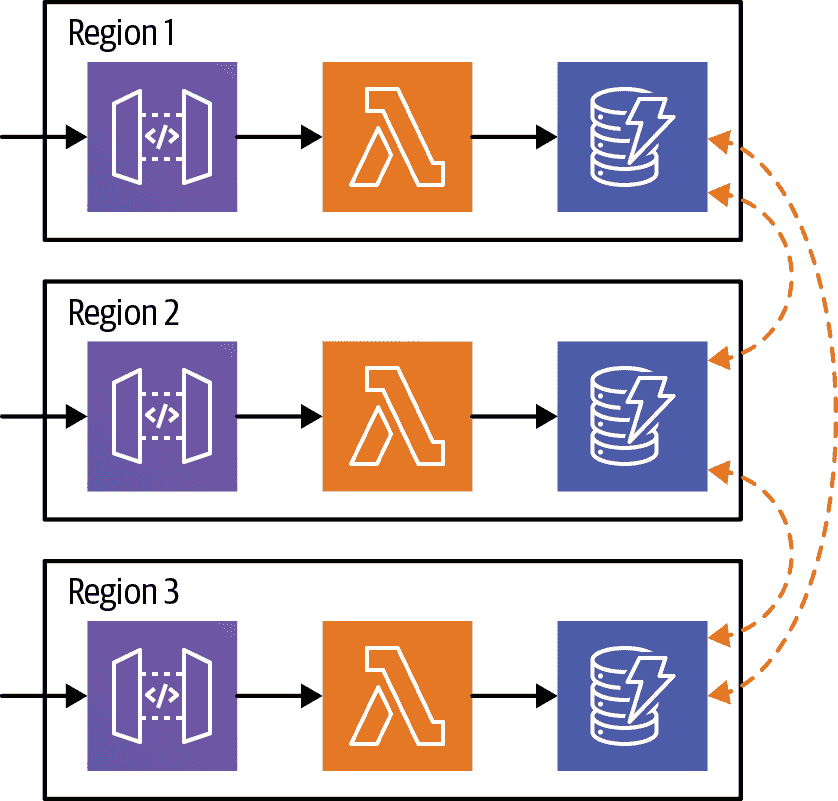

# 第九章：高级无服务器架构

在 第八章 中，我们讨论了 Lambda 的一些更高级的方面，这些方面在您开始将应用程序投入生产时变得重要。在本章中，我们继续这一主题，更广泛地探讨 Lambda 对架构的影响。

# 无服务器架构中的“陷阱”

首先，我们来看看无服务器架构的各个领域，如果不考虑它们可能会给您带来问题，并针对您的情况提供不同的解决方案。

## 至少一次交付

Lambda 平台保证，当上游事件源触发 Lambda 函数，或者另一个应用显式调用 Lambda 的 [*invoke* API 调用](https://oreil.ly/p1OWt) 时，相应的 Lambda 函数将被调用。但平台不保证 *函数将被调用的次数*：即使没有错误发生，“偶尔，您的函数可能会多次接收相同的事件”。这就是“至少一次交付”，这是因为 Lambda 平台是分布式系统的原因。

大多数情况下，Lambda 函数每个事件只会被调用一次。但有时（远少于 1% 的时间），Lambda 函数会被多次调用。这为什么会成为问题？如何处理这种行为？让我们来看一下。

### 示例：Lambda 的“cron job”

如果您在工业界开发软件已经足够长的时间，您可能会遇到运行多个“cron job”（定时任务，可能每小时或每天运行一次）的服务器主机。因为这些任务通常不会一直运行，因此仅在每个主机上运行一个任务是低效的，因此在一个主机上运行多种类型的任务非常典型。这样做更有效率，但可能会引起运维方面的头痛：依赖冲突、所有权不确定性、安全问题等。

您可以将许多类型的定时任务作为 Lambda 函数实现。要获得 cron 的调度行为，可以使用 *CloudWatch Scheduled Event* 作为触发器。SAM 为您提供了一种 [简洁的语法](https://oreil.ly/vFPnk) 来指定这一功能的触发器，并且甚至可以使用 cron 语法来指定 [调度表达式](https://oreil.ly/488um)。使用 Lambda 作为 cron 平台有各种好处，包括解决前面段落中的所有运维头痛。

使用 Lambda 实现定时任务的主要缺点是，如果函数运行时间超过 15 分钟（Lambda 的最大超时时间）或者需要超过 3GB 的内存。在这两种情况下，如果无法将任务分解为较小的块，则可能需要考虑使用 [Step Functions](https://oreil.ly/YDDyY) 和/或者 [Fargate](https://oreil.ly/NP0Sq)。

但是，使用 Lambda 还有另一个缺点：*非常非常地*偶尔您的定时任务可能会在其计划时间或附近运行多次。通常这不会是一个值得考虑的问题——也许您的任务是一个清理工作，两次执行相同的清理操作略微低效但功能上是正确的。然而，有时这可能是一个很大的问题——如果您的任务是计算月度抵押利息，您不希望向客户收取两次费用。

Lambda 的这种*至少一次交付*特性适用于所有事件源和调用，不仅限于定时事件。幸运的是，有多种方法来解决这个问题。

### 解决方案：构建一个幂等系统。

面对这个问题的第一个，通常也是最好的解决方案是构建一个[*幂等*](https://oreil.ly/rmaFI)系统。我们说这通常是最好的解决方案，是因为它接受我们在使用 Lambda 时构建分布式系统的思想。与其绕过或忽视分布式系统的特性，我们积极设计来与其协同工作。

当特定操作可以应用一次或多次，并且无论应用多少次都具有相同效果时，系统是幂等的。考虑到任何分布式架构时，幂等性是一个非常普遍的要求，更不用说无服务器架构了。

一个幂等操作的例子是将文件上传到 S3（忽略任何可能的触发器！）。无论您将同一文件上传到相同位置一次还是十次，最终结果是预期的键中 S3 中存储的正确字节。

当函数的任何重大*副作用*本身是幂等时，我们可以使用 Lambda 构建一个幂等系统。例如，如果我们的 Lambda 函数将文件上传到 S3，则 Lambda + S3 的整个系统是幂等的。类似地，如果您在写入数据库时可以使用*upsert*操作（“更新或插入”），如 DynamoDB 的[`UpdateItem`](https://oreil.ly/OTfZP)方法，来创建幂等性。最后，如果您调用任何外部 API，则可能需要查看它们是否提供幂等操作。

### 解决方案：接受重复，并在问题出现时进行处理。

有时处理可能发生的多次调用的一个完全合理的方法是意识到它可能会发生，并接受它，特别是因为它发生得如此之少。例如，假设您有一个定时任务生成报告然后将其电邮发送到公司内部邮件列表。如果偶尔发送两次电子邮件，您是否在意？也许不会。

同样地，也许构建一个幂等系统的工作量是显著的，但是处理非常偶尔的任务重复的影响实际上是简单和廉价的。在这种情况下，与其内置幂等性，也许更好的方法是监控某个事件的多次运行，然后有一个手动或自动的任务在它发生时执行清理。

### 解决方案：检查之前的处理

如果重复的副作用从不可接受，但是您的 Lambda 函数还使用了不具有幂等操作的下游系统，那么您有另一种解决此问题的方式。关键在于使您的 Lambda 函数本身具有幂等性，而不是依赖下游组件提供幂等性。

但是，您如何做到这一点，知道 Lambda 可能会多次为同一事件调用函数？关键在于还要知道，即使 Lambda 为同一事件调用多次函数，Lambda 附加到事件的*AWS 请求 ID*将对每次调用都相同。我们可以通过在我们的处理程序方法中调用`.getAwsRequestId()`来读取 AWS 请求 ID，我们可以选择接受[`Context`](https://oreil.ly/gh-Bw)对象。

假设我们可以跟踪这些请求 ID，我们将知道我们以前是否见过某个请求 ID，如果是，则可以选择丢弃第二次调用，从而保证总体语义上的“仅一次”保证。

现在，我们只需要一种方法来检查每次函数调用是否已经看到过请求 ID。因为理论上事件的多个函数调用可能重叠，所以我们需要一个*原子性*的来源来提供这种能力，这表明使用数据库会有所帮助。

DynamoDB 可以通过其[*条件写入*](https://oreil.ly/DBne-)功能为我们提供这一点。在一个简单的场景中，我们可以有一张只有`request_id`主键的表；我们可以在处理程序开始时尝试写入该表，使用事件的请求 ID；如果 DynamoDB 操作失败，则立即停止执行；否则，我们可以像往常一样继续 Lambda 的功能，知道这是第一次处理事件（参见图 9-1）。

###### 图 9-1\. 使用 DynamoDB 检查以前的事件

如果您选择沿着这条路走，您的实际解决方案可能会有一些细微差别。例如，如果发生错误，您可以选择在 DynamoDB 中删除行（以便继续使用 Lambda 的重试语义 - 重试的事件也将具有相同的 AWS 请求 ID！）。或者，您可以选择更复杂的“带超时的锁定”风格行为，以允许第一个调用失败时的重叠调用。

使用这种解决方案时，还需要考虑一些 DynamoDB 的问题。例如，您可能希望在表上设置[存活时间（TTL）属性](https://oreil.ly/JFDQg)，以在一段时间后自动删除行以保持清洁，通常设置为一天或一周。另外，您可能需要考虑 Lambda 函数的预期吞吐量，并使用它来分析 DynamoDB 表的成本 —— 如果成本太高，您可能需要选择另一种解决方案。此类替代方案包括使用 SQL 数据库；构建自己的（非 Lambda）服务来管理此重复操作；或者，在极端情况下，将 Lambda 完全替换为具有更传统计算平台的特定功能。

## Lambda 扩展对下游系统的影响

在第八章中，我们看到了 Lambda 的“神奇”自动扩展（“扩展”）。简单总结一下，Lambda 将自动创建所需数量的函数实例及其环境，以处理所有待处理的事件。默认情况下，它会创建每个帐户最多一千个 Lambda 实例，并且如果您要求 AWS 增加您的限制，它还会创建更多。

总的来说，这通常是一个非常有用的功能，也是人们发现 Lambda 有价值的关键原因之一。但是，如果您的 Lambda 函数与下游系统进行交互（大多数情况下都是如此！），那么您需要考虑这种扩展如何影响这些系统。作为一项练习，让我们考虑第五章中的示例。

在 “示例：构建无服务器 API” 中，我们有两个函数 —— `WeatherEventLambda` 和 `WeatherQueryLambda` —— 都调用了 DynamoDB。我们需要知道 DynamoDB 是否能够处理存在的任何上游 Lambda 实例的负载。由于我们使用了 DynamoDB 的[“按需”容量模式](https://oreil.ly/SHRmW)，我们知道事实上情况确实如此。

在 “示例：构建无服务器数据管道” 中，我们还有两个函数 —— `BulkEventsLambda` 和 `SingleEventLambda`。`BulkEventsLambda` 调用 SNS，具体来说是为了发布消息，因此我们可以查看[AWS 服务限制文档](https://oreil.ly/rv4GW)以了解我们可以向 SNS API 发出多少发布调用。该页面说限制在每秒 300 到 30,000 “事务”之间，取决于我们所在的地区。

我们可以使用这些数据来判断我们是否认为 SNS 能够处理我们从 Lambda 函数上可能产生的负载。此外，文档指出这是一个*软限制*——换句话说，我们可以请求 AWS 为我们增加它。值得知道的是，如果我们超过了限制，那么我们对 SNS 的使用将受到限制——我们可以将此错误通过 Lambda 函数传递回去，作为*未处理的错误*，从而使用 Lambda 的重试机制。另外，值得一提的是这是一个账户范围的限制，因此，如果我们的 Lambda 函数导致我们达到了 SNS API 的限制，同一账户中使用 SNS 的任何其他组件也将受到限制。

`SingleEventLambda` 只通过 Lambda 运行时间接调用 CloudWatch Logs。CloudWatch Logs 有限制，但它们非常高，所以目前我们将假设它具有足够的容量。

总之，我们在这些示例中使用的服务可以扩展到高吞吐量。这应该不足为奇——这些示例被设计为无服务器架构的好例子。

然而，如果你正在使用的下游系统要么（a）不像你的 Lambda 函数可能会扩展的那么*多*，要么（b）不像你的 Lambda 函数可能会扩展的那么*快*，那会发生什么？（a）的一个例子可能是下游关系型数据库——它可能只设计用于一百个并发连接，而五百个连接可能会给它带来严重的问题。 （b）的一个例子可能是使用基于 EC2 的自动缩放的下游微服务——这里该服务最终可能会扩展到足以处理意外负载，但 Lambda 可以在*秒*内扩展，而不是 EC2，后者将在*分钟*内扩展。

在这两种情况下，Lambda 函数的不可预见的扩展可能会对下游系统产生性能影响。通常，如果出现这样的问题，则这些效果也会被这些系统的其他客户感受到，而不仅仅是产生负载的 Lambda 函数。由于这个原因，你应该始终考虑 Lambda 对下游系统的扩展的影响。有多种可能的解决方案来处理这个问题。

### 解决方案：使用相似的扩展基础设施

一种解决方案是，在可能的情况下，使用具有与 Lambda 本身相似的扩展行为和容量的下游系统。我们选择 DynamoDB 和 SNS 在第五章的示例部分是部分由于这个设计动机。同样，有时我们可能会选择积极迁移离开某些解决方案，正是因为扩展的考虑。例如，如果我们可以轻松地从 RDS 数据库切换到使用 DynamoDB，那么这样做可能是有道理的。

### 解决方案：管理上游的扩展

另一个解决 Lambda 扩展超出下游系统的问题的方法是确保它根本不需要扩展，或者换句话说，限制触发执行的事件数量。如果您正在实施公司内部的无服务器 API，则可能意味着确保 API 的客户端不要发出过多的请求。

某些 Lambda 事件源还提供了帮助管理规模的功能。API 网关具有速率限制（具有 [*使用计划*](https://oreil.ly/FR4eX) 和 *节流限制*），Lambda 的 SQS 集成允许您配置批量大小 [（https://oreil.ly/LxNTp）](https://oreil.ly/LxNTp)。

### 解决方案：使用保留并发管理扩展性

如果您无法在上游管理规模，但仍希望限制函数的规模，可以使用 Lambda 的保留并发功能，我们在 “保留并发” 中进行了介绍。

当使用保留并发时，Lambda 平台将最多按照您配置的数量扩展函数。例如，如果将保留并发设置为 10，则在任何时候最多运行 10 个 Lambda 函数实例。在这种情况下，如果已有 10 个 Lambda 实例正在处理事件，当另一个事件到达时，您的函数会被节流，就像我们在 第八章 中讨论过的那样。

当您的事件源（如 SNS 或 S3）可能会轻松产生“突发”事件时，这种规模限制非常适用——使用保留并发意味着这些事件会在一段时间内处理，而不是立即全部处理。由于 Lambda 对于节流错误和异步来源的重试能力，您可以确保所有事件最终会被处理，只要在六小时内可以处理完毕。

您应该了解有关保留并发的一项行为是它不仅限制并发——它通过从全局 Lambda 并发池中移除配置的数量来*保证*并发。如果您有 20 个函数，每个函数的保留并发为 50，假设全局并发限制为 1,000，则将没有更多容量用于其他 Lambda 函数。全局并发限制可以增加，但这是一个需要记住执行的手动任务。

### 解决方案：有意构建混合解决方案

最后一个想法是有意“混合”构建解决方案（而不是*意外*混合解决方案），包括无服务器和传统组件。

例如，如果您使用 Lambda 和亚马逊的（非无服务器）RDS SQL 数据库服务，而没有考虑扩展性问题，我们将这称为“意外”混合解决方案。然而，如果您考虑了如何通过 Lambda 更有效地使用您的 RDS 数据库，那么我们将其称为“故意”混合。并且明确一点——我们认为某些架构解决方案由于像 DynamoDB 这样的服务和 Lambda 本身的性质，混合使用无服务器和非无服务器组件会更好。

让我们考虑一个例子，您通过 Lambda 函数将数据注入关系数据库，可能是在 API Gateway 的背后（参见图 9-2）。

###### 图 9-2\. 从 Lambda 函数直接写入关系数据库

此设计的一个问题是，如果您有太多的入站请求，那么您可能会过载您的下游数据库。

您可能首先考虑的解决方案是为支持 API 的 Lambda 函数添加保留并发，但问题在于现在您的上游客户端将不得不处理由并发限制引起的节流问题。

因此，更好的解决方案可能是引入一个消息主题、一个新的 Lambda 函数，并在第二个 Lambda 函数上使用保留并发（参见图 9-3）。

###### 图 9-3\. 通过主题从 Lambda 函数间接写入关系数据库

使用这种设计，例如，您的 API Lambda 函数仍然可以执行输入验证，必要时向客户端返回错误消息。但是，它不会直接写入数据库，而是会将消息发布到一个主题，例如，使用 SNS，在假设您的消息系统可以比数据库更有效地处理突然负载的情况下。然后，该消息的监听者将是另一个 Lambda 函数，其工作纯粹是执行数据库写入（或“upsert”，以处理重复调用！）。但这次 Lambda 函数可以应用保留并发以保护数据库，同时利用 AWS 内部的重试语义，而不是要求原始外部客户端执行重试。

虽然这种结果设计具有更多的移动部件，但它成功解决了扩展性问题，同时仍然混合使用了无服务器和非无服务器组件。

###### 小贴士

2019 年底，亚马逊宣布了[RDS 代理](https://oreil.ly/alAqq)服务。截至撰写本文时，该服务仍处于“预览”阶段，因此发布到普遍可用（GA）时的许多细节和功能尚未明确。然而，它肯定会在连接 Lambda 到 RDS 的一些讨论中帮助解决一些问题。

## Lambda 事件源的“细则”

本章的前几节讨论的是 Lambda 本身的微妙架构问题。由于 Lambda 上游存在的服务的细微差别，还有其他领域可能会影响无服务器设计。就像“至少一次”交付不是您在关于 Lambda 的第一篇文档中看到的核心内容一样，只有通过深入探索文档或艰辛的经验，您才能发现这些服务的一些微妙差别。

当您开始超越任何 Lambda 事件源的“试验性”阶段时，请尽可能阅读关于您正在使用的服务的所有 AWS 文档。也要寻找非 AWS 的文章——尽管它们不具权威性，有时是错误的，但有时候它们可以在架构上推动您朝着可能否则不会考虑的方向前进。

# 由无服务器思维启用的新架构模式

有时，当我们构建无服务器系统时，从某种距离来看，我们的架构可能并不比使用容器或虚拟机（VM）设计的方式看起来有多不同。“云原生”架构并不仅仅是 Kubernetes 的专属领域，无论您之前听到过什么！

例如，我们构建的无服务器 API 回溯到“示例：构建无服务器 API”，从“黑盒”视角来看，看起来就像任何其他微服务风格的 API。事实上，我们可以用运行在容器中的应用程序替换 Lambda 函数，从架构上讲，系统将会非常相似。

随着无服务器开始成熟，我们看到了一些新的架构模式，这些模式要么在传统服务中没有意义，要么甚至是不可能的。我们在第五章中提到过其中一种，当我们讨论“无 Lambda 的无服务器”时。在本章的结束部分，我们将看看其他几种模式，使用 Lambda，打破进入新领域。

## 使用无服务器应用程序库发布组件

在本书中我们多次提到“无服务器应用程序”——作为一个单元部署的组件集合。我们有我们的无服务器 API，使用 API Gateway，两个 Lambda 函数和一个 DynamoDB 表，全部作为一个单元分组。我们使用 Serverless Application Model（SAM）模板定义了这些资源集合。

AWS 提供了一种通过[无服务器应用程序库（SAR）](https://oreil.ly/Oa8HO)重用和共享这些 SAM 应用程序的方式。使用 SAR，您可以*发布*您的应用程序，然后稍后可以*部署*它，多次部署到不同的区域、帐户甚至不同的组织，如果您选择将 SAR 应用程序公开可用的话。

传统上，您可能有分发的代码或一个环境无关的部署配置。使用 SAR，代码（通过打包的 Lambda 函数）、基础架构定义和（可参数化的）部署配置全部捆绑在一个可共享的、*版本化的* 组件中。

SAR 应用程序可以通过几种不同的部署方式部署，这使它们在不同情况下都很有用。

首先，它们可以部署为 *独立应用程序*，就像您直接调用 `sam deploy` 一样，而不是使用 SAR。当您希望在多个位置或跨多个帐户或组织部署相同的应用程序时，这很有用。在这种情况下，SAR 在某种程度上就像应用程序部署模板的存储库，但通过打包代码，它还包括实际的应用程序代码。

此类用途的 SAR 应用示例在[公共 SAR 存储库](https://oreil.ly/QyOkD)中数不胜数——对于希望简化客户将集成组件部署到其 AWS 帐户的第三方软件提供商来说，这尤其有用。例如，这是来自 DataDog 的[日志转发器](https://oreil.ly/z-s8e)。

SAR 应用程序也可以作为其他 *父级* 无服务器应用程序中的 *嵌入式* 组件通过[CloudFormation 嵌套堆栈](https://oreil.ly/1sJjI)使用。SAM 通过 [`AWS::Serverless::Application` 资源类型](https://oreil.ly/aY0-G) 实现了 SAR 组件的嵌套。当以这种方式使用 SAR 时，您正在将高级组件抽象为 SAR 应用程序，并在多个应用程序中实例化这些组件。以这种方式使用 SAR 有点像在基于容器的应用程序中使用 [“旁车”](https://oreil.ly/9k3Xl)，但没有旁车需要的低级网络通信模式。

这些嵌套组件可能包括可以直接调用的 Lambda 函数，也可能是通过父应用程序（例如，通过 SAR 也许也包含在其中的 SNS 主题）间接调用的。或者，这些嵌套组件可能根本不包含任何函数，而是仅定义基础资源。一个很好的例子是标准化监控资源的 SAR 应用程序。

通常情况下，我们更喜欢嵌入式部署方案，即使父应用程序中没有其他组件。这是因为部署 SAR 应用程序以及可以在模板文件中作为 `AWS::Serverless::Application` 资源的一部分定义的参数值与部署任何其他 SAM 定义的无服务器应用程序没有任何区别。此外，如果您选择更新已部署的 SAR 应用程序的 *版本*，那么这也可以像任何其他模板更新一样在版本控制中跟踪。

[SAR 应用程序](https://oreil.ly/nhOUb) 可以进行安全设置，以便仅对特定 AWS 组织中的帐户可访问，因此它们是定义可在整个公司中使用的标准组件的绝佳方式。 使用此功能的示例包括 API Gateway 的自定义授权程序、标准运行组件（例如警报、日志过滤器和仪表板）以及消息传递式跨服务通信的常见模式的使用。

SAR 确实有一些限制。 例如，您无法在其中使用所有 CloudFormation 资源类型（例如，EC2 实例）。 但是，这是一种有趣的构建、部署和组合基于 Lambda 的应用程序的方式。

有关如何将 SAM 应用程序发布到 SAR 的详细信息，请参阅[文档](https://oreil.ly/nhOUb)，有关部署 SAR 应用程序的详细信息，请参阅前面链接的 `AWS::Serverless::Application` 资源类型。

## 全球分布式应用程序

在很久以前（即大约 15 年前），我们大多数构建基于服务器的应用程序的人通常对我们的软件实际运行的地点有一个相当清楚的概念，至少在一百米左右，甚至更近。 我们可以准确指出数据中心、服务器房间，甚至我们的代码正在运行的机架或个别机器。

然后“云”出现了，我们对应用程序地理部署的理解变得有点，嗯，模糊了。 例如，使用 EC2，我们大致知道我们的代码正在“北弗吉尼亚”或“爱尔兰”等地区运行，我们还知道两台服务器在同一数据中心运行时，通过它们的可用性区域（AZ）位置。 但是我们极少有可能能够在地图上指出软件运行的建筑物。

无服务器计算立即将我们的考虑半径进一步扩大。 现在我们*只*考虑区域——AZ 概念隐藏在抽象之中。

知道应用程序运行在何处的原因之一是考虑可用性。 当我们在数据中心运行应用程序时，我们需要知道如果数据中心失去互联网连接，那么我们的应用程序将不可用。

对于许多公司，特别是习惯于部署到一个数据中心的公司来说，云提供的这种区域级别的可用性已经足够了，特别是由于无服务器服务保证了区域内的高可用性。

但是如果你想要思考更大的问题呢？ 例如，如果您希望即使 AWS 的整个区域变得不稳定，也能保证应用程序的弹性？ 这种情况时有发生——只要与使用 us-east-1 的人交谈至少有几年的人。 好消息是 AWS 很少出现任何类型的*跨区域*中断。 绝大多数 AWS 的停机时间都限制在一个区域。

或者，不仅仅关注可用性，如果您的用户分布在世界各地，从圣保罗到首尔，您希望他们所有人都能低延迟访问您的应用程序，那怎么办呢？

云中存在多区域后，解决这些问题就变得*可能*。然而，在多个区域中运行应用程序是复杂的，并且随着增加更多区域，成本可能会变得很高。

然而，Serverless 可显著简化和降低这个问题的成本。现在可以在全球多个区域部署您的应用程序，而不会增加太多复杂性，也不会破坏您的预算。

### 全球部署

当您在 SAM 模板中定义应用程序时，通常不会将任何特定于区域的资源硬编码。如果您需要在 CloudFormation 字符串中引用堆栈部署的区域（例如我们在 第五章 中的数据管道示例中所做的），我们建议使用 `AWS::Region` [*伪参数*](https://oreil.ly/7Xe9-)。对于需要访问的任何特定于区域的资源，我们建议通过 CloudFormation 参数引用这些资源。

使用这些技术，您可以以*与区域无关*的方式定义您的应用程序模板，并将其部署到任意数量的 AWS 区域。

实际上，将您的应用程序部署到多个区域并不像我们希望的那样容易。例如，使用 CloudFormation 部署应用程序（例如使用 `sam deploy`）时，在模板文件中引用的 `CodeUri` 属性中的任何包必须在*部署的同一区域内*的 S3 存储桶中可用。因此，如果您希望将应用程序部署到多个区域，则其打包的构件需要在多个 S3 存储桶中可用，每个区域一个。这并不是无法解决的小问题，但这是您需要考虑的事情。

AWS 通过在 [CodePipeline](https://oreil.ly/E_DJr) 中启用 “跨区域操作”，改善了多区域部署的体验。CodePipeline 是亚马逊的 “持续交付” 编排工具，允许我们定义项目的源代码存储库；通过调用 [CodeBuild](https://oreil.ly/fSD1_) 构建和打包应用程序；最后使用 SAM/CloudFormation 部署应用程序。CodePipeline 实际上是在本书中我们手动运行的命令之上的自动化系统。它将做的远不止这些——这里的流程只是一个示例。

[“跨区域操作”](https://oreil.ly/6X5vB) 在 CodePipeline 中允许您并行部署到多个区域，目前支持 CodePipeline 的区域数量。这意味着一个 CD 流水线可以将应用程序部署到美国、欧洲、日本和南美。

设置所有这些仍然有些棘手。有关更多信息，请参阅我们在 Github 上的 [示例项目](https://oreil.ly/xzWiI)。

另一个有助于多区域部署的工具是无服务器应用程序存储库，我们在前一节中描述过。当您通过一个区域将应用程序发布到 SAR 时，它将在全球所有区域提供。在撰写本文时，这仅适用于公开共享的应用程序，但我们希望这个功能很快也能适用于私有应用程序。

### 本地化连接，具备故障转移能力

一旦您在全球范围内部署了您的应用程序，用户如何连接到他们附近的版本呢？毕竟，全球部署的一个重要目的是接受光速有限的事实，因此将用户的请求路由到他们客户端附近的应用程序的最接近地理版本，为用户提供尽可能低延迟的体验。

一种方法是在客户端内部硬编码区域特定位置，通常是一个 DNS 主机名。这有点粗糙，但有时是有效的，特别是对于组织内部的应用程序。

另一个通常更好的选择是，因为它可以 *动态* 适应用户的位置，是采用亚马逊的 Route53 DNS 服务，特别是其 [*地理位置*](https://oreil.ly/4RCb2) 功能。例如，如果用户通过部署在三个不同区域并行的 API 网关连接到您的应用程序，那么您可以在 Route53 中设置 DNS，使用户连接到距离他们最近的 API 网关所在的区域。

由于您在这一点上已经在使用 Route53 的一些高级功能，您可以进一步使用 [*健康检查和 DNS 故障转移*](https://oreil.ly/XlUX9)。通过 Route53 的这一特性，如果用户最接近的应用程序版本不可用，那么 Route53 将将该用户重定向到下一个 *最* 近可用的应用程序版本。

现在我们有我们应用程序的主动-主动版本 *和* 本地化路由。我们构建了一个既具有弹性 *又* 性能更好的应用程序。到目前为止，我们的应用程序架构没有更新，只有操作性的更新。然而，我们确实应该面对房间里的大象。

### 全局状态

我们之前说过，无服务器使得可以将您的应用程序部署到全球多个区域，而几乎不增加复杂性。我们刚刚描述了部署过程本身，并讨论了用户如何通过互联网访问您的应用程序。

然而，全球应用程序的一个重要关注点是如何处理状态。最简单的解决方案是将您的状态仅放在一个区域，并将使用该状态的服务部署到多个区域中（图 9-4）。

###### 图 9-4\. 多个计算区域和一个数据库区域

这是[内容传递网络（CDN）](https://oreil.ly/UaAj5)使用的相同模型——世界某处有一个“起点”，然后 CDN 在全球的数十甚至数百个“点位”上缓存状态。

这对于可缓存状态是可以接受的，但不可缓存情况怎么办呢？

在这种情况下，单区域状态模型崩溃，因为所有您的区域将调用集中数据库区域的*每个请求*。您失去了本地化延迟的好处，并且面临区域性故障的风险。

幸运的是，AWS 和其他主要云提供商现在提供全球复制的数据库。AWS 上的一个很好的例子是[DynamoDB 全局表](https://oreil.ly/fEZAG)。假设您正在使用第五章中的无服务器 API 模式——您可以将设计中的 DynamoDB 表从该示例替换为*全局*表。然后，您可以将您的 API 快乐地部署到全球多个地区，AWS 将为您安全地在全球范围内移动数据。这为您提供了弹性和改进的用户延迟，因为 DynamoDB 的表复制是异步进行的（见图 9-5）。

###### 图 9-5\. 具有复制数据库的多个区域

AWS 确实对全球表收取额外费用，但与在每个地区建立状态复制系统相比，费用并不是太高。

### 按使用付费

关于成本问题，当涉及到多区域部署时，无服务器计算真正确定交易的地方在这里。在第一章中，我们说无服务器服务的一个具体区别是它“根据精确的使用情况收费，从零使用到高使用。”这不仅适用于一个区域，而是跨区域。

例如，假设您已经将 Lambda 应用程序部署到三个地区，因为您希望有两个备份地区用于灾难恢复。如果您只使用其中一个地区，那么您只需支付该地区中 Lambda 使用的费用——您在其他两个地区的备份版本是免费的！这与任何其他计算范式有很大的不同。

另一方面，假设您从一个地区部署应用程序开始，然后将您的 API Gateway + Lambda 应用程序部署到十个地区，使用我们之前讨论过的地理位置 DNS 路由。如果您这样做，您的 Lambda 账单不会改变——无论您在一个地区还是十个地区运行，因为 Lambda 仍然只按您函数中发生的活动量收费。您之前的使用量没有增加；现在只是分布在十个地区之间。

我们认为，与传统平台相比，这种极其不同的成本模型将使全球分布式应用比过去更加普遍。

###### 注意

在 Lambda 成本“没有变化”的观点上，这里有一个小小的警告。AWS 可能会根据不同地区对 Lambda 收费略有不同。然而，这是区域特定定价的一部分，而不是因为在多个地区运行应用程序。

### 边缘计算/“无区域”

到目前为止，在本节中我们讨论的示例都是关于在全球多个地区部署，但它们仍然要求我们理解亚马逊的整个云被划分为这些不同的地区。

如果你根本不需要考虑地区会怎么样？如果你能够将你的代码部署到一个全球服务，并且 AWS 只需执行运行代码所需的一切操作，以提供用户最佳的延迟，并确保即使一个位置下线也能保持可用性？

结果证明，这种未来的疯狂想法已经实现了。有点像。首先，AWS 已经有一些被称为“全球服务”的服务——IAM 和 Route53 就是其中两个。但 AWS 的 [CloudFront：AWS 的 CDN](https://oreil.ly/_0EUS) 也是。虽然 CloudFront 做了你期望的任何其他 CDN 所做的事情——缓存 HTTP 流量以加快网站速度——它还具有通过名为 [Lambda@Edge](https://oreil.ly/6D4yw) 的服务调用特殊类别的 Lambda 函数的能力。

Lambda@Edge 函数与 Lambda 函数大多类似——它们具有相同的运行时模型和大多数相同的部署工具。当你部署一个 Lambda@Edge 函数时，AWS 会在全球范围内复制你的代码，因此你的应用程序真正变成了“无区域”。

然而，Lambda@Edge 有许多显著的限制，包括：

+   唯一可用的事件源是 CloudFront 本身——因此，你只能在 CloudFront 发布中的 HTTP 请求处理过程中运行 Lambda@Edge。

+   Lambda@Edge 函数在撰写本文时，只能用 Node 或 Python 编写。

+   Lambda@Edge 环境相比常规 Lambda 函数在内存、CPU 和超时方面有更多限制。

Lambda@Edge 函数令人着迷，即使在撰写本文时，它们也非常适合解决特定问题。但更重要的是，它们指向了*真正*全球化的云计算未来，其中局部性完全抽象化。如果 AWS 能够将 Lambda@Edge 的能力更接近常规 Lambda，那么作为架构师和开发者，我们将摆脱区域思维的道路已经走得很远。也许当人们在火星上运行应用程序时，我们仍然需要考虑局部性，但这距离还有几年。Lambda 承诺无服务器，但并非无行星！

# 摘要

当我们构建无服务器系统时，我们在代码和运维方面的投入减少了，但其中一部分工作需要用更多的架构思考来代替，特别是关于我们正在使用的托管服务的能力和限制方面。在本章中，您更详细地了解了其中一些问题，并审视了一些缓解方法。

无服务器计算还提供了完全新的软件架构方式。您了解到了两个这样的概念——无服务器应用程序仓库和全球分布的应用程序。随着 Lambda 和无服务器技术的进化，在未来几年中，我们预计会看到更多新的应用程序架构模型的出现。

# 练习

1.  更新从“示例：构建无服务器数据管道”中的数据管道示例——将`SingleEventLambda`的预留并发设置为 1。现在上传示例数据——如果需要，请向*sampledata.json*文件中添加几个更多的元素以产生限流现象。使用 Lambda Web 控制台中的“限流”行为将预留并发设置为零。

1.  更新“示例：构建无服务器 API”以使用 DynamoDB 全局表——确保将表本身分离到自己的 CloudFormation 堆栈中！然后将 API 组件（及其 Lambda 函数）部署到多个区域。您能够将数据写入一个区域然后从另一个区域读取吗？
