# 第二章：搭建

在本章中，您将了解如何创建 Quarkus 项目结构。Quarkus 提供了几种不同的方式来搭建项目。

您将学会如何做以下事情：

+   以不同的方式搭建项目，从 Maven 到 VSCode IDE

+   通过实时重载提升开发者体验

+   使用 Quarkus 提供静态资源

# 2.1 使用 Maven 搭建 Quarkus 项目

## 问题

您可以通过生成一个简单的项目来快速开始 Quarkus。

## 解决方案

使用 Quarkus Maven 插件。

## 讨论

使用 Quarkus Maven 插件创建一个简单的项目，准备部署，并包含以下内容：

+   包含最小 Quarkus 依赖项的*pom.xml*文件

+   一个简单的 JAX-RS 资源

+   一个用于 JAX-RS 资源的测试

+   本地测试

+   使用 Dockerfiles 生成一个容器

+   空配置文件

我们假设您已经安装了[Apache Maven](http://maven.apache.org)。打开终端并执行以下命令：

```java
mvn io.quarkus:quarkus-maven-plugin:1.4.1.Final:create \
 -DprojectGroupId=org.acme \
 -DprojectArtifactId=getting-started \
 -DclassName="org.acme.quickstart.GreetingResource" \
 -Dpath="/hello"
```

该项目具有以下结构：

```java
├── mvnw ├── mvnw.cmd ├── pom.xml └── src
 ├── main │   ├── docker 
 │   │   ├── Dockerfile.jvm │   │   └── Dockerfile.native │   ├── java │   │   └── org │   │       └── acme │   │           └── quickstart │   │               └── GreetingResource.java 
 │   └── resources │       ├── META-INF │       │   └── resources │       │       └── index.html 
 │       └── application.properties 
 └── test └── java └── org └── acme └── quickstart 
 ├── GreetingResourceTest.java └── NativeGreetingResourceIT.java
```


Dockerfiles


JAX-RS 资源


静态资源


配置文件


为 JAX-RS 资源自动生成的测试

# 2.2 使用 Gradle 搭建 Quarkus 项目

## 问题

您想要通过生成一个简单的项目来快速开始 Quarkus，您是 Gradle 用户。

## 解决方案

使用 Quarkus Maven 插件（是的，Maven 插件）。

## 讨论

您可以通过使用 Quarkus Maven 插件来搭建一个简单的 Quarkus 项目；您只需将输出设置为 Gradle 项目。生成的项目准备好部署，并包含以下内容：

+   包含最小 Quarkus 依赖项的*build.gradle*文件

+   一个简单的 JAX-RS 资源

+   为 JAX-RS 资源编写的测试

+   本地测试

+   使用 Dockerfiles 生成一个容器

+   空配置文件

我们假设您已经安装了[Apache Maven](http://maven.apache.org)。打开终端并执行以下命令：

```java
mvn io.quarkus:quarkus-maven-plugin:1.4.1.Final:create \
 -DprojectGroupId=org.acme \
 -DprojectArtifactId=getting-started \
 -DclassName="org.acme.quickstart.GreetingResource" \
 -Dpath="/hello" \
 -DbuildTool=gradle
```

###### 注意

不像在 Apache Maven 中那样，此命令将在*当前*目录中创建结构。

结果项目具有以下结构：

```java
.
├── README.md
├── build.gradle
├── gradle
│   └── wrapper
│       ├── gradle-wrapper.jar
│       └── gradle-wrapper.properties
├── gradle.properties
├── gradlew
├── gradlew.bat
├── settings.gradle
└── src
 ├── main
 │   ├── docker
 │   │   ├── Dockerfile.jvm
 │   │   └── Dockerfile.native
 │   ├── java
 │   │   └── org
 │   │       └── acme
 │   │           └── quickstart
 │   │               └── GreetingResource.java
 │   └── resources
 │       ├── META-INF
 │       │   └── resources
 │       │       └── index.html
 │       └── application.properties
 ├── native-test
 │   └── java
 │       └── org
 │           └── acme
 │               └── quickstart
 │                   └── NativeGreetingResourceIT.java
 └── test
 └── java
 └── org
 └── acme
 └── quickstart
 └── GreetingResourceTest.java
```

# 2.3 使用 Quarkus Start Coding 网站搭建 Quarkus 项目

## 问题

您可以通过生成一个简单的项目来快速开始 Quarkus，而无需安装 Maven 或 Gradle。

## 解决方案

使用 Quarkus Start Coding 网站通过[*https://code.quarkus.io*](https://code.quarkus.io)生成一个简单的 Quarkus 项目。

## 讨论

撰写本文时，主页看起来像图 2-1 所示。

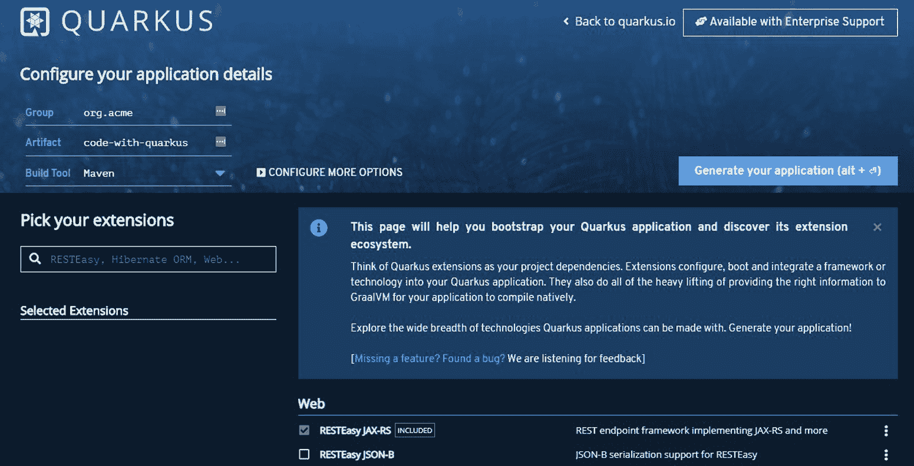

###### 图 2-1. [*https://code.quarkus.io*](https://code.quarkus.io) 主页

页面加载后，点击“生成您的应用程序”按钮以下载包含生成项目的 ZIP 文件。

打开终端并解压生成的项目：

```java
unzip code-with-quarkus.zip
cd code-with-quarkus/
```

脚手架项目与您在 Recipe 2.1 中生成的项目相同，具有以下元素：

+   *pom.xml* 文件具有最小的 Quarkus 依赖项

+   一个简单的 JAX-RS 资源

+   JAX-RS 资源的测试

+   本地测试

+   Dockerfile 用于生成容器

+   一个空配置文件

## 参见

我们还没有讨论 Quarkus 扩展，但请注意，您可以使用注册的任何 Quarkus 扩展生成项目。您将在后续章节中了解更多有关扩展的信息。

可以通过在页面上的复选框中选择它们或使用搜索框来添加扩展。

# 2.4 使用 Visual Studio Code 搭建 Quarkus 项目

## 问题

您可以通过在 Visual Studio (VS) Code 中生成一个简单的 Quarkus 项目来快速入门 Quarkus。

## 解决方案

使用 Quarkus VS Code 扩展。

## 讨论

Quarkus 扩展为 Visual Studio Code IDE 开发，将一些 Quarkus 特性集成到 IDE 中。以下是其中一些特性：

+   用命令搭建项目

+   添加扩展的命令

+   配置文件（属性和 YAML 格式）的自动完成代码段

要安装插件，请打开 VS Code 并点击“Extensions”按钮，如图 2-2 所示。

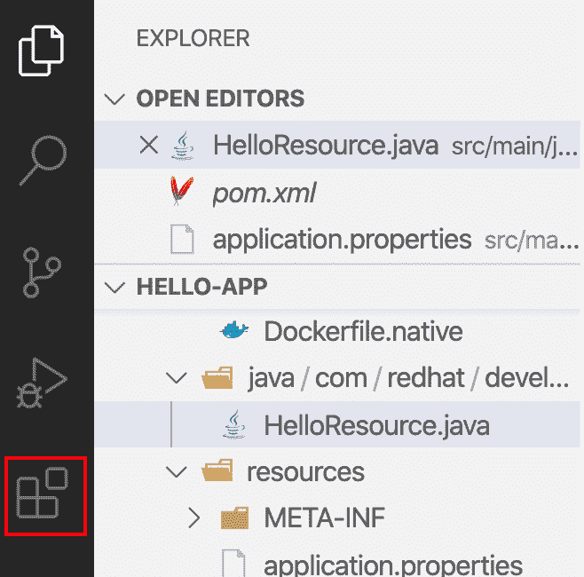

###### 图 2-2\. 在 VS Code 中点击扩展按钮可以安装 Quarkus 扩展

然后搜索`quarkus`并选择由 Red Hat 提供的`Quarkus Tools for Visual Studio Code`。你的搜索结果应该类似于图 2-3。

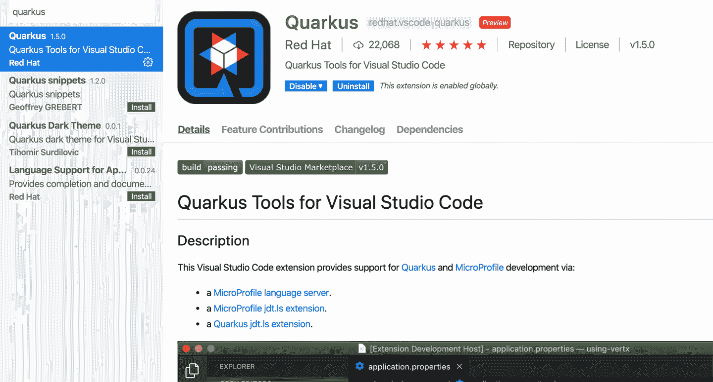

###### 图 2-3\. Quarkus 扩展可以从 VS Code 市场免费获取

安装完成后，请重新启动 IDE，然后即可开始使用这些扩展。

要生成一个新的 Quarkus 项目，打开命令面板并选择“生成一个 Quarkus 项目”。编写时的可用选项如图 2-4 所示。

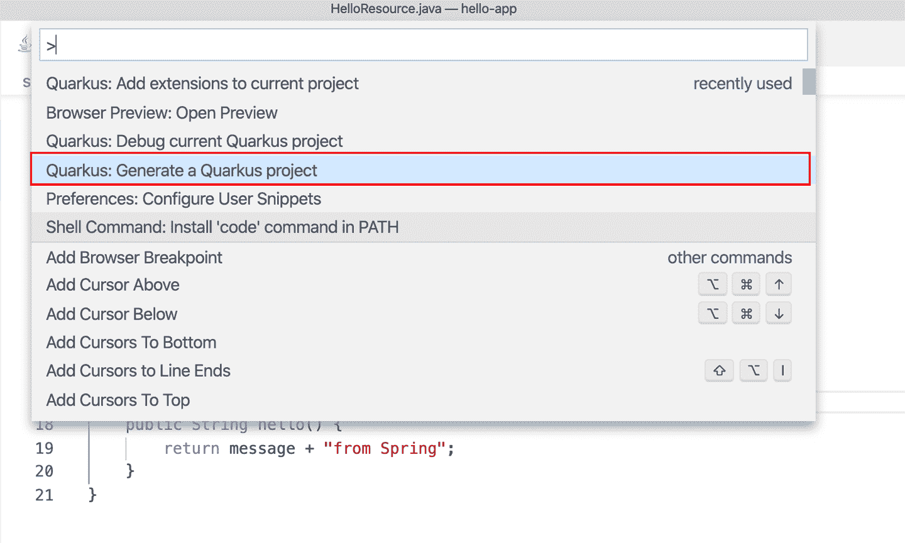

###### 图 2-4\. 从命令面板生成一个新的 Quarkus 项目

下一步是根据图 2-5 所示的提示，选择构建工具。还有关于`groupId`、`artifactId`等的一些问题。

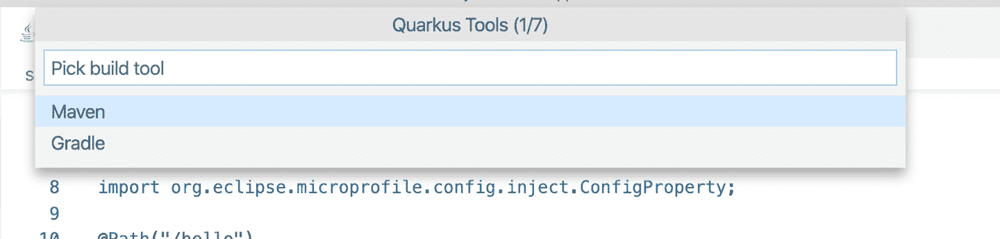

###### 图 2-5\. 选择您的构建工具

扩展可以通过控制台中的`Add Extension`命令进行添加，如图 2-6 所示。

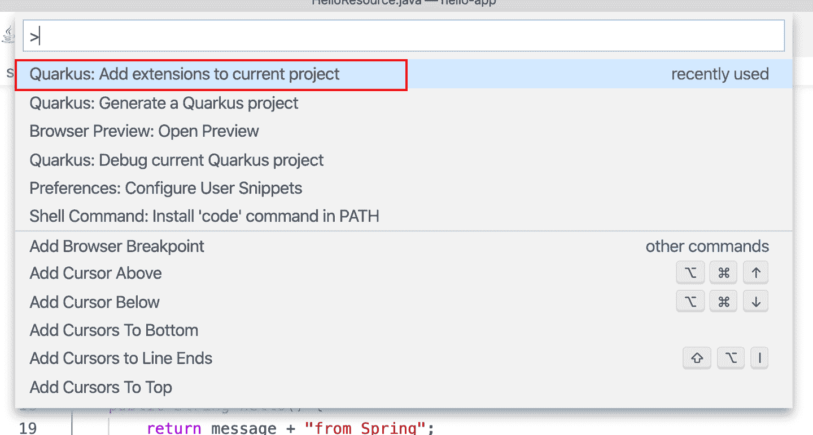

###### 图 2-6\. `Add extension` 命令

并选择您可能想要添加到项目中的任何 Quarkus 扩展。可见的可用扩展样本可见于图 2-7。

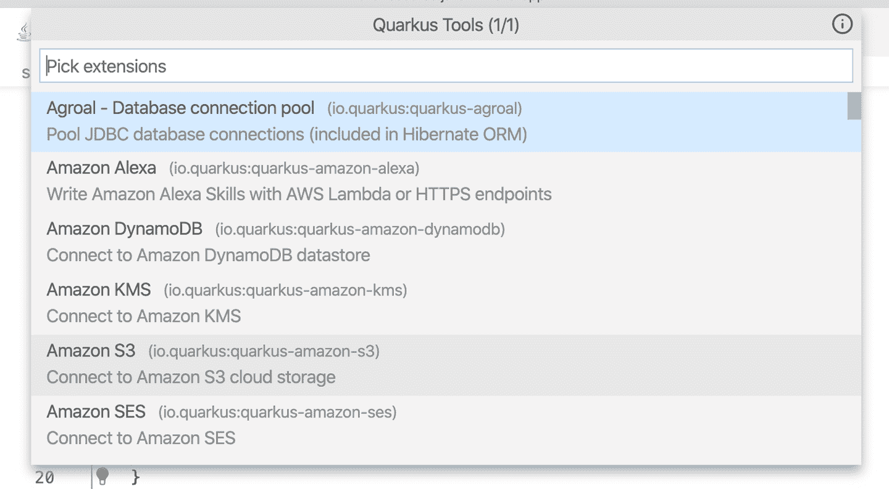

###### 图 2-7\. 您可以看到可安装到应用程序的可用扩展列表

在接下来的图表中，您可以看到 Quarkus 扩展提供的一些功能。

图 2-8 显示了配置属性的自动完成，帮助您正确配置应用程序。

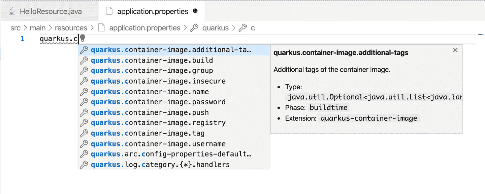

###### 图 2-8\. 配置属性键的自动完成和类型信息

图 2-9 当您将鼠标悬停在配置属性上时，显示配置属性的描述。

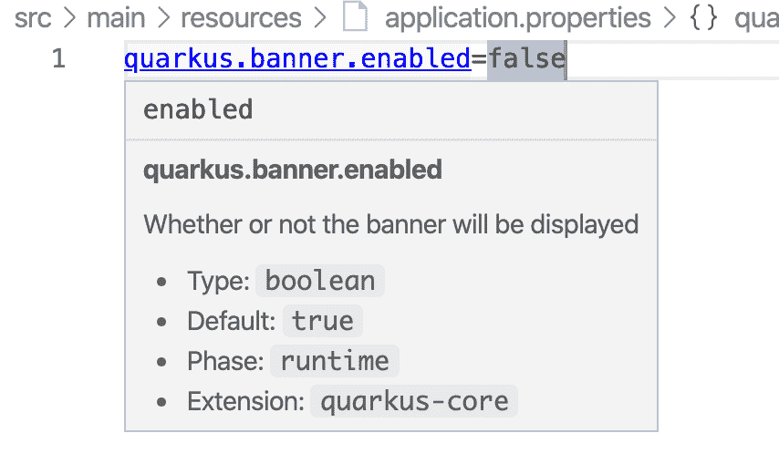

###### 图 2-9\. 将鼠标悬停在配置属性上，可以获得有关该属性的更多信息

图 2-10 演示如何检测应用程序中未使用的属性。

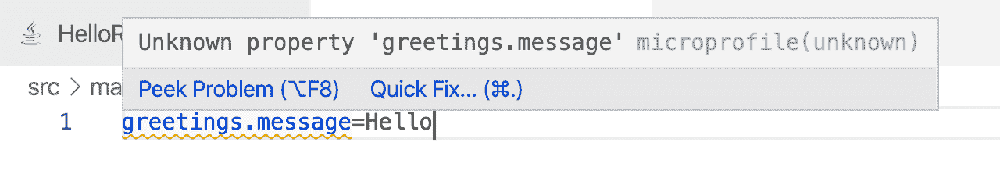

###### 图 2-10\. 检测未使用的配置属性

图 2-11 显示了表示端点的 URL。如果单击它，将打开一个新的浏览器窗口，指向给定的 URL。

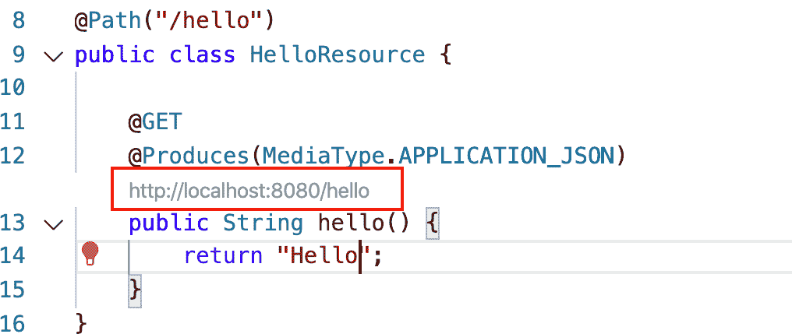

###### 图 2-11\. VS Code 扩展为每个端点方法生成可点击的 URL 端点

## 参见

Quarkus 扩展适用于多个 IDE：

+   [Visual Studio Code](https://oreil.ly/rL1Md)

+   [Eclipse](https://oreil.ly/3Ais_)

+   [IntelliJ](https://oreil.ly/Whvdj)

# 2.5 使用开发模式实现实时重新加载

## 问题

您希望在不必重新打包和重新部署完整应用程序的情况下查看项目中的更改结果。

## 解决方案

使用*开发模式*，它可以通过后台编译实现热部署，这意味着当您修改 Java 文件和/或资源文件并刷新浏览器时，这些更改将自动生效。

###### 注意

每种脚手架方法默认使用 Java 11。您需要 Java 11 VM，或者您需要修改项目以使用不同版本的 JVM。

## 讨论

要在开发模式下启动应用程序，请在项目的根目录中运行`quarkus:dev`命令。例如，您正在使用 Recipe 2.1 中创建的项目：

```java
./mvnw compile quarkus:dev

[INFO] Scanning for projects...
....
[INFO] --- quarkus-maven-plugin:1.4.1.Final:dev (default-cli) @
 getting-started ---
Listening for transport dt_socket at address: 5005
INFO  [io.qua.dep.QuarkusAugmentor] (main) Beginning quarkus augmentation
INFO  [io.qua.dep.QuarkusAugmentor] (main) Quarkus augmentation
 completed in 946ms
INFO  [io.quarkus] (main) Quarkus 1.4.1.Final started in 1.445s.
 Listening on: http://[::]:8080
INFO  [io.quarkus] (main) Installed features: [cdi, resteasy]
```

当应用程序运行时，请打开新的终端窗口并运行以下命令：

```java
curl http://localhost:8080/hello

hello
```

现在，在*不停止* `quarkus:dev` 模式的情况下，在 `org.acme.quickstart.GreetingResource.java` 中进行下一个修改：

```java
@GET
@Produces(MediaType.TEXT_PLAIN)
public String hello() {
    return "hola";
}
```

然后再次运行此命令：

```java
curl http://localhost:8080/hello

hola
```

非常重要的一点是，您已经对源代码进行了更改，并且在不需要任何重新编译、重新打包或重新部署的情况下，这些更改已经自动应用到正在运行的实例中——无需任何特殊设置。

现在，不再是*编写代码* → *编译* → *部署* → *刷新* → *重复*，而是简化您的开发工作流程为*编写代码* → *刷新* → *重复*。

开发模式检测 Java 文件、应用程序配置和静态资源的更改。

要停止开发模式，请转到`quarkus:dev`终端并按 Ctrl+C。

要在 Gradle 项目中运行开发模式，可以运行`quarkusDev`任务：

```java
./gradlew quarkusDev
...
```

# 2.6 提供静态资源

## 问题

您想要提供静态资源，如 HTML、JavaScript、CSS 和图像。

## 解决方案

在 Quarkus 中，复制到*src/main/resources/META-INF/resources*的任何资源将从根路径提供服务。

在某些情况下，您可能希望为调用者提供静态资源。这些可以是静态可下载内容或者一个 HTML 页面。

默认情况下，Quarkus 带有一个*index.html*文件作为静态资源。

启动应用程序：

```java
./mvnw compile quarkus:dev
```

打开浏览器并输入以下网址：[*http://localhost:8080/index.html*](http://localhost:8080/index.html)。

并且你将看到类似于图 2-12 所示的内容。

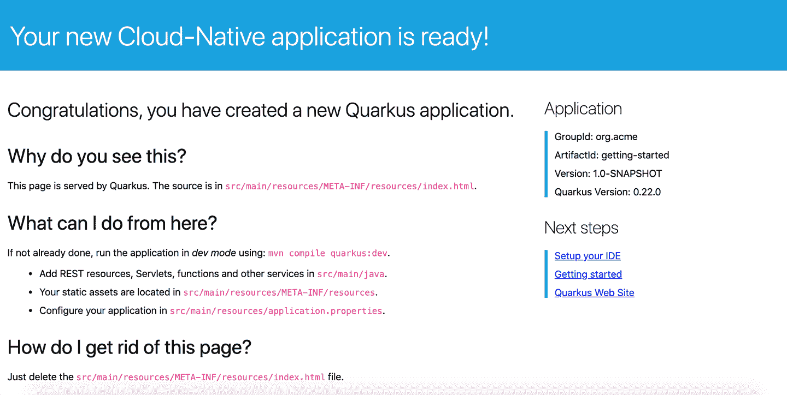

###### 图 2-12\. Quarkus 为您的应用程序创建一个带有基本信息和下一步操作的占位符索引，以帮助您在脚手架后继续进行操作。

###### 提示

实时重新加载也适用于静态资源。
