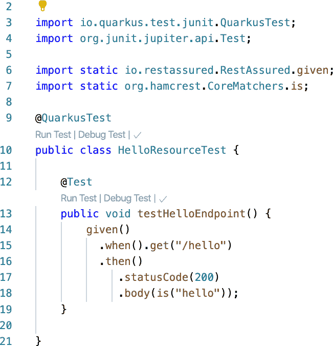
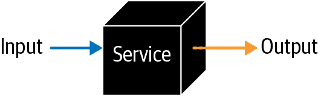

# 第五章：编程模型

在本章中，您将学习与 Quarkus 编程模型相关的主题。Quarkus 在其遵循的编程模型方面独具一格。与其他一些框架不同，Quarkus 允许您混合使用命令式模型（使用 CDI）和反应式模型（使用 SmallRye Mutiny）。第十五章专门介绍使用反应式方法。有时，您可能需要同时使用这两种方法，因此了解如何利用每种方法是很有益处的。

在本章中，我们专注于命令式模型，因此您将学习以下内容：

+   如何编组/解组 JSON 和 XML 文档

+   如何验证请求参数

+   如何使用 CDI 规范作为上下文和依赖注入解决方案

+   如何为 Quarkus 服务编写测试

# 5.1 编组/解组 JSON

## 问题

您希望将 JSON 文档与 Java 对象进行编组/解组。

## 解决方案

使用`JSON-B`规范或 Jackson 项目来从/向 Java 对象编组和解组 JSON 文档。

当您创建 REST API 时，通常使用 JSON 作为交换信息的数据格式。到目前为止，您已经看到了仅返回简单纯文本响应的示例；但在本节中，您将学习如何开始使用 JSON 作为请求体和响应的数据格式。

首先要做的是在`pom.xml`中注册*JSON-B*扩展。打开一个终端窗口，从项目的根目录运行以下命令：

```java
./mvnw quarkus:add-extension -Dextensions="quarkus-resteasy-jsonb"

[INFO] --- quarkus-maven-plugin:1.4.1.Final:add-extension (default-cli)
 @ custom-config ---
✅ Adding extension io.quarkus:quarkus-resteasy-jsonb
```

这实际上将`io.quarkus:quarkus-resteasy-jsonb`添加到构建工具中。

###### 注意

在 Gradle 中，您可以使用`./gradlew addExtension` `--extensions="quarkus-resteasy-jsonb"`来添加扩展。

下一步是创建一个`developer`类，该类将在端点中进行编组和解组。创建一个名为`org.acme.quickstart.Developer.java`的新类：

```java
package org.acme.quickstart;

public class Developer {

    private String name;
    private String favoriteLanguage;
    private int age;

    public String getName() {
        return name;
    }

    public void setName(String name) {
        this.name = name;
    }

    public String getFavoriteLanguage() {
        return favoriteLanguage;
    }

    public void setFavoriteLanguage(String favoriteLanguage) {
        this.favoriteLanguage = favoriteLanguage;
    }

    public int getAge() {
        return age;
    }

    public void setAge(int age) {
        this.age = age;
    }

}
```

最后，您可以创建一个 Rest API 端点来实现`developer`操作。创建一个名为`org.acme.quickstart.DeveloperResource.java`的新类：

```java
package org.acme.quickstart;

import java.util.ArrayList;
import java.util.List;

import javax.ws.rs.Consumes;
import javax.ws.rs.GET;
import javax.ws.rs.POST;
import javax.ws.rs.Path;
import javax.ws.rs.Produces;
import javax.ws.rs.core.MediaType;
import javax.ws.rs.core.Response;

@Path("/developer")
public class DeveloperResource {

    private static final List<Developer> developers = new ArrayList<>();

    @POST
    @Consumes(MediaType.APPLICATION_JSON)
    public Response addDeveloper(Developer developer) {
        developers.add(developer);
        return Response.ok().build();
    }

    @GET
    @Produces(MediaType.APPLICATION_JSON)
    public List<Developer> getDevelopers() {
        return developers;
    }
}
```

通过在新的终端窗口中打开并启动 Quarkus 应用程序，并发送`POST`和`GET`方法的请求来尝试它：

```java
./mvnw clean compile quarkus:dev

curl -d '{"name":"Alex","age":39, "favoriteLanguage":"java"}' \
 -H "Content-Type: application/json" -X POST http://localhost:8080/developer

curl localhost:8080/developer
[{"age":39,"favoriteLanguage":"java","name":"Alex"}]
```

注意，每个 Java 字段直接映射到一个 JSON 字段。如果您想更改此映射，可以使用`javax.json.bind.annotation.JsonbProperty`注解来设置不同的映射名称：

```java
@JsonbProperty("favorite-language")
String favoriteLanguage;
```

## 讨论

您可以使用 Jackson 项目来编组/解组 JSON 文档与 Java 对象，而不是 JSON-B。您需要注册`Jackson-Extension`以将其用作 JSON 解决方案：

```java
./mvnw quarkus:add-extension -Dextensions="quarkus-resteasy-jackson"
```

默认情况下，提供了一个`com.fasterxml.jackson.databind.ObjectMapper`，但您可以使用 CDI 提供自定义的`ObjectMapper`：

```java
package org.acme.quickstart;

import com.fasterxml.jackson.databind.ObjectMapper;
import io.quarkus.jackson.ObjectMapperCustomizer;
import javax.inject.Singleton;

@Singleton
public class RegisterCustomModuleCustomizer
    implements ObjectMapperCustomizer {

    public void customize(ObjectMapper mapper) {
        objectMapper.configure(
            DeserializationFeature.FAIL_ON_NULL_FOR_PRIMITIVES, false);
    }
}
```

## 参见

你可以在以下网页上了解有关 JSON-B 和 Jackson 的更多信息：

+   [Jakarta JSON Binding (JSON-B)](http://json-b.net)

+   [Jackson 项目主页 @GitHub](https://oreil.ly/U3hwH)

# 5.2 编组/解组 XML

## 问题

您希望将 XML 文档与 Java 对象进行编组/解组。

## 解决方案

使用 JAX-B 规范将 XML 文档从/到 Java 对象编组和解组。

当您创建 REST API 时，可能希望使用 XML 作为请求体和响应的数据格式。到目前为止，您已经了解了如何在 JSON 格式中实现它，但在本节中，您将学习如何开始使用 XML 作为请求体和响应的数据格式。

首先，您需要在 *pom.xml* 中注册 JAX-B 扩展。打开一个终端窗口，并从项目的根目录运行以下命令：

```java
./mvnw quarkus:add-extension -Dextensions="quarkus-resteasy-jaxb"

[INFO] --- quarkus-maven-plugin:1.4.1.Final:add-extension (default-cli)
 @ custom-config ---
✅ Adding extension io.quarkus:quarkus-resteasy-jaxb
```

这实际上将 `io.quarkus:quarkus-resteasy-jaxb` 添加到构建工具中。

###### 注意

在 Gradle 中，您可以使用 `./gradlew addExtension` `--extensions="quarkus-resteasy-jaxb"` 来添加扩展。

下一步是创建一个 `computer` 类，在端点中将其编组和解组。创建一个名为 `org.acme.quickstart.Computer.java` 的新类：

```java
package org.acme.quickstart;

import javax.xml.bind.annotation.XmlRootElement;

@XmlRootElement 
public class Computer {

    private String brand;
    private String serialNumber;

    public String getBrand() {
        return brand;
    }

    public void setBrand(String brand) {
        this.brand = brand;
    }

    public String getSerialNumber() {
        return serialNumber;
    }

    public void setSerialNumber(String serialNumber) {
        this.serialNumber = serialNumber;
    }

}
```


`XmlRootElement` 将其设置为 XML 文档

最后，您可以创建一个 REST API 端点以实现 `computer` 操作。创建一个名为 `org.acme.quickstart.ComputerResource.java` 的新类：

```java
package org.acme.quickstart;

import java.util.ArrayList;
import java.util.List;

import javax.ws.rs.Consumes;
import javax.ws.rs.GET;
import javax.ws.rs.POST;
import javax.ws.rs.Path;
import javax.ws.rs.Produces;
import javax.ws.rs.core.MediaType;
import javax.ws.rs.core.Response;

@Path("/computer")
public class ComputerResource {

    private static final List<Computer> computers = new ArrayList<>();

    @POST
    @Consumes(MediaType.APPLICATION_XML)
    public Response addComputer(Computer computer) {
        computers.add(computer);
        return Response.ok().build();
    }

    @GET
    @Produces(MediaType.APPLICATION_XML)
    public List<Computer> getComputers() {
        return computers;
    }

}
```

通过打开新的终端窗口，启动 Quarkus 应用程序，并发送 `POST` 和 `GET` 方法的请求进行测试：

```java
./mvnw clean compile quarkus:dev

curl \
 -d '<computer><brand>iMac</brand>
 <serialNumber>111-111-111</serialNumber></computer>'
 -H "Content-Type: application/xml" -X POST http://localhost:8080/computer

curl localhost:8080/computer
<?xml version="1.0" encoding="UTF-8" standalone="yes"?><collection><computer>
<brand>iMac</brand><serialNumber>111-111-111</serialNumber>
</computer></collection>
```

## 讨论

除了 `@XmlRootElement`，JAX-B 规范中还有其他重要的注解：

`@XmlRootElement`

设置根 XML 文档。您还可以用它来设置元素的名称或命名空间。

`@XmlType`

定义字段写入的顺序。

`@XmlElement`

定义实际的 XML 元素名称，以及 `namespace`、`nillable` 或 `required` 等其他属性。

`@XmlAttribute`

定义将字段映射为属性而不是元素。

`@XmlTransient`

表示不包括在 XML 中的字段。

## 参见

您可以在以下网页了解更多关于 JAX-B 的信息：

+   [Oracle: Lesson: Introduction to JAXB (The Java Tutorials)](https://oreil.ly/r9FKb)

# 5.3 验证输入和输出值

## 问题

您希望验证 REST 和业务服务的输入和输出值。

## 解决方案

使用 Bean Validation 规范向模型添加验证。

通常，您的模型可能包含一些约束条件，无论模型是否语义上有效——例如，`name` 不为空，或者 `email` 是有效的电子邮件。Quarkus 通过注解集成 Bean Validation 来表达对对象模型的约束。

首先，您需要在 *pom.xml* 中注册 Bean Validation 扩展。打开一个终端窗口，并从项目的根目录运行以下命令：

```java
./mvnw quarkus:add-extension -Dextensions="quarkus-hibernate-validator"

[INFO] --- quarkus-maven-plugin:1.4.1.Final:add-extension (default-cli)
 @ custom-config ---
✅ Adding extension io.quarkus:quarkus-resteasy-jsonb
```

这实际上将 `io.quarkus:quarkus-hibernate-validator` 添加到构建工具中。

###### 注意

在 Gradle 中，您可以使用 `./gradlew addExtension` `--extensions="quarkus-hibernate-validator"` 来添加扩展。

下一步是更新 `developer` 类，并对其进行一些字段注解。打开 `org.acme.quickstart.Developer.java` 类并对一些字段进行注解：

```java
@Size(min = 4) 
private String name;

@NotBlank 
private String favoriteLanguage;
```


字符串的最小长度为 4


此字段是必填的

###### 注意

可用的包之一就足够了，但是如果您只想使用规范 API，请使用 `javax` 包。

最后，您需要使用 `javax.validation.Valid` 注释来验证必须验证的参数。打开 `org.acme.quickstart.DeveloperResource.java` 类并对 `developer` 参数进行注释：

```java
@POST
@Consumes(MediaType.APPLICATION_JSON)
public Response addDeveloper(@Valid Developer developer) { 
    developers.add(developer);
    return Response.ok().build();
}
```


`@Valid` 是验证对象的必需注解

尝试通过打开新的终端窗口，启动 Quarkus 应用程序，并执行 POST 方法的请求来测试它：

```java
./mvnw clean compile quarkus:dev

curl -d '{"name":"Ada","age":7, "favoriteLanguage":"java"}' \
 -H "Content-Type: application/json" \
 -X POST http://localhost:8080/developer -v

< HTTP/1.1 400 Bad Request
< Content-Length: 89
< validation-exception: true
< Content-Type: text/plain;charset=UTF-8

curl -d '{"name":"Alexandra","age":5, "favoriteLanguage":"java"}' \
 -H "Content-Type: application/json" \
 -X POST http://localhost:8080/developer -v

< HTTP/1.1 200 OK
< Content-Length: 0
```

需要注意的是，在第一次请求中，名称的大小不正确，因此返回了 400 Bad Request HTTP 状态码。在第二次请求中，因为请求体是正确的，方法按预期工作。

但请注意，如果出现错误，则响应不包含有关失败内容的任何信息。这没关系，因为重要的是以受控的方式显示内部而不是直接显示。

## 讨论

如果要提供更好的响应消息，可以提供 `ExceptionMapper` 的实现。

创建一个名为 `org.acme.quickstart.BeanValidationExceptionMapper.java` 的新类：

```java
package org.acme.quickstart;

import javax.json.Json;
import javax.json.JsonArray;
import javax.json.JsonArrayBuilder;
import javax.validation.ConstraintViolation;
import javax.validation.ConstraintViolationException;
import javax.ws.rs.core.MediaType;
import javax.ws.rs.core.Response;
import javax.ws.rs.ext.ExceptionMapper;
import javax.ws.rs.ext.Provider;

@Provider 
public class BeanValidationExceptionMapper
  implements ExceptionMapper<ConstraintViolationException> { 

    @Override
    public Response toResponse(ConstraintViolationException exception) {
      return Response.status(Response.Status.BAD_REQUEST)
        .entity(createErrorMessage(exception))
        .type(MediaType.APPLICATION_JSON)
        .build();
    }

    private JsonArray createErrorMessage(ConstraintViolationException exc) {
      JsonArrayBuilder errors = Json.createArrayBuilder(); 
      for (ConstraintViolation<?> violation : exc.getConstraintViolations()) { 
        errors.add(
            Json.createObjectBuilder() 
            .add("path", violation.getPropertyPath().toString())
            .add("message", violation.getMessage())
            );
      }
      return errors.build();
    }
}
```


`@Provider` 设置一个扩展接口的实现，由 JAX-RS 运行时发现


`javax.ws.rs.ext.ExceptionMapper` 用于将异常转换为 `javax.ws.rs.core.Response`


创建一个约束违规的数组


遍历每个约束违规


创建一个 JSON 对象

现在您可以再次发送 POST 方法的请求：

```java
curl -d '{"name":"Ada","age":7, "favoriteLanguage":"java"}' \
 -H "Content-Type: application/json" \
 -X POST http://localhost:8080/developer -v

< HTTP/1.1 400 Bad Request
< Content-Length: 90
< Content-Type: application/json

[{"path":"addDeveloper.developer.name",
 "message":"size must be between 4 and 2147483647"}]%
```

现在输出略有不同。错误代码仍然是相同的，400 Bad Request，但是现在响应体的内容包含了我们在异常映射器中创建的 JSON 文档。

您还可以通过在返回类型中添加 `@Valid` 注解来验证输出参数（发送回调用者的参数）：

```java
@GET
@Produces(MediaType.APPLICATION_JSON)
public @Valid List<Developer> getDevelopers() {
    return developers;
}
```

此外，有时您不希望在端点上添加验证规则，而是希望在业务服务层上添加。如果您使用 CDI，可以在业务服务中使用 Bean Validation。参见以下示例：

```java
@ApplicationScoped
public class DeveloperService {
    public void promoteDeveloper(@Valid Developer developer) {
    }
}
```

## 参见

如果您想进一步了解 Bean Validation 和默认实施的约束（如 `@Min`、`@Max`、`@AssertTrue`、`@Email` 等），可以在以下网站找到信息：

+   [Jakarta Bean Validation](https://oreil.ly/YHR_X)

# 5.4 创建自定义验证

## 问题

您想要创建自定义验证。

## 解决方案

通过实现 `javax.validation.ConstraintValidator` 接口使用 Bean Validation 扩展模型。

有时，Bean 验证规范提供的默认约束不足以满足您的需求，您需要实现更符合业务模型的约束。Bean 验证允许您通过创建一个实现 `javax.validation.ConstraintValidator` 接口和用于注释要验证的字段的注释来实现这一点。

让我们验证您最喜欢的语言只能是基于 JVM 的语言。首先，您需要创建注释。创建一个名为 `org.acme.quickstart.JvmLanguage.java` 的新类：

```java
package org.acme.quickstart;

import java.lang.annotation.Documented;
import java.lang.annotation.ElementType;
import java.lang.annotation.Retention;
import java.lang.annotation.RetentionPolicy;
import java.lang.annotation.Target;

import javax.validation.Constraint;
import javax.validation.Payload;

@Target({ ElementType.METHOD, ElementType.FIELD, ElementType.ANNOTATION_TYPE,
          ElementType.CONSTRUCTOR, ElementType.PARAMETER, ElementType.TYPE_USE })
@Retention(RetentionPolicy.RUNTIME)
@Documented
@Constraint(validatedBy = { JvmLanguageValidator.class}) 
public @interface JvmLanguage {
    String message() default "You need to provide a Jvm based-language";
    Class<?>[] groups() default { };
    Class<? extends Payload>[] payload() default { };
}
```


将约束错误作为普通编译错误引发

然后，您需要创建检测任何约束违规的逻辑。这个新类必须实现 `javax.validation.ConstraintValidator` 接口。

接下来，创建一个名为 `org.acme.quickstart.JvmLanguageValidator.java` 的类：

```java
package org.acme.quickstart;

import java.util.Arrays;
import java.util.List;

import javax.validation.ConstraintValidator;
import javax.validation.ConstraintValidatorContext;

public class JvmLanguageValidator
    implements ConstraintValidator<JvmLanguage, String> {  

        private List<String> favoriteLanguages = Arrays.asList("java",                                                             "groovy", "kotlin", "scala");

    @Override
    public boolean isValid(String value, ConstraintValidatorContext context) {
        return favoriteLanguages.stream()
            .anyMatch(l -> l.equalsIgnoreCase(value)); 
    }
}
```


在前面步骤中定义的注释


验证应用的对象类型


检查提供的喜爱语言（`value`）是否是基于 JVM 的语言

最后，您需要注释 `org.acme.quickstart.Developer` 类中的 `favoriteLanguage` 字段：

```java
@JvmLanguage
@NotBlank
private String favoriteLanguage;
```

通过打开一个新的终端窗口，启动 Quarkus 应用程序，并向 POST 方法发送一些请求来尝试它：

```java
./mvnw clean compile quarkus:dev

curl -d '{"name":"Alexadra","age":7, "favoriteLanguage":"python"}' \
 -H "Content-Type: application/json"
 -X POST http://localhost:8080/developer -v

< HTTP/1.1 400 Bad Request
< Content-Length: 89
< validation-exception: true
< Content-Type: text/plain;charset=UTF-8

curl -d '{"name":"Alexandra","age":5, "favoriteLanguage":"java"}' \
 -H "Content-Type: application/json"
 -X POST http://localhost:8080/developer -v

< HTTP/1.1 200 OK
< Content-Length: 106
< Content-Type: application/json
<

[{"path":"addDeveloper.developer.favoriteLanguage",
 "message":"You need to provide a Jvm based-language"}]
```

## 讨论

在您的 REST 端点、服务方法以及最终任何 CDI 作用域对象上遵循 Bean 验证规范的任何验证将在应用运行期间自动执行。如果您需要更多控制，请参阅下一个配方，配方 5.5，以获取验证对象的额外方法。

还值得注意的是，默认情况下，约束违规消息将使用系统语言环境返回。如果您想要更改此设置，可以在 *application.properties* 文件中设置 `quarkus.default-locale` 设置：

```java
quarkus.default-locale=es-ES
```

对于 REST 端点，语言环境将基于 `Accept-Language` HTTP 头。您可以在 *application.properties* 文件中指定支持的语言环境列表：

```java
quarkus.locales=en-US, es-ES
```

## 参见

有关更多信息，请访问以下网站：

+   [雅加达 Bean 验证](https://oreil.ly/R6L4d)

+   [Hibernate 验证器](https://oreil.ly/O7BNR)

# 5.5 验证对象的编程方式

## 问题

您希望以编程方式验证对象。

## 解决方案

使用 Bean 验证 `javax.validation.Validator` 类。

在某些情况下（例如非 CDI bean 中），您希望控制何时执行验证过程。因此，提供了 `javax.validation.Validator` 类。

让我们创建一个端点，使用 `javax.validation.Validator` 验证输入，而不是使用 `@Valid` 注解的声明方式。打开 `org.acme.quickstart.DeveloperResource.java` 类并注入 `Validator` 实例：

```java
@Inject
Validator validator; 

@POST
@Path("/programmaticvalidation")
@Consumes(MediaType.APPLICATION_JSON)
@Produces(MediaType.APPLICATION_JSON)
public Response addProgrammaticValidation(Developer developer) { 
    Set<ConstraintViolation<Developer>> violations =
      validator.validate(developer); 

    if (violations.isEmpty()) { 
        developers.add(developer);
        return Response.ok().build();
    } else {
        JsonArrayBuilder errors = Json.createArrayBuilder();
        for (ConstraintViolation<Developer> violation : violations) { 
            errors.add(
                Json.createObjectBuilder()
                .add("path", violation.getPropertyPath().toString())
                .add("message", violation.getMessage())
                );
        }

        return Response.status(Response.Status.BAD_REQUEST)
                       .entity(errors.build())
                       .build();
    }
}
```


从 Bean 验证规范中注入`Validator`类


不需要`@Valid`


以编程方式验证对象


如果没有错误，请继续


如果有错误，则构建输出

通过打开新的终端窗口，启动 Quarkus 应用程序，并发送新的 POST 方法请求来尝试它：

```java
./mvnw clean compile quarkus:dev

curl -d '{"name":"Ada","age":7, "favoriteLanguage":"java"}' \
 -H "Content-Type: application/json" \
 -X POST http://localhost:8080/developer/programmaticvalidation -v

< HTTP/1.1 400 Bad Request
< Content-Length: 89
< validation-exception: true
< Content-Type: text/plain;charset=UTF-8
```

## 讨论

Quarkus 将自动创建`javax.validation.ValidatorFactory`的实例。 您可以通过创建自己的替代 bean 稍微调整这一点。 您的应用程序中以下类型的实例将自动注入到`ValidatorFactory`中：

+   `javax.validation.ClockProvider`

+   `javax.validation.ConstraintValidator`

+   `javax.validation.ConstraintValidatorFactory`

+   `javax.validation.MessageInterpolator`

+   `javax.validation.ParameterNameProvider`

+   `javax.validation.TraversableResolver`

+   `org.hibernate.validator.spi.properties.GetterPropertySelectionStrategy`

+   `org.hibernate.validator.spi.scripting.ScriptEvaluatorFactory`

###### 注意

在上述列表中，您可能只有一个特定类型的实例，并且类应声明为`@ApplicationScoped`。

# 5.6 注入依赖项

## 问题

您想将依赖项注入到您的类中。

## 解决方案

使用上下文和依赖注入（CDI）。

## 讨论

Quarkus 中的依赖注入（DI）基于[上下文和依赖注入 2.0 规范](https://oreil.ly/VcDnN)，非常标准，仅需对基本用例进行少量修改。

###### 注意

Quarkus 实现了大部分规范，除了一些不会影响您的代码的边缘情况。 Quarkus 网站维护了一个支持的特性和限制列表，包括这本书中未涵盖的更高级特性。 您可以在[Quarkus CDI 参考指南](https://oreil.ly/-LPAd)中找到这些列表。

注入的方式与使用 CDI 的任何其他应用程序一样符合预期：

```java
package org.acme.quickstart;

import javax.inject.Inject;
import javax.ws.rs.GET;
import javax.ws.rs.Path;
import javax.ws.rs.Produces;
import javax.ws.rs.core.MediaType;

@Path("/hello")
public class GreetingResource {
    @Inject                     
    GreetingService service;    
    @GET
    @Produces(MediaType.TEXT_PLAIN)
    public String hello() {
        return service.getGreeting();
    }
```


需要使用`@Inject`注解


由于反射的限制，优选包私有注入字段

注入的服务非常标准，没有任何意外：

```java
package org.acme.quickstart;

import java.util.Locale;

import javax.enterprise.context.ApplicationScoped;
import javax.inject.Inject;
import javax.inject.Named;

@ApplicationScoped                  
public class GreetingService {
    public String getGreeting() {
        return "Hello";
    }
}
```


如下所述，您应包括一个定义 bean 的注解，允许找到类

Quarkus 中的 Bean 发现遵循从标准 CDI 简化的过程。 简而言之，如果您的应用程序类没有[定义 bean 的注解](https://oreil.ly/jm4QF)，它们将不会被 Quarkus 选择。

## 参见

要了解更多，请参阅以下网页：

+   [JBoss: JSR 365: Java 上下文和依赖注入 2.0](https://oreil.ly/clOD4)

+   [GitHub：GraalVM 本地映像兼容性和优化指南](https://oreil.ly/7sgPm)

# 5.7 创建工厂

## 问题

您想为对象创建一个工厂。

## 解决方案

使用 CDI 中的`javax.enterise.inject.Produces`概念。

CDI 有一个称为*producers*的概念，允许您执行必要的对象创建以将新 bean 或类添加到可解析实例列表中，如下所示：

```java
package org.acme.quickstart;

import java.util.Locale;

import javax.enterprise.context.ApplicationScoped;
import javax.enterprise.inject.Produces;
import javax.inject.Named;

@ApplicationScoped
public class LocaleProducer {
    @Produces
    public Locale getDefaultLocale() {
        return Locale.getDefault();
    }
}
```

## 讨论

Quarkus 进一步推广了生产者概念。Quarkus 通过添加`@io.quarkus.arc.DefaultBean`注解实现这一点。在 CDI 方面，这类似于启用默认的备选项。因为 Quarkus 不允许使用备选项，所以带有`DefaultBean`注解的类提供了创建 bean 的默认实例的方法。以下代码示例来自 Quarkus 网站：

```java
@Dependent
public class TracerConfiguration {

    @Produces
    public Tracer tracer(Reporter reporter, Configuration configuration) {
        return new Tracer(reporter, configuration);
    }

    @Produces
    @DefaultBean
    public Configuration configuration() {
        // create a Configuration
    }

    @Produces
    @DefaultBean
    public Reporter reporter(){
        // create a Reporter
    }
}
```

以下节选允许您的应用程序或库在必要时注入跟踪器。它还允许通过创建新的生产者进行自定义：

```java
@Dependent
public class CustomTracerConfiguration {

    @Produces
    public Reporter reporter(){
        // create a custom Reporter
    }
}
```

将此代码添加到您的应用程序中，从`CustomTracerConfiguration`类创建的`Reporter`将用于替代默认值。

## 参见

要了解更多信息，请访问以下网页：

+   [JBoss：JSR 365：Java 依赖注入和上下文管理 2.0](https://oreil.ly/4-OrV)

# 5.8 执行对象生命周期事件

## 问题

你想在创建/销毁对象之前和/或之后执行逻辑。

## 解决方案

CDI 利用`@javax.annotation.PostConstruct`和`@javax.annotation.PreDestroy`注解进行生命周期管理。使用这些注解标记的方法将在`PostConstruct`中对象创建后和`PreDestroy`中对象销毁之前被调用：

```java
package org.acme.quickstart;

import java.util.Arrays;
import java.util.List;

import javax.annotation.PostConstruct;
import javax.annotation.PreDestroy;
import javax.enterprise.context.ApplicationScoped;

@ApplicationScoped
public class RecommendationService {
    List<String> products;

    @PostConstruct
    public void init() {
        products = Arrays.asList("Orange", "Apple", "Mango");
        System.out.println("Products initialized");
    }

    @PreDestroy
    public void cleanup() {
        products = null;
        System.out.println("Products cleaned up");
    }

    public List<String> getProducts() {
        return products;
    }
}
```

## 讨论

如果需要在调用构造函数后和所有注入发生之后执行逻辑，则应将其放入使用`@PostConstruct`注解标记的方法中。这保证在对象实例的生命周期中只调用一次。

类似地，如果需要在对象销毁之前执行逻辑，请将其放入使用`@PreDestroy`注解标记的方法中。这些想法包括关闭连接、清理资源和完成日志记录。

## 参见

要了解更多信息，请参阅 GitHub 上的以下页面：

+   [常见注释 API：PostConstruct.java](https://oreil.ly/UxdG2)

+   [常见注释 API：PreDestroy.java](https://oreil.ly/qsZUC)

# 5.9 执行应用程序生命周期事件

## 问题

您希望在应用程序启动时和/或应用程序关闭后执行逻辑。

## 解决方案

观察`io.quarkus.runtime.StartupEvent`和`io.quarkus.runtime.ShutdownEvent`。在应用程序启动期间，Quarkus 将触发`StartupEvent`；在关闭期间，触发`ShutdownEvent`，如下所示：

```java
package org.acme.quickstart;

import javax.enterprise.context.ApplicationScoped;
import javax.enterprise.event.Observes;
import io.quarkus.runtime.ShutdownEvent;
import io.quarkus.runtime.StartupEvent;
import org.slf4j.Logger;
import org.slf4j.LoggerFactory;

@ApplicationScoped                                  
public class ApplicationEventListener {
    private static final Logger LOGGER =
            LoggerFactory.getLogger(ApplicationEventListener.class);

    void onStart(@Observes StartupEvent event) {    
        LOGGER.info("Application starting...");
    }

    void onStop(@Observes ShutdownEvent event) {    
        LOGGER.info("Application shutting down...");
    }

}
```


您必须添加一个定义 bean 的注解


Quarkus 触发的启动事件


Quarkus 触发的关闭事件

这两个事件对象都不携带任何额外信息，因此没有其他内容可覆盖。

## 讨论

在 Quarkus（以及其他 CDI 框架）中，事件观察是一种非常强大的方式，可以以最小的开销解耦关注点。

## 参见

欲了解更多，请参见 Recipe 5.8。

# 5.10 使用命名限定符

## 问题

您希望使用名称对注入进行限定。

## 解决方案

使用`@javax.inject.Named`注解。

在 CDI 中，*限定符* 是指任何定义为 `@Retention(RUNTIME)` 并且带有 `@javax.inject.Qualifier` 注解的注解。通常会定义限定符，以便可以在需要时随处使用它们，例如 `@Target({METHOD, FIELD, PARAMETER, TYPE})`。

CDI 配备了一个有用的限定符：`@javax.inject.Named`。不需要值，但使用`@Named`而没有实际名称是没有意义的。在解析注入点时，CDI 会查找包含相同限定符的正确类型的任何 Bean。对于`@Named`，注解的值部分也必须匹配。

如果您有多个类型的实例，但它们不是相同的对象，这将非常有用。CDI 不考虑对象的实际实例，因为这只有在创建时才知道，而且每次都会有所不同。为了解决这个问题，CDI 使用限定符：

```java
    @Inject
    @Named("en_US")
    Locale en_US;

    @Inject
    @Named("es_ES")
    Locale es_ES;

    public String getGreeting(String locale) {
        if (locale.startsWith("en"))
            return "Hello from " + en_US.getDisplayCountry();

        if (locale.startsWith("es"))
            return "Hola desde " + es_ES.getDisplayCountry();

        return "Unknown locale";
    }
```

## 讨论

为了完整起见，这是生成命名 Bean 的一种方法：

```java
package org.acme.quickstart;

import java.util.Locale;

import javax.enterprise.context.ApplicationScoped;
import javax.enterprise.inject.Produces;
import javax.inject.Named;

@ApplicationScoped
public class LocaleProducer {
    @Produces
    public Locale getDefaultLocale() {
        return Locale.getDefault();
    }
    @Produces
    @Named("en_US")
    public Locale getEnUSLocale() {
        return Locale.US;
    }

    @Produces
    @Named("es_ES")
    public Locale getEsESLocale() {
        return new Locale("es", "ES");
    }
}
```

`@Named`限定符虽然弱——这是 CDI 试图避免的事情之一——但在集成过程中可能会是一个有用的技巧。我们建议在可能的情况下使用强类型的注解。

## 参见

欲获得更多信息，请访问以下网页：

+   [JBoss：限定符 @Named 在注入点](https://oreil.ly/5NydQ)

# 5.11 使用自定义限定符

## 问题

您希望使用其他限定符注解对注入进行限定。

## 解决方案

开发并使用限定符注解。

在 Recipe 5.10 中，您已经了解到一个限定符的概念：

```java
package org.acme.quickstart;

import java.lang.annotation.Retention;
import java.lang.annotation.RetentionPolicy;
import java.lang.annotation.Target;

import javax.inject.Qualifier;

import static java.lang.annotation.ElementType.FIELD;
import static java.lang.annotation.ElementType.METHOD;
import static java.lang.annotation.ElementType.PARAMETER;
import static java.lang.annotation.ElementType.TYPE;

@Qualifier
@Retention(RetentionPolicy.RUNTIME)
@Target({METHOD, FIELD, PARAMETER, TYPE})
public @interface SpainLocale {
}
```

生产豆子与您所期望的完全一样：

```java
    @Produces
    @SpainLocale
    public Locale getSpainLocale() {
        return new Locale("es", "ES");
    }
```

然后，当然，注入新限定的实例也同样简单：

```java
    @Inject
    @SpainLocale
    Locale spain;
```

## 讨论

使用限定符注解是在普通 CDI 应用程序和 Quarkus 中使用限定 CDI 注入的首选方式。

## 参见

欲获得更多信息，请访问以下网页：

+   [JBoss：限定符](https://oreil.ly/MOfwa)

# 5.12 限定和配置注解

## 问题

您希望使用注解对依赖项进行限定和配置。

## 解决方案

使用生成器中的`InjectionPoint`与限定符注解上的非绑定属性的组合，可以对 Bean 进行限定和配置。

这是限定符和生成器的一个有趣但不寻常的用例。请查看以下代码以查看它的实际应用：

```java
package org.acme.quickstart;

import java.lang.annotation.Retention;
import java.lang.annotation.Target;

import javax.enterprise.util.Nonbinding;
import javax.inject.Qualifier;

import static java.lang.annotation.ElementType.TYPE;
import static java.lang.annotation.ElementType.FIELD;
import static java.lang.annotation.ElementType.METHOD;
import static java.lang.annotation.ElementType.PARAMETER;
import static java.lang.annotation.RetentionPolicy.RUNTIME;

@Qualifier
@Retention(RUNTIME)
@Target({TYPE, METHOD, FIELD, PARAMETER})
public @interface Quote {
    @Nonbinding String msg() default "";        
    @Nonbinding String source() default "";
}
```


属性被列为非绑定的，因此注入实际上是有效的。

通常，限定符的属性被认为是注入的依据，因此如果属性不匹配，将不会注入限定对象：

```java
    @Produces
    @Quote                                                          
    Message getQuote(InjectionPoint msg) {
        Quote q = msg.getAnnotated().getAnnotation(Quote.class);    
        return new Message(q.msg(), q.source());                    
    }
```


只有生产者上的默认属性


获取限定符的实例以从属性中提取配置


返回新配置的对象

使用方式与任何其他限定符完全相同：

```java
    @Quote(msg = "Good-bye and hello, as always.", source = "Roger Zelazny")
    Message myQuote;
```

## 参见

欲了解更多信息，请访问以下网页：

+   [JBoss：注入点元数据](https://oreil.ly/BVmV2)

# 5.13 创建拦截器

## 问题

您希望实现横切关注点。

## 解决方案

*横切关注点* 是影响程序其他关注点的一个方面。其典型示例是 *事务控制*。它是一种影响程序中数据使用的行为，通常必须以相同或类似的方式处理。

创建带有相应拦截器绑定的 `@javax.inject.AroundInvoke` 和 `@javax.inject.AroundConstruct` 拦截器。您还可以创建 CDI 类型化注解，以更好地组合关注点到单个注解中。

首先，创建一个带有 `@javax.interceptor.InterceptorBinding` 注解的注释。这将用于将实际的拦截器代码与要拦截的任何方法或类进行关联注释：

```java
package org.acme.quickstart;

import java.lang.annotation.Inherited;
import java.lang.annotation.Retention;
import java.lang.annotation.Target;

import javax.interceptor.InterceptorBinding;

import static java.lang.annotation.ElementType.METHOD;
import static java.lang.annotation.ElementType.TYPE;
import static java.lang.annotation.RetentionPolicy.RUNTIME;

@Inherited
@InterceptorBinding
@Retention(RUNTIME)
@Target({METHOD, TYPE})
public @interface LogEvent {
}
```

那里没有什么特别的。接下来，您需要创建拦截器：

```java
package org.acme.quickstart;

import java.util.ArrayList;
import java.util.Arrays;
import java.util.List;

import javax.interceptor.AroundInvoke;
import javax.interceptor.Interceptor;
import javax.interceptor.InvocationContext;

@LogEvent
@Interceptor
public class LogEventInterceptor {
    static List<Event> events = new ArrayList<>();

    @AroundInvoke
    public Object logEvent(InvocationContext ctx) throws Exception {
        events.add(new Event(ctx.getMethod().getName(),
                             Arrays.deepToString(ctx.getParameters())));
        return ctx.proceed();
    }
}
```

这是一个相当牵强的例子，但很容易理解正在发生的事情。最后，您只需使用绑定注解对方法或类进行注释：

```java
@LogEvent
public void executeOrder(Order order) {
    // ...
}
```

每次调用 `executeOrder` 方法时，都会在实际调用 `executeOrder` 方法之前调用带有 `@javax.interceptor.AroundInvoke` 注解的拦截器方法，本例中为 `logEvent`。

## 讨论

在 Quarkus 中使用标准的 CDI 机制非常容易实现拦截器。这提供了在应用程序中定义和利用横切动作的简单方式。

面向切面编程（AOP）已经存在很长时间了，确切地说是自 1997 年以来。由 Gregor Kiczales 领导的 Xerox PARC 团队创造并称为横切和面向切面编程。有人声称 Microsoft Transaction Server 是第一个被广泛采纳的 AOP 实例。最终，企业 JavaBeans 开发了 AOP 方面。Java 生态系统中还有 Spring 和 AspectJ。

不过，我们在谈论 CDI 和 Quarkus。Quarkus ArC（Quarkus 中的依赖注入风格）的名字是对电弧焊接的一种戏仿，使用了相同的概念。

## 参见

欲了解更多信息，请查看以下内容：

+   *Essential.NET, Volume 1: The Common Language Runtime*，作者 Don Box 和 Chris Sells（Addison-Wesley Professional）

+   [JBoss：拦截器绑定](https://oreil.ly/QlAGP)

+   [Stack Overflow：ArC 是什么意思？](https://oreil.ly/0BpNz)

# 5.14 编写行为测试

## 问题

您希望编写行为测试以验证服务的正确性，而不验证其内部。

## 解决方案

Quarkus 的测试解决方案基于[JUnit 5](https://oreil.ly/bh494)，这是 Java 生态系统中的事实上的测试工具，并与[REST-Assured](http://rest-assured.io)测试框架紧密集成，用于验证 RESTful Web API。

###### 重要提示

使用 REST-Assured 并非强制要求；这只是一个建议或最佳实践，因此您可以选择任何其他您喜欢的框架来测试端点。

Quarkus 测试框架的最重要部分是一个叫做`QuarkusTest`的注解。当您用这个注解标记一个测试类时，您实际上是在 Quarkus 测试框架内执行该测试，这指示测试要遵循以下生命周期：

1.  Quarkus 应用程序会自动启动一次。当应用程序启动并准备好开始处理请求时，测试执行就会开始。

1.  每个测试都针对此运行实例执行。

1.  Quarkus 应用程序已停止。

###### 警告

为了尽量减少性能方面运行测试的影响，Quarkus 应用程序仅启动一次，然后执行测试计划中定义的所有测试类针对此运行实例执行，因此不会为每个测试类的执行重新启动应用程序。

打开位于*src/test/java*目录下的`org.acme.quickstart.GreetingResourceTest.java`类：

```java
package org.acme.quickstart;

import io.quarkus.test.junit.QuarkusTest;
import org.junit.jupiter.api.Test;
import static io.restassured.RestAssured.given;
import static org.hamcrest.CoreMatchers.is;

@QuarkusTest 
public class GreetingResourceTest {

    @Test
    public void testHelloEndpoint() {
        given() 
          .when()
          .get("/hello") 
          .then() 
             .statusCode(200)
             .body(is("hello"));
    }
}
```


将此测试标记为 Quarkus 测试


REST-Assured 的静态方法开始验证


使用 GET HTTP 方法发送请求到`/hello`路径


开始断言部分

您也可以从您的 IDE 中运行测试，就像在图 5-1 中展示的那样。



###### 图 5-1\. 具有 Java 集成的 Visual Studio Code

或者如果您想在终端窗口中运行测试，请运行以下命令：

```java
./mvnw clean compile test 
[INFO] ------------------------------------------------------- [INFO]  T E S T S [INFO] ------------------------------------------------------- [INFO] Running org.acme.quickstart.GreetingResourceTest
 INFO  [io.qua.dep.QuarkusAugmentor] (main) Beginning quarkus augmentation INFO  [io.qua.resteasy] (build-13) Resteasy running without servlet container. INFO  [io.qua.resteasy] (build-13) - Add quarkus-undertow to run Resteasy within a servlet container INFO  [io.qua.dep.QuarkusAugmentor] (main) Quarkus augmentation completed in 803ms INFO  [io.quarkus] (main) Quarkus 1.4.1.Final started in 0.427s. Listening on: http://0.0.0.0:8081 
 INFO  [io.quarkus] (main) Profile test activated. 
 INFO  [io.quarkus] (main) Installed features: [cdi, resteasy] [INFO] Tests run: 1, Failures: 0, Errors: 0, Skipped: 0, Time elapsed: 3.586 s
 - in org.acme.quickstart.GreetingResourceTest 2019-11-06 13:02:43,431 INFO  [io.quarkus] (main) Quarkus stopped in 0.053s [INFO] [INFO] Results: [INFO] [INFO] Tests run: 1, Failures: 0, Errors: 0, Skipped: 0
```


当运行测试时，Quarkus 监听 8081 端口


`test`配置文件已激活

如前面的例子所示，测试执行时使用的默认端口是 8081。

## 讨论

您可以通过将`quarkus.http.test-port`属性设置为不同的值来更改测试使用的端口：

```java
quarkus.http.test-port=8083
```

因为 Quarkus 与 REST-Assured 有良好的集成，它会自动更新所使用的端口，因此在那部分不需要额外的配置。

###### 提示

在某些场景下，您可能希望在随机端口而不是特定端口上运行测试。Quarkus 也支持这一点；您唯一需要做的是将`quarkus.http.test-port`属性设置为零（`0`）：

```java
quarkus.http.test-port=0
```

```java
./mvnw clean compile test

INFO  [io.quarkus] (main) Quarkus 1.4.1.Final started in 0.442s.
 Listening on: http://0.0.0.0:49661
INFO  [io.quarkus] (main) Profile test activated.
INFO  [io.quarkus] (main) Installed features: [cdi, resteasy]
```

Quarkus 支持编写行为测试，这些测试验证服务的功能性，而无需了解或验证服务的内部。图 5-2 展示了行为测试的性质。

对于 REST API 和微服务的一般情况，您可以将行为测试理解为一种发送请求到运行中的服务并验证响应是否符合预期的测试形式。



###### 图 5-2. 行为测试

如果您使用本章第一章中解释的任何方法搭建项目，则应已具备完成的行为测试，包括在构建工具脚本中注册的必需依赖项。

## 参见

如果您想了解 Quarkus 测试框架使用的底层技术，请访问以下网站：

+   [JBoss: JUnit 5 用户指南](https://oreil.ly/oahZK)

+   [REST-Assured](http://rest-assured.io)

# 5.15 编写单元测试

## 问题

您希望编写单元测试来验证服务内部的正确性。

## 解决方案

使用基于[JUnit 5](https://oreil.ly/oahZK)及其与 CDI 集成的 Quarkus 测试解决方案。

Quarkus 允许您通过`@Inject`注解将 CDI bean 注入到您的测试中。事实上，在 Quarkus 中，测试就是一个 CDI bean，因此在 bean 中有效的一切在测试中也有效。

让我们创建一个使用 Bean Validation 验证其输入参数的 Greeting Service bean。记得添加`quarkus-hibernate-validator`扩展。创建一个名为`org.acme.quickstart.GreetingService.java`的新类：

```java
package org.acme.quickstart;

import javax.enterprise.context.ApplicationScoped;
import javax.validation.constraints.Min;

@ApplicationScoped 
public class GreetingService {

    public String greetingMessage(@Min(value = 16) int age) { 
        if (age < 19) {
            return "Hey boys and girls";
        } else {
            return "Hey ladies and gentlemen";
        }
    }

}
```


将服务设置为 CDI bean


在方法中添加验证

现在，您希望在下面的三种情况下测试 Greeting Service 是否按预期工作：

+   当用户年龄少于 16 岁时，抛出异常。

+   当用户年龄在 16 到 18 岁之间时，返回青少年的消息。

+   当用户年龄大于 18 岁时，返回成年人的消息。

我们建议您使用[AssertJ](https://oreil.ly/d5tI2)项目编写可读的断言。要使用它，您需要在构建脚本中注册 AssertJ 依赖项：

```java
<dependency>
  <groupId>org.assertj</groupId>
  <artifactId>assertj-core</artifactId>
  <version>3.14.0</version>
  <scope>test</scope>
</dependency>
```

在*src/test/java*目录下创建一个名为`org.acme.quickstart.GreetingService.java`的新类：

```java
package org.acme.quickstart;

import javax.inject.Inject;
import javax.validation.ConstraintViolationException;

import org.assertj.core.api.Assertions;
import org.junit.jupiter.api.Test;

import io.quarkus.test.junit.QuarkusTest;

@QuarkusTest 
public class GreetingServiceTest {

  @Inject 
  GreetingService greetingService;

  @Test 
  public void testGreetingServiceForYoungers() {

    Assertions.assertThatExceptionOfType(ConstraintViolationException.class) 
      .isThrownBy(() -> greetingService.greetingMessage(15));
  }

  @Test
  public void testGreetingServiceForTeenagers() {
    String message = greetingService.greetingMessage(18);
    Assertions.assertThat(message).isEqualTo("Hey boys and girls");
  }

  @Test
  public void testGreetingServiceForAdult() {
    String message = greetingService.greetingMessage(21);
    Assertions.assertThat(message).isEqualTo("Hey female and male");
  }

}
```


将此测试设置为 Quarkus 测试


注入`GreetingService`实例


使用由 CDI 容器创建的 Greeting Service 实例执行测试


使用 AssertJ 断言

尝试通过打开新的终端窗口并运行测试来执行它：

```java
./mvnw clean compile test

[INFO] Running org.acme.quickstart.GreetingResourceTest
 INFO  [io.qua.dep.QuarkusAugmentor] (main) Beginning quarkus augmentation
 INFO  [io.qua.resteasy] (build-3) Resteasy running without servlet container.
 INFO  [io.qua.resteasy] (build-3) - Add quarkus-undertow to run Resteasy
 within a servlet container
 INFO  [io.qua.dep.QuarkusAugmentor] (main) Quarkus augmentation completed
 in 813ms
 INFO  [io.quarkus] (main) Quarkus 1.4.1.Final started in 0.715s.
 Listening on: http://0.0.0.0:51581
 INFO  [io.quarkus] (main) Profile test activated.
 INFO  [io.quarkus] (main) Installed features:
 [cdi, hibernate-validator, resteasy]
[INFO] Tests run: 1, Failures: 0, Errors: 0, Skipped: 0, Time elapsed: 3.614 s
 - in org.acme.quickstart.GreetingResourceTest
[INFO] Running org.acme.quickstart.GreetingServiceTest
[INFO] Tests run: 3, Failures: 0, Errors: 0, Skipped: 0, Time elapsed: 0.086 s
 - in org.acme.quickstart.GreetingServiceTest
2019-11-06 16:16:11,503 INFO  [io.quarkus] (main) Quarkus stopped in 0.029s
```

请注意，Quarkus 应用程序启动一次，但两个测试类都会执行。

## 讨论

在 5.14 节中，您学习了如何使用行为方法编写测试，其中您只关心服务的请求和响应。然而，往往情况是您想要验证服务内部发生了什么，或者您想要验证某些部分在运行实例中的行为，而不必模拟环境。当您想要验证业务对象是否按预期工作时（包括与 Quarkus 提供的功能的集成，如 Bean Validation、CDI 等），通常需要这样做。

## 参见

要了解更多关于 AssertJ 的信息，请访问以下网页：

+   [AssertJ：流畅断言 Java 库](https://oreil.ly/d5tI2)

# 5.16 创建模拟对象

## 问题

您想要测试需要额外处理时间或需要与外部系统通信的类。

## 解决方案

使用 Quarkus 中的模拟支持提供模拟真实对象行为的 CDI 对象，以替换默认对象。

*模拟对象*是通过为方法调用提供某些固定答案来模拟真实对象行为的模拟对象。

让我们模拟 5.15 节中创建的问候服务。

在 *src/test/java* 目录下创建新的类 `org.acme.quickstart.MockedGreetingService.java`：

```java
package org.acme.quickstart;

import io.quarkus.test.Mock;

@Mock 
public class MockedGreetingService
    extends GreetingService { 

        @Override
        public String greetingMessage(int age) {
            return "Hello World"; 
        }

}
```


将 POJO 标记为 CDI 中的模拟类（替代类）


类必须扩展或实现基础服务


固定答案

## 讨论

创建模拟对象不仅是绕过外部服务和运行时间较长的进程的好方法，而且还是测试特定场景的简单方法。在前面的解决方案中，可能有两个测试：一个使用模拟对象，另一个使用实际对象。一个将通过服务展示预期的行为，另一个可能展示预期的失败。此技术对于测试外部服务失败特别有用。

# 5.17 使用 Mockito 创建模拟对象

## 问题

使用 Mockito，您想要测试需要额外处理时间或需要与外部系统通信的类。

## 解决方案

使用 Mockito 库提供模拟真实对象行为的 CDI 对象，以替换默认对象。

使用 Mockito，让我们模拟 5.15 节中创建的问候服务。

第一件事是添加 Quarkus Mockito 扩展：

```java
<dependency>
  <groupId>io.quarkus</groupId>
  <artifactId>quarkus-junit5-mockito</artifactId>
  <scope>test</scope>
</dependency>
```

在 *src/main/java* 目录下创建新的类 `org.acme.quickstart.GreetingResourceTest.java`：

```java
import io.quarkus.test.junit.mockito.InjectMock;
import org.junit.jupiter.api.BeforeEach;
import static org.mockito.Mockito.when;

@QuarkusTest
public class GreetingResourceTest {

    @InjectMock 
    GreetingService greetingService;

    @BeforeEach 
    public void prepareMocks() {
        when(greetingService.message())
                .thenReturn("Aloha from Mockito");
    }

    @Test
    public void testHelloEndpoint() {
        given()
          .when().get("/greeting")
          .then()
             .statusCode(200)
             .body(is("Aloha from Mockito")); 
    }

}
```


`InjectMock` 使此字段成为 Mockito 模拟


在每次测试执行之前，都会记录模拟期望


返回的消息是模拟的消息

# 5.18 将多个注解分组成一个注解

使用元注释

## 问题

您希望避免在应用程序中进行注解的填充。

## 解决方案

使用元注解将多个注解分组成一个。

您可以开发一个包含测试或应用程序其他部分所需的所有注解的元注解。例如，您可以创建一个`TransactionalQuarkusTest`注解，其中包含`@QuarkusTest`和`@Transactional`注解，如果使用此新创建的注解，则默认情况下使 Quarkus 测试具有事务性。

在*src/test/java*目录下创建一个名为`org.acme.quickstart.TransactionalQuarkusTest.java`的新类：

```java
package org.acme.quickstart;

import java.lang.annotation.ElementType;
import java.lang.annotation.Retention;
import java.lang.annotation.RetentionPolicy;
import java.lang.annotation.Target;

import javax.enterprise.inject.Stereotype;
import javax.transaction.Transactional;

import io.quarkus.test.junit.QuarkusTest;

@QuarkusTest 
@Transactional
@Stereotype 
@Retention(RetentionPolicy.RUNTIME)
@Target(ElementType.TYPE)
public @interface TransactionalQuarkusTest {
}
```


添加此元注解可能“继承”的注解


将注解设置为元注解（元注解）

如果然后将此注解应用于类，则会像应用了`@QuarkusTest`和`@Transactional`注解一样：

```java
@TransactionalQuarkusTest
public class DeveloperDAO {
}
```

注意现在测试更易读且注解可重复使用。

## 讨论

Quarkus 测试是 CDI bean，因此您可以应用 CDI 拦截器。例如，您可以使用事务拦截器使测试变得具有事务性。通过使用事务注释测试类，可以启用此拦截器`@javax.transaction.Transactional`。因此，事务性测试可能如下所示：

```java
@QuarkusTest
@Transactional
public class DeveloperDAO {
}
```

当然，这是完全有效的，但有两种情况下，类上的多个注解可能会影响您的测试的可读性：

1.  您的测试需要更多注解，例如，JUnit 5 注解（如`@TestMethodOrder`）用于定义测试的执行顺序，或者您需要为测试启用其他拦截器。在这些情况下，您可能会设置比代码更多的注解。

1.  您有很多测试需要相同的注解，因此在大多数情况下，您会连续注释所有测试具有相同的注解。

# 5.19 在测试前或后执行代码

## 问题

在测试套件开始/结束前/后执行一些逻辑，以启动/停止/配置测试所需的资源。

## 解决方案

使用*Quarkus Test Resource*扩展机制来定义执行测试所需的资源。

Quarkus 提供了一种扩展机制，允许您在测试套件启动之前和测试套件完成之后执行 Java 代码。此外，它允许您以编程方式创建/覆盖配置属性，以便可以在测试资源类中设置测试资源所需的任何参数，而无需修改*application.properties*文件。

让我们编写一个简单的 Quarkus 测试资源，只需打印一些消息。

在*src/test/java*目录下创建一个实现`io.quarkus.test.common.QuarkusTestResourceLifecycleManager`接口的名为`org.acme.quickstart.HelloWorldQuarkusTestResourceLifecycleManager`的新类：

```java
package org.acme.quickstart;

import java.util.Collections;
import java.util.Map;

import io.quarkus.test.common.QuarkusTestResourceLifecycleManager;

public class HelloWorldQuarkusTestResourceLifecycleManager
    implements QuarkusTestResourceLifecycleManager { 

    @Override
    public Map<String, String> start() { 
        System.out.println("Start Test Suite execution");
        return Collections.emptyMap(); 
    }

    @Override
    public void stop() { 
        System.out.println("Stop Test Suite execution");
    }

    @Override
    public void inject(Object testInstance) { 
        System.out.println("Executing " + testInstance.getClass().getName());
    }

    @Override
    public int order() { 
        return 0;
    }

}
```


必须实现`QuarkusTestResourceLifecycleManager`


测试套件执行之前执行的方法


`Map` 对象用于系统属性的使用


测试套件执行之后执行的方法


对于每个测试类的执行，会调用此方法，并传递测试实例，以便注入特定字段


设置执行顺序，以防定义了多个资源

最后，您需要注册此扩展以在测试套件执行期间执行。为此，您需要在 *src/test/java* 目录下的任何类中使用 `QuarkusTestResource` 注解，并设置要启动的测试资源。虽然任何负责注册资源的测试类都可以，但我们建议您创建一个专门的空类来注册测试资源。

在 *src/test/java* 中创建一个新的类 `org.acme.quickstart.HelloWorldTestResource`，内容如下：

```java
package org.acme.quickstart;

import io.quarkus.test.common.QuarkusTestResource;

@QuarkusTestResource(HelloWorldQuarkusTestResourceLifecycleManager.class) 
public class HelloWorldTestResource {
}
```


注册测试资源

然后在终端中运行测试，您会看到类似终端输出：

```java
./mvnw clean compile test 
INFO] ------------------------------------------------------- [INFO]  T E S T S [INFO] ------------------------------------------------------- [INFO] Running org.acme.quickstart.GreetingResourceTest Start Test Suite execution 
 INFO  [io.qua.dep.QuarkusAugmentor] (main) Beginning quarkus augmentation INFO  [io.qua.dep.QuarkusAugmentor] (main) Quarkus augmentation completed in 756ms INFO  [io.quarkus] (main) Quarkus 1.4.1.Final started in 0.381s. Listening on: http://0.0.0.0:8081 INFO  [io.quarkus] (main) Profile test activated. INFO  [io.quarkus] (main) Installed features: [cdi, resteasy] Executing org.acme.quickstart.GreetingResourceTest 
[INFO] Tests run: 1, Failures: 0, Errors: 0, Skipped: 0, Time elapsed: 3.058 s
 - in org.acme.quickstart.GreetingResourceTest Stop Test Suite execution 
2019-11-08 16:57:01,020 INFO  [io.quarkus] (main) Quarkus stopped in 0.027s
```


在 Quarkus 启动前调用 `start` 方法


在运行 `GreetingResourceTest` 之前调用 `inject` 方法


在所有测试执行完毕后调用 `stop` 方法

此示例并不是非常实用；然而，它简单地解释了测试生命周期，但没有更多内容。

## 讨论

随着您继续前进，您的测试复杂性（集成测试、端到端测试等）及其运行所需的依赖项增加。例如，测试可能需要数据库实例、Kafka 代理、JMS 队列或类似 Keycloak 的身份提供者。

有了这个背景，让我们编写一个更有趣的测试资源，它使用 Docker 启动 MariaDB Docker 容器。

对于此示例，您将使用 [Testcontainers](https://oreil.ly/aEeAV) 测试框架；在撰写本文时，最新版本为 1.14.3。

在运行测试之前，您需要在您的机器上安装 Docker，以便 Testcontainers 可以在本地启动 MariaDB 容器。

开发 Testcontainers Quarkus 测试资源的第一步是在构建工具中注册 Testcontainers 依赖项，以便在您的测试中使用 MariaDB Docker 容器：

```java
<dependency>
  <groupId>org.testcontainers</groupId>
  <artifactId>mariadb</artifactId>
  <version>${testcontainers.version}</version>
  <scope>test</scope>
</dependency>
<dependency>
  <groupId>io.quarkus</groupId>
  <artifactId>quarkus-jdbc-mariadb</artifactId>
</dependency>
```

`QuarkusTestResourceLifecycleManager` 的实现如下所示：

```java
package org.acme.quickstart;

import java.util.HashMap;
import java.util.Map;

import org.acme.quickstart.MariaDbTestResource.Initializer;
import org.testcontainers.containers.MariaDBContainer;

import io.quarkus.test.common.QuarkusTestResource;
import io.quarkus.test.common.QuarkusTestResourceLifecycleManager;

@QuarkusTestResource(Initializer.class) 
public class MariaDbTestResource {

  public static class Initializer
      implements QuarkusTestResourceLifecycleManager { 

    private MariaDBContainer mariaDBContainer; 

    @Override
    public Map<String, String> start() {

      this.mariaDBContainer = new MariaDBContainer<>("mariadb:10.4.4"); 
      this.mariaDBContainer.start();

      return getConfigurationParameters();
    }

    private Map<String, String> getConfigurationParameters() { 
      final Map<String, String> conf = new HashMap<>();

      conf.put("quarkus.datasource.url", this.mariaDBContainer.getJdbcUrl());
      conf.put("quarkus.datsource.username", this.mariaDBContainer
                                                  .getUsername());
      conf.put("quarkus.datasource.password", this.mariaDBContainer
                                                    .getPassword());
      conf.put("quarkus.datasource.driver", this.mariaDBContainer
                                                  .getDriverClassName());

      return conf;
    }

    @Override
    public void stop() {
      if (this.mariaDBContainer != null) {
        this.mariaDBContainer.close(); 
      }
    }
  }
}
```


注册测试资源


定义测试资源接口


设置 MariaDB 容器对象


使用所需的 Docker 镜像实例化 MariaDB 容器


启动容器并等待容器接受连接


覆盖 Quarkus 的配置，将数据库连接指向容器中的连接


停止容器

最后，在终端中运行测试。您将在终端输出中看到类似以下内容：

```java
./mvnw clean test 
[INFO] ------------------------------------------------------- [INFO]  T E S T S [INFO] ------------------------------------------------------- [INFO] Running org.acme.quickstart.GreetingResourceTest
 ℹ︎ Checking the system... ✔ Docker version should be at least 1.6.0 ✔ Docker environment should have more than 2GB free disk space Start Test Suite execution
 INFO  [org.tes.doc.DockerClientProviderStrategy] (main) Loaded org.testcontainers.dockerclient .UnixSocketClientProviderStrategy from ~/.testcontainers.properties, will try it first ...
 INFO  [ߐ㠮4.4]] (main) Creating container for image: mariadb:10.4.4 
 INFO  [ߐ㠮4.4]] (main) Starting container with ID: 0d07d45111b1103fd7e64ac2050320ee329ca14eb46a72d525f61bc5e433dc69 INFO  [ߐ㠮4.4]] (main) Container mariadb:10.4.4 is starting: 0d07d45111b1103fd7e64ac2050320ee329ca14eb46a72d525f61bc5e433dc69 INFO  [ߐ㠮4.4]] (main) Waiting for database connection to become available at jdbc:mariadb://localhost:32773/test using query 'SELECT 1' INFO  [ߐ㠮4.4]] (main) Container is started (JDBC URL: jdbc:mariadb://localhost:32773/test) INFO  [ߐ㠮4.4]] (main) Container mariadb:10.4.4 started 
 INFO  [io.qua.dep.QuarkusAugmentor] (main) Beginning quarkus augmentation INFO  [io.qua.dep.QuarkusAugmentor] (main) Quarkus augmentation completed in 1461ms INFO  [io.quarkus] (main) Quarkus 1.4.1.Final started in 0.909s. Listening on: http://0.0.0.0:8081 INFO  [io.quarkus] (main) Profile test activated. INFO  [io.quarkus] (main) Installed features: [cdi, jdbc-mariadb, resteasy] Executing org.acme.quickstart.GreetingResourceTest [INFO] Tests run: 1, Failures: 0, Errors: 0, Skipped: 0, Time elapsed: 32.666 s
 - in org.acme.quickstart.GreetingResourceTest Stop Test Suite execution 2019-11-12 11:57:27,758 INFO  [io.quarkus] (main) Quarkus stopped in 0.043s
```


创建 MariaDB Docker 容器


容器已启动并准备好接收传入请求

###### 提示

您可以在单独的项目中开发 Quarkus 测试资源，并将它们打包为外部 JAR 库。然后可以在任意数量的项目中重用它们。

Quarkus 提供以下默认的 Quarkus 测试资源实现：

`H2DatabaseTestResource`

用于启动/停止服务器模式下的 H2 数据库

`DerbyDatabaseTestResource`

用于启动/停止服务器模式下的 Derby 数据库

`InfinispanEmbeddedTestResource`

用于启动/停止嵌入式模式下的 Infinispan

`InfinispanServerTestResource`

用于启动/停止服务器模式下的 Infinispan

`KeycloakTestResource`

用于启动/停止 Keycloak 身份提供者

`ArtemisTestResource`

用于启动/停止嵌入式 ActiveMQ

`KafkaTestResource`

用于使用 Debezium 类启动/停止 Kafka 集群

`KubernetesMockServerTestResource`

用于启动/停止 Kubernetes Mock 服务器

## 参见

您可以在以下位置了解如何在本地机器上安装 Docker，并找到有关 Testcontainers 测试框架的更多示例：

+   [Docker：获取 Docker](https://oreil.ly/WrfY8)

+   [Testcontainers](https://oreil.ly/aEeAV)

# 5.20 测试本地可执行文件

## 问题

您希望测试本地可执行文件是否正确。

## 解决方案

使用`NativeImageTest`注解从本地文件而非 JVM 启动应用程序。

如果计划生成应用程序的本地可执行文件，则编写一些针对在本地可执行文件中运行的应用程序的行为测试始终是一个好主意。

Quarkus 提供`NativeImageTest`注解，从本地文件而非 JVM 启动应用程序。需要注意，在运行测试或使用`quarkus.package.type`系统属性生成本地可执行文件之前，必须先生成本地可执行文件。可以在 Recipe 6.4 中了解如何生成本地可执行文件。

如果项目是使用前述任何方法脚手架生成的，则已提供本地可执行文件测试。

###### 警告

不可能在同一测试套件中混合 JVM 和本地镜像测试。JVM 测试必须在与本地测试不同的周期中运行（例如，在 Maven 中，这将是`surefire`用于 JVM 测试和`failsafe`用于本地测试）。

当项目通过前述任何方法搭建时，默认提供此配置：

```java
<profile>
  <id>native</id>
  <activation>
    <property>
      <name>native</name>
    </property>
  </activation>
  <build>
    <plugins>
      <plugin>
        <artifactId>maven-failsafe-plugin</artifactId>
        <version>${surefire-plugin.version}</version>
        <executions>
          <execution>
            <goals>
              <goal>integration-test</goal>
              <goal>verify</goal> 
            </goals>
            <configuration>
              <systemProperties>
                <native.image.path> ${project.build.directory}/
                  ${project.build.finalName}-runner </native.image.path> 
              </systemProperties>
            </configuration>
          </execution>
        </executions>
      </plugin>
    </plugins>
  </build>
  <properties>
    <quarkus.package.type> native </quarkus.package.type> 
  </properties>
</profile>
```


本地测试在`verify`目标（`./mvnw verify`）中运行


生成的本地可执行文件的位置（该行不应在 pom 文件中拆分）


在运行测试之前生成一个本地可执行文件

打开位于*src/test/java*目录下的`org.acme.quickstart.NativeGreetingResourceIT.java`类：

```java
package org.acme.quickstart;

import io.quarkus.test.junit.NativeImageTest;

@NativeImageTest 
public class NativeGreetingResourceIT
    extends GreetingResourceTest { 

    // Execute the same tests but in native mode. }
```


启动位于`native.image.path`的本地可执行文件。


扩展 JVM 测试以使其针对本地可执行文件运行。这不是强制性的；您可以编写您的测试，但请记得用`@QuarkusTest`进行注解。这将在本地可执行文件上运行相同的测试。

###### 警告

本节中展示的所有测试功能都是有效的，除了在测试中进行注入。

## 讨论

在编写本地测试时需要考虑一些事项：

1.  Quarkus 等待本地镜像启动的时间为 60 秒，然后自动失败本地测试。可以使用`quarkus.test.native-image-wait-time`属性进行更改（例如，`./mvnw verify -Pnative -Dquarkus.test.native-image-wait-time=200`）。

1.  本地测试在`prod`配置文件中运行；如果要更改，可以使用`quarkus.test.native-image-profile`属性来设置替代配置文件。

1.  可以通过使用`io.quarkus.test.junit.DisabledOnNativeImage`注解来禁用某些测试方法（或类），以便在本地测试中运行它们（例如，`@DisabledOnNativeImage @Test public void` `n⁠o⁠n⁠N⁠a⁠t⁠i⁠v⁠e⁠T⁠e⁠s⁠t⁠(⁠)⁠{⁠}`）。
