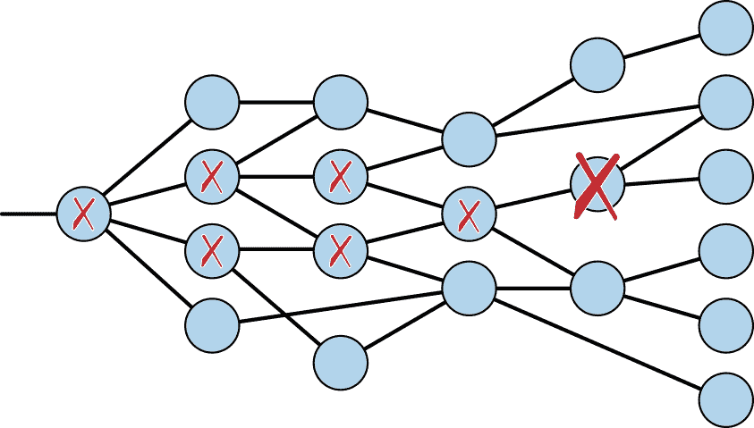
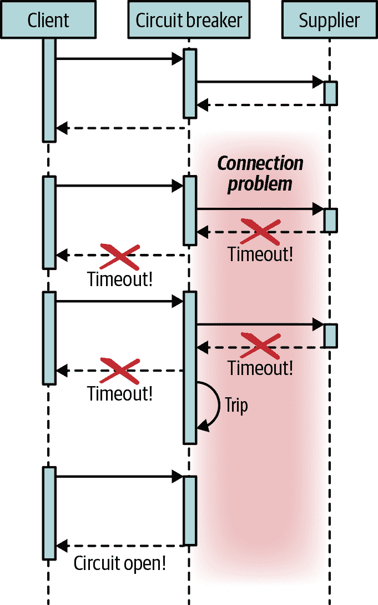
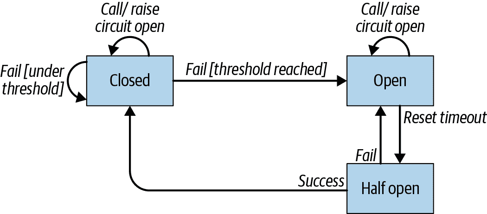

# 第八章：容错

在本章中，您将了解为什么需要在微服务架构中接受失败，因为这种情况经常发生。其中一个原因是微服务架构在很大程度上依赖于网络进行功能运作，而网络作为一个关键部分并不总是可用（网络故障、线路饱和、拓扑结构变化、下游服务更新等）。

因此，构建能够容忍任何问题并提供优雅解决方案而不是简单传播错误的服务变得非常重要。

本章将包括以下任务的解决方案：

+   实施不同的弹性策略

+   提供一些在出现错误时的回退逻辑

+   正确配置容错参数

# 8.1 实现自动重试

## 问题

如果出现错误，您希望执行自动重试以尝试从故障中恢复。

## 解决方案

MicroProfile Fault Tolerance 规范提供了一种在任何 CDI 元素上实现自动重试的方式，包括 CDI bean 和 MicroProfile REST Client。

可以实现几种策略来防止故障，并在最坏情况下提供一些默认逻辑而不是失败。假设您有一个根据读者喜好建议书籍的服务。如果此服务宕机，您可以缓存一份畅销书列表，以至少能够提供该列表而不是失败。因此，定义作为容错策略的重要部分之一的回退逻辑非常重要，以在没有可能的恢复情况下执行。

MicroProfile Fault Tolerance 专注于几种策略，使您的代码具备容错能力。让我们看看第一种策略，即执行自动重试，这是非常简单的一种方式。

您需要添加扩展来使用 MicroProfile Fault Tolerance 规范：

```java
./mvnw quarkus:add-extension -Dextensions="quarkus-smallrye-fault-tolerance"
```

从网络故障中恢复的最简单且有时最有效的方法之一是对同一操作进行重试。如果是偶发性错误，那么可以通过几次重试来修复错误。

使用 `@org.eclipse.microprofile.faulttolerance.Retry` 注释的类或方法如果抛出异常，则执行自动重试。您可以设置不同的参数，如最大重试次数、最大持续时间或抖动；或者您可以指定应为其执行重试的异常类型。

此外，您可以通过在方法上注释 `@org.eclipse.microprofile.faulttolerance.Fallback` 来实现回退逻辑。作为回退执行的逻辑可以作为实现 `org.eclipse.microprofile.faulttolerance.FallbackHandler` 接口的类来实现：

```java
    @Retry(maxRetries = 3, 
            delay = 1000) 
    @Fallback(RecoverHelloMessageFallback.class) 
    public String getHelloWithFallback() {
        failureSimulator.failAlways();
        return "hello";
    }

    public static class RecoverHelloMessageFallback
        implements FallbackHandler<String> { 

        @Override
        public String handle(ExecutionContext executionContext) {
            return "good bye";
        }

    }
```


将最大重试次数设置为 3


重试之间有 1 秒的延迟


如果经过 3 次重试问题仍然存在，则添加回退逻辑


`FallbackHandler` 模板必须与恢复方法的返回类型相同

## 讨论

您可以通过配置文件覆盖这些属性中的任何一个。配置键遵循以下格式：`*fully_qualified_class_name*/*method_name*/*fault_tolerant_annotation*/*parameter*`。

例如，您可以针对方法或类设置特定的参数，或者全局设置：

```java
org.acme.quickstart.ServiceInvoker/getHelloWithFallback/Retry/maxDuration=30 
org.acme.quickstart.ServiceInvoker/Retry/maxDuration=3000 
Retry/maxDuration=3000 
```


方法级别的覆盖


类级别的覆盖


全局覆盖

## 参见

要获取更多信息，请访问 Eclipse MicroProfile 网站上的以下页面：

+   [容错](https://oreil.ly/WzhhA)

+   [容错：重试策略](https://oreil.ly/Kjhzj)

# 8.2 实现超时

## 问题

您希望防止执行永久等待。

## 解决方案

MicroProfile Fault Tolerance 规范提供了一种实现操作超时并防止执行无限等待的方式。

当调用外部服务时，建议确保此操作有关联的超时时间。这样，如果存在网络延迟或故障，流程不会长时间等待并最终失败，而是会快速失败，让您能够更早地解决问题。

使用 `@org.eclipse.microprofile.faulttolerance.Timeout` 注解的类或方法定义了超时。如果超时，则会抛出 `org.eclipse.microprofile.faulttolerance.exceptions.TimeoutException` 异常：

```java
    @Timeout(value = 2000) 
    public String getHelloWithTimeout() {
        failureSimulator.longMethod();
        return "hello";
    }
```


将超时设置为 2 秒

您可以通过配置文件覆盖这些属性中的任何一个，如下所示：

```java
org.acme.quickstart.ServiceInvoker/getHelloWithTimeout/Timeout/value=3000 
org.acme.quickstart.ServiceInvoker/Timeout/value=3000 
Timeout/value=3000 
```


方法级别的覆盖


类级别的覆盖


全局覆盖

您可以将 `@Timeout` 注解与 `@Fallback` 结合使用，在超时时实现一些恢复逻辑，或者使用 `@Retry` 在超时异常发生时执行自动重试（`@Retry(retryOn=TimeoutException.class)`）。

## 参见

要了解有关 MicroProfile Fault Tolerance 中超时模式的更多信息，请访问 GitHub 上的以下页面：

+   [超时](https://oreil.ly/af9DD)

# 8.3 使用舱壁模式避免过载

## 问题

您希望限制对服务的接受请求数量。

## 解决方案

MicroProfile Fault Tolerance 规范提供了 *舱壁* 模式的实现。

舱壁模式限制可以同时执行的操作，保持新请求等待，直到当前执行的请求完成。如果等待的请求在一定时间后无法执行，则被丢弃并抛出异常。

使用`@org.eclipse.microprofile.faulttolerance.Bulkhead`注解的类或方法会应用舱壁限制。如果存在同步调用（你将在 第十五章 中了解舱壁限制如何与异步调用配合工作），当达到并发执行限制时，将抛出`org.eclipse.microprofile.faulttolerance.exceptions.BulkheadException`异常，而不是排队请求：

```java
    @Bulkhead(2) 
    public String getHelloBulkhead() {
        failureSimulator.shortMethod();
        return "hello";
    }
```


将并发执行限制设置为两个

如果你使用`siege`工具模拟 4 个并发请求，输出将如下所示：

```java
siege -r 1 -c 4 -v http://localhost:8080/hello/bulkhead 
** SIEGE 4.0.4 ** Preparing 4 concurrent users for battle. The server is now under siege... HTTP/1.1 500     0.47 secs:    2954 bytes ==> GET  /hello/bulkhead HTTP/1.1 500     0.47 secs:    2954 bytes ==> GET  /hello/bulkhead HTTP/1.1 200     2.46 secs:       5 bytes ==> GET  /hello/bulkhead HTTP/1.1 200     2.46 secs:       5 bytes ==> GET  /hello/bulkhead 
Transactions:		       2 hits Availability:		       50.00 % 
```


只处理 2 个请求

此外，你可以通过配置文件覆盖任何这些属性：

```java
org.acme.quickstart.ServiceInvoker/getHelloBulkhead/Bulkhead/value=10 
org.acme.quickstart.ServiceInvoker/Bulkhead/value=10 
Bulkhead/value=10 
```


方法级别的覆盖


类级别的覆盖


全局覆盖

## 讨论

当你处理（微）服务架构时，当另一个服务超载超过其一次能够消耗的调用时，问题可能会发生。如果超载继续，该服务可能会不堪重负并且无法在可接受的时间内处理请求。

你可以将`@Bulkhead`注解与之前演示的任何其他容错注解混合使用，以实现更具弹性的策略——例如，*舱壁* + *带延迟重试*。

## 另请参阅

要了解 MicroProfile Fault Tolerance 中的舱壁模式更多信息，请参阅 GitHub 上的以下页面：

+   [舱壁](https://oreil.ly/anYN5)

# 8.4 使用断路器模式避免不必要的调用

## 问题

你希望防止服务故障传播到其他服务，并消耗大量资源。

## 解决方案

MicroProfile Fault Tolerance 规范提供了 *断路器* 模式，以避免在出现错误时进行不必要的调用。

我们定义一个断路器，它在 4 个请求窗口中发生 3 次错误后被触发：

```java
    @CircuitBreaker(requestVolumeThreshold = 4, 
                    failureRatio = 0.75,  
                    delay = 2000) 
    public String getHelloCircuitBreaker() {
        failureSimulator.fail4Consecutive();
        return "hello";
    }
```


定义滚动窗口


触发断路的阈值（4 × 0.75 = 3）


断路器打开的时间量

你可以通过配置文件覆盖任何这些属性：

```java
org.acme.quickstart.ServiceInvoker/getHelloCircuitBreaker \
    /CircuitBreaker/failureRatio=0.75 
org.acme.quickstart.ServiceInvoker/CircuitBreaker/failureRatio=3000 
Timeout/value=3000 
```


方法级别的覆盖；这应该在同一行上


类级别的覆盖


全局覆盖

## 讨论

在处理（微）服务架构时，当与另一个服务的通信变得不可能时，可能会出现问题，无论是因为服务已宕掉还是因为延迟过高。 这种情况发生时，调用者在等待另一个服务响应时可能会消耗昂贵的资源，如线程或文件描述符。 如果这种情况持续下去，可能会导致资源耗尽，这意味着该服务无法处理更多请求，从而触发应用程序中其他服务的错误级联。

图 8-1 展示了一个服务中发生的失败如何通过其所有调用者进行传播。 这是级联故障的一个示例。



###### 图 8-1. 级联故障

断路器模式通过检测检测窗口内的连续故障数来修复级联故障。 如果超过定义的错误阈值，则会触发断路器，这意味着在一定时间内，所有尝试调用此方法的尝试都将立即失败，而不尝试执行它。 图 8-2 展示了断路器调用模式的图表。



###### 图 8-2. 断路器调用

一段时间后，断路器将变成半开状态，这意味着下一次调用不会立即失败，而是会再次尝试连接真实系统。 如果调用成功，则断路器将关闭；否则，它将保持打开状态。 断路器模式的所有可能状态如图 8-3 所示。



###### 图 8-3. 断路器生命周期

使用`@org.eclipse.microprofile.faulttolerance.CircuitBreaker`注释的类或方法为特定操作定义断路器。 如果断路器已打开，则会抛出`org.eclipse.microprofile.faulttolerance.exceptions.CircuitBreakerOpenException`异常。

您还可以将`@CircuitBreaker`与`@Timeout`、`@Fallback`、`@Bulkhead`或`@Retry`混合使用，但必须考虑以下内容：

+   如果使用`@Fallback`，则如果抛出`CircuitBreakerOpenException`，将执行备用逻辑。

+   如果使用`@Retry`，则每次重试都由断路器处理，并记录为成功或失败。

+   如果使用`@Bulkhead`，则在尝试进入舱壁之前会检查断路器。

## 参见

要了解有关 MicroProfile Fault Tolerance 中断路器模式的更多信息，请参阅 GitHub 上的以下页面：

+   [断路器](https://oreil.ly/iOWuR)

# 8.5 禁用容错

## 问题

您希望在某些环境中禁用容错。

## 解决方案

微配置 Fault Tolerance 规范提供了一个特殊参数，可以全局或单独地启用或禁用容错逻辑。

有些情况下，您可能希望禁用容错逻辑。MicroProfile 容错规范定义了一个特殊参数`enabled`，可以用来从配置文件中全局或个别地启用或禁用逻辑：

```java
org.acme.quickstart.ServiceInvoker/getHelloCircuitBreaker/\
    CircuitBreaker/enabled=false 
org.acme.quickstart.ServiceInvoker/CircuitBreaker/enabled=false 
CircuitBreaker/enabled=false 
MP_Fault_Tolerance_NonFallback_Enabled=false 
```


在方法级别禁用；这应该在同一行


在类级别禁用


按类型全局禁用


禁用所有容错功能
