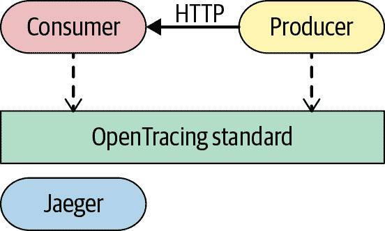
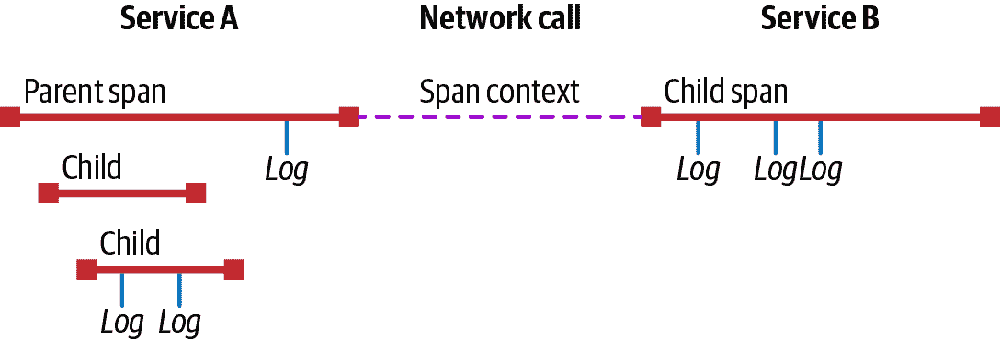
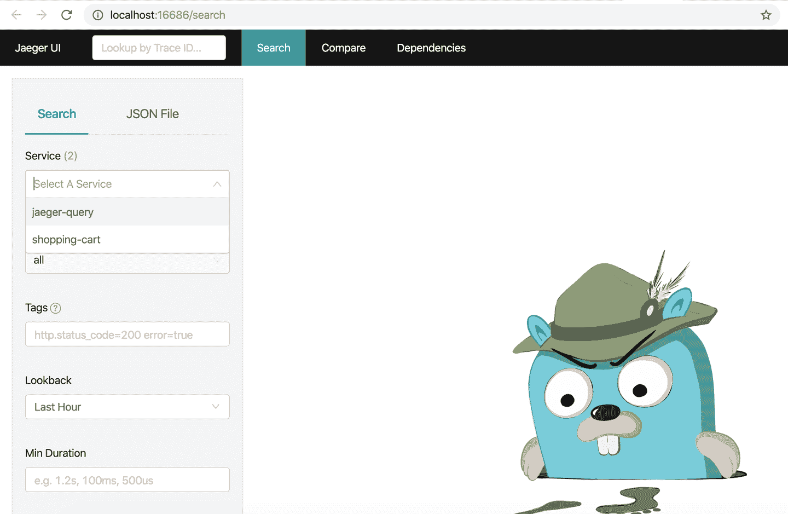
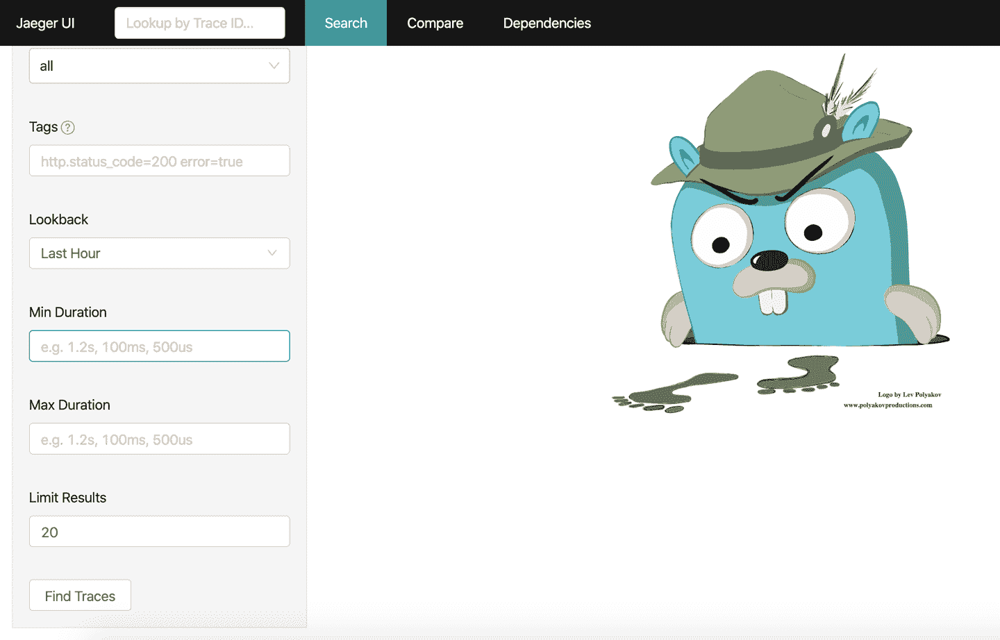
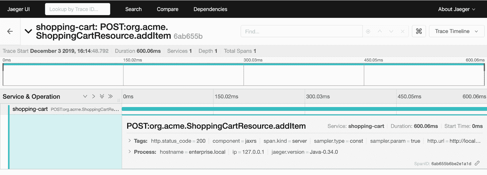
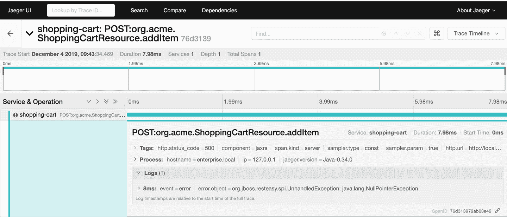
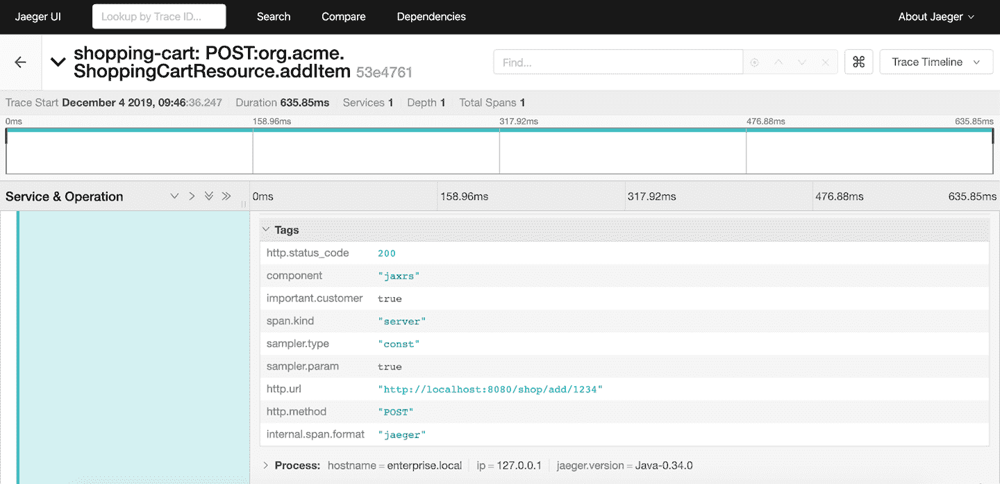
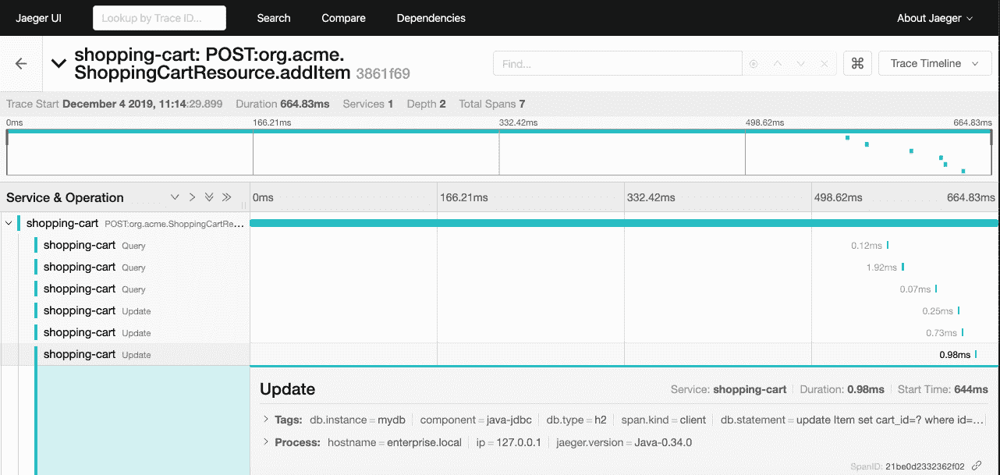

# 第九章 可观察性

在本章中，您将了解可观察性及其在微服务架构中的重要性。可观察性通过观察一些参数（如错误代码、性能或任何类型的业务指标）来回答系统行为的问题。Quarkus 与用于可观察性的多种技术进行了原生集成。

本章将包含如何完成以下任务的示例：

+   定义健康检查

+   向监控系统提供指标

+   配置分布式跟踪以了解网格内的请求概况

# 9.1 使用自动健康检查

## 问题

您想要检查服务是否正在运行并且能够正确处理请求。

## 解决方案

MicroProfile 健康规范提供了一个 API，用于从另一台机器（例如 Kubernetes 控制器）探查服务的状态。

要在 Quarkus 应用程序中启用 MicroProfile Health，您只需要注册 `quarkus-smallrye-health` 扩展：

```java
./mvnw quarkus:add-extension -Dextensions="quarkus-smallrye-health"
```

有了类路径中的扩展，Quarkus 将自动注册默认的活跃性和可用性探针，当服务正在运行时，两者都返回 `UP`：

```java
./mvnw compile quarkus:dev 
curl localhost:8080/health/live 

{
 "status": "UP", 
 "checks":  ![3
 ] } 

curl localhost:8080/health/ready 

{
 "status": "UP", "checks": [ ] }
```


活跃性 URL


状态为 `UP`


没有检查（只有默认值）


可用性 URL

## 讨论

MicroProfile 健康规范提供了两种健康检查：

活跃性

如果服务已启动，则返回 200 OK 结果为 UP，如果服务不可用，则返回 503 Service Unavailable 和 DOWN 结果，如果无法计算健康检查，则返回 500 Server Error。活跃性探针端点默认注册在 */health/live* 端点。

可用性

如果服务准备好处理请求，则返回 200 OK 结果为 UP。这与活跃性探针不同，因为活跃性只意味着服务正在运行，但可能尚未能够处理任何请求（例如，因为正在执行数据库迁移）。如果服务尚不能接受任何请求，则返回 503 Service Unavailable 和 DOWN 结果，如果无法计算健康检查，则返回 500 Server Error。准备探针端点默认注册在 */health/ready* 端点。

如果您正在配置 Quarkus 使用 SQL 数据库（JDBC），它将自动注册一个可用性健康检查（在 `checks` 部分），以验证与数据库的连接是否可行。

以下扩展提供了自动的可用性/活跃性探针：

数据源

用于检查数据库连接状态的准备探针。

Kafka

用于检查 Kafka 连接状态的准备探针。默认情况下禁用，需要通过将 `quarkus.kafka.health.enabled` 属性设置为 `true` 来启用。

MongoDB

用于检查 MongoDB 连接状态的准备探针。

Neo4j

用于检查 Neo4j 连接状态的准备探针。

Artemis

一个就绪探针检查 Artemis JMS 连接状态。

Kafka Streams

存活性（用于流状态）和就绪性（创建的主题）探针。

Vault

一个就绪探针检查 Vault 状态。

可以通过将`quarkus.*component*.health.enabled`设置为`false`来禁用探针的自动生成：

```java
quarkus.kafka-streams.health.enabled=false
quarkus.mongodb.health.enabled=false
quarkus.neo4j.health.enabled=false
```

## 参见

要了解有关 MicroProfile Health 规范的更多信息，请参阅 GitHub 上的以下页面：

+   [MicroProfile Health](https://oreil.ly/wZjHC)

# 9.2 创建自定义健康检查

## 问题

您希望自定义如何检查服务是否正在运行并且能够正确处理请求。

## 解决方案

MicroProfile Health 规范使您能够创建自定义的存活性和就绪性健康检查。在某些情况下，可能需要针对存活性或就绪性探针的自定义健康检查逻辑。

MicroProfile Health 规范允许您通过创建一个使用`@org.eclipse.microprofile.health.Liveness`和`@org.eclipse.microprofile.health.Readiness`注解的方法，并返回`org.eclipse.microprofile.health.HealthCheck`接口的实现来创建自定义健康检查。

创建一个新的类在`org.acme.quickstart.LivenessCheck.java`来实现一个自定义的存活性探针：

```java
@ApplicationScoped 
@Liveness 
public class LivenessCheck implements HealthCheck { 

    @Override
    public HealthCheckResponse call() {
        HealthCheckResponseBuilder checkResponseBuilder = HealthCheckResponse
        .named("custom liveness"); 

        if(isUpAndRunning()) {
            return checkResponseBuilder.up().build(); 
        } else {
            return checkResponseBuilder.down()
                .withData("reason", "Failed connection")
                .build(); 
        }

    }
}
```


需要是一个 CDI 类


将健康检查设置为存活性


实现`HealthCheck`作为一个要求


设置健康检查名称


将结果设置为上线


将结果设置为下线

让我们检查这个存活性探针是否按预期工作：

```java
./mvnw compile quarkus:dev

curl localhost:8080/health/live

{
 "status": "UP",
 "checks": [
 {
 "name": "custom liveness",
 "status": "UP"
 }
 ]
}
```

## 讨论

因为健康检查是作为 CDI bean 注册的，您还可以在工厂对象中生成健康检查，如 Recipe 5.7 中所解释的。

创建一个新的工厂类来包含新的健康检查 - 在这种情况下，是一个就绪性检查：

```java
@ApplicationScoped 
public class CustomHealthCheck {

    @Produces 
    @Readiness 
    public HealthCheck ready() {
        if (isReady()) {
            return io.smallrye.health.HealthStatus.up("Custom readiness"); 
        } else {
            return io.smallrye.health.HealthStatus.down("Custom readiness");
        }
    }
}
```


需要是一个 CDI 类


该方法生成一个健康检查


就绪探针


`HealthStatus` 是一个为您实现`HealthCheck`接口的实用类

让我们检查这个就绪探针是否按预期工作：

```java
./mvnw compile quarkus:dev

curl localhost:8080/health/ready

{
 "checks": [
 {
 "name": "Custom readiness",
 "status": "UP"
 }
 ],
 "status": "UP"
}
```

## 参见

MicroProfile Health 规范非常适合定义 Kubernetes 存活性和就绪探针。你可以在以下网站了解更多信息：

+   [Kubernetes：配置存活性、就绪和启动探针](https://oreil.ly/nTaaa)

# 9.3 暴露指标

## 问题

您希望通过公开服务指标来主动检查生产环境中服务的当前状态，以便尽快检测到任何错误行为。

## 解决方案

MicroProfile Metrics 规范提供了一种从应用程序构建和公开指标到监控工具（例如 Prometheus）的方式。

要在 Quarkus 应用程序中启用 MicroProfile Metrics，您只需注册`quarkus-smallrye-metrics`扩展：

```java
./mvnw quarkus:add-extension -Dextensions="quarkus-smallrye-metrics"
```

在类路径中添加扩展后，Quarkus 默认提供监控参数，并以 Prometheus 格式在`/metrics`端点公开它们：

```java
./mvnw compile quarkus:dev

curl localhost:8080/metrics

base_cpu_processCpuLoad_percent 0.0
base_memory_maxHeap_bytes 4.294967296E9
base_cpu_systemLoadAverage 2.580078125
base_thread_daemon_count 6.0
...
vendor_memoryPool_usage_max_bytes{name="Compressed Class Space"} 3336768.0
vendor_memory_usedNonHeap_bytes 3.9182104E7
```

通过在 HTTP `Accept`头中添加`application/json`类型，可以将输出格式更改为 JSON：

```java
curl --header "Accept:application/json" localhost:8080/metrics

{
 "base": {
 "cpu.systemLoadAverage": 4.06201171875,
 "thread.count": 20,
 "classloader.loadedClasses.count": 4914,
 ...
 },
 "vendor": {
 "memoryPool.usage.max;name=G1 Survivor Space": 7340032,
 "memory.freePhysicalSize": 814391296,
 "memoryPool.usage.max;name=CodeHeap 'non-profiled nmethods'": 5773056,
 ...
 }
}
```

## 讨论

在微服务架构中了解服务的行为方式对于预测可能影响所有应用程序的任何问题至关重要。

对于单体应用程序，监控服务行为相对较容易，因为您只需监控三到四个元素；但是现在随着（微）服务架构的出现，您可能需要监控数百个元素。

有许多可能要监控的值，例如以下内容：

+   内存

+   磁盘空间

+   网络

+   JVM 资源

+   关键方法的性能

+   业务指标（例如每秒付款的次数）

+   集群整体健康状况

如果您仔细查看输出，您将看到参数分别以`base`或`vendor`作为前缀。MicroProfile Metrics 将指标分类为三类：

base

服务器的核心信息。这些指标始终是必需的，因为它们在规范中指定。在*/metrics/base*路径下访问它们。

供应商

供应商特定的信息。每种实现可能提供不同的信息。在*/metrics/vendor*路径下访问它们。

应用程序

使用 MicroProfile Metrics 扩展机制为该服务定制了专门的信息。在*/metrics/application*路径下访问它们。

您可以通过将`quarkus.smallrye-metrics.path`属性设置为要公开指标的路径来配置指标的公开位置。默认情况下，此属性设置为`/metrics`。

## 参见

要了解更多有关 MicroProfile Metrics 的信息，请访问 GitHub 上的以下页面：

+   [Eclipse MicroProfile 的 Metrics](https://oreil.ly/Q875g)

# 9.4 创建指标

## 问题

您希望监控一些自定义指标，如性能指标或业务指标。

## 解决方案

MicroProfile Metrics 规范提供了不同的注解来注册不同类型的监控参数，如计数器、持续时间和仪表。通过这些注解，您可以创建可能与业务或性能参数相关的自定义指标，而不是像内存和 CPU 这样的物理值。

以下是 MicroProfile Metrics 的注解：

| 注解 | 描述 |
| --- | --- |

|

`org.eclipse.microprofile.metrics.annotation.Counted`

| 计数调用次数。 |
| --- |

|

`org.eclipse.microprofile.metrics.annotation.Timed`

| 跟踪调用持续时间。 |
| --- |

|

`org.eclipse.microprofile.metrics.annotation.SimplyTimed`

| 跟踪调用持续时间，不进行平均值和分布计算。`Timed`的简化版本。 |
| --- |

|

`org.eclipse.microprofile.metrics.annotation.Metered`

| 跟踪调用频率。 |
| --- |

|

`org.eclipse.microprofile.metrics.annotation.Gauge`

| 对一个带注解的字段或方法进行离散值采样。 |
| --- |

|

`org.eclipse.microprofile.metrics.annotation.ConcurrentGauge`

| 计算并行调用次数的计量器。 |
| --- |

|

`org.eclipse.microprofile.metrics.annotation.Metric`

|

用于注入指标。有效类型包括 `Meter`、`Timer`、`Counter` 和 `Histogram`。`Gauge` 结合 `Metric` 只能在 CDI 生产者中使用。

|

让我们看看如何使用指标注解以及如何创建直方图指标。

## 计数器

一个 *counter* 在用 `@Counted` 注解的方法上增加调用次数，并且可以在方法或类级别使用。

在以下示例中，方法调用次数被计数：

```java
@Counted( 
        name = "number-of-transactions", 
        displayName = "Transactions", 
        description = "How many transactions have been processed" 
)
@POST
@Consumes(MediaType.APPLICATION_JSON)
public Response doTransaction(Transaction transaction) {
    return Response.ok().build();
}
```


注册计数器


计数器的名称


设置显示名称


计数器的描述

让我们来看看计数器监视器：

```java
./mvnw compile quarkus:dev

curl -d '{"from":"A", "to":"B", "amount":2000}' \
 -H "Content-Type: application/json" \
 -X POST http://localhost:8080/tx

curl localhost:8080/metrics/application

application_org_acme_TransactionResource_number_of_transactions_total 1.0
```

## 计量器

一个 *gauge* 是一个简单的值，你希望公开以供测量，类似于汽车上的油表。要注册它，需要在字段或方法上注释 `@Gauge`，并且该值/返回值将自动公开：

```java
private long highestTransaction = 0; 

@POST
@Consumes(MediaType.APPLICATION_JSON)
public Response doTransaction(Transaction transaction) {
    if (transaction.amount > highestTransaction) { 
        highestTransaction = transaction.amount;
    }
    return Response.ok().build();
}
@Gauge( 
        name = "highest-gross-transaction", 
        description = "Highest transaction so far.",
        unit= MetricUnits.NONE 
)
public long highestTransaction() {
    return highestTransaction;
}
```


用于存储最高交易的字段


如果当前交易更高，则更新字段


将返回值设置为计量器


计量器的名称


该计量器的指标（例如，秒、百分比、每秒、字节等）

执行以下命令来运行应用程序，生成一些指标数据，并查看输出：

```java
./mvnw compile quarkus:dev

curl -d '{"from":"A", "to":"B", "amount":2000}' \
 -H "Content-Type: application/json" \
 -X POST http://localhost:8080/tx

curl localhost:8080/metrics/application

application_org_acme_TransactionResource_highest_gross_transaction 2000.0
```

## 计量的

一个 *metered* 指标测量方法调用的速率。`@Metered` 注解可以在方法或类级别使用：

```java
@Metered( 
        name = "transactions",
        unit = MetricUnits.SECONDS, 
        description = "Rate of transactions"
)
```


注册计量指标


设置单位为秒

执行以下命令来运行应用程序，生成一些指标数据，并查看输出：

```java
./mvnw compile quarkus:dev

curl -d '{"from":"A", "to":"B", "amount":2000}' \
 -H "Content-Type: application/json" \
 -X POST http://localhost:8080/tx

curl localhost:8080/metrics/application

application_org_acme_TransactionResource_transactions \
 _rate_per_second  0.09766473618811813
application_org_acme_TransactionResource_transactions \
 _one_min_rate_per_second  0.015991117074135343
application_org_acme_TransactionResource_transactions \
 _five_min_rate_per_second  0.0033057092356765017
application_org_acme_TransactionResource_transactions \
 _fifteen_min_rate_per_second  0.0011080303990206543
```

## 计时器

一个 *timed* 指标测量调用的持续时间。`@Timed` 注解可以在方法或类级别使用：

```java
@Timed( 
    name = "average-transaction",
    unit = MetricUnits.SECONDS,
    description = "Average duration of transaction"
)
```


注册计时指标

执行以下命令来运行应用程序，生成一些指标数据，并查看输出：

```java
./mvnw compile quarkus:dev

curl -d '{"from":"A", "to":"B", "amount":2000}' \
 -H "Content-Type: application/json" \
 -X POST http://localhost:8080/tx

curl localhost:8080/metrics/application

application_org_acme_TransactionResource_average_transaction \
 _rate_per_second 0.7080455375154214
application_org_acme_TransactionResource_average_transaction \
 _one_min_rate_per_second 0.0
application_org_acme_TransactionResource_average_transaction \
 _five_min_rate_per_second 0.0
application_org_acme_TransactionResource_average_transaction \
 _fifteen_min_rate_per_second 0.0
application_org_acme_TransactionResource_average_transaction \
 _min_seconds 1.0693E-5
application_org_acme_TransactionResource_average_transaction \
 _max_seconds 4.9597E-5
application_org_acme_TransactionResource_average_transaction \
 _mean_seconds 3.0145E-5
application_org_acme_TransactionResource_average_transaction \
 _stddev_seconds 1.9452E-5
application_org_acme_TransactionResource_average_transaction \
 _seconds_count 2.0
application_org_acme_TransactionResource_average_transaction \
 _seconds{quantile="0.5"} 4.9597E-5
application_org_acme_TransactionResource_average_transaction \
 _seconds{quantile="0.75"} 4.9597E-5
application_org_acme_TransactionResource_average_transaction \
 _seconds{quantile="0.95"} 4.9597E-5
application_org_acme_TransactionResource_average_transaction \
 _seconds{quantile="0.98"} 4.9597E-5
application_org_acme_TransactionResource_average_transaction \
 _seconds{quantile="0.99"} 4.9597E-5
application_org_acme_TransactionResource_average_transaction \
 _seconds{quantile="0.999"} 4.9597E-5
```

## 直方图

一个 *histogram* 测量值随时间的分布；它测量最小值、最大值、标准偏差或像中位数或 95 分位数这样的分位数。直方图没有适当的注解，但 `org.eclipse.microprofile.metrics.Histogram` 类用于更新指标：

```java
@Metric(name = "transaction-evolution") 
Histogram transactionHistogram;

@POST
@Consumes(MediaType.APPLICATION_JSON)
public Response doTransaction(Transaction transaction) {
    transactionHistogram.update(transaction.amount); 
    return Response.ok().build();
}
```


注入带给定名称的直方图


使用新值更新直方图

执行以下命令来运行应用程序，存储一些指标数据，并查看输出：

```java
./mvnw compile quarkus:dev

curl -d '{"from":"A", "to":"B", "amount":2000}' \
 -H "Content-Type: application/json" \
 -X POST http://localhost:8080/tx

curl localhost:8080/metrics/application

application_org_acme_TransactionResource_transaction_evolution_min 2000.0
application_org_acme_TransactionResource_transaction_evolution_max 2000.0
application_org_acme_TransactionResource_transaction_evolution_mean 2000.0
application_org_acme_TransactionResource_transaction_evolution_stddev 0.0
application_org_acme_TransactionResource_transaction_evolution_count 2.0
application_org_acme_TransactionResource_transaction_evolution \
 {quantile="0.5"}  2000.0
application_org_acme_TransactionResource_transaction_evolution \
 {quantile="0.75"}  2000.0
application_org_acme_TransactionResource_transaction_evolution \
 {quantile="0.95"}  2000.0
application_org_acme_TransactionResource_transaction_evolution \
 {quantile="0.98"}  2000.0
application_org_acme_TransactionResource_transaction_evolution \
 {quantile="0.99"}  2000.0
application_org_acme_TransactionResource_transaction_evolution \
 {quantile="0.999"}  2000.0
```

## 讨论

您可以通过使用`OPTION`HTTP 方法查询到特定端点中的元数据信息。元数据在`/metrics/*scope*/*metric_name*`中公开，其中*`scope`*是`base`，`vendor`或`application`，*`metric_name`*是指度量标准的名称（在应用程序中，设置在`name`属性中的名称）。

# 9.5 使用分布式跟踪

## 问题

您希望对整个应用程序进行性能分析和监控。

## 解决方案

MicroProfile OpenTracing 规范使用[OpenTracing 标准 API](https://opentracing.io)来为分布式跟踪的微服务进行工具化。Quarkus 集成了 MicroProfile OpenTracing 规范作为分布式跟踪的解决方案。

分布式跟踪是一种用于分析和监控分布式系统的方法。它可以用于检测服务之间通讯的故障，确定哪些点是性能问题，或者记录网络网格内发生的所有请求和响应的日志记录。

在进行分布式跟踪之前，您必须了解 OpenTracing 中的五个重要概念：

跨度

代表已完成的工作单位（例如，执行的服务）的命名操作。一个 span 可能包含更多以子父形式的 span。

Span 上下文

从服务传播到服务的跟踪信息（例如，span ID）。

行李物品

从服务传播到服务的自定义键/值对。

标签

用户定义的键/值对被设置在 span 中，以便可以查询和过滤（例如，`http.status_code`）。

日志

与包含日志消息或其他重要信息的跨度相关联的键/值对。日志用于标识跨度中的特定时刻；与此同时，标签独立于时间应用于整个 span。

本示例中，使用[Jaeger](https://www.jaegertracing.io)服务器来收集应用程序的所有跟踪，并使其可供消费或查询。图 9-1 显示了服务和 Jaeger 之间的交互。



###### 图 9-1\. 微服务和 Jaeger

在前一段中解释的 Jaeger 概念在图 9-2 中有所说明。



###### 图 9-2\. Jaeger 概念

使用`jaegertracing/all-in-one`容器映像，因为它包含所有 Jaeger 后端组件和 UI 的单个映像。这并不是用于生产，但为了简单起见，这是配方 9.5 中使用的图像：

```java
docker run -e COLLECTOR_ZIPKIN_HTTP_PORT=9411 -p 5775:5775/udp \
 -p 6831:6831/udp -p 6832:6832/udp -p 5778:5778 -p 16686:16686 \
 -p 14268:14268 -p 9411:9411 jaegertracing/all-in-one:1.15.1
```

要在 Quarkus 应用中启用 MicroProfile OpenTracing，您只需要注册`quarkus-smallrye-opentracing`扩展。

```java
./mvnw quarkus:add-extension -Dextensions="quarkus-smallrye-opentracing"
```

在类路径中添加扩展后，Quarkus/MicroProfile OpenTracing 将默认的跟踪信息发送到 Jaeger 服务器。你只需配置 Jaeger 端点，即可发送所有跟踪信息。

默认收集的跟踪信息包括以下内容：

+   硬件指标如 CPU、内存和可用处理器。

+   JVM 指标如内存堆和线程池。

MicroProfile OpenTracing 为每个传入请求创建一个新的 span。这个新 span 的默认名称是 `*HTTP method*:*package name*.*class name*.*method name*`。

为传入请求创建的 spans 将包含以下标签及其正确的值：

+   `Tags.SPAN_KIND` = `Tags.SPAN_KIND_SERVER`

+   `Tags.HTTP_METHOD` 表示传入请求中使用的 HTTP 方法

+   `Tags.HTTP_URL` 表示传入端点的 URL

+   `Tags.HTTP_STATUS` 表示 HTTP 状态结果代码

+   `Tags.COMPONENT` = `"jaxrs"`

+   如果发生服务器错误（5XX 错误代码），将 `Tags.ERROR` 设置为 `true`；如果异常有提供对象，则添加两个日志，一个带有 `event=error`，另一个带有 `error.object=<error object instance>`

对于出站请求，如果存在当前活动 span，则创建一个新的子 span。新 span 的默认名称是 `<HTTP method>`。为传出请求创建的 spans 将包含以下标签及其正确的值：

+   `Tags.SPAN_KIND`=`Tags.SPAN_KIND_SCLIENT`

+   `Tags.HTTP_METHOD` 表示传出请求中使用的 HTTP 方法

+   `Tags.HTTP_URL` 表示传出端点的 URL

+   `Tags.HTTP_STATUS` 表示 *HTTP* 状态结果代码

+   `Tags.COMPONENT` = `"jaxrs"`

+   如果发生客户端错误（4XX 错误代码），将 `Tags.ERROR` 设置为 `true`；如果异常有提供对象，则添加两个日志，一个带有 `event=error`，另一个带有 `error.object=<error object instance>`

最后要做的事情是配置 Jaeger 参数：

```java
quarkus.jaeger.service-name=shopping-cart 
quarkus.jaeger.sampler-type=const 
quarkus.jaeger.sampler-param=1 
quarkus.jaeger.endpoint=http://localhost:14268/api/traces 
```


在 Jaeger 中识别的服务名称


设置一个采样器


需要采样的请求百分比（1 表示全部采样）


Jaeger 服务器位置

然后启动应用程序，并向服务中定义的一个端点发送一些请求。之后，访问 Jaeger UI 来检查所有的分布式跟踪信息。打开浏览器，访问 [*http://localhost:16686*](http://localhost:16686)（Jaeger UI）以查看跟踪信息。

在初始页面中，可以通过多个参数进行筛选，但其中一个用于选择将用于查看已完成请求的服务。

Jaeger 的首页显示在 图 9-3 中。



###### 图 9-3\. Jaeger 的首页

点击查找跟踪按钮以选择符合给定条件的所有跟踪，你将看到 图 9-4 中显示的图像。



###### 图 9-4\. 寻找迹象

您将看到符合条件的所有请求。在本例中，请求都是涉及 `shopping-cart` 服务的所有追踪，如 图 9-5 所示。


###### 图 9-5\. 查看追踪

如果单击任何请求，将显示特定请求的更多详细信息，如 图 9-6 所示。



###### 图 9-6\. 请求的详细信息

在发生错误时，会添加一个新的日志条目，其中设置了错误消息，如 图 9-7 所示。



###### 图 9-7\. 错误日志消息

# 禁用追踪

默认情况下，所有请求（传入或传出）都会被跟踪。通过使用 `@org.eclipse.microprofile.opentracing.Traced` 对其进行注释，可以禁用特定类或方法的跟踪：

```java
@Traced(false)
public class TransactionResource {}
```

## 讨论

通过在 *src/main/resources/application.properties* 文件中设置选项或使用 第 9.6 节 中讨论的任何其他方法配置 OpenTracing。一些最重要的配置属性列在 表 9-1 中。

表 9-1\. OpenTracing 配置属性

| 属性 | 描述 |
| --- | --- |

|

`quarkus.jaeger.enabled`

|

定义 Jaeger 扩展是否启用（默认为`true`）。这是一个构建属性，无法在运行时修改。

|

|

`quarkus.jaeger.endpoint`

|

追踪服务器端点。

|

|

`quarkus.jaeger.auth-token`

|

发送到端点的身份验证令牌。

|

|

`quarkus.jaeger.user`

|

发送作为身份验证的用户名到端点。

|

|

`quarkus.jaeger.password`

|

发送作为身份验证的一部分的密码。

|

|

`quarkus.jaeger.sampler-type`

|

采样器类型（`const`、`probabilistic`、`ratelimiting` 或 `remote`）。

|

|

`quarkus.jaeger.sampler-param`

|

流量采样的百分比（0.0-1.0）。

|

|

`quarkus.jaeger.service-name`

|

服务名称。

|

|

`quarkus.jaeger.tags`

|

一个逗号分隔的键/值标签列表，这些标签将添加到所有跨度中。支持使用 `${environmentVar:default}` 使用环境变量。

|

|

`quarkus.jaeger.propagation`

|

用于传播跟踪上下文的格式（默认为 `jaeger`）。可能的值为 `jaeger` 和 `b3`。

|

|

`quarkus.jaeger.sender-factory`

|

发送方工厂类名。

|

## 另请参阅

查看[Quarkus 使用 OpenTracing 的指南](https://oreil.ly/A2GJu)以获取支持的属性的完整列表。

关于 MicroProfile OpenTracing 规范的更多信息可以在 GitHub 上的以下页面找到：

+   [MicroProfile OpenTracing](https://oreil.ly/v7kjr)

# 9.6 自定义分布式跟踪

## 问题

您想要在当前跟踪跨度中添加自定义信息。

## 解决方案

MicroProfile OpenTracing 规范使用 `io.opentracing.Tracer` 类来在当前跨度中添加新信息。

在某些情况下，需要创建一个新的子 span 或者在当前 span 中添加信息，比如新标签、日志信息或者装备项。为了添加这些信息，MicroProfile OpenTracing 会生成一个`io.opentracing.Tracer`类的实例来操作当前 span。

假设你想要标记所有由重要客户发出的请求。例如，重要客户的 ID 以`1`开头：

```java
@Inject 
Tracer tracer;
@POST
@Path("/add/{customerId}")
@Transactional
@Consumes(MediaType.APPLICATION_JSON)
public Response addItem(@PathParam("customerId") String customerId, Item item) {

    if (customerId.startsWith("1")) {
        tracer.activeSpan().setTag("important.customer", true); 
    }
}
```


注入一个`Tracer`实例


在当前 span 中创建一个新标签

然后任何重要客户的请求都会相应地被标记。

自定义标签如图 Figure 9-8 所示。



###### 图 9-8\. 自定义标签

## 讨论

Quarkus 支持 OpenTracing 的一种自定义方式来为 JDBC 提供工具，因此如果您想要监控 SQL 查询，无需自己定制当前 span；您可以使用以依赖形式提供的集成。

将`opentracing-jdbc`工件注册到你的构建工具中：

```java
<dependency>
    <groupId>io.opentracing.contrib</groupId>
    <artifactId>opentracing-jdbc</artifactId>
</dependency>
```

然后激活 JDBC 连接的跟踪。通过在 JDBC URL 中添加`tracing`来完成。因为 Quarkus 使用 JPA，您还需要配置数据源和 Hibernate 以使用专用跟踪驱动程序：

```java
quarkus.datasource.url=jdbc:tracing:h2:mem:mydb 
quarkus.datasource.driver=io.opentracing.contrib.jdbc.TracingDriver 
quarkus.datasource.username=sa
quarkus.datasource.password=
quarkus.hibernate-orm.database.generation=update
quarkus.hibernate-orm.log.sql=true
quarkus.hibernate-orm.dialect=org.hibernate.dialect.H2Dialect 
```


使用`tracing`更新 JDBC URL


使用`TracingDriver`代替数据库驱动程序


配置真实数据库的方言

所有在请求中执行的查询也反映在 Jaeger UI 中。

JDBC 跟踪显示如图 Figure 9-9 所示。



###### 图 9-9\. JDBC 跟踪

如果仔细观察截图，您会注意到有一个名为`db.statement`的新标签，反映了已被跟踪的查询。还请注意，有一个*shopping-cart* span 同时包含了其他六个更多的 spans，每个查询对应一个。

要忽略特定查询，可以设置（多次）`ignoreForTracing`属性，并提供要忽略的查询（例如，`jdbc:tracing:h2:mem:test?ignoreForTracing=SELECT * FROM \"TEST\"`）。
