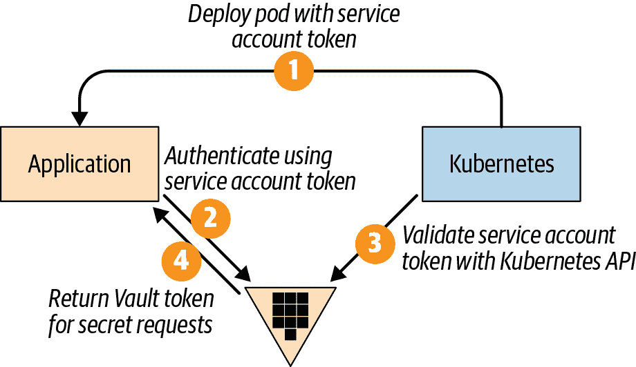

# 第十二章 应用程序秘密管理

每个应用程序都有需要保密的信息。这些信息可能包括数据库凭据、外部服务身份验证或某些资源的位置。所有这些信息统称为*秘密*。您的应用程序需要一个安全的地方来存储这些秘密，在应用程序启动期间和静态时都是如此。在本章中，我们将讨论使用 Kubernetes 和 Vault 进行秘密管理。

# 12.1 使用 Kubernetes 秘密存储数据

## 问题

您希望以比直接在 Pod 或容器上更安全的方式在 Kubernetes 中存储秘密。

## 解决方案

使用 Kubernetes 秘密对象以明文形式存储和检索敏感数据，例如密码、令牌或 SSH 密钥。Kubernetes 提供了可以用来存储敏感数据的 `secret` 对象的概念。

将敏感数据存储在秘密对象中并不自动使其安全，因为 Kubernetes 不加密数据，而是默认使用 Base64 编码。使用秘密对象可以获得一些标准配置流程不提供的功能：

+   您可以定义授权策略以访问秘密。

+   您可以配置 Kubernetes 以加密敏感数据（称为*静态加密*）。

+   您可以使用列表为特定容器实例授予权限。

###### 重要

这些功能都不会默认启用，它们需要一些关于 Kubernetes 的知识。在本书中，我们仅解释了 Quarkus 如何与 Kubernetes 等其他工具集成；我们不解释工具的操作方面。

秘密可以作为环境变量或卷注入到容器中。环境变量方法较不安全，因为任何能够访问容器实例的人都可以轻松地转储内容。另一方面，当存在大量密钥时，卷方法会变得复杂，因为 Kubernetes 会为存储值内的每个密钥创建一个文件。

两种方法都显示了，因此您可以选择适合您用例的方法。

本示例涵盖了需要将 API 令牌（例如 GitHub 个人访问令牌）设置为应用程序中的秘密的用例。

要在 `Pod` 中启用 `secrets` 注入的 Kubernetes 资源生成，需要注册 `quarkus-kubernetes` 扩展：

```java
./mvnw quarkus:add-extension -Dextensions="quarkus-kubernetes"
```

通过创建 `Secret` 类型的 Kubernetes 资源或使用 `kubectl` CLI 工具来创建秘密。打开新终端并运行以下命令，以注册具有 `greeting-security` ID 和键 `github.api.key.token` 的新秘密（此令牌无效，仅用于示例目的）：

```java
kubectl create secret generic greeting-security \
--from-literal=github.api.key.token=eyJhbGciOiJIUzI1NiIsInR5cCI6IkpXVCJ9.\
eyJzdWIiOiIxMjM0NTY3ODkwIiwibmFtZSI6IkpvaG4gRG9lIiwiaWF0IjoxNTE2MjM5MDIyfQ.\
SflKxwRJSMeKKF2QT4fwpMeJf36POk6yJV_adQssw5c
```

现在秘密已创建，让我们看看如何将其设置为环境变量。

需要从环境变量获取属性的配置属性。在本例中，属性称为`github.api.key.token`，但当然你也可以直接使用`System.getenv()`来访问它。前一种方法更好，因为它依赖于 MicroProfile Config 规范来读取配置属性，而不是一些自定义解决方案：

```java
@ConfigProperty(name = "github.api.key.token")
String githubToken;
```

在*application.properties*中为 Kubernetes 扩展设置额外属性，以便生成的 Kubernetes 部署文件包含注入秘密作为环境变量所需的部分：

```java
quarkus.container-image.group=quarkus 
quarkus.container-image.name=greeting-started-kubernetes-secrets
quarkus.container-image.tag=1.0-SNAPSHOT
quarkus.kubernetes.image-pull-policy=if-not-present
quarkus.kubernetes.env-vars.github-api-key-token.name=github.api.key.token 
quarkus.kubernetes.env-vars.github-api-key-token.secret=greeting-security 
```


配置 Docker 镜像


设置环境变量以覆盖`github.api.key.token`属性


设置要加载的秘密名称

Kubernetes 文件的生成将在容器定义中包含一个名为`secretKeyRef`的新条目，该条目定义了所有的键/值对。

MicroProfile 配置规范允许使用等效的环境变量（大写并更改点[`.`]为下划线[`_`]）覆盖任何配置属性。`Secrets`包含配置属性作为秘密。在*application.properties*中，Kubernetes 扩展被配置为生成一个设置这些秘密作为环境变量的部署描述符，这样当容器在 Kubernetes 集群内启动时，秘密会作为环境变量注入到容器中，并被 MicroProfile Config 读取为配置属性。

要部署该应用程序，请打开一个新的终端窗口，打包该应用程序，创建 Docker 容器，并应用生成的 Kubernetes 资源：

```java
./mvnw clean package -DskipTests

docker build -f src/main/docker/Dockerfile.jvm \
 -t quarkus/greeting-started-kubernetes-secrets:1.0-SNAPSHOT .
kubectl apply -f target/kubernetes/kubernetes.yml

kubectl patch svc greeting-started-kubernetes-secrets \
 --type='json' \
 -p '[{"op":"replace","path":"/spec/type","value":"NodePort"}]'
curl $(minikube service greeting-started-kubernetes-secrets --url)/hello
```

但是秘密也可以挂载为卷，而不是设置为环境变量。在*application.properties*中设置 Kubernetes 扩展属性，使生成的 Kubernetes 部署文件包含挂载秘密文件作为卷所需的部分：

```java
quarkus.kubernetes.mounts.github-token.path=/deployment/github  
quarkus.kubernetes.mounts.github-token.read-only=true 
quarkus.kubernetes.secret-volumes.github-token.secret-name=greeting-security
quarkus.kubernetes.secret-volumes.github-token.default-mode=420 
```


使用`github-token`名称挂载卷


设置卷在容器内挂载的路径


将卷设置为只读


设置要加载的秘密名称


设置模式为从进程可读取

最后一步是从代码中读取秘密。由于秘密被挂载在文件系统中，因此需要像读取任何其他文件一样读取它：

```java
@GET
@Path("/file")
@Produces(MediaType.TEXT_PLAIN)
public String ghTokenFile() throws IOException {
    final byte[] encodedGHToken = Files.readAllBytes(
        Paths.get("/deployment/github/github.api.key.token")); 
    return new String(encodedGHToken);
}
```


秘密的位置是挂载路径加上秘密密钥

要部署该应用程序，打包它，创建 Docker 容器，并应用生成的 Kubernetes 资源：

```java
./mvnw clean package -DskipTests

docker build -f src/main/docker/Dockerfile.jvm \
 -t quarkus/greeting-started-kubernetes-secrets:1.0-SNAPSHOT .
kubectl apply -f target/kubernetes/kubernetes.yml

kubectl patch svc greeting-started-kubernetes-secrets --type='json' \
 -p '[{"op":"replace","path":"/spec/type","value":"NodePort"}]'
curl $(minikube service greeting-started-kubernetes-secrets --url=/hello/file
```

## 讨论

Kubernetes secrets 存在一些需要通过外部方式解决的问题。以下是其中一些问题：

+   机密默认情况下不是加密的，而只是以 Base64 编码。

+   您需要使用 SSL 与 `etcd` 进行通信。这是存储机密的地方。

+   需要加密磁盘，因为 `etcd` 可能会将数据存储在磁盘上。

+   您需要正确定义 RBAC 以防止任何人访问机密。

## 参见

要了解有关 Kubernetes Secrets 的更多信息，请访问 Kubernetes 网站上的以下页面：

+   [秘密](https://oreil.ly/dFTgh)

+   [加密休息时的秘密数据](https://oreil.ly/_auK1)

+   [授权概述](https://oreil.ly/ctlyn)

+   [使用 RBAC 授权](https://oreil.ly/WrcaP)

# 12.2 使用 Vault 安全地存储配置机密

## 问题

您希望安全地存储配置机密。

## 解决方案

使用 Quarkus [Vault](https://oreil.ly/UMKuH) 扩展检索机密。

处理机密时的关键方面是存储方式，使其无法被禁止用户读取，并保护对其的访问，以便只有需要访问机密的服务可以访问它们。

Vault 是一个工具，通过提供统一接口来简化这些用例，用于存储和使用机密。

Vault 支持多种认证方法，用于对 Vault 服务进行认证并开始使用这些机密。在撰写本文时，Quarkus Vault 扩展支持以下认证方法：

`token`

直接传递用户令牌以绕过认证过程。

`user`/`password`

使用用户名和密码凭据认证 Vault。

`approle`

使用 `role_id` 和 `secret_id` 进行认证。此方法适用于自动化工作流程（机器和服务）。`role_id` 通常嵌入到 Docker 容器中，`secret_id` 由 Kubernetes 集群作为 cubbyhole 响应获取，包装（单次使用）并传递给目标服务。

`kubernetes`

使用 Kubernetes 服务账户令牌认证 Vault。

要开始使用 Vault，请注册 `quarkus-vault` 扩展。

```java
./mvnw quarkus:add-extension -Dextensions="quarkus-vault"
```

Quarkus Vault 扩展与 MicroProfile 配置规范集成，可以使用 `@ConfigProperty` 注解注入秘密。配置应用程序以使用用户名和密码作为 Vault 的认证方法，并设置存储机密的基本路径：

```java
quarkus.vault.url=http://localhost:8200 
quarkus.vault.authentication.userpass.username=alex 
quarkus.vault.authentication.userpass.password=alex

quarkus.vault.kv-secret-engine-version=2 
quarkus.vault.secret-config-kv-path=myapps/vault-service/config
```


Vault 服务器的基本 URL


用于认证的凭据


存储机密的路径

使用 `@org.eclipse.microprofile.config.inject.ConfigProperty` 注解访问 `foo` 键的秘密值：

```java
@ConfigProperty(name = "foo") 
String foo;

@GET
@Produces(MediaType.TEXT_PLAIN)
public String hello() {
    return foo;
}
```


为 `foo` 键的秘密值注入

启动应用程序并向端点发送请求：

```java
./mvnw clean compile quarkus:dev

curl http://localhost:8080/hello
secretbar
```

## 讨论

如果路径只在运行时已知，则还可以通过注入 `io.quarkus.vault.VaultKVSecretEngine` 接口来以编程方式检索秘密：

```java
@Inject
VaultKVSecretEngine kvSecretEngine;

final Map<String, String> secrets = kvSecretEngine
  .readSecret("myapps/vault-service/config"); 
final String fooSecret = secrets.get("foo");
```


提供存储在 Vault 键/值秘密引擎中的值

## 参见

要了解有关 Vault 的更多信息，请访问以下网站：

+   [Vault：文档](https://oreil.ly/ke_Q5)

# 12.3 加密即服务

## 问题

您希望避免在所有服务中分散所有密码操作。

## 解决方案

使用 Vault 的 *transit* 引擎，将所有密码操作集中在同一位置执行。

在前一篇章节创建的 Vault 容器内打开一个 shell，以配置 Vault 并添加用于加密和签署消息的密钥：

```java
docker exec -it dev-vault sh export VAULT_TOKEN=s.ty3QS2uNaxPdiFsSZpCQfjpc 

vault secrets enable transit 

vault write -f transit/keys/my_encryption 
vault write transit/keys/my-sign-key type=ecdsa-p256 
```


设置访问令牌


启用 `transit` 引擎


创建类型为 `AES-256-GCM96` 的加密密钥


创建类型为 `ECDSA-P256` 的签名密钥

创建授予过境操作权限的策略：

```java
cat <<EOF | vault policy write vault-service-policy -
path "transit/*" {
 capabilities = [ "create", "read", "update" ]
}
EOF
```

最后一步是启用凭证（`userpass` 引擎），以便从服务中访问秘密：

```java
vault auth enable userpass vault write auth/userpass/users/alex password=alex \
 policies=vault-service-policy 
```


创建 ID 为 `alex`、密码为 `alex` 的用户

注册 `quarkus-vault` 扩展以使用 Vault：

```java
./mvnw quarkus:add-extension -Dextensions="quarkus-vault"
```

配置应用程序以将用户名和密码作为 Vault 的身份验证方法：

```java
quarkus.vault.url=http://localhost:8200 

quarkus.vault.authentication.userpass.username=alex 
quarkus.vault.authentication.userpass.password=alex
```


Vault 服务器的基本 URL


用于身份验证的凭证

注入 `io.quarkus.vault.VaultTransitSecretEngine` 实例以使用过境操作：

```java
@Inject
VaultTransitSecretEngine transit; 

@GET
@Path("/encrypt")
@Produces(MediaType.TEXT_PLAIN)
public String encrypt(@QueryParam("text") String text) {
    return transit.encrypt("my_encryption", text); 
}

@GET
@Path("/decrypt")
@Produces(MediaType.TEXT_PLAIN)
public String decrypt(@QueryParam("text") String text) {
    return transit.decrypt("my_encryption", text).asString(); 
}

@GET
@Path("/sign")
@Produces(MediaType.TEXT_PLAIN)
public String sign(@QueryParam("text") String text) {
    return transit.sign("my-sign-key", text); 
}
```


过境操作接口


使用加密密钥加密


使用加密密钥解密


用给定签名对文本进行签名

启动应用程序并发送请求到端点：  

```java
./mvnw clean compile quarkus:dev

curl http://localhost:8080/hello/encrypt?text=Ada
vault:v1:iIunGAElLpbaNWWqZq1yf4cctkEUOFdJE1oRTaSI2g==

curl http://localhost:8080/hello/decrypt? \
 text=vault:v1:iIunGAElLpbaNWWqZq1yf4cctkEUOFdJE1oRTaSI2g==
Ada

curl http://localhost:8080/hello/sign?text=Alexandra
vault:v1:MEUCIGkgS5VY5KEU2yHqnIn9qwzgfBUv3O2H4bgNAFVrYCK3AiEAnQznfdEZI6b\
 /Xtko/wEl8WhZLuKZQ/arOYkfsnwBH3M=
```

## 讨论

在服务中通常需要执行加密、解密、签名或基于哈希的消息认证码（HMAC）等密码操作。这些操作通常在每个服务中实现，这意味着您也在每个服务中重复执行这些敏感逻辑以及密钥管理。

Vault Transit 引擎为您处理所有加密功能，而不存储结果数据。您可以将 Vault 视为 *加密即服务* 模型，在该模型中，数据被发送、操作并返回，而不存储在内部。

一切都由 Vault 在内部管理，使开发人员能够专注于实现重要的业务逻辑。

Vault 扩展支持以下操作：

`encrypt`

使用配置在传输秘密引擎中的 Vault 密钥对常规字符串进行加密。

`decrypt`

解密指定键的加密数据并返回未加密数据。

`rewrap`

使用最新的密钥版本对使用旧密钥版本加密获取的密文重新加密成新的密文。

`sign`

使用指定键对输入字符串进行签名。

`verifySignature`

检查签名是否来自使用指定键对输入进行签名的操作。

## 参见

欲知更多信息，请访问以下网站：

+   [Vault：传输秘密引擎](https://oreil.ly/rloOa)

# 12.4 生成数据库密码作为秘密

## 问题

您希望安全地存储数据库密码。

## 解决方案

作为秘密读取数据库密码。

数据库密码是需要保护的内容，不应直接设置到配置文件中。Quarkus Vault 扩展集成了持久化配置，从 Vault 中读取数据库密码作为秘密。

在前一个配方中创建的 Vault 容器内部打开一个 shell，以配置 Vault 并将数据库密码添加为秘密：

```java
docker exec -it dev-vault sh export VAULT_TOKEN=s.ty3QS2uNaxPdiFsSZpCQfjpc 

vault kv put secret/myapps/vault-service/db password=alex 
```


设置用于访问的令牌


使用键 `password` 和值 `alex` 创建一个新的秘密

创建一个授予对秘密读取权限的策略：

```java
cat <<EOF | vault policy write vault-service-policy -
path "secret/data/myapps/vault-service/*" {
 capabilities = ["read"]
}
EOF
```

最后一步是启用凭据（`userpass` 引擎）以从服务中访问秘密：

```java
vault auth enable userpass vault write auth/userpass/users/alex password=alex \
 policies=vault-service-policy 
```


创建一个 ID 为 `alex` 并且密码为 `alex` 的用户

在本示例中，使用 PostgreSQL 服务器作为数据库。通过运行以下命令在新终端中启动一个新的 Docker 实例：

```java
docker run --ulimit memlock=-1:-1 -it --rm=true --memory-swappiness=0 \
 --name postgres-quarkus-hibernate -e POSTGRES_USER=alex \
 -e POSTGRES_PASSWORD=alex -e POSTGRES_DB=mydatabase \
 -p 5432:5432 postgres:10.5
```

注意，密码与 *secret/myapps/vault-service/db* 路径中设置的密码相同。

注册 `quarkus-vault` 和持久化扩展：

```java
./mvnw quarkus:add-extension \
 -Dextensions="quarkus-vault, quarkus-hibernate-orm-panache, \
 quarkus-jdbc-postgresql, quarkus-resteasy-jsonb"
```

数据源配置与 第七章 中显示的配置略有不同。不是将密码硬编码到配置文件中，而是作为秘密从 Vault 中检索并用于建立连接。

除了 Vault 配置参数（如 URL 和认证方法（即用户/密码））外，您还需要定义 Vault 内部的键/值路径，其中存储了数据库配置。更具体地说，它是存储带有数据库密码的名为 `password` 的键的路径。在以下示例中，要将此信息设置到 Vault 中，您可以运行命令 `vault kv put secret/myapps/vault-service/db password=alex`，但如果您已经在配置 Vault 时完成了此操作。

还需要覆盖用于建立与数据库连接时使用的凭据提供程序，以指示密码来自 Vault 而不是作为配置属性。这通过使用 `q⁠u⁠a⁠r⁠k⁠u⁠s⁠.⁠d⁠a⁠t⁠a⁠s⁠o⁠u⁠r⁠c⁠e⁠.⁠c⁠r⁠e⁠d⁠e⁠n⁠t⁠i⁠a⁠l⁠s⁠-⁠p⁠r⁠o⁠v⁠i⁠d⁠e⁠r` 属性完成。

配置应用程序的数据源和 Vault 参数，并覆盖凭据提供程序：

```java
quarkus.datasource.url=jdbc:postgresql://localhost:5432/mydatabase
quarkus.datasource.driver=org.postgresql.Driver
quarkus.datasource.username=alex
quarkus.datasource.credentials-provider=mydatabase 
quarkus.vault.credentials-provider.mydatabase\
  .kv-path=myapps/vault-service/db 
quarkus.vault.url=http://localhost:8200 
quarkus.vault.authentication.userpass.username=alex
quarkus.vault.authentication.userpass.password=alex
quarkus.vault.kv-secret-engine-version=2
quarkus.hibernate-orm.database.generation=drop-and-create
%dev.quarkus.hibernate-orm.sql-load-script=import.sql
%dev.quarkus.hibernate-orm.log.sql=true
```


将凭据提供程序设置为自定义名称（`mydatabase`）


设置保存 `mydatabase` 提供程序密码的键/值路径


配置 Vault 参数

需要注意的是，没有 `quarkus.datasource.password` 属性，因为密码从 Vault 获取。

当启动 Quarkus 应用程序时，执行以下步骤：

1.  服务对接 Vault 服务进行认证。

1.  从 `secret/myapps/vault-service/db` 路径检索键/值。

1.  键 `password` 的值被用作数据库凭据的密码。

###### 提示

可通过 `kv-key` 属性将密钥名称从 `password` 更改为任何其他密钥名称：`quarkus.vault.credentials-provider.mydatabase.kv-key=pass`。

## 讨论

Vault 可以动态生成数据库凭据，并配置数据库实例使用它们作为凭据，而不是手动配置凭据并将其设置在 Vault 和/或需要访问数据库的服务中。这意味着在任何地方都不会硬编码凭据，因为它们是从 Vault 请求的。生成的用户名和密码遵循 Vault 的租赁机制，使得凭据在合理时间后失效。

配置 Vault 以动态生成数据库凭据，请按以下步骤操作：

1.  启用数据库机密引擎。

1.  设置连接参数到数据库，并设置供应商数据库（此时大多数 SQL 和 NoSQL 数据库都受支持）。

1.  配置将名字在 Vault 中映射到 SQL 语句以创建数据库凭证的角色：

```java
vault secrets enable database

cat <<EOF | vault policy write vault-service-policy -
path "database/creds/mydbrole" {
 capabilities = [ "read" ]
}
EOF

vault write database/config/mydb
 plugin_name=postgresql-database-plugin \
 allowed_roles=mydbrole \
 connection_url=postgresql://{{username}}:{{password}}\
 @localhost:5432/mydb?sslmode=disable \
 username=alex \
 password=alex

vault write database/roles/mydbrole \
 db_name=mydb \
 creation_statements="CREATE ROLE \"{{name}}\" WITH LOGIN PASSWORD \
 '{{password}}' VALID UNTIL '{{expiration}}'; \
 GRANT SELECT,INSERT, UPDATE, DELETE ON ALL \
 TABLES IN SCHEMA public TO \"{{name}}\"; \
 GRANT USAGE, SELECT ON ALL SEQUENCES IN \
 SCHEMA public to \"{{name}}\";" \
 default_ttl="1h" \
 revocation_statements="ALTER ROLE \"{{name}}\" NOLOGIN;" \
 renew_statements="ALTER ROLE \"{{name}}\" VALID UNTIL '{{expiration}}';" \
 max_ttl="24h"
```

Vault 扩展还支持通过 `credentials-provider` 上的 `database-credentials-role` 属性使用动态数据库凭据：

```java
quarkus.vault.url=https://localhost:8200
quarkus.vault.authentication.userpass.username=alex
quarkus.vault.authentication.userpass.password=alex

quarkus.datasource.driver=org.postgresql.Driver
quarkus.datasource.url=jdbc:postgresql://localhost:6543/mydb
quarkus.datasource.username=postgres

quarkus.datasource.credentials-provider=dynamic-ds 
quarkus.datasource.credentials-provider-type=vault-credentials-provider
quarkus.vault.credentials-provider.dynamic-ds.database-credentials-role=\
  mydbrole 
```


未设置密码


配置动态凭据

## 参见

要了解有关使用 Vault 的动态数据库凭据的更多信息，请访问以下网站：

+   [Vault：数据库](https://oreil.ly/RDaes)

# 12.5 使用 Vault Kubernetes Auth 验证服务

## 问题

您希望在不使用用户名/密码的情况下对接 Vault 认证服务。

## 解决方案

使用 Vault Kubernetes Auth 方法。

到目前为止，您已经使用了用户名/密码方法来对接 Quarkus 服务与 Vault 服务进行认证。在某些情况下（例如测试目的、内部应用程序等），这种方法可能很好，但请注意，您正在引入一个新的秘密（密码）以获取更多秘密。解决此问题的一种方法是使用 Kubernetes Secrets 设置 Vault 密码，例如使用 `approle` 认证方法。另一种方法是使用 Vault Kubernetes Auth，这使其非常适合用于认证部署在 Kubernetes 集群中的服务。

Vault Kubernetes `auth` 方法使用 Kubernetes 服务账户令牌和定义的角色来对接 Vault 服务进行认证。使用这种方法，Vault 不会存储凭据；它使用一个受信任的第三方（Kubernetes 集群）来验证它们。当包含服务的 Pod 实例化时，服务账户令牌会挂载在容器内，因此应用程序可以访问它。秘密令牌的默认挂载点是 */var/run/secrets/kubernetes.io/serviceaccount/token*。

然后应用程序尝试使用此令牌进行身份验证，将其发送到 Vault 服务器。然后，Vault 调用 Kubernetes API 来验证令牌的有效性。如果令牌有效，则返回内部 Vault 令牌，以便将来用于获取秘密的请求。该过程在 图 12-1 中进行了总结。



###### 图 12-1\. Kubernetes 认证方法

要配置 Kubernetes 认证模式，您需要向 Vault 设置两个参数以连接到 Kubernetes API。第一个是访问令牌，第二个是用于验证 Vault 与 Kubernetes API 之间通信的证书颁发机构。这些值来自以 `vault-token` 开头的秘密。当为本示例首次设置 Vault 时，该值为 `vault-token-mm5qx`。

要获取令牌并将其存储在文件中，请打开终端窗口并运行以下命令：

```java
kubectl get secret vault-token-mm5qx -o jsonpath='{.data.token}' \
 | base64 --decode > jwt.txt  

cat jwt.txt eyJhbGciOiJSUzI1NiIsImtpZCI6Inp0WWZBcl8weW1SaTI1bjRNYVNHNmtXOUhCWDV\ yczhYandVYkVETktzRHMifQ.
```


将秘密名称替换为以 `vault-token` 开头的您的秘密名称


秘密存储在 Base64 中，因此需要解码

要获取证书颁发机构并将其存储在文件中，请在终端中运行以下命令：

```java
kubectl get secret vault-token-mm5qx -o jsonpath="{.data['ca\.crt']}" \
 | base64 --decode > ca.crt  

cat ca.crt 
-----BEGIN CERTIFICATE----- MIIC5zCCAc+gAwIBAgIBATANBgkqhkiG9w0BAQsFADAVMRMwEQYDVQQDEwptaW5p -----END CERTIFICATE-----
```


Pod 的名称为 `vault-0`


将 `vault-token` 设置为一个秘密

在部署应用程序之前，您需要启用 Kubernetes `auth` 方法，进行配置，并插入一些秘密来进行测试。

将 Vault 服务暴露在 Kubernetes 集群外，以便可以从本地机器进行配置。打开一个新的终端窗口，并运行以下命令以将流量从 `localhost:8200` 转发到运行在 Kubernetes 集群内的 Vault 实例：

```java
kubectl port-forward svc/vault 8200:8200
```

返回到运行命令获取令牌和 CA 的终端窗口，并运行以下命令插入一个秘密：

```java
export VAULT_TOKEN=root 
export VAULT_ADDR='http://localhost:8200' 
cat <<EOF | vault policy write vault-service-policy - 
path "secret/data/myapps/vault-service/*" {
 capabilities = ["read"] } EOF 
vault kv put secret/myapps/vault-service/config foo=secretbar 
```


配置 Vault 连接参数


创建名为 `vault-service-policy` 的策略来管理 `myapps/vault-service/*` 的秘密


设置一个新的秘密

最后一步是启用 Kubernetes `auth` 方法，并配置它使用 Kubernetes API 验证令牌。

执行以下命令：

```java
vault auth enable kubernetes 

vault write auth/kubernetes/config \ 
 token_reviewer_jwt=@jwt.txt \ 
 kubernetes_host=https://kubernetes.default.svc \ 
 kubernetes_ca_cert=@ca.crt 

vault write auth/kubernetes/role/example \ 
 bound_service_account_names=vault \ 
 bound_service_account_namespaces=default \ 
 policies=vault-service-policy 
```


启用 Kubernetes `auth` 方法


配置 `auth` 方法


设置在前面的步骤中检索到的令牌文件


设置 Kubernetes API 主机


设置在前面的步骤中检索到的 CA 文件


创建一个新角色 (`example`) 以从应用程序进行身份验证


设置在我们的部署中使用的服务账号名称为 `vault`


设置服务运行的命名空间


将使用此方法进行身份验证的用户绑定到创建的策略

开发一个使用 Vault Kubernetes `auth` 方法进行认证并获取名为 `foo` 的秘密的 Quarkus 服务。

添加 Vault 和 Kubernetes 扩展：

```java
./mvnw quarkus:add-extension -Dextensions="quarkus-vault, quarkus-kubernetes"
```

```java
@ConfigProperty(name = "foo")
String foo;

@GET
@Produces(MediaType.TEXT_PLAIN)
public String hello() {
    return foo;
}
```

配置应用程序以使用 Kubernetes Vault `auth` 方法和 Kubernetes 扩展来生成正确的部署文件：

```java
quarkus.vault.url=http://vault:8200 
quarkus.vault.kv-secret-engine-version=2
quarkus.vault.secret-config-kv-path=myapps/vault-service/config

quarkus.vault.authentication.kubernetes.role=example 
kubernetes.service-account=vault 

kubernetes.group=quarkus 
kubernetes.name=greeting-app
kubernetes.version=latest
```


配置 Vault 的位置和秘密


设置 `example` 角色供用户使用（在上一步中创建）


设置要在生成的部署文件中设置的 `serviceaccount` 名称


设置 Docker 镜像的组名

注意，`quarkus.vault.authentication.kubernetes.jwt-token-path` 属性未设置。原因是默认值 (`/var/run/secrets/kubernetes.io/serviceaccount/token`) 与默认值完美配合。如果秘密挂载在不同的路径上，则应将此属性设置为新位置。

要部署应用程序，请打开一个新的终端窗口，打包应用程序，创建 Docker 容器，并应用生成的 Kubernetes 资源：

```java
./mvnw clean package -DskipTests

docker build -f src/main/docker/Dockerfile.jvm \
 -t quarkus/greeting-started-vault-kubernetes-auth:1.0-SNAPSHOT .
kubectl apply -f target/kubernetes/kubernetes.yml

kubectl patch svc greeting-app --type='json' \
 -p '[{"op":"replace","path":"/spec/type","value":"NodePort"}]'
curl $(minikube service greeting-app --url)/hello
```

当 Pod 部署后，应用程序通过 Vault 进行身份验证，并且 Vault 使用 Kubernetes API 验证令牌是否有效。然后应用程序被验证，并可以从配置的路径获取秘密。

这个示例与之前的示例之间的主要区别在于，在这种情况下没有像 Vault 密码这样的秘密设置，这意味着可以安全地访问秘密，但无需添加任何新秘密。

## 讨论

我们的目的不是展示如何在生产环境中部署 Kubernetes 中的 Vault。因此，提供了一个部署文件，用于部署一个仅满足此示例运行所需的最小要求的 Vault 服务。

此部署文件位于*src/main/kubernetes/vault-dev-deployment.yaml*，提供以下元素：

+   使用`dev`模式和根令牌设置为`root`的 Vault。

+   在端口 8200 上公开 Vault。

+   `ServiceAccount`的名称设置为`vault`。

+   `ClusterRoleBinding`和`ClusterRole`绑定到`vault`。

+   所有应用于`default`命名空间的资源。

通过运行以下命令部署 Vault 服务：

```java
kubectl apply -f src/main/kubernetes/vault-dev-deployment.yaml 
kubectl get pods 
NAME      READY   STATUS    RESTARTS   AGE vault-0   1/1     Running   0          44s 
kubectl get secrets NAME                  TYPE                                  DATA   AGE default-token-zdw8r   kubernetes.io/service-account-token   3      2d greeting-security     Opaque                                1      3h9m vault-token-mm5qx     kubernetes.io/service-account-token   3      8s 
```


Pod 命名为`vault-0`


`vault-token`设置为一个秘密

要配置 Vault，您需要在计算机上本地安装 Vault CLI。Vault CLI 是一个单文件，可以从[Vault](https://oreil.ly/fTB0x)下载，并设置在您的`PATH`变量中。

假设您已在本地安装并将 Vault 客户端添加到您的 PATH 变量中，您可以配置 Vault。

## 参见

要了解有关 Vault Kubernetes `auth`方法的更多信息，请访问以下网站：

+   [Vault：Kubernetes 认证方法](https://oreil.ly/AV3D_)

+   [使用 Kubernetes 的 Vault 代理](https://oreil.ly/WGbUx)
