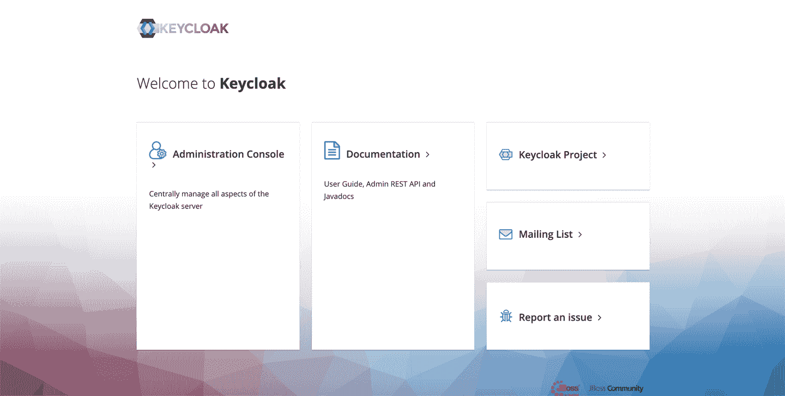
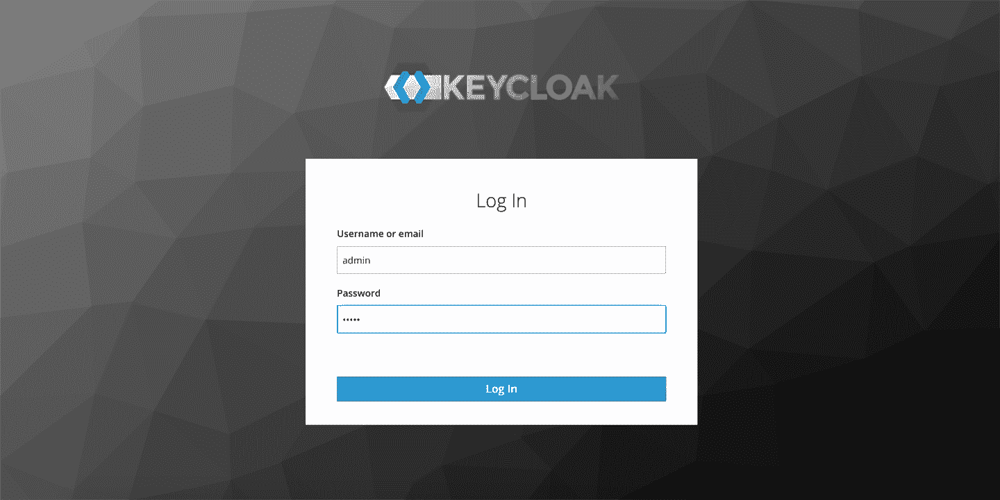
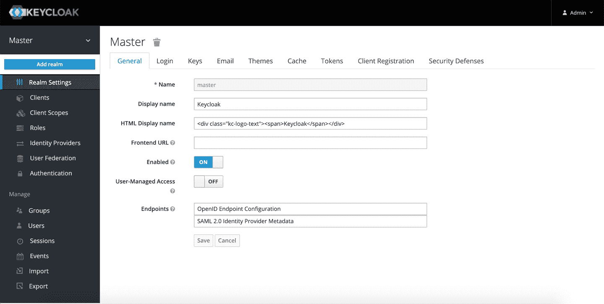
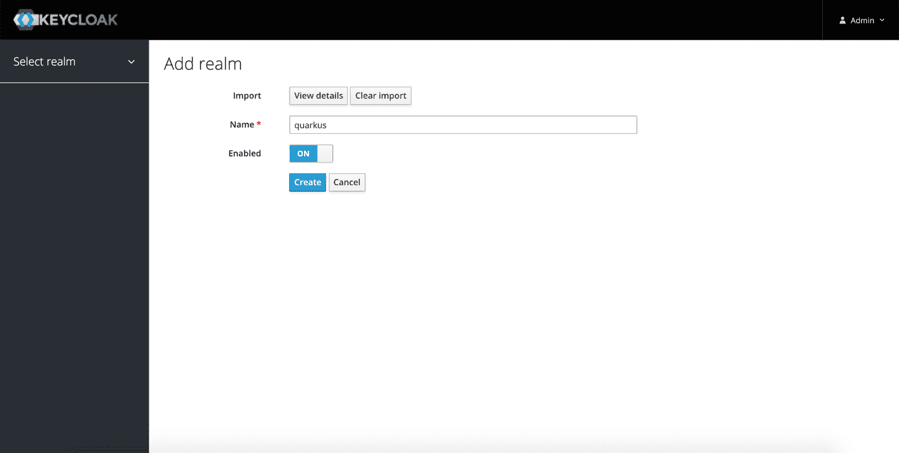

# 附录 B. Keycloak

Keycloak 是一个开源的身份和访问管理系统。配置和部署 Keycloak 到生产环境超出了本书的范围。在下面的示例中，提供了一个包含所有用户、角色、配置等的领域文件，并需要导入到正在运行的 Keycloak 服务器中。

为了简化 Keycloak 的安装，使用了 Keycloak Docker 容器：

```java
docker run --name keycloak -e KEYCLOAK_USER=admin -e KEYCLOAK_PASSWORD=admin \
 -p 8180:8080 jboss/keycloak:8.0.1
```

然后打开浏览器并输入以下 URL：[*http://localhost:8180*](http://localhost:8180)。

单击管理控制台，如图 B-1 所示。



###### 图 B-1\. Keycloak 首页

接下来，您将看到一个与图 B-2 类似的登录选项。使用登录/密码 admin 作为凭据。



###### 图 B-2\. Keycloak 登录页面

在主页面中，切换主按钮以显示“添加领域”按钮，并单击它，使您的屏幕看起来像图 B-3 所示。



###### 图 B-3\. Keycloak 添加领域按钮

最后，您应该看到一个类似于图 B-4 所示的屏幕。您需要导入一个 Keycloak 文件。我们使用的文件在本书的代码中，位于[*https://oreil.ly/quarkus-cookbook-code*](https://oreil.ly/quarkus-cookbook-code)。



###### 图 B-4\. 导入领域的结果
