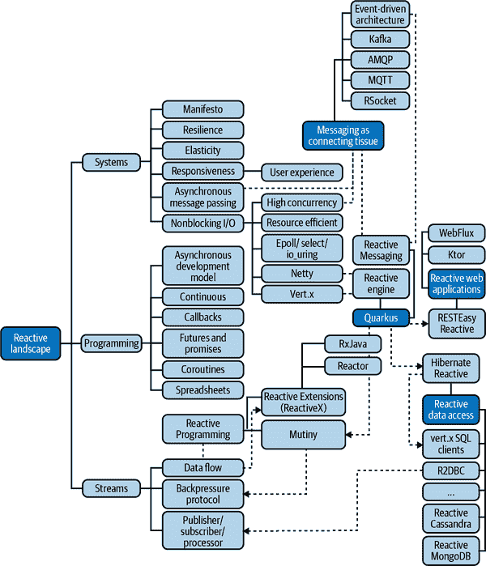

# 第一章\. 简介反应式

*Reactive*是一个负载词。您可能已经通过搜索引擎搜索*reactive*以了解其含义。如果没有，也没关系——您省下了很多困惑。有许多*reactive things*：反应式系统、反应式编程、反应式扩展、反应式消息传递。每天都会有新的东西出现。所有这些“反应式”都是同一种反应式吗？它们有所不同吗？

这些是我们将在本章回答的问题。我们将偷窥反应式景观，以识别并帮助您理解*reactive*的各种细微差别，它们的含义，与它们相关的概念以及它们之间的关系。因为是的，不要透露太多，所有这些“反应式”都是相关的。

###### 注

如前言所述，我们使用大写字母*R*的名词*Reactive*来汇集反应式景观的各种方面，如反应式编程、反应式系统、反应式流等等。

# 我们所说的反应式是什么？

让我们从头开始。暂时忘记软件和信息技术，使用一种老式方法。如果我们在[*牛津英语词典*](https://oreil.ly/nL7Fp)中查找*reactive*，我们会找到以下定义：

> *reactive*（形容词）
> 
> 显示对刺激的反应。1.1 根据情况作出反应，而不是创造或控制它。1.2 有化学反应的倾向。1.3 （生理学）对特定抗原显示免疫反应。1.4 （疾病或疾病）由对某物质的反应引起。1.5 （物理学）与电抗相关。

在这些定义中，有两个与我们的语境相关。第一个定义，*显示对刺激的反应*，指的是某种反应。子定义 1.1 指出，反应性还涉及面对意外和不受控制的情况。你将在本书中看到，云原生应用程序和分布式系统总体上会遇到大量这类情况。虽然这些定义很有趣，但并不适用于软件。但我们可以考虑这些定义，以制定一个特定于软件的新定义：

> 1.6 (软件) 对刺激（如用户事件、请求和失败）作出反应的应用程序。

然而，正如你将在本书中看到的，今天的*reactive*已经超越了这一点。反应式是一种设计、实现和推理你的系统的方法，涉及事件和流的概念。反应式涉及构建*响应式*、*弹性*和*健壮*的应用程序。反应式还涉及通过资源的有效管理和通信来利用资源。换句话说：反应式是设计和构建更强大和更高效的分布式系统的方法。我们称它们为*反应式系统*。

# 反应式软件并不新颖

但等等，我们刚刚给出的定义（1.6）并不是开创性的。 相反，您可能会感觉有些似曾相识，不是吗？ 如果软件的本质是对用户输入和操作系统信号做出反应，那么软件在按下按键时会如何行为？ 它会做出反应。 那么，如果反应式只是常规软件，为什么会有这么多关于反应式的书籍、讨论和辩论呢？¹ 请耐心等待；这还有更多内容。

但您说得对； 反应式*并不*新。 它实际上相当古老。 我们可以追溯反应式软件背后思想的基础，这些思想在 50 年代计算机出现后不久就已存在。 [DYSEAC](https://oreil.ly/ehP7l)，一台第一代计算机（1954 年投入使用），已经使用硬件中断作为优化，消除了轮询循环中的等待时间。 这台计算机是最早使用反应式和事件驱动架构的系统之一！

对事件的响应意味着是事件驱动的。 *事件驱动软件*接收并生成事件。 收到的事件决定程序的流程。 事件驱动的一个基本方面是异步性：您不知道何时会收到事件。² 这恰恰是前一节中定义 1.1 的内容。 您不能计划何时会收到事件，也无法控制将收到哪些事件，并且需要准备好处理它们。 这就是反应式的本质：异步性。

# 反应式景观

从这种异步和事件驱动的思想中，许多形式的*反应式*应运而生。 反应式的领域广阔而拥挤。 图 1-1 描述了这一景观的一部分以及主要*反应式事物*之间的关系。

###### 图 1-1. 反应式景观

但不要忘记我们的目标：构建更好的分布式系统 —— 反应式系统。 其他的“反应式”在这里帮助我们实现这些系统。

反应式的原因，尤其是反应式系统，源于分布式系统。 正如您将在第三章中看到的那样，构建分布式系统是困难的。 2013 年，分布式系统专家撰写了[“反应式宣言”](https://oreil.ly/6z8mt)的第一个版本，并引入了反应式系统的概念。

是的，您可以在不应用反应式原则的情况下构建分布式系统。 反应式提供了一个蓝图，确保在设计和开发系统时没有忽视任何重要的已知问题。 另一方面，您可以将这些原则应用于非分布式系统。

反应式系统首先是响应性的。即使在负载或面对故障时，它也必须及时处理请求。为了实现这种响应性，宣言提议使用异步消息传递作为系统中形成组件之间通信的主要方式。你将在第四章中看到，这种通信方法如何实现弹性和韧性，这是坚固分布式系统的两个基本属性。本书的目标是向你展示如何使用 Quarkus 构建这样的反应式系统。因此，构建反应式系统是我们的主要目标。

将异步消息传递注入到分布式系统的核心并不是没有后果的。你的应用程序需要使用异步代码和非阻塞 I/O，这是操作系统提供的一种能力，可以在不必积极等待完成的情况下排队 I/O 交互。 （我们在第四章中介绍了非阻塞 I/O）。后者对于改善资源利用率非常重要，比如 CPU 和内存，这是 Reactive 的另一个重要方面。今天，许多工具包和框架，如 Quarkus、[Eclipse Vert.x](https://vertx.io)、[Micronaut](https://micronaut.io)、[Helidon](https://helidon.io) 和 [Netty](https://netty.io)，正是基于这个原因使用非阻塞 I/O：用有限资源做更多事情。

然而，拥有利用非阻塞 I/O 的运行时并不足以成为反应式。你还需要编写异步代码，以拥抱非阻塞 I/O 机制。否则，资源利用的好处将会消失。编写异步代码是一种范式转变。从传统的（命令式）`做 x; 做 y;`，你现在将要塑造你的代码为`当事件(e)发生时做 x; 当事件(f)发生时做 y;`。换句话说，要想成为反应式，不仅你的系统是一个事件驱动的架构，而且你的代码也将变成事件驱动的。实现这种代码的最直接方法之一是回调：你注册函数，在收到事件时调用这些函数。像 futures、promises 和协程一样，每种其他方法都基于回调并提供了更高级别的 API。

###### 注意

你可能会想为什么电子表格会出现在这个领域。电子表格是一种反应性工具。当你在一个单元格中写入一个公式，并改变由该公式读取的值（在另一个单元格中），该公式的结果会被更新。这个单元格对值的更新（事件）做出反应，结果（反应）是新的结果。是的，你的经理可能比你更擅长反应式开发！但不用担心，这本书会改变这种情况。

反应式编程，见第五章，也是一种编写异步代码的方法。它使用数据流来组织你的代码。你观察这些流中传输的数据，并对其做出反应。反应式编程提供了一个强大的抽象和 API，用于形成事件驱动的代码。

但是，使用数据流也存在问题。如果您有一个快速生产者直接连接到一个慢速消费者，您可能会淹没消费者。正如您将看到的，我们可以在中间使用缓冲区或消息代理，但想象一下在没有它们的情况下淹没消费者。这与反应式所推广的响应性和抗脆弱性思想背道而驰。为了帮助我们解决这个特定问题，[Reactive Streams](https://oreil.ly/5c275) 提出了一种异步和非阻塞的背压协议，其中消费者向生产者发出其可用性的信号。正如您可以想象的那样，这可能并不适用于所有情况，因为某些数据源不能减速。

过去几年里，Reactive Streams 的流行度不断增加。例如，[RSocket](https://rsocket.io)是一种基于 Reactive Streams 的网络协议。[R2DBC](https://r2dbc.io) 提议使用 Reactive Streams 进行异步数据库访问。此外，[RxJava](https://oreil.ly/QNEOJ)、[Project Reactor](https://oreil.ly/eUHAL) 和 [SmallRye Mutiny](https://oreil.ly/A17fF) 采用了反应式流来处理背压。最后，Vert.x 允许将 Vert.x 背压模型映射到 Reactive Streams。³

这就是我们对反应式景观的快速介绍。正如我们所说，它充斥着许多术语和工具。但是永远不要忘记反应式的总体目标：构建更好的分布式系统。这是本书的主要重点。

# 为什么反应式架构非常适合云原生应用程序？

云——无论是公有云、私有云还是混合云——都将反应式置于聚光灯下。云是一个分布式系统。当您在云上运行应用程序时，该应用程序面临着很高的不确定性。您的应用程序的供应可能会慢，也可能会快，甚至可能失败。由于网络故障或分区，通信中断很常见。您可能会遇到配额限制、资源短缺和硬件故障。您正在使用的某些服务有时可能不可用，或者会被移动到其他位置。

虽然云为基础设施层提供了出色的设施，但它只覆盖了故事的一半。第二部分是您的应用程序。它需要被设计成分布式系统的一部分。它需要理解作为这样一个系统的一部分所面临的挑战。

我们在本书中涵盖的反应式原则有助于拥抱分布式系统和云应用的固有不确定性和挑战。它不会隐藏它们——相反，它拥抱它们。

随着微服务和[无服务器计算](https://oreil.ly/IH6wY)日益成为主流架构风格，反应式原则变得更加重要。它们可以帮助确保您在坚实的基础上设计系统。

# 反应式不是万能药

就像一切事物一样，反应式有利有弊。它不是一种魔法武器。没有解决方案适用于所有情况。

记得 2010 年代末的微服务吗？它们迅速变得极为流行，许多组织在可能不适合的领域实施了它们。这往往是一种问题的交换。就像微服务架构一样，响应式架构在某些方面非常适合。它们适用于分布式和云应用程序，但在更为单片和计算密集型的系统上可能会带来灾难。如果您的系统依赖于远程通信、事件处理或高效性，响应式将会很有趣。如果您的系统主要使用进程内交互，每天处理的请求很少，或者计算密集型，则响应式除了复杂性之外不会带来任何好处。

使用响应式，您将事件的概念置于系统核心。如果您习惯于传统的同步和命令式应用程序构建方式，那么转向响应式可能会很陡峭。需要变为异步会打破大多数传统框架。我们正在远离众所周知的远程过程调用（RPC）和 HTTP 端点。因此，在此免责声明之后，是时候开始我们的旅程了！

¹ 您可以在 YouTube 上找到大量关于响应式的演讲，链接在[这里](https://oreil.ly/SyGxB)。

² 异步是同步的反义词。*异步*意味着在不同的时间点发生，而*同步*意味着同时发生。

³ 请参阅[Vert.x 响应式流集成](https://oreil.ly/t2noI)以获取更多详细信息。
