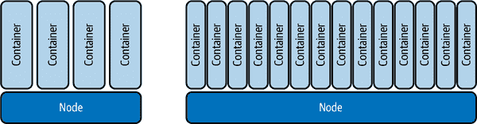
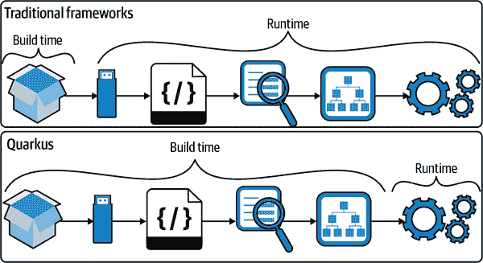
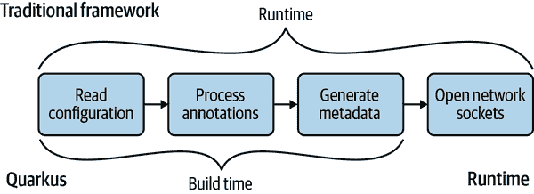
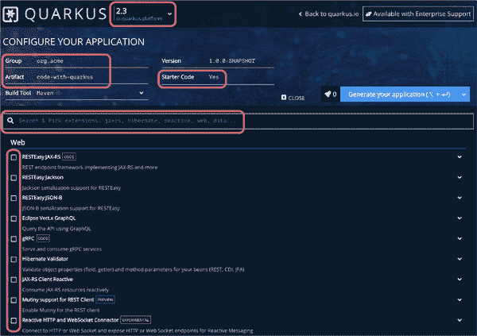
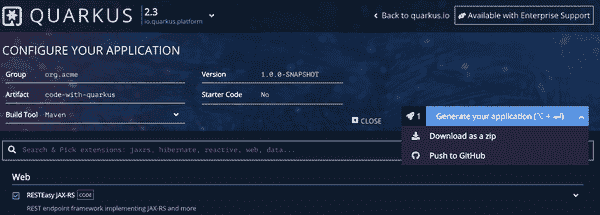
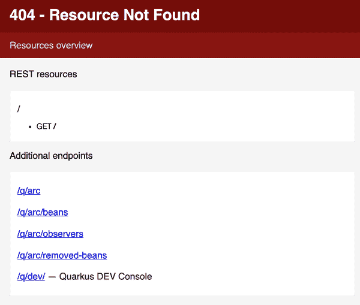
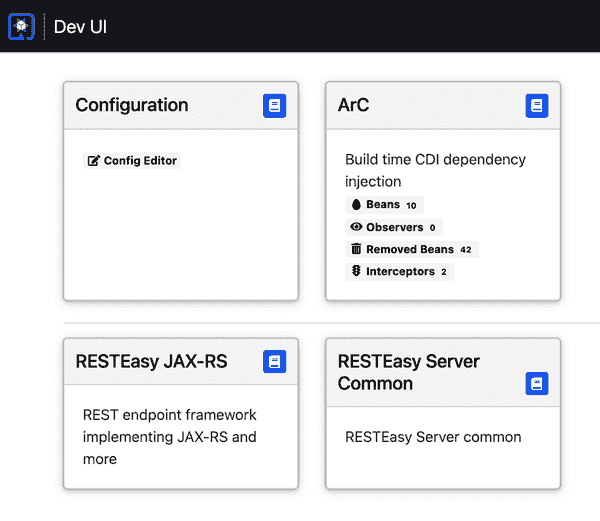

# 第二章。Quarkus 简介

在继续理解响应式之前，让我们花点时间了解一下 Quarkus。那么，什么是 Quarkus？

*Quarkus*是一个基于 Kubernetes 的 Java 堆栈。它专为 Kubernetes、容器和云环境进行了定制，但在裸金属和虚拟机上也能完美运行。¹ Quarkus 应用程序需要比使用传统框架的应用程序更少的内存，并且启动更快。它们还可以编译成本地可执行文件，从而消耗更少的内存并实现即时启动。

Quarkus 一个令人兴奋且核心的方面是其响应式引擎。在容器或虚拟化环境中运行时，响应式引擎对于减少内存和 CPU 消耗至关重要。该引擎使得任何 Quarkus 应用程序都能高效运行，并支持响应式应用程序和系统的创建。

在本章中，您将看到 Quarkus 的主要特点，并学会创建应用程序、将其部署到 Kubernetes，并创建本地构建。在第六章中，我们详细介绍了响应式引擎，并展示了如何在 Quarkus 上开发统一的响应式和命令式编程模型。

# Java 云上的运行

Java 现在已经 25 岁了！有时很难想象。从三层架构和客户端/服务器架构的时代开始，Java 随着多年来架构的许多变化而发展。然而，当一门语言已经 25 岁时，可能会留下一些不适合现代开发的部分内容。

这是什么意思？当 Java 的最初版本发布时，*云*、*容器*、*微服务*、*无服务器*以及今天与计算相关的任何其他术语都还没有被想象出来。我们无法指望 Java 语言在三层架构和客户端/服务器架构时代创建的版本在今天的容器中表现得符合我们的需求。

是的，Java 在多年来确实取得了许多进展，尤其是在最近几年的更快发布周期下。同时，Java 自豪地宣称没有打破开发人员和用户的向后兼容性。这种方法的一个巨大成本是，Java 仍然保留了在没有容器和其提供的知识和好处的情况下构思的部分内容。

对于许多应用程序来说，Java 将继续正常工作，并且如现在这样运行很多年。然而，在过去几年中，随着微服务的爆发，以及最近的向无服务器的演变，Java 并不自然适应这些部署模型。

几年前，Java 在容器中的适应性不足问题显而易见，因为我们发现[Java 忽视了 cgroups](https://oreil.ly/Mbux3)。对于容器来说，这造成了一个巨大的问题。Java 无法看到分配给容器的内存量，只能看到整个物理机的内存。

在每个容器需要在受限内存量内工作的环境中，Java 并没有*友好*。Java 很贪婪。此外，Java 会根据 CPU 核心数创建应用程序线程。这导致在内存和 CPU 受限的容器中分配了更多的线程。

是否是一个大问题？如果你的 Java 应用程序部署在容器中，并且在 Kubernetes 节点上部署时，其他容器的内存限制良好控制，那么你可能会运气好。然后有一天，内存消耗量由 Java 虚拟机（JVM）引起的负载激增，然后*嘭*！Kubernetes 会因为使用过多内存而终止该容器。

关于 Java 和 cgroups 的特定问题自 Java 10 以来已经修复，自 Java 开发工具包（JDK）8u131 起，已有可用于启用相同行为的选项。请参阅 Rafael Benevides 在红帽开发者网站上的[“Java Inside Docker”文章](https://oreil.ly/L5Yh7)，了解所有细节。

你可能认为现在 Java 在容器或云中应该表现*良好*了，对吧？尽管使用适当的 JDK 版本可以解决此问题，但许多企业仍在使用 JDK 8 或更早版本，并且很可能没有使用可用的标志来配置 JDK 8。而 Java 在云中的问题不仅仅是 cgroups。

容器不会因为抓取比预期内存更多而被杀掉是很好的。然而，Java 在容器中引发了关于应用程序开始接收请求速度和运行时内存消耗的担忧。与其他语言在容器中运行相比，这对 Java 应用程序来说都不是一个好消息。也许对许多当前运行的应用程序来说，启动速度并不是一个问题，但对于需要迅速扩展以处理大流量峰值或服务器无服务应用程序的冷启动时间来说，它确实有影响。

我们所说的*开始接收请求*是什么意思？虽然在构建应用程序中使用的框架通常会记录它们的启动时间，但它指的是*框架*启动所花费的时间。这个时间并不代表*应用程序*在能够开始接收请求之前所花费的时间。这段时间对于容器和云环境非常关键！

开始接收请求的时间也可以称为*首次请求时间*。如果一个框架可以在半秒钟内启动，但在应用程序能够开始接收和处理流量之前还需要额外的 2 到 3 秒钟，那么这并不多。在这样的例子中，新的应用程序实例在可以开始接收用户请求之前可能需要 2.5 到 3.5 秒钟。

诚然，对于具有少量内部用户的单体应用程序，启动接收请求的时间和内存消耗可能并不是问题。虽然可以使用 Quarkus 开发单体应用程序，但我们谈论 Quarkus 的好处时，在开发单体应用程序时不会像在微服务中那样显著。但是，对于微服务，尤其是无服务器架构，这两个因素都会影响运行服务的成本和向用户提供的可用性。

###### 警告

框架通常可以通过延迟工作直到接收到第一个请求来实现较低的启动时间。任何剩余的启动任务在处理第一个请求之前完成。*惰性初始化* 是这种行为的另一个名称，它提供了一个关于应用真正准备好的虚假指示。*开始接收请求* 的时间是衡量应用启动时间的最佳指标。在无服务器工作负载以及使用 *规模至零* 方法的任何机制中，具有较低的 *首个请求时间* 是至关重要的，其中服务仅在需要时启动。在更常见的架构中，这种快速启动时间可以减少崩溃后的恢复时间。

如何测量启动时间？有许多方法可行，包括修改端点以在访问时输出时间戳。为了让生活更简单，我们将使用由 Red Hat 的 John O’Hara 开发的 Node.js 脚本。² 此脚本使用应用程序启动命令和访问它的 URL，在另一个进程中启动应用程序。脚本会等待 URL 返回 `200`，表示成功，然后计算首个请求的时间。

###### 注意

为了方便使用，我们将 [GitHub 仓库的内容](https://github.com/cescoffier/reactive-systems-in-java) 和 *chapter-2/startup-measurement* 目录中的代码一并包含在内。确保你已安装了 Node.js，并运行 `npm install request` 来安装脚本依赖。

现在你可能会认为，关于启动速度和内存消耗的讨论是一个非常 *手摇摆* 的主题，太主观了。我们完全同意这一点，这就是为什么我们现在将使用传统的 Java EE 技术栈，在本例中使用 [Thorntail](https://thorntail.io) 来实践这些概念。我们选择 Thorntail 进行比较，因为它是 Red Hat 的第一个微服务框架，而 Quarkus 则是最新的。尽管 Thorntail 项目已不再维护，但好消息是 Quarkus 吸收了许多 Thorntail 的想法。

在我们开始编码和运行应用程序之前的最后一点要说明的是 *内存* 可能是一个比较模糊的术语，因为有许多类型的内存。当我们谈论内存时，我们指的是 [*常驻集大小* (RSS)](https://oreil.ly/o4TzC)，而不是 JVM 堆大小，因为堆只是 Java 应用程序消耗的总内存的一部分。在 JVM 上运行应用程序时，总分配内存可以包括以下内容：

+   堆空间

+   类元数据

+   线程堆栈

+   编译后的代码

+   垃圾收集

RSS 表示进程从主内存（RAM）占用的内存量。 RSS 包括 JVM 运行应用程序所需的所有内存，提供了实际占用内存量的更精确值。由于我们在单个 JVM 进程中运行单个应用程序，因此可以轻松确保我们未测量非应用程序进程的内存消耗。

###### 注意

所有性能数字均来自我们的 MacBook 计算机。因此，在本章中看到的结果可能因您的特定硬件配置而略有不同。如果您拥有 Apple M1，您可能会看到更好的结果！

好的，是时候运行一些代码，看看我们在启动速度和内存消耗方面的讨论。

## Thorntail 示例

我们首先通过使用 Thorntail 创建一个 *传统* 应用程序来进行比较内存或 RSS 和首次请求时间指标。对于不熟悉 Thorntail 的人来说，该项目专注于可定制的[WildFly 服务器](https://wildfly.org)的概念。Thorntail 只获取特定应用程序所需的部分，删除其他所有内容。

Thorntail 应用程序需要一个[Java API for RESTful Web Services](https://oreil.ly/eYjXF) (JAX-RS) 应用程序，并提供一个简单的资源端点用于我们发送请求。Thorntail 示例需要一个 JAX-RS 应用程序，以及一个 JAX-RS 资源，其中包含一个方法，用于对 HTTP GET 请求返回问候语。Thorntail 示例的所有源代码可以在 */chapter-2/thorntail-hello* 目录中找到。

类并没有什么特别之处。它们是提供使用 JAX-RS 提供 HTTP 端点进行请求的最低要求。让我们构建 Thorntail 应用程序，然后像 示例 2-1 中所示启动它。

##### 示例 2-1\. 构建和运行 Thorntail Hello World 应用程序

```java
> mvn verify
> java -jar target/thorntail-hello-world-thorntail.jar
```

应用程序启动后，请使用 `curl` 或浏览器访问[*http://localhost:8080/hello*](http://localhost:8080/hello)端点。在进行测量 RSS 之前访问端点非常重要，因为应用程序可能在启动时未加载所有类，这意味着我们可能会看到误导性的数字。

要查找 Thorntail 应用程序所使用的内存，我们需要其运行的进程 ID。在基于 Linux 的系统中（包括 Mac），我们可以使用 `ps -e | grep thorntail` 命令列出所有活动进程，并将结果限制为名称中包含 `thorntail` 的进程。有了进程 ID，现在我们可以查找进程使用的 RSS 量（如 示例 2-2 中所示）。

##### 示例 2-2\. 测量 Thorntail 应用程序的 RSS 使用情况

```java
> ps -o pid,rss,command -p 4529 | awk '{$2=int($2/1024)"M";}{ print;}'     

PID   RSS COMMAND
4529 441M java -jar target/thorntail-hello-world-thorntail.jar
```


`ps` 命令检索 RSS 和命令，而 `awk` 将 RSS 值转换为兆字节。

您将看到类似上述终端输出的内容，显示了进程 ID、转换为兆字节（`M`）的 RSS 和命令。有关如何为进程查找 RSS 的完整详细信息，请参阅 Quarkus 网站[³]。

我们可以看到一个类似“Hello World”风格的应用程序，具有返回字符串的单个端点，使用了 441 兆字节（MB）。哇！对于返回固定字符串的单个 JAX-RS 端点来说，这是很多内存！

我们应该注意，我们在 OpenJDK 11 上运行这些测试，没有对 JVM 进行任何限制内存捕获量或 JVM 提供的任何其他调优的自定义。我们可以限制 JVM 能够抓取的内容，看看这如何影响整体 RSS (示例 2-3)。

##### 示例 2-3\. 启动 Thorntail 应用程序以配置堆大小

```java
> java -Xmx48m -XX:MinHeapFreeRatio=10 -XX:MaxHeapFreeRatio=20 \
    -jar target/thorntail-hello-world-thorntail.jar
```

现在我们在 示例 2-4 中获得输出。

##### 示例 2-4\. 测量 RSS 使用量

```java
> ps -o pid,rss,command -p 5433 | awk '{$2=int($2/1024)"M";}{ print;}'
PID   RSS COMMAND
5433 265M java -Xmx48m -XX:MinHeapFreeRatio=10 -XX:MaxHeapFreeRatio=20 \
    -jar target/thorntail-hello-world-thorntail.jar
```

那将内存使用量降至 265 MB！通过将 JVM 抓取的堆大小限制为 48 MB，我们节省了将近 200 MB 的 RSS。也许在吞吐量方面，48 MB 不是最佳选择，但这是需要通过您自己的应用程序来验证的，以找到减少内存消耗和增加吞吐量之间的平衡点。

我们已经展示了 RSS 使用情况，现在我们需要计算首次请求时间。在继续之前，请确保停止所有先前的 Thorntail 应用程序实例。让我们来看看首次请求时间，如 示例 2-5 所示。

##### 示例 2-5\. 测量 Thorntail 应用程序的首次请求时间

```java
> node time.js "java \
 -jar [fullPathToDir]/thorntail-hello/target/
 thorntail-hello-world-thorntail.jar" \
    "http://localhost:8080/hello"
```

我们看到一堆`404`消息在控制台中飞过，直到应用程序返回`200`响应，然后我们看到花费的时间。在我们的情况下，这是 6,810 毫秒（ms）！在微服务和函数的世界中，这并不算快。您可以运行几次以查看时间是否有很大变化或根本没有变化。由于启动时间为 7 秒，扩展微服务无法快速满足流量峰值，导致用户延迟和可能的错误。从无服务器的角度来看，我们更糟糕，因为我们期望无服务器函数在 7 秒之前就能启动、运行和停止。

###### 注意

使用 *time.js* 捕获的首次请求时间可能比实际时间略长，因为在子进程生成但 JVM 启动之前，将包含一个非常小的时间量。我们对这种微小影响并不担心，因为影响适用于我们以相同方式测试的每个运行时。

所以，我们已经看到了传统应用程序为 RSS 消耗的情况，以及达到首次请求时间需要多长时间。现在是时候看看 Quarkus 的比较了。

## Quarkus 示例

我们将创建一个相同的 Hello World 端点，尽管它不会说“Hello from Thorntail！”对于 Quarkus，我们不需要 JAX-RS 应用程序类；我们只需要具有与 Thorntail 版本相同内容的 JAX-RS 资源，除了消息[⁴]。Quarkus 示例的源代码可以在*/chapter-2/quarkus-hello*目录中找到。

在“创建您的第一个 Quarkus 应用程序”中，我们介绍了如何创建 Quarkus 应用程序。现在按照示例 2-6 中所示构建并运行 Quarkus Hello World 应用程序。

##### 示例 2-6\. 构建并启动 Quarkus Hello World 应用程序

```java
> mvn verify
> java -jar target/quarkus-hello-world-1.0-SNAPSHOT-runner.jar
```

与 Thorntail 一样，我们不是优化 JVM 来查看我们看到的原始 RSS 使用情况。像我们在 Thorntail 中那样多次点击[*http://localhost:8080/hello*](http://localhost:8080/hello)。希望你看到了“Hello from Quarkus！”的消息。否则，你仍在运行 Thorntail 应用程序。

找到 Quarkus 应用程序的进程 ID，并检查 RSS（示例 2-7）。

##### 示例 2-7\. 测量 Quarkus Hello World 应用程序的 RSS 使用情况

```java
> ps -o pid,rss,command -p 6439 | awk '{$2=int($2/1024)"M";}{ print;}'
PID    0M COMMAND
6439 133M java -jar target/quarkus-hello-world-1.0-SNAPSHOT-runner.jar
```

在这里，我们看到 Quarkus 使用了 133 MB 的 RSS，比 Thorntail 的 441 MB 少了 300 多 MB！这对于本质上相同的应用程序来说是惊人的改进。

如果我们将最大堆大小限制为 48 MB，就像我们为 Thorntail 所做的那样，我们会得到多大的改进？查看示例 2-8。不要忘记一旦应用程序启动就使用端点。

##### 示例 2-8\. 限制堆使用并测量 RSS 使用情况

```java
> java -Xmx48m -XX:MinHeapFreeRatio=10 -XX:MaxHeapFreeRatio=20 \
    -jar target/quarkus-hello-world-1.0-SNAPSHOT-runner.jar
> ps -o pid,rss,command -p 7194 | awk '{$2=int($2/1024)"M";}{ print;}'
PID    0M COMMAND
7194 114M java -Xmx48m -XX:MinHeapFreeRatio=10 -XX:MaxHeapFreeRatio=20 \
    -jar target/quarkus-hello-world-1.0-SNAPSHOT-runner.jar
```

这将其降低到 114 MB，但让我们看看我们能将 Quarkus 推向多大的堆大小！参考示例 2-9。再次，一旦启动，请不要忘记使用端点。

##### 示例 2-9\. 限制 Quarkus 应用程序的堆使用，并进一步测量 RSS 使用情况

```java
> java -Xmx24m -XX:MinHeapFreeRatio=10 -XX:MaxHeapFreeRatio=20 \
    -jar target/quarkus-hello-world-1.0-SNAPSHOT-runner.jar
> ps -o pid,rss,command -p 19981 | awk '{$2=int($2/1024)"M";}{ print;}'
PID    0M COMMAND
19981 98M java -Xmx24m -XX:MinHeapFreeRatio=10 -XX:MaxHeapFreeRatio=20 \
    -jar target/quarkus-hello-world-1.0-SNAPSHOT-runner.jar
```

使用 24 MB 的最大堆，我们将 RSS 降至 98 MB！更重要的是，应用程序仍然可用！看看在 Quarkus 无法启动之前你能将最大堆降低到多低。尽管对于常规应用程序，甚至是微服务，你不会将最大堆设置得这么低，但能够将其设置得这么低对于无服务器环境至关重要。

###### 提示

将堆大小设置为非常低的值可能会惩罚应用程序的性能，特别是如果应用程序进行了大量的分配。不要追求尽可能小的值，而是根据您预期的性能和部署密度增益来验证该值。请注意，Quarkus 架构试图避免出现这种惩罚。然而，我们强烈建议您与您的应用程序进行核实。

时间来测试启动速度（参见示例 2-10）。

##### 示例 2-10\. 测量 Quarkus 应用程序的首次请求时间

```java
> node time.js "java \
 -jar [fullPathToDir]/quarkus-hello/target/
 quarkus-hello-world-1.0-SNAPSHOT-runner.jar" \
    "http://localhost:8080/hello"
```

如果您的硬件与我们的相似，您应该能看到大约 1,001 毫秒的第一次请求时间！这几乎比传统应用程序快了七倍！

这一切都非常棒，但是意义何在？回顾我们之前关于 Java 在容器中的讨论，让我们来看看在容器中运行时的影响。假设我们有一个可用内存为 2 GB 的节点，每种应用程序可以容纳多少个容器？参考 图 2-1。



###### 图 2-1\. 容器中的 Java 内存：Quarkus 允许增加部署密度

*容器密度* 是使用 Kubernetes 进行云部署的关键特征。给定特定节点大小，例如 2 GB 的 RAM，能够在单个节点中运行的容器越多，我们就能提供更大的容器密度。从 图 2-1 的例子中可以看出，使用 4 个实例还是 14 个实例可以实现更高的吞吐量？即使每个 14 个容器支持的吞吐量或请求每秒较少，与传统容器中的一个相比，这也无关紧要。在容器中轻微减少吞吐量比支持 14 个容器而不是 4 个容器更为重要。

容器密度是确定所需实例数量的重要指标。开发人员需要确定的是他们期望的或需要支持的吞吐量。也许今天的需求可以接受少量具有较大内存需求的容器，但请记住事情是会变化的，您可能很快就需要超过四个容器来支持您的用户！

您现在已经看到了传统应用程序在 JVM 上的 RSS 内存量和第一次请求的时间，以及 Quarkus 如何显著减少这些方面。Quarkus 想要应对改善 Java 在容器中的挑战，提出了一种新的方法。这种方法提高了 Java 在容器中的启动速度和内存消耗。

接下来的部分将详细解释 Quarkus 如何实现这一点，更重要的是，它与传统框架方法的不同之处。

# Quarkus 的方式

您肯定想知道 Quarkus 比传统框架启动更快，内存消耗更少的复杂细节，对吧？我们需要先放慢速度，解释传统框架的工作方式，这样您才能理解 Quarkus 带来的变化。

传统框架的一些著名特性展示在 图 2-2 中：

+   在代码中定义预期行为的注解，多年来我们都使用了许多示例。典型的例子包括 `@Entity`、`@Autowired`、`@Inject` 等等。

+   各种类型的配置文件。这些文件做的事情从定义类如何被连接到配置持久数据源，无所不包。

+   仅在启动期间使用的用于创建运行时元数据和应用程序功能的类。

+   利用反射确定要调用的方法，将值设置到对象中，并仅通过名称动态加载类。



###### 图 2-2\. Quarkus 的方式

我们当然并不是说 Quarkus 没有注解、配置文件或传统框架的任何其他特性。我们*确实*是说 Quarkus 以非常不同的方式处理它们。

为什么传统框架的这些特性会被认为是“不好”的呢？这是一个很好的问题，回答需要对这些框架如何处理前述特性有一定的理解。当需要解析任何配置或发现注解时，框架类需要执行这项工作。根据过程的复杂程度，可能需要从几十到几百个类来执行任务。此外，每个类通常会在自身内部保存状态，代表启动过程中的中间状态，或者在处理完成后表示最终期望的状态。

对此并没有什么特别之处；框架多年来甚至几十年来都是这样工作的。然而，您可能没有意识到的是，任何用于执行这些启动任务的类仍然存在，即使 JVM 进程已经运行了六个月而没有重启！虽然这些类抓取的任何内存应该最终被垃圾回收，只要这些类在工作完成时正确释放了它们对内存的控制，但它们的类元数据仍然存在于 JVM 中，即使在最新的 Java 版本上也是如此。这可能看起来不是很多，但是几百个不再需要的类可能会影响 JVM 所需的内存量。

这个问题今天影响所有的 JVM，没有框架的特殊处理。只有当类的所有对象可以被垃圾回收、对类的所有引用被删除，并且最重要的是，同一个类加载器中的所有其他类也不再被引用时，JVM 才能够对启动期间使用的所有类进行垃圾回收。为了促进启动类的垃圾回收，框架需要为启动类使用一个类加载器，而为运行时类使用另一个类加载器。在使用线程池（特别是 `ForkJoinPool`）和在启动期间设置线程局部变量时，启动类的垃圾回收可能会变得困难。

如果永远不会再次使用类，为什么要在 JVM 内存中保留它们？理想情况下，我们不应该这样做，因为这是浪费的。这就是 Quarkus 的优势所在。Quarkus 扩展被设计和构建成将传统框架启动处理的各个部分分解为更小的工作块。这样做使得 Maven 或 Gradle 的构建过程能够利用这些较小的块，并在构建期间执行它们，而不是等到运行时启动。在构建时利用启动类意味着这些类在运行时不需要包含在 JVM 中！这样就节省了内存和启动时间。

如何在构建时完成这些工作，并且在运行时需要的输出放在哪里？扩展使用字节码记录器来完成所有工作，从在运行时为类设置静态值到创建新类以保存运行时需要的元数据。我们是什么意思呢？早些时候我们讨论过框架在启动时做了很多工作，而 Quarkus 能够在构建时创建该工作的输出，并编写字节码以达到与传统框架在启动时相同的结果。在运行时，JVM 加载由 Quarkus 扩展编写的类到内存中，就好像所有这些启动工作都刚刚发生过一样，但没有了内存和类的成本。

查看传统框架在启动时执行的一些步骤，我们可以在 图 2-3 中看到 Quarkus 如何以不同的方式处理它们。



###### 图 2-3\. 传统框架与 Quarkus 中的框架启动阶段比较

虽然 Quarkus 在构建时读取配置，但某些属性，例如位置和凭据，仍然在运行时配置和读取。然而，一切应用程序相关的可以在构建时决定的内容都在构建过程中处理。到目前为止，我们一直在使用构建时来描述 Quarkus 完成这些通常与启动相关的任务的时间，但还有另一个术语：*提前编译*（AOT）。您已经看到 Quarkus 在优化应用程序代码和依赖项的方法上与传统框架有所不同。是的，这种方法减少了通常在运行时处理的可变性。

然而，在云端或容器中部署的现代工作负载并不需要这种可变性，因为几乎所有内容在构建时都是已知的。我们希望您现在对 Quarkus 通过这种创新方式提供的优势有了更清晰的理解，以及为什么它再次为 Java 在云端开发带来了兴奋。

# 创建您的第一个 Quarkus 应用程序

创建 Quarkus 应用程序的方法有很多种：

+   手动创建项目的 *pom.xml* 或 *build.gradle* 文件，添加 Quarkus 依赖项，设置和配置插件，并定义源文件夹。在我们看来，相当混乱和乏味！

+   使用 Maven 和 Quarkus 插件构建项目框架。

+   浏览至[*https://code.quarkus.io*](https://code.quarkus.io)，并选择所需的依赖项。这是最简单、最快速的入门方法，也是我们将要使用的方法。

是时候着手创建项目了！前往[*https://code.quarkus.io*](https://code.quarkus.io)，您将看到图 2-4 中的页面。我们已圈出一些关键部分，以便详细解释它们。

在页面的最顶部是生成项目的 Quarkus 版本。稍低左侧是可以自定义的项目组和构件名称。如果需要，稍后也可以更改这些；如果忘记自定义，也不用担心一直使用*org.acme*。

在右侧，用户可以决定是否向项目添加起始代码。默认情况下是是，因此如果您选择了任何带有*CODE*标记的扩展，例如*RESTEasy JAX-RS*，则会为该扩展生成项目的起始代码。在页面的顶部以下是所有可用的 Quarkus 扩展列表。提供了大量扩展；屏幕截图仅显示适合单页的扩展。使用每个复选框选择要包含在项目中的特定扩展。



###### 图 2-4\. Quarkus 项目选择

最后，如果您不想浏览所有扩展，可以在所有扩展上方的搜索框中开始输入术语。随着您的输入，下方的扩展列表将进行过滤，仅显示与您搜索条件匹配的扩展。在选择扩展后，它们将显示在“已选扩展”区域下方，旁边是“生成您的应用程序”。

图 2-5 展示了当我们即将生成应用程序时屏幕的样子。



###### 图 2-5\. Quarkus 项目生成

可以看到，我们选择不生成任何起始代码，并选择了 RESTEasy JAX-RS 扩展。目前我们坚持使用普通的 JAX-RS。我们将在第八章中探索更响应式的 JAX-RS。

当我们悬停在“生成您的应用程序”上时，我们可以决定将项目下载为 ZIP 文件或发布到 GitHub 存储库。目前，我们将下载为 ZIP 文件。文件将自动下载，名称与构件名称匹配。下载完成后，将 ZIP 文件解压缩到一个目录中。

完成后，我们打开一个终端窗口并切换到生成项目的目录。让我们深入使用实时重载（示例 2-11）并体验真正的开发者乐趣！

##### 示例 2-11\. 在开发模式下运行应用程序

```java
> mvn quarkus:dev
```

上述命令启动了 Quarkus 的实时重新加载，使我们能够快速迭代代码并即时看到影响。如果成功启动，终端输出如 示例 2-12 所示。

##### 示例 2-12\. 输出 Quarkus 应用程序

```java
__  ____  __  _____   ___  __ ____  ______
 --/ __ \/ / / / _ | / _ \/ //_/ / / / __/
 -/ /_/ / /_/ / __ |/ , _/ ,< / /_/ /\ \
--\___\_\____/_/ |_/_/|_/_/|_|\____/___/
INFO  [io.quarkus] (Quarkus Main Thread) code-with-quarkus 1.0.0-SNAPSHOT on JVM \
    (powered by Quarkus 2.2.0.Final) started in 0.937s. \
    Listening on: http://localhost:8080
INFO  [io.quarkus] (Quarkus Main Thread) Profile dev activated.
  Live Coding activated.
INFO  [io.quarkus] (Quarkus Main Thread) Installed features: [cdi]
```

我们已经开始并且正常运行了。在浏览器中打开 *[*http://localhost:8080*](http://localhost:8080)*，你将看到 `资源未找到`。哦，不！出了什么问题？

实际上，没有任何问题。敏锐的读者可能已经注意到启动日志只列出了`cdi`作为已安装的功能。那么 RESTEasy 呢？我们在创建项目时选择了其扩展。打开 *pom.xml*，你会看到这些依赖项（示例 2-13）。

##### 示例 2-13\. 生成项目的 Quarkus 扩展依赖项 (*chapter-2/code-with-quarkus/pom.xml*)

```java
<dependency>
  <groupId>io.quarkus</groupId>
  <artifactId>quarkus-resteasy</artifactId>
</dependency>
<dependency>
  <groupId>io.quarkus</groupId>
  <artifactId>quarkus-arc</artifactId>
</dependency>
<dependency>
  <groupId>io.quarkus</groupId>
  <artifactId>quarkus-junit5</artifactId>
  <scope>test</scope>
</dependency>
```

RESTEasy 明确作为一个依赖项存在，那么出了什么问题呢？在构建过程中，Quarkus 发现实际上没有任何使用 RESTEasy 的代码，因此卸载了该功能，并可用于释放内存。现在让我们来修复这个问题。

当 Quarkus 仍在运行时，在 */src/main/java* 内创建 *org.acme* 包。然后在该包内创建名为 `MyResource` 的类，并参考 示例 2-14 中的内容。

##### 示例 2-14\. JAX-RS `MyResource` (*chapter-2/code-with-quarkus/src/main/java/org/acme/MyResource.java*)

```java
import javax.ws.rs.GET;
import javax.ws.rs.Path;
import javax.ws.rs.Produces;
import javax.ws.rs.core.MediaType;

@Path("/")
@Produces({MediaType.TEXT_PLAIN})
public class MyResource {
  @GET
  public String message() {
    return "Hi";
  }
}
```

###### 注意

你可能会想为什么上述片段中没有任何 `import` 行是 Quarkus 特定的。Quarkus 通过利用超过 50 个最佳库提供了一个具有内聚性的全栈框架。在上述示例中，我们使用了 JAX-RS，这是构建 HTTP 和 REST API 的简单而高效的方法。

刷新 *[*http://localhost:8080*](http://localhost:8080)*。哇，现在我们在浏览器中看到 `Hi` 了；发生了什么？查看终端窗口（示例 2-15）。

##### 示例 2-15\. 代码更改后应用程序的自动重启

```java
INFO  [io.qua.dep.dev.RuntimeUpdatesProcessor] (vert.x-worker-thread-7) \
    Changed source files detected, recompiling \
    [{pathToProject}/code-with-quarkus/src/main/java/org/acme/MyResource.java]
INFO  [io.quarkus] (Quarkus Main Thread) code-with-quarkus stopped in 0.037s
__  ____  __  _____   ___  __ ____  ______
 --/ __ \/ / / / _ | / _ \/ //_/ / / / __/
 -/ /_/ / /_/ / __ |/ , _/ ,< / /_/ /\ \
--\___\_\____/_/ |_/_/|_/_/|_|\____/___/
INFO  [io.quarkus] (Quarkus Main Thread) code-with-quarkus 1.0.0-SNAPSHOT on JVM \
    (powered by Quarkus 1.11.1.Final) started in 0.195s. \
    Listening on: http://localhost:8080
INFO  [io.quarkus] (Quarkus Main Thread) Profile dev activated. Live Coding activated
INFO  [io.quarkus] (Quarkus Main Thread) Installed features: [cdi, resteasy]
INFO  [io.qua.dep.dev.RuntimeUpdatesProcessor] (vert.x-worker-thread-7) \
    Hot replace total time: 0.291s
```

我们可以看到 Quarkus 察觉到了对 *MyResource.java* 的修改，停止并重新启动了自身。查看已安装的功能，我们现在看到它包括`resteasy`。这是多么酷啊！更好的是，服务器仅在 300 毫秒内停止并重新启动。

我们为什么不更深入地探索实时重新加载，以更好地体验真正的开发者乐趣呢！保持 `mvn quarkus:dev` 运行，然后在浏览器中打开 *[*http://localhost:8080/welcome*](http://localhost:8080/welcome)*（图 2-6）。



###### 图 2-6\. 资源未找到

我们遇到了一个错误。哦，不！

不要太害怕，我们是预料到的，因为我们没有任何响应 */welcome* 终点的内容。然而，Quarkus 提供了一些链接来帮助诊断问题，基于它所知道的应用程序信息。它显示了有效终点的列表——在这种情况下，只有一个 */* 上的 HTTP GET。

在“附加端点”下，有一些用于开发应用程序的端点。在这个例子中，我们有与*ArC*相关的端点，它是基于上下文和依赖注入（CDI）的 Quarkus 的 bean 容器，还有一个链接到开发者控制台。点击开发者控制台链接将带你到其主页（图 2-7）。



###### 图 2-7\. Quarkus 开发控制台

现在那里并没有太多内容，但我们需要记住，我们唯一添加的扩展是 RESTEasy。随着我们用更多扩展增强应用程序，将从开发者控制台获得更多选项和能力。我们在一旁岔开了话题，所以让我们回到解决加载页面失败的问题上吧！在浏览器中打开 */welcome* 页面并在失败页的源代码处，返回并创建一个名为`WelcomeResource`的新类（示例 2-16）。

##### 示例 2-16\. JAX-RS `WelcomeResource` (*chapter-2/code-with-quarkus/src/main/java/org/acme/WelcomeResource.java*)

```java
@Path("/welcome")
public class WelcomeResource {
  @GET
  public String welcomeMessage() {
    return "Welcome to Quarkus!";
  }
}
```

类写好后，回到浏览器并点击刷新。

触发 HTTP 请求会导致 Quarkus 检查自上次请求以来是否修改了任何文件，因为我们正在使用实时重载。Quarkus 注意到了 `WelcomeResource` 的存在，对其进行编译，然后重新启动服务器。如果你和我们一样，你可能没有意识到在幕后发生的一切，因为浏览器几乎立即给出了预期的响应。

你已经筋疲力尽了吗？我们是。

这是第一次使用 [*https://code.quarkus.io*](https://code.quarkus.io) 创建 Quarkus 项目，并体验到与 Quarkus 实时重载一起带来的开发便利。它确实有缺点，包括编译和重启期间较少喝咖啡的机会。随着我们逐步深入章节，我们将继续探索实时重载的一切可能性，但是你也可以自己尝试，添加新扩展并查看在不停止服务的情况下可以完成什么！

# 用 Quarkus 在 10 分钟内部署 Kubernetes

在前一节中，我们乐在其中改变代码并看到应用程序实时更新。我们希望你玩得开心；我们知道我们玩得很开心！

尽管这对于开发代码非常棒，但我们可以在生产中使用实时编码吗？嗯，也许你可以，但我们真的不认为你想那样做！

对于部署到生产环境，我们想使用不可变容器，这需要容器编排，对于大多数人来说意味着 Kubernetes。“新贵：云原生和 Kubernetes 原生应用”详细介绍了云原生和 Kubernetes 应用。

为什么 Quarkus 非常适合云端，尤其是 Kubernetes？Quarkus 应用程序设计成在容器中高效运行，并具备内置的健康检查和监控能力。此外，Quarkus 还提供出色的用户体验，包括能够仅需一条命令在 Kubernetes 集群中部署，而无需编写 Kubernetes 资源描述符。

Kubernetes 引入了自己特定的术语，可能会令人困惑。本节介绍其主要概念。

如何将前一节的 Quarkus 应用程序部署到 Kubernetes？让我们扩展在前一节生成的应用程序。我们首先要做的事情是向我们的应用程序添加 Kubernetes 扩展，如示例 2-17 所示。

##### 示例 2-17\. Kubernetes 扩展依赖 (*chapter-2/code-with-quarkus/pom.xml*)

```java
<dependency>
  <groupId>io.quarkus</groupId>
  <artifactId>quarkus-kubernetes</artifactId>
</dependency>
```

有了这个新的依赖，构建过程可以生成必要的资源文件，用于将应用程序部署到 Kubernetes，并使我们能够部署应用程序。真是省时！让我们看看它是如何工作的！

在我们看它如何工作之前，我们需要选择首选的容器化机制。使用 Quarkus，我们可以选择 Docker、[Jib](https://oreil.ly/Ybxcs)和 Source-to-Image（S2I）之间的任一种。我们将选择 Jib，因为所有依赖项都缓存在与应用程序分开的层中，使得后续的容器构建速度更快。让我们按照示例 2-18 中所示添加 Jib 容器依赖。

##### 示例 2-18\. Jib 容器扩展依赖 (*chapter-2/code-with-quarkus/pom.xml*)

```java
<dependency>
  <groupId>io.quarkus</groupId>
  <artifactId>quarkus-container-image-jib</artifactId>
</dependency>
```

我们快要完成了！但首先，我们需要一个 Kubernetes 集群！最简单的方法是使用 minikube，但你也可以使用 Docker Desktop，或者[MicroK8s](https://microk8s.io/)。在本书中，我们将使用 minikube，因为它是最直接的解决方案之一。minikube 并不是完整的 Kubernetes 集群，但提供了足够的功能供我们使用。

按照[minikube 文档](https://oreil.ly/Vn7Jf)中的说明下载和安装 minikube。安装好 minikube 后，启动它（见示例 2-19）。

##### 示例 2-19\. 启动 minikube

```java
> minikube start
```

除非我们有特定的配置选项设置，否则将使用 minikube 的默认配置。目前，默认配置是一个虚拟机使用两个 CPU 和 4GB RAM。如果这是第一次运行 minikube，minikube 将会下载必要的镜像，这会有短暂的延迟。

Quarkus 为 minikube 提供了一个额外的扩展，专门用于定制 minikube 的 Kubernetes 资源。这种方法的一个重大优势是不需要 Kubernetes `Ingress` 来访问 Kubernetes 内部的服务；相反，我们可以通过 `NodePort` 服务来访问它们，从而在运行 `minikube services list` 时可以看到本地主机可访问的 URL。为了激活本地主机可访问的 URL，我们需要另一个依赖项（见示例 2-20）。

##### 示例 2-20\. Minikube 扩展依赖 (*chapter-2/code-with-quarkus/pom.xml*)

```java
<dependency>
  <groupId>io.quarkus</groupId>
  <artifactId>quarkus-minikube</artifactId>
</dependency>
```

在部署我们的应用程序之前，让我们稍微玩一下 Kubernetes，以了解一些概念。你可以使用`kubectl`命令与 Kubernetes 集群交互；参见示例 2-21。

##### 示例 2-21\. 检索节点

```java
> kubectl get nodes
NAME       STATUS   ROLES    AGE     VERSION
minikube   Ready    master   2m45s   v1.18.3
```

此命令打印由 Kubernetes 管理的 *节点*。你看到我们这里只有一个节点，名为`master`，不应感到惊讶。那就是你的机器，或者是你的操作系统的虚拟机，具体取决于你的操作系统。

与 Docker 等其他系统不同，Kubernetes 不直接运行容器。相反，它将一个或多个容器封装到称为 *pod* 的更高级结构中。Pod 用作复制的单位。如果你的应用程序收到了太多的请求，单个 pod 实例无法承载负载，你可以要求 Kubernetes 实例化新的副本。即使在不受重负载的情况下，拥有一个 pod 的多个副本也是个好主意，以允许负载平衡和容错。你可以使用`kubectl get pods`获取 pod 的列表（参见示例 2-22）。

##### 示例 2-22\. 使用`kubectl`命令列出运行中的 pods

```java
> kubectl get pods
No resources found in default namespace.
```

不出意外，我们的集群是空的。

在“Java on the Cloud”中，我们谈到了希望减少容器中使用 Java 编写的服务的内存量。为了能够在 minikube 中确定这一点，我们需要在部署我们的服务之前安装一个插件（参见示例 2-23）。

##### 示例 2-23\. 向 minikube 集群添加度量服务器

```java
> minikube addons enable metrics-server
```

要创建 pods，我们需要一个 *deployment*。部署有两个主要目的：

+   指示哪些容器需要在 pod 中运行

+   指示应该同时运行的 pod 实例数

通常，要创建一个部署，你需要以下内容：

+   一个可供你的 Kubernetes 集群访问的容器镜像

+   一个描述你的部署的 YAML 文档⁵

Quarkus 提供了一些工具来避免手动创建镜像和编写部署，比如我们之前提到的 Kubernetes、minikube 和 Jib 容器扩展。

所有组件就位后，现在是我们构建并部署应用程序到 Kubernetes 中的 minikube 的时候了！打开一个终端窗口并切换到项目目录。因为我们不想运行自己的 Docker 守护程序来构建容器，我们可以运行`eval $(minikube -p minikube docker-env)`来将 Docker 守护程序从 minikube 暴露到本地终端环境。

###### 提示

`eval $(minikube -p minikube docker-env)`必须在我们用来访问 minikube 的每个终端窗口中运行。如果没有，我们执行的任何 Docker 命令都将使用本地 Docker 守护程序，这是我们不想要的。

接下来，我们构建并部署容器（如示例 2-24 所示）。

##### 示例 2-24\. 将 Quarkus 应用程序部署到 Kubernetes

```java
> mvn verify -Dquarkus.kubernetes.deploy=true 
```


打包应用程序，创建容器镜像，创建部署描述符，并将其部署到我们的集群。

执行`kubeclt get pods`命令进行验证（参见示例 2-25）。

##### 示例 2-25\. 使用`kubectl`列出正在运行的 Pod。

```java
> kubectl get pods
code-with-quarkus-66769bd48f-l65ff   1/1     Running   0          88s
```

是的！我们的应用程序正在运行！

Quarkus 为我们创建了一个部署，如示例 2-26 所示。

##### 示例 2-26\. 列出已安装的部署

```java
> kubectl get deployments
NAME               READY   UP-TO-DATE   AVAILABLE   AGE
code-with-quarkus  1/1     1            1           6m23s
```

您可以检查`target/kubernetes/minikube.yml`中创建的部署，或者查看示例 2-27。

##### 示例 2-27\. 生成的部署

```java
apiVersion: apps/v1
kind: Deployment
metadata:
  # ...
  name: code-with-quarkus
spec:
  replicas: 1 
  #...
  template:
    metadata:
      # ...
    spec:
      containers:
        image: your_name/code-with-quarkus:1.0.0-SNAPSHOT 
        imagePullPolicy: IfNotPresent
        name: code-with-quarkus
        ports:
        - containerPort: 8080
          name: http
          protocol: TCP
        # ...
```


副本数量


容器镜像名称

正如您所见，部署的 YAML 文件指示了副本的数量以及在 Pod 中运行的容器集（这里是一个）。

如果您仔细查看生成的描述符，您会看到`service`：

```java
apiVersion: v1
kind: Service
metadata:
  # ...
  name: code-with-quarkus
spec:
  ports:
  - name: http
    nodePort: 31995       
    port: 8080
    targetPort: 8080
  selector:
    app.kubernetes.io/name: code-with-quarkus
    app.kubernetes.io/version: 1.0.0-SNAPSHOT
  type: NodePort
```


随机的本地端口号，我们可以访问服务。

*服务*是一种通信渠道，委托给一组 Pod（使用标签选择）。在我们的示例中，服务被命名为`code-with-quarkus`。其他应用程序可以使用这个名称来发现我们公开的功能。该服务将端口 8080 委托给具有匹配标签（*app.kubernetes.io/name*和*app.kubernetes.io/version*）的 Pod。好消息是我们的 Pod 配置了这些标签。因此，调用此`code-with-quarkus`在容器的 8080 端口上委托给我们的 8080 端口。

###### 注意

Quarkus 生成了多个描述符。*minikube.yml*描述符专为 minikube 定制。*kubernetes.yml*描述符更通用。主要区别在于创建的服务类型。

那么，让我们调用我们的服务！我们需要请求 minikube 提供服务的 URL，如示例 2-28 所示。

##### 示例 2-28\. 检索服务 URL

```java
> minikube service code-with-quarkus --url

🏃  Starting tunnel for service code-with-quarkus.
|-----------|-------------------|-------------|------------------------|
| NAMESPACE |      NAME         | TARGET PORT |          URL           |
|-----------|-------------------|-------------|------------------------|
| default   | code-with-quarkus |             | http://127.0.0.1:31995 |
|-----------|-------------------|-------------|------------------------|
http://127.0.0.1:31995
❗  Because you are using a Docker driver on darwin, the terminal needs
  to be open to run it.
```

打开浏览器并使用服务的 URL 访问，或者如果您喜欢，使用`curl`。如果部署成功，我们在根路径上会看到`Hi`作为响应。添加`/welcome`可以看到`Welcome to Quarkus!`我们已经将一个 Quarkus 服务部署到了 Kubernetes！

我们已经验证了我们的 Quarkus 服务部署并正常工作，但内存情况如何呢？让我们在示例 2-29 中检查一下。

##### 示例 2-29\. 使用`kubectl top`来测量资源使用情况。

```java
> kubectl top pods
NAME                                 CPU(cores)   MEMORY(bytes)
code-with-quarkus-66769bd48f-l65ff   1m           80Mi
```

哇，只有 80 MB，确实非常好而且紧凑！这比容器中传统框架有了很大的改进。

刚才我们看到如何将一个 Quarkus 应用程序添加到 Kubernetes 或者在这种情况下，minikube 的部署能力。在定义部署所需的 Kubernetes 资源时，肯定会遇到一些潜在问题，但这就是为什么我们使用 Quarkus 的 Kubernetes 扩展来处理这一切。我们宁愿不手动编写 YAML 或 JSON，无意中在缩进上犯错，然后看到部署失败！

# 走本地

*“走本地”*是什么意思？我们指的是能够为特定环境构建本地可执行文件的能力。我们每天在计算机上使用的许多应用程序都是*本地可执行文件*，这意味着应用程序的代码已经编译成针对特定操作系统（在我们的例子中是 macOS）的低级指令。

开发 Java 应用程序一直需要 JVM 执行。然而，最近通过 [GraalVM](https://www.graalvm.org) 项目的发布，使得从 Java 代码构建本地可执行文件成为可能。在本节中，我们解释了如何利用 GraalVM 项目与 Quarkus 一起为您的 Java 代码生成本地可执行文件！

在 “Quarkus 的方式” 中，我们讨论了 Quarkus 如何利用 AOT 编译在构建时执行操作，而不是在应用程序启动时执行。

Quarkus 扩展通过将所有工作分为三个独立阶段来实现这一点：

增强

构建步骤处理描述符和注解，并通过生成包含任何必需元数据的字节码来增强应用程序类。这个阶段总是在 JVM 的构建过程中执行。

静态初始化

运行任何旨在捕获其结果输出的步骤到字节码中。这些步骤有一些限制，不应打开监听端口或启动线程。

运行时初始化

这些步骤作为应用程序主方法的一部分在启动时运行。任务应尽可能保持最小化，以充分利用 AOT 的优势。

静态和运行时初始化都发生在 JVM 上的启动过程中。然而，使用本地可执行文件，我们有额外的好处。通过将初始化分为两个阶段，我们能够在本地可执行文件构建过程中执行静态初始化。这允许静态初始化阶段的输出直接序列化到本地可执行文件中，从而允许在本阶段使用的任何类在之后不再需要时从本地可执行文件中删除。这在本地可执行文件的启动时间和内存需求减少方面带来了好处。

作为使用 GraalVM 构建本机可执行文件过程的一部分，将评估所有执行路径。任何不在执行路径上的类、方法或字段都将从生成的本机可执行文件中删除。这就是为什么在不使用特殊标志的情况下禁止反射、动态类加载和 JVM 使用的其他特性，因为目标是*不*在本机可执行文件中保留每一行代码。如果我们尝试为早期的 Thorntail 示例构建本机可执行文件，将需要设置标志以允许反射、动态类加载和可能的其他内容。Thorntail 的设计不适合构建本机可执行文件，而 Quarkus 从一开始就考虑了代码精简的目标。

现在让我们看看实际构建本机可执行文件所需的内容。用[*https://code.quarkus.io*](https://code.quarkus.io)创建项目意味着一个 Maven 配置文件已经为我们的项目添加。Example 2-30 展示了它的样子。

##### 示例 2-30\. 本机镜像生成 Maven 配置文件（*chapter-2/code-with-quarkus/pom.xml*）

```java
<profile>
  <id>native</id>
  <activation>
    <property>
      <name>native</name>
    </property>
  </activation>
  <properties>
    <quarkus.package.type>native</quarkus.package.type>
  </properties>
</profile>
```

现在我们可以为 Quarkus 构建一个本机可执行文件，但如果没有安装 GraalVM，我们就无法走得很远！查看[“构建本机可执行文件”指南](https://oreil.ly/HFtW1)了解有关安装 GraalVM 以构建本机可执行文件的详细信息。

安装了 GraalVM 后，让我们来构建一个本机可执行文件；查看 Example 2-31。

##### 示例 2-31\. 编译 Quarkus 应用程序为本机可执行文件

```java
> mvn verify -Pnative
```

不幸的是，构建本机可执行文件比通常的 JVM 构建时间更长。因此，我们建议不要定期构建本机可执行文件，并建议将这些构建作为 CI 流水线的一部分进行。

运行这些构建是我们新的喝咖啡休息的机会！

###### 注意

随着应用程序中类的数量增加，本机可执行文件的构建时间也变长。这是因为需要评估更多的执行路径。

构建了本机可执行文件后，我们可以用`./target/code-with-quarkus-1.0.0-SNAPSHOT-runner`来运行它。享受它启动的速度，并确保我们创建的两个端点仍然可用。

我们已经为本地环境构建了一个本机可执行文件，但除非我们使用的是 Linux 操作系统，否则我们的本机可执行文件无法在容器内运行！由于本机可执行文件特定于操作系统，我们需要专门为 Linux 容器构建一个。

要为容器构建本机可执行文件，我们需要利用[Docker](https://docker.com)。安装 Docker 后，请确保它已启动。由于当前终端已切换为使用 minikube 内的 Docker 守护程序，因此我们需要打开一个新终端，以便我们可以使用本地 Docker 进行构建。导航到项目目录并运行 Example 2-32。

##### Example 2-32\. 将 Quarkus 应用编译为 Linux 64 位本地可执行文件

```java
> mvn verify -Pnative -Dquarkus.native.container-build=true
```

我们所做的是利用我们的本地 Docker 环境为 Linux 操作系统构建一个本地可执行文件。如果我们尝试运行本地可执行文件，而我们的本地操作系统不是 Linux，我们会看到一个错误（Example 2-33）。

##### Example 2-33\. 启动未为主机操作系统编译的应用程序时出现格式错误

```java
zsh: exec format error: ./target/code-with-quarkus-1.0.0-SNAPSHOT-runner
```

现在我们需要回到之前的终端，因为我们想要与 minikube 中的 Docker 守护程序交互。让我们在 minikube 中运行一个 Docker 构建，就像 Example 2-34 中所示的那样。

##### Example 2-34\. 构建一个运行 Quarkus 应用的本地可执行容器

```java
> docker build -f src/main/docker/Dockerfile.native \
    -t <_your_docker_username_>/code-with-quarkus:1.0.0-SNAPSHOT .
```

###### 提示

不要忘记用你的本地 Docker 用户名替换`*<your_docker_username>*`。

现在我们在 minikube 内有一个可用的容器了，让我们创建应用程序部署；参见 Example 2-35。

##### Example 2-35\. 将 Quarkus 应用部署到 minikube

```java
> kubectl apply -f target/kubernetes/minikube.yml
```

我们使用了之前构建的 minikube 特定的 Kubernetes YAML 文件来创建部署。这个版本创建了我们从本地环境访问服务所需的*NodePort*服务，同时将容器的`imagePullPolicy`修改为`IfNotPresent`而不是`Always`。这个最后的改变防止 minikube 尝试从 Docker Hub 检查更新的容器镜像，这很好因为那里找不到更新的镜像！

部署完成后，从`minikube service list`中获取 URL 并再次测试端点。一切都应该很好，我们会得到与之前相同的消息。

现在来看有趣的部分！之前我们将指标服务器安装到 minikube 中以跟踪内存使用情况，现在是时候看看我们的本地可执行文件是什么样子了。虽然我们已经发出了请求并部署存在，但要等几分钟才能获取到指标数据。持续尝试直到它们出现。你应该看到类似于 Example 2-36 的内容。

##### Example 2-36\. 在 Kubernetes 中测量资源使用情况

```java
> kubectl top pods
NAME                                CPU(cores)   MEMORY(bytes)
code-with-quarkus-fd76c594b-48b98   0m           7Mi
```

太棒了！只用了 7 MB 的 RAM！

这就是 Quarkus 和本地可执行文件结合的亮点所在。我们还可以查看 pod 的日志，看看容器启动的速度；我们预期应该在 10 到 20 毫秒之间。

###### 注意

我们尝试为 Thorntail 构建一个本地镜像以进行比较。然而，我们在构建可用的本地镜像时遇到了问题，并且被[`UnsatisfiedLinkError`](https://oreil.ly/hxcqo)阻止。

# 摘要

我们在短时间内涵盖了大量关于 Quarkus 的内容，但在本书的剩余部分仍有很多内容需要探讨。Quarkus 是一个针对 Kubernetes 的本地化 Java 栈，专注于通过 AOT 最小化内存需求，并在需要本地可执行文件时进一步增加内存减少。通过 Kubernetes 和容器扩展，Quarkus 消除了手工编写 YAML 部署文件的麻烦，为我们完成了所有工作！

在本章中，您学习了以下内容：

+   理解在容器中使用 Java 遇到的问题

+   理解 Quarkus 如何通过 AOT 将运行时启动任务移动到构建时与传统框架不同

+   使用 [*https://code.quarkus.io*](https://code.quarkus.io) 创建 Quarkus 项目

+   使用 Kubernetes 和 minikube 扩展生成所需的部署配置

+   使用 GraalVM 为 Quarkus 构建本地可执行文件

+   使用 Kubernetes 扩展部署 Quarkus 应用到容器环境中

在接下来的章节中，我们将简要回顾详细分布式系统、响应式系统、响应式编程及其相互关系。

¹ 本书中，*容器* 指的是操作系统虚拟化形式，而不是 Java EE 容器。

² 您可以在 GitHub 上找到 [用于测量启动时间的脚本](https://github.com/cescoffier/reactive-systems-in-java)。

³ [查看 Quarkus 网站上特定平台的内存报告](https://oreil.ly/eYjXF)。

⁴ Quarkus 提供多种实现 HTTP 端点的方式。JAX-RS 是其中之一。您还可以使用带有 Spring MVC 注解的控制器类或者如果更喜欢程序化方法，可以使用响应式路由。

⁵ YAML（Yet Another Markup Language）是描述 Kubernetes 资源最常用的格式。[Wikipedia 提供了一个简明介绍](https://oreil.ly/mZOTT)。

⁶ GraalVM 并非第一个用于从 Java 代码构建本地可执行文件的工具。Dalvik、Avian、GNU Compiler for Java (GCJ) 和 Excelsior JET 在 GraalVM 之前就存在了。
