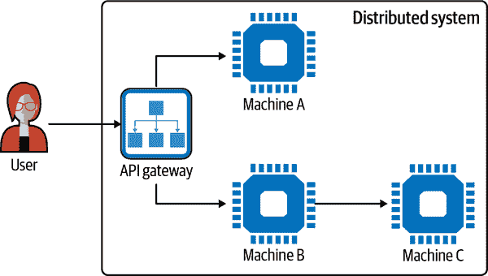
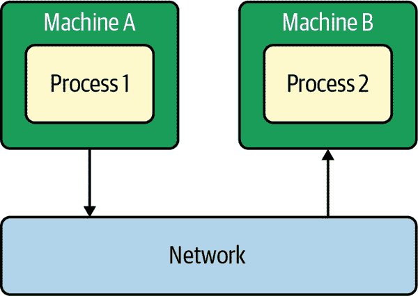
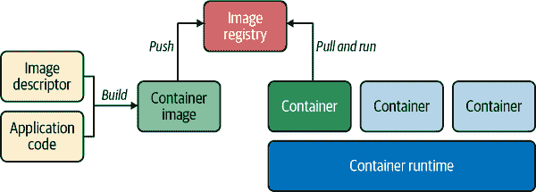

# 第三章：分布式系统的黑暗面

现在您对反应式有了更好的理解，并简要了解了 Quarkus，让我们专注于为什么您想要使用它们，更具体地构建反应式系统。理由源于云，更一般地说，需要构建*更好的*分布式系统。云已经改变了游戏规则。它使得构建分布式系统变得更容易。您可以动态创建虚拟资源并使用现成的服务。然而，“更容易”并不意味着“直截了当”。构建这样的系统是一个巨大的挑战。为什么？因为云是一个分布式系统，而分布式系统是复杂的。我们需要了解我们试图驯服的动物的种类。

# 什么是分布式系统？

有许多关于分布式系统的定义。但让我们从一位名誉教授安德鲁·塔能鲍姆的宽泛定义开始，看看我们能学到什么：

> 分布式系统是一组独立的计算机，对其用户呈现为一个单一的一致系统。

此定义突出了分布式系统的两个重要方面：

+   分布式系统由*独立*的机器组成，这些机器是自主的。它们可以随时启动和停止。这些机器并行操作，并且可以独立失败而不影响整个系统的正常运行时间（至少在理论上是这样）。

+   消费者（用户）不应该意识到系统的结构。它应提供一致的体验。通常情况下，您可以使用由 API 网关提供的 HTTP 服务（Figure 3-1），将请求委托给各种*机器*。对于您作为调用者而言，分布式系统表现为一个单一的一致系统：您只有一个入口点，忽略系统的底层结构。



###### 图 3-1\. 一个 HTTP 服务将调用委托给其他机器/服务的示例

要实现这种一致性水平，这些自主机器必须以某种方式进行协作。这种协作以及由此产生的良好通信需求是分布式系统的核心，但也是它们的主要挑战。但是这个定义并没有解释为什么我们要构建分布式系统。最初，分布式系统是一种变通方法。每台机器的资源太有限了。连接多台机器是扩展整个系统容量的一种聪明方式，使资源对网络中的其他成员可用。如今，动机略有不同。使用一组分布式机器使我们在业务*灵活性*上更有优势，促进了演进，缩短了上市时间，并且从运营角度来看，允许我们更快速地扩展，通过复制提高了弹性，等等。

分布式系统已经从一种权宜之计演变为常态。为什么？我们无法构建一个足够强大且 *同时* 又负担得起的单一机器来处理一个大型公司的所有需求。如果可以的话，我们都会使用这个巨型机器并在其上部署独立的应用程序。但这种分布的必要性根据物理系统边界绘制了新的操作和业务边界。微服务、无服务器架构、面向服务的架构（SOA）、REST 端点、移动应用程序，所有这些都是分布式系统。

这种分布更加强调了系统中所有组件之间合作的需求。当一个应用程序（例如，用 Java 实现）需要本地交互时，它只需使用方法调用。例如，要与暴露 `hello` 方法的 `service` 合作，你使用 `service.hello`。我们保持在同一进程中。调用可以是同步的；不涉及网络 I/O。

然而，分布式系统分散的特性意味着进程间通信，大部分时间都是通过网络进行跨越（图 3-2）。处理 I/O 并穿越网络使得这些交互显著不同。许多中间件试图使分布透明化，但不要误解，完全透明是一个谎言，正如 Jim Waldo 等人在 [“关于分布式计算的一则说明”](https://oreil.ly/iCz3c) 中所解释的那样，它总会以某种方式失败。你需要理解远程通信的独特性质，并认识到它们在构建健壮分布式系统中有多么独特。



###### 图 3-2\. 远程交互通过网络连接离开一个进程空间，进入另一个进程空间

第一个区别在于持续时间。远程调用比本地调用需要花费更多的时间。这段时间高出几个数量级。当一切正常时，从纽约市到洛杉矶的请求发送大约需要 72 毫秒。¹ 而调用本地方法则少于一纳秒。

远程调用同样会离开进程空间，因此我们需要一个交换协议。该协议定义了交换的所有方面，例如谁发起通信，信息如何写入到网络中（序列化和反序列化），消息如何路由到目标等等。

在开发应用程序时，大多数这些选择对你是隐藏的，但在幕后是存在的。我们来看一个你想调用的 REST 端点。你将使用 HTTP 并且很可能使用 JSON 表示来发送数据和解释响应。你的代码相对简单，就像在 示例 3-1 中所看到的。

##### 示例 3-1\. 使用 Java 内置客户端调用 HTTP 服务（*chapter-3/http-client-example/src/main/java/http/Main.java*）

```java
HttpClient client = HttpClient.newHttpClient();
HttpRequest request = HttpRequest.newBuilder()
        .uri(URI.create("https://httpbin.org/anything"))
        .build();

HttpResponse<String> response = client.send(request,
        HttpResponse.BodyHandlers.ofString());

System.out.println(response.body());
```

让我们描述一下您执行它时发生的情况：

1.  您的应用程序创建 HTTP 请求（`request`）。

1.  它与远程服务器建立 HTTP 连接。

1.  它按照协议编写 HTTP 请求。

1.  请求发送到服务器。

1.  服务器解释请求并查找资源。

1.  服务器使用 JSON 表示创建 HTTP 响应资源状态。

1.  它按照协议编写响应。

1.  应用程序接收响应并提取正文（在本例中为`String`）。

中间件（HTTP 服务器和客户端，JSON 映射器等）的角色是使我们开发者可以轻松进行这些交互。在我们之前的例子中，步骤 2 到 8 都隐藏在`send`方法中。但我们需要意识到这些。特别是在今天，随着云计算、分布式系统和分布式通信无处不在，构建非分布式系统的应用程序变得越来越少。一旦您调用远程 Web 服务、打印文档或使用在线协作工具，您就在创建分布式系统。

# 云原生和 Kubernetes 原生应用的新秀

云的作用不可言喻，它是推广分布式系统的一个重要因素。如果您需要新的机器、数据库、API 网关或持久存储，云服务可以实现这些按需计算服务的交付。但请记住，尽管云服务提高了效率，您绝不能忘记在云上运行您的应用程序等同于在别人的机器上运行。无论何处都有用于执行您的应用程序的 CPU、磁盘和内存，尽管云服务提供商负责维护这些系统并以可靠性著称，但硬件设备不在您的控制之下。

云服务提供商提供了出色的基础设施设施，使得运行应用程序变得更加简单。由于动态资源，您可以创建许多应用程序实例，甚至根据当前负载自动调整这个数量。它还提供了故障转移机制，例如在另一个实例崩溃时将请求路由到健康实例。云服务有助于通过使您的服务始终可用、重新启动系统中不健康的部分等方式达到高可用性。这是通向弹性和具有韧性系统的第一步。

话虽如此，你的应用程序能在云中运行并不意味着它会从中受益。你需要定制你的应用程序以高效利用云，并且云的分布式特性是其中很大的一部分。*云原生*是一种构建和运行利用云计算交付模型的应用程序的方法。云原生应用程序应该易于部署在虚拟资源上，通过应用程序实例支持弹性，依赖位置透明性，强制执行容错性等。[十二因素应用程序](https://12factor.net)列出了一些成为*良好的云公民*的特征：

代码库

一个代码库在版本控制中跟踪，多个部署。

依赖关系

明确声明和隔离依赖关系。

配置

将配置存储在环境中。

支持服务

将支持服务视为附加资源。

构建、发布、运行

严格区分构建和运行阶段。

进程

将应用程序作为一个或多个无状态进程执行。

端口绑定

通过端口绑定导出服务。

并发性

通过进程模型扩展。

可处置性

通过快速启动和优雅关闭来最大化鲁棒性。

开发/生产对等性

使开发、分级和生产尽可能相似。

日志

将您的日志视为事件流。

管理进程

将管理/管理任务作为一次性进程运行。

实现这些因素有助于拥抱云原生理念。但实现云原生并不是一件容易的事情。每个因素都伴随着技术挑战和架构约束。

此外，每个云提供商都提供其自己的一套设施和 API。这种异构性使得云原生应用程序无法从一个云提供商迁移到另一个云提供商。很快，由于特定的 API、服务、工具或甚至描述格式，您最终会陷入某种供应商锁定，这可能不是您目前面临的问题，但是拥有移动和结合多个云的可能性可以提高您的敏捷性、可用性和用户体验。混合云应用程序，例如，在多个云上运行，混合私有云和公共云，以减少响应时间并防止全球不可用。

幸运的是，公共云和私有云都倾向于围绕 Kubernetes 收敛，这是一个容器编排平台。Kubernetes 使用*标准*部署和运行时设施来抽象提供商之间的差异。

要使用 Kubernetes，您需要将应用程序打包并在容器中运行。*容器*是一个盒子，您的应用程序将在其中运行。因此，您的应用程序在某种程度上与在其自己的盒子中运行的其他应用程序隔离开来。

要创建容器，您需要一个镜像。*容器镜像*是一个轻量级的、可执行的软件包。当您部署一个容器时，您实际上部署了一个镜像，并且此镜像被实例化以创建容器。

图像包含运行应用所需的一切：代码、运行时、系统库和配置。您可以使用诸如*Dockerfile*之类的工具和描述符来创建容器镜像。正如您在第二章中看到的，Quarkus 提供了无需编写一行代码即可创建镜像的功能。

要分发您的镜像，您将其推送到像[Docker Hub](https://hub.docker.com)这样的镜像注册表。然后，您可以拉取它并最终实例化它以启动您的应用程序（图 3-3）。



###### 图 3-3\. 容器的创建、分发和执行

虽然容器化是一种众所周知的技术，但当您开始拥有数十个容器时，它们的管理变得复杂。Kubernetes 提供了设施来减少这种负担。它实例化容器并监控它们，确保您的应用仍在运行。² 可以想象，这对于实现反应式系统的响应性和弹性特征是非常有用的。

###### 注

尽管 Kubernetes 通过响应性和弹性促进了反应式系统，这并不意味着您不能在 Kubernetes 之外实现反应式系统。这是完全可能的。在本书中，我们使用 Kubernetes 来避免实现部署、复制和故障检测等基础设施特性。

Kubernetes 在底层拉取容器镜像、实例化容器并监控它们。为了实现这一点，Kubernetes 需要访问*节点*以运行这些容器。这些节点的集合形成一个*集群*。将机器视为节点允许我们插入一层抽象。这些机器可以是亚马逊弹性计算云（EC2）实例、数据中心的物理硬件或虚拟化都不重要。Kubernetes 控制这些节点，并决定系统的哪个部分在哪里运行。

一旦 Kubernetes 可以访问您的容器镜像，您可以指示 Kubernetes 实例化镜像，使其成为一个运行中的容器。Kubernetes 决定在哪个节点上执行容器。它甚至可能稍后将其移动以优化资源利用率，这与反应式架构的特性相契合。

就像应用程序需要云原生才能从云中受益一样，它们需要成为 Kubernetes 原生才能从 Kubernetes 中受益。这包括支持 Kubernetes 服务发现、暴露用于监控的健康检查，更重要的是，在容器中高效运行。您将在下一章中看到，这三个特征对于反应式视角来说是至关重要的。几乎可以将任何应用程序封装在容器中。但这可能不是一个好主意。

在容器中运行时，你的应用程序存在于一个共享环境中。多个容器共享来自执行它们的 *主机* 的资源。它们共享 CPU、内存等。如果一个容器过于贪婪，会惩罚其他容器，可能会饿死。当然，你可以使用配额，但在资源限制下贪婪的容器会如何行事？因此，是的，容器提供隔离，并且 *允许* 资源共享。

容器和 Kubernetes 的一个作用是增加部署密度：利用有限的可用资源运行更多应用程序。由于经济效益，部署密度对许多组织变得至关重要。它可以通过减少每月的云账单或在当前内部基础设施上运行更多应用程序来降低成本。

表 3-1 总结了迄今为止关于容器和 Kubernetes 的概念。

表 3-1\. 关于容器和 Kubernetes 的重要概念

| 名称 | 描述 | 关联命令 |
| --- | --- | --- |
| 容器镜像 | 轻量级、可执行的软件包 | `docker build -f my-docker-file -t my-image:version` |
| 容器 | 在其中运行你的应用程序的盒子 | `docker run my-image:version` |
| Pod | Kubernetes 中复制的单位，由一个或多个容器组成 | `kubectl get pods` |
| 部署 | 描述 pod 内容及我们需要的 pod 实例数 | `kubectl get deployments` |
| 服务 | 一个通信通道，委托给一组通过标签选择的 pod | `kubectl get services` |

如果你错过了它，请查看“在 10 分钟内使用 Quarkus 部署 Kubernetes”，我们在其中将一个 Quarkus 服务部署到 Kubernetes！

# 分布式系统的暗面

我们的系统很简单，但即使是这样一个基本系统也能说明分布式系统的艰辛现实。云提供商和 Kubernetes 提供了优秀的基础设施设施，但分布式系统的法则仍然统治着你正在构建的系统。围绕配置和交付的技术复杂性已被分布式系统的本质问题所取代。现代应用程序的规模和复杂性使它们不可否认。

在本章的开头，你看到了对分布式系统的第一个定义。它捕捉到了提供一致体验的协作和通信的需求。计算机科学家和图灵奖获得者[莱斯利·兰波特](http://www.lamport.org)给出了另一个定义，描述了分布式系统的黑暗本质：“分布式系统是一种其中你甚至不知道存在的计算机的故障可以使你自己的计算机无法使用。”

换句话说，故障是不可避免的。它们是分布式系统的固有组成部分。无论你的系统如何构建，它都会失败。作为推论，分布式系统越大，*动态性*（周围服务的波动可用性）越高，失败的机会就越大。

我们可能会遇到哪些故障？有三种类型：

临时故障

发生一次，然后消失，就像临时网络中断

间歇性故障

发生后消失，然后重新出现，就像偶尔会出现的故障，原因不明

永久故障

直到故障组件（无论是软件还是硬件）被修复之前一直存在。

每种故障类型都可能有两种后果。首先，它可能会使应用程序崩溃。我们称这些为*停止故障*。当然，它们是不好的，但我们可以轻松检测并修复系统。其次，故障可能会在随机时间引入不可预测的响应。我们称之为*拜占庭故障*。检测和规避它们要困难得多。

# Kubernetes 世界中的分布式计算谬论

作为开发者，想象和规划所有类型的故障及其后果可能是一项挑战。你如何检测它们？你如何优雅地处理它们？如果任何东西都可能出问题，你如何继续提供一致的体验和服务？构建和维护分布式系统是一个充满陷阱和雷区的复杂主题。由 L. Peter Deutsch 与 Sun Microsystems 的其他人员共同创作的["分布式计算的八大谬论"](https://oreil.ly/0g3lL)列出了分布式系统中的许多错误假设：

1.  网络是可靠的。

1.  延迟为零。

1.  带宽是无限的。

1.  网络是安全的。

1.  拓扑结构不会改变。

1.  只有一个管理员。

1.  传输成本为零。

1.  网络是同质的。

这些谬误是 1997 年发表的，早于云和 Kubernetes 时代。但这些谬误今天仍然相关——甚至更加相关。我们不会讨论所有谬误，而是专注于与云和 Kubernetes 相关的内容：

网络是可靠的

开发者通常假设云或 Kubernetes 上的网络是可靠的。确实，基础设施的角色是处理网络并确保事物正常运行。健康检查、心跳、复制、自动重启——基础设施层面有很多机制。网络会尽力而为，但有时候，坏事情发生了，你需要为此做好准备。数据中心可能会崩溃；系统的部分可能会变得无法访问，等等。³

延迟为零

第二个谬误似乎很明显：网络调用比本地调用慢，并且每次调用的延迟可能会显著变化，我们已经讨论过了。延迟不仅仅限于这个方面；它会因多种原因随时间而变化。

带宽是无限的*并且*网络是同质化的

你可能会达到带宽限制，或者系统的某些部分可能使用比其他部分更快的网络，因为它们运行在同一个*节点*上。估算延迟并不是一件简单的事情。许多容量规划技术和超时计算都基于网络延迟。

拓扑结构不会改变

在云上或 Kubernetes 上，服务、应用程序和容器可以移动。Kubernetes 可以随时将容器从一个节点移动到另一个节点。由于部署新应用程序、更新、重新调度、优化等原因，容器经常移动。移动性是一个巨大的好处，因为它允许优化整个系统，但是与总是移动的服务进行交互可能是具有挑战性的。你可能会与多个实例的服务进行交互，对你来说，它们就像一个服务。某些实例可能离你更近（响应时间更好），而另一些可能因为资源有限而较慢。

有一个管理员

过去几年中，管理系统发生了巨大变化。老派的系统管理流程和维护停机时间变得不那么常见。DevOps 的理念和技术，比如持续交付和持续部署，正在重新定义我们在生产中管理应用程序的方式。开发人员可以在一天中轻松部署小的增量变更。DevOps 工具和站点可靠性工程师（SRE）努力提供几乎恒定的可用性，而持续的更新提供新功能和错误修复。管理角色由 SRE、软件工程师和软件共享。例如，[Kubernetes operators](https://oreil.ly/cX8nN) 是部署在 Kubernetes 上的程序，负责自动安装、更新、监控和修复系统的各个部分。

运输成本为零

认为网络是免费的不仅是错误的，而且是一种经济错误。你必须注意网络调用的成本并寻找优化方法。例如，跨越云区域、传输大量数据或（特别是）与不同的云提供商通信可能很昂贵。

因此，不是那么简单，对吧？当你构建分布式系统时，要考虑所有这些问题，并在你的架构和应用代码中加以考虑。这些只是其中的一些问题。另一个问题是无法达成共识。

一致性

每次读操作都会收到最近的写操作。

可用性

每个请求都会收到响应。

分区容忍性

系统可以继续运行，即使网络丢失（或延迟）了任意数量的消息。

事情会变得更糟吗？哦是的，分布式系统可以非常有创造力地让我们发狂。

# 时间问题：同步通信的缺点

时间经常是一个被误解的问题。当两台计算机进行通信并交换消息时，我们自然会假设这两台机器都是可用和可访问的。我们经常信任它们之间的网络。为什么它不能完全正常运行呢？为什么我们不能像调用本地服务一样调用远程服务呢？

但情况可能并非如此，不考虑这种可能性会导致脆弱性。如果你要交互的机器无法访问会发生什么？你准备好处理这种故障了吗？是否应该传播这个失败？重试吗？

在一个假设的基于微服务的示例中，通常使用同步 HTTP 作为服务之间的主要通信协议。你发送一个请求，并期望从调用的服务获取响应。你的代码是同步的，等待响应后再继续执行。同步调用更容易理解。你按顺序结构化你的代码，一件事做完再做下一件事，依此类推。这导致了*时间耦合*，这是一种较少考虑和常被误解的耦合形式。让我们来说明一下这种耦合及由此引发的不确定性。

在 GitHub 仓库的*chapter-3/quarkus-simple-service* [目录](https://oreil.ly/vZR3j)中，你会找到一个简单的 Hello World Quarkus 应用程序。这个应用程序类似于第二章中构建的应用程序。它包含一个单一的 HTTP 端点，如示例 3-2 所示。

##### 示例 3-2\. JAX-RS 简单服务（*chapter-3/quarkus-simple-service/src/main/java/org/acme/reactive/SimpleService.java*）

```java
package org.acme.reactive;

import javax.ws.rs.GET;
import javax.ws.rs.Path;
import javax.ws.rs.Produces;
import javax.ws.rs.core.MediaType;

@Path("/")
@Produces(MediaType.TEXT_PLAIN)
public class SimpleService {

    @GET
    public String hello() {
        return "hello";
    }
}
```

没有比这更简单的代码了吧？让我们将这个应用程序部署到 Kubernetes 上。确保 minikube 已启动。如果没有，请按照示例 3-3 中的步骤启动它。

##### 示例 3-3\. 启动 minikube

```java
> minikube start
...
> eval $(minikube docker-env) 
```


别忘了将 Docker 套接字连接到 minikube。

通过运行`kubectl get nodes`命令（见示例 3-4）来验证一切是否正常。

##### 示例 3-4\. 获取节点名称和角色

```java
> kubectl get nodes
NAME       STATUS   ROLES                  AGE   VERSION
minikube   Ready    control-plane,master   30s   v1.20.2
```

现在，在*chapter-3/simple-service*目录中导航并运行示例 3-5。

##### 示例 3-5\. 将一个 Quarkus 应用部署到 Kubernetes 上

```java
> mvn verify -Dquarkus.kubernetes.deploy=true
```

等待 pod 处于*就绪*状态，如示例 3-6 中所示。

##### 示例 3-6\. 获取运行中的 pod 列表

```java
> kubectl get pods
NAME                                      READY   STATUS    RESTARTS   AGE
quarkus-simple-service-7f9dd6ddbf-vtdsg   1/1     Running   0          42s
```

然后使用示例 3-7 来暴露服务，获取服务的 URL。

##### 示例 3-7\. 检索服务的 URL

```java
> minikube service quarkus-simple-service --url
🏃  Starting tunnel for service quarkus-simple-service.
|-----------|------------------------|-------------|------------------------|
| NAMESPACE |          NAME          | TARGET PORT |          URL           |
|-----------|------------------------|-------------|------------------------|
| default   | quarkus-simple-service |             | http://127.0.0.1:63905 |
|-----------|------------------------|-------------|------------------------|
http://127.0.0.1:63905
❗  Because you are using a Docker driver on darwin, the terminal needs to be open to
    run it.
```

别忘了端口是随机分配的，所以你需要用以下命令替换端口。

最后，让我们在另一个终端上运行示例 3-8 来调用我们的服务。

##### 示例 3-8\. 调用服务

```java
> curl http://127.0.0.1:63905
hello%
```

到目前为止，一切顺利。但是，这个应用程序包含一个 *机制*，用于模拟分布式系统的失败，以说明同步通信的问题。你可以在 *chapter-3/quarkus-simple-service/src/main/java/org/acme/reactive/fault/FaultInjector.java* 中查看其实现。它基本上是一个 *Quarkus 路由*（一种拦截器），用于监视 HTTP 流量并允许模拟各种故障。它拦截传入的 HTTP 请求和传出的 HTTP 响应，并引入延迟、丢失或应用程序故障。

当我们以同步方式调用我们的服务（期望得到响应，比如使用 `curl` 或浏览器）时，会出现三种类型的失败：

+   调用者与服务之间的请求可能会丢失。这导致服务未被调用。调用者会等待直到超时。这模拟了短暂的网络分区。这种类型的失败可以通过使用 `INBOUND_REQUEST_LOSS` 模式来启用。

+   服务接收到请求但未能正确处理它。它可能返回一个错误的响应，或者根本没有响应。在最好的情况下，调用者会收到失败信息或等待超时。这模拟了被调用服务中断性错误。这种类型的失败可以通过使用 `SERVICE_FAILURE` 模式来启用。

+   服务接收到请求，处理它，并写入响应，但响应在返回途中丢失，或者在响应到达调用者之前连接关闭。服务收到了请求，处理了它，并生成了响应。调用者只是没有收到。正如之前提到的第一种失败类型一样，响应在一个短暂的网络分区中，但发生在服务调用之后。这种类型的失败可以使用 `OUTBOUND_RESPONSE_LOSS` 模式启用。

###### 提示

别忘了更新上一个和下一个命令中的端口，因为 minikube 会随机选择一个端口。

为了说明系统在面对失败时的行为，让我们注入一些请求丢失（示例 3-9）。

##### 示例 3-9\. 配置系统使其丢失 50% 的传入请求

```java
> curl http://127.0.0.1:63905/fault?mode=INBOUND_REQUEST_LOSS
Fault injection enabled: mode=INBOUND_REQUEST_LOSS, ratio=0.5
```

此命令配置 `FaultInjector` 以随机丢失 50% 的传入请求。调用者等待一个永远不会到达的响应，并最终超时。尝试在 示例 3-10 中执行该命令，直到遇到超时。

##### 示例 3-10\. 使用配置的超时调用服务

```java
> curl --max-time 5 http://127.0.0.1:63905/  
hello%
> curl --max-time 5 http://127.0.0.1:63905/
curl: (28) Operation timed out after 5004 milliseconds with 0 bytes received
```


`--max-time 5` 配置了 5 秒的超时时间。同样，别忘了更新端口。

要模拟第二种失败类型，请执行 示例 3-11 中的命令。

##### 示例 3-11\. 配置系统以注入错误响应

```java
> curl http://127.0.0.1:63905/fault?mode=SERVICE_FAILURE
```

现在你有 50% 的机会收到错误响应；参见 示例 3-12。

##### 示例 3-12\. 调用有故障的应用程序

```java
> curl http://127.0.0.1:63905
hello%
> curl http://127.0.0.1:63905
FAULTY RESPONSE!%
```

最后，让我们模拟最后一种类型的故障。执行示例 3-13 中的命令。

##### 示例 3-13\. 配置系统以丢失响应

```java
> curl http://127.0.0.1:63905/fault?mode=OUTBOUND_RESPONSE_LOSS
> curl http://127.0.0.1:63905
curl: (52) Empty reply from server
```

现在，调用方有 50%的概率得不到响应。在响应到达调用方之前连接突然关闭。你得不到有效的 HTTP 响应。

这些示例的目的是说明由同步通信引起的强耦合和不确定性。这种通信类型通常因为简单性而被使用，但它隐藏了交互的分布式特性。然而，它假设一切都正常运行（包括服务和网络）。但事实并非总是如此。作为使用同步通信的调用方，你必须优雅地处理错误响应和无响应。

所以，我们能做什么？我们立即考虑超时和重试。使用`curl`，你可以指定超时（`-max-time`）和重试（`--retry`），如示例 3-14](#invoke-app-3-14)所示。

##### 示例 3-14\. 使用超时和`retry`调用应用

```java
> curl --max-time 5 --retry 100 --retry-all-errors http://127.0.0.1:63905/
curl: (28) Operation timed out after 5003 milliseconds with 0 bytes received
Warning: Transient problem: time-out Will retry in 1 seconds. 100 retries left.
hello%
```

我们有很大的机会在 100 次尝试内到达我们的服务。然而，倒霉和随机数可能会决定另一种方式，甚至 100 次也不足够。请注意，在调用方（你）等待的时间内，这是一个相当糟糕的用户体验。

然而，我们是否确定如果我们遇到超时，服务就没有被调用？也许服务或网络只是慢了。超时的理想持续时间是多少？这取决于许多因素：服务的位置、网络的延迟和服务的负载。也许这个服务不是单个实例，而是有几个，每个都具有不同的特性。

重试甚至更加狡猾。因为你无法确定服务是否已被调用，所以也无法假设它没有。重试可能会多次重新处理相同的请求。但是，只有调用的服务是幂等的情况下，你才能安全地重试。

所以，我们能做什么？理解时间的影响并解耦我们的通信是至关重要的。涉及多个服务的复杂交换不能指望所有参与者和网络在整个交换期间都处于可操作状态。云和 Kubernetes 的动态特性对同步通信的限制产生了压力。糟糕的事情会发生：分区、数据丢失、崩溃⋯⋯

在第四章中，您将看到响应式是如何解决这个问题的。通过使用消息传递、空间和时间解耦，响应式系统不仅更具弹性和韧性，而且提高了整体响应能力。换句话说，响应式系统是正确构建的分布式系统。此外，在第五章中，您将看到响应式提出了哪些方法来拥抱分布式系统的异步特性以及我们如何优雅地开发事件驱动和异步代码。结果不仅是并发和高效的应用程序，还铺平了通往新类别应用程序的道路，如数据流处理、API 网关等等。

# 总结

分布式系统具有挑战性。要构建分布式系统，您需要了解它们的本质，并始终为最坏情况做计划。隐藏分布式系统的本质以追求简单并不起作用。它会导致脆弱的系统。

本章涵盖了以下内容：

+   分布式系统的不稳定性质

+   从权宜之计到常态的分布式系统演变

+   使用云和 Kubernetes 简化分布式系统的构建

+   由网络中断或缓慢引起的分布式通信潜在故障

但我们不会因为失败而止步！是时候反弹了！让我们更深入地了解一下响应式，并看看它是如何解决这些问题的。

¹ 你可以在[当前网络延迟网站](https://oreil.ly/ws4Xd)查看美国主要城市之间的延迟。

² Kubernetes 提供健康检查，不断验证应用程序的状态。此外，[Prometheus](https://prometheus.io) 正成为度量收集的标准框架。

³ 2018 年，AWS US-East-1 发生电力故障事件，导致许多 Amazon 服务中断。

⁴ Kubernetes 可以移动容器以实现更高的部署密度，但也可以被指示将相互作用的应用程序移动到同一节点上以减少响应时间。

⁵ 参见[《重新审视分布式一致性》](https://oreil.ly/qRVeD)，由 Heidi Howard 讨论现代分布式系统中的一致性问题。

⁶ [《对 CAP 定理的观点》](https://oreil.ly/p33qM)，由 Seth Gilbert 和 Nancy A. Lynch 解释了 *未来* 分布式系统中 CAP 定理的技术含义。
