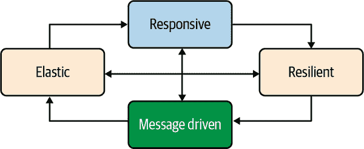

# 第四章 设计响应式系统的原则

在第三章中，我们探讨了分布式系统面临的挑战。现在是时候看看响应式系统能为我们提供什么了。响应式可以被看作是构建分布式系统的一套原则，一种检查清单，以确保在架构和构建系统时没有忽略任何主要已知的关注点。这些原则专注于以下内容：

响应性

在面对故障或负载高峰时处理请求的能力

效率

能够在资源较少的情况下完成更多任务

本章我们将讨论响应式系统推广的原则。

# 响应式系统 101

2013 年，一群分布式系统专家聚集在一起，撰写了第一版“响应式宣言”。在这份白皮书中，他们汇集了构建分布式系统和云应用的经验。虽然在 2013 年，云并不像今天这样具体，但短暂资源的动态创建已经是一个众所周知的机制。

“响应式宣言”将*响应式系统*定义为具有四个特性的分布式系统：

响应性

能够及时处理请求

韧性

能够优雅地处理故障

弹性

能够根据负载和资源进行动态扩展和收缩

消息驱动

在系统中组件之间使用异步基于消息的通信

这四个特性在图 4-1 中有所体现。



###### 图 4-1 响应式系统特性

如果你第一次看到这幅图片，可能会被所有箭头弄得一头雾水。它看起来像是一个精心策划的营销活动。但事实并非如此，让我们解释一下为什么在构建云原生和 Kubernetes 原生应用程序时，这些支柱理念非常合理。让我们从图的底部开始。

响应式系统并不试图简化分布式系统，而是接受其异步性质。它们使用*异步消息传递*来建立组件之间的连接。异步消息传递确保松耦合、隔离和位置透明性。在响应式系统中，交互依赖于发送到抽象目的地的消息。这些消息不仅携带数据，还携带失败信息。异步消息传递还提高了资源利用率。采用非阻塞通信（我们稍后在本章中详细讨论）允许空闲组件几乎不消耗 CPU 和内存。异步消息传递实现了弹性和韧性，如在图 4-1 中所示的两个底部箭头。

*弹性* 意味着系统可以自适应或其部分可以自适应以处理波动的负载。通过观察组件之间流动的消息，系统可以确定哪些部分达到了其极限，并创建更多实例或将消息路由到其他地方。云基础设施可以在运行时快速创建这些实例。但弹性不仅仅是扩展；它还涉及缩减。系统可以决定缩减未充分使用的部分以节省资源。在运行时，系统会自我调整，始终满足当前的需求，避免瓶颈、溢出和过度分配资源。正如你所想象的，弹性需要可观察性、复制和路由功能。可观察性在 第十三章 中有所涵盖。总的来说，最后两者由基础设施如 Kubernetes 或云提供者提供。

*韧性* 意味着优雅地处理故障。正如 第三章 所解释的，分布式系统中的故障是不可避免的。与其隐藏故障，响应式系统将故障视为一等公民。系统应能够处理和响应这些故障。故障被隔离在每个组件内部，使各组件相互隔离。这种隔离确保系统的各部分可以失败和恢复，而不会危及整个系统。例如，通过复制组件（弹性），即使某些元素失败，系统也可以继续处理传入的消息。韧性的实现由应用程序（需要意识到故障、隔离它们并在可能时优雅地处理它们）和基础设施（监控系统并重新启动失败的组件）共同分享。

最后一个特性是响应式系统的整体目的：*响应性*。你的系统需要保持响应能力——即使在波动的负载（弹性）和面对故障（韧性）时也要能够及时响应。依赖消息传递可以实现这些特性，以及更多，例如通过监控系统中的消息并在必要时施加反压力来实现流量控制。

简而言之，响应式系统正是我们想要构建的东西：能够有效处理不确定性、故障和负载的分布式系统。它们的特性完美符合云原生和 Kubernetes 原生应用程序的要求。但不要误解；构建响应式系统仍然是在构建分布式系统。这是具有挑战性的。然而，通过遵循这些原则，得到的系统将更加响应、更加健壮和更加高效。本书的其余部分详细说明了如何使用 Quarkus 和消息传递技术轻松实现这样的系统。

# 命令与事件

现在我们已经涵盖了许多基础原则，您可能会感到困惑。在第一章中，我们说反应性与事件驱动有关，但在前一节中，我们明确提到了异步消息传递。这意味着相同的吗？并非完全如此。

但首先，我们需要讨论命令和事件之间的区别。分布式系统设计虽然复杂，但命令和事件的概念是基础的。几乎所有个体组件之间的互动都涉及其中之一。

## 命令

每个系统都会发布命令。*命令* 是用户希望执行的操作。大多数基于 HTTP 的 API 传递命令：客户端要求执行某项操作。重要的是要理解该操作尚未发生。它可能会在未来发生，也可能不会；它可能成功完成，也可能失败。通常，命令被发送到特定的接收者，并将结果发送回客户端。

以我们在第三章使用的简单 HTTP 应用为例。您发出了一个简单的 HTTP 请求。正如我们所说，那是一个命令。应用程序接收到该命令，处理它，并产生一个结果。

## 事件

*事件* 是成功完成的操作。事件代表了一个*事实*，即发生的事情：一个按键、一个失败、一个订单，或者对组织或系统至关重要的任何事情。事件可能是由命令执行产生的结果。

让我们回到之前的 HTTP 请求示例。一旦响应被写入，它就成为一个事件。我们已经看到了一个 HTTP 请求及其响应。该事件可以被写入日志或广播给感兴趣的各方，以便他们了解发生了什么。

事件是不可变的。您无法删除事件。诚然，您无法改变过去。如果要反驳先前发送的事实，您需要触发另一个事件，使该事实失效。只有通过另一个确立当前知识的事实，才能使携带的事实变得无关紧要。

## 消息

但是，如何发布这些事件呢？有许多方法。像 Apache Kafka 或 Apache ActiveMQ 这样的解决方案现在很流行（我们在第十一章中涵盖了两者）。它们充当生产者和消费者之间的代理。本质上，我们的事件被写入*主题*或*队列*中。要写入这些事件，应用程序向代理发送消息，指定特定的目标（队列或主题）。

*消息* 是描述事件及其相关细节的独立数据结构，比如谁发出的、发出时间以及可能的唯一标识符。通常最好将事件本身保持业务中心化，使用额外的元数据处理技术细节。

另一方面，为了消费事件，您可以订阅包含您感兴趣的事件的队列或主题，并接收消息。您可以解封事件，并获取相关的元数据（例如事件发生的时间、地点等）。事件的处理可能会导致发布其他事件（再次封装为消息并发送到已知目的地）或执行命令。

代理和消息也可以传递命令。在这种情况下，消息包含要执行的动作描述，另一个消息（可能是多个消息）将携带必要的结果。

## 命令与事件：一个例子

让我们来看一个例子，突出命令和事件之间的区别。想象一个电子商务店铺，就像图 4-2 所示的那样。用户选择一组产品并完成订单（处理支付、获取送货日期等）。


###### 图 4-2\. 电子商务店铺简化架构

用户通过命令（例如使用 HTTP 请求）向商店服务发送希望接收的商品。在传统应用程序中，一旦`ShopService`接收到命令，它将调用`OrderService`并调用一个`order`方法，传递用户名、商品列表（购物篮）等信息。调用`order`方法属于命令。这使得`ShopService`依赖于`OrderService`，并降低了组件的自主性：`ShopService`无法在没有`OrderService`的情况下运行。我们正在创建一个分布式单体，一个分布式应用程序，一旦其中一个部分失败就会崩溃。^(1)

如果我们不使用命令而是发布一个事件，让我们看看其中的区别。一旦用户完成订单，应用程序仍然会向`ShopService`发送一个命令。但是，这次，`ShopService`会将该命令*转换*成一个事件：*已下订单*。该事件包含用户、购物篮等信息。事件是写入日志中的事实，或者被包装成消息发送到代理。

在另一方面，`OrderService`通过读取存储事件的位置来观察*已下订单*事件。当`ShopService`发出该事件时，它接收并可以处理它。

使用这种架构，`ShopService`不依赖于`OrderService`。此外，`OrderService`也不依赖于`ShopService`，并且它会处理任何观察到的事件，无论是谁发出的。例如，移动应用程序在用户从手机验证订单时可以发出相同的事件。

多个组件可以消费事件（图 4-3）。例如，除了`OrderService`，`StatisticsService`也跟踪最常订购的商品。它消费相同的事件，而无需修改`ShopService`以接收它们。

一个观察事件的组件可以从中派生新的事件。例如，`StatisticsService`可以分析订单并计算推荐。这些推荐可以被视为另一个事实，并作为事件进行通信。`ShopService`可以观察这些事件并处理它们以影响商品选择。然而，`StatisticsService`和`ShopService`是彼此独立的。知识是累积的，并且通过接收新事件并从中派生新事实（就像`StatisticsService`所做的那样）来实现。

如 图 4-3 所示，我们可以使用*消息队列*来传输我们的事件。这些事件被包装成消息，发送到已知的目的地（`orders` 和 `recommendations`）。`OrderService` 和 `StatisticsService` 独立地消费和处理这些消息。


###### 图 4-3\. 带有事件和消息队列的电子商务店铺架构

对于这些目的地来说，持久化事件作为一个有序序列是很重要的。通过保持这个顺序，系统可以回溯并重新处理事件。这样的*重放*机制，在 Kafka 世界中很受欢迎，有多种好处。例如，在灾难后通过重新处理所有存储的事件可以重新启动一个干净的状态。然后，如果我们从统计服务改变推荐算法，它将能够重新累积所有知识并派生新的推荐。

虽然在这个例子中事件的发射听起来很明确，但情况并非总是如此。例如，事件可以从数据库写入中创建。^(2)

命令和事件是大多数交互的基础。虽然我们主要使用命令，但事件带来了显著的好处。事件是事实。事件讲述一个故事，你系统的故事，描述你系统演变的叙述。在反应系统中，事件被包装成消息，并且这些消息被发送到目的地，通过消息代理如 AMQP 或 Kafka（图 4-4）。这种方法解决了分布式系统中出现的两个重要的架构问题。首先，它自然地处理现实世界的异步性。其次，它在不依赖强耦合的情况下将服务绑定在一起。在系统的边缘，这种方法大多数时候使用命令，通常依赖于 HTTP。


###### 图 4-4\. 反应系统概述

反应系统中这种异步消息传递的特性形成了连接组织。它不仅赋予了构成系统的应用更多的自治和独立性，还能实现弹性和弹性。你可能会想知道如何做到这一点，在下一节中你将找到我们的开头回应。

# 目的地和空间解耦

响应式应用程序形成响应式系统，它们使用消息进行通信。它们订阅目的地并接收其他组件发送到这些目的地的消息。这些消息可以携带命令或事件，正如前一节所述，事件提供了一些有趣的好处。这些目的地不绑定到特定的组件或实例。它们是虚拟的。组件只需知道目的地的名称（通常是业务相关的，如 `orders`），而不需要知道是谁在生产或消费。这使得位置透明性成为可能。

如果您正在使用 Kubernetes，您可能已经考虑到位置透明性由系统自动管理。实际上，您可以使用 Kubernetes *服务* 来实现位置透明性。您只需使用一个端点来委派给一组选定的 *pod*。但这种位置透明性在某种程度上是有限的，并且通常与 HTTP 或请求/回复协议相关联。其他环境可以使用诸如 [HashiCorp Consul](https://consul.io) 或 [Netflix Eureka](https://oreil.ly/H9Ygn) 等服务发现基础设施。

作为发送者，通过发送消息到目的地，您可以忽略具体是谁会接收该消息。您不知道当前是否有人可用，或者多个组件或实例是否在等待您的消息。这些消费者的数量可以在运行时发生变化；可以创建、移动或销毁更多实例，并部署新的组件。但作为发送者，您不需要知道这些。您只需使用指定的目的地。让我们通过前一节的示例来说明这种 *可寻址性* 的优势。`ShopService` 发出 `order placed` 事件，这些事件被包含在发送到 `orders` 目的地的消息中（参见 Figure 4-3）。在安静期间，可能只有一个 `OrderService` 实例正在运行。如果订单不多，为什么要费心多部署呢？我们甚至可以想象没有任何实例，在收到订单时实例化一个。无服务器平台提供了这种 *从零扩展* 的能力。然而，随着时间的推移，您的商店会吸引更多客户，单个实例可能不够用。由于位置透明性，我们可以启动其他 `OrderService` 实例来分担负载（参见 Figure 4-5）。`ShopService` 不会修改，也不会关心这种新的拓扑结构。


###### 图 4-5\. 通过消息传递提供的弹性

消费者之间的负载共享方式对于发送者来说也是无关紧要的。可以是循环轮询、基于负载的选择，或者更聪明的方式。当负载恢复正常时，系统可以减少实例数量并节省资源。请注意，这种弹性对于无状态服务非常有效。对于有状态服务，可能更为困难，因为实例可能需要共享状态。不过，已存在解决方案（尽管存在一些注意事项），如[Kubernetes `StatefulSet`](https://oreil.ly/kVRID)或者[in-memory data grid](https://oreil.ly/wNUIQ)，用于协调同一服务实例之间的状态。消息传递还能实现复制。遵循相同原则，我们可以影子化活跃的`OrderService`实例，并在主实例失败时接管（参见图 4-6）。这种方法避免了服务中断。此类故障转移可能还需要共享状态。


###### 图 4-6\. 使用消息传递提供的弹性

使用消息传递，我们的系统不仅变得异步，还变得具有弹性和弹性。在架构设计系统时，您会列出实现所需通信模式的目标。通常情况下，每种事件类型使用一个目标，但并非一定如此。但是，务必尽量避免每个组件实例使用一个目标。这会增加发送方和接收方之间的耦合，丧失优势。它还会降低可扩展性。最后，保持目标集合稳定非常重要。更改目标会打破使用它的组件或迫使您处理重定向问题。

# 时间解耦

透明定位并非唯一的好处。异步消息传递还能实现时间解耦。

现代消息骨干，例如[AMQP 1.0](https://amqp.org)，[Apache Kafka](https://kafka.apache.org/)，甚至 Java 消息服务（JMS），都能实现时间解耦。使用这些事件代理，如果没有消费者，事件不会丢失。事件将被存储并稍后传递。每个代理都有自己的方式。例如，AMQP 1.0 使用持久消息和持久订阅者来确保消息传递。Kafka 将记录存储在持久、容错、有序的日志中。只要它们保持存储在主题中，就可以检索记录。

如果我们的`ShopService`作为事件发出最终订单，它不需要知道`OrderService`是否可用。它知道订单最终会被处理。例如，当`ShopService`发出事件时，如果没有`OrderService`实例可用，订单不会丢失。当实例准备好时，它会接收待处理订单并进行处理。然后通过电子邮件异步通知用户。

当然，消息代理必须是可用和可达的。大多数消息代理都具备复制能力，以防止不可用问题和消息丢失。

###### 注意

将事件存储在事件日志中正变得越来越常见。这样有序且追加式的结构代表了系统的完整历史。每当状态变化时，系统都将新状态追加到日志中。

时间解耦增加了我们组件的独立性。时间解耦，结合异步消息传递启用的其他特性，实现了我们组件之间的高度独立性，并将耦合降至最低。

# 非阻塞输入/输出的作用

此时，你可能会想知道使用 Kafka 或 AMQP 的应用与响应式系统之间的区别是什么。消息传递是响应式系统的核心，大多数系统依赖某种消息代理。消息传递使得系统具备了弹性和响应能力。它促进了空间和时间的解耦，使我们的系统更加健壮。

但是响应式系统不仅仅是在交换消息。发送和接收消息必须高效完成。为了实现这一点，响应式系统推广使用非阻塞 I/O。

## 阻塞网络 I/O、线程和并发

要理解非阻塞 I/O 的好处，我们需要了解阻塞 I/O 的工作原理。让我们使用客户端/服务器交互来说明。当客户端向服务器发送请求时，服务器处理它并发送回响应。例如，HTTP 遵循这一原则。为了实现这一点，客户端和服务器在交互开始之前都需要建立连接。我们不会深入讨论[七层模型](https://oreil.ly/kcTBH)及其涉及的协议栈；你可以在网上找到许多关于这个主题的文章。

###### 注意

本节的示例可以直接从你的 IDE 中运行。使用*chapter-4/non-blocking-io/src/main/java/org/acme/client/EchoClient.java*来调用已启动的服务器。请确保避免并发运行多个服务器，因为它们都使用相同的端口（9999）。

为了建立客户端和服务器之间的连接，我们使用`sockets`，如示例 4-1 所示。

##### 示例 4-1。使用阻塞 I/O 的单线程回显服务器(*chapter-4/non-blocking-io/src/main/java/org/acme/blocking/BlockingEchoServer.java*)

```java
int port = 9999;

// Create a server socket
try (ServerSocket server = new ServerSocket(port)) {
    while (true) {

        // Wait for the next connection from a client
        Socket client = server.accept();

        PrintWriter response = new PrintWriter(client.getOutputStream(), true);
        BufferedReader request = new BufferedReader(
                new InputStreamReader(client.getInputStream()));

        String line;
        while ((line = request.readLine()) != null) {
            System.out.println("Server received message from client: " + line);
            // Echo the request
            response.println(line);

            // Add a way to stop the application.
            if ("done".equalsIgnoreCase(line)) {
                break;
            }
        }
        client.close();
    }
}
```

客户端和服务器必须将自己绑定到一个套接字来建立连接。服务器监听它的套接字，等待客户端连接。一旦建立，客户端和服务器都可以在与该连接绑定的套接字上写入和读取数据。

传统上，因为它更简单，应用程序是使用同步开发模式开发的。这种开发模式依次执行指令，一个接一个。因此，当这些应用程序通过网络进行交互时，它们期望继续使用同步开发模式进行 I/O。这种模型使用同步通信并阻塞执行，直到操作完成。在示例 4-1 中，我们等待连接并同步处理它。我们使用同步 API 进行读写。这样做更简单，但会导致使用阻塞 I/O。

使用阻塞 I/O 时，当客户端向服务器发送请求时，处理该连接的套接字以及从中读取数据的相应线程将被阻塞，直到出现一些可读数据。字节会在网络缓冲区中累积，直到所有数据都被读取并准备好进行处理。在操作完成之前，服务器除了等待之外什么也做不了。

这种模型的结果是我们无法在单个线程中服务多个连接。当服务器接收到连接时，它会使用该线程读取请求、处理请求并写入响应。该线程会被阻塞，直到响应的最后一个字节被写入线路。单个客户端连接会阻塞服务器！效率不高，对吧？

使用这种方法执行并发请求的唯一方法是使用多个线程。我们需要为每个客户端连接分配一个新线程。为了处理更多客户端，您需要使用更多线程并在不同的*工作*线程上处理每个请求；参见示例 4-2。

##### 示例 4-2\. 使用阻塞 I/O 的多线程服务器背后的原理

```java
while (listening) {
    accept a connection;
    create a worker thread to process the client request;
}
```

要实现这一原则，我们需要一个线程池（*工作池*）。当客户端连接时，我们接受连接并将处理分派到单独的线程中。因此，服务器线程仍然可以接受其他连接，如示例 4-3 所示。

##### 示例 4-3\. 使用阻塞 I/O 的多线程回显服务器（*chapter-4/non-blocking-io/src/main/java/org/acme/blocking/BlockingWithWorkerEchoServer.java*）

```java
int port = 9999;
ExecutorService executors = Executors.newFixedThreadPool(10); 

// Create a server socket try (ServerSocket server = new ServerSocket(port)) {
    while (true) {

        // Wait for the next connection from a client
        Socket client = server.accept();

        executors.submit(() -> {                                    
            try {
                PrintWriter response =
                new PrintWriter(client.getOutputStream(), true);
                BufferedReader request = new BufferedReader(
                        new InputStreamReader(client.getInputStream()));

                String line;
                while ((line = request.readLine()) != null) {
                    System.out.println(Thread.currentThread().getName() +
                            " - Server received message from client: " + line);
                    // Echo the request
                    response.println(line);

                    // Add a way to stop the application.
                    if ("done".equalsIgnoreCase(line)) {
                        break;
                    }
                }
                client.close();
            } catch (Exception e) {
                System.err.println("Couldn't serve I/O: " + e.toString());

            }
        });
    }
}
```


创建一个工作线程池来处理请求。


将请求的处理分派到线程池中的一个线程。其余代码保持不变。

这是传统 Java 框架（如 Jakarta EE 或 Spring）默认使用的模型。即使这些框架可能在内部使用非阻塞 I/O，它们仍然使用*工作*线程来处理请求。但这种方法有许多缺点，包括：

+   每个线程都需要分配给它的内存栈。随着连接数量的增加，产生多个线程并在它们之间进行切换将消耗内存和 CPU 周期。

+   在任何给定时间点，可能有多个线程在等待客户端请求。这是资源的巨大浪费。

+   你的并发性（在给定时间内能处理的请求数量——如前面示例中的 10）受到可以创建的线程数的限制。

在公共云上，阻塞 I/O 方法会增加你的月度账单；在私有云上，它会减少部署密度。因此，如果需要处理多个连接或实现涉及大量 I/O 的应用程序，则此方法并不理想。在分布式系统领域，这种情况经常发生。幸运的是，有一个替代方案。

## 非阻塞 I/O 是如何工作的？

替代方案是 *非阻塞 I/O*。其差异从名称中就能看出来。与等待传输完成不同，调用者不会被阻塞，可以继续其处理过程。这种魔法发生在操作系统中。使用非阻塞 I/O，操作系统将请求排队。系统在未来处理实际的 I/O。当 I/O 完成并且响应准备好时，会发生一个 *continuation*，通常实现为回调函数，调用者接收结果。

要更好地理解其优势并看看这些 continuation 是如何工作的，我们需要深入了解一下：非阻塞 I/O 是如何实现的？我们已经提到了一个队列。系统将 I/O 操作入队并立即返回，因此调用者在等待 I/O 操作完成时不会被阻塞。当响应返回时，系统将结果存储在一个结构中。当调用者需要结果时，它询问系统是否完成操作（示例 4-4）。

##### 示例 4-4\. 使用非阻塞 I/O 的回显服务器（*chapter-4/non-blocking-io/src/main/java/org/acme/nio/NonBlockingServer.java*）

```java
InetSocketAddress address = new InetSocketAddress("localhost", 9999);
Selector selector = Selector.open();
ServerSocketChannel channel = ServerSocketChannel.open();
channel.configureBlocking(false);

channel.socket().bind(address);
// Server socket supports only ACCEPT
channel.register(selector, SelectionKey.OP_ACCEPT);

while (true) {
    int available = selector.select(); // wait for events
    if (available == 0) {
        continue;  // Nothing ready yet.
    }

    // We have the request ready to be processed.
    Set<SelectionKey> keys = selector.selectedKeys();
    Iterator<SelectionKey> iterator = keys.iterator();
    while (iterator.hasNext()) {
        SelectionKey key = iterator.next();
        if (key.isAcceptable()) {
            // --  New connection --
            SocketChannel client = channel.accept();
            client.configureBlocking(false);
            client.register(selector, SelectionKey.OP_READ);
            System.out.println("Client connection accepted: "
                + client.getLocalAddress());
        } else if (key.isReadable()) {
            // --  A client sent data ready to be read and we can write --
            SocketChannel client = (SocketChannel) key.channel();
            // Read the data assuming the size is sufficient for reading.
            ByteBuffer payload = ByteBuffer.allocate(256);
            int size = client.read(payload);
            if (size == -1 ) { // Handle disconnection
                System.out.println("Disconnection from "
                    + client.getRemoteAddress());
                channel.close();
                key.cancel();
            } else {
                String result = new String(payload.array(),
                    StandardCharsets.UTF_8).trim();
                System.out.println("Received message: " + result);
                if (result.equals("done")) {
                    client.close();
                }
                payload.rewind(); // Echo
                client.write(payload);
            }
        }
        // Be sure not to handle it twice.
        iterator.remove();
    }
}
```

非阻塞 I/O 引入了一些新概念：

+   我们不使用 `InputStream` 或 `OutputStream`（它们天生是阻塞的），而是使用 `Buffer`，这是一个临时存储。

+   `Channel` 可以被视为开放连接的端点。

+   `Selector` 是 Java 中非阻塞 I/O 的基石。

`Selector` 管理多个通道，可以是服务器通道或客户端通道。当您使用非阻塞 I/O 时，您会创建 `Selector`。每当处理新通道时，您都会将此通道注册到选择器中，并指定您感兴趣的事件（接受、准备读取、准备写入）。

然后，你的代码使用单个线程轮询 `Selector`，查看通道是否准备就绪。当通道准备好读取或写入时，可以开始读取和写入。我们根本不需要为每个通道都创建一个线程，一个单独的线程可以处理多个通道。

选择器是底层操作系统提供的非阻塞 I/O 实现的抽象。根据操作系统的不同，有多种方法可供选择。

首先，`select`是在上世纪 80 年代实现的。它支持注册 1,024 个套接字。在 80 年代这当然足够了，但现在不再是这样了。

`poll`是 1997 年引入的`select`的替代品。最大的区别是，`poll`不再限制套接字的数量。但是，与`select`一样，系统仅告诉您有多少通道准备就绪，而不是哪些通道准备就绪。您需要迭代通道集合以检查哪些通道已准备就绪。当通道较少时，这不是一个大问题。一旦通道数量超过数十万，迭代时间就会相当可观。

然后，`epoll`在 2002 年出现在 Linux 内核 2.5.44 中。`Kqueue`在 2000 年出现在 FreeBSD 中，而`/dev/poll`在同一时间左右出现在 Solaris 中。这些机制返回准备处理的通道集合——不再需要迭代处理每个通道！最后，Windows 系统提供了 IOCP，这是`select`的优化实现。

重要的是要记住，无论操作系统如何实现，使用非阻塞 I/O，您只需要一个线程来处理多个请求。这个模型比阻塞 I/O 更高效，因为您不需要创建线程来处理并发请求。消除这些额外的线程使您的应用程序在内存消耗（每个线程约为 1 MB）方面更高效，并避免因上下文切换而浪费 CPU 周期（每次切换 1-2 微秒）^(4)

响应式系统建议使用非阻塞 I/O 来接收和发送消息。因此，您的应用程序可以使用更少的资源处理更多的消息。另一个优点是，空闲应用程序几乎不会消耗内存或 CPU。您不必预先保留资源。

## 反应器模式和事件循环

非阻塞 I/O 使我们有可能使用单个线程处理多个并发请求或消息。我们如何处理这些并发请求？在使用非阻塞 I/O 时如何构建我们的代码结构？前一节中给出的示例的性能不佳；我们很快就会看到，使用这种模型实现 REST API 将是一场噩梦。此外，我们希望避免使用工作线程，因为这将抛弃非阻塞 I/O 的优势。我们需要不同的东西：反应器模式。

*反应器模式*，如图 4-7 所示，允许将 I/O 事件与*事件处理程序*关联起来。*反应器*，这个机制的基石，当接收到预期的事件时调用事件处理程序。

反应器模式的目的是避免为每个消息、请求和连接创建线程。该模式从多个通道接收事件，并将它们顺序地分配给相应的事件处理程序。


###### 图 4-7。反应器模式

反应器模式的实现使用了一个 *事件循环*（图 4-7）。它是一个线程，迭代遍历通道集，并在数据准备就绪时按顺序、以单线程方式调用相关的事件处理程序。

当您将非阻塞 I/O 与反应器模式相结合时，您会将代码组织为一组事件处理程序。这种方法与反应式代码非常契合，因为它暴露了事件的概念，这是反应式的本质。

反应器模式有两个变种：

+   *multireactor* 模式使用多个事件循环（通常每个 CPU 内核一个或两个），这增加了应用程序的并发性。多反应器模式的实现，如 Eclipse Vert.x，以单线程方式调用事件处理程序，以避免死锁或状态可见性问题。

+   *proactor* 模式可以看作是反应器模式的异步版本。长时间运行的事件处理程序在完成时调用续集。这种机制允许混合非阻塞和阻塞 I/O（图 4-8）。


###### 图 4-8\. proactor 模式

您可以通过将其执行分派到单独的线程来集成非阻塞事件处理程序以及阻塞事件处理程序，当不可避免地需要时。当它们的执行完成时，proactor 模式将调用续集。正如您将在第六章中看到的，这是 Quarkus 使用的模式。

# 反应式应用程序的解剖

在过去几年中，许多框架已经涌现，提供反应式应用程序支持。它们的目标是简化反应式应用程序的实现。它们通过提供更高级的原语和 API 来处理事件和抽象非阻塞 I/O 来实现这一目标。

实际上，您可能已经意识到了，使用非阻塞 I/O 并不是那么简单。将其与反应器模式（或变体）结合使用可能会很复杂。幸运的是，随着框架的出现，库和工具包正在承担繁重的工作。Netty 是一个异步事件驱动的网络应用程序框架，利用非阻塞 I/O 构建高并发应用程序。它是处理 Java 世界中非阻塞 I/O 的最常用库。但是 Netty 可能会很具有挑战性。示例 4-5 使用 Netty 实现了 *echo* TCP 服务器。

##### 示例 4-5\. 使用 Netty 的回显服务器（*第四章 / 非阻塞 I/O / src / main / java / org / acme / netty / NettyEchoServer.java*）

```java
public static void main(String[] args) throws Exception {
    new NettyServer(9999).run();
}

private final int port;

public NettyServer(int port) {
    this.port = port;
}

public void run() throws Exception {
    // NioEventLoopGroup is a multithreaded event loop that handles I/O operation.
    // The first one, often called 'boss', accepts an incoming connection.
    // The second one, often called 'worker', handles the traffic of the accepted
    // connection once the boss accepts the connection and registers the
    // accepted connection to the worker.
    EventLoopGroup bossGroup = new NioEventLoopGroup();

    EventLoopGroup workerGroup = new NioEventLoopGroup();
    try {
        // ServerBootstrap is a helper class that sets up a server.
        ServerBootstrap b = new ServerBootstrap();
        b.group(bossGroup, workerGroup)
                // the NioServerSocketChannel class is used to instantiate a
                // new Channel to accept incoming connections.
                .channel(NioServerSocketChannel.class)
                .childHandler(new ChannelInitializer<SocketChannel>() {
                    // This handler is called for each accepted channel and
                    // allows customizing the processing. In this case, we
                    // just append the echo handler.
                    @Override
                    public void initChannel(SocketChannel ch) {
                        ch.pipeline().addLast(new EchoServerHandler());
                    }
                });

        // Bind and start to accept incoming connections.
        ChannelFuture f = b.bind(port).sync();

        // Wait until the server socket is closed.
        f.channel().closeFuture().sync();
    } finally {
        workerGroup.shutdownGracefully();
        bossGroup.shutdownGracefully();
    }
}

private static class EchoServerHandler extends ChannelInboundHandlerAdapter {

    @Override
    public void channelRead(ChannelHandlerContext ctx, Object msg) {
        // Write the received object, and flush
        ctx.writeAndFlush(msg);
    }
}
```

基于 Netty 的 Vert.x 工具包提供了构建反应式应用程序所需的更高级功能，例如 HTTP 客户端和服务器、消息客户端等。通常，使用 Vert.x 的相同 *echo* TCP 服务器看起来像示例 4-6。

##### 示例 4-6\. 使用 Vert.x 的回显服务器（*第四章 / 非阻塞 I/O / src / main / java / org / acme / vertx / VertxEchoServer.java*）

```java
Vertx vertx = Vertx.vertx();
// Create a TCP server
vertx.createNetServer()
        // Invoke the given function for each connection
        .connectHandler(socket -> {
            // Just write the content back
            socket.handler(buffer -> socket.write(buffer));
        })
        .listen(9999);
```

大多数提供响应能力的 Java 框架基于 Netty 或 Vert.x。如图 4-9 所示，它们都遵循相同类型的蓝图。


###### 图 4-9\. 响应式框架的常见架构

底层是非阻塞 I/O。通常，框架使用 Netty 或 Vert.x。这一层处理客户端连接、出站请求和响应写入。换句话说，它管理 I/O 部分。大多数情况下，这一层实现反应器模式（或其变体），因此提供基于事件循环的模型。

然后，在第二层，你有本身的*响应式框架*。这一层的作用是提供易于使用的高级 API。你可以使用这些 API 编写应用程序代码。与处理非阻塞 I/O 通道不同，这一层提供高级对象，如 HTTP 请求、响应、Kafka 消息等。要简单得多！

最后，在顶层，你有你的应用程序。由于响应式框架的帮助，你的代码不需要涉及非阻塞 I/O 概念。它可以专注于接收事件并处理它们。你的代码只是一组事件处理器。它可以使用响应式框架提供的功能与其他服务或中间件交互。

但是有一个问题。来自你代码中的事件处理器是使用*事件循环*线程（即 I/O 线程）调用的。如果你的代码阻塞了这个线程，那么没有其他并发事件可以被处理。这在响应性和并发性方面将是一场灾难。这种架构的后果显而易见：你的代码必须是非阻塞的。它绝不能阻塞 I/O 线程，因为它们是稀有的，并且用于处理多个并发请求。为了实现这一点，你可以将某些事件的处理卸载到工作线程中（使用 proactor 模式）。虽然这可能会丢弃非阻塞 I/O 的一些好处，但有时这是最明智的选择（图 4-10）。然而，我们不应滥用这一点，因为这将丢弃响应式的优势并使应用程序变慢。在工作线程上处理事件所需的多次上下文切换会影响响应时间。


###### 图 4-10\. 在工作线程上运行一些事件处理器

典型地，我们在第二章和第三章中的应用程序依赖于这样的机制。

另一种可能性是仅依赖非阻塞代码，依赖响应式框架提供的异步 API。这些 API 将是非阻塞的，如果业务逻辑涉及 I/O，则使用非阻塞 I/O。每当一个*事件处理程序*执行异步操作时，将注册另一个处理程序（继续执行），并且当预期的事件到达时，事件循环将调用它。因此，处理被分成更小的异步运行处理程序。这种模式是最高效的，并完全接纳了反应式背后的概念。

# 总结

反应式系统是关于构建更好的分布式系统。它们的目标不是隐藏分布式系统的本质，而是相反地接受它。

在本章中，您学到了以下内容：

+   反应式系统的四大支柱（异步消息传递、弹性、弹性和响应能力）

+   异步消息传递如何实现弹性和弹性，并增加每个单独组件的自治性

+   在分布式系统中命令和事件的角色

+   非阻塞 I/O 如何提升反应式应用程序中的资源利用率

但是这最后一点有一个显著的缺点，因为我们需要编写非阻塞代码。多么巧合！下一章正好讲述这个！

^(1) [“不要构建分布式单体”](https://oreil.ly/CtY3x) 由 Ben Christensen 是一个关于分布式单体的有趣演讲，讲述了为什么应该避免它们。

^(2) 这种模式称为[变更数据捕获](https://oreil.ly/Umhs9)。像[Debezium](https://debezium.io)这样的框架在使用数据库时是反应式系统的关键组成部分，因为这些事件会在不影响应用程序代码的情况下发出。

^(3) 我们正在指的是传统的 Spring Framework。响应式 Spring 基于非阻塞 I/O。

^(4) [“测量 Linux 线程上的上下文切换和内存开销”](https://oreil.ly/hv2Uy) 由 Eli Bendersky 提供了有关 Linux 线程成本的有趣数据。
