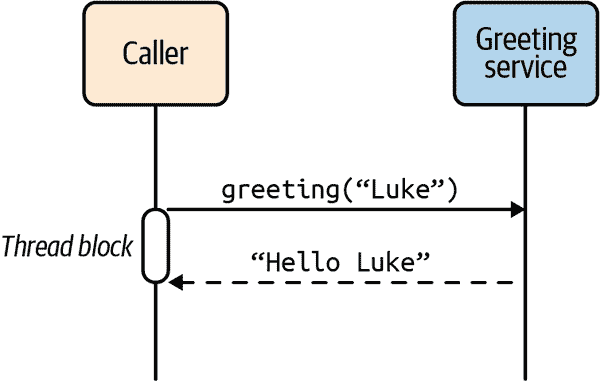
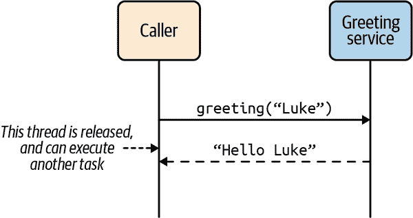
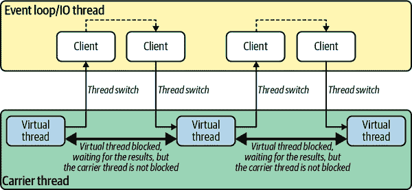
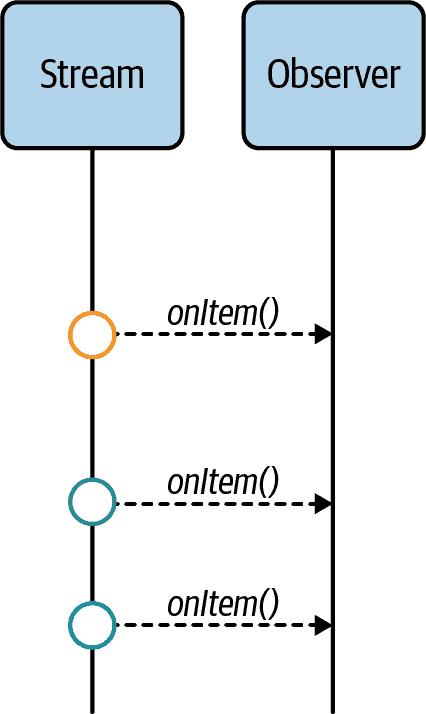
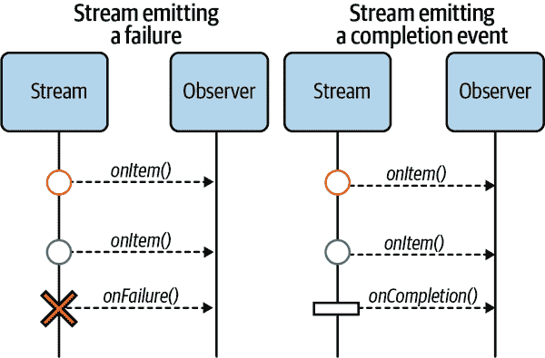
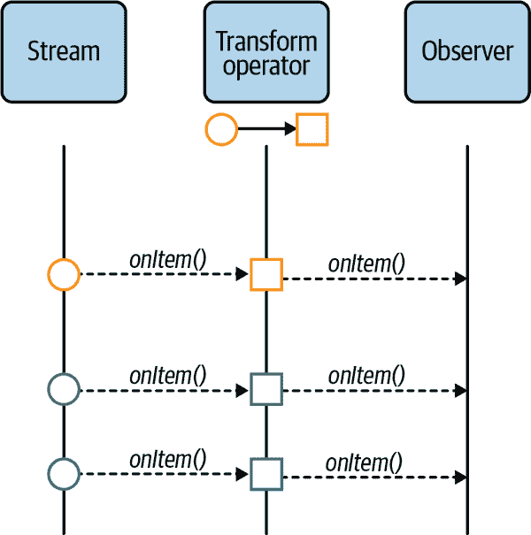
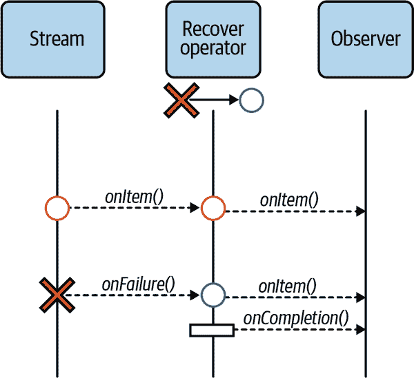
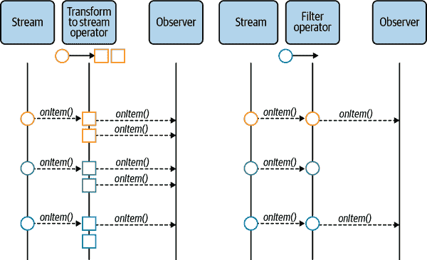
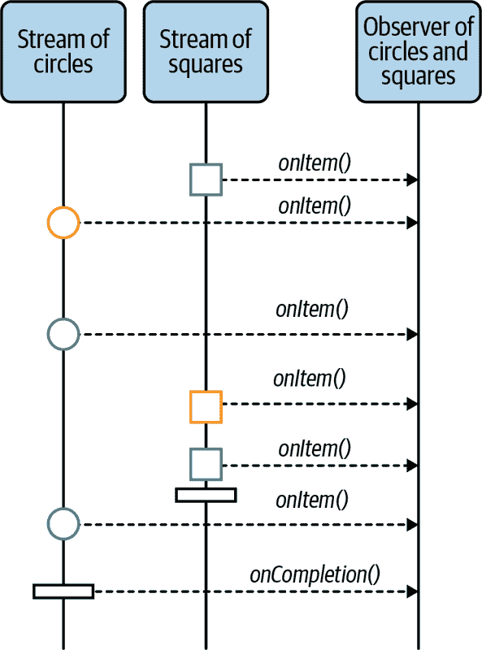
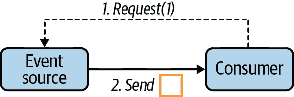

# 第五章：响应式编程：驯服异步性

在前一章中，我们介绍了响应式系统及其如何优雅地处理分布式系统的挑战。但永远不要忘记，在 IT 世界中没有免费的午餐。响应式系统的特征之一是使用非阻塞 I/O。非阻塞 I/O 改进了响应式应用的并发性、响应性和资源利用率。要充分利用非阻塞 I/O 的优势，必须以非阻塞方式设计和开发代码，这是一个并不那么容易的挑战。

本章探讨了编写非阻塞和异步 Java 代码的方法，例如回调和响应式编程。我们还涵盖了流控制和响应式流，这是现代响应式应用的重要部分。

# 异步代码与模式

非阻塞如何导致异步代码？回想一下上一章的非阻塞 I/O 设计。它允许使用少量线程处理并发网络交互。这种特定的架构减少了内存消耗，同时也减少了 CPU 使用率。因此，应用代码由其中一个 I/O 线程执行，资源稀缺。如果你的代码无意中阻塞了其中一个线程，将降低应用程序的并发性，并增加响应时间，因为可用于处理请求的线程更少。在最坏的情况下，所有 I/O 线程都被阻塞，应用程序无法处理请求。换句话说，非阻塞 I/O 的好处会消失。

让我们通过一个例子来说明这一点。想象一个`greeting`服务，它以一个名字作为参数，并生成一个问候消息。在同步模型中，你会像在示例 5-1 中展示的那样调用该服务。

##### 示例 5-1\. 同步代码示例

```java
String greetings = service.greeting("Luke");
System.out.println(greetings);
```

你调用服务，同步获取结果，并在下一行使用它。

现在，假设`greeting`服务是一个远程服务。你仍然可以同步调用它，但在这种情况下，你将阻塞线程，直到接收到响应，就像图 5-1 中所示。



###### 图 5-1\. 同步调用示意图

如果你的代码运行在 I/O 线程上，你会阻塞该线程。因此，服务在等待响应时无法处理任何其他请求。阻塞 I/O 线程会丢弃非阻塞 I/O 的所有优势。

我们可以做什么？很简单：我们不能阻塞线程。我们调用方法，它立即返回，而不是等待响应。但是，这种方法有一个小问题：你如何获取这个响应？你需要传递一些延续，在接收到响应时调用，就像在示例 5-2 中展示的那样。

##### 示例 5-2\. 异步代码示例

```java
service.greeting("Luke", greeting -> {
    System.out.println(greeting);
});
```

在这段代码片段中，我们传递了一个使用*回调*实现的延续，即收到结果后调用的函数。它很好地包含了此代码的事件驱动特性：`在结果上，调用该函数`。通过这种异步模型，我们释放了 I/O 线程。当接收到响应时，它将用该响应调用函数并继续执行。在此期间，该 I/O 线程可以用来处理更多的请求（图 5-2）。



###### 图 5-2\. 异步调用

让我们深入看一下前面的代码片段，并通过使用老式的`System.out`语句添加一些跟踪（示例 5-3）。

##### 示例 5-3\. 异步代码和排序

```java
System.out.println("Before");
service.greeting("Luke", greeting -> {
    System.out.println(greeting);
});
System.out.println("After");
```

这个程序的输出会是什么？肯定会先打印`Before`，但问候消息和`After`呢？哪个会先打印？`After`很有可能会先打印，因为调用`greeting`服务至少需要几毫秒（记住，它是一个远程服务）。这意味着使用异步代码时，下一行通常在*延续*之前执行。

在实践中意味着什么？让我们想象一下，你想调用`greeting`服务两次，一次是为 Luke，一次是为 Leia；参见示例 5-4。

##### 示例 5-4\. 两次调用异步方法

```java
service.greeting("Leia", greeting -> {
    System.out.println("Leia: " + greeting);
});
service.greeting("Luke", greeting -> {
    System.out.println("Luke: " + greeting);
});
```

在这段代码中，我们无法预料哪条消息会首先出现。这取决于许多因素，如延迟、速度和`greeting`服务的实例数量。然而，两次调用都是并发运行的，这是一个吸引人的好处。

如果你想要或需要严格的顺序（例如，先为 Leia 调用服务，然后再为 Luke 调用），我们需要组合异步调用（示例 5-5）。

##### 示例 5-5\. 顺序组合模式

```java
service.greeting("Leia", greeting1 -> {
    System.out.println("Leia: " + greeting1);
    service.greeting("Luke", greeting2 -> {
        System.out.println("Luke: " + greeting2);
    });
});
```

使用这段代码，我们首先使用`Leia`调用服务，当我们收到响应后，再使用`Luke`调用服务。调用不再并发运行，但至少我们知道顺序。我们称这种模式为*顺序组合*。正如你可以想象的那样，这是相当常见的。

让我们继续我们的调查，使用另一种有用的组合类型：*并行组合*。这次我们想同时执行这些调用，但我们需要传递一个在两次调用都完成时调用的延续函数（示例 5-6）。

##### 示例 5-6\. 简化的并行组合模式

```java
String resultForLeia = null;
String resultForLuke = null;
BiConsumer<String, String> continuation = ...;

service.greeting("Leia", greeting -> {
    resultForLeia = greeting;
    if (resultForLuke != null) {
        continuation.accept(resultForLeia, resultForLuke);
    }
});
service.greeting("Luke", greeting -> {
    resultForLuke = greeting;
    if (resultForLeia != null) {
        continuation.accept(resultForLeia, resultForLuke);
    }
    });
});
```

开始变得有些复杂，这段代码并不完全正确，因为如果两个回调同时被调用，你可能会遇到竞态条件。我们需要存储结果，检查它们是否非空，并调用延续函数。

我们稍微忘记了另一个方面：失败。这不是因为它是一个异步 API 就不会发生失败。你不能再使用 `try/catch` 块了，因为失败也可能是异步的；参见 示例 5-7。

##### 示例 5-7\. 这个 `try`/`catch` 能正常工作吗？

```java
try {
    service.greeting("Luke", greeting -> {
        System.out.println(greeting);
    });
} catch (Exception e) {
    // does not handle the exception thrown by the remote service
}
```

`catch` 块只能捕获同步异常。如果服务异步产生失败，例如无法生成问候消息，这个 `try/catch` 就毫无用处。为了处理失败，我们需要一个适当的结构。我们可以想象两种*简单*的方式：

+   使用封装了结果和失败的异步结果结构。

+   对于失败，有第二个回调。

对于第一种方法，你需要类似于 示例 5-8 的东西。

##### 示例 5-8\. 使用封装了结果和失败的异步结果。

```java
service.greeting("Luke", greeting -> {
    if (greeting.failed()) {
        System.out.println("D'oh! " + greeting.failure().getMessage());
    } else {
        System.out.println(greeting.result());
    }
});
```

`greeting` 不再是一个 `String`，而是一个封装了操作结果的类型。¹ 您需要检查操作是失败还是成功，并据此采取行动。您可以很快想象到这将如何影响我们之前的组合示例。在这个层次上，这不是挑战，而是一场噩梦！

第二种方法使用了两个回调函数：第一个在操作成功时调用，第二个在操作失败时调用（示例 5-9）。

##### 示例 5-9\. 对于每个结果使用不同的延续

```java
service.greeting("Luke",
        greeting -> {
            System.out.println(greeting);
        },
        failure -> {
            System.out.println("D'oh! " + failure.getMessage());
        }
);
```

这种方法清楚地区分了这两种情况，但同时也使得组合变得更加困难（示例 5-10）。

##### 示例 5-10\. 使用多个延续和组合动作

```java
service.greeting("Leia",
        greeting1 -> {
            System.out.println(greeting1);
            service.greeting("Luke",
                    greeting2 -> System.out.println(greeting2),
                    failure2 -> System.out.println("D'oh! " + failure2.getMessage())
            );
        },
        failure1 -> {
            System.out.println("D'oh! " + failure1.getMessage());
        }
);
```

不简单吧？不过，这第二种方法有一个优点。如果我们设想一个接受多个名称的 `greeting` 服务，它非常适合处理顺序响应（示例 5-11）。

##### 示例 5-11\. 单个操作的多个结果

```java
service.greeting(Arrays.asList("Leia", "Luke"),
        greeting -> {    // Called once for Leia, and once for Luke
            System.out.println(greeting);
        },
        failure -> {
            System.out.println("D'oh! " + failure.getMessage());
        }
);
```

这个例子开始展示一种新的结构：数据流。你将在本书中看到更多这样的内容。这些流可以是应用程序内部的，也可以是来自消息代理的消息传递。在本章中，我们只考虑与响应式应用程序内部相关的流。我们将在第 11 章中介绍如何将这些流连接到各种消息代理。

在 Java 中，为了使用回调表达您的延续，我们经常使用 Java 8 Lambdas。它们在语言中很好地集成了，但我们也看到了这种方法的局限性。回调不太容易组合。因此，我们需要一个更高级别的构造。任何经验丰富的开发人员都会说：未来！

# 使用 Futures

*Future* 是一个稍后解析值的占位符。它是异步的；你不知道未来何时获取这个值。只是*稍后*。当值被设置时，future 允许对其进行*反应*，例如转换值、实现副作用等等。

它如何帮助我们的异步代码关注？在 Java 中，`CompletableFuture`或`CompletionStage`，关联的接口，可以表示异步操作的结果。您的 API 返回一个`CompletionStage`对象，当操作完成时获取结果。返回`CompletionStage`对象的方法会立即返回，因此不会阻塞调用线程，可以附加后续操作到返回的`CompletionStage`上；参见 Example 5-12。

##### Example 5-12\. `CompletionStage`示例 (*chapter-5/reactive-programming-examples/src/main/java/org/acme/future/Futures.java*)

```java
CompletionStage<String> future = service.greeting("Luke");
```

###### 注意

此节的完整示例位于*chapter-5/reactive-programming-examples/src/main/java/org/acme/future/Futures.java*中。

继续可以分成一组*阶段*来处理、消耗和转换结果，如 Example 5-13 所示。

##### Example 5-13\. 使用`CompletionStage`进行链式操作 (*chapter-5/reactive-programming-examples/src/main/java/org/acme/future/Futures.java*)

```java
service.greeting("Luke")
        .thenApply(response -> response.toUpperCase())
        .thenAccept(greeting -> System.out.println(greeting));
```

Futures 还简化了顺序组合的实现。使用`CompletionStage` API，您可以使用`thenCompose`来调用第二个操作（如 Example 5-14 中所示）。

##### Example 5-14\. 使用`CompletionStage`进行顺序组合 (*chapter-5/reactive-programming-examples/src/main/java/org/acme/future/Futures.java*)

```java
service.greeting("Luke")
    .thenCompose(greetingForLuke -> {
        return service.greeting("Leia")
                .thenApply(greetingForLeia ->
                        Tuple2.of(greetingForLuke, greetingForLeia)
                );
    })
    .thenAccept(tuple ->
            System.out.println(tuple.getItem1() + " " + tuple.getItem2())
    );
```

`allOf`方法允许实现并行组合；参见 Example 5-15。

##### Example 5-15\. 使用`CompletableFuture`进行并行组合 (*chapter-5/reactive-programming-examples/src/main/java/org/acme/future/Futures.java*)

```java
CompletableFuture<String> luke = service.greeting("Luke").toCompletableFuture();
CompletableFuture<String> leia = service.greeting("Leia").toCompletableFuture();

CompletableFuture.allOf(luke, leia)
        .thenAccept(ignored -> {
            System.out.println(luke.join() + " " + leia.join());
        });
```

Futures 使得组合异步操作比回调函数更加简单。此外，futures 封装了结果和失败情况。在`CompletionStage`中，特定的方法处理失败和恢复，正如你在 Example 5-16 中看到的那样。

##### Example 5-16\. 使用`CompletionStage` API 从失败中恢复 (*chapter-5/reactive-programming-examples/src/main/java/org/acme/future/Futures.java*)

```java
service.greeting("Leia")
        .exceptionally(exception -> "Hello");
```

当使用`CompletionStage`时，我们开始看到*管道*的创建：一系列处理事件和异步结果的操作。

你可能想知道，缺少了什么？ Futures 似乎完成了所有任务。但是还缺少一项：流。 Futures 无法很好地处理数据流。它们可用于返回单个值的操作，但无法处理像 Example 5-11 中返回序列的函数。

# Project Loom：虚拟线程和载体线程

如果你关注 Java 相关的新闻，可能已经听说过 [Project Loom](https://oreil.ly/vuLzu)。Loom 在 Java 中引入了 *虚拟线程* 的概念。与常规线程不同，虚拟线程轻量级。一个常规操作系统线程可以执行许多虚拟线程，甚至可以达到百万级。Loom（JVM）管理这些虚拟线程的调度，而操作系统管理载体线程的调度。

其一好处是，你可以在虚拟线程中执行阻塞代码；它不会阻塞载体线程。当虚拟线程执行阻塞调用（如 I/O 调用）时，管理虚拟线程的 Loom 调度器会将该虚拟线程挂起，并运行另一个虚拟线程。因此，载体线程不会被阻塞，可以用来执行另一个虚拟线程。这听起来不错，对吧？

换句话说，你可以使用同步语法编写阻塞代码，而无需关注续行。Loom 为你处理！更棒的是：由于虚拟线程轻量级，你不再需要线程池；可以随时创建新线程。

然而，在撰写本文时，Loom 项目仍在孵化中。² 由于某些并发或阻塞结构尚未得到支持，你可能会意外地阻塞载体线程，而这可能是灾难性的。

不过，为了给出一些想法，让我们看看如何在 Loom 的世界中使用我们的 `greeting` 服务。首先，`greeting` 服务的实现可能是阻塞的，并使用阻塞 I/O 与远程服务进行交互。如果调用在虚拟线程上执行，则不会阻塞载体线程，载体线程可以执行另一个虚拟线程。Loom 将阻塞 I/O 调用替换为非阻塞 I/O，并将虚拟线程挂起，直到接收到响应。当响应可用时，挂起的虚拟线程可以继续执行并处理结果。从开发者的角度来看，这一切都是同步的，但在底层并非如此；参见 Example 5-17。

##### 示例 5-17\. 创建一个虚拟线程

```java
Thread.startVirtualThread(() -> {
    // We are running on a virtual thread.
    // The service may use blocking I/O, the virtual thread would be parked.
    String response = service.greeting("Luke");
    // Once the response is received, the virtual thread can continue its execution.
    // The carrier thread has not been blocked.
    System.out.println(response);
});
```

如你所见，这是纯粹的同步代码。因此，顺序组合非常简单（参见 Example 5-18）。

##### 示例 5-18\. 使用 Loom 进行顺序组合

```java
Thread.startVirtualThread(() -> {
    String response1 = service.greeting("Luke");
    String response2 = service.greeting("Leia");
    System.out.println("Luke: " + response1);
    System.out.println("Leia: " + response2);
});
```

这与传统应用程序中使用的方式没有什么不同。不要忘记，虚拟线程会挂起并多次恢复。但是，载体线程不会。

失败管理可以使用 `try/catch`，因为再次使用同步代码。如果服务调用失败，则作为常规异常抛出（参见 Example 5-19）。

##### 示例 5-19\. 使用 Loom 进行异常处理

```java
Thread.startVirtualThread(() -> {
    try {
        String response = service.greeting("Luke");
        System.out.println("Luke: " + response);
    } catch (Exception e) {
        System.out.println("Failed");
    }
});
```

不幸的是，Loom 并没有为并行组合提供任何特定的构造。你需要像对待 `CompletableFuture` 一样使用相同的方法，如 例子 5-20 所示。

##### 例子 5-20\. 使用 Loom 进行并行组合

```java
ExecutorService executor = Executors.newUnboundedVirtualThreadExecutor();
CompletableFuture<String> future1 = executor.submitTask(()
    -> service.greeting("Luke"));
CompletableFuture<String> future2 = executor.submitTask(()
    -> service.greeting("Leia"));

Thread.startVirtualThread(() -> {
    CompletableFuture.allOf(future1, future2).thenAccept(v -> {
        System.out.println("Luke: " + future1.join());
        System.out.println("Leia: " + future2.join());
    });
});
```

听起来像魔法，对吧？但是，你看到了；有个小问题……

当您编写同步代码且不阻塞载体线程时，I/O 仍然发生在 I/O 线程上。载体线程不是 I/O 线程（参见 图 5-3）。因此，即使经过优化，多次线程切换也不是免费的。



###### 图 5-3\. 在幕后发生的线程切换

此外，诱惑创建大量虚拟线程可能会导致复杂的执行。即使虚拟线程很轻量级，将它们的堆栈存储在内存中可能会导致意外的内存消耗。就像使用许多线程的任何软件一样，它们可能难以理解和调优。话虽如此，Loom 是有前途的。这是否使得响应式变得无意义呢？恰恰相反。Loom 仅解决了开发模型，而不是响应式系统背后的架构概念。此外，同步模型看起来很有吸引力，但并不适用于每种情况，特别是当你需要分组事件或实现基于流的逻辑时。这就是我们下一节要讨论的内容：响应式编程。

# 响应式编程

首先，什么是 *响应式编程*？一个常见的定义是：

> 响应式编程结合了函数式编程、观察者模式和可迭代模式。
> 
> [ReactiveX 网站](http://reactivex.io)

我们从未发现那个定义有帮助——太多模式了，很难清楚地表达响应式编程到底是什么。让我们来做一个更简单的定义：“响应式编程是关于使用异步流进行编程。”

就是这样。响应式编程是关于流，特别是观察它们。它将这一理念推向极限：一切皆为流。这些流可以看作是一个管道，*事件*在其中流动。我们观察流动的事件——比如项目、失败、完成、取消——并实现副作用（参见 图 5-4）。



###### 图 5-4\. 响应式编程是关于观察流的

响应式编程在某种程度上是观察者模式的一个特化，你观察一个对象（流）并作出反应。由于其异步性质，你不知道事件何时会被看到。然而，响应式编程超越了这一点。它提供了一个工具箱来组合流和处理事件。

## 流

使用响应式编程时，一切——是的，*一切*——都是项目的流。股票市场、用户点击、按键、步骤、节拍……所有这些都是流，并且很容易理解：它们是单个事件的序列。因此，流携带这些事件的每次发生，观察者可以做出反应。

但是响应式编程也考虑异步操作，如 HTTP 请求、RPC 方法调用和数据库插入或查询作为流。因此，一个流不需要携带多个项目；它可以包含一个单一的项目，甚至可能没有！这有点难以想象，但它确实很强大。

使用响应式编程时，你会围绕流结构化你的代码，并构建转换链，也称为*管道*。事件从*上游*源流向*下游*订阅者，经过每个操作符并进行转换、处理、过滤等。每个操作符观察上游并生成一个新的流。但在这个链中有一个重要的点不容忽视。你需要一个最终的*订阅者*订阅最后的流，并触发整个计算。当这个订阅发生时，最终观察者的直接上游订阅其自身的上游，依次类推，直到达到根源。

让我们回到流的概念。正如我们所提到的，我们将流仅视为响应式应用程序内部的内容。这些流是按时间顺序排列的事件序列。顺序很重要。你按照它们发出的顺序观察它们。

一个流可以发出三种类型的事件（图 5-5）：

项目

类型取决于流；它可以是一个步骤、一个点击或来自远程服务的响应。

失败

表示发生了不好的事情，不会再发出更多项目。

完成

表示没有更多项目要发出。



###### 图 5-5\. 流可以发出三种类型的事件：项目、失败和完成。

项目是事件中最频繁的类型。作为观察者，每当流中传输新项目时，你都会收到通知。你可以对其做出反应、转换它、实施副作用等等。

失败是一个错误信号。它表明发生了*可怕*的事情，并且观察的流无法从中恢复。如果未能正确处理，失败将是一个终端事件，在失败后不会再发出更多项目。你可能会想，为什么我们需要处理失败？因为流是异步的，如果某些事情打断了项目的来源，你应该意识到，并且不再等待额外的项目，因为它们不会到来。至于其他异步开发模型，你无法使用`try/catch`块，因此你需要观察失败并对其做出反应。例如，你可以记录错误或使用回退项目。

最终，只有在观察有界流时才会发出完成事件，因为无界流永远不会终止。该事件表示流的结束；源（上游）不会再发送任何项目。

每当这些事件在观察的流中传递时，作为观察者的你会收到通知。你会附加处理每个事件的函数，如示例 5-21 所示。

##### 示例 5-21\. 订阅流以接收事件（*chapter-5/reactive-programming-examples/src/main/java/org/acme/reactive/StreamsExample.java*）

```java
stream
        .subscribe().with(
            item -> System.out.println("Received an item: " + item),
            failure -> System.out.println("Oh no! Received a failure: " + failure),
            () -> System.out.println("Received the completion signal")
);
```

要观察流，你需要*订阅*它。这是响应式编程中的一个关键概念，因为流默认是惰性的。订阅表示你对事件的兴趣。没有订阅：

+   你不会收到这些项目

+   你不会告诉流它需要操作

第二点很重要。这意味着一般情况下，如果没有人订阅流，流将不会执行任何操作。这可能看起来很奇怪，但可以帮助你节省资源，并且只在一切准备就绪并且确实需要事件时才开始计算。

## 操作符

尽管响应式编程是关于流的，但如果没有一个工具箱来操作这些流，它将毫无用处。响应式编程库提供无数的操作符，让你可以创建、组合、过滤和转换流发出的对象。如图 5-6（#image:rp-stream-transform）所示，一个流可以作为另一个流的输入。



###### 图 5-6\. 转换操作符示例

重要的是要理解，操作符会返回新的流。操作符观察先前的流（称为`upstream`）并通过结合它们的逻辑和接收到的事件创建一个新的流。例如，来自图 5-6（#image:rp-stream-transform）的`transform`操作符对每个接收到的项目应用一个函数^（3）并将结果发送给它的*下游*订阅者（示例 5-22，#reactive-programming::transform）。

##### 示例 5-22\. 转换项目（*chapter-5/reactive-programming-examples/src/main/java/org/acme/reactive/StreamsExample.java*）

```java
stream
        .onItem().transform(circle -> toSquare(circle))
        .subscribe().with(
            item -> System.out.println("Received a square: " + item),
            failure -> System.out.println("Oh no! Received a failure: " + failure),
            () -> System.out.println("Received the completion signal")
);
```

如图 5-7（#image-rp-stream-recover）和示例 5-23（#reactive-programming::recover）所示，操作符也可以处理故障；例如，进行恢复或重试。



###### 图 5-7\. 从故障中恢复

##### 示例 5-23\. 从故障中恢复（*chapter-5/reactive-programming-examples/src/main/java/org/acme/reactive/StreamsExample.java*）

```java
stream
        .onFailure().recoverWithItem(failure -> getFallbackForFailure(failure))
        .subscribe().with(
            item -> System.out.println("Received a square: " + item),
            failure -> System.out.println("Oh no! Received a failure: " + failure),
            () -> System.out.println("Received the completion signal")
);
```

你可能会想知道为什么`recover`操作符在恢复后会发出完成事件，如图 5-7 所示。当操作符接收到失败事件时，它知道源不会再发出任何项目，因为失败是终端的。因此，在发出*fallback*项目后，操作符会发出完成事件。对于下游订阅者来说，就像失败没有发生过，流顺利完成了。

操作符不仅限于同步或单输入单输出类型的转换。操作符可以将单个项目转换为流，或者反过来，丢弃项目，如图 5-8 所示。



###### 图 5-8\. 操作符发出多个项目或丢弃某些项目的示例

此外，操作符可以观察多个上游，将它们合并，例如在图 5-9 中所示，并在示例 5-24 中演示。



###### 图 5-9\. 合并多个流

##### 示例 5-24\. 合并多个流（*chapter-5/reactive-programming-examples/src/main/java/org/acme/reactive/StreamsExample.java*）

```java
Multi.createBy().merging().streams(circles, squares)
        .subscribe().with(
        item -> System.out.println("Received a square or circle: " + item),
        failure -> System.out.println("Oh no! Received a failure: " + failure),
        () -> System.out.println("Received the completion signal")
);
```

###### 注意

在上面的示例中，请注意观察者接收到完成事件的时间点。合并操作符在发送完成事件之前会等待所有合并的流都完成，因为此时不会再发出任何项目。这说明了操作符的协调作用。

## 响应式编程库

Java 拥有许多响应式编程库。在本书中，我们使用的是 SmallRye Mutiny，这是集成在 Quarkus 中的响应式编程库。我们将在第七章深入了解 Mutiny。Project Reactor 和 RxJava 是两个流行的替代方案，提出了类似的概念。

响应式编程不局限于 Java。[RX-JS](https://oreil.ly/pF21o) 是 JavaScript 中的一个响应式编程库，经常与 Angular 一起使用。[RxPY](https://oreil.ly/tlGl1) 和 [RxGo](https://oreil.ly/Mg4Rj) 分别为 Python 和 Go 应用程序提供了相同类型的构造。

# 响应式流和流量控制的需求

使用数据流作为主要构建块并非没有问题。其中一个主要问题是需要流量控制。让我们想象一个快速的生产者和一个慢速的消费者。生产者每 10 毫秒发送一个事件，而下游消费者每秒只能消费一个。运行示例 5-25 中的代码，你会看到它的结局：很糟糕。

##### 示例 5-25\. 回压失败示例（*chapter-5/reactive-programming-examples/src/main/java/org/acme/streams/BackPressureExample.java*）

```java
// Ticks is a stream emitting an item periodically (every 10 ms)
Multi<Long> ticks = Multi.createFrom().ticks().every(Duration.ofMillis(10))
        .emitOn(Infrastructure.getDefaultExecutor());

ticks
    .onItem().transform(BackPressureExample::canOnlyConsumeOneItemPerSecond)
    .subscribe().with(
        item -> System.out.println("Got item: " + item),
        failure -> System.out.println("Got failure: " + failure)
);
```

如果你运行那段代码，你会看到订阅者收到`MissingBackPressureFailure`，表明下游无法跟上（见示例 5-26）。

##### 示例 5-26\. 订阅者收到`BackPressureFailure`

```java
Got item: 0
Got failure: io.smallrye.mutiny.subscription.BackPressureFailure: Could not
emit tick 16 due to lack of requests
```

###### 注

在示例 5-25 中，你可能会对`emitOn`感到疑惑。这个操作符控制何时使用线程来发出事件。⁴ 当涉及多个线程时，需要反压力，因为在单个线程中，阻塞线程会阻塞源。

那么，我们可以怎么处理这种情况呢？

## 缓冲项目

第一个自然的解决方案是使用缓冲区。消费者可以缓冲事件，这样就不会失败（见图 5-10）。


###### 图 5-10\. 缓冲以避免淹没下游消费者

缓冲区允许处理小的颠簸，但它们不是长期解决方案。如果你更新你的代码以使用缓冲区，就像示例 5-27 中那样，消费者可以处理更多事件，但最终会失败。

##### 示例 5-27\. 使用缓冲区处理溢出（*chapter-5/reactive-programming-examples/src/main/java/org/acme/streams/BufferingExample.java*）

```java
Multi<Long> ticks = Multi.createFrom().ticks().every(Duration.ofMillis(10))
    .onOverflow().buffer(250)
    .emitOn(Infrastructure.getDefaultExecutor());

ticks
    .onItem().transform(BufferingExample::canOnlyConsumeOneItemPerSecond)
    .subscribe().with(
        item -> System.out.println("Got item: " + item),
        failure -> System.out.println("Got failure: " + failure)
);
```

这里是输出：

```java
Got item: 0
Got item: 1
Got item: 2
Got failure: io.smallrye.mutiny.subscription.BackPressureFailure:
Buffer is full due to lack of downstream consumption
```

你可以想象增加缓冲区的大小，但很难预测最佳值。这些缓冲区是应用程序本地的，因此使用大缓冲区也会增加内存消耗并降低资源利用效率。更不用说无界缓冲区是个糟糕的主意，因为可能会耗尽内存。

## 丢弃项目

另一种解决方案是丢弃项目。我们可以丢弃最新接收到的项目或最旧的项目；参见示例 5-28。

##### 示例 5-28\. 通过丢弃项目来处理溢出（*chapter-5/reactive-programming-examples/src/main/java/org/acme/streams/DropExample.java*）

```java
Multi<Long> ticks = Multi.createFrom().ticks().every(Duration.ofMillis(10))
        .onOverflow().drop(x -> System.out.println("Dropping item " + x))
        .emitOn(Infrastructure.getDefaultExecutor());

ticks
        .onItem().transform(DropExample::canOnlyConsumeOneItemPerSecond)
        .transform().byTakingFirstItems(10)
        .subscribe().with(
            item -> System.out.println("Got item: " + item),
            failure -> System.out.println("Got failure: " + failure)
);
```

这里是输出：

```java
// ....
Dropping item 997
Dropping item 998
Dropping item 999
Dropping item 1000
Dropping item 1001
Dropping item 1002
Dropping item 1003
Got item: 9
```

丢弃项目提供了一个可持续的解决方案，但我们正在失去项目！正如我们在前面的输出中看到的那样，我们可能会丢弃大部分项目。在许多情况下，这是不可接受的。

我们需要另一个解决方案，一个可以调整整体速度以满足管道最慢元素的反压力协议。

## 什么是反压力？

在力学中，反压是控制液体通过管道流动的一种方法，导致压力降低。这种控制可以使用减压器或弯头。如果你是一名管道工，这非常棒，但目前不清楚它如何对我们有所帮助。

我们可以把我们的流想象成流体的流动，而阶段的集合（操作者或订阅者）形成管道。我们希望尽可能使流体流动起来没有摩擦和波浪。

流体力学的一个有趣特性是下游吞吐量的降低会如何影响上游。基本上，这就是我们需要的：一种让下游操作符和订阅者减少吞吐量的方式，不仅仅在本地，还有在上游。

不要误解；背压并不是 IT 世界的新事物，也不仅限于响应式。背压在 TCP 中有着非常出色的运用。⁵ 数据接收者可以阻塞另一端的写入者，如果它不读取发送的数据。这样，数据接收者永远不会被压倒。但是，需要理解其后果：阻塞写入者可能不是没有副作用的。

## 引入响应式流

现在让我们专注于另一个背压协议：响应式流。这种异步和背压协议非常适合我们的快速生产者/慢速消费者问题。使用响应式流，消费者，称为`Subscriber`，从生产者，称为`Publisher`，请求项目。如图 Figure 5-11 所示，`Publisher` 不能发送超过请求的项目数量。



###### 图 5-11\. 使用流控制来避免消费者过载

当接收并处理项目时，消费者可以请求更多项目，依此类推。因此，消费者控制着流量。

注意，响应式流引入了消费者和生产者之间的强耦合。生产者必须监听来自消费者的请求。

为了实现该协议，响应式流定义了一组实体。首先，`Subscriber` 是一个消费者。它订阅一个称为`Publisher`的流，该流产生项目（见图 Figure 5-12）。然后，`Publisher` 异步地发送一个 `Subscription` 对象给 `Subscriber`。这个 `Subscription` 对象是一个合约。通过 `Subscription`，`Subscriber` 可以请求项目，然后在不想要更多项目时取消订阅。每个订阅者订阅一个发布者都会得到一个不同的 `Subscription`，因此发出独立的请求。发布者的实现负责协调各种请求并向多个订阅者发出项目。


###### 图 5-12\. `Subscriber` 和 `Publisher` 之间交互的示例

`Publisher` 不能发送超过 `Subscriber` 请求的项目数量，并且 `Subscriber` 随时可以请求更多项目。

需要理解的关键是请求和发射不一定是同步发生的。`Subscriber` 可以请求三个项目，`Publisher` 将在可用时逐个发送它们。

Reactive Streams 引入了另一个名为`Processor`的实体。`Processor`同时是订阅者和发布者。换句话说，它是我们管道中的一个链接，如图 5-13 所示。


###### 图 5-13\. 交互示例，展示了`Subscriber`、`Processor`和`Publisher`之间的相互作用。

`Subscriber`在`Processor`上调用`subscribe`。在接收到`Subscription`之前，`Processor`订阅其自身的上游源（在图 5-13 中称为`Publisher`）。当上游为我们的`Processor`提供`Subscription`时，它可以将`Subscription`提供给`Subscriber`。所有这些交互都是异步的。当这个握手完成时，`Subscriber`可以开始请求项目。`Processor`负责在其上游和下游之间调解`Subscriber`的请求。例如，如图 5-13 所示，如果`Subscriber`需要两个项目，`Processor`也会向其自身的上游请求两个项目。当然，根据`Processor`的代码，情况可能并不那么简单。重要的是，每个`Publisher`和`Processor`都强制执行流动请求，以防止过载下游订阅者。

## 警告：这是一个陷阱！

如果你查看 Reactive Streams API⁶，你会发现它*看起来*很简单：几个类，几个方法。这是一个陷阱！在这种表面简单背后，自己实现 Reactive Streams 实体是一场噩梦。问题不在于接口，而在于协议。Reactive Streams 带来了广泛的规则，以及一个严格的技术兼容性测试套件（TCK），用于验证你的实现是否符合协议。

幸运的是，你不需要自己实现发布者、订阅者或处理器。最近的响应式编程库已经为你实现了协议。例如，Mutiny 的`Multi`是遵循 Reactive Streams 协议的发布者。所有订阅握手和请求协商都已为你完成。

另外，由于所有这些库都使用相同的核心概念和 API，它允许平滑集成：你可以通过使用 Mutiny 的`Subscriber`来消费 Reactor 的`Flux`，反之亦然！除了作为背压协议外，Reactive Streams 还是各种响应式编程库之间的集成层。

## 分布式系统中的背压

Reactive Streams 在本地节点内运行得很完美，但在分布式系统中呢？在这样的系统中，重要的是事件生产者不要溢出消费者。我们需要流量控制。幸运的是，我们有很多替代方案。

首先，RSocket 提出了一种分布式的响应式流变体。然而，由于分布式系统面临的挑战和潜在的通信中断，协议需要进行一些适应。

AMQP 1.0 使用基于信用的[流控制协议](https://oreil.ly/ZKURr)。作为生产者，你会得到一定数量的信用。当你的信用用完时，你就无法再发送消息了。代理根据消费者的速度重新填充你的信用。

Apache Kafka 消费者也可以通过使用暂停/恢复周期和显式轮询来实现背压。在这种情况下，Kafka 不会阻止消息的产生。它将消息存储在代理中，并将其用作大型缓冲区。消费者根据其容量轮询消息。

所呈现的 AMQP 1.0 和 Apache Kafka 的机制与反应式流不同。像 Quarkus 这样的框架使用反应式流协议在这些机制之间创建桥梁。

# 摘要

在本章中，你学到了以下内容：

+   异步代码很难，但是为了避免丢弃非阻塞 I/O 的好处，这是必需的。

+   反应式编程是编写异步代码的一种可能性。

+   反应式编程以数据流作为主要构造。你编写一个处理管道来对来自上游的事件做出反应。

+   反应式流是反应式的一个重要方面。它避免了你系统中脆弱部分的不堪重负。

在你的系统中出现的细微裂缝可能导致可怕的后果。

现在，你已经有足够的了解来构建自己的反应式系统并体会到其好处。等等！你可能需要一些更具体的细节，不是吗？这就是我们将在第三部分中介绍的内容，我们将探讨如何使用 Quarkus 轻松构建反应式系统。

¹ Vert.x 3 的主要开发模型使用回调。许多操作通过接收 `AsyncResult` 的回调传递。在 Vert.x 4 中，引入了一个使用 futures 的备用模型。

² 查看[Project Loom 网站](https://oreil.ly/arP4E)以获取一般可用性的更新。

³ 在函数式编程中，`transform` 常被称为 `map`。

⁴ 可以在[Mutiny 在线指南](https://oreil.ly/qrVdD)中找到有关 `emitOn` 的更多详细信息。

⁵ 我们建议阅读 Carlos M. Pazos 等人的[“使用背压提高具有多个流的 TCP 性能”](https://oreil.ly/JEbNh)，该文解释了如何使用 TCP 背压来提高性能。

⁶ 欲知更多信息，请参阅[反应式流 Javadoc](https://oreil.ly/mcYRu)。
