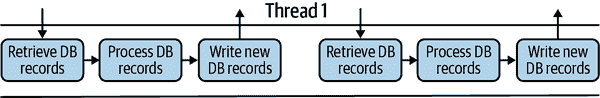
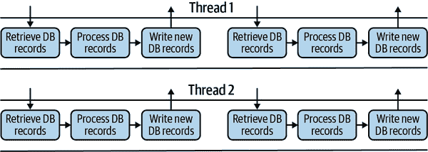
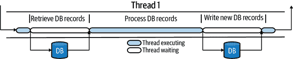
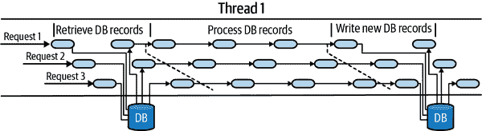
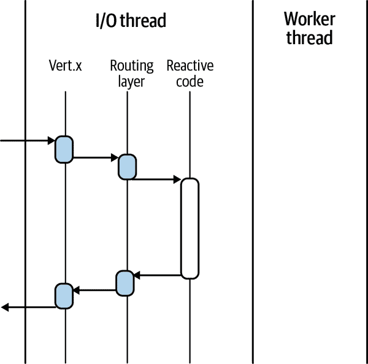
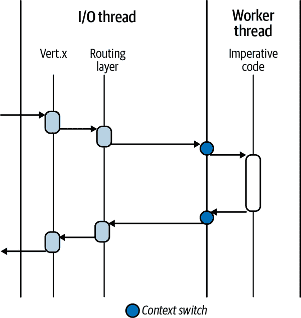
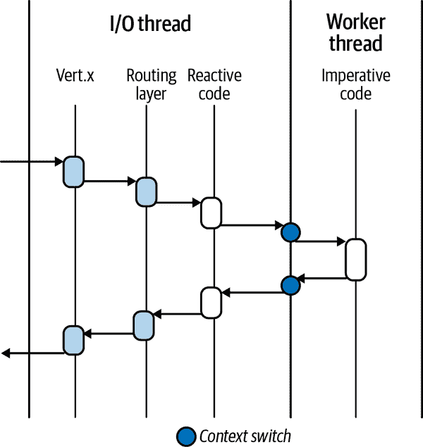

# 第六章：Quarkus：响应式引擎

在第 II 部分中，你学到了关于反应式的许多内容，以及它的各种形式、含义和变化！我知道，你现在可能有点厌倦听到 *reactive* 这个词了，但这是准确描述 Quarkus 的关键。Quarkus 的核心是其响应式引擎，我们在 “一个响应式引擎” 中对其进行了介绍。没有其响应式引擎核心，Quarkus 将无法实现响应式应用并提供响应式编程的无缝集成。

Quarkus 统一了两种开发模型：命令式和响应式。在本章中，我们将回顾主要区别，并展示 Quarkus 如何处理这种统一。Quarkus 的目标是使它们尽可能相似。如果 API *感觉* 相似，那么理解诸如响应式这样的复杂模型就会变得轻松。

在我们深入了解响应式引擎之前，我们需要重新审视命令式和响应式模型。这样做可以让我们有机会欣赏它们如何与 Quarkus 统一。对于那些已经熟悉命令式和响应式模型、它们的工作原理以及各自的优缺点的人来说，可以直接跳到 “命令式和响应式的统一”。

你可能担心我们在重复之前涵盖过的信息。我们可能有点重复，但这都是为了加强这两种模型如何影响应用程序开发方式以及因此框架在提供的模型上有何不同。

首先是命令式模型，大多数 Java 开发人员可能是从这个模型开始他们的职业生涯的。

# 命令式模型

使用 *命令式模型* 时，你甚至可能不知道它的名字。那么什么是命令式模型？它通过一系列定义好的命令来改变程序的状态。一个命令在另一个命令之后执行，直到所有命令都执行完毕。

图 6-1 展示了一系列数学命令的顺序执行，直到产生结果（在本例中，如果我们从 0 开始，结果为 10）。正如你在命令式模型中所看到的，定义正确的顺序对于实现所需的结果 10 至关重要。


###### 图 6-1\. 带有结果 10 的命令

图 6-2 展示了完全相同的命令，但顺序不同。


###### 图 6-2\. 带有结果 7.5 的命令

正如你所见，在命令式模式下，命令的顺序与命令本身一样重要。修改顺序会导致完全不同的程序输出。命令式程序可以被视为从 A 到 B 的过程，当我们已经知道 A 和 B 需要什么时。开发人员只需按照正确的顺序定义从 A 到 B 的步骤，就能实现所需的结果。

在命令式程序中，我们有一个明确的输入和输出，并且我们知道从 A 到 B 所需的步骤。因此，命令式程序很容易理解。当我们有一个明确的输入，知道输出应该是什么，并且知道到达那里的定义步骤时，编写测试就变得更容易，因为可能发生的情况有限且可确定。

命令式编程模型的其他一些方面是什么？由于命令式依赖于一系列命令，资源利用率将始终是主要关注点。在 图 6-1 中显示的示例中，我们不需要大量资源来执行基本的数学计算。但是，如果我们将所有这些操作替换为检索几百条记录的数据库调用，那么影响将很快累积起来。

我们谈论的影响与命令式编程的线程模型有关。如果我们的数据库操作序列使用单个 I/O 线程，同一个 I/O 线程处理 HTTP 请求（虽然不现实但对说明有用），那么在任何时候只能处理一个请求。我们在 第五章 中介绍了 I/O 线程。此外，由于命令式程序的序列是固定的，每个命令必须在下一个命令开始之前完成。这是什么样子？

虽然是人为的，但 图 6-3 说明了数据库程序中每个步骤必须在下一个步骤开始之前完成。更重要的是，只有处理的请求完成时，才能开始后续的请求。在这种情况下，我们能够处理的并发请求数量受到我们为应用程序提供的 I/O 线程数量的限制。



###### 图 6-3\. 单个 I/O 线程上的数据库程序

现在，如 图 6-4 所示，我们会慷慨地为同一个应用提供两个 I/O 线程！



###### 图 6-4\. 多个 I/O 线程上的数据库程序

我们可以处理两个并发请求，但仅有两个 I/O 线程，不会有更多。只能处理每个 I/O 线程的单个请求并不理想，所以让我们深入了解内部发生了什么。 

*检索 DB 记录* 和 *写入新的 DB 记录* 命令都有一段时间的空闲，在 图 6-5 中显示为较浅的部分。在发送请求到数据库和接收响应之间，I/O 线程在做什么？在这种情况下，绝对什么都不做！I/O 线程就坐在那里等待数据库的响应。



###### 图 6-5\. I/O 线程延迟的数据库程序

为什么它什么也没做？I/O 线程在等待时能否执行其他工作？正如我们之前提到的，命令式编程需要按顺序执行命令。因为在等待期间仍在运行*检索数据库记录*，所以 I/O 线程不知道是否有时间执行其他工作。这就是为什么命令式编程通常与同步执行结合，并且默认情况下同步是命令式编程的执行模型的原因。

有些人可能会想知道 I/O 线程等待是否很重要。I/O 线程等待命令完成的时间可能是几秒钟甚至更长。一个命令式程序大约需要一秒钟完成所有步骤可能还可以接受，但是如果 I/O 线程等待的周期增多，将会显著增加总响应时间。

增加命令式程序完成时间会产生几个影响。I/O 线程上的增加执行时间导致在给定时间段内处理的请求数量减少。还会对内存中缓冲任何等待 I/O 线程可用的传入请求的资源产生额外影响。这些资源影响可能会对应用程序的整体性能造成显著问题。如果一个应用程序处理数百甚至数千个用户，特别是并发用户较少时，可能不会引起注意。然而，处理成千上万个并发用户时会在用户端显示出问题，如连接失败、超时、错误以及各种可能的问题。

要打破命令式程序的同步和阻塞特性，还有其他方法。我们可以使用`ExecutorService`将工作从 I/O 线程移动到单独的工作池线程中。或者我们可以使用`@Suspended`和`AsyncResponse`与 JAX-RS 资源来将工作委托给工作池的线程，使得 HTTP 请求可以从 I/O 线程中暂停，直到在`AsyncResponse`上设置了响应。暂停 HTTP 请求等待响应有助于在其他请求等待处理响应时在 I/O 线程上处理额外的 HTTP 请求。

尽管这些方法可行，但是代码复杂度增加了，而吞吐量的显著增加并未体现出来，因为我们仍然受制于 I/O 线程的限制——虽然使用`@Suspended`时不完全是每个线程一个请求的级别，但也没有显著提升。那么，响应式模型有何不同呢？

# 响应式模型

*响应式模型*围绕着延续和非阻塞 I/O 的概念构建，正如我们在 “异步代码和模式” 中详细说明的那样。正如前文提到的，这种方法显著增加了并发水平，可以同时处理更多的请求。然而，这并不是免费的，因为它需要开发人员在这些原则基础上开发应用程序时进行额外的思考。

以我们之前的数据库示例为例，如果要删除 I/O 线程的等待时间以提高并发性能，会是什么样子？看看 图 6-6。



###### 图 6-6\. I/O 线程上的反应式数据库程序

在这里，我们可以看到，I/O 线程不再等待，而是开始处理另一个传入的请求。直到收到数据库响应就会继续这样做。我们如何实现这种分离？我们提供一个延续来处理数据库响应。在接收到数据库响应后，将延续添加到要在 I/O 线程上执行的方法队列中。同样地，处理数据库记录的单个命令被分割成更小的方法，以帮助处理并发性。

图 6-6 展示了利用延续实现的反应式模型如何减少 I/O 线程等待时间并增加同时处理的请求数量。正如您所见，作为开发者，我们需要调整程序开发方式，以*与*反应式模型保持一致。我们需要将工作分解为较小的块，但更重要的是，修改与应用程序外部的任何交互为单独的请求和响应处理。

在 图 6-6 中，我们近似展示了程序的各个部分如何被分割，以防止 I/O 线程等待或被阻塞。Quarkus 使用了*事件循环*，如“Reactor Pattern and Event Loop”中讨论的那样，来实现反应式模型。事件循环可以像之前在 图 4-7 中展示的那样被视觉化表示。

我们讨论了反应式模型的一些极其有益的方面，但没有任何东西是免费的。随着反应式模型需要将代码执行分离，与命令式模型相反，其中一切都是顺序执行，会在理解程序整体性方面引入复杂性。

程序不再是一系列顺序步骤，而是一系列在不同时间点执行的处理程序，没有预定的顺序。虽然延续可以保证在触发后发生，但在单个请求内的各种异步调用之间，或在多个请求之间，没有任何排序。这种转变要求开发者改变对事件传递的思考方式，并触发相关事件处理程序。代码中不再是一系列依次调用的命令序列。

# 反应式与命令式的统一

什么是 Quarkus 统一反应式和命令式的含义？我们不是指能够忽略反应式的复杂性或期望命令式提供高并发性能。我们*确实*指的是以下内容：

+   Quarkus 的反应式核心非阻塞 I/O 对于任何构建在其上的扩展都至关重要。

+   Quarkus 基于 Eclipse Vert.x 工具包的性能提供了一个框架扩展，这是响应式引擎。

+   开发者选择命令式还是响应式是一个 API 选择，而不是框架选择。

在选择开发应用程序时，通常需要做一个*前期*选择，是使用响应式还是命令式编程。这个决策需要开发人员和架构师在团队技能、当前业务需求以及最终应用架构方面进行深思熟虑。我们开发者发现选择特定技术栈是最困难的决定之一。即使我们不知道具体的未来需求，我们总是希望考虑应用的未来需求。无论我们如何努力，总会出现新的需求或未预见的问题，需要改变架构甚至设计。

当一个应用需要在需要变更时，提供不受限制的选择方式来改变应用的工作方式时，我们感到更加自在。这是使用 Quarkus 的一个巨大优势。当我们选择 Quarkus 及其命令式和响应式模型的统一时，我们可以自由选择其中之一，两者混合，甚至随时间变更应用的部分模型。

Quarkus 如何无缝支持响应式或命令式模型？支持两种模型的无缝集成是 Quarkus 提供一切的关键基础。建立在 Vert.x 基础上，Quarkus 具有路由层，可以启用任一模型。这是我们部署响应式代码时各层如何协同工作的方式，假设正在处理 HTTP 请求（图 6-7）。



###### 图 6-7\. Quarkus 响应式模型

我们可以在图 6-7 中看到请求如何被 Vert.x HTTP 服务器接收，通过路由层，并执行我们的响应式代码。所有这些交互都发生在 I/O 线程上；不需要工作线程。正如前面提到的，使代码在 I/O 线程上执行提供了最高级别的并发性。

###### 注意

在图 6-7 中，只有一个单一的 HTTP 请求正在处理。如果有多个请求，则这些执行将在 I/O 线程上交错执行。

或许你会好奇，执行命令式代码如何改变行为—查看图 6-8。



###### 图 6-8\. Quarkus 命令式模型

你可以看到模型没有显著的不同。最大的变化在于我们的代码现在是命令式的性质，会在工作线程上执行，而不是 I/O 线程上。这样，Quarkus 可以执行命令式代码，即一系列顺序命令，而不影响 I/O 线程的并发性。Quarkus 已经*转移*了命令式执行到工作线程上。

然而，将任务转移到工作线程的过程是有代价的。每当我们在工作线程上执行时，都需要进行一次上下文切换，在执行之前和之后都是如此。在图 6-8 中，我们将这种切换表示为 I/O 线程和工作线程之间边界上的一个圆圈。这些上下文切换会消耗时间和资源，用于执行切换并在新线程中存储信息。

我们已经看到这两种模型在 Quarkus 上的运行方式，但是当我们将它们统一起来时会怎样呢？例如，如果我们有一个需要执行一段阻塞代码的响应式应用程序，我们如何在不阻塞 I/O 线程的情况下做到这一点？在图 6-9 中，我们看到我们的代码同时在 I/O 线程和工作线程上执行！



###### 图 6-9\. Quarkus 响应式和命令式模型

当执行响应式代码时，它在 I/O 线程上运行，但任何命令式代码都在工作线程上执行。Quarkus 为开发人员处理所有这些，而无需他们创建`Executors`或`Threads`，也无需管理它们。

图 6-9 是我们在“Reactor Pattern and Event Loop”中定义的*proactor*模式的可视化展示。非阻塞和阻塞处理程序可以共存，只要我们将阻塞执行委托给工作线程，并在阻塞处理程序完成时调用继续执行。

proactor 模式在 Quarkus 中统一了命令式和响应式代码。熟悉开发响应式应用程序的人都知道，有时需要以阻塞或顺序的方式编写代码。Quarkus 的统一允许我们将这样的执行委托给工作线程，通过使用`@Blocking`来处理 HTTP 中的内容（我们在第八章中介绍），以及在 Reactive Messaging 中的内容（我们在第十章中介绍）。

尽可能利用响应式模型，因此利用 I/O 线程完成尽可能多的工作具有额外的好处。当我们将执行委托给工作线程时，尽可能减少上下文切换的次数。任何时候同一请求的执行从一个线程（如 I/O 线程）移动到另一个线程（如工作线程），或反之，都会带来一定的成本。与请求相关联的任何对象需要从新线程中可用，这会消耗时间和资源来移动它们，还需要为额外的线程分配资源成本。

我们已经详细讨论了 Quarkus 中这些模型的统一方式，但是有哪些扩展使用了这些模型呢？在第八章中涵盖的 RESTEasy Reactive 和第十章中的 Reactive Messaging 都使用了响应式模型。经典的 RESTEasy 和 Spring 控制器则使用命令式模型。

# 一个响应式引擎

如果您编写过响应式程序或对 Reactive 进行过任何研究，您可能已经了解到了 Vert.x 工具包。如前所述，Quarkus 响应式引擎利用了 Vert.x。除了 Vert.x 和 Netty 外，Quarkus 的路由层形成了响应式引擎的外层。它是扩展的集成部分，协调着将阻塞处理程序卸载到工作线程上，以及执行它们的延续。

此外，所有的响应式客户端都是建立在响应式引擎之上的，以利用非阻塞处理。一旦使用阻塞客户端，响应式应用程序就不再是响应式的，这是开发人员经常忽视的一个关键方面。Quarkus 努力确保应用程序可能需要的所有客户端都建立在响应式引擎上，以实现真正的响应式集成。

###### 注意

默认情况下，Quarkus 中的所有内容都是响应式的。开发人员必须决定他们想要响应式还是命令式。我们所说的 *所有* 是什么意思？它包括 HTTP 处理、使用 AMQP 和 Kafka 的事件驱动应用程序，以及 Quarkus 提供的 *所有* 内容。

# 一种响应式编程模型

SmallRye Mutiny 是 Quarkus 的响应式编程库。您已经在 “Reactive Programming” 中了解了它，我们将在 第七章 中学到更多内容，因此我们不会在这里详细介绍。

简而言之，Mutiny 围绕三个关键方面构建：

事件驱动

监听来自流的事件并适当处理它们。

易于导航的 API

API 的导航由事件类型和该事件的可用选项驱动。

仅两种类型

`Multi` 和 `Uni` 可以处理任何所需的异步操作。

有一点需要注意的是 Mutiny 类型的惰性。除非订阅者请求它们，否则事件不会开始流经数据流。这是一个很棒的功能，可以防止流在没有人监听时消耗资源，但开发人员需要注意这一点，以免忘记订阅！

所有 Quarkus 响应式 API 都使用 `Multi` 和 `Uni`。这种方法有助于将 Quarkus 扩展与响应式编程和 Mutiny 无缝集成。让我们看看使用 Mutiny 的示例。

使用 PostgreSQL 响应式客户端的 Quarkus 响应式应用程序从数据库中使用 `Multi` 检索 `Fruit` 对象，如 示例 6-1 所示。

##### 示例 6-1\. 响应式 Mutiny 客户端

```java
client.query("SELECT id, name FROM fruits ORDER BY name ASC").execute()        
    .onItem().transformToMulti(rowSet -> Multi.createFrom().iterable(rowSet))  
    .onItem().transform(row -> convertRowToFruit(row));                        
```


`client` 是 `PgPool` 的一个实例，是使用 Mutiny 和 Vert.x 构建的 PostgreSQL 响应式客户端。


当收到一个 `RowSet` 项时，将单个 `RowSet` 转换为 `Multi<Row>`。


将 `Multi` 中的每个 `Row` 转换为一个 `Fruit` 实例。执行的结果是 `Multi<Fruit>`。

鉴于我们在本书中讨论响应式，所有剩余章节都有使用 Mutiny 在多种情况下的示例。我们在第八章中介绍了响应式 HTTP 端点及其在第十二章中的消费。我们还包括了 Quarkus 和 Mutiny 在第九章中的响应式数据访问，包括许多示例。

# 使用 Quarkus 的事件驱动架构

尽管使用 Quarkus 构建响应式应用程序很棒、高效且有趣，但我们希望不仅仅是构建单个应用程序。我们需要一个响应式系统，正如在第四章中所述，将小型应用程序组合成一个协调的分布式系统。为了支持这样的架构，Quarkus 必须接收和产生事件，这就是事件驱动架构！Quarkus 通过使用响应式消息来实现这一点，如示例 6-2 所示。响应式消息集成了各种消息传递技术，如 Apache Kafka、AMQP 等，开发人员可以通过注解指定方法是接收还是产生事件。

##### 示例 6-2. 响应式消息

```java
@Incoming("prices")
@Outgoing("quotes")                                         
public Quote generatePrice(Price p) {                       
    return new Quote(p, "USD");
}
```


从`prices`通道中读取消息。


将每个`Price`转换为一个`Quote`。

提供的开发模型允许轻松消费、转换和生成消息。`@Incoming`注解表示消费*通道*中传递的每个`Price`。响应式消息在配置的通道中为每个通过的`Price`调用方法。`@Outgoing`注解指示将结果写入的通道。

有关响应式消息的完整详细信息，请参阅第十章。

# 摘要

本章介绍了命令式模型，一系列顺序命令，以及响应式模型，利用续体和非阻塞 I/O。

我们已经看到了以下内容：

+   图 6-8、6-7 和 6-9 展示了两种模型如何使用线程，通过响应式模型提供了改进的并发性能。

+   Quarkus 如何统一这些模型，允许开发人员在不切换框架的情况下增强应用程序，引入响应式方面，随着应用程序的增长和扩展。

+   我们如何在 Quarkus 中使用响应式编程。

在接下来的章节中，我们将探讨 Quarkus 的各种响应式方面，如第八章中的 HTTP 和 RESTEasy Reactive，以及第九章中的响应式数据访问。但首先，让我们深入了解 Mutiny 响应式编程 API。
