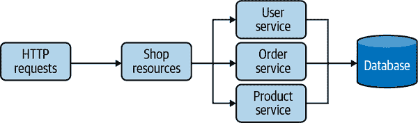

# 第七章。Mutiny：一个基于事件驱动的响应式编程 API

在第五章中，我们介绍了响应式编程及其如何帮助实现响应式应用程序。然后，在第六章中，我们讨论了 Quarkus 如何使用 Mutiny 来实现响应式应用程序。本章重点介绍 Mutiny 本身。¹

本章介绍了 Mutiny 的概念和常见模式，这将帮助您理解接下来的几章。Mutiny 是 Quarkus 中用于每个与响应式相关的功能的 API。当深入学习使用 Quarkus 构建响应式应用程序和系统时，您将看到更多关于 Mutiny 的内容。

# 为什么需要另一个响应式编程库？

这是一个很好的问题！正如您在第五章中所看到的，其他流行的响应式编程库已经存在。那么为什么还要另一个呢？

过去几年中，我们观察到开发人员如何开发响应式系统并使用响应式编程库。通过这些经验，我们发现了开发人员所面临的挑战。简而言之，响应式编程难以学习和理解。编写和维护响应式代码会带来重大负担，从而减缓采用响应式方法的速度。

当我们观察响应式编程的使用时，立即可以看到其陡峭的学习曲线，这使得响应式编程局限于顶尖开发人员。事实上，响应式编程的功能编程根基既优雅又限制。并非每个开发人员都具备函数背景。我们看到开发人员在`map`和`flatMap`的迷宫中迷失，试图找到出路。

即使对经验丰富的开发人员来说，某些概念仍然抽象且令人困惑。例如，在传统的响应式编程库中，`flatMap`和`concatMap`之间的区别导致了许多错误，包括生产故障。这些响应式编程库需要具备函数背景和对可用操作符的良好理解。掌握数百个操作符需要时间。

另一个方面是 API 建模。现有的库通常实现[响应式扩展 (ReactX)](http://reactivex.io/)并提供具有数百个方法的 Java 类。即使使用现代 IDE，找到正确的方法也像大海捞针。通常需要滚动查看方法列表以找到合适的方法，甚至不看方法名称而查看签名，希望能找到最佳方法。

最后，这是一个更为哲学性的方面，现有的响应式编程库并不反映响应式原则的事件驱动性质。虽然它使用数据流，这些是异步构造，但 API 并未传达事件的概念。响应式架构应该有助于实现基于事件的过程，而这些方法存在不足，需要在业务过程和其实现之间进行额外的心智映射。

为了解决这些问题，我们决定创建 Mutiny，一个新的响应式编程 API，专注于可读性、维护性，并将 *事件* 的概念置于中心位置。

# Mutiny 的独特之处在哪里？

Mutiny 是一个直观的、事件驱动的 Java 响应式编程库。Mutiny 使用 *事件* 的概念来传达某事发生了。这种事件驱动的特性完美适配了分布式系统的异步性质，正如在 第三章 中所述。使用 Mutiny，当事件发生时，你会收到通知并对其作出反应。因此，Mutiny 围绕 `onItem` 和 `onFailure` 等 *on* 方法组织自己。每个方法让你表达当接收到事件时想要执行的操作。例如，`onItem.transform` 接收一个项事件并对其进行转换，或者 `onFailure.recoverWithItem` 在失败事件后使用备用项进行恢复。

我们希望解决 API 导航问题，避免 *一个类包含数百个方法* 的模式。我们引入了方法 *组* 的概念。每个组处理特定类型的事件。在 `onItem` 组中，你可以找到处理单个项事件的所有方法，比如转换它 (`onItem.transform`) 或调用方法 (`onItem.invoke`)。在 `onFailure` 组中，你可以找到处理失败和恢复的方法，比如 `onFailure.recoverWithItem` 或 `onFailure.retry`。结果的 API 更易读、易懂和易于导航。作为用户，你可以选择组并跨有限数量的方法进行导航。

Mutiny 的 API 不是简洁的。我们更看重可读性和理解性，而不是简洁性。多年来，我们多次听到响应式编程很难，只有高级开发人员或架构师才能使用。这是响应式采纳的一个关键障碍。在设计 Mutiny 时，我们希望避免创建一个精英主义的库。这并不是要“降低”响应式编程背后的思想，而是剥离数学术语的目标。

# 在 Quarkus 中使用 Mutiny

为了说明在使用 Mutiny 时可能看到的常见模式，我们需要一个例子。该应用是一个简单的商店，处理用户、产品和订单（图 7-1）。用户创建包含产品列表的订单。应用的实现方式对本章来说并不重要。第 8 和第九章将介绍 Mutiny 在 Quarkus 的 HTTP 和数据部分的集成。



###### 图 7-1\. 店铺应用架构

应用程序使用非阻塞数据库客户端以避免与数据库集成时阻塞。因此，`OrderService`、`UserService` 和 `ProductService` 的 API 都是异步的，并使用 Mutiny 类型。实现 HTTP API 的 `ShopResource` 也使用 Mutiny 来查询服务并组成响应。

代码位于 *chapter-7/order-example* 目录中，可以使用 `mvn quarkus:dev` 启动。代码使用端口 8080 提供 HTTP API。

# Uni 和 Multi

Mutiny 提供两个主要类：`Uni` 和 `Multi`。² `Uni` 表示异步操作或任务。它可以发出单个项目或失败，如果所表示的操作失败。`Multi` 表示项目流。它可以传输多个项目，以及终端失败或完成事件。

让我们看两个使用案例，以更好地理解它们的差异。假设您想从数据库中检索单个用户（由 `UserProfile` 类表示）。您将使用 `Uni<UserProfile>`，如 示例 7-1 所示。

##### 示例 7-1\. `Uni` 的示例 (*chapter-7/order-example/src/main/java/org/acme/ShopResource.java*)

```java
Uni<UserProfile> uni = users.getUserByName(name);
return uni
        .onItem().transform(user -> user.name)
        .onFailure().recoverWithItem("anonymous");
```

您可以将逻辑附加到 `Uni`，以便在其发出事件时做出反应。在前面的片段中，当 `UserProfile` 可用时，我们提取用户的名称。如果发生故障，我们使用备用值恢复。`onItem` 和 `onFailure` 组形成了 `Uni` API 的核心。

`Multi` 可以发出 0、1、*n* 或无限多个项目。它还可以发出失败，这是一个终端事件。最后，当没有更多项目要发出时，`Multi` 发出完成事件。因此，API 稍有不同。现在让我们想象我们需要所有的用户。对于这种情况，您将使用 `Multi`，如 示例 7-2 所示。

##### 示例 7-2\. `Multi` 的示例 (*chapter-7/order-example/src/main/java/org/acme/ShopResource.java*)

```java
Multi<UserProfile> users = this.users.getAllUsers();
return users
        .onItem().transform(user -> user.name);
```

对于 `Uni`，您可以处理事件。在片段中，您提取每个用户的名称。因此，与 示例 7-1 不同，代码可以多次调用转换。虽然 API 类似，但 `Multi` 提议特定的组来选择、丢弃和收集项目；请参阅 示例 7-3。

##### 示例 7-3\. 使用 `Multi` 的代码示例 (*chapter-7/mutiny-examples/src/main/java/org/acme/MultiApi.java*)

```java
Multi<UserProfile> multi = users.getAllUsers();
multi
        .onItem().transform(user -> user.name.toLowerCase())
        .select().where(name -> name.startsWith("l"))
        .collect().asList()
        .subscribe().with(
                list -> System.out.println("User names starting with `l`" + list)
);
```

如您所见，这两种类型都是事件驱动的。但它们处理的事件集合不同。API 反映了这些差异。`Uni` 和 `Multi` 不提供相同的组集，因为有些组是特定于每种情况的（表 7-1）。

表 7-1\. `Uni` 和 `Multi` 使用场景

|  | 事件 | 使用场景 | 实现响应式流 |
| --- | --- | --- | --- |
| `Uni` | 项目和失败 | 远程调用，返回单一结果的异步计算 | 否 |
| `Multi` | 项，失败，完成 | 数据流，潜在无限（发出无限数量的项） | 是 |

`Uni`和`Multi`的一个重要特性是它们的惰性。持有`Uni`和`Multi`实例的引用并不会产生任何效果。在示例 7-3 中，直到有人显式订阅（表达了兴趣）才会发生任何事情，就像在示例 7-4 中展示的那样。

##### 示例 7-4\. 订阅`Uni`和`Multi`（*chapter-7/order-example/src/main/java/org/acme/UniMultiExample.java*）

```java
Uni<UserProfile> uni = users.getUserByName("leia");
Multi<UserProfile> multi = users.getAllUsers();

uni.subscribe().with(
        user -> System.out.println("User is " + user.name),
        failure -> System.out.println("D'oh! " + failure)
);

multi.subscribe().with(
        user -> System.out.println("User is " + user.name),
        failure -> System.out.println("D'oh! " + failure),
        () -> System.out.println("No more user")
);
```

要订阅（从而触发操作），你需要使用`subscribe`组。在 Quarkus 中，你可能不需要订阅，因为如果你返回`Uni`或`Multi`给 Quarkus，它会自动为你订阅。例如，你可以在示例 7-5 中看到 HTTP 方法的展示。

##### 示例 7-5\. Quarkus 处理 HTTP 方法的订阅（*chapter-7/order-example/src/main/java/org/acme/ShopResource.java*）

```java
@GET
@Path("/user/{name}")
public Uni<String> getUser(@PathParam("name") String name) {
    //tag::uni[]
    Uni<UserProfile> uni = users.getUserByName(name);
    return uni
            .onItem().transform(user -> user.name)
            .onFailure().recoverWithItem("anonymous");
    //end::uni[]
}
```

当匹配的 HTTP 请求到达时，Quarkus 调用此方法并订阅生成的`Uni`。只有当`Uni`发出项或失败时，Quarkus 才会编写 HTTP 响应。

# Mutiny 和流控制

正如表 7-1 所示，`Multi`实现了响应式流背压协议。换句话说，它实现了响应式流的`Publisher`接口，而`Multi`的消费者是响应式流的`Subscriber`。但`Uni`不是这种情况。

处理发送多个项的流（如`Multi`）时，支持背压是有意义的。在底层，订阅者可以通过在可以处理时请求项来控制流和节奏。这样可以避免向订阅者发送过多的项。

处理`Uni`时，订阅它足以表达你对处理发出项的兴趣和能力。无需发送另一个请求信号来表达你的兴趣。

但是，正如你在第五章中看到的，不是每个流都支持流控制。表示来自物理世界事件的流，如用户点击或时间，无法减慢。在这种情况下，向订阅者发送太多事件的风险很高。这就是为什么`Multi`提供了`onOverflow`组。该组监控上游源发出的项数以及下游订阅者请求的项数。当进入项比请求多时，`Multi`会发出*溢出*事件。`onOverflow`组允许配置发生此情况时的期望行为。

为了说明这一点，让我们想象一下一个产生产品推荐的流。每秒钟，它发送一个新的推荐产品。但时间无法减慢，所以我们无法应用背压。如果下游无法跟上，我们可能会发生溢出。为了避免这种情况，如果由于请求不足而无法发出下一个项，我们会直接丢弃它，就像在示例 7-6 中展示的那样。

##### 示例 7-6\. 使用 `Multi` 处理溢出 (*chapter-7/order-example/src/main/java/org/acme/ShopResource.java*)

```java
public Multi<Product> getRecommendations() {
    return Multi.createFrom().ticks().every(Duration.ofSeconds(1))
            .onOverflow().drop()
            .onItem().transformToUniAndConcatenate(
                x -> products.getRecommendedProduct());
}
```

`onOverflow` 组提供其他可能性，例如缓冲项。

# 观察事件

一旦你有 `Uni` 或 `Multi` 实例，观察这些实例发出的事件是很自然的。对于每种类型的事件，当它看到匹配的事件时会调用一个 `invoke` 方法；参见 示例 7-7。

##### 示例 7-7\. 观察事件 (*chapter-7/mutiny-examples/src/main/java/org/acme/MultiObserve.java*)

```java
multi
        .onSubscribe().invoke(sub -> System.out.println("Subscribed!"))
        .onCancellation().invoke(() -> System.out.println("Cancelled"))
        .onItem().invoke(s -> System.out.println("Item: " + s))
        .onFailure().invoke(f -> System.out.println("Failure: " + f))
        .onCompletion().invoke(() -> System.out.println("Completed!"))
        .subscribe().with(
                item -> System.out.println("Received: " + item)
);
```

`invoke` 方法不修改事件；你观察它而不改变它。下游接收与你相同的事件。需要在实现副作用或跟踪代码时非常有用。例如，我们可以用它来记录创建新用户或创建失败的情况（见 示例 7-8）。

##### 示例 7-8\. 观察 `Uni` 事件 (*chapter-7/order-example/src/main/java/org/acme/ShopResource.java*)

```java
@POST
@Path("/users/{name}")
public Uni<Long> createUser(@QueryParam("name") String name) {
    return users.createUser(name)
            .onItem().invoke(
                l -> System.out.println("User created: " + name + ", id: " + l))
            .onFailure().invoke(t -> System.out.println(
                    "Cannot create user " + name + ": " + t.getMessage())
            );
}
```

如果应用程序正在运行，可以使用 示例 7-9 来运行此代码。

##### 示例 7-9\. 调用 `users` 端点

```java
> curl -X POST http://localhost:8080/shop/users?name=neo
```

# 转换事件

大多数情况下，我们需要转换事件。让我们首先看看如何同步转换事件。你接收事件，进行转换，并作为新事件产生结果。对于每种类型的事件，在看到匹配事件时调用 `transform` 方法，如 示例 7-10 所示。

##### 示例 7-10\. 转换事件 (*chapter-7/mutiny-examples/src/main/java/org/acme/MultiTransform.java*)

```java
Multi<String> transformed = multi
        .onItem().transform(String::toUpperCase)
        .onFailure().transform(MyBusinessException::new);
```

与 `invoke` 不同，`transform` 生成一个新的事件。它调用传递的函数并将结果发送给下游订阅者。

`transform` 的同步性质很重要。收到事件后，`transform` 调用转换逻辑并向下游发出结果。如果转换逻辑花费了很长时间，`transform` 会等待直到逻辑终止。因此，当转换足够快时使用 `transform`。

例如，以下方法检索产品列表，一致大写它们的名称，并构建表示 (`ProductModel`)。对于每个产品，`transform` 提取名称并应用转换。这个同步过程很快。它立即向下游发出结果，如 示例 7-11 所示。

##### 示例 7-11\. 转换产品 (*chapter-7/order-example/src/main/java/org/acme/ShopResource.java*)

```java
@GET
@Path("/products")
public Multi<ProductModel> products() {
    return products.getAllProducts()
            .onItem().transform(p -> captializeAllFirstLetter(p.name))
            .onItem().transform(ProductModel::new);
}
```

# 链接异步操作

`transform` 方法可以同步处理事件，但如果我们需要调用异步过程怎么办？想象一下，你收到一个事件，需要调用远程服务或与数据库交互。你不能使用 `transform`，因为这些方法应该是异步的（否则会阻塞，这违反了响应式原则）。你需要*等待*异步计算完成。

我们如何用 Mutiny 的术语来表达这个？这意味着转换一个事件，但不像`transform`返回一个*普通*结果那样，它返回一个异步结构：另一个`Uni`或`Multi`。看一下示例 7-12 是什么样子。

##### 示例 7-12\. 链式异步操作（*chapter-7/mutiny-examples/src/main/java/org/acme/UniTransformAsync.java*）

```java
uni
    .onItem().transformToUni(item -> callMyRemoteService(item))
    .subscribe().with(s -> System.out.println("Received: " + s));

uni
    .onItem().transformToMulti(s -> getAMulti(s))
    .subscribe().with(
        s -> System.out.println("Received item: " + s),
        () -> System.out.println("Done!")
);
```

`transformToUni`和`transformToMulti`提供了生成`Uni`或`Multi`实例的能力。³ 当你接收到一个项时，Mutiny 会调用返回`Uni`或`Multi`的函数。然后，从这个`Uni`或`Multi`向下游发出事件。在示例 7-13 中，我们检索特定用户（通过其名称）的订单列表。

##### 示例 7-13\. 检索特定用户的订单（*chapter-7/order-example/src/main/java/org/acme/ShopResource.java*）

```java
@GET
@Path("/orders/{user}")
public Multi<Order> getOrdersForUser(@PathParam("user") String username) {
    return users.getUserByName(username)
            .onItem().transformToMulti(user -> orders.getOrderForUser(user));
}
```

这段代码检索用户，当接收到用户时，然后代码检索订单。`getOrderForUser`方法返回`Multi<Order>`，因此结果是`Multi<Order>`。

如果你仔细看前面的代码，你会说：“嘿！你忘了一些东西！当我们从`Multi`而不是`Uni`链式调用时，它是如何工作的？” 你是对的；我们需要讨论`Multi`情况。你如何将`Multi`的每个项转换为另一个`Uni`或`Multi`？

举个例子来说明这个问题。假设你需要检索所有用户的订单。因此，不像示例 7-13 中那样只需要用户名，我们需要检索所有用户，并且对于每个用户检索订单。示例 7-14 展示了生成的代码。

##### 示例 7-14\. 使用`concatenate`检索每个用户的订单（*chapter-7/order-example/src/main/java/org/acme/ShopResource.java*）

```java
@GET
@Path("/orders")
public Multi<Order> getOrdersPerUser() {
    return users.getAllUsers()
            .onItem().transformToMultiAndConcatenate(
                user -> orders.getOrderForUser(user));

}
```

你可以立即发现一个不同点。不是`transformToMulti`，而是`transformToMultiAndConcatenate`。但为什么*AndConcatenate*？这与向下游发送的项的顺序有关。它获取第一个用户的`Multi`，将项发送到下游，然后处理下一个用户的`Multi`，依此类推。换句话说，它逐个获取`Multi`实例并将它们连接起来。这种方法保留了顺序，但同时也限制了并发性，因为我们一次只检索一个用户的订单。

如果你不需要保留顺序，可以使用`transformToMultiAndMerge`方法。⁴ 在这种情况下，它并发地调用`getOrderForUser`。它将从生成的`Multi`中合并项目，因此可能会交错来自不同用户的订单（示例 7-15）。

##### 示例 7-15\. 使用合并检索每个用户的订单

```java
@GET
@Path("/orders")
public Multi<Order> getOrdersPerUser() {
    return users.getAllUsers()
        .onItem().transformToMultiAndMerge(user -> orders.getOrderForUser(user));
}
```

###### 注意

*chapter-7/mutiny-examples/src/main/java/org/acme/MultiTransformAsync.java* 让您执行这些示例。它们突出了订单差异。

# 从失败中恢复

正如我们所说的，失败是不可避免的。我们必须处理它们。

在这种不幸的情况下可以做什么呢？在 Mutiny 的世界中，失败是一种事件。因此，您可以观察并处理它们。您可以像处理任何其他事件一样使用`invoke`或`transform`。但您也可以优雅地处理失败并进行恢复。

最常见的方法之一是使用特定的备用项目进行恢复。假设我们想创建一个新用户，但由于名称需要唯一，插入操作失败了。我们可以返回一个指示失败的消息，如示例 7-16 所示。

##### Example 7-16\. 使用备用项目从失败中恢复 (*chapter-7/order-example/src/main/java/org/acme/ShopResource.java*)

```java
public Uni<String> addUser(String name) {
    return users.createUser(name)
            .onItem().transform(id -> "New User " + name + " inserted")
            .onFailure().recoverWithItem(
                failure -> "User not inserted: " + failure.getMessage());
}
```

失败虽然是一个事件，但它是终端事件。如果你正在处理`Uni`，你将得到的不是项目，而是失败。所以，`Uni`会用备用项目替换失败。而对于`Multi`，在失败后你将不再得到任何项目。恢复操作会发出备用项目，然后是完成事件。

另一个常见的可能性是重试。请记住，只有在您的系统可以忍受时才能重试。在这种情况下（只有在这种情况下），您可以重试。重新订阅上游源以重试，如 Example 7-17 所示。

##### Example 7-17\. 失败时重试

```java
public Uni<String> addUser(String name) {
    return users.createUser(name)
            .onItem().transform(id -> "New User " + name + " inserted")
            .onFailure().retry().atMost(3);
}
```

您可以通过使用`atMost`限制重试次数或在它们之间引入延迟，并配置后退；参见 Example 7-18。

##### Example 7-18\. 在失败时最多重试 n 次，并在尝试之间延迟 (*chapter-7/mutiny-examples/src/main/java/org/acme/UniFailure.java*)

```java
Uni<String> retryAtMost = uni
        .onFailure().retry()
            .withBackOff(Duration.ofSeconds(3))
            .atMost(5);
```

###### 注意

*chapter-7/mutiny-examples/src/main/java/org/acme/UniFailure.java* 让您执行这些示例以帮助您理解各种可能性。

`onFailure`组中包含了更多的可能性。

# 结合和连接项目

下一个常见的模式是从多个上游源组合项目。例如，想象一下我们想要生成推荐。我们将选择一个随机用户和一个推荐的产品。我们可以顺序执行两者，但它们是独立的，所以我们可以并行执行它们，并在获得两个结果时生成推荐（Example 7-19）。

##### Example 7-19\. 结合 `Uni` 实例 (*chapter-7/order-example/src/main/java/org/acme/ShopResource.java*)

```java
@GET
@Path("/random-recommendation")
public Uni<String> getRecommendation() {
    Uni<UserProfile> uni1 = users.getRandomUser();
    Uni<Product> uni2 = products.getRecommendedProduct();
    return Uni.combine().all().unis(uni1, uni2).asTuple()
            .onItem().transform(tuple -> "Hello " + tuple.getItem1().name +
                    ", we recommend you "
                    + tuple.getItem2().name);
}
```

此片段获取两个`Uni`。第一个检索一个随机用户，第二个获取一个推荐的产品。然后我们将两者组合并将它们的结果聚合成一个元组。当两个操作都完成时，Mutiny 将项目收集到一个元组中，并将此元组向下游传播。如果`Uni`失败，则向下游传播失败。

在我们希望并发执行操作并连接其结果时，结合`Uni`操作是很常见的。但我们也可以对`Multi`执行相同操作。在这种情况下，我们关联几个`Multi`操作的项目。例如，我们可以生成一个推荐流，关联随机用户和推荐产品，如示例 7-20 所示。

##### 示例 7-20\. 连接`Multi`（*chapter-7/order-example/src/main/java/org/acme/ShopResource.java*）

```java
@GET
@Path("/random-recommendations")
public Multi<String> getRandomRecommendations() {
    Multi<UserProfile> u = Multi.createFrom().
        ticks().every(Duration.ofSeconds(1)).onOverflow().drop()
        .onItem().transformToUniAndConcatenate(
            x -> users.getRandomUser());
    Multi<Product> p = Multi.createFrom().ticks().every(
        Duration.ofSeconds(1)).onOverflow().drop()
        .onItem().transformToUniAndConcatenate(
            x -> products.getRecommendedProduct());

    return Multi.createBy().combining().streams(u, p).asTuple()
            .onItem().transform(tuple -> "Hello "
                    + tuple.getItem1().name
                        + ", we recommend you "
                    + tuple.getItem2().name);
}
```

当连接`Multi`时，只要连接的一个`Multi`发送完成事件，结果流就会完成。实际上，不能再组合项目了。

# 选择项目

处理`Multi`时，您可能希望选择要向下传播的项目并丢弃其他项目。例如，我们可以检索所有订单，然后仅选择包含超过三个产品的订单（参见示例 7-21）。

##### 示例 7-21\. 选择项目（*chapter-7/order-example/src/main/java/org/acme/OrderService.java*）

```java
public Multi<Order> getLargeOrders() {
    return getAllOrders()
            .select().where(order -> order.products.size() > 3);
}
```

`select.where`操作允许您选择项目。对于每个项目，该操作调用谓词并决定是否应将项目传播到下游。它会丢弃未通过谓词的项目。

`select.when`操作的异步变体也可用。它允许您选择要保留的项目，使用异步谓词。示例 7-22 展示了如何选择特定用户名的订单。对于每个订单，代码检索关联的用户，并且仅当用户名匹配时才选择。

##### 示例 7-22\. 使用异步谓词选择项目（*chapter-7/order-example/src/main/java/org/acme/OrderService.java*）

```java
public Multi<Order> getOrdersForUsername(String username) {
    return getAllOrders()
            .select().when(order ->
                    users.getUserByName(username)
                        .onItem().transform(u -> u.name.equalsIgnoreCase(username))
            );
}
```

选择也可以删除任何重复的项目。在示例 7-23 中，我们列出了订购的产品。

##### 示例 7-23\. 选择不同的项目（*chapter-7/order-example/src/main/java/org/acme/ProductService.java*）

```java
public Multi<Product> getAllOrderedProducts() {
    return orders.getAllOrders()
            .onItem().transformToIterable(order -> order.products)
            .select().distinct();
}
```

对于每个订单，我们检索产品并生成`Multi<Product>`。然后，我们仅选择不同的项目，丢弃重复项。请注意，我们无法在无界流上使用`distinct`，因为它需要在内存中保留所有已经看到的项目。

除了选择之外，Mutiny 还提供了一个`skip`组。它提供相反的功能，因此允许跳过与谓词和重复匹配的项目。

# 收集项目

最后，在处理有界的`Multi`时，您可能希望将项目累积到列表或集合中。当`Multi`完成时，结果结构会被发出。

让我们重复使用前面的示例。我们知道订购产品的集合是有界的，因此，我们可以将产品收集到列表中，如示例 7-24 所示。

##### 示例 7-24\. 将项目收集到列表中（*chapter-7/order-example/src/main/java/org/acme/ProductService.java*）

```java
public Uni<List<Product>> getAllOrderedProductsAsList() {
    return getAllOrderedProducts()
            .collect().asList();
}
```

请注意，该方法返回`Uni<List<Product>>`。当由`getAllOrderedProducts`返回的`Multi`完成时，方法会发出包含产品的列表。

`collect` 组提供其他方法来将项目聚合到映射、集合或事件中，使用您自己的收集器（示例 7-25）。

##### 示例 7-25\. 其他收集方法

```java
Uni<List<String>> itemsAsList = multi.collect().asList();
Uni<Map<String, String>> itemsAsMap = multi.collect().asMap(item ->
    getKeyForItem(item));
Uni<Long> count = multi.collect().with(Collectors.counting());
```

# 总结

本章是对 Mutiny API 的简要介绍。它没有提供完整的概述，但介绍了我们将在本书后续使用的关键模式。记住：

+   Mutiny 是一个事件驱动的响应式编程 API。

+   您可以观察和转换事件。

+   Mutiny 提供了两个主要的类：`Uni` 和 `Multi`。

+   Mutiny API 提供了导航功能，并为您选择正确的操作符提供了指导。

有了这个理解，我们现在可以开始使用 Quarkus 提供的响应式服务和设施。

¹ Quarkus 集成了 Mutiny，这是一个可以嵌入到任何地方的独立项目。

² Mutiny 的名称来源于 `Multi` 和 `Uni` 的缩写。

³ `transformToUni` 和 `transformToMulti` 操作在传统的响应式编程库中通常被称为 `flatMap`。

⁴ `transformToMultiAndConcatenate` 在传统的响应式编程库中称为 `concatMap`。`transformToMultiAndMerge` 通常被称为 `flatMap`。
