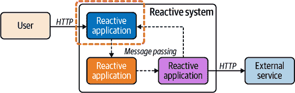
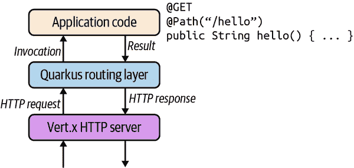

# 第八章\. 反应式 HTTP

即使构建反应式系统，HTTP 也是不可避免的。HTTP 是一种普遍的协议，例如 REST 是一种设计服务和 API 的众所周知的方法。关于 HTTP 的问题，如 第四章 所述，是导致不期望的时间耦合的请求/响应交互方案。此外，要实现空间解耦，通常需要代理来路由请求或先进的服务发现和负载平衡机制。

但让我们面对现实：我们需要务实，而且 HTTP 有很多强大的特性。我们建议在系统的边缘使用 HTTP（与外部实体交互的地方），如 图 8-1 所示。例如，HTTP 经常用于前端层，以便轻松地向其他外部服务提供可消费的 API。此外，我们经常在与其他外部服务的各种集成点使用 HTTP，例如使用 REST API 消费服务。

集成 HTTP 不应该阻止或限制您正在构建的反应式系统的响应能力。因此，我们需要仔细实现这种集成。看到使用所谓的异步 HTTP 客户端的系统并不罕见，但这可能比提供好处更有害，因为它可能依赖于隐藏的线程池。



###### 图 8-1\. 在反应式系统的边缘使用 HTTP

本章探讨了 Quarkus 提供的功能来公开 HTTP 端点以及我们可以实现这些端点的方法。在 图 8-1 中，这一部分用虚线圈出；右侧的 HTTP 服务消费在 第十二章 中有所涵盖。

# HTTP 请求的旅程

要理解使用 Quarkus 以反应式方式处理 HTTP 的好处，我们需要深入了解。如 第六章 所示，Quarkus 基于反应式引擎，因此 Quarkus 的每个方面都从该引擎中受益，提供异步和非阻塞特性。当然，这也包括 HTTP。然而，虽然我们在以前的 Quarkus 应用程序中实现了 HTTP 端点，但代码并没有从引擎提供的所有功能中受益。让我们看看 Quarkus 如何处理 HTTP 请求，以及我们在哪里可以释放反应式引擎的力量。

要处理 HTTP 请求，您需要一个 HTTP 服务器。该服务器监听特定端口（例如 Quarkus 中的 8080）并等待传入连接。当服务器接收到新连接时，它读取帧并组装 HTTP 请求。通常，服务器解析 HTTP 方法（例如 `GET` 或 `POST`）、调用的路径、正文等。多个帧可以组成一个 HTTP 请求，大型正文则分割成多个帧。

一旦 HTTP 请求被组装，Quarkus 就确定如何处理它。它检查 *拦截器*（处理安全或日志记录问题）并寻找可以处理请求的端点。此查找基于路径，但也可以包括内容类型协商。一旦找到端点方法，Quarkus 调用该方法，方法负责处理请求。

假设我们调用一个同步方法，并且方法的结果是 HTTP 响应的有效载荷。Quarkus 捕获该结果并构建 HTTP 响应。然后将响应写入适当的 HTTP 连接，根据内容进行编码。

到目前为止，一切都很好，但是不够*响应式*，对吧？在这个交换中，一个重要的部分是 HTTP 服务。Quarkus 使用的 HTTP 服务器是非阻塞的、高效的和并发的。它由 Vert.x 提供支持，并通过使用 I/O 线程处理 HTTP 交互。因此，它遵循我们之前在 图 4-1 中解释的反应式方法，并且可以使用少量线程处理多个 HTTP 连接。

一旦这个 HTTP 服务器接收到请求，服务器将请求委托给 Quarkus 处理查找。这个 *路由* 层构建处理请求的责任链（通常是拦截器和端点），并调用它。在 JAX-RS 端点的情况下，路由层会将查找委托给 JAX-RS 框架，并等待计算 JAX-RS 响应。

但是，等等——我们还在 I/O 线程上吗？如果是这样，我们如何防止用户端点无意中阻塞 I/O 线程？幸运的是，Quarkus 有一个路由层，决定如何处理请求（图 8-2）。



###### 图 8-2\. Quarkus 路由层

在我们在 第二章 中使用的前一个 Quarkus 应用程序中，请求总是在工作线程上分派，避免任何阻塞的风险。从反应式原则的角度来看并不理想。让我们看看 Quarkus 能做什么来改善这种情况。

# 与 RESTEasy Reactive 打个招呼！

在我们在 第二章 中使用的前一个应用程序中，我们依赖于*经典* RESTEasy，它遵循将线程与每个请求关联的老式模型。然而，正如我们之前所见，该模型不具备可伸缩性和响应性。幸运的是，Quarkus 提供了一种替代方案：*RESTEasy Reactive*。这是相同的开发模型，但此变体意识到响应式引擎并依赖于它。

让我们来看看并尝试使用 RESTEasy Reactive 提供的功能。请访问 [*https://code.quarkus.io*](https://code.quarkus.io) 并选择以下扩展：

+   RESTEasy Reactive

+   RESTEasy Reactive Jackson

然后，点击“生成您的应用程序”并解压它。

响应式版本与经典的 RESTEasy 版本非常相似。Example 8-1 展示了生成的 HTTP 端点。您可能会注意到引入了 `@NonBlocking` 注解。这是与经典 RESTEasy 的一个重要区别；RESTEasy Reactive 可以在 I/O 线程上分派请求。

##### 示例 8-1\. 使用 RESTEasy Reactive 的 HTTP 端点。

```java
package org.acme;

import io.smallrye.common.annotation.NonBlocking;

import javax.ws.rs.GET;
import javax.ws.rs.Path;
import javax.ws.rs.Produces;
import javax.ws.rs.core.MediaType;

@Path("/hello-resteasy-reactive")
public class ReactiveGreetingResource {

    @GET
    @Produces(MediaType.TEXT_PLAIN)
    @NonBlocking
    public String hello() {
        return "Hello RESTEasy Reactive";
    }
}
```

让我们使用 `mvn quarkus:dev` 运行这个应用程序，并将浏览器指向 [*http://localhost:8080/hello-resteasy-reactive*](http://localhost:8080/hello-resteasy-reactive)。您应该会看到这个：

```java
Hello RESTEasy Reactive
```

好吧，那还算不上什么花哨的东西，到目前为止也不是很吸引人。

首先，让我们增强我们的端点，并且除了 Hello RESTEasy Reactive 外，还要添加处理请求的线程名称（Example 8-2）。

##### 示例 8-2\. 请求在 I/O 线程上处理。

```java
@GET
@Produces(MediaType.TEXT_PLAIN)
@NonBlocking
public String hello() {
    return "Hello RESTEasy Reactive from " + Thread.currentThread().getName();
}
```

因为 Quarkus 在开发模式下运行，所以无需重新启动应用程序，它会自动更新自身。刷新您的浏览器，您应该会看到类似于 Example 8-3 的内容。

##### 示例 8-3\. 应用程序输出，指示处理的线程。

```java
Hello RESTEasy Reactive vert.x-eventloop-thread-5
```

端点方法是从 I/O 线程调用的！^(1) 更具响应性，但是...等等...现在如何处理阻塞逻辑？使用 RESTEasy Reactive，您可以使用 `@NonBlocking` 和 `@Blocking` 注解指示希望请求在哪个线程上处理。^(2) 让我们来举个例子。创建另一个端点方法，与 `hello` 方法相同的代码，但是针对不同的路径，并且没有 `@NonBlocking` 注解，如 Example 8-4 所示。

##### 示例 8-4\. 当使用 `@Blocking` 时，请求会在工作线程上处理。

```java
@GET
@Produces(MediaType.TEXT_PLAIN)
@Path("/blocking")
public String helloBlocking() {
    return "Hello RESTEasy Reactive from " + Thread.currentThread().getName();
}
```

再次刷新您的浏览器，voilà：

```java
Hello RESTEasy Reactive executor-thread-198
```

# 如果无意中阻塞了 I/O 线程会发生什么？

如果您尝试在 I/O 线程中阻塞时间过长，或者尝试从 I/O 线程执行阻塞操作，Quarkus 将会警告您。

RESTEasy Reactive 提供了一组默认值，以避免必须使用 `@NonBlocking` 注解：

+   返回对象的方法，比如前面例子中的 `String`，会在工作线程上执行，除非使用了 `@NonBlocking` 注解。在这种情况下，方法会使用 I/O 线程。

+   返回 `Uni` 的方法在 I/O 线程上执行，除非方法标注有 `@Blocking`。在这种情况下，方法会使用工作线程。

+   返回 `Multi` 的方法在 I/O 线程上执行，除非方法标注有 `@Blocking`。在这种情况下，方法会使用工作线程。

# 这有什么好处呢？

通过在 I/O 线程上分派请求，您可以以响应式方式处理请求。这不仅是在采纳响应式原则，还可以增加应用程序的吞吐量。

让我们更深入地看一下吞吐量的差异。我们将通过使用[wrk](https://oreil.ly/kkvBU)比较*经典*和*响应式*RESTEasy。这个基准测试远非无懈可击（我们在同一台机器上运行所有内容）；它只是为了说明好处。还请注意，结果可能因机器而异。该基准测试只是同时调用一个*hello*端点并测量响应时间。在*chapter-8/simple-benchmark/classic*中，你会得到使用 RESTEasy *classic*的版本。在*chapter-8/simple-benchmark/reactive*中，你会得到 RESTEasy *reactive*的变体。

首先，进入*chapter-8/simple-benchmark/classic*，使用`mvn package`构建应用程序，然后使用`java -jar target/quarkus-app/quarkus-run.jar`运行它。一旦应用程序在另一个终端中启动，请运行示例 8-5。

##### 示例 8-5\. 使用`wrk`来压力测试应用程序端点

```java
> wrk -t 10 -c50 -d40s http://localhost:8080/hello
Running 40s test @ http://localhost:8080/hello
```

这个命令在 40 秒内使用 10 个线程和 50 个连接锤击*hello*端点。这是一个简单的测试，但它会给我们一个好处的概念。你应该在终端中得到一个报告。对我们来说，我们在示例 8-6 中得到了结果。

##### 示例 8-6\. 基准测试结果

```java
  Thread Stats   Avg      Stdev     Max   +/- Stdev
    Latency    49.35ms   83.26ms 643.82ms   84.52%
    Req/Sec     2.97k     1.81k   10.66k    64.59%
  1167359 requests in 40.07s, 92.40MB read
Requests/sec:  29132.34
Transfer/sec:      2.31MB
```

关闭应用程序，并使用 RESTEasy Reactive 构建和运行版本，如示例 8-7 所示。

##### 示例 8-7\. 构建和运行响应式应用程序

```java
> cd chapter-8/simple-benchmark/reactive
> mvn package
> java -jar target/quarkus-app/quarkus-run.jar
```

在另一个终端中运行相同的`wrk`命令（示例 8-8）。

##### 示例 8-8\. 使用`wrk`来压力测试应用程序端点

```java
> wrk -t 10 -c50 -d40s http://localhost:8080/hello
Running 40s test @ http://localhost:8080/hello
  10 threads and 50 connections
  Thread Stats   Avg      Stdev     Max   +/- Stdev
    Latency   600.42us  357.14us  26.17ms   98.24%
    Req/Sec     8.44k   606.47    15.90k    93.71%
  3364365 requests in 40.10s, 221.39MB read
Requests/sec:  83895.54
Transfer/sec:      5.52MB
```

现在，让我们比较每秒请求数：经典 RESTEasy 为 29,000，而 RESTEasy Reactive 为 84,000。RESTEasy Reactive 提供了几乎三倍的吞吐量。

到目前为止，我们比较了一个响应式框架与一个阻塞框架。但是关于`@Blocking`注解呢？它指示 Quarkus 使用工作线程调用端点。`@Blocking`会减少性能增益吗？好吧，让我们来测试一下。在*chapter-8/simple-benchmark/reactive-blocking*中，应用程序的变体使用 RESTEasy Reactive，但没有`@NonBlocking`注解。因此，它在工作线程上调用方法。让我们针对该版本运行我们的基准测试，如示例 8-9 所示。

##### 示例 8-9\. 构建和运行响应式阻塞应用程序

```java
> cd chapter-8/simple-benchmark/reactive-blocking
> mvn package
> java -jar target/quarkus-app/quarkus-run.jar
```

在另一个终端中运行`wrk`命令（示例 8-10）。

##### 示例 8-10\. 使用`wrk`来压力测试应用程序端点

```java
> wrk -t 10 -c50 -d40s http://localhost:8080/hello
Running 40s test @ http://localhost:8080/hello
  10 threads and 50 connections
  Thread Stats   Avg      Stdev     Max   +/- Stdev
    Latency    35.99ms   66.23ms 783.62ms   85.87%
    Req/Sec     5.22k     3.53k   22.22k    71.81%
  2016035 requests in 40.05s, 132.66MB read
Requests/sec:  50339.41
Transfer/sec:      3.31MB
```

即使使用工作线程，该应用程序每秒服务 50,000 个请求。这比 RESTEasy 经典的吞吐量高出 1.5 倍。

RESTEasy Reactive 提供了一个坚实且高度并发的替代传统的一线程每请求方法。 并且，由于 `@Blocking` 和 `@NonBlocking` 注解，即使在处理异步和同步逻辑时，您也可以使用它。 在本章的最后，您将看到 RESTEasy Reactive 如何生成端点的响应分数。 接下来，我们将查看此集成，因为仅返回 Hello 是不够的。

# 异步端点返回 Uni

避免写阻塞代码的一种方法是设计您的 HTTP 端点方法以返回 `Uni` 实例。 `Uni` 表示一个可能尚未生成结果的异步计算。 当端点返回 `Uni` 实例时，Quarkus 订阅它，当 `Uni` 发出结果时，将此结果写入 HTTP 响应中。 如果不幸的是，`Uni` 发出失败，HTTP 响应会传达该失败作为 HTTP 内部服务器错误、错误请求或未找到的错误，具体取决于失败原因。 在等待 `Uni` 结果的同时，线程可以用于处理其他请求。

返回 `Uni` 时无需使用 `@NonBlocking`。 RESTEasy Reactive 会识别它并自动将其视为非阻塞。 让我们看看实际情况如何。 在此示例中，我们将使用 Vert.x 文件系统异步 API。 当然，Quarkus 提供了其他更便捷的文件服务方式，但这只是为了说明目的。

###### 注意

您可以在 *chapter-8/mutiny-integration-examples* 目录中找到相关的代码。

正如我们在 Chapter 6 中所说，Quarkus 基于 Vert.x。 如果添加 `quarkus-vertx` 扩展，您将访问 *managed* Vert.x 实例，如 Example 8-11 所示。

##### 示例 8-11\. 注入 Vert.x 实例

```java
@Inject Vertx vertx;
```

确保导入 `io.vertx.mutiny.core.Vertx`。 注意，我们注入了 Mutiny 版本的 Vert.x。 此变体使用 Mutiny 暴露所有 Vert.x API，在 Quarkus 中非常方便。 因此，读取文件可以像在 Example 8-12 中一样完成。

##### 示例 8-12\. 使用 Vert.x 文件系统 API 读取文件

```java
Uni<String> uni = vertx.fileSystem().readFile(path)
        .onItem().transform(buffer -> buffer.toString("UTF-8"));
```

访问文件系统在大多数情况下是一个阻塞操作。 但是，由于 Vert.x API，我们获得了一个非阻塞的变体，已经提供了 `Uni` 实例！ 但它是 `Uni<Buffer>`，为了获得 `String`，我们需要转换发出的结果。^(3) 换句话说，Example 8-12 读取指定路径的文件。 此操作返回 `Uni`。 当内容准备好被消耗时，`Uni` 发出 `Buffer` 作为项目，并且我们将 `Buffer` 转换为 `String` 对象。 所有这些都不会阻塞线程！

但这还不是全部！ 我们可以直接返回该 `Uni` 并让 Quarkus 订阅和处理我们的重活，正如在 Example 8-13 中所示。

##### 示例 8-13\. 使用 Vert.x 文件系统 API 返回已读取的文件（*chapter-8/mutiny-integration-examples/src/main/java/org/acme/MutinyExampleResource.java*）

```java
package org.acme.reactive;

import io.smallrye.mutiny.Uni;
import io.vertx.core.file.FileSystemException;
import io.vertx.mutiny.core.Vertx;
import org.jboss.resteasy.reactive.server.ServerExceptionMapper;

import javax.inject.Inject;
import javax.ws.rs.GET;
import javax.ws.rs.Path;
import javax.ws.rs.core.Response;
import java.time.Duration;

@Path("/")
public class MutinyExampleResource {

    @Inject
    Vertx vertx;

    @GET
    @Path("/lorem")
    public Uni<String> getLoremIpsum() {
        return vertx.fileSystem().readFile("lorem.txt")
                .onItem().transform(buffer -> buffer.toString("UTF-8"));
    }

}
```

Quarkus 订阅返回的`Uni`并将发出的项发送到 HTTP 响应。如果`Uni`发出故障，则发送 HTTP 错误。

看看它在实际中是如何运作的。使用`mvn quarkus:dev`启动位于*chapter-8/mutiny-integration-examples*中的应用程序，并使用示例 8-14 调用端点。

##### 示例 8-14\. 检索 lorem 文件

```java
> curl http://localhost:8080/lorem
Lorem ipsum dolor sit amet, consectetur adipiscing elit, sed do eiusmod tempor
incididunt ut labore et dolore magna aliqua. Ut enim ad minim veniam, quis
nostrud exercitation ullamco laboris nisi ut aliquip ex ea commodo consequat.
Duis aute irure dolor in reprehenderit in voluptate velit esse cillum dolore
eu fugiat nulla pariatur. Excepteur sint occaecat cupidatat non proident,
sunt in culpa qui officia deserunt mollit anim id est laborum.
```

大多数 Quarkus API 都有使用 Mutiny 的响应式变体，如邮件服务、数据库访问（我们将在第九章中查看 Hibernate Reactive）、消息传递、模板化、gRPC 等。此外，Vert.x 的 Mutiny 变体还使您能够访问广泛的响应式生态系统，涵盖网络协议（DNS、TCP、UDP、HTTP）、消息传递（Apache Kafka、AMQP、RabbitMQ、MQTT）、数据访问和 Web 实用程序等。

# 处理故障和自定义响应

就因为一个方法是异步的并不意味着它不能失败。例如，我们要服务的文件可能不可用，所以我们需要处理这样的故障。但首先，让我们看看 Quarkus 默认做了什么。

让我们添加一个带有失败操作的示例，使用以下端点（如示例 8-15 所示）。

##### 示例 8-15\. 使用 Vert.x 文件系统 API 读取丢失的文件（*chapter-8/mutiny-integration-examples/src/main/java/org/acme/MutinyExampleResource.java*）

```java
@GET
@Path("/missing")
public Uni<String> getMissingFile() {
    return vertx.fileSystem().readFile("Oops.txt")
            .onItem().transform(buffer -> buffer.toString("UTF-8"));
}
```

使用示例 8-16 调用端点。

##### 示例 8-16\. 失败传播

```java
> curl -f -v http://localhost:8080/missing
*   Trying ::1...
* TCP_NODELAY set
* Connection failed
* connect to ::1 port 8080 failed: Connection refused
*   Trying 127.0.0.1...
* TCP_NODELAY set
* Connected to localhost (127.0.0.1) port 8080 (#0)
> GET /missing HTTP/1.1
> Host: localhost:8080
> User-Agent: curl/7.64.1
> Accept: */*
>
* The requested URL returned error: 500 Internal Server Error
* Closing connection 0
curl: (22) The requested URL returned error: 500 Internal Server Error
```

Quarkus 返回`500 Internal Server Error`。这是有道理的；我们的代码中明显存在错误。

让我们看看我们能做些什么。正如您在第七章中看到的那样，`Uni`提供了我们可以在这里使用的故障处理能力。示例 8-17 显示了我们如何通过简单的消息进行恢复。

##### 示例 8-17\. 失败恢复（*chapter-8/mutiny-integration-examples/src/main/java/org/acme/MutinyExampleResource.java*）

```java
@GET
@Path("/recover")
public Uni<String> getMissingFileAndRecover() {
    return vertx.fileSystem().readFile("Oops.txt")
            .onItem().transform(buffer -> buffer.toString("UTF-8"))
            .onFailure().recoverWithItem("Oops!");
}
```

此返回`oops`，如您在示例 8-18 中所见。

##### 示例 8-18\. 失败恢复

```java
> curl http://localhost:8080/recover
oops!
```

我们还可以自定义 HTTP 响应并返回合适的`404 Not Found`错误（示例 8-19）。

##### 示例 8-19\. 响应定制（*chapter-8/mutiny-integration-examples/src/main/java/org/acme/MutinyExampleResource.java*）

```java
@GET
@Path("/404")
public Uni<Response> get404() {
    return vertx.fileSystem().readFile("Oops.txt")
            .onItem().transform(buffer -> buffer.toString("UTF-8"))
            .onItem().transform(content -> Response.ok(content).build())
            .onFailure().recoverWithItem(
                    Response.status(Response.Status.NOT_FOUND).build());
}
```

端点的签名有些不同。我们不再返回`Uni<String>`，而是返回`Uni<Response>`。发出的项（`Response`）代表我们要发送回的 HTTP 响应。在示例 8-20 中，我们设置任何故障时返回`404 Not Found`。

##### 示例 8-20\. 自定义 HTTP 响应

```java
 curl -v http://localhost:8080/404
*   Trying ::1...
* TCP_NODELAY set
* Connection failed
* connect to ::1 port 8080 failed: Connection refused
*   Trying 127.0.0.1...
* TCP_NODELAY set
* Connected to localhost (127.0.0.1) port 8080 (#0)
> GET /404 HTTP/1.1
> Host: localhost:8080
> User-Agent: curl/7.64.1
> Accept: */*
>
< HTTP/1.1 404 Not Found
< content-length: 0
<
* Connection #0 to host localhost left intact
* Closing connection 0
```

###### 注意

您可以使用`Response`来自定义响应，例如添加头部。

另一种选择是为`FileSystemException`注册异常映射器，如示例 8-21 所示。

##### 示例 8-21\. 声明异常映射器 (*chapter-8/mutiny-integration-examples/src/main/java/org/acme/MutinyExampleResource.java*)

```java
@ServerExceptionMapper
public Response mapFileSystemException(FileSystemException ex) {
    return Response.status(Response.Status.NOT_FOUND)
            .entity(ex.getMessage())
            .build();
}
```

定义了这样的映射器后，Quarkus 会捕获由 `Uni` 发出的失败，并调用映射器生成相应的 `Response`。

那么超时呢？当从文件系统读取时出现超时的可能性相对较低时，但当处理远程服务时，它变得更加关键。如何处理超时请参见 示例 8-22。

##### 示例 8-22\. 处理超时

```java
return vertx.fileSystem().readFile("slow.txt")
        .onItem().transform(buffer -> buffer.toString("UTF-8"))
        .ifNoItem().after(Duration.ofSeconds(1)).fail();
```

你可以指定在这种情况下要发出的异常，并且如果需要，注册异常映射器。

当使用 RESTEasy Reactive 实现 HTTP 端点时，请问自己是否可以使用 Mutiny 集成来组合异步操作，并充分利用 Quarkus 的响应式引擎的性能和效率。当然，你可以使用 `@Blocking`，但需要考虑成本。

# 流式数据

当我们有单个数据要发送到响应中时，返回 `Uni` 是完美的。但是对于 *流* 呢？

除了 `Uni`，Quarkus 还允许你返回一个 `Multi` 实例。Quarkus 订阅返回的 `Multi`，并将该 `Multi` 发出的项目逐个写入 HTTP 响应中。这是一种处理流并限制应用程序内存消耗的有效方式，因为你无需将整个内容缓冲到内存中。确实，当处理 `Multi` 时，Quarkus 使用 HTTP *分块* 响应通过设置 [`Transfer-Encoding header`](https://oreil.ly/QcHFs) 写入响应的块。

和 `Uni` 一样，返回 `Multi` 的方法默认被认为是非阻塞的。无需使用 `@NonBlocking`。

但是，当返回 `Multi` 时，我们需要问自己：我们想要什么封装？我们想要流字节吗？我们想要发送 JSON 数组吗？或者使用服务器发送事件发送单个事件？Quarkus 支持所有这些，这就是我们将在本节中看到的内容。

## 原始流

让我们从 *原始* 流开始，基本上没有封装。这种模型非常适合在响应中写入大量有效负载，因为我们可以逐块逐块地写入它们。

使用 Quarkus 和 RESTEasy Reactive 进行原始流非常简单：只需返回 `Multi`。让我们来看一个例子。你可能听说过书 *战争与和平*。它是我们所说的一本厚书，有超过 1200 页！假设我们想要累积 *战争与和平* 的全部内容，并将其作为单个批次在 HTTP 响应中返回。这是可行的，但让我们通过流式传输内容使书籍易于理解 (示例 8-23)。

##### 示例 8-23\. 流响应 (*chapter-8/mutiny-integration-examples/src/main/java/org/acme/StreamResource.java*)

```java
@GET
@Path("/book")
@Produces(MediaType.TEXT_PLAIN)
public Multi<String> book() {
    return vertx.fileSystem().open("war-and-peace.txt",
                new OpenOptions().setRead(true))
            .onItem().transformToMulti(AsyncFile::toMulti)
            .onItem().transform(b -> b.toString("UTF-8"));
}
```

此代码使用 Vert.x 文件系统 API 从文件系统打开书籍文本，并逐块读取。`AsyncFile::toMulti` 负责读取文件（和`AsyncFile`），逐块发出内容。就像我们之前在示例 8-13 中所做的那样，我们将内容转换为 UTF-8 字符串。

您可以在*chapter-8/mutiny-integration-examples*中找到此代码。使用`mvn quarkus:dev`运行应用程序，然后使用示例 8-24 测试它。

##### 示例 8-24\. 消耗分块响应

```java
> curl http://localhost:8080/book -N 
```


`-N` 指示`curl`逐块读取响应（禁用缓冲）。

我们得到了内容，但很难看出它是作为一组块发送的。让我们更新端点，每秒发送一个块 (示例 8-25)。

##### 示例 8-25\. 以节奏流式传输响应 (*chapter-8/mutiny-integration-examples/src/main/java/org/acme/StreamResource.java*)

```java
@GET
@Path("/book")
@Produces(MediaType.TEXT_PLAIN)
public Multi<String> bookWithTicks() {
    Multi<Long> ticks = Multi.createFrom().ticks().every(Duration.ofSeconds(1));
    Multi<String> book = vertx.fileSystem().open("war-and-peace.txt",
        new OpenOptions().setRead(true))
            .onItem().transformToMulti(AsyncFile::toMulti)
            .onItem().transform(b -> b.toString("UTF-8"));
    return
            Multi.createBy().combining().streams(ticks, book).asTuple()
                    .onItem().transform(Tuple2::getItem2);
}
```

示例 8-25 结合了两个流。首先，它创建一个周期性流，每秒发出一个 tick (`ticks`)。然后，它检索读取书籍的流 (`book`)。这种组合创建了一个元组流，每秒发出一次。每个元组包含一个 tick (`getItem1`) 和一个块 (`getItem2`)。我们只需转发块，忽略 tick。

现在，重新运行`curl`命令，您将看到每秒按块出现的内容。不要等到结束，因为有很多块；只需按 Ctrl-C 中断即可。

## 流式 JSON 数组

*《战争与和平》* 的示例对于二进制内容或简单文本非常有趣，但您可能希望发送更结构化的响应，例如 JSON 数组。想象一下，您正在构建一个响应，它是一个 JSON 数组，但可能很大。每个项都是一个 JSON 对象。您可以在内存中构建该结构并一次性刷新所有内容，但逐个推送 JSON 对象可能更有效。首先，这种方法可以节省一些内存，而接收数据的客户端可能能够立即开始处理项目。要流式传输 JSON 数组，您需要调整生成的内容类型。在前面的示例中，我们只使用了`text/plain`。要创建 JSON 数组，我们需要将其设置为`application/json`。

###### 提示

我们建议使用`MediaType`类，该类为最常见的内容类型提供常量。一个拼写错误很快就会变成调试的噩梦。

假设我们有一堆书。每本`Book`都有一个 ID、一个标题和一个作者列表（示例 8-26）。

##### 示例 8-26\. `Book` 结构 (*chapter-8/mutiny-integration-examples/src/main/java/org/acme/StreamResource.java*)

```java
public static class Book {
    public final long id;
    public final String title;
    public final List<String> authors;

    public Book(long id, String title, List<String> authors) {
        this.id = id;
        this.title = title;
        this.authors = authors;
    }
}
```

假设我们有一个*服务*，可以让我们将我们的书籍集合作为`Multi`检索出来。换句话说，我们有一个在示例 8-27 中提供 API 的服务。

##### 示例 8-27\. 流书籍 API

```java
Multi<Book> getBooks();
```

要从此方法构建 JSON 数组，我们可以返回由`getBooks`方法生成的`Multi`实例（示例 8-28）。

##### 示例 8-28\. 流书籍（*chapter-8/mutiny-integration-examples/src/main/java/org/acme/StreamResource.java*）

```java
@Inject BookService service;

@GET
@Path("/books")
@Produces(MediaType.APPLICATION_JSON)
public Multi<Book> books() {
    return service.getBooks();
}
```

如果您使用示例 8-29 中的命令调用此端点，您将获取所有的书籍。

##### 示例 8-29\. 消费书籍流

```java
>  curl -N http://localhost:8080/books
[{"id":0,"title":"Fundamentals of Software Architecture","authors":["Mark
Richards","Neal Ford"]},{"id":1,"title":"Domain-Driven Design","authors":
["Eric Evans"]},{"id":2,"title":"Designing Distributed Systems",
"authors":["Brendan Burns"]},{"id":3,"title":"Building Evolutionary
Architectures","authors":["Neal Ford","Rebecca Parsons","Patrick Kua"]},
{"id":4,"title":"Principles of Concurrent and Distributed Programming",
"authors":["M. Ben-Ari"]},{"id":5,"title":"Distributed Systems Observability",
"authors":["Cindy Sridharan"]},{"id":6,"title":"Event Streams in Action",
"authors":["Alexander Dean","Valentin Crettaz"]},{"id":7,"title":"Designing
Data-Intensive Applications","authors":["Martin Kleppman"]},{"id":8,
"title":"Building Microservices","authors":["Sam Newman"]},{"id":9,
"title":"Kubernetes in Action","authors":["Marko Luksa"]},{"id":10,
"title":"Kafka - the definitive guide","authors":["Gwenn Shapira","Todd Palino",
"Rajini Sivaram","Krit Petty"]},{"id":11,"title":"Effective Java",
"authors":["Joshua Bloch"]},{"id":12,"title":"Building Event-Driven
Microservices","authors":["Adam Bellemare"]}]
```

结果是一个格式良好的 JSON 数组，包含我们的书籍，以 JSON 对象的形式进行序列化。但是，再次看到它是如何流式传输的却很难。我们可以像之前限制每秒发射一次的方法一样使用相同的方法来限制发射，例如示例 8-30。

##### 示例 8-30\. 每秒产生一本书（*chapter-8/mutiny-integration-examples/src/main/java/org/acme/StreamResource.java*）

```java
@GET
@Path("/books")
@Produces(MediaType.APPLICATION_JSON)
public Multi<Book> booksWithTicks() {
    Multi<Long> ticks = Multi.createFrom().ticks().every(Duration.ofSeconds(1));
    Multi<Book> books = service.getBooks();

    return
            Multi.createBy().combining().streams(ticks, books).asTuple()
                    .onItem().transform(Tuple2::getItem2);
}
```

使用这段代码，如果您重新运行`curl`命令，您将看到逐个显示项目。

## 使用服务器发送事件（Server-Sent-Events）

原始流和 JSON 数组对有界流很有帮助。但有时，我们必须处理无界流。

[服务器发送事件](https://oreil.ly/NjQNL)（SSE）是为此用例设计的。它提供了一种使用 HTTP 流式传输可能无界结构化数据的方式。

要生成 SSE 响应，您需要将生成的内容类型设置为`text/event-stream`。让我们尝试一下。假设我们要从金融市场流事件。每个事件都是包含公司名称和新股票价值的`Quote`（示例 8-31）。

##### 示例 8-31\. `Quote`结构（*chapter-8/mutiny-integration-examples/src/main/java/org/acme/StreamResource.java*）

```java
public static class Quote {
    public final String company;
    public final double value;

    public Quote(String company, double value) {
        this.company = company;
        this.value = value;
    }
}
```

现在，让我们想象一个服务每秒发出一个`Quote`以代表市场的波动。我们可以通过直接返回该流来生成一个 SSE 响应（示例 8-32）。

##### 示例 8-32\. 流式引用（*chapter-8/mutiny-integration-examples/src/main/java/org/acme/StreamResource.java*）

```java
@Inject Market market;

@GET
@Path("/market")
@Produces(MediaType.SERVER_SENT_EVENTS)
public Multi<Quote> market() {
    return market.getEventStream();
}
```

通过将生成的内容设置为 SSE，Quarkus 相应地编写响应。每个单独的`Quote`都会自动编码为 JSON（示例 8-33）。

##### 示例 8-33\. 消费 SSE 响应

```java
> curl -N http://localhost:8080/market
data:{"company":"MacroHard","value":0.9920107877590033}

data:{"company":"Divinator","value":16.086577691515345}

data:{"company":"Divinator","value":6.739227006693276}

data:{"company":"MacroHard","value":1.9383421237456742}

data:{"company":"MacroHard","value":38.723702725212156}

data:{"company":"Divinator","value":44.23789420202483}

data:{"company":"Black Coat","value":171.42142746079418}

data:{"company":"MacroHard","value":44.37699080288775}

data:{"company":"Black Coat","value":37.33849006264873}
...
```

读取 SSE 的客户端，例如[JavaScript `EventSource`](https://oreil.ly/scARA)，可以逐个处理事件。

# 响应式评分

到目前为止，我们已经看过 RESTEasy Reactive 和 Quarkus 的各种功能。但是反应式周围的工具呢？

我们已经体验过开发模式，这使我们非常高效，但这还不是全部。RESTEasy Reactive 为您的端点生成一个*响应得分*，指示端点的*响应性*如何。

要计算此分数，RESTEasy Reactive 查看执行模型（通常，使用工作线程的端点将获得较低的分数）、实例化方案（偏好单例而不是基于请求的实例化）、以及使用的编组器和基于反射的机制（例如对象映射器）等。

让我们通过一个示例来看一下分数。在*chapter-8/reactive-scores*中，一个应用程序包含一堆使用各种功能的端点。通过使用`mvn quarkus:dev`在开发模式下启动应用程序，然后打开浏览器。

###### 提示

这个响应式分数页面是 Quarkus dev 控制台的一部分。每个扩展都可以向 dev 控制台做出贡献。在开发模式下，使用[*http://localhost:8080/q/dev*](http://localhost:8080/q/dev)访问 dev 控制台。在我们的示例中，您可以导航到[*http://localhost:8080/q/swagger-ui/*](http://localhost:8080/q/swagger-ui/)来尝试所有定义的端点。

您可以看到在我们的应用程序中分数从 50/100（相当差）到 100/100（优秀！）的变化（图 8-3）。您可以单击每个方法来了解给定的分数。当尝试提高应用程序的并发性和效率时，此功能非常有用。如果您意识到存在瓶颈，请检查分数并尝试改进。对您的应用程序的影响将是立竿见影的。


###### 图 8-3\. 端点分数

# 概要

HTTP 是不可避免的。虽然它不强制执行响应式原则，但 Quarkus 提供了一种在不放弃这些响应式原则的情况下公开 HTTP API 的方法。

多亏了 RESTEasy Reactive，您获得了一个熟悉的声明式开发模型，这个模型更高效且性能更好。我们只是触及了表面。RESTEasy Reactive 还支持 Bean Validation 以自动验证传入的有效负载或 OpenAPI 来描述您的 API。

您可能想知道如何消费 HTTP 端点。这在第 12 章中有所涵盖。但是，有一个方面我们还没有讨论：数据以及如何反应性地访问数据存储。这是下一章的主题。

^(1) Vert.x 事件循环线程是 I/O 线程。

^(2) 如果未另有说明，则返回 `Multi` 或 `Uni` 实例的方法自动被视为非阻塞的。

^(3) `Buffer` 是在 Vert.x 中表示字节包的一种方便方式。
