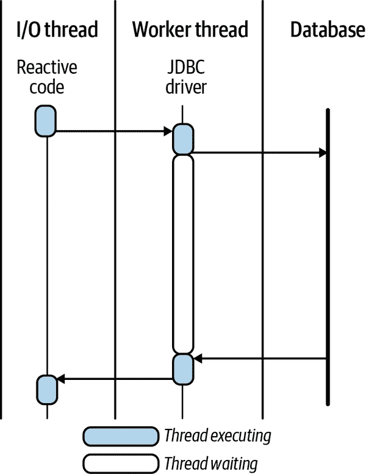
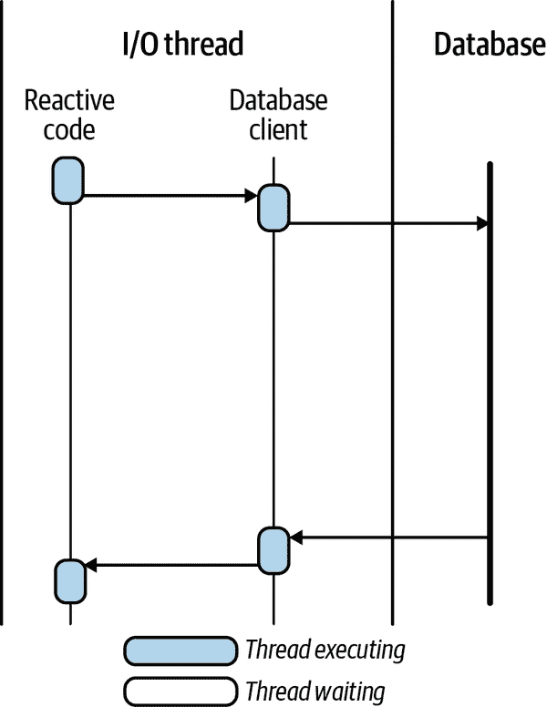
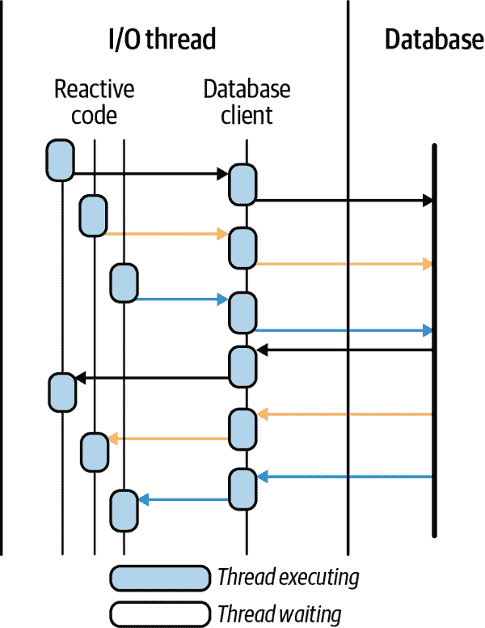
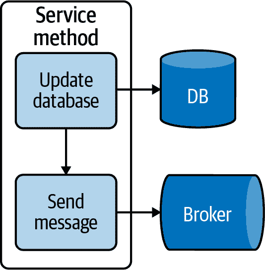
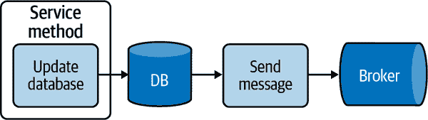
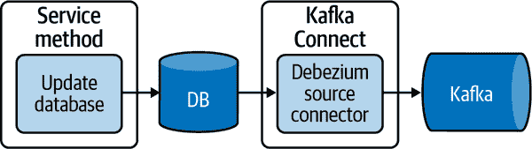

# 第九章。反应式访问数据

在第五章中，我们解释了在应用程序中使用阻塞 I/O 的可伸缩性和鲁棒性问题。本章重点讨论与数据库交互以及 Quarkus 如何确保应用程序堆栈的数据层可以是异步的，并且也能利用非阻塞 I/O。

# 数据访问的问题

以前访问关系数据涉及使用阻塞 I/O，同时与数据库通信。正如在第五章中已讨论的那样，我们希望在应用程序的任何堆栈层次上都避免使用阻塞 I/O。与数据库的交互通常需要相当长的时间才能完成，具体取决于涉及的记录数量，这对我们的应用程序产生了更大的影响，使用阻塞 I/O 访问数据库！这是什么意思？让我们说我们开发了一个小型数据库应用程序；多年来我们开发了许多这样的应用程序。我们经常将它们称为*CRUD*应用程序，因为它们为数据库中的记录提供了创建、读取、更新和删除操作。

我们 API 中的每个暴露的端点都需要与数据库进行交互。我们将忽略缓存以及它们在某些情况下减少向数据库发出的请求次数的方式。每个端点方法调用数据库时，每次执行都执行阻塞 I/O，从而降低并发性。

当与数据库交互时，为什么我们被迫使用阻塞 I/O？与数据库交互的 API，如开放数据库连接 (ODBC) 和 Java 数据库连接 (JDBC)，设计时采用了同步和阻塞的方法。而 Java 持久化 API (JPA)，虽然在许多年后统一了对象关系映射 (ORM) 的 API，但仍然基于 JDBC 现有的同步和阻塞行为设计。

没有采用反应式编程方法来访问数据，整个应用程序堆栈永远无法真正做到反应式。应用程序可能仅在某一点上是反应式的。尽管仍然有益，但并发性和吞吐量仍然无法充分发挥其潜力。

这里有很多话解释了 JDBC 和 JPA 访问数据库不是反应式的，因此是阻塞的，但实际访问是什么样子呢？正如您在“命令模型”中看到的应用程序逻辑一样，对于数据库交互也是一个类似的问题，如图 9-1 所示。



###### 图 9-1。阻塞数据库客户端

当我们通过 JDBC 或更高抽象的 JPA 与数据库通信时，JDBC 驱动使用请求和响应交互。然而，如图 9-1 所示，JDBC 驱动程序在收到任何响应之前会阻塞线程。这种阻塞方式占用了每个数据库交互的一个完整线程。根据你如何配置数据库连接池，应用程序在达到最大数据库连接数之前可能会用尽线程。

当处理大量数据库记录的搜索或检索，以及应用程序和数据库之间的网络延迟时，线程饥饿或资源利用的问题可能会发生。

# 与关系数据库的非阻塞交互

随着各项目的最新工作，例如为 PostgreSQL、MySQL、IBM Db2、Oracle 和 Microsoft SQL Server 的[Vert.x 客户端 API](https://oreil.ly/GSE6G)，Java 应用程序现在能够以异步方式与数据库进行非阻塞 I/O 交互。

这些新客户端与 JDBC 相比有什么不同？使用非阻塞数据库客户端时，我们能够避免线程阻塞，如图 9-2 所示。



###### 图 9-2\. 非阻塞数据库客户端

此外，现在数据库客户端可以在 I/O 线程上执行，而不是工作线程。我们现在使用这些新非阻塞客户端获得了一个复合的好处：减少应用程序可能需要的工作线程数量，因为这些新客户端的数据库通信可以在与任何反应式应用程序代码相同的线程上进行！

在图 9-2 中，我们看到一个单一的数据库连接用于数据库客户端通信。然而，当客户端 API 和数据库支持时，我们可以利用管道技术，将单一数据库连接用于多个请求。图 9-3 展示了数据库客户端中的管道技术是如何工作的。



###### 图 9-3\. 使用管道的非阻塞数据库客户端

图 9-3 中的每种颜色代表一个独立的数据库请求。尽管我们有不同的反应式处理程序调用数据库，但数据库客户端能够利用单一连接而不是在这种情况下的三个连接。我们希望在可能的情况下利用像这样的非阻塞技术，以便从相同数量的资源中挤出越来越多的应用程序性能。

# 使用反应式 ORM：Hibernate Reactive

*Hibernate ORM* 使开发人员更容易编写那些数据超出应用程序进程生命周期的应用程序。作为一个 ORM 框架，Hibernate 关注的是与关系数据库相关的数据持久性。Hibernate 提供了命令式和反应式的 API。

这些 API 支持两个方面：非阻塞数据库客户端，前一节已经涵盖，以及响应式编程作为与关系数据库交互的手段。大多数现有的 Hibernate 内部机制仍在使用，但是 Hibernate Reactive 引入了一个新的层，用于利用响应式和非阻塞 API 与数据库客户端通信。响应式 API 与 JPA 注解、Hibernate 注解和 Bean Validation 协同工作。

是时候深入使用带有响应式 API 的 Hibernate 了！在 Quarkus 中，由于我们可以选择使用带有*Panache*的 Hibernate Reactive，因此它变得更加强大。这个薄层简化了 Hibernate ORM 的使用。它提供了两种模型。您的实体可以被管理为活动记录，因为实体类提供了检索、更新和查询该实体类实例的方法。您还可以使用仓库模型，其中仓库类提供这些功能，保持实体结构的*纯洁性*。请查看*chapter-9/hibernate-reactive*目录以获取所有 Hibernate Reactive 项目代码。首先，我们需要 Hibernate Reactive 的依赖项（示例 9-1）。

##### 示例 9-1\. Hibernate Reactive 依赖项（*chapter-9/hibernate-reactive/pom.xml*）

```java
<dependency>
    <groupId>io.quarkus</groupId>
    <artifactId>quarkus-hibernate-reactive-panache</artifactId>
</dependency>
```

注意，我们使用了 Hibernate Reactive 的 Panache 版本。如果我们不想使用 Panache，我们可以改用`quarkus-hibernate-reactive`依赖项。如前所述，我们还需要一个响应式数据库客户端。在这个例子中，我们将使用 PostgreSQL 客户端（示例 9-2）。

##### 示例 9-2\. PostgreSQL 数据库客户端依赖项（*chapter-9/hibernate-reactive/pom.xml*）

```java
<dependency>
    <groupId>io.quarkus</groupId>
    <artifactId>quarkus-reactive-pg-client</artifactId>
</dependency>
```

使用[Dev Services](https://oreil.ly/eKY8W)，这是 Quarkus 的一个功能，可以自动启动所需的基础设施部件，我们不再需要 Docker Maven 插件来启动运行测试所需的数据库。Quarkus 将自动为我们启动数据库！为了利用 Dev Services，我们需要一个数据库驱动程序，我们刚刚在示例 9-2 中添加了它，并设置`db.kind`以告知 Quarkus 正在使用的数据库类型。现在让我们在`application.properties`中设置它（示例 9-3）。

##### 示例 9-3\. PostgreSQL 数据库客户端配置（*chapter-9/hibernate-reactive/src/main/resources/application.properties*）

```java
quarkus.datasource.db-kind=postgresql
%prod.quarkus.datasource.username=quarkus_test
%prod.quarkus.datasource.password=quarkus_test
%prod.quarkus.datasource.reactive.url=vertx-reactive:postgresql://
    localhost/quarkus_test
```

使用 Dev Services 时，除了`db.kind`以外的所有属性都在`prod`配置文件中指定。我们也可以完全从`prod`配置文件中删除这些属性，而是选择使用环境变量或 Kubernetes 中的 ConfigMap 进行设置。

我们有一个`Customer`实体，扩展了`PanacheEntity`。我们在这里不会详细介绍`Customer`，因为它使用了来自 JPA、Bean Validation 和 Hibernate Validator 的通常注解。完整的源代码可以在*chapter-9/hibernate-reactive/src/main/java/org/acme/data/Customer*查看。

让我们看一下使用 Hibernate Reactive 和 RESTEasy Reactive 实现 CRUD 应用程序的实现。首先是从数据库检索所有客户的方法（Example 9-4）。

##### Example 9-4\. 检索所有客户 (*chapter-9/hibernate-reactive/src/main/java/org/acme/data/CustomerResource.java*)

```java
public Multi<Customer> findAll() {
  return Customer.streamAll(Sort.by("name"));
}
```

我们使用 `Customer` 上的 `streamAll`，从 Panache 中检索所有实例到 `Multi`。每个客户可能有与之关联的订单，当我们检索单个客户时，我们也想检索他们的订单。虽然我们有一个单一的应用程序，但我们将考虑订单来自外部服务。

首先，我们定义 `Uni` 来检索 `Customer`，并在未找到时抛出异常，如 Example 9-5 所示。

##### Example 9-5\. 查找客户 (*chapter-9/hibernate-reactive/src/main/java/org/acme/data/CustomerResource.java*)

```java
Uni<Customer> customerUni = Customer.<Customer>findById(id)
    .onItem().ifNull().failWith(
        new WebApplicationException("Failed to find customer",
        Response.Status.NOT_FOUND)
    );
```

接下来，客户的订单作为 `List` 单独检索到另一个 `Uni`（见 Example 9-6）。

##### Example 9-6\. 获取客户订单 (*chapter-9/hibernate-reactive/src/main/java/org/acme/data/CustomerResource.java*)

```java
Uni<List<Order>> customerOrdersUni = orderService.getOrdersForCustomer(id);
```

最后，这两者通过一个映射器组合在一起，每个 `Uni` 的结果设置为客户的订单。最终的 `Uni` 转换为 JAX-RS `Response` 来完成端点的执行（Example 9-7）。

##### Example 9-7\. 结合 `customer` 和 `orders` (*chapter-9/hibernate-reactive/src/main/java/org/acme/data/CustomerResource.java*)

```java
return Uni.combine()
    .all().unis(customerUni, customerOrdersUni)
    .combinedWith((customer, orders) -> {
      customer.orders = orders;
      return customer;
    })
    .onItem().transform(customer -> Response.ok(customer).build());
```

到目前为止，我们所做的一切都不需要事务，因为我们只是在读取数据库记录。Example 9-8 展示了如何使用事务来存储新客户。

##### Example 9-8\. 创建客户 (*chapter-9/hibernate-reactive/src/main/java/org/acme/data/CustomerResource.java*)

```java
return Panache
    .withTransaction(customer::persist)
    .replaceWith(Response.ok(customer).status(Response.Status.CREATED).build());
```

我们使用 `Panache.withTransaction` 来通知 Panache 我们想要一个事务来包装我们传递给它的 `Uni` `Supplier`。在这个例子中，我们使用 `customer.persist` 作为要用事务包装的代码。尽管成功时返回 `Uni<Void>`，但我们可以使用 `replaceWith` 来创建必要的 `Uni<Response>`。

接下来，我们使用 `withTransaction` 更新客户名称。首先，我们通过 ID 检索客户。然后，当我们接收到一个非 `null` 的项目时，我们会 `invoke` 一个可运行对象来更新检索到的实体的名称（Example 9-9）。

##### Example 9-9\. 更新客户 (*chapter-9/hibernate-reactive/src/main/java/org/acme/data/CustomerResource.java*)

```java
return Panache
    .withTransaction(
        () -> Customer.<Customer>findById(id)
            .onItem().ifNotNull().invoke(entity -> entity.name = customer.name)
    )
```

然后，我们利用 `onItem` 来生成成功响应的结果，或者如果项目为 `null` 则返回 `not found` 响应。

使用 Hibernate Reactive 创建 CRUD 应用程序的最后一个方法提供了删除客户的功能。再次使用 `withTransaction`，传递 Panache 方法按其 ID 删除客户。删除实体返回 `Uni<Boolean>`。我们需要使用 `map` 根据其成功来将其转换为 JAX-RS 响应 (示例 9-10)。

##### 示例 9-10\. 删除一个客户 (*chapter-9/hibernate-reactive/src/main/java/org/acme/data/CustomerResource.java*)

```java
return Panache
    .withTransaction(() -> Customer.deleteById(id))
    .map(deleted -> deleted
        ? Response.ok().status(Response.Status.NO_CONTENT).build()
        : Response.ok().status(Response.Status.NOT_FOUND).build());
```

现在你已经看到如何使用 Panache 和 Hibernate Reactive 创建、检索、更新和删除实体！要了解端点如何进行测试，请查看书中代码示例中的 */chapter-9/hibernate-reactive/src/test/java/org/acme/data/CustomerEndpointTest*。

# NoSQL 怎么样？

我们已经展示了如何在传统 ORM（如 Hibernate）中具有反应式 API，那么在需要 NoSQL 数据库而不是关系数据库时，我们能否利用反应式 API？答案是肯定的！

Quarkus 有几个扩展可用于与 NoSQL 数据库通信，包括 MongoDB、Redis 和 Apache Cassandra。所有这些扩展是否支持反应式 API？目前，MongoDB、Redis 和 Cassandra 客户端都支持反应式 API。

在下一节中，我们将开发一个与上一节中 Hibernate Reactive 示例具有相同功能的 CRUD 应用程序。

# 与 Redis 的交互

让我们开发一个与 Redis 一起使用的客户 CRUD 应用程序！对于这个示例，我们将交互提取到一个可以注入到 REST 资源中的单独服务中。查看代码示例中的 */chapter-9/redis/src/main/java/org/acme/data/CustomerResource*，了解服务的使用方式。

首先，我们需要项目中的 Redis 客户端依赖项；请参阅 示例 9-11。

##### 示例 9-11\. Redis 客户端依赖项 (*chapter-9/redis/pom.xml*)

```java
<dependency>
    <groupId>io.quarkus</groupId>
    <artifactId>quarkus-redis-client</artifactId>
</dependency>
```

就像我们在 Hibernate Reactive 示例中所做的那样，我们将利用 `docker-maven-plugin` 运行一个 Redis 容器以进行测试执行。有关详细信息，请查看书籍源码中的 *chapter-9/redis/pom.xml*。

接下来，我们配置 Redis 客户端的服务器主机位置。将配置包含在 `application.properties` 中的 示例 9-12 中。

##### 示例 9-12\. Redis 客户端配置 (*chapter-9/redis/src/main/resources/application.properties*)

```java
quarkus.redis.hosts=redis://localhost:6379
```

要能够使用 Redis 客户端，我们需要进行 `@Inject`，如 示例 9-13 中所示。

##### 示例 9-13\. 注入 Redis 客户端 (*chapter-9/redis/src/main/java/org/acme/data/CustomerService.java*)

```java
@Inject
ReactiveRedisClient reactiveRedisClient;
```

为了避免在 Redis 中意外创建键冲突，我们将给客户 ID 添加前缀，如 示例 9-14 所示。

##### 示例 9-14\. 键前缀 (*chapter-9/redis/src/main/java/org/acme/data/CustomerService.java*)

```java
private static final String CUSTOMER_HASH_PREFIX = "cust:";
```

让我们从 Redis 中检索所有客户的列表开始 (示例 9-15)。

##### 示例 9-15\. 检索所有客户 (*chapter-9/redis/src/main/java/org/acme/data/CustomerService.java*)

```java
public Multi<Customer> allCustomers() {
  return reactiveRedisClient.keys("*")
      .onItem().transformToMulti(response -> {
        return Multi.createFrom().iterable(response).map(Response::toString);
      })
      .onItem().transformToUniAndMerge(key ->
          reactiveRedisClient.hgetall(key)
              .map(resp ->
                  constructCustomer(
                      Long.parseLong(
                          key.substring(CUSTOMER_HASH_PREFIX.length())),
                      resp)
              )
      );
}
```

`ReactiveRedisClient`提供了与 Redis 可用命令对齐的 API，在 Java 中如果您已经熟悉使用 Redis 命令，则更容易使用。在示例 9-15 中，我们使用带有通配符的`keys`检索所有键，这将返回`Uni<Response>`。这个特定的`Response`类表示来自 Redis 的响应。

在从 Redis 接收响应（项）后，我们使用`transformToMulti`将单个响应分隔成单个键。在 lambda 中，我们直接从响应中创建一个字符串键的`Multi`，因为它是`Iterable`，并将值映射到键的字符串。执行的结果是`Multi<String>`。

我们还没有完成；我们需要将键流转换为客户流。阅读代码可以很好地了解发生了什么。从`Multi<String>`开始，对每个生成的项调用`transformToUniAndMerge`。我们使用它们的键或项与 Redis 客户端一起检索与键或哈希匹配的所有字段和值。从`hgetall`的响应映射到`Customer`实例，使用`constructCustomer`。最后，客户`Uni`实例合并成一个`Multi`以返回。

要检索单个客户，我们调用`hgetall`，根据响应的大小，要么返回`null`，要么使用`constructCustomer`创建客户（示例 9-16）。我们需要检查响应的大小，以确定是否返回了任何字段和值。如果大小为零，则响应为空，因为找不到键。

##### 示例 9-16\. 检索客户 (*chapter-9/redis/src/main/java/org/acme/data/CustomerService.java*)

```java
public Uni<Customer> getCustomer(Long id) {
  return reactiveRedisClient.hgetall(CUSTOMER_HASH_PREFIX + id)
      .map(resp -> resp.size() > 0
          ? constructCustomer(id, resp)
          : null
      );
}
```

要将客户记录存储到 Redis 中，我们使用`hmset`为单个键存储多个字段和值。从 Redis 的角度看，无论我们是存储新客户还是更新现有客户，我们都使用`hmset`。我们应该将行为拆分为一个单独的方法，在两个地方重用它，如示例 9-17 所示。

##### 示例 9-17\. 存储客户 (*chapter-9/redis/src/main/java/org/acme/data/CustomerService.java*)

```java
return reactiveRedisClient.hmset(
    Arrays.asList(CUSTOMER_HASH_PREFIX + customer.id, "name", customer.name)
)
    .onItem().transform(resp -> {
      if (resp.toString().equals("OK")) {
        return customer;
      } else {
        throw new NoSuchElementException();
      }
    });
```

使用`hmset`时，我们需要确保传递给它的参数数量是奇数。第一个参数是记录的哈希，然后是成对匹配的字段和值，用于设置尽可能多的字段。如果成功，我们收到一个简单的`OK`回复，使用`transform`在成功时返回客户或抛出异常。

使用`storeCustomer`后，让我们看看`createCustomer`；参见示例 9-18。

##### 示例 9-18\. 创建客户 (*chapter-9/redis/src/main/java/org/acme/data/CustomerService.java*)

```java
public Uni<Customer> createCustomer(Customer customer) {
  return storeCustomer(customer);
}
```

我们有一个非常干净的方法`createCustomer`，响应`Uni<Customer>`！对此没有太多要说的，所以让我们看看`updateCustomer`在示例 9-19 中。

##### 示例 9-19\. 更新客户（*chapter-9/redis/src/main/java/org/acme/data/CustomerService.java*）

```java
public Uni<Customer> updateCustomer(Customer customer) {
  return getCustomer(customer.id)
      .onItem().transformToUni((cust) -> {
        if (cust == null) {
          return Uni.createFrom().failure(new NotFoundException());
        }
        cust.name = customer.name;
        return storeCustomer(cust);
      });
}
```

首先，我们从服务中重用`getCustomer`以从 Redis 中检索现有的客户。当从`getCustomer`返回一个项目时，我们将其转换为另一个带有映射器的`Uni`。映射器首先检查我们接收到的项目，即客户是否为 null，如果是，则返回包含异常的`Uni`失败。然后我们设置新的名称到客户上，然后调用`storeCustomer`，创建映射器返回的`Uni`。

最后，我们需要一种方法来删除客户。为此，我们在 Redis 客户端上使用`hdel`，它返回删除的字段数或者如果找不到键则返回`0`（示例 9-20）。我们将`Uni<Response>`映射到`Uni<Boolean>`，检查是否删除了一个字段（在本例中是客户名称），如果项目为 null，则返回`NotFoundException`，或者成功并将项目转换为 null 项目。

##### 示例 9-20\. 删除客户（*chapter-9/redis/src/main/java/org/acme/data/CustomerService.java*）

```java
public Uni<Void> deleteCustomer(Long id) {
  return reactiveRedisClient.hdel(Arrays.asList(CUSTOMER_HASH_PREFIX + id, "name"))
      .map(resp -> resp.toInteger() == 1 ? true : null)
      .onItem().ifNull().failWith(new NotFoundException())
      .onItem().ifNotNull().transformToUni(r -> Uni.createFrom().nullItem());
}
```

本节简要介绍了利用 Redis 的响应式客户端的一些方法。我们没有涵盖许多其他方法，但本节提供了它们如何通常使用的指导。

# 数据相关事件和变更数据捕获

*变更数据捕获*，或*CDC*，是一种从通常不使用事件和消息的来源（如数据库）提取事件的集成模式。CDC 具有许多优点，包括能够从不修改应用程序的传统应用程序中产生变更事件。

另一个好处是 CDC 不关心应用程序开发的语言，因为它与数据库交互。这种方法可以大大简化从具有多语言应用程序写入的数据库中产生一致外观的变更事件的工作量。必须更新可能有数十个以不同语言编写的应用程序以从它们所有的应用程序中生成一致外观的变更事件可能是具有挑战性和耗时的。

写入数据库涉及事务，通常应该这样，并在将事件写入消息系统时增加了额外的复杂性。在图 9-4 中，我们需要确保如果数据库更新失败或生成消息失败，一切都会回滚并撤消任何更改。



###### 图 9-4\. 写入数据库和消息代理

当事务回滚可能发生在我们的应用代码之外时，情况可能会特别复杂，例如由于未返回 HTTP 响应而导致。使用 CDC，这种担忧消失了，因为我们只关心写入数据库本身。

任何更改事件都可以通过 CDC 从更新后的数据库流出，确保我们不会发送任何不应该发送的事件，因为 CDC 在看到更改之前事务已经提交，如图 9-5 所示。



###### 第 9-5 图：写入数据库，CDC 触发消息创建

开发人员需要注意的一个影响是 CDC 不提供强一致性。*强一致性*意味着在更新后立即查看的任何数据对于所有数据观察者都是一致的，无论观察者是否在并行或分布式进程中。对于关系数据库，这是有保证的，因为它是数据库设计的一部分。使用 CDC，数据库中发生更新和最远的下游系统接收并处理消息的时间之间存在一段时间。

缺乏强一致性，或*最终一致性*，并不妨碍使用 CDC。我们希望开发人员了解 CDC 模式的一致性保证，并在应用程序设计中牢记这一点。

# 使用 Debezium 捕获更改

[Debezium](https://debezium.io/)是一个用于 CDC 的分布式平台。Debezium 是耐用且快速的，使应用能够迅速响应并且不会错过任何事件！

图 9-6 显示了 Debezium 在使用 CDC 的应用程序架构中的位置。Debezium 为几个数据库提供了 Kafka Connect 源连接器，包括 MySQL、MongoDB、PostgreSQL、Oracle、Db2 和 SQL Server。



###### 第 9-6 图：CDC 与 Debezium

我们将简要展示如何使用 Debezium 增强上一节中的 Hibernate Reactive 示例。完整的细节可以在书的[源代码](https://oreil.ly/XTQQp)中找到。

尽管此示例包含来自 Hibernate Reactive 的代码副本，但也可以直接使用示例，因为引入 Debezium 不会影响应用程序代码。要理解的主要部分是*docker-compose.yml*文件。该文件启动 Kafka 容器，ZooKeeper 作为 Kafka 的依赖项，PostgreSQL 数据库和 Kafka Connect。我们将使用 Debezium 项目中的容器映像来简化部署过程。例如，PostgreSQL 容器映像已经包含了向 Kafka Connect 通信更改事件所需的逻辑解码插件。

使用 `docker compose up` 启动所有容器，然后使用 `java -jar target/quarkus-app/quarkus-run.jar` 构建并启动应用程序。一旦所有容器启动完成，我们就可以为 PostgreSQL 安装 Debezium 源连接器到 Kafka Connect 中（Example 9-21）。

##### Example 9-21\. 安装 Debezium 源连接器

```java
curl -i -X POST -H "Accept:application/json" -H "Content-Type:application/json" \
    http://localhost:8083/connectors/ -d @register.json
```

在这里，*register.json* 是我们传递给 Kafka Connect 端点的数据。该文件提供了要连接的数据库的详细信息和要使用的 Debezium 连接器，如 Example 9-22 所示。

##### Example 9-22\. Debezium 源连接器定义

```java
{
  "name": "customer-connector",
  "config": {
    "connector.class": "io.debezium.connector.postgresql.PostgresConnector",
    "tasks.max": "1",
    "database.hostname": "postgres",
    "database.port": "5432",
    "database.user": "quarkus_test",
    "database.password": "quarkus_test",
    "database.dbname": "quarkus_test",
    "database.server.name": "quarkus-db-server"
  }
}
```

安装源连接器将触发为连接器发现的表创建 Kafka 主题。我们可以通过运行 `docker exec -ti kafka bin/kafka-topics.sh --list --zookeeper zookeeper:2181` 来验证创建了哪些主题。

接下来我们在 Kafka 容器中运行一个 *exec* shell，以消费来自客户数据库主题的消息，即 `quarkus-db-server.public.customer`（Example 9-23）。

##### Example 9-23\. 从 Kafka 消费消息

```java
docker-compose exec kafka /kafka/bin/kafka-console-consumer.sh \
    --bootstrap-server kafka:9092 \
    --from-beginning \                              
    --property print.key=true \
    --topic quarkus-db-server.public.customer
```


删除此设置以跳过应用程序启动时创建的初始四条消息。

当 Example 9-23 完成后，在单独的终端窗口中创建一个新的客户，如 Example 9-24 所示。

##### Example 9-24\. 创建一个客户

```java
curl -X POST -H "Content-Type:application/json" http://localhost:8080/customer \
    -d '{"name" : "Harry Houdini"}'
```

在运行 Example 9-23 的终端中，我们可以看到连接器创建的 JSON 消息（Example 9-25）。

##### Example 9-25\. 创建客户的 CDC 消息

```java
{
  "schema": {
    "type":"struct",
    "fields": [{
      "type":"int64",
      "optional":false,
      "field":"id"
    }],
    "optional":false,
    "name":"quarkus_db_server.public.customer.Key"
  },
  "payload": {
    "id":9                    
  }
}
{
  "schema": {
    // JSON defining the schema of the payload removed for brevity

    "optional": false,
    "name": "quarkus_db_server.public.customer.Envelope"
  },
  "payload": {
    "before": null,
    "after": {
      "id": 9,                       
      "name": "Harry Houdini"        
    },
    "source": {
      "version": "1.5.0.Final",
      "connector": "postgresql",
      "name": "quarkus-db-server",
      "ts_ms": 1627865571265,
      "snapshot": "false",
      "db": "quarkus_test",
      "sequence": "[null,\"23870800\"]",
      "schema": "public",
      "table": "customer",
      "txId": 499,
      "lsn": 23871232,
      "xmin": null
    },
    "op": "c",
    "ts_ms": 1627865571454,
    "transaction": null
  }
}
```


使用 `POST` 创建记录的 ID


创建的客户名称

尝试使用其他 HTTP 命令进行实验，比如更新客户姓名，以比较在 Kafka 主题中收到的 JSON。

# 摘要

近年来，使用响应式应用程序处理数据一直受到限制，因为缺乏响应式数据库客户端 API。随着 Vert.x 为 PostgreSQL 等数据库提供的客户端 API 的引入，我们现在可以创建一个完全响应式的应用程序栈。

我们并不总是想直接使用数据库客户端 API。我们喜欢像 Hibernate ORM 提供的简化 API。Hibernate Reactive 给了我们这样的能力，它在 Hibernate ORM 的基础上添加了响应式特定的 API。

关系型数据库不是唯一的选择。我们还为 Redis 和 MongoDB 提供了响应式客户端。在事件驱动架构中，我们希望能够从数据库交互中创建事件。这就是 CDC 的优势所在，它能够从数据库表中提取变更并创建变更事件以供输入 Kafka。

我们现在已经到达了第三部分的结尾！我们深入探讨了 Quarkus，发现它统一了命令式和反应式编程模型，为开发人员在选择应用程序堆栈时提供了更大的灵活性。然后，我们通过`Uni`和`Multi`深入了解了 Quarkus 中首选的反应式编程库 Mutiny。继续探索 Quarkus 中的新创新，我们探索了 RESTEasy Reactive，以完全非阻塞的方式开发 JAX-RS 资源，同时仍然提供需要时进行阻塞的能力，然后通过 Hibernate Reactive 和 Redis 完成了反应式数据库客户端的介绍。

在第四部分，我们聚焦于开发反应式应用程序时需要的典型模式，例如使用 Kafka 和 AMQP 进行消息传递。然后，我们深入系统底层消息传递的各个方面，以更好地理解权衡和它们的能力。我们查看了通过 HTTP 客户端与外部服务通信的方式，同时利用非阻塞 I/O。最后，虽然不一定是应用程序模式本身，但我们将研究可观察性，因为对于分布式系统而言，理解和实现它至关重要。
