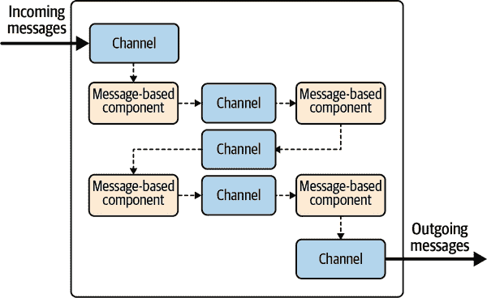
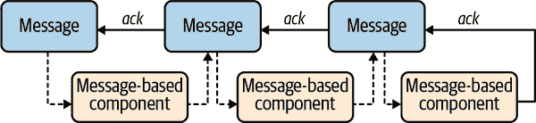

# 第十章. 反应式消息传递：连接的纽带

在 第 III 部分 中，您已经看到了许多使用 Quarkus 开发反应式应用程序的特性。但是，正如您从 第 II 部分 中记得的那样，我们不想局限于反应式应用程序；我们想要构建反应式系统。这就是我们现在要做的。

反应式系统使用其组件之间的异步消息传递。然而，尽管中间件和框架有时可以隐藏这种消息传递的细节，但我们认为将其显露出来效果更好。这不仅有助于编写事件驱动的代码（*在事件 x 上执行 y*），还有助于将您的应用程序分解为接收和生成消息的一组组件。因此，Quarkus 提供了一个简单而强大的消息驱动开发模型，用于消费、处理和创建消息。本章重点介绍这种模型，以及它与反应式流的关系，以及如何简化构建基于消息驱动和事件驱动的应用程序。

# 从反应式应用程序到反应式系统

当您与 Java 开发人员讨论消息传递时，您会感受到他们的挫败感。多年来，JMS 一直是消息传递的事实标准。然而，该 API 的老化问题日益严重，而新的消息传递技术如 Kafka 和 Pulsar 使用的概念与 JMS 不兼容。此外，JMS 是一个阻塞式 API，这阻碍了我们实现反应式原则。

虽然 Quarkus 可以使用 JMS，但我们将看看另一种称为 *反应式消息传递* 的方法。这个 MicroProfile 规范构建了反应式和事件驱动的应用程序。Quarkus 实现了规范的 2*.x* 版本，同时还提供了许多扩展功能。

使用反应式消息传递的应用程序可以以与协议无关的方式发送、消费和处理消息。例如，正如您将在 第十一章 中看到的那样，您可以使用 Apache Kafka 或 AMQP，甚至可以将两者结合使用。反应式消息传递还为习惯于上下文和依赖注入（CDI）的开发人员提供了一种自然的开发模型，这是一个标准的依赖注入框架。通常，您可以用几个注解来总结反应式消息传递。但在看它实际运作之前，让我们先描述一些它依赖的概念。

## 通道和消息

在使用反应式消息传递时，您的应用程序和组件通过 *消息* 进行交互，这些消息由 `o⁠r⁠g.e⁠c⁠l⁠i⁠p⁠s⁠e.m⁠i⁠c⁠r⁠o⁠p⁠r⁠o⁠f⁠i⁠l⁠e⁠.​r⁠e⁠a⁠c⁠t⁠i⁠v⁠e⁠.m⁠e⁠s⁠s⁠a⁠g⁠i⁠n⁠g⁠.M⁠e⁠s⁠s⁠a⁠g⁠e⁠<T>` 类来表示。*消息* 是一个信封，其负载类型为 `T`。此外，消息可以具有元数据，并提供确认方法来通知框架消息的成功或失败处理。

消息在 *通道* 上传输。您可以将通道想象成管道。通道可以是应用程序内部的，也可以通过连接器映射到外部消息队列或主题（图 10-1）。



###### 图 10-1\. 基于消息的应用架构

你的应用程序从通道读取并写入通道。你可以将你的应用程序分割成一组组件，它们都从不同的通道读取和写入。就是这样。响应式消息传递将所有内容绑在一起，从而构建消息流。

## 生成消息

响应式消息传递提供了多种生成消息的方式，但让我们从最简单且可能更符合熟悉命令式编程的开发者的方式开始：发射器。`Emitter`是一个附加到通道并将消息发射到该通道的对象。^(1) 示例 10-1 说明了使用`MutinyEmitter`发送消息的方法。

##### 示例 10-1\. 使用发射器发送消息

```java
@Channel("my-channel")
MutinyEmitter<Person> personEmitter;

public Uni<Void> send(Person p) {
    return personEmitter.send(p);
}
```

要访问一个发射器，只需在你的 CDI bean 中注入它。目标通道使用`@Channel`注解指示。

###### 提示

不需要使用`@Inject`注解，因为 Quarkus 会自动检测注入。

在 示例 10-1 中，我们不会生成一个`Message`实例；我们只发送一个被自动包装成消息的负载（`Person`）。请注意，`send`方法返回`Uni<Void>`。这个 `Uni` 在消息处理成功完成时生成一个`null`项。否则，它会生成一个指示处理失败原因的故障。

发射器也可以直接发送`Message`的实例，就像 示例 10-2 中展示的那样。

##### 示例 10-2\. 注入和使用发射器

```java
@Channel("my-second-channel")
MutinyEmitter<Person> messageEmitter;

public void sendMessage(Person p) {
    messageEmitter.send(
            Message.of(p,
                    () -> {
                        // Acknowledgment callback
                        return CompletableFuture.completedFuture(null);
                    },
                    failure -> {
                        // Negative-acknowledgment callback
                        return CompletableFuture.completedFuture(null);
                    })
    );
}
```

当发送`Message`时，你可以直接传递确认回调。我们在 “确认” 中讨论确认。

当你希望决定何时发送消息时，发射器就非常方便。它们允许命令式代码发射消息，这些消息将以反应式方式处理。例如，你可以在 HTTP 端点中使用发射器，在收到请求时发送消息。

另一种生成消息的方式是使用`@Outgoing`注解。它指示响应式消息传递将方法的输出发送到指定的通道。请注意，使用`@Outgoing`注解的方法不能从你的代码中调用；响应式消息传递会为你调用它们。也许你会对它的好处感到好奇。它看起来比发射器灵活性稍逊。但有一个技巧：`@Outgoing`允许直接生成流（`Multi`）（示例 10-3）。

##### 示例 10-3\. 使用`@Outgoing`

```java
@Outgoing("my-channel")
Multi<Person> produceAStreamOfPersons() {
    return Multi.createFrom().items(
            new Person("Luke"),
            new Person("Leia"),
            new Person("Obiwan")
    );
}
```

你可以每秒产生无限流，正如 示例 10-4 中演示的那样。

##### 示例 10-4\. 使用`@Outgoing`生成无限流

```java
@Outgoing("ticks")
Multi<Long> ticks() {
    return Multi.createFrom().ticks()
            .every(Duration.ofSeconds(1))
            .onOverflow().drop();
}
```

当应用程序启动时，响应式消息连接所有元素到通道。在幕后，它创建了响应式流（在第 5 章中讨论）。因此，您的应用程序是一组响应式流，强制执行背压协议。消费速率由下游订阅者控制。这就是为什么在前面的示例中我们需要`onOverflow.drop`。否则，如果下游订阅者不能及时消费，它将失败（您无法及时应用背压）。

至于`Emitter`，您可以生成消息流（示例 10-5）。

##### 示例 10-5\. 通过`@Outgoing`生成消息流

```java
@Outgoing("my-channel")
Multi<Message<Person>> produceAStreamOfMessagesOfPersons() {
    return Multi.createFrom().items(
            Message.of(new Person("Luke")),
            Message.of(new Person("Leia")),
            Message.of(new Person("Obiwan"))
    );
}
```

在这里，我们的消息只是包装了有效负载。正如我们在示例中看到的，您可以传递确认回调。

细心的读者可能已经观察到发射器和`@Outgoing`方法之间的显著差异。响应式消息完全处理`@Outgoing`方法（调用它），因此强制执行背压协议没有问题。但是对于发射器，响应式消息无法做到这一点。如果您的代码使用发射器发送消息速度快于消费率，您可能会遇到麻烦！

幸运的是，为了避免这种情况，在使用发射器时，您可以配置溢出策略。此策略描述了当下游消费不够快时会发生什么。`@OnOverflow`提供了六种策略。最常见的示例在示例 10-6 中演示了使用缓冲区。

##### 示例 10-6\. 使用`@OnOverflow`注解的用法

```java
@Channel("channel")
@OnOverflow(value = OnOverflow.Strategy.BUFFER, bufferSize = 100)
MutinyEmitter<Person> emitterUsingABufferOnOverflow;

@Channel("channel")
@OnOverflow(value = OnOverflow.Strategy.UNBOUNDED_BUFFER)
MutinyEmitter<Person> emitterUsingAnUnboundedOnOverflow;

@Channel("channel")
@OnOverflow(value = OnOverflow.Strategy.DROP)
MutinyEmitter<Person> emitterDroppingMessageOnOverflow;

@Channel("channel")
@OnOverflow(value = OnOverflow.Strategy.LATEST)
MutinyEmitter<Person> emitterDroppingOlderMessagesOnOverflow;

@Channel("channel")
@OnOverflow(value = OnOverflow.Strategy.FAIL)
MutinyEmitter<Person> emitterSendingAFailureDownstreamOnOverflow;

@Channel("channel")
@OnOverflow(value = OnOverflow.Strategy.THROW_EXCEPTION)
MutinyEmitter<Person> emitterThrowingExceptionUpstreamOnOverflow;
```

`OnOverflow`策略与 Mutiny 中的策略类似：

+   `BUFFER`是默认选项，使用缓冲区来存储消息。可以配置大小；默认大小为 256。

+   `UNBOUNDED_BUFFER`与`BUFFER`类似，但使用无限缓冲区。使用此策略时要小心，因为可能会导致内存问题。

+   `DROP`和`LATEST`分别丢弃最新和最旧的消息。

+   `FAIL`向下游发送失败。请记住，对于响应式流来说，失败是终端的。因此，在此之后您可以使用发射器。

+   `THROW_EXCEPTION`向上游调用`send`方法时抛出异常。调用者可以对此作出反应；例如，它可能等不及下游订阅者赶上。

## 消费消息

让我们看看消息管道的另一侧。要消耗消息，您可以通过使用`@Channel`注解来注入流，如示例 10-7 所示。

##### 示例 10-7\. 注入通道

```java
@Channel("my-channel")
Multi<Person> streamOfPersons;

// ...

void init() {
    streamOfPersons
            .subscribe().with(
                    person -> { /* ... */ },
                    failure -> { /* ... */ }
    );
}
```

正如您所见，您必须订阅注入的流。请记住，如果您不订阅，什么都不会发生，您将不会收到任何消息。请注意，您的代码可以注入多个流并对其进行消费。

您还可以注入消息流。在这种情况下，您必须手动确认消息（示例 10-8）。

##### 示例 10-8\. 注入消息流

```java
@Channel("my-channel")
Multi<Message<Person>> streamOfPersons;

// ...

void init() {
    streamOfPersons
            .subscribe().with(
                    message -> {
                        Person person = message.getPayload();
                        try {
                            // do something
                            // acknowledge
                            message.ack();
                        } catch (Exception e) {
                            message.nack(e);
                        }
                    },
                    failure -> { /* ... */ }
    );
}
```

当你注入一组负载流时，确认会自动为你完成。消息让你在确认方面拥有更多控制权，同时还能通过使用`nack`拒绝消息。此外，你还可以访问消息的元数据。但是，请记住，更多的权力意味着更大的责任。

当你想直接访问流或者控制订阅时，注入`@Channel`非常方便。

响应式消息还提供了一种更声明式的消息消费方式：`@Incoming`注解。这个注解与`@Outgoing`相对应。响应式消息会调用在指定通道上每个消息通过的方法（Example 10-9）。

##### Example 10-9\. 使用`@Incoming`的方法示例

```java
@Incoming("my-channel")
void consume(Person person) {
    // ...
}
```

Example 10-9 提供了一种便捷的方式来处理每个传入的`Person`。你无需担心确认；这已经为你完成。你也可以接收`Message`，就像在 Example 10-10 中展示的那样。

##### Example 10-10\. 使用`@Incoming`接收消息的方法示例

```java
@Incoming("my-channel")
CompletionStage<Void> consume(Message<Person> person) {
    // ...
    return person.ack();
}
```

在这种情况下，就像对于注入消息流的`@Channel`一样，你需要自行处理确认。记住：更多的控制权，也意味着更大的责任。

## 处理消息

现在你已经看到了两端，让我们来看看管道的中间部分：处理。为了处理消息，你需要结合`@Incoming`和`@Outgoing`，就像 Example 10-11 中展示的那样。

##### Example 10-11\. 使用`@Incoming`和`@Outgoing`的方法

```java
@Incoming("from")
@Outgoing("to")
Person process(String name) {
    return new Person(name);
}
```

在这个片段中，我们从`from`通道读取字符串。对于每个接收到的字符串，我们创建一个`Person`实例，然后将其发送到`to`通道。这种方法是同步的，接受一个个体负载并返回一个个体负载。这并不是唯一支持的签名方式。响应式消息支持超过 30 种签名，允许异步处理（例如返回`Uni`），甚至流处理（其中你接收并返回`Multi`），^(2)参见 Example 10-12。

##### Example 10-12\. 流操作示例

```java
@Incoming("from")
@Outgoing("to")
Multi<Person> processStream(Multi<String> inputStream) {
    return inputStream
            .onItem().transform(Person::new);
}
```

除了负载外，你还可以处理消息。但是对于消息的消费，你需要更加注意。确实，你经常需要*链式*消息，或者将传入的消息与你产生的消息链接起来，就像在 Example 10-13 中展示的那样。

##### Example 10-13\. 处理消息

```java
@Incoming("from")
@Outgoing("to")
Message<Person> processMessage(Message<String> msg) {
    return msg.withPayload(new Person(msg.getPayload()));
}
```

在这个片段中，看看`withPayload`方法。`Message`接口提供了多个`with`方法来链接消息。你可能会想为什么将它们链接起来这么重要。这关乎确认。你已经多次见过这个词，现在是解释它的时候了。

## 确认

*确认* 是任何消息系统的重要组成部分。当您使用消息代理时，消费者接收并处理消息时必须向代理指示消息处理完成（成功或失败）。然后代理可以决定是否调度下一个消息，或者在处理失败时重新投递相同的消息。虽然代理策略依赖于代理本身，确认是一个众所周知的概念，大多数消息传递协议都以一种方式或另一种方式使用它。

在响应式消息处理中，每条消息必须被 *ack*（成功确认）或 *nack*（否定确认或未确认）。`Message` 接口提供了 `ack` 和 `nack` 方法来指示消息的成功或失败处理。这两个方法都是异步的，并返回 `CompletionStage<Void>`。实际上，当使用远程代理时，确认消息意味着告诉代理消息是否已成功处理。您将在 第十一章 中看到这些确认如何与 Apache Kafka 和 AMQP 1.0 集成。

在使用单个有效载荷时，响应式消息处理确认（积极或消极）已为您处理。但是，当您接收消息时，您需要调用这些方法或生成一个*链接*到传入消息的消息。这种链接很重要。当下游消费者接收您的消息并对其进行确认时，该消费者还会确认链接的消息。这些链接形成一系列消息，并且确认沿着链条向上传递，直到达到顶部（通常是由发射器产生的消息或来自外部目的地）。

如图 10-2 图 所示，即使处理包含多步骤（可能是异步的）时，链条也允许指示处理结果。



###### 图 10-2\. 确认链

让我们举个例子来说明行为。想象一下从代理接收消息，转换内容，然后将此消息发送到远程服务。对于每个来自代理的消息，此过程都会创建一个链：

```java
[(a) message from broker] -> [(b) message with the transformed content]
```

当一切正常时，框架会确认消息 `(b)`，从而确认消息 `(a)`。消息的成功确认逻辑得以执行。但是，如果与远程服务交互失败，则在消息 `(b)` 上调用 `nack` 方法，这也会在消息 `(a)` 上调用 `nack` 方法。因此，执行与消息 `(a)` 关联的负面确认逻辑。

在更高级的场景中，这个链可能太死板，你会希望获得更多控制。通常情况下，你可能希望决定何时承认特定的消息，或者在处理之前而不是之后决定承认。当使用`Message`时，你有完全的控制权，可以决定故意不链接消息或等待某个条件承认。例如，当从单个消息产生多个消息时，你将在所有生成的消息都被确认后才确认该消息。无论使用情况如何，当使用`Message`时，不要忘记调用`ack`或`nack`。或者，你可以使用`@Acknowledgment`注解以更声明性的方式决定在哪里拆分链。

承认至关重要，而且在响应式消息传递中，所有消息必须被承认或未被承认。从响应式系统实施弹性和恢复模式至关重要。但是我们如何连接应用程序和消息代理？这就是你将在下一节中看到的内容。

## 连接器

*连接器*是将通道映射到外部受控组件（如队列或主题）的特定组件。它们特定于特定的协议或技术。有两种类型的连接器：

入站连接器

这些接收消息并将其传送到通道。它们必须执行响应式流背压协议，并创建具有适当的`ack`和`nack`逻辑的消息。

出站连接器

这些接收来自应用程序内部的消息并将它们发送到外部目的地。因此，它们将内部消息映射到外部格式，并跟踪结果以在传入消息上调用`ack`或`nack`方法。

Quarkus 提供了多个连接器。第十一章详细介绍了 Kafka 和 AMQP 连接器。HTTP 连接器允许将 HTTP 和 WebSockets 与消息处理绑定在一起。Camel 连接器允许集成遗留系统。在应用程序配置中，你需要指定用于每个映射到外部目的地的通道的连接器。

# 构建基于消息的应用程序

足够说了；是时候看看响应式消息传递的实际效果了。此示例位于*chapter-10/hello-messaging*目录中。要使用响应式消息传递，你需要在*pom.xml*文件中具有对`quarkus-smallrye-reactive-messaging`的依赖；参见 Example 10-14。

##### Example 10-14\. Reactive Messaging 扩展的依赖项(*chapter-10/hello-messaging/pom.xml*)

```java
<dependency>
    <groupId>io.quarkus</groupId>
    <artifactId>quarkus-smallrye-reactive-messaging</artifactId>
</dependency>
```

正如你将在下一章中看到的，你还需要为连接器添加依赖项。然而，在本章中，我们不会使用连接器。

响应式消息传递应用程序包含带有`@Incoming`和`@Outgoing`注解的方法的 bean。Example 10-15 包含一个具有三个方法的单个 bean。

##### Example 10-15\. Hello messaging application (*chapter-10/hello-messaging/src/main/java/org/acme/HelloMessaging.java*)

```java
package org.acme;

import io.smallrye.mutiny.Multi;
import org.eclipse.microprofile.reactive.messaging.Incoming;
import org.eclipse.microprofile.reactive.messaging.Outgoing;

import javax.enterprise.context.ApplicationScoped;
import java.time.Duration;

@ApplicationScoped
public class HelloMessaging {

    @Outgoing("ticks")
    public Multi<Long> ticks() {
        return Multi.createFrom().ticks()
                .every(Duration.ofSeconds(1))
                .onOverflow().drop();
    }

    @Incoming("ticks")
    @Outgoing("hello")
    public String hello(long tick) {
        return "Hello - " + tick;
    }

    @Incoming("hello")
    public void print(String msg) {
        System.out.println(msg);
    }

}
```

这些方法形成一个处理管道。第一个方法`ticks`在`ticks`通道上生成消息。该方法返回一个`Multi`，每秒发出一个数字。这个数字被自动包装成一个简单的消息。然后，`hello`方法消费这些 ticks 并产生一个`String`，发送到`hello`通道。最后，`print`方法接收这些消息并在控制台上显示它们。我们在示例 10-16 中得到了这个管道。

##### 示例 10-16\. 处理管道

```java
ticks() ---> [ticks] ---> hello() ----> [hello] ----> print()
```

如果你进入*chapter-10/hello-messaging*目录并运行`mvn quarkus:dev`，你会看到示例 10-17。

##### 示例 10-17\. Hello 消息

```java
Hello - 1
Hello - 2
Hello - 3
```

如您所见，构建消息处理管道非常简单。在幕后，响应式消息创建了一个响应式流并创建了确认链。这将在下一节中进行详细说明。

## 消息和确认

为了更好地理解消息链，让我们看一下 chapter-10/messages-example 目录。在这个模块中，我们创建了`Message`的特定实现(`MyMessage`)，当消息被*acked*或*nacked*时在控制台上显示（示例 10-18）。

##### 示例 10-18\. `Message`的一个实现 (*chapter-10/messages-example/src/main/java/org/acme/MyMessage.java*)

```java
public class MyMessage implements Message<String> {

    private final String payload;

    public MyMessage(String payload) {
        this.payload = payload;
    }

    public MyMessage(long l) {
        this(Long.toString(l));
    }

    @Override
    public String getPayload() {
        return payload;
    }

    @Override
    public Supplier<CompletionStage<Void>> getAck() {
        return () -> {
            System.out.println("Acknowledgment for " + payload);
            return CompletableFuture.completedFuture(null);
        };
    }

    @Override
    public Function<Throwable, CompletionStage<Void>> getNack() {
        return reason -> {
            System.out.println("Negative acknowledgment for "
                    + payload + ", the reason is " + reason);
            return CompletableFuture.completedFuture(null);
        };
    }
}
```

应用程序本身，如示例 10-19 所示，类似于上一节中的一个应用程序。我们每秒生成一条消息，但这次是`MyMessage`的实例，而不是自动包装成消息的有效载荷。`hello`方法接收这些消息并创建一个带有不同有效载荷的新消息。`print`方法保持不变。

##### 示例 10-19\. 消息使用 (*chapter-10/messages-example/src/main/java/org/acme/MessageExample.java*)

```java
@Outgoing("ticks")
public Multi<MyMessage> ticks() {
    return Multi.createFrom().ticks().every(Duration.ofSeconds(1))
            .onOverflow().drop()
            .onItem().transform(MyMessage::new);
}

@Incoming("ticks")
@Outgoing("hello")
public Message<String> hello(Message<String> tick) {
    return tick.withPayload("Hello " + tick.getPayload());
}

@Incoming("hello")
public void print(String msg) {
    System.out.println(msg);
}
```

查看`hello`方法。它返回从接收到的消息构建的新消息。`with`方法将这两条消息链接起来形成链条。当返回的消息被确认时，接收到的消息也被确认。

如果你从*chapter-10/messages-example*目录运行`mvn quarkus:dev`，你应该看到这个：

```java
Hello 1
Acknowledgment for 1
Hello 2
Acknowledgment for 2
Hello 3
Acknowledgment for 3
```

当`print`方法调用完成特定消息时，它确认这条消息（在`hello`方法中创建），这也确认了由`tick`方法发出的消息。这就是为什么你会在控制台上看到“Acknowledgment for…”。

## 失败和负面确认

消息处理可能会失败，在这种情况下，我们期望失败的消息会*nacked*。为了说明这一点，让我们更新代码，当处理第三条消息时抛出异常，如示例 10-20 所示。

##### 示例 10-20\. 抛出异常会否定确认消息

```java
@Incoming("hello")
public void print(String msg) {
    if (msg.contains("3")) {
        throw new IllegalArgumentException("boom");
    }
    System.out.println(msg);
}
```

重新启动应用程序。现在第三条消息被 nacked 了：

```java
Hello 0
Acknowledgment for 0
Hello 1
Acknowledgment for 1
Hello 2
Acknowledgment for 2
2021-05-14 14:49:54,052 ERROR [io.sma.rea.mes.provider]
(executor-thread-1) SRMSG00200:
The method HelloMessaging#print has thrown an exception:
java.lang.IllegalArgumentException: boom
	at HelloMessaging.print(HelloMessaging.java:28)
	// ....
Negative acknowledgment for 3,
the reason is java.lang.IllegalArgumentException: boom
Hello 4
Acknowledgment for 4
```

抛出异常在消息上调用`nack`方法，并沿着链条调用`MyMessage`实例上的`nack`方法。

在这个示例中，我们的 `ack` 和 `nack` 实现是简单的。但它们展示了 `ack` 和 `nack` 如何通知消息代理有关处理结果。

## 流操作

逐个操纵消息很简单，但有时我们需要进行更复杂的处理。为了实现这一点，Reactive Messaging 允许直接操纵消息流。方法不再接收单个消息或负载，而是接收 `Multi` 并产生另一个 `Multi`（见 示例 10-21）。

##### 示例 10-21\. 使用 Reactive Messaging 进行流操作 (*chapter-10/stream-example/src/main/java/org/acme/StreamingExample.java*)

```java
@ApplicationScoped
public class StreamingExample {

    @Outgoing("ticks")
    public Multi<Long> ticks() {
        return Multi.createFrom().ticks().every(Duration.ofSeconds(1))
                .onOverflow().drop();
    }

    @Incoming("ticks")
    @Outgoing("groups")
    public Multi<List<String>> group(Multi<Long> stream) {
        // Group the incoming messages into groups of 5.
        return stream
                .onItem().transform(l -> Long.toString(l))
                .group().intoLists().of(5);
    }

    @Incoming("groups")
    @Outgoing("hello")
    public String processGroup(List<String> list) {
        return "Hello " + String.join(",", list);
    }

    @Incoming("hello")
    public void print(String msg) {
        System.out.println(msg);
    }

}
```

你可以在 *chapter-10/stream-example* 目录中找到完整的代码。`group` 方法接收滴答声流作为输入，并将项目分组成五个元素的列表。`processGroup` 方法接收每个组并处理它们：

```java
Hello 0,1,2,3,4
Hello 5,6,7,8,9
Hello 10,11,12,13,14
...
```

尽管此示例仅使用了 `group` 操作符，但你可以使用整个 Mutiny API 来编排异步调用、跳过消息、处理故障恢复或应用复杂的操作。

## 阻塞处理

Reactive Messaging 实现了反应式原则。它避免阻塞调用者线程，但有时无法做到这一点。想象一下冗长的处理或使用阻塞式 API。

面对这种情况时，你可以使用 `@Blocking` 注解，它会自动将处理切换到工作线程，然后再切换回 I/O 线程（见 示例 10-22）。

##### 示例 10-22\. 使用 `@Blocking` 注解方法 (*chapter-10/blocking-example/src/main/java/org/acme/BlockingExample.java*)

```java
@Incoming("ticks")
@Outgoing("hello")
@Blocking
public String hello(long tick) {
    // Simulate a long operation
    try {
        Thread.sleep(1000);
    } catch (InterruptedException e) {
        Thread.currentThread().interrupt();
    }
    return "Hello - " + tick;
}
```

在 *blocking-example* 目录中，你可以找到我们简单管道的修改版本，模拟在 `hello` 方法中进行长时间操作。使用 `Thread.sleep` 是阻塞的，所以不能在 I/O 线程上执行。幸运的是，由于 `@Blocking` 注解，该方法在工作线程上被调用。当与阻塞式 API 集成时，`@Blocking` 注解特别有趣。但请不要滥用它，因为它会降低应用程序的并发性。

## 重试处理

偶发性失败是常有的事。网络中断或临时不可用是任何分布式系统生活的一部分。

要处理这种情况，你可以使用 Mutiny API 并使用 `onFailure.retry`，但也可以使用 SmallRye Fault-Tolerance 及其 `@Retry` 注解。首先，你需要声明对 Fault-Tolerance 的依赖，如 示例 10-23 所示。

##### 示例 10-23\. 容错支持的依赖 (*chapter-10/fault-tolerance-example/pom.xml*)

```java
<dependency>
    <groupId>io.quarkus</groupId>
    <artifactId>quarkus-smallrye-fault-tolerance</artifactId>
</dependency>
```

然后，你可以使用 `@Retry` 注解，它会自动捕获异常并重试调用。在 *chapter-10/fault-tolerance-example* 中，你可以在 示例 10-24 中看到代码。

##### 示例 10-24\. 重试消息处理 (*chapter-10/fault-tolerance-example/src/main/java/org/acme/FaultToleranceExample.java*)

```java
@Incoming("ticks")
@Outgoing("hello")
@Retry(maxRetries = 10, delay = 1, delayUnit = ChronoUnit.SECONDS)
public String hello(long tick) {
    maybeFaulty(); // Randomly throws an exception
    return "Hello - " + tick;
}
```

`maybeFaulty` 方法会随机抛出异常。因此，使用 `@Retry` 注解重试消息的处理，希望能获得更好的结果。请记住，如果您的处理不是幂等的，请不要重试！这可能会产生可怕的后果。最好将有故障的消息存储在死信队列中（这将在下一章中讨论）。

# 将所有内容整合在一起

最近的几节演示了反应式消息传递提供的一些特性。这些示例是故意简化的。现在让我们来处理一个更加现实的流水线，我们将接收 HTTP 请求，操作请求体，并将其写入数据库。我们将使用 RESTEasy Reactive 和 Hibernate Reactive，这些内容我们在第 8 和第九章节已经看到。尽管可以完全不使用反应式消息传递来实现应用程序，但我们使用它来演示如何构建更复杂的流水线。

该应用程序的代码位于 *chapter-10/database-example* 目录中。该应用程序由四个类组成。首先是 `Person` 类，它是一个 Hibernate Reactive Panache 实体。此实体包含两个字段：名称（唯一）和年龄。在此应用程序中，用户以 JSON 形式发布 `Person` 实例，这些实例将发送到反应式消息传递流水线（如 示例 10-25 所示）。

##### 示例 10-25\. `Person` 结构 (*chapter-10/database-example/src/main/java/org/acme/Person.java*)

```java
package org.acme;

import io.quarkus.hibernate.reactive.panache.PanacheEntity;

import javax.persistence.Column;
import javax.persistence.Entity;

@Entity
public class Person extends PanacheEntity {

    @Column(unique = true)
    public String name;

    public int age;

}
```

`HTTPEndpoint` 类使用发射器将接收到的 `Person` 实例发送到 `upload` 通道。此外，此类还有两个方法。`upload` 方法接收用户发送的 `Person` 并发出它。`getAll` 方法从数据库返回存储的 `Person` 实例列表。在 示例 10-26 中，我们使用此方法来验证一切是否按预期工作。`upload` 方法返回 `Uni<Response>`。在正面确认消息被积极接受后，它异步创建 HTTP 响应（然后返回 `202 - Accepted` 响应），或者在否定确认消息时（然后返回带有错误消息的 `400 - Bad Request` 响应）。因此，当处理成功时，用户在完成数据库插入后收到其响应。

##### 示例 10-26\. HTTP 端点 (*chapter-10/database-example/src/main/java/org/acme/HttpEndpoint.java*)

```java
package org.acme;

import io.smallrye.mutiny.Uni;
import io.smallrye.reactive.messaging.MutinyEmitter;
import org.eclipse.microprofile.reactive.messaging.Channel;

import javax.ws.rs.GET;
import javax.ws.rs.POST;
import javax.ws.rs.Path;
import javax.ws.rs.core.Response;
import java.util.List;

@Path("/")
public class HttpEndpoint {

    @Channel("upload")
    MutinyEmitter<Person> emitter;

    @POST
    public Uni<Response> upload(Person person) {
        return emitter.send(person)
                .replaceWith(Response.accepted().build())
                .onFailure()
                .recoverWithItem(t ->
                        Response.status(Response.Status.BAD_REQUEST)
                                .entity(t.getMessage()).build());
    }

    @GET
    public Uni<List<Person>> getAll() {
        return Person.listAll();
    }

}
```

`Processing` Bean 接收上传的 `Person` 实例，并验证和格式化输入（参见 示例 10-27）。

##### 示例 10-27\. 处理 `Person` 实例 (*chapter-10/database-example/src/main/java/org/acme/Processing.java*)

```java
package org.acme;

import org.eclipse.microprofile.reactive.messaging.Incoming;
import org.eclipse.microprofile.reactive.messaging.Outgoing;

import javax.enterprise.context.ApplicationScoped;

@ApplicationScoped
public class Processing {

    @Incoming("upload")
    @Outgoing("database")
    public Person validate(Person person) {
        if (person.age <= 0) {
            throw new IllegalArgumentException("Invalid age");
        }

        person.name = capitalize(person.name);

        return person;
    }

    public static String capitalize(String name) {
        char[] chars = name.toLowerCase().toCharArray();
        boolean found = false;
        for (int i = 0; i < chars.length; i++) {
            if (!found && Character.isLetter(chars[i])) {
                chars[i] = Character.toUpperCase(chars[i]);
                found = true;
            } else if (Character.isWhitespace(chars[i])) {
                found = false;
            }
        }
        return String.valueOf(chars);
    }

}
```

它将结果转发到 `database` 通道。`Database` 类读取此通道，并将接收到的 `Person` 写入数据库。为实现此目的，我们使用 Panache 提供的 `withTransaction` 和 `persist` 方法，正如 示例 10-28 中所示。

##### 示例 10-28\. 将实体持久化到数据库 (*chapter-10/database-example/src/main/java/org/acme/Database.java*)

```java
package org.acme;

import io.quarkus.hibernate.reactive.panache.Panache;
import io.smallrye.mutiny.Uni;
import org.eclipse.microprofile.reactive.messaging.Incoming;

import javax.enterprise.context.ApplicationScoped;

@ApplicationScoped
public class Database {

    @Incoming("database")
    public Uni<Void> write(Person person) {
        return Panache.withTransaction(person::persist)
                .replaceWithVoid();
    }

}
```

此流水线仅传递有效负载。因此，当最后一步完成时，它确认消息，这通过消息链通知了发射器。

在 *chapter-10/database-example* 目录中使用 `mvn quarkus:dev` 运行应用程序。无需准备数据库；Quarkus 为您启动了一个测试数据库。然后，在终端中，通过使用 示例 10-29 发送一个 `Person` 实例。

##### 示例 10-29\. 上传一个新的人员

```java
>  curl -v --header "Content-Type: application/json"  \
  POST --data '{"name":"Luke", "age":19}' \
  http://localhost:8080
```

您应该收到`202 - Accepted`的响应。如果尝试发送无效负载，就像 示例 10-30 中显示的那样，您将收到`400`的响应。

##### 示例 10-30\. 上传一个无效的人员

```java
>  curl -v --header "Content-Type: application/json" \
  POST --data '{"name":"Leia"}' \
  http://localhost:8080
```

您可以使用`curl`来检查存储的实例。

# 摘要

除了具有响应式引擎并提供与 HTTP 和数据库交互的异步非阻塞方式外，Quarkus 还提供了基于消息的模型称为响应式消息。

请记住：

+   响应式消息允许接收、处理和消耗通过通道传输的消息。

+   通道可以是应用程序内部的，正如您在本章中看到的那样，也可以映射到外部目标，正如您将在下一章中看到的那样。

+   响应式消息支持肯定和否定确认。您可以决定需要的控制量。

+   响应式消息允许单独处理消息，或支持 Mutiny API 来实现更复杂的转换。

在下一章中，我们将探讨两个连接器，它们允许与 Apache Kafka 和 AMQP 交互，以构建响应式系统。

^(1) 在本书中，我们使用 `MutinyEmitter`，但您可以使用普通的 `Emitter`，提供略有不同的 API。

^(2) [您可以在 GitHub 上找到支持的签名列表](https://oreil.ly/hewBO)。
