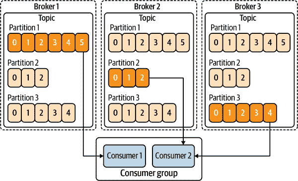

# 第十一章. 事件总线：骨干

在第十章中，我们讨论了反应式消息传递，并利用其注解来生成、消费和处理消息，以及桥接命令式和反应式编程。本章将更深入地探讨使用反应式消息传递构建反应式系统的骨架，重点介绍 Apache Kafka 和高级消息队列协议（AMQP）的使用。^(1)

# Kafka 还是 AMQP：选择合适的工具

许多消息传递解决方案让您能够实现事件驱动架构、事件流处理以及反应式系统。最近，Apache Kafka 在这一领域中成为了一个显赫的角色。AMQP 是另一种消息传递方法，也不应立即被排除在外。两者各有优缺点。您的选择完全取决于您的用例，以及团队现有的技能和经验。

本节不偏爱某个事件总线，而是详细介绍了每个事件总线的特性和行为，以及它们的优势和劣势。我们希望为您提供关于每个系统的充足信息，以帮助您确定它们如何适合特定系统的用例。

在高层次上，可以将 Kafka 描述为具有聪明消费者的愚蠢代理，而 AMQP 则具有聪明代理但愚蠢消费者。有时候选择的关键在于在实施解决方案时所需的灵活性。

当然，这可能有些陈词滥调，但确实没有一种事件总线适合所有情况。每种情况都有特定的需求和用例需要满足，需要仔细评估每个事件总线的优缺点。请注意，对于您的用例，其他消息解决方案可能更合适，如[Solace PubSub+ Platform](https://solace.com)、[Microsoft Azure Event Hubs](https://oreil.ly/eXz0E)、[RabbitMQ](https://rabbitmq.com)或[NATS](https://nats.io)。

# 使用 Kafka 构建反应式系统

自 2011 年 LinkedIn 开源 Apache Kafka 以来，它已迅速成为事件驱动领域中最重要的角色之一。在微服务、无服务器架构以及分布式系统普及的推动下，Kafka 成为开发人员需要的消息传递支柱之一。

在第十章中已经给出了使用 Kafka 的例子，但我们没有解释它在底层的重要细节，这些细节对于深入理解它是必要的。本章将深入探讨，解释如何在反应式系统中使用 Kafka 作为连接组织。我们不打算详尽覆盖 Kafka 的所有细节，但会介绍足够量的内容，让您能够理解 Kafka 运作的方式，以便有效地开发反应式系统。首先，我们需要了解 Kafka 的基础知识。

## Apache Kafka

Kafka 是一个强大的分布式提交日志，如果你是开发者，你可能熟悉另一个分布式提交日志，Git！在与 Kafka 通信时，我们使用一个*记录*或事件作为我们希望写入日志的信息片段，然后稍后从日志中读取。每个记录分组在日志中有一个*主题*，用于跟踪（图 11-1）。


###### 图 11-1\. Kafka 主题

记录只能包含四个信息片段：

关键

当将记录写入日志时由 Kafka 分配，但也可以在分区中使用，我们稍后会涵盖这一点

值

我们希望存储在日志中以供消费者检索的实际值或负载

时间戳

在创建记录时可选设置，或者在将记录写入日志时由 Kafka 设置

标头

提供给 Kafka 的关于记录的可选元数据，或者供下游消费者使用的额外信息

图 11-2 概述了与日志交互的过程。


###### 图 11-2\. 生产和消费记录

创建记录后，我们使用生产者将其写入 Kafka 中的日志。我们可以有一个或多个生产者实例将相同类型的记录写入日志，因为我们写入日志的方式与消费的方式是解耦的。一旦记录写入日志，我们就使用消费者从日志中读取记录，并进行需要的处理。

当将记录写入日志时，生产者始终进行追加。生产者无法插入或删除记录。追加方式意味着 Kafka 可以提供高可伸缩性的写入能力。因为对现有记录没有争用或锁定，每次写入都是一个新记录。

在 Kafka 中，生产者和消费者的分离是一个关键概念。这种记录写入和消费时间的解耦对于响应式系统至关重要。当然，只有当日志保留策略足够长，以防止任何生产的记录在被消费之前被 Kafka 删除时，才能完全实现这一点！我们不希望将所有记录记录下来，然后在多年后消费之前被 Kafka 删除。

在第十章中，您看到如何使用 `@Outgoing` 生产消息。让我们稍微修改该示例，还设置一个记录的键，如示例 11-1 所示。

##### 示例 11-1\. 配置 Kafka 出站元数据

```java
@Outgoing("my-channel")
Multi<Message<Person>> produceAStreamOfMessagesOfPersons() {
    return Multi.createFrom().items(
            Message.of(new Person("Luke"))
                .addMetadata(OutgoingKafkaRecordMetadata.builder()
                        .withKey("light").build()),
            Message.of(new Person("Leia"))
                .addMetadata(OutgoingKafkaRecordMetadata.builder()
                        .withKey("light").build()),
            Message.of(new Person("Obiwan"))
                .addMetadata(OutgoingKafkaRecordMetadata.builder()
                        .withKey("light").build()),
            Message.of(new Person("Palpatine"))
                .addMetadata(OutgoingKafkaRecordMetadata.builder()
                        .withKey("dark").build())
    );
}
```

在这里，我们有一个键，指示该人是*光明*还是*黑暗*面的一部分。要切换到将消息发送到 Kafka，我们需要进行两个更改。首先，修改 *pom.xml* 以包括 SmallRye Reactive Messaging for Kafka 依赖项（示例 11-2）。

##### 示例 11-2\. Kafka 连接器依赖项（*/Users/clement/Documents/book/code-repository/chapter-11/processor/pom.xml*）

```java
<dependency>
    <groupId>io.quarkus</groupId>
    <artifactId>quarkus-smallrye-reactive-messaging-kafka</artifactId>
</dependency>
```

最后，按照示例 11-3 配置依赖项。

##### 示例 11-3\. 配置 Kafka 连接器以写入记录（*chapter-11/processor/src/main/resources/application.properties*）

```java
mp.messaging.outgoing.my-channel.connector=smallrye-kafka
mp.messaging.outgoing.my-channel.topic=starwars
mp.messaging.outgoing.my-channel.value.serializer=\
 org.apache.kafka.common.serialization.StringSerializer
```

配置指示我们正在使用的连接器`smallrye-kafka`，通道应该写入的主题名称，以及用于转换负载内容的序列化器。如果要写入的主题与通道名称匹配，我们将不需要`topic`配置，因为通道名称是默认值。

在消费方面，我们可以通过示例 11-4 读取键。

##### 示例 11-4\. 提取传入的 Kafka 元数据

```java
@Incoming("my-channel")
CompletionStage<Void> consume(Message<Person> person) {
    String msgKey = (String) person
            .getMetadata(IncomingKafkaRecordMetadata.class).get()
            .getKey();
    // ...
    return person.ack();
}
```

我们还需要与我们使用 Kafka 的出站配置相似的配置；参见示例 11-5。

##### 示例 11-5\. 配置 Kafka 连接器以轮询记录（*chapter-11/processor/src/main/resources/application.properties*）

```java
mp.messaging.incoming.my-channel.connector=smallrye-kafka
mp.messaging.incoming.my-channel.topic=starwars
mp.messaging.incoming.my-channel.value.deserializer=\
 org.apache.kafka.common.serialization.StringDeserializer
```

到目前为止，我们已经泛泛地提到了写入记录到日志和消费记录从日志。正如您在图 11-1 中看到的那样，*主题*是一个日志，用于组织和持久存储记录。此日志是特定类型记录或一组记录的日志，使我们能够根据这些记录的特定需求定制行为。例如，如果记录的数量非常大并且对应用程序长达一周的时间没有意义，我们可以更改一个主题的保留策略，仅保留该期间内的记录，即使它们没有被消费。我们还可以有另一个主题，其记录保留时间长达六个月甚至无限期。

同样在图 11-1 中，您可以看到每个记录都表示为带有编号的框；这代表了记录在主题中写入的*偏移量*或索引。在这个示例中，已经写入了六条记录，并且生产者即将写入第七条记录，其偏移量为 6。我们还看到一个消费者正在读取偏移量为 0 的记录，即主题中的第一条记录。虽然默认情况下新消费者从第一个偏移量开始读取记录，但我们可以决定从任何偏移量开始。

另一种考虑主题的方式是将其视为表示外部目标的虚拟地址。当生产者将记录写入主题时，它不知道记录将何时、是否或甚至在何处被消费者读取。使用虚拟地址或主题提供了在空间和时间上解耦我们的反应式系统组件的方式。

消费者可以与其他消费者结合形成一个*消费者组*。任何使用相同消费者组名称或标识符创建的消费者都将放置在同一个消费者组中。当创建一个没有设置消费者组标识符的消费者时，默认情况下会得到一个包含单个消费者的消费者组。

到目前为止，我们描述的是具有单个记录日志的主题。*分区*是我们解决单一记录方法所带来问题的方式。分区有助于提高主题的读写性能，因为我们将单个主题分割为多个分区。

我们不再使用单个分区和单个消费者，而是使用三个分区，并且每个分区都有一个独立的消费者读取记录。从非科学的角度看，我们可以预期使用三个分区和三个消费者的吞吐量是单个分区和消费者的三倍。

尽管我们提到了三个消费者对应三个分区，但在 图 11-3 中，我们有两个消费者在同一个消费者组内。一个消费者负责从两个分区读取记录，以确保所有分区都有消费者。通过对主题进行分区，我们现在通过增加消费者来提高吞吐量。


###### 图 11-3\. 主题分区

在 图 11-3 中所示的情况下，生产者可以将记录写入主题，由代理决定将记录实际写入到哪个分区。另外，生产者也可以明确指定记录应写入的分区。如果记录具有唯一于其内容的键，例如 `Person` 记录的用户名，使用 Kafka 键哈希算法可以高效地确定适当的分区。这将确保具有相同键的所有记录都写入同一分区。然而，我们需要小心确保任何键都合理分布。否则，我们可能会产生*热分区*（例如，按国家分区可能会导致美国分区的记录数量达到数万亿条，而安道尔分区只有几千条记录）。

目前，我们在弹性方面存在问题，因为所有分区都在同一个代理实例上。在 图 11-4 中，我们已经将主题复制到了三个分区上。



###### 图 11-4\. 主题分区复制

为了支持弹性，并确保消费者不会从不同的代理读取同一分区中的相同记录，为消费者选择了一个*领导分区*进行读取。在这个示例中，第一个代理中的分区 0，第二个代理中的分区 1，第三个代理中的分区 2 是领导分区。

根据我们在 图 11-4 中的设计，Kafka 确保我们的消费者不能在分区中的记录成功复制之前读取。它通过跟踪 *高水位偏移量* 来实现这一点，即所有分区中最后一条成功复制的消息的偏移量。经纪人阻止消费者读取高水位偏移量之后的记录，以防止读取未复制的记录。

## 点对点通信

Kafka 不是传统的消息传递系统。用它实现标准的传递模式可能会令人困惑。

通过 *点对点通信*，我们希望同一条消息只被一个消费者消费一次，无论是同一消费者还是同一消费者组中的其他消费者。请注意，面对网络故障时，无法保证记录仅由消费者组中的一次消费。您需要准备好看到重复的消息。

我们使用 *消费者组* 来扩展 Kafka 中的消费者，以执行相同的处理以提高吞吐量。在 图 11-5 中，仅有一个消费者可以在单个主题分区中读取记录，符合点对点通信的需求。在这种情况下，我们看到消费者 2 无法读取记录，因为它与消费者 1 属于同一消费者组，实际上使得消费者 2 处于空闲状态。


###### 图 11-5\. 消费者组

为什么我们不能让同一组中的两个消费者从同一个分区中读取？Kafka 为给定消费者组跟踪每个分区的最后提交偏移量，并使用该偏移量重新启动处理。然而，消费者在完全完成记录处理之前不会提交偏移量。这就创建了一个窗口，在这个窗口中，同一组中的多个消费者可能读取同一条记录，从而重复处理消息。

当一个新的消费者订阅一个消费者组时，如果 Kafka 不知道分区的最后提交偏移量，有两种策略。这些策略分别是 *Earliest*，消费者从分区的第一个偏移量开始读取事件，以及 *Latest*，它只消费消费者订阅后收到的事件。

## 发布/订阅

点对点确保消息只被消费一次。另一种流行的模式是将消息分发给多个消费者。使用 *发布/订阅* 模型，我们可以有许多订阅者或消费者读取同一条消息，通常是为了不同的目的。

图 11-6 展示了两个消费者组从同一个主题消费消息。一个消费者组有三个消费者，而另一个有两个消费者。我们看到每个分区只被同一消费者组中的单个消费者读取，但跨消费者组有多个消费者。虽然这两个消费者组连接到同一主题及其分区，但每个消费者并无需在相同的偏移量处。这种要求将取消不同组能够消费记录的优势。


###### 图 11-6\. 多个消费者组

## 弹性模式

*弹性* 是反应式系统的支柱之一。Kafka 提供的分区机制允许我们实现弹性模式。图 11-6 也突出了 Kafka 中消费者组的弹性模式。消费者组 1 有三个消费者，每个从不同的分区消费。如果由于任何原因消费者失败，另一个消费者将接管从现在无消费者的分区读取的负载。消费者弹性确保只要至少有一个消费者存在，所有分区都在被消费。当然，这种情况确实会降低吞吐量，但比不消费任何记录要好。消费者组 2 可能代表这种情况。

然而，消费者组的弹性是有限的。正如我们之前提到的，同一组内多个消费者不可能从同一分区读取。在 图 11-6 中，有三个分区，我们仅限于单个消费者组内的三个消费者。同一组中的任何额外消费者将处于空闲状态，因为我们不能让同一组中的多个消费者连接到同一分区。

在确定主题所需的分区数时，弹性是一个重要因素。分区过少会限制处理记录的吞吐量，而过多则可能导致消费者空闲，如果记录在分区间分布不均匀的话。

## 处理故障

故障在分布式系统中时常发生！这是其性质，即使在开发反应式系统时也无法避免。然而，Kafka 为我们提供了适当处理故障的机制。

### 提交策略

每个消费者定期通知代理其最新的 *偏移量提交*。该数字代表消费者从主题分区成功处理的最后一条消息。当当前消费者失败或崩溃时，偏移量提交将成为分区的新消费者的起点。

提交偏移量不是一项廉价的操作。出于性能考虑，我们建议不要在处理每个记录后都提交偏移量。Quarkus 提供了几种用于与 Kafka 一起使用的提交策略选项：

+   受限

+   忽略

+   最新

*Throttled*策略是默认选项，跟踪消费者接收的记录并监控它们的确认。当处理完一个位置之前的所有记录时，该位置将作为该消费者组的新偏移量提交到代理。如果任何记录既没有确认也没有拒绝确认，就不再可能提交新的偏移量位置，并且记录将继续排队。如果没有能力退出，最终会导致内存不足错误。通过向连接器报告故障，Throttled 策略可以检测到这个问题，使应用标记为不健康状态。请注意，这种情况通常是应用程序错误导致消息“丢失”。

*Ignore*策略利用 Kafka 消费者的默认偏移提交，该提交周期性地在轮询新记录时发生。此策略忽略消息确认，并依赖于记录处理为同步。当使用`enabled.auto.commit=true`时，此策略是默认的。任何失败的异步处理将未知于轮询新记录以消费的过程。

如果我们将`commit-strategy`设置为`ignore`，并将`enable.auto.commit`设置为`false`，如示例 11-6 所示，将永远不会提交任何偏移量。每次新消费者从主题读取消息时，它将始终从偏移量 0 开始。在某些情况下，这种方法是可取的，但需要有意识地选择。

##### 示例 11-6\. 配置提交策略

```java
mp.messaging.incoming.my-channel.connector=smallrye-kafka
mp.messaging.incoming.my-channel.enable.auto.commit=false
mp.messaging.incoming.my-channel.commit-strategy=ignore
```

*Latest*将在每个消息确认后提交偏移量，正如我们之前描述的那样，这会影响消费者的性能。在低吞吐量场景中，这种策略可能更可取，以提高偏移量的准确性。

### 确认策略

在“致谢”中，您了解了响应式消息如何利用`ack`和`nack`通知上游响应式流记录处理状态。这些确认方法是我们为 Kafka 提供的故障处理策略的一部分。应用程序使用其中一种策略配置 Kafka 连接器。

最简单且默认的策略是*Fail Fast*。当应用程序拒绝消息时，连接器会被通知失败，并停止应用程序。如果失败是短暂性的，如网络问题，重新启动应用程序应该能够使处理继续进行。但是，如果特定记录导致消费者失败，应用程序将处于失败→停止→重新启动的永久循环中，因为它将不断尝试处理导致失败的记录。

另一个简单的策略是 *忽略*。任何未确认的消息都会被记录，然后在消费者继续处理新记录时被忽略。当我们的应用程序在内部处理任何故障时，忽略策略非常有用，因此我们不需要通知消息生产者有故障发生，或者由于正在处理的消息类型允许偶尔忽略某些消息。但是，如果大量消息被忽略，值得调查其根本原因，因为这可能不是预期的后果。

最后一个故障处理策略是 *死信队列*。它将失败的记录发送到特定主题，以便稍后自动或手动处理。

### 死信队列

这种策略在消息系统存在的时间内一直是消息系统的一部分！与其立即失败或忽略任何失败，这种策略将无法处理的消息存储到单独的目标或主题中。存储失败的消息使得管理过程（人工或自动化）能够确定正确的操作以解决处理失败。

需要注意的是，只有当所有消息的顺序不重要时，死信队列策略才能起作用，因为我们不会因为等待死信队列中的消息处理失败而停止处理新消息。

当选择这种策略时，默认主题被命名为 `dead-letter-topic-*[topic-name]*`。对于我们之前的示例，将是 `dead-letter-topic-my-channel`。可以按照 示例 11-7 中所示的方式配置主题名称。

##### 示例 11-7\. 配置故障策略以使用 DLQ

```java
mp.messaging.incoming.my-channel.failure-strategy=dead-letter-queue
mp.messaging.incoming.my-channel.dead-letter-queue.topic=my-dlq
```

我们甚至可以从 `dead-letter-reason` 头部检索与消息关联的失败原因（示例 11-8）。

##### 示例 11-8\. 检索失败原因

```java
@Incoming("my-dlq")
public CompletionStage<Void> dlq(Message<String> rejected) {
  IncomingKafkaRecordMetadata<String, String> metadata =
      rejected.getMetadata(IncomingKafkaRecordMetadata.class);
  String reason = new String(metadata.getHeaders()
    .lastHeader("dead-letter-reason").value());
}
```

使用 DLQ 需要另一个应用程序或人工操作员来处理发送到 DLQ 的记录。这些记录可以重新引入到初始主题（但顺序会丢失），也可以丢弃，或者需要进行一些减轻逻辑。

## 背压和性能考虑

没有适当的背压来避免过载组件，就无法实现真正的反应式系统。那么我们如何处理 Kafka 的背压？

与 Kafka 一起使用的出站连接器，用于 `@Outgoing` 或 `Emitter`，使用等待从代理收到确认的飞行消息数。*飞行消息* 是连接器已发送到 Kafka 代理以写入主题的消息，但是尚未收到成功存储记录的确认。

我们调整在出站 Kafka 连接器中的流控以调整背压。默认的最大并发消息数为 1,024。如果数字太高，可能会导致更高的内存使用，根据负载大小可能会出现内存不足错误，而数字太低会降低吞吐量。我们可以通过属性 `max-inflight-messages` 来自定义连接器中的最大并发消息数。

在消费者端，Kafka 将根据 Reactive Streams 请求暂停和恢复消费者。我们已经讨论了很多关于 Kafka 的内容，所以下一节我们将在 Kubernetes 中探索它！

## Kubernetes 上的 Kafka

要在 Kubernetes 上使用 Kafka，我们需要安装 Kafka。我们将使用 [Strimzi](https://strimzi.io) 项目来安装 Kafka。该项目有一个用于在 Kubernetes 中管理 Kafka 部署的操作员。

在 Kubernetes 中设置 Kafka 之前，我们需要一个 Kubernetes 环境。如果您已经有了一个，那太棒了！如果没有，我们建议您使用 minikube，详细信息请参见《新生代：云原生和 Kubernetes 原生应用》。

###### 注意

在 minikube 上运行 Kafka 可能需要比常规部署更多的内存，因此我们建议至少启动它时配置 4 GB 的 RAM：

```java
minikube start --memory=4096
```

在运行 Kubernetes 环境时，我们需要安装 Strimzi，如示例 11-9 所示。确保已安装 [Helm](https://helm.sh)，因为我们将使用它来安装 Strimzi。

##### 示例 11-9\. 安装 Strimzi

```java
kubectl create ns strimzi             
kubectl create ns kafka               

helm repo add strimzi https://strimzi.io/charts            
helm install strimzi strimzi/strimzi-kafka-operator -n strimzi \
    --set watchNamespaces={kafka} --wait --timeout 300s      
```


为 Kubernetes 操作员创建 `strimzi` 命名空间。


Kafka 集群的命名空间。


将 Strimzi 图表库添加到 Helm 中。


将 Strimzi 操作员安装到 `strimzi` 命名空间中。

安装成功后，请验证运行操作员（如示例 11-10 所示）。

##### 示例 11-10\. Strimzi 操作员状态

```java
kubectl get pods -n strimzi
NAME                                        READY   STATUS    RESTARTS   AGE
strimzi-cluster-operator-58fcdbfc8f-mjdxg   1/1     Running   0          46s
```

现在是创建 Kafka 集群的时候了！首先我们需要定义要创建的集群，如示例 11-11 所示。

##### 示例 11-11\. Kafka 集群定义

```java
apiVersion: kafka.strimzi.io/v1beta2
kind: Kafka
metadata:
  name: my-cluster                      
spec:
  kafka:
    replicas: 1                         
    listeners:
      - name: plain
        port: 9092
        type: internal
        tls: false
      - name: tls
        port: 9093
        type: internal
        tls: true config:
      offsets.topic.replication.factor: 1
      transaction.state.log.replication.factor: 1
      transaction.state.log.min.isr: 1
    storage:
      type: ephemeral                  
  zookeeper:
    replicas: 1
    storage:
      type: ephemeral
  entityOperator:
    topicOperator: {}
    userOperator: {}
```


集群名称。


在集群中创建 Kafka 副本的数量。在生产环境中，我们希望有多个副本，但为了测试，这可以减少内存需求。


我们选择临时存储，以减少测试需求。

现在我们使用 示例 11-11 来创建一个符合请求定义的 Kafka 集群，如示例 11-12 所示。

##### 示例 11-12\. 创建 Kafka 集群

```java
kubectl apply -f deploy/kafka/kafka-cluster.yaml -n kafka
```

验证我们想要的集群是否已创建（示例 11-13）。

##### 示例 11-13\. Kafka 集群状态

```java
kubectl get pods -n kafka
NAME                                          READY   STATUS    RESTARTS   AGE
my-cluster-entity-operator-765f64f4fd-2t8mk   3/3     Running   0          90s
my-cluster-kafka-0                            1/1     Running   0          113s
my-cluster-zookeeper-0                        1/1     Running   0          2m12s
```

集群运行后，我们创建我们需要的 Kafka 主题（示例 11-14）。

##### 示例 11-14\. 创建 Kafka 主题

```java
kubectl apply -f deploy/kafka/ticks.yaml
kubectl apply -f deploy/kafka/processed.yaml
```

为了向您展示 Kafka 如何与 Kubernetes 协同工作，我们将使用一个示例，该示例由三个服务组成：每两秒钟产生一个 *tick*，接收消息并添加处理它的消费者详细信息，并通过 SSE 公开所有消息。这三个服务将用于展示 Kafka 的消费者处理。请按照 */chapter-11/README.md* 中 *应用程序部署* 部分的说明来构建所需的 Docker 镜像并使用 Helm 安装服务。

服务运行后，现在是测试的时候！在浏览器中打开 SSE 终端点，您将看到类似于 示例 11-15 的数据。

##### 示例 11-15\. SSE 输出：所有消息由同一 Pod 消费

```java
data:1 consumed in pod (processor-d44564db5-48n97)
data:2 consumed in pod (processor-d44564db5-48n97)
data:3 consumed in pod (processor-d44564db5-48n97)
data:4 consumed in pod (processor-d44564db5-48n97)
data:5 consumed in pod (processor-d44564db5-48n97)
```

尽管我们的主题有三个分区，我们可以看到单个消费者消费的所有 ticks。让我们扩展 `processor` 来向同一组添加更多消费者（示例 11-16）。

##### 示例 11-16\. 增加应用程序实例的数量

```java
kubectl scale deployment/processor -n event-bus --replicas=3
```

在浏览器中，我们现在看到了同一组的三个消费者处理的消息，增加了吞吐量和并发性能（示例 11-17）。

##### 示例 11-17\. SSE 输出：消息由三个 Pod 消费

```java
data:11 consumed in pod (processor-d44564db5-2cklg)
data:12 consumed in pod (processor-d44564db5-48n97)
data:13 consumed in pod (processor-d44564db5-s6rx9)
data:14 consumed in pod (processor-d44564db5-2cklg)
data:15 consumed in pod (processor-d44564db5-s6rx9)
data:16 consumed in pod (processor-d44564db5-48n97)
data:17 consumed in pod (processor-d44564db5-2cklg)
```

如果我们启动了另一个 `processor` 实例，但没有设置 `mp.messaging.incoming.ticks.group. id=tick-consumer`，我们将看到来自新消费者的消息编号重复，因为它们有自己的消费者组和偏移位置。

# 使用 AMQP 构建响应式系统

*高级消息队列协议*（*Advanced Message Queuing Protocol*），或 *AMQP*，是自 2002 年以来存在的面向消息的中间件应用层协议。AMQP Broker 是一个高度先进的消息代理，具有极大的灵活性和根据应用需求的可定制性。

我们这里没有涵盖 AMQP Broker 的所有可能用途。有多种经纪人拓扑结构支持多种不同的用例，简单地试图将所有信息都压缩到本节中是不现实的！[Robert Godfrey on InfoQ](https://oreil.ly/xC0ar) 展示了 AMQP 1.0 的核心功能并介绍了一些可能性。

与 Kafka 不同，所有的 *智能* 都在 AMQP Broker 内部，它了解拓扑结构、客户端、消息状态、已交付和尚未交付的内容。

## AMQP 1.0

*AMQP 1.0*是在应用程序或组织之间传递业务消息的开放标准。它由几个层次组成，最低层是用于在两个进程之间传输消息的二进制线级协议。在线级协议之上是消息传递层，它定义了抽象消息格式和编码。线级协议使得不同类型的客户端能够与 AMQP 代理发送和接收消息，只要它们支持 AMQP 规范的相同 1.0 版本。

在 Quarkus 中使用 AMQP 1.0 连接器需要依赖项示例 11-18。

##### 示例 11-18\. AMQP 连接器的依赖项

```java
<dependency>
    <groupId>io.quarkus</groupId>
    <artifactId>quarkus-smallrye-reactive-messaging-amqp</artifactId>
</dependency>
```

## 点对点通信

使用 AMQP，点对点通信是通过*队列*而不是*主题*来实现的。在 AMQP 术语中，队列被称为*单播*，意味着任何消费者都可以读取消息，但其中只有一个（图 11-7）。我们添加到队列的消息可以是持久的，就像 Kafka 一样，但它们也可以是非持久的。当消息是非持久的时候，在消息被消费之前，如果代理在此之前重新启动，消息将会丢失。


###### 图 11-7\. AMQP 队列消费者

Kafka 和 AMQP 在点对点通信方面的一个关键区别是，在 AMQP 中，一旦消息被消费者读取，消息将从队列中移除，并且不以任何方式保留。AMQP 暂时存储消息直到它们被消费，而 Kafka 保留日志中的所有消息，至少直到日志保留策略开始删除旧消息为止。这使得 AMQP 不适合需要在反应系统中某个时刻重新播放消息的用例。

我们还可以有多个消费者从同一个队列中读取消息，但代理确保只有其中一个消费者读取单个消息。与 Kafka 相比，AMQP 在缩放消费者方面没有相同的吞吐量限制。我们可以有几十个消费者从单个队列中读取消息，只要顺序不重要。

发送消息到 AMQP！在添加我们之前提到的依赖项（示例 11-18）后，我们需要按照示例 11-19 中展示的方式配置代理属性，以便连接器知道 AMQP 代理的位置。

##### 示例 11-19\. 配置 AMQP 代理位置和凭据

```java
amqp-host=amqp
amqp-port=5672
amqp-username=username
amqp-password=password

mp.messaging.outgoing.data.connector=smallrye-amqp
```

我们已经为主机、端口、用户名和密码设置了全局的 AMQP 代理配置，这意味着我们定义的任何通道都将使用相同的 AMQP 代理配置。如果需要，配置可以基于每个通道设置。我们还指示使用`smallrye-amqp`连接器作为`data`输出通道。

默认情况下，通道使用队列的持久消息，或者我们可以通过`mp.messaging.outgoing.data.durable=false`使它们成为非持久消息。我们还可以在发送消息时直接覆盖消息的持久性，就像在示例 11-20 中展示的那样。

##### 示例 11-20\. 使用出站元数据发送持久消息

```java
@Outgoing("data")
Multi<Message<Person>> produceAStreamOfMessagesOfPersons() {
  return Multi.createFrom().items(
      Message.of(new Person("Luke"))
          .addMetadata(OutgoingAmqpMetadata.builder().withDurable(false).build()),
      Message.of(new Person("Leia"))
          .addMetadata(OutgoingAmqpMetadata.builder().withDurable(false).build()),
      Message.of(new Person("Obiwan"))
          .addMetadata(OutgoingAmqpMetadata.builder().withDurable(false).build()),
      Message.of(new Person("Palpatine"))
          .addMetadata(OutgoingAmqpMetadata.builder().withDurable(false).build())
  );
}
```

我们可以类似于 Kafka 消费消息，但使用 AMQP 元数据对象来检索关于消息的更详细信息（详见 示例 11-21）。

##### 示例 11-21\. 从传入消息中提取 AMQP 元数据

```java
@Incoming("data")
CompletionStage<Void> consume(Message<Person> person) {
    Optional<IncomingAmqpMetadata> metadata = person
            .getMetadata(IncomingAmqpMetadata.class);
    metadata.ifPresent(meta -> {
        String address = meta.getAddress();
        String subject = meta.getSubject();
        });
    // ...
    return person.ack();
}
```

成功接收和处理消息会导致连接器向 Broker 发送 `accepted` 确认。收到此确认后，Broker 将从队列中删除消息。

## 发布/订阅

AMQP 同样支持发布/订阅模型，类似于 Kafka，允许多个订阅者从单个队列中读取消息。在 AMQP 中，队列可以是 *多播* 类型（与 *单播* 相反），表示多个消费者可以接收相同的消息。

图 11-8 中有三个多播队列消费者读取消息，我们可以看到每个消费者处理消息的进度。与单播队列一样，默认情况下消息是持久的，但如果需要，也可以设置为非持久。


###### 图 11-8\. AMQP 多播队列消费者

从多播队列发送和接收消息的代码与我们用于点对点通信的代码完全相同，详见 “点对点通信”。*地址* 默认为通道名称；可以在通道配置中自定义，或直接设置在消息元数据中。

## 弹性模式

AMQP 在点对点通信的弹性模式略有不同。在 Kafka 中，我们只能有一个消费者从单个分区读取消息。而在 AMQP 中，可以有任意数量的消费者从同一队列中读取消息，只要消息处理的顺序不重要。

当然，我们可能不希望很多消费者从同一 Broker 节点读取队列，但我们可以将 Broker 进行集群化，以便将负载分布到它们之间。在 Broker 集群中，如果注意到某个 Broker 上的队列消费者利用率低于其他 Broker，则 Broker 会智能地将消息从一个 Broker 转移到另一个 Broker。

## 确认和重发

当我们向 AMQP Broker 发送消息时，如果 Broker 成功提交了消息，则会进行确认。但是，在生产者和 Broker 之间使用路由器时，情况就不同了。在这种情况下，建议将 `auto-acknowledgement` 设置为 `true`，以确保生产者在将消息发送到路由器时收到确认。如果 Broker 返回 `rejected`、`released` 或 `modified`，则消息会被拒绝。

消费端有几种更多的确认可能性。我们可以`fail`掉消息，导致应用程序进入失败状态并且不再处理更多的消息。处理失败的消息在代理中标记为`rejected`。这是 AMQP 连接器的默认行为。

接受、释放和拒绝策略都会导致失败被记录，并使应用程序继续处理额外的消息。它们之间唯一的区别在于 AMQP 消息在代理上的指定方式。接受策略将消息标记为`accepted`，释放策略将其标记为`released`，最后，拒绝策略将其标记为`rejected`。当我们希望在失败时继续处理消息时，你设置的三个选项中的哪一个取决于你希望 AMQP 代理如何处理消息。

关于重投递的问题？如果我们将 AMQP 消息标记为`released`，代理可以在稍后的时间将消息重新投递给相同或不同的消费者。将消息设置为`modified`时，我们有两种可用的策略。使用`modified-failed`策略会在消息上设置`delivery-failed`属性，使代理能够在处理下一条消息的同时尝试重新投递该消息。然而，使用`modified-failed-undeliverable-here`策略也会设置`delivery-failed`属性，尽管代理可以尝试重新投递消息，但不会针对当前消费者进行此操作。

如果消费者在任何时候与代理失去会话，任何正在进行中的工作都将被回滚。这允许其他消费者或当前消费者重新启动时接受在与代理会话断开连接时正在飞行中的任何消息的重新投递。

## 信用流回压协议

AMQP 通过信用系统在生产者中实现了回压。只有在生产者有可用的信用时，它们才能向代理发送消息，以防止生产者在短时间内向代理发送过多的消息。信用代表生产者可以发送的字节数量。例如，如果我们有 1,000 个信用，表示 1,000 字节，那么生产者可以在信用过期之前发送 1 条 1,000 字节的消息或者 10 条 100 字节的消息。

当生产者用尽所有信用时，它会以非阻塞方式等待从代理获取额外的信用。默认情况下，每 2,000 毫秒请求额外的信用，但此设置可以使用`credit-retrieval-period`配置属性进行配置。

当信用用尽时，连接器将应用标记为`not ready`。然后将此信息报告给应用程序健康检查。如果将应用程序部署到 Kubernetes，则可用性健康检查将失败，并且 Kubernetes 将停止向 pod 发送流量，直到其再次变为就绪状态。

## Kubernetes 上的 AMQP

在 Kubernetes 上设置一个可用于生产的 AMQP Broker 并不是一件简单的任务，因此我们选择使用单个 Docker 镜像来简化。在运行 Kubernetes 环境的情况下，运行一个 AMQP Broker 容器，如 示例 11-22 所示。

##### 示例 11-22\. 启动 AMQP Broker 容器

```java
kubectl run amqp --image=quay.io/artemiscloud/activemq-artemis-broker \
    --port=5672 --env="AMQ_USER=admin" --env="AMQ_PASSWORD=admin" \
    -n event-bus
```

在这里，我们在 Kubernetes pod 中启动了一个 AMQP Broker，但我们需要将 Broker 暴露为服务，以便让服务可以访问，如 示例 11-23 所示。

##### 示例 11-23\. 暴露 AMQP Broker 服务端口

```java
kubectl expose pod amqp --port=5672 -n event-bus
```

要能够使用 AMQP，我们需要将我们的代码切换到使用不同的依赖项和配置，但大多数服务保持不变。对于每个服务，在每个 *pom.xml* 中注释掉 `quarkus-smallrye-reactive-messaging-kafka` 依赖项，并取消注释每个 *application.properties* 文件中的 `smallrye-amqp` 连接器配置。在 `processor` 服务中的两个连接器都要更改！在进行这些更改后，务必对所有服务运行 `mvn clean package`。

所有 AMQP Broker 配置都在 Helm 图表中，实际值在 *values.yaml* 中。按照 */chapter-11/README.md* 中 *Application deployment* 下的说明构建所需的 Docker 镜像并安装服务。这些步骤与本章前面使用 Kafka 时相同。服务运行后，现在是测试的时候了！在浏览器中打开 SSE 端点，就像我们用 Kafka 时所做的那样（示例 11-24）。

##### 示例 11-24\. SSE 输出：所有消息由单个 pod 消耗

```java
data:2 consumed in pod (processor-7558d76994-mq624)
data:3 consumed in pod (processor-7558d76994-mq624)
data:4 consumed in pod (processor-7558d76994-mq624)
```

让我们扩展 `processor` 以增加更多的消费者，如 示例 11-25 所示。

##### 示例 11-25\. 增加应用程序实例（pod）的数量

```java
kubectl scale deployment/processor -n event-bus --replicas=3
```

使用 AMQP 进行扩展与使用 Kafka 进行扩展有不同的结果；请参见 示例 11-26。

##### 示例 11-26\. SSE 输出：消息由三个 pod 消耗

```java
data:187 consumed in pod (processor-7558d76994-mq624)
data:187 consumed in pod (processor-7558d76994-hbp6j)
data:187 consumed in pod (processor-7558d76994-q2vcc)
data:188 consumed in pod (processor-7558d76994-q2vcc)
data:188 consumed in pod (processor-7558d76994-hbp6j)
data:188 consumed in pod (processor-7558d76994-mq624)
data:189 consumed in pod (processor-7558d76994-mq624)
data:189 consumed in pod (processor-7558d76994-hbp6j)
data:189 consumed in pod (processor-7558d76994-q2vcc)
```

现在我们看到同一消息被所有三个生产者消耗，而不是一条消息仅消耗一次！

# 摘要

本章深入探讨了在使用 AMQP 或 Kafka 与 Reactive Messaging 时理解事件总线的更深层次。如果我们不需要特定 Kafka 或 AMQP 行为的元数据类，我们可以轻松地通过依赖变更和修改配置在两者之间切换。我们介绍了每个事件总线选项如何支持点对点通信、发布/订阅、确认、故障处理和反压。这些都是理解反应式系统及其组件整体的关键概念。

Kafka 是许多事件驱动反应系统当前流行的选择。Kafka 能处理大量消息，并且使得顺序成为一个重要特性。AMQP 在配置和定制化方面比 Kafka 更灵活。在点对点的场景中，AMQP 的弹性更高，因为其限制不受分区数量的约束。

在下一章中，我们将讨论如何使用 Java 接口表示外部服务的 HTTP 客户端，以及如何使用低级别的 Web 客户端以及为什么它仍然有用。

^(1) 在本章中，我们将讨论 AMQP 1.0。
