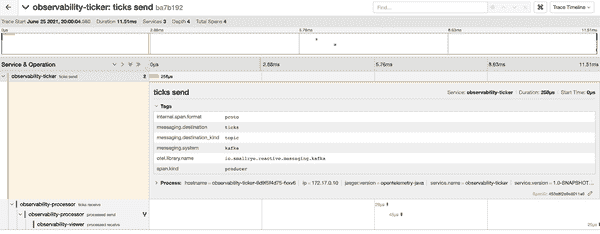

# 第十三章：观察反应式和事件驱动架构

到目前为止，我们专注于如何开发反应式系统。但我们还没有讨论的是如何确保我们的反应式系统的所有组件都按照我们期望的方式运行。这是本章的重点：我们如何监视和观察我们的反应式和事件驱动架构。

# 为什么可观测性很重要？

当应用程序是单一部署或*单体应用*时，我们很容易观察应用程序的运行情况。我们需要观察的一切都在一个地方。无论是检查错误日志，监控 CPU 和内存的利用率，还是其他任何方面，都可以轻松访问。

具有反应式和事件驱动架构时，通常不再只有一个部署，而是几个、数十个，甚至数百个。我们不再处理单一地查看需要监控和观察的信息的地方，而是有许多地方！可观测性工具提供了一种方法，使我们能够收集这些信息，并提供一个单一的查看位置。

然而，我们需要从事件驱动架构的组件中收集必要的信息或遥测数据，以实现单一视图。*遥测*包括我们从过程中收集的任何信息，用于观察系统。最常见的遥测类型如下：

日志

文本消息通常写入控制台输出、日志文件或导出到特定的日志处理系统。我们还可以提供以 JSON 格式呈现的更结构化的日志记录，以便更精确地提取数据。

指标

单个度量衡量特定的信息片段，例如 HTTP 服务器请求。有各种类型的度量指标可用：计数器、仪表、计时器和直方图等。

跟踪

代表系统中的单个请求，分解为特定操作。

在运行利用反应式或事件驱动架构的分布式系统时，我们需要从组件产生可靠的遥测数据，以支持对系统的足够推理。如果无法根据从外部观察到的信息对系统进行推理，那么我们的反应式系统就无法真正地被观察到。

让我们澄清一些术语。*监控*和*可观测性*有时可以混为一谈，但它们实际上有不同的含义。监控侧重于特定的度量指标，并根据特定目标、服务级别目标（SLOs）进行测量，并在未达到这些目标时发出警报。监控也被称为*已知未知*，因为我们知道要测量什么数据或指标来发现问题，但我们不知道可能导致特定问题的原因。*未知未知*指的是可观测性，因为我们不知道什么会导致问题，当问题发生时，需要观察系统的输出以确定原因。

Kubernetes 是运行反应式系统的好地方，因为它提供了监视、扩展和优雅修复系统的机制。然而，我们需要为 Kubernetes 提供适当的信息，例如健康检查。健康检查可以有多种用途；对于我们的需求，Kubernetes 中的准备探针和存活探针可以利用它们。*准备探针*让 Kubernetes 知道容器已准备好开始接受请求，而*存活探针*让 Kubernetes 知道是否需要重启容器，因为与 Kafka 通信时出现不可恢复的故障。

在本章的其余部分，我们将解释如何有效地监控和观察反应式系统。

# 使用消息进行健康检查

Kubernetes 利用健康检查来确定容器的状态。如果容器未提供健康检查，Kubernetes 将无法确定容器的状态。这可能导致用户因死锁容器或未准备好处理请求的容器而遇到错误。

我们可以为容器实现三种类型的健康检查：

存活探针

此探针让 Kubernetes 知道应重启容器。如果我们能编写一个有意义的健康检查，这是捕获应用程序死锁或与外部系统连接问题的好方法。我们可能通过重新启动容器来解决间歇性问题。该探针基于我们定义的频率定期运行。我们希望确保频率不要太大，以避免容器长时间被卡住，但也不要太小，以避免增加资源消耗。

准备探针

这个探针告知 Kubernetes，容器已准备好接收来自服务的流量。我们可以利用这种健康检查来为 HTTP 服务器和与外部系统的连接提供足够的时间，在开始接受请求之前等待它们可用。这可以防止用户因为容器未准备好处理请求而遇到错误。这个探针在容器生命周期中只执行一次。准备探针对于有效地允许扩展而不引起不必要的用户错误是必要的。

启动探针

最近添加的健康检查，此探针与存活探针具有相似的目的。然而，此探针允许我们在声明容器不健康之前设置不同的等待时间。这在容器可能需要很长时间才能启动，可能是由于与遗留系统连接时尤为有益。我们可以为*存活探针*设置较短的超时，同时允许*启动探针*设置更长的超时。

每个探针都支持 HTTP、TCP 或在容器内运行的命令。目前 Kubernetes 尚未实现其他协议用于探针。我们选择应用程序使用哪种探针将取决于是否有可用于探测的 HTTP 端点，或者是否需要在容器内部使用自定义命令。Quarkus 有一个扩展支持 [SmallRye 健康检查](https://github.com/smallrye/smallrye-health)，可通过 HTTP 开发健康检查。

这些探针与响应式应用程序有什么关系？就绪性表示响应式消息连接器（如 Kafka）已成功连接到代理或后端，并且没有失败，并且可选地我们打算使用的主题在代理中存在。在此状态下，连接器准备好开始发送或接收消息。默认情况下，验证任何主题的存在是禁用的，因为这是一个耗时的操作，需要使用管理员客户端。启用主题验证通过设置 `health-readiness-topic-verification: true` 来完成。

当响应式消息连接器遇到不可恢复的故障或与代理断开连接时，存活性应该失败。这些类型的瞬态故障可以在容器重新启动后消失。例如，应用程序可能连接到另一个代理。

如我们在 “Apache Kafka” 中介绍的，Kafka 具有内置的韧性。只有在消费者成功处理记录后，最后提交的偏移量才会更新，确保记录不会因消费者在处理过程中失败而被遗忘。此外，如果任何消费者失败，Kafka 能够重新平衡消费者组内的消费者。当使用 Kubernetes 健康检查时，当容器停止时，消费者将重新平衡，并在 Kubernetes 启动新容器实例时再次重新平衡。

现在是时候通过一个示例看看它是如何工作的了。我们将使用 第十一章 中的示例并进行扩展。我们想要自定义消费者以突出健康检查的行为。我们将有一个特定的进程服务，名为 `processor-health`。你可以在 *chapter-13* 目录下找到完整的代码。

首先，我们需要在每个服务的 *pom.xml* 中添加 SmallRye 健康扩展，如 示例 13-1 所示。

##### 示例 13-1\. 健康支持的依赖项 (*chapter-13/processor-health/pom.xml*)

```java
<dependency>
  <groupId>io.quarkus</groupId>
  <artifactId>quarkus-smallrye-health</artifactId>
</dependency>
```

要生成必要的 Kubernetes 部署 YAML 文件，包括存活检测和就绪检测，我们需要 Kubernetes 扩展。在这种情况下，我们使用 minikube 扩展进行部署；请参阅 示例 13-2。

##### 示例 13-2\. minikube 部署功能的依赖项 (*chapter-13/processor-health/pom.xml*)

```java
<dependency>
  <groupId>io.quarkus</groupId>
  <artifactId>quarkus-minikube</artifactId>
</dependency>
```

在 */chapter-13* 目录中运行 `mvn clean package` 以生成部署 YAML。在任何一个模块的 */target/kubernetes* 目录中查看生成的 YAML。我们看到所需的活跃探测和准备探测已添加到部署规范中。

默认情况下，每个活跃探测请求之间的间隔为 30 秒。让我们将其减少到 10 秒，以便在问题发生时使 Kubernetes 更早地重新启动我们的消费者`processor-health`，方法是修改`application.properties`（参见示例 13-3）。

##### 示例 13-3\. 配置活跃探测 (*chapter-13/processor-health/src/main/resources/application.properties*)

```java
quarkus.kubernetes.liveness-probe.period=10s
```

示例 13-4 展示了如何修改 `Processor` 以模拟故障。

##### 示例 13-4\. 处理器每接收八条消息否定一次（*chapter-13/processor-health/src/main/java/org/acme/Processor.java*）

```java
@Incoming("ticks")
@Outgoing("processed")
@Acknowledgment(Acknowledgment.Strategy.MANUAL)                            
Message<String> process(Message<Long> message) throws Exception {          
    if (count++ % 8 == 0) {                                                
      message.nack(new Throwable("Random failure to process a record."))
          .toCompletableFuture().join();
      return null;
    }
    String value = String.valueOf(message.getPayload());
    value += " consumed in pod (" + InetAddress.getLocalHost().getHostName() + ")";
    message.ack().toCompletableFuture().join();                            
    return message.withPayload(value);
}
```


使用手动确认，这样我们可以显式地否定消息。


需要将方法签名更改为使用`Message`而不是`Long`以使用手动确认。


每接收八条消息应否定一次，并返回`null`。


显式确认一条消息。

由于默认的`failure-strategy`是`fail`，当我们否定一个消息时，消息处理失败。此消息失败将导致消费者的健康检查也失败，一旦下一个活跃探测运行，容器将重新启动。请参考“Kubernetes 上的 Kafka”，或 */chapter-13* 的 *README*，启动 minikube 并部署 Kafka。然后，对三个服务（ticker、viewer、processor）分别运行 `mvn verify -Dquarkus.kubernetes.deploy=true`。使用 `kubectl get pods` 验证所有三个服务正在运行。

部署服务后，可以通过访问服务的 `/q/health` 查看整体健康检查状态。对于 `processor-health` 服务，我们得到如 示例 13-5 所示的响应。

##### 示例 13-5\. 反应式应用程序健康检查，没有错误

```java
{
    "status": "UP",
    "checks": [
        {
            "name": "SmallRye Reactive Messaging - liveness check",
            "status": "UP",
            "data": {
                "ticks": "[OK]",                     
                "processed": "[OK]"
            }
        },
        {
            "name": "SmallRye Reactive Messaging - readiness check",
            "status": "UP",
            "data": {
                "ticks": "[OK]",
                "processed": "[OK]"
            }
        }
    ]
}
```


检查中的数据显示我们连接的通道及其各自的状态。

当查看生成的部署 YAML 时，我们看到还有 `/q/health/live` 和 `/q/health/ready` 端点。它们分别代表存活探针和就绪探针。在浏览器中或通过 `curl` 访问它们，以查看每个探针的具体检查。

从终端中在浏览器中打开 *VIEWER_URL*。基于我们定义的生产者，我们会看到带有相同处理器 pod 名称的七条消息，然后再命中我们 nacked 的消息。在 Kubernetes 重新启动容器时会有一个暂停，然后我们会看到另外七条消息，这个序列会重复。

如果我们查看 Kubernetes 中的 pods，我们可以看到处理器服务的容器已经重启，如 示例 13-6 所示。

##### 示例 13-6\. 使用 `kubectl` 列出 pods

```java
> kubectl get pods
NAME                                       READY   STATUS    RESTARTS   AGE
observability-processor-5cffd8c755-d5578   1/1     Running   2          84s
observability-ticker-bd8f6f5bb-hqtpj       1/1     Running   0          2m
observability-viewer-786dd8bc84-zbjp4      1/1     Running   0          3m
```

###### 注意

在短时间内多次重启后，pod 将处于 `CrashLoopBackoff` 状态，这将逐渐增加 pod 重启之间的延迟。由于至少 10 分钟没有“happy”容器，我们最终处于 pod 将暂时不会重启的状态。对于这些示例来说，这并不是问题，但值得注意。

当在 `/q/health` 查看健康检查时，在容器重新启动之前“捕捉”到失败的健康检查可能会有些困难。为了更容易些，我们可以将处理器服务的 `quarkus.kubernetes.liveness-probe.period` 修改为较长的时间，例如 `100s`。通过延长周期，我们有机会在容器重新启动之前查看到失败的健康检查，如 示例 13-7 所示。

##### 示例 13-7\. 带有错误的响应式应用健康检查

```java
{
    "status": "DOWN",
    "checks": 
        {
            "name": "SmallRye Reactive Messaging - liveness check",
            "status": "DOWN",                                               ![1
            "data": {
                "ticks": "[KO] - Random failure to process a record.",      
                "processed": "[KO] - Multiple exceptions caught:
                    [Exception 0] java.util.concurrent.CompletionException:
                      java.lang.Throwable: Random failure to process a record.
                    [Exception 1] io.smallrye.reactive.messaging.ProcessingException:
                      SRMSG00103: Exception thrown when calling the method
                      org.acme.Processor#process"
            }
        },
        {
            "name": "SmallRye Reactive Messaging - readiness check",
            "status": "UP",
            "data": {
                "ticks": "[OK] - no subscription yet,
                    so no connection to the Kafka broker yet"   
                "processed": "[OK]"
            }
        }
    ]
}
```


存活检查是 `DOWN`，导致整个健康检查为 `DOWN`。


`ticks` 通道出现问题，显示了从 `nack` 发送的异常的失败。


没有订阅，因为 `process` 方法失败且不再订阅。`ticks` 通道仍然正常，只是等待订阅。

现在我们可以检查我们应用的健康，并在 Kubernetes 的容器编排中利用它们。接下来，我们看看我们的响应式应用如何生成用于监控的度量，并利用这些度量进行自动扩展。

# 带有消息的度量

度量是我们应用的关键部分，尤其是在响应式应用中更为重要。度量可以向监控系统提供信息，用于警报操作和 SRE 发现应用中的问题。在深入讨论如何做到这一点之前，让我们解释一些与监控相关的术语：

SLA（服务级别协议）

服务提供商与其客户之间关于服务可用性、性能等的合同。

SLO（服务水平目标）

服务提供商的目标是达到的。SLO 是内部目标，用于帮助防止服务提供商违反与客户的 SLA。开发人员为服务的 SLO 定义规则或阈值，以便在有风险违反 SLA 时向运维或 SRE 发出警报。

SLI（服务水平指标）

用于衡量 SLO 的特定测量。这些是从响应式应用生成的指标。

如果组织没有定义 SLA、SLO 和 SLI，那也没关系。从响应式应用中收集指标仍然有益，至少可以定义指示一切正常和不正常时的阈值。对于特定用例，一个“好”的指标可能会有所不同。

然而，所有的响应式系统都应该收集和监控某些指标：

队列长度

如果等待处理的消息队列过大，将影响消息在系统中流动的速度。如果消息流动不够快，例如股票交易这样对时间敏感的响应式应用将会因此而出现延迟和问题。高队列长度表明我们需要增加消费者组中的消费者数量。如果我们已经达到最大消费者数量，这也可能表明我们需要增加主题的分区数量。

处理时间

当消费者处理消息花费太长时间时，很可能会导致队列长度增加。长时间的处理也可能表明响应式应用存在其他问题，这取决于消费者的工作内容。由于与另一个服务的交互，数据库争用或其他可能的问题，我们可能会看到网络延迟问题。

在时间窗口内处理的消息

此指标提供对响应式应用吞吐量的整体理解。了解实际处理的消息数量可能不如监控变化重要。显著下降可能表明存在消息未被接收的问题，或者大量客户提前离开应用。

Ack-to-nack 比率

我们希望这个指标尽可能高，因为这意味着我们在处理的消息中看不到太多故障。如果发生太多故障，我们需要调查是由于上游系统提供了无效数据，还是处理器未能正确处理不同数据类型引起的故障。

我们讨论的所有这些度量都非常适合检测反应式应用程序中可能存在的瓶颈。如果同时看到几个这些度量朝着不利方向发展，这无疑是我们在处理消息中遇到问题的迹象！我们还可以定义检测瓶颈的基本规则。在使用 HTTP 或请求/响应时，应检查响应时间和成功率。高响应时间或低成功率可能表明需要调查的问题。对于消息传递应用程序，尚未处理的 *in-flight* 消息数量是一个关键的跟踪指标。

我们已经涵盖了许多理论知识，但是我们需要做什么来捕获这些度量标准呢？关键的变化是为 Micrometer 添加依赖项¹，在本例中我们希望以 Prometheus 格式提供度量标准。

*Micrometer* 是 Quarkus 的首选度量解决方案，因为它为开发者提供了关键的优势：

+   能够在不需要修改现有代码创建度量的情况下，从 Prometheus 切换监控后端到 Datadog、Splunk、New Relic 等等。只需更改依赖项以使用不同的注册表！

+   提供了许多 Quarkus 中使用的框架的 `MeterBinder` 实现。这些为诸如 JAX-RS、Vert.x 和 Hibernate 等框架提供度量标准，而无需开发者专门编写度量代码。

要以 Prometheus 格式公开度量标准，请向您的应用程序添加 示例 13-8 中的依赖项。

##### 示例 13-8\. Micrometer Prometheus 支持的依赖项 (*chapter-13/viewer/pom.xml*)

```java
<dependency>
  <groupId>io.quarkus</groupId>
  <artifactId>quarkus-micrometer-registry-prometheus</artifactId>
</dependency>
```

使用这个依赖项，我们有一个显示应用程序所有度量的端点位于 `/q/metrics`。在 Kubernetes 中使用 Prometheus 时，我们只需要一个 `ServiceMonitor` 告知 Prometheus 这个端点以便它抓取度量。对于本示例，我们不会使用 Prometheus 和 Grafana，这两个常见的监控工具。有很多在线文档可以解释如何在 Kubernetes 中设置它们，以便读者查看这些工具中的度量。

如果 minikube 尚未从早期健康示例中运行，请按照 */chapter-13* 的 *README* 中的说明启动它，部署 Kafka，并构建和部署三个服务。使用 `kubectl get pods` 验证它们是否正在运行，然后打开查看器的 URL。一旦看到消息出现，请打开处理器的指标端点。可以使用 `minikube service --url observability-processor` 找到该 URL，然后在末尾添加 `/q/metrics`。

您将看到类似于 示例 13-9 中显示的度量标准。

##### 示例 13-9\. 反应式应用程序度量的示例

```java
# HELP kafka_consumer_fetch_manager_records_consumed_total The total number of
# records consumed
kafka_consumer_fetch_manager_records_consumed_total \
  {client_id="kafka-consumer-ticks",kafka_version="2.8.0",} 726.0
# HELP kafka_consumer_response_total The total number of responses received
kafka_consumer_response_total
  {client_id="kafka-consumer-ticks",kafka_version="2.8.0",} 123.0
# HELP kafka_consumer_fetch_manager_fetch_latency_avg The average time taken for
# a fetch request.
kafka_consumer_fetch_manager_fetch_latency_avg \
  {client_id="kafka-consumer-ticks",kafka_version="2.8.0",} 485.6222222222222
# HELP kafka_consumer_fetch_manager_records_consumed_rate
# The average number of records consumed per second
kafka_consumer_fetch_manager_records_consumed_rate \
  {client_id="kafka-consumer-ticks",kafka_version="2.8.0",} 15.203870076019351
# HELP kafka_consumer_coordinator_assigned_partitions
# The number of partitions currently assigned to this consumer
kafka_consumer_coordinator_assigned_partitions \
  {client_id="kafka-consumer-ticks",kafka_version="2.8.0",} 3.0
# HELP kafka_producer_response_rate The number of responses received per second
kafka_producer_response_rate \
  {client_id="kafka-producer-processed",kafka_version="2.8.0",} 3.8208002687156233
# HELP kafka_producer_request_rate The number of requests sent per second
kafka_producer_request_rate \
  {client_id="kafka-producer-processed",kafka_version="2.8.0",} 3.820639852212612
# HELP kafka_producer_record_send_rate The average number of records sent per second.
kafka_producer_record_send_rate \
  {client_id="kafka-producer-processed",kafka_version="2.8.0",} 15.230982251500022
# HELP kafka_producer_record_send_total The total number of records sent.
kafka_producer_record_send_total \
  {client_id="kafka-producer-processed",kafka_version="2.8.0",}\
 726.0
# HELP kafka_producer_response_total The total number of responses received
kafka_producer_response_total \
  {client_id="kafka-producer-processed",kafka_version="2.8.0",} \
 182.0
# HELP kafka_producer_request_total The total number of requests sent
kafka_producer_request_total \
  {client_id="kafka-producer-processed",kafka_version="2.8.0",} \
 182.0
# HELP kafka_producer_request_latency_avg The average request latency in ms
kafka_producer_request_latency_avg \
  {client_id="kafka-producer-processed",kafka_version="2.8.0",} 10.561797752808989
```

示例 13-9 显示了从处理器服务生成的度量标准的简化版本，完整版本将需要更多空间！

指标还将使我们能够开发一个 Kubernetes 运算符，以自动缩放反应式系统的消费者。该运算符可以使用 Kafka 管理 API 来测量未被消费的消息数量。如果消费者少于分区数，则运算符可以增加一个消费者的副本数量，以在相同的时间内处理更多的消息。当未被消费的消息数量降低到阈值以下时，运算符可以从消费者组内缩减消费者数量。

# 使用消息传递的分布式跟踪

*分布式跟踪* 是反应式系统可观测性的一个极其重要的部分。当我们有一个单一的应用部署时，所有的交互通常发生在同一个进程中。此外，反应式系统具有一个服务不知道另一个服务将在何时何地消耗它们创建的消息的复杂性。在非反应式系统中，我们通常可以通过阅读代码来推断连接，以查看出站 HTTP 调用的位置。在围绕消息构建的反应式系统中，这是不可能的。

这就是分布式跟踪的优点所在，它能够连接系统中许多点（服务），跨越空间和时间，从而提供消息流的整体视角。在本示例中，我们将使用 OpenTelemetry 扩展，配合一个导出器将捕获的跟踪发送到 Jaeger。²

首先，让我们来了解一些术语：

Span

在追踪中的单个操作（在下面定义）。根据您想要收集的详细程度，可以在单个服务中创建许多 span。一个 span 可以有与之关联的父 span 或子 span，代表一系列执行。

Trace

一组操作或 span，代表一个应用及其组件处理的单个请求。

当在 Quarkus 中使用 Kafka 或 AMQP 的反应式消息传递时，当消息被消费和产生时，会自动创建 span。这是通过扩展将现有的跟踪和 span 传播到任何生成的消息的标头中完成的，在消费时进行提取。此过程允许 OpenTelemetry 跨多个进程中的多个服务链接 span，以提供 Jaeger 中流程的单一视图。

让我们更新分布式跟踪的示例！我们在 *pom.xml* 中为每个服务添加 Quarkus 对 OpenTelemetry 的扩展，如 示例 13-10 中所示。

##### 示例 13-10\. OpenTelemetry 依赖的 Jaeger 导出器

```java
<dependency>
  <groupId>io.quarkus</groupId>
  <artifactId>quarkus-opentelemetry-exporter-jaeger</artifactId>
</dependency>
```

为了使每个服务能够将收集到的 spans 发送到 Jaeger，我们还需要更新每个服务的 `application.properties`，其中包含收集器的 URL（参见 示例 13-11）。

##### 示例 13-11\. Jaeger 收集器端点

```java
quarkus.opentelemetry.tracer.exporter.jaeger.endpoint=
http://simplest-collector.jaeger:14250
```

为了简化 Jaeger 的部署，我们将部署 *all-in-one* 映像，如 示例 13-12 中所示。

##### 示例 13-12\. 安装 Jaeger 全功能版

```java
kubectl create ns jaeger
kubectl apply -f deploy/jaeger/jaeger-simplest.yaml -n jaeger
```

可以通过查看 */deploy/jaeger/jaeger-simplest.yaml* 来检查 Jaeger 的 Kubernetes 部署和服务的详细信息。需要注意的关键点是，服务公开了端口 14250 用于收集 span，这是我们在 示例 13-11 中设置的端口。

检索 Jaeger UI 的 URL，`minikube service --url jaeger-ui -n jaeger`，在浏览器中打开它。我们看到了用于搜索跟踪的初始页面，但是在下拉菜单中找不到任何服务，因为尚未运行任何服务。

按照 */chapter-13* 的 *README* 重建和重新部署三个服务：ticker、processor、viewer。部署完成后，在浏览器中打开 viewer 的 URL，`minikube service --url observability-viewer`，开始接收消息。

一旦消息开始出现，返回到 Jaeger UI 并刷新页面。现在将会有四个服务可供选择；选择 `observability-ticker`，这是反应式流中的第一个服务。点击“查找跟踪”按钮以检索该服务的跟踪。从列表中选择一个跟踪以打开包含所有 spans 详细信息的视图（图 13-1）。



###### 图 13-1\. Jaeger UI showing reactive system trace

在这个示例中，我们在单个跟踪中有四个 spans。每个步骤都有一个 span，首先从 ticker 服务生成一个消息，然后在 processor 服务中消费并生成一个消息，最后在 viewer 服务中消费该消息。在 Jaeger UI 中，探索每个步骤中 spans 中捕获的数据。在 图 13-1 中，我们看到了 `ticks send` span 的详细信息，包括 span 的类型、生产者以及消息发送的详细信息。

###### 注意

虽然 *ticks send* 在语法上是过去时不正确的，但 span 的名称由 OpenTelemetry 的语义约定所决定，详见 *blob/main/specification/trace/semantic_conventions/messaging.md#span-name.* Span 名称是目的地 *ticks* 和操作类型 *send* 的组合。

目前，您已经看到了如何在消息流几乎瞬间传输的情况下利用跟踪。然而，反应式系统的一个好处是能够根据时间解耦系统内的组件。换句话说，消息流可能需要数小时、数天、数周、数月甚至数年才能完成，在主题中等待，例如，在消费之前可能需要很长时间。同一条消息也可能在最初消费后的一段时间内由不同的消费者（如审计过程）处理。让我们模拟一个延迟的场景，看看跟踪是如何工作的。

首先，让我们使用 `kubectl delete all --all -n default` 清除现有的服务。为了确保我们从一个干净的状态开始，我们还应该删除并重新创建现有的 Kafka 主题，如 示例 13-13 所示。

##### 示例 13-13\. 更新应用部署

```java
kubectl delete kafkatopics -n kafka processed
kubectl delete kafkatopics -n kafka ticks
kubectl apply -f deploy/kafka/ticks.yaml
kubectl apply -f deploy/kafka/processed.yaml
```

为了模拟延迟处理，让我们部署 ticker 服务，然后在 20 到 30 秒后再将其删除，以生成合理数量的消息（示例 13-14）。

##### 示例 13-14\. 部署和移除 ticker 应用程序

```java
cd ticker
mvn verify -Dquarkus.kubernetes.deploy=true
# After 20-30 seconds
kubectl delete all --all -n default
```

再次搜索 `observability-ticker` 服务的跟踪，您将看到仅有一个跨度的跟踪。每个跟踪中仅有一个跨度，即来自 ticker 服务的跨度。为了处理在它运行之前的消息，我们需要更新 `application.properties` 以指示我们需要最早的消息；参见 示例 13-15。

##### 示例 13-15\. 配置新消费者组读取的第一个偏移量

```java
mp.messaging.incoming.ticks.auto.offset.reset=earliest
```

更改后，部署观察者和处理器服务，并在浏览器中打开观察者 URL 以接收消息。一旦观察者接收到消息，返回 Jaeger UI 并再次搜索跟踪。我们看到以前仅有一个跨度的跟踪现在有了全部四个跨度！我们成功地在一段时间后处理了消息，并且 Jaeger 能够将这些跨度与正确的跟踪关联起来。

在实际生产系统中，前述过程是否奏效将取决于跟踪数据的保留。如果我们保留一年的跟踪数据，但希望处理比那更早的消息，Jaeger 将把它们视为仅包含今天跨度的跟踪。对于 Jaeger 来说，来自同一跟踪的任何跨度都将不再存在，以便正确地将它们关联到可视化。

# 总结

本章详细介绍了 Kubernetes 中反应式系统的可观察性的重要性。可观察性是确保反应式系统弹性和弹性的关键。健康检查通过触发重启不健康的服务来帮助系统具有弹性。反应式系统的特定指标可用于提供弹性，例如根据消息队列大小缩放消费者的数量。

我们讨论了 Kubernetes 中的可观察性，包括健康检查、指标和分布式跟踪。我们所讨论的只是可观察性在反应式系统中的冰山一角，但为开发人员提供了足够的细节，让他们自己深入探究。虽然我们可以提供反应式系统可观察性的一般准则，但具体的期望将严重依赖于系统的用例。

我们已经到达了第四部分的末尾，在这里我们讨论了反应式消息传递的模式以及其支持事件总线、连接消息到/从 HTTP 端点和观察反应式系统。

¹ [微米计](https://micrometer.io) 提供了对流行监控系统（如 Prometheus）的仪表客户端的外观封装。

² [OpenTelemetry](https://opentelemetry.io) 是一个 CNCF 项目，将 OpenCensus 和 OpenTracing 结合为一个项目，用于收集遥测信号。[Jaeger](https://www.jaegertracing.io) 是一个 CNCF 项目，用于收集和可视化跟踪数据。
