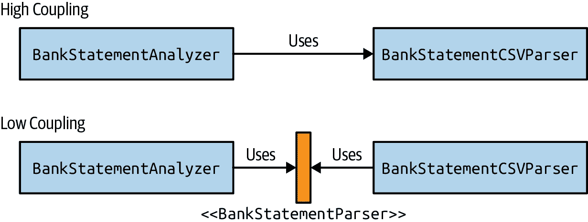
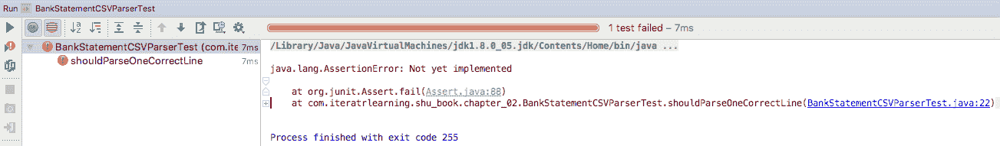
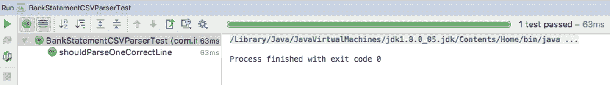

# 第二章。银行对账单分析器

# 挑战

金融科技行业现在非常热门。马克·厄伯格祖克意识到自己在不同购买上花了很多钱，会受益于自动总结自己的开支。他从银行每月收到对账单，但他觉得有点压力山大。他委托您开发一款软件，可以自动处理他的银行对账单，以便他能更好地了解自己的财务状况。接受挑战！

# 目标

在本章中，您将学习关于良好软件开发的基础知识，然后在接下来的几章中学习更高级的技术。

您将首先在一个单一类中实现问题陈述。然后您将探讨为什么这种方法在应对不断变化的需求和项目维护方面会面临几个挑战。

但不用担心！您将学习软件设计原则和技术，以确保您编写的代码符合这些标准。您首先将了解*单一职责原则*（SRP），这有助于开发更易于维护、更容易理解并减少引入新错误范围的软件。在此过程中，您将学习到新概念，如*内聚性*和*耦合性*，这些概念对指导您开发的代码和软件的质量非常有用。

###### 注意

本章使用了 Java 8 及以上版本的库和特性，包括新的日期和时间库。

如果您在任何时候想要查看本章的源代码，您可以查看该书代码仓库中的`com.iteratrlearning.shu_book.chapter_02`包。

# 银行对账单分析器需求

您与马克·厄伯格祖克共进了一杯美味的时髦拿铁（没有加糖），以收集需求。因为马克非常精通技术，他告诉您，银行对账单分析器只需要读取一个包含银行交易列表的文本文件。他从他的网上银行门户下载了文件。这个文本是使用逗号分隔的值（CSV）格式结构化的。这是银行交易的样本：

```java
30-01-2017,-100,Deliveroo
30-01-2017,-50,Tesco
01-02-2017,6000,Salary
02-02-2017,2000,Royalties
02-02-2017,-4000,Rent
03-02-2017,3000,Tesco
05-02-2017,-30,Cinema
```

他想要得到以下问题的答案：

+   从一系列银行对账单中的总利润和损失是多少？是正还是负？

+   特定月份有多少笔银行交易？

+   他的前 10 笔开销是什么？

+   他在哪个类别上花费了大部分的钱？

# KISS 原则

让我们从简单的开始。第一个查询如何：“从一系列银行对账单中的总利润和损失是多少？”您需要处理一个 CSV 文件，并计算所有金额的总和。由于没有其他要求，您可以决定不需要创建一个非常复杂的应用程序。

你可以“简洁明了”（KISS），并且将应用程序代码放在一个单独的类中，如示例 2-1 所示。请注意，您现在不必担心可能的异常情况（例如，文件不存在或加载文件失败的情况）。这是您将在第 3 章中学习的一个主题。

###### 注意

CSV 并非完全标准化。它通常被称为由逗号分隔的值。然而，有些人称其为使用不同分隔符（如分号或制表符）的分隔符分隔格式。这些要求可能会增加解析器实现的复杂性。在本章中，我们假设值由逗号（`,`）分隔。

##### 示例 2-1\. 计算所有语句的总和

```java
public class BankTransactionAnalyzerSimple {
    private static final String RESOURCES = "src/main/resources/";

    public static void main(final String... args) throws IOException {

        final Path path = Paths.get(RESOURCES + args[0]);
        final List<String> lines = Files.readAllLines(path);
        double total = 0d;
        for(final String line: lines) {
            final String[] columns = line.split(",");
            final double amount = Double.parseDouble(columns[1]);
            total += amount;
        }

        System.out.println("The total for all transactions is " + total);
    }
}
```

这里发生了什么？您正在加载作为应用程序命令行参数传递的 CSV 文件。`Path`类表示文件系统中的路径。然后使用`Files.readAllLines()`返回行列表。获取文件的所有行后，您可以逐行解析它们：

+   通过逗号拆分列

+   提取金额

+   将金额解析为`double`

一旦将给定语句的金额作为`double`获取，您可以将其添加到当前总金额中。在处理结束时，您将获得总金额。

示例 2-1 中的代码将可以正常工作，但它忽略了一些边界情况，这些情况在编写生产就绪代码时总是要考虑的：

+   如果文件为空怎么办？

+   如果解析金额失败，因为数据已损坏怎么办？

+   如果语句行数据缺失怎么办？

我们将在第 3 章再次讨论如何处理异常，但保持这类问题的思考习惯是一个好习惯。

如何解决第二个查询：“特定月份有多少银行交易？”你可以做什么？复制粘贴是一种简单的技术，对吧？您可以复制并粘贴相同的代码，并替换逻辑，以选择给定的月份，如示例 2-2 所示。

##### 示例 2-2\. 计算一月语句的总和

```java
final Path path = Paths.get(RESOURCES + args[0]);
final List<String> lines = Files.readAllLines(path);
double total = 0d;
final DateTimeFormatter DATE_PATTERN = DateTimeFormatter.ofPattern("dd-MM-yyyy");
for(final String line: lines) {
    final String[] columns = line.split(",");
    final LocalDate date = LocalDate.parse(columns[0], DATE_PATTERN);
    if(date.getMonth() == Month.JANUARY) {
        final double amount = Double.parseDouble(columns[1]);
        total += amount;
    }
}

System.out.println("The total for all transactions in January is " + total);
```

## final 变量

作为一个简短的旁观，我们将解释代码示例中`final`关键字的用法。在本书中，我们广泛使用了`final`关键字。标记局部变量或字段为`final`意味着它不能被重新赋值。在您的项目中是否使用`final`是您团队和项目的集体事务，因为其使用既有利也有弊。我们发现，在可能的情况下标记尽可能多的变量为`final`，可以清晰地标识对象生命周期内哪些状态是可变的，哪些状态不会被重新赋值。

另一方面，使用`final`关键字并不能保证对象的不可变性。你可以有一个`final`字段，它引用具有可变状态的对象。我们将在第四章中更详细地讨论不可变性。此外，它的使用还会向代码库中添加大量样板代码。一些团队选择妥协的方法，在方法参数上使用`final`字段，以确保它们明确不会被重新赋值，也不是局部变量。

在一个领域中，使用`final`关键字几乎没有意义，尽管 Java 语言允许这样做，这是在抽象方法上的方法参数上；例如，在接口中。这是因为缺乏方法体意味着在这种情况下`final`关键字没有真正的含义或意义。可以说，自从 Java 10 引入`var`关键字以来，`final`的使用已经减少，我们稍后在示例 5-15 中讨论这个概念。

# 代码可维护性和反模式

你认为示例 2-2 中展示的复制粘贴方法是一个好主意吗？是时候退后一步，反思一下发生了什么。当你编写代码时，你应该努力提供良好的*代码可维护性*。这意味着什么？最好的描述方式是关于你所写代码的属性的愿望清单：

+   应该简单地定位负责特定功能的代码。

+   应该简单地了解代码的功能。

+   添加或删除新功能应该很简单。

+   它应该提供良好的*封装性*。换句话说，实现细节应该对代码的使用者隐藏起来，这样就更容易理解和进行更改。

考虑到你的一位同事在六个月后查看你的代码，并且你已经去了另一家公司，思考一下你编写的代码对他们的影响是什么。

最终，你的目标是管理你正在构建的应用程序的复杂性。然而，如果随着新需求的出现你继续复制粘贴相同的代码，你将遇到以下问题，这些问题被称为*反模式*，因为它们是常见的无效解决方案：

+   代码难以理解，因为你有一个庞大的*“上帝类”*

+   因为*代码重复*而脆弱且容易受到更改破坏的代码

让我们更详细地解释这两个反模式。

## 上帝类

将所有代码放在一个文件中，你最终会得到一个巨大的类，这使得理解其目的变得更加困难，因为这个类负责所有事情！如果需要更新现有代码的逻辑（例如，更改解析方式），你如何轻松地定位到该代码并进行更改？这个问题被称为反模式“上帝类”。本质上，你有一个类负责一切。你应该避免这种情况。在下一节中，你将学习*单一责任原则*，这是一个软件开发指导原则，有助于编写更易理解和维护的代码。

## 代码重复

对于每一个查询，你都在复制读取和解析输入的逻辑。如果输入要求不再是 CSV 而是 JSON 文件怎么办？如果需要支持多种格式怎么办？添加这样一个功能将是一个痛苦的变更，因为你的代码已经硬编码了一个特定的解决方案，并在多个地方重复了这种行为。因此，所有这些地方都必须更改，你可能会引入新的错误。

###### 注意

你经常会听到“不要重复自己”（DRY）原则。这是一个成功减少重复的想法，逻辑的修改不再需要多次修改你的代码。

相关问题是，如果数据格式发生变化怎么办？代码只支持特定的数据格式模式。如果需要增强（例如，新的列）或支持不同的数据格式（例如，不同的属性名称），你将再次不得不在整个代码中进行多次更改。

结论是，在可能的情况下保持事情简单是好的，但不要滥用 KISS 原则。相反，你需要反思整个应用程序的设计，并理解如何将问题分解为更容易单独管理的子问题。结果是，你将拥有更容易理解、维护和适应新需求的代码。

# 单一责任原则

*单一责任原则*（SRP）是一个通用的软件开发指导原则，有助于编写更易管理和维护的代码。

你可以从两个互补的角度思考 SRP：

+   一个类负责一个单一功能

+   一个类只有一个改变的原因¹

SRP 通常应用于类和方法。SRP 关注于一个特定的行为、概念或类别。它导致更健壮的代码，因为它只有一个特定的原因需要更改，而不是多个关注点。多个关注点的原因是问题的，正如你之前看到的那样，它通过可能在多个地方引入错误来复杂化代码的可维护性。它也可能使代码更难理解和更改。

那么在 示例 2-2 中显示的代码中如何应用 SRP 呢？很明显，主类具有多个可以单独分解的责任：

1.  读取输入

1.  根据给定格式解析输入

1.  处理结果

1.  报告结果的摘要

本章节将专注于解析部分。在下一章节中，您将学习如何扩展银行对账单分析器，使其完全模块化。

第一个自然的步骤是将 CSV 解析逻辑提取到一个单独的类中，以便您可以将其用于不同的处理查询。让我们称之为 `BankStatementCSVParser`，这样就立即清楚它的作用（参见 示例 2-3）。

##### 示例 2-3 将解析逻辑提取到一个单独的类中

```java
public class BankStatementCSVParser {

    private static final DateTimeFormatter DATE_PATTERN
        = DateTimeFormatter.ofPattern("dd-MM-yyyy");

    private BankTransaction parseFromCSV(final String line) {
        final String[] columns = line.split(",");

        final LocalDate date = LocalDate.parse(columns[0], DATE_PATTERN);
        final double amount = Double.parseDouble(columns[1]);
        final String description = columns[2];

        return new BankTransaction(date, amount, description);
    }

    public List<BankTransaction> parseLinesFromCSV(final List<String> lines) {
        final List<BankTransaction> bankTransactions = new ArrayList<>();
        for(final String line: lines) {
            bankTransactions.add(parseFromCSV(line));
        }
        return bankTransactions;
    }
}
```

您可以看到 `BankStatementCSVParser` 类声明了两个方法，`parseFromCSV()` 和 `parseLinesFromCSV()`，它们生成 `BankTransaction` 对象，这是一个模拟银行对账单的领域类（参见 示例 2-4 中的声明）。

###### 注意

*domain* 是什么意思？它指的是使用与业务问题相匹配的词语和术语（即手头的领域）。

`BankTransaction` 类很有用，因此我们应用程序的不同部分可以共享对银行对账单的相同理解。您会注意到该类为 `equals` 和 `hashcode` 方法提供了实现。这些方法的目的以及如何正确实现它们在 第六章 中有所介绍。

##### 示例 2-4 银行交易领域类

```java
public class BankTransaction {
    private final LocalDate date;
    private final double amount;
    private final String description;

    public BankTransaction(final LocalDate date, final double amount, final String description) {
        this.date = date;
        this.amount = amount;
        this.description = description;
    }

    public LocalDate getDate() {
        return date;
    }

    public double getAmount() {
        return amount;
    }

    public String getDescription() {
        return description;
    }

    @Override
    public String toString() {
        return "BankTransaction{" +
                "date=" + date +
                ", amount=" + amount +
                ", description='" + description + '\'' +
                '}';
    }

    @Override
    public boolean equals(Object o) {
        if (this == o) return true;
        if (o == null || getClass() != o.getClass()) return false;
        BankTransaction that = (BankTransaction) o;
        return Double.compare(that.amount, amount) == 0 &&
                date.equals(that.date) &&
                description.equals(that.description);
    }

    @Override
    public int hashCode() {
        return Objects.hash(date, amount, description);
    }
}
```

现在您可以重构应用程序，使其使用您的 `BankStatementCSVParser`，特别是其 `parseLinesFromCSV()` 方法，如 示例 2-5 所示。

##### 示例 2-5 使用银行对账单 CSV 解析器

```java
final BankStatementCSVParser bankStatementParser = new BankTransactionCSVParser();

final String fileName = args[0];
final Path path = Paths.get(RESOURCES + fileName);
final List<String> lines = Files.readAllLines(path);

final List<BankTransaction> bankTransactions
    = bankStatementParser.parseLinesFromCSV(lines);

System.out.println("The total for all transactions is " + calculateTotalAmount(bankTransactions));
System.out.println("Transactions in January " + selectInMonth(BankTransactions, Month.JANUARY));
```

您需要实现的不同查询现在不再需要了解内部解析细节，因为您现在可以直接使用 `BankTransaction` 对象来提取所需的信息。 示例 2-6 中的代码展示了如何声明 `calculateTotalAmount()` 和 `selectInMonth()` 方法，它们负责处理交易列表并返回适当的结果。在 第三章 中，您将获得关于 Lambda 表达式和流 API 的概述，这将进一步简化代码。

##### 示例 2-6 处理银行交易列表

```java
public static double calculateTotalAmount(final List<BankTransaction> bankTransactions) {
    double total = 0d;
    for(final BankTransaction bankTransaction: bankTransactions) {
        total += bankTransaction.getAmount();
    }
    return total;
}

public static List<BankTransaction> selectInMonth(final List<BankTransaction> bankTransactions, final Month month) {

    final List<BankTransaction> bankTransactionsInMonth = new ArrayList<>();
    for(final BankTransaction bankTransaction: bankTransactions) {
        if(bankTransaction.getDate().getMonth() == month) {
            bankTransactionsInMonth.add(bankTransaction);
        }
    }
    return bankTransactionsInMonth;
}
```

这种重构的主要好处是，您的主要应用程序不再负责实现解析逻辑。它现在将该责任委托给一个单独的类和方法，这些类和方法可以独立维护和更新。随着不同查询的新需求出现，您可以重用 `BankStatementCSVParser` 类封装的功能。

另外，如果你需要改变解析算法的工作方式（例如，更高效的实现并缓存结果），现在你只需要改变一个地方。此外，你引入了一个名为`BankTransaction`的类，其他代码部分可以依赖它而不依赖于特定的数据格式模式。

当你实现方法时，遵循*最少惊讶原则*是一个好习惯。这将有助于确保在查看代码时清楚地了解发生了什么。这意味着：

+   使用自说明的方法名，这样一看就能立刻知道它们在做什么（例如，`calculateTotalAmount()`）。

+   不要改变参数的状态，因为代码的其他部分可能依赖于它。

最少惊讶原则可能是一个主观的概念。当有疑问时，请与你的同事和团队成员沟通，以确保大家达成一致。

# 内聚性

到目前为止，你已经学习了三个原则：*KISS*、*DRY*和*SRP*。但你还没有学习到关于代码质量的评估特征。在软件工程中，你经常会听到*内聚性*作为你编写的代码不同部分的重要特征。听起来很花哨，但这是一个非常有用的概念，可以帮助你评估代码的可维护性。

内聚性关注*相关性*。更准确地说，内聚性衡量了一个类或方法责任的强相关程度。换句话说，这些事情多么相关？这是一种帮助你理解软件复杂性的方式。你想要实现的是*高内聚性*，这意味着代码更容易被他人找到、理解和使用。在你之前重构的代码中，`BankTransactionCSVParser`类具有很高的内聚性。事实上，它组合了两个与解析 CSV 数据相关的方法。

一般来说，内聚性的概念适用于类（类级内聚性），但也可以应用于方法（方法级内聚性）。

如果你看一下程序的入口点，比如`BankStatementAnalyzer`类，你会注意到它的责任是连接你应用程序的不同部分，比如解析器和计算部分，并在屏幕上报告。然而，负责进行计算的逻辑目前被声明为`BankStatementAnalyzer`类中的静态方法。这是内聚性差的一个例子，因为在这个类中声明的计算关注点与解析或报告无直接关联。

相反，你可以将计算操作提取到一个名为`BankStatementProcessor`的单独类中。你还可以看到，这些操作的方法参数列表是共享的，因此你可以将其包含为该类的一个字段。结果是，你的方法签名变得更简单易懂，类`BankStatementProcessor`更加内聚。示例 2-7 中的代码展示了最终的结果。额外的好处是，`BankStatementProcessor`的方法可以被应用程序的其他部分重复使用，而不依赖于整个`BankStatementAnalyzer`。

##### 示例 2-7\. 在 BankStatementProcessor 类中分组计算操作

```java
public class BankStatementProcessor {

    private final List<BankTransaction> bankTransactions;

    public BankStatementProcessor(final List<BankTransaction> bankTransactions) {
        this.bankTransactions = bankTransactions;
    }

    public double calculateTotalAmount() {
        double total = 0;
        for(final BankTransaction bankTransaction: bankTransactions) {
            total += bankTransaction.getAmount();
        }
        return total;
    }

    public double calculateTotalInMonth(final Month month) {
        double total = 0;
        for(final BankTransaction bankTransaction: bankTransactions) {
            if(bankTransaction.getDate().getMonth() == month) {
                total += bankTransaction.getAmount();
            }
        }
        return total;
    }

    public double calculateTotalForCategory(final String category) {
        double total = 0;
        for(final BankTransaction bankTransaction: bankTransactions) {
            if(bankTransaction.getDescription().equals(category)) {
                total += bankTransaction.getAmount();
            }
        }
        return total;
    }
}
```

现在，你可以像示例 2-8 中所示，使用这个类的方法来处理`BankStatementAnalyzer`。

##### 示例 2-8\. 使用 BankStatementProcessor 类处理银行交易列表的示例

```java
public class BankStatementAnalyzer {
    private static final String RESOURCES = "src/main/resources/";
    private static final BankStatementCSVParser bankStatementParser = new BankStatementCSVParser();

    public static void main(final String... args) throws IOException {

        final String fileName = args[0];
        final Path path = Paths.get(RESOURCES + fileName);
        final List<String> lines = Files.readAllLines(path);

        final List<BankTransaction> bankTransactions = bankStatementParser.parseLinesFrom(lines);
        final BankStatementProcessor bankStatementProcessor = new BankStatementProcessor(bankTransactions);

        collectSummary(bankStatementProcessor);
    }

    private static void collectSummary(final BankStatementProcessor bankStatementProcessor) {
        System.out.println("The total for all transactions is "
                + bankStatementProcessor.calculateTotalAmount());

        System.out.println("The total for transactions in January is "
                + bankStatementProcessor.calculateTotalInMonth(Month.JANUARY));

        System.out.println("The total for transactions in February is "
                + bankStatementProcessor.calculateTotalInMonth(Month.FEBRUARY));

        System.out.println("The total salary received is "
                + bankStatementProcessor.calculateTotalForCategory("Salary"));
    }
}
```

在接下来的小节中，你将专注于学习指南，帮助你编写更容易理解和维护的代码。

## 类级别的内聚性

在实践中，你至少会遇到六种常见的方法来分组方法：

+   功能性

+   信息性

+   实用性

+   逻辑性

+   顺序性

+   时间性

请记住，如果你分组的方法之间关系较弱，那么内聚性就较低。我们按顺序讨论它们，表 2-1 提供了一个摘要。 

### 功能性

当你编写`BankStatementCSVParser`时所采取的方法是将方法功能分组。方法`parseFrom()`和`parseLinesFrom()`解决了一个明确定义的任务：解析 CSV 格式的行。事实上，方法`parseLinesFrom()`使用了方法`parseFrom()`。这通常是实现高内聚性的好方法，因为这些方法一起工作，所以将它们分组以便更容易定位和理解是有意义的。功能内聚的危险在于可能诱导出过多过于简单的类，这些类仅仅分组了一个方法。沿着过于简单的类的道路走下去会增加不必要的冗长和复杂性，因为要考虑的类会更多。

### 信息性

将方法分组的另一个原因是因为它们作用于相同的数据或域对象。假设你需要一种方式来创建、读取、更新和删除`BankTransaction`对象（CRUD 操作）；你可能希望有一个专门用于这些操作的类。示例 2-9 中的代码展示了一个具有四个不同方法的信息性内聚类。每个方法都抛出`UnsupportedOperationException`以指示当前示例中未实现该方法的体。

##### 示例 2-9\. 信息性内聚的示例

```java
public class BankTransactionDAO {

    public BankTransaction create(final LocalDate date, final double amount, final String description) {
        // ...
        throw new UnsupportedOperationException();
    }

    public BankTransaction read(final long id) {
        // ...
        throw new UnsupportedOperationException();
    }

    public BankTransaction update(final long id) {
        // ...
        throw new UnsupportedOperationException();
    }

    public void delete(final BankTransaction BankTransaction) {
        // ...
        throw new UnsupportedOperationException();
    }
}
```

###### 注意

当与维护特定领域对象表的数据库进行接口时，这是一个典型模式。这种模式通常称为*数据访问对象*（DAO），并需要某种 ID 来识别对象。DAO 实质上是将对数据源的访问抽象和封装，如持久数据库或内存数据库。

这种方法的缺点是这种内聚性会将多个关注点组合在一起，为仅使用和需要某些操作的类引入额外的依赖关系。

### 实用性

你可能会被诱惑将不同无关的方法组合到一个类中。这种情况通常发生在方法应该放置的位置不明确时，因此你最终得到一个类似于样样通的实用类。

这通常应避免，因为这会导致低内聚性。方法之间没有关联，因此整个类更难推理。此外，实用类展示了发现性差的特征。你希望你的代码易于查找，并且易于理解其应该如何使用。实用类违背了这个原则，因为它们包含了不相关的不同方法，没有明确的分类。

### 逻辑性

假设你需要为 CSV、JSON 和 XML 提供解析的实现。你可能会被诱惑将负责解析不同格式的方法放到一个类中，如示例 2-10 所示。

##### 示例 2-10\. 逻辑内聚性示例

```java
public class BankTransactionParser {

    public BankTransaction parseFromCSV(final String line) {
        // ...
        throw new UnsupportedOperationException();
    }

    public BankTransaction parseFromJSON(final String line) {
        // ...
        throw new UnsupportedOperationException();
    }

    public BankTransaction parseFromXML(final String line) {
        // ...
        throw new UnsupportedOperationException();
    }
}
```

实际上，这些方法在逻辑上被分类为“解析”。然而，它们的本质是不同的，每个方法都是不相关的。将它们分组也会违反你之前学到的单一责任原则，因为这个类负责多个关注点。因此，不推荐这种方法。

你将在“耦合”中了解到，存在技术来解决在保持高内聚性的同时提供不同解析实现的问题。

### 顺序性

假设你需要读取文件、解析文件、处理信息并保存信息。你可能会将所有方法都组合到一个单一类中。毕竟，文件读取的输出成为解析的输入，解析的输出成为处理步骤的输入，依此类推。

这被称为顺序内聚性，因为你将方法组合在一起，使它们按照输入到输出的顺序进行。这使得理解操作如何一起工作变得容易。不幸的是，实际操作中，这意味着组合方法的类有多个变更的原因，因此违反了单一责任原则（SRP）。此外，处理、汇总和保存可能有许多不同的方法，因此这种技术很快导致复杂的类。

更好的方法是将每个责任分解到各个内聚力强的类中。

### 时间性

一个时间上连贯的类是指执行几个仅在时间上相关的操作。一个典型的例子是一个声明某种初始化和清理操作（例如连接和关闭数据库连接）的类，在其他处理操作之前或之后被调用。这些初始化和其他操作之间没有关联，但它们必须按特定的时间顺序调用。

表 2-1\. 不同内聚度水平的优缺点总结

| 内聚度水平 | 优点 | 缺点 |
| --- | --- | --- |
| 功能性（高内聚度） | 易于理解 | 可能导致过于简单的类 |
| 信息性（中等内聚度） | 易于维护 | 可能导致不必要的依赖关系 |
| 顺序性（中等内聚度） | 易于定位相关操作 | 鼓励 SRP 的违反 |
| 逻辑性（中等内聚度） | 提供某种高级别的分类 | 鼓励 SRP 的违反 |
| 实用性（低内聚度） | 简单实施 | 更难理解类的责任 |
| 时间性（低内聚度） | 不适用 | 更难理解和使用各个操作 |

## 方法级内聚度

内聚度原则同样适用于方法。方法执行的功能越多，理解方法实际作用就越困难。换句话说，如果方法处理多个不相关的关注点，则其内聚度较低。内聚度较低的方法也更难测试，因为它们在一个方法中具有多个责任，这使得单独测试这些责任变得困难！通常情况下，如果你发现自己的方法包含一系列的 if/else 块，这些块对类的许多不同字段或方法参数进行修改，则这是你应该将方法拆分为更内聚部分的迹象。

# 耦合

你编写的代码的另一个重要特征是*耦合*。而*内聚*是关于类、包或方法中相关事物的程度，*耦合*则是关于你对其他类的依赖程度。耦合还可以理解为你对某些类的具体实现（即具体实现细节）的依赖程度。这很重要，因为你依赖的类越多，引入变更时你的灵活性就越低。实际上，受变更影响的类可能会影响到所有依赖它的类。

要理解什么是耦合，可以想象一个时钟。你不需要知道时钟如何工作才能读取时间，因此你并不依赖于时钟的内部机制。这意味着你可以在不影响如何读取时间的情况下更改时钟的内部。这两个关注点（接口和实现）在彼此之间是解耦的。

耦合涉及*依赖性有多强*。例如，到目前为止，`BankStatementAnalyzer`类依赖于`BankStatementCSVParser`类。如果需要更改解析器以支持以 JSON 条目编码的对账单或 XML 条目会怎样？这将是一个烦人的重构！但是不用担心，通过使用接口可以解耦不同的组件，这是提供灵活性以适应变化需求的首选工具。

首先，你需要引入一个接口，告诉你如何使用银行对账单的解析器，但不硬编码具体实现，正如示例 2-11 所示。

##### 示例 2-11\. 引入一个解析银行对账单的接口

```java
public interface BankStatementParser {
    BankTransaction parseFrom(String line);
    List<BankTransaction> parseLinesFrom(List<String> lines);
}
```

现在，你的`BankStatementCSVParser`将成为该接口的一个实现：

```java
public class BankStatementCSVParser implements BankStatementParser {
    // ...
}
```

目前为止一切顺利，但如何将`BankStatementAnalyzer`从具体的`BankStatementCSVParser`实现中解耦？你需要使用接口！通过引入一个名为`analyze()`的新方法，该方法接受`BankTransactionParser`作为参数，你不再与特定实现耦合（参见示例 2-12）。

##### 示例 2-12\. 解耦银行对账单分析器与解析器

```java
public class BankStatementAnalyzer {
    private static final String RESOURCES = "src/main/resources/";

    public void analyze(final String fileName, final BankStatementParser bankStatementParser)
    throws IOException {

        final Path path = Paths.get(RESOURCES + fileName);
        final List<String> lines = Files.readAllLines(path);

        final List<BankTransaction> bankTransactions = bankStatementParser.parseLinesFrom(lines);

        final BankStatementProcessor bankStatementProcessor = new BankStatementProcessor(bankTransactions);

        collectSummary(bankStatementProcessor);
    }

    // ...
}
```

这很棒，因为`BankStatementAnalyzer`类不再需要了解不同具体实现的细节，这有助于应对不断变化的需求。图 2-1 展示了在解耦两个类时依赖关系的差异。



###### 图 2-1\. 解耦两个类

现在，你可以把所有不同的部分组合起来，创建你的主应用程序，如示例 2-13 所示。

##### 示例 2-13\. 运行主应用程序

```java
public class MainApplication {

    public static void main(final String... args) throws IOException {

        final BankStatementAnalyzer bankStatementAnalyzer
                = new BankStatementAnalyzer();

        final BankStatementParser bankStatementParser
                = new BankStatementCSVParser();

        bankStatementAnalyzer.analyze(args[0], bankStatementParser);

    }
}
```

通常，在编写代码时，你会力求实现*低耦合*。这意味着代码中的不同组件不依赖于内部/实现细节。低耦合的相反称为*高耦合*，这是你绝对要避免的！

# 测试

你已经写了一些软件，看起来如果你执行你的应用程序几次，似乎一切都正常工作。然而，你对你的代码会始终工作有多有信心？你能向客户保证你已经满足了需求吗？在本节中，你将学习有关测试以及如何使用最流行和广泛采用的 Java 测试框架 JUnit 编写你的第一个自动化测试。

## 自动化测试

自动化测试听起来又是一件可能会把你从写代码的有趣部分中带走更多时间的事情！你为什么要在意？

不幸的是，在软件开发中，事情从来不会一次就成功。显然，测试是有益的。你能想象在没有测试软件是否真正有效的情况下集成新的飞机自动驾驶软件吗？

测试并不需要手动操作。在自动化测试中，您拥有一套可以在没有人为干预的情况下自动运行的测试。这意味着当您在代码中引入更改并希望增加对软件行为正确性的信心时，测试可以快速执行。在一个平常的工作日里，专业开发人员通常会运行数百或数千个自动化测试。

在本节中，我们将首先简要回顾自动化测试的好处，以便您清楚地理解为什么测试是良好软件开发核心的一部分。

### 信心

首先，对软件执行测试以验证行为是否符合规范，可以使您确信已满足客户的要求。您可以将测试规范和结果呈现给客户作为保证。在某种意义上，测试成为了客户的规范。

### 对变更的鲁棒性

其次，如果您对代码进行更改，如何确保您没有意外破坏任何东西？如果代码很小，您可能认为问题会很明显。但是，如果您正在处理数百万行的代码库呢？对于更改同事的代码，您会有多大的信心？拥有一套自动化测试非常有用，可以检查您是否引入了新的错误。

### 程序理解

第三，自动化测试对于帮助您理解源代码项目内部不同组件的工作方式非常有用。事实上，测试明确了不同组件的依赖关系以及它们如何相互作用。这对于快速了解软件概览非常有用。比如说，您被分配到一个新项目。您会从哪里开始了解不同组件？测试是一个很好的起点。

## 使用 JUnit

希望您现在已经认识到编写自动化测试的价值所在。在本节中，您将学习如何使用一种名为 *JUnit* 的流行 Java 框架创建您的第一个自动化测试。没有免费的午餐。您将看到编写测试需要时间。此外，您还需要考虑编写的测试的长期维护，因为毕竟它是常规代码。然而，前一节列出的好处远远超过了编写测试的不利因素。具体来说，您将编写 *单元测试*，用于验证小的独立行为单元的正确性，例如方法或小类。在本书中，您将学习编写良好测试的指导方针。在这里，您将首先获得为 `BankTransactionCSVParser` 编写简单测试的初步概述。

### 定义一个测试方法

首先的问题是你要在哪里编写你的测试？从 Maven 和 Gradle 构建工具的标准约定来看，你的代码应该放在 *src/main/java* 中，而测试类则放在 *src/test/java* 中。你还需要将 JUnit 库作为项目的依赖添加进去。你将在 第三章 中学习更多关于如何使用 Maven 和 Gradle 来组织项目结构的内容。

示例 2-14 展示了对 `BankTransactionCSVParser` 的简单测试。

###### 注意

我们的 `BankStatementCSVParserTest` 测试类有 `Test` 后缀。这并非绝对必要，但通常作为一个有用的提示。

##### 示例 2-14\. CSV 解析器的单元测试失败

```java
import org.junit.Assert;
import org.junit.Test;
public class BankStatementCSVParserTest {

    private final BankStatementParser statementParser = new BankStatementCSVParser();

    @Test
    public void shouldParseOneCorrectLine() throws Exception {
        Assert.fail("Not yet implemented");
    }

}
```

这里有很多新的部分。让我们逐一分解：

+   单元测试类是一个普通的类，名为 `BankStatementCSVParserTest`。按照惯例，在测试类名后面使用 `Test` 后缀是很常见的。

+   这个类声明了一个方法：`shouldParseOneCorrectLine()`。建议总是使用描述性名称，这样一看到测试方法的实现就能立即知道它的作用。

+   这个方法用 JUnit 注解 `@Test` 进行了标注。这意味着该方法代表一个应该执行的单元测试。你可以在测试类中声明私有的辅助方法，但它们不会被测试运行器执行。

+   此方法的实现调用了 `Assert.fail("Not yet implemented")`，这将导致单元测试以诊断消息 `"Not yet implemented"` 失败。你很快将学习如何使用 JUnit 提供的一组断言操作来实际实现一个单元测试。

你可以直接从你喜欢的构建工具（如 Maven 或 Gradle）或使用你的 IDE 执行测试。例如，在 IntelliJ IDE 中运行测试后，你将在 图 2-2 中看到输出。你可以看到测试以诊断信息 “Not yet implemented” 失败。现在让我们看看如何实际实现一个有用的测试，以增加对 `BankStatementCSVParser` 正确工作的信心。



###### 图 2-2\. 在 IntelliJ IDE 中运行失败单元测试的截图

### Assert 语句

你刚刚学到了 `Assert.fail()`。这是由 JUnit 提供的一个静态方法，称为 *断言语句*。JUnit 提供了许多断言语句，用于测试特定的条件。它们允许你提供预期结果并将其与某些操作的结果进行比较。

其中一个静态方法叫做 `Assert.assertEquals()`。你可以像 示例 2-15 中展示的那样使用它，测试 `parseFrom()` 的实现对特定输入是否正常工作。

##### 示例 2-15\. 使用断言语句

```java
@Test
public void shouldParseOneCorrectLine() throws Exception {
    final String line = "30-01-2017,-50,Tesco";

    final BankTransaction result = statementParser.parseFrom(line);

    final BankTransaction expected
        = new BankTransaction(LocalDate.of(2017, Month.JANUARY, 30), -50, "Tesco");
    final double tolerance = 0.0d;

    Assert.assertEquals(expected.getDate(), result.getDate());
    Assert.assertEquals(expected.getAmount(), result.getAmount(), tolerance);
    Assert.assertEquals(expected.getDescription(), result.getDescription());
}
```

那么这里发生了什么？有三个部分：

1.  你为你的测试设置上下文。在这种情况下，是一行要解析的内容。

1.  你执行一个操作。在这种情况下，你解析输入行。

1.  您指定了预期输出的断言。在这里，您检查日期、金额和描述是否被正确解析。

设置单元测试的这种三阶段模式通常被称为*Given-When-Then*公式。遵循这种模式并拆分不同的部分是一个好主意，因为它有助于清楚地理解测试实际在做什么。

当您再次运行测试时，有点运气的话，您将看到一个漂亮的绿色条表示测试成功，如图 2-3 所示。



###### 图 2-3\. 运行通过的单元测试

还有其他可用的断言语句，总结在表 2-2 中。

表 2-2\. 断言语句

| 断言语句 | 目的 |
| --- | --- |
| `Assert.fail(message)` | 让方法失败。这在您实现测试代码之前作为占位符很有用。 |
| `Assert.assertEquals​(expected, actual)` | 测试两个值是否相同。 |
| `Assert.assertEquals​(expected, actual, delta)` | 断言两个浮点数或双精度数在误差范围内相等。 |
| `Assert.assertNotNull(object)` | 断言对象不为空。 |

## 代码覆盖率

您编写了您的第一个测试，这很棒！但是如何确定这已经足够了呢？*代码覆盖率*指的是您的软件源代码（即，多少行或块）被一组测试覆盖的程度。通常，目标是追求高覆盖率，因为它降低了意外错误的几率。没有一个具体的百分比被认为是足够的，但我们建议目标是 70%–90%。在实践中，实际上很难达到 100%的代码覆盖率，因为您可能会测试 getter 和 setter 方法，这提供了较少的价值。

然而，代码覆盖率不一定是测试软件的好指标。事实上，代码覆盖率只告诉您您绝对没有测试的内容。代码覆盖率并不说明您测试的质量。您可能用简单的测试用例覆盖代码的一部分，但不一定覆盖边界情况，这通常会导致问题。

Java 中流行的代码覆盖工具包括*JaCoCo*、*Emma*和*Cobertura*。在实践中，您会看到人们谈论行覆盖率，它告诉您代码覆盖了多少语句。这种技术会给您一种错误的感觉，认为代码覆盖良好，因为条件（if、while、for）将被计算为一个语句。然而，条件具有多个可能的路径。因此，您应该优先考虑*分支覆盖*，它检查每个条件的真假分支。

# 收获

+   大类和代码重复导致代码难以推理和维护。

+   单一责任原则帮助您编写更易于管理和维护的代码。

+   内聚性关注一个类或方法的职责之间有多强的相关性。

+   耦合关注的是一个类在代码其他部分的依赖程度。

+   高内聚低耦合是可维护代码的特征。

+   一套自动化测试增加了软件正确性的信心，使其对变更更加健壮，并帮助程序理解。

+   JUnit 是一个 Java 测试框架，允许你指定验证方法和类行为的单元测试。

+   给定-当-那么 是一种将测试分为三个部分的模式，以帮助理解你实现的测试。

# 在你的迭代中

如果你想深入和巩固本节的知识，可以尝试以下活动：

+   编写几个额外的单元测试用例，以测试 CSV 解析器的实现。

+   支持不同的聚合操作，比如在特定日期范围内查找最大或最小的交易。

+   返回一个按月份和描述分组的支出直方图。

# 完成挑战

Mark Erbergzuck 对你的银行对账单分析器的第一次迭代非常满意。他采纳了你的想法，并将其重命名为**THE Bank Statements Analyzer**。他对你的应用非常满意，因此他要求你进行一些增强。事实证明，他希望扩展阅读、解析、处理和汇总功能。例如，他喜欢 JSON。此外，他认为你的测试有些有限，并发现了一些错误。

这是你将在下一章中解决的问题，在那里你将学习异常处理、开闭原则，以及如何使用构建工具构建你的 Java 项目。

¹ 这个定义归因于 Robert Martin。
