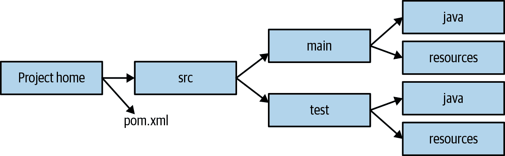

# 第三章 扩展银行对账单分析器

# 挑战

Mark Erbergzuck 对你在前一章的工作非常满意。你建立了一个基本的银行对账单分析器作为最小可行产品。基于这个成功，Mark Erbergzuck 认为你的产品可以进一步发展，并要求你构建一个支持多种功能的新版本。

# 目标

在上一章中，你学习了如何创建一个分析 CSV 格式银行对账单的应用程序。在这段旅程中，你学习了有助于编写可维护代码的核心设计原则，如单一职责原则，以及应避免的反模式，如上帝类和代码重复。在逐步重构代码的过程中，你还学习了耦合性（你对其他类的依赖程度）和内聚性（类中相关事物的程度）。

尽管如此，该应用目前相当有限。怎么样提供搜索不同类型交易的功能，支持多种格式、处理器，并将结果导出成漂亮的报告，如文本和 HTML？

在本章中，你将深入探索软件开发的路径。首先，你将学习开闭原则，这是为了增加代码灵活性和改善代码维护而必不可少的。你还将学习引入接口的一般准则，以及避免高耦合的其他注意事项。你还将了解在 Java 中使用异常的情况——在定义 API 时包含它们是合适的情况，以及不合适的情况。最后，你将学会如何系统化地使用像 Maven 和 Gradle 这样的成熟构建工具来构建 Java 项目。

###### 注意

如果你想查看本章节的源代码，可以访问本书代码仓库中的`com.iteratrlearning.shu_book.chapter_03`包。

# 扩展银行对账单分析器的需求

你与 Mark Erbergzuck 友好交谈，收集了对银行对账单分析器第二次迭代功能的新要求。他希望扩展你可以执行的操作类型。目前应用程序的功能有限，只能查询特定月份或类别的收入。Mark 提出了两个新功能需求：

1.  他还希望能够搜索特定的交易。例如，你应该能够返回在特定日期范围内或特定类别中的所有银行交易。

1.  Mark 希望能够生成搜索结果的摘要统计报告，并支持文本和 HTML 等不同格式。

你将按顺序完成这些需求。

# 开闭原则

让我们从简单的开始。您将实现一个方法，可以找到所有金额超过一定数额的交易。第一个问题是，您应该在哪里声明这个方法？您可以创建一个单独的`BankTransactionFinder`类，其中包含一个简单的`findTransactions()`方法。但是，在上一章中，您还声明了一个名为`BankTransactionProcessor`的类。那么，您应该怎么做呢？在这种情况下，每次需要添加一个单一方法时声明一个新类并没有太多好处。实际上，这会增加整个项目的复杂性，因为它引入了名称的污染，使得理解这些不同行为之间的关系变得更加困难。在`BankTransactionProcessor`内声明该方法有助于发现性，因为您立即知道这是一类分组所有执行某种形式处理的方法。既然您已经决定在哪里声明它，您可以按照示例 3-1 中显示的方式实现它。

##### 示例 3-1. 查找金额超过一定数额的银行交易

```java
public List<BankTransaction> findTransactionsGreaterThanEqual(final int amount) {
    final List<BankTransaction> result = new ArrayList<>();
    for(final BankTransaction bankTransaction: bankTransactions) {
        if(bankTransaction.getAmount() >= amount) {
            result.add(bankTransaction);
        }
    }
    return result;
}
```

这段代码是合理的。但是，如果您还希望在特定月份进行搜索怎么办呢？您需要像示例 3-2 中显示的那样复制此方法。

##### 示例 3-2. 在特定月份查找银行交易

```java
public List<BankTransaction> findTransactionsInMonth(final Month month) {
    final List<BankTransaction> result = new ArrayList<>();
    for(final BankTransaction bankTransaction: bankTransactions) {
        if(bankTransaction.getDate().getMonth() == month) {
            result.add(bankTransaction);
        }
    }
    return result;
}
```

在前一章中，您已经遇到了代码重复的情况。这是一种代码异味，会导致代码脆弱，特别是如果需求经常变化的情况下。例如，如果迭代逻辑需要更改，您将需要在多个地方重复修改。

这种方法对于更复杂的需求也不起作用。如果我们希望搜索特定月份的交易，并且金额超过一定数额怎么办？您可以按照示例 3-3 中显示的方式实现这个新需求。

##### 示例 3-3. 在特定月份和金额超过一定数额的银行交易

```java
public List<BankTransaction> findTransactionsInMonthAndGreater(final Month month, final int amount) {
    final List<BankTransaction> result = new ArrayList<>();
    for(final BankTransaction bankTransaction: bankTransactions) {
        if(bankTransaction.getDate().getMonth() == month && bankTransaction.getAmount() >= amount) {
            result.add(bankTransaction);
        }
    }
    return result;
}
```

显然，这种方法表现出了几个缺点：

+   随着必须结合银行交易的多个属性，您的代码会变得越来越复杂。

+   选择逻辑与迭代逻辑耦合在一起，使得更难将它们分开。

+   您继续重复代码。

这就是开闭原则的应用场景。它提倡能够在不修改代码的情况下更改方法或类的行为。在我们的例子中，这意味着可以扩展`findTransactions()`方法的行为，而无需复制代码或更改它以引入新的参数。这是如何可能的呢？正如前文所讨论的，迭代和业务逻辑的概念是耦合在一起的。在前一章中，您了解了接口作为一种有用的工具来将概念解耦。在本例中，您将引入一个`BankTransactionFilter`接口，它将负责选择逻辑，如示例 3-4 所示。它包含一个名为`test()`的方法，返回一个布尔值，并以`BankTransaction`对象作为参数。这样，`test()`方法就可以访问`BankTransaction`的所有属性，以指定任何适当的选择标准。

###### 注意

一个仅包含单个抽象方法的接口自 Java 8 以来被称为*函数式接口*。你可以使用`@FunctionalInterface`注解对其进行注释，以使接口的意图更加明确。

##### 示例 3-4\. BankTransactionFilter 接口

```java
@FunctionalInterface
public interface BankTransactionFilter {
    boolean test(BankTransaction bankTransaction);
}
```

###### 注意

Java 8 引入了一个泛型`java.util.function.Predicate<T>`接口，它非常适合手头的问题。然而，本章介绍了一个新命名的接口，以避免在书中早期引入过多复杂性。

`BankTransactionFilter`接口模拟了`BankTransaction`的选择标准概念。现在你可以重构`findTransactions()`方法来使用它，如示例 3-5 所示。这种重构非常重要，因为现在你已经通过这个接口引入了一种将迭代逻辑与业务逻辑解耦的方式。你的方法不再依赖于一个特定的过滤器实现。你可以通过将它们作为参数传递来引入新的实现，而无需修改此方法的主体。因此，它现在可以进行扩展而关闭修改。这减少了引入新错误的可能性，因为它最小化了对已实施和测试代码部分所需的级联更改。换句话说，旧代码仍然可以正常工作且未被改动。

##### 示例 3-5\. 使用开闭原则灵活的 findTransactions()方法

```java
public List<BankTransaction> findTransactions(final BankTransactionFilter bankTransactionFilter) {
    final List<BankTransaction> result = new ArrayList<>();
    for(final BankTransaction bankTransaction: bankTransactions) {
        if(bankTransactionFilter.test(bankTransaction)) {
            result.add(bankTransaction);
        }
    }
    return result;
}
```

## 创建函数式接口的实例

现在 Mark Erbergzuck 很高兴，因为您可以通过调用`BankTransactionProcessor`中声明的`findTransactions()`方法来实现任何新的需求，并使用`BankTransactionFilter`的适当实现。您可以通过实现一个类来实现这一点，如示例 3-6 所示，然后将一个实例作为参数传递给`findTransactions()`方法，如示例 3-7 所示。

##### 示例 3-6\. 声明实现 BankTransactionFilter 的类

```java
class BankTransactionIsInFebruaryAndExpensive implements BankTransactionFilter {

    @Override
    public boolean test(final BankTransaction bankTransaction) {
        return bankTransaction.getDate().getMonth() == Month.FEBRUARY
               && bankTransaction.getAmount() >= 1_000);
    }
}
```

##### 示例 3-7\. 使用特定的 BankTransactionFilter 实现调用 findTransactions()

```java
final List<BankTransaction> transactions
    = bankStatementProcessor.findTransactions(new BankTransactionIsInFebruaryAndExpensive());
```

## Lambda 表达式

然而，每当有新需求时，你需要创建特殊的类。这个过程可能会增加不必要的样板代码，并且可能会迅速变得繁琐。自 Java 8 以来，你可以使用一个称为 *lambda 表达式* 的功能，如 示例 3-8 所示。暂时不要担心这个语法和语言特性。我们将在第七章更详细地学习 lambda 表达式以及一个称为 *方法引用* 的伴随语言特性。现在，你可以将它看作是，我们不是传递实现接口的对象，而是传递一个代码块——一个没有名称的函数。`bankTransaction` 是一个参数的名称，箭头 `->` 分隔参数和 lambda 表达式的主体，这只是一些代码，用于测试是否应选择银行交易。

##### 示例 3-8\. 使用 lambda 表达式实现 BankTransactionFilter

```java
final List<BankTransaction> transactions
    = bankStatementProcessor.findTransactions(bankTransaction ->
                bankTransaction.getDate().getMonth() == Month.FEBRUARY
                && bankTransaction.getAmount() >= 1_000);
```

总结一下，开闭原则是一个有用的原则，因为它：

+   通过不更改现有代码来减少代码的脆弱性

+   促进现有代码的重复使用，从而避免代码重复

+   促进解耦，从而实现更好的代码维护

# 接口的注意事项

到目前为止，你引入了一种灵活的方法来搜索给定选择条件的交易。你经历的重构引发了一个问题，即应该发生什么事情，关于在 `BankTransactionProcessor` 类中声明的其他方法。它们应该是接口的一部分吗？它们应该包含在一个单独的类中吗？毕竟，在前一章中你实现了另外三个相关方法：

+   `calculateTotalAmount()`

+   `calculateTotalInMonth()`

+   `calculateTotalForCategory()`

我们不建议你采用的一种方法是将所有东西放入一个单一的接口：上帝接口。

## 上帝接口

你可以采取的一个极端观点是，`BankTransactionProcessor` 类充当 API。因此，你可能希望定义一个接口，让你能够解耦来自银行交易处理器的多个实现，如 示例 3-9 所示。这个接口包含了银行交易处理器需要实现的所有操作。

##### 示例 3-9\. 上帝接口

```java
interface BankTransactionProcessor {
    double calculateTotalAmount();
    double calculateTotalInMonth(Month month);
    double calculateTotalInJanuary();
    double calculateAverageAmount();
    double calculateAverageAmountForCategory(Category category);
    List<BankTransaction> findTransactions(BankTransactionFilter bankTransactionFilter);
}
```

然而，这种方法显示了几个缺点。首先，随着每一个帮助操作成为显式 API 定义的一个组成部分，这个接口变得越来越复杂。其次，正如你在前一章中看到的，这个接口更像是一个“上帝类”。事实上，这个接口现在已经变成了一个包含所有可能操作的容器。更糟糕的是，你实际上引入了两种额外的耦合形式：

+   在 Java 中，接口定义了每个单独实现必须遵守的契约。换句话说，这个接口的具体实现必须为每个操作提供实现。这意味着改变接口意味着所有具体实现也必须更新以支持这种变化。您添加的操作越多，可能发生的更改就越多，从而增加潜在问题的范围。

+   `BankTransaction`的具体属性，如月份和类别，已经成为方法名的一部分；例如，`calculateAverageForCategory()`和`calculateTotalInJanuary()`。这在接口中更加棘手，因为它们现在依赖于域对象的特定访问器。如果域对象的内部发生变化，那么这也可能导致接口以及所有具体实现的更改。

所有这些原因都是为什么通常建议定义更小的接口。其思想是最小化对域对象多个操作或内部的依赖。

## 过于细粒度

既然我们刚刚论证过越小越好，您可以采取的另一个极端观点是为每个操作定义一个接口，如示例 3-10 所示。您的`BankTransactionProcessor`类将实现所有这些接口。

##### 示例 3-10\. 接口过于细粒度

```java
interface CalculateTotalAmount {
    double calculateTotalAmount();
}

interface CalculateAverage {
    double calculateAverage();
}

interface CalculateTotalInMonth {
    double calculateTotalInMonth(Month month);
}
```

这种方法也不利于改善代码的维护性。实际上，它引入了“反凝聚性”。换句话说，很难发现感兴趣的操作，因为它们隐藏在多个单独的接口中。促进良好的维护的一部分是帮助发现常见操作的可发现性。此外，由于接口过于细粒度，它增加了总体复杂性，并且在项目中引入了许多不同的新类型，需要跟踪。

# 显式与隐式 API

那么采取实用主义的方法是什么？我们建议遵循开闭原则以增加操作的灵活性，并将最常见的情况定义为类的一部分。它们可以用更一般的方法实现。在这种情况下，接口并不特别适用，因为我们不期望`BankTransactionProcessor`有不同的实现。每个这些方法的特殊化并不会使您的整体应用程序受益。因此，在代码库中不需要过度工程化和添加不必要的抽象。`BankTransactionProcessor`只是一个允许您对银行交易执行统计操作的类。

这也引发了一个问题，即是否应该声明诸如`findTransactionsGreaterThanEqual()`这样的方法，因为这些方法可以很容易地由更通用的`findTransactions()`方法实现。这种困境通常被称为显式与隐式 API 的问题。

实际上，有两面考虑的硬币。一方面，像`findTransactionsGreaterThanEqual()`这样的方法是不言自明且易于使用的。你不应该担心添加描述性方法名称以帮助提高 API 的可读性和理解性。然而，这种方法限制于特定情况，你很容易会出现为多种需求而创建大量新方法的情况。另一方面，像`findTransactions()`这样的方法起初更难使用，需要有良好的文档支持。但它为所有需要查找交易的情况提供了统一的 API。没有一种最佳规则；这取决于你期望的查询类型。如果`findTransactionsGreaterThanEqual()`是一个非常常见的操作，将其提取为显式 API 可以让用户更容易理解和使用。

最终的`BankTransactionProcessor`的实现如示例 3-11 所示。

##### 示例 3-11\. `BankTransactionProcessor`类的关键操作

```java
@FunctionalInterface
public interface BankTransactionSummarizer {
    double summarize(double accumulator, BankTransaction bankTransaction);
}

@FunctionalInterface
public interface BankTransactionFilter {
    boolean test(BankTransaction bankTransaction);
}

public class BankTransactionProcessor {

    private final List<BankTransaction> bankTransactions;

    public BankStatementProcessor(final List<BankTransaction> bankTransactions) {
        this.bankTransactions = bankTransactions;
    }

    public double summarizeTransactions(final BankTransactionSummarizer bankTransactionSummarizer) {
        double result = 0;
        for(final BankTransaction bankTransaction: bankTransactions) {
            result = bankTransactionSummarizer.summarize(result, bankTransaction);
        }
        return result;
    }

    public double calculateTotalInMonth(final Month month) {
        return summarizeTransactions((acc, bankTransaction) ->
                bankTransaction.getDate().getMonth() == month ? acc  + bankTransaction.getAmount() : acc
        );
    }

	// ...

    public List<BankTransaction> findTransactions(final BankTransactionFilter bankTransactionFilter) {
        final List<BankTransaction> result = new ArrayList<>();
        for(final BankTransaction bankTransaction: bankTransactions) {
            if(bankTransactionFilter.test(bankTransaction)) {
                result.add(bankTransaction);
            }
        }
        return bankTransactions;
    }

    public List<BankTransaction> findTransactionsGreaterThanEqual(final int amount) {
        return findTransactions(bankTransaction -> bankTransaction.getAmount() >= amount);
    }

    // ...
}
```

###### 注意

到目前为止，你所见过的许多聚合模式都可以利用 Java 8 引入的 Streams API 来实现，如果你对此熟悉的话。例如，搜索交易可以轻松地指定如下所示：

```java
bankTransactions
    .stream()
    .filter(bankTransaction -> bankTransaction.getAmount() >= 1_000)
    .collect(toList());
```

尽管如此，Streams API 是使用本节中学到的相同基础和原则实现的。

## 域类还是原始值？

虽然我们保持了`BankTransactionSummarizer`接口定义的简单性，但如果你希望从聚合中返回结果，最好不要返回像`double`这样的原始值。这是因为它不能灵活地在以后返回多个结果。例如，`summarizeTransaction()`方法返回一个`double`。如果你要修改结果签名以包含更多结果，你需要修改每一个`BankTransactionProcessor`的实现。

解决这个问题的一个方法是引入一个新的域类，比如`Summary`，它包装了`double`值。这意味着将来你可以向这个类添加其他字段和结果。这种技术有助于进一步解耦你域中的各种概念，并在需求变化时帮助最小化级联变化。

###### 注意

原始的`double`值在存储小数时具有有限的精度。因为有限的位数限制了其精度。考虑的替代方案是`java.math.BigDecimal`，它具有任意精度。然而，这种精度是以增加的 CPU 和内存开销为代价的。

# 多个导出器

在前面的部分中，你了解了开闭原则以及在 Java 中接口的使用。随着 Mark Erbergzuck 有了新的需求，这些知识将会派上用场！你需要导出所选交易列表的摘要统计信息，包括文本、HTML、JSON 等不同格式。从哪里开始？

## 引入一个领域对象

首先，你需要明确用户想要导出的内容。我们一起探讨各种可能性及其权衡：

一个数字

也许用户只对返回操作结果感兴趣，例如`calculateAverageInMonth`。这意味着结果将是一个`double`。虽然这是最简单的方法，但正如我们之前提到的，这种方法在应对变化的需求时有些不灵活。假设你创建了一个接受`double`作为输入的导出器，这意味着你代码中调用此导出器的每个地方都需要更新，可能会引入新的错误。

一个集合

也许用户希望返回一个交易列表，例如，由`findTransaction()`返回的。甚至可以返回一个`Iterable`，以提供更多灵活性，指定返回的具体实现。虽然这给了你更多的灵活性，但也将你限制在只能返回一个集合上。如果需要返回多个结果，例如列表和其他摘要信息，该怎么办？

一个专门的领域对象

你可以引入一个新概念，例如`SummaryStatistics`，它代表用户有兴趣导出的摘要信息。*领域对象*只是与你的领域相关的类的实例。通过引入领域对象，你引入了一种解耦形式。实际上，如果有新的需求需要导出额外信息，你可以将其包含为此新类的一部分，而无需引入级联更改。

一个更复杂的领域对象

你可以引入一个称为`Report`的概念，它更通用，可以包含各种字段，存储各种结果，包括交易集合。是否需要这样做取决于用户的需求以及是否预期更复杂的信息。再次的好处在于，你能够将生成`Report`对象的应用程序的不同部分与消费`Report`对象的其他部分解耦。

对于我们的应用程序而言，让我们引入一个领域对象，该对象存储关于交易列表的摘要统计信息。示例 3-12 中的代码显示了其声明。

##### 示例 3-12\. 存储统计信息的领域对象

```java
public class SummaryStatistics {

    private final double sum;
    private final double max;
    private final double min;
    private final double average;

    public SummaryStatistics(final double sum, final double max, final double min, final double average) {
        this.sum = sum;
        this.max = max;
        this.min = min;
        this.average = average;
    }

    public double getSum() {
        return sum;
    }

    public double getMax() {
        return max;
    }

    public double getMin() {
        return min;
    }

    public double getAverage() {
        return average;
    }
}
```

## 定义和实现适当的接口

现在你知道需要导出什么，你将会设计一个 API 来完成它。你需要定义一个名为`Exporter`的接口。引入接口的原因是让你能够与多个导出器实现解耦。这符合你在前一节学到的开闭原则。事实上，如果你需要将导出器的实现从 JSON 替换为 XML，这将非常简单，因为它们都将实现相同的接口。你首次尝试定义接口的方法可能如示例 3-13 所示。方法`export()`接受一个`SummaryStatistics`对象并返回`void`。

##### 示例 3-13\. 不良的导出器接口

```java
public interface Exporter {
    void export(SummaryStatistics summaryStatistics);
}
```

几个原因应避免这种方法：

+   返回类型`void`毫无用处，也很难理解。我们不知道返回了什么。`export()`方法的签名暗示着在某个地方发生了状态改变，或者这个方法将日志记录或信息打印回屏幕。我们不知道！

+   返回`void`使得使用断言来测试结果非常困难。实际的结果是什么可以与预期结果进行比较？不幸的是，你无法获取`void`的结果。

在这个基础上，你提出了一个返回`String`的替代 API，如示例 3-14 所示。现在很明确，`Exporter`将返回文本，然后由程序的另一部分决定是否打印、保存到文件，甚至电子发送。文本字符串在测试中也非常有用，因为你可以直接与断言进行比较。

##### 示例 3-14\. 良好的导出器接口

```java
public interface Exporter {
    String export(SummaryStatistics summaryStatistics);
}
```

现在你已经定义了一个导出信息的 API，你可以实现各种遵循`Exporter`接口契约的导出器。你可以看到在示例 3-15 中实现了一个基本的 HTML 导出器的示例。

##### 示例 3-15\. 实现导出器接口

```java
public class HtmlExporter implements Exporter {
    @Override
    public String export(final SummaryStatistics summaryStatistics) {

        String result = "<!doctype html>";
        result += "<html lang='en'>";
        result += "<head><title>Bank Transaction Report</title></head>";
        result += "<body>";
        result += "<ul>";
        result += "<li><strong>The sum is</strong>: " + summaryStatistics.getSum() + "</li>";
        result += "<li><strong>The average is</strong>: " + summaryStatistics.getAverage() + "</li>";
        result += "<li><strong>The max is</strong>: " + summaryStatistics.getMax() + "</li>";
        result += "<li><strong>The min is</strong>: " + summaryStatistics.getMin() + "</li>";
        result += "</ul>";
        result += "</body>";
        result += "</html>";
        return result;
    }
}
```

# 异常处理

到目前为止，我们还没有讨论当事情出错时会发生什么。你能想到银行分析软件可能失败的情况吗？例如：

+   如果数据无法正确解析会怎么样？

+   如果无法读取包含要导入的银行交易的 CSV 文件会怎么样？

+   如果运行应用程序的硬件资源，如 RAM 或磁盘空间，不足会怎么样？

在这些场景中，你将会收到一个包含堆栈跟踪显示问题来源的可怕错误消息。示例 3-16 中的片段展示了这些意外错误的示例。

##### 示例 3-16\. 意外问题

```java
Exception in thread "main" java.lang.ArrayIndexOutOfBoundsException: 0

Exception in thread "main" java.nio.file.NoSuchFileException: src/main/resources/bank-data-simple.csv

Exception in thread "main" java.lang.OutOfMemoryError: Java heap space
```

## 为什么要使用异常？

让我们暂时专注于`BankStatementCSVParser`。我们如何处理解析问题？例如，文件中的 CSV 行可能没有按预期格式编写：

+   CSV 行可能比预期的三列多。

+   CSV 行可能少于预期的三列。

+   一些列的数据格式可能不正确，例如，日期可能是不正确的。

回到 C 编程语言令人恐惧的日子，您将添加许多 if 条件检查，这些检查将返回一个神秘的错误代码。这种方法有几个缺点。首先，它依赖全局共享的可变状态来查找最近的错误。这使得更难以理解代码中单独的部分。因此，您的代码变得更难维护。其次，这种方法容易出错，因为您需要区分作为值编码的真实值和错误。在这种情况下，类型系统是薄弱的，对程序员不够友好。最后，控制流与业务逻辑混合在一起，这导致代码更难维护和独立测试。

为了解决这些问题，Java 将异常作为一流语言特性引入，带来了许多好处：

文档

语言支持异常作为方法签名的一部分。

类型安全性

类型系统确定您是否处理了异常流。

关注点分离

业务逻辑和异常恢复通过 try/catch 块分开。

问题在于作为语言特性的异常也增加了更多的复杂性。您可能熟悉 Java 区分两种异常的事实：

已检查的异常

这些是预期能够从中恢复的错误。在 Java 中，您必须声明一个方法及其可以抛出的已检查异常列表。如果没有，您必须为该特定异常提供合适的 try/catch 块。

未检查的异常

这些是在程序执行期间可以随时抛出的错误。方法不必在其签名中显式声明这些异常，并且调用者不必像处理已检查异常那样显式处理它们。

Java 异常类按照明确定义的层次结构进行组织。 图 3-1 描绘了 Java 中的这种层次结构。 `Error` 和 `RuntimeException` 类是未经检查的异常，并且是 `Throwable` 的子类。您不应该期望捕获并从中恢复。类 `Exception` 通常表示程序应该能够从中恢复的错误。


###### 图 3-1\. Java 中的异常层次结构

## 异常的模式和反模式

在什么场景下应该使用哪类异常？您可能还想知道应该如何更新`BankStatementParser` API 以支持异常。不幸的是，这并没有简单的答案。在决定适合您的正确方法时，需要一些实用主义。

在解析 CSV 文件时，有两个独立的关注点：

+   解析正确的语法（例如，CSV，JSON）

+   数据的验证（例如，文本描述应少于 100 个字符）

首先关注语法错误，然后是数据的验证。

### 在未检查和已检查之间做出决定

有些情况下，CSV 文件可能不符合正确的语法（例如，缺少分隔逗号）。忽略这个问题将导致应用程序运行时出现混乱的错误。支持在代码中使用异常的部分好处之一是在问题出现时为 API 用户提供更清晰的诊断。因此，您决定添加如下示例代码中所示的简单检查，在 示例 3-17 中抛出 `CSVSyntaxException` 异常。

##### 示例 3-17\. 抛出语法异常

```java
final String[] columns = line.split(",");

if(columns.length < EXPECTED_ATTRIBUTES_LENGTH) {
    throw new CSVSyntaxException();
}
```

`CSVSyntaxException` 应该是已检查异常还是未检查异常？要回答这个问题，您需要问自己是否需要用户采取强制性的恢复操作。例如，如果是瞬态错误，用户可以实现重试机制；或者在屏幕上显示消息以增加应用程序的响应性。通常，由于业务逻辑验证错误（例如，错误格式或算术错误），应该使用未检查异常，因为它们会在代码中增加大量的 try/catch 代码。恢复机制也可能不明显。因此，在您的 API 用户身上施加这些是没有意义的。此外，系统错误（例如，磁盘空间不足）也应该是未检查异常，因为客户端无能为力。简而言之，建议是尽量使用未检查异常，仅在必要时使用已检查异常，以避免代码中的显著混乱。

现在让我们解决一下当你知道数据遵循正确的 CSV 格式后如何验证数据的问题。你将学习使用异常进行验证时的两种常见反模式。然后，你将学习通知模式，它为这个问题提供了一个可维护的解决方案。

### 过于具体

第一个浮现在你脑海中的问题是在哪里添加验证逻辑？你可以在 `BankStatement` 对象的构建时直接添加。然而，我们建议为此创建一个专门的 `Validator` 类，有几个理由：

+   当需要重用验证逻辑时，您无需重复编写它。

+   您可以确信系统的不同部分以相同的方式进行验证。

+   您可以轻松地单独对这个逻辑进行单元测试。

+   它遵循 SRP 原则，这导致了更简单的维护和程序理解。

有多种方法来使用异常来实现您的验证器。一个过于具体的方法示例在示例 3-18 中展示。您已经考虑了每一个边缘情况来验证输入，并将每个边缘情况转换为一个已检查的异常。异常`DescriptionTooLongException`、`InvalidDateFormat`、`DateInTheFutureException`和`InvalidAmountException`都是用户定义的已检查异常（即它们扩展了类`Exception`）。尽管这种方法允许您为每个异常指定精确的恢复机制，但显然这是低效的，因为它需要大量设置，声明多个异常，并强制用户明确处理每一个异常。这与帮助用户理解和简单使用您的 API 的初衷背道而驰。此外，您不能将所有错误作为整体收集起来以便向用户提供列表。

##### 示例 3-18\. 过于具体的异常

```java
public class OverlySpecificBankStatementValidator {

    private String description;
    private String date;
    private String amount;

    public OverlySpecificBankStatementValidator(final String description, final String date, final String amount) {
        this.description = Objects.requireNonNull(description);
        this.date = Objects.requireNonNull(description);
        this.amount = Objects.requireNonNull(description);
    }

    public boolean validate() throws DescriptionTooLongException,
                                     InvalidDateFormat,
                                     DateInTheFutureException,
                                     InvalidAmountException {

        if(this.description.length() > 100) {
            throw new DescriptionTooLongException();
        }

        final LocalDate parsedDate;
        try {
            parsedDate = LocalDate.parse(this.date);
        }
        catch (DateTimeParseException e) {
            throw new InvalidDateFormat();
        }
        if (parsedDate.isAfter(LocalDate.now())) throw new DateInTheFutureException();

        try {
            Double.parseDouble(this.amount);
        }
        catch (NumberFormatException e) {
            throw new InvalidAmountException();
        }
        return true;
    }
}
```

### 过于冷漠

另一种极端是将所有东西作为未检查异常处理；例如，通过使用`IllegalArgumentException`。示例 3-19 中的代码展示了遵循此方法实现的`validate()`方法。这种方法的问题在于您无法有特定的恢复逻辑，因为所有异常都是相同的！此外，您仍然无法将所有错误作为整体收集起来。

##### 示例 3-19\. 到处都是 IllegalArgumentException 异常

```java
public boolean validate() {

    if(this.description.length() > 100) {
        throw new IllegalArgumentException("The description is too long");
    }

    final LocalDate parsedDate;
    try {
        parsedDate = LocalDate.parse(this.date);
    }
    catch (DateTimeParseException e) {
        throw new IllegalArgumentException("Invalid format for date", e);
    }
    if (parsedDate.isAfter(LocalDate.now())) throw new IllegalArgumentException("date cannot be in the future");

    try {
        Double.parseDouble(this.amount);
    }
    catch (NumberFormatException e) {
        throw new IllegalArgumentException("Invalid format for amount", e);
    }
    return true;
}
```

接下来，您将学习通知模式，该模式提供了解决过于具体和过于冷漠反模式所突出的缺点的解决方案。

### 通知模式

通知模式旨在为您使用过多未检查异常的情况提供解决方案。解决方案是引入一个域类来收集错误。¹

您首先需要一个`Notification`类，其责任是收集错误。示例 3-20 中的代码展示了其声明。

##### 示例 3-20\. 引入域类 Notification 来收集错误

```java
public class Notification {
    private final List<String> errors = new ArrayList<>();

    public void addError(final String message) {
        errors.add(message);
    }

    public boolean hasErrors() {
        return !errors.isEmpty();
    }

    public String errorMessage() {
        return errors.toString();
    }

    public List<String> getErrors() {
        return this.errors;
    }

}
```

引入这样一个类的好处是，现在您可以声明一个能够在一次通过中收集多个错误的验证器。这在您之前探索的两种方法中是不可能的。现在，您可以简单地将消息添加到`Notification`对象中，如示例 3-21 所示。

##### 示例 3-21\. 通知模式

```java
public Notification validate() {

    final Notification notification = new Notification();
    if(this.description.length() > 100) {
        notification.addError("The description is too long");
    }

    final LocalDate parsedDate;
    try {
        parsedDate = LocalDate.parse(this.date);
        if (parsedDate.isAfter(LocalDate.now())) {
            notification.addError("date cannot be in the future");
        }
    }
    catch (DateTimeParseException e) {
        notification.addError("Invalid format for date");
    }

    final double amount;
    try {
        amount = Double.parseDouble(this.amount);
    }
    catch (NumberFormatException e) {
        notification.addError("Invalid format for amount");
    }
    return notification;
}
```

## 使用异常的指南

现在您已经了解了可能使用异常的情况，让我们讨论一些通用准则，有效地在您的应用程序中使用它们。

### 不   不要忽略异常

忽略异常永远不是一个好主意，因为你将无法诊断问题的根源。 如果没有明显的处理机制，那么抛出未检查的异常。 这样，如果您确实需要处理已检查的异常，那么在运行时看到问题后，您将被迫返回并处理它。

### 不要捕获通用的 Exception

尽可能捕获特定的异常以提高可读性和支持更具体的异常处理。 如果捕获通用的`Exception`，它还包括`RuntimeException`。 一些 IDE 可以生成过于一般化的捕获子句，因此您可能需要考虑使捕获子句更具体。

### 记录异常

在 API 级别记录异常，包括未检查的异常，以便于故障排除。 实际上，未检查的异常报告应解决的问题的根本。 示例 3-22 中的代码显示了使用`@throws` Javadoc 语法记录异常的示例。

##### 示例 3-22\. 记录异常

```java
@throws  NoSuchFileException if the file does not exist
@throws  DirectoryNotEmptyException if the file is a directory and
could not otherwise be deleted because the directory is not empty
@throws  IOException if an I/O error occurs
@throws  SecurityException In the case of the default provider,
and a security manager is installed, the {@link SecurityManager#checkDelete(String)}
method is invoked to check delete access to the file
```

### 注意特定于实现的异常

不要抛出特定于实现的异常，因为它会破坏您 API 的封装性。 例如，在 示例 3-23 中的 `read()` 的定义迫使任何未来的实现在显然与 Oracle 完全无关的情况下抛出一个 `OracleException`！

##### 示例 3-23\. 避免特定于实现的异常

```java
public String read(final Source source) throws OracleException { ... }
```

### 异常与控制流的比较

不要为控制流使用异常。 Java 中的 示例 3-24 中的代码展示了异常的错误使用。 该代码依赖异常来退出读取循环。

##### 示例 3-24\. 用于控制流的异常使用

```java
try {
    while (true) {
        System.out.println(source.read());
    }
}
catch(NoDataException e) {
}
```

几个理由应该避免此类代码。 首先，它会导致代码可读性差，因为异常 try/catch 语法会增加不必要的混乱。 其次，它使您代码的意图不太容易理解。 异常被设计为处理错误和异常情况的功能。 因此，在确实需要抛出异常之前最好不要创建异常。 最后，与抛出异常相关的堆栈跟踪会带来额外开销。

## 异常的替代方案

您已经学习了在 Java 中使用异常以使您的银行对账单分析器更健壮和易理解。 然而，除了异常，有哪些替代方案呢？ 我们简要描述了四种替代方法及其优缺点。

### 使用 null

不要像抛出具体异常那样，你可以问为什么不能像在 示例 3-25 中显示的那样返回`null`。

##### 示例 3-25\. 返回 null 而不是异常

```java
final String[] columns = line.split(",");

if(columns.length < EXPECTED_ATTRIBUTES_LENGTH) {
    return null;
}
```

绝对要避免这种方法。事实上，`null` 对调用者毫无用处的信息。而且，由于 API 返回 `null`，这也很容易出错。实际上，这会导致许多 `NullPointerException` 和大量不必要的调试！

### 空对象模式

在 Java 中，有时你会看到采用的一种 *空对象模式*。简而言之，与其返回一个 `null` 引用来表示对象的缺失，你可以返回一个实现了期望接口但方法体为空的对象。这种策略的优势在于，你不会遇到意外的 `NullPointer` 异常以及一长串的 `null` 检查。事实上，这个空对象非常可预测，因为它在功能上什么也不做！然而，这种模式也可能存在问题，因为你可能会用一个简单忽略真正问题的对象隐藏数据潜在的问题，从而导致故障排除更加困难。

### Optional<T>

Java 8 引入了一个内置数据类型 `java.util.Optional<T>`，专门用于表示值的存在或缺失。`Optional<T>` 提供了一组方法来显式处理值的缺失，这对于减少错误的范围非常有用。它还允许你将各种 `Optional` 对象组合在一起，这些对象可能作为不同 API 的返回类型返回。例如，在流 API 中的 `findAny()` 方法。你将在第七章学习如何在你的代码中使用 `Optional<T>`。

### Try<T>

还有另一种数据类型叫做 `Try<T>`，它表示可能成功或失败的操作。在某种程度上，它类似于 `Optional<T>`，但不是处理值，而是处理操作。换句话说，`Try<T>` 数据类型带来了类似的代码组合性好处，并且帮助减少代码中的错误。不幸的是，`Try<T>` 数据类型并没有内置到 JDK 中，而是由你可以查看的外部库支持。

# 使用构建工具

到目前为止，你已经学习了良好的编程实践和原则。但是关于如何构建、构造和运行你的应用程序呢？本节重点介绍为什么使用构建工具来管理你的项目是必要的，以及如何使用 Maven 和 Gradle 等构建工具以可预测的方式构建和运行你的应用程序。在第五章，你将更多地了解如何有效地使用 Java 包来组织应用程序。

## 为什么使用构建工具？

让我们考虑执行应用程序的问题。您需要注意几个要素。首先，一旦编写了项目的代码，您将需要编译它。为此，您将必须使用 Java 编译器（javac）。您记得编译多个文件所需的所有命令吗？对于多个包怎么办？如果需要导入其他 Java 库，如何管理依赖关系？如果项目需要以特定格式（如 WAR 或 JAR）打包怎么办？突然间事情变得混乱起来，开发者面临越来越大的压力。

为了自动化所有需要的命令，您需要创建一个脚本，这样您就不必每次重复命令。引入新脚本意味着所有当前和未来的队友都需要熟悉您的思维方式，以便在需求变化时维护和更改脚本。其次，需要考虑软件开发生命周期。这不仅仅是开发和编译代码。测试和部署如何处理呢？

解决这些问题的方法是使用构建工具。您可以将构建工具视为助手，可以自动化软件开发生命周期中的重复任务，包括构建、测试和部署应用程序。构建工具有许多好处：

+   它为您提供了一个通用的项目结构，使您的同事立即感到熟悉和舒适。

+   它为您提供了一个可重复和标准化的过程来构建和运行应用程序。

+   您花费更多时间在开发上，而不是在低级配置和设置上。

+   您通过减少由于错误配置或缺少步骤而引入错误的范围。

+   您可以通过重用常见的构建任务而不是重新实现它们来节省时间。

您现在将探索 Java 社区中使用的两个流行构建工具：Maven 和 Gradle。²

## 使用 Maven

Maven 在 Java 社区中非常流行。它允许您描述软件的构建过程以及其依赖关系。此外，有一个大型社区在维护仓库，Maven 可以使用这些仓库自动下载应用程序使用的库和依赖项。Maven 最初发布于 2004 年，您可能会想到，那时候 XML 非常流行！因此，Maven 中的构建过程声明是基于 XML 的。

### 项目结构

Maven 的伟大之处在于，从一开始它就带有帮助维护的结构。一个 Maven 项目始于两个主要文件夹：

`/src/main/java`

这是您将开发和查找项目所需的所有 Java 类的地方。

`src/test/java`

这是您将开发和查找项目所有测试的地方。

还有两个有用但不是必需的附加文件夹：

`src/main/resources`

这里您可以包含应用程序需要的额外资源，例如文本文件。

`src/test/resources`

这里是您可以包含测试中使用的额外资源的地方。

拥有这种常见的目录布局使得任何熟悉 Maven 的人都能立即找到重要文件。为了指定构建过程，您需要创建一个 *pom.xml* 文件，在其中指定各种 XML 声明以记录构建应用程序所需的步骤。图 3-2 总结了常见的 Maven 项目布局。



###### 图 3-2\. Maven 标准目录布局

### 示例构建文件

下一步是创建 *pom.xml* 文件，该文件将指导构建过程。示例 3-26 中的代码片段展示了用于构建银行对账单分析器项目的基本示例。在这个文件中，你将看到几个元素：

`project`

这是所有 *pom.xml* 文件的顶级元素。

`groupId`

此元素指示创建项目的组织的唯一标识符。

`artifactId`

此元素为构建过程中生成的构件指定一个唯一的基本名称。

`packaging`

此元素指示要由此构件使用的包类型（例如 JAR、WAR、EAR 等）。如果 XML 元素 `packaging` 被省略，则默认为 JAR。

`version`

项目生成的构件的版本。

`build`

此元素指定各种配置，以指导构建过程，如插件和资源。

`dependencies`

此元素为项目指定一个依赖项列表。

##### 示例 3-26\. Maven 中的构建文件 pom.xml

```java
<?xml version="1.0" encoding="UTF-8"?>
<project xmlns="http://maven.apache.org/POM/4.0.0"
         xmlns:xsi="http://www.w3.org/2001/XMLSchema-instance"
         xsi:schemaLocation="http://maven.apache.org/POM/4.0.0 http://maven.apache.org/xsd/maven-4.0.0.xsd">
    <modelVersion>4.0.0</modelVersion>

    <groupId>com.iteratrlearning</groupId>
    <artifactId>bankstatement_analyzer</artifactId>
    <version>1.0-SNAPSHOT</version>

    <build>
        <plugins>
            <plugin>
                <groupId>org.apache.maven.plugins</groupId>
                <artifactId>maven-compiler-plugin</artifactId>
                <version>3.7.0</version>
                <configuration>
                    <source>9</source>
                    <target>9</target>
                </configuration>
            </plugin>
        </plugins>
    </build>

    <dependencies>
        <dependency>
            <groupId>junit</groupId>
            <artifactId>junit</artifactId>
            <version>4.12</version>
            <scope>test</scope>
        </dependency>
    </dependenciesn>
</project>
```

### Maven 命令

一旦设置了 *pom.xml*，下一步是使用 Maven 构建和打包您的项目！有各种可用的命令。我们只涵盖基础知识：

`mvn clean`

清理先前构建的任何生成构件

`mvn compile`

编译项目的源代码（默认情况下生成到 *target* 文件夹）

`mvn test`

测试编译后的源代码

`mvn package`

将编译后的代码打包成适当的格式，如 JAR

例如，在存放 *pom.xml* 文件的目录中运行命令 `mvn package` 将产生类似以下的输出：

```java
[INFO] Scanning for projects...
[INFO]
[INFO] ------------------------------------------------------------------------
[INFO] Building bankstatement_analyzer 1.0-SNAPSHOT
[INFO] ------------------------------------------------------------------------
[INFO]
[INFO] ------------------------------------------------------------------------
[INFO] BUILD SUCCESS
[INFO] ------------------------------------------------------------------------
[INFO] Total time: 1.063 s
[INFO] Finished at: 2018-06-10T12:14:48+01:00
[INFO] Final Memory: 10M/47M
```

您将在 *target* 文件夹中看到生成的 JAR *bankstatement_analyzer-1.0-SNAPSHOT.jar*。

###### 注意

如果要使用 `mvn` 命令运行生成构件中的主类，您需要查看 [exec 插件](https://oreil.ly/uoPbv)。

## 使用 Gradle

在 Java 领域，Maven 并不是唯一的构建工具解决方案。Gradle 是 Maven 的一个备受欢迎的替代构建工具。但是你可能会想为什么要使用另一个构建工具？难道 Maven 不是被广泛采用吗？Maven 的一个缺点是使用 XML 可能会使事情变得不太可读，且操作起来更加繁琐。例如，作为构建过程的一部分，通常需要提供各种自定义系统命令，如复制和移动文件。使用 XML 语法指定此类命令并不自然。此外，XML 通常被认为是一种冗长的语言，这可能增加维护成本。然而，Maven 提出了很多好的想法，如项目结构的标准化，这些都是 Gradle 的灵感来源之一。Gradle 最大的优势之一是它使用友好的领域特定语言（DSL），使用 Groovy 或 Kotlin 编程语言来指定构建过程。因此，指定构建更加自然，更容易定制，更简单理解。此外，Gradle 支持缓存和增量编译等功能，有助于缩短构建时间。³

### 示例构建文件

Gradle 与 Maven 遵循类似的项目结构。但是，与 *pom.xml* 文件不同，你将声明一个 *build.gradle* 文件。还有一个 *settings.gradle* 文件，包含多项目构建的配置变量和设置。在 示例 3-27 的代码片段中，你可以找到一个用 Gradle 编写的小型构建文件，与你在 示例 3-26 中看到的 Maven 示例等价。你必须承认，这要简洁得多！

##### 示例 3-27. Gradle 中的构建文件 build.gradle

```java
apply plugin: 'java'
apply plugin: 'application'

group = 'com.iteratrlearning'
version = '1.0-SNAPSHOT'

sourceCompatibility = 9
targetCompatibility = 9

mainClassName = "com.iteratrlearning.MainApplication"

repositories {
    mavenCentral()
}
dependencies {
    testImplementation group: 'junit', name: 'junit', version:'4.12'
}
```

### Gradle 命令

最后，现在你可以通过运行与 Maven 学到的类似命令来运行构建过程。Gradle 中的每个命令都是一个任务。你可以定义自己的任务并执行它们，或者使用诸如 `test`、`build` 和 `clean` 等内置任务：

`gradle clean`

清理上一个构建过程期间生成的文件

`gradle build`

打包应用程序

`gradle test`

运行测试

`gradle run`

运行指定的 `mainClassName` 中的主类，前提是应用了 `application` 插件。

例如，运行 `gradle build` 将会产生类似于以下输出：

```java
BUILD SUCCESSFUL in 1s
2 actionable tasks: 2 executed
```

你将会在由 Gradle 在构建过程中创建的 `build` 文件夹中找到生成的 JAR 文件。

# 主要内容

+   开闭原则促进了能够在不修改代码的情况下改变方法或类的行为的理念。

+   开闭原则通过不改变现有代码减少了代码的脆弱性，促进了现有代码的重用性，并推动了解耦，从而有助于更好地维护代码。

+   太多具体方法的接口会引入复杂性和耦合。

+   如果一个接口过于细粒化，只有单个方法，可能会引入与内聚相反的情况。

+   你不应该担心为提升 API 的可读性和理解性而添加描述性方法名。

+   返回`void`作为操作结果会使其行为难以测试。

+   Java 中的异常有助于文档编写、类型安全和关注点分离。

+   尽量少用已检查异常，而不是默认的，因为它们会导致显著的混乱。

+   过于具体的异常会使软件开发效率降低。

+   通知模式引入了一个领域类来收集错误。

+   不要忽略异常或捕获通用的`Exception`，否则将失去诊断问题根源的好处。

+   构建工具自动化软件开发生命周期中的重复任务，包括构建、测试和部署应用程序。

+   Maven 和 Gradle 是 Java 社区中使用的两种流行的构建工具。

# 在你的迭代过程中

如果你想扩展和巩固本节的知识，你可以尝试以下活动之一：

+   添加支持以不同数据格式（包括 JSON 和 XML）导出的功能。

+   开发围绕银行对账单分析器的基本 GUI。

# 完成挑战

Mark Erbergzuck 对你的银行对账单分析器的最终迭代非常满意。几天后，世界迎来了新的金融危机，你的应用程序开始走红。是时候在下一章节上着手新的激动人心的项目了！

¹ 这种模式最初由马丁·福勒提出。

² 在 Java 早期有另一种流行的构建工具，叫做 Ant，但现在被视为终止生命周期，不应再使用。

³ 欲了解更多有关 Maven 与 Gradle 的信息，请参见[*https://gradle.org/maven-vs-gradle/*](https://gradle.org/maven-vs-gradle/)。
