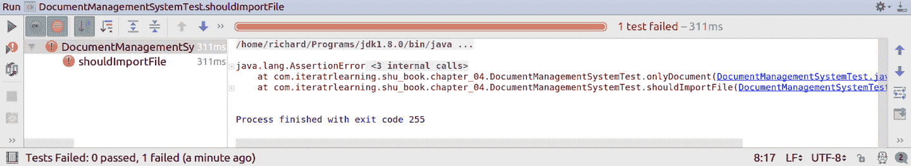
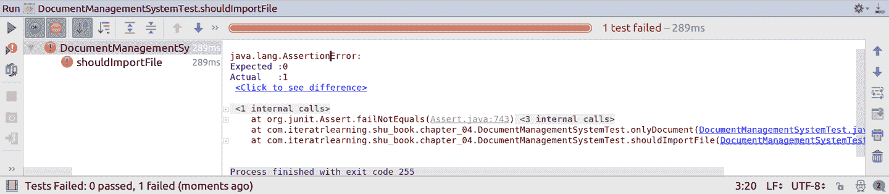
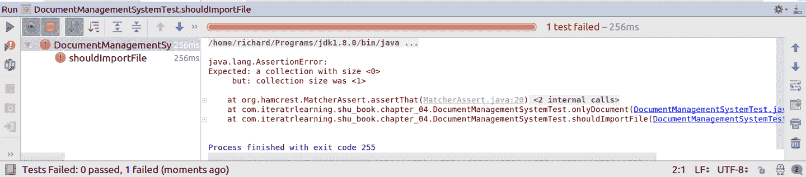

# 第四章：文档管理系统

# 挑战

成功为 Mark Erbergzuck 实施了先进的银行对账单分析器后，您决定做些杂事——包括去看牙医。Avaj 博士成功地经营了她的诊所多年。她的快乐患者在老年时依然保持着洁白的牙齿。这样一个成功实践的缺点是，每年都会生成更多的患者文件。每次她需要找到早期治疗记录时，她的助手们花费的时间越来越长。

她意识到现在是自动化管理这些文件并跟踪它们的时间了。幸运的是，她有一个可以为她做这些的患者！您将通过为她编写软件来管理这些文件，并使她能够找到信息，以便她的实践能够茁壮成长。

# 目标

在本章中，您将学习各种软件开发原则。管理文档设计的关键在于继承关系，这意味着扩展一个类或实现一个接口。为了正确地做到这一点，您将了解 Liskov 替换原则，这是以著名计算机科学家芭芭拉·利斯科夫命名的。

通过讨论“组合优于继承”原则，您将进一步了解何时使用继承。

最后，通过理解如何编写良好且易维护的自动化测试代码来扩展你的知识。既然我们已经剧透了这一章的内容，让我们回到理解 Avaj 博士对文档管理系统的需求。

###### 注意

如果您想随时查看本章的源代码，可以查看书的代码库中的`com.iteratrlearning.shu_book.chapter_04`包。

# 文档管理系统需求

与 Avaj 博士友好地喝茶后，她透露她希望将她想要管理的文件作为计算机上的文件。文档管理系统需要能够导入这些文件，并记录每个文件的一些信息，这些信息可以被索引和搜索。她关心的文档类型有三种：

报告

详细描述对患者进行的某些咨询或手术的文本内容。

信件

发送到地址的文本文档。（想想看，你可能已经很熟悉这些了。）

图像

牙科实践经常记录牙齿和牙龈的 X 光或照片。这些都有一个大小。

此外，所有文档都需要记录被管理文件的路径以及文档所涉及的患者。Avaj 博士需要能够搜索这些文档，并查询关于不同类型文档的每个属性是否包含某些信息；例如，搜索正文包含“Joe Bloggs”的信件。

在谈话中，你还确认 Avaj 博士可能希望在将来添加其他类型的文档。

# 完善设计

解决这个问题时，有很多重要的设计选择和建模方法可以选择。这些选择是主观的，你可以在阅读本章之前或之后尝试编写解决 Avaj 博士问题的解决方案。在“替代方法”中，你可以看到我们避免不同选择的原因以及背后的基本原则。

接近任何程序的一个很好的第一步是采用测试驱动开发（TDD），这也是我们在编写书中示例解决方案时所做的。我们将在第五章第五章介绍 TDD，所以让我们开始考虑你的软件需要执行的行为，并逐步完善实现这些行为的代码。

文档管理系统应该能够根据请求导入文档，并将它们添加到其内部的文档存储中。为了满足这一要求，让我们创建 `DocumentManagementSystem` 类并添加两个方法：

`void importFile(String path)`

接受用户想要导入到文档管理系统的文件的路径。由于这是一个公共 API 方法，在生产系统中可能会接收来自用户的输入，所以我们将路径作为 `String` 而不是依赖更类型安全的类，如 `java.nio.Path` 或 `java.io.File`。

`List<Document> contents()`

返回文档管理系统当前存储的所有文档的列表。

你会注意到 `contents()` 返回一个 `Document` 类的列表。我们尚未说明这个类包含什么，但它会适时出现。目前，你可以假装它是一个空类。

## 导入器

这个系统的一个关键特性是，我们需要能够导入不同类型的文档。为了这个系统的目的，你可以依赖文件的扩展名来决定如何导入它们，因为 Avaj 博士一直在保存具有非常特定扩展名的文件。她所有的信件都使用 *.letter* 扩展名，报告使用 *.report*，而 *.jpg* 是唯一使用的图片格式。

最简单的做法是将所有导入机制的代码都放在一个方法中，就像示例 4-1 中所示。

##### 示例 4-1\. 扩展名切换示例

```java
switch(extension) {
    case "letter":
        // code for importing letters.
        break;

    case "report":
        // code for importing reports.
        break;

    case "jpg":
        // code for importing images.
        break;

    default:
        throw new UnknownFileTypeException("For file: " + path);
}
```

这种方法可以解决问题，但很难扩展。每次想要添加另一种要处理的文件类型时，你都需要在 `switch` 语句中实现另一个条目。随着时间的推移，这种方法会变得难以管理和阅读。

如果保持你的主类简单明了，并分割出不同的实现类来导入不同类型的文档，那么很容易找到并理解每个导入器的作用。为了支持不同的文档类型，定义了一个`Importer`接口。每个`Importer`将是一个可以导入不同类型文件的类。

现在我们知道我们需要一个接口来导入文件，那么应该如何表示将要导入的文件呢？我们有几种不同的选择：使用简单的`String`表示文件的路径，或者使用表示文件的类，例如`java.io.File`。

你可以说我们应该在这里应用强类型原则：选择一个表示文件并减少错误范围的类型，而不是使用`String`。让我们采用这种方法，并在我们的`Importer`接口中使用`java.io.File`对象作为表示要导入的文件的参数，如示例 4-2 所示。

##### 示例 4-2\. 导入器

```java
interface Importer {
    Document importFile(File file) throws IOException;
}
```

你可能会问，*为什么你不在`DocumentManagementSystem`的公共 API 中也使用`File`呢？*好吧，在这个应用程序的情况下，我们的公共 API 可能会被包装在某种用户界面中，我们不确定以文件形式存在的形式。因此，我们保持事情简单，只使用了`String`类型。

## 文档类

在这一时间点上，让我们也定义`Document`类。每个文档将有多个我们可以搜索的属性。不同的文档有不同类型的属性。在定义`Document`时，我们有几个不同的选项可以权衡其利弊。

表示文档的第一种最简单的方法是使用`Map<String, String>`，这是一个从属性名称到与这些属性相关联的值的映射。那么为什么不在整个应用程序中传递一个`Map<String, String>`呢？引入一个领域类来模拟单个文档不仅仅是在遵循面向对象编程思想，而且还提供了一系列实际的应用程序维护性和可读性的改进。

首先，给应用程序中的组件起具体的名称的价值无法估量。沟通至上！优秀的软件开发团队使用*普遍语言*来描述他们的软件。将你在应用程序代码中使用的词汇与与像阿瓦吉博士这样的客户交流时使用的词汇相匹配，可以极大地简化维护工作。当你与同事或客户交流时，你必须一致同意描述软件不同方面的一些共同语言。通过将其映射到代码本身，可以轻松知道需要更改代码的哪一部分。这被称为*可发现性*。

###### 注意

*普遍语言*这个术语是由 Eric Evans 创造的，起源于*领域驱动设计*。它指的是一种清晰定义且在开发人员和用户之间共享的通用语言。

引入一个类来模拟文档的原则之一是强类型。许多人使用这个术语来指代编程语言的性质，但这里我们讨论的是在实现软件时强类型的更实际用途。类型允许我们限制数据的使用方式。例如，我们的`Document`类是不可变的：一旦创建，就无法改变或*突变*其任何属性。我们的`Importer`实现创建文档；没有其他东西可以修改它们。如果你看到某个`Document`中有错误的属性，你可以将 bug 的来源缩小到特定创建该`Document`的`Importer`。你还可以从不可变性推断出，可以对与`Document`关联的任何信息进行索引或缓存，并且知道它将永远正确，因为文档是不可变的。

开发人员在建模其`Document`时可能考虑的另一个设计选择是将`Document`扩展为`HashMap<String, String>`。乍看之下，这似乎很棒，因为`HashMap`具有建模`Document`所需的所有功能。然而，有几个理由说明这是一个糟糕的选择。

软件设计往往不仅仅是关于构建所需功能，还涉及限制不希望的功能。如果仅仅是`HashMap`的子类，我们将立即丢弃不可变性带来的前述好处。包装集合还为我们提供了一个机会，可以为方法提供更有意义的名称，而不是例如通过调用`get()`方法查找属性，这实际上并不意味着任何东西！稍后我们将更详细地讨论继承与组合，因为这实际上是该讨论的一个具体例子。

简而言之，领域类允许我们命名一个概念，并限制该概念的行为和值的可能性，以提高发现性并减少错误的范围。因此，我们选择如示例 4-3 中所示地对`Document`进行建模。如果你想知道为什么它不像大多数接口那样是`public`，这将在“作用域和封装选择”中讨论。

##### 示例 4-3\. 文档

```java
public class Document {
    private final Map<String, String> attributes;

    Document(final Map<String, String> attributes) {
        this.attributes = attributes;
    }

    public String getAttribute(final String attributeName) {
        return attributes.get(attributeName);
    }
}
```

最后要注意的一点是，`Document` 类具有包范围的构造函数。通常情况下，Java 类会将它们的构造函数设置为 `public`，但这可能是一个不好的选择，因为它允许项目中任何位置的代码创建该类型的对象。只有文档管理系统中的代码应该能够创建 `Documents`，因此我们将构造函数的访问权限限制在包内，并仅限于文档管理系统所在的包。

## 属性和分层文档

在我们的 `Document` 类中，我们使用 `Strings` 来表示属性。这难道不违背了强类型的原则吗？答案既是肯定的，也是否定的。我们将属性存储为文本，以便可以通过基于文本的搜索进行搜索。不仅如此，我们还希望确保所有属性都以非常通用的形式创建，这种形式与创建它们的 `Importer` 无关。在这种上下文中，`Strings` 并不是一个坏选择。应该注意的是，在整个应用程序中传递 `Strings` 以表示信息通常被认为是一个不好的做法。与强类型相比，这被称为“stringly typed”！

特别是，如果属性值的使用更加复杂，那么解析出不同的属性类型将会很有用。例如，如果我们想要在某个距离内找到地址，或者找到高度和宽度小于某个尺寸的图片，那么拥有强类型的属性将会是一个福音。使用整数作为宽度值进行比较会更加容易。然而，在这个文档管理系统的情况下，我们并不需要那种功能。

您可以设计文档管理系统，为 `Documents` 创建一个类层次结构，该结构模拟了 `Importer` 的层次结构。例如，`ReportImporter` 导入扩展了 `Document` 类的 `Report` 类的实例。这通过了我们的基本合理性检查，即它允许您说 `Report` 是一个 `Document`，这在语义上是有意义的。然而，我们选择不沿着这个方向继续进行，因为在面向对象编程设置中，正确的类建模方法是从行为和数据的角度思考。

所有文档都以命名属性的通用方式进行建模，而不是在不同子类中存在的特定字段。此外，在该系统中，文档几乎没有关联的行为。在这里添加类层次结构毫无意义。您可能认为这个说法本身有些武断，但它告诉我们另一个原则：KISS。

你在第二章学到了 KISS 原则。KISS 的意思是如果设计保持简单，就会更好。要避免不必要的复杂往往非常困难，但努力尝试是值得的。每当有人说“我们可能需要 X”或者“如果我们也做 Y 会很酷”的时候，只需要说不。臃肿和复杂的设计往往以扩展性和代码“好玩而非必需”的良好意图铺成了路。

## 实现和注册导入者

您可以实现`Importer`接口来查找不同类型的文件。示例 4-4 展示了导入图像的方式。Java 核心库的一个伟大之处在于它提供了很多开箱即用的内置功能。在这里，我们使用`ImageIO.read`方法读取图像文件，然后从生成的`BufferedImage`对象中提取图像的宽度和高度。

##### 示例 4-4\. ImageImporter

```java
import static com.iteratrlearning.shu_book.chapter_04.Attributes.*;

class ImageImporter implements Importer {
    @Override
    public Document importFile(final File file) throws IOException {
        final Map<String, String> attributes = new HashMap<>();
        attributes.put(PATH, file.getPath());

        final BufferedImage image = ImageIO.read(file);
        attributes.put(WIDTH, String.valueOf(image.getWidth()));
        attributes.put(HEIGHT, String.valueOf(image.getHeight()));
        attributes.put(TYPE, "IMAGE");

        return new Document(attributes);
    }
}
```

属性名称在`Attributes`类中被定义为常量。这样做可以避免不同的导入者使用相同属性名称的不同字符串而导致的错误；例如，`"Path"`和`"path"`。Java 本身没有常量的直接概念，示例 4-5 展示了通常使用的习语。这个常量是`public`的，因为我们希望能够从不同的导入者中使用它，尽管您可能更喜欢使用`private`或`package`作用域的常量。使用`final`关键字确保它不可重新赋值，`static`确保每个类只有一个实例。

##### 示例 4-5\. 如何在 Java 中定义常量

```java
public static final String PATH = "path";
```

对于三种不同类型的文件都有导入者，您将看到其他两种实现在“扩展和重用代码”中。别担心，我们没有任何花招。为了能够在导入文件时使用`Importer`类，我们还需要注册导入者以进行查找。我们使用要导入的文件的扩展名作为`Map`的键，如示例 4-6 所示。

##### 示例 4-6\. 注册导入者

```java
    private final Map<String, Importer> extensionToImporter = new HashMap<>();

    public DocumentManagementSystem() {
        extensionToImporter.put("letter", new LetterImporter());
        extensionToImporter.put("report", new ReportImporter());
        extensionToImporter.put("jpg", new ImageImporter());
    }
```

现在您知道如何导入文档，我们可以实现搜索。我们不会在这里专注于实现文档搜索的最有效方法，因为我们并不打算实现 Google，只是将所需信息传递给 Avaj 博士。与 Avaj 博士的对话表明，她希望能够查找`Document`的不同属性的信息。

她的需求可能仅仅是能够在属性值中查找子序列。例如，她可能希望搜索具有名为 Joe 的患者和体内有*Diet Coke*的文档。因此，我们设计了一个非常简单的查询语言，由一系列以逗号分隔的属性名称和子字符串对组成。我们之前提到的查询将被编写为`"patient:Joe,body:Diet Coke"`。

由于搜索实现保持简单而不是试图高度优化，它只是在系统中记录的所有文档上进行线性扫描，并测试每个文档是否符合查询。传递给`search`方法的查询`String`被解析为一个`Query`对象，然后可以与每个`Document`进行测试。

# 里氏替换原则（LSP）

我们已经讨论了与类相关的一些特定设计决策，例如，使用类来建模不同的`Importer`实现，以及为什么我们没有为`Document`类引入类层次结构，也为什么我们没有将`Document`直接扩展为`HashMap`。但实际上这里涉及到一个更广泛的原则，一个允许我们将这些例子推广到任何软件片段的原则。这就是*里氏替换原则*（LSP），它帮助我们正确地子类化和实现接口。LSP 是我们在整本书中一直在提到的 SOLID 原则中的 L。

里氏替换原则通常以非常正式的术语来陈述，但实际上是一个非常简单的概念。让我们揭开其中的一些术语。如果在这个背景下听到*类型*，只需将其视为类或接口。术语*子类型*意味着在类型之间建立了父子关系；换句话说，扩展了一个类或实现了一个接口。因此，你可以非正式地将其视为子类应该保持从父类继承的行为。我们知道，听起来像是一个显而易见的陈述，但我们可以更具体地将 LSP 分解为四个不同的部分：

前置条件不能在子类型中被加强。

前置条件建立了某些代码将工作的条件。你不能仅仅假设你所写的无论如何都会工作。例如，我们所有的`Importer`实现都有一个前置条件，即要导入的文件存在且可读。因此，在调用任何`Importer`之前，`importFile`方法都有验证代码，正如在示例 4-7 中所示。

##### 示例 4-7\. importFile 定义

```java
    public void importFile(final String path) throws IOException {
        final File file = new File(path);
        if (!file.exists()) {
            throw new FileNotFoundException(path);
        }

        final int separatorIndex = path.lastIndexOf('.');
        if (separatorIndex != -1) {
            if (separatorIndex == path.length()) {
                throw new UnknownFileTypeException("No extension found For file: " + path);
            }
            final String extension = path.substring(separatorIndex + 1);
            final Importer importer = extensionToImporter.get(extension);
            if (importer == null) {
                throw new UnknownFileTypeException("For file: " + path);
            }

            final Document document = importer.importFile(file);
            documents.add(document);
        } else {
            throw new UnknownFileTypeException("No extension found For file: " + path);
        }
    }
```

LSP 意味着你不能要求比你的父类更严格的前置条件。因此，例如，如果你的父类应该能够导入任何大小的文档，你就不能要求你的文档大小必须小于 100KB。

后置条件不能在子类型中被削弱。

这可能听起来有点混淆，因为它读起来很像第一条规则。后置条件是在某些代码运行后必须为真的事物。例如，在运行`importFile()`后，如果所讨论的文件有效，则它必须在`contents()`返回的文档列表中。因此，如果父类具有某种副作用或返回某个值，则子类也必须如此。

超类型的不变量必须在子类型中被保留。

不变量是永远不会改变的东西，就像潮汐的涨落一样。在继承的上下文中，我们希望确保父类预期维护的任何不变性也应该由子类维护。

历史规则

这是理解 LSP 最困难的方面。本质上，子类不应允许状态变更，而父类不允许。因此，在我们的示例程序中，我们有一个不可变的 `Document` 类。换句话说，一旦被实例化，就不能删除、添加或修改任何属性。你不应该派生这个 `Document` 类并创建一个可变的 `Document` 类。这是因为父类的任何用户都期望在调用 `Document` 类的方法时得到特定的行为。如果子类是可变的，它可能会违反调用者对调用这些方法时所期望的行为。

# 替代方法

当设计文档管理系统时，您完全可以采取完全不同的方法。我们现在将介绍一些这些替代方法，因为我们认为它们是有教育意义的。这些选择没有一个可以被认为是错的，但我们确实认为选择的方法是最好的。

## 将 Importer 设计为一个类

您可以选择为导入器创建一个类层次结构，而不是一个接口。接口和类提供了不同的功能集。您可以实现多个接口，而类可以包含实例字段，并且在类中具有方法体更为常见。

在这种情况下，构建层次结构的原因是为了使不同的导入器能够被使用。您已经听说过我们避免脆弱的基于类的继承关系的动机，因此在这里使用接口应该是一个很明智的选择。

这并不是说在其他地方类不是更好的选择。如果您想在涉及状态或大量行为的问题域中建模强大的 *是一个* 关系，则基于类的继承更合适。只是我们认为在这里使用接口是更合适的选择。

## 作用域和封装选择

如果您花时间查看代码，您可能会注意到 `Importer` 接口、它的实现以及我们的 `Query` 类都具有包范围。包范围是默认范围，因此如果您看到一个类文件顶部是 `class Query`，您就知道它是包范围的；如果它说 `public class Query`，则是公共范围。包范围意味着同一包中的其他类可以*看到*或*访问*该类，但其他人不能。这是一种隐身装置。

Java 生态系统的一个奇怪之处在于，尽管包范围是默认范围，但每当我们参与软件开发项目时，始终有比包范围更多的`public`范围的类。也许默认应该一直是`public`，但无论如何，包范围确实是一个非常有用的工具。它帮助您封装这些设计决策。本节大部分内容都评论了围绕设计系统可用的不同选择，并且在维护系统时可能希望重构为其中一种替代设计。如果我们泄露有关此包之外实现的详细信息，这将更加困难。通过勤奋地使用包范围，您可以阻止包外的类对内部设计做出过多假设。

我们认为值得重申的是，这只是对这些设计选择的辩解和解释。在本节列出的其他选择中，没有任何本质上的错误—它们可能会根据应用程序随时间演变而更合适。

# 扩展和重用代码

谈到软件，唯一不变的是变化。随着时间的推移，您可能希望向产品添加功能，客户需求可能会改变，法规可能会强制您修改软件。正如我们早些时候所提到的，阿瓦博士可能希望将更多文档添加到我们的文档管理系统中。事实上，当我们首次展示为她编写的软件时，她立即意识到要在此系统中跟踪客户发票。发票是一个具有正文和金额的文档，并具有 *.invoice* 扩展名。示例 4-8 展示了一个发票示例。

##### 示例 4-8\. 发票示例

```java
Dear Joe Bloggs

Here is your invoice for the dental treatment that you received.

Amount: $100

regards,

  Dr Avaj
  Awesome Dentist
```

幸运的是，阿瓦博士的所有发票都采用相同的格式。正如您所见，我们需要从中提取一笔金额，而金额行以`Amount:`为前缀开始。信件的收件人姓名位于以`Dear`为前缀的行开头。事实上，我们的系统实现了一种通用的方法来查找给定前缀行的后缀，如 示例 4-9 所示。在这个例子中，字段`lines`已经初始化为我们正在导入的文件的行。我们向这个方法传递一个`prefix`—例如，`Amount:`—它将将行的其余部分，即后缀，与提供的属性名称关联起来。

##### 示例 4-9\. addLineSuffix 定义

```java
    void addLineSuffix(final String prefix, final String attributeName) {
        for(final String line: lines) {
            if (line.startsWith(prefix)) {
                attributes.put(attributeName, line.substring(prefix.length()));
                break;
            }
        }
    }
```

实际上，当我们尝试导入一封信时，我们有类似的概念。考虑 示例 4-10 中提供的示例信件。在这里，您可以通过查找以`Dear`开头的行来提取患者的姓名。信件还具有地址和文本主体，您希望从文本文件的内容中提取出来。

##### 示例 4-10\. 信件示例

```java
Dear Joe Bloggs

123 Fake Street
Westminster
London
United Kingdom

We are writing to you to confirm the re-scheduling of your appointment
with Dr. Avaj from 29th December 2016 to 5th January 2017.

regards,

  Dr Avaj
  Awesome Dentist
```

当涉及导入患者报告时，我们也面临类似的问题。Avaj 博士的报告将患者的姓名前缀设置为`Patient:`，并包含一段要包含的文本，就像信件一样。你可以在 Example 4-11 中看到一个报告示例。

##### 示例 4-11\. 报告示例

```java
Patient: Joe Bloggs

On 5th January 2017 I examined Joe's teeth.
We discussed his switch from drinking Coke to Diet Coke.
No new problems were noted with his teeth.
```

所以这里的一个选择是让所有三个基于文本的导入器实现同一个方法，用于查找带有在 Example 4-9 中列出的前缀的文本行的后缀。现在，如果我们按照编写的代码行数向 Avaj 博士收费，这将是一个很好的策略。我们可以为基本相同的工作三倍赚取更多的钱！

不幸的是（或者说幸运的是，考虑到上述的激励因素），客户很少根据所产生的代码行数付费。重要的是客户想要的需求。所以我们真的希望能够在三个导入器之间重用这段代码。为了重用这段代码，我们需要确实将其放在某个类中。你基本上有三个选择，每个选择都有其利弊：

+   使用*实用*类

+   使用*继承*

+   使用领域类

最简单的开始选项是创建一个实用类。你可以称其为`ImportUtil`。然后，每当你想要在不同的导入器之间共享方法时，可以将其放入此实用类中。你的实用类最终将成为一堆静态方法的集合。

虽然实用类很简单，但它并不完全是面向对象编程的顶峰。面向对象的风格包括通过类来模拟应用程序中的概念。如果你想创建一个东西，那么你调用`new Thing()`，用于你的东西。与该东西相关的属性和行为应该是`Thing`类的方法。

如果你遵循将现实世界对象建模为类的原则，确实会更容易理解你的应用程序，因为它为你提供了一个结构，并将你领域的心理模型映射到你的代码中。你想改变信件导入的方式？那么就编辑`LetterImporter`类。

实用类违反了这一预期，通常最终会变成一堆过程化代码，没有单一的责任或概念。随着时间的推移，这往往会导致我们代码库中出现上帝类的出现；换句话说，一个单一的大类最终会占据大量责任。

那么，如果你想将这种行为与一个概念关联起来，你该怎么办？嗯，下一个最明显的方法可能是使用继承。在这种方法中，你可以让不同的导入器扩展`TextImporter`类。然后你可以将所有共同的功能放在这个类上，并在子类中重用它。

在许多情况下，继承是一种非常稳固的设计选择。您已经看到了 Liskov 替换原则及其如何对我们的继承关系的正确性施加约束。在实践中，当继承关系未能模拟某些真实世界的关系时，继承往往是一个不好的选择。

在这种情况下，`TextImporter` 是一个 `Importer`，我们可以确保我们的类遵循 LSP 规则，但这似乎并不是一个很强的概念来进行工作。继承关系不符合真实世界关系的问题在于它们往往是脆弱的。随着应用程序随时间的演变，您希望抽象与应用程序一起演变，而不是相反。作为一个经验法则，纯粹为了启用代码重用而引入继承关系是一个不好的想法。

我们的最终选择是使用域类来建模文本文件。要使用这种方法，我们将模拟一些基础概念，并通过调用顶层方法来构建不同的导入器。那么这里问题的概念是什么？嗯，我们真正想做的是操作文本文件的内容，所以让我们称这个类为 `TextFile`。这并不是原创或创意，但这正是重点所在。您知道在哪里找到操作文本文件的功能，因为类的命名非常简单明了。

示例 4-12 显示了该类及其字段的定义。请注意，这不是 `Document` 的子类，因为文档不应仅限于文本文件 - 我们可能还会导入诸如图像等的二进制文件。这只是一个模拟文本文件的基础概念的类，并具有从文本文件中提取数据的相关方法。

##### 示例 4-12\. TextFile 定义

```java
class TextFile {
    private final Map<String, String> attributes;
    private final List<String> lines;

    // class continues ...
```

这是我们在导入器案例中选择的方法。我们认为这样可以以灵活的方式对我们的问题域进行建模。它不会将我们束缚在脆弱的继承层次结构中，但仍然允许我们重用代码。示例 4-13 展示了如何导入发票。为名称和金额添加了后缀，并设置发票类型为金额。

##### 示例 4-13\. 导入发票

```java
    @Override
    public Document importFile(final File file) throws IOException {
        final TextFile textFile = new TextFile(file);

        textFile.addLineSuffix(NAME_PREFIX, PATIENT);
        textFile.addLineSuffix(AMOUNT_PREFIX, AMOUNT);

        final Map<String, String> attributes = textFile.getAttributes();
        attributes.put(TYPE, "INVOICE");
        return new Document(attributes);
    }
```

您还可以看到另一个使用 `TextFile` 类的导入器示例在 示例 4-14。不需要担心 `TextFile.addLines` 的实现方式；您可以在 示例 4-15 中看到对其的解释。

##### 示例 4-14\. 导入信件

```java
    @Override
    public Document importFile(final File file) throws IOException {
        final TextFile textFile = new TextFile(file);

        textFile.addLineSuffix(NAME_PREFIX, PATIENT);

        final int lineNumber = textFile.addLines(2, String::isEmpty, ADDRESS);
        textFile.addLines(lineNumber + 1, (line) -> line.startsWith("regards,"), BODY);

        final Map<String, String> attributes = textFile.getAttributes();
        attributes.put(TYPE, "LETTER");
        return new Document(attributes);
    }
```

这些类一开始并不是这样编写的。它们逐渐演变到当前的状态。当我们开始编写文档管理系统时，第一个基于文本的导入器 `LetterImporter`，它的所有文本提取逻辑都是内联编写在类中的。这是一个很好的开始。试图寻找可以重用的代码通常会导致不适当的抽象化。先学会走再考虑奔跑。

当我们开始编写 `ReportImporter` 时，越来越明显的是文本提取逻辑可以在这两个导入器之间共享，并且它们实际上应该是基于我们在这里引入的某些共同领域概念的方法调用—`TextFile`。事实上，我们甚至复制并粘贴了最初要在两个类之间共享的代码。

这并不意味着复制粘贴代码是好的——远非如此。但是，当您开始编写某些类时，往往最好复制少量的代码。一旦您实现了更多的应用程序，正确的抽象—例如 `TextFile` 类将变得显而易见。只有当您对去除重复代码的正确方法有了更多了解后，才应该采用去重复的路线。

在 示例 4-15 中，您可以看到 `TextFile.addLines` 方法的实现方式。这是不同 `Importer` 实现中常见的代码。它的第一个参数是一个 `start` 索引，用于指示从哪一行开始。接着是一个 `isEnd` 断言，用于检查是否到达行的结尾并返回 `true`。最后，我们有要与此值关联的属性名称。

##### 示例 4-15\. addLines 定义

```java
    int addLines(
        final int start,
        final Predicate<String> isEnd,
        final String attributeName) {

        final StringBuilder accumulator = new StringBuilder();
        int lineNumber;
        for (lineNumber = start; lineNumber < lines.size(); lineNumber++) {
            final String line = lines.get(lineNumber);
            if (isEnd.test(line)) {
                break;
            }

            accumulator.append(line);
            accumulator.append("\n");
        }
        attributes.put(attributeName, accumulator.toString().trim());
        return lineNumber;
    }
```

# 测试卫生

正如您在 第二章 中所学到的，编写自动化测试在软件可维护性方面有很多好处。它使我们能够减少回归范围，并了解导致回归的提交。它还使我们能够自信地重构我们的代码。然而，测试并不是一个神奇的灵丹妙药。它们要求我们编写并维护大量的代码，以便获得这些好处。众所周知，编写和维护代码是一个困难的任务，许多开发者发现，当他们开始编写自动化测试时，这会占用大量的开发时间。

为了解决测试可维护性的问题，您需要掌握*测试卫生*。测试卫生意味着保持您的测试代码整洁，并确保随着受测试的代码库一起进行维护和改进。如果您不维护和处理您的测试，随着时间的推移，它们将成为影响开发者生产力的负担。在本节中，您将了解到一些关键点，这些点可以帮助保持测试的卫生。

## 测试命名

谈到测试时，首先要考虑的是它们的命名。开发者对命名可能有很强的个人意见——因为每个人都可以与此相关并思考这个问题，所以这是一个容易大谈特谈的话题。我们认为需要记住的是，很少有一个清晰、真正好的名称可以适用于某件事情，但有很多很多个糟糕的名称。

我们为文档管理系统编写的第一个测试是测试我们导入一个文件并创建一个`Document`。这是在我们引入`Importer`概念之前编写的，并且没有测试`Document`特定的属性。代码在示例 4-16 中。

##### 示例 4-16\. 导入文件的测试

```java
    @Test
    public void shouldImportFile() throws Exception
    {
        system.importFile(LETTER);

        final Document document = onlyDocument();

        assertAttributeEquals(document, Attributes.PATH, LETTER);
    }
```

这个测试被命名为`shouldImportFile`。在测试命名方面的关键驱动原则是可读性、可维护性和作为*可执行文档*的功能。当您看到测试类运行的报告时，这些名称应该作为说明文档，记录哪些功能可用，哪些不可用。这允许开发人员轻松地从应用程序行为映射到断言该行为被实现的测试。通过减少行为和代码之间的阻抗不匹配，我们使其他开发人员更容易理解未来发生的情况。这是一个确认文档管理系统导入文件的测试。

然而，还有很多命名反模式。最糟糕的反模式是给一个测试命名为完全不明确的东西——例如，`test1`。`test1`在测试什么？读者的耐心？对待阅读你代码的人，就像你希望他们对待你一样。

另一个常见的测试命名反模式是仅以概念或名词命名，例如，`file`或`document`。测试名称应描述测试的行为，而不是一个概念。另一个测试命名反模式是仅将测试命名为在测试期间调用的方法，而不是行为。在这种情况下，测试可能被命名为`importFile`。

你可能会问，通过将我们的测试命名为`shouldImportFile`，我们是否在这里犯了这个罪？这种指责有一定的道理，但在这里我们只是描述了正在测试的行为。事实上，`importFile`方法由各种测试进行测试；例如，`shouldImportLetterAttributes`、`shouldImportReportAttributes`和`shouldImportImageAttributes`。这些测试都没有被称为`importFile`——它们都描述了更具体的行为。

好了，现在你知道了不良命名是什么样子，那么好的测试命名是什么呢？您应该遵循三个经验法则，并使用它们来驱动测试命名：

使用领域术语

将测试名称中使用的词汇与描述问题域或应用程序本身引用的词汇保持一致。

使用自然语言

每个测试名称都应该是您可以轻松读成一句话的东西。它应该以可读的方式描述某种行为。

描述性

代码将被阅读的次数比被编写的次数多得多。不要吝惜花更多时间考虑一个好的、描述性的名字，这样后来理解起来会更容易。如果你想不出一个好的名字，为什么不问问同事呢？在高尔夫球中，你通过尽量少的击球次数来获胜。编程不是这样的；最短的不一定是最好的。

你可以按照`DocumentManagementSystemTest`中使用的约定，使用“should”作为测试名称的前缀，也可以选择不这样做；这只是个人偏好的问题。

## 行为而非实现

如果你正在为一个类、一个组件甚至是一个系统编写测试，那么你应该只测试被测试对象的*公共行为*。在文档管理系统的情况下，我们只测试我们的公共 API 的行为，其形式为`DocumentManagementSystemTest`。在这个测试中，我们测试了`DocumentManagementSystem`类的公共 API，因此也测试了整个系统。你可以在示例 4-17 中查看该 API。

##### 示例 4-17\. `DocumentManagementSystem`类的公共 API

```java
public class DocumentManagementSystem
{
    public void importFile(final String path) {
        ...
    }

    public List<Document> contents() {
        ...
    }

    public List<Document> search(final String query) {
        ...
    }
}
```

我们的测试应该只调用这些公共 API 方法，而不应尝试检查对象或设计的内部状态。这是开发人员常犯的一个关键错误，导致难以维护的测试。依赖于特定的实现细节会导致脆弱的测试，因为如果更改了相关的实现细节，即使行为仍然正常，测试也可能开始失败。查看示例 4-18 中的测试。

##### 示例 4-18\. 导入信函的测试

```java
    @Test
    public void shouldImportLetterAttributes() throws Exception
    {
        system.importFile(LETTER);

        final Document document = onlyDocument();

        assertAttributeEquals(document, PATIENT, JOE_BLOGGS);
        assertAttributeEquals(document, ADDRESS,
            "123 Fake Street\n" +
                "Westminster\n" +
                "London\n" +
                "United Kingdom");
        assertAttributeEquals(document, BODY,
            "We are writing to you to confirm the re-scheduling of your appointment\n" +
            "with Dr. Avaj from 29th December 2016 to 5th January 2017.");
        assertTypeIs("LETTER", document);
    }
```

测试这个信函导入功能的一种方式本来可以写成一个关于`LetterImporter`类的单元测试。这看起来可能非常相似：导入一个示例文件，然后对导入器返回的结果进行断言。然而，在我们的测试中，`LetterImporter`的存在本身就是一个实现细节。在“扩展和重用代码”中，你看到了许多其他布局导入器代码的选择。通过这种方式布置我们的测试，我们给自己提供了在不破坏测试的情况下重构内部结构的选择。

所以我们说依赖于类的行为是通过使用公共 API 来实现的，但也有一些行为部分通常不仅仅通过使方法公共或私有来限制。例如，我们可能不希望依赖于从`contents()`方法返回的文档顺序。这不是`DocumentManagementSystem`类的公共 API 的属性，而只是需要小心避免的事情。

在这方面的一个常见反模式是通过 getter 或 setter 公开本来是私有状态以便于测试。尽可能避免这样做，因为这会使您的测试变得脆弱。如果您已经公开了这个状态以使测试表面上更容易，那么最终会使得长期维护您的应用程序变得更加困难。这是因为任何涉及更改内部状态表示方式的代码库更改现在也需要修改您的测试。有时这是需要重构出一个新类来更容易和有效地进行测试的一个很好的指示。

## 不要重复自己

“扩展和重用代码”广泛讨论了如何从我们的应用程序中删除重复代码以及放置生成代码的位置。关于维护的确切推理同样适用于测试代码。不幸的是，开发人员通常简单地不去像处理应用程序代码一样去除测试中的重复代码。如果您查看示例 4-19，您会看到一个测试重复地对生成的`Document`的不同属性进行断言。

##### 示例 4-19\. 导入图片的测试

```java
    @Test
    public void shouldImportImageAttributes() throws Exception
    {
        system.importFile(XRAY);

        final Document document = onlyDocument();

        assertAttributeEquals(document, WIDTH, "320");
        assertAttributeEquals(document, HEIGHT, "179");
        assertTypeIs("IMAGE", document);
    }
```

通常情况下，您需要查找每个属性的属性名称并断言它是否等于预期值。在这些测试中，这是一个足够常见的操作，一个通用方法`assertAttributeEquals`被提取出来具备这种逻辑。其实现在示例 4-20 中展示。

##### 示例 4-20\. 实现一个新的断言

```java
    private void assertAttributeEquals(
        final Document document,
        final String attributeName,
        final String expectedValue)
    {
        assertEquals(
            "Document has the wrong value for " + attributeName,
            expectedValue,
            document.getAttribute(attributeName));
    }
```

## 良好的诊断信息

如果测试永远不失败，那就没有好的测试。事实上，如果您从未见过测试失败，那么怎么知道它是否有效呢？在编写测试时，最好的做法是优化失败情况。当我们说优化时，我们并不是指测试在失败时运行得更快——而是确保测试编写方式使得理解为什么以及如何失败尽可能容易。这其中的技巧在于良好的*诊断信息*。

通过诊断信息，我们指的是测试失败时打印出的消息和信息。消息越清晰说明失败原因，调试测试失败就越容易。你可能会问，为什么要在现代 IDE 中运行 Java 测试时还要打印诊断信息？有时测试可能在持续集成环境中运行，有时可能从命令行运行。即使在 IDE 中运行，拥有良好的诊断信息仍然非常有帮助。希望我们已经说服了您需要良好诊断信息的重要性，那么在代码中它们是什么样的呢？

示例 4-21 展示了一种断言系统仅包含单个文档的方法。稍后我们会解释`hasSize()`方法。

##### 示例 4-21\. 测试系统是否包含单个文档

```java
    private Document onlyDocument()
    {
        final List<Document> documents = system.contents();
        assertThat(documents, hasSize(1));
        return documents.get(0);
    }
```

JUnit 提供给我们的最简单的断言类型是`assertTrue()`，它将采取一个期望为真的布尔值。示例 4-22 展示了我们如何只使用`assertTrue`来实现测试。在这种情况下，正在检查的值等于`0`，以便它将使`shouldImportFile`测试失败，从而展示失败的诊断。问题在于我们得不到很好的诊断信息——只是一个没有任何信息的`AssertionError`在图 4-1 中显示。你不知道什么失败了，也不知道比较了什么值。你一无所知，即使你的名字不是乔恩·雪诺。

##### 示例 4-22\. `assertTrue`示例

```java
assertTrue(documents.size() == 0);
```



###### 图 4-1\. `assertTrue`失败的截图

最常用的断言是`assertEquals`，它接受两个值并检查它们是否相等，并重载以支持原始值。因此，我们可以断言`documents`列表的大小为`0`，如示例 4-23 所示。这产生了稍微好一点的诊断，如图 4-2 所示，您知道期望的值是`0`，实际值是`1`，但它仍然没有给出任何有意义的上下文。

##### 示例 4-23\. `assertEquals`示例

```java
assertEquals(0, documents.size());
```



###### 图 4-2\. `assertEquals`示例失败的截图

关于大小本身进行断言的最佳方法是使用*matcher*来断言集合的大小，因为这提供了最具描述性的诊断。示例 4-24 采用了这种样式编写的示例，并演示了输出。正如图 4-3 所示，这样更清晰地说明了出了什么问题，而无需再编写任何代码。

##### 示例 4-24\. `assertThat`示例

```java
assertThat(documents, hasSize(0));
```



###### 图 4-3\. `assertThat`示例失败的截图

这里使用了 JUnit 的`assertThat()`方法。方法`assertThat()`的第一个参数是一个值，第二个参数是一个`Matcher`。`Matcher`封装了一个值是否符合某些属性以及相关诊断的概念。`hasSize`匹配器是从`Matchers`实用程序类中静态导入的，该类包含一系列不同的匹配器，并检查集合的大小是否等于其参数。这些匹配器来自[Hamcrest 库](http://hamcrest.org/)，这是一个非常常用的 Java 库，可以实现更清晰的测试。

另一个构建更好诊断的示例是在示例 4-20 中展示的。在这里，`assertEquals`会为我们提供属性的预期值和实际值的诊断。它不会告诉我们属性的名称是什么，因此将其添加到消息字符串中以帮助我们理解失败。

## 测试错误情况

写软件时最严重且最常见的错误之一是仅测试你的应用程序的美丽、黄金、幸福路径——即在阳光照耀你，一切都顺利进行的代码路径。 实际上很多事情可能会出错！ 如果你不测试应用程序在这些情况下的行为，你就无法得到在生产环境中可靠运行的软件。

当涉及将文档导入我们的文档管理系统时，可能会出现几种错误情况。 我们可能尝试导入一个不存在或无法读取的文件，或者我们可能尝试导入一个我们不知道如何从中提取文本或读取的文件。

我们的`DocumentManagementSystemTest`有一些测试，显示在示例 4-25 中，测试这两种情况。 在这两种情况下，我们尝试导入一个会暴露问题的路径文件。 为了对所需行为进行断言，我们使用了 JUnit 的`@Test`注解的`expected =`属性。 这使您可以说*嘿，JUnit，我期望这个测试抛出一个特定类型的异常*。

##### 示例 4-25\. 错误案例测试

```java
    @Test(expected = FileNotFoundException.class)
    public void shouldNotImportMissingFile() throws Exception
    {
        system.importFile("gobbledygook.txt");
    }

    @Test(expected = UnknownFileTypeException.class)
    public void shouldNotImportUnknownFile() throws Exception
    {
        system.importFile(RESOURCES + "unknown.txt");
    }
```

如果在错误情况下想要替代行为，而不仅仅是抛出异常，了解如何断言异常被抛出肯定是有帮助的。

## 常量

常量是不变的值。 让我们面对现实——在计算机编程中，它们是少数命名得当的概念之一。 Java 编程语言不像 C++那样使用显式的`const`关键字，但是开发人员通常创建`static field`字段来代表常量。 由于许多测试由如何使用计算机程序的一部分的示例组成，它们通常包含许多常量。

对于具有某种非明显含义的常量，给它们一个适当的名称是个好主意，这样它们可以在测试中使用。 我们通过`DocumentManagementSystemTest`广泛使用这种方式，在顶部有一个专门声明常量的块，显示在示例 4-26 中。

##### 示例 4-26\. 常量

```java
public class DocumentManagementSystemTest
{
    private static final String RESOURCES =
        "src" + File.separator + "test" + File.separator + "resources" + File.separator;
    private static final String LETTER = RESOURCES + "patient.letter";
    private static final String REPORT = RESOURCES + "patient.report";
    private static final String XRAY = RESOURCES + "xray.jpg";
    private static final String INVOICE = RESOURCES + "patient.invoice";
    private static final String JOE_BLOGGS = "Joe Bloggs";
```

# 要点

+   你学会了如何构建文档管理系统。

+   你意识到了不同实现方法之间的不同权衡。

+   你理解了驱动软件设计的几个原则。

+   你被介绍了里斯科夫替换原则，作为思考继承的一种方式。

+   你了解了继承不适合的情况。

# 迭代在您身上

如果你想要扩展和巩固本节的知识，可以尝试以下活动之一：

+   取现有的示例代码，并添加一个导入处方文档的实现。 处方应包含患者、药品、数量、日期，并说明服药条件。 你还应该编写一个检查处方导入工作的测试。

+   尝试实现[生命游戏 Kata](https://oreil.ly/RrxJU)。

# 完成挑战

博士 Avaj 对你的文档管理系统非常满意，现在她已经广泛使用它。系统的特性有效地满足了她的需求，因为你从她的需求出发，推动设计朝向应用行为，并进入实现细节。在下一章节引入 TDD 时，你将会回顾这一主题。
