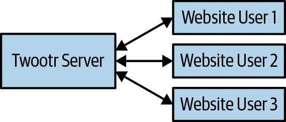
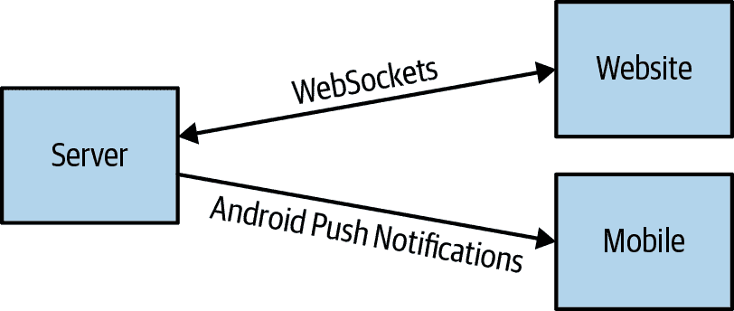
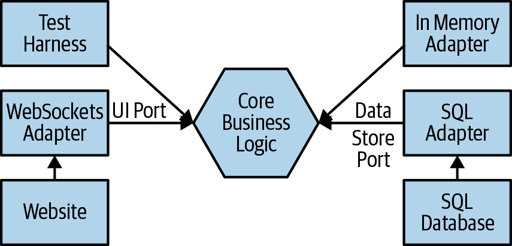
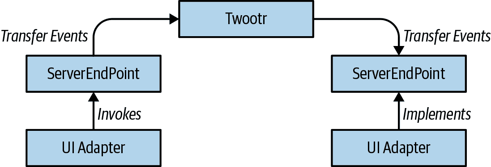

# 第六章：Twootr

# 挑战

Joe 是一个兴奋的年轻小伙子，热衷于向我讲述他的新创业想法。他的使命是帮助人们更好更快地沟通。他喜欢博客，但他在思考如何让人们更频繁地以更少量的内容进行博客。他称之为微博客。大胆的想法是，如果你将消息大小限制在 140 个字符，人们会频繁地发布少量的消息，而不是大段的消息。

我们问 Joe，他觉得这种限制是否会鼓励人们发表毫无意义的简短言论。他说：“Yolo！”我们问 Joe 如何赚钱。他说：“Yolo！”我们问 Joe 打算给产品取什么名字。他说：“Twootr！”我们觉得这听起来是一个很酷和原创的想法，所以我们决定帮助他建立他的产品。

# 目标

在本章中，你将了解如何将软件应用程序整合成一个大局。本书中以往的应用程序示例大多是小型示例——在命令行上运行的批处理作业。Twootr 是一个服务器端的 Java 应用程序，类似于大多数 Java 开发人员编写的应用程序类型。

在本章中，你将有机会学习到许多不同的技能：

+   如何将一个大局描述拆分成不同的架构关注点

+   如何使用测试替身（test doubles）来隔离和测试代码库中不同组件之间的交互。

+   如何从需求出发，思考到应用程序领域的核心。

在本章的几个地方，我们不仅会谈论软件的最终设计，还会谈论我们如何达到这一设计的过程。有一些地方我们展示了某些方法是如何随着项目的开发和功能列表的扩展而迭代演变的。这将让你了解到软件项目在现实中如何演变，而不只是呈现一个理想化的最终设计抽象的思考过程。

# Twootr 需求

本书中你看到的以前的应用程序都是处理数据和文档的业务应用程序。而 Twootr 是一个面向用户的应用程序。当我们和 Joe 谈论他系统需求的时候，显而易见地，他已经对自己的想法进行了一些精炼。每个用户的微博称为 *twoot*，用户会有一个持续的 twoot 流。为了看到其他用户的 twoot，你可以 *follow* 这些用户。

Joe 想出了一些不同的使用案例——他的用户使用服务的场景。这些是我们需要使之正常工作以帮助 Joe 实现帮助人们更好更快地沟通的目标的功能：

+   用户使用唯一的用户 ID 和密码登录到 Twootr。

+   每个用户都有一组其他用户，他们在系统中关注这些用户。

+   用户可以发送一个 twoot，任何已登录的跟随者都应该立即看到这个 twoot。

+   用户登录时应该看到自上次登录以来关注者的所有 Twoots。

+   用户应该能够删除 Twoots。已删除的 Twoots 不应再对关注者可见。

+   用户应该能够从手机或网站登录。

解释如何实现适合 Joe 需求的解决方案的第一步是概述并概述我们面临的宏观设计选择。

# 设计概述

###### 注意

如果您想要查看本章的源代码，您可以查看书籍代码存储库中的`com.iteratrlearning.shu_book.chapter_06`包。

如果您想看到项目的实际操作，您应该从您的 IDE 中运行`TwootrServer`类，然后浏览到*http://localhost:8000*。

如果我们先挑出最后一个需求并首先考虑它，那么与本书中许多其他系统相比，我们需要构建一个以某种方式多台计算机进行通信的系统。这是因为我们的用户可能在不同的计算机上运行软件——例如，一个用户可能在家里的桌面电脑上加载 Twootr 网站，另一个用户可能在手机上运行 Twootr。这些不同的用户界面将如何相互通信？

软件开发人员尝试解决这类问题时采取的最常见方法是使用*客户端-服务器*模型。在开发分布式应用程序的这种方法中，我们将计算机分为两个主要组。我们有*客户端*请求某种服务的使用和*服务器*提供所需的服务。所以在我们的情况下，我们的客户端可能是像网站或移动电话应用程序这样的东西，通过它们，我们可以与 Twootr 服务器通信。服务器将处理大部分业务逻辑并将 Twoots 发送和接收到不同的客户端。这在图 6-1 中显示。



###### 图 6-1\. 客户端-服务器模型

从需求和与 Joe 的交谈中明显地可以看出，使该系统正常运行的关键部分之一是能够立即查看您关注的用户的 Twoots 的能力。这意味着用户界面必须具有从服务器接收 Twoots 以及发送它们的能力。从宏观上来说，有两种不同的通信风格可以实现这个目标：拉取式或推送式。

## 拉取式

在*拉取式通信*风格中，客户端向服务器发出请求并查询信息。这种通信风格通常被称为点对点风格或请求-响应风格的通信。这是一种特别常见的通信方式，被大多数网站使用。当你加载一个网页时，它会向某个服务器发出 HTTP 请求，以获取页面的数据。拉取式通信风格在客户端控制要加载的内容时非常有用。例如，当你浏览维基百科时，你可以控制你有兴趣阅读或查看的页面，内容响应将被发送回给你。这在图 6-2 中有所体现。


###### 图 6-2\. 拉取通信

## 推送式

另一种方法是*推送式通信*风格。这可以称为一种反应式或事件驱动的通信方法。在这种模型中，由发布者发出一系列事件，许多订阅者监听这些事件。因此，每次通信不再是一对一的，而是一对多的。这是一个对于需要在多个事件的持续通信模式中进行不同组件交流的系统非常有用的模型。例如，如果你正在设计一个股票市场交易所，不同的公司希望看到不断更新的价格或交易信息，而不是每次想看新的信息时都需要发出新的请求。这在图 6-3 中有所体现。


###### 图 6-3\. 推送通信

对于 Twootr 来说，事件驱动的通信风格似乎最适合该应用，因为它主要由持续的“twoots”流组成。在这种模型中，事件将是“twoots”本身。我们当然仍然可以设计应用程序，采用请求-响应通信风格。然而，如果我们选择这条路线，客户端将不得不定期轮询服务器，并使用请求询问：“自从上次请求以来有人发了‘twoot’吗？”在事件驱动风格中，你只需订阅你感兴趣的事件——即关注另一个用户——服务器就会将你感兴趣的“twoots”推送给客户端。

这种选择的事件驱动通信风格将从现在开始影响应用程序的其余设计。当我们编写实现应用程序主类的代码时，我们将接收并发送事件。如何接收和发送事件决定了我们代码中的模式，也决定了我们如何为代码编写测试。

# 从事件到设计

话虽如此，我们正在构建一个客户端-服务器应用程序——本章将专注于服务器端组件而非客户端组件。在“用户界面”中，你将看到如何为这个代码库开发客户端，以及与本书配套的代码示例中实现的示例客户端。我们之所以专注于服务器端组件，有两个原因。首先，这是一本关于如何在 Java 中编写软件的书，Java 在服务器端广泛使用，但在客户端使用并不广泛。其次，服务器端是应用程序的大脑所在：业务逻辑的核心。客户端只是一个非常简单的代码库，只需将 UI 绑定到发布和订阅事件即可。

## 通信

我们已经确定我们想要发送和接收事件，我们设计中的一个常见的下一步将是选择某种技术来发送这些消息，或者从我们的客户端到我们的服务器。在这个领域有很多选择，以下是我们可以选择的几种途径：

+   WebSockets 是一种现代、轻量级的通信协议，提供在 TCP 流上进行双向事件通信。它们经常用于 web 浏览器和 web 服务器之间的事件驱动通信，并且受到最新浏览器版本的支持。

+   托管的基于云的消息队列，例如亚马逊简单队列服务（Amazon Simple Queue Service），是广播和接收事件的越来越受欢迎的选择。消息队列是通过发送消息来执行进程间通信的一种方式，这些消息可以由单个进程或一组进程接收。作为托管服务的好处是，你的公司不必费力确保它们可靠地托管。

+   有许多优秀的开源消息传输或消息队列，例如 Aeron、ZeroMQ 和 AMPQ 实现。这些开源项目中的许多都避免了供应商锁定，尽管它们可能会限制你选择可以与消息队列交互的客户端类型。例如，如果你的客户端是一个 web 浏览器，它们就不太适合。

这远非详尽的列表，正如你所看到的，不同的技术有不同的权衡和用例。也许在你自己的程序中，你会选择其中一种技术。在以后的某个时候，你可能会决定它不是正确的选择，想要选择另一种技术。也可能是，你希望为不同类型的连接客户端选择不同类型的通信技术。无论哪种方式，最好在项目开始时做出决定，并避免被迫永远地接受它，这不是一个很好的架构决策。在本章的后面，我们将看到如何将这个架构选择抽象化，以避免一个大错误的前期架构决策。

甚至可能出现这样的情况，您可能希望结合不同的通信方法；例如，通过使用不同的通信方法为不同类型的客户端使用不同的通信方法。图 6-4 可视化使用 WebSockets 与网站通信以及为 Android 移动应用程序推送 Android 推送通知。



###### 图 6-4. 不同的通信方法

## GUI

将 UI 通信技术或您的 UI 与核心服务器端业务逻辑耦合也具有其他几个缺点：

+   这是测试困难且缓慢的。每个测试都必须通过与主服务器并行运行的发布和订阅事件来测试系统。

+   它违反了我们在第二章讨论的单一责任原则。

+   它假设我们的客户端将有一个 UI。起初，这对 Twootr 可能是一个坚实的假设，但在辉煌的未来，我们可能希望有交互式的人工智能聊天机器人帮助解决用户问题。或者至少发送 twooting 猫的 GIF！

从中得出的结论是，我们应该明智地引入某种抽象来解耦 UI 的消息传递与核心业务逻辑。我们需要一个接口，通过它可以向客户端发送消息，并且需要一个接口，通过它可以从客户端接收消息。

## 持久性

在应用程序的另一侧也存在类似的问题。我们应该如何存储 Twootr 的数据？我们可以从以下多种选择中进行选择：

+   我们可以自己索引和搜索的纯文本文件。很容易看出已经记录了什么，并避免依赖于另一个应用程序。

+   传统的 SQL 数据库。它经过充分测试和理解，具有强大的查询支持。

+   一个 NoSQL 数据库。这里有多种不同的数据库，具有不同的用例、查询语言和数据存储模型。

在软件项目开始时，我们真的不知道该选择什么，而且随着时间的推移，我们的需求可能会发生变化。我们确实希望将存储后端的选择与应用程序的其余部分解耦。这些不同问题之间存在相似之处——都是关于希望避免与特定技术耦合。

## 六边形架构

实际上，这里有一个更一般的架构风格的名称，帮助我们解决这个问题。它被称为*端口和适配器*或*六边形*架构，并由[Alister Cockburn 最初介绍](https://oreil.ly/wJO17)。这个想法如图 6-5 所示，您的应用程序的核心是您正在编写的业务逻辑，您希望将不同的实现选择与此核心逻辑分开。

每当你有一个想要与业务逻辑核心解耦的技术特定关注点时，你引入一个*端口*。来自外部世界的事件通过端口到达和离开你的业务逻辑核心。*适配器*是插入端口的技术特定实现代码。例如，我们可能会有一个用于发布和订阅 UI 事件的端口，以及一个与 Web 浏览器通信的 WebSocket 适配器。



###### 图 6-5\. 六边形架构

系统中可能有其他组件，你可能希望为其创建端口和适配器抽象。一个可能与扩展的 Twootr 实现相关的组件是通知系统。通知用户有很多可能感兴趣的 Twoots 可以登录查看，这就是一个端口。你可能希望使用电子邮件或短信的适配器来实现这一功能。

另一个例子是身份验证服务端口。你可能希望先用一个仅存储用户名和密码的适配器开始，稍后将其替换为 OAuth 后端或将其绑定到其他系统。在本章描述的 Twootr 实现中，我们并没有像这样抽象出身份验证。这是因为我们的需求和最初的头脑风暴会议尚未提出我们可能需要不同身份验证适配器的充分理由。

或许你会想知道如何区分什么应该是端口，什么应该是核心域的一部分。在一个极端情况下，你的应用程序中可能会有数百甚至数千个端口，几乎所有内容都可以从核心域中抽象出来。在另一个极端情况下，可能根本不需要端口。在这个滑动尺度上决定应用程序应该处于的位置，是个人判断和具体情况的问题：没有硬性规定。

一个很好的决策原则可能是，把解决业务问题中至关重要的内容视为应用核心的一部分，把技术特定的或涉及与外部世界通信的内容视为应用核心外的内容。这就是我们在这个应用程序中使用的原则。因此，业务逻辑是我们核心域的一部分，但负责持久化和与 UI 的事件驱动通信的部分隐藏在端口后面。

# 如何入门

我们可以在这个阶段继续以更详细的方式概述设计，设计更复杂的图表，并决定哪个功能应该存在于哪个类中。我们从未发现这是一种非常有效的编写软件的方法。它往往会导致大量的假设和设计决策被推送到架构图中的小框中，结果证明这些小框并不那么小。毫无关于整体设计的思考直接潜入编码中，也不太可能产生最好的软件。软件开发需要*足够的前期设计*来避免其陷入混乱，但没有对代码进行足够的编写部分的架构很快就会变得枯燥和不切实际。

###### 注意

在开始编写代码之前推动所有设计工作的方法被称为*大设计上前*，或*BDUF*。 BDUF 通常与过去 10-20 年变得更受欢迎的敏捷或迭代式开发方法相对比。由于我们发现迭代方法更有效，我们将在接下来的几节中以迭代方式描述设计过程。

在上一章节中，您已经看到了 TDD——测试驱动开发——的介绍，所以现在您应该熟悉了这样的事实，即从一个名为`TwootrTest`的测试类开始编写项目是个好主意。因此，让我们从一个测试开始，我们的用户可以登录：`shouldBeAbleToAuthenticateUser()`。在这个测试中，用户将登录并正确认证。此方法的骨架可以在示例 6-1 中看到。

##### 示例 6-1\. shouldBeAbleToAuthenticateUser() 的骨架

```java
@Test
public void shouldBeAbleToAuthenticateUser()
{
    // receive logon message for valid user

    // logon method returns new endpoint.

    // assert that endpoint is valid
}
```

为了实现这个测试，我们需要创建一个`Twootr`类，并有一种对登录事件进行建模的方式。作为惯例，在本模块中，任何与事件发生相对应的方法都将具有前缀`on`。因此，例如，在这里我们将创建一个名为`onLogon`的方法。但是这个方法的签名是什么——它需要以什么参数，以及应该回复什么？

我们已经作出了将 UI 通信层与端口分离的架构决策。因此，我们需要决定如何定义 API。我们需要一种向用户发出事件的方式——例如，用户正在关注的另一个用户已经发了两推。我们还需要一种接收来自特定用户的事件的方式。在 Java 中，我们可以使用方法调用来代表事件。因此，每当 UI 适配器想向`Twootr`发布事件时，它将在系统核心拥有的对象上调用一个方法。每当`Twootr`想要发布事件时，它将在适配器拥有的对象上调用一个方法。

但是端口和适配器的目标是将核心与特定适配器实现解耦。这意味着我们需要某种方式来抽象不同的适配器——一个接口。在这一点上，我们本可以选择使用抽象类。虽然这样也可以运行，但接口更加灵活，因为适配器类可以实现多个接口。而且通过使用接口，我们在一定程度上避免了未来添加一些状态到 API 的邪恶诱惑。在 API 中引入状态是不好的，因为不同的适配器实现可能希望以不同的方式表示其内部状态，因此将状态放入 API 可能导致耦合。

对于发布用户事件的对象，我们不需要使用接口，因为核心中只会有一个实现——我们可以只使用常规类。您可以在图 6-6 中直观地看到我们的方法。当然，为了表示发送和接收事件的 API，我们需要一个名称，或者实际上是一对名称。在这里有很多选择；实际上，任何能清楚表明这些是用于发送和接收事件的 API 的东西都会做得很好。

我们选择了`SenderEndPoint`作为发送事件到核心的类，以及`ReceiverEndPoint`作为从核心接收事件的接口。实际上，我们可以反转发送和接收的设计，以从用户或适配器的角度工作。这种排序的优势在于我们首先考虑核心，其次考虑适配器。



###### 图 6-6\. 事件到代码

现在我们知道我们要走的路线，我们可以编写`shouldBeAbleToAuthenticateUser()`测试。这个测试只需测试当我们使用有效的用户名登录系统时，用户是否成功登录即可。这里的登录意味着什么？我们希望返回一个有效的`SenderEndPoint`对象，因为这是返回给 UI 以表示刚刚登录的用户的对象。然后，我们需要在我们的`Twootr`类中添加一个方法来表示登录事件的发生，并允许测试通过。我们的实现签名显示在示例 6-2 中。由于 TDD 鼓励我们进行最小实现工作以使测试通过，然后演化实现，我们将仅实例化`SenderEndPoint`对象并从我们的方法中返回它。

##### 示例 6-2\. 第一个 onLogon 签名

```java
SenderEndPoint onLogon(String userId, ReceiverEndPoint receiver);
```

现在我们已经有了一个漂亮的绿色条，我们需要编写另一个测试——`shouldNotAuthenticateUnknownUser()`。这将确保我们不允许一个我们不了解的用户登录系统。在编写此测试时，会出现一个有趣的问题。我们如何在这里建模失败情景？我们不希望在这里返回`SenderEndPoint`，但我们确实需要一种方式来指示我们的 UI 登录失败了。一种方法是使用异常，我们在第三章中描述了这种方法。

异常在这里可能有用，但可以说这有点滥用概念。登录失败并不是一个异常情况——这是经常发生的事情。人们可能会拼错用户名，拼错密码，有时甚至会进入错误的网站！另一种替代且常见的方法是，如果登录成功，则返回`SenderEndPoint`，如果失败，则返回`null`。这种方法有几个缺点：

+   如果另一个开发人员在不检查它是否为`null`的情况下使用该值，则会获得`NullPointerException`。这种错误是 Java 开发人员非常常见的错误。

+   没有编译时支持可以帮助避免这种类型的问题。它们会在运行时出现。

+   从方法的签名中无法判断它是故意返回`null`值来模拟失败，还是代码中有 bug。

这里可以帮助的更好的方法是使用`Optional`数据类型。这是在 Java 8 中引入的，用于建模可能存在或不存在的值。它是一个通用类型，可以将其视为一个箱子，里面可能有值也可能没有值——一个只有一个或没有值的集合。使用`Optional`作为返回类型使得当方法无法返回其值时发生什么变得明确——它返回空的`Optional`。我们将在本章中讨论如何创建和使用`Optional`类型。因此，我们现在重构我们的`onLogon`方法，使其签名为示例 6-3 中的签名。

##### 示例 6-3\. 第二个 onLogon 签名

```java
Optional<SenderEndPoint> onLogon(String userId, ReceiverEndPoint receiver);
```

我们还需要修改`shouldBeAbleToAuthenticateUser()`测试，以确保它检查`Optional`值是否存在。我们接下来的测试是`shouldNotAuthenticateUserWithWrongPassword()`，如示例 6-4 所示。这个测试确保正在登录的用户拥有正确的密码，以使其登录工作。这意味着我们的`onLogon()`方法不仅需要存储用户的名称，还需要存储他们的密码在一个`Map`中。

##### 示例 6-4\. 应该不会因为密码错误而认证用户

```java
    @Test
    public void shouldNotAuthenticateUserWithWrongPassword()
    {
        final Optional<SenderEndPoint> endPoint = twootr.onLogon(
            TestData.USER_ID, "bad password", receiverEndPoint);

        assertFalse(endPoint.isPresent());
    }
```

在这种情况下，存储数据的简单方法是使用一个`Map<String, String>`，其中键是用户 ID，值是密码。然而，实际上，用户的概念对我们的领域很重要。我们有涉及用户的故事，并且系统的许多功能与用户之间的交流相关。现在是向我们的实现中添加一个`User`领域类的时候了。我们的数据结构将被修改为一个`Map<String, User>`，其中键是用户的 ID，值是所讨论用户的`User`对象。

TDD 的一个常见批评是它抑制了软件设计。它只会让你编写测试，最终导致贫血的领域模型，你最终不得不在某个时候重写你的实现。所谓*贫血的领域模型*指的是领域对象没有太多的业务逻辑，而是散布在不同的方法中，以过程化的方式。这确实是对 TDD 有时候可能被实践的一种公平批评。然而，识别在何时添加一个领域类或在代码中实现某个概念是一个微妙的事情。如果这个概念是你的用户故事经常提到的内容，那么你的问题域中确实应该有代表它的东西。

然而，你可以看到一些明显的反模式。例如，如果你建立了不同的查找结构，使用相同的键，同时添加但涉及不同的值，那么你可能缺少一个领域类。因此，如果我们跟踪用户的关注者集合和密码，并且我们有两个`Map`对象，一个是用户 ID 对应关注者，一个是用户 ID 对应密码，那么在问题域中缺少一个概念。我们在这里引入了我们的`User`类，只关注了一个我们关心的值—密码—但对问题域的理解告诉我们，用户是重要的，因此我们并没有过早行事。

###### 注意

从本章开始，我们将使用“用户”一词来代表用户的一般概念，并使用`User`来表示领域类。同样地，我们使用 Twootr 来指代整个系统，使用`Twootr`来指代我们正在开发的类。

# 密码和安全性

到目前为止，我们完全避免讨论安全性。事实上，不谈论安全问题并希望它们会自行消失，是技术行业最喜欢的安全策略。解释如何编写安全代码不是本书的主要目标，甚至不是次要目标；然而，Twootr 确实使用和存储密码进行身份验证，因此值得稍微考虑一下这个话题。

存储密码的最简单方法是将其视为任何其他`String`，称为存储它们的*明文*。一般来说，这是一个坏习惯，因为这意味着任何可以访问您的数据库的人都可以访问所有用户的密码。一个恶意人或组织可以，并且在许多情况下已经使用明文密码来登录您的系统并假装是用户。此外，许多人将相同的密码用于多个不同的服务。如果你不相信我们，问问你的年长亲戚！

为了避免任何人都能访问您的数据库并读取密码，您可以对密码应用*加密哈希函数*。这是一个函数，它接受一些任意大小的输入字符串并将其转换为一些输出，称为*摘要*。加密哈希函数是确定性的，因此如果您想再次对相同的输入进行哈希，您可以得到相同的结果。这对于以后检查哈希密码至关重要。另一个关键属性是，虽然从输入到摘要的转换应该很快，但反向函数应该需要很长时间或使用很多内存，以至于攻击者无法反转摘要是不切实际的。

加密哈希函数的设计是一个活跃的研究课题，政府和公司花费了大量资金在上面。它们很难正确实现，因此您永远不应该自己编写——Twootr 使用了一个名为[Bouncy Castle](https://www.bouncycastle.org/)的成熟的 Java 库。这是开源的，并经过了大量的同行评审。Twootr 使用了*Scrypt*哈希函数，这是一种专门用于存储密码的现代算法。示例 6-5 展示了代码示例。

##### 示例 6-5\. 密钥生成器

```java
class KeyGenerator {
    private static final int SCRYPT_COST = 16384;
    private static final int SCRYPT_BLOCK_SIZE = 8;
    private static final int SCRYPT_PARALLELISM = 1;
    private static final int KEY_LENGTH = 20;

    private static final int SALT_LENGTH = 16;

    private static final SecureRandom secureRandom = new SecureRandom();

    static byte[] hash(final String password, final byte[] salt) {
        final byte[] passwordBytes = password.getBytes(UTF_16);
        return SCrypt.generate(
            passwordBytes,
            salt,
            SCRYPT_COST,
            SCRYPT_BLOCK_SIZE,
            SCRYPT_PARALLELISM,
            KEY_LENGTH);
    }

    static byte[] newSalt() {
        final byte[] salt = new byte[SALT_LENGTH];
        secureRandom.nextBytes(salt);
        return salt;
    }
}
```

许多散列方案存在的一个问题是，即使它们计算起来非常昂贵，计算出散列函数的逆转可能也是可行的，通过对所有密钥进行暴力破解直到某个长度或通过[彩虹表](https://oreil.ly/0y6Pc)。为了防范这种可能性，我们使用盐。*盐*是添加到加密哈希函数中的额外随机生成的输入。通过为每个用户的密码添加一些用户不会输入但是随机生成的额外输入，我们阻止了有人能够创建散列函数的反向查找。他们需要知道哈希函数和盐。

现在我们已经在这里提到了一些围绕密码存储的基本安全概念。实际上，保持系统安全是一个持续不断的工作。你不仅需要担心静态数据的安全性，还需要担心传输中的数据。当有人从客户端连接到您的服务器时，它需要通过网络连接传输用户的密码。如果一个恶意攻击者拦截了这个连接，他们可能会复制密码并用它做 140 个字符中最邪恶的事情！

对于 Twootr 来说，我们通过 WebSockets 收到登录消息。这意味着为了保证我们的应用程序安全，WebSocket 连接需要防止中间人攻击。有几种方法可以做到这一点；最常见和最简单的方法是使用**传输层安全性**（TLS），这是一种旨在为其连接发送的数据提供隐私和数据完整性的加密协议。

具有成熟安全理解的组织在软件设计中建立定期审查和分析。例如，他们可能定期引入外部顾问或内部团队来尝试渗透系统的安全防御，扮演攻击者的角色。

# **关注者和 Twoots**

我们需要解决的下一个要求是关注用户。您可以考虑以两种不同的方式设计软件。其中一种方法称为**自下而上**，从设计应用程序的核心开始——数据存储模型或核心领域对象之间的关系——逐步构建系统的功能。在用户之间关注的自下而上方法中，首先需要决定如何建模关注之间的关系。显然这是一种多对多的关系，因为每个用户都可以有多个关注者，一个用户可以关注多个其他用户。然后，您将继续在此数据模型上添加所需的业务功能，以保持用户满意。

另一种方法是软件开发的**自上而下**方法。这从用户需求或用户故事开始，尝试开发实现这些故事所需的行为或功能，逐步向存储或数据建模的关注点发展。例如，我们将从接收关注另一个用户事件的 API 开始，并设计所需的任何存储机制来实现此行为，逐步从 API 到业务逻辑再到持久化。

很难说在所有情况下哪种方法更好，以及另一种方法总是应该避免；然而，对于 Java 非常流行的企业应用程序来说，我们的经验是自上而下的方法效果最佳。这是因为当你开始进行数据建模或设计软件的核心领域时，你可能会花费不必要的时间在软件正常运行所不必要的功能上。自上而下方法的缺点是，有时随着您构建更多的需求和故事，您的初始设计可能不尽如人意。这意味着您需要对软件设计采取警惕和迭代的方法，不断改进它。

在本书的这一章中，我们将向您展示自上而下的方法。这意味着我们从一个测试开始，以验证关注用户的功能，如示例 6-6 所示。在这种情况下，我们的 UI 将向我们发送一个事件，指示用户想要关注另一个用户，因此我们的测试将调用我们端点的`onFollow`方法，并将要关注的用户的唯一 ID 作为参数传递。当然，这个方法还不存在——所以我们需要在`Twootr`类中声明它，以便使代码编译通过。

## 建模错误

在示例 6-6 中的测试仅涵盖了关注操作的黄金路径，因此我们需要确保操作已成功执行。

##### 示例 6-6\. 应该关注有效用户

```java
    @Test
    public void shouldFollowValidUser()
    {
        logon();

        final FollowStatus followStatus = endPoint.onFollow(TestData.OTHER_USER_ID);

        assertEquals(SUCCESS, followStatus);
    }
```

目前我们只有一个成功的场景，但还有其他潜在的场景需要考虑。如果作为参数传递的用户 ID 不对应于实际用户会怎样？如果用户已经在关注他们所请求关注的用户会怎样？我们需要一种方法来建模此方法可以返回的不同结果或状态。生活中有很多不同的选择可供我们选择。决策，决策，决策……

一种方法是在操作返回时抛出异常并在成功时返回`void`。这可能是一个完全合理的选择。它可能不会违反我们的想法，即异常应仅用于异常控制流，因为一个设计良好的 UI 会在正常情况下避免这些场景的出现。不过，让我们考虑一些替代方案，它们将状态视为一个值，而不是根本不使用异常。

一个简单的方法是使用`boolean`值——`true`表示成功，`false`表示失败。在操作只能成功或失败的情况下，这是一个公平的选择，而且只会因为一个原因而失败。在具有多个失败场景的情况下，`boolean`方法的问题在于你不知道*为什么*它失败了。

或者，我们可以使用简单的`int`常量值来表示每种不同的失败场景，但正如在第三章中讨论异常概念时所述，这种方法容易出错、类型不安全，并且可读性和可维护性较差。这里有一个替代方案适用于类型安全并提供更好文档的情况：*枚举*类型。`enum`是一组预定义的常量替代品，构成一个有效的类型。因此，任何可以使用`interface`或`class`的地方都可以使用`enum`。

但是枚举比基于`int`的状态码更好。如果一个方法返回一个`int`，你不一定知道`int`可能包含哪些值。可以添加 javadoc 来描述它可以取哪些值，也可以定义常量（静态 final 字段），但这些只是徒劳的举动。枚举只能包含由`enum`声明定义的值列表。在 Java 中，枚举还可以在其上定义实例字段和方法，以添加有用的功能，尽管在这种情况下我们不会使用该功能。您可以在 示例 6-7 中看到我们关注者状态的声明。

##### 示例 6-7\. FollowStatus

```java
public enum FollowStatus {
    SUCCESS,
    INVALID_USER,
    ALREADY_FOLLOWING
}
```

由于 TDD 驱使我们编写最简单的实现来通过测试，所以在这一点上`onFollow`方法应该简单地返回`SUCCESS`值。

我们有一些不同的场景需要考虑我们的`following()`操作。 示例 6-8 展示了驱动我们思考重复用户的测试。为了实现它，我们需要向我们的`User`类添加一组用户 ID 来表示此用户正在关注的用户集，并确保添加另一个用户不是重复的。这在 Java 集合 API 中非常容易。已经有了一个定义了唯一元素的`Set`接口，如果您要添加的元素已经是`Set`的成员，则`add`方法将返回`false`。

##### 示例 6-8\. shouldNotDuplicateFollowValidUser

```java
    @Test
    public void shouldNotDuplicateFollowValidUser()
    {
        logon();

        endPoint.onFollow(TestData.OTHER_USER_ID);

        final FollowStatus followStatus = endPoint.onFollow(TestData.OTHER_USER_ID);
        assertEquals(ALREADY_FOLLOWING, followStatus);
    }
```

测试`shouldNotFollowInValidUser()`断言如果用户无效，则结果状态将指示。它遵循与`shouldNotDuplicateFollowValidUser()`类似的格式。

## Twooting

现在我们已经奠定了基础，让我们来看产品的激动人心的部分—twooting！我们的用户故事描述了任何用户都可以发送一个 twoot，并且在那个时刻已经登录的任何关注者应该立即看到这个 twoot。现实情况下，我们不能保证用户会立即看到这个 twoot。也许他们已经登录到他们的计算机，但在喝咖啡，盯着其他社交网络，或者，天佑，做一些工作。

现在你可能已经熟悉了总体方法。我们想要为已登录用户收到来自另一用户发送的 twoot 场景编写一个测试—`shouldReceiveTwootsFromFollowedUser()`。除了登录和关注外，这个测试需要一些其他概念。首先，我们需要模拟发送 twoot，并向`SenderEndPoint`添加一个`onSendTwoot()`方法。这个方法有两个参数，用于 twoot 的`id`，这样我们以后就可以引用它，以及它的内容。

第二，我们需要一种方法通知跟随者用户已经发送了一条推文-这是我们可以检查的测试发生的事情。我们之前介绍了`ReceiverEndPoint`作为向用户发布消息的一种方式，现在是时候开始使用它了。我们将添加一个`onTwoot`方法，导致示例 6-9。

##### 示例 6-9\. ReceiverEndPoint

```java
public interface ReceiverEndPoint {
    void onTwoot(Twoot twoot);
}
```

无论我们的 UI 适配器是什么，都必须向 UI 发送消息以告知其发生了推文。但问题是如何编写一个检查此`onTwoot`方法是否已被调用的测试呢？

## 创建模拟对象

这就是*模拟*对象概念派上用场的地方。模拟对象是一种假装是另一个对象的类型。它具有与被模拟对象相同的方法和公共 API，并且在 Java 类型系统中看起来像另一个对象，但实际上不是。它的目的是记录任何交互，例如方法调用，并能够*验证*某些方法调用是否发生。例如，这里我们希望能够验证`ReceiverEndPoint`的`onTwoot()`方法是否已被调用。

###### 注意

对于具有计算机科学学位的人来说，阅读本书时听到“验证”这个词被用于这种方式可能有些混淆。数学和形式化方法的社区倾向于将其用于指所有输入的系统属性已被证明的情况。而在模拟中，“验证”一词的意思完全不同。它只是检查某个方法是否已以特定参数调用。当不同的人群使用同一个词具有多重含义时，有时会令人沮丧，但通常我们只需要意识到术语存在的不同上下文即可。

可以通过多种方式创建模拟对象。最早的模拟对象往往是手工编写的；实际上，我们可以在这里手工编写一个`ReceiverEndPoint`的模拟实现，示例 6-10 就是其中一个示例。每当调用`onTwoot`方法时，我们通过将`Twoot`参数存储在`List`中记录其调用，并且可以通过断言`List`包含`Twoot`对象来验证它已被调用以特定参数。

##### 示例 6-10\. MockReceiverEndPoint

```java
public class MockReceiverEndPoint implements ReceiverEndPoint
{
    private final List<Twoot> receivedTwoots = new ArrayList<>();

    @Override
    public void onTwoot(final Twoot twoot)
    {
        receivedTwoots.add(twoot);
    }

    public void verifyOnTwoot(final Twoot twoot)
    {
        assertThat(
            receivedTwoots,
            contains(twoot));
    }
}
```

在实践中，手动编写模拟可能变得繁琐且容易出错。优秀的软件工程师如何应对繁琐且容易出错的事情呢？没错，他们自动化了这些过程。有许多库可以帮助我们通过提供创建模拟对象的方式来解决这个问题。我们在这个项目中将使用的库称为*Mockito*，它是免费的、开源的，并且被广泛使用。大多数与*Mockito*相关的操作可以通过`Mockito`类的静态方法来调用，我们在此处使用静态导入。为了创建模拟对象，您需要使用`mock`方法，如示例 6-11 所示。

##### 示例 6-11\. mockReceiverEndPoint

```java
    private final ReceiverEndPoint receiverEndPoint = mock(ReceiverEndPoint.class);
```

## 使用模拟对象进行验证

在这里创建的模拟对象可以在正常的 `ReceiverEndPoint` 实现被使用的任何地方使用。例如，我们可以将它作为参数传递给 `onLogon()` 方法，以连接 UI 适配器。一旦测试的行为——测试的“when”——发生了，我们的测试需要实际验证 `onTwoot` 方法是否被调用——“then”。为了做到这一点，我们使用 `Mockito.verify()` 方法包装模拟对象。这是一个通用方法，返回与其传入类型相同的对象；我们只需调用所期望的方法，并传入我们期望的参数，以描述与模拟对象的预期交互，如示例 6-12 所示。

##### 示例 6-12\. 验证接收端点

```java
verify(receiverEndPoint).onTwoot(aTwootObject);
```

在上一节中你可能注意到的一件事是我们引入了 `Twoot` 类，它在 `onTwoot` 方法的签名中使用。这是一个值对象，用于封装值并表示 `Twoot`。由于它将被发送到 UI 适配器，因此它应该只包含简单值的字段，而不是从核心领域中过度暴露。例如，为了表示 `Twoot` 的发送者，它包含发送者的 `id`，而不是它们的 `User` 对象的引用。`Twoot` 还包含一个 `content` 的 `String` 和 `Twoot` 对象本身的 `id`。

在这个系统中，`Twoot` 对象是不可变的。如前所述，这种风格减少了错误的可能性。在像传递给 UI 适配器的值对象中，这尤为重要。你确实只想让你的 UI 适配器显示 `Twoot`，而不是改变另一个用户的 `Twoot` 的状态。值得注意的是，我们继续遵循领域语言，将类命名为 `Twoot`。

## 模拟库

我们在本书中使用 Mockito 是因为它有良好的语法，并且符合我们的首选编写模拟的方式，但它并不是唯一的 Java 模拟框架。Powermock 和 EasyMock 也很流行。

Powermock 可以模拟 Mockito 的语法，但允许您模拟 Mockito 不支持的事物，例如最终类或静态方法。关于是否应该模拟最终类等事物存在一些争论——如果你不能在生产中提供一个不同的实现，那么在测试中确实需要这样做吗？一般来说，不鼓励使用 Powermock，但在偶尔的特殊情况下，它确实是有用的。

EasyMock 在编写模拟时采用了不同的方法。这是一种风格选择，可能会被一些开发人员所青睐。最大的概念上的差异在于，EasyMock 鼓励严格模拟。严格模拟的理念是，如果你没有明确声明一个调用应该发生，那么如果它确实发生了，那就是一个错误。这导致测试对类执行的行为更加具体，但有时可能会与无关的交互耦合在一起。

## SenderEndPoint

现在像 `onFollow` 和 `onSendTwoot` 这样的方法都声明在 `SenderEndPoint` 类上。每个 `SenderEndPoint` 实例代表了一个用户将事件发送到核心领域的终点。我们的 `Twoot` 设计保持了 `SenderEndPoint` 的简单性 —— 它只是将主 `Twootr` 类包装起来，并委托调用这些方法，传入系统中表示的用户的 `User` 对象。 示例 6-13 显示了类的整体声明和一个方法对应一个事件的示例 —— `onFollow`。

##### 示例 6-13\. SenderEndPoint

```java
public class SenderEndPoint {
    private final User user;
    private final Twootr twootr;

    SenderEndPoint(final User user, final Twootr twootr) {
        Objects.requireNonNull(user, "user");
        Objects.requireNonNull(twootr, "twootr");

        this.user = user;
        this.twootr = twootr;
    }

    public FollowStatus onFollow(final String userIdToFollow) {
        Objects.requireNonNull(userIdToFollow, "userIdToFollow");

        return twootr.onFollow(user, userIdToFollow);
    }
```

你可能已经注意到 示例 6-13 中的 `java.util.Objects` 类。这是 JDK 自带的实用类，提供了用于检查 `null` 引用和实现 `hashCode()` 和 `equals()` 方法的便捷方法。

有一些替代设计我们可以考虑，而不是引入 `SenderEndPoint`。我们可以通过直接在 `Twootr` 对象上公开方法来接收与用户相关的事件，并期望任何 UI 适配器直接调用这些方法。这是一个主观问题，就像软件开发的许多部分一样。有些人会认为创建 `SenderEndPoint` 增加了不必要的复杂性。

这里最大的动机是，如前所述，我们不想将 `User` 核心域对象暴露给 UI 适配器 —— 只需简单事件来与他们交流。可能可以在所有 `Twootr` 事件方法中将用户 ID 作为参数，但然后每个事件的第一步都需要查找该 ID 的 `User` 对象，而在这里我们已经在 `SenderEndPoint` 的上下文中有它了。那种设计会去除 `SenderEndPoint` 的概念，但以交换更多的工作和复杂性。

为了实际发送 `Twoot`，我们需要稍微完善我们的核心领域。`User` 对象需要添加一组关注者，当 `Twoot` 到达时可以通知他们。你可以在 示例 6-14 中看到我们 `onSendTwoot` 方法的实现代码。在设计的这个阶段，它找到已登录的用户并告诉他们接收 `Twoot`。如果你对 `filter` 和 `forEach` 方法，以及 `::` 或 `->` 语法不熟悉，不用担心 —— 这些内容将在 “函数式编程” 中介绍。

##### 示例 6-14\. onSendTwoot

```java
void onSendTwoot(final String id, final User user, final String content)
{
    final String userId = user.getId();
    final Twoot twoot = new Twoot(id, userId, content);
    user.followers()
        .filter(User::isLoggedOn)
        .forEach(follower -> follower.receiveTwoot(twoot));
}
```

`User` 对象还需要实现 `receiveTwoot()` 方法。用户如何接收 `Twoot`？好吧，它应该通过发出事件通知用户界面，表明有一个 `Twoot` 准备好显示，即调用 `receiverEndPoint.onTwoot(twoot)`。这是我们使用模拟代码验证调用的方法，并在这里调用它使测试通过。

您可以在 Example 6-15 中看到我们测试的最终迭代，如果您从 GitHub 下载示例项目，则可以看到这段代码。您可能会注意到它看起来与我们到目前为止描述的有些不同。首先，由于已编写接收 twoots 的测试，一些操作已经重构到了公共方法中。其中一个示例是`logon()`，它将我们的第一个用户登录到系统中——这是许多测试给定部分的一部分。其次，该测试还创建了一个`Position`对象，并将其传递给`Twoot`，并验证了与`twootRepository`的交互。仓库是什么鬼？这两者到目前为止我们还没有需要，但它们是系统设计演变的一部分，将在接下来的两个部分中解释。

##### Example 6-15\. shouldReceiveTwootsFromFollowedUser

```java
    @Test
    public void shouldReceiveTwootsFromFollowedUser()
    {
        final String id = "1";

        logon();

        endPoint.onFollow(TestData.OTHER_USER_ID);

        final SenderEndPoint otherEndPoint = otherLogon();
        otherEndPoint.onSendTwoot(id, TWOOT);

        verify(twootRepository).add(id, TestData.OTHER_USER_ID, TWOOT);
        verify(receiverEndPoint).onTwoot(new Twoot(id, TestData.OTHER_USER_ID, TWOOT, new Position(0)));
    }
```

# 位置

你很快就会了解`Position`对象，但在展示它们的定义之前，我们应该了解它们的动机。我们需要解决的下一个要求是，当用户登录时，他们应该看到自上次登录以来他们关注者的所有 twoots。这需要能够对不同的 twoots 执行某种重播，并知道用户登录时还未看到的 twoots。Example 6-16 展示了该功能的一个测试。

##### Example 6-16\. shouldReceiveReplayOfTwootsAfterLogoff

```java
    @Test
    public void shouldReceiveReplayOfTwootsAfterLogoff()
    {
        final String id = "1";

        userFollowsOtherUser();

        final SenderEndPoint otherEndPoint = otherLogon();
        otherEndPoint.onSendTwoot(id, TWOOT);

        logon();

        verify(receiverEndPoint).onTwoot(twootAt(id, POSITION_1));
    }
```

为了实现这个功能，我们的系统需要知道用户注销时发送了哪些 twoots。我们可以考虑设计这一功能的许多不同方法。不同的方法在实现复杂性、正确性和性能/可扩展性方面可能有不同的权衡。由于我们刚刚开始构建 Twootr，并不指望有很多用户，所以我们的重点不在可扩展性问题上：

+   我们可以追踪每个 twoot 的时间以及用户注销的时间，并在这些时间之间搜索 twoot。

+   我们可以将 twoots 视为一个连续的流，其中每个 twoot 在流中有一个位置，并在用户注销时记录该位置。

+   我们可以使用位置并记录上次查看的 twoot 的位置。

在考虑不同的设计时，我们会避免按时间排序消息。这似乎是一个好主意。假设我们以毫秒为单位存储时间单元——如果我们在同一时间间隔内接收到两个 twoot 会发生什么？我们将不知道这两个 twoot 之间的顺序。如果一个 twoot 在用户注销的同一毫秒接收到呢？

记录用户注销时间是另一个问题事件。如果用户仅通过显式点击按钮来注销，那可能还好。然而，在实际操作中，这只是他们停止使用我们用户界面的几种方式之一。也许他们会关闭网页浏览器而没有显式注销，或者他们的浏览器会崩溃。如果他们从两个网页浏览器连接，然后从其中一个注销会发生什么？如果他们的手机电量耗尽或关闭应用程序会发生什么？

我们决定最安全的方法来确定从哪里重播 twoots 是给 twoots 分配位置并存储每个用户已看到的位置。为了定义位置，我们引入了一个小的值对象称为 `Position`，如示例 6-17 所示。这个 `class` 还有一个常量值，用于流开始前流的初始位置。由于我们所有的位置值都是正数，我们可以使用任何负整数作为初始位置：这里选择了 `-1`。

##### 示例 6-17\. 位置

```java
public class Position {
    /**
 * Position before any tweets have been seen
 */
    public static final Position INITIAL_POSITION = new Position(-1);

    private final int value;

    public Position(final int value) {
        this.value = value;
    }

    public int getValue() {
        return value;
    }

    @Override
    public String toString() {
        return "Position{" +
            "value=" + value +
            '}';
    }

    @Override
    public boolean equals(final Object o) {
        if (this == o) return true;
        if (o == null || getClass() != o.getClass()) return false;

        final Position position = (Position) o;

        return value == position.value;
    }

    @Override
    public int hashCode() {
        return value;
    }

    public Position next() {
        return new Position(value + 1);
    }
}
```

这个类看起来有点复杂，不是吗？在你的编程过程中，你可能会问自己：为什么我在这里定义了 `equals()` 和 `hashCode()` 方法，而不是让 Java 自己处理？什么是*值对象*？为什么我问了这么多问题？别担心，我们刚刚介绍了一个新主题，很快会回答你的问题。引入一些代表由字段组成的值或为某些数值赋予相关领域名称的小对象通常非常方便。我们的 `Position` 类就是一个例子；另一个例子可能是你在示例 6-18 中看到的 `Point` 类。

##### 示例 6-18\. Point

```java
class Point {
    private final int x;
    private final int y;

    Point(final int x, final int y) {
        this.x = x;
        this.y = y;
    }

    int getX() {
        return x;
    }

    int getY() {
        return y;
    }
```

一个 `Point` 有一个 `x` 坐标和一个 `y` 坐标，而 `Position` 只有一个值。我们已经在类上定义了字段并为这些字段定义了 getters。

## equals 和 hashcode 方法

如果我们想要比较两个像这样定义的对象，具有相同的值，那么我们发现当我们希望它们相等时它们却不等。示例 6-19 展示了一个例子；默认情况下，从 `java.lang.Object` 继承的 `equals()` 和 `hashCode()` 方法被定义为使用引用相等的概念。这意味着，如果你在计算机内存中的不同位置有两个不同的对象，那么它们不相等——即使所有字段的值都相等。这可能导致程序中出现许多微妙的错误。

##### 示例 6-19\. 当应该相等时，Point 对象却不相等

```java
final Point p1 = new Point(1, 2);
final Point p2 = new Point(1, 2);
System.out.println(p1 == p2); // prints false
```

通常有助于根据两种不同类型的对象——*引用对象* 和 *值对象*——来思考它们的相等性概念。在 Java 中，我们可以重写 `equals()` 方法以定义我们自己的实现，该实现使用被视为与值相等相关的字段。例如，示例 6-20 中展示了 `Point` 类的示例实现。我们检查给定的对象是否与此对象的类型相同，然后检查每个字段是否相等。

##### 示例 6-20\. 点相等性定义

```java
    @Override
    public boolean equals(final Object o) {
        if (this == o) return true;
        if (o == null || getClass() != o.getClass()) return false;

        final Point point = (Point) o;

        if (x != point.x) return false;
        return y == point.y;
    }

    @Override
    public int hashCode() {
        int result = x;
        result = 31 * result + y;
        return result;
    }

final Point p1 = new Point(1, 2);
final Point p2 = new Point(1, 2);
System.out.println(p1.equals(p2)); // prints true
```

## equals 方法与 hashCode 方法之间的合同

在 示例 6-20 中，我们不仅重写了 `equals()` 方法，还重写了 `hashCode()` 方法。这是由于 Java 的 *equals/hashcode 合同*。这个合同规定，如果根据它们的 `equals()` 方法两个对象相等，则它们的 `hashCode()` 结果也必须相同。许多核心 Java API 使用 `hashCode()` 方法——特别是像 `HashMap` 和 `HashSet` 这样的集合实现。它们依赖于此合同的正确性，如果不正确，则它们的行为可能与您的期望不符。那么，如何正确地实现 `hashCode()` 呢？

良好的 hashCode 实现不仅遵循合同，而且生成的哈希码值在整数中均匀分布。这有助于提高 `HashMap` 和 `HashSet` 实现的效率。为了实现这两个目标，以下是一系列简单的规则，如果您遵循将会得到一个良好的 `hashCode()` 实现：

1.  创建一个 `result` 变量并将其赋值为一个素数。

1.  对于每个在 `equals()` 方法中使用的字段，取一个 `int` 值来表示字段的哈希码。

1.  将字段的哈希码与现有结果结合起来，方法是将前一个结果乘以一个素数，例如，`result = 41 * result + hashcodeOfField;`

为了计算每个字段的哈希码，您需要根据字段类型的不同进行区分：

+   如果字段是原始值，使用其伴随类提供的 `hashCode()` 方法。例如，如果是 `double` 类型，则使用 `Double.hashCode()`。

+   如果它是非空对象，只需调用其 `hashCode()` 方法，否则使用 `0`。这可以用 `java.lang.Objects.hashCode()` 方法进行缩写。

+   如果是数组，则需要使用与我们在此处描述的相同规则来组合每个元素的 `hashCode()` 值。您可以使用 `java.util.Arrays.hashCode()` 方法来执行此操作。

在大多数情况下，您不需要实际编写`equals()`和`hashCode()`方法。现代 Java IDE 将为您生成它们。尽管如此，了解生成的代码背后的原理和原因仍然是有帮助的。特别重要的是能够审查您在代码中看到的一对`equals()`和`hashCode()`方法，以及知道它们是否实现良好或糟糕。

###### 注释

我们在这一节中稍微提到了价值对象，但是未来的 Java 版本计划包含*内联类*。这些正在 [Valhalla 项目](https://oreil.ly/muvlT) 中原型化。内联类的想法是提供一种非常高效的方式来实现看起来像值的数据结构。你仍然可以像对待普通类一样编写代码，但它们将生成正确的`hashCode()`和`equals()`方法，占用更少的内存，并且在许多使用情况下编程速度更快。

在实现此功能时，我们需要将`Position`与每个`Twoot`关联起来，因此我们向`Twoot`类添加一个字段。我们还需要记录每个用户的上次查看的`Position`，因此我们向`User`添加一个`lastSeenPosition`。当用户接收到`Twoot`时，他们会更新他们的位置，当用户登录时，他们会发送用户尚未看到的`Twoot`。因此，`SenderEndPoint`或`ReceiverEndPoint`不需要添加新事件。重放`Twoot`还要求我们将`Twoot`对象存储在某个地方——最初我们只使用 JDK 的`List`。现在我们的用户不必一直登录到系统中才能享受到 Twootr，这真是太棒了。

# 要点

+   您了解了像通信风格这样的更大范围的架构思想。

+   您开发了将领域逻辑与库和框架选择分离的能力。

+   您通过测试驱动开发了本章中的代码，从外到内。

+   您将面向对象的领域建模技能应用于一个更大的项目中。

# 在您的开发中

如果您想要扩展和巩固本节的知识，可以尝试以下活动之一：

+   尝试文字包裹 [Kata](https://oreil.ly/vH2Q5)。

+   在没有阅读下一章之前，请写下一份需要实现的 Twootr 完整清单。

# 完成挑战

我们与您的客户乔进行了跟进会议，并讨论了项目取得的巨大进展。已经涵盖了许多核心领域要求，并且我们已经描述了系统的设计方式。当然，此时 Twootr 还不完整。到目前为止，您尚未听说过如何将应用程序的各个组件连接起来，以便它们可以彼此通信。您也尚未了解到我们如何将 Twootr 的状态持久化到某种存储系统中，这样当 Twootr 重新启动时不会丢失。

Joe 对所取得的进展感到非常兴奋，他非常期待看到完成的 Twootr 实现。最后一章将完成 Twootr 的设计，并涵盖剩余的主题。
