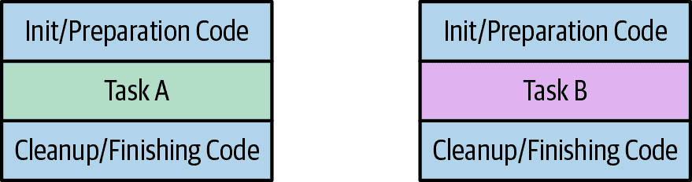

# 第七章：扩展 Twootr

# 挑战

之前在 Twootr 上，Joe 想要实现一个现代化的在线通信系统。上一章介绍了 Twootr 的潜在设计和核心业务域的实现，包括通过测试驱动设计的方法来实现该设计。您了解了涉及的一些设计和数据建模决策，以及如何分解初始问题并构建解决方案。这并没有涵盖整个 Twootr 项目，因此本章需要完成这个叙述。

# 目标

本章通过帮助您了解以下主题，扩展并完善了前一章中取得的进展：

+   避免依赖倒置原则和依赖注入的耦合

+   使用 Repository 模式和查询对象模式进行持久化。

+   简要介绍函数式编程，将向您展示如何在 Java 特定的上下文和实际应用程序中使用这些想法。

# 总结

由于我们从前一章继续进行 Twootr 项目，因此现在可能值得回顾我们设计中的关键概念。如果您正在一场马拉松式的阅读中继续前一章节，那么我们很高兴您喜欢这本书，但请随意跳过本节。

+   `Twootr` 是实例化业务逻辑并编排系统的父类。

+   `Twoot` 是我们系统中用户广播的消息的单个实例。

+   `ReceiverEndPoint` 是一个由 UI 适配器实现的接口，用于向 UI 推送 `Twoot` 对象。

+   `SenderEndPoint` 具有与用户从系统中发送的事件相对应的方法。

+   密码管理和哈希由 `KeyGenerator` 类执行。

# 持久化和 Repository 模式

现在我们有了一个能够支持大部分核心 Twootr 操作的系统。不幸的是，如果我们以任何方式重新启动 Java 进程，所有的 Twoots 和用户信息都会丢失。我们需要一种持久化信息的方法，以便在重新启动后能够存活下来。在讨论软件架构的早期，我们谈到了端口和适配器以及如何希望使我们应用程序的核心与存储后端无关。事实上，有一种常用的模式可以帮助我们做到这一点：*Repository* 模式。

Repository 模式定义了领域逻辑和存储后端之间的接口。除了允许我们随着应用程序的演进在不同的存储后端之间切换外，这种方法还提供了几个优点：

+   将数据从存储后端映射到领域模型的逻辑集中化。

+   使核心业务逻辑的单元测试成为可能，而不必启动数据库。这可以加快测试的执行速度。

+   通过保持每个类单一职责，提高了可维护性和可读性。

您可以将存储库视为类似于对象集合，但存储库不仅仅将对象存储在内存中，还会将它们持久化在某个地方。在演化我们应用程序设计时，我们通过测试推动了存储库的设计；但是，为了节省时间，我们只会描述最终实现。由于存储库是对象的集合，我们在 Twootr 中需要两个存储库：一个用于存储`User`对象，另一个用于存储`Twoot`对象。大多数存储库具有一系列常见的操作，这些操作已经实现：

`add()`

将对象的新实例存储到存储库中。

`get()`

根据标识符查找单个对象。

`delete()`

从持久性后端删除实例。

`update()`

确保为此对象保存的值等于实例字段。

有些人使用 CRUD 缩写来描述这些操作。这代表 Create，Read，Update 和 Delete。我们使用`add`和`get`而不是`create`和`read`，因为命名更符合常见的 Java 用法，例如，在集合框架中。

## 设计存储库

在我们的情况下，我们从顶向下设计事物，并通过测试驱动存储库的开发。这意味着，并非所有操作都在两个存储库上定义。如示例 7-1 所示的`UserRepository`，没有一个操作来删除一个`User`。这是因为实际上没有要求执行删除用户操作。我们问了我们的客户，乔，关于这个问题，他说“一旦你开始 Twoot，你就停不下来了！”

当独自工作时，您可能会想要添加功能，只是为了使存储库中有“正常”的操作，但我们强烈警告不要走这条路。未使用的代码，或者通常被称为*死代码*，是一种负担。从某种意义上说，所有的代码都是一种负担，但是如果代码实际上是有用的，那么它对您的系统有益处，而如果它没有被使用，那么它只是一种负担。随着您的需求的演变，您需要重构和改进您的代码库，而如果您有很多未使用的代码，这个任务就会变得更加困难。

这里有一个指导原则，我们在整章中一直在暗示，但直到现在才提到：*YAGNI*。这代表*You ain’t gonna need it*。这并不意味着不要引入抽象和不同的概念，比如存储库。它只是表示在实际需要时才编写代码，而不是认为将来会需要它时编写代码。

##### 示例 7-1\. UserRepository

```java
public interface UserRepository extends AutoCloseable {
    boolean add(User user);

    Optional<User> get(String userId);

    void update(User user);

    void clear();

    FollowStatus follow(User follower, User userToFollow);
}
```

由于它们存储的对象的性质不同，我们的两个存储库的设计也有所不同。我们的`Twoot`对象是不可变的，因此示例 7-2 中显示的`TwootRepository`不需要实现`update()`操作。

##### 示例 7-2\. TwootRepository

```java
public interface TwootRepository {
    Twoot add(String id, String userId, String content);

    Optional<Twoot> get(String id);

    void delete(Twoot twoot);

    void query(TwootQuery twootQuery, Consumer<Twoot> callback);

    void clear();
}
```

通常，存储库中的 `add()` 方法只是将相关对象持久化到数据库中。在 `TwootRepository` 的情况下，我们采取了不同的方法。这个方法接受一些特定的参数，并且实际上创建了相关对象。采用这种方法的动机是数据源将负责为 `Twoot` 分配下一个 `Position` 对象。我们将确保唯一和有序对象的责任委托给将具有创建此类序列的适当工具的数据层。

另一种选择可能是接受一个没有分配 `position` 的 `Twoot` 对象，然后在添加时设置 `position` 字段。现在，对象构造函数的一个关键目标应该是确保所有的内部状态都被完全初始化，理想情况下应该使用 `final` 字段进行检查。通过在对象创建时不分配位置，我们将创建一个未完全实例化的对象，违反了我们围绕创建对象的原则之一。

Repository 模式的一些实现引入了一个通用接口，例如，类似 示例 7-3 的内容。在我们的情况下，这并不合适，因为 `TwootRepository` 没有 `update()` 方法，而 `UserRepository` 没有 `delete()` 方法。如果你想编写能够抽象不同存储库的代码，那么这可能会很有用。为了设计一个良好的抽象，避免仅仅为了这个目的而强行将不同的实现合并到同一个接口中是很重要的。

##### 示例 7-3\. 抽象存储库

```java
public interface AbstractRepository<T>
{
    void add(T value);

    Optional<T> get(String id);

    void update(T value);

    void delete(T value);
}
```

## 查询对象

不同存储库之间的另一个关键区别是它们如何支持查询。在 Twootr 的情况下，我们的 `UserRepository` 不需要任何查询功能，但是当涉及到 `Twoot` 对象时，我们需要能够查找 twoots 以便在用户登录时重放它们。实现这个功能的最佳方式是什么？

嗯，我们在这里可以做几种不同的选择。最简单的方法是，我们可以简单地将我们的存储库视为一个纯粹的 `Java` `Collection`，并且有一种方法可以迭代不同的 `Twoot` 对象。然后，查询/过滤的逻辑可以以正常的 Java 代码编写。这很好，但是可能会相当慢，因为它要求我们从数据存储中检索所有行到我们的 Java 应用程序中以便进行查询，而实际上我们可能只想要其中的一些行。通常，像 SQL 数据库这样的数据存储后端具有高度优化和高效的数据查询和排序实现，最好将查询交给它们来处理。

决定仓库实现需要负责查询数据存储后，我们需要决定如何最好地通过`TwootRepository`接口公开这一功能。一种选择是添加一个与我们的业务逻辑耦合的方法来执行查询操作。例如，我们可以从示例 7-4 编写像`twootsForLogon()`方法来获取与用户关联的 twoots。这样做的缺点是，我们现在将特定的业务逻辑功能耦合到了我们的仓库实现中——这与引入仓库抽象的初衷相悖。这将使我们难以根据需求演化我们的实现，因为我们不得不修改仓库以及核心域逻辑，并且违反了单一职责原则。

##### 示例 7-4\. twootsForLogon

```java
List<Twoot> twootsForLogon(User user);
```

我们想要设计的是一种能够利用数据存储的查询能力，而不将业务逻辑与所讨论的数据存储耦合在一起的东西。我们可以为给定的业务条件向仓库添加一个特定的查询方法，正如示例 7-5 所示。这种方法比前两种方法要好得多，但仍然可以稍作调整。将每个查询硬编码到特定方法中的问题在于，随着应用程序随时间的推移演变并增加更多查询功能，我们将不得不添加越来越多的方法到 Repository 接口中，这会使其变得臃肿并且难以理解。

##### 示例 7-5\. twootsFromUsersAfterPosition

```java
List<Twoot> twootsFromUsersAfterPosition(Set<String> inUsers, Position lastSeenPosition);
```

这引导我们进入下一个查询迭代，显示在示例 7-6 中。在这里，我们将我们的`TwootRepository`查询条件抽象成了自己的对象。现在，我们可以添加额外的属性到这个条件中进行查询，而无需将查询方法的数量变成关于不同属性的组合爆炸。我们的`TwootQuery`对象的定义如示例 7-7 所示。

##### 示例 7-6\. query

```java
List<Twoot> query(TwootQuery query);
```

##### 示例 7-7\. TwootQuery

```java
public class TwootQuery {
    private Set<String> inUsers;
    private Position lastSeenPosition;

    public Set<String> getInUsers() {
        return inUsers;
    }

    public Position getLastSeenPosition() {
        return lastSeenPosition;
    }

    public TwootQuery inUsers(final Set<String> inUsers) {
        this.inUsers = inUsers;

        return this;
    }

    public TwootQuery inUsers(String... inUsers) {
        return inUsers(new HashSet<>(Arrays.asList(inUsers)));
    }

    public TwootQuery lastSeenPosition(final Position lastSeenPosition) {
        this.lastSeenPosition = lastSeenPosition;

        return this;
    }

    public boolean hasUsers() {
        return inUsers != null && !inUsers.isEmpty();
    }
}
```

这并不是查询 twoots 的最终设计方法。通过返回一个`List`对象，意味着我们需要一次性将要返回的所有`Twoot`对象加载到内存中。当这个`List`可能变得非常大时，这并不是一个好主意。我们也许不想一次性查询所有对象。在这种情况下——我们想要将每个`Twoot`对象推送到我们的 UI 中，而不需要一次性将它们全部保存在内存中。一些仓库实现会创建一个对象来模拟返回的结果集。这些对象让你可以分页或迭代访问这些值。

在这种情况下，我们将执行一些更简单的操作：只需采取一个 `Consumer<Twoot>` 回调。这是调用者将传递的一个函数，它接受一个参数——一个 `Twoot`——并返回 `void`。我们可以使用 lambda 表达式或方法引用来实现此接口。您可以在示例 7-8 中看到我们的最终方法。

##### 示例 7-8\. 查询

```java
void query(TwootQuery twootQuery, Consumer<Twoot> callback);
```

参见示例 7-9 以了解如何使用此查询方法。这是我们的 `onLogon()` 方法调用查询的方式。它获取已登录用户，并使用该用户正在关注的用户集合作为查询的用户部分。然后，它使用该查询部分的上次查看位置。接收此查询结果的回调是 `user::receiveTwoot`，这是对我们之前描述的将 `Twoot` 对象发布到 UI `ReceiverEndPoint` 的函数的方法引用。

##### 示例 7-9\. 使用查询方法的示例

```java
twootRepository.query(
    new TwootQuery()
        .inUsers(user.getFollowing())
        .lastSeenPosition(user.getLastSeenPosition()),
    user::receiveTwoot);
```

就是这样——这是我们设计并在应用程序逻辑核心中可用的存储库接口。

还有另一个功能，一些存储库实现使用了，这里我们没有描述，那就是*工作单元*模式。我们在 Twootr 中没有使用工作单元模式，但它通常与存储库模式一起使用，因此在这里提到它是值得的。企业应用程序通常会执行一个单一操作，与数据存储交互多次。例如，您可能正在两个银行账户之间转移资金，并希望在同一操作中从一个账户中取款并将其添加到另一个账户中。您不希望这些操作中的任何一个成功，而另一个不成功——在债务人账户没有足够资金时，您不希望将资金存入债权人账户。您也不希望在确保可以向债权人账户存入资金之前减少债务人的余额。

数据库通常实现事务和 ACID 合规性，以便使人们能够执行这些类型的操作。事务本质上是一组不同的数据库操作，逻辑上作为单个原子操作执行。工作单元是一种设计模式，可以帮助您执行数据库事务。基本上，您在存储库上执行的每个操作都会在工作单元对象中注册。然后，您的工作单元对象可以委托给一个或多个存储库，将这些操作包装在一个事务中。

到目前为止我们还没有讨论如何实际实现我们设计的存储库接口。就像软件开发中的其他事物一样，通常有不同的路线可选。Java 生态系统包含许多对象关系映射（ORM）工具，试图为您自动化这些实现任务。最流行的 ORM 是 [Hibernate](http://hibernate.org/)。ORM 通常是一种简单的方法，可以为您自动化一些工作；然而，它们往往会产生不够优化的数据库查询代码，并且有时会引入更多复杂性，而不是帮助减少。

在示例项目中，我们为每个存储库提供了两种实现方式。其中一种是非常简单的内存实现，适合用于测试，不会在重新启动时保留数据。另一种方法使用了普通的 SQL 和 JDBC API。我们不会详细讨论实现细节，因为大部分并未展示出特别有趣的 Java 编程思想；然而，在“函数式编程”章节中，我们将讨论如何在实现中应用一些函数式编程的思想。

# 函数式编程

函数式编程是一种将方法视为数学函数运行的计算机编程风格。这意味着它避免了可变状态和数据改变。你可以在任何语言中以这种风格编程，但有些编程语言提供了功能来帮助简化和改进——我们称之为*函数式编程语言*。Java 不是一种函数式编程语言，但在发布 20 年后的第 8 版中，它开始添加了一些功能，帮助实现了在 Java 中进行函数式编程。这些功能包括 lambda 表达式、Streams 和 Collectors API，以及 `Optional` 类。在本节中，我们将简要介绍这些函数式编程特性的使用及在 Twootr 中的应用。

在 Java 8 之前，库编写者在使用抽象级别上存在限制。一个很好的例子是缺乏对大型数据集进行有效并行操作的能力。从 Java 8 开始，你可以编写复杂的集合处理算法，通过改变一个方法调用，就能在多核 CPU 上高效执行这些代码。然而，为了能够编写这类大数据并行库，Java 需要进行一次新的语言改变：lambda 表达式。

当然，这也是有成本的，因为你必须学会编写和阅读支持 Lambda 的代码，但这是一个很好的权衡。程序员学习少量新语法和几种新习惯比手写大量复杂的线程安全代码要容易得多。优秀的库和框架显著降低了开发企业业务应用程序的成本和时间，应该消除开发易于使用和高效库的任何障碍。

抽象是任何进行面向对象编程的人熟悉的概念。不同之处在于，面向对象编程主要是抽象化数据，而函数式编程主要是抽象化行为。现实世界有这两种东西，我们的程序也有，因此我们可以并且应该从两者的影响中学习。

这种新抽象还有其他好处。对于我们中的许多人来说，不是一直编写性能关键代码，这些更重要的优势更胜一筹。您可以编写更易于阅读的代码——花时间表达其业务逻辑意图而不是其实现机制的代码。易于阅读的代码比难以阅读的代码更易于维护，更可靠，更少出错。

## Lambda 表达式

我们将定义一个 Lambda 表达式作为描述匿名函数的简洁方式。我们理解一次性掌握这么多内容可能有些困难，因此我们将通过实际的 Java 代码示例来解释 Lambda 表达式是什么。让我们从我们代码库中用于表示回调的接口 `ReceiverEndPoint` 开始，如示例 7-10 所示。

##### Example 7-10\. ReceiverEndPoint

```java
public interface ReceiverEndPoint {
    void onTwoot(Twoot twoot);
}
```

在这个例子中，我们正在创建一个新对象，该对象提供了 `ReceiverEndPoint` 接口的实现。这个接口有一个方法 `onTwoot`，当 Twootr 对象将一个 `Twoot` 对象发送到 UI 适配器时，将调用此方法。在 Example 7-11 中列出的类提供了此方法的实现。在这种情况下，为了保持简单，我们只是在命令行上打印它，而不是将序列化版本发送到实际的 UI。

##### Example 7-11\. 使用类实现 ReceiverEndPoint

```java
public class PrintingEndPoint implements ReceiverEndPoint {
    @Override
    public void onTwoot(final Twoot twoot) {
        System.out.println(twoot.getSenderId() + ": " + twoot.getContent());
    }
}
```

###### 注意

这实际上是行为参数化的一个例子——我们正在对不同的行为进行参数化，以向 UI 发送消息。

在这里调用实际行为的单行代码之前，需要七行样板代码。匿名内部类旨在使 Java 程序员更容易表示和传递行为。您可以在 Example 7-12 中看到一个例子，它减少了一些样板，但如果您希望轻松传递行为，它们仍然不足够简单。

##### Example 7-12\. 使用匿名类实现 ReceiverEndPoint

```java
        final ReceiverEndPoint anonymousClass = new ReceiverEndPoint() {
            @Override
            public void onTwoot(final Twoot twoot) {
                System.out.println(twoot.getSenderId() + ": " + twoot.getContent());
            }
        };
```

Boilerplate 不是唯一的问题，这段代码很难阅读，因为它掩盖了程序员的意图。我们不想传递一个对象；我们真正想做的是传递一些行为。在 Java 8 或更高版本中，我们会将这段代码示例写成一个 lambda 表达式，如示例 7-13 所示。

##### 示例 7-13\. 使用 lambda 表达式实现 ReceiverEndPoint

```java
        final ReceiverEndPoint lambda =
            twoot -> System.out.println(twoot.getSenderId() + ": " + twoot.getContent());
```

而不是传递实现接口的对象，我们传递了一块代码——一个没有名字的函数。`twoot` 是参数的名称，与匿名内部类示例中的参数相同。`->` 分隔参数和 lambda 表达式的主体，它只是一些在发布 `twoot` 时运行的代码。

这个例子和匿名内部类之间的另一个区别是如何声明变量 `event`。以前，我们需要显式地提供它的类型：`Twoot twoot`。在这个例子中，我们根本没有提供类型，但这个例子仍然可以编译。底层发生的事情是 javac 从 `onTwoot` 的签名中推断出变量 `event` 的类型。这意味着当类型显而易见时，你不需要显式地写出类型。

###### 注意

尽管 lambda 方法参数比以前需要的样板代码少，它们仍然是静态类型的。为了可读性和熟悉性，你可以选择包含类型声明，有时编译器确实无法解析！

## 方法引用

你可能注意到的一个常见习语是创建一个 lambda 表达式来调用其参数上的方法。如果我们想要一个 lambda 表达式来获取一个 `Twoot` 的内容，我们会写出类似 7-14 的代码。

##### 示例 7-14\. 获取两推的内容

```java
twoot -> twoot.getContent()
```

这是一个非常常见的习惯用法，实际上有一种简写语法可以让你重用现有的方法，称为方法引用。如果我们要使用方法引用来编写前面的 lambda 表达式，它将类似于 7-15。

##### 示例 7-15\. 方法引用

```java
Twoot::getContent
```

标准形式是 `类名::方法名`。请记住，尽管它是一个方法，但你不需要使用括号，因为你实际上没有调用这个方法。你提供的是一个 lambda 表达式的等价形式，可以在需要时调用方法。你可以在与 lambda 表达式相同的地方使用方法引用。

你也可以使用相同的简写语法调用构造函数。如果你要使用 lambda 表达式来创建一个 `SenderEndPoint`，你可能会写出 7-16。

##### 示例 7-16\. 使用 lambda 创建一个新的 SenderEndPoint

```java
(user, twootr) -> new SenderEndPoint(user, twootr)
```

你也可以使用方法引用来写，如 7-17 所示。

##### 示例 7-17\. 方法引用来创建一个新的 SenderEndPoint

```java
SenderEndPoint::new
```

这段代码不仅更短，而且更易于阅读。`SenderEndPoint::new` 立即告诉您正在创建一个新的 `SenderEndPoint`，而无需扫描整行代码。另一个需要注意的地方是，方法引用自动支持多个参数，只要您有正确的函数接口。

当我们首次探索 Java 8 的变化时，我们的一个朋友说过方法引用“感觉像是作弊”。他的意思是，通过研究我们如何使用 lambda 表达式将代码传递作为数据，直接引用方法感觉像是作弊。

实际上，方法引用确实使一等函数的概念显式化。这意味着我们可以传递行为并像处理另一个值一样对待它。例如，我们可以将函数组合在一起。

## 执行周围

*执行周围*模式是一种常见的函数设计模式。您可能会遇到这样的情况，即您有共同的初始化和清理代码，但需要对初始化和清理代码之间运行的不同业务逻辑进行参数化。通用模式示例如 图 7-1 所示。有许多可以使用执行周围的示例情况，例如：

文件

在使用文件之前打开文件，在使用完文件后关闭文件。如果出现问题，您可能还希望记录异常。参数化代码可以从文件中读取或写入数据。

锁

在关键部分之前获取锁，在关键部分之后释放锁。参数化代码是关键部分。

数据库连接

在初始化时打开数据库连接，在完成后关闭连接。如果您还希望池化数据库连接，这通常会更加有用，因为它还允许您的打开逻辑从池中检索连接。



###### 图 7-1\. 执行周围模式

由于初始化和清理逻辑在许多地方都在使用，可能会遇到这样的情况，即此逻辑被复制。这意味着如果您想修改这些通用初始化或清理代码，那么您将不得不修改应用程序的多个不同部分。这也暴露了这些不同代码片段可能变得不一致的风险，从而在您的应用程序中引入潜在的错误。

执行周围模式通过提取一个通用方法来解决这个问题，该方法定义了初始化和清理代码。此方法接受一个参数，其中包含了在同一整体模式的不同用例中行为差异的定义。该参数将使用接口来实现，以便能够由不同的代码块实现，通常使用 lambda 表达式。

示例 7-18 展示了提取方法的具体示例。在 Twootr 中，此方法用于对数据库运行 SQL 语句。它创建一个给定 SQL 语句的预处理语句对象，然后运行我们的 `extractor` 行为于该语句上。`extractor` 只是一个回调函数，用于从数据库中提取结果，使用 `PreparedStatement`。

##### 示例 7-18\. 在提取方法中使用执行环绕模式

```java
    <R> R extract(final String sql, final Extractor<R> extractor) {
        try (var stmt = conn.prepareStatement(sql, Statement.RETURN_GENERATED_KEYS)) {
            stmt.clearParameters();
            return extractor.run(stmt);
        } catch (SQLException e) {
            throw new IllegalStateException(e);
        }
    }
```

## Streams

Java 中最重要的函数式编程特性集中在 Collections API 和 *Streams* 上。Streams 允许我们以比使用循环更高的抽象级别编写集合处理代码。`Stream` 接口包含一系列函数，我们将在本章中探索这些函数，每个函数对应于在 `Collection` 上执行的常见操作。

### map()

如果你有一个将一个类型的值转换为另一个类型的值的函数，`map()` 允许你将此函数应用于值的流，生成另一个新值的流。

你可能已经多年使用 for 循环进行某种类型的映射操作了。在我们的 `DatabaseTwootRepository` 中，我们已经构建了一个用于查询的元组 `String`，包含用户关注的所有不同用户的 `id` 值。每个 `id` 值都是一个带引号的 `String`，而整个元组则用括号括起来。例如，如果他们关注的用户有 `"richardwarburto"` 和 `"raoulUK"` 的 ID，我们将生成一个元组 `String`，内容为 `"(*richardwarburto*,*raoulOK*)"`。为了生成这个元组，你可以使用映射模式，将每个 `id` 转换为 `"*id*"`，然后将它们添加到一个 `List` 中。然后可以使用 `String.join()` 方法以逗号分隔它们。示例 7-19 就是以这种风格编写的代码。

##### 示例 7-19\. 使用 for 循环构建用户元组

```java
    private String usersTupleLoop(final Set<String> following) {
        List<String> quotedIds = new ArrayList<>();
        for (String id : following) {
            quotedIds.add("'" + id + "'");
        }
        return '(' + String.join(",", quotedIds) + ')';
    }
```

`map()` 是最常用的 `Stream` 操作之一。示例 7-20 展示了构建用户元组的同样示例，但使用了 `map()`。它还利用了 `joining()` 收集器，允许我们将 `Stream` 中的元素连接成一个 `String`。

##### 示例 7-20\. 使用 map 构建用户元组

```java
    private String usersTuple(final Set<String> following) {
        return following
            .stream()
            .map(id -> "'" + id + "'")
            .collect(Collectors.joining(",", "(", ")"));
    }
```

传递给 `map()` 的 lambda 表达式接受一个 `String` 作为其唯一参数，并返回一个 `String`。参数和结果不必是相同类型，但传递的 lambda 表达式必须是 `Function` 的实例。这是一个只有一个参数的通用函数接口。

### forEach()

当你想要对 `Stream` 中的每个值执行副作用时，`forEach()` 操作很有用。例如，假设你想打印用户的名称或将流中的每个事务保存到数据库中。`forEach()` 接受一个参数 —— 一个 `Consumer` 回调函数，它会在流中的每个元素上执行。

### filter()

每当您循环一些数据并使用 if 语句检查每个元素时，您可能想考虑使用`Stream.filter()`方法。

例如，`InMemoryTwootRepository` 需要查询不同的 `Twoot` 对象以找到符合其 `TwootQuery` 的 twoots。具体来说，位置在上次查看的位置之后，且用户正在被关注。这种写法的示例在 Example 7-21 中显示为循环样式。

##### 示例 7-21\. 遍历 twoots 并使用 if 语句

```java
    public void queryLoop(final TwootQuery twootQuery, final Consumer<Twoot> callback) {
        if (!twootQuery.hasUsers()) {
            return;
        }

        var lastSeenPosition = twootQuery.getLastSeenPosition();
        var inUsers = twootQuery.getInUsers();

        for (Twoot twoot : twoots) {
            if (inUsers.contains(twoot.getSenderId()) &&
                twoot.isAfter(lastSeenPosition)) {
                callback.accept(twoot);
            }
        }
    }
```

您可能编写过类似于这样的代码：它被称为`filter`模式。过滤器的中心思想是保留`Stream`的一些元素，同时淘汰其他元素。 Example 7-22 展示了如何以函数式风格编写相同的代码。

##### 示例 7-22\. 函数式风格

```java
    @Override
    public void query(final TwootQuery twootQuery, final Consumer<Twoot> callback) {
        if (!twootQuery.hasUsers()) {
            return;
        }

        var lastSeenPosition = twootQuery.getLastSeenPosition();
        var inUsers = twootQuery.getInUsers();

        twoots
            .stream()
            .filter(twoot -> inUsers.contains(twoot.getSenderId()))
            .filter(twoot -> twoot.isAfter(lastSeenPosition))
            .forEach(callback);
    }
```

与`map()`类似，`filter()`是一个只接受一个函数作为参数的方法——在这里我们使用了 lambda 表达式。这个函数做的工作与前面的 if 语句中的表达式相同。在这里，如果`String`以数字开头，则返回`true`。如果您正在重构遗留代码，则在循环中间存在 if 语句的存在很可能表明您确实想要使用 filter。因为这个函数正在执行与 if 语句相同的工作，所以它必须为给定的值返回`true`或`false`。`filter`后面的`Stream`具有前面`Stream`的元素，这些元素在`filter`之前被求值为`true`。

### reduce()

`reduce` 是一种模式，对于使用循环操作集合的人来说也很熟悉。当你想要将整个值列表折叠成单个值时，就会写出这样的代码——例如，找到不同交易的所有值的总和。编写循环时，您将看到减少的一般模式显示在 Example 7-23 中。当您有一组值并且想要生成单个结果时，请使用`reduce`操作。

##### 示例 7-23\. 减少模式

```java
Object accumulator = initialValue;
for (Object element : collection) {
 accumulator = combine(accumulator, element);
}
```

一个`accumulator`通过循环体被推送，`accumulator`的最终值是我们试图计算的值。`accumulator`从`initialValue`开始，然后通过调用`combine`操作将列表的每个元素组合在一起。

这种模式的实现之间的差异在于`initialValue`和组合函数。在原始示例中，我们使用列表中的第一个元素作为我们的`initialValue`，但不一定非要这样。为了在列表中找到最短的值，我们的组合将返回当前元素和`accumulator`中的较短跟踪的较短值。我们现在将看看如何通过流 API 本身的操作来将这种一般模式编码化。

让我们通过添加一个功能来展示`reduce`操作，该功能将不同的两推组合成一个大的两推。操作将具有`Twoot`对象列表、`Twoot`的发送者以及其`id`作为参数。它需要将不同的内容值组合在一起，并返回组合两推的最高位置。整体代码在示例 7-24 中展示。

我们从一个新创建的`Twoot`对象开始，使用`id`、空内容和最低可能的位置——`INITIAL_POSITION`。然后`reduce`将每个元素与累加器结合在一起，在每一步都将元素与累加器组合。当我们到达最后的`Stream`元素时，我们的累加器包含了所有元素的总和。

lambda 表达式，即 reducer，执行组合并接受两个参数。`acc`是累加器，保存了已组合的先前两推。同时在`Stream`中传递当前的`Twoot`。我们的示例中的 reducer 创建了一个新的`Twoot`，其中包含两个位置的最大值、它们内容的连接，以及指定的`id`和`senderId`。

##### 示例 7-24\. 使用 reduce 实现求和

```java
    private final BinaryOperator<Position> maxPosition = maxBy(comparingInt(Position::getValue));

    Twoot combineTwootsBy(final List<Twoot> twoots, final String senderId, final String newId) {
        return twoots
            .stream()
            .reduce(
                new Twoot(newId, senderId, "", INITIAL_POSITION),
                (acc, twoot) -> new Twoot(
                    newId,
                    senderId,
                    twoot.getContent() + acc.getContent(),
                    maxPosition.apply(acc.getPosition(), twoot.getPosition())));
    }
```

当然，这些`Stream`操作单独来看并不那么有趣。它们在组合在一起形成管道时变得非常强大。示例 7-25 展示了从`Twootr.onSendTwoot()`中的一些代码，我们在这里向用户的关注者发送了两推。第一步是调用`followers()`方法，该方法返回一个`Stream<User>`。然后我们使用`filter`操作找到实际登录的用户，这些用户我们想要发送两推给他们。接着我们使用`forEach`操作产生期望的副作用：向用户发送一条两推并记录结果。

##### 示例 7-25\. 在 onSendTwoot 方法中使用 Stream

```java
        user.followers()
            .filter(User::isLoggedOn)
            .forEach(follower ->
            {
                follower.receiveTwoot(twoot);
                userRepository.update(follower);
            });
```

## 可选

`Optional`是 Java 8 引入的核心 Java 库数据类型，旨在提供比`null`更好的替代方案。对于旧的 null 值存在相当多的厌恶情绪。即使是发明这个概念的人，Tony Hoare，也将其描述为[“我的十亿美元错误”](https://oreil.ly/OaXWj)。这就是作为一名有影响力的计算机科学家的麻烦之处——你甚至可能在看不到十亿美元的情况下犯下十亿美元的错误！

`null`通常用来表示值的缺失，而`Optional`则是用来替代这种用法。使用`null`表示缺失值的问题在于可怕的`NullPointerException`。如果引用一个为`null`的变量，你的代码就会崩溃。`Optional`的目标是双重的。首先，它鼓励程序员适当地检查变量是否缺失，以避免错误。其次，它在类的 API 中文档化了预期缺失的值。这使得更容易看到哪些值是被隐藏的。

让我们看一下`Optional`的 API，以便了解如何使用它。 如果你想从一个值创建一个`Optional`实例，有一个名为`of()`的工厂方法。 现在，`Optional`是这个值的一个容器，可以用`get`来取出，如 Example 7-26 所示。

##### Example 7-26\. 从一个值创建一个 Optional

```java
Optional<String> a = Optional.of("a");

assertEquals("a", a.get());
```

因为`Optional`也可以表示一个不存在的值，所以还有一个名为`empty()`的工厂方法，你可以使用`ofNullable()`方法将可空值转换为`Optional`。 你可以在 Example 7-27 中看到这两种方法，以及`isPresent()`方法的使用，它指示`Optional`是否持有一个值。

##### Example 7-27\. 创建一个空的 Optional 并检查它是否包含一个值

```java
Optional emptyOptional = Optional.empty();
Optional alsoEmpty = Optional.ofNullable(null);

assertFalse(emptyOptional.isPresent());

// a is defined above
assertTrue(a.isPresent());
```

使用`Optional`的一种方法是在调用`get()`之前通过检查`isPresent()`来保护任何调用 —— 这是必需的，因为调用`get()`可能会抛出一个`NoSuchElementException`。 不幸的是，这种方法并不是一个很好的使用`Optional`的编码模式。 如果你以这种方式使用它，你实际上只是复制了使用`null`的现有模式 —— 在这种模式中，你会检查一个值是否不是`null`作为守卫。

一个更简洁的方法是调用`orElse()`方法，它提供了一个替代值，以防`Optional`为空。 如果创建替代值的计算成本很高，应该使用`orElseGet()`方法。 这允许您传入一个`Supplier`函数，只有在`Optional`真正为空时才调用该函数。 这两种方法都在 Example 7-28 中演示。

##### Example 7-28\. 使用 orElse()和 orElseGet()

```java
assertEquals("b", emptyOptional.orElse("b"));
assertEquals("c", emptyOptional.orElseGet(() -> "c"));
```

`Optional`还定义了一系列可以像`Stream`API 一样使用的方法；例如，`filter()`，`map()`和`ifPresent()`。 您可以将这些方法想象为类似于`Stream`API 的`Optional`API，但在这种情况下，您的`Stream`只能包含 1 个或 0 个元素。 因此，如果满足条件，`Optional.filter()`将在`Optional`中保留一个元素，并且如果`Optional`之前为空或谓词未能应用，则返回一个空的`Optional`。 同样，`map()`转换`Optional`中的值，但如果它为空，则根本不应用该函数。 这就是这些函数比使用`null`更安全的地方 —— 它们仅在`Optional`中确实有内容时才操作`Optional`。 `ifPresent`是`forEach`的`Optional`对偶 —— 如果有值存在，它将应用`Consumer`回调，但否则不会。

您可以在 Example 7-29 中看到来自 `Twootr.onLogon()` 方法的代码片段。这是一个示例，展示了如何组合这些不同的操作以执行更复杂的操作。我们首先通过调用 `UserRepository.get()` 根据用户 ID 查找 `User`，该方法返回一个 `Optional`。然后我们使用 `filter` 验证用户的密码匹配。我们使用 `ifPresent` 通知用户他们错过的 twoots。最后，我们将 `User` 对象映射为一个新的 `SenderEndPoint` 并从方法中返回。

##### Example 7-29\. 在 onLogon 方法中使用 Optional

```java
        var authenticatedUser = userRepository
            .get(userId)
            .filter(userOfSameId ->
            {
                var hashedPassword = KeyGenerator.hash(password, userOfSameId.getSalt());
                return Arrays.equals(hashedPassword, userOfSameId.getPassword());
            });

        authenticatedUser.ifPresent(user ->
        {
            user.onLogon(receiverEndPoint);
            twootRepository.query(
                new TwootQuery()
                    .inUsers(user.getFollowing())
                    .lastSeenPosition(user.getLastSeenPosition()),
                user::receiveTwoot);
            userRepository.update(user);
        });

        return authenticatedUser.map(user -> new SenderEndPoint(user, this));
```

在这一部分，我们只是浅尝辄止了函数式编程的表面。如果你有兴趣深入学习函数式编程，我们推荐阅读[*Java 8 In Action*](https://oreil.ly/wGImJ) 和 [*Java 8 Lambdas*](https://oreil.ly/hDrfH)。

# 用户界面

在本章中，我们避免过多讨论系统的用户界面，因为我们专注于核心问题域的设计。尽管如此，了解示例项目作为其 UI 的一部分提供了什么，有助于理解事件建模如何组合在一起。在我们的示例项目中，我们提供了一个单页面网站，使用 JavaScript 实现其动态功能。为了保持简单，并且不深入探讨各种框架之争，我们只是使用 `jquery` 来更新原始 HTML 页面，并在代码中保持了简单的关注点分离。

当您浏览到 Twootr 网页时，它会使用 WebSockets 连接回主机。这些是我们在 “From Events to Design” 中讨论的事件通信选择之一。所有与其通信的代码都位于 `chapter_06` 的 `web_adapter` 子包中。`WebSocketEndPoint` 类实现了 `ReceiverEndPoint`，并在 `SenderEndPoint` 上调用任何需要的方法。例如，当 `ReceiverEndPoint` 接收并解析要关注另一个用户的消息时，它调用 `SenderEndPoint.onFollow()`，通过用户名传递。返回的 `enum`—`FollowStatus` 然后被转换为一种线格式的响应并写入 WebSocket 连接。

JavaScript 前端与服务器之间的所有通信都使用 [*JavaScript Object Notation* (JSON) standard](http://www.json.org/)。选择 JSON 是因为 JavaScript UI 非常容易对其进行反序列化或序列化。

在 `WebSocketEndPoint` 内部，我们需要在 Java 代码中进行 JSON 的映射。有许多库可以用于此目的，这里我们选择了 [Jackson 库](https://github.com/FasterXML/jackson)，这是一种常用且维护良好的库。JSON 在采用请求/响应方式而不是事件驱动方式的应用程序中经常被使用。在我们的情况下，我们手动从 JSON 对象中提取字段，以保持简单性，但也可以使用更高级的 JSON API，如绑定 API。

# 依赖反转和依赖注入

在本章中我们讨论了很多关于解耦模式的内容。我们的整体应用程序使用了端口和适配器模式以及仓储模式，将业务逻辑与实现细节分离开来。事实上，当我们看到这些模式时，我们可以想到一个大的、统一的原则——*依赖反转*。依赖反转原则是我们在这本书中讨论的五个 SOLID 原则中的最后一个，像其他原则一样，它也是由 Robert Martin 引入的。它指出：

+   高级模块不应依赖于低级模块。两者都应依赖于抽象。

+   抽象不应依赖于细节，细节应依赖于抽象。

这个原则之所以称为反转，是因为在传统的命令式、结构化编程中，高级模块通常组合以生成低级模块。这往往是我们在本章讨论的自顶向下设计的一个副作用。你将一个大问题分解成不同的子问题，为每个子问题编写一个模块来解决，然后主问题（高级模块）依赖于子问题（低级模块）。

在 Twootr 的设计中，我们通过引入抽象来避免了这个问题。我们有一个高级入口点类，名为 `Twootr`，它不依赖于低级模块，比如我们的 `DataUserRepository`。它依赖于抽象——`UserRepository` 接口。在 UI 端口上也是如此。`Twootr` 不依赖于 `WebSocketEndPoint`，而是依赖于 `ReceiverEndPoint`。我们编程时依赖接口，而不是具体实现。

一个相关的术语是*依赖注入*，或者简称*DI*。为了理解 DI 是什么以及为什么我们需要它，让我们对我们的设计进行一个思想实验。我们的架构已经确定，主要的 `Twootr` 类需要依赖于 `UserRepository` 和 `TwootRepository` 来存储 `User` 和 `Twoot` 对象。我们在 `Twootr` 内部定义了字段来存储这些对象的实例，如 Example 7-30 所示。问题是，我们如何实例化它们？

##### 示例 7-30\. Twootr 类内的依赖项

```java
public class Twootr
{

    private final TwootRepository twootRepository;
    private final UserRepository userRepository;
```

我们用于填充字段的第一种策略是尝试使用`new`关键字调用构造函数，如示例 7-31 所示。在这里，我们在代码库中硬编码了使用基于数据库的存储库。现在类中的大部分代码仍然以接口编程，因此我们可以相当容易地更改这里的实现，而无需替换所有代码，但这有点不太优雅。我们必须始终使用数据库存储库，这意味着我们`Twootr`类的测试依赖于数据库并且运行速度较慢。

不仅如此，如果我们想要将不同版本的 Twootr 交付给不同的客户，例如为企业客户提供使用 SQL 的内部版 Twootr，以及使用 NoSQL 后端的云版本，我们将不得不从两个不同版本的代码库中构建。仅仅定义接口和分离实现是不够的，我们还必须有一种方法来正确地连接适当的实现，以确保不破坏我们的抽象和解耦方法。

##### 示例 7-31\. 硬编码字段的实例化

```java
public Twootr()
{
    this.userRepository = new DatabaseUserRepository();
    this.twootRepository = new DatabaseTwootRepository();
}

// How to start Twootr
Twootr twootr = new Twootr();
```

用于实例化不同依赖项的常用设计模式是抽象工厂设计模式。示例 7-32 展示了这种模式，我们有一个工厂方法可以使用`getInstance()`方法创建接口的实例。当我们想要设置正确的实现时，我们可以调用`setInstance()`。例如，我们可以在测试中使用`setInstance()`创建内存中的实现，在本地安装中使用 SQL 数据库，在云环境中使用 NoSQL 数据库。我们已经将实现与接口解耦，并且可以在任何需要的地方调用这些连接代码。

##### 示例 7-32\. 使用工厂创建实例

```java
public Twootr()
{
    this.userRepository = UserRepository.getInstance();
    this.twootRepository = TwootRepository.getInstance();
}

// How to start Twootr
UserRepository.setInstance(new DatabaseUserRepository());
TwootRepository.setInstance(new DatabaseTwootRepository());
Twootr twootr = new Twootr();
```

不幸的是，这种工厂方法的方法也有其缺点。首先，我们现在创建了一个大的共享可变状态球。任何需要在单个 JVM 中运行具有不同依赖关系的多个`Twootr`实例的情况都是不可能的。我们还将生命周期耦合在一起——也许有时我们希望在启动`Twootr`时实例化一个新的`TwootRepository`，或者有时我们希望重用一个现有的实例。工厂方法的方法不会直接让我们这样做。在我们的应用程序中为每个想要创建的依赖关系都创建一个工厂也可能变得相当复杂。

这就是依赖注入发挥作用的地方。DI 可以被视为好莱坞代理人方法的一个例子——不要打电话给我们，我们会打电话给你。使用 DI，你不是显式地创建依赖项或使用工厂来创建它们，而是简单地接受一个参数，任何实例化你的对象的东西都有责任传递所需的依赖项。这可能是一个测试类的设置方法传入一个模拟对象，也可能是你的应用程序的`main()`方法传入一个 SQL 数据库实现。在`Twootr`类中使用这个示例见示例 7-33。依赖反转是一种策略；依赖注入和仓储模式是具体的战术。

##### 示例 7-33\. 使用依赖注入创建实例

```java
public Twootr(final UserRepository userRepository, final TwootRepository twootRepository)
{
    this.userRepository = userRepository;
    this.twootRepository = twootRepository;
}

// How to start Twootr
Twootr twootr = new Twootr(new DatabaseUserRepository(), new DatabaseTwootRepository());
```

以这种方式处理对象不仅使得为对象编写测试变得更容易，而且外部化了对象本身的创建过程。这允许你的应用程序代码或框架控制`UserRepository`的创建时间以及注入到其中的依赖项。许多开发人员发现使用诸如 Spring 和 Guice 等提供许多高级特性的 DI 框架非常方便。例如，它们可以为 bean 定义生命周期，标准化对象实例化后或在需要时销毁前调用的钩子。它们还可以为对象提供作用域，例如仅在进程生命周期内实例化一次的 Singleton 对象或每个请求的对象。此外，这些 DI 框架通常能够很好地与诸如 Dropwizard 或 Spring Boot 之类的 Web 开发框架集成，并提供即开即用的高效开发体验。

# 包和构建系统

Java 允许你将代码库拆分成不同的包。在本书中，我们将每个章节的代码放入其自己的包中，而 Twootr 是第一个在项目本身中拆分出多个子包的项目。

这里是可以查看项目内不同组件的包：

+   `com.iteratrlearning.shu_book.chapter_06`是项目的顶层包。

+   `com.iteratrlearning.shu_book.chapter_06.database`包含了 SQL 数据库持久化的适配器。

+   `com.iteratrlearning.shu_book.chapter_06.in_memory`包含了内存持久化的适配器。

+   `com.iteratrlearning.shu_book.chapter_06.web_adapter`包含了基于 WebSockets 的 UI 适配器。

将大型项目拆分为不同的包有助于组织代码，使开发人员更容易找到所需内容。就像类将相关方法和状态分组在一起一样，包将相关类分组在一起。包应遵循与类相似的耦合和内聚规则。当可能同时更改且与同一结构相关联时，将类放在同一个包中。例如，在 Twootr 项目中，如果我们想要修改 SQL 数据库持久化代码，我们知道要进入`database`子包。

包还可以实现信息隐藏。我们在 示例 4-3 中讨论了有一个包作用域构造方法的想法，以防止对象在包外实例化。我们还可以对类和方法进行包作用域。这可以防止包外的对象访问类的细节，并帮助我们实现松耦合。例如，`WebSocketEndPoint` 是 `web_adapter` 包中实现了 `ReceiverEndPoint` 接口的包作用域实现。项目中的其他代码不应直接与这个类交互，只能通过作为端口的 `ReceiverEndPoint` 接口进行交互。

我们在 Twootr 中每个适配器都有一个包的方法很好地符合我们在整个模块中使用的六边形架构模式。然而，并非每个应用程序都是六边形的，其他项目可能会遇到两种常见的包结构。

一种常见的包结构方法是按层次结构化它们，例如，将所有生成网站 HTML 视图的代码放在`views`包中，并将处理网页请求相关的所有代码放在`controller`包中。尽管这种方法很流行，但它可能导致耦合性和内聚性不佳。如果要修改现有网页以添加额外参数并基于该参数显示值，则需要修改`controller`和`view`包，以及可能还有其他几个包。

另一种代码结构的替代方法是按特性组织代码。例如，如果您编写电子商务网站，可以为购物车使用一个`cart`包，为产品列表相关的代码使用一个`product`包，为接受信用卡支付相关的代码使用一个`payment`包，等等。这通常会更具内聚性。如果要添加支持通过 Mastercard 和 Visa 接收付款，则只需修改`payment`包即可。

在“使用 Maven”中，我们讨论了如何使用 Maven 构建工具设置基本的构建结构。在本书的项目结构中，我们有一个 Maven 项目，而书中的不同章节则是该项目中的不同 Java 包。这是一个简单而清晰的项目结构，适用于各种不同的软件项目，但不是唯一的选择。Maven 和 Gradle 都提供了从单个顶级项目构建和输出多个构建产品的项目结构。

如果你想部署不同的构建产品，这是有道理的。例如，假设你有一个客户端/服务器项目，你希望有一个单一的构建同时构建客户端和服务器，但客户端和服务器是运行在不同机器上的不同二进制文件。不过，最好不要过于深思熟虑或过于模块化构建脚本。

这些是你和你的团队经常在自己的机器上运行的东西，最高优先级是它们要简单、快速和易于使用。这就是为什么我们选择在整本书中只有一个单一项目，而不是每个项目一个子模块的路线。

# 限制和简化

你已经看到了我们如何实现 Twootr，并了解了我们沿途做出的设计决策，但这是否意味着我们迄今为止看到的 Twootr 代码库是唯一或最佳的写法呢？当然不是！事实上，我们的方法存在一些限制和我们故意采取的简化，以便将代码库解释在单一章节中。

首先，我们把 Twootr 写成了只能在单个线程上运行的形式，并完全忽略了并发的问题。实际上，我们可能希望在我们的 Twootr 实现中有多个线程响应和发出事件。这样我们就可以利用现代多核 CPU，并在一台服务器上为更多的客户提供服务。

从更宏观的角度来看，我们也忽略了任何能够在服务器宕机时使我们的服务继续运行的故障转移。我们也忽略了可扩展性。例如，要求所有的 Twoot 都有一个单一定义的顺序，在单一服务器上实现起来既容易又高效，但会带来严重的可扩展性/争用瓶颈。同样地，当你登录时看到所有的 Twoot 也会导致瓶颈。如果你去度假一周，当你重新登录时会得到 20000 条 Twoot，这会怎么样！

对这些问题进行详细的讨论超出了本章的范围。然而，如果你希望在 Java 方面深入学习，这些是重要的话题，并且我们计划在本系列的未来书籍中更详细地讨论它们。

# 总结

+   现在你可以使用存储库模式将数据存储与业务逻辑解耦。

+   你已经看到了在这种方法中实现的两种不同类型的存储库。

+   你已经介绍了函数式编程的概念，包括 Java 8 的 Streams。

+   你已经看到如何结构化一个具有不同包的较大项目。

# 迭代你自己

如果你想扩展并巩固这一节的知识，你可以尝试以下其中一项活动。

假设我们对 Twootr 采用了拉取模型。与其通过 WebSockets 持续向基于浏览器的客户端推送消息，我们可以使用 HTTP 来定期轮询获取自某个位置以来的最新消息。

+   思考我们的设计会如何改变。尝试绘制不同类之间数据流动的图表。

+   使用 TDD 实现 Twootr 的这种替代模型。你不需要实现 HTTP 部分，只需按照这种模型实现底层类。

# 完成挑战

我们开发了这个产品，它运行良好。不幸的是，当 Joe 推出时，他意识到有人叫 Jack 发布了一个类似的产品，名字也很相似，获得了数十亿美元的风投资金和数亿用户。事实上，Jack 只比 Joe 早了 11 年到达这个地步；对 Joe 来说真是个倒霉的运气。
