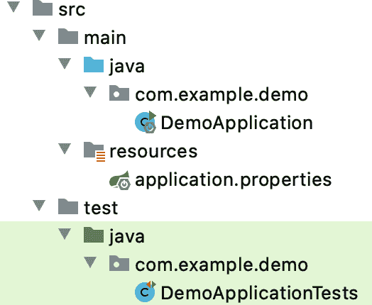
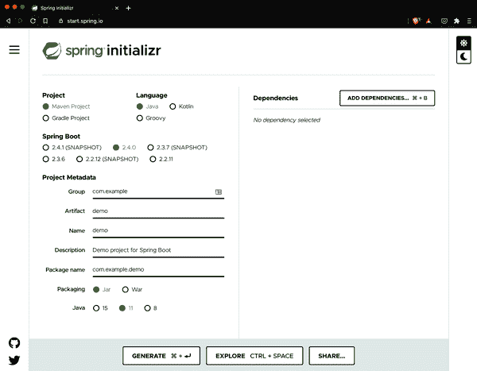
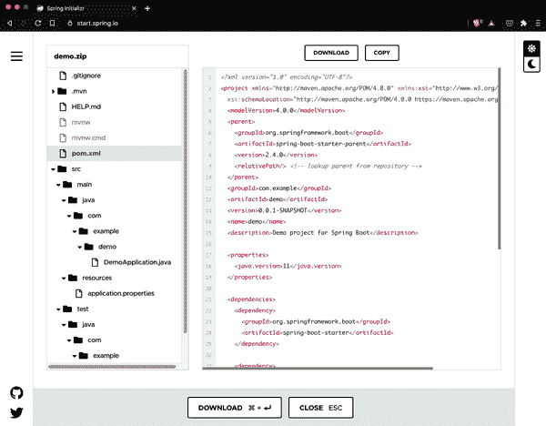
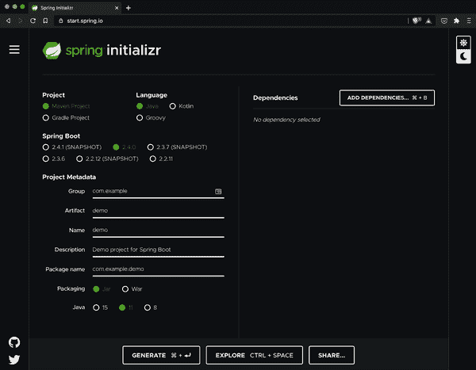
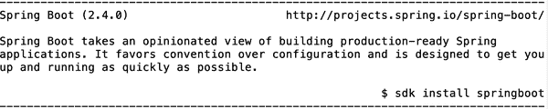
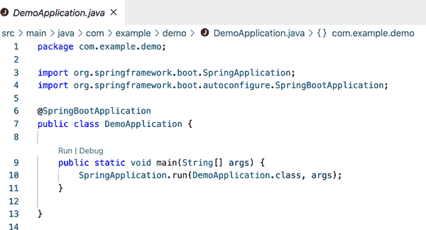
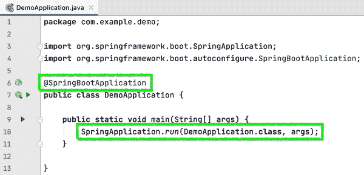

# 第二章：选择您的工具并入门

要开始创建 Spring Boot 应用程序很容易，您很快就会看到。 最困难的部分可能是决定您想要选择哪个可用选项。

在本章中，我们将探讨您可以用来创建 Spring Boot 应用程序的一些出色选择：构建系统、语言、工具链、代码编辑器等等。

# Maven 还是 Gradle？

从历史上看，Java 应用程序开发人员在项目构建工具方面有几个选择。 随着时间的推移，一些选择因有充分理由而不再受欢迎，现在我们作为一个社区聚集在两个选择周围：Maven 和 Gradle。 Spring Boot 同样支持两者。

## Apache Maven

Maven 是一个流行且可靠的构建自动化系统选择。 它已经存在了相当长的时间，最早在 2002 年开始，并于 2003 年成为 Apache Software Foundation 的一个顶级项目。 其声明性方法在当时和现在（仍然）在概念上比替代方案更简单：只需创建一个名为 *pom.xml* 的 XML 格式文件，其中包含所需的依赖项和插件。 当您执行 `mvn` 命令时，可以指定完成的“阶段”，以完成像编译、删除先前的输出、打包、运行应用程序等所需的任务：

```java
<?xml version="1.0" encoding="UTF-8"?>
<project xmlns="http://maven.apache.org/POM/4.0.0"
		xmlns:xsi="http://www.w3.org/2001/XMLSchema-instance"
		xsi:schemaLocation="http://maven.apache.org/POM/4.0.0
 https://maven.apache.org/xsd/maven-4.0.0.xsd">
	<modelVersion>4.0.0</modelVersion>
	<parent>
		<groupId>org.springframework.boot</groupId>
		<artifactId>spring-boot-starter-parent</artifactId>
		<version>2.4.0</version>
		<relativePath/> <!-- lookup parent from repository -->
	</parent>
	<groupId>com.example</groupId>
	<artifactId>demo</artifactId>
	<version>0.0.1-SNAPSHOT</version>
	<name>demo</name>
	<description>Demo project for Spring Boot</description>

	<properties>
		<java.version>11</java.version>
	</properties>

	<dependencies>
		<dependency>
			<groupId>org.springframework.boot</groupId>
			<artifactId>spring-boot-starter</artifactId>
		</dependency>

		<dependency>
			<groupId>org.springframework.boot</groupId>
			<artifactId>spring-boot-starter-test</artifactId>
			<scope>test</scope>
		</dependency>
	</dependencies>

	<build>
		<plugins>
			<plugin>
				<groupId>org.springframework.boot</groupId>
				<artifactId>spring-boot-maven-plugin</artifactId>
			</plugin>
		</plugins>
	</build>

</project>
```

Maven 还按约定创建并期望特定的项目结构。 除非您准备好与您的构建工具作斗争，否则通常不应该偏离这种结构，如果有的话，这是一个适得其反的任务。 对于绝大多数项目来说，传统的 Maven 结构完全有效，因此您不太可能需要更改它。 图 2-1 显示了具有典型 Maven 项目结构的 Spring Boot 应用程序。



###### 图 2-1。在 Spring Boot 应用程序中的 Maven 项目结构

###### 注意

有关 Maven 预期项目结构的更多详细信息，请参阅 [The Maven Project’s Introduction to the Standard Directory Layout](https://oreil.ly/mavenprojintro)。

如果有一天，当 Maven 的项目约定和/或对构建的严格结构化方法变得过于限制性时，还有另一个绝佳选择。

## Gradle

Gradle 是构建 Java 虚拟机（JVM）项目的另一个流行选项。 首次发布于 2008 年，Gradle 利用特定领域语言（DSL）生成了一个既简洁又灵活的 *build.gradle* 构建文件。 以下是一个 Spring Boot 应用程序的 Gradle 构建文件示例。

```java
plugins {
	id 'org.springframework.boot' version '2.4.0'
	id 'io.spring.dependency-management' version '1.0.10.RELEASE'
	id 'java'
}

group = 'com.example'
version = '0.0.1-SNAPSHOT'
sourceCompatibility = '11'

repositories {
	mavenCentral()
}

dependencies {
	implementation 'org.springframework.boot:spring-boot-starter'
	testImplementation 'org.springframework.boot:spring-boot-starter-test'
}

test {
	useJUnitPlatform()
}
```

Gradle 允许开发人员选择使用 Groovy 或 Kotlin 编程语言进行 DSL。 它还提供了几个功能，旨在减少您等待项目构建的时间，例如以下内容：

+   Java 类的增量编译

+   Java 的编译避免（在没有更改发生的情况下）

+   项目编译的专用守护程序

## 在 Maven 和 Gradle 之间做出选择

在这一点上，你选择的构建工具可能听起来并不像是一个选择。为什么不简单地选择 Gradle 呢？

Maven 更为严格的声明性（有人可能会说是有主见的）方法使得从一个项目到另一个项目、从一个环境到另一个环境都保持了一致性。如果你遵循 Maven 的方式，通常不会出现太多问题，让你可以专注于你的代码，而不必过多地纠缠于构建过程中。

作为围绕编程/脚本构建的构建系统，Gradle 有时也会在消化新语言版本的初始发布时遇到问题。Gradle 团队反应迅速，通常能够迅速解决这些问题，但如果你喜欢（或必须）立即深入了解早期版本的语言发布，这值得考虑。

对于构建，Gradle 可能会更快——有时甚至 *显著* 更快，特别是在较大的项目中。也就是说，对于你典型的基于微服务的项目，类似的 Maven 和 Gradle 项目之间的构建时间可能不会有太大差异。

对于简单项目和具有非常复杂构建需求的项目来说，Gradle 的灵活性可能是一种清新的空气。但特别是在那些复杂的项目中，Gradle 的额外灵活性可能会导致在事情不按预期方式工作时花费更多时间进行调整和故障排除。TANSTAAFL（没有免费午餐）。

Spring Boot 支持 Maven 和 Gradle 两种构建工具，如果你使用 Initializr（将在接下来的章节中介绍），项目和所需的构建文件将被创建，以便让你快速启动。简而言之，尝试两者，然后选择最适合你的方式。Spring Boot 将乐意支持你。

# Java 还是 Kotlin？

JVM 上有许多可供使用的语言，但其中两种使用最广泛。一种是最初的 JVM 语言 Java；另一种是相对较新的 Kotlin。在 Spring Boot 中，两者都是完整的一流公民。

## Java

取决于你将公开发布的 1.0 版本还是项目起源视为其官方诞生日期，Java 已经存在了 25 或 30 年。然而，它绝不是停滞不前的。自 2017 年 9 月以来，Java 已经采用了六个月的发布周期，导致比以前更频繁地改进特性。维护者已经清理了代码库，并修剪了被新特性所取代的特性，同时引入了由 Java 社区驱动的重要特性。Java 比以往任何时候都更加充满活力。

那种充满活力的创新步伐，再加上 Java 的长寿和持续专注于向后兼容性，意味着全球每天都有无数的 Java 店在维护和创建关键的 Java 应用程序。其中许多应用程序使用 Spring。

Java 构建了几乎整个 Spring 代码库的坚实基础，因此，它是构建 Spring Boot 应用程序的绝佳选择。检查 Spring、Spring Boot 和所有相关项目的代码只需访问其托管的 GitHub 页面，然后在线查看或克隆项目以离线审阅。并且，Java 编写的大量示例代码、示例项目和“入门指南”使得使用 Java 编写 Spring Boot 应用程序可能比市场上任何其他工具链组合都更受支持。

## Kotlin

相对而言，Kotlin 是一个新生力量。由 JetBrains 在 2010 年创建，并在 2011 年公开，Kotlin 的创建旨在填补 Java 可用性中的感知空白。Kotlin 从一开始就被设计成：

简洁

Kotlin 需要最少的代码来清晰地向编译器（以及自己和其他开发人员）传达意图。

安全

Kotlin 默认消除了空指针相关的错误，除非开发人员明确覆盖行为以允许它们。

可互操作

Kotlin 旨在与所有现有的 JVM、Android 和浏览器库无摩擦地互操作。

工具友好

在多种集成开发环境（IDE）或命令行中构建 Kotlin 应用程序，就像构建 Java 应用程序一样。

Kotlin 的维护者们以极大的关怀和速度扩展语言的能力。虽然没有将 25 年以上的语言兼容性作为核心设计重点，但他们迅速添加了非常有用的功能，这些功能可能会在 Java 的某些版本中出现。

除了简洁外，Kotlin 也是一种非常流畅的语言。在不深入细节的情况下，几个语言特性有助于这种语言优雅，其中包括`扩展函数`和`中缀符号`。稍后我会更深入地讨论这个概念，但 Kotlin 使得这样的语法选项成为可能：

```java
infix fun Int.multiplyBy(x: Int): Int { ... }

// calling the function using the infix notation
1 multiplyBy 2

// is the same as
1.multiplyBy(2)
```

想象一下，定义自己更流畅的“语言内语言”的能力可以成为 API 设计的利器。结合 Kotlin 的简洁性，这使得用 Kotlin 编写的 Spring Boot 应用程序甚至比其 Java 对应版本更短更易读，而不会丢失意图的传达。

Kotlin 自 2017 年秋季发布版本 5.0 以来，就成为 Spring Framework 的全面一等公民，随后通过 Spring Boot（2018 年春季）和其他组件项目获得全面支持。此外，所有 Spring 文档都在扩展以包含 Java 和 Kotlin 的示例。这意味着实际上，你可以像使用 Java 一样轻松地用 Kotlin 编写整个 Spring Boot 应用程序。

## 在 Java 和 Kotlin 之间做出选择

令人惊讶的是，你实际上并不需要做选择。Kotlin 编译成与 Java 相同的字节码输出；由于 Spring 项目可以同时包含 Java 源文件和 Kotlin，并且可以轻松调用两者的编译器，因此你甚至可以在*同一个项目*中使用更合理的语言。这种方法算不错吧？

当然，如果你更偏好其中一个，或者有其他个人或专业限制，你显然可以完全使用其中之一开发整个应用程序。有选择总是好的，不是吗？

# 选择 Spring Boot 的版本

对于生产应用程序，你应该始终使用当前版本的 Spring Boot，但以下是一些临时和狭隘的例外：

+   你当前正在运行一个较旧版本，但正在按某种顺序进行升级、重新测试和部署应用程序，以至于你还没有到达这个特定的应用程序。

+   你当前正在运行一个较旧版本，但存在已知冲突或错误，你已向 Spring 团队报告，并被告知等待 Boot 或相关依赖项的更新。

+   你需要在 GA（正式发布）之前的快照、里程碑或发布候选版本中利用功能，并且愿意接受尚未声明 GA、即“可供生产使用”的代码所固有的风险。

###### 注意

快照、里程碑和发布候选（RC）版本在发布前经过了广泛测试，因此已经付出了大量工作来确保它们的稳定性。然而，在完整的 GA 版本获得批准和发布之前，总是存在 API 更改、修复等的可能性。对于你的应用程序来说风险很低，但你需要自己决定（并测试和确认）在考虑使用*任何*早期版本软件时这些风险是否可管理。

# Spring Initializr

创建 Spring Boot 应用程序有很多种方式，但大多数都会指向一个起点：Spring Initializr，如 图 2-2 所示。



###### 图 2-2\. Spring Initializr

有时简称为其网址，`start.spring.io`，Spring Initializr 可以从突出的 IDE 项目创建向导、命令行或者最常见的是通过网页浏览器访问。通过网页浏览器使用还提供了一些其他渠道无法（目前）获取的额外实用功能。

要开始以“最佳方式”创建 Spring Boot 项目，请将浏览器指向[*https://start.spring.io*](https://start.spring.io)。从那里，我们将选择一些选项然后开始。

要开始使用 Initializr，我们首先选择要与项目一起使用的构建系统。如前所述，我们有两个很好的选择：Maven 和 Gradle。我们选择 Maven 作为示例。

接下来，我们将选择 Java 作为该项目的（语言）基础。

正如您可能已经注意到的，Spring Initializr 为所呈现的选项选择了足够的默认值，以便无需您的任何输入即可创建项目。当您访问此网页时，Maven 和 Java 已经预先选定。当前版本的 Spring Boot 也是如此，对于这个——以及大多数——项目来说，这是您希望选择的版本。

我们可以在项目元数据下留下选项而没有问题，尽管我们将来会修改它们以适应未来的项目。

现在，我们还不包括任何依赖项。这样，我们可以专注于项目创建的机制，而不是任何特定的结果。

在生成项目之前，还有几个 Spring Initializr 的非常好的功能，我想指出，并附带一条侧记。

如果您想在基于当前选择生成项目之前检查项目的元数据和依赖项详细信息，您可以单击“探索”按钮或使用键盘快捷键 Ctrl+Space 打开 Spring Initializr 的项目浏览器（如图 2-3 所示）。然后，Initializr 将向您展示将包含在即将下载的压缩（*.zip*）项目中的项目结构和构建文件。您可以查看目录/包结构，应用属性文件（稍后详述），以及在构建文件中指定的项目属性和依赖项：因为我们在这个项目中使用 Maven，所以我们的是*pom.xml*。



###### 图 2-3\. Spring Initializr 项目浏览器

这是在下载、解压和加载到您的 IDE 中全新空项目之前，验证项目配置和依赖项的快速便捷方法。

Spring Initializr 的另一个较小的功能，但却受到许多开发人员的欢迎，是暗色模式。通过点击页面顶部显示的`Dark UI`切换，如图 2-4 所示，您可以切换到 Initializr 的暗色模式，并使其成为每次访问页面时的默认模式。这是一个小功能，但如果您在其他所有地方都保持暗色模式，那么加载 Initializr 时肯定会减少不适感，使体验更加愉快。您会希望继续使用它！



###### 图 2-4\. Spring Initializr，暗色模式下！

###### 注意

除了主应用程序类及其主方法以及空测试之外，Spring Initializr 不会为您生成代码；它根据您的指导为您生成*项目*。这是一个小区别，但却是一个非常重要的区别：代码生成结果千差万别，通常会在您开始进行更改时束缚您。通过生成项目结构，包括具有指定依赖项的构建文件，Initializr 为您提供了一个运行的起点，以编写您需要利用 Spring Boot 自动配置的代码。自动配置为您提供超能力，而无需约束。

接下来，单击“生成”按钮生成、打包并下载您的项目，将其保存到本地机器上选择的位置。然后导航到下载的 *.zip* 文件，并解压以准备开发您的应用程序。

# 直接来自命令行

如果您乐意在命令行上尽可能多地花时间，或者希望最终脚本化项目创建过程，那么 Spring Boot 命令行界面 (CLI) 是为您量身定制的。Spring Boot CLI 具有许多强大的功能，但目前我们将专注于创建新的 Boot 项目。



###### 图 2-5\. 在 SDKMAN 上的 Spring Boot CLI

安装完 Spring Boot CLI 后，您可以使用以下命令创建与刚刚创建的相同项目：

```java
spring init
```

要将压缩的项目提取到名为 *demo* 的目录中，您可以执行以下命令：

```java
unzip demo.zip -d demo
```

等等，怎么会这么简单？用一个词来说，那就是默认设置。Spring CLI 使用与 Spring Initializr 相同的默认设置（Maven、Java 等），允许您仅为希望更改的值提供参数。让我们特别为其中一些默认值提供值（并为项目提取添加一个有用的变化），以更好地了解所涉及的内容：

```java
spring init -a demo -l java --build maven demo
```

我们仍在使用 Spring CLI 初始化项目，但现在我们提供了以下参数：

+   `-a demo` (或 `--artifactId demo`) 允许我们为项目提供一个 artifact ID；在本例中，我们称其为“demo”。

+   `-l java` (或 `--language java`) 允许我们指定 Java、Kotlin 或 Groovy¹ 作为此项目的主要语言。

+   `--build` 是用于构建系统参数的标志；有效的值是 `maven` 和 `gradle`。

+   `-x demo` 请求 CLI 提取 Initializr 返回的项目 *.zip* 文件；请注意，`-x` 是可选的，并且在没有扩展名的情况下指定文本标签（如我们在这里所做的）会被推断为提取目录。

###### 注意

执行 `spring help init` 命令可以进一步查看所有这些选项。

当指定依赖关系时，事情会变得更加复杂。正如您可能想象的那样，从 Spring Initializr 提供的“菜单”中选择依赖项非常方便。但是，Spring CLI 的灵活性对于快速启动、脚本化和构建管道非常有用。

还有一件事：默认情况下，CLI 利用 Initializr 提供其项目构建能力，这意味着通过 CLI 或通过 Initializr 网页创建的项目是相同的。在直接使用 Spring Initializr 能力的场景中，这种一致性是非常重要的。

不过，有时组织会严格控制开发者能够使用的依赖项，甚至是创建项目的工具。坦率地说，这种做法让我感到沮丧，因为它会限制组织的灵活性和用户/市场响应能力。如果你在这样的组织中工作，那么在完成任何工作时可能会变得更加复杂。

在这种情况下，您可以创建自己的项目生成器（甚至克隆 Spring Initializr 的存储库）并直接使用生成的网页…或者只暴露 REST API 部分并从 Spring CLI 中使用。为此，只需将此参数添加到之前显示的命令中（当然，要用您的有效 URL 替换 ）：

```java
--target https://insert.your.url.here.org
```

# 在集成开发环境（IDE）中停留

无论如何创建 Spring Boot 项目，您都需要打开它并编写一些代码以创建有用的应用程序。

有三种主要的集成开发环境（IDE）和许多文本编辑器可以很好地支持开发者。IDE 包括但不限于[Apache NetBeans](https://netbeans.apache.org)，[Eclipse](https://www.eclipse.org)和[IntelliJ IDEA](https://www.jetbrains.com/idea)。这三种都是开源软件（OSS），在许多情况下都是免费的。²

在本书中，以及在我的日常生活中，我主要使用 IntelliJ Ultimate Edition。在选择 IDE 时，并没有绝对的正确选择，更多取决于个人喜好（或组织的要求或偏好），因此请根据自己的情况选择最适合你和你喜好的工具。大多数主要工具之间的概念转移都非常顺畅。

还有几款编辑器在开发者中拥有大量的追随者。例如，像[Sublime Text](https://www.sublimetext.com)这样的付费应用程序由于其质量和长期性而拥有激烈的追随者。其他更近期进入这一领域的编辑器，如由 GitHub 创建的[Atom](https://atom.io)（现在由 Microsoft 拥有）和由 Microsoft 创建的[Visual Studio Code](https://code.visualstudio.com)（简称 VSCode），正在迅速增强其功能和获得忠实的追随者。

在本书中，我偶尔会使用 VSCode 或其从相同代码库构建但已禁用遥测/追踪的对应版本，[VSCodium](https://vscodium.com)。为了支持大多数开发者期望和/或需要的某些功能，我向 VSCode/VSCodium 添加了以下扩展：

[Spring Boot Extension Pack（Pivotal）](https://oreil.ly/SBExtPack)

这还包括几个其他扩展，如 `Spring Initializr Java Support`，`Spring Boot Tools` 和 `Spring Boot Dashboard`，它们分别在 VSCode 中便于创建、编辑和管理 Spring Boot 应用程序。

[Debugger for Java（Microsoft）](https://oreil.ly/DebuggerJava)

Spring Boot 仪表板的依赖项。

[IntelliJ IDEA 快捷键（加藤圭佑）](https://oreil.ly/IntellijIDEAKeys)

因为我主要使用 IntelliJ，这使得我更容易在这两者之间切换。

[Java™语言支持（Red Hat）](https://oreil.ly/JavaLangSupport)

Spring Boot 工具的依赖。

[Java 的 Maven（Microsoft）](https://oreil.ly/MavenJava)

便于使用基于 Maven 的项目。

还有其他扩展可能对处理 XML、Docker 或其他辅助技术很有用，但对于我们当前的目的来说，这些是必需的。

继续进行我们的 Spring Boot 项目，接下来您将希望在您选择的 IDE 或文本编辑器中打开它。在本书的大多数示例中，我们将使用 IntelliJ IDEA，这是一款由 JetBrains 开发的非常强大的 IDE（使用 Java 和 Kotlin 编写）。如果您已将您的 IDE 与项目构建文件关联起来，您可以在项目目录中双击`pom.xml`文件（在 Mac 上使用 Finder，在 Windows 上使用 File Explorer，或在 Linux 上使用各种文件管理器），自动将项目加载到 IDE 中。如果没有，请按照其开发者推荐的方式在您的 IDE 或编辑器中打开项目。

###### 注意

许多 IDE 和编辑器提供了一种创建命令行快捷方式的方法，可以通过简短的命令启动和加载项目。例如，IntelliJ 的`idea`，VSCode/VSCodium 的`code`，以及 Atom 的`atom`快捷方式。

# Cruising Down main()

现在我们已经在我们的 IDE（或编辑器）中加载了项目，请看一下什么使得一个 Spring Boot 项目（图 2-6）与标准的 Java 应用有些不同。



###### 图 2-6\. 我们的 Spring Boot 演示应用程序的主应用程序类

标准的 Java 应用程序（默认情况下）包含一个空的`public static void main`方法。当我们执行 Java 应用程序时，JVM 会搜索此方法作为应用程序的起点，如果没有此方法，应用程序启动将失败，并显示类似以下的错误：

```java
Error:
Main method not found in class PlainJavaApp, please define the main method as:
	public static void main(String[] args)
or a JavaFX application class must extend javafx.application.Application
```

当然，你可以将要在应用程序启动时执行的代码放置在 Java 类的主方法中，Spring Boot 应用程序正是这样做的。在启动时，Spring Boot 应用程序会检查环境、配置应用程序、创建初始上下文，并启动 Spring Boot 应用程序。它通过一个顶级注解和一行代码完成，如图 2-7 所示。



###### 图 2-7\. Spring Boot 应用程序的本质

在本书逐步展开时，我们将深入探讨这些机制的内部工作。现在，可以说，通过设计和默认设置，Boot 在应用程序启动时会为您减少大量繁琐的应用程序设置工作，这样您就可以迅速专注于编写有意义的代码。

# 总结

本章已经探讨了创建 Spring Boot 应用程序时的一些一流选择。无论您喜欢使用 Maven 还是 Gradle 构建项目，在 Java 或 Kotlin 中编写代码，还是通过 Spring Initializr 提供的 Web 界面或其命令行伙伴 Spring Boot CLI 创建项目，您都可以毫不妥协地利用 Spring Boot 的全部功能和便利。您还可以使用各种支持 Spring Boot 的顶级 IDE 和文本编辑器来处理 Boot 项目。

正如这里和第一章中所述，Spring Initializr 努力为您快速轻松地创建项目。Spring Boot 在开发生命周期中通过以下功能有意义地做出贡献：

+   简化的依赖管理，从项目创建到开发和维护都起到作用。

+   自动配置大大减少/消除了在处理问题域之前可能编写的样板代码。

+   简化的部署使打包和部署变得十分轻松。

不论您在这个过程中做出了哪些构建系统、语言或工具链的选择，所有这些能力都得到了充分支持。这是一个令人惊讶的灵活和强大的组合。

在下一章中，我们将创建我们的第一个真正有意义的 Spring Boot 应用程序：一个提供 REST API 的应用程序。

¹ Spring Boot 仍然支持 Groovy，但远不及 Java 或 Kotlin 广泛使用。

² 有两个选项可供选择：社区版（CE）和旗舰版（UE）。社区版支持 Java 和 Kotlin 应用程序开发，但要获得所有可用的 Spring 支持，您必须使用旗舰版。某些用例符合 UE 的免费许可证条件，或者您当然也可以购买一个。此外，这三个版本都为 Spring Boot 应用程序提供了出色的支持。
