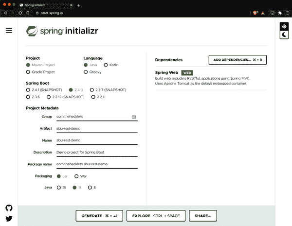
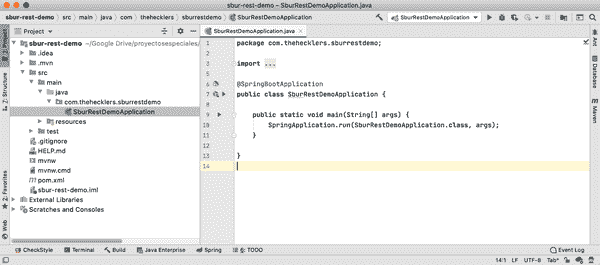
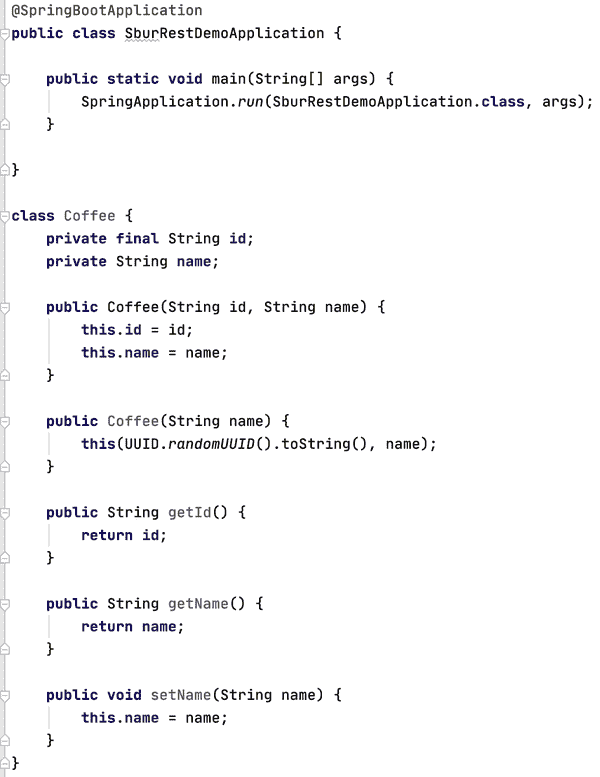
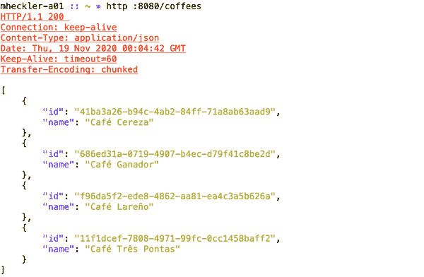
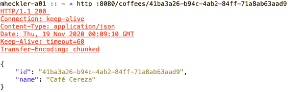
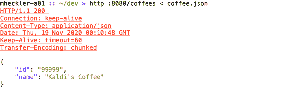
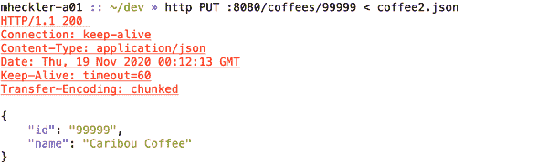
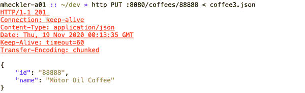
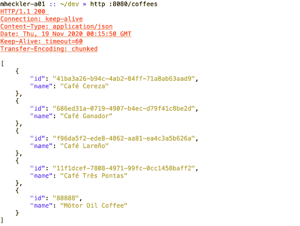

# 第三章：创建您的第一个 Spring Boot REST API

在本章中，我将解释并演示如何使用 Spring Boot 开发一个基本的工作应用程序。由于大多数应用程序涉及将后端云资源暴露给用户，通常通过前端 UI，因此应用程序编程接口（API）是理解和实践的绝佳起点。让我们开始吧。

# API 的作用与原因

能够做所有事情的单体应用程序的时代已经结束了。

这并不意味着单体应用程序不再存在，或者它们不会继续存在很长时间。在各种情况下，一个将众多功能打包到一个包中的单体应用程序仍然是有意义的，尤其是在以下环境中：

+   领域及其边界在很大程度上是未知的。

+   提供的功能是紧密耦合的，模块交互的绝对性能优先于灵活性。

+   所有相关能力的扩展要求是已知的和一致的。

+   功能不是易变的；变化是缓慢的，范围有限，或者两者兼有。

对于其他一切，都有微服务。

当然，这是一个极度简化的说法，但我认为这是一个有用的总结。通过将功能分成更小、更有凝聚力的“块”，我们可以解耦它们，从而有可能实现更灵活、更强大的系统，这些系统可以更快地部署和更容易地维护。

在任何分布式系统中——毫无疑问，一个由微服务组成的系统就是这样的——通信至关重要。没有服务是孤立的。虽然有许多连接应用程序/微服务的机制，但我们通常通过模拟我们日常生活的基本结构——互联网——来开始我们的旅程。

互联网是为通信而建立的。事实上，其前身的设计者，高级研究计划局网络（ARPANET），预见到了即使在“重大中断”事件发生时也需要保持系统间通信的需求。可以合理地推断，一种类似于我们日常生活中使用的一种 HTTP 方法，同样能够让我们通过“过程”创建、检索、更新和删除各种资源。

尽管我很喜欢历史，但我不会深入研究 REST API 的历史，除了说罗伊·菲尔丁在他 2000 年的博士论文中阐述了它们的原则，该原则是建立在 1994 年的*HTTP 对象模型*之上的。

# REST 是什么，为什么它很重要？

正如前面提到的，API 是我们开发人员用来*编写*以便我们的代码可以使用其他代码的规范/接口：库、其他应用程序或服务。但*REST*在*REST API*中代表什么？

REST 是*表述性状态转移*的首字母缩写，这是一种有点神秘的方式，它表明当一个应用程序与另一个应用程序通信时，应用程序 A 将其当前状态带入，而不是期望应用程序 B 在通信调用之间维护状态——当前和累积的、基于进程的信息。应用程序 A 在每个对应用程序 B 的请求中提供其相关状态的表示。您可以很容易地看出，这为应用程序的生存能力和弹性增加了，因为如果存在通信问题或者应用程序 B 崩溃并重新启动，它不会丢失与应用程序 A 的交互的当前状态；应用程序 A 可以简单地重新发出请求并继续两个应用程序之间停下的地方。

###### 注意

这个通用概念通常被称为*无状态*应用/服务，因为每个服务在一系列交互中都保持自己的当前状态，而不期望其他服务代表其执行这种操作。

# 您的 API，HTTP 动词风格

现在，关于那个 REST API——有时称为 RESTful API，这是一种很好、令人放松的方式，不是吗？

在一些互联网工程任务组（IETF）的请求评论（RFCs）中定义了许多标准化的 HTTP 动词。其中，少数几个通常被一致地用于构建 API，还有几个偶尔会被使用。REST API 主要建立在以下 HTTP 动词之上：

+   `POST`

+   `GET`

+   `PUT`

+   `PATCH`

+   `DELETE`

这些动词对应我们在资源上执行的典型操作：创建（`POST`）、读取（`GET`）、更新（`PUT`和`PATCH`）和删除（`DELETE`）。

###### 注意

我承认通过将`PUT`大致等同于更新资源，稍微模糊了界限，并且通过将`POST`等同于创建资源的方式稍微减少了一些。我请求读者在我实施并提供澄清的过程中给予理解。

偶尔会使用以下两个动词：

+   `OPTIONS`

+   `HEAD`

这些可以用来获取请求/响应对可用的通信选项（`OPTIONS`）以及获取响应头部分的响应，不包括其主体（`HEAD`）。

对于本书以及大多数实际生产中的使用，我将专注于第一组，即大量使用的组。为了开始（没有双关意味），让我们创建一个实现非常基本的 REST API 的简单微服务。

## 回到 Initializr

我们像往常一样从 Spring Initializr 开始，如图 3-1 所示。我已经更改了 Group 和 Artifact 字段以反映我使用的详细信息（请随意使用您喜欢的命名方式），在选项（可选的，任何列出的版本都可以很好地完成）下选择了 Java 11，并且仅选择了 Spring Web 依赖项。正如显示的描述中所示，此依赖项带有多种功能，包括“[构建]使用 Spring MVC 构建 Web，*包括 RESTful*应用程序”（强调添加）。这正是我们当前任务所需的。



###### 图 3-1\. 创建一个 Spring Boot 项目以构建 REST API

一旦我们在 Initializr 中生成了项目并将结果*.zip*文件保存在本地，我们将提取压缩的项目文件——通常通过双击在文件浏览器中下载的*sbur-rest-demo.zip*文件或通过从 shell/终端窗口使用*unzip*——然后在您选择的 IDE 或文本编辑器中打开现在已提取的项目，以查看类似于图 3-2 的视图。



###### 图 3-2\. 我们的新 Spring Boot 项目，正等待我们开始

## 创建一个简单的领域

为了*处理*资源，我们需要编写一些代码来*适应*一些资源。让我们首先创建一个非常简单的领域类，表示我们想要管理的资源。

我有点咖啡爱好者，正如我的好朋友们——现在包括你——所知道的。考虑到这一点，我将使用一个咖啡领域，其中一个类代表一种特定类型的咖啡，作为本例的领域。

让我们开始创建`Coffee`类。这对例子至关重要，因为我们需要一个某种资源来演示如何通过 REST API 管理资源。但领域的简单或复杂对于本例来说不重要，所以我会保持简单，专注于目标：最终的 REST API。

如图 3-3 所示，`Coffee`类有两个成员变量：

+   一个`id`字段用于唯一标识特定类型的咖啡

+   一个`name`字段，描述咖啡的名称



###### 图 3-3\. 咖啡类：我们的领域类

我将`id`字段声明为`final`，这样它只能被分配一次且不能修改；因此，在创建`Coffee`类的实例时必须分配它，这也意味着它没有修改器方法。

我创建了两个构造函数：一个接受两个参数，另一个在创建`Coffee`时如果没有提供唯一标识符则提供一个。

接下来，我创建了访问器和修改器方法——或者您更愿意称之为获取器和设置器方法——用于`name`字段，该字段未声明为`final`，因此可变。这是一个有争议的设计决策，但对于本例子的即将到来的需求非常合适。

有了这个，我们现在有了一个基本的领域。接下来是 REST 的时候了。

# 进行 GET 请求

或许最常用的最常用的动词是`GET`。所以让我们*开始*吧（双关语）。

## @RestController 简介

不要陷得太深，Spring MVC（模型-视图-控制器）的创建是为了在数据、其传递和呈现之间分离关注点，假设视图将作为服务器呈现的网页提供。`@Controller`注解帮助将各个部分联系在一起。

`@Controller`是`@Component`注释的一种别名，这意味着在应用启动时，Spring Bean——由 Spring 控制反转（IoC）容器在应用程序中创建和管理的对象——从该类中创建。带有`@Controller`注释的类可以容纳一个`Model`对象，以向表示层提供基于模型的数据，并使用`ViewResolver`来指示应用程序显示特定视图，由视图技术渲染。

###### 注意

Spring 支持多种视图技术和模板引擎，这些将在后续章节中介绍。

还可以指示`Controller`类通过将`@ResponseBody`注释添加到类或方法（默认为 JSON）来返回格式化的响应。这将导致方法的对象/可迭代返回值成为 web 请求响应的*整个主体*，而不是作为`Model`的一部分返回。

`@RestController`注释是一个方便的标注，将`@Controller`与`@ResponseBody`结合成一个描述性注释，简化您的代码并使意图更加明显。一旦我们将类标记为`@RestController`，我们就可以开始创建我们的 REST API。

### 让我们`GET`忙碌起来

REST API 处理对象，对象可以单独出现，也可以作为一组相关对象出现。为了利用我们的咖啡场景，您可能希望检索特定的咖啡；或者您可能希望检索所有咖啡，或者所有被视为深烘焙的咖啡，或者在描述中包含“哥伦比亚”等。为了满足检索一个实例或多个实例的需求，在我们的代码中创建多个方法是一个良好的做法。

我将首先创建一个`Coffee`对象列表，以支持方法返回多个`Coffee`对象，如以下基本类定义所示。我将定义变量，用于保存这组咖啡，作为`Coffee`对象列表。我选择`List`作为成员变量类型的高级接口，但实际上将在`RestApiDemoController`类中分配一个空的`ArrayList`以供使用：

```java
@RestController
class RestApiDemoController {
	private List<Coffee> coffees = new ArrayList<>();
}
```

###### 注意

接受以最高级别类型（类、接口）作为可以清洁地满足内部和外部 API 的实践是一种推荐做法。这些可能在所有情况下都不匹配，正如这里不匹配。在内部，`List`提供了使我能够基于我的标准创建最清晰实现的 API 级别；在外部，我们可以定义一个更高级别的抽象，我很快会演示。

始终有一些数据可以检索，以确认一切是否按预期工作。在以下代码中，我为`RestApiDemoController`类创建一个构造函数，并添加代码以在对象创建时填充咖啡列表：

```java
@RestController
class RestApiDemoController {
	private List<Coffee> coffees = new ArrayList<>();

	public RestApiDemoController() {
		coffees.addAll(List.of(
				new Coffee("Café Cereza"),
				new Coffee("Café Ganador"),
				new Coffee("Café Lareño"),
				new Coffee("Café Três Pontas")
		));
	}
}
```

如下代码所示，我在`RestApiDemoController`类中创建了一个方法，该方法返回一个由我们的成员变量`coffees`表示的可迭代咖啡组。我选择使用`Iterable<Coffee>`，因为任何可迭代类型都能满足此 API 所需的功能：

使用 `@RequestMapping` 获取咖啡列表的`GET`

```java
@RestController
class RestApiDemoController {
	private List<Coffee> coffees = new ArrayList<>();

	public RestApiDemoController() {
		coffees.addAll(List.of(
				new Coffee("Café Cereza"),
				new Coffee("Café Ganador"),
				new Coffee("Café Lareño"),
				new Coffee("Café Três Pontas")
		));
	}

	@RequestMapping(value = "/coffees", method = RequestMethod.GET)
	Iterable<Coffee> getCoffees() {
		return coffees;
	}
}
```

对于 `@RequestMapping` 注解，我添加了路径规范为 `/coffees`，方法类型为 `RequestMethod.GET`，表示该方法将响应路径为 `/coffees` 的请求，并且限制请求仅为 `HTTP GET` 请求。数据的检索由该方法处理，但不处理任何更新。Spring Boot 通过包含在 Spring Web 中的 Jackson 依赖自动执行对象到 JSON 或其他格式的编组和解组操作。

我们可以进一步简化使用另一个便利的注解。使用 `@GetMapping` 整合指令以仅允许 `GET` 请求，减少样板代码，只需指定路径，甚至省略 `path =`，因为不需要参数解决冲突。下面的代码清楚地展示了此注解替换带来的可读性好处：

```java
@GetMapping("/coffees")
Iterable<Coffee> getCoffees() {
    return coffees;
}
```

## 进行`POST`

创建资源时，首选的方法是使用 `HTTP POST` 方法。

###### 注意

`POST` 提供资源的详细信息，通常以 JSON 格式，请求目标服务在指定的 URI 下创建该资源。

如下代码片段所示，`POST` 是一个相对简单的操作：我们的服务接收指定的咖啡详情作为 `Coffee` 对象（得益于 Spring Boot 的自动编组），并将其添加到我们的咖啡列表中。然后返回请求的应用程序或服务的 `Coffee` 对象（默认情况下由 Spring Boot 自动解组为 JSON）：

```java
@PostMapping("/coffees")
Coffee postCoffee(@RequestBody Coffee coffee) {
    coffees.add(coffee);
    return coffee;
}
```

## `PUT` 操作

一般来说，`PUT` 请求用于更新已知 URI 的现有资源。

###### 注意

根据 IETF 的文档《[超文本传输协议（HTTP/1.1）：语义和内容](https://tools.ietf.org/html/rfc7231)》，`PUT` 请求应更新指定的资源（如果存在）；如果资源不存在，则应创建它。

下面的代码符合规范：搜索具有指定标识符的咖啡，如果找到，则更新它。如果列表中没有这样的咖啡，则创建它：

```java
@PutMapping("/coffees/{id}")
Coffee putCoffee(@PathVariable String id, @RequestBody Coffee coffee) {
    int coffeeIndex = -1;

    for (Coffee c: coffees) {
        if (c.getId().equals(id)) {
            coffeeIndex = coffees.indexOf(c);
            coffees.set(coffeeIndex, coffee);
        }
    }

    return (coffeeIndex == -1) ? postCoffee(coffee) : coffee;
}
```

## `DELETE` 操作

要删除资源，我们使用 `HTTP DELETE` 请求。如下代码片段所示，我们创建了一个方法，接受咖啡标识符作为 `@PathVariable` 并使用 `removeIf` `Collection` 方法从我们的列表中删除适用的咖啡。`removeIf` 接受一个 `Predicate`，意味着我们可以提供一个 lambda 表达式来评估是否返回要删除的目标咖啡的布尔值。整洁而简便：

```java
@DeleteMapping("/coffees/{id}")
void deleteCoffee(@PathVariable String id) {
    coffees.removeIf(c -> c.getId().equals(id));
}
```

## 等等

虽然这个场景有许多改进的地方，但我将重点放在两个特定的方面上：减少重复和根据规范返回必要的 HTTP 状态码。

为了减少代码中的重复，我将在 `RestApiDemoController` 类中将通用于该类内所有方法的 URI 映射部分提升到类级别的 `@RequestMapping` 注解中，即 `"/coffees"`。然后，我们可以从每个方法的映射 URI 规范中删除相同的 URI 部分，减少文本噪音，如下面的代码所示：

```java
@RestController
@RequestMapping("/coffees")
class RestApiDemoController {
	private List<Coffee> coffees = new ArrayList<>();

	public RestApiDemoController() {
		coffees.addAll(List.of(
				new Coffee("Café Cereza"),
				new Coffee("Café Ganador"),
				new Coffee("Café Lareño"),
				new Coffee("Café Três Pontas")
		));
	}

	@GetMapping
	Iterable<Coffee> getCoffees() {
		return coffees;
	}

	@GetMapping("/{id}")
	Optional<Coffee> getCoffeeById(@PathVariable String id) {
		for (Coffee c: coffees) {
			if (c.getId().equals(id)) {
				return Optional.of(c);
			}
		}

		return Optional.empty();
	}

	@PostMapping
	Coffee postCoffee(@RequestBody Coffee coffee) {
		coffees.add(coffee);
		return coffee;
	}

	@PutMapping("/{id}")
	Coffee putCoffee(@PathVariable String id, @RequestBody Coffee coffee) {
		int coffeeIndex = -1;

		for (Coffee c: coffees) {
			if (c.getId().equals(id)) {
				coffeeIndex = coffees.indexOf(c);
				coffees.set(coffeeIndex, coffee);
			}
		}

		return (coffeeIndex == -1) ? postCoffee(coffee) : coffee;
	}

	@DeleteMapping("/{id}")
	void deleteCoffee(@PathVariable String id) {
		coffees.removeIf(c -> c.getId().equals(id));
	}
}
```

接下来，我查阅了早前提到的 IETF 文档，并注意到虽然 `GET` 方法未指定 HTTP 状态码，但建议 `POST` 和 `DELETE` 方法，但要求 `PUT` 方法响应状态码。为了实现这一点，我修改了 `putCoffee` 方法，如下面的代码段所示。现在，`putCoffee` 方法将不仅返回更新或创建的 `Coffee` 对象，还将返回一个包含该 `Coffee` 和适当 HTTP 状态码的 `ResponseEntity`：如果 `PUT` 的咖啡尚不存在，则返回 201（已创建），如果存在并已更新，则返回 2000（成功）。当然，我们还可以做更多，但当前应用程序代码满足要求，并表示简单且清晰的内部和外部 API：

```java
@PutMapping("/{id}")
ResponseEntity<Coffee> putCoffee(@PathVariable String id,
        @RequestBody Coffee coffee) {
    int coffeeIndex = -1;

    for (Coffee c: coffees) {
        if (c.getId().equals(id)) {
            coffeeIndex = coffees.indexOf(c);
            coffees.set(coffeeIndex, coffee);
        }
    }

    return (coffeeIndex == -1) ?
            new ResponseEntity<>(postCoffee(coffee), HttpStatus.CREATED) :
            new ResponseEntity<>(coffee, HttpStatus.OK);
}
```

# 信任，但要验证

代码已经就绪，让我们来测试这个 API。

###### 注意

我使用 [HTTPie](https://httpie.org) 命令行 HTTP 客户端处理几乎所有基于 HTTP 的任务。偶尔也会使用 [curl](https://curl.haxx.se) 或 [Postman](https://www.postman.com)，但我发现 HTTPie 是一个功能强大且具有简洁命令行界面的多用途客户端。

如 图 3-4 所示，我查询 *coffees* 端点以获取当前列表中的所有咖啡。如果没有提供主机名，HTTPie 默认为 `GET` 请求并假定 *localhost*，减少了不必要的输入。正如预期的那样，我们看到了我们预填充列表中的所有四种咖啡。



###### 图   图 3-4\. 获取所有咖啡

接下来，我复制了列表中一种咖啡的 `id` 字段，并将其粘贴到另一个 `GET` 请求中。图 3-5 显示了正确的响应。



###### 图 3-5\. 获取一种咖啡

使用 HTTPie 执行 `POST` 请求非常简单：只需将包含 `id` 和 `name` 字段的 JSON 表示形式的纯文本文件传输，HTTPie 将会执行 `POST` 操作。图 3-6 显示了命令及其成功的结果。



###### 图 3-6\. 向列表中添加新咖啡的 `POST` 操作

正如前面提到的，`PUT` 命令应允许更新现有资源或在请求的资源不存在时添加新资源。在 图 3-7 中，我指定了我刚添加的咖啡的 `id` 并向命令传递了另一个具有不同名称的 JSON 对象。结果是，具有 `id` “99999”的咖啡现在的 `name` 是 “Caribou Coffee”，而不是之前的 “Kaldi’s Coffee”。返回码也符合预期，为 200（OK）。



###### 图 3-7\. `PUT` 更新现有咖啡

在 图 3-8 中，我以相同方式发起了 `PUT` 请求，但引用了 URI 中不存在的 `id`。应用程序遵循 IETF 指定的行为添加了它，并正确返回了 HTTP 状态码 201（Created）。



###### 图 3-8\. `PUT` 添加新咖啡

使用 HTTPie 创建 `DELETE` 请求与创建 `PUT` 请求非常相似：必须指定 HTTP 动词，并且资源的 URI 必须完整。 图 3-9 显示了结果：HTTP 状态码为 200（OK），表明资源已成功删除，并且没有显示值，因为资源已不存在。


###### 图 3-9\. 删除咖啡

最后，我们重新查询我们的咖啡全列表以确认预期的最终状态。如 图 3-10 所示，我们现在有了一个之前列表中没有的额外咖啡：Mötor Oil Coffee。API 验证成功。



###### 图 3-10\. 获取当前列表中的所有咖啡

# 摘要

本章演示了如何使用 Spring Boot 开发基本的工作应用程序。由于大多数应用程序涉及将后端云资源暴露给用户，通常通过前端用户界面，我展示了如何创建和发展一个有用的 REST API，可以以多种一致的方式消费，以提供创建、读取、更新和删除几乎每个关键系统中心资源所需的功能。

我检查并解释了 `@RequestMapping` 注解及其各种便捷注解特化，这些特化与定义的 HTTP 动词相一致：

+   `@GetMapping`

+   `@PostMapping`

+   `@PutMapping`

+   `@PatchMapping`

+   `@DeleteMapping`

创建了处理许多这些注释及其关联操作的方法后，我稍微重构了代码以简化它，并在需要时提供了 HTTP 响应代码。验证 API 确认其正确操作。

在下一章中，我将讨论并演示如何将数据库访问添加到我们的 Spring Boot 应用程序中，使其变得更加实用并且为生产准备好。
