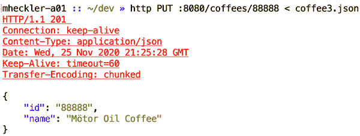

# 第四章：将数据库访问添加到您的 Spring Boot 应用程序

正如前一章所讨论的，出于许多非常好的原因，应用程序通常会暴露无状态的 API。然而，在幕后，很少有有用的应用程序是完全短暂的；某种状态通常是为了*某事*而存储的。例如，每次对在线商店购物车的请求可能都会包含其状态，但一旦下订单，订单的数据就会被保留。有许多方法可以做到这一点，以及共享或路由这些数据的方法，但几乎所有足够大的系统中都会涉及一种或多种数据库。

在本章中，我将演示如何将数据库访问添加到前一章中创建的 Spring Boot 应用程序中。本章旨在简要介绍 Spring Boot 的数据功能，并且后续章节将深入探讨。但在许多情况下，这里介绍的基础仍然适用并提供完全足够的解决方案。让我们深入了解吧。

# 代码检查

请从代码仓库的分支*chapter4begin*检出以开始。

# 为数据库访问设置自动配置

如前所示，Spring Boot 旨在尽可能简化所谓的 80–90% 使用案例：开发人员一遍又一遍地执行的代码和过程模式。一旦识别出模式，Boot 会自动初始化所需的 Bean，使用合理的默认配置。定制一个能力就像提供一个或多个属性值或创建一个定制版本的一个或多个 Bean 一样简单；一旦自动配置检测到变化，它就会退出并遵循开发人员的指导。数据库访问就是一个完美的例子。

# 我们希望获得什么？

在我们之前的示例应用程序中，我使用了一个`ArrayList`来存储和维护我们的咖啡列表。这种方法对于单个应用程序来说足够简单，但它确实有其缺点。

首先，它根本不具备弹性。如果您的应用程序或运行该应用程序的平台失败，所有在应用程序运行期间对列表所做的更改——不论持续了几秒钟还是几个月——都会消失。

其次，它不具备可伸缩性。启动应用程序的另一个实例会导致第二个（或后续）应用实例具有其自己独特的咖啡列表。数据不会在多个实例之间共享，因此一个实例对咖啡所做的更改——添加新的咖啡、删除、更新——对于访问不同应用实例的任何人都是不可见的。

显然这不是运行铁路的方式。

我将在接下来的章节中探讨几种不同的方法来完全解决这些非常现实的问题。但现在，让我们奠定一些基础，这些步骤将在未来的道路上非常有用。

## 添加数据库依赖

要从您的 Spring Boot 应用程序访问数据库，您需要一些东西：

+   运行中的数据库，无论是由您的应用程序启动/嵌入，还是仅对您的应用程序可访问

+   数据库驱动程序启用程序化访问，通常由数据库供应商提供。

+   一个用于访问目标数据库的 Spring Data 模块

某些 Spring Data 模块将适当的数据库驱动程序作为 Spring Initializr 内的单个可选择依赖项包括在内。在其他情况下，例如当 Spring 使用 Java 持久化 API（JPA）访问符合 JPA 的数据存储时，需要选择 Spring Data JPA 依赖项*和*目标数据库的特定驱动程序依赖项，例如 PostgreSQL。

为了从内存构造迈出第一步到持久性数据库，我将从向我们项目的构建文件中添加依赖项和因此的功能开始。

H2 是一个完全用 Java 编写的快速数据库，具有一些有趣且有用的特性。首先，它符合 JPA 标准，因此我们可以像连接任何其他 JPA 数据库（如 Microsoft SQL、MySQL、Oracle 或 PostgreSQL）一样连接我们的应用程序到它上面。它还具有内存和基于磁盘的模式。这使得在我们从内存中的`ArrayList`转换到内存数据库之后，我们可以选择一些有用的选项：要么将 H2 更改为基于磁盘的持久化，要么（因为我们现在使用的是 JPA 数据库）切换到另一个 JPA 数据库。在那一点上，任何选项都变得简单得多。

为了使我们的应用程序能够与 H2 数据库交互，我将在我们项目的*pom.xml*的`<dependencies>`部分添加以下两个依赖项：

```java
<dependency>
    <groupId>org.springframework.boot</groupId>
    <artifactId>spring-boot-starter-data-jpa</artifactId>
</dependency>
<dependency>
    <groupId>com.h2database</groupId>
    <artifactId>h2</artifactId>
    <scope>runtime</scope>
</dependency>
```

###### 注意

H2 数据库驱动程序依赖项的`runtime`范围表示它将出现在运行时和测试类路径中，但不会出现在编译类路径中。这是对于不需要编译的库采用的良好做法。

一旦保存了更新的*pom.xml*文件并且（如果必要的话）重新导入/刷新了 Maven 依赖项，您就可以访问所添加依赖项中包含的功能。接下来，是时候写一些代码来使用它了。

## 添加代码

由于我们已经有了一些管理咖啡的代码，我们需要在添加新的数据库功能时进行一些重构。我发现最好的开始地方是领域类（们），在这种情况下是`Coffee`。

### @Entity

如前所述，H2 是一个符合 JPA 标准的数据库，因此我将添加 JPA 注解来连接这些点。对于`Coffee`类本身，我将添加来自`javax.persistence`的`@Entity`注解，表示`Coffee`是一个可持久化的实体，并且对现有的`id`成员变量，我将添加`@Id`注解（也来自`javax.persistence`）来标记它作为数据库表的 ID 字段。

###### 注意

如果类名——在本例中是`Coffee`——不与期望的数据库表名匹配，`@Entity`注解接受一个`name`参数来指定匹配带注解实体的数据表名。

如果你的集成开发环境足够智能，它可能会提示你在`Coffee`类中仍然缺少某些内容。例如，IntelliJ 会用红色下划线标出类名，并在鼠标悬停时显示有用的弹出窗口，如图 4-1 所示。


###### Figure 4-1\. JPA `Coffee`类中缺少的构造函数

Java 持久化 API 要求在从数据库表行创建对象时使用无参数构造函数，因此接下来我将添加这个构造函数。这导致我们的 IDE 显示下一个警告，如图 4-2 所示：为了有一个无参数构造函数，我们必须使所有成员变量可变，即非 final。


###### Figure 4-2\. 有了无参数构造函数，`id`不能是 final

从声明`id`成员变量中删除`final`关键字解决了这个问题。为了使`id`可变，我们的`Coffee`类还需要为`id`添加一个 mutator 方法，以便 JPA 能够为该成员变量分配一个值，因此我也添加了`setId()`方法，如图 4-3 所示。


###### Figure 4-3\. 新的`setId()`方法

### 仓库（Repository）

现在将`Coffee`定义为有效的 JPA 实体，可以进行存储和检索，是时候与数据库建立连接了。

对于一个如此简单的概念，在 Java 生态系统中配置和建立数据库连接长期以来一直是一件相当繁琐的事情。正如在第一章中提到的，使用应用服务器托管 Java 应用程序需要开发人员执行多个繁琐的步骤才能做好准备工作。一旦开始与数据库交互，或者如果直接从 Java 实用程序或客户端应用程序访问数据存储，则需要执行涉及`PersistenceUnit`、`EntityManagerFactory`和`EntityManager` API（以及可能的`DataSource`对象）、打开和关闭数据库等额外步骤。对于开发人员如此频繁地进行的操作来说，这些仪式感很多。

Spring Data 引入了仓库（repositories）的概念。`Repository`是 Spring Data 中定义的一个接口，作为对各种数据库的有用抽象。Spring Data 中还有其他访问数据库的机制，将在后续章节中详细解释，但各种类型的`Repository`可以说是最常用的。

`Repository`本身只是以下类型的一个占位符：

+   存储在数据库中的对象

+   对象的唯一 ID/主键字段

当然，关于仓库还有很多内容，这些内容我会在第六章中详细介绍。现在，让我们专注于当前示例中直接相关的两个：`CrudRepository`和`JpaRepository`。

还记得我之前提到的使用最高级别接口来编写代码的首选实践吗？虽然`JpaRepository`扩展了几个接口，并因此包含了更广泛的功能，但`CrudRepository`涵盖了所有关键的 CRUD 功能，对于我们（到目前为止）简单的应用程序已经足够了。

为了启用我们应用程序的仓库支持，首先需要通过扩展 Spring Data 的`Repository`接口来定义一个特定于我们应用程序的接口：`.interfaceCoffeeRepo`

```java
interface CoffeeRepository extends CrudRepository<Coffee, String> {}
```

###### 注意

定义的两种类型是存储对象类型及其唯一 ID 的类型。

这代表了在 Spring Boot 应用程序中创建仓库的最简表达方式。在某些情况下，定义仓库的查询是可能的，也是非常有用的；在未来的章节中我将深入讨论。但这里有一个“神奇”的部分：Spring Boot 的自动配置考虑了类路径上的数据库驱动（在本例中是 H2）、我们应用程序中定义的仓库接口，以及 JPA 实体`Coffee`类定义，并为我们创建了一个数据库代理 bean *on our behalf*。当模式如此明确和一致时，无需为每个应用程序编写几乎相同的样板代码，这使开发人员能够专注于新的、被请求的功能。

### 实用程序，即“Springing”进入行动

现在是时候让那个仓库投入运行了。我会像前几章一样，分步骤地介绍功能，先引入功能，然后再进行完善。

首先，我将仓库 bean 自动装配/注入到`RestApiDemoController`中，以便控制器可以在通过外部 API 接收请求时访问它，如图 4-4 所示。

首先，我声明了成员变量：

```java
private final CoffeeRepository coffeeRepository;
```

接下来，我通过以下方式将其作为构造函数的参数添加：

```java
public RestApiDemoController(CoffeeRepository coffeeRepository){}
```

###### 注意

在 Spring Framework 4.3 之前，必须在所有情况下在方法上方添加`@Autowired`注解，以指示参数表示 Spring bean 应自动装配/注入。从 4.3 开始，具有单个构造函数的类不需要为自动装配的参数添加注解，这是一个有用的时间节省功能。


###### 图 4-4\. 将仓库自动装配到`RestApiDemoController`

当仓库设置完成后，我删除了`List<Coffee>`成员变量，并在构造函数中将该列表的初始填充更改为将相同的咖啡保存到仓库中，如图 4-4 中所示。

根据图 4-5，立即删除`coffees`变量会立即标记所有对它的引用为不可解析的符号，因此下一个任务是用适当的仓库交互替换这些引用。


###### 图 4-5\. 替换已移除的`coffees`成员变量

作为没有参数的简单检索所有咖啡的方法，`getCoffees()`方法是一个很好的起点。使用内置在`CrudRepository`中的`findAll()`方法，甚至不需要更改`getCoffees()`的返回类型，因为它还返回一个`Iterable`类型；只需调用`coffeeRepository.findAll()`并返回其结果即可完成任务，如下所示：

```java
@GetMapping
Iterable<Coffee> getCoffees() {
    return coffeeRepository.findAll();
}
```

重构`getCoffeeById()`方法为我们的代码带来了一些洞见，感谢存储库为混合带来的功能。我们不再需要手动搜索匹配的`id`咖啡列表了；`CrudRepository`的`findById()`方法为我们处理了，如下代码片段所示。由于`findById()`返回一个`Optional`类型，因此我们的方法签名不需要任何更改：

```java
@GetMapping("/{id}")
Optional<Coffee> getCoffeeById(@PathVariable String id) {
    return coffeeRepository.findById(id);
}
```

将`postCoffee()`方法转换为使用存储库也是一个相当简单的尝试，如下所示：

```java
@PostMapping
Coffee postCoffee(@RequestBody Coffee coffee) {
    return coffeeRepository.save(coffee);
}
```

使用`putCoffee()`方法，我们再次看到了`CrudRepository`所展示的大量节省时间和代码的功能。我使用内置的`existsById()`存储库方法来确定这是新的还是现有的`Coffee`，并返回适当的 HTTP 状态代码以及保存的`Coffee`，如此清单所示：

```java
@PutMapping("/{id}")
ResponseEntity<Coffee> putCoffee(@PathVariable String id,
                                 @RequestBody Coffee coffee) {

    return (!coffeeRepository.existsById(id))
            ? new ResponseEntity<>(coffeeRepository.save(coffee),
                  HttpStatus.CREATED)
            : new ResponseEntity<>(coffeeRepository.save(coffee), HttpStatus.OK);
}
```

最后，我更新了`deleteCoffee()`方法以使用`CrudRepository`内置的`deleteById()`方法，如下所示：

```java
@DeleteMapping("/{id}")
void deleteCoffee(@PathVariable String id) {
    coffeeRepository.deleteById(id);
}
```

利用使用`CrudRepository`的流畅 API 创建的存储库 bean 简化了`RestApiDemoController`的代码，并使其更加清晰，无论是从可读性还是可理解性方面，都能清晰表达，如完整代码清单所示：

```java
@RestController
@RequestMapping("/coffees")
class RestApiDemoController {
    private final CoffeeRepository coffeeRepository;

    public RestApiDemoController(CoffeeRepository coffeeRepository) {
        this.coffeeRepository = coffeeRepository;

        this.coffeeRepository.saveAll(List.of(
                new Coffee("Café Cereza"),
                new Coffee("Café Ganador"),
                new Coffee("Café Lareño"),
                new Coffee("Café Três Pontas")
        ));
    }

    @GetMapping
    Iterable<Coffee> getCoffees() {
        return coffeeRepository.findAll();
    }

    @GetMapping("/{id}")
    Optional<Coffee> getCoffeeById(@PathVariable String id) {
        return coffeeRepository.findById(id);
    }

    @PostMapping
    Coffee postCoffee(@RequestBody Coffee coffee) {
        return coffeeRepository.save(coffee);
    }

    @PutMapping("/{id}")
    ResponseEntity<Coffee> putCoffee(@PathVariable String id,
                                     @RequestBody Coffee coffee) {

        return (!coffeeRepository.existsById(id))
                ? new ResponseEntity<>(coffeeRepository.save(coffee),
                HttpStatus.CREATED)
                : new ResponseEntity<>(coffeeRepository.save(coffee), HttpStatus.OK);
    }

    @DeleteMapping("/{id}")
    void deleteCoffee(@PathVariable String id) {
        coffeeRepository.deleteById(id);
    }
}
```

现在，唯一剩下的就是验证我们的应用程序按预期工作并且外部功能保持不变。

###### 注意

测试功能的另一种方法——也是推荐的实践方法——是首先创建单元测试，类似于测试驱动开发（TDD）。我强烈推荐这种方法在真实的软件开发环境中，但我发现当目标是演示和解释离散的软件开发概念时，越少越好；尽可能少地显示以清晰传达关键概念会增加信号，减少噪音，即使噪音后来也很有用。因此，我在本书的后面的一个专门章节中介绍了测试。

# 保存和检索数据

再次进入领域，亲爱的朋友们，再次：使用 HTTPie 从命令行访问 API。查询*咖啡*端点会从我们的 H2 数据库中返回与之前相同的四种咖啡，如图 4-6 所示。

复制刚列出的其中一种咖啡的`id`字段，并将其粘贴到特定于咖啡的`GET`请求中，将产生如图 4-7 所示的输出。


###### 图 4-6\. 获得所有咖啡


###### 图 4-7\. 获得一杯咖啡

在图 4-8 中，我向应用程序和其数据库`POST`了一个新的咖啡。


###### 图 4-8。向列表中`POST`一个新的咖啡

如前一章所讨论的，`PUT`命令应允许更新现有资源或如果请求的资源尚不存在则添加一个新的资源。在图 4-9 中，我指定了刚刚添加的咖啡的`id`，并传递给命令一个修改该咖啡名称的 JSON 对象。更新后，`id`为“99999”的咖啡现在的`name`是“Caribou Coffee”，而不是“Kaldi's Coffee”，返回码是 200（OK），如预期的那样。


###### 图 4-9。对现有咖啡进行`PUT`更新

接下来我发起了类似的`PUT`请求，但在 URI 中指定了一个不存在的`id`。应用程序根据 IETF 指定的行为向数据库添加了一个新的咖啡，并正确返回了 HTTP 状态码 201（已创建），如图 4-10 所示。



###### 图 4-10。`PUT`一个新的咖啡

最后，我通过发出`DELETE`请求来测试删除指定的咖啡，该请求仅返回 HTTP 状态码 200（OK），表示资源已成功删除，因为资源不再存在，根据图 4-11。为了检查我们的最终状态，我们再次查询所有咖啡的完整列表（参见图 4-12）。


###### 图 4-11。`DELETE`一个咖啡


###### 图 4-12。现在在列表中`GET`所有的咖啡

与以往一样，我们现在有一个额外的咖啡，最初不在我们的存储库中：Mötor Oil Coffee。

# 一点打磨

像往常一样，有许多地方可以从额外的关注中受益，但我将专注于两个方面：将示例数据的初始填充提取到单独的组件中，并进行一些条件重排序以提高清晰度。

上一章我在`RestApiDemoController`类中填充了咖啡列表的一些初始值，因此在将其转换为具有存储库访问权限的数据库后，在本章中我保持了同样的结构。更好的做法是将该功能提取到一个可以快速轻松启用或禁用的单独组件中。

有许多方法可以在应用程序启动时自动执行代码，包括使用`CommandLineRunner`或`ApplicationRunner`并指定 lambda 来实现所需的目标：在这种情况下，创建和保存示例数据。但我更喜欢使用`@Component`类和`@PostConstruct`方法来实现相同的功能，原因如下：

+   当`CommandLineRunner`和`ApplicationRunner`生成 bean 方法自动装配一个存储库 bean 时，测试单元会打破在测试中（通常情况下是这样）模拟存储库 bean。

+   如果您在测试中模拟存储库 bean 或希望在不创建示例数据的情况下运行应用程序，只需注释掉其 `@Component` 注解即可禁用实际数据填充 bean，这样做快捷而简单。

我建议创建一个类似于下面代码块中展示的 `DataLoader` 类。将创建示例数据的逻辑提取到 `DataLoader` 类的 `loadData()` 方法中，并用 `@PostContruct` 注解进行标注，将 `RestApiDemoController` 恢复到其既定的单一目的，即提供外部 API，并使 `DataLoader` 负责其既定（和显而易见的）目的：

```java
@Component
class DataLoader {
    private final CoffeeRepository coffeeRepository;

    public DataLoader(CoffeeRepository coffeeRepository) {
        this.coffeeRepository = coffeeRepository;
    }

    @PostConstruct
    private void loadData() {
        coffeeRepository.saveAll(List.of(
                new Coffee("Café Cereza"),
                new Coffee("Café Ganador"),
                new Coffee("Café Lareño"),
                new Coffee("Café Três Pontas")
        ));
    }
}
```

另一个润色的一点是在 `putCoffee()` 方法中三元运算符的布尔条件微调。在重构方法以使用存储库后，不再需要评估否定条件。从条件中去除否定（!）操作符略微提升了清晰度；当然，交换三元运算符的真和假值是必需的，以保持原始结果，如以下代码所示：

```java
@PutMapping("/{id}")
ResponseEntity<Coffee> putCoffee(@PathVariable String id,
                                 @RequestBody Coffee coffee) {

    return (coffeeRepository.existsById(id))
            ? new ResponseEntity<>(coffeeRepository.save(coffee),
                HttpStatus.OK)
            : new ResponseEntity<>(coffeeRepository.save(coffee),
                HttpStatus.CREATED);
}
```

# Code Checkout Checkup

要获取完整的章节代码，请从代码仓库的 *chapter4end* 分支检出。

# 摘要

本章展示了如何将数据库访问添加到上一章创建的 Spring Boot 应用程序中。虽然它旨在简明介绍 Spring Boot 的数据功能，但我提供了以下概述：

+   Java 数据库访问

+   Java 持久化 API（JPA）

+   H2 数据库

+   Spring Data JPA

+   Spring Data 存储库

+   通过存储库创建示例数据的机制

后续章节将深入探讨 Spring Boot 数据库访问的更多细节，但本章涵盖的基础已经为构建提供了坚实的基础，在许多情况下，这些基础已经足够。

在下一章中，我将讨论和演示 Spring Boot 提供的有用工具，以便在应用程序不按预期方式运行或需要验证其运行情况时，获取对应用程序的洞察。
