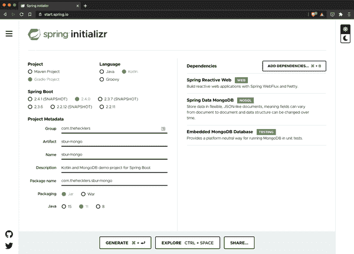

# 第六章。深入数据

数据可能是一个复杂的话题，有很多要考虑的地方：它的结构和与其他数据的关系；处理、存储和检索选项；各种适用的标准；数据库提供者和机制；等等。数据可能是开发者在职业早期接触到的最复杂的开发方面，也是学习新工具链时的一部分。

这通常是这样的原因，因为几乎所有应用程序没有某种形式的数据，几乎都是毫无意义的。几乎没有应用程序能够在不存储、检索或关联数据的情况下提供任何价值。

作为几乎所有应用程序价值基础的一部分，*数据*已经引起了数据库提供商和平台供应商的大量创新。但在许多情况下，复杂性仍然存在：毕竟，这是一个有深度和广度的话题。

进入 Spring Data。Spring Data 的宣言 [使命](https://spring.io/projects/spring-data) 是“为数据访问提供一个熟悉和一致的基于 Spring 的编程模型，同时保留底层数据存储的特殊特性。” 不论数据库引擎或平台如何，Spring Data 的目标是尽可能简化开发者对数据的访问，使其既简单又强大。

本章演示了如何使用各种行业标准和领先的数据库引擎定义数据存储和检索，以及 Spring Data 项目和工具如何通过 Spring Boot 以最简化和强大的方式支持它们的使用。

# 定义实体

几乎在处理数据的每个案例中，都涉及某种形式的领域实体。无论是发票、汽车还是其他任何东西，数据很少被视为一组不相关的属性。不可避免地，我们认为有用的数据是构成有意义整体的一致性元素池。汽车——无论是在数据中还是在现实生活中——只有在作为一个独特的、充分属性的事物时才是一个真正有用的概念。

Spring Data 为 Spring Boot 应用程序提供了多种不同的机制和数据访问选项，涵盖各种抽象级别。无论开发者为任何给定的用例选择了哪个抽象级别，第一步都是定义用于处理适用数据的任何领域类。

虽然本书范围不包括完全探讨领域驱动设计（DDD），我将使用这些概念作为在本书和后续章节中构建的示例应用程序中定义适用领域类的基础。关于 DDD 的全面探讨，我建议读者参考埃里克·埃文斯关于这一主题的开创性工作，《*领域驱动设计：软件核心复杂性应对之道*》(https://oreil.ly/DomainDrivDes)。

简单来说，*领域类*封装了一个具有独立于其他数据的相关性和重要性的主要领域实体。这并不意味着它与其他领域实体无关，只是即使与其他实体无关，它也可以作为一个单元站立并有意义。

要使用 Java 在 Spring 中创建一个领域类，您可以创建一个具有成员变量、适用的构造函数、访问器/修改器以及`equals()`/`hashCode()`/`toString()`方法（以及更多内容）的类。您还可以使用 Java 中的 Lombok 或 Kotlin 中的数据类来创建用于数据表示、存储和检索的领域类。在本章中，我展示了所有这些操作，以演示使用 Spring Boot 和 Spring Data 处理领域时有多么容易。拥有多种选择真是太好了。

在本章的示例中，一旦我定义了一个领域类，我将根据数据使用目标和数据库提供程序的 API 来决定数据库和抽象级别。在 Spring 生态系统中，这通常归结为两种选项之一，具有轻微差异：模板或仓库。

# 模板支持

为了提供一组“刚刚好”的连贯抽象，Spring Data 为其各种数据源定义了一个名为`Operations`的接口。这个`Operations`接口——例如`MongoOperations`、`RedisOperations`和`CassandraOperations`——定义了一组基础操作，可以直接使用以获得最大的灵活性，或者可以构建更高级别的抽象。`Template`类提供了`Operations`接口的直接实现。

可以将模板视为一种服务提供者接口（SPI）——直接可用且功能强大，但每次使用它们完成更常见的开发人员面临的用例时都需要许多重复的步骤。对于那些数据访问遵循常见模式的场景，仓库可能是一个更好的选择。而最好的部分是仓库建立在模板之上，因此通过提升到更高的抽象层次，您不会失去任何东西。

# 仓库支持

Spring Data 从`Repository`接口定义了所有其他类型的 Spring Data 仓库接口派生出来。例如`JPARepository`和`MongoRepository`（分别提供 JPA 特定和 Mongo 特定的功能），以及更通用的接口如`CrudRepository`、`ReactiveCrudRepository`和`PagingAndSortingRepository`。这些不同的仓库接口指定了有用的高级操作，如`findAll()`、`findById()`、`count()`、`delete()`、`deleteAll()`等。

仓库被定义为阻塞和非阻塞交互。此外，Spring Data 的仓库支持使用约定优于配置创建查询，甚至支持直接的查询语句。使用 Spring Boot 与 Spring Data 的仓库使得构建复杂的数据库交互几乎成为一种简单的练习。

我在本书的某个时候展示了所有这些能力。在本章中，我计划通过结合各种实现细节（如 Lombok、Kotlin 等）来覆盖多个数据库选项的关键元素。通过这种方式，我提供了一个广泛且稳定的基础，供后续章节建设使用。

# @Before

尽管我非常喜欢咖啡，并依赖它来推动我的应用程序开发，但为了更好地探索本书其余部分涵盖的概念，我觉得需要一个更多才能的领域。作为软件开发人员和飞行员，我认为航空领域日益复杂和数据驱动的世界提供了许多有趣的场景（和迷人的数据），可以在我们深入探讨 Spring Boot 在多种用例中的便利性时进行探索。

要处理数据，我们必须 *有* 数据。我开发了一个名为 `PlaneFinder` 的小型 Spring Boot RESTful Web 服务（可在本书的代码库中找到），用作我可以轮询的 API 网关，用于服务桌上的小设备范围内的当前飞机和位置的数据。该设备接收来自一定距离内飞机的自动相关监视—广播（ADS-B）数据，并与一个在线服务 [PlaneFinder.net](https://planefinder.net) 共享它们。它还公开了一个 HTTP API，我的网关服务消费它，并简化和向本章中的其他下游服务公开。

更多细节，请先创建一些连接到数据库的服务。

# 使用 Redis 创建基于模板的服务

Redis 是一种数据库，通常用作内存中的数据存储，用于在服务实例之间共享状态，缓存和代理服务之间的消息。就像所有主要数据库一样，Redis 还有其他功能，但本章重点是简单地使用 Redis 存储和检索从 `PlaneFinder` 服务中获取的飞机信息。

## 初始化项目

首先，我们回到 Spring Initializr。从那里，我选择以下选项：

+   Maven 项目

+   Java

+   当前的 Spring Boot 生产版本

+   打包：Jar

+   Java：11

以及依赖关系：

+   Spring Reactive Web（`spring-boot-starter-webflux`）

+   Spring Data Redis（Access+Driver）（`spring-boot-starter-data-redis`）

+   Lombok（`lombok`）

接下来，我生成项目并将其保存到本地，解压并在 IDE 中打开它。

## 开发 Redis 服务

让我们从领域开始。

目前，`PlaneFinder` API 网关公开了一个 REST 端点：

```java
http://localhost:7634/aircraft
```

任何（本地）服务都可以查询此端点，并以以下格式（带有代表性数据）接收所有接收机范围内的飞机的 JSON 响应：

```java
[
    {
        "id": 108,
        "callsign": "AMF4263",
        "squawk": "4136",
        "reg": "N49UC",
        "flightno": "",
        "route": "LAN-DFW",
        "type": "B190",
        "category": "A1",
        "altitude": 20000,
        "heading": 235,
        "speed": 248,
        "lat": 38.865905,
        "lon": -90.429382,
        "barometer": 0,
        "vert_rate": 0,
        "selected_altitude": 0,
        "polar_distance": 12.99378,
        "polar_bearing": 345.393951,
        "is_adsb": true,
        "is_on_ground": false,
        "last_seen_time": "2020-11-11T21:44:04Z",
        "pos_update_time": "2020-11-11T21:44:03Z",
        "bds40_seen_time": null
    },
    {<another aircraft in range, same fields as above>},
    {<final aircraft currently in range, same fields as above>}
]
```

### 定义领域类

为了摄取和操作这些飞机报告，我创建了一个 `Aircraft` 类，如下所示：

```java
package com.thehecklers.sburredis;

import com.fasterxml.jackson.annotation.JsonIgnoreProperties;
import com.fasterxml.jackson.annotation.JsonProperty;
import lombok.AllArgsConstructor;
import lombok.Data;
import lombok.NoArgsConstructor;
import org.springframework.data.annotation.Id;

import java.time.Instant;

@Data
@NoArgsConstructor
@AllArgsConstructor
@JsonIgnoreProperties(ignoreUnknown = true)
public class Aircraft {
    @Id
    private Long id;
    private String callsign, squawk, reg, flightno, route, type, category;
    private int altitude, heading, speed;
    @JsonProperty("vert_rate")
    private int vertRate;
    @JsonProperty("selected_altitude")
    private int selectedAltitude;
    private double lat, lon, barometer;
    @JsonProperty("polar_distance")
    private double polarDistance;
    @JsonProperty("polar_bearing")
    private double polarBearing;
    @JsonProperty("is_adsb")
    private boolean isADSB;
    @JsonProperty("is_on_ground")
    private boolean isOnGround;
    @JsonProperty("last_seen_time")
    private Instant lastSeenTime;
    @JsonProperty("pos_update_time")
    private Instant posUpdateTime;
    @JsonProperty("bds40_seen_time")
    private Instant bds40SeenTime;

    public String getLastSeenTime() {
        return lastSeenTime.toString();
    }

    public void setLastSeenTime(String lastSeenTime) {
        if (null != lastSeenTime) {
            this.lastSeenTime = Instant.parse(lastSeenTime);
        } else {
            this.lastSeenTime = Instant.ofEpochSecond(0);
        }
    }

    public String getPosUpdateTime() {
        return posUpdateTime.toString();
    }

    public void setPosUpdateTime(String posUpdateTime) {
        if (null != posUpdateTime) {
            this.posUpdateTime = Instant.parse(posUpdateTime);
        } else {
            this.posUpdateTime = Instant.ofEpochSecond(0);
        }
    }

    public String getBds40SeenTime() {
        return bds40SeenTime.toString();
    }

    public void setBds40SeenTime(String bds40SeenTime) {
        if (null != bds40SeenTime) {
            this.bds40SeenTime = Instant.parse(bds40SeenTime);
        } else {
            this.bds40SeenTime = Instant.ofEpochSecond(0);
        }
    }
}
```

这个领域类包含一些有用的注解，可以简化必要的代码和/或增加其灵活性。类级别的注解包括以下内容：

`@Data`：指示 Lombok 创建 getter、setter、`equals()`、`hashCode()`和`toString()`方法，从而创建所谓的数据类。`@NoArgsConstructor`：指示 Lombok 创建一个零参数构造函数，因此不需要参数。`@AllArgsConstructor`：指示 Lombok 为每个成员变量创建一个带参数的构造函数，因此需要提供所有参数。`@JsonIgnoreProperties(ignoreUnknown = true)`：通知 Jackson 反序列化机制忽略 JSON 响应中没有对应成员变量的字段。

字段级注释在适当的情况下提供了更具体的指导。此类使用的字段级注释示例包括两个：

`@Id`：指定带注释的成员变量作为数据库条目/记录的唯一标识符 `@JsonProperty("vert_rate")`：将成员变量与其不同命名的 JSON 字段连接起来。

如果`@Data`注解会为所有成员变量创建 getter 和 setter 方法，你可能会想为什么我为`Instant`类型的三个成员变量创建了显式的访问器和变更器。对于这三个成员变量，JSON 值必须通过调用`Instant::parse`方法从`String`解析和转换为复杂数据类型。如果该值完全不存在（null），则必须执行不同的逻辑以避免向`parse()`传递 null，并通过 setter 为相应的成员变量分配一些有意义的替代值。此外，最好通过转换为`String`来序列化`Instant`值，因此需要显式的 getter 方法。

定义了一个域类后，现在是创建和配置访问 Redis 数据库的机制的时候了。

### 添加模板支持

Spring Boot 通过自动配置提供了基本的`RedisTemplate`功能，如果只需要使用 Redis 操作`String`值，则您几乎不需要做任何工作（或编写任何代码）。处理复杂的领域对象需要更多的配置，但也不是太多。

`RedisTemplate`类扩展了`RedisAccessor`类，并实现了`RedisOperations`接口。对于本应用程序特别感兴趣的是`RedisOperations`，因为它指定了与 Redis 交互所需的功能。

作为开发者，我们应该优先编写针对接口而不是实现的代码。这样做可以在不改变代码/API 或过度违反 DRY（不要重复自己）原则的情况下，为手头任务提供最合适的具体实现；只要接口被完全实现，任何具体实现都将像任何其他一样正常工作。

在下面的代码清单中，我创建了一个`RedisOperations`类型的 bean，返回一个`RedisTemplate`作为 bean 的具体实现。为了正确配置它以适应传入的`Aircraft`，我执行以下步骤：

1.  我创建了一个`Serializer`，用于在对象和 JSON 记录之间进行转换。由于 Jackson 用于 JSON 值的编组/解组（序列化/反序列化）并且已经存在于 Spring Boot Web 应用程序中，我为`Aircraft`类型的对象创建了一个`Jackson2JsonRedisSerializer`。

1.  我创建了一个`RedisTemplate`，接受`String`类型的键和`Aircraft`类型的值，以适应具有`String` ID 的入站`Aircraft`。我将被自动自动装配的`RedisConnectionFactory` bean 插入到此 bean 创建方法的唯一参数——`RedisConnectionFactory factory`——中，以便`template`对象可以创建和检索到 Redis 数据库的连接。

1.  我向`template`对象提供`Jackson2JsonRedisSerializer<Aircraft>`序列化器，以便用作默认序列化器。在没有特定分配的情况下，`RedisTemplate`有许多序列化器被分配为默认序列化器，这是一个有用的功能。

1.  我创建并指定了一个不同的序列化器用于键，以便模板不会尝试使用默认序列化器——它期望`Aircraft`类型的对象——将键值转换为`String`类型。`StringRedisSerializer`非常好地完成了这项任务。

1.  最后，我将创建和配置的`RedisTemplate`作为在应用程序中请求`RedisOperations` bean 的某个实现时要使用的 bean 返回：

```java
import org.springframework.boot.SpringApplication;
import org.springframework.boot.autoconfigure.SpringBootApplication;
import org.springframework.context.annotation.Bean;
import org.springframework.data.redis.connection.RedisConnectionFactory;
import org.springframework.data.redis.core.RedisOperations;
import org.springframework.data.redis.core.RedisTemplate;
import org.springframework.data.redis.serializer.Jackson2JsonRedisSerializer;
import org.springframework.data.redis.serializer.StringRedisSerializer;

@SpringBootApplication
public class SburRedisApplication {
    @Bean
    public RedisOperations<String, Aircraft>
    redisOperations(RedisConnectionFactory factory) {
        Jackson2JsonRedisSerializer<Aircraft> serializer =
                new Jackson2JsonRedisSerializer<>(Aircraft.class);

        RedisTemplate<String, Aircraft> template = new RedisTemplate<>();
        template.setConnectionFactory(factory);
        template.setDefaultSerializer(serializer);
        template.setKeySerializer(new StringRedisSerializer());

        return template;
    }

    public static void main(String[] args) {
        SpringApplication.run(SburRedisApplication.class, args);
    }
}
```

### Bringing it all together

现在，已经为使用模板访问 Redis 数据库进行了底层连接，该时候该有回报了。如下面的代码清单所示，我创建了一个 Spring Boot `@Component`类来轮询`PlaneFinder`端点，并使用 Redis 模板支持处理接收到的`Aircraft`记录。

为了初始化`PlaneFinderPoller` bean 并准备好进行操作，我创建了一个`WebClient`对象并将其分配给一个成员变量，指向外部`PlaneFinder`服务暴露的目标端点。`PlaneFinder`目前在我的本地机器上运行，并监听端口 7634。

`PlaneFinderPoller` bean 需要访问其他两个 bean 来执行其任务：`RedisConnectionFactory`（由于 Redis 是应用程序依赖项，由 Boot 的自动配置提供）和`RedisOperations`的实现，即之前创建的`RedisTemplate`。这两个 bean 都通过构造函数注入（自动装配）分配到了正确定义的成员变量中：

```java
import org.springframework.data.redis.connection.RedisConnectionFactory;
import org.springframework.data.redis.core.RedisOperations;
import org.springframework.scheduling.annotation.EnableScheduling;
import org.springframework.stereotype.Component;
import org.springframework.web.reactive.function.client.WebClient;

@EnableScheduling
@Component
class PlaneFinderPoller {
    private WebClient client =
            WebClient.create("http://localhost:7634/aircraft");

    private final RedisConnectionFactory connectionFactory;
    private final RedisOperations<String, Aircraft> redisOperations;

    PlaneFinderPoller(RedisConnectionFactory connectionFactory,
                    RedisOperations<String, Aircraft> redisOperations) {
        this.connectionFactory = connectionFactory;
        this.redisOperations = redisOperations;
    }
}
```

接下来，我创建了处理重要任务的方法。为了使其定期轮询，我利用了之前放置在类级别的`@EnableScheduling`注解，并为我创建的`pollPlanes()`方法加上了`@Scheduled`注解，提供了参数`fixedDelay=1000`来指定每 1,000 毫秒一次的轮询频率——即每秒一次。方法的其余部分仅包含三个声明性语句：一个用于清除任何先前保存的`Aircraft`，一个用于检索和保存当前位置，一个用于报告最新捕获结果。

对于第一个任务，我使用自动装配的`ConnectionFactory`获取与数据库的连接，并通过该连接执行服务器命令来清除所有当前存在的键：`flushDb()`。

第二个语句使用`WebClient`调用`PlaneFinder`服务，并检索范围内的飞行器集合及其当前位置信息。响应体被转换为包含注册号的`Aircraft`对象的`Flux`，过滤掉不包含注册号的任何`Aircraft`，转换为`Aircraft`的`Stream`，并保存到 Redis 数据库中。对每个有效的`Aircraft`执行保存操作，通过设置`Aircraft`注册号和`Aircraft`对象本身的键值对，使用 Redis 的操作来操作数据值。

###### 注意

`Flux`是一种在后续章节中介绍的响应式类型，但现在，简单地将其视为无阻塞传递对象的集合即可。

`pollPlanes()`方法中的最后一个语句再次利用了 Redis 定义的值操作，以检索所有键（通过通配符参数*）并使用每个键检索每个相应的`Aircraft`值，然后将其打印出来。以下是完成形式的`pollPlanes()`方法：

```java
@Scheduled(fixedRate = 1000)
private void pollPlanes() {
    connectionFactory.getConnection().serverCommands().flushDb();

    client.get()
            .retrieve()
            .bodyToFlux(Aircraft.class)
            .filter(plane -> !plane.getReg().isEmpty())
            .toStream()
            .forEach(ac -> redisOperations.opsForValue().set(ac.getReg(), ac));

    redisOperations.opsForValue()
            .getOperations()
            .keys("*")
            .forEach(ac ->
                System.out.println(redisOperations.opsForValue().get(ac)));
}
```

现在（目前为止）`PlaneFinderPoller`类的最终版本如下所示：

```java
import org.springframework.data.redis.connection.RedisConnectionFactory;
import org.springframework.data.redis.core.RedisOperations;
import org.springframework.scheduling.annotation.EnableScheduling;
import org.springframework.scheduling.annotation.Scheduled;
import org.springframework.stereotype.Component;
import org.springframework.web.reactive.function.client.WebClient;

@EnableScheduling
@Component
class PlaneFinderPoller {
    private WebClient client =
            WebClient.create("http://localhost:7634/aircraft");

    private final RedisConnectionFactory connectionFactory;
    private final RedisOperations<String, Aircraft> redisOperations;

    PlaneFinderPoller(RedisConnectionFactory connectionFactory,
                    RedisOperations<String, Aircraft> redisOperations) {
        this.connectionFactory = connectionFactory;
        this.redisOperations = redisOperations;
    }

    @Scheduled(fixedRate = 1000)
    private void pollPlanes() {
        connectionFactory.getConnection().serverCommands().flushDb();

        client.get()
                .retrieve()
                .bodyToFlux(Aircraft.class)
                .filter(plane -> !plane.getReg().isEmpty())
                .toStream()
                .forEach(ac ->
                    redisOperations.opsForValue().set(ac.getReg(), ac));

        redisOperations.opsForValue()
                .getOperations()
                .keys("*")
                .forEach(ac ->
                    System.out.println(redisOperations.opsForValue().get(ac)));
    }
}
```

轮询机制已完全完善，让我们运行应用程序并查看结果。

### 结果

我的机器上已经运行了`PlaneFinder`服务，我启动了*sbur-redis*应用程序来获取、存储和检索 Redis 中的结果，并显示每次`PlaneFinder`轮询的结果。以下是一个编辑过的、为了简洁而格式化的结果示例：

```java
Aircraft(id=1, callsign=EDV5015, squawk=3656, reg=N324PQ, flightno=DL5015,
route=ATL-OMA-ATL, type=CRJ9, category=A3, altitude=35000, heading=168,
speed=485, vertRate=-64, selectedAltitude=0, lat=38.061808, lon=-90.280629,
barometer=0.0, polarDistance=53.679699, polarBearing=184.333345, isADSB=true,
isOnGround=false, lastSeenTime=2020-11-27T18:34:14Z,
posUpdateTime=2020-11-27T18:34:11Z, bds40SeenTime=1970-01-01T00:00:00Z)

Aircraft(id=4, callsign=AAL500, squawk=2666, reg=N839AW, flightno=AA500,
route=PHX-IND, type=A319, category=A3, altitude=36975, heading=82, speed=477,
vertRate=0, selectedAltitude=36992, lat=38.746399, lon=-90.277644,
barometer=1012.8, polarDistance=13.281347, polarBearing=200.308663, isADSB=true,
isOnGround=false, lastSeenTime=2020-11-27T18:34:50Z,
posUpdateTime=2020-11-27T18:34:50Z, bds40SeenTime=2020-11-27T18:34:50Z)

Aircraft(id=15, callsign=null, squawk=4166, reg=N404AN, flightno=AA685,
route=PHX-DCA, type=A21N, category=A3, altitude=39000, heading=86, speed=495,
vertRate=0, selectedAltitude=39008, lat=39.701611, lon=-90.479309,
barometer=1013.6, polarDistance=47.113195, polarBearing=341.51817, isADSB=true,
isOnGround=false, lastSeenTime=2020-11-27T18:34:50Z,
posUpdateTime=2020-11-27T18:34:50Z, bds40SeenTime=2020-11-27T18:34:50Z)
```

通过 Spring Data 模板支持的数据库操作提供了一个具有极大灵活性的低级 API。然而，如果你寻求最小的摩擦和最大的生产力与重复性，那么仓库支持则是更好的选择。接下来，我将展示如何从使用模板与 Redis 交互转换为使用 Spring Data 仓库。拥有多种选择是件好事。

# 转换从模板到仓库

在我们可以使用存储库之前，需要定义一个存储库，Spring Boot 的自动配置在这方面帮助很大。我创建了一个存储库接口如下，扩展了 Spring Data 的`CrudRepository`并提供要存储的对象类型以及其键：在本例中是`Aircraft`和`Long`：

```java
public interface AircraftRepository extends CrudRepository<Aircraft, Long> {}
```

如第四章中解释的那样，Spring Boot 检测到应用程序类路径上的 Redis 数据库驱动程序，并注意到我们正在扩展 Spring Data 存储库接口，然后自动创建数据库代理，无需额外的代码来实例化它。就这样，应用程序可以访问一个`AircraftRepository` bean。让我们将其插入并投入使用。

回顾`PlaneFinderPoller`类，我现在可以替换对`RedisOperations`的低级引用和操作，并用`AircraftRepository`替换它们。

首先，我删除了`RedisOperations`成员变量：

```java
private final RedisOperations<String, Aircraft> redisOperations;
```

然后用`AircraftRepository`替换它以自动装配：

```java
private final AircraftRepository repository;
```

接下来，我用构造函数注入替换了通过构造函数注入的`RedisOperations` bean，并且分配给适用的成员变量，使得构造函数最终如下：

```java
public PlaneFinderPoller(RedisConnectionFactory connectionFactory,
                    AircraftRepository repository) {
    this.connectionFactory = connectionFactory;
    this.repository = repository;
}
```

下一步是重构`pollPlanes()`方法，以替换基于模板的操作为基于存储库的操作。

更改第一条语句的最后一行很简单。使用方法引用进一步简化了 lambda 表达式：

```java
client.get()
        .retrieve()
        .bodyToFlux(Aircraft.class)
        .filter(plane -> !plane.getReg().isEmpty())
        .toStream()
        .forEach(repository::save);
```

第二个进一步减少，再次包括使用方法引用：

```java
repository.findAll().forEach(System.out::println);
```

新启用存储库的`PlaneFinderPoller`现在包含以下代码：

```java
import org.springframework.data.redis.connection.RedisConnectionFactory;
import org.springframework.scheduling.annotation.EnableScheduling;
import org.springframework.scheduling.annotation.Scheduled;
import org.springframework.stereotype.Component;
import org.springframework.web.reactive.function.client.WebClient;

@EnableScheduling
@Component
class PlaneFinderPoller {
    private WebClient client =
            WebClient.create("http://localhost:7634/aircraft");

    private final RedisConnectionFactory connectionFactory;
    private final AircraftRepository repository;

    PlaneFinderPoller(RedisConnectionFactory connectionFactory,
                      AircraftRepository repository) {
        this.connectionFactory = connectionFactory;
        this.repository = repository;
    }

    @Scheduled(fixedRate = 1000)
    private void pollPlanes() {
        connectionFactory.getConnection().serverCommands().flushDb();

        client.get()
                .retrieve()
                .bodyToFlux(Aircraft.class)
                .filter(plane -> !plane.getReg().isEmpty())
                .toStream()
                .forEach(repository::save);

        repository.findAll().forEach(System.out::println);
    }
}
```

现在不再需要实现`RedisOperations`接口的 bean，我现在可以从主应用程序类中删除其`@Bean`定义，留下如下所示的`SburRedisApplication`：

```java
import org.springframework.boot.SpringApplication;
import org.springframework.boot.autoconfigure.SpringBootApplication;

@SpringBootApplication
public class SburRedisApplication {

    public static void main(String[] args) {
        SpringApplication.run(SburRedisApplication.class, args);
    }

}
```

只剩下一个小任务和一个非常好的代码减少，以完全启用我们应用中的 Redis 存储库支持。我为`Aircraft`实体添加了`@RedisHash`注解，表示`Aircraft`是要存储在 Redis 哈希中的聚合根，类似于`@Entity`注解用于 JPA 对象的功能。然后，我删除了之前为`Instant`类型成员变量所需的显式访问器和修改器，因为 Spring Data 的存储库支持中的转换器轻松处理复杂类型转换。新简化的`Aircraft`类现在如下所示：

```java
import com.fasterxml.jackson.annotation.JsonIgnoreProperties;
import com.fasterxml.jackson.annotation.JsonProperty;
import lombok.AllArgsConstructor;
import lombok.Data;
import lombok.NoArgsConstructor;
import org.springframework.data.annotation.Id;
import org.springframework.data.redis.core.RedisHash;

import java.time.Instant;

@Data
@NoArgsConstructor
@AllArgsConstructor
@RedisHash
@JsonIgnoreProperties(ignoreUnknown = true)
public class Aircraft {
    @Id
    private Long id;
    private String callsign, squawk, reg, flightno, route, type, category;
    private int altitude, heading, speed;
    @JsonProperty("vert_rate")
    private int vertRate;
    @JsonProperty("selected_altitude")
    private int selectedAltitude;
    private double lat, lon, barometer;
    @JsonProperty("polar_distance")
    private double polarDistance;
    @JsonProperty("polar_bearing")
    private double polarBearing;
    @JsonProperty("is_adsb")
    private boolean isADSB;
    @JsonProperty("is_on_ground")
    private boolean isOnGround;
    @JsonProperty("last_seen_time")
    private Instant lastSeenTime;
    @JsonProperty("pos_update_time")
    private Instant posUpdateTime;
    @JsonProperty("bds40_seen_time")
    private Instant bds40SeenTime;
}
```

在最新的更改完成后，重新启动服务会产生与基于模板方法的输出无法区分的结果，但所需的代码和典礼性明显减少。以下是结果示例，再次经过编辑以缩短并格式化以提高可读性：

```java
Aircraft(id=59, callsign=KAP20, squawk=4615, reg=N678JG, flightno=,
route=STL-IRK, type=C402, category=A1, altitude=3825, heading=0, speed=143,
vertRate=768, selectedAltitude=0, lat=38.881034, lon=-90.261475, barometer=0.0,
polarDistance=5.915421, polarBearing=222.434158, isADSB=true, isOnGround=false,
lastSeenTime=2020-11-27T18:47:31Z, posUpdateTime=2020-11-27T18:47:31Z,
bds40SeenTime=1970-01-01T00:00:00Z)

Aircraft(id=60, callsign=SWA442, squawk=5657, reg=N928WN, flightno=WN442,
route=CMH-DCA-BNA-STL-PHX-BUR-OAK, type=B737, category=A3, altitude=8250,
heading=322, speed=266, vertRate=-1344, selectedAltitude=0, lat=38.604034,
lon=-90.357593, barometer=0.0, polarDistance=22.602864, polarBearing=201.283,
isADSB=true, isOnGround=false, lastSeenTime=2020-11-27T18:47:25Z,
posUpdateTime=2020-11-27T18:47:24Z, bds40SeenTime=1970-01-01T00:00:00Z)

Aircraft(id=61, callsign=null, squawk=null, reg=N702QS, flightno=,
route=SNA-RIC, type=CL35, category=, altitude=43000, heading=90, speed=500,
vertRate=0, selectedAltitude=0, lat=39.587997, lon=-90.921299, barometer=0.0,
polarDistance=51.544552, polarBearing=316.694343, isADSB=true, isOnGround=false,
lastSeenTime=2020-11-27T18:47:19Z, posUpdateTime=2020-11-27T18:47:19Z,
bds40SeenTime=1970-01-01T00:00:00Z)
```

如果您需要直接访问 Spring Data 模板提供的底层功能，则基于模板的数据库支持是必不可少的。但对于几乎所有常见用例而言，当 Spring Data 为目标数据库提供基于仓库的访问时，最好从那里开始，并且很可能保持在那里。

# 使用 Java 持久化 API（JPA）创建基于仓库的服务

Spring 生态系统的一个优点是一致性：一旦您学会了如何完成某件事，同样的方法可以用于推动不同组件的成功结果。数据库访问就是一个例子。

Spring Boot 和 Spring Data 为多种不同的数据库提供了仓库支持：符合 JPA 标准的数据库、多种类型的 NoSQL 数据存储以及内存中和/或持久存储。Spring 能够消除开发人员在不同数据库之间切换时遇到的障碍。

为了展示在创建数据感知的 Spring Boot 应用时可以使用的一些灵活选项，我在以下各节中重点介绍了几种不同的方法，同时依赖于 Boot（和 Spring Data）来简化不同但相似服务的数据库部分。首先是 JPA，在这个示例中，我始终使用 Lombok 来减少代码并增加可读性。

## 初始化项目

再次回到 Spring Initializr。这一次，我选择以下选项：

+   Maven 项目

+   Java

+   当前生产版本的 Spring Boot

+   打包：Jar

+   Java：11

并且对于依赖项：

+   Spring 响应式 Web (`spring-boot-starter-webflux`)

+   Spring Data JPA (`spring-boot-starter-data-jpa`)

+   MySQL 驱动程序 (`mysql-connector-java`)

+   Lombok (`lombok`)

接下来，我生成项目并将其保存在本地，解压并在 IDE 中打开。

###### 注意

与之前 Redis 项目和本章中大多数其他示例一样，每个数据感知服务必须能够访问正在运行的数据库。请参考本书的相关代码库以获取创建和运行适合的容器化数据库引擎的 Docker 脚本。

## 开发 JPA（MySQL）服务

考虑到第四章使用 JPA 和 H2 数据库构建的示例以及之前的 Redis 基于仓库的示例，明显可以看出使用 MariaDB/MySQL 的基于 JPA 的服务展示了 Spring 一贯的一致性如何增强开发者的生产力。

### 定义领域类

与本章所有项目一样，我创建一个`Aircraft`领域类作为主要（数据）关注点。每个不同的项目将围绕一个共同主题进行轻微变化，并在路上指出。这里是以 JPA 为中心的`Aircraft`领域类结构：

```java
import com.fasterxml.jackson.annotation.JsonProperty;
import lombok.AllArgsConstructor;
import lombok.Data;
import lombok.NoArgsConstructor;

import javax.persistence.Entity;
import javax.persistence.GeneratedValue;
import javax.persistence.Id;
import java.time.Instant;

@Entity
@Data
@NoArgsConstructor
@AllArgsConstructor
public class Aircraft {
    @Id
    @GeneratedValue
    private Long id;

    private String callsign, squawk, reg, flightno, route, type, category;

    private int altitude, heading, speed;
    @JsonProperty("vert_rate")
    private int vertRate;
    @JsonProperty("selected_altitude")
    private int selectedAltitude;

    private double lat, lon, barometer;
    @JsonProperty("polar_distance")
    private double polarDistance;
    @JsonProperty("polar_bearing")
    private double polarBearing;

    @JsonProperty("is_adsb")
    private boolean isADSB;
    @JsonProperty("is_on_ground")
    private boolean isOnGround;

    @JsonProperty("last_seen_time")
    private Instant lastSeenTime;
    @JsonProperty("pos_update_time")
    private Instant posUpdateTime;
    @JsonProperty("bds40_seen_time")
    private Instant bds40SeenTime;
}
```

关于这个版本的`Aircraft`与先前版本及未来版本的一些特殊之处值得注意。

首先，`@Entity`、`@Id` 和 `@GeneratedValue` 注解都从 `javax.persistence` 包导入。您可能还记得在 Redis 版本（以及其他一些版本）中，`@Id` 来自于 `org.springframework.data.annotation`。

类级别的注解与使用 Redis 仓库支持的示例中使用的注解密切相关，只是将`@RedisHash`替换为 JPA 的`@Entity`注解。要重新访问其他（未更改）所示的注解，请参阅前面提到的较早部分。

字段级别的注解也类似，增加了 `@GeneratedValue`。顾名思义，`@GeneratedValue` 表示标识符将由底层数据库引擎生成。开发人员可以—如果需要或必要的话—为键生成提供额外的指导，但对于我们的目的来说，注解本身就足够了。

与 Spring Data 对 Redis 的仓库支持一样，对于类型为`Instant`的成员变量，不需要显式访问器/修改器，因此（再次）留下了一个非常苗条的`Aircraft`域类。

### 创建仓库接口

接下来，我定义了所需的仓库接口，扩展了 Spring Data 的`CrudRepository`并提供要存储的对象类型及其键：在本例中是`Aircraft`和`Long`：

```java
public interface AircraftRepository extends CrudRepository<Aircraft, Long> {}
```

###### 注意

Redis 和 JPA 数据库都可以很好地使用类型为`Long`的唯一键值/标识符，因此这与之前 Redis 示例中定义的相同。

### 将一切都整合在一起

现在来创建`PlaneFinder`轮询组件并配置它以进行数据库访问。

#### 轮询 PlaneFinder

我再次创建一个 Spring Boot `@Component` 类来轮询当前位置数据，并处理它接收到的`Aircraft`记录。

与之前的示例类似，我创建一个`WebClient`对象，并将其分配给一个成员变量，将其指向端口`7634`上由`PlaneFinder`服务公开的目标端点。

正如你从兄弟仓库实现中所期望的那样，代码与 Redis 仓库的最终状态非常相似。我在这个示例中展示了几种不同的方法。

我指示 Lombok—通过其编译时代码生成器—提供一个构造函数，以接收自动连接的`AircraftRepository` bean，而不是手动创建一个构造函数。Lombok 通过两个注解确定哪些参数是必需的：类上的`@RequiredArgsConstructor`和成员变量上的`@NonNull`，指定需要初始化的成员变量。通过将`AircraftRepository`成员变量注释为一个`@NonNull`属性，Lombok 创建一个带有`AircraftRepository`作为参数的构造函数；然后 Spring Boot 忠实地自动连接现有的仓库 bean，以在`PlaneFinderPoller` bean 中使用。

###### 注意

每次进行轮询时删除数据库中所有存储条目的智慧非常依赖于要求、轮询频率和涉及的存储机制。例如，在每次轮询之前清除内存数据库涉及的成本与删除云托管数据库表中的所有记录的成本大不相同。频繁的轮询也会增加相关的成本。存在其他选择，请明智选择。

要重新查看`PlaneFinderPoller`中剩余代码的详细信息，请查看 Redis 存储库支持下的相应部分。重构以充分利用 Spring Data JPA 支持，`PlaneFinderPoller`的完整代码如下清单所示：

```java
import lombok.NonNull;
import lombok.RequiredArgsConstructor;
import org.springframework.scheduling.annotation.EnableScheduling;
import org.springframework.scheduling.annotation.Scheduled;
import org.springframework.stereotype.Component;
import org.springframework.web.reactive.function.client.WebClient;

@EnableScheduling
@Component
@RequiredArgsConstructor
class PlaneFinderPoller {
    @NonNull
    private final AircraftRepository repository;
    private WebClient client =
            WebClient.create("http://localhost:7634/aircraft");

    @Scheduled(fixedRate = 1000)
    private void pollPlanes() {
        repository.deleteAll();

        client.get()
                .retrieve()
                .bodyToFlux(Aircraft.class)
                .filter(plane -> !plane.getReg().isEmpty())
                .toStream()
                .forEach(repository::save);

        repository.findAll().forEach(System.out::println);
    }
}
```

#### 连接到 MariaDB/MySQL。

Spring Boot 在运行时使用所有可用信息自动配置应用程序的环境；这是其无与伦比的灵活性的关键之一。由于 Spring Boot 和 Spring Data 支持许多符合 JPA 的数据库，我们需要提供一些关键信息供 Boot 使用，以无缝连接到我们选择的特定应用程序的数据库。对于我环境中运行的此服务，这些属性包括：

```java
spring.datasource.platform=mysql
spring.datasource.url=jdbc:mysql://${MYSQL_HOST:localhost}:3306/mark
spring.datasource.username=mark
spring.datasource.password=sbux
```

###### 注意

在上述示例中，数据库名称和数据库用户名均为“mark”。请使用与您的环境特定的 datasource、username 和 password 值替换。

### 结果

尽管`PlaneFinder`服务仍在我的机器上运行，但我启动了*sbur-jpa*服务来获取、存储和检索（在 MariaDB 中）并显示每次轮询`PlaneFinder`的结果。以下是结果的示例，已编辑以简洁格式并进行了格式化以提高可读性：

```java
Aircraft(id=106, callsign=null, squawk=null, reg=N7816B, flightno=WN2117,
route=SJC-STL-BWI-FLL, type=B737, category=, altitude=4400, heading=87,
speed=233, vertRate=2048, selectedAltitude=15008, lat=0.0, lon=0.0,
barometer=1017.6, polarDistance=0.0, polarBearing=0.0, isADSB=false,
isOnGround=false, lastSeenTime=2020-11-27T18:59:10Z,
posUpdateTime=2020-11-27T18:59:17Z, bds40SeenTime=2020-11-27T18:59:10Z)

Aircraft(id=107, callsign=null, squawk=null, reg=N963WN, flightno=WN851,
route=LAS-DAL-STL-CMH, type=B737, category=, altitude=27200, heading=80,
speed=429, vertRate=2112, selectedAltitude=0, lat=0.0, lon=0.0, barometer=0.0,
polarDistance=0.0, polarBearing=0.0, isADSB=false, isOnGround=false,
lastSeenTime=2020-11-27T18:58:45Z, posUpdateTime=2020-11-27T18:59:17Z,
bds40SeenTime=2020-11-27T18:59:17Z)

Aircraft(id=108, callsign=null, squawk=null, reg=N8563Z, flightno=WN1386,
route=DEN-IAD, type=B738, category=, altitude=39000, heading=94, speed=500,
vertRate=0, selectedAltitude=39008, lat=0.0, lon=0.0, barometer=1013.6,
polarDistance=0.0, polarBearing=0.0, isADSB=false, isOnGround=false,
lastSeenTime=2020-11-27T18:59:10Z, posUpdateTime=2020-11-27T18:59:17Z,
bds40SeenTime=2020-11-27T18:59:10Z)
```

该服务按预期工作以轮询、捕获和显示飞机位置。

## 加载数据。

到目前为止，本章重点讨论了数据流入应用程序时如何与数据库进行交互。如果存在必须持久化的数据——例如，样本、测试或实际种子数据——会发生什么？

Spring Boot 有几种不同的机制来初始化和填充数据库。在这里，我覆盖了我认为最有用的两种方法：

+   使用数据定义语言（DDL）和数据操作语言（DML）脚本进行初始化和填充。

+   允许通过休眠（Hibernate）自动从定义的`@Entity`类创建表结构并通过存储库 bean 进行填充。

每种数据定义和填充方法都有其优缺点。

### API 或特定于数据库的脚本

Spring Boot 检查通常的根类路径位置，以查找符合以下命名格式的文件：

+   *schema.sql*

+   *data.sql*

+   *schema-${platform}.sql*

+   *data-${platform}.sql*

最后两个文件名与开发人员分配的应用程序属性`spring.datasource.platform`匹配。有效值包括`h2`、`mysql`、`postgresql`和其他 Spring Data JPA 数据库。使用`spring.datasource.platform`属性和相关的`.sql`文件的组合使开发人员可以充分利用特定于特定数据库的语法。

#### 使用脚本创建和填充

为了以最简单的方式利用脚本创建和填充 MariaDB/MySQL 数据库，我在*sbur-jpa*项目的`resources`目录下创建了两个文件：*schema-mysql.sql*和*data-mysql.sql*。

为了创建`aircraft`表结构，我在*schema-mysql.sql*中添加了以下 DDL：

```java
DROP TABLE IF EXISTS aircraft;
CREATE TABLE aircraft (id BIGINT not null primary key, callsign VARCHAR(7),
squawk VARCHAR(4), reg VARCHAR(6), flightno VARCHAR(10), route VARCHAR(25),
type VARCHAR(4), category VARCHAR(2),
altitude INT, heading INT, speed INT, vert_rate INT, selected_altitude INT,
lat DOUBLE, lon DOUBLE, barometer DOUBLE,
polar_distance DOUBLE, polar_bearing DOUBLE,
isadsb BOOLEAN, is_on_ground BOOLEAN,
last_seen_time TIMESTAMP, pos_update_time TIMESTAMP, bds40seen_time TIMESTAMP);
```

要使用单个示例行填充`aircraft`表，我将以下 DML 添加到*data-mysql.sql*中：

```java
INSERT INTO aircraft (id, callsign, squawk, reg, flightno, route, type,
category, altitude, heading, speed, vert_rate, selected_altitude, lat, lon,
barometer, polar_distance, polar_bearing, isadsb, is_on_ground,
last_seen_time, pos_update_time, bds40seen_time)
VALUES (81, 'AAL608', '1451', 'N754UW', 'AA608', 'IND-PHX', 'A319', 'A3', 36000,
255, 423, 0, 36000, 39.150284, -90.684795, 1012.8, 26.575562, 295.501994,
true, false, '2020-11-27 21:29:35', '2020-11-27 21:29:34',
'2020-11-27 21:29:27');
```

默认情况下，Boot 会根据任何带有`@Entity`注解的类自动创建表结构。可以使用以下属性设置覆盖此行为，这里显示了从应用程序的*application.properties*文件中的属性设置：

```java
spring.datasource.initialization-mode=always
spring.jpa.hibernate.ddl-auto=none
```

将`spring.datasource.initialization-mode`设置为“always”表示该应用程序期望使用外部（非嵌入式）数据库，并且每次应用程序执行时都应该对其进行初始化。将`spring.jpa.hibernate.ddl-auto`设置为“none”会禁用 Spring Boot 根据`@Entity`类自动创建表结构。

要验证前述脚本是否用于创建和填充`aircraft`表，我访问`PlaneFinderPoller`类并执行以下操作：

+   将`repository.deleteAll();`语句在`pollPlanes()`中注释掉是必要的，以避免删除通过*data-mysql.sql*添加的记录。

+   同样在`pollPlanes()`中注释掉`client.get()...`语句会导致不从外部`PlaneFinder`服务检索和创建任何附加记录，从而更容易验证。

现在重新启动*sbur-jpa*服务将导致以下输出（`id`字段可能不同），经过编辑以简洁和清晰的格式显示：

```java
Aircraft(id=81, callsign=AAL608, squawk=1451, reg=N754UW, flightno=AA608,
route=IND-PHX, type=A319, category=A3, altitude=36000, heading=255, speed=423,
vertRate=0, selectedAltitude=36000, lat=39.150284, lon=-90.684795,
barometer=1012.8, polarDistance=26.575562, polarBearing=295.501994, isADSB=true,
isOnGround=false, lastSeenTime=2020-11-27T21:29:35Z,
posUpdateTime=2020-11-27T21:29:34Z, bds40SeenTime=2020-11-27T21:29:27Z)
```

###### 注意

保存的唯一记录是*data-mysql.sql*中指定的那个。

就任何事物的所有方法而言，此表创建和填充方法都有其利弊。其中的优势包括：

+   直接使用 SQL 脚本的能力，包括 DDL 和 DML，利用现有的脚本和/或 SQL 专业知识

+   访问特定于所选数据库的 SQL 语法

不足之处并不严重，但应该予以认识：

+   使用 SQL 文件显然是特定于支持 SQL 的关系数据库。

+   脚本可以依赖于特定数据库的 SQL 语法，如果选择的底层数据库发生变化，则可能需要编辑。

+   必须设置两个（2）应用程序属性，以覆盖默认的 Boot 行为。

### 使用应用程序的仓库来填充数据库

还有另一种方式，我认为特别强大且更灵活：使用 Boot 的默认行为来创建表结构（如果不存在），并使用应用程序的存储库支持来填充示例数据。

要恢复 Spring Boot 从`Aircraft` JPA `@Entity`类创建`aircraft`表的默认行为，我注释掉了刚刚添加到*application.properties*中的两个属性：

```java
#spring.datasource.initialization-mode=always
#spring.jpa.hibernate.ddl-auto=none
```

由于这些属性不再被定义，Spring Boot 将不会搜索并执行*data-mysql.sql*或其他数据初始化脚本。

接下来，我创建一个类，并取一个目的描述性名称如`DataLoader`。我添加了类级别的注解`@Component`（这样 Spring 会创建一个`DataLoader` bean）和`@AllArgsConstructor`（这样 Lombok 会为每个成员变量创建一个带参数的构造函数）。然后，我添加了一个单一成员变量来持有 Spring Boot 将通过构造函数注入的`AircraftRepository` bean：

```java
private final AircraftRepository repository;
```

并添加了一个名为`loadData()`的方法来清除并填充`aircraft`表：

```java
@PostConstruct
private void loadData() {
    repository.deleteAll();

    repository.save(new Aircraft(81L,
            "AAL608", "1451", "N754UW", "AA608", "IND-PHX", "A319", "A3",
            36000, 255, 423, 0, 36000,
            39.150284, -90.684795, 1012.8, 26.575562, 295.501994,
            true, false,
            Instant.parse("2020-11-27T21:29:35Z"),
            Instant.parse("2020-11-27T21:29:34Z"),
            Instant.parse("2020-11-27T21:29:27Z")));
}
```

就是这样。真的。现在重新启动*sbur-jpa*服务将导致以下输出（`id`字段可能会有所不同），为简洁起见进行编辑和格式化：

```java
Aircraft(id=110, callsign=AAL608, squawk=1451, reg=N754UW, flightno=AA608,
route=IND-PHX, type=A319, category=A3, altitude=36000, heading=255, speed=423,
vertRate=0, selectedAltitude=36000, lat=39.150284, lon=-90.684795,
barometer=1012.8, polarDistance=26.575562, polarBearing=295.501994, isADSB=true,
isOnGround=false, lastSeenTime=2020-11-27T21:29:35Z,
posUpdateTime=2020-11-27T21:29:34Z, bds40SeenTime=2020-11-27T21:29:27Z)
```

###### 注意

保存的唯一记录是前一个`DataLoader`类中定义的记录，只有一个小差异：由于`id`字段是由数据库生成的（如`Aircraft`域类规范中所指定的），当记录保存时，数据库引擎会替换提供的`id`值。

这种方法的优点非常显著：

+   完全独立于数据库。

+   任何特定于特定数据库的代码/注解已在应用程序中，只需支持数据库访问。

+   通过简单地注释掉`DataLoader`类上的`@Component`注解，可以轻松禁用。

### 其他机制

这些都是用于数据库初始化和填充的两种强大且广泛使用的选项，但还有其他选项，包括使用 Hibernate 支持的*import.sql*文件（类似于之前介绍的 JPA 方法）、使用外部导入以及使用 FlywayDB 等。探索其他众多选项超出了本书的范围，读者可以选择性地进行练习。

# 使用基于仓库的服务创建 NoSQL 文档数据库

如前所述，在使用 Spring Boot 创建应用程序时，有几种方法可以进一步增强开发人员的生产力。其中之一是通过使用 Kotlin 作为基础应用语言来增加代码简洁性。

关于 Kotlin 语言的详尽探索远超出本书的范围，也有其他的书籍来满足这一角色。不过幸运的是，尽管 Kotlin 在许多有意义的方面与 Java 有所不同，但它与 Java 相似到足以在事物背离“Java 方式”时通过几处恰当的解释来适应其习惯。我将在继续进行时努力提供这些解释；有关背景或额外信息，请参考专门的 Kotlin 书籍。

作为例子，我使用 MongoDB。作为可能最知名的文档数据库，MongoDB 因其良好的工作方式和广泛的使用而广受欢迎，这对开发人员来说通常更容易存储、操作和检索各种数据（有时是混乱的形式）。MongoDB 团队还不断努力改进其功能集、安全性和 API：MongoDB 是第一批提供反应式数据库驱动程序的数据库之一，引领行业将非阻塞访问扩展到数据库级别。

## 初始化项目

正如您所预期的，我们回到 Spring Initializr 开始工作。对于这个项目，我选择了以下选项（也显示在 图 6-1）——与以前的访问有所不同：

+   Gradle 项目

+   Kotlin

+   当前生产版本的 Spring Boot

+   打包：Jar

+   Java：11

并且对于依赖项：

+   Spring 响应式 Web (`spring-boot-starter-webflux`)

+   Spring 数据 MongoDB (`spring-boot-starter-data-mongodb`)

+   嵌入式 MongoDB 数据库 (`de.flapdoodle.embed.mongo`)

接下来，我生成项目并将其保存在本地，解压并在 IDE 中打开。



###### 图 6-1\. 使用 Spring Boot Initializr 创建 Kotlin 应用程序

关于所选选项的几个特别注意事项：首先，我选择了 Gradle 作为这个项目的构建系统，这是有充分理由的——在 Spring Boot 项目中选择使用 Gradle 仅仅会导致 Gradle 构建文件使用 Kotlin DSL，这与 Groovy DSL 在 Gradle 团队中的支持地位不相上下。请注意，生成的构建文件是 *build.gradle.kts* —— .kts 扩展名表明它是一个 Kotlin 脚本 —— 而不是您习惯看到的基于 Groovy 的 *build.gradle* 文件。对于 Spring Boot + Kotlin 应用程序，Maven 也完全可以作为一个很好的构建系统，但作为基于 XML 的声明式构建系统，它不直接使用 Kotlin 或任何其他语言。

其次，我利用了此应用程序的嵌入式 MongoDB 数据库的 Spring Boot Starter 的存在。因为嵌入式 MongoDB 实例仅用于测试，我建议不要在生产环境中使用它；话虽如此，它是一个很好的选择，可以演示 Spring Boot 和 Spring Data 如何与 MongoDB 协作，并且从开发者的角度来看，它与本地部署的数据库功能匹配，而无需安装和/或运行一个容器化的 MongoDB 实例的额外步骤。从（非测试）代码中使用嵌入式数据库所需的唯一调整是在 *build.gradle.kts* 中更改一行，从这样：

```java
testImplementation("de.flapdoodle.embed:de.flapdoodle.embed.mongo")
```

到这个：

```java
implementation("de.flapdoodle.embed:de.flapdoodle.embed.mongo")
```

有了这个，我们准备好创建我们的服务了。

## 开发 MongoDB 服务

与之前的示例一样，基于 MongoDB 的服务在使用 Kotlin 而不是 Java 作为语言基础时，提供了非常一致的方法和体验。

### 定义域类

对于这个项目，我创建了一个 Kotlin `Aircraft` 域类来作为主要（数据）关注点。以下是带有一些观察的新`Aircraft`域类结构：

```java
import com.fasterxml.jackson.annotation.JsonIgnoreProperties
import com.fasterxml.jackson.annotation.JsonProperty
import org.springframework.data.annotation.Id
import org.springframework.data.mongodb.core.mapping.Document
import java.time.Instant

@Document
@JsonIgnoreProperties(ignoreUnknown = true)
data class Aircraft(
    @Id val id: String,
    val callsign: String? = "",
    val squawk: String? = "",
    val reg: String? = "",
    val flightno: String? = "",
    val route: String? = "",
    val type: String? = "",
    val category: String? = "",
    val altitude: Int? = 0,
    val heading: Int? = 0,
    val speed: Int? = 0,
    @JsonProperty("vert_rate") val vertRate: Int? = 0,
    @JsonProperty("selected_altitude")
    val selectedAltitude: Int? = 0,
    val lat: Double? = 0.0,
    val lon: Double? = 0.0,
    val barometer: Double? = 0.0,
    @JsonProperty("polar_distance")
    val polarDistance: Double? = 0.0,
    @JsonProperty("polar_bearing")
    val polarBearing: Double? = 0.0,
    @JsonProperty("is_adsb")
    val isADSB: Boolean? = false,
    @JsonProperty("is_on_ground")
    val isOnGround: Boolean? = false,
    @JsonProperty("last_seen_time")
    val lastSeenTime: Instant? = Instant.ofEpochSecond(0),
    @JsonProperty("pos_update_time")
    val posUpdateTime: Instant? = Instant.ofEpochSecond(0),
    @JsonProperty("bds40_seen_time")
    val bds40SeenTime: Instant? = Instant.ofEpochSecond(0)
)
```

需要注意的第一件事是没有看到花括号；简单地说，这个类没有主体。如果你是 Kotlin 的新手，这可能看起来有点不寻常，但是在没有东西放在类（或接口）主体中的情况下，花括号没有添加任何值。因此，Kotlin 不需要它们。

第二件有趣的事情是类名后面紧跟的括号中显示的许多赋值。这些的用途是什么？

Kotlin 类的主构造函数通常是这样显示的：在类头中，紧跟在类名之后。以下是完整的、正式格式的示例：

```java
class Aircraft constructor(<parameter1>,<parameter2>,...,<parametern>)
```

像 Kotlin 中经常发生的那样，如果一个模式很清晰可辨并且重复一致，它可以被压缩。在参数列表之前删除`constructor`关键字不会与任何其他语言构造混淆，因此是可选的。

构造函数中包含参数。通过在每个参数前放置`var`（用于可重复赋值的可变变量）或`val`（用于单次赋值的值，相当于 Java 的`final`变量），它也变成了一个属性。 Kotlin 属性在功能上大致相当于 Java 成员变量、其访问器和（如果用`var`声明）其变化器的组合。

具有包含问号（？）的类型的值，例如，`Double?`，表示构造函数参数可能被省略。如果是这样，该参数被分配在等号（=）后显示的默认值。

Kotlin 方法（包括构造函数）参数和属性也可以包括注释，就像它们的 Java 对应项一样。`@Id`和`@JsonProperty`执行与先前 Java 示例中相同的功能。

关于类级别的注解，`@Document`表示对 MongoDB，`Aircraft`类型的每个对象都将存储为数据库中的一个文档。与以前一样，`@JsonIgnoreProperties(ignoreUnknown = true)`只是在*sbur-mongo*服务中增加了一些灵活性；如果上游`PlaneFinder`服务的数据提供中随时添加了额外的字段，它们将被简单忽略，*sbur_mongo*将继续正常运行。

最后需要注意的是在类定义之前的`data`关键字。创建主要用作数据存储桶以在进程之间传递的领域类是一个频繁的模式。实际上，这种创建所谓数据类的能力在几个方面都有体现；例如，`@Data`多年来一直是 Lombok 的一个特性。

Kotlin 将此功能整合到语言本身，并添加了`data`关键字，以表示数据类将自动从类的主构造函数中声明的所有属性派生以下内容：

+   `equals()`和`hashCode()`函数（Java 有方法；Kotlin 有函数）

+   `toString()`

+   `componentN()`函数，每个属性按其声明顺序一个函数。

+   `copy()`函数

Kotlin 数据类有一些要求和限制，但它们是合理且最小的。详细信息请参考 Kotlin 文档中关于[data classes](https://kotlinlang.org/docs/reference/data-classes.html#data-classes)的部分。

###### 注意

其他一个有趣的变化是每架飞机位置的`id`字段/属性的类型。在 Redis 和 JPA 中，它是一个`Long`；但 MongoDB 使用`String`作为其唯一文档标识符。这并没有实际影响，只是需要注意的事项。

### 创建仓库接口

接下来，我定义了所需的仓库接口，扩展了 Spring Data 的`CrudRepository`并提供了存储对象及其唯一标识符的类型：`Aircraft`和`String`，如前所述：

```java
interface AircraftRepository: CrudRepository<Aircraft, String>
```

在这个简明接口定义中有两个有趣的事情：

1.  在 Kotlin 中没有实际接口体，因此不需要花括号。如果你的 IDE 在创建此接口时添加了它们，可以安全地删除它们。

1.  Kotlin 在此上下文中使用冒号（:）来表示`val`或`var`类型，或者在本例中表示一个类或接口扩展或实现另一个。在这个特定的例子中，我定义了一个接口`AircraftRepository`，它扩展了`CrudRepository`接口。

###### 注意

还有一个`MongoRepository`接口，它同时扩展了`PagingAndSortingRepository`（它又扩展了`CrudRepository`）和`QueryByExampleExecutor`，可以在这里使用而不是`CrudRepository`。但除非需要额外的能力，否则写入满足所有要求的最高级别接口是一个良好的实践和习惯。在这种情况下，`CrudRepository`对当前需求已足够。

### 将所有内容汇总

下一步是创建定期轮询`PlaneFinder`服务的组件。

#### 轮询 PlaneFinder

与早期示例类似，我创建了一个 Spring Boot 组件类`PlaneFinderPoller`来轮询当前位置数据并处理接收到的任何`Aircraft`记录，如下所示：

```java
import org.springframework.scheduling.annotation.EnableScheduling
import org.springframework.scheduling.annotation.Scheduled
import org.springframework.stereotype.Component
import org.springframework.web.reactive.function.client.WebClient
import org.springframework.web.reactive.function.client.bodyToFlux

@Component
@EnableScheduling
class PlaneFinderPoller(private val repository: AircraftRepository) {
    private val client =
        WebClient.create("http://localhost:7634/aircraft")

    @Scheduled(fixedRate = 1000)
    private fun pollPlanes() {
        repository.deleteAll()

        client.get()
            .retrieve()
            .bodyToFlux<Aircraft>()
            .filter { !it.reg.isNullOrEmpty() }
            .toStream()
            .forEach { repository.save(it) }

        println("--- All aircraft ---")
        repository.findAll().forEach { println(it) }
    }
}
```

我在头部创建了主构造函数，并带有一个`AircraftRepository`参数。Spring Boot 自动将现有的`AircraftRepository` bean 自动装配到`PlaneFinderPoller`组件中供使用，并将其标记为`private val`以确保以下内容：

+   以后不可重新分配。

+   它不作为`PlaneFinderPoller` bean 的属性对外暴露，因为存储库已经可以在整个应用程序中访问。

接下来，我创建一个`WebClient`对象并将其分配给一个属性，指向由`PlaneFinder`服务在 7634 端口上暴露的目标端点。

我使用`@Component`对类进行注释，以便 Spring Boot 在应用程序启动时创建一个组件（bean），并使用`@EnableScheduling`来启用通过注解的函数进行定期轮询。

最后，我创建一个函数来删除所有现有的`Aircraft`数据，通过`WebClient`客户端属性轮询`PlaneFinder`端点，将检索到的飞机位置转换并存储在 MongoDB 中，并显示它们。`@Scheduled(fixedRate = 1000)`导致轮询函数每 1000 毫秒执行一次（每秒一次）。

在`pollPlanes()`函数中还有三个更有趣的事情需要注意，这些都涉及 Kotlin 的 lambda。

首先是，如果 lambda 是函数的最后一个参数，则可以省略括号，因为它们对于清晰度或含义没有任何增加。如果函数只有一个 lambda 参数，这也符合条件。这样做可以减少在有时繁忙的代码行中需要查找的符号数量。

第二个是，如果 lambda 本身具有单个参数，开发人员仍然可以显式指定它，但不是必需的。Kotlin 隐式识别并引用唯一的 lambda 参数作为`it`，进一步简化 lambda，正如此 lambda 参数传递给`forEach()`所示：

```java
forEach { repository.save(it) }
```

最后，函数`isNullOrEmpty()`操作`CharSequence`提供了一个非常好的全能功能进行字符串评估。此函数首先执行空值检查，然后如果确定值为非空，则检查其长度是否为零，即为空。开发人员经常只有在属性包含实际值时才能处理它们，而此单一函数一次性执行两个验证步骤。如果在`Aircraft`的注册属性`reg`中存在值，则将传递该传入的飞机位置报告；缺少注册值的飞机位置报告将被过滤掉。

所有剩余的位置报告都会被流向存储库进行保存，然后我们查询存储库中的所有持久化文档并显示结果。

### 结果

使用在我机器上运行的`PlaneFinder`服务后，我启动了*sbur-mongo*服务，以获取、存储和检索（在嵌入式 MongoDB 实例中），并显示每次轮询`PlaneFinder`的结果。以下是编辑过以简短形式呈现的结果，以提高可读性：

```java
Aircraft(id=95, callsign=N88846, squawk=4710, reg=N88846, flightno=, route=,
type=P46T, category=A1, altitude=18000, heading=234, speed=238, vertRate=-64,
selectedAltitude=0, lat=39.157288, lon=-90.844992, barometer=0.0,
polarDistance=33.5716, polarBearing=290.454061, isADSB=true, isOnGround=false,
lastSeenTime=2020-11-27T20:16:57Z, posUpdateTime=2020-11-27T20:16:57Z,
bds40SeenTime=1970-01-01T00:00:00Z)

Aircraft(id=96, callsign=MVJ710, squawk=1750, reg=N710MV, flightno=,
route=IAD-TEX, type=GLF4, category=A2, altitude=18050, heading=66, speed=362,
vertRate=2432, selectedAltitude=23008, lat=38.627655, lon=-90.008897,
barometer=0.0, polarDistance=20.976944, polarBearing=158.35465, isADSB=true,
isOnGround=false, lastSeenTime=2020-11-27T20:16:57Z,
posUpdateTime=2020-11-27T20:16:57Z, bds40SeenTime=2020-11-27T20:16:56Z)

Aircraft(id=97, callsign=SWA1121, squawk=6225, reg=N8654B, flightno=WN1121,
route=MDW-DAL-PHX, type=B738, category=A3, altitude=40000, heading=236,
speed=398, vertRate=0, selectedAltitude=40000, lat=39.58548, lon=-90.049259,
barometer=1013.6, polarDistance=38.411587, polarBearing=8.70042, isADSB=true,
isOnGround=false, lastSeenTime=2020-11-27T20:16:57Z,
posUpdateTime=2020-11-27T20:16:55Z, bds40SeenTime=2020-11-27T20:16:54Z)
```

预期地，服务通过使用 Spring Boot、Kotlin 和 MongoDB 几乎不费力地轮询、捕获和显示飞机位置。

# 使用基于存储库的服务创建基于 NoSQL 图数据库的服务

图数据库带来了数据的不同处理方式，特别是它们如何相互关联。市场上有几个图数据库，但在所有实际用途中，领域领导者是 Neo4j。

虽然图论和图数据库设计远远超出了本书的范围，但在 Spring Boot 和 Spring Data 中展示如何最佳地使用图数据库工作则完全属于其范围。本节展示了如何在 Spring Boot 应用程序中使用 Spring Data Neo4j 轻松连接和处理数据。

## 初始化项目

我们再次回到 Spring Initializr。这一次，我选择了以下选项：

+   Gradle 项目

+   Java

+   当前生产版本的 Spring Boot。

+   打包：Jar

+   Java：11

并且还有依赖项：

+   Spring Reactive Web（`spring-boot-starter-webflux`）

+   Spring Data Neo4j（`spring-boot-starter-data-neo4j`）

接下来，我生成项目并将其保存在本地，解压缩并在 IDE 中打开。

我选择了 Gradle 作为这个项目的构建系统，仅仅是为了演示使用 Gradle 创建 Spring Boot Java 应用程序时，生成的*build.gradle*文件使用 Groovy DSL，但 Maven 同样是一个有效的选择。

###### 注意

与本章中大多数其他示例一样，我在本地托管的容器中运行了一个 Neo4j 数据库实例，准备响应此应用程序。

有了这个，我们就可以创建我们的服务了。

## 开发 Neo4j 服务

与之前的示例一样，Spring Boot 和 Spring Data 使得使用 Neo4j 数据库的体验高度一致，与使用其他类型的底层数据存储非常一致。图数据存储的全部功能在 Spring Boot 应用程序中是可用且易于访问的，但是上手时间大大缩短。

### 定义领域类

我再次从定义`Aircraft`领域开始。没有 Lombok 作为依赖项，我创建它时使用了通常的广泛构造函数、访问器、修改器和支持方法：

```java
import com.fasterxml.jackson.annotation.JsonIgnoreProperties;
import com.fasterxml.jackson.annotation.JsonProperty;
import org.springframework.data.neo4j.core.schema.GeneratedValue;
import org.springframework.data.neo4j.core.schema.Id;
import org.springframework.data.neo4j.core.schema.Node;

@Node
@JsonIgnoreProperties(ignoreUnknown = true)
public class Aircraft {
    @Id
    @GeneratedValue
    private Long neoId;

    private Long id;
    private String callsign, squawk, reg, flightno, route, type, category;

    private int altitude, heading, speed;
    @JsonProperty("vert_rate")
    private int vertRate;
    @JsonProperty("selected_altitude")
    private int selectedAltitude;

    private double lat, lon, barometer;
    @JsonProperty("polar_distance")
    private double polarDistance;
    @JsonProperty("polar_bearing")
    private double polarBearing;

    @JsonProperty("is_adsb")
    private boolean isADSB;
    @JsonProperty("is_on_ground")
    private boolean isOnGround;

    @JsonProperty("last_seen_time")
    private Instant lastSeenTime;
    @JsonProperty("pos_update_time")
    private Instant posUpdateTime;
    @JsonProperty("bds40_seen_time")
    private Instant bds40SeenTime;

    public Aircraft() {
    }

    public Aircraft(Long id,
                    String callsign, String squawk, String reg, String flightno,
                    String route, String type, String category,
                    int altitude, int heading, int speed,
                    int vertRate, int selectedAltitude,
                    double lat, double lon, double barometer,
                    double polarDistance, double polarBearing,
                    boolean isADSB, boolean isOnGround,
                    Instant lastSeenTime,
                    Instant posUpdateTime,
                    Instant bds40SeenTime) {
        this.id = id;
        this.callsign = callsign;
        this.squawk = squawk;
        this.reg = reg;
        this.flightno = flightno;
        this.route = route;
        this.type = type;
        this.category = category;
        this.altitude = altitude;
        this.heading = heading;
        this.speed = speed;
        this.vertRate = vertRate;
        this.selectedAltitude = selectedAltitude;
        this.lat = lat;
        this.lon = lon;
        this.barometer = barometer;
        this.polarDistance = polarDistance;
        this.polarBearing = polarBearing;
        this.isADSB = isADSB;
        this.isOnGround = isOnGround;
        this.lastSeenTime = lastSeenTime;
        this.posUpdateTime = posUpdateTime;
        this.bds40SeenTime = bds40SeenTime;
    }

    public Long getNeoId() {
        return neoId;
    }

    public void setNeoId(Long neoId) {
        this.neoId = neoId;
    }

    public Long getId() {
        return id;
    }

    public void setId(Long id) {
        this.id = id;
    }

    public String getCallsign() {
        return callsign;
    }

    public void setCallsign(String callsign) {
        this.callsign = callsign;
    }

    public String getSquawk() {
        return squawk;
    }

    public void setSquawk(String squawk) {
        this.squawk = squawk;
    }

    public String getReg() {
        return reg;
    }

    public void setReg(String reg) {
        this.reg = reg;
    }

    public String getFlightno() {
        return flightno;
    }

    public void setFlightno(String flightno) {
        this.flightno = flightno;
    }

    public String getRoute() {
        return route;
    }

    public void setRoute(String route) {
        this.route = route;
    }

    public String getType() {
        return type;
    }

    public void setType(String type) {
        this.type = type;
    }

    public String getCategory() {
        return category;
    }

    public void setCategory(String category) {
        this.category = category;
    }

    public int getAltitude() {
        return altitude;
    }

    public void setAltitude(int altitude) {
        this.altitude = altitude;
    }

    public int getHeading() {
        return heading;
    }

    public void setHeading(int heading) {
        this.heading = heading;
    }

    public int getSpeed() {
        return speed;
    }

    public void setSpeed(int speed) {
        this.speed = speed;
    }

    public int getVertRate() {
        return vertRate;
    }

    public void setVertRate(int vertRate) {
        this.vertRate = vertRate;
    }

    public int getSelectedAltitude() {
        return selectedAltitude;
    }

    public void setSelectedAltitude(int selectedAltitude) {
        this.selectedAltitude = selectedAltitude;
    }

    public double getLat() {
        return lat;
    }

    public void setLat(double lat) {
        this.lat = lat;
    }

    public double getLon() {
        return lon;
    }

    public void setLon(double lon) {
        this.lon = lon;
    }

    public double getBarometer() {
        return barometer;
    }

    public void setBarometer(double barometer) {
        this.barometer = barometer;
    }

    public double getPolarDistance() {
        return polarDistance;
    }

    public void setPolarDistance(double polarDistance) {
        this.polarDistance = polarDistance;
    }

    public double getPolarBearing() {
        return polarBearing;
    }

    public void setPolarBearing(double polarBearing) {
        this.polarBearing = polarBearing;
    }

    public boolean isADSB() {
        return isADSB;
    }

    public void setADSB(boolean ADSB) {
        isADSB = ADSB;
    }

    public boolean isOnGround() {
        return isOnGround;
    }

    public void setOnGround(boolean onGround) {
        isOnGround = onGround;
    }

    public Instant getLastSeenTime() {
        return lastSeenTime;
    }

    public void setLastSeenTime(Instant lastSeenTime) {
        this.lastSeenTime = lastSeenTime;
    }

    public Instant getPosUpdateTime() {
        return posUpdateTime;
    }

    public void setPosUpdateTime(Instant posUpdateTime) {
        this.posUpdateTime = posUpdateTime;
    }

    public Instant getBds40SeenTime() {
        return bds40SeenTime;
    }

    public void setBds40SeenTime(Instant bds40SeenTime) {
        this.bds40SeenTime = bds40SeenTime;
    }

    @Override
    public boolean equals(Object o) {
        if (this == o) return true;
        if (o == null || getClass() != o.getClass()) return false;
        Aircraft aircraft = (Aircraft) o;
        return altitude == aircraft.altitude &&
                heading == aircraft.heading &&
                speed == aircraft.speed &&
                vertRate == aircraft.vertRate &&
                selectedAltitude == aircraft.selectedAltitude &&
                Double.compare(aircraft.lat, lat) == 0 &&
                Double.compare(aircraft.lon, lon) == 0 &&
                Double.compare(aircraft.barometer, barometer) == 0 &&
                Double.compare(aircraft.polarDistance, polarDistance) == 0 &&
                Double.compare(aircraft.polarBearing, polarBearing) == 0 &&
                isADSB == aircraft.isADSB &&
                isOnGround == aircraft.isOnGround &&
                Objects.equals(neoId, aircraft.neoId) &&
                Objects.equals(id, aircraft.id) &&
                Objects.equals(callsign, aircraft.callsign) &&
                Objects.equals(squawk, aircraft.squawk) &&
                Objects.equals(reg, aircraft.reg) &&
                Objects.equals(flightno, aircraft.flightno) &&
                Objects.equals(route, aircraft.route) &&
                Objects.equals(type, aircraft.type) &&
                Objects.equals(category, aircraft.category) &&
                Objects.equals(lastSeenTime, aircraft.lastSeenTime) &&
                Objects.equals(posUpdateTime, aircraft.posUpdateTime) &&
                Objects.equals(bds40SeenTime, aircraft.bds40SeenTime);
    }

    @Override
    public int hashCode() {
        return Objects.hash(neoId, id, callsign, squawk, reg, flightno, route,
                type, category, altitude, heading, speed, vertRate,
                selectedAltitude,  lat, lon, barometer, polarDistance,
                polarBearing, isADSB, isOnGround, lastSeenTime, posUpdateTime,
                bds40SeenTime);
    }

    @Override
    public String toString() {
        return "Aircraft{" +
                "neoId=" + neoId +
                ", id=" + id +
                ", callsign='" + callsign + '\'' +
                ", squawk='" + squawk + '\'' +
                ", reg='" + reg + '\'' +
                ", flightno='" + flightno + '\'' +
                ", route='" + route + '\'' +
                ", type='" + type + '\'' +
                ", category='" + category + '\'' +
                ", altitude=" + altitude +
                ", heading=" + heading +
                ", speed=" + speed +
                ", vertRate=" + vertRate +
                ", selectedAltitude=" + selectedAltitude +
                ", lat=" + lat +
                ", lon=" + lon +
                ", barometer=" + barometer +
                ", polarDistance=" + polarDistance +
                ", polarBearing=" + polarBearing +
                ", isADSB=" + isADSB +
                ", isOnGround=" + isOnGround +
                ", lastSeenTime=" + lastSeenTime +
                ", posUpdateTime=" + posUpdateTime +
                ", bds40SeenTime=" + bds40SeenTime +
                '}';
    }
}
```

Java 代码确实可能会冗长。公平地说，像领域类这样的情况并不是一个很大的问题，因为虽然访问器和修改器占据了大量空间，但它们可以由 IDE 生成，并且由于其长期稳定性，通常不需要太多维护。也就是说，这确实是很多样板代码，这就是为什么许多开发者在 Java 应用程序中仅仅创建领域类时都使用像 Lombok 或 Kotlin 这样的解决方案。

###### 注意

Neo 要求具有数据库生成的唯一标识符，即使被持久化的实体已包含唯一标识符。为满足此要求，我添加了一个`neoId`参数/成员变量，并用`@Id`和`GeneratedValue`对其进行了注释，以便 Neo4j 正确地将此成员变量与其内部生成的值关联起来。

接下来，我添加了两个类级别的注解：

`@Node`：将每个此`record`实例指定为 Neo4j 节点`Aircraft`的一个实例`@JsonIgnoreProperties(ignoreUnknown = true)`：忽略可能添加到`PlaneFinder`服务端点的新字段

注意，像`@Id`和`@GeneratedValue`一样，`@Node`注解来自于 Spring Data Neo4j 的`org.springframework.data.neo4j.core.schema`包，用于基于 Spring Data Neo4j 的应用程序。

通过这样，我们定义了服务的领域。

### 创建仓库接口

对于此应用程序，我再次定义了所需的仓库接口，扩展了 Spring Data 的`CrudRepository`并提供了要存储的对象类型及其键：在这种情况下是`Aircraft`和`Long`。

```java
public interface AircraftRepository extends CrudRepository<Aircraft, Long> {}
```

###### 注意

类似于早期基于 MongoDB 的项目，这里有一个`Neo4jRepository`接口，它扩展了`PagingAndSortingRepository`（它又扩展了`CrudRepository`），可以用来替代`CrudRepository`；然而，由于`CrudRepository`是满足所有要求的最高级别接口，我将其用作`AircraftRepository`的基础。

### 将所有内容汇总

现在创建组件以轮询`PlaneFinder`并配置它以访问 Neo4j 数据库。

#### 轮询 PlaneFinder

再次创建一个 Spring Boot `@Component`类来轮询当前飞机位置并处理接收到的`Aircraft`记录。

类似于本章其他基于 Java 的项目，我创建了一个`WebClient`对象，并将其分配给成员变量，指向由`PlaneFinder`服务在 7634 端口上公开的目标端点。

在没有 Lombok 作为依赖项的情况下，我通过构造函数创建了一个接收@Autowired 的`AircraftRepository` bean。

如下所示的完整列出了`PlaneFinderPoller`类，`pollPlanes()`方法与其他示例几乎相同，这要归功于仓库支持带来的抽象。如果需要重新查看`PlaneFinderPoller`中其余代码的任何细节，请查阅前面章节中的相应部分：

```java
import org.springframework.scheduling.annotation.EnableScheduling;
import org.springframework.scheduling.annotation.Scheduled;
import org.springframework.stereotype.Component;
import org.springframework.web.reactive.function.client.WebClient;

@EnableScheduling
@Component
public class PlaneFinderPoller {
    private WebClient client =
            WebClient.create("http://localhost:7634/aircraft");
    private final AircraftRepository repository;

    public PlaneFinderPoller(AircraftRepository repository) {
        this.repository = repository;
    }

    @Scheduled(fixedRate = 1000)
    private void pollPlanes() {
        repository.deleteAll();

        client.get()
                .retrieve()
                .bodyToFlux(Aircraft.class)
                .filter(plane -> !plane.getReg().isEmpty())
                .toStream()
                .forEach(repository::save);

        System.out.println("--- All aircraft ---");
        repository.findAll().forEach(System.out::println);
    }
}
```

#### 连接到 Neo4j

与早期的 MariaDB/MySQL 示例类似，我们需要提供一些关键信息，以便 Boot 能够无缝连接到 Neo4j 数据库。对于我环境中运行的此服务，这些属性包括：

```java
spring.neo4j.authentication.username=neo4j
spring.neo4j.authentication.password=mkheck
```

###### 注意

将显示的用户名和密码值替换为与您的环境特定的值。

### 结果

在我的机器上运行`PlaneFinder`服务后，我启动了*sbur-neo*服务来获取、存储、检索和显示每次对`PlaneFinder`进行轮询的结果，Neo4j 作为首选数据存储。以下是结果的示例，经过编辑以简洁化，并进行了格式化以提高可读性：

```java
Aircraft(neoId=64, id=223, callsign='GJS4401', squawk='1355', reg='N542GJ',
flightno='UA4401', route='LIT-ORD', type='CRJ7', category='A2', altitude=37000,
heading=24, speed=476, vertRate=128, selectedAltitude=36992, lat=39.463961,
lon=-90.549927, barometer=1012.8, polarDistance=35.299257,
polarBearing=329.354686, isADSB=true, isOnGround=false,
lastSeenTime=2020-11-27T20:42:54Z, posUpdateTime=2020-11-27T20:42:53Z,
bds40SeenTime=2020-11-27T20:42:51Z)

Aircraft(neoId=65, id=224, callsign='N8680B', squawk='1200', reg='N8680B',
flightno='', route='', type='C172', category='A1', altitude=3100, heading=114,
speed=97, vertRate=64, selectedAltitude=0, lat=38.923955, lon=-90.195618,
barometer=0.0, polarDistance=1.986086, polarBearing=208.977102, isADSB=true,
isOnGround=false, lastSeenTime=2020-11-27T20:42:54Z,
posUpdateTime=2020-11-27T20:42:54Z, bds40SeenTime=null)

Aircraft(neoId=66, id=225, callsign='AAL1087', squawk='1712', reg='N181UW',
flightno='AA1087', route='CLT-STL-CLT', type='A321', category='A3',
altitude=7850, heading=278, speed=278, vertRate=-320, selectedAltitude=4992,
lat=38.801559, lon=-90.226474, barometer=0.0, polarDistance=9.385111,
polarBearing=194.034005, isADSB=true, isOnGround=false,
lastSeenTime=2020-11-27T20:42:54Z, posUpdateTime=2020-11-27T20:42:53Z,
bds40SeenTime=2020-11-27T20:42:53Z)
```

该服务快速高效，使用 Spring Boot 和 Neo4j 来检索、捕获和显示飞机位置，因为它们被报告。

# 代码检出检查

对于完整的章节代码，请从代码存储库的*chapter6end*分支进行检查。

# 摘要

数据可能是一个复杂的话题，有无数的变量和约束，包括数据结构、关系、适用的标准、提供者和机制等。然而，如果没有某种形式的数据，大多数应用程序提供的价值很少或没有。

作为几乎所有应用价值的基础，“数据”吸引了数据库提供商和平台供应商的大量创新。然而，在许多情况下，复杂性仍然存在，开发人员必须驯服这种复杂性才能释放价值。

Spring Data 的宣布的使命是“提供一个熟悉且一致的、基于 Spring 的数据访问编程模型，同时仍然保留基础数据存储的特殊特性。”无论数据库引擎或平台如何，Spring Data 的目标都是使开发人员对数据的使用尽可能简单且强大。

本章演示了如何使用各种数据库选项和 Spring Data 项目以及能够以最强大的方式使用它们的设施来简化数据存储和检索：通过 Spring Boot。

在下一章中，我将展示如何使用 Spring MVC 的 REST 交互、消息平台和其他通信机制创建命令式应用，以及介绍模板语言支持。虽然本章的重点是从应用程序向下，第七章重点是从应用程序向外。
