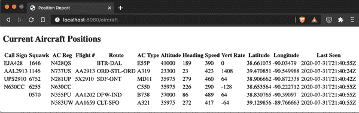
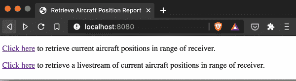
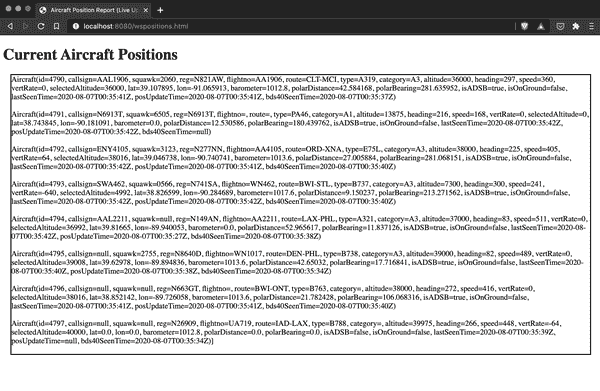

# 第七章：使用 Spring MVC 创建应用程序

本章演示了如何使用 Spring MVC 创建 Spring Boot 应用程序，包括 REST 交互、消息平台和其他通信机制，并介绍了模板语言支持。尽管我在上一章中引入了服务之间的交互作为处理数据的 Spring Boot 的众多选项的一部分，但本章的主要焦点从应用程序本身转移到外部世界：其与其他应用程序和/或服务以及最终用户的交互。

# 代码检出检查

请从代码存储库的 *chapter7begin* 分支开始检查。

# Spring MVC：是什么意思？

像技术中的许多其他事物一样，术语 *Spring MVC* 有点过载。当有人提到 Spring MVC 时，他们可能指的是以下任何一种：

+   在 Spring 应用程序中以某种方式实现 Model-View-Controller 模式

+   特别是在 Spring MVC 组件概念中创建应用程序，如 `Model` 接口、`@Controller` 类和视图技术

+   使用 Spring 开发阻塞/非响应式应用程序

根据上下文，Spring MVC 可以被认为是一种方法和实现。它也可以在 Spring Boot 内外使用。在本书的范围之外，泛应用 Spring 和 Spring MVC 在 Spring Boot 之外的使用都不在讨论范围内。我将专注于使用 Spring Boot 来实现前面列出的最后两个概念。

# 使用模板引擎的最终用户交互

虽然 Spring Boot 应用程序在后端处理了大量繁重的任务，但 Boot 也支持直接的最终用户交互。尽管像 Java Server Pages (JSP) 这样的长期标准仍然受到 Boot 支持，用于传统应用程序，但大多数当前应用程序要么利用更强大的视图技术，这些技术由仍在演进和维护的模板引擎支持，要么将前端开发转移到 HTML 和 JavaScript 的组合上。甚至可以成功地将这两种选项混合使用，并充分发挥它们各自的优势。

正如我后面在本章中展示的，Spring Boot 与 HTML 和 JavaScript 前端配合得很好。现在，让我们更仔细地看一下模板引擎。

模板引擎为所谓的服务器端应用程序提供了一种生成最终页面的方法，这些页面将在最终用户的浏览器中显示和执行。这些视图技术在方法上有所不同，但通常提供以下功能：

+   一个模板语言和/或一组标记，定义模板引擎用于生成预期结果的输入

+   决定要使用的视图/模板以完成所请求资源的视图解析器

除了其他不常用的选项外，Spring Boot 还支持视图技术，如[Thymeleaf](https://www.thymeleaf.org)，[FreeMarker](https://freemarker.apache.org)，[Groovy Markup](http://groovy-lang.org/templating.html)和[Mustache](https://mustache.github.io)。Thymeleaf 可能是其中使用最广泛的，有几个原因，并为 Spring MVC 和 Spring WebFlux 应用程序提供了出色的支持。

Thymeleaf 使用自然模板：这些文件包含代码元素，但可以直接（并且正确地）在任何标准 Web 浏览器中打开和查看。能够将模板文件视为 HTML 文件使得开发人员或设计人员可以在没有运行服务器进程的情况下创建和演变 Thymeleaf 模板。任何期望对应的服务器端元素的代码集成都被标记为 Thymeleaf 特定的，并且只显示存在的内容。

在之前的努力基础上，让我们使用 Spring Boot、Spring MVC 和 Thymeleaf 构建一个简单的 Web 应用程序，向最终用户展示一个界面，用于查询 PlaneFinder 的当前飞机位置并显示结果。最初，这将是一个基础的概念验证，后续章节将进一步完善。

## 初始化项目

首先，我们回到 Spring Initializr。从那里，我选择以下选项：

+   Maven 项目

+   Java

+   当前生产版本的 Spring Boot

+   打包方式：Jar

+   Java：11

依赖项如下：

+   Spring Web (`spring-boot-starter-web`)

+   Spring Reactive Web (`spring-boot-starter-webflux`)

+   Thymeleaf (`spring-boot-starter-thymeleaf`)

+   Spring Data JPA (`spring-boot-starter-data-jpa`)

+   H2 数据库 (`h2`)

+   Lombok (`lombok`)

下一步是生成项目并将其保存到本地，解压缩并在 IDE 中打开它。

## 开发飞机位置应用程序

由于此应用程序仅涉及当前状态——即在发出请求时的飞机位置，而非历史记录，因此选择使用内存数据库似乎是一个合理的选择。当然，也可以使用某种`Iterable`，但是 Spring Boot 对 Spring Data 存储库和 H2 数据库的支持可以满足当前的使用案例，并为计划中的未来扩展奠定基础。

### 定义领域类

与其他与`PlaneFinder`交互的项目一样，我创建了一个`Aircraft`领域类作为主要的（数据）焦点。以下是`Aircraft Positions`应用程序的`Aircraft`领域类结构：

```java
@Entity
@Data
@NoArgsConstructor
@AllArgsConstructor
public class Aircraft {
    @Id
    private Long id;
    private String callsign, squawk, reg, flightno, route, type, category;

    private int altitude, heading, speed;
    @JsonProperty("vert_rate")
    private int vertRate;
    @JsonProperty("selected_altitude")
    private int selectedAltitude;

    private double lat, lon, barometer;
    @JsonProperty("polar_distance")
    private double polarDistance;
    @JsonProperty("polar_bearing")
    private double polarBearing;

    @JsonProperty("is_adsb")
    private boolean isADSB;
    @JsonProperty("is_on_ground")
    private boolean isOnGround;

    @JsonProperty("last_seen_time")
    private Instant lastSeenTime;
    @JsonProperty("pos_update_time")
    private Instant posUpdateTime;
    @JsonProperty("bds40_seen_time")
    private Instant bds40SeenTime;
}
```

此领域类使用 JPA 定义，以 H2 作为底层符合 JPA 标准的数据库，并利用 Lombok 创建数据类，其中构造函数具有零参数和所有参数，每个成员变量都有一个。

### 创建存储库接口

接下来，我定义所需的存储库接口，扩展 Spring Data 的`CrudRepository`，并提供要存储的对象类型及其键：在这种情况下是`Aircraft`和`Long`：

```java
public interface AircraftRepository extends CrudRepository<Aircraft, Long> {}
```

### 使用模型和控制器处理工作

我已经使用 `Aircraft` 领域类定义了模型背后的数据；现在是将其整合到 `Model` 中并通过 `Controller` 公开它的时候了。

正如在第三章中讨论的那样，`@RestController` 是一个便利的标记，它将 `@Controller` 和 `@ResponseBody` 结合在一起，形成一个描述性的注解，将格式化的响应返回为 JavaScript 对象表示（JSON）或其他数据导向的格式。这导致方法的对象/可迭代返回值成为网页请求的整个响应体，而不是作为 `Model` 的一部分返回。`@RestController` 允许创建 API，这是一个特殊但非常常见的用例。

现在的目标是创建一个包括用户界面的应用程序，`@Controller` 可以实现这一点。在 `@Controller` 类中，每个使用 `@RequestMapping` 或其专用别名之一（如 `@GetMapping`）注释的方法将返回一个 `String` 值，该值对应于模板文件的名称，但不包括其扩展名。例如，Thymeleaf 文件的扩展名是 *.html*，因此如果一个 `@Controller` 类的 `@GetMapping` 方法返回 `String` “myfavoritepage”，则 Thymeleaf 模板引擎将使用 *myfavoritepage.html* 模板来生成并返回生成的页面给用户的浏览器。

###### 注意

视图技术模板默认放置在项目的 *src/main/resources/templates* 目录下；除非通过应用程序属性或编程手段进行覆盖，否则模板引擎将在此处查找它们。

回到控制器，我创建一个名为 `PositionController` 的类如下所示：

```java
@RequiredArgsConstructor
@Controller
public class PositionController {
    @NonNull
    private final AircraftRepository repository;
    private WebClient client =
            WebClient.create("http://localhost:7634/aircraft");

    @GetMapping("/aircraft")
    public String getCurrentAircraftPositions(Model model) {
        repository.deleteAll();

        client.get()
                .retrieve()
                .bodyToFlux(Aircraft.class)
                .filter(plane -> !plane.getReg().isEmpty())
                .toStream()
                .forEach(repository::save);

        model.addAttribute("currentPositions", repository.findAll());
        return "positions";
    }
}
```

这个控制器看起来与之前的迭代非常相似，但有几个关键区别。首先，当然是前面讨论过的 `@Controller` 注解，而不是 `@RestController`。其次，`getCurrentAircraftPositions()` 方法具有自动装配的参数：`Model model`。这个参数是模板引擎使用的 `Model` bean，用于访问应用程序组件的数据和操作——一旦我们将这些组件作为属性添加到 `Model` 中。第三个区别是方法的返回类型是 `String` 而不是类类型，并且实际的返回语句是模板的名称（不包含 *.html* 扩展名）。

###### 注意

在复杂的领域/应用程序中，我更喜欢通过创建独立的 `@Service` 和 `@Controller` 类来更好地分离关注点。在这个例子中，只有一个方法访问单个存储库，所以我将所有的功能都放在 `Controller` 内部，用于填充底层数据、填充 `Model` 并将其传递给适当的 `View`。

### 创建必需的视图文件

作为这一章及未来章节的基础，我创建了一个普通的 HTML 文件和一个模板文件。

由于我想向所有访问者显示一个纯 HTML 页面，并且由于此页面不需要模板支持，因此我直接将*index.html*放在项目的*src/main/resources/static*目录中：

```java
<!DOCTYPE html>
<html lang="en">
<head>
    <meta charset="UTF-8">
    <title>Retrieve Aircraft Position Report</title>
</head>
<body>
    <p><a href="/aircraft">Click here</a>
        to retrieve current aircraft positions in range of receiver.</p>
</body>
</html>
```

对于动态内容，我创建一个模板文件，向否则普通的 HTML 文件添加了 Thymeleaf 标签的 XML 命名空间，然后使用这些标签作为 Thymeleaf 模板引擎的内容注入指南，如以下*positions.html*文件所示。为了指定这是一个由引擎处理的模板文件，我将其放在项目目录*src/main/resources/templates*中：

```java
<!DOCTYPE HTML>
<html lang="en" xmlns:th="http://www.thymeleaf.org">
<head>
    <title>Position Report</title>
    <meta http-equiv="Content-Type" content="text/html; charset=UTF-8"/>
</head>
<body>
<div class="positionlist" th:unless="${#lists.isEmpty(currentPositions)}">

    <h2>Current Aircraft Positions</h2>

    <table>
        <thead>
        <tr>
            <th>Call Sign</th>
            <th>Squawk</th>
            <th>AC Reg</th>
            <th>Flight #</th>
            <th>Route</th>
            <th>AC Type</th>
            <th>Altitude</th>
            <th>Heading</th>
            <th>Speed</th>
            <th>Vert Rate</th>
            <th>Latitude</th>
            <th>Longitude</th>
            <th>Last Seen</th>
            <th></th>
        </tr>
        </thead>
        <tbody>
        <tr th:each="ac : ${currentPositions}">
            <td th:text="${ac.callsign}"></td>
            <td th:text="${ac.squawk}"></td>
            <td th:text="${ac.reg}"></td>
            <td th:text="${ac.flightno}"></td>
            <td th:text="${ac.route}"></td>
            <td th:text="${ac.type}"></td>
            <td th:text="${ac.altitude}"></td>
            <td th:text="${ac.heading}"></td>
            <td th:text="${ac.speed}"></td>
            <td th:text="${ac.vertRate}"></td>
            <td th:text="${ac.lat}"></td>
            <td th:text="${ac.lon}"></td>
            <td th:text="${ac.lastSeenTime}"></td>
        </tr>
        </tbody>
    </table>
</div>
</body>
</html>
```

对于飞机位置报告页面，我将显示的信息减少到几个特别重要和感兴趣的元素。 *positions.html* Thymeleaf 模板中有几个值得注意的地方：

首先，如前所述，我使用以下行将 Thymeleaf 标签添加到 XML 命名空间，并使用*th*前缀：

```java
<html lang="en" >
```

在定义将显示当前飞机位置的`division`时，我指示`positionList`部分仅在数据存在时显示；如果`Model`中的`currentPositions`元素为空，则简单地省略整个`division`：

```java
<div class="positionlist" th:unless="${#lists.isEmpty(currentPositions)}">
```

最后，我使用标准 HTML 表格标记定义表格本身、表头行及其内容。对于表格主体，我使用 Thymeleaf 的`each`来迭代所有`currentPositions`并使用 Thymeleaf 的`text`标签填充每行的列，并通过“${object.property}”变量表达式语法引用每个位置对象的属性。至此，应用程序已准备好进行测试。

### 结果

使用`PlaneFinder`服务运行时，我从 IDE 执行`Aircraft Positions`应用程序。一旦成功启动，我打开一个浏览器选项卡，在地址栏中输入`localhost:8080`并按回车键。 图 7-1 显示了生成的页面。


###### 图 7-1。飞机位置应用程序（非常简单）的着陆页面

从这里，我点击*点击这里*链接以进入飞机位置报告页面，如图 7-1 所示。



###### 图 7-2。飞机位置报告页面

刷新页面将重新查询`PlaneFinder`并根据需求更新报告的当前数据。

### 一个令人耳目一新的花哨

能够请求当前区域内飞机的列表以及它们的确切位置是一件有用的事情。但是，如果一个人愿意，手动刷新页面也可能变得相当乏味，并导致错过很感兴趣的数据。要将定时刷新功能添加到飞机位置报告模板中，只需向页面`body`添加类似以下的 JavaScript 函数，并指定页面刷新率（以毫秒为单位）：

```java
<script type="text/javascript">
    window.onload = setupRefresh;

    function setupRefresh() {
        setTimeout("refreshPage();", 5000); // refresh rate in milliseconds
    }

    function refreshPage() {
        window.location = location.href;
    }
</script>
```

Thymeleaf 模板引擎将此代码不加修改地传递到生成的页面，并且用户的浏览器以指定的刷新率执行脚本。这并不是最优雅的解决方案，但对于简单的用例，它能够胜任。

# 传递消息

当用例要求更加严格时，可能需要更复杂的解决方案。前面的代码确实提供了反映最新可用位置数据的动态更新，但其中可能存在的其他问题包括定期请求更新数据可能会有些啰嗦。如果几个客户端不断地请求和接收更新，网络流量可能会相当大。

为了同时满足更复杂的用例并解决网络需求，有助于改变视角：从拉模型转换为推模型，或两者的某种组合。

###### 注意

本节和接下来的内容探讨了向推送模型迈出的两个不同而逐步的步骤，最终从`PlaneFinder`服务向外推进到一个*完全*的基于推送的模型。用例将指出（或规定）可能支持其中一种方法或完全不同的其他方法的条件。我将继续在随后的章节中探索和展示额外的替代方案，敬请关注。

消息平台旨在有效地接受、路由和传递应用程序之间的消息。示例包括[RabbitMQ](https://www.rabbitmq.com)和[Apache Kafka](https://kafka.apache.org)以及许多其他提供的产品，无论是开源的还是商业的。Spring Boot 和 Spring 生态系统提供了几种不同的选项来利用消息管道，但我最喜欢的是 Spring Cloud Stream。

Spring Cloud Stream 提升了开发者的抽象级别，同时通过应用程序属性、bean 和直接配置提供对支持的平台独特属性的访问。绑定器形成了流平台驱动程序与 Spring Cloud Stream（SCSt）之间的连接，使开发人员能够专注于关键任务——发送、路由和接收消息——这些任务的概念不管底层管道如何都不会有所不同。

## 提升 PlaneFinder 的能力

首要任务是重构`PlaneFinder`服务，使用 Spring Cloud Stream 发布消息，供`Aircraft Positions`（以及任何其他适用的）应用程序使用。

### 必需的依赖项

我将以下依赖项添加到`PlaneFinder`的*pom.xml* Maven 构建文件中：

```java
<dependency>
    <groupId>org.springframework.boot</groupId>
    <artifactId>spring-boot-starter-amqp</artifactId>
</dependency>
<dependency>
    <groupId>org.springframework.cloud</groupId>
    <artifactId>spring-cloud-stream</artifactId>
</dependency>
<dependency>
    <groupId>org.springframework.cloud</groupId>
    <artifactId>spring-cloud-stream-binder-kafka</artifactId>
</dependency>
<dependency>
    <groupId>org.springframework.cloud</groupId>
    <artifactId>spring-cloud-stream-binder-rabbit</artifactId>
</dependency>
<dependency>
    <groupId>org.springframework.kafka</groupId>
    <artifactId>spring-kafka</artifactId>
</dependency>
```

需要注意的第二个依赖项实际上是第二个列出的依赖项：`spring-cloud-stream`。这是 Spring Cloud Stream 的代码依赖，但它不能单独完成任务。如前所述，SCSt 使用绑定器无缝地启用其强大的抽象与各种流平台驱动程序的工作。甚至从 Spring Initializr 访问的 Spring Cloud Stream 入口处也有一个有用的提醒，以此作为提示：

> 用于构建与共享消息系统连接的高度可伸缩的事件驱动微服务框架（需要绑定器，例如 Apache Kafka、RabbitMQ 或 Solace PubSub+）

要使 Spring Cloud Stream 与消息平台配合工作，它需要一个消息平台驱动程序和与之配套的 binder。在前面的示例中，我包含了一个 RabbitMQ 的 binder+driver 组合 *和* 一个 Apache Kafka 的 binder+driver 组合。

###### 提示

如果只包含一个 binder+driver 组合—例如 RabbitMQ—Spring Boot 的自动配置可以明确确定您的应用程序应支持与 RabbitMQ 实例及相关的 `exchanges` 和 `queues` 进行通信，并创建适当的支持 bean，而无需开发人员额外的工作。包含多组 binder+driver 需要我们指定要使用哪一个，但它也允许我们在运行时动态在所有包含的平台之间切换，而不需要更改经过测试和部署的应用程序。这是一种非常强大和有用的功能。

*pom.xml* 文件需要两个更改。首先是通过将以下行添加到 `<properties></properties>` 部分来指示要使用的 Spring Cloud 项目级版本：

```java
<spring-cloud.version>2020.0.0-M5</spring-cloud.version>
```

其次是提供有关 Spring Cloud BOM（Bill of Materials）的指导，从中构建系统可以确定任何在此项目中使用的 Spring Cloud 组件（在本例中为 Spring Cloud Stream）的版本：

```java
<dependencyManagement>
    <dependencies>
        <dependency>
            <groupId>org.springframework.cloud</groupId>
            <artifactId>spring-cloud-dependencies</artifactId>
            <version>${spring-cloud.version}</version>
            <type>pom</type>
            <scope>import</scope>
        </dependency>
    </dependencies>
</dependencyManagement>
```

###### 注意

Spring 组件项目的版本经常更新。确定与当前版本的 Spring Boot 经过测试的正确同步版本的简单方法是使用 Spring Initializr。选择所需的依赖项并单击“*Explore CTRL+SPACE*”按钮将显示具有相应元素和版本的构建文件。

刷新项目的依赖项后，转到代码。

### 提供飞机位置

由于 `PlaneFinder` 的现有结构和 Spring Cloud Stream 的简洁、功能性方法，只需要一个小的类来将当前飞机位置发布到 RabbitMQ 以供其他应用程序使用：

```java
@AllArgsConstructor
@Configuration
public class PositionReporter {
    private final PlaneFinderService pfService;

    @Bean
    Supplier<Iterable<Aircraft>> reportPositions() {
        return () -> {
            try {
                return pfService.getAircraft();
            } catch (IOException e) {
                e.printStackTrace();
            }
            return List.of();
        };
    }
}
```

由于 `PlaneFinder` 对上游无线电设备的每次轮询会产生当前范围内的飞机位置列表，因此 `PlaneFinder` 服务通过调用 `PlaneFinderService` 的 `getAircraft()` 方法创建由 `Iterable<Aircraft>` 中的 1+ 架飞机组成的消息。 一种观点是，`Supplier` 每秒钟默认调用一次（可通过应用程序属性重写），以及一些必需/可选的应用程序属性会通知 Spring Boot 的自动配置并启动工作。

### 应用程序属性

只需要一个属性，尽管其他属性也很有帮助。以下是更新后的 `PlaneFinder` 的 *application.properties* 文件的内容：

```java
server.port=7634

spring.cloud.stream.bindings.reportPositions-out-0.destination=aircraftpositions
spring.cloud.stream.bindings.reportPositions-out-0.binder=rabbit
```

`server.port` 仍然来自第一个版本，并指示应用程序应在端口 7634 上监听。

Spring Cloud Stream 的功能 API 依赖于最小的属性配置（作为基线），以启用其功能。`Supplier` 只有输出通道，因为它只产生消息。`Consumer` 只有输入通道，因为它只消费消息。`Function` 既有输入通道也有输出通道，这是因为它用于将一种东西转换为另一种东西。

每个绑定使用接口（`Supplier`、`Function` 或 `Consumer`）的 bean 方法名称作为通道名称，以及 `in` 或 `out` 和从 `0` 到 `7` 的通道编号。一旦以 `<method>-<in|out>-n` 的形式连接，绑定属性就可以为通道定义。

对于此用例唯一需要的属性是 `destination`，即使如此也是为了方便。指定 `destination` 名称会导致 RabbitMQ 创建一个名为 `aircraftpositions` 的交换。

由于我在项目依赖项中包含了 RabbitMQ 和 Kafka 的绑定器和驱动程序，我必须指定应用程序应该使用哪个绑定器。对于这个示例，我选择 `rabbit`。

定义了所有必需和期望的应用程序属性后，`PlaneFinder` 准备每秒向 RabbitMQ 发布当前飞机位置，以供希望这样做的任何应用程序消费。

## 扩展飞机位置应用程序

使用 Spring Cloud Stream 将 `飞机位置` 转换为消费 RabbitMQ 管道消息同样简单。只需对幕后的工作进行少量更改，即可将频繁的 HTTP 请求替换为消息驱动架构。

### 所需依赖项

就像 `PlaneFinder` 一样，我将以下依赖项添加到 `飞机位置` 应用程序的 *pom.xml*：

```java
<dependency>
    <groupId>org.springframework.boot</groupId>
    <artifactId>spring-boot-starter-amqp</artifactId>
</dependency>
<dependency>
    <groupId>org.springframework.cloud</groupId>
    <artifactId>spring-cloud-stream</artifactId>
</dependency>
<dependency>
    <groupId>org.springframework.cloud</groupId>
    <artifactId>spring-cloud-stream-binder-kafka</artifactId>
</dependency>
<dependency>
    <groupId>org.springframework.cloud</groupId>
    <artifactId>spring-cloud-stream-binder-rabbit</artifactId>
</dependency>
<dependency>
    <groupId>org.springframework.kafka</groupId>
    <artifactId>spring-kafka</artifactId>
</dependency>
```

###### 注意

正如之前提到的，我为计划中的未来使用包括 RabbitMQ 和 Kafka 的绑定器和驱动程序，但是目前使用案例中只需要 RabbitMQ 集合 — `spring-boot-starter-amqp` 和 `spring-cloud-stream-binder-rabbit` — 让 Spring Cloud Stream (`spring-cloud-stream`) 使用 RabbitMQ。

我还向 *pom.xml* 添加了两个额外所需的条目。首先，这些内容放在 `<properties></properties>` 部分，使用 `java.version`：

```java
<spring-cloud.version>2020.0.0-M5</spring-cloud.version>
```

第二个是 Spring Cloud BOM 信息：

```java
<dependencyManagement>
    <dependencies>
        <dependency>
            <groupId>org.springframework.cloud</groupId>
            <artifactId>spring-cloud-dependencies</artifactId>
            <version>${spring-cloud.version}</version>
            <type>pom</type>
            <scope>import</scope>
        </dependency>
    </dependencies>
</dependencyManagement>
```

快速刷新项目的依赖项，然后我们就可以进行下一步了。

### 消费飞机位置

为了检索和存储列出当前飞机位置的消息，只需要一个额外的小类：

```java
@AllArgsConstructor
@Configuration
public class PositionRetriever {
    private final AircraftRepository repo;

    @Bean
    Consumer<List<Aircraft>> retrieveAircraftPositions() {
        return acList -> {
            repo.deleteAll();

            repo.saveAll(acList);

            repo.findAll().forEach(System.out::println);
        };
    }
}
```

与`PlaneFinder`中的`PositionReporter`对应的`PositionRetriever`类也是一个`@Configuration`类，在其中我定义了一个用于 Spring Cloud Stream 的 bean：一个消息的`Consumer`，每个消息包含一个或多个`Aircraft`的`List`。每次收到消息时，`Consumer` bean 删除内存中的所有位置，保存所有传入的位置，然后将所有存储的位置打印到控制台进行验证。请注意，打印所有位置到控制台的最后一条语句是可选的；它仅用于在开发应用程序时进行确认。

### 应用程序属性

为了向应用程序提供连接到传入消息流所需的少数剩余信息，我将以下条目添加到*application.properties*文件中：

```java
spring.cloud.stream.bindings.retrieveAircraftPositions-in-0.destination=
   aircraftpositions
spring.cloud.stream.bindings.retrieveAircraftPositions-in-0.group=
   aircraftpositions
spring.cloud.stream.bindings.retrieveAircraftPositions-in-0.binder=
   rabbit
```

与`PlaneFinder`一样，该通道是通过连接以下内容定义的，以连字符（-）分隔：

+   在本例中的 bean 名称，一个`Consumer<T>` bean。

+   `in`，因为消费者只消费，因此只有输入。

+   一个介于`0`和`7`之间的数字，支持最多八个输入。

`destination`和`binder`属性与`PlaneFinder`相匹配，因为`Aircraft Positions`应用程序必须指向与`PlaneFinder`用作输出相同的输入目标，因此两者必须使用相同的消息平台——在本例中是 RabbitMQ。虽然`group`属性是新的。

对于任何类型的`Consumer`（包括`Function<T, R>`的接收部分），可以指定一个`group`，但并不是必须的；事实上，包含或省略`group`形成了特定路由模式的起点。

如果消息消费应用程序没有指定组，RabbitMQ 绑定器会创建一个随机唯一名称，并将其分配给自动删除队列中的消费者。这导致每个生成的队列只能由一个消费者服务。这为什么重要？

每当消息到达 RabbitMQ 交换机时，默认情况下会自动将其复制到所有分配给该交换机的队列中。如果一个交换机有多个队列，同一条消息会被发送到每个队列，这被称为*扇出模式*，在需要将每条消息传递到多个目的地以满足不同需求时非常有用。

如果应用程序指定了它所属的消费者组，该组名称将用于命名 RabbitMQ 中的底层队列。当多个应用程序指定相同的`group`属性并因此连接到同一队列时，这些应用程序共同实现竞争消费者模式，即到达指定队列的每条消息只会被一个消费者处理。这允许消费者数量根据消息的变化量进行扩展。

###### 注意

如果需要，还可以使用分区和路由键进行更精细和灵活的路由选项。

指定此应用程序的 `group` 属性可以实现扩展，如果需要多个实例来跟上消息的到达速度。

### 与控制器联系

由于 `Consumer` bean 自动检查并处理消息，因此 `PositionController` 类及其 `getCurrentAircraftPositions()` 方法变得大大简洁。

所有对 `WebClient` 的引用都可以移除，因为现在只需获取存储库的当前内容即可获取当前位置列表。简化后的类现在看起来像这样：

```java
@RequiredArgsConstructor
@Controller
public class PositionController {
    @NonNull
    private final AircraftRepository repository;

    @GetMapping("/aircraft")
    public String getCurrentAircraftPositions(Model model) {
        model.addAttribute("currentPositions", repository.findAll());
        return "positions";
    }
}
```

经过这些更改，消息生成器（`PlaneFinder` 应用程序）和消息消费器（`Aircraft Positions` 应用程序）现在已经完全完成。

###### 注意

为了使用任何外部消息平台，该平台必须正在运行并且可以被应用程序访问。我使用 Docker 运行本地实例的 RabbitMQ；本书关联的存储库中提供了快速创建和启动/关闭的脚本。

### 结果

在验证了 RabbitMQ 可访问之后，现在是时候启动应用程序并验证一切是否按预期工作了。

虽然这并不是必须的，但我更喜欢先启动消息消费应用程序，这样它就可以准备好接收消息。在这种情况下，这意味着我从我的 IDE 执行 `Aircraft Positions`。

接下来，我启动了新版本的改进后的 `PlaneFinder` 应用程序。这会启动消息流向 `Aircraft Positions` 应用程序，正如 `Aircraft Positions` 应用程序的控制台中所示。这是令人满意的，但我们也可以将这条成功路径一直追踪到最终用户。

返回浏览器并访问 *localhost:8080*，我们再次看到登陆页面，选择 *点击这里*，即可进入位置报告。与以前一样，位置报告会自动刷新并显示当前飞机位置；然而，现在这些位置独立地从 `PlaneFinder` 后台推送到 `Aircraft Positions` 应用程序，而无需首先接收它们的 HTTP 请求，这使得架构更接近于完全事件驱动系统。

# 使用 WebSocket 创建会话

在我们创建的分布式系统的第一次迭代中，用于查询和显示当前飞行器位置的分布式系统完全是基于拉取的。用户从浏览器请求（或使用刷新重新请求）最新的位置，浏览器将请求传递给`飞行器位置`应用程序，后者又将请求中继给`PlaneFinder`应用程序。然后依次从一个应用程序返回到下一个应用程序。最后一章将我们的分布式系统的中段替换为事件驱动架构。现在，每当`PlaneFinder`从上游无线设备检索位置时，它将这些位置推送到流式平台管道，而`飞行器位置`应用程序则消耗这些位置。然而，最后一英里（或者说最后一公里，如果你愿意）仍然是基于拉取的；更新必须通过浏览器刷新手动或自动请求。

标准的请求-响应语义对许多用例非常有效，但它们在很大程度上缺乏响应端"服务器"独立于任何请求启动传输的能力。有各种解决方法和聪明的方式来满足这个用例——每种方式都有其优缺点，其中一些我在接下来的章节中讨论——但其中一种更多才多艺的选择是 WebSocket。

## 什么是 WebSocket？

WebSocket 简而言之，是一种全双工通信协议，通过单个 TCP 连接连接两个系统。一旦建立 WebSocket 连接，任何一方都可以向另一方发起传输，指定的服务器应用程序可以维护多个客户端连接，实现低开销的广播和聊天类型的系统。WebSocket 连接是通过使用 HTTP 升级标头从标准 HTTP 连接中形成的，一旦握手完成，用于连接的协议从 HTTP 转变为 WebSocket。

WebSocket 在 2011 年由 IETF 标准化，到目前为止，每个主要浏览器和编程语言都支持它。与 HTTP 请求和响应相比，WebSocket 的开销极低；传输不必在每个传输中识别自己和它们的通信条款，从而将 WebSocket 帧格式化为几个字节。借助其全双工能力，服务器处理多个开放连接的能力比其他选项多，以及低开销，WebSocket 是开发人员工具箱中有用的工具。

## 重构飞行器位置应用程序

虽然我将`飞行器位置`应用程序称为单一单元，*飞行器位置*项目包括后端 Spring Boot+Java 应用程序和前端 HTML+JavaScript 功能。在开发过程中，这两部分通常在单一环境中执行，通常是开发者的计算机。尽管它们作为单个单元构建、测试并部署到生产环境中，但在生产环境中的执行分为以下几个部分：

+   后端 Spring+Java 代码在云中运行，包括（如果适用）生成最终网页以交付给最终用户的模板引擎。

+   前端 HTML+JavaScript——静态和/或生成的内容——在最终用户的浏览器中显示和运行，无论该浏览器位于何处。

在这一部分中，我保留了现有功能，并添加了系统自动显示飞机位置的能力，这些位置是通过实时数据流报告的。通过前端和后端应用程序之间建立的 WebSocket 连接，后端应用程序可以自由地将更新推送到最终用户的浏览器，并自动更新显示，无需触发页面刷新。

### 附加依赖项

要向 `Aircraft Positions` 应用程序添加 WebSocket 能力，我只需要在其 *pom.xml* 中添加一个依赖项：

```java
<dependency>
	<groupId>org.springframework.boot</groupId>
	<artifactId>spring-boot-starter-websocket</artifactId>
</dependency>
```

快速刷新项目的依赖项，我们就可以进行下一步了。

### 处理 WebSocket 连接和消息

Spring 提供了几种不同的方法来配置和使用 WebSocket，但我建议遵循基于 `WebSocketHandler` 接口的直接实现的清晰路线。由于需要频繁交换基于文本的、即非二进制信息，因此甚至有一个 `TextWebSocketHandler` 类。我在这里基于此进行构建：

```java
@RequiredArgsConstructor
@Component
public class WebSocketHandler extends TextWebSocketHandler {
    private final List<WebSocketSession> sessionList = new ArrayList<>();
    @NonNull
    private final AircraftRepository repository;

    public List<WebSocketSession> getSessionList() {
        return sessionList;
    }

    @Override
    public void afterConnectionEstablished(WebSocketSession session)
            throws Exception {
        sessionList.add(session);
        System.out.println("Connection established from " + session.toString() +
            " @ " + Instant.now().toString());
    }

    @Override
    protected void handleTextMessage(WebSocketSession session,
            TextMessage message) throws Exception {
        try {
            System.out.println("Message received: '" +
                message + "', from " + session.toString());

            for (WebSocketSession sessionInList : sessionList) {
                if (sessionInList != session) {
                    sessionInList.sendMessage(message);
                    System.out.println("--> Sending message '"
                        + message + "' to " + sessionInList.toString());
                }
            }
        } catch (Exception e) {
                System.out.println("Exception handling message: " +
            e.getLocalizedMessage());
        }
    }

    @Override
    public void afterConnectionClosed(WebSocketSession session,
            CloseStatus status) throws Exception {
        sessionList.remove(session);
        System.out.println("Connection closed by " + session.toString() +
            " @ " + Instant.now().toString());
    }
}
```

上述代码实现了 `WebSocketHandler` 接口的两个方法，即 `afterConnectionEstablished` 和 `afterConnectionClosed`，以维护活动 `WebSocketSession` 的 `List` 和记录连接和断开连接。我还实现了 `handleTextMessage`，将任何传入的消息广播给所有其他活动会话。这个单一类为后端提供了 WebSocket 能力，一旦从 `PlaneFinder` 通过 RabbitMQ 接收到飞机位置，就可以激活它。

### 将飞机位置广播到 WebSocket 连接

在其先前版本中，`PositionRetriever` 类通过 RabbitMQ 消息接收飞机位置列表，并将它们存储在内存中的 H2 数据库中。现在我通过调用一个新的 `sendPositions()` 方法来构建它，该方法的目的是使用新添加的 `@Autowired` `WebSocketHandler` bean 将最新的飞机位置列表发送给所有连接的 WebSocket 客户端，以取代记录确认的 `System.out::println` 调用：

```java
@AllArgsConstructor
@Configuration
public class PositionRetriever {
    private final AircraftRepository repository;
    private final WebSocketHandler handler;

    @Bean
    Consumer<List<Aircraft>> retrieveAircraftPositions() {
        return acList -> {
            repository.deleteAll();

            repository.saveAll(acList);

            sendPositions();
        };
    }

    private void sendPositions() {
        if (repository.count() > 0) {
            for (WebSocketSession sessionInList : handler.getSessionList()) {
                try {
                    sessionInList.sendMessage(
                        new TextMessage(repository.findAll().toString())
                    );
                } catch (IOException e) {
                    e.printStackTrace();
                }
            }
        }
    }
}
```

现在我们已经正确配置了 WebSocket，并且有了一种让后端向连接的 WebSocket 客户端广播飞机位置的方法，即一旦收到新的位置列表，下一步就是提供一种让后端应用程序监听并接受连接请求的方法。通过注册先前创建的 `WebSocketHandler`，使用 `WebSocketConfigurer` 接口，并在新的 `@Configuration` 类上加上 `@EnableWebSocket` 注解来指示应用程序处理 WebSocket 请求来实现这一点：

```java
@Configuration
@EnableWebSocket
public class WebSocketConfig implements WebSocketConfigurer {
    private final WebSocketHandler handler;

    WebSocketConfig(WebSocketHandler handler) {
        this.handler = handler;
    }

    @Override
    public void registerWebSocketHandlers(WebSocketHandlerRegistry registry) {
        registry.addHandler(handler, "/ws");
    }
}
```

在`registerWebSocketHandlers(WebSocketHandlerRegistry registry)`方法中，我将之前创建的`WebSocketHandler` bean 绑定到端点*ws://<hostname:hostport>/ws*。 应用程序将在此端点上侦听带有 WebSocket 升级标头的 HTTP 请求，并在收到请求时采取相应措施。

###### 注意

如果您的应用程序启用了 HTTPS，则会使用*wss://*（WebSocket Secure）代替*ws://*。

### 后端 WebSocket，前端 WebSocket

后端工作完成后，是时候在前端功能中收集回报了。

为了创建一个简单的示例，演示 WebSocket 如何使后端应用程序能够无需用户及其浏览器提示即可推送更新，我创建了以下文件，其中包含一个 HTML 部分和标签以及几行 JavaScript，并将其放置在项目的*src/main/resources/static*目录中，与现有的*index.html*一起：

```java
<!DOCTYPE html>
<html lang="en">
<head>
    <meta charset="UTF-8">
    <title>Aircraft Position Report (Live Updates)</title>
    <script>
        var socket = new WebSocket('ws://' + window.location.host + '/ws');

        socket.onopen = function () {
            console.log(
              'WebSocket connection is open for business, bienvenidos!');
        };

        socket.onmessage = function (message) {
            var text = "";
            var arrAC = message.data.split("Aircraft");
            var ac = "";

            for (i = 1; i < arrAC.length; i++) {
                ac = (arrAC[i].endsWith(", "))
                    ? arrAC[i].substring(0, arrAC[i].length - 2)
                    : arrAC[i]

                text += "Aircraft" + ac + "\n\n";
            }

            document.getElementById("positions").innerText = text;
        };

        socket.onclose = function () {
            console.log('WebSocket connection closed, hasta la próxima!');
        };
    </script>
</head>
<body>
<h1>Current Aircraft Positions</h1>
<div style="border-style: solid; border-width: 2px; margin-top: 15px;
        margin-bottom: 15px; margin-left: 15px; margin-right: 15px;">
    <label id="positions"></label>
</div>
</body>
</html>
```

尽管此页面很短，但它可以更短。`socket.onopen`和`socket.onclose`函数定义是可以省略的日志函数，而`socket.onmessage`几乎肯定可以由具有实际 JavaScript 技能和愿望的人进行重构。 这些是关键位：

+   在 HTML 底部定义的部门和标签

+   建立和引用 WebSocket 连接的`socket`变量

+   解析飞机位置列表并将重新格式化的输出分配给 HTML“positions”标签的`innerText`的`socket.onmessage`函数

一旦我们重建并执行项目，当然可以直接从浏览器访问*wspositions.html*页面。 但这是为实际用户创建应用程序的不良方式——除非他们知道其位置并将其手动输入到地址栏中，否则无法访问页面及其功能——并且它对于设置为本示例的扩展来说毫无作用。

暂时保持简单，我在现有的*index.html*中添加另一行，允许用户导航到*wspositions.html* WebSocket 驱动的页面，除了现有的页面：

```java
<!DOCTYPE html>
<html lang="en">
<head>
    <meta charset="UTF-8">
    <title>Retrieve Aircraft Position Report</title>
</head>
<body>
    <p><a href="/aircraft">Click here</a> to retrieve current aircraft positions
        in range of receiver.</p>
    <p><a href="/wspositions.html">Click here</a> to retrieve a livestream of
        current aircraft positions in range of receiver.</p>
</body>
</html>
```

前端工作现在已经完成，是时候测试 WebSocket 了。

### 结果

从 IDE 中，我启动`Aircraft Positions`应用程序和`PlaneFinder`。 打开浏览器窗口，我访问*localhost:8080*的前端应用程序，如图 7-3 所示。



###### 图 7-3\. 飞机位置着陆页面，现在有两个选项

从仍然相当简陋的着陆页面中，选择第二个选项——*点击这里*以检索接收器范围内当前飞机位置的实时流产生了*wspositions.html*页面和类似于图 7-4 中所示的结果。



###### 图 7-4\. 通过 WebSocket 进行实时更新的飞机位置报告

将显示的数据库记录格式转换为 JSON 格式是一个微不足道的练习，而动态填充表格以显示从后端应用通过 WebSocket 实时接收到的结果则稍微复杂一些。请参考本书的代码仓库获取示例。

###### 提示

完全可以通过命令行构建和运行`PlaneFinder`和`Aircraft Positions`应用；虽然我偶尔这样做，但对于大多数构建/运行周期，我发现直接在 IDE 中运行（和调试）要快得多。

# 总结

几乎每个应用程序都必须以某种方式与最终用户或其他应用程序进行交互，这需要有效和高效的交互手段。

本章介绍了视图技术——如 Thymeleaf 等模板语言/标签以及处理它们的引擎——以及 Spring Boot 如何使用它们创建和传递功能给最终用户的浏览器。还介绍了 Spring Boot 如何处理静态内容，如标准 HTML 及无需模板引擎处理即可直接交付的 JavaScript。章节的第一个项目迭代展示了一个完全基于拉取模型的 Thymeleaf 驱动应用，该应用在请求时检索并显示范围内的飞机位置示例。

接下来的章节展示了如何利用 Spring Boot 中的 Spring Cloud Stream 和 RabbitMQ 平台的消息传递功能。`PlaneFinder`应用程序进行了重构，以便每次从上游设备检索到当前飞机位置列表时都推送一次，并且`Aircraft Positions`应用程序已修改以接受通过 RabbitMQ 管道实时到达的新飞机位置列表。这将两个应用程序之间基于拉取的模型替换为推送模型，使得`Aircraft Positions`应用程序的后端功能变成了事件驱动。前端功能仍然需要刷新（手动或硬编码）才能更新显示给用户的结果。

最后，在`Aircraft Positions`应用的后端和前端组件中实现 WebSocket 连接和处理程序代码，使得 Spring+Java 后端应用能够通过 RabbitMQ 管道从`PlaneFinder`接收到的飞机位置更新 *即时推送*。这些位置更新会在简单的 HTML+JavaScript 页面中实时显示，并且无需用户或其浏览器发出更新请求，展示了 WebSocket 双向通信的特性，以及其低通信开销和无需请求-响应模式（或其变通方式）。

# 代码检出检查

想要完整的章节代码，请查看代码仓库中的*chapter7end*分支。

下一章介绍了响应式编程，并描述了 Spring 如何引领开发和推动多种工具和技术的进展，使其成为多种用例中最佳解决方案之一。具体而言，我将演示如何使用 Spring Boot 和 Project Reactor 来驱动数据库访问，将响应式类型集成到像 Thymeleaf 这样的视图技术中，并将进程间通信提升到意想不到的新水平。
