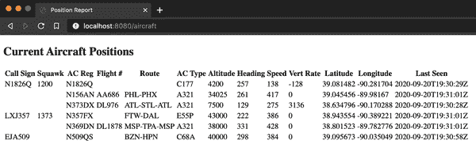

# 第八章：使用 Project Reactor 和 Spring WebFlux 进行响应式编程

本章介绍了响应式编程，讨论了它的起源和存在的原因，并展示了 Spring 如何引领开发和推进众多工具和技术的发展，使其成为多种使用情况下最佳解决方案之一。具体来说，我展示了如何使用 Spring Boot 和 Project Reactor 驱动对 SQL 和 NoSQL 数据库的数据库访问，将响应式类型与 Thymeleaf 等视图技术集成，并使用 RSocket 将进程间通信提升到意想不到的新水平。

# 代码检出检查

请查看代码库中的 *chapter8begin* 分支开始。

# 响应式编程简介

虽然一本完整的关于响应式编程的论述可以——并且已经，以及将会——占据一整本书，但理解为什么它是一个如此重要的概念是至关重要的。

在典型的服务中，每个请求都会创建一个线程来处理。每个线程都需要资源，因此应用程序能够管理的线程数量是有限的。以一个简化的例子来说，如果一个应用程序可以服务 200 个线程，那么该应用程序可以同时接受来自最多 200 个独立客户端的请求，但不多。任何额外尝试连接服务的请求必须等待线程变得可用。

对于连接的 200 个客户端的性能可能满足要求，也可能不满足，这取决于多种因素。毋庸置疑的是，对于客户端应用程序发起的第 201 个及更多的并发请求，由于服务在等待可用线程时会发生阻塞，响应时间可能会显著恶化。这种可扩展性的硬性停止可以在没有警告和简单解决方案的情况下从非问题变为危机，并且像传统的“投入更多实例来解决问题”的解决方法引入了压力缓解和需要解决的新问题。响应式编程的出现就是为了解决这一可扩展性危机。

[响应式宣言](https://www.reactivemanifesto.org)指出，响应式系统是：

+   响应的

+   弹性的

+   弹性的

+   消息驱动的

简而言之，响应式系统的四个关键点结合在一起（在宏观层面上）形成了一个最大程度可用、可扩展和高性能的系统，有效地执行任务所需的最少资源。

从系统层面上说，即多个应用程序/服务共同工作以满足各种使用情况，我们可能注意到大多数挑战涉及应用程序之间的通信：一个应用程序响应另一个应用程序，请求到达时应用程序/服务的可用性，服务根据需求扩展或缩减，一个服务通知其他感兴趣的服务有更新/可用信息等。解决应用程序间交互潜在问题可以在很大程度上减轻和/或解决前面提到的可扩展性问题。

这一观察表明，通信是问题的主要潜在来源，因此也是解决问题的最大机会，这导致了[响应式流倡议](http://www.reactive-streams.org)的发起。响应式流（RS）倡议关注服务之间的交互——即流，包括四个关键元素：

+   应用程序编程接口（API）

+   规范

+   实现示例

+   技术兼容性套件（TCK）

API 仅包含四个接口：

+   `Publisher`：事物的创建者

+   `Subscriber`：事物的消费者

+   `Subscription`：发布者和订阅者之间的合同

+   `Processor`：同时包括 Subscriber 和 Publisher，用于接收、转换和分发事物

这种精简的简洁性至关重要，同样重要的是 API 仅由*接口*而非*实现*组成。这允许在不同平台、语言和编程模型之间实现各种互操作的实现。

文本规范详细说明了 API 实现的预期和/或必需行为。例如：

```java
If a Publisher fails it MUST signal an onError.
```

实现示例对于实现者是有用的辅助工具，提供了在创建特定 RS 实现时使用的参考代码。

或许最关键的部分是技术兼容性套件。 TCK 使实现者能够验证和展示其 RS 实现（或其他人的实现）与规范的兼容性水平及当前存在的任何缺陷。知识就是力量，识别出与规范不完全兼容的任何问题可以加速解决，同时向当前库使用者提供警告，直到问题得到解决。

# Project Reactor

虽然 JVM 有几种可用的响应式流实现，但是 Project Reactor 是其中最活跃、最先进和性能最优的之一。 Reactor 已被全球许多小型组织和全球科技巨头开发和部署的图书馆、API 和应用程序采纳，并提供了许多关键项目的基础，包括 Spring 的 WebFlux 响应式 Web 能力和 Spring Data 的多个开源和商业数据库的响应式数据库访问。 Reactor 还允许从堆栈顶部到底部以及侧面创建端到端响应式管道，增加了开发和采纳的强劲动力。这是一个百分之百的解决方案。

这为什么重要？

从堆栈的顶部到底部，从最终用户到最低层计算资源，每个交互都提供了一个潜在的粘附点。如果用户的浏览器与后端应用程序之间的交互是非阻塞的，但是应用程序必须等待与数据库的阻塞交互，那么结果就是一个阻塞系统。与应用程序之间的通信情况相同；如果用户的浏览器与后端服务 A 通信，但是服务 A 阻塞等待来自服务 B 的响应，用户获得了什么？可能很少，甚至可能什么都没有。

开发人员通常可以看到切换到 Reactive Streams 为他们和他们的系统带来的巨大潜力。与此相对应的是，相对于命令式编程构造和工具的相对新颖性，以及这种变化所需要的思维方式的变化，可能需要开发人员进行调整和更多的工作，至少在短期内是这样。只要所需的努力明显超过了可扩展性的好处，以及在整体系统中应用反应流的广度和深度，这仍然是一个容易的决定。在系统的所有应用程序中具有反应式管道是两个方面的乘数。

Project Reactor 对 Reactive Streams 的实现简洁而简单，构建在 Java 和 Spring 开发人员已经熟悉的概念之上。类似于 Java 8+的 Stream API，Reactor 最好通过声明性的、链式的操作符使用，通常与 lambda 一起使用。与更为程序化、命令式的代码相比，它首先感觉有些不同，然后相当优雅。熟悉`Stream`会加速适应和欣赏。

Reactor 将反应流`Publisher`的概念进行了特殊化，提供了类似于命令式 Java 的构造。与为需要反应流的所有东西使用通用的`Publisher`不同——将其视为按需的、动态的`Iterable`——Project Reactor 定义了两种类型的`Publisher`：

`Mono`:: 发出 0 或 1 个元素 `Flux`:: 发出 0 到*n*个元素，一个定义的数量或无限的

这与命令式构造完美地契合。例如，在标准 Java 中，一个方法可以返回类型为 T 的对象或`Iterable<T>`。使用 Reactor，同样的方法将返回一个`Mono<T>`或一个`Flux<T>`——一个对象或可能很多，或者在反应性代码的情况下，这些对象的`Publisher`。

Reactor 也非常自然地适用于 Spring 的观点。根据用例，从阻塞到非阻塞代码的转换可能就像改变项目依赖项和一些方法返回值一样简单，如前所示。本章的示例演示了如何做到这一点，以及向外扩展——向上、向下和横向——从单个反应性应用程序转移到反应性系统，包括反应性数据库访问，以实现最大的收益。

# 比较 Tomcat 和 Netty

在 Spring Boot 的命令式世界中，Tomcat 是默认的 Servlet 引擎，用于 Web 应用程序，尽管在这个级别上，开发人员还可以选择像 Jetty 和 Undertow 这样的替代方案。作为默认选项，Tomcat 是一个非常合理的选择，因为它经过验证、性能优越，并且 Spring 团队的开发人员已经（仍在）为优化和演进 Tomcat 的代码库做出贡献。它是 Boot 应用程序的出色 Servlet 引擎。

话虽如此，Servlet 规范的许多迭代从根本上是同步的，没有异步能力。Servlet 3.0 开始通过异步请求处理来解决这个问题，但仍然只支持传统的阻塞 I/O。规范的 3.1 版本增加了非阻塞 I/O，使其适用于异步，因此也适用于响应式应用程序。

Spring WebFlux 是 Spring 对应 Spring WebMVC（包名）的响应式实现，通常简称为 Spring MVC 的对应物。Spring WebFlux 基于 Reactor 构建，并使用 Netty 作为默认的网络引擎，就像 Spring MVC 使用 Tomcat 监听和处理请求一样。Netty 是一个经过验证和高性能的异步引擎，Spring 团队的开发人员也为 Netty 做出贡献，以紧密集成 Reactor 并保持 Netty 的功能和性能处于前沿。

就像 Tomcat 一样，您也有选择权。任何 Servlet 3.1 兼容的引擎都可以与 Spring WebFlux 应用程序一起使用，如果您的任务或组织需要的话。然而，Netty 凭借其领先地位和大多数用例的优势，通常是最佳选择。

# 反应式数据访问

正如之前提到的，最终目标是实现全面的可扩展性和最佳的系统范围吞吐量，这依赖于完全端到端的响应式实现。在最低级别，这取决于数据库访问。

多年来，设计数据库以减少争用和系统性能阻塞的工作已经付出了很多努力。即使在这项令人印象深刻的工作中，许多数据库引擎和驱动程序仍然存在问题，其中包括在没有阻塞请求应用程序的情况下执行操作以及复杂的流控制/反压机制。

分页构造已被用来解决这些约束，但它们并不完美。使用带分页的命令式模型通常需要为每一页发出一个不同范围和/或约束的查询。这需要每次都发出新请求和新响应，而不是像`Flux`那样的继续操作。类比是从水池中每次舀一杯水（命令式方法）与直接打开水龙头来重新灌满杯子。与“去获取，带回”的命令式操作不同，在响应式情景下，水已经等待流动。

## R2DBC 与 H2

在现有版本的 PlaneFinder 中，我使用 Java Persistence API（JPA）和 H2 数据库来存储（在内存中的 H2 实例中）从我监视的本地设备中检索到的飞机位置。JPA 是基于命令规范构建的，因此本质上是阻塞的。看到需要一种非阻塞的响应式方式与 SQL 数据库交互，几位行业领导者和知名人士联手创建和演进了响应式关系数据库连接（R2DBC）项目。

像 JPA 一样，R2DBC 是一个开放的规范，可以与其提供的服务提供者接口（SPI）一起使用，供供应商或其他感兴趣的方进行驱动程序的开发，并为下游开发人员创建客户端库。与 JPA 不同，R2DBC 基于 Project Reactor 的响应式流实现，并且完全响应式和非阻塞。

### 更新 PlaneFinder

与大多数复杂系统一样，我们目前并不控制整个分布式系统的所有方面和节点。像大多数复杂系统一样，越完全地采纳一种范式，从中可以获得的收益就越多。我会从通信链的起点尽可能接近的地方开始这段“响应式之旅”：在 PlaneFinder 服务中。

重构 PlaneFinder 以使用响应式流 `Publisher` 类型，如 `Mono` 和 `Flux`，是第一步。我会继续使用现有的 H2 数据库，但为了“响应式化”它，需要删除 JPA 项目依赖，并将其替换为 R2DBC 库。我将更新 PlaneFinder 的 *pom.xml* Maven 构建文件如下：

```java
<!--	Comment out or remove this 	-->
<!--<dependency>-->
<!--    <groupId>org.springframework.boot</groupId>-->
<!--	<artifactId>spring-boot-starter-data-jpa</artifactId>-->
<!--</dependency>-->

<!--	Add this  	    		    -->
<dependency>
    <groupId>org.springframework.boot</groupId>
    <artifactId>spring-boot-starter-data-r2dbc</artifactId>
</dependency>

<!--	Add this too  	    	    -->
<dependency>
    <groupId>io.r2dbc</groupId>
    <artifactId>r2dbc-h2</artifactId>
    <scope>runtime</scope>
</dependency>
```

`PlaneRepository` 接口必须更新为扩展 `ReactiveCrudRepository` 接口，而不是其阻塞的对应项 `CrudRepository`。这个简单的更新如下所示：

```java
public interface PlaneRepository
    extends ReactiveCrudRepository<Aircraft, String> {}
```

对 `PlaneRepository` 的更改会向外扩散，这自然而然地导致下一个停靠点，即 `PlaneFinderService` 类，其中 `getAircraft()` 方法返回 `PlaneRepository::saveAll` 的结果（当找到飞机时），或者 `saveSamplePositions()` 方法的结果（否则）。将返回值从阻塞的 `Iterable<Aircraft>` 替换为 `Flux<Aircraft>`，用于 `getAircraft()` 和 `saveSamplePositions()` 方法再次正确指定方法返回值。

```java
public Flux<Aircraft> getAircraft() {
    ...
}

private Flux<Aircraft> saveSamplePositions() {
    ...
}
```

由于 `PlaneController` 类的方法 `getCurrentAircraft()` 调用 `PlaneFinderService::getAircraft`，现在它返回 `Flux<Aircraft>`。这需要对 `PlaneController::getCurrentAircraft` 的签名进行更改如下：

```java
public Flux<Aircraft> getCurrentAircraft() throws IOException {
    ...
}
```

使用 H2 与 JPA 是一个相当成熟的事务；涉及的规范、相关的 API 和库已经开发了大约十年。R2DBC 是一个相对较新的开发，虽然支持正在迅速扩展，但在 Spring Data JPA 对 H2 的支持中，还有一些功能尚未实现。这并不会增加太多负担，但在选择使用关系数据库（如 H2）时，需要记住这一点，要以响应式的方式进行。

目前，要使用 H2 与 R2DBC，必须为应用程序创建和配置一个`ConnectionFactoryInitializer` bean。实际上，配置只需要两个步骤：

+   将连接工厂设置为（已自动配置的）`ConnectionFactory` bean，作为参数注入

+   配置数据库“填充器”以执行一个或多个脚本，以初始化或重新初始化数据库，如所需。

请记住，使用 Spring Data JPA 与 H2 时，使用相关的`@Entity`类来在 H2 数据库中创建相应的表。当使用 H2 与 R2DBC 时，通过标准的 SQL DDL（数据定义语言）脚本手动完成此步骤。

```java
DROP TABLE IF EXISTS aircraft;

CREATE TABLE aircraft (id BIGINT auto_increment primary key,
callsign VARCHAR(7), squawk VARCHAR(4), reg VARCHAR(8), flightno VARCHAR(10),
route VARCHAR(30), type VARCHAR(4), category VARCHAR(2),
altitude INT, heading INT, speed INT, vert_rate INT, selected_altitude INT,
lat DOUBLE, lon DOUBLE, barometer DOUBLE, polar_distance DOUBLE,
polar_bearing DOUBLE, is_adsb BOOLEAN, is_on_ground BOOLEAN,
last_seen_time TIMESTAMP, pos_update_time TIMESTAMP, bds40_seen_time TIMESTAMP);
```

###### 注意

这是一个额外的步骤，但并非没有先例。许多 SQL 数据库在与 Spring Data JPA 结合使用时都需要这一步；H2 是个例外。

下面是`DbConxInit`或数据库连接初始化器类的代码。需要的 bean 创建方法是第一个——`initializer()`——产生所需的`ConnectionFactoryInitializer` bean。第二个方法生成一个`CommandLineRunner` bean，一旦类被配置，就会被执行。`CommandLineRunner` 是一个具有单个抽象方法 `run()` 的函数接口。因此，我提供了一个 lambda 作为其实现，用一个`Aircraft`填充（然后列出）`PlaneRepository`的内容。目前，我已经注释掉了`init()`方法的`@Bean`注解，因此该方法从未被调用，`CommandLineRunner` bean 从未被生成，并且示例记录从未被存储：

```java
import io.r2dbc.spi.ConnectionFactory;
import org.springframework.beans.factory.annotation.Qualifier;
import org.springframework.boot.CommandLineRunner;
import org.springframework.context.annotation.Bean;
import org.springframework.context.annotation.Configuration;
import org.springframework.core.io.ClassPathResource;
import org.springframework.r2dbc.connection.init.ConnectionFactoryInitializer;
import org.springframework.r2dbc.connection.init.ResourceDatabasePopulator;

@Configuration
public class DbConxInit {
    @Bean
    public ConnectionFactoryInitializer
            initializer(@Qualifier("connectionFactory")
            ConnectionFactory connectionFactory) {
        ConnectionFactoryInitializer initializer =
            new ConnectionFactoryInitializer();
        initializer.setConnectionFactory(connectionFactory);
        initializer.setDatabasePopulator(
            new ResourceDatabasePopulator(new ClassPathResource("schema.sql"))
        );
        return initializer;
    }

//    @Bean // Uncomment @Bean annotation to add sample data
    public CommandLineRunner init(PlaneRepository repo) {
        return args -> {
            repo.save(new Aircraft("SAL001", "N12345", "SAL001", "LJ",
                    30000, 30, 300,
                    38.7209228, -90.4107416))
                .thenMany(repo.findAll())
                    .subscribe(System.out::println);
        };
    }
}
```

`CommandLineRunner` lambda 需要一些解释。

结构本身是一个典型的 lambda 表达式，如 `x -> { <在此执行的代码> }`，但其中包含的代码具有一些有趣的 Reactive Streams 特定特性。

第一个声明的操作是`repo::save`，它保存提供的内容——在本例中是一个新的`Aircraft`对象——并返回一个`Mono<Aircraft>`。可以简单地`subscribe()`到这个结果并打印日志/输出来验证。但是养成的一个好习惯是保存所有所需的示例数据，然后查询存储库以生成所有记录。这样做允许完全验证此时表的最终状态，并应显示所有记录。

请记住，响应式代码不会阻塞，那么我们如何确保所有先前的操作在继续之前都已完成呢？在这种情况下，我们如何确保在尝试检索所有记录之前所有记录都已保存？在 Project Reactor 中，有一些操作符等待完成信号，然后继续链中的下一个函数。`then()`操作符等待一个`Mono`作为输入，然后接受另一个`Mono`继续进行。在之前的示例中显示的`thenMany()`操作符等待任何上游`Publisher`的完成，并继续播放一个新的`Flux`。在生成`CommandLineRunner` bean 的`init`方法中，`repo.findAll()`生成一个`Flux<Aircraft>`，如预期地填充了账单。

最后，我订阅来自`repo.findAll()`的`Flux<Aircraft>`输出，并将结果打印到控制台。不需要记录结果，事实上，一个简单的`subscribe()`就能满足启动数据流的要求。但是为什么需要订阅呢？

除了少数例外情况外，` `Reactive Streams Publisher` `是*冷发布者*，这意味着如果没有订阅者，它们不会执行任何工作或消耗任何资源。这最大化了效率和可伸缩性，这是完全合理的，但对于刚接触响应式编程的人来说，这也提供了一个常见的陷阱。如果不是将`Publisher`返回给调用代码进行订阅和使用，务必添加`subscribe()`来激活生成`Publisher`或操作链。

最后，由于 JPA 和 R2DBC 以及它们支持的 H2 代码之间的差异，需要对领域类`Aircraft`进行一些更改。 JPA 使用的`@Entity`注解不再需要，主键关联成员变量`id`的`@GeneratedValue`注解现在也不再需要。从 PlaneFinder 从 JPA 迁移到使用 H2 的 R2DBC 时，移除这两个及其关联的导入语句是唯一需要的更改。

为了适应之前显示的`CommandLineRunner` bean（如果需要样本数据），以及其字段限制的构造函数调用，我在`Aircraft`中创建了一个额外的构造函数来匹配。请注意，只有在您希望创建一个不提供所有参数的`Aircraft`实例时，才需要这样做，如构造函数 Lombok 基于`@AllArgsConstructor`注解所要求的。请注意，我从这个有限参数构造函数调用所有参数构造函数：

```java
    public Aircraft(String callsign, String reg, String flightno, String type,
                    int altitude, int heading, int speed,
                    double lat, double lon) {

        this(null, callsign, "sqwk", reg, flightno, "route", type, "ct",
                altitude, heading, speed, 0, 0,
                lat, lon, 0D, 0D, 0D,
                false, true,
                Instant.now(), Instant.now(), Instant.now());
    }
```

现在是时候验证我们的工作了。

从 IDE 中启动 PlaneFinder 应用程序后，我回到终端窗口中的 HTTPie 来测试更新后的代码：

```java
mheckler-a01 :: OReilly/code » http -b :7634/aircraft
[
    {
        "altitude": 37000,
        "barometer": 0.0,
        "bds40_seen_time": null,
        "callsign": "EDV5123",
        "category": "A3",
        "flightno": "DL5123",
        "heading": 131,
        "id": 1,
        "is_adsb": true,
        "is_on_ground": false,
        "last_seen_time": "2020-09-19T21:40:56Z",
        "lat": 38.461505,
        "lon": -89.896606,
        "polar_bearing": 156.187542,
        "polar_distance": 32.208164,
        "pos_update_time": "2020-09-19T21:40:56Z",
        "reg": "N582CA",
        "route": "DSM-ATL",
        "selected_altitude": 0,
        "speed": 474,
        "squawk": "3644",
        "type": "CRJ9",
        "vert_rate": -64
    },
    {
        "altitude": 38000,
        "barometer": 0.0,
        "bds40_seen_time": null,
        "callsign": null,
        "category": "A4",
        "flightno": "FX3711",
        "heading": 260,
        "id": 2,
        "is_adsb": true,
        "is_on_ground": false,
        "last_seen_time": "2020-09-19T21:40:57Z",
        "lat": 39.348558,
        "lon": -90.330383,
        "polar_bearing": 342.006425,
        "polar_distance": 24.839372,
        "pos_update_time": "2020-09-19T21:39:50Z",
        "reg": "N924FD",
        "route": "IND-PHX",
        "selected_altitude": 0,
        "speed": 424,
        "squawk": null,
        "type": "B752",
        "vert_rate": 0
    },
    {
        "altitude": 35000,
        "barometer": 1012.8,
        "bds40_seen_time": "2020-09-19T21:41:11Z",
        "callsign": "JIA5304",
        "category": "A3",
        "flightno": "AA5304",
        "heading": 112,
        "id": 3,
        "is_adsb": true,
        "is_on_ground": false,
        "last_seen_time": "2020-09-19T21:41:12Z",
        "lat": 38.759811,
        "lon": -90.173632,
        "polar_bearing": 179.833023,
        "polar_distance": 11.568717,
        "pos_update_time": "2020-09-19T21:41:11Z",
        "reg": "N563NN",
        "route": "CLT-RAP-CLT",
        "selected_altitude": 35008,
        "speed": 521,
        "squawk": "6506",
        "type": "CRJ9",
        "vert_rate": 0
    }
]
```

确认重构后的响应式 PlaneFinder 正常工作后，我们现在可以转向 Aircraft Positions 应用程序。

### 更新 Aircraft Positions 应用程序

目前*aircraft-positions*项目使用 Spring Data JPA 和 H2，就像当它是一个阻塞应用程序时的 PlaneFinder 一样。虽然我可以将 Aircraft Positions 更新为使用 R2DBC 和 H2，就像 PlaneFinder 现在所做的那样，但这需要对*aircraft-positions*项目进行重构，为了探索其他反应式数据库解决方案，这是一个绝佳的机会。

MongoDB 经常处于数据库创新的前沿，事实上，它是第一个为其同名数据库开发完全反应式驱动程序的任何类型的数据库提供商之一。使用 Spring Data 和 MongoDB 开发应用几乎没有摩擦，这反映了其反应式流支持的成熟性。对于飞行器位置的反应式重构，MongoDB 是一个自然的选择。

对构建文件（在本例中为*pom.xml*）进行一些更改是有必要的。首先，我删除了 Spring MVC、Spring Data JPA 和 H2 的不必要的依赖项：

+   `spring-boot-starter-web`

+   `spring-boot-starter-data-jpa`

+   `h2`

接下来，我为未来的反应式版本添加以下依赖项：

+   `spring-boot-starter-data-mongodb-reactive`

+   `de.flapdoodle.embed.mongo`

+   `reactor-test`

###### 注意

由于`WebClient`，`spring-boot-starter-webflux`已经是一个依赖项，所以不需要额外添加。

正如第六章中所述，我将在此示例中使用嵌入式 MongoDB。由于嵌入式 MongoDB 通常仅用于测试，因此通常包括一个“测试”的范围；由于我在应用程序执行期间使用此功能，因此我会从构建文件中省略或删除该范围限定符。更新后的 Maven *pom.xml* 依赖关系如下所示：

```java
<dependencies>
    <dependency>
        <groupId>org.springframework.boot</groupId>
        <artifactId>spring-boot-starter-thymeleaf</artifactId>
    </dependency>
    <dependency>
        <groupId>org.springframework.boot</groupId>
        <artifactId>spring-boot-starter-data-mongodb-reactive</artifactId>
    </dependency>
    <dependency>
        <groupId>org.springframework.boot</groupId>
        <artifactId>spring-boot-starter-webflux</artifactId>
    </dependency>

    <dependency>
        <groupId>org.projectlombok</groupId>
        <artifactId>lombok</artifactId>
        <optional>true</optional>
    </dependency>
    <dependency>
        <groupId>org.springframework.boot</groupId>
        <artifactId>spring-boot-starter-test</artifactId>
        <scope>test</scope>
        <exclusions>
            <exclusion>
                <groupId>org.junit.vintage</groupId>
                <artifactId>junit-vintage-engine</artifactId>
            </exclusion>
        </exclusions>
    </dependency>
    <dependency>
        <groupId>de.flapdoodle.embed</groupId>
        <artifactId>de.flapdoodle.embed.mongo</artifactId>
    </dependency>
    <dependency>
        <groupId>io.projectreactor</groupId>
        <artifactId>reactor-test</artifactId>
        <scope>test</scope>
    </dependency>
</dependencies>
```

通过命令行或 IDE 快速刷新依赖项，我们就可以开始重构了。

我首先从对`AircraftRepository`接口的非常简单的更改开始，将其更改为扩展阻塞`CrudRepository`的`ReactiveCrudRepository`：

```java
public interface AircraftRepository extends ReactiveCrudRepository<Aircraft, Long> {}
```

更新`PositionController`类是一个相当小的任务，因为`WebClient`已经使用反应式流`Publisher`类型进行交流。我定义了一个局部变量`Flux<Aircraft> aircraftFlux`，然后链式调用所需的声明操作来清除先前检索到的飞行器位置，检索新的位置，将它们转换为`Aircraft`类的实例，过滤掉没有列出飞行器注册号的位置，并将它们保存到嵌入式 MongoDB 存储库中。然后，我将`aircraftFlux`变量添加到`Model`中以供用户界面使用，并返回 Thymeleaf 模板的名称进行渲染：

```java
@RequiredArgsConstructor
@Controller
public class PositionController {
    @NonNull
    private final AircraftRepository repository;
    private WebClient client
        = WebClient.create("http://localhost:7634/aircraft");

    @GetMapping("/aircraft")
    public String getCurrentAircraftPositions(Model model) {
        Flux<Aircraft> aircraftFlux = repository.deleteAll()
                .thenMany(client.get()
                        .retrieve()
                        .bodyToFlux(Aircraft.class)
                        .filter(plane -> !plane.getReg().isEmpty())
                        .flatMap(repository::save));

        model.addAttribute("currentPositions", aircraftFlux);
        return "positions";
    }
}
```

最后，需要对领域类`Aircraft`本身进行一些小的更改。类级别的`@Entity`注解是 JPA 特定的；MongoDB 使用的相应注解是`@Document`，表示类的实例将存储为数据库中的文档。此外，先前使用的`@Id`注解引用了`javax.persistence.Id`，在没有 JPA 依赖项的情况下消失了。将`import javax.persistence.Id;`替换为`import org.springframework.data.annotation.Id;`保留了与 MongoDB 一起使用的表标识符上下文。完整的类文件如下所示以供参考：

```java
import com.fasterxml.jackson.annotation.JsonProperty;
import lombok.AllArgsConstructor;
import lombok.Data;
import lombok.NoArgsConstructor;
import org.springframework.data.annotation.Id;
import org.springframework.data.mongodb.core.mapping.Document;

import java.time.Instant;

@Document
@Data
@NoArgsConstructor
@AllArgsConstructor
public class Aircraft {
    @Id
    private Long id;
    private String callsign, squawk, reg, flightno, route, type, category;

    private int altitude, heading, speed;
    @JsonProperty("vert_rate")
    private int vertRate;
    @JsonProperty("selected_altitude")
    private int selectedAltitude;

    private double lat, lon, barometer;
    @JsonProperty("polar_distance")
    private double polarDistance;
    @JsonProperty("polar_bearing")
    private double polarBearing;

    @JsonProperty("is_adsb")
    private boolean isADSB;
    @JsonProperty("is_on_ground")
    private boolean isOnGround;

    @JsonProperty("last_seen_time")
    private Instant lastSeenTime;
    @JsonProperty("pos_update_time")
    private Instant posUpdateTime;
    @JsonProperty("bds40_seen_time")
    private Instant bds40SeenTime;
}
```

运行 PlaneFinder 和 Aircraft Positions 应用程序后，返回浏览器选项卡并在地址栏中输入*http://localhost:8080*，加载页面，结果如图 8-1 所示。


###### 图 8-1\. 飞机位置应用程序登陆页面，*index.html*

点击*点击这里*链接加载`飞机位置`报告页面，如图 8-2 所示。



###### 图 8-2\. 飞机位置报告页面

每次定期刷新时，页面将重新查询 PlaneFinder，并根据需要更新报告，但有一个非常重要的区别：供显示的多个飞机位置不再是完全形成的、阻塞的`List`，而是 Reactive Streams 的`Publisher`，具体是`Flux`类型。接下来的部分将进一步讨论这一点，但现在重要的是要意识到这种内容协商/适应是无需开发人员努力的。

# 响应式 Thymeleaf

如第七章中所述，现在绝大多数前端 Web 应用程序都是使用 HTML 和 JavaScript 开发的。这并不改变使用视图技术/模板来实现其目标的许多生产应用程序的存在；也并不意味着这些技术不继续简单有效地满足一系列要求。在这种情况下，对模板引擎和语言进行适应以适应 Reactive Streams 的情况非常重要。

Thymeleaf 在三个不同的层次上支持 RS，允许开发人员选择最适合其需求的一种。如前所述，可以将后端处理转换为利用响应式流，并让 Reactor 通过`Publisher`（如`Mono`或`Flux`）向 Thymeleaf 提供值，而不是`Object<T>`和`Iterable<T>`。这并不会导致响应式前端，但如果关注的主要是将后端逻辑转换为使用响应式流，以消除阻塞并在服务之间实现流控制，则这是部署支持用户界面应用程序的一种无摩擦入门方式，需要的工作量最少。

Thymeleaf 还支持分块和数据驱动模式，以支持 Spring WebFlux，两者都涉及使用 Server Sent Events 和一些 JavaScript 代码来实现数据向浏览器的提供。虽然这两种模式都是完全有效的，但为了实现所需的结果可能需要大量的 JavaScript，这可能会使权衡倾向于模板化+HTML+JavaScript，而不是 100% HTML+JavaScript 前端逻辑。当然，这个决定在很大程度上取决于需求，并应由负责创建和支持该功能的开发人员来决定。

在上一节中，我演示了如何将后端功能迁移到 RS 构造中，以及 Spring Boot 如何使用 Reactor+Thymeleaf 在前端保持功能，帮助简化阻塞应用系统的转换，并最小化停机时间。这足以满足当前的用例，使我们能够在返回（在即将到来的章节中）扩展前端功能之前，考虑进一步改进后端功能的方法。

# RSocket 用于完全响应式的进程间通信

本章中，我已经为使用 Reactive Streams 在不同应用程序之间进行进程间通信奠定了基础。虽然创建的分布式系统确实使用了响应式构造，但系统尚未发挥其潜力。通过使用基于更高级别的基于 HTTP 的传输跨越网络边界会由于请求-响应模型而带来限制，甚至仅仅升级到 WebSocket 也无法解决所有问题。RSocket 的创建是为了灵活且强大地消除进程间通信的不足。

## 什么是 RSocket？

RSocket 是几个行业领导者和尖端创新者合作的结果，是一个可以在 TCP、WebSocket 和 Aeron 传输机制上使用的高速二进制协议。RSocket 支持四种异步交互模型：

+   请求-响应

+   请求-流

+   火而忘

+   请求通道（双向流）

RSocket 建立在反应式流范式和 Project Reactor 之上，可以实现完全互联的应用程序系统，同时提供增加灵活性和韧性的机制。一旦两个应用程序/服务之间建立连接，客户端与服务器的区别消失了，它们实际上是对等的。任何一方都可以启动四种交互模型之一，并适应所有用例：

+   一个 1:1 的交互，其中一方发出请求并从另一方接收响应

+   一个 1:N 的交互，其中一方发出请求并从另一方接收一系列响应

+   一个 1:0 的交互，其中一方发出请求

+   一个完全双向的通道，双方都可以自由地发送请求、响应或任何类型的数据流

正如你所见，RSocket 非常灵活。作为一种性能重点的二进制协议，它也非常快速。此外，RSocket 具有韧性，使得可以重新建立断开的连接，并在通信中自动恢复中断的地方。而且由于 RSocket 建立在 Reactor 之上，使用 RSocket 的开发人员可以真正将单独的应用程序视为完全集成的系统，因为网络边界不再对流量控制施加任何限制。

Spring Boot 以其传说中的自动配置，可以说为 Java 和 Kotlin 开发人员提供了使用 RSocket 的最快、最友好的方式。

## 把 RSocket 投入使用

目前，PlaneFinder 和 Aircraft Positions 应用都使用基于 HTTP 的传输进行通信。将这两个 Spring Boot 应用程序转换为使用 RSocket 是明显的下一步。

### 将 PlaneFinder 迁移到 RSocket

首先，我将 RSocket 依赖添加到 PlaneFinder 的构建文件中：

```java
<dependency>
    <groupId>org.springframework.boot</groupId>
    <artifactId>spring-boot-starter-rsocket</artifactId>
</dependency>
```

快速进行 Maven 重新导入后，就可以开始重构代码了。

暂时，我会保留 */aircraft* 的现有端点，并在 `PlaneController` 中添加一个 RSocket 端点。为了将 REST 端点和 RSocket 端点放置在同一个类中，我将 `@RestController` 注解中内置的功能解耦成其组成部分：`@Controller` 和 `@ResponseBody`。

将类级别的 `@RestController` 注解替换为 `@Controller` 意味着对于我们希望直接返回 JSON 对象的任何 REST 端点（例如与 `getCurrentAircraft()` 方法关联的现有 */aircraft* 端点），需要向方法中添加 `@ResponseBody`。这种看似退步的优势在于，然后可以在同一个 `@Controller` 类中定义 RSocket 端点，将 PlaneFinder 的入口点和出口点放在一个且仅有一个位置：

```java
import org.springframework.messaging.handler.annotation.MessageMapping;
import org.springframework.stereotype.Controller;
import org.springframework.web.bind.annotation.GetMapping;
import org.springframework.web.bind.annotation.ResponseBody;
import reactor.core.publisher.Flux;

import java.io.IOException;
import java.time.Duration;

@Controller
public class PlaneController {
    private final PlaneFinderService pfService;

    public PlaneController(PlaneFinderService pfService) {
        this.pfService = pfService;
    }

    @ResponseBody
    @GetMapping("/aircraft")
    public Flux<Aircraft> getCurrentAircraft() throws IOException {
        return pfService.getAircraft();
    }

    @MessageMapping("acstream")
    public Flux<Aircraft> getCurrentACStream() throws IOException {
        return pfService.getAircraft().concatWith(
                Flux.interval(Duration.ofSeconds(1))
                        .flatMap(l -> pfService.getAircraft()));
    }
}
```

为了创建一个重复发送飞行器位置的流，首先和随后每一秒的流，我创建了`getCurrentACStream()`方法，并使用`@MessageMapping`注解它作为一个 RSocket 端点。请注意，由于 RSocket 映射不像 HTTP 地址/端点那样建立在根路径之上，因此在映射中不需要斜杠(/)。

在定义了端点和服务方法之后，下一步是为 RSocket 指定一个端口来监听连接请求。我在 PlaneFinder 的*application.properties*文件中执行此操作，为基于 HTTP 的`server.port`添加了一个用于`spring.rsocket.server.port`的属性值：

```java
server.port=7634
spring.rsocket.server.port=7635
```

有了这个单个的 RSocket 服务器端口分配，Spring Boot 就足以配置包含应用程序为 RSocket 服务器的所有必要 bean 并执行所有必要的配置。请注意，虽然 RSocket 连接中涉及的两个应用程序中必须有一个起初充当服务器，但一旦连接建立，客户端（发起连接的应用程序）和服务器（监听连接的应用程序）之间的区别就消失了。

通过这些少量更改，PlaneFinder 现在已准备好使用 RSocket。只需启动应用程序即可准备好接收连接请求。

### 将飞行器位置迁移到 RSocket

再次，添加 RSocket 的第一步是将 RSocket 依赖项添加到构建文件中——在这种情况下是针对飞行器位置应用程序：

```java
<dependency>
    <groupId>org.springframework.boot</groupId>
    <artifactId>spring-boot-starter-rsocket</artifactId>
</dependency>
```

不要忘记在继续之前使用 Maven 重新导入并激活项目中的更改。现在，进入代码部分。

类似于我在 PlaneFinder 中所做的，我重构了`PositionController`类以创建所有进出口的单一点。用`@Controller`替换类级别的`@RestController`注解允许包含 RSocket 端点以及基于 HTTP 的（但在这种情况下是模板驱动的）端点，该端点激活*positions.html* Thymeleaf 模板。

为了使飞行器位置能够作为 RSocket 客户端运行，我通过构造函数注入一个`RSocketRequester.Builder` bean 来创建一个`RSocketRequester`。`RSocketRequester.Builder` bean 是由 Spring Boot 自动创建的，因为将 RSocket 依赖项添加到项目中。在构造函数中，我使用该构建器通过`tcp()`方法创建到 PlaneFinder 的 RSocket 服务器的 TCP 连接（在本例中）。

###### 注意

在我需要注入一个(`RSocketRequester.Builder`)用于创建一个不同对象(`RSocketRequester`)的 bean 时，我必须创建一个构造函数。现在我有了构造函数，我移除了类级别的`@RequiredArgsConstructor`和成员变量级别的`@NonNull` Lombok 注解，简单地将`AircraftRepository`添加到我编写的构造函数中。无论哪种方式，Spring Boot 都会自动装配该 bean，并将其分配给`repository`成员变量。

要验证 RSocket 连接是否正常工作并且数据正在流动，我创建了一个基于 HTTP 的端点 */acstream*，指定它将作为结果返回一系列服务器发送事件（SSE），并使用 `@ResponseBody` 注解指示响应将直接包含 JSON 格式化的对象。使用在构造函数中初始化的 `RSocketRequester` 成员变量，我指定了要匹配 PlaneFinder 中定义的 RSocket 端点的 `route`，发送了一些 `data`（可选；在这个特定请求中我没有传递任何有用的数据），并检索从 PlaneFinder 返回的 `Aircraft` 的 `Flux`：

```java
import org.springframework.http.MediaType;
import org.springframework.messaging.rsocket.RSocketRequester;
import org.springframework.stereotype.Controller;
import org.springframework.ui.Model;
import org.springframework.web.bind.annotation.GetMapping;
import org.springframework.web.bind.annotation.ResponseBody;
import org.springframework.web.reactive.function.client.WebClient;
import reactor.core.publisher.Flux;

@Controller
public class PositionController {
    private final AircraftRepository repository;
    private final RSocketRequester requester;
    private WebClient client =
            WebClient.create("http://localhost:7634/aircraft");

    public PositionController(AircraftRepository repository,
                              RSocketRequester.Builder builder) {
        this.repository = repository;
        this.requester = builder.tcp("localhost", 7635);
    }

    // HTTP endpoint, HTTP requester (previously created)
    @GetMapping("/aircraft")
    public String getCurrentAircraftPositions(Model model) {
        Flux<Aircraft> aircraftFlux = repository.deleteAll()
                .thenMany(client.get()
                        .retrieve()
                        .bodyToFlux(Aircraft.class)
                        .filter(plane -> !plane.getReg().isEmpty())
                        .flatMap(repository::save));

        model.addAttribute("currentPositions", aircraftFlux);
        return "positions";
    }

    // HTTP endpoint, RSocket client endpoint
    @ResponseBody
    @GetMapping(value = "/acstream",
            produces = MediaType.TEXT_EVENT_STREAM_VALUE)
    public Flux<Aircraft> getCurrentACPositionsStream() {
        return requester.route("acstream")
                .data("Requesting aircraft positions")
                .retrieveFlux(Aircraft.class);
    }
}
```

要验证 RSocket 连接是否可行，并且 PlaneFinder 是否正在向 Aircraft Positions 应用程序提供数据，我启动了 Aircraft Positions 并返回到终端和 HTTPie，添加了 *-S* 标志到命令中，以在数据到达时将其作为流进行处理，而不是等待响应体完成。下面是结果的一个示例，由于篇幅限制已编辑：

```java
mheckler-a01 :: ~ » http -S :8080/acstream
HTTP/1.1 200 OK
Content-Type: text/event-stream;charset=UTF-8
transfer-encoding: chunked

data:{"id":1,"callsign":"RPA3427","squawk":"0526","reg":"N723YX","flightno":
"UA3427","route":"IAD-MCI","type":"E75L","category":"A3","altitude":36000,
"heading":290,"speed":403,"lat":39.183929,"lon":-90.72259,"barometer":0.0,
"vert_rate":64,"selected_altitude":0,"polar_distance":29.06486,
"polar_bearing":297.519943,"is_adsb":true,"is_on_ground":false,
"last_seen_time":"2020-09-20T23:58:51Z",
"pos_update_time":"2020-09-20T23:58:49Z","bds40_seen_time":null}

data:{"id":2,"callsign":"EDG76","squawk":"3354","reg":"N776RB","flightno":"",
"route":"TEB-VNY","type":"GLF5","category":"A3","altitude":43000,"heading":256,
"speed":419,"lat":38.884918,"lon":-90.363026,"barometer":0.0,"vert_rate":64,
"selected_altitude":0,"polar_distance":9.699159,"polar_bearing":244.237695,
"is_adsb":true,"is_on_ground":false,"last_seen_time":"2020-09-20T23:59:22Z",
"pos_update_time":"2020-09-20T23:59:14Z","bds40_seen_time":null}

data:{"id":3,"callsign":"EJM604","squawk":"3144","reg":"N604SD","flightno":"",
"route":"ENW-HOU","type":"C56X","category":"A2","altitude":38000,"heading":201,
"speed":387,"lat":38.627464,"lon":-90.01416,"barometer":0.0,"vert_rate":-64,
"selected_altitude":0,"polar_distance":20.898095,"polar_bearing":158.9935,
"is_adsb":true,"is_on_ground":false,"last_seen_time":"2020-09-20T23:59:19Z",
"pos_update_time":"2020-09-20T23:59:19Z","bds40_seen_time":null}
```

这证实了数据通过 RSocket 连接从 PlaneFinder 流向 Aircraft Positions，使用 *request-stream* 模型进行 Reactive Streams。一切正常。

# 代码检出检查

要获取完整的章节代码，请从代码存储库中检出 *chapter8end* 分支。

# 总结

响应式编程为开发人员提供了一种更好地利用资源的方式，在一个日益分布式的互联系统世界中，扩展可伸缩性的主要关键在于将扩展机制扩展到应用程序边界之外并进入通信渠道。响应式流倡议，特别是 Project Reactor，作为最大化系统范围可伸缩性的强大、高效和灵活的基础。

在本章中，我介绍了响应式编程，并演示了 Spring 如何引领众多工具和技术的发展和进步。我解释了阻塞和非阻塞通信以及提供这些功能的引擎，例如 Tomcat、Netty 等。

接下来，我演示了如何通过重构 PlaneFinder 和 Aircraft Positions 应用程序来使用 Spring WebFlux/Project Reactor 实现对 SQL 和 NoSQL 数据库的响应式数据库访问。Reactive Relational Database Connectivity (R2DBC) 提供了对 Java Persistence API (JPA) 的响应式替代，并与多个 SQL 数据库配合使用；MongoDB 和其他 NoSQL 数据库提供了与 Spring Data 和 Spring Boot 无缝配合的响应式驱动程序。

本章还讨论了响应式类型的前端集成选项，并演示了如果您的应用程序仍在使用生成的视图技术，则 Thymeleaf 提供了有限的迁移路径。未来的章节将考虑其他选项。

最后，我演示了如何通过 RSocket 将进程间通信提升到意想不到的新水平。通过 Spring Boot 的 RSocket 支持和自动配置，可以提供快速的性能、可伸缩性、弹性和开发者生产力的快捷路径。

在接下来的章节中，我将深入探讨测试：Spring Boot 如何实现更好、更快、更容易的测试实践，如何创建有效的单元测试，以及如何磨练和专注于测试以加快构建和测试周期。
