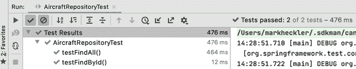

# 第九章。测试 Spring Boot 应用程序以提高生产就绪性

本章讨论和演示了测试 Spring Boot 应用程序的核心方面。尽管测试的主题有许多方面，但我专注于测试 Spring Boot 应用程序的基本元素，这些元素显著提高了每个应用程序的生产就绪性。主题包括单元测试，使用 `@SpringBootTest` 编写有效单元测试的方法，以及使用 Spring Boot 测试切片来隔离测试对象并简化测试。

# 代码检出检查

请查看代码库中的分支 *chapter9begin* 以开始。

# 单元测试

单元测试作为其他类型应用程序测试的前导，是有充分理由的：单元测试使开发人员能够在开发+部署周期的最早阶段发现和修复错误，并因此以最低的成本修复它们。

简而言之，*单元测试* 包括验证一个定义的代码单元，尽可能和合理地隔离。随着大小和复杂性的增加，测试的结果数量呈指数增长；减少每个单元测试中的功能量使得每个测试更加可管理，从而增加考虑所有可能结果的可能性。

只有在成功且足够地实现了单元测试后，才应将集成测试、UI/UX 测试等加入混合中。幸运的是，Spring Boot 集成了简化和优化单元测试的功能，并默认在每个使用 Spring Initializr 构建的项目中包含这些功能，使得开发人员能够快速入门并“做正确的事情”。

# 引入 @SpringBootTest

到目前为止，我主要关注了使用 Spring Initializr 创建的项目中 *src/main/java* 下的代码，从主应用程序类开始。然而，在每个 Initializr 生成的 Spring Boot 应用程序中，还有一个相应的 *src/**test**/java* 目录结构，并且有一个预先创建的（但尚空）测试文件。

也命名为与主应用程序类相对应 - 例如，如果主应用程序类命名为 `MyApplication`，则主测试类将是 `MyApplicationTest` - 这种默认的 1：1 对应有助于组织和保持一致性。在测试类内部，Initializr 创建一个单一的测试方法，为空以提供清洁的起点，以便开发从干净的构建开始。您可以添加更多的测试方法，或者更通常地创建其他测试类以并行其他应用程序类，并在每个类中创建 1 个或多个测试方法。

通常情况下，我会鼓励测试驱动开发（TDD），即先编写测试，然后编写代码使测试通过。由于我坚信在介绍 Spring Boot 如何处理测试之前，先理解 Spring Boot 的关键方面非常重要，所以我相信读者会容许我在介绍本章材料之前延迟的做法。

考虑到这一点，让我们回到飞机位置应用程序并编写一些测试。

为了以最清晰、最简洁的方式展示 Spring Boot 提供的广泛的测试功能，我回到了使用 JPA 版本的 AircraftPositions，并将其作为本章测试重点的基础。还有一些其他与测试相关的主题，它们在本项目中没有被完全体现，但会在接下来的章节中进行介绍。

## 飞机位置应用的重要单元测试

在 AircraftPositions 中，目前只有一个类具有可以被视为有趣行为的类。`PositionController`公开了一个 API，直接或通过 Web 界面向最终用户提供当前飞机位置，并且该 API 可能执行包括以下操作的动作：

+   从 PlaneFinder 获取当前飞机位置

+   将位置存储在本地数据库中

+   从本地数据库检索位置

+   直接返回当前位置或通过将它们添加到文档的`Model`以供网页使用

暂且忽略该功能与外部服务交互的事实，它还触及从用户界面到数据存储和检索的应用程序堆栈的每一层。回顾一个良好的测试方法应该隔离和测试小而紧密功能块的原则，很明显，需要采取迭代的测试方法，从当前代码状态和没有测试的状态向最终优化应用程序组织和测试的状态迈进。这种方法准确反映了典型的面向生产的项目。

###### 注意

由于正在使用的应用程序实际上从未真正“完成”，因此测试也永远不会“完成”。随着应用程序代码的演变，必须审查测试并可能进行修订、删除或添加，以保持测试效果。

我首先创建了一个与`PositionController`类相似的测试类。不同的 IDE 之间创建测试类的机制不同，当然也可以手动创建。由于我主要使用 IntelliJ IDEA 进行开发，我使用`CMD+N`键盘快捷键或右键单击，然后选择“Generate”打开 Generate 菜单，然后选择“Test…”选项来创建测试类。IntelliJ 随后显示如图 9-1 所示的弹出窗口。


###### 图 9-1\. 从 PositionController 类发起的创建测试弹出窗口

从*创建测试*弹出窗口中，我保留了默认的“测试库”选项设置为 JUnit 5。自从 Spring Boot 版本 2.2 正式发布以来，JUnit 版本 5 一直是 Spring Boot 应用程序单元测试的默认选项。还支持许多其他选项，包括 JUnit 3 和 4、Spock 和 TestNG 等，但是 JUnit 5 及其 Jupiter 引擎是一个强大的选项，提供了几种功能：

+   更好地测试 Kotlin 代码（与以前的版本相比）

+   为所有包含的测试进行一次性实例化/配置/清理测试类更加高效，使用`@BeforeAll`和`@AfterAll`方法注解。

+   支持 JUnit 4 和 5 测试（除非明确排除了 JUnit 4 的依赖项）

JUnit 5 的 Jupiter 引擎是默认的，提供了旧版引擎以向后兼容 JUnit 4 单元测试。

我保留了建议的类名`PositionControllerTest`，选中了生成`setup/@Before`和`tearDown/@After`方法的复选框，并选中了在 Figure 9-2 中显示的生成`getCurrentAircraftPositions()`方法的测试方法的复选框。


###### 图 9-2\. 选择所需选项创建测试弹出窗口

一旦点击 OK 按钮，IntelliJ 将创建`PositionControllerTest`类，并打开 IDE，如下所示：

```java
import org.junit.jupiter.api.AfterEach;
import org.junit.jupiter.api.BeforeEach;
import org.junit.jupiter.api.Test;

class PositionControllerTest {

    @BeforeEach
    void setUp() {
    }

    @AfterEach
    void tearDown() {
    }

    @Test
    void getCurrentAircraftPositions() {
    }
}
```

为了在事后尽快构建测试套件，我首先仅仅尽可能地复制了`PositionController`方法`getCurrentAircraftPositions()`的现有操作，其上下文与其已成功运行的相同（字面上的）上下文：Spring Boot `ApplicationContext`。

我首先在类级别添加了`@SpringBootTest`注解。由于最初的目标是尽可能地重现应用程序执行时存在的行为，我指定了一个选项来启动一个嵌入式服务器，并让其监听一个随机端口。为了测试 Web API，我计划使用`WebTestClient`，它类似于应用程序中使用的`WebClient`，但专注于测试：

```java
@SpringBootTest(webEnvironment = SpringBootTest.WebEnvironment.RANDOM_PORT)
@AutoConfigureWebTestClient
```

目前只有一个单元测试，还没有设置/拆卸所需的内容，我把注意力转向了`getCurrentAircraftPositions()`测试方法：

```java
@Test
void getCurrentAircraftPositions(@Autowired WebTestClient client) {
    assert client.get()
            .uri("/aircraft")
            .exchange()
            .expectStatus().isOk()
            .expectBody(Iterable.class)
            .returnResult()
            .getResponseBody()
            .iterator()
            .hasNext();
}
```

需要注意的第一件事是，我为方法内部自动装配了一个`WebTestClient` bean。我所做的这点极少，仅需使用`@AutoConfigureWebTestClient`注解即可，该注解放置在类级别，指示 Spring Boot 创建并自动配置`WebTestClient`。

作为`@Test`方法的全部内容是评估紧随其后的表达式的断言语句。对于这个测试的第一次迭代，我使用 Java 的`assert`来验证客户端操作链的最终结果是一个`boolean` true 值，因此测试通过。

表达式本身使用了注入的 `WebTestClient` bean，在 `PositionController` 的 `getCurrentAircraftPositions()` 方法上发出 `GET` 请求到本地端点 */aircraft*。一旦请求/响应交换完成，将检查 HTTP 状态码以确保响应是“OK”（200），验证响应体是否包含一个 `Iterable`，并获取响应。由于响应包含一个 `Iterable`，因此我使用 `Iterator` 来确定 `Iterable` 中是否至少包含一个值。如果是，测试通过。

###### 警告

当前测试中至少有几个小的妥协。首先，按照当前的编写方式，如果供应飞机位置的外部服务（PlaneFinder）不可用，测试将失败，即使 AircraftPositions 中被测试的所有代码都是正确的。这意味着测试不仅仅是测试其目标功能，而是测试了更多内容。其次，由于我仅测试返回带有 1 个或多个元素的可迭代对象，并未检查元素本身，因此测试的范围有些有限。这意味着在 `Iterable` 中返回任何一种类型的元素，或者是带有无效值的有效元素，都将导致测试通过。我将在接下来的迭代中解决所有这些缺点。

执行测试会提供与图 9-3 类似的结果，表明测试已通过。


###### 图 9-3\. 第一个测试通过

这是一个很好的开始，但是甚至这一个单一的测试也可以显著改进。在扩展我们的单元测试授权之前，让我们清理一下这个测试。

## 为了更好的测试重构

在绝大多数情况下，为了运行少量测试而加载带有嵌入式服务器和应用程序中所有功能的`ApplicationContext`是不合适的。正如前面提到的，单元测试应该专注于并在可能的范围内尽可能自包含。表面积越小，外部依赖越少，测试的目标性就越强。这种激光般的关注带来了几个好处，包括更少的被忽视的场景/结果，更高的测试特异性和严谨性，更可读因此更易理解的测试，以及同样重要的速度。

我之前提到过写低价值和无价值的测试是适得其反的，尽管这意味着什么是依赖于上下文的。然而，有一件事可能会阻止开发人员添加有用的测试，那就是执行测试套件所需的时间。一旦达到某个阈值，这种边界也与上下文有关，开发人员可能会因为增加已经显著的构建时间负担而犹豫不前。幸运的是，Spring Boot 有几种方法可以同时提高测试质量和减少测试执行时间。

如果不需要使用 `WebClient` 或 `WebTestClient` 来满足 `AircraftPosition` API 的需求，下一个合乎逻辑的步骤可能是移除类级别 `@SpringBootTest` 注解中的 `webEnvironment` 参数。这将导致在 `PositionControllerTest` 类的测试中加载一个基本的 `ApplicationContext`，使用 `MOCK` web 环境，从而减少所需的占用空间和加载时间。由于 `WebClient` 是 API 的关键部分，因此 `WebTestClient` 成为测试它的最佳方式，我将用 `@WebFluxTest` 替换类级别的 `@SpringBootTest` 和 `@AutoConfigureWebTestClient` 注解，以简化 `ApplicationContext` 的同时自动配置并提供 `WebTestClient` 访问：

```java
@WebFluxTest({PositionController.class})
```

还有一点需要注意的是 `@WebFluxTest` 注解：除其他事项外，它还可以接受一个 `controllers` 参数，指向要为注解测试类实例化的 `@Controller` bean 类型数组。实际上可以省略 `controllers =` 部分，正如我所做的那样，只留下 `@Controller` 类型的数组，本例中仅有一个 `PositionController`。

### 重新审视代码以隔离行为

正如前面提到的，`PositionController` 的代码涉及多次数据库调用，并直接使用 `WebClient` 访问外部服务。为了更好地隔离 API 和底层操作，使 mocking 更精细、更容易和更清晰，我重构了 `PositionController`，移除了直接定义和使用 `WebClient` 的部分，并将 `getCurrentAircraftPositions()` 方法的整体逻辑移到 `PositionRetriever` 类中，然后注入到并由 `PositionController` 使用：

```java
import lombok.AllArgsConstructor;
import org.springframework.web.bind.annotation.GetMapping;
import org.springframework.web.bind.annotation.RestController;

@AllArgsConstructor
@RestController
public class PositionController {
    private final PositionRetriever retriever;

    @GetMapping("/aircraft")
    public Iterable<Aircraft> getCurrentAircraftPositions() {
        return retriever.retrieveAircraftPositions();
    }
}
```

第一个可模拟版本的 `PositionRetriever` 主要由先前在 `PositionController` 中的代码组成。这一步的主要目标是便于模拟 `retrieveAircraftPositions()` 方法；通过将这段逻辑从 `PositionController` 的 `getCurrentAircraftPositions()` 方法中移除，可以模拟上游调用而不是 web API，从而实现对 `PositionController` 的测试：

```java
import lombok.AllArgsConstructor;
import org.springframework.stereotype.Component;
import org.springframework.web.reactive.function.client.WebClient;

@AllArgsConstructor
@Component
public class PositionRetriever {
    private final AircraftRepository repository;
    private final WebClient client =
            WebClient.create("http://localhost:7634");

    Iterable<Aircraft> retrieveAircraftPositions() {
        repository.deleteAll();

        client.get()
                .uri("/aircraft")
                .retrieve()
                .bodyToFlux(Aircraft.class)
                .filter(ac -> !ac.getReg().isEmpty())
                .toStream()
                .forEach(repository::save);

        return repository.findAll();
    }
}
```

通过对代码进行这些更改，可以修订现有的测试，将飞机位置应用程序的功能与外部服务隔离开来，并专注于通过 mocking 访问 web API 所涉及的其他组件/功能，从而简化和加速测试执行。

### 完善测试

由于重点是测试 Web API，所以最好尽可能多地模拟非实际 Web 交互的逻辑。现在`PositionController::getCurrentAircraftPositions`调用`PositionRetriever`来在请求时提供当前飞机位置，因此`PositionRetriever`是要模拟的第一个组件。Mockito 的`@MockBean`注解——Mockito 已经自动包含在 Spring Boot 测试依赖中——用模拟的替身替换了通常在应用程序启动时创建的`PositionRetriever` bean，然后自动注入：

```java
@MockBean
private PositionRetriever retriever;
```

###### 注意

模拟的 bean 在每次执行测试方法后会自动重置。

然后我转向提供飞机位置的方法`PositionRetriever::retrieveAircraftPositions`。由于我现在注入了用于测试而不是真实对象的`PositionRetriever`模拟对象，因此我必须为`retrieveAircraftPositions()`方法提供一个实现，以便在被`PositionController`调用时以可预测且可测试的方式响应。

我创建了一对飞机位置，以用作`PositionControllerTest`类中测试的样本数据，并在`setUp()`方法中声明`Aircraft`变量并为其分配代表性值。

```java
    private Aircraft ac1, ac2;

    @BeforeEach
    void setUp(ApplicationContext context) {
        // Spring Airlines flight 001 en route, flying STL to SFO,
        //   at 30000' currently over Kansas City
        ac1 = new Aircraft(1L, "SAL001", "sqwk", "N12345", "SAL001",
                "STL-SFO", "LJ", "ct",
                30000, 280, 440, 0, 0,
                39.2979849, -94.71921, 0D, 0D, 0D,
                true, false,
                Instant.now(), Instant.now(), Instant.now());

        // Spring Airlines flight 002 en route, flying SFO to STL,
        //   at 40000' currently over Denver
        ac2 = new Aircraft(2L, "SAL002", "sqwk", "N54321", "SAL002",
                "SFO-STL", "LJ", "ct",
                40000, 65, 440, 0, 0,
                39.8560963, -104.6759263, 0D, 0D, 0D,
                true, false,
                Instant.now(), Instant.now(), Instant.now());
    }
```

###### 注意

在开发应用程序的实际操作中，检索的飞机位置数量几乎总是超过一个，通常远远超过一个。请记住，在测试中使用的样本数据集应至少返回两个位置。在后续迭代中，应考虑为类似生产应用程序的额外测试考虑涉及零、一个或非常大量位置的边缘情况。

现在回到`retrieveAircraftPositions()`方法。Mockito 的`when...thenReturn`组合在满足指定条件时返回指定的响应。现在已定义了示例数据，我可以提供条件和响应，以便调用`PositionRetriever::retrieveAircraftPositions`时返回：

```java
@BeforeEach
void setUp(ApplicationContext context) {
    // Aircraft variable assignments omitted for brevity

    ...

    Mockito.when(retriever.retrieveAircraftPositions())
        .thenReturn(List.of(ac1, ac2));
}
```

有了相关的方法模拟后，现在是时候将注意力转回`PositionControllerTest::getCurrentAircraftPositions`中的单元测试。

由于我已指示测试实例加载了带有类级注释`@WebFluxTest(controllers = {PositionController.class})`的`PositionController` bean，并创建了模拟的`PositionRetriever` bean 并定义了其行为，因此现在可以重构检索位置的测试部分，并对将返回的内容有一定的把握：

```java
@Test
void getCurrentAircraftPositions(@Autowired WebTestClient client) {
    final Iterable<Aircraft> acPositions = client.get()
            .uri("/aircraft")
            .exchange()
            .expectStatus().isOk()
            .expectBodyList(Aircraft.class)
            .returnResult()
            .getResponseBody();

    // Still need to compare with expected results
}
```

所示的操作链应检索由`ac1`和`ac2`组成的`List<Aircraft>`。为了确认正确的结果，我需要将实际结果`acPositions`与预期结果进行比较。其中一种简单的比较方法是：

```java
assertEquals(List.of(ac1, ac2), acPositions);
```

这将正确运行，并且测试将通过。在这个中间步骤中，我还可以通过将实际结果与通过对`AircraftRepository`进行模拟调用获得的结果进行比较，进一步推进事情。通过将以下代码添加到类、`setUp()`方法和`getCurrentAircraftPositions()`测试方法中，会产生类似（通过）的测试结果：

```java
@MockBean
private AircraftRepository repository;

@BeforeEach
void setUp(ApplicationContext context) {
    // Existing setUp code omitted for brevity

    ...

    Mockito.when(repository.findAll()).thenReturn(List.of(ac1, ac2));
}

@Test
void getCurrentAircraftPositions(@Autowired WebTestClient client) {
    // client.get chain of operations omitted for brevity

    ...

    assertEquals(repository.findAll(), acPositions);
}
```

###### 注意

这种变体也会导致通过的测试，但它在某种程度上违反了专注测试的原则，因为现在我将存储库测试的概念与测试 Web API 混合在一起。由于它实际上并没有使用`CrudRepository::findAll`方法而只是模拟了它，所以测试它并没有增加任何可识别的价值。但是，您可能在某些时候会遇到这类测试，所以我认为值得展示和讨论。

当前的`PlaneControllerTest`的工作版本现在应该如下所示：

```java
import org.junit.jupiter.api.BeforeEach;
import org.junit.jupiter.api.Test;
import org.mockito.Mockito;
import org.springframework.beans.factory.annotation.Autowired;
import org.springframework.boot.test.autoconfigure.web.reactive.WebFluxTest;
import org.springframework.boot.test.mock.mockito.MockBean;
import org.springframework.context.ApplicationContext;
import org.springframework.test.web.reactive.server.WebTestClient;

import java.time.Instant;
import java.util.List;

import static org.junit.jupiter.api.Assertions.assertEquals;

@WebFluxTest(controllers = {PositionController.class})
class PositionControllerTest {
    @MockBean
    private PositionRetriever retriever;

    private Aircraft ac1, ac2;

    @BeforeEach
    void setUp(ApplicationContext context) {
        // Spring Airlines flight 001 en route, flying STL to SFO,
        //    at 30000' currently over Kansas City
        ac1 = new Aircraft(1L, "SAL001", "sqwk", "N12345", "SAL001",
                "STL-SFO", "LJ", "ct",
                30000, 280, 440, 0, 0,
                39.2979849, -94.71921, 0D, 0D, 0D,
                true, false,
                Instant.now(), Instant.now(), Instant.now());

        // Spring Airlines flight 002 en route, flying SFO to STL,
        //    at 40000' currently over Denver
        ac2 = new Aircraft(2L, "SAL002", "sqwk", "N54321", "SAL002",
                "SFO-STL", "LJ", "ct",
                40000, 65, 440, 0, 0,
                39.8560963, -104.6759263, 0D, 0D, 0D,
                true, false,
                Instant.now(), Instant.now(), Instant.now());

        Mockito.when(retriever.retrieveAircraftPositions())
            .thenReturn(List.of(ac1, ac2));
    }

    @Test
    void getCurrentAircraftPositions(@Autowired WebTestClient client) {
        final Iterable<Aircraft> acPositions = client.get()
                .uri("/aircraft")
                .exchange()
                .expectStatus().isOk()
                .expectBodyList(Aircraft.class)
                .returnResult()
                .getResponseBody();

        assertEquals(List.of(ac1, ac2), acPositions);
    }
}
```

再次运行会产生一个通过的测试，并且结果与图 9-4 中显示的类似。


###### 图 9-4\. AircraftRepository::getCurrentAircraftPositions 的新、改进的测试

随着满足应用程序/用户需求所需的 Web API 的扩展，应首先指定单元测试（在创建实现这些需求的实际代码之前），以确保正确的结果。

# 测试片段

我已经多次提到过专注测试的重要性，Spring 还有另一种机制可以帮助开发人员快速而轻松地完成这项工作：测试片段。

Spring Boot 测试依赖`spring-boot-starter-test`中内置了几个注解，自动配置这些功能片段。所有这些测试片段注解都以类似的方式工作，加载一个`ApplicationContext`和为指定的片段合理的选择组件。例如：

+   `@JsonTest`

+   `@WebMvcTest`

+   `@WebFluxText`（先前介绍过）

+   `@DataJpaTest`

+   `@JdbcTest`

+   `@DataJdbcTest`

+   `@JooqTest`

+   `@DataMongoTest`

+   `@DataNeo4jTest`

+   `@DataRedisTest`

+   `@DataLdapTest`

+   `@RestClientTest`

+   `@AutoConfigureRestDocs`

+   `@WebServiceClientTest`

在早期的一节中，利用`@WebFluxTest`来执行和验证 Web API，我提到了测试数据存储互动并将其从测试中排除，因为它专注于测试 Web 互动。为了更好地展示数据测试以及测试片段如何有助于针对特定功能，接下来我会进行探讨。

由于当前的 Aircraft Positions 使用 JPA 和 H2 来存储和检索当前位置，因此 `@DataJpaTest` 完全适用。我开始使用 IntelliJ IDEA 为测试创建一个新类，打开 `AircraftRepository` 类，并使用与之前相同的方法创建测试类：CMD+N，选择“Test…”，将 JUnit5 作为“Testing Library”，保留其他默认值，并选择 *setUp/@Before* 和 *tearDown/@After* 选项，如 图 9-5 所示。


###### 图 9-5\. 为 AircraftRepository 创建测试弹出窗口

###### 注意

由于 Spring Data `Repository` bean 通过自动配置向 Spring Boot 应用程序提供通用方法，因此不显示任何方法。下面，我将添加测试方法来演示这些方法的使用，如果您创建自定义 repository 方法，则也可以（并且应该）对其进行测试。

单击“OK”按钮生成测试类 `AircraftRepositoryTest`：

```java
import org.junit.jupiter.api.AfterEach;
import org.junit.jupiter.api.BeforeEach;

class AircraftRepositoryTest {

    @BeforeEach
    void setUp() {
    }

    @AfterEach
    void tearDown() {
    }
}
```

首要任务当然是向 `AircraftRepositoryTest` 类添加测试切片注解 `@DataJpaTest`：

```java
@DataJpaTest
class AircraftRepositoryTest {

    ...

}
```

添加此单个注解后，执行测试将扫描 `@Entity` 类并配置 Spring Data JPA repository — 在 Aircraft Positions 应用程序中分别是 `Aircraft` 和 `AircraftRepository`。如果类路径中存在嵌入式数据库（如此处的 H2），测试引擎也会对其进行配置。通常不会扫描用 `@Component` 注解标记的类以进行 bean 创建。

为了测试实际的 repository 操作，repository 不能被模拟；由于 `@DataJpaTest` 注解加载和配置了一个 `AircraftRepository` bean，因此无需模拟它。我使用 `@Autowire` 注入 repository bean，并像之前的 `PositionController` 测试中一样，声明 `Aircraft` 变量最终作为测试数据：

```java
@Autowired
private AircraftRepository repository;

private Aircraft ac1, ac2;
```

为了设置这个 `AircraftRepositoryTest` 类中将存在的测试的适当环境，我创建两个 `Aircraft` 对象，将每个分配给已声明的成员变量，并在 `setUp()` 方法中使用 `Repository::saveAll` 将它们保存到 repository 中。

```java
@BeforeEach
void setUp() {
    // Spring Airlines flight 001 en route, flying STL to SFO,
    // at 30000' currently over Kansas City
    ac1 = new Aircraft(1L, "SAL001", "sqwk", "N12345", "SAL001",
            "STL-SFO", "LJ", "ct",
            30000, 280, 440, 0, 0,
            39.2979849, -94.71921, 0D, 0D, 0D,
            true, false,
            Instant.now(), Instant.now(), Instant.now());

    // Spring Airlines flight 002 en route, flying SFO to STL,
    // at 40000' currently over Denver
    ac2 = new Aircraft(2L, "SAL002", "sqwk", "N54321", "SAL002",
            "SFO-STL", "LJ", "ct",
            40000, 65, 440, 0, 0,
            39.8560963, -104.6759263, 0D, 0D, 0D,
            true, false,
            Instant.now(), Instant.now(), Instant.now());

    repository.saveAll(List.of(ac1, ac2));
}
```

接下来，我创建一个测试方法来验证在执行 `AircraftRepository` bean 上的 `findAll()` 后返回的结果确实是预期的内容：一个包含在测试的 `setUp()` 方法中保存的两个飞机位置的 `Iterable<Aircraft>`：

```java
@Test
void testFindAll() {
    assertEquals(List.of(ac1, ac2), repository.findAll());
}
```

###### 注意

`List` 扩展 `Collection`，而 `Collection` 又扩展 `Iterable`。

运行此测试将提供一个通过的结果，类似于在 图 9-6 中显示的内容。


###### 图 9-6\. `findAll()` 的测试结果

类似地，我创建了一个测试`AircraftRepository`方法来查找特定 ID 字段的记录，即`findById()`。由于测试类的`setUp()`中调用了`Repository::saveAll`方法，所以应存储两条记录，我会查询这两条记录并与预期值进行验证。

```java
@Test
void testFindById() {
    assertEquals(Optional.of(ac1), repository.findById(ac1.getId()));
    assertEquals(Optional.of(ac2), repository.findById(ac2.getId()));
}
```

运行`testFindById()`测试会显示通过，如图 9-7 所示。


###### 图 9-7\. `findById()`的测试结果

最后，在所有测试运行完成后，需要进行一些清理工作。我在`tearDown()`方法中添加了一个语句，用于删除`AircraftRepository`中的所有记录：

```java
@AfterEach
void tearDown() {
    repository.deleteAll();
}
```

请注意，在这种情况下，真的没有必要从存储库中删除所有记录，因为它是 H2 数据库的内存实例，在每次测试之前都会重新初始化。然而，这代表了通常会放置在测试类的`tearDown()`方法中的操作类型。

在`AircraftRepositoryTest`中执行所有测试会产生类似于图 9-8 中显示的通过结果。



###### 图 9-8\. `AircraftRepositoryTest`中所有测试的测试结果

应用程序在不断演化的过程中，测试永远不会完成。然而，对于目前在 Aircraft Positions 中存在的功能，本章节中编写的测试提供了一个良好的代码验证起点，并在应用程序功能增加时进行持续扩展。

# 代码检出检查

若要获取完整的章节代码，请查看代码库中的*chapter9end*分支。

# 总结

本章讨论并演示了测试 Spring Boot 应用程序的核心方面，重点是测试 Spring Boot 应用程序的基本方面，这些方面最大程度地提高了每个应用程序的生产准备就绪性。涵盖的主题包括单元测试，使用`@SpringBootTest`进行整体应用程序测试，如何使用 JUnit 编写有效的单元测试以及使用 Spring Boot 测试片段来隔离测试主题并简化测试。

下一章将探讨诸如认证和授权等安全概念。然后，我将演示如何为自包含应用程序实现基于表单的身份验证，以及如何利用 OpenID Connect 和 OAuth2 来实现最大安全性和灵活性，所有这些都将使用 Spring Security。
