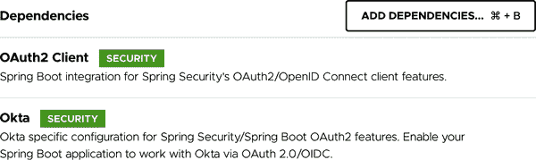
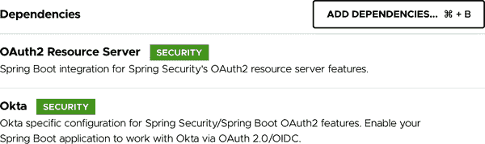
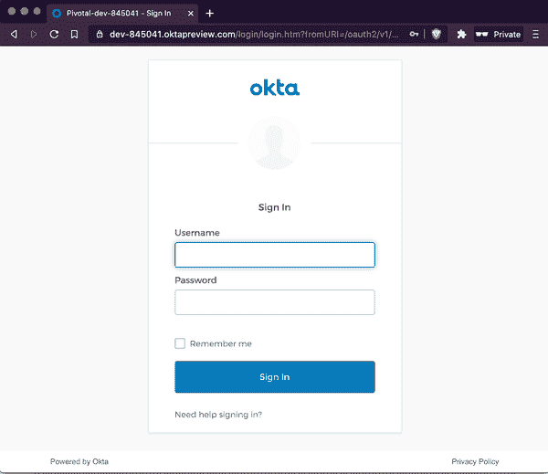
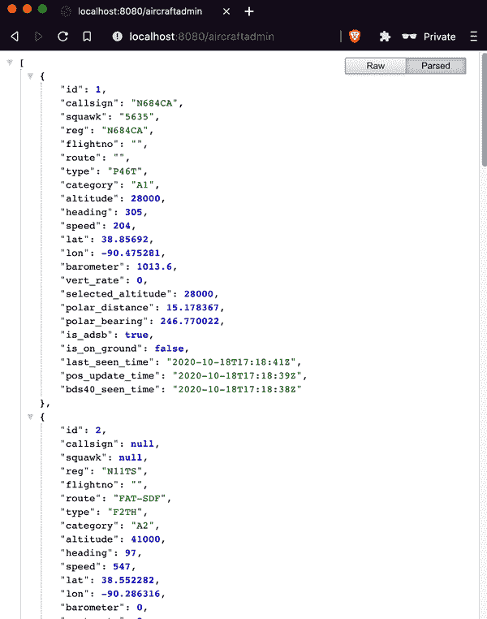
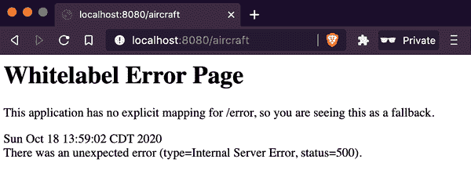

# 第十章。保护您的 Spring Boot 应用程序

理解认证和授权的概念对构建安全应用程序至关重要，为用户验证和访问控制提供基础。Spring Security 结合认证和授权的选项与 HTTP 防火墙、过滤器链、广泛使用的 IETF 和万维网联盟（W3C）标准及用于交换的选项等其他机制，帮助锁定应用程序。采用安全的开箱即用思维方式，Spring Security 利用 Boot 强大的自动配置来评估开发者的输入和可用的依赖关系，以在最小的努力下为 Spring Boot 应用程序提供最大的安全性。

本章介绍并解释了安全的核心方面以及它们如何适用于应用程序。我演示了多种将 Spring Security 集成到 Spring Boot 应用程序中以增强应用程序安全姿态的方法，弥补了覆盖中的危险漏洞并减少了攻击面积。

# 代码结帐检查

请从代码库中检出分支 *chapter10begin* 开始。

# 认证和授权

经常一起使用，*认证* 和 *授权* 这两个术语相关但又是独立的关注点。

认证

表示、展示或证实某事物（如身份、艺术品或金融交易）的真实性、真实性或真实性的行为、过程或方法；验证某事物的真实性的行为或过程。

授权

1: *授权* 的行为 2: 授权的工具：批准

*授权* 的第一个定义指向 *授权* 以获取更多信息：

授权

1: 通过或像通过某种公认或适当的权威（如习惯、证据、个人权利或监管权力）背书、授权、证明或允许的习惯由时间授权的 2: 尤其是具有法律权威的投资 3: 古老：证明

*授权* 的定义反过来指向 *证明* 以获取更多信息。

尽管有些有趣，但这些定义并不十分清晰。有时，词典定义可能没有我们期望的那么有帮助。我自己的定义如下。

认证

证明某人是他们所声称的人

授权

验证某人是否有权访问特定资源或操作

## 认证

简单来说，*认证* 是证明某人（或某物）是其所声称的人（或物，如设备、应用程序或服务）。

认证的概念在物理世界中有几个具体的例子。如果您曾经需要展示像员工工牌、驾驶执照或护照等身份证明来证明您的身份，那么您已经进行了认证。证明某人是其声称的人是一个我们在多种情况下都习以为常的程序，而在物理级别和应用程序级别的认证概念差异微不足道。

身份验证通常涉及以下一项或多项：

+   你所是的东西

+   你所知道的东西

+   你所拥有的东西

###### 注意

这三个*因素*可以单独使用，也可以组合起来构成多因素身份验证（MFA）。

身份验证在物理世界和虚拟世界中发生的方式当然是不同的。与物理世界中经常发生的人类注视照片 ID 并将其与您当前的外貌进行比较不同，身份验证到应用程序通常涉及键入密码，插入安全密钥或提供生物特征数据（虹膜扫描，指纹等）。这些数据可以更容易地由软件进行评估，而不是与照片的外观进行比较，目前比较难以实现。尽管如此，两种情况下都会对提供的数据进行比较，并且匹配会提供积极的身份验证。

## 授权

一旦一个人通过身份验证，他们就有可能获得一个或多个个人可以使用的资源和/或允许执行的操作。

###### 注意

在这种情况下，一个人可能是（而且很可能是）一个人类，但是对于应用程序，服务，设备等，根据上下文，相同的概念和访问考虑都适用。

一旦个人的身份得到证明，该个人就会获得对应用程序的一般级别的访问权限。从那里，现在已验证的应用程序用户可以请求访问某些内容。然后，应用程序必须以某种方式确定用户是否被允许访问该资源，即*授权*。如果是这样，则授予用户访问权限；如果不是，则通知用户，他们缺乏*权限*导致其请求被拒绝。

# Spring Security 简介

除了提供可靠的身份验证和授权选项外，Spring Security 还提供了其他几种机制，帮助开发人员确保其 Spring Boot 应用程序的安全性。由于自动配置，Spring Boot 应用程序根据提供的信息启用每个适用的 Spring Security 功能，甚至由于缺乏更具体的指导。安全功能当然可以根据开发人员的需要进行调整或放宽，以适应其组织的具体要求。

Spring Security 的功能远远超出了本章详尽介绍的范围，但有三个关键功能对理解 Spring Security 模型及其基础至关重要。它们是 HTTP 防火墙，安全过滤器链以及 Spring Security 对 IETF 和 W3C 标准的广泛使用以及对请求和相应的选项。

## HTTP 防火墙

虽然确切的数字很难获得，但许多安全妥协始于使用格式不正确的 URI 进行请求，以及系统对其的意外响应。这实际上是应用程序的第一道防线，因此在考虑进一步努力保护应用程序之前，应首先解决这个问题。

自 5.0 版本起，Spring Security 已经包含了一个内置的 HTTP 防火墙，用于审查所有入站请求的问题格式。如果请求存在任何问题，如不良的头部值或格式不正确，则请求将被丢弃。除非开发者进行了覆盖，否则默认实现使用的是名为`StrictHttpFirewall`的适当命名的实现，快速关闭应用程序安全配置中的第一个且可能最容易被利用的漏洞。

## 安全过滤器链

Spring Security 提供了一个更为具体、更高级别的入站请求过滤器链，用于处理成功通过 HTTP 防火墙的正常形式的请求。

简而言之，对于大多数应用程序，开发者通过指定一系列过滤器条件，使得入站请求通过这些条件直到匹配一个过滤器。当请求与过滤器匹配时，将评估其相应的条件，以确定是否满足请求。例如，如果到达特定 API 端点的请求与过滤器链中的某个条件匹配，则将检查发出请求的用户是否具有访问所请求资源的适当角色/权限。如果是，则处理请求；如果不是，则通常使用 *403 Forbidden* 状态码拒绝请求。

如果一个请求通过链中定义的所有过滤器而不匹配任何过滤器，则该请求将被丢弃。

## 请求和响应头部

IETF 和 W3C 创建了多个基于 HTTP 的交换规范和标准，其中几个与信息安全的安全交换相关。这些头部用于请求或指示特定行为，并定义了允许的值和行为响应。Spring Security 广泛使用这些头部详情来增强您的 Spring Boot 应用程序的安全性姿态。

了解到不同的用户代理可能支持这些标准和规范的一些或全部，Spring Security 通过检查所有已知的头部选项并在请求中查找它们，在响应中适用时提供它们，采用了尽可能覆盖的最佳实践方法。

# 使用 Spring Security 实现基于表单的身份验证和授权

每天都有无数使用“something you know”身份验证方法的应用程序被使用。无论是用于组织内部的应用程序，直接通过互联网提供给消费者的 Web 应用程序，还是移动设备本地的应用程序，输入用户 ID 和密码对开发者和非开发者来说都是熟悉的例行公事。在大多数情况下，这种提供的安全性已经足以完成手头的任务。

Spring Security 为 Spring Boot 应用程序提供了出色的开箱即用（OOTB）支持，通过自动配置和易于理解的抽象来进行密码验证。本节演示了通过重构`Aircraft Positions`应用程序以使用 Spring Security 实现基于表单的身份验证的各种起始点。

## 添加 Spring Security 依赖项

在创建新的 Spring Boot 项目时，通过 Spring Initializr 添加一个更多的依赖项，即*Spring Security*，可以在不对新应用程序进行额外配置的情况下提供顶级安全性，如图 10-1 所示。


###### 图 10-1\. Spring Initializr 中的 Spring Security 依赖项

更新现有应用程序稍微复杂一点。我将在`Aircraft Positions`的*pom.xml* Maven 构建文件中添加与 Initializr 添加的两个互补依赖项，一个是用于 Spring Security 本身，另一个用于测试它：

```java
<dependency>
    <groupId>org.springframework.boot</groupId>
    <artifactId>spring-boot-starter-security</artifactId>
</dependency>
<dependency>
    <groupId>org.springframework.security</groupId>
    <artifactId>spring-security-test</artifactId>
    <scope>test</scope>
</dependency>
```

将 Spring Security 添加到类路径中并且没有代码或配置更改应用时，我重新启动`Aircraft Positions`进行快速功能检查。这提供了一个很好的机会，了解 Spring Security 在开发者方面所做的工作。

运行`PlaneFinder`和`Aircraft Positions`两个应用后，我返回终端，并再次调用`Aircraft Positions`的*/aircraft*端点，如下所示：

```java
mheckler-a01 :: ~ » http :8080/aircraft
HTTP/1.1 401
Cache-Control: no-cache, no-store, max-age=0, must-revalidate
Expires: 0
Pragma: no-cache
Set-Cookie: JSESSIONID=347DD039FE008DE50F457B890F2149C0; Path=/; HttpOnly
WWW-Authenticate: Basic realm="Realm"
X-Content-Type-Options: nosniff
X-Frame-Options: DENY
X-XSS-Protection: 1; mode=block

{
    "error": "Unauthorized",
    "message": "",
    "path": "/aircraft",
    "status": 401,
    "timestamp": "2020-10-10T17:26:31.599+00:00"
}
```

###### 注：

为了清晰起见，已删除了一些响应头。

正如你所见，我无法再访问*/aircraft*端点，因为我的请求收到了*401 Unauthorized*的响应。由于*/aircraft*端点目前是从`Aircraft Positions`应用程序访问信息的唯一途径，这有效地意味着该应用程序已经完全保护免受未经授权的访问。这是一个好消息，但重要的是要理解这是如何发生的，以及如何为合法用户恢复所需的访问权限。

正如我之前提到的，Spring Security 采用“默认安全”的思路，在开发者使用它在 Spring Boot 应用程序中的每个级别配置甚至零配置时尽可能安全。当 Spring Boot 在类路径中找到 Spring Security 时，安全性将使用合理的默认值进行配置。即使没有定义任何用户或指定任何密码或开发者未作出任何其他努力，项目中包含 Spring Security 都表明其目标是创建一个安全的应用程序。

可以想象，这些信息非常少。但是，Spring Boot+Security 自动配置创建了一些基本安全功能的关键 Bean，基于表单认证和使用用户 ID 和密码进行用户授权。从这个逻辑假设合理地得出的下一个问题是：使用什么用户？什么密码？

返回到`Aircraft Positions`应用程序的启动日志，可以在以下行找到其中一个问题的答案：

```java
Using generated security password: 1ad8a0fc-1a0c-429e-8ed7-ba0e3c3649ef
```

如果在应用程序中未指定用户 ID 和密码，也未提供其他访问方式，则启用安全性的 Spring Boot 应用程序将默认使用一个名为`user`的单一用户帐户，并在每次应用程序启动时生成一个新的唯一密码。回到终端窗口，我尝试再次访问应用程序，这次使用提供的凭据：

```java
mheckler-a01 :: ~ » http :8080/aircraft
    --auth user:1ad8a0fc-1a0c-429e-8ed7-ba0e3c3649ef
HTTP/1.1 200
Cache-Control: no-cache, no-store, max-age=0, must-revalidate
Expires: 0
Pragma: no-cache
Set-Cookie: JSESSIONID=94B52FD39656A17A015BC64CF6BF7475; Path=/; HttpOnly
X-Content-Type-Options: nosniff
X-Frame-Options: DENY
X-XSS-Protection: 1; mode=block

[
    {
        "altitude": 40000,
        "barometer": 1013.6,
        "bds40_seen_time": "2020-10-10T17:48:02Z",
        "callsign": "SWA2057",
        "category": "A3",
        "flightno": "WN2057",
        "heading": 243,
        "id": 1,
        "is_adsb": true,
        "is_on_ground": false,
        "last_seen_time": "2020-10-10T17:48:06Z",
        "lat": 38.600372,
        "lon": -90.42375,
        "polar_bearing": 207.896382,
        "polar_distance": 24.140226,
        "pos_update_time": "2020-10-10T17:48:06Z",
        "reg": "N557WN",
        "route": "IND-DAL-MCO",
        "selected_altitude": 40000,
        "speed": 395,
        "squawk": "2161",
        "type": "B737",
        "vert_rate": -64
    },
    {
        "altitude": 3500,
        "barometer": 0.0,
        "bds40_seen_time": null,
        "callsign": "N6884J",
        "category": "A1",
        "flightno": "",
        "heading": 353,
        "id": 2,
        "is_adsb": true,
        "is_on_ground": false,
        "last_seen_time": "2020-10-10T17:47:45Z",
        "lat": 39.062851,
        "lon": -90.084965,
        "polar_bearing": 32.218696,
        "polar_distance": 7.816637,
        "pos_update_time": "2020-10-10T17:47:45Z",
        "reg": "N6884J",
        "route": "",
        "selected_altitude": 0,
        "speed": 111,
        "squawk": "1200",
        "type": "P28A",
        "vert_rate": -64
    },
    {
        "altitude": 39000,
        "barometer": 0.0,
        "bds40_seen_time": null,
        "callsign": "ATN3425",
        "category": "A5",
        "flightno": "",
        "heading": 53,
        "id": 3,
        "is_adsb": true,
        "is_on_ground": false,
        "last_seen_time": "2020-10-10T17:48:06Z",
        "lat": 39.424159,
        "lon": -90.419739,
        "polar_bearing": 337.033437,
        "polar_distance": 30.505314,
        "pos_update_time": "2020-10-10T17:48:06Z",
        "reg": "N419AZ",
        "route": "AFW-ABE",
        "selected_altitude": 0,
        "speed": 524,
        "squawk": "2224",
        "type": "B763",
        "vert_rate": 0
    },
    {
        "altitude": 45000,
        "barometer": 1012.8,
        "bds40_seen_time": "2020-10-10T17:48:06Z",
        "callsign": null,
        "category": "A2",
        "flightno": "",
        "heading": 91,
        "id": 4,
        "is_adsb": true,
        "is_on_ground": false,
        "last_seen_time": "2020-10-10T17:48:06Z",
        "lat": 39.433982,
        "lon": -90.50061,
        "polar_bearing": 331.287125,
        "polar_distance": 32.622134,
        "pos_update_time": "2020-10-10T17:48:05Z",
        "reg": "N30GD",
        "route": "",
        "selected_altitude": 44992,
        "speed": 521,
        "squawk": null,
        "type": "GLF4",
        "vert_rate": 64
    }
]
```

###### 注意

如前所述，为了清晰起见，已删除了一些响应标头。

使用正确的默认用户 ID 和生成的密码，我收到了*200 OK*的响应，并再次可以访问*/aircraft*端点，从而访问了`Aircraft Positions`应用程序。

回到`Aircraft Positions`应用程序，当前应用程序安全状态存在几个问题。首先，只有一个定义的用户，需要访问该应用程序的多个人员必须全部使用该单一帐户。这与安全责任和甚至身份验证的原则背道而驰，因为没有单一的个体可以唯一证明他们是谁。再谈责任问题，如果发生漏洞，如何确定是谁造成或贡献了漏洞？更不用说，如果发生漏洞，锁定唯一用户帐户将禁止所有用户访问；目前没有办法避免这种情况。

现有安全配置的次要问题是如何处理单一密码。每次应用程序启动时，都会自动生成新密码，然后必须与所有用户共享。虽然尚未讨论应用程序的扩展性，但每个启动的`Aircraft Positions`实例将生成一个唯一密码，需要用户输入该特定应用程序实例的密码。显然可以并且应该做出一些改进。

## 添加认证

Spring Security 使用`UserDetailsService`的概念作为其认证能力的核心。`UserDetailsService`是一个接口，具有一个`loadUserByUsername(String username)`方法（在实现时）返回一个满足`UserDetails`接口的对象，从中可以获取关键信息，如用户的名称、密码、授予用户的权限和账户状态。这种灵活性允许使用各种技术进行多种实现；只要`UserDetailsService`返回`UserDetails`，应用程序就不需要知道底层实现细节。

要创建一个`UserDetailsService` bean，我创建一个配置类，在其中定义一个 bean 创建方法。

首先，我创建一个名为`SecurityConfig`的类，并使用`@Configuration`进行注解，以便 Spring Boot 能够找到并执行其中的 bean 创建方法。用于身份验证的 bean 是实现`UserDetailsService`接口的 bean，因此我创建一个名为`authentication()`的方法来创建并返回该 bean。这是第一次，有意不完整的代码：

```java
import org.springframework.context.annotation.Bean;
import org.springframework.context.annotation.Configuration;
import org.springframework.security.core.userdetails.User;
import org.springframework.security.core.userdetails.UserDetails;
import org.springframework.security.core.userdetails.UserDetailsService;
import org.springframework.security.provisioning.InMemoryUserDetailsManager;

@Configuration
public class SecurityConfig {
    @Bean
    UserDetailsService authentication() {
        UserDetails peter = User.builder()
                .username("peter")
                .password("ppassword")
                .roles("USER")
                .build();

        UserDetails jodie = User.builder()
                .username("jodie")
                .password("jpassword")
                .roles("USER", "ADMIN")
                .build();

        System.out.println("   >>> Peter's password: " + peter.getPassword());
        System.out.println("   >>> Jodie's password: " + jodie.getPassword());

        return new InMemoryUserDetailsManager(peter, jodie);
    }
}
```

在`UserDetailService`的`authentication()`方法中，我使用`User`类的`builder()`方法创建了两个实现`UserDetails`接口要求的应用对象，并指定了用户名、密码和用户拥有的角色/权限。然后我使用`build()`方法构建这些用户，并将每个用户分配给一个局部变量。

接下来，我仅仅为演示目的显示密码。这有助于展示本章中的另一个概念，但**仅供演示目的**。

###### 警告

记录密码是一种最坏的反模式。永远不要在生产应用程序中记录密码。

最后，我创建了一个`InMemoryUserDetailsManager`，使用这两个创建的`User`对象，并将其作为 Spring bean 返回。`InMemoryUserDetailsManager`实现了`UserDetailsManager`和`UserDetailsPasswordService`接口，使得可以进行用户管理任务，如确定特定用户是否存在、创建、更新和删除用户，以及更改/更新用户的密码。我使用`InMemoryUserDetailsManager`是为了在演示概念时更加清晰（因为没有外部依赖），但任何实现`UserDetailsService`接口的 bean 都可以作为认证 bean 提供。

重新启动`Aircraft Positions`，我尝试进行身份验证，并检索当前飞机位置的列表，结果如下（为简洁起见，删除了一些标题）：

```java
mheckler-a01 :: ~ » http :8080/aircraft --auth jodie:jpassword
HTTP/1.1 401
Cache-Control: no-cache, no-store, max-age=0, must-revalidate
Content-Length: 0
Expires: 0
Pragma: no-cache
WWW-Authenticate: Basic realm="Realm"
X-Content-Type-Options: nosniff
X-Frame-Options: DENY
X-XSS-Protection: 1; mode=block
```

这促使一些故障排除。返回到 IDE，堆栈跟踪中有一些有用的信息：

```java
java.lang.IllegalArgumentException: There is no PasswordEncoder
    mapped for the id "null"
	at org.springframework.security.crypto.password
        .DelegatingPasswordEncoder$UnmappedIdPasswordEncoder
            .matches(DelegatingPasswordEncoder.java:250)
                ~[spring-security-core-5.3.4.RELEASE.jar:5.3.4.RELEASE]
```

这为问题的根源提供了一个提示。检查记录的密码（友情提醒：记录密码**仅供演示目的**）得到了确认：

```java
>>> Peter's password: ppassword
>>> Jodie's password: jpassword
```

*显然* 这些密码是明文的，没有进行任何编码。实现工作和安全的身份验证的下一步是在 `SecurityConfig` 类中添加一个密码编码器，如下所示：

```java
private final PasswordEncoder pwEncoder =
        PasswordEncoderFactories.createDelegatingPasswordEncoder();
```

创建和维护安全应用程序的一个挑战在于，安全性必须不断进化。Spring Security 正是出于这个必要性，不仅仅有一个指定的编码器可供插入；它使用一个具有多个可用编码器的工厂，并委托其中一个进行编码和解码任务。

当然，这意味着在前面的示例中，如果没有指定编码器，则必须作为默认值服务。目前 *BCrypt* 是（非常好的）默认值，但是 Spring Security 编码器架构的灵活委托性质使得在标准演变和/或需求变化时可以轻松地将一个编码器替换为另一个。这种方法的优雅性允许在应用程序用户登录时轻松地将凭据从一个编码器迁移到另一个编码器，从而再次减少了一些虽然对组织至关重要但并不直接提供价值的任务。

现在我已经放置了一个编码器，下一步是使用它来加密用户密码。这可以通过简单地调用密码编码器的 `encode()` 方法，并传递明文密码来完成，然后收到加密结果。

###### 提示

严格来说，加密一个值也会对该值进行编码，但并非所有编码器都会加密。例如，哈希编码一个值但不一定加密它。也就是说，Spring Security 支持的每种编码算法也都会进行加密；然而，为了支持旧的应用程序，某些支持的算法远不如其他算法安全。始终选择当前推荐的 Spring Security 编码器或选择由 `PasswordEncoderFactories.createDelegatingPasswordEncoder()` 提供的默认编码器。

经过修订的 `SecurityConfig` 类的身份验证版本如下所示：

```java
import org.springframework.context.annotation.Bean;
import org.springframework.context.annotation.Configuration;
import org.springframework.security.core.userdetails.User;
import org.springframework.security.core.userdetails.UserDetails;
import org.springframework.security.core.userdetails.UserDetailsService;
import org.springframework.security.crypto.factory.PasswordEncoderFactories;
import org.springframework.security.crypto.password.PasswordEncoder;
import org.springframework.security.provisioning.InMemoryUserDetailsManager;

@Configuration
public class SecurityConfig {
    private final PasswordEncoder pwEncoder =
            PasswordEncoderFactories.createDelegatingPasswordEncoder();

    @Bean
    UserDetailsService authentication() {
        UserDetails peter = User.builder()
                .username("peter")
                .password(pwEncoder.encode("ppassword"))
                .roles("USER")
                .build();

        UserDetails jodie = User.builder()
                .username("jodie")
                .password(pwEncoder.encode("jpassword"))
                .roles("USER", "ADMIN")
                .build();

        System.out.println("   >>> Peter's password: " + peter.getPassword());
        System.out.println("   >>> Jodie's password: " + jodie.getPassword());

        return new InMemoryUserDetailsManager(peter, jodie);
    }
}
```

我重新启动 `Aircraft Positions`，然后再次尝试进行身份验证并检索当前飞机位置列表，结果如下（为简洁起见，某些标题和结果已删除）：

```java
mheckler-a01 :: ~ » http :8080/aircraft --auth jodie:jpassword
HTTP/1.1 200
Cache-Control: no-cache, no-store, max-age=0, must-revalidate
Expires: 0
Pragma: no-cache
X-Content-Type-Options: nosniff
X-Frame-Options: DENY
X-XSS-Protection: 1; mode=block

[
    {
        "altitude": 24250,
        "barometer": 0.0,
        "bds40_seen_time": null,
        "callsign": null,
        "category": "A2",
        "flightno": "",
        "heading": 118,
        "id": 1,
        "is_adsb": true,
        "is_on_ground": false,
        "last_seen_time": "2020-10-12T16:13:26Z",
        "lat": 38.325119,
        "lon": -90.154159,
        "polar_bearing": 178.56009,
        "polar_distance": 37.661127,
        "pos_update_time": "2020-10-12T16:13:24Z",
        "reg": "N168ZZ",
        "route": "FMY-SUS",
        "selected_altitude": 0,
        "speed": 404,
        "squawk": null,
        "type": "LJ60",
        "vert_rate": 2880
    }
]
```

这些结果证实了认证已成功（由于空间限制，故意使用不正确的密码进行失败的场景被省略），有效用户可以再次访问暴露的 API。

回顾并且现在查看已编码的密码，我注意到在 IDE 输出中类似以下值：

```java
>>> Peter's password:
    {bcrypt}$2a$10$rLKBzRBvtTtNcV9o8JHzFeaIskJIPXnYgVtCPs5H0GINZtk1WzsBu
>>> Jodie's password: {
    bcrypt}$2a$10$VR33/dlbSsEPPq6nlpnE/.ZQt0M4.bjvO5UYmw0ZW1aptO4G8dEkW
```

登录的值确认了代码中指定的两个示例密码已经由委托密码编码器成功编码，使用 *BCrypt*。

## 授权

现在，`Aircraft Positions`应用程序成功地认证用户，并仅允许这些用户访问其暴露的 API。然而，当前安全配置存在一个相当大的问题：访问 API 的任何部分都意味着可以访问所有部分，无论用户拥有的角色/权限，或者更确切地说，无论用户*不*拥有的角色。

作为这个安全漏洞的一个非常简单的例子，我在`Aircraft Position`的 API 中添加了另一个端点，通过克隆、重命名和重新映射`PositionController`类中现有的`getCurrentAircraftPositions()`方法作为第二个端点。完成后，`PositionController`如下所示：

```java
import lombok.AllArgsConstructor;
import org.springframework.web.bind.annotation.GetMapping;
import org.springframework.web.bind.annotation.RestController;

@AllArgsConstructor
@RestController
public class PositionController {
    private final PositionRetriever retriever;

    @GetMapping("/aircraft")
    public Iterable<Aircraft> getCurrentAircraftPositions() {
        return retriever.retrieveAircraftPositions();
    }

    @GetMapping("/aircraftadmin")
    public Iterable<Aircraft> getCurrentAircraftPositionsAdminPrivs() {
        return retriever.retrieveAircraftPositions();
    }
}
```

目标是只允许具有“ADMIN”角色的用户访问第二个方法`getCurrentAircraftPositionsAdminPrivs()`。虽然在这个例子的当前版本中，返回的值与`getCurrentAircraftPositions()`返回的值相同，但随着应用程序的扩展，这种情况可能不会持续，这个概念仍然适用。

重新启动`Aircraft Positions`应用程序并返回命令行，我首先以用户 Jodie 的身份登录，以验证对新端点的访问，预期的访问已确认（由于空间限制，省略了第一个端点的访问确认以及部分标题和结果）。

```java
mheckler-a01 :: ~ » http :8080/aircraftadmin --auth jodie:jpassword
HTTP/1.1 200
Cache-Control: no-cache, no-store, max-age=0, must-revalidate
Expires: 0
Pragma: no-cache
X-Content-Type-Options: nosniff
X-Frame-Options: DENY
X-XSS-Protection: 1; mode=block

[
    {
        "altitude": 24250,
        "barometer": 0.0,
        "bds40_seen_time": null,
        "callsign": null,
        "category": "A2",
        "flightno": "",
        "heading": 118,
        "id": 1,
        "is_adsb": true,
        "is_on_ground": false,
        "last_seen_time": "2020-10-12T16:13:26Z",
        "lat": 38.325119,
        "lon": -90.154159,
        "polar_bearing": 178.56009,
        "polar_distance": 37.661127,
        "pos_update_time": "2020-10-12T16:13:24Z",
        "reg": "N168ZZ",
        "route": "FMY-SUS",
        "selected_altitude": 0,
        "speed": 404,
        "squawk": null,
        "type": "LJ60",
        "vert_rate": 2880
    },
    {
        "altitude": 38000,
        "barometer": 1013.6,
        "bds40_seen_time": "2020-10-12T20:24:48Z",
        "callsign": "SWA1828",
        "category": "A3",
        "flightno": "WN1828",
        "heading": 274,
        "id": 2,
        "is_adsb": true,
        "is_on_ground": false,
        "last_seen_time": "2020-10-12T20:24:48Z",
        "lat": 39.348862,
        "lon": -90.751668,
        "polar_bearing": 310.510201,
        "polar_distance": 35.870036,
        "pos_update_time": "2020-10-12T20:24:48Z",
        "reg": "N8567Z",
        "route": "TPA-BWI-OAK",
        "selected_altitude": 38016,
        "speed": 397,
        "squawk": "7050",
        "type": "B738",
        "vert_rate": -128
    }
]
```

接下来，我以 Peter 的身份登录。Peter 不应该能够访问映射到*/aircraftadmin*的`getCurrentAircraftPositionsAdminPrivs()`方法。但情况并非如此；目前，作为经过身份验证的用户，Peter 可以访问一切：

```java
mheckler-a01 :: ~ » http :8080/aircraftadmin --auth peter:ppassword
HTTP/1.1 200
Cache-Control: no-cache, no-store, max-age=0, must-revalidate
Expires: 0
Pragma: no-cache
X-Content-Type-Options: nosniff
X-Frame-Options: DENY
X-XSS-Protection: 1; mode=block

[
    {
        "altitude": 24250,
        "barometer": 0.0,
        "bds40_seen_time": null,
        "callsign": null,
        "category": "A2",
        "flightno": "",
        "heading": 118,
        "id": 1,
        "is_adsb": true,
        "is_on_ground": false,
        "last_seen_time": "2020-10-12T16:13:26Z",
        "lat": 38.325119,
        "lon": -90.154159,
        "polar_bearing": 178.56009,
        "polar_distance": 37.661127,
        "pos_update_time": "2020-10-12T16:13:24Z",
        "reg": "N168ZZ",
        "route": "FMY-SUS",
        "selected_altitude": 0,
        "speed": 404,
        "squawk": null,
        "type": "LJ60",
        "vert_rate": 2880
    },
    {
        "altitude": 38000,
        "barometer": 1013.6,
        "bds40_seen_time": "2020-10-12T20:24:48Z",
        "callsign": "SWA1828",
        "category": "A3",
        "flightno": "WN1828",
        "heading": 274,
        "id": 2,
        "is_adsb": true,
        "is_on_ground": false,
        "last_seen_time": "2020-10-12T20:24:48Z",
        "lat": 39.348862,
        "lon": -90.751668,
        "polar_bearing": 310.510201,
        "polar_distance": 35.870036,
        "pos_update_time": "2020-10-12T20:24:48Z",
        "reg": "N8567Z",
        "route": "TPA-BWI-OAK",
        "selected_altitude": 38016,
        "speed": 397,
        "squawk": "7050",
        "type": "B738",
        "vert_rate": -128
    }
]
```

为了让`Aircraft Positions`应用程序不仅能够简单地认证用户，还能检查用户是否有权限访问特定资源，我重构了`SecurityConfig`来执行这项任务。

第一步是用`@EnableWebSecurity`替换类级注解`@Configuration`。`@EnableWebSecurity`是一个元注解，包含了被移除的`@Configuration`，仍然允许在注解类中创建 bean 方法；但它还包括`@EnableGlobalAuthentication`注解，允许 Spring Boot 为应用程序自动配置更多安全性。这为`Aircraft Positions`应用程序为定义授权机制本身做好了准备。

我重构了`SecurityConfig`类，使其扩展`WebSecurityConfigurerAdapter`，这是一个抽象类，具有许多对扩展应用程序 Web 安全性基本配置有用的成员变量和方法。特别是，`WebSecurityConfigurerAdapter`有一个`configure(HttpSecurity http)`方法，为用户授权提供了基本实现：

```java
protected void configure(HttpSecurity http) throws Exception {
    // Logging statement omitted

    http
        .authorizeRequests()
            .anyRequest().authenticated()
            .and()
        .formLogin().and()
        .httpBasic();
}
```

在前述实现中，发出了以下指令：

+   授权任何经过身份验证的用户的请求。

+   提供简单的登录和注销表单（开发者可以覆盖的表单）。

+   针对非浏览器用户代理（例如命令行工具）启用了 HTTP 基本认证。

如果开发人员未提供授权详细信息，则此方法提供了合理的安全姿态。下一步是提供更具体的信息，从而覆盖此行为。

我使用 IntelliJ for Mac 的`CTRL+O`键盘快捷键或单击右鼠标按钮，然后生成以打开生成菜单，然后选择“Override methods…”选项来显示可重写/可实现的方法。选择具有签名`configure(http:HttpSecurity):void`的方法将生成以下方法：

```java
@Override
protected void configure(HttpSecurity http) throws Exception {
    super.configure(http);
}
```

然后，我用以下代码替换了对超类方法的调用：

```java
// User authorization
@Override
protected void configure(HttpSecurity http) throws Exception {
    http.authorizeRequests()
            .mvcMatchers("/aircraftadmin/**").hasRole("ADMIN")
            .anyRequest().authenticated()
            .and()
            .formLogin()
            .and()
            .httpBasic();
}
```

`configure(HttpSecurity http)`方法的实现执行以下操作：

+   使用`String`模式匹配器，将请求路径与*/aircraftadmin*及其以下所有路径进行比较。

+   如果匹配成功，且用户具有“ADMIN”角色/权限，则授权用户发出请求。

+   对于任何已认证用户，均可完成其他请求

+   提供简单的登录和注销表单（由开发人员创建的可重写表单）。

+   启用非浏览器用户代理（命令行工具等）的 HTTP 基本身份验证。

这种最小授权机制将两个过滤器放置在安全过滤器链中：一个用于检查路径匹配和管理员权限，另一个用于所有其他路径和已认证用户。分层方法允许捕获相当简单、易于理解的复杂场景逻辑。

（用于基于表单的安全性的）`SecurityConfig`类的最终版本如下：

```java
import org.springframework.context.annotation.Bean;
import org.springframework.security.config.annotation.web.builders.HttpSecurity;
import org.springframework.security.config.annotation.web.configuration
    .EnableWebSecurity;
import org.springframework.security.config.annotation.web.configuration
    .WebSecurityConfigurerAdapter;
import org.springframework.security.core.userdetails.User;
import org.springframework.security.core.userdetails.UserDetails;
import org.springframework.security.core.userdetails.UserDetailsService;
import org.springframework.security.crypto.factory.PasswordEncoderFactories;
import org.springframework.security.crypto.password.PasswordEncoder;
import org.springframework.security.provisioning.InMemoryUserDetailsManager;

@EnableWebSecurity
public class SecurityConfig extends WebSecurityConfigurerAdapter {
    private final PasswordEncoder pwEncoder =
            PasswordEncoderFactories.createDelegatingPasswordEncoder();

    @Bean
    UserDetailsService authentication() {
        UserDetails peter = User.builder()
                .username("peter")
                .password(pwEncoder.encode("ppassword"))
                .roles("USER")
                .build();

        UserDetails jodie = User.builder()
                .username("jodie")
                .password(pwEncoder.encode("jpassword"))
                .roles("USER", "ADMIN")
                .build();

        System.out.println("   >>> Peter's password: " + peter.getPassword());
        System.out.println("   >>> Jodie's password: " + jodie.getPassword());

        return new InMemoryUserDetailsManager(peter, jodie);
    }

    @Override
    protected void configure(HttpSecurity http) throws Exception {
        http.authorizeRequests()
                .mvcMatchers("/aircraftadmin/**").hasRole("ADMIN")
                .anyRequest().authenticated()
                .and()
                .formLogin()
                .and()
                .httpBasic();
    }
}
```

现在确认所有操作按预期进行。我重新启动`Aircraft Positions`应用程序，并作为 Jodie 从命令行访问*/aircraftadmin*端点（由于篇幅原因省略了第一个端点访问确认；部分标题和结果也因简洁起见而省略）：

```java
mheckler-a01 :: ~ » http :8080/aircraftadmin --auth jodie:jpassword
HTTP/1.1 200
Cache-Control: no-cache, no-store, max-age=0, must-revalidate
Expires: 0
Pragma: no-cache
X-Content-Type-Options: nosniff
X-Frame-Options: DENY
X-XSS-Protection: 1; mode=block

[
    {
        "altitude": 36000,
        "barometer": 1012.8,
        "bds40_seen_time": "2020-10-13T19:16:10Z",
        "callsign": "UPS2806",
        "category": "A5",
        "flightno": "5X2806",
        "heading": 289,
        "id": 1,
        "is_adsb": true,
        "is_on_ground": false,
        "last_seen_time": "2020-10-13T19:16:14Z",
        "lat": 38.791122,
        "lon": -90.21286,
        "polar_bearing": 189.515723,
        "polar_distance": 9.855602,
        "pos_update_time": "2020-10-13T19:16:12Z",
        "reg": "N331UP",
        "route": "SDF-DEN",
        "selected_altitude": 36000,
        "speed": 374,
        "squawk": "6652",
        "type": "B763",
        "vert_rate": 0
    },
    {
        "altitude": 25100,
        "barometer": 1012.8,
        "bds40_seen_time": "2020-10-13T19:16:13Z",
        "callsign": "ASH5937",
        "category": "A3",
        "flightno": "AA5937",
        "heading": 44,
        "id": 2,
        "is_adsb": true,
        "is_on_ground": false,
        "last_seen_time": "2020-10-13T19:16:13Z",
        "lat": 39.564148,
        "lon": -90.102459,
        "polar_bearing": 5.201331,
        "polar_distance": 36.841422,
        "pos_update_time": "2020-10-13T19:16:13Z",
        "reg": "N905J",
        "route": "DFW-BMI-DFW",
        "selected_altitude": 11008,
        "speed": 476,
        "squawk": "6270",
        "type": "CRJ9",
        "vert_rate": -2624
    }
]
```

由于具有“ADMIN”角色，Jodie 可以按预期访问*/aircraftadmin*端点。接下来，我尝试使用 Peter 的登录。请注意，由于篇幅原因省略了第一个端点访问确认；为简洁起见，某些标题也已省略：

```java
mheckler-a01 :: ~ » http :8080/aircraftadmin --auth peter:ppassword
HTTP/1.1 403
Cache-Control: no-cache, no-store, max-age=0, must-revalidate
Expires: 0
Pragma: no-cache
X-Content-Type-Options: nosniff
X-Frame-Options: DENY
X-XSS-Protection: 1; mode=block

{
    "error": "Forbidden",
    "message": "",
    "path": "/aircraftadmin",
    "status": 403,
    "timestamp": "2020-10-13T19:18:10.961+00:00"
}
```

这正是应该发生的事情，因为 Peter 只有“USER”角色，而不是“ADMIN”。系统正常运行。

# 代码检出检查

请从代码仓库的分支*chapter10forms*检出一个完整的基于表单的示例。

# 实施 OpenID Connect 和 OAuth2 进行身份验证和授权

尽管基于表单的身份验证和内部授权对于许多应用程序非常有用，但在许多情况下，“您所知道的”身份验证方法可能不够理想，甚至不足以实现所需的安全级别。一些例子包括但不限于以下情况：

+   需要身份验证但不需要了解用户任何信息（或因法律或其他原因不想了解用户信息的）的免费服务

+   在不认为单因素身份验证足够安全的情况下，需要和/或需要多因素身份验证（MFA）支持的情况

+   关于创建和维护用于管理密码、角色/权限和其他必要机制的安全软件基础设施的关注

+   对于妥协事件的责任问题的关注

对于这些问题或目标，没有简单的答案，但是一些公司已经构建并维护了强大且安全的基础设施资产，用于验证用户和验证权限，并提供给广大用户以低廉或零成本的一般使用。像 Okta 这样的领先安全供应商以及其他需要经过验证用户和权限验证的企业：Facebook、GitHub 和 Google 等等。Spring Security 支持所有这些选项，以及通过 OpenID Connect 和 OAuth2 提供更多选项。

OAuth2 是为第三方授权用户访问指定资源（如基于云的服务、共享存储和应用程序）提供手段而创建的。OpenID Connect 在 OAuth2 的基础上添加了一致的、标准化的身份验证，使用以下一种或多种因素之一：

+   你知道的东西，例如密码

+   你拥有的东西，比如硬件密钥

+   你是某个人，比如生物特征识别器

Spring Boot 和 Spring Security 支持由 Facebook、GitHub、Google 和 Okta 提供的 OpenID Connect 和 OAuth2 实现的开箱即用的自动配置，由于 OpenID Connect 和 OAuth2 的公布标准以及 Spring Security 的可扩展架构，额外的提供者可以很容易地进行配置。我在接下来的示例中使用了 Okta 的库和身份验证+授权机制，但是提供者之间的差异基本上是主题的变化。请随意使用最适合您需求的安全提供程序。

在这个例子中，我重构`飞机位置`以作为 OpenID Connect 和 OAuth2 客户端应用程序，利用 Okta 的能力来验证用户并获取用户访问由资源服务器公开的资源的权限。然后，我重构 PlaneFinder 以根据从`飞机位置`（客户端）应用程序的请求中提供的凭据提供其资源——作为 OAuth2 资源服务器。

## 飞机位置客户端应用程序

我通常从堆栈中最后的应用程序开始，但在这种情况下，由于与用户获得（或被拒绝）访问资源相关的流程，我认为相反的方法更有价值。

用户访问使用某种机制对其进行身份验证的客户端应用程序。一旦经过身份验证，用户对资源的请求将被转发到所谓的资源服务器，该服务器保存和管理所述资源。这是大多数人反复遵循并感到非常熟悉的逻辑流程。通过按照相同顺序启用安全性——先客户端，然后是资源服务器——它与我们自己的预期流程完美对齐。

### 将 OpenID Connect 和 OAuth2 依赖项添加到飞机位置

与基于表单的安全性一样，当在 Spring Initializr 中创建一个新的 Spring Boot 客户端项目以启动 OpenID Connect 和 OAuth2 在绿地客户端应用中时，可以通过 Spring Initializr 简单地添加额外的依赖项，如图 10-2 所示。



###### 图 10-2\. 在 Spring Initializr 中使用 Okta 配置 OpenID Connect 和 OAuth2 客户端应用所需的依赖项。

更新现有的应用程序只需要更多的努力。因为我正在替换当前的基于表单的安全性，所以首先删除我在上一节中添加的 Spring Security 的现有依赖项。然后，我添加两个与 Initializr 添加的相同的依赖项，一个是用于 OAuth2 客户端（包括 OpenID Connect 认证部分和其他必要组件），另一个是用于 Okta 的依赖项，因为我们将使用他们的基础设施来认证和管理权限，到 `Aircraft Positions` 的 *pom.xml* Maven 构建文件中：

```java
<!--	Comment out or remove this 	-->
<!--<dependency>-->
<!--	<groupId>org.springframework.boot</groupId>-->
<!--	<artifactId>spring-boot-starter-security</artifactId>-->
<!--</dependency>-->

<!--	Add these  	    		    -->
<dependency>
    <groupId>org.springframework.boot</groupId>
    <artifactId>spring-boot-starter-oauth2-client</artifactId>
</dependency>
<dependency>
    <groupId>com.okta.spring</groupId>
    <artifactId>okta-spring-boot-starter</artifactId>
    <version>1.4.0</version>
</dependency>
```

###### 注意

当前包含的 Okta 的 Spring Boot Starter 库版本为 1.4.0\. 这是经过测试并与当前版本的 Spring Boot 良好配合的版本。当开发人员手动向构建文件添加依赖项时，一个好的实践习惯是访问 [Spring Initializr](https://start.spring.io)，选择当前版本（当时的）的 Boot，添加 Okta（或其他具体版本）依赖项，并 *探索* 项目以确认当前推荐的版本号。

一旦刷新构建，就是重构代码的时候了，使 `Aircraft Positions` 能够与 Okta 进行身份验证并获取用户权限。

### 重构 Aircraft Positions 以进行身份验证和授权

配置当前 `Aircraft Positions` 作为 OAuth2 客户端应用程序实际上有三件事需要做：

+   删除基于表单的安全配置。

+   在用于访问 PlaneFinder 端点的创建的 `WebClient` 中添加 OAuth2 配置。

+   指定 OpenID Connect+OAuth2 注册的客户端凭据和安全提供者的 URI（在本例中为 Okta）。

我首先一起处理前两者，首先完全删除 `SecurityConfig` 类的主体。如果仍希望或需要通过本地提供的 `Aircraft Positions` 访问控制资源，则 `SecurityConfig` 当然可以保留原样或进行一些微小修改；但是，对于本示例，PlaneFinder 扮演资源服务器的角色，因此应控制或拒绝对请求资源的访问价值。 `Aircraft Positions` 只是一个用户客户端，与安全基础设施合作，使用户能够进行身份验证，然后将资源请求传递给资源服务器。

我将`@EnableWebSecurity`注解替换为`@Configuration`，因为不再需要本地认证的自动配置。此外，从类头部删除了`extends WebSecurityConfigurerAdapter`，因为此版本的`Aircraft Positions`应用程序不再限制对其端点的请求，而是通过请求将用户的权限传递给 PlaneFinder，使其可以将这些权限与每个资源允许的权限进行比较，并据此采取行动。

接下来，在`SecurityConfig`类中创建了一个`WebClient` bean，以在整个`Aircraft Positions`应用程序中使用。目前这不是硬性要求，因为我可以将 OAuth2 配置直接整合到分配给`PositionRetriever`成员变量的`WebClient`的创建中，而且这样做确实有其合理的理由。尽管如此，`PositionRetriever`需要访问一个`WebClient`，但是配置`WebClient`来处理 OpenID Connect 和 OAuth2 配置远超出了`PositionRetriever`的核心任务：检索飞机位置。

为身份验证和授权创建和配置`WebClient`非常适合名为`SecurityConfig`的类的范围内：

```java
import org.springframework.context.annotation.Bean;
import org.springframework.context.annotation.Configuration;
import org.springframework.security.oauth2.client.registration
    .ClientRegistrationRepository;
import org.springframework.security.oauth2.client.web
    .OAuth2AuthorizedClientRepository;
import org.springframework.security.oauth2.client.web.reactive.function.client
    .ServletOAuth2AuthorizedClientExchangeFilterFunction;
import org.springframework.web.reactive.function.client.WebClient;

@Configuration
public class SecurityConfig {
    @Bean
    WebClient client(ClientRegistrationRepository regRepo,
                     OAuth2AuthorizedClientRepository cliRepo) {
        ServletOAuth2AuthorizedClientExchangeFilterFunction filter =
                new ServletOAuth2AuthorizedClientExchangeFilterFunction
                    (regRepo, cliRepo);

        filter.setDefaultOAuth2AuthorizedClient(true);

        return WebClient.builder()
                .baseUrl("http://localhost:7634/")
                .apply(filter.oauth2Configuration())
                .build();
    }
}
```

在`client()` bean 创建方法中，自动装配了两个 bean：

+   `ClientRegistrationRepository`，一个 OAuth2 客户端列表，由应用程序指定使用，通常在类似*application.yml*的属性文件中配置。

+   `OAuth2AuthorizedClientRepository`，一个 OAuth2 客户端列表，表示已认证用户并管理该用户的`OAuth2AccessToken`。

在创建和配置`WebClient` bean 的方法内部，我执行以下操作：

1.  我使用两个注入的存储库初始化了一个过滤器函数。

1.  我确认应使用默认的授权客户端。这通常是情况——毕竟，已认证用户通常是希望访问资源的资源所有者——但是可以选择为涉及委派访问的用例使用不同的授权客户端。我指定 URL 并将配置为 OAuth2 的过滤器应用于`WebClient`构建器，并构建`WebClient`，将其作为 Spring bean 返回并添加到`ApplicationContext`。现在，启用了 OAuth2 的`WebClient`可以在整个`Aircraft Positions`应用程序中使用。

由于`WebClient` bean 现在通过一个 bean 创建方法由应用程序创建，我现在移除了在`PositionRetriever`类中创建和直接分配`WebClient`对象的语句，并将其替换为一个简单的成员变量声明。使用 Lombok 的`@AllArgsConstructor`注解在类上，Lombok 自动为该类生成的“所有参数构造函数”添加了一个`WebClient`参数。由于`ApplicationContext`中有一个`WebClient` bean，Spring Boot 会自动将其注入到`PositionRetriever`中，并自动分配给`WebClient`成员变量。重新构造后的`PositionRetriever`类现在如下所示：

```java
import lombok.AllArgsConstructor;
import org.springframework.stereotype.Component;
import org.springframework.web.reactive.function.client.WebClient;

@AllArgsConstructor
@Component
public class PositionRetriever {
    private final AircraftRepository repository;
    private final WebClient client;

    Iterable<Aircraft> retrieveAircraftPositions() {
        repository.deleteAll();

        client.get()
                .uri("/aircraft")
                .retrieve()
                .bodyToFlux(Aircraft.class)
                .filter(ac -> !ac.getReg().isEmpty())
                .toStream()
                .forEach(repository::save);

        return repository.findAll();
    }
}
```

在本节的早些时候，我提到了`ClientRegistrationRepository`的使用，这是一个指定应用程序使用的 OAuth2 客户端列表。有多种方法可以填充此存储库，但通常是将条目指定为应用程序属性。在这个例子中，我将以下信息添加到`Aircraft Position`的*application.yml*文件中（这里显示了虚拟值）：

```java
spring:
  security:
    oauth2:
      client:
        registration:
          okta:
            client-id: <your_assigned_client_id_here>
            client-secret: <your_assigned_client_secret_here>
        provider:
          okta:
            issuer-uri: https://<your_assigned_subdomain_here>
                            .oktapreview.com/oauth2/default
```

有了这些信息，`Aircraft Positions`应用程序的`ClientRegistrationRepository`将有一个单独的 Okta 条目，在用户尝试访问该应用程序时将自动使用它。

###### 提示

如果定义了多个条目，将在第一次请求时呈现一个网页，提示用户选择一个提供程序。

我对`Aircraft Positions`做了另一个小改动（以及对`PositionRetriever`的一个小的下游改动），只是为了更好地演示成功和失败的用户授权。我复制了当前在`PositionController`类中定义的唯一端点，将其重命名，并分配一个映射，暗示“仅管理员”访问：

```java
import lombok.AllArgsConstructor;
import org.springframework.web.bind.annotation.GetMapping;
import org.springframework.web.bind.annotation.RestController;

@AllArgsConstructor
@RestController
public class PositionController {
    private final PositionRetriever retriever;

    @GetMapping("/aircraft")
    public Iterable<Aircraft> getCurrentAircraftPositions() {
        return retriever.retrieveAircraftPositions("aircraft");
    }

    @GetMapping("/aircraftadmin")
    public Iterable<Aircraft> getCurrentAircraftPositionsAdminPrivs() {
        return retriever.retrieveAircraftPositions("aircraftadmin");
    }
}
```

为了适应使用单个方法访问 PlaneFinder 两个端点的需求，在`PositionRetriever`中，我将其`retrieveAircraftPositions()`方法修改为接受一个动态路径参数`String endpoint`，并在构建客户端请求时使用它。更新后的`PositionRetriever`类如下所示：

```java
import lombok.AllArgsConstructor;
import org.springframework.stereotype.Component;
import org.springframework.web.reactive.function.client.WebClient;

@AllArgsConstructor
@Component
public class PositionRetriever {
    private final AircraftRepository repository;
    private final WebClient client;

    Iterable<Aircraft> retrieveAircraftPositions(String endpoint) {
        repository.deleteAll();

        client.get()
                .uri((null != endpoint) ? endpoint : "")
                .retrieve()
                .bodyToFlux(Aircraft.class)
                .filter(ac -> !ac.getReg().isEmpty())
                .toStream()
                .forEach(repository::save);

        return repository.findAll();
    }
}
```

现在，`Aircraft Positions`已经是一个完全配置的 OpenID Connect 和 OAuth2 客户端应用程序。接下来，我将重构 PlaneFinder，使其成为一个 OAuth2 资源服务器，在用户授权时提供资源。

## PlaneFinder 资源服务器

在任何涉及更改依赖项的重构中，开始的地方是构建文件。

### 将 OpenID Connect 和 OAuth2 依赖项添加到 Aircraft Positions

正如之前提到的，在创建新的 Spring Boot OAuth2 资源服务器时，可以通过 Spring Initializr 简单地添加另一个或两个依赖项到绿地客户端应用程序，如图 10-3 所示。



###### 图 10-3\. 使用 Okta 在 Spring Initializr 中的 OAuth2 资源服务器的依赖项

更新现有的 PlaneFinder 应用程序非常简单。我在 PlaneFinder 的*pom.xml* Maven 构建文件中添加了与 Initializr 添加的 OAuth2 资源服务器和 Okta 相同的两个依赖项，因为我们将使用它们的基础设施来验证权限。

```java
<dependency>
    <groupId>org.springframework.boot</groupId>
    <artifactId>spring-boot-starter-oauth2-resource-server</artifactId>
</dependency>
<dependency>
    <groupId>com.okta.spring</groupId>
    <artifactId>okta-spring-boot-starter</artifactId>
    <version>1.4.0</version>
</dependency>
```

一旦我刷新了构建，现在是时候重构代码，使 PlaneFinder 能够验证与入站请求提供的用户权限相匹配的用户权限，并授予（或拒绝）对 PlaneFinder 资源的访问。

### 为资源授权重构 PlaneFinder

到此为止，使用 Okta 为我们的分布式系统启用 OpenID Connect 和 OAuth2 身份验证和授权的大部分工作已经完成。正确重构 PlaneFinder 以执行 OAuth2 资源服务器的职责需要很少的工作：

+   整合 JWT（JSON Web Token）支持

+   将 JWT 中传递的权限与指定资源的访问所需权限进行比较

这两个任务可以通过创建一个名为`SecurityWebFilterChain`的单一 bean 来完成，Spring Security 将使用该 bean 来检索、验证和比较入站请求的 JWT 内容与所需权限。

再次，我创建一个`SecurityConfig`类，并使用`@Configuration`对其进行注释，以提供一个独立的位置用于 bean 创建方法。接下来，我创建一个名为`securityWebFilterChain()`的方法，如下所示：

```java
import org.springframework.context.annotation.Bean;
import org.springframework.context.annotation.Configuration;
import org.springframework.security.config.web.server.ServerHttpSecurity;
import org.springframework.security.web.server.SecurityWebFilterChain;

@Configuration
public class SecurityConfig {
    @Bean
    public SecurityWebFilterChain securityWebFilterChain(ServerHttpSecurity http) {
        http
                .authorizeExchange()
                .pathMatchers("/aircraft/**").hasAuthority("SCOPE_closedid")
                .pathMatchers("/aircraftadmin/**").hasAuthority("SCOPE_openid")
                .and().oauth2ResourceServer().jwt();

        return http.build();
    }
}
```

为了创建过滤器链，我自动装配了 Spring Boot 安全自动配置提供的现有`ServerHttpSecurity` bean。当`spring-boot-starter-webflux`在类路径中时，此 bean 用于支持 WebFlux 的应用程序。

###### 注意

如果类路径中没有 WebFlux，则应用程序将使用`HttpSecurity` bean 及其相应的方法，就像本章早些时候在基于表单的身份验证示例中所做的那样。

然后，我配置`ServerHttpSecurity` bean 的安全标准，指定如何处理请求。为此，我提供了两个资源路径以匹配请求及其所需的用户权限；我还启用了使用 JWT 作为 OAuth2 资源服务器支持的配置。

###### 注意

JWT 有时被称为*bearer tokens*，因为它们携带用户对资源的授权。

最后，我从`ServerHttpSecurity` bean 构建`SecurityWebFilterChain`，并将其返回，使其在整个 PlaneFinder 应用程序中作为一个 bean 可用。

当请求到达时，过滤器链将请求的资源路径与链中指定的路径进行比较，直到找到匹配项。一旦匹配成功，应用程序将使用 OAuth2 提供者（在此例中为 Okta）验证令牌的有效性，然后比较包含的权限与访问映射资源所需的权限。如果匹配成功，则授予访问权限；如果不匹配，则应用程序返回*403 Forbidden*状态码。

你可能已经注意到第二个`pathMatcher`指定了一个在 PlaneFinder 中尚不存在的资源路径。我将此路径添加到`PlaneController`类中，仅仅是为了能够提供成功和失败权限检查的示例。

OAuth2 提供程序可能包括几个默认权限，包括*openid*、*email*、*profile*等。在示例过滤器链中，我检查一个不存在的权限*closedid*（对于我的提供程序和 OAuth2 权限配置而言），因此任何请求资源路径以*/aircraft*开头的请求将失败。按目前的编写方式，对于路径以*/aircraftadmin*开头并携带有效令牌的任何入站请求将成功。

###### 注意

Spring Security 在 OAuth2 提供的权限之前添加“SCOPE_”，将 Spring Security 内部的作用域概念与 OAuth2 权限一对一映射。对于使用 Spring Security 与 OAuth2 的开发者来说，这一点很重要，但实际上没有实际的区别。

为了完成代码重构，我现在在 PlaneFinder 的`PlaneController`类中添加了前面路径匹配引用的*/aircraftadmin*端点映射，简单地复制现有的*/aircraft*端点的功能，以演示具有不同访问条件的两个端点：

```java
import org.springframework.messaging.handler.annotation.MessageMapping;
import org.springframework.stereotype.Controller;
import org.springframework.web.bind.annotation.GetMapping;
import org.springframework.web.bind.annotation.ResponseBody;
import reactor.core.publisher.Flux;

import java.io.IOException;
import java.time.Duration;

@Controller
public class PlaneController {
    private final PlaneFinderService pfService;

    public PlaneController(PlaneFinderService pfService) {
        this.pfService = pfService;
    }

    @ResponseBody
    @GetMapping("/aircraft")
    public Flux<Aircraft> getCurrentAircraft() throws IOException {
        return pfService.getAircraft();
    }

    @ResponseBody
    @GetMapping("/aircraftadmin")
    public Flux<Aircraft> getCurrentAircraftByAdmin() throws IOException {
        return pfService.getAircraft();
    }

    @MessageMapping("acstream")
    public Flux<Aircraft> getCurrentACStream() throws IOException {
        return pfService.getAircraft().concatWith(
                Flux.interval(Duration.ofSeconds(1))
                        .flatMap(l -> pfService.getAircraft()));
    }
}
```

最后，我必须指示应用程序去哪里访问 OAuth2 提供程序，以验证传入的 JWT。关于这个的操作可能会有所不同，因为 OAuth2 提供程序端点的规范具有一定的灵活性，但是 Okta 贴心地实现了一个发行者 URI，作为一个配置的中心 URI，从中可以获得其他必要的 URI。这减少了应用开发者添加单个属性的负担。

我已将*application.properties*文件从键值对格式转换为*application.yml*，允许属性的结构化树，稍微减少了重复。请注意，这是可选的，但在属性键中出现重复时非常有用：

```java
spring:
  security:
    oauth2:
      resourceserver:
        jwt:
          issuer-uri: https://<your_assigned_subdomain_here>.oktapreview.com/
              oauth2/default
  rsocket:
    server:
      port: 7635

server:
  port: 7634
```

现在所有元素都已就位，我重新启动 PlaneFinder OAuth2 资源服务器和`Aircraft Positions` OpenID Connect + OAuth2 客户端应用程序来验证结果。在浏览器中加载`Aircraft Positions`的*/aircraftadmin* API 端点（*http://localhost:8080/aircraftadmin*），我被重定向到 Okta 进行身份验证，如图 10-4 所示。



###### 图 10-4\. OpenID Connect 提供程序提供的登录提示（Okta）

一旦我提供有效的用户凭据，Okta 将经过身份验证的用户（我）重定向到客户端应用程序`飞机位置`。我请求的端点进而从 PlaneFinder 请求飞机位置，并传递由 Okta 提供的 JWT。一旦 PlaneFinder 将请求的路径匹配到资源路径并验证 JWT 及其包含的权限后，它将当前的飞机位置响应给`飞机位置`客户端应用程序，后者再将其提供给我，如图 10-5 所示。



###### 图 10-5\. 成功返回当前飞机位置

如果我请求一个没有授权的资源会发生什么？为了看到一个授权失败的例子，我试图访问`飞机位置`的*/aircraft*端点，网址为*http://localhost:8080/aircraft*，结果如图 10-6 所示。注意，由于我已经经过身份验证，因此无需重新认证即可继续访问`飞机位置`应用程序。



###### 图 10-6\. 授权失败的结果

注意，响应未提供有关无法检索结果的详细信息。通常认为，避免泄露可能为潜在的恶意行为者提供有助于最终妥协的信息是一个良好的安全实践。但是，访问`飞机位置`的日志，我看到了以下额外的信息：

```java
Forbidden: 403 Forbidden from GET http://localhost:7634/aircraft with root cause
```

这恰好是预期的响应，因为 PlaneFinder 的过滤器匹配请求资源路径在或者低于*/aircraft*时预期的未定义权限*closedid*未提供。

这些例子被精简到最大限度，但它们代表了使用受尊敬的第三方安全提供者进行 OpenID Connect 认证和 OAuth2 授权的关键方面。其他所有定制和扩展此类认证和授权的方法都建立在这些基本原则和步骤之上，适用于 Spring Boot 应用程序。

# 代码检查

欲获取完整的章节代码，请查看代码库的*chapter10end*分支。

# 概要

理解认证和授权的概念对于构建安全应用程序至关重要，这为用户验证和访问控制奠定了基础。Spring Security 将认证和授权选项与 HTTP 防火墙、过滤器链、广泛使用的 IETF 和 W3C 标准以及交换选项等机制结合起来，帮助确保应用程序的安全性。采用安全开箱即用的理念，Spring Security 利用 Boot 强大的自动配置来评估开发者的输入和可用依赖项，以尽量少的工作量提供 Spring Boot 应用程序的最大安全性。

本章讨论了安全的几个核心方面以及它们如何适用于应用程序。我演示了多种将 Spring Security 整合到 Spring Boot 应用程序中的方法，以加强应用程序的安全姿态，填补覆盖范围中的危险漏洞，并减少攻击面。

下一章将探讨部署 Spring Boot 应用程序到各种目标位置的方法，并讨论它们的相对优点。我还将演示如何创建这些部署工件，提供它们的最佳执行选项，并展示如何验证它们的组件和来源。
