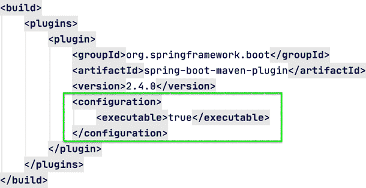
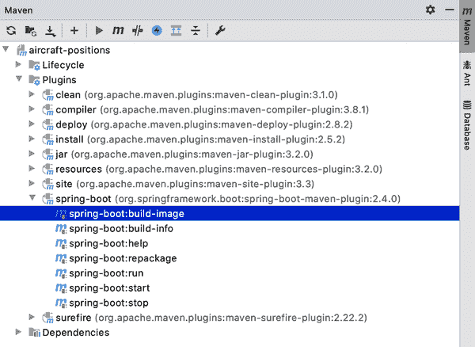

# 第十一章：部署您的 Spring Boot 应用程序

在软件开发中，部署是将应用程序推向生产的入口。

无论应用程序向最终用户承诺了多少功能，直到这些用户真正能够使用该应用程序，它都仅仅是一种学术性的假设。从比喻和实际上来看，部署是应用程序的回报。

参考 Spring Initializr，许多开发人员知道 Spring Boot 应用程序可以创建为 WAR 文件或 JAR 文件。大多数开发人员也知道有很多很好的理由（本书前面提到的几个）不选择 WAR 选项，而选择创建可执行的 JAR 文件，反之则没有几个好理由。许多开发人员可能没有意识到的是，即使构建 Spring Boot 可执行 JAR，也有许多部署选项可以满足各种需求和用例。

在本章中，我将探讨部署 Spring Boot 应用程序的不同目标位置的有用选项，并讨论它们的相对优点。然后，我将演示如何创建这些部署工件，解释实现最佳执行的选项，并展示如何验证它们的组件和来源。您几乎可以肯定，您有比您意识到的更多和更好的工具来部署您的 Spring Boot 应用程序。

# 代码检出检查

请从代码库中检查分支 *chapter11begin* 开始。

# 重新审视 Spring Boot 可执行 JAR

正如在第一章中讨论的那样，Spring Boot 的可执行 JAR 提供了单一、自包含、可测试和可部署单元的最大效用和多样性。创建和迭代速度快，动态自配置以适应环境变化，并且非常简单地分发和维护。

每个云服务提供商都提供了一个应用程序托管选项，广泛用于从原型到生产部署，大多数这些应用平台都期望一个基本上是自包含的可部署应用程序，只提供最基本的环境要求。Spring Boot JAR 在这些干净的环境中非常自然地适应，只需有 JDK 存在即可无摩擦地执行；一些平台甚至因其与应用托管的完美匹配而具体指定使用 Spring Boot。通过带有 HTTP 交换、消息传递等外部交互机制，Spring Boot 应用程序可以消除应用服务器或其他外部依赖的安装、配置和维护。这极大地减少了开发工作量和应用平台的开销。

由于 Spring Boot 应用程序完全控制依赖库，因此它消除了对外部依赖变更的恐惧。多年来，对于依赖于底层应用平台维护的外部组件的应用程序，计划更新应用服务器、servlet 引擎、数据库或消息传递库等诸多关键组件时，导致了无数非 Boot 应用程序的崩溃。在这些应用程序中，开发人员必须高度警惕，以防因单个依赖库的点发布变更而导致不计其数的未计划停机。激动人心的时刻。

对于 Spring Boot 应用程序，无论是核心 Spring 库还是第二（或第三、第四等）层依赖关系的升级，都不再那么痛苦和紧张。应用程序开发人员升级并测试应用程序，并在满意一切正常时部署更新（通常使用 [blue-green 部署](https://en.wikipedia.org/wiki/Blue-green_deployment)）。由于依赖项不再是应用程序外部的，而是与之捆绑在一起，开发人员可以完全控制依赖项版本和升级时机。

Spring Boot JAR 还有一个有用的技巧，感谢 Spring Boot Maven 和 Gradle 插件：能够创建所谓的“完全可执行” JAR。引号是有意的，并且也在官方文档中出现，因为应用程序仍然需要 JDK 才能正常运行。那么，“完全可执行”的 Spring Boot 应用程序是什么意思，如何创建它呢？

让我们从“如何”开始。

## 创建“完全可执行”的 Spring Boot JAR

我将使用 PlaneFinder 作为示例。为了比较，我使用 `mvn clean package` 命令在不进行任何更改的情况下从命令行构建项目。这导致在项目的 *target* 目录中创建了以下 JAR 文件（结果进行了修整以适应页面）：

```java
» ls -lb target/*.jar

-rw-r--r--  1 markheckler  staff  27085204 target/planefinder-0.0.1-SNAPSHOT.jar
```

这个 Spring Boot JAR 被称为“可执行 JAR”，因为它包含了整个应用程序，无需外部依赖；要执行它，只需安装 JDK 并提供 JVM。以当前状态运行该应用程序看起来像这样（结果进行了修整以适应页面）：

```java
» java -jar target/planefinder-0.0.1-SNAPSHOT.jar

  .   ____          _            __ _ _
 /\\ / ___'_ __ _ _(_)_ __  __ _ \ \ \ \
( ( )\___ | '_ | '_| | '_ \/ _` | \ \ \ \
 \\/  ___)| |_)| | | | | || (_| |  ) ) ) )
  '  |____| .__|_| |_|_| |_\__, | / / / /
 =========|_|==============|___/=/_/_/_/
 :: Spring Boot ::                (v2.4.0)

: Starting PlanefinderApplication v0.0.1-SNAPSHOT
: No active profile set, falling back to default profiles: default
: Bootstrapping Spring Data R2DBC repositories in DEFAULT mode.
: Finished Spring Data repository scanning in 132 ms. Found 1 R2DBC
  repository interfaces.
: Netty started on port(s): 7634
: Netty RSocket started on port(s): 7635
: Started PlanefinderApplication in 2.75 seconds (JVM running for 3.106)
```

当然，这符合预期，并且它作为接下来的基准。现在我重新访问 PlaneFinder 的 *pom.xml*，以在现有的 `spring-boot-maven-plug-in` 部分中添加所示的 XML 片段，如 Figure 11-1 中所示。



###### Figure 11-1\. PlaneFinder *pom.xml* 文件的插件部分

回到终端后，我再次使用 `mvn clean package` 命令从命令行构建项目。这次，在项目的 *target* 目录中创建的 JAR 文件有明显的不同，如下输出所示（结果进行了修整以适应页面）：

```java
» ls -lb target/*.jar

-rwxr--r--  1 markheckler  staff  27094314 target/planefinder-0.0.1-SNAPSHOT.jar
```

它比 Boot 的标准可执行 JAR 稍大一点，大约是 9,110 字节，或者稍少于 9 KB。这带来了什么好处呢？

Java JAR 文件是从结尾向开头读取的——是的，您没有看错——直到找到文件结束标记。当创建所谓的“完全可执行 JAR”时，Spring Boot Maven 插件巧妙地在通常的 Spring Boot 可执行 JAR 的开头添加了一个脚本，使其能够在类 Unix 或 Linux 系统上像任何其他可执行二进制文件一样运行（假设存在 JDK），包括在`init.d`或`systemd`中注册。在编辑器中检查 PlaneFinder 的 JAR 文件结果如下（为简洁起见，仅显示了脚本头的部分内容；它非常广泛）：

```java
#!/bin/bash
#
#    .   ____          _            __ _ _
#   /\\ / ___'_ __ _ _(_)_ __  __ _ \ \ \ \
#  ( ( )\___ | '_ | '_| | '_ \/ _` | \ \ \ \
#   \\/  ___)| |_)| | | | | || (_| |  ) ) ) )
#    '  |____| .__|_| |_|_| |_\__, | / / / /
#   =========|_|==============|___/=/_/_/_/
#   :: Spring Boot Startup Script ::
#

### BEGIN INIT INFO
# Provides:          planefinder
# Required-Start:    $remote_fs $syslog $network
# Required-Stop:     $remote_fs $syslog $network
# Default-Start:     2 3 4 5
# Default-Stop:      0 1 6
# Short-Description: planefinder
# Description:       Data feed for SBUR
# chkconfig:         2345 99 01
### END INIT INFO

...

# Action functions
start() {
  if [[ -f "$pid_file" ]]; then
    pid=$(cat "$pid_file")
    isRunning "$pid" && { echoYellow "Already running [$pid]"; return 0; }
  fi
  do_start "$@"
}

do_start() {
  working_dir=$(dirname "$jarfile")
  pushd "$working_dir" > /dev/null
  if [[ ! -e "$PID_FOLDER" ]]; then
    mkdir -p "$PID_FOLDER" &> /dev/null
    if [[ -n "$run_user" ]]; then
      chown "$run_user" "$PID_FOLDER"
    fi
  fi
  if [[ ! -e "$log_file" ]]; then
    touch "$log_file" &> /dev/null
    if [[ -n "$run_user" ]]; then
      chown "$run_user" "$log_file"
    fi
  fi
  if [[ -n "$run_user" ]]; then
    checkPermissions || return $?
    if [ $USE_START_STOP_DAEMON = true ] && type start-stop-daemon >
        /dev/null 2>&1; then
      start-stop-daemon --start --quiet \
        --chuid "$run_user" \
        --name "$identity" \
        --make-pidfile --pidfile "$pid_file" \
        --background --no-close \
        --startas "$javaexe" \
        --chdir "$working_dir" \
       —"${arguments[@]}" \
        >> "$log_file" 2>&1
      await_file "$pid_file"
    else
      su -s /bin/sh -c "$javaexe $(printf "\"%s\" " "${arguments[@]}") >>
        \"$log_file\" 2>&1 & echo \$!" "$run_user" > "$pid_file"
    fi
    pid=$(cat "$pid_file")
  else
    checkPermissions || return $?
    "$javaexe" "${arguments[@]}" >> "$log_file" 2>&1 &
    pid=$!
    disown $pid
    echo "$pid" > "$pid_file"
  fi
  [[ -z $pid ]] && { echoRed "Failed to start"; return 1; }
  echoGreen "Started [$pid]"
}

stop() {
  working_dir=$(dirname "$jarfile")
  pushd "$working_dir" > /dev/null
  [[ -f $pid_file ]] ||
    { echoYellow "Not running (pidfile not found)"; return 0; }
  pid=$(cat "$pid_file")
  isRunning "$pid" || { echoYellow "Not running (process ${pid}).
    Removing stale pid file."; rm -f "$pid_file"; return 0; }
  do_stop "$pid" "$pid_file"
}

do_stop() {
  kill "$1" &> /dev/null || { echoRed "Unable to kill process $1"; return 1; }
  for ((i = 1; i <= STOP_WAIT_TIME; i++)); do
    isRunning "$1" || { echoGreen "Stopped [$1]"; rm -f "$2"; return 0; }
    [[ $i -eq STOP_WAIT_TIME/2 ]] && kill "$1" &> /dev/null
    sleep 1
  done
  echoRed "Unable to kill process $1";
  return 1;
}

force_stop() {
  [[ -f $pid_file ]] ||
    { echoYellow "Not running (pidfile not found)"; return 0; }
  pid=$(cat "$pid_file")
  isRunning "$pid" ||
    { echoYellow "Not running (process ${pid}). Removing stale pid file.";
    rm -f "$pid_file"; return 0; }
  do_force_stop "$pid" "$pid_file"
}

do_force_stop() {
  kill -9 "$1" &> /dev/null ||
      { echoRed "Unable to kill process $1"; return 1; }
  for ((i = 1; i <= STOP_WAIT_TIME; i++)); do
    isRunning "$1" || { echoGreen "Stopped [$1]"; rm -f "$2"; return 0; }
    [[ $i -eq STOP_WAIT_TIME/2 ]] && kill -9 "$1" &> /dev/null
    sleep 1
  done
  echoRed "Unable to kill process $1";
  return 1;
}

restart() {
  stop && start
}

force_reload() {
  working_dir=$(dirname "$jarfile")
  pushd "$working_dir" > /dev/null
  [[ -f $pid_file ]] || { echoRed "Not running (pidfile not found)";
      return 7; }
  pid=$(cat "$pid_file")
  rm -f "$pid_file"
  isRunning "$pid" || { echoRed "Not running (process ${pid} not found)";
      return 7; }
  do_stop "$pid" "$pid_file"
  do_start
}

status() {
  working_dir=$(dirname "$jarfile")
  pushd "$working_dir" > /dev/null
  [[ -f "$pid_file" ]] || { echoRed "Not running"; return 3; }
  pid=$(cat "$pid_file")
  isRunning "$pid" || { echoRed "Not running (process ${pid} not found)";
      return 1; }
  echoGreen "Running [$pid]"
  return 0
}

run() {
  pushd "$(dirname "$jarfile")" > /dev/null
  "$javaexe" "${arguments[@]}"
  result=$?
  popd > /dev/null
  return "$result"
}

# Call the appropriate action function
case "$action" in
start)
  start "$@"; exit $?;;
stop)
  stop "$@"; exit $?;;
force-stop)
  force_stop "$@"; exit $?;;
restart)
  restart "$@"; exit $?;;
force-reload)
  force_reload "$@"; exit $?;;
status)
  status "$@"; exit $?;;
run)
  run "$@"; exit $?;;
*)
  echo "Usage: $0 {start|stop|force-stop|restart|force-reload|status|run}";
    exit 1;
esac

exit 0
<binary portion omitted>
```

Spring Boot Maven（或选择作为构建系统的 Gradle）插件还会为输出 JAR 设置文件所有者权限以读取、写入和执行（rwx）。这样做使其能够按前述方式执行，并允许头脚本定位 JDK，准备应用程序以及运行它，如此演示（结果已经修整和编辑以适应页面）：

```java
» target/planefinder-0.0.1-SNAPSHOT.jar

  .   ____          _            __ _ _
 /\\ / ___'_ __ _ _(_)_ __  __ _ \ \ \ \
( ( )\___ | '_ | '_| | '_ \/ _` | \ \ \ \
 \\/  ___)| |_)| | | | | || (_| |  ) ) ) )
  '  |____| .__|_| |_|_| |_\__, | / / / /
 =========|_|==============|___/=/_/_/_/
 :: Spring Boot ::                (v2.4.0)

: Starting PlanefinderApplication v0.0.1-SNAPSHOT
: No active profile set, falling back to default profiles: default
: Bootstrapping Spring Data R2DBC repositories in DEFAULT mode.
: Finished Spring Data repository scanning in 185 ms.
  Found 1 R2DBC repository interfaces.
: Netty started on port(s): 7634
: Netty RSocket started on port(s): 7635
: Started PlanefinderApplication in 2.938 seconds (JVM running for 3.335)
```

现在我已经演示了如何操作，是时候讨论此选项为我们带来了什么。

## 这是什么意思？

创建 Spring Boot“完全可执行”JAR 的能力并不是解决所有问题的方法，但在必要时它确实提供了与底层 Unix 和 Linux 系统更深层次集成的独特能力。由于嵌入的启动脚本和执行权限，添加 Spring Boot 应用程序以提供启动功能变得非常简单。

如果您的当前应用环境中不需要或无法利用该功能，您应继续简单地创建典型的 Spring Boot 可执行 JAR 输出，利用`java -jar`。这只是您工具箱中的另一个工具，无需额外成本并且几乎不需要您投入精力去实施，当您发现需要时即可使用。

# 解压缩的 JAR

Spring Boot 创新的方法将依赖的 JAR 文件完整保留在 Boot 可执行 JAR 文件中，未经更改，非常适合后续操作，如提取。反转添加到 Spring Boot 可执行 JAR 文件中的过程会产生组件工件的原始、未更改状态。听起来很简单，因为*确实如此*。

有很多原因使您希望将 Spring Boot 可执行 JAR 文件重新解压为其各个独立部分：

+   提取的 Boot 应用程序执行速度略有提升。尽管这很少是重新解压的理由，但这是一个不错的附加优势。

+   提取的依赖是可以轻松替换的独立单元。应用程序更新可以更快速地进行，或者带宽更低，因为只需重新部署更改的文件。

+   许多云平台，如 Heroku 和任何构建或基于 Cloud Foundry 的品牌/衍生品，都会在应用部署过程中执行此操作。尽可能地将本地和远程环境镜像化可以帮助确保一致性，并在必要时诊断任何问题。

标准的 Spring Boot 可执行 JAR 和“完全可执行”JAR 都可以通过以下方式重新生成，使用`jar -xvf <spring_boot_jar>`（为简洁起见，大多数文件条目已删除）：

```java
» mkdir expanded
» cd expanded
» jar -xvf ../target/planefinder-0.0.1-SNAPSHOT.jar
  created: META-INF/
 inflated: META-INF/MANIFEST.MF
  created: org/
  created: org/springframework/
  created: org/springframework/boot/
  created: org/springframework/boot/loader/
  created: org/springframework/boot/loader/archive/
  created: org/springframework/boot/loader/data/
  created: org/springframework/boot/loader/jar/
  created: org/springframework/boot/loader/jarmode/
  created: org/springframework/boot/loader/util/
  created: BOOT-INF/
  created: BOOT-INF/classes/
  created: BOOT-INF/classes/com/
  created: BOOT-INF/classes/com/thehecklers/
  created: BOOT-INF/classes/com/thehecklers/planefinder/
  created: META-INF/maven/
  created: META-INF/maven/com.thehecklers/
  created: META-INF/maven/com.thehecklers/planefinder/
 inflated: BOOT-INF/classes/schema.sql
 inflated: BOOT-INF/classes/application.properties
 inflated: META-INF/maven/com.thehecklers/planefinder/pom.xml
 inflated: META-INF/maven/com.thehecklers/planefinder/pom.properties
  created: BOOT-INF/lib/
 inflated: BOOT-INF/classpath.idx
 inflated: BOOT-INF/layers.idx
»
```

一旦文件被解压缩，我发现使用*nix `tree`命令更加直观地查看结构是很有用的：

```java
» tree
.
├── BOOT-INF
│   ├── classes
│   │   ├── application.properties
│   │   ├── com
│   │   │   └── thehecklers
│   │   │       └── planefinder
│   │   │           ├── Aircraft.class
│   │   │           ├── DbConxInit.class
│   │   │           ├── PlaneController.class
│   │   │           ├── PlaneFinderService.class
│   │   │           ├── PlaneRepository.class
│   │   │           ├── PlanefinderApplication.class
│   │   │           └── User.class
│   │   └── schema.sql
│   ├── classpath.idx
│   ├── layers.idx
│   └── lib
│       ├── h2-1.4.200.jar
│       ├── jackson-annotations-2.11.3.jar
│       ├── jackson-core-2.11.3.jar
│       ├── jackson-databind-2.11.3.jar
│       ├── jackson-dataformat-cbor-2.11.3.jar
│       ├── jackson-datatype-jdk8-2.11.3.jar
│       ├── jackson-datatype-jsr310-2.11.3.jar
│       ├── jackson-module-parameter-names-2.11.3.jar
│       ├── jakarta.annotation-api-1.3.5.jar
│       ├── jul-to-slf4j-1.7.30.jar
│       ├── log4j-api-2.13.3.jar
│       ├── log4j-to-slf4j-2.13.3.jar
│       ├── logback-classic-1.2.3.jar
│       ├── logback-core-1.2.3.jar
│       ├── lombok-1.18.16.jar
│       ├── netty-buffer-4.1.54.Final.jar
│       ├── netty-codec-4.1.54.Final.jar
│       ├── netty-codec-dns-4.1.54.Final.jar
│       ├── netty-codec-http-4.1.54.Final.jar
│       ├── netty-codec-http2-4.1.54.Final.jar
│       ├── netty-codec-socks-4.1.54.Final.jar
│       ├── netty-common-4.1.54.Final.jar
│       ├── netty-handler-4.1.54.Final.jar
│       ├── netty-handler-proxy-4.1.54.Final.jar
│       ├── netty-resolver-4.1.54.Final.jar
│       ├── netty-resolver-dns-4.1.54.Final.jar
│       ├── netty-transport-4.1.54.Final.jar
│       ├── netty-transport-native-epoll-4.1.54.Final-linux-x86_64.jar
│       ├── netty-transport-native-unix-common-4.1.54.Final.jar
│       ├── r2dbc-h2-0.8.4.RELEASE.jar
│       ├── r2dbc-pool-0.8.5.RELEASE.jar
│       ├── r2dbc-spi-0.8.3.RELEASE.jar
│       ├── reactive-streams-1.0.3.jar
│       ├── reactor-core-3.4.0.jar
│       ├── reactor-netty-core-1.0.1.jar
│       ├── reactor-netty-http-1.0.1.jar
│       ├── reactor-pool-0.2.0.jar
│       ├── rsocket-core-1.1.0.jar
│       ├── rsocket-transport-netty-1.1.0.jar
│       ├── slf4j-api-1.7.30.jar
│       ├── snakeyaml-1.27.jar
│       ├── spring-aop-5.3.1.jar
│       ├── spring-beans-5.3.1.jar
│       ├── spring-boot-2.4.0.jar
│       ├── spring-boot-autoconfigure-2.4.0.jar
│       ├── spring-boot-jarmode-layertools-2.4.0.jar
│       ├── spring-context-5.3.1.jar
│       ├── spring-core-5.3.1.jar
│       ├── spring-data-commons-2.4.1.jar
│       ├── spring-data-r2dbc-1.2.1.jar
│       ├── spring-data-relational-2.1.1.jar
│       ├── spring-expression-5.3.1.jar
│       ├── spring-jcl-5.3.1.jar
│       ├── spring-messaging-5.3.1.jar
│       ├── spring-r2dbc-5.3.1.jar
│       ├── spring-tx-5.3.1.jar
│       ├── spring-web-5.3.1.jar
│       └── spring-webflux-5.3.1.jar
├── META-INF
│   ├── MANIFEST.MF
│   └── maven
│       └── com.thehecklers
│           └── planefinder
│               ├── pom.properties
│               └── pom.xml
└── org
    └── springframework
        └── boot
            └── loader
                ├── ClassPathIndexFile.class
                ├── ExecutableArchiveLauncher.class
                ├── JarLauncher.class
                ├── LaunchedURLClassLoader$DefinePackageCallType.class
                ├── LaunchedURLClassLoader
                    $UseFastConnectionExceptionsEnumeration.class
                ├── LaunchedURLClassLoader.class
                ├── Launcher.class
                ├── MainMethodRunner.class
                ├── PropertiesLauncher$1.class
                ├── PropertiesLauncher$ArchiveEntryFilter.class
                ├── PropertiesLauncher$ClassPathArchives.class
                ├── PropertiesLauncher$PrefixMatchingArchiveFilter.class
                ├── PropertiesLauncher.class
                ├── WarLauncher.class
                ├── archive
                │   ├── Archive$Entry.class
                │   ├── Archive$EntryFilter.class
                │   ├── Archive.class
                │   ├── ExplodedArchive$AbstractIterator.class
                │   ├── ExplodedArchive$ArchiveIterator.class
                │   ├── ExplodedArchive$EntryIterator.class
                │   ├── ExplodedArchive$FileEntry.class
                │   ├── ExplodedArchive$SimpleJarFileArchive.class
                │   ├── ExplodedArchive.class
                │   ├── JarFileArchive$AbstractIterator.class
                │   ├── JarFileArchive$EntryIterator.class
                │   ├── JarFileArchive$JarFileEntry.class
                │   ├── JarFileArchive$NestedArchiveIterator.class
                │   └── JarFileArchive.class
                ├── data
                │   ├── RandomAccessData.class
                │   ├── RandomAccessDataFile$1.class
                │   ├── RandomAccessDataFile$DataInputStream.class
                │   ├── RandomAccessDataFile$FileAccess.class
                │   └── RandomAccessDataFile.class
                ├── jar
                │   ├── AbstractJarFile$JarFileType.class
                │   ├── AbstractJarFile.class
                │   ├── AsciiBytes.class
                │   ├── Bytes.class
                │   ├── CentralDirectoryEndRecord$1.class
                │   ├── CentralDirectoryEndRecord$Zip64End.class
                │   ├── CentralDirectoryEndRecord$Zip64Locator.class
                │   ├── CentralDirectoryEndRecord.class
                │   ├── CentralDirectoryFileHeader.class
                │   ├── CentralDirectoryParser.class
                │   ├── CentralDirectoryVisitor.class
                │   ├── FileHeader.class
                │   ├── Handler.class
                │   ├── JarEntry.class
                │   ├── JarEntryCertification.class
                │   ├── JarEntryFilter.class
                │   ├── JarFile$1.class
                │   ├── JarFile$JarEntryEnumeration.class
                │   ├── JarFile.class
                │   ├── JarFileEntries$1.class
                │   ├── JarFileEntries$EntryIterator.class
                │   ├── JarFileEntries.class
                │   ├── JarFileWrapper.class
                │   ├── JarURLConnection$1.class
                │   ├── JarURLConnection$JarEntryName.class
                │   ├── JarURLConnection.class
                │   ├── StringSequence.class
                │   └── ZipInflaterInputStream.class
                ├── jarmode
                │   ├── JarMode.class
                │   ├── JarModeLauncher.class
                │   └── TestJarMode.class
                └── util
                    └── SystemPropertyUtils.class

19 directories, 137 files
»
```

使用`tree`查看 JAR 内容提供了应用程序构成的良好分层显示。它还显示出多个依赖项的组合，为该应用程序提供所选择的能力。在*BOOT-INF/lib*下列出的文件确认了组件库在构建 Spring Boot JAR 并提取其内容后保持不变，甚至可以到达原始组件 JAR 的时间戳，如下所示（为简洁起见，大多数条目已删除）：

```java
» ls -l BOOT-INF/lib
total 52880
-rw-r--r--  1 markheckler  staff  2303679 Oct 14  2019 h2-1.4.200.jar
-rw-r--r--  1 markheckler  staff    68215 Oct  1 22:20 jackson-annotations-
 2.11.3.jar
-rw-r--r--  1 markheckler  staff   351495 Oct  1 22:25 jackson-core-
 2.11.3.jar
-rw-r--r--  1 markheckler  staff  1421699 Oct  1 22:38 jackson-databind-
 2.11.3.jar
-rw-r--r--  1 markheckler  staff    58679 Oct  2 00:17 jackson-dataformat-cbor-
 2.11.3.jar
-rw-r--r--  1 markheckler  staff    34335 Oct  2 00:25 jackson-datatype-jdk8-
 2.11.3.jar
-rw-r--r--  1 markheckler  staff   111008 Oct  2 00:25 jackson-datatype-jsr310-
 2.11.3.jar
-rw-r--r--  1 markheckler  staff     9267 Oct  2 00:25 jackson-module-parameter-
 names-2.11.3.jar
 ...
-rw-r--r--  1 markheckler  staff   374303 Nov 10 09:01 spring-aop-5.3.1.jar
-rw-r--r--  1 markheckler  staff   695851 Nov 10 09:01 spring-beans-5.3.1.jar
-rw-r--r--  1 markheckler  staff  1299025 Nov 12 13:56 spring-boot-2.4.0.jar
-rw-r--r--  1 markheckler  staff  1537971 Nov 12 13:55 spring-boot-
 autoconfigure-2.4.0.jar
-rw-r--r--  1 markheckler  staff    32912 Feb  1  1980 spring-boot-jarmode-
 layertools-2.4.0.jar
-rw-r--r--  1 markheckler  staff  1241939 Nov 10 09:01 spring-context-5.3.1.jar
-rw-r--r--  1 markheckler  staff  1464734 Feb  1  1980 spring-core-5.3.1.jar
-rw-r--r--  1 markheckler  staff  1238966 Nov 11 12:03 spring-data-commons-
 2.4.1.jar
-rw-r--r--  1 markheckler  staff   433079 Nov 11 12:08 spring-data-r2dbc-
 1.2.1.jar
-rw-r--r--  1 markheckler  staff   339745 Nov 11 12:05 spring-data-relational-
 2.1.1.jar
-rw-r--r--  1 markheckler  staff   282565 Nov 10 09:01 spring-expression-
 5.3.1.jar
-rw-r--r--  1 markheckler  staff    23943 Nov 10 09:01 spring-jcl-5.3.1.jar
-rw-r--r--  1 markheckler  staff   552895 Nov 10 09:01 spring-messaging-
 5.3.1.jar
-rw-r--r--  1 markheckler  staff   133156 Nov 10 09:01 spring-r2dbc-5.3.1.jar
-rw-r--r--  1 markheckler  staff   327956 Nov 10 09:01 spring-tx-5.3.1.jar
-rw-r--r--  1 markheckler  staff  1546053 Nov 10 09:01 spring-web-5.3.1.jar
-rw-r--r--  1 markheckler  staff   901591 Nov 10 09:01 spring-webflux-5.3.1.jar
»
```

从 Spring Boot JAR 中提取所有文件后，有几种方法可以运行应用程序。推荐的方法是使用`JarLauncher`，它在执行过程中保持一致的类加载顺序，如下所示（结果已修剪和编辑以适合页面）：

```java
» java org.springframework.boot.loader.JarLauncher

  .   ____          _            __ _ _
 /\\ / ___'_ __ _ _(_)_ __  __ _ \ \ \ \
( ( )\___ | '_ | '_| | '_ \/ _` | \ \ \ \
 \\/  ___)| |_)| | | | | || (_| |  ) ) ) )
  '  |____| .__|_| |_|_| |_\__, | / / / /
 =========|_|==============|___/=/_/_/_/
 :: Spring Boot ::                (v2.4.0)

: Starting PlanefinderApplication v0.0.1-SNAPSHOT
: No active profile set, falling back to default profiles: default
: Bootstrapping Spring Data R2DBC repositories in DEFAULT mode.
: Finished Spring Data repository scanning in 95 ms. Found 1 R2DBC
  repository interfaces.
: Netty started on port(s): 7634
: Netty RSocket started on port(s): 7635
: Started PlanefinderApplication in 1.935 seconds (JVM running for 2.213)
```

在这种情况下，PlaneFinder 的启动速度比 Spring Boot“完全可执行”JAR 中展开的速度快了整整一秒以上。单独这一点可能或可能不足以抵消单一、完全自包含的可部署单元的优势；但结合仅在少量文件更改时推送增量以及（如适用）本地和远程环境更好的对齐能力，运行展开的 Spring Boot 应用程序的能力可能是一个非常有用的选择。

# 将 Spring Boot 应用程序部署到容器中

正如前面提到的，一些云平台——包括本地/私有和公共云——接收可部署的应用程序，并代表开发者创建一个容器映像，使用应用程序开发者提供的广泛优化的默认设置。然后根据应用程序的复制设置和利用率使用这些映像创建（和销毁）带有运行中应用程序的容器。像 Heroku 和众多 Cloud Foundry 版本一样，允许开发者推送 Spring Boot 可执行 JAR，并提供任何所需的配置设置（或简单接受默认设置），其余由平台处理。其他平台如 VMware 的 Tanzu Application Service for Kubernetes 也包括此功能，并且功能列表在范围和流动执行方面都在增加。

许多平台和部署目标不支持这种无摩擦的开发者启用级别。无论您或您的组织是否致力于其他提供方之一，还是如果您有其他要求指导您朝不同方向发展，Spring Boot 都为您提供了保障。

尽管您可以为 Spring Boot 应用程序手工制作自己的容器映像，但这并不是最佳选择；这样做对应用程序本身没有任何价值，通常被认为是从开发到生产的一种必要之恶（充其量）。不再如此。

利用之前提到的平台使用的许多相同工具，智能地容器化应用程序，Spring Boot 在其 Maven 和 Gradle 插件中集成了能够无痛无摩擦地构建符合 Open Container Initiative (OCI) 标准的映像的能力，这些映像可供 Docker、Kubernetes 和每个主要的容器引擎/机制使用。基于业界领先的 [Cloud Native Buildpacks](https://buildpacks.io) 和 [Paketo](https://paketo.io) 构建包倡议，Spring Boot 构建插件提供了使用本地安装和本地运行的 Docker 守护程序创建 OCI 映像并将其推送到本地或指定的远程映像存储库的选项。

使用 Spring Boot 插件从您的应用程序创建映像也是基于一种最佳实践，利用概念上的“自动配置”来通过分层图像内容优化图像创建，根据每个代码单元预期的变更频率分离代码/库。遵循 Spring Boot 自动配置和最佳实践背后的理念，Boot 还提供了一种覆盖和指导分层过程的方式，如果需要自定义配置，则很少需要或甚至不可取，但如果您的需求属于这些罕见的、特殊的情况之一，则可以轻松实现。

从 Spring Boot 2.4.0 Milestone 2 版本开始，默认设置为所有版本生成以下层：

`dependencies`

包括定期发布的依赖项，即 GA 版本

`spring-boot-loader`

包括在 *org/springframework/boot/loader* 下找到的所有文件

`snapshot-dependencies`

尚未被视为 GA 的前瞻性发布

`application`

应用程序类及相关资源（模板、属性文件、脚本等）

代码的易变性或其变更倾向和频率通常随着从上到下浏览此层列表而增加。通过创建单独的层来放置类似易变的代码，随后的映像创建效率更高，因此完成速度更快。这*显著*减少了在应用程序生命周期内重建可部署构件所需的时间和资源。

## 从 IDE 创建容器映像

使用 IntelliJ 作为示例，从 Spring Boot 应用程序创建分层容器映像非常简单，但几乎所有主要的 IDE 都具有类似的功能。

###### 注意

必须在本地运行 Docker 版本——在我的情况下是 Docker Desktop for Mac ——才能创建图像。

要创建该图像，我通过展开 IntelliJ 右边缘标签为*Maven*的选项，然后展开*Plugins*，选择并展开*spring-boot*插件，双击*spring-boot:build-image*选项以执行目标，如图 11-2 所示。



###### 图 11-2\. 从 IntelliJ 的 Maven 面板构建 Spring Boot 应用程序容器镜像

创建图像会生成一份相当冗长的操作日志。特别值得关注的是以下条目：

```java
[INFO]     [creator]     Paketo Executable JAR Buildpack 3.1.3
[INFO]     [creator]       https://github.com/paketo-buildpacks/executable-jar
[INFO]     [creator]         Writing env.launch/CLASSPATH.delim
[INFO]     [creator]         Writing env.launch/CLASSPATH.prepend
[INFO]     [creator]       Process types:
[INFO]     [creator]         executable-jar: java org.springframework.boot.
    loader.JarLauncher
[INFO]     [creator]         task:           java org.springframework.boot.
    loader.JarLauncher
[INFO]     [creator]         web:            java org.springframework.boot.
    loader.JarLauncher
[INFO]     [creator]
[INFO]     [creator]     Paketo Spring Boot Buildpack 3.5.0
[INFO]     [creator]       https://github.com/paketo-buildpacks/spring-boot
[INFO]     [creator]       Creating slices from layers index
[INFO]     [creator]         dependencies
[INFO]     [creator]         spring-boot-loader
[INFO]     [creator]         snapshot-dependencies
[INFO]     [creator]         application
[INFO]     [creator]       Launch Helper: Contributing to layer
[INFO]     [creator]         Creating /layers/paketo-buildpacks_spring-boot/
    helper/exec.d/spring-cloud-bindings
[INFO]     [creator]         Writing profile.d/helper
[INFO]     [creator]       Web Application Type: Contributing to layer
[INFO]     [creator]         Reactive web application detected
[INFO]     [creator]         Writing env.launch/BPL_JVM_THREAD_COUNT.default
[INFO]     [creator]       Spring Cloud Bindings 1.7.0: Contributing to layer
[INFO]     [creator]         Downloading from
    https://repo.spring.io/release/org/springframework/cloud/
    spring-cloud-bindings/1.7.0/spring-cloud-bindings-1.7.0.jar
[INFO]     [creator]         Verifying checksum
[INFO]     [creator]         Copying to
    /layers/paketo-buildpacks_spring-boot/spring-cloud-bindings
[INFO]     [creator]       4 application slices
```

正如前文所述，图像层（在前述列表中称为*slices*）及其内容可根据需要进行修改以应对特定情况。

一旦图像创建完成，类似以下所示的结果将完成日志。

```java
[INFO] Successfully built image 'docker.io/library/aircraft-positions:
       0.0.1-SNAPSHOT'
[INFO]
[INFO] ------------------------------------------------------------------------
[INFO] BUILD SUCCESS
[INFO] ------------------------------------------------------------------------
[INFO] Total time:  25.851 s
[INFO] Finished at: 2020-11-28T20:09:48-06:00
[INFO] ------------------------------------------------------------------------
```

## 从命令行创建容器镜像

当然，也可以——而且很简单——从命令行创建相同的容器镜像。在此之前，我确实希望对生成的镜像的命名设置进行一些小改动。

为了方便起见，我更喜欢创建与我的[Docker Hub](https://hub.docker.com)帐户和命名约定相符的图像，你选择的图像仓库可能有类似的特定约定。Spring Boot 的构建插件接受<configuration>部分的详细信息，以简化将图像推送到仓库/目录的步骤。我向*Aircraft Position*的*pom.xml*文件的*<plug-ins>*部分添加了一行正确标记的代码，以匹配我的需求/偏好：

```java
<build>
  <plug-ins>
    <plug-in>
      <groupId>org.springframework.boot</groupId>
      <artifactId>spring-boot-maven-plug-in</artifactId>
      <configuration>
        <image>
          <name>hecklerm/${project.artifactId}</name>
        </image>
      </configuration>
    </plug-in>
  </plug-ins>
</build>
```

接下来，我从项目目录中的终端窗口发出以下命令以重新创建应用程序容器镜像，并很快收到如下结果：

```java
» mvn spring-boot:build-image

... (Intermediate logged results omitted for brevity)

[INFO] Successfully built image 'docker.io/hecklerm/aircraft-positions:latest'
[INFO]
[INFO] ------------------------------------------------------------------------
[INFO] BUILD SUCCESS
[INFO] ------------------------------------------------------------------------
[INFO] Total time:  13.257 s
[INFO] Finished at: 2020-11-28T20:23:40-06:00
[INFO] ------------------------------------------------------------------------
```

注意，输出的图像不再是在 IDE 中使用默认设置构建时的*docker.io/library/aircraft-positions:0.0.1-SNAPSHOT*。新的图像坐标与我在*pom.xml*中指定的相匹配：*docker.io/hecklerm/aircraft-positions:latest*。

## 验证图像存在

为验证前两节中创建的图像是否已加载到本地仓库，我从终端窗口运行以下命令，并按名称进行过滤以获得如下结果（并已剪裁以适应页面）：

```java
» docker images | grep -in aircraft-positions
aircraft-positions           0.0.1-SNAPSHOT   a7ed39a3d52e    277MB
hecklerm/aircraft-positions  latest           924893a0f1a9    277MB
```

推送上述输出中最后显示的图像——因为它现在与预期和期望的帐户及命名约定一致——到 Docker Hub 的步骤如下，并获得以下结果：

```java
» docker push hecklerm/aircraft-positions
The push refers to repository [docker.io/hecklerm/aircraft-positions]
1dc94a70dbaa: Pushed
4672559507f8: Pushed
e3e9839150af: Pushed
5f70bf18a086: Layer already exists
a3abfb734aa5: Pushed
3c14fe2f1177: Pushed
4cc7b4eb8637: Pushed
fcc507beb4cc: Pushed
c2e9ddddd4ef: Pushed
108b6855c4a6: Pushed
ab39aa8fd003: Layer already exists
0b18b1f120f4: Layer already exists
cf6b3a71f979: Pushed
ec0381c8f321: Layer already exists
7b0fc1578394: Pushed
eb0f7cd0acf8: Pushed
1e5c1d306847: Mounted from paketobuildpacks/run
23c4345364c2: Mounted from paketobuildpacks/run
a1efa53a237c: Mounted from paketobuildpacks/run
fe6d8881187d: Mounted from paketobuildpacks/run
23135df75b44: Mounted from paketobuildpacks/run
b43408d5f11b: Mounted from paketobuildpacks/run
latest: digest:
  sha256:a7e5d536a7426d6244401787b153ebf43277fbadc9f43a789f6c4f0aff6d5011
    size: 5122
»
```

访问 Docker Hub 可以确认图像已成功公开部署，如图 11-3 所示。


###### 图 11-3\. Docker Hub 中的 Spring Boot 应用程序容器镜像

在将 Spring Boot 容器化应用程序部署到 Docker Hub 或任何其他可以从本地计算机外部访问的容器映像存储库之前，是更广泛（并希望是生产）部署的最后一步。

## 运行容器化应用程序

要运行该应用程序，我使用`docker run`命令。您的组织可能有一个部署流水线，从容器镜像（从镜像存储库检索）中移动应用程序到运行的容器化应用程序，但执行的步骤可能是相同的，尽管有更多的自动化和较少的输入。

由于我已经有了映像的本地副本，因此不需要进行远程检索；否则，需要通过守护程序从映像存储库检索远程映像和/或层，在基于指定映像启动容器之前在本地重构它。

要运行容器化的 Aircraft Positions 应用程序，我执行以下命令并看到以下结果（修剪和编辑以适应页面）：

```java
» docker run --name myaircraftpositions -p8080:8080
  hecklerm/aircraft-positions:latest
Setting Active Processor Count to 6
WARNING: Container memory limit unset. Configuring JVM for 1G container.
Calculated JVM Memory Configuration: -XX:MaxDirectMemorySize=10M -Xmx636688K
  -XX:MaxMetaspaceSize=104687K -XX:ReservedCodeCacheSize=240M -Xss1M
  (Total Memory: 1G, Thread Count: 50, Loaded Class Count: 16069, Headroom: 0%)
Adding 138 container CA certificates to JVM truststore
Spring Cloud Bindings Enabled
Picked up JAVA_TOOL_OPTIONS:
-Djava.security.properties=/layers/paketo-buildpacks_bellsoft-liberica/
    java-security-properties/java-security.properties
  -agentpath:/layers/paketo-buildpacks_bellsoft-liberica/jvmkill/
    jvmkill-1.16.0-RELEASE.so=printHeapHistogram=1
  -XX:ActiveProcessorCount=6
  -XX:MaxDirectMemorySize=10M
  -Xmx636688K
  -XX:MaxMetaspaceSize=104687K
  -XX:ReservedCodeCacheSize=240M
  -Xss1M
  -Dorg.springframework.cloud.bindings.boot.enable=true

  .   ____          _            __ _ _
 /\\ / ___'_ __ _ _(_)_ __  __ _ \ \ \ \
( ( )\___ | '_ | '_| | '_ \/ _` | \ \ \ \
 \\/  ___)| |_)| | | | | || (_| |  ) ) ) )
  '  |____| .__|_| |_|_| |_\__, | / / / /
 =========|_|==============|___/=/_/_/_/
 :: Spring Boot ::                (v2.4.0)

: Starting AircraftPositionsApplication v0.0.1-SNAPSHOT
: Netty started on port(s): 8080
: Started AircraftPositionsApplication in 10.7 seconds (JVM running for 11.202)
```

现在快速查看一个由 Spring Boot 插件创建的映像内部。

# 用于检查 Spring Boot 应用程序容器映像的实用程序

存在许多用于处理容器映像的实用程序，它们的功能大部分超出了本书的范围。我想简要提到两个在某些情况下我发现很有用的工具：`pack`和`dive`。

## Pack

要检查使用 Cloud Native（Paketo）Buildpacks 创建 Spring Boot 应用程序容器映像的材料及其 buildpacks 本身，可以使用`pack`实用程序。 `pack`是指定用于使用 Cloud Native Buildpacks 构建应用程序的 CLI，并且可以通过各种方式获取。我在我的 Mac 上使用`homebrew`来检索并安装它，只需简单的`brew install pack`命令。

运行`pack`对先前创建的映像的影响如下：

```java
» pack inspect-image hecklerm/aircraft-positions
Inspecting image: hecklerm/aircraft-positions

REMOTE:

Stack: io.buildpacks.stacks.bionic

Base Image:
  Reference: f5caea10feb38ae882a9447b521fd1ea1ee93384438395c7ace2d8cfaf808e3d
  Top Layer: sha256:1e5c1d306847275caa0d1d367382dfdcfd4d62b634b237f1d7a2e
             746372922cd

Run Images:
  index.docker.io/paketobuildpacks/run:base-cnb
  gcr.io/paketo-buildpacks/run:base-cnb

Buildpacks:
  ID                                         VERSION
  paketo-buildpacks/ca-certificates          1.0.1
  paketo-buildpacks/bellsoft-liberica        5.2.1
  paketo-buildpacks/executable-jar           3.1.3
  paketo-buildpacks/dist-zip                 2.2.2
  paketo-buildpacks/spring-boot              3.5.0

Processes:
  TYPE           SHELL  COMMAND  ARGS
  web (default)  bash   java     org.springframework.boot.loader.JarLauncher
  executable-jar bash   java     org.springframework.boot.loader.JarLauncher
  task           bash   java     org.springframework.boot.loader.JarLauncher

LOCAL:

Stack: io.buildpacks.stacks.bionic

Base Image:
  Reference: f5caea10feb38ae882a9447b521fd1ea1ee93384438395c7ace2d8cfaf808e3d
  Top Layer: sha256:1e5c1d306847275caa0d1d367382dfdcfd4d62b634b237f1d7a2e
             746372922cd

Run Images:
  index.docker.io/paketobuildpacks/run:base-cnb
  gcr.io/paketo-buildpacks/run:base-cnb

Buildpacks:
  ID                                         VERSION
  paketo-buildpacks/ca-certificates          1.0.1
  paketo-buildpacks/bellsoft-liberica        5.2.1
  paketo-buildpacks/executable-jar           3.1.3
  paketo-buildpacks/dist-zip                 2.2.2
  paketo-buildpacks/spring-boot              3.5.0

Processes:
  TYPE           SHELL  COMMAND  ARGS
  web (default)  bash   java     org.springframework.boot.loader.JarLauncher
  executable-jar bash   java     org.springframework.boot.loader.JarLauncher
  task           bash   java     org.springframework.boot.loader.JarLauncher
```

使用`pack`实用程序的`inspect-image`命令提供有关映像的一些关键信息，特别是以下信息：

+   使用哪个 Docker 基础映像/ Linux 版本（bionic）作为此映像的基础

+   使用的哪些 buildpacks 来填充映像（列出了五个 Paketo buildpacks）

+   将通过什么方式运行进程（由外壳执行的 Java 命令）

请注意，将针对指定映像轮询本地和远程连接的存储库，并为两者提供详细信息。这在诊断由于某个位置的过时容器映像引起的问题时尤为有帮助。

## Dive

`dive`实用程序由 Alex Goodman 创建，作为“潜入”容器映像的一种方法，查看非常细粒度的 OCI 映像层和整个映像文件系统的树结构。

`dive`深入到 Spring Boot 层次结构的应用程序级别以下，并进入操作系统层面。我认为它不如`pack`有用，因为它更专注于操作系统而不是应用程序，但在验证特定文件的存在或缺失、文件权限和其他重要的低级问题时，它是理想的工具。这是一个很少使用的工具，但在需要这种详细级别的细节和控制时是必不可少的。

# 代码检出检查

要获取完整的章节代码，请从代码仓库中检出*chapter11end*分支。

# 总结

直到应用程序的用户能够真正使用该应用程序，它仅仅是一种假设的实践。在象征性和往往非常字面的意义上，部署是回报。

许多开发人员知道 Spring Boot 应用程序可以创建为 WAR 文件或 JAR 文件。大多数开发人员也知道有许多理由可以跳过 WAR 选项并创建可执行的 JAR 文件，而很少有理由反其道而行。但许多开发人员可能没有意识到，即使在构建 Spring Boot 可执行 JAR 文件时，也有许多部署选项可以满足各种需求和用例。

在本章中，我探讨了几种部署 Spring Boot 应用程序的方式，这些方式适用于不同的目标环境，并讨论了它们的相对优劣。然后我演示了如何创建这些部署工件，解释了最佳执行选项，并展示了如何验证它们的组件和来源。目标包括标准的 Spring Boot 可执行 JAR 文件，“全面可执行”的 Spring Boot JAR 文件，解压/展开的 JAR 文件，以及使用 Cloud Native（Paketo）Buildpacks 构建的容器镜像，这些镜像可以在 Docker、Kubernetes 以及所有主要的容器引擎/机制上运行。Spring Boot 为您提供了多种无摩擦的部署选项，将您的开发超能力延伸到部署超能力领域。

在下一章，也是最后一章中，我会深入探讨两个略微更深入的主题，来为这本书和旅程画上句号。如果您想了解更多有关测试和调试响应式应用程序的内容，千万不要错过。
