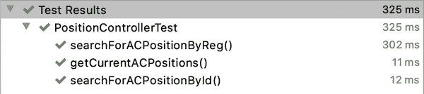
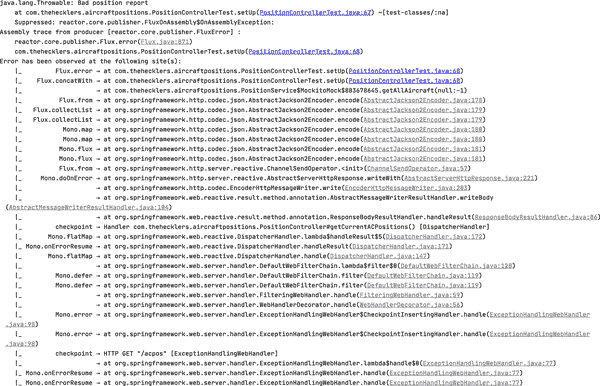
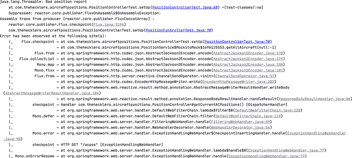
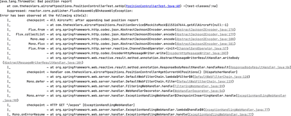
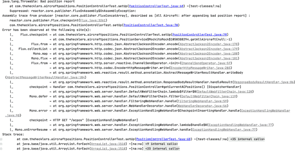
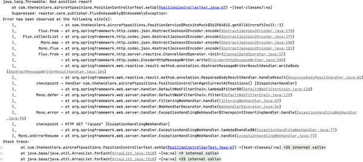

# 第十二章：深入探讨响应式编程

正如之前讨论的，响应式编程为开发人员提供了一种在分布式系统中更好地利用资源的方法，甚至将强大的扩展机制扩展到应用程序边界和通信通道中。对于仅有主流 Java 开发实践经验的开发人员（通常被称为*命令式*Java，因其显式和顺序逻辑，与响应式编程中通常使用的更声明式方法相对），这些响应式能力可能带来一些不希望的成本。除了预期的学习曲线外，Spring 通过并行和互补的 WebMVC 和 WebFlux 实现大大降低了这种学习曲线，还存在工具、成熟度和针对关键活动（如测试、故障排除和调试）的已建立实践的相对限制。

尽管相对于其命令式表亲而言，响应式 Java 开发确实还处于起步阶段，但它们同属一个大家庭的事实，已经允许了更快的工具和流程的发展和成熟。如前所述，Spring 在其开发和社区中建立的成熟命令式专业知识基础上，已经将数十年的演变压缩成现在可用的生产就绪组件。

本章介绍并解释了测试和诊断/调试问题的最新技术，您可能在部署响应式 Spring Boot 应用程序时会遇到，并展示了如何在生产之前，并帮助您进行生产之前，使 WebFlux/Reactor 发挥作用。

# 代码检查检查完成

请查看代码仓库中的*chapter12begin*分支开始。

# 何时使用响应式？

响应式编程，特别是那些专注于响应式流的应用程序，使得系统范围的扩展难以用其他现有手段匹敌。然而，并非所有应用程序都需要在端到端可扩展性的极端要求下运行，或者它们可能已经表现得非常出色，可以在可预见的时间范围内处理相对可预测的负载。命令式应用程序长期以来一直满足全球组织的生产需求，它们不会仅仅因为有了新选项就停止工作。

尽管响应式编程在其提供的可能性方面毫无疑问地令人兴奋，Spring 团队明确表示，响应式代码在可预见的未来，甚至可能永远也不会取代所有命令式代码。正如在[Spring WebFlux 的参考文档中所述](https://oreil.ly/SFRefDoc)：

> 如果你有一个庞大的团队，请记住在转向非阻塞、函数式和声明式编程时的陡峭学习曲线。一个实际的开始方法，而不是完全转变，是使用响应式的 WebClient。除此之外，从小处开始，并测量收益。我们预期，在广泛应用的情况下，这种转变是不必要的。如果你不确定要寻找什么样的好处，首先了解非阻塞 I/O 的工作方式（例如，单线程 Node.js 上的并发）及其影响是个不错的开始。
> 
> Spring 框架参考文档

简而言之，采用响应式编程和 Spring WebFlux 是一个选择——这是一个极好的选择，可能是实现某些需求的最佳方式——但在仔细考虑所涉及系统的相关需求和要求后再做出的选择。无论是响应式还是非响应式，Spring Boot 都提供了无与伦比的选项来开发处理所有生产工作负载的关键业务软件。

# 测试响应式应用程序

为了更好地专注于测试响应式 Spring Boot 应用程序的关键概念，我采取了几个步骤来缩小考虑范围的代码范围。就像放大你希望拍摄的主题一样，其他项目代码仍然存在，但不在本节信息的关键路径上。

对于这一部分，我将专注于专门测试那些公开响应式流发布者的 API，如`Flux`、`Mono`和`Publisher`类型，这些类型可以是`Flux`或`Mono`，而不是典型的阻塞`Iterable`或`Object`类型。我首先从提供外部 API 的`Aircraft Positions`类内部开始，即`PositionController`。

###### 提示

如果你还没有检查过第十二章的代码，请立即去看看。

## 但首先，重构

虽然`PositionController`内部的代码确实有效，但有点混乱。首要任务是提供更清晰的关注点分离，我开始通过将创建`RSocketRequester`对象的代码移动到一个`@Configuration`类中，使其作为 Spring bean 创建，可以在应用程序的任何地方访问：

```java
import org.springframework.context.annotation.Bean;
import org.springframework.context.annotation.Configuration;
import org.springframework.messaging.rsocket.RSocketRequester;

@Configuration
public class RSocketRequesterConfig {
    @Bean
    RSocketRequester requester(RSocketRequester.Builder builder) {
        return builder.tcp("localhost", 7635);
    }
}
```

这简化了`PositionController`的构造函数，将创建`RSocketRequester`的工作放在了适当的位置，并且远离控制器类。要在`PositionController`中使用`RSocketRequester` bean，我只需使用 Spring Boot 的构造函数注入自动装配它：

```java
public PositionController(AircraftRepository repository,
                          RSocketRequester requester) {
    this.repository = repository;
    this.requester = requester;
}
```

###### 注意

测试 RSocket 连接需要进行集成测试。虽然本节重点是单元测试而不是集成测试，但仍然需要将`RSocketRequester`的构造与`PositionController`分离开来，以便隔离和正确地单元测试`PositionController`。

另外一个逻辑来源并不完全属于控制器功能，这次涉及使用`AircraftRepository` bean 获取、存储和检索飞行器位置。通常，当与特定类无关的复杂逻辑进入该类时，最好将其提取出来，就像我为`RSocketRequester` bean 所做的那样。为了将这段有些复杂且不相关的代码从`PositionController`中移出，我创建了一个`PositionService`类，并将其定义为一个在整个应用程序中可用的`@Service` bean。`@Service`注解只是对常用的`@Component`注解的更为具体的视觉描述：

```java
import org.springframework.stereotype.Service;
import org.springframework.web.reactive.function.client.WebClient;
import reactor.core.publisher.Flux;
import reactor.core.publisher.Mono;

@Service
public class PositionService {
    private final AircraftRepository repo;
    private WebClient client = WebClient.create(
        "http://localhost:7634/aircraft");

    public PositionService(AircraftRepository repo) {
        this.repo = repo;
    }

    public Flux<Aircraft> getAllAircraft() {
        return repo.deleteAll()
                .thenMany(client.get()
                        .retrieve()
                        .bodyToFlux(Aircraft.class)
                        .filter(plane -> !plane.getReg().isEmpty()))
                .flatMap(repo::save)
                .thenMany(repo.findAll());
    }

    public Mono<Aircraft> getAircraftById(Long id) {
        return repo.findById(id);
    }

    public Flux<Aircraft> getAircraftByReg(String reg) {
        return repo.findAircraftByReg(reg);
    }
}
```

###### 注意

当前在`AircraftRepository`中没有定义`findAircraftByReg()`方法。在创建测试之前，我解决了这个问题。

尽管可以做更多的工作（特别是关于`WebClient`成员变量的工作），但现在将`PositionService::getAllAircraft`中显示的复杂逻辑从其以前的位置移除，并将`PositionService` bean 注入到控制器中供其使用已足够，这导致控制器类更加干净和专注：

```java
import org.springframework.http.MediaType;
import org.springframework.messaging.rsocket.RSocketRequester;
import org.springframework.stereotype.Controller;
import org.springframework.ui.Model;
import org.springframework.web.bind.annotation.GetMapping;
import org.springframework.web.bind.annotation.ResponseBody;
import reactor.core.publisher.Flux;

@Controller
public class PositionController {
    private final PositionService service;
    private final RSocketRequester requester;

    public PositionController(PositionService service,
            RSocketRequester requester) {
        this.service = service;
        this.requester = requester;
    }

    @GetMapping("/aircraft")
    public String getCurrentAircraftPositions(Model model) {
        model.addAttribute("currentPositions", service.getAllAircraft());

        return "positions";
    }

    @ResponseBody
    @GetMapping(value = "/acstream", produces =
        MediaType.TEXT_EVENT_STREAM_VALUE)
    public Flux<Aircraft> getCurrentACPositionsStream() {
        return requester.route("acstream")
                .data("Requesting aircraft positions")
                .retrieveFlux(Aircraft.class);
    }
}
```

回顾现有的`PositionController`端点显示它们供给了一个 Thymeleaf 模板（`public String getCurrentAircraftPositions(Model model)`）或者需要一个外部的`RSocket`连接（`public Flux<Aircraft>` `getCurrentACPositionsStream()`）。为了隔离和测试飞行器位置应用程序提供外部 API 的能力，我需要扩展当前定义的端点。我添加了两个额外的端点映射到`/acpos`和`/acpos/search`，以创建一个基本但灵活的 API，利用我在`PositionService`内部创建的方法。

我首先创建了一个方法，以 JSON 格式检索并返回目前位于我们的 PlaneFinder 服务启用设备范围内的所有飞行器的位置。`getCurrentACPositions()`方法调用`PositionService::getAllAircraft`，就像它的对应方法`getCurrentAircraftPositions(Model model)`一样，但它返回 JSON 对象值，而不是将它们添加到领域对象模型并重定向到模板引擎以显示 HTML 页面。

接下来，我创建了一种方法，通过唯一的位置记录标识符和飞行器注册号来搜索当前飞行器位置。记录（在技术上是文档，因为这个版本的`Aircraft Positions`使用 MongoDB）标识符是数据库中存储的最后从 PlaneFinder 检索到的位置中的唯一 ID。它对于检索特定位置记录很有用；但从飞行器的角度来看，根据飞行器的唯一注册号进行搜索更有用。

有趣的是，PlaneFinder 在查询时可能会报告单个飞机发送的少量位置。这是由于正在飞行的飞机几乎不间断地发送位置报告。对于我们来说，这意味着当根据飞机的唯一注册号在当前报告的位置中进行搜索时，实际上我们可能会检索到该航班的 1+位置报告。

有多种方法可以编写具有灵活性的搜索机制，以接受不同类型的不同搜索条件，并返回不同数量的潜在结果，但我选择将所有选项合并到单个方法中：

```java
@ResponseBody
@GetMapping("/acpos/search")
public Publisher<Aircraft>
        searchForACPosition(@RequestParam Map<String, String> searchParams) {

    if (!searchParams.isEmpty()) {
        Map.Entry<String, String> setToSearch =
                searchParams.entrySet().iterator().next();

        if (setToSearch.getKey().equalsIgnoreCase("id")) {
            return service.getAircraftById(Long.valueOf(setToSearch.getValue()));
        } else {
            return service.getAircraftByReg(setToSearch.getValue());
        }
    } else {
        return Mono.empty();
    }
}
```

最终（暂时）版本的`PositionController`类应该如下所示：

```java
import org.reactivestreams.Publisher;
import org.springframework.http.MediaType;
import org.springframework.messaging.rsocket.RSocketRequester;
import org.springframework.stereotype.Controller;
import org.springframework.ui.Model;
import org.springframework.web.bind.annotation.GetMapping;
import org.springframework.web.bind.annotation.RequestParam;
import org.springframework.web.bind.annotation.ResponseBody;
import reactor.core.publisher.Flux;
import reactor.core.publisher.Mono;

import java.util.Map;

@Controller
public class PositionController {
    private final PositionService service;
    private final RSocketRequester requester;

    public PositionController(PositionService service,
            RSocketRequester requester) {
        this.service = service;
        this.requester = requester;
    }

    @GetMapping("/aircraft")
    public String getCurrentAircraftPositions(Model model) {
        model.addAttribute("currentPositions", service.getAllAircraft());

        return "positions";
    }

    @ResponseBody
    @GetMapping("/acpos")
    public Flux<Aircraft> getCurrentACPositions() {
        return service.getAllAircraft();
    }

    @ResponseBody
    @GetMapping("/acpos/search")
    public Publisher<Aircraft> searchForACPosition(@RequestParam Map<String,
            String> searchParams) {

        if (!searchParams.isEmpty()) {
            Map.Entry<String, String> setToSearch =
                searchParams.entrySet().iterator().next();

            if (setToSearch.getKey().equalsIgnoreCase("id")) {
                return service.getAircraftById(Long.valueOf
                    (setToSearch.getValue()));
            } else {
                return service.getAircraftByReg(setToSearch.getValue());
            }
        } else {
            return Mono.empty();
        }
    }

    @ResponseBody
    @GetMapping(value = "/acstream", produces =
            MediaType.TEXT_EVENT_STREAM_VALUE)
    public Flux<Aircraft> getCurrentACPositionsStream() {
        return requester.route("acstream")
                .data("Requesting aircraft positions")
                .retrieveFlux(Aircraft.class);
    }
}
```

接下来，我回到`PositionService`类。正如前面提到的，它的`public Flux<Aircraft> getAircraftByReg(String reg)`方法引用了`AircraftRepository`中当前未定义的方法。为了解决这个问题，我在`AircraftRepository`接口定义中添加了一个`Flux<Aircraft>` `findAircraftByReg(String reg)`方法：

```java
import org.springframework.data.repository.reactive.ReactiveCrudRepository;
import reactor.core.publisher.Flux;

public interface AircraftRepository extends
        ReactiveCrudRepository<Aircraft, Long> {
    Flux<Aircraft> findAircraftByReg(String reg);
}
```

这段有趣的代码，这个单一的方法签名，展示了使用一组广泛适用的约定的强大 Spring Data 概念：像`find`、`search`或`get`这样的操作符，存储/检索/管理的对象类型（在本例中为`Aircraft`），以及成员变量名称如`reg`。通过使用参数+类型和返回类型声明方法签名，并使用提到的方法命名约定，Spring Data 可以为您构建方法实现。

如果您希望或需要提供更多具体或提示，也可以注释方法签名，并提供所需的细节。对于这种情况并不需要，因为声明我们希望通过注册号搜索飞机位置，并在响应式流`Flux`中返回 0+值就足够 Spring Data 创建实现。

回到`PositionService`，IDE 现在高兴地报告`repo.findAircraftByReg(reg)`是一个有效的方法调用。

###### 注意

我为这个示例做出的另一个设计决策是让`getAircraftByXxx`方法都查询当前位置文档。这可能被认为假定数据库中存在一些位置文档，或者用户对如果数据库中尚未包含任何位置不感兴趣的情况。您的需求可能推动做出不同的选择，例如在搜索之前验证某些位置是否存在，并且如果不存在，则执行一个使用`getAllAircraft`调用进行新的检索。

## 现在，进行测试

在早期的测试章节中，使用了标准的`Object`类型来测试预期结果。我确实使用了`WebClient`和`WebTestClient`，但只作为与所有基于 HTTP 的端点交互的首选工具，无论它们是否返回响应式流发布者类型。现在，是时候正确测试这些响应式流语义了。

我将现有的`PositionControllerTest`类作为起点，重新调整以适应其对应类`PositionController`公开的新的响应式端点。以下是类级别的细节：

```java
@WebFluxTest(controllers = {PositionController.class})
class PositionControllerTest {
    @Autowired
    private WebTestClient client;

    @MockBean
    private PositionService service;
    @MockBean
    private RSocketRequester requester;

    private Aircraft ac1, ac2, ac3;

    ...

}
```

首先，我使用类级别的注解`@WebFluxTest(controllers = {PositionController.class})`。我仍然使用响应式的`WebTestClient`，并希望将此测试类的范围限制在 WebFlux 功能范围内，因此加载完整的 Spring Boot 应用程序上下文是不必要且浪费时间和资源的。

其次，我自动装配了一个`WebTestClient` bean。在早期关于测试的章节中，我直接将`WebTestClient` bean 注入到单个测试方法中，但由于现在它将在多个方法中需要使用，因此创建一个成员变量来引用它更加合理。

第三步，我使用 Mockito 的`@MockBean`注解创建了模拟 Bean。我简单地模拟了`RSocketRequester` bean，因为`PositionController`需要一个`RSocketRequester` bean，无论是真实的还是模拟的。我模拟了`PositionService` bean，以便在这个类的测试中模拟并使用其行为。模拟`PositionService`允许我确保其正确行为，同时测试其输出（`PositionController`），并将实际结果与预期结果进行比较。

最后，我创建了三个`Aircraft`实例用于包含的测试中。

在执行 JUnit 的`@Test`方法之前，会运行一个使用`@BeforeEach`注解的方法来配置场景和预期结果。这是我在每个测试方法之前使用的`setUp()`方法，用于准备测试环境：

```java
@BeforeEach
void setUp(ApplicationContext context) {
    // Spring Airlines flight 001 en route, flying STL to SFO,
    // at 30000' currently over Kansas City
    ac1 = new Aircraft(1L, "SAL001", "sqwk", "N12345", "SAL001",
            "STL-SFO", "LJ", "ct",
            30000, 280, 440, 0, 0,
            39.2979849, -94.71921, 0D, 0D, 0D,
            true, false,
            Instant.now(), Instant.now(), Instant.now());

    // Spring Airlines flight 002 en route, flying SFO to STL,
    // at 40000' currently over Denver
    ac2 = new Aircraft(2L, "SAL002", "sqwk", "N54321", "SAL002",
            "SFO-STL", "LJ", "ct",
            40000, 65, 440, 0, 0,
            39.8560963, -104.6759263, 0D, 0D, 0D,
            true, false,
            Instant.now(), Instant.now(), Instant.now());

    // Spring Airlines flight 002 en route, flying SFO to STL,
    // at 40000' currently just past DEN
    ac3 = new Aircraft(3L, "SAL002", "sqwk", "N54321", "SAL002",
            "SFO-STL", "LJ", "ct",
            40000, 65, 440, 0, 0,
            39.8412964, -105.0048267, 0D, 0D, 0D,
            true, false,
            Instant.now(), Instant.now(), Instant.now());

    Mockito.when(service.getAllAircraft()).thenReturn(Flux.just(ac1, ac2, ac3));
    Mockito.when(service.getAircraftById(1L)).thenReturn(Mono.just(ac1));
    Mockito.when(service.getAircraftById(2L)).thenReturn(Mono.just(ac2));
    Mockito.when(service.getAircraftById(3L)).thenReturn(Mono.just(ac3));
    Mockito.when(service.getAircraftByReg("N12345"))
        .thenReturn(Flux.just(ac1));
    Mockito.when(service.getAircraftByReg("N54321"))
        .thenReturn(Flux.just(ac2, ac3));
}
```

我为注册号为 N12345 的飞机分配了飞机位置给`ac1`成员变量。对于`ac2`和`ac3`，我为同一架飞机 N54321 分配了非常接近的位置，模拟了从 PlaneFinder 接收到频繁更新的位置报告的常见情况。

`setUp()`方法的最后几行定义了`PositionService`模拟 Bean 在不同方式调用其方法时将提供的行为。与早期关于测试的方法模拟类似，唯一的重要区别在于返回值的类型；因为实际的`PositionService`方法返回 Reactor 的`Publisher`类型的`Flux`和`Mono`，所以模拟方法也必须如此。

### 测试以检索所有飞机位置为目的。

最后，我创建了一个方法来测试`PositionController`的方法`getCurrentACPositions()`：

```java
@Test
void getCurrentACPositions() {
    StepVerifier.create(client.get()
            .uri("/acpos")
            .exchange()
            .expectStatus().isOk()
            .expectHeader().contentType(MediaType.APPLICATION_JSON)
            .returnResult(Aircraft.class)
            .getResponseBody())
        .expectNext(ac1)
        .expectNext(ac2)
        .expectNext(ac3)
        .verifyComplete();
}
```

测试响应式流应用程序可能带来多种挑战，通常被认为是设置预期结果、获取实际结果并比较二者以确定测试成功或失败的一个相当乏味（如果容易遗漏）的努力。尽管可以有效地即时获取多个结果，就像阻塞类型的`Iterable`一样，响应式流`Publishers`并不等待完整的结果集再返回为一个单一单元。从机器的角度来看，这就是一次性接收一组五个结果（例如）或非常快速地接收五个结果，但是单独接收的差异。

Reactor 测试工具的核心是`StepVerifier`及其实用方法。`StepVerifier`订阅`Publisher`，正如其名称所示，使开发人员能够将获得的结果视为离散值并逐个验证。在对`getCurrentACPositions`的测试中，我执行以下操作：

+   创建一个`StepVerifier`。

+   提供由以下步骤产生的`Flux`：

    +   使用`WebTestClient` bean。

    +   访问映射到*/acpos*端点的`PositionController::getCurrentACPositions`方法。

    +   初始化`exchange()`。

    +   验证`200 OK`的响应状态。

    +   验证响应头具有“application/json”的内容类型。

    +   以`Aircraft`类的实例形式返回结果项。

    +   获取响应。

+   评估实际的第一个值与预期的第一个值`ac1`。

+   评估实际的第二个值与预期的第二个值`ac2`。

+   评估实际的第三个值与预期的第三个值`ac3`。

+   验证所有操作并接收`Publisher`完成信号。

这是对预期行为的相当详尽评估，包括条件和返回值。运行测试的结果输出类似于以下内容（已修剪以适应页面）：

```java
  .   ____          _            __ _ _
 /\\ / ___'_ __ _ _(_)_ __  __ _ \ \ \ \
( ( )\___ | '_ | '_| | '_ \/ _` | \ \ \ \
 \\/  ___)| |_)| | | | | || (_| |  ) ) ) )
  '  |____| .__|_| |_|_| |_\__, | / / / /
 =========|_|==============|___/=/_/_/_/
 :: Spring Boot ::                (v2.4.0)

: Starting PositionControllerTest on mheckler-a01.vmware.com with PID 21211
: No active profile set, falling back to default profiles: default
: Started PositionControllerTest in 2.19 seconds (JVM running for 2.879)

Process finished with exit code 0
```

从 IDE 运行，结果将类似于在图 12-1 中显示的内容。


###### 图 12-1\. 成功的测试

### 测试飞机位置搜索功能

在`PositionController::searchForACPosition`内测试搜索功能至少需要进行两个单独的测试，因为能够通过数据库文档 ID 和飞机注册号处理飞机位置搜索。

为了测试通过数据库文档标识符搜索，我创建了以下单元测试：

```java
@Test
void searchForACPositionById() {
    StepVerifier.create(client.get()
            .uri("/acpos/search?id=1")
            .exchange()
            .expectStatus().isOk()
            .expectHeader().contentType(MediaType.APPLICATION_JSON)
            .returnResult(Aircraft.class)
            .getResponseBody())
        .expectNext(ac1)
        .verifyComplete();
}
```

这与所有飞机位置的单元测试类似。有两个显著的例外：

+   指定的 URI 引用搜索端点，并包括搜索参数`id=1`以检索`ac1`。

+   预期结果仅为`ac1`，如`expectNext(ac1)`链式操作中所示。

为了测试通过飞机注册号搜索飞机位置，我创建了以下单元测试，使用我模拟的注册号，包括两个对应的位置文档：

```java
@Test
void searchForACPositionByReg() {
    StepVerifier.create(client.get()
            .uri("/acpos/search?reg=N54321")
            .exchange()
            .expectStatus().isOk()
            .expectHeader().contentType(MediaType.APPLICATION_JSON)
            .returnResult(Aircraft.class)
            .getResponseBody())
        .expectNext(ac2)
        .expectNext(ac3)
        .verifyComplete();
}
```

这个测试与前一个测试之间的差异很小：

+   URI 包含搜索参数 `reg=N54321`，应返回`ac2`和`ac3`，它们都包含了注册编号为 N54321 的飞机的报告位置。

+   预期结果被验证为`ac2`和`ac3`，使用 `expectNext(ac2)` 和 `expectNext(ac3)` 连接操作。

下面的清单展示了`PositionControllerTest`类的最终状态：

```java
import org.junit.jupiter.api.AfterEach;
import org.junit.jupiter.api.BeforeEach;
import org.junit.jupiter.api.Test;
import org.mockito.Mockito;
import org.springframework.beans.factory.annotation.Autowired;
import org.springframework.boot.test.autoconfigure.web.reactive.WebFluxTest;
import org.springframework.boot.test.mock.mockito.MockBean;
import org.springframework.http.MediaType;
import org.springframework.messaging.rsocket.RSocketRequester;
import org.springframework.test.web.reactive.server.WebTestClient;
import reactor.core.publisher.Flux;
import reactor.core.publisher.Mono;
import reactor.test.StepVerifier;

import java.time.Instant;

@WebFluxTest(controllers = {PositionController.class})
class PositionControllerTest {
    @Autowired
    private WebTestClient client;

    @MockBean
    private PositionService service;
    @MockBean
    private RSocketRequester requester;

    private Aircraft ac1, ac2, ac3;

    @BeforeEach
    void setUp() {
        // Spring Airlines flight 001 en route, flying STL to SFO, at 30000'
        // currently over Kansas City
        ac1 = new Aircraft(1L, "SAL001", "sqwk", "N12345", "SAL001",
                "STL-SFO", "LJ", "ct",
                30000, 280, 440, 0, 0,
                39.2979849, -94.71921, 0D, 0D, 0D,
                true, false,
                Instant.now(), Instant.now(), Instant.now());

        // Spring Airlines flight 002 en route, flying SFO to STL, at 40000'
        // currently over Denver
        ac2 = new Aircraft(2L, "SAL002", "sqwk", "N54321", "SAL002",
                "SFO-STL", "LJ", "ct",
                40000, 65, 440, 0, 0,
                39.8560963, -104.6759263, 0D, 0D, 0D,
                true, false,
                Instant.now(), Instant.now(), Instant.now());

        // Spring Airlines flight 002 en route, flying SFO to STL, at 40000'
        // currently just past DEN
        ac3 = new Aircraft(3L, "SAL002", "sqwk", "N54321", "SAL002",
                "SFO-STL", "LJ", "ct",
                40000, 65, 440, 0, 0,
                39.8412964, -105.0048267, 0D, 0D, 0D,
                true, false,
                Instant.now(), Instant.now(), Instant.now());

        Mockito.when(service.getAllAircraft())
                .thenReturn(Flux.just(ac1, ac2, ac3));
        Mockito.when(service.getAircraftById(1L))
                .thenReturn(Mono.just(ac1));
        Mockito.when(service.getAircraftById(2L))
                .thenReturn(Mono.just(ac2));
        Mockito.when(service.getAircraftById(3L))
                .thenReturn(Mono.just(ac3));
        Mockito.when(service.getAircraftByReg("N12345"))
                .thenReturn(Flux.just(ac1));
        Mockito.when(service.getAircraftByReg("N54321"))
                .thenReturn(Flux.just(ac2, ac3));
    }

    @AfterEach
    void tearDown() {
    }

    @Test
    void getCurrentACPositions() {
        StepVerifier.create(client.get()
                .uri("/acpos")
                .exchange()
                .expectStatus().isOk()
                .expectHeader().contentType(MediaType.APPLICATION_JSON)
                .returnResult(Aircraft.class)
                .getResponseBody())
            .expectNext(ac1)
            .expectNext(ac2)
            .expectNext(ac3)
            .verifyComplete();
    }

    @Test
    void searchForACPositionById() {
        StepVerifier.create(client.get()
                .uri("/acpos/search?id=1")
                .exchange()
                .expectStatus().isOk()
                .expectHeader().contentType(MediaType.APPLICATION_JSON)
                .returnResult(Aircraft.class)
                .getResponseBody())
            .expectNext(ac1)
            .verifyComplete();
    }

    @Test
    void searchForACPositionByReg() {
        StepVerifier.create(client.get()
                .uri("/acpos/search?reg=N54321")
                .exchange()
                .expectStatus().isOk()
                .expectHeader().contentType(MediaType.APPLICATION_JSON)
                .returnResult(Aircraft.class)
                .getResponseBody())
            .expectNext(ac2)
            .expectNext(ac3)
            .verifyComplete();
    }
}
```

在`PositionControllerTest`类中执行所有测试会得到令人满意的结果，如图 12-2 所示。



###### 图 12-2\. 所有单元测试成功执行

###### 注意

`StepVerifier` 提供了更多的测试可能性，本节已经示意了其中一部分。特别值得关注的是 `StepVerifier::withVirtualTime` 方法，它可以压缩偶尔发出值的发布者的测试，使得通常会在很长时间内分布的结果立即呈现。`StepVerifier::withVirtualTime` 接受一个 `Supplier<Publisher>` 而不是直接的 `Publisher`，但其使用机制相当类似。

这些是测试响应式 Spring Boot 应用的基本要素。但是，当您在生产环境中遇到问题时会发生什么？当您的应用程序上线时，Reactor 提供了哪些工具来识别和解决问题？

# 诊断和调试响应式应用

当传统的 Java 应用程序出现问题时，通常会有一个堆栈跟踪。命令式代码可以出于多种原因生成有用的（有时冗长的）堆栈跟踪，但在高层次上，有两个因素使得可以收集和显示这些有用信息：

+   代码的顺序执行通常决定了如何执行某些操作（命令式）

+   该顺序代码的执行发生在单个线程内

规则总有例外，但一般来说，这是允许捕获到发生错误的时间点之前顺序执行的步骤的常见组合：所有操作都在单一的泳道中一步步地执行。它可能不会有效地利用系统资源，通常情况下确实不会，但这使得隔离和解决问题变得更加简单。

进入响应式流。Project Reactor 和其他响应式流实现使用调度程序来管理和使用其他线程。通常会保持空闲或低效的资源可以被利用起来，以使得响应式应用能够远远超越其阻塞对应物而扩展。关于如何控制和调整 `Schedulers` 的选项以及它们可以如何使用的更多详细信息，我建议您查阅[Reactor Core 文档](https://projectreactor.io/docs/core/release/reference)，但目前可以简单地说，Reactor 在绝大多数情况下都可以很好地自动处理调度。

然而，这确实突显了为响应式 Spring Boot（或任何响应式）应用程序生成有意义的执行跟踪的一个挑战。人们不能指望简单地跟随单个线程的活动并生成有意义的顺序代码执行列表。

由于这种线程跳转优化特性，追踪执行的难度增加了，这使得响应式编程将代码 *组装* 与代码 *执行* 分开。正如在 第八章 中提到的，在大多数情况下对于大多数 `Publisher` 类型，直到 *订阅* 之前什么也不会发生。

简而言之，几乎不太可能看到生产故障指向您在声明式组装 `Publisher`（无论是 `Flux` 还是 `Mono`）操作流水线的代码的问题。故障几乎普遍发生在流水线变得活跃时：产生、处理和传递值给 `Subscriber`。

由于代码组装与执行之间的距离以及 Reactor 利用多线程完成操作链的能力，需要更好的工具来有效地排查运行时出现的错误。幸运的是，Reactor 提供了几个优秀的选择。

## Hooks.onOperatorDebug()

这并不意味着使用现有堆栈跟踪结果无法解决反应性应用程序的故障排除问题，只是可以显著改进。就像大多数事物一样，证据在于代码——或者在这种情况下，记录的失败输出。

为了模拟反应式 `Publisher` 操作链的故障，我重新访问了 `PositionControllerTest` 类，并在每次测试执行前运行的 `setUp()` 方法中更改了一行代码：

```java
Mockito.when(service.getAllAircraft()).thenReturn(Flux.just(ac1, ac2, ac3));
```

我用包含结果流中错误的方式替换了由模拟 `getAllAircraft()` 方法生成的正常运行的 `Flux`：

```java
Mockito.when(service.getAllAircraft()).thenReturn(
        Flux.just(ac1, ac2, ac3)
                .concatWith(Flux.error(new Throwable("Bad position report")))
);
```

接下来，我执行 `getCurrentACPositions()` 的测试，以查看我们故意对 `Flux` 进行破坏的结果（包装以适应页面）：

```java
500 Server Error for HTTP GET "/acpos"

java.lang.Throwable: Bad position report
	at com.thehecklers.aircraftpositions.PositionControllerTest
        .setUp(PositionControllerTest.java:59) ~[test-classes/:na]
	Suppressed: reactor.core.publisher.FluxOnAssembly$OnAssemblyException:
Error has been observed at the following site(s):
	|_ checkpoint ⇢ Handler com.thehecklers.aircraftpositions
        .PositionController
        #getCurrentACPositions() [DispatcherHandler]
	|_ checkpoint ⇢ HTTP GET "/acpos" [ExceptionHandlingWebHandler]
Stack trace:
		at com.thehecklers.aircraftpositions.PositionControllerTest
        .setUp(PositionControllerTest.java:59) ~[test-classes/:na]
		at java.base/jdk.internal.reflect.NativeMethodAccessorImpl
        .invoke0(Native Method) ~[na:na]
		at java.base/jdk.internal.reflect.NativeMethodAccessorImpl
        .invoke(NativeMethodAccessorImpl.java:62) ~[na:na]
		at java.base/jdk.internal.reflect.DelegatingMethodAccessorImpl
        .invoke(DelegatingMethodAccessorImpl.java:43) ~[na:na]
		at java.base/java.lang.reflect.Method
        .invoke(Method.java:564) ~[na:na]
		at org.junit.platform.commons.util.ReflectionUtils
        .invokeMethod(ReflectionUtils.java:686)
        ~[junit-platform-commons-1.6.2.jar:1.6.2]
		at org.junit.jupiter.engine.execution.MethodInvocation
        .proceed(MethodInvocation.java:60)
                ~[junit-jupiter-engine-5.6.2.jar:5.6.2]
		at org.junit.jupiter.engine.execution.InvocationInterceptorChain
        $ValidatingInvocation.proceed(InvocationInterceptorChain.java:131)
        ~[junit-jupiter-engine-5.6.2.jar:5.6.2]
		at org.junit.jupiter.engine.extension.TimeoutExtension
        .intercept(TimeoutExtension.java:149)
        ~[junit-jupiter-engine-5.6.2.jar:5.6.2]
		at org.junit.jupiter.engine.extension.TimeoutExtension
        .interceptLifecycleMethod(TimeoutExtension.java:126)
        ~[junit-jupiter-engine-5.6.2.jar:5.6.2]
		at org.junit.jupiter.engine.extension.TimeoutExtension
        .interceptBeforeEachMethod(TimeoutExtension.java:76)
        ~[junit-jupiter-engine-5.6.2.jar:5.6.2]
		at org.junit.jupiter.engine.execution
        .ExecutableInvoker$ReflectiveInterceptorCall.lambda$ofVoidMethod
          $0(ExecutableInvoker.java:115)
          ~[junit-jupiter-engine-5.6.2.jar:5.6.2]
		at org.junit.jupiter.engine.execution.ExecutableInvoker
        .lambda$invoke$0(ExecutableInvoker.java:105)
          ~[junit-jupiter-engine-5.6.2.jar:5.6.2]
		at org.junit.jupiter.engine.execution.InvocationInterceptorChain
        $InterceptedInvocation.proceed(InvocationInterceptorChain.java:106)
          ~[junit-jupiter-engine-5.6.2.jar:5.6.2]
		at org.junit.jupiter.engine.execution.InvocationInterceptorChain
        .proceed(InvocationInterceptorChain.java:64)
          ~[junit-jupiter-engine-5.6.2.jar:5.6.2]
		at org.junit.jupiter.engine.execution.InvocationInterceptorChain
        .chainAndInvoke(InvocationInterceptorChain.java:45)
          ~[junit-jupiter-engine-5.6.2.jar:5.6.2]
		at org.junit.jupiter.engine.execution.InvocationInterceptorChain
        .invoke(InvocationInterceptorChain.java:37)
          ~[junit-jupiter-engine-5.6.2.jar:5.6.2]
		at org.junit.jupiter.engine.execution.ExecutableInvoker
        .invoke(ExecutableInvoker.java:104)
          ~[junit-jupiter-engine-5.6.2.jar:5.6.2]
		at org.junit.jupiter.engine.execution.ExecutableInvoker
        .invoke(ExecutableInvoker.java:98)
          ~[junit-jupiter-engine-5.6.2.jar:5.6.2]
		at org.junit.jupiter.engine.descriptor.ClassBasedTestDescriptor
        .invokeMethodInExtensionContext(ClassBasedTestDescriptor.java:481)
          ~[junit-jupiter-engine-5.6.2.jar:5.6.2]
		at org.junit.jupiter.engine.descriptor.ClassBasedTestDescriptor
        .lambda$synthesizeBeforeEachMethodAdapter
          $18(ClassBasedTestDescriptor.java:466)
          ~[junit-jupiter-engine-5.6.2.jar:5.6.2]
		at org.junit.jupiter.engine.descriptor.TestMethodTestDescriptor
        .lambda$invokeBeforeEachMethods$2(TestMethodTestDescriptor.java:169)
          ~[junit-jupiter-engine-5.6.2.jar:5.6.2]
		at org.junit.jupiter.engine.descriptor.TestMethodTestDescriptor
        .lambda$invokeBeforeMethodsOrCallbacksUntilExceptionOccurs
            $5(TestMethodTestDescriptor.java:197)
            ~[junit-jupiter-engine-5.6.2.jar:5.6.2]
		at org.junit.platform.engine.support.hierarchical.ThrowableCollector
        .execute(ThrowableCollector.java:73)
            ~[junit-platform-engine-1.6.2.jar:1.6.2]
		at org.junit.jupiter.engine.descriptor.TestMethodTestDescriptor
        .invokeBeforeMethodsOrCallbacksUntilExceptionOccurs
            (TestMethodTestDescriptor.java:197)
            ~[junit-jupiter-engine-5.6.2.jar:5.6.2]
		at org.junit.jupiter.engine.descriptor.TestMethodTestDescriptor
        .invokeBeforeEachMethods(TestMethodTestDescriptor.java:166)
            ~[junit-jupiter-engine-5.6.2.jar:5.6.2]
		at org.junit.jupiter.engine.descriptor.TestMethodTestDescriptor
        .execute(TestMethodTestDescriptor.java:133)
            ~[junit-jupiter-engine-5.6.2.jar:5.6.2]
		at org.junit.jupiter.engine.descriptor.TestMethodTestDescriptor
        .execute(TestMethodTestDescriptor.java:71)
            ~[junit-jupiter-engine-5.6.2.jar:5.6.2]
		at org.junit.platform.engine.support.hierarchical.NodeTestTask
        .lambda$executeRecursively$5(NodeTestTask.java:135)
            ~[junit-platform-engine-1.6.2.jar:1.6.2]
		at org.junit.platform.engine.support.hierarchical.ThrowableCollector
        .execute(ThrowableCollector.java:73)
            ~[junit-platform-engine-1.6.2.jar:1.6.2]
		at org.junit.platform.engine.support.hierarchical.NodeTestTask
        .lambda$executeRecursively$7(NodeTestTask.java:125)
            ~[junit-platform-engine-1.6.2.jar:1.6.2]
		at org.junit.platform.engine.support.hierarchical.Node
        .around(Node.java:135) ~[junit-platform-engine-1.6.2.jar:1.6.2]
		at org.junit.platform.engine.support.hierarchical.NodeTestTask
        .lambda$executeRecursively$8(NodeTestTask.java:123)
            ~[junit-platform-engine-1.6.2.jar:1.6.2]
		at org.junit.platform.engine.support.hierarchical.ThrowableCollector
        .execute(ThrowableCollector.java:73)
            ~[junit-platform-engine-1.6.2.jar:1.6.2]
		at org.junit.platform.engine.support.hierarchical.NodeTestTask
        .executeRecursively(NodeTestTask.java:122)
            ~[junit-platform-engine-1.6.2.jar:1.6.2]
		at org.junit.platform.engine.support.hierarchical.NodeTestTask
        .execute(NodeTestTask.java:80)
            ~[junit-platform-engine-1.6.2.jar:1.6.2]
		at java.base/java.util.ArrayList.forEach(ArrayList.java:1510) ~[na:na]
		at org.junit.platform.engine.support.hierarchical
        .SameThreadHierarchicalTestExecutorService
            .invokeAll(SameThreadHierarchicalTestExecutorService.java:38)
                ~[junit-platform-engine-1.6.2.jar:1.6.2]
		at org.junit.platform.engine.support.hierarchical.NodeTestTask
        .lambda$executeRecursively$5(NodeTestTask.java:139)
            ~[junit-platform-engine-1.6.2.jar:1.6.2]
		at org.junit.platform.engine.support.hierarchical.ThrowableCollector
        .execute(ThrowableCollector.java:73)
            ~[junit-platform-engine-1.6.2.jar:1.6.2]
		at org.junit.platform.engine.support.hierarchical.NodeTestTask
        .lambda$executeRecursively$7(NodeTestTask.java:125)
            ~[junit-platform-engine-1.6.2.jar:1.6.2]
		at org.junit.platform.engine.support.hierarchical.Node
        .around(Node.java:135) ~[junit-platform-engine-1.6.2.jar:1.6.2]
		at org.junit.platform.engine.support.hierarchical.NodeTestTask
        .lambda$executeRecursively$8(NodeTestTask.java:123)
            ~[junit-platform-engine-1.6.2.jar:1.6.2]
		at org.junit.platform.engine.support.hierarchical.ThrowableCollector
        .execute(ThrowableCollector.java:73)
            ~[junit-platform-engine-1.6.2.jar:1.6.2]
		at org.junit.platform.engine.support.hierarchical.NodeTestTask
        .executeRecursively(NodeTestTask.java:122)
            ~[junit-platform-engine-1.6.2.jar:1.6.2]
		at org.junit.platform.engine.support.hierarchical.NodeTestTask
        .execute(NodeTestTask.java:80)
            ~[junit-platform-engine-1.6.2.jar:1.6.2]
		at java.base/java.util.ArrayList.forEach(ArrayList.java:1510) ~[na:na]
		at org.junit.platform.engine.support.hierarchical
        .SameThreadHierarchicalTestExecutorService
            .invokeAll(SameThreadHierarchicalTestExecutorService.java:38)
                ~[junit-platform-engine-1.6.2.jar:1.6.2]
		at org.junit.platform.engine.support.hierarchical.NodeTestTask
        .lambda$executeRecursively$5(NodeTestTask.java:139)
            ~[junit-platform-engine-1.6.2.jar:1.6.2]
		at org.junit.platform.engine.support.hierarchical.ThrowableCollector
        .execute(ThrowableCollector.java:73)
            ~[junit-platform-engine-1.6.2.jar:1.6.2]
		at org.junit.platform.engine.support.hierarchical.NodeTestTask
        .lambda$executeRecursively$7(NodeTestTask.java:125)
            ~[junit-platform-engine-1.6.2.jar:1.6.2]
		at org.junit.platform.engine.support.hierarchical.Node
        .around(Node.java:135) ~[junit-platform-engine-1.6.2.jar:1.6.2]
		at org.junit.platform.engine.support.hierarchical.NodeTestTask
        .lambda$executeRecursively$8(NodeTestTask.java:123)
            ~[junit-platform-engine-1.6.2.jar:1.6.2]
		at org.junit.platform.engine.support.hierarchical.ThrowableCollector
        .execute(ThrowableCollector.java:73)
            ~[junit-platform-engine-1.6.2.jar:1.6.2]
		at org.junit.platform.engine.support.hierarchical.NodeTestTask
        .executeRecursively(NodeTestTask.java:122)
            ~[junit-platform-engine-1.6.2.jar:1.6.2]
		at org.junit.platform.engine.support.hierarchical.NodeTestTask
        .execute(NodeTestTask.java:80)
            ~[junit-platform-engine-1.6.2.jar:1.6.2]
		at org.junit.platform.engine.support.hierarchical
        .SameThreadHierarchicalTestExecutorService
            .submit(SameThreadHierarchicalTestExecutorService.java:32)
                ~[junit-platform-engine-1.6.2.jar:1.6.2]
		at org.junit.platform.engine.support.hierarchical
        .HierarchicalTestExecutor.execute(HierarchicalTestExecutor.java:57)
            ~[junit-platform-engine-1.6.2.jar:1.6.2]
		at org.junit.platform.engine.support.hierarchical
        .HierarchicalTestEngine.execute(HierarchicalTestEngine.java:51)
            ~[junit-platform-engine-1.6.2.jar:1.6.2]
		at org.junit.platform.launcher.core.DefaultLauncher
        .execute(DefaultLauncher.java:248)
            ~[junit-platform-launcher-1.6.2.jar:1.6.2]
		at org.junit.platform.launcher.core.DefaultLauncher
        .lambda$execute$5(DefaultLauncher.java:211)
            ~[junit-platform-launcher-1.6.2.jar:1.6.2]
		at org.junit.platform.launcher.core.DefaultLauncher
        .withInterceptedStreams(DefaultLauncher.java:226)
            ~[junit-platform-launcher-1.6.2.jar:1.6.2]
		at org.junit.platform.launcher.core.DefaultLauncher
        .execute(DefaultLauncher.java:199)
            ~[junit-platform-launcher-1.6.2.jar:1.6.2]
		at org.junit.platform.launcher.core.DefaultLauncher
        .execute(DefaultLauncher.java:132)
            ~[junit-platform-launcher-1.6.2.jar:1.6.2]
		at com.intellij.junit5.JUnit5IdeaTestRunner
        .startRunnerWithArgs(JUnit5IdeaTestRunner.java:69)
            ~[junit5-rt.jar:na]
		at com.intellij.rt.junit.IdeaTestRunner$Repeater
        .startRunnerWithArgs(IdeaTestRunner.java:33)
            ~[junit-rt.jar:na]
		at com.intellij.rt.junit.JUnitStarter
        .prepareStreamsAndStart(JUnitStarter.java:230)
            ~[junit-rt.jar:na]
		at com.intellij.rt.junit.JUnitStarter
        .main(JUnitStarter.java:58) ~[junit-rt.jar:na]

java.lang.AssertionError: Status expected:<200 OK>
    but was:<500 INTERNAL_SERVER_ERROR>

> GET /acpos
> WebTestClient-Request-Id: [1]

No content

< 500 INTERNAL_SERVER_ERROR Internal Server Error
< Content-Type: [application/json]
< Content-Length: [142]

{"timestamp":"2020-11-09T15:41:12.516+00:00","path":"/acpos","status":500,
        "error":"Internal Server Error","message":"","requestId":"699a523c"}

	at org.springframework.test.web.reactive.server.ExchangeResult
    .assertWithDiagnostics(ExchangeResult.java:209)
	at org.springframework.test.web.reactive.server.StatusAssertions
    .assertStatusAndReturn(StatusAssertions.java:227)
	at org.springframework.test.web.reactive.server.StatusAssertions
    .isOk(StatusAssertions.java:67)
	at com.thehecklers.aircraftpositions.PositionControllerTest
    .getCurrentACPositions(PositionControllerTest.java:90)
	at java.base/jdk.internal.reflect.NativeMethodAccessorImpl
    .invoke0(Native Method)
	at java.base/jdk.internal.reflect.NativeMethodAccessorImpl
    .invoke(NativeMethodAccessorImpl.java:62)
	at java.base/jdk.internal.reflect.DelegatingMethodAccessorImpl
    .invoke(DelegatingMethodAccessorImpl.java:43)
	at java.base/java.lang.reflect.Method.invoke(Method.java:564)
	at org.junit.platform.commons.util.ReflectionUtils
    .invokeMethod(ReflectionUtils.java:686)
	at org.junit.jupiter.engine.execution.MethodInvocation
    .proceed(MethodInvocation.java:60)
	at org.junit.jupiter.engine.execution.InvocationInterceptorChain
    $ValidatingInvocation.proceed(InvocationInterceptorChain.java:131)
	at org.junit.jupiter.engine.extension.TimeoutExtension
    .intercept(TimeoutExtension.java:149)
	at org.junit.jupiter.engine.extension.TimeoutExtension
    .interceptTestableMethod(TimeoutExtension.java:140)
	at org.junit.jupiter.engine.extension.TimeoutExtension
    .interceptTestMethod(TimeoutExtension.java:84)
	at org.junit.jupiter.engine.execution.ExecutableInvoker
    $ReflectiveInterceptorCall
        .lambda$ofVoidMethod$0(ExecutableInvoker.java:115)
	at org.junit.jupiter.engine.execution.ExecutableInvoker
    .lambda$invoke$0(ExecutableInvoker.java:105)
	at org.junit.jupiter.engine.execution.InvocationInterceptorChain
    $InterceptedInvocation.proceed(InvocationInterceptorChain.java:106)
	at org.junit.jupiter.engine.execution.InvocationInterceptorChain
    .proceed(InvocationInterceptorChain.java:64)
	at org.junit.jupiter.engine.execution.InvocationInterceptorChain
    .chainAndInvoke(InvocationInterceptorChain.java:45)
	at org.junit.jupiter.engine.execution.InvocationInterceptorChain
    .invoke(InvocationInterceptorChain.java:37)
	at org.junit.jupiter.engine.execution.ExecutableInvoker
    .invoke(ExecutableInvoker.java:104)
	at org.junit.jupiter.engine.execution.ExecutableInvoker
    .invoke(ExecutableInvoker.java:98)
	at org.junit.jupiter.engine.descriptor.TestMethodTestDescriptor
    .lambda$invokeTestMethod$6(TestMethodTestDescriptor.java:212)
	at org.junit.platform.engine.support.hierarchical.ThrowableCollector
    .execute(ThrowableCollector.java:73)
	at org.junit.jupiter.engine.descriptor.TestMethodTestDescriptor
    .invokeTestMethod(TestMethodTestDescriptor.java:208)
	at org.junit.jupiter.engine.descriptor.TestMethodTestDescriptor
    .execute(TestMethodTestDescriptor.java:137)
	at org.junit.jupiter.engine.descriptor.TestMethodTestDescriptor
    .execute(TestMethodTestDescriptor.java:71)
	at org.junit.platform.engine.support.hierarchical.NodeTestTask
    .lambda$executeRecursively$5(NodeTestTask.java:135)
	at org.junit.platform.engine.support.hierarchical.ThrowableCollector
    .execute(ThrowableCollector.java:73)
	at org.junit.platform.engine.support.hierarchical.NodeTestTask
    .lambda$executeRecursively$7(NodeTestTask.java:125)
	at org.junit.platform.engine.support.hierarchical.Node.around(Node.java:135)
	at org.junit.platform.engine.support.hierarchical.NodeTestTask
    .lambda$executeRecursively$8(NodeTestTask.java:123)
	at org.junit.platform.engine.support.hierarchical.ThrowableCollector
    .execute(ThrowableCollector.java:73)
	at org.junit.platform.engine.support.hierarchical.NodeTestTask
    .executeRecursively(NodeTestTask.java:122)
	at org.junit.platform.engine.support.hierarchical.NodeTestTask
    .execute(NodeTestTask.java:80)
	at java.base/java.util.ArrayList.forEach(ArrayList.java:1510)
	at org.junit.platform.engine.support.hierarchical
    .SameThreadHierarchicalTestExecutorService
        .invokeAll(SameThreadHierarchicalTestExecutorService.java:38)
	at org.junit.platform.engine.support.hierarchical.NodeTestTask
    .lambda$executeRecursively$5(NodeTestTask.java:139)
	at org.junit.platform.engine.support.hierarchical.ThrowableCollector
    .execute(ThrowableCollector.java:73)
	at org.junit.platform.engine.support.hierarchical.NodeTestTask
    .lambda$executeRecursively$7(NodeTestTask.java:125)
	at org.junit.platform.engine.support.hierarchical.Node.around(Node.java:135)
	at org.junit.platform.engine.support.hierarchical.NodeTestTask
    .lambda$executeRecursively$8(NodeTestTask.java:123)
	at org.junit.platform.engine.support.hierarchical.ThrowableCollector
    .execute(ThrowableCollector.java:73)
	at org.junit.platform.engine.support.hierarchical.NodeTestTask
    .executeRecursively(NodeTestTask.java:122)
	at org.junit.platform.engine.support.hierarchical.NodeTestTask
    .execute(NodeTestTask.java:80)
	at java.base/java.util.ArrayList.forEach(ArrayList.java:1510)
	at org.junit.platform.engine.support.hierarchical
    .SameThreadHierarchicalTestExecutorService
        .invokeAll(SameThreadHierarchicalTestExecutorService.java:38)
	at org.junit.platform.engine.support.hierarchical.NodeTestTask
    .lambda$executeRecursively$5(NodeTestTask.java:139)
	at org.junit.platform.engine.support.hierarchical.ThrowableCollector
    .execute(ThrowableCollector.java:73)
	at org.junit.platform.engine.support.hierarchical.NodeTestTask
    .lambda$executeRecursively$7(NodeTestTask.java:125)
	at org.junit.platform.engine.support.hierarchical.Node.around(Node.java:135)
	at org.junit.platform.engine.support.hierarchical.NodeTestTask
    .lambda$executeRecursively$8(NodeTestTask.java:123)
	at org.junit.platform.engine.support.hierarchical.ThrowableCollector
    .execute(ThrowableCollector.java:73)
	at org.junit.platform.engine.support.hierarchical.NodeTestTask
    .executeRecursively(NodeTestTask.java:122)
	at org.junit.platform.engine.support.hierarchical.NodeTestTask
    .execute(NodeTestTask.java:80)
	at org.junit.platform.engine.support.hierarchical
    .SameThreadHierarchicalTestExecutorService
        .submit(SameThreadHierarchicalTestExecutorService.java:32)
	at org.junit.platform.engine.support.hierarchical.HierarchicalTestExecutor
    .execute(HierarchicalTestExecutor.java:57)
	at org.junit.platform.engine.support.hierarchical.HierarchicalTestEngine
    .execute(HierarchicalTestEngine.java:51)
	at org.junit.platform.launcher.core.DefaultLauncher
    .execute(DefaultLauncher.java:248)
	at org.junit.platform.launcher.core.DefaultLauncher
    .lambda$execute$5(DefaultLauncher.java:211)
	at org.junit.platform.launcher.core.DefaultLauncher
    .withInterceptedStreams(DefaultLauncher.java:226)
	at org.junit.platform.launcher.core.DefaultLauncher
    .execute(DefaultLauncher.java:199)
	at org.junit.platform.launcher.core.DefaultLauncher
    .execute(DefaultLauncher.java:132)
	at com.intellij.junit5.JUnit5IdeaTestRunner
    .startRunnerWithArgs(JUnit5IdeaTestRunner.java:69)
	at com.intellij.rt.junit.IdeaTestRunner$Repeater
    .startRunnerWithArgs(IdeaTestRunner.java:33)
	at com.intellij.rt.junit.JUnitStarter
    .prepareStreamsAndStart(JUnitStarter.java:230)
	at com.intellij.rt.junit.JUnitStarter
    .main(JUnitStarter.java:58)
Caused by: java.lang.AssertionError: Status expected:<200 OK>
        but was:<500 INTERNAL_SERVER_ERROR>
	at org.springframework.test.util.AssertionErrors
    .fail(AssertionErrors.java:59)
	at org.springframework.test.util.AssertionErrors
    .assertEquals(AssertionErrors.java:122)
	at org.springframework.test.web.reactive.server.StatusAssertions
    .lambda$assertStatusAndReturn$4(StatusAssertions.java:227)
	at org.springframework.test.web.reactive.server.ExchangeResult
    .assertWithDiagnostics(ExchangeResult.java:206)
	... 66 more
```

如您所见，单个错误值的信息量相当难以消化。存在有用的信息，但它被过多、不太有用的数据所淹没。

###### 注意

我勉强但有意地包含了上述 `Flux` 错误产生的完整输出，以显示当 `Publisher` 遇到错误时导航通常输出的困难，以及如何通过有效的工具显著降低噪音并增强关键信息的信号。找到问题的核心不仅减少了开发中的挫折感，而且在生产中故障排除业务关键应用程序时绝对至关重要。

Project Reactor 包含可通过其 `Hooks` 类调用的可配置生命周期回调 *hooks*。其中一个特别有用的操作符，在事情出错时提高信噪比的是 `onOperatorDebug()`。

在实例化失败的`Publisher`之前调用`Hooks.onOperatorDebug()`使得所有后续`Publisher`类型（及其子类型）的汇编时间仪表化成为可能。为了确保在必要的时间捕获必要的信息，通常将调用放置在应用程序的主方法中，如下所示：

```java
import org.springframework.boot.SpringApplication;
import org.springframework.boot.autoconfigure.SpringBootApplication;
import reactor.core.publisher.Hooks;

@SpringBootApplication
public class AircraftPositionsApplication {

	public static void main(String[] args) {
		Hooks.onOperatorDebug();
		SpringApplication.run(AircraftPositionsApplication.class, args);
	}

}
```

由于我是从测试类演示此功能，我在故意失败的`Publisher`组装之前的一行插入了`Hooks.onOperatorDebug();`：

```java
Hooks.onOperatorDebug();
Mockito.when(service.getAllAircraft()).thenReturn(
        Flux.just(ac1, ac2, ac3)
                .concatWith(Flux.error(new Throwable("Bad position report")))
);
```

这个单独的添加并没有消除有点冗长的堆栈跟踪—尽管还有偶尔提供任何额外数据的情况下可能有所帮助—但是对于大多数情况，由`onOperatorDebug()`添加到日志的树摘要结果使得更快地识别和解决问题。为了保留完整的细节和格式，我在`getCurrentACPositions()`测试中引入的相同错误的回溯摘要显示在图 12-3 中。



###### 图 12-3\. 调试回溯

在树的顶部是证据：在`PositionControllerTest.java`的第 68 行使用`concatWith`引入了`Flux`错误。由于`Hooks.onOperatorDebug()`的帮助，识别此问题及其具体位置所花费的时间从几分钟（甚至更多）减少到几秒钟。

为了所有后续`Publisher`出现的所有汇编指令仪表化，这种单个添加并不是没有成本的；然而，使用钩子来仪表化您的代码在运行时相对昂贵，因为调试模式是全局的，并且在启用后会影响每个响应流`Publisher`的每个链接操作符。让我们考虑另一种选择。

## 检查点

与其填充每个可能的`Publisher`的每个可能的回溯，不如在关键运算符附近设置检查点以协助故障排除。将`checkpoint()`运算符插入链中的工作方式类似于启用钩子，但仅适用于该操作符链的该段。

有三种检查点变体：

+   包括回溯的标准检查点

+   接受描述性`String`参数并且不包括回溯的轻量检查点

+   包括回溯的标准检查点，也接受描述性`String`参数

让我们看看它们的实际表现。

首先，在`PositionControllerTest`中的`setUp()`方法中为`PositionService::getAllAircraft`的模拟方法之前，我删除了`Hooks.onOperatorDebug()`语句：

```java
//Hooks.onOperatorDebug();      Comment out or remove
Mockito.when(service.getAllAircraft()).thenReturn(
    Flux.just(ac1, ac2, ac3)
        .checkpoint()
        .concatWith(Flux.error(new Throwable("Bad position report")))
        .checkpoint()
);
```

重新运行`getCurrentACPositions()`的测试会生成图 12-4 中显示的结果。



###### 图 12-4\. 标准检查点输出

列表顶部的检查点指导我们找到了问题运算符：即触发检查点之前的那个。请注意，仍在收集回溯信息，因为检查点反映了我在`PositionControllerTest`类的第 64 行插入的实际源代码文件和特定行号。

切换到轻量级检查点将回溯信息收集替换为开发者指定的有用的`String`描述。虽然标准检查点的回溯收集范围有限，但仍需要比简单存储`String`更多的资源。如果以足够详细的方式完成，轻量级检查点可以提供定位问题运算符的同样实用性。更新代码以利用轻量级检查点是一件简单的事情：

```java
//Hooks.onOperatorDebug();      Comment out or remove
Mockito.when(service.getAllAircraft()).thenReturn(
    Flux.just(ac1, ac2, ac3)
        .checkpoint("All Aircraft: after all good positions reported")
        .concatWith(Flux.error(new Throwable("Bad position report")))
        .checkpoint("All Aircraft: after appending bad position report")
);
```

重新运行`getCurrentACPositions()`测试将产生如图 12-5 所示的结果。



###### 图 12-5\. 轻量级检查点输出

虽然文件和行号坐标不再出现在列表中排名第一的检查点中，但其清晰的描述使得在`Flux`组装中找到问题运算符变得容易。

偶尔会需要使用一系列极其复杂的运算符来构建一个`Publisher`。在这些情况下，包含故障排除的描述和完整的回溯信息可能会很有用。为了演示一个非常有限的例子，我再次重构了用于`PositionService::getAllAircraft`的模拟方法如下：

```java
//Hooks.onOperatorDebug();      Comment out or remove
Mockito.when(service.getAllAircraft()).thenReturn(
    Flux.just(ac1, ac2, ac3)
        .checkpoint("All Aircraft: after all good positions reported", true)
        .concatWith(Flux.error(new Throwable("Bad position report")))
        .checkpoint("All Aircraft: after appending bad position report", true)
);
```

再次运行`getCurrentACPositions()`测试将导致输出如图 12-6 所示。



###### 图 12-6\. 带有描述输出的标准检查点

## ReactorDebugAgent.init()

有一种方法可以实现在应用程序中为所有`Publishers`获得完整回溯的好处，就像使用钩子生成的那样，而无需启用调试功能所带来的性能损失。

在 Reactor 项目中有一个名为`reactor-tools`的库，其中包括一个单独的 Java 代理用于为包含应用程序的代码添加调试信息。 `reactor-tools`向应用程序添加调试信息，并连接到运行中的应用程序（它是一个依赖项），以跟踪每个后续的`Publisher`的执行，提供几乎零性能影响的详细回溯信息，类似于使用钩子。因此，在生产环境中启用`ReactorDebugAgent`后，几乎没有什么坏处，而且有很多好处。

作为一个独立的库，`reactor-tools`必须手动添加到应用程序的构建文件中。对于飞行器位置应用程序的 Maven *pom.xml*，我添加了以下条目：

```java
<dependency>
    <groupId>io.projectreactor</groupId>
    <artifactId>reactor-tools</artifactId>
</dependency>
```

在保存更新的*pom.xml*后，我刷新/重新导入依赖项，以便在项目中使用`ReactorDebugAgent`。

类似于`Hooks.onOperatorDebug()`，`ReactorDebugAgent`通常在应用程序的主方法中初始化，然后再运行应用程序。由于我将在一个不加载完整应用程序上下文的测试中演示这一点，我会像之前使用`Hooks.onOperatorDebug()`一样在构建用于演示运行时执行错误的`Flux`之前立即插入初始化调用。我还删除了现在不再需要的`checkpoint()`调用：

```java
//Hooks.onOperatorDebug();
ReactorDebugAgent.init();       // Add this line
Mockito.when(service.getAllAircraft()).thenReturn(
        Flux.just(ac1, ac2, ac3)
                .concatWith(Flux.error(new Throwable("Bad position report")))
);
```

再次回到`getCurrentACPositions()`测试，我运行它并得到了类似于由`Hooks.onOperatorDebug()`提供的摘要树输出的总结，但没有运行时惩罚：



###### 图 12-7\. 由`Flux`错误导致的 ReactorDebugAgent 输出

还有其他工具可用，虽然它们不直接帮助测试或调试响应式应用程序，但它们可以帮助提高应用程序质量。一个例子是[BlockHound](https://github.com/reactor/BlockHound)，尽管超出了本章的范围，但它可以成为确定应用程序代码或其依赖项中是否隐藏了阻塞调用的有用工具。当然，这些和其他工具正在快速演变和成熟，提供多种方式来提升您的响应式应用程序和系统。

# 代码检查

对于完整的章节代码，请查看代码库中的*chapter12end*分支。

# 总结

响应式编程为开发人员提供了一种在分布式系统中更好地利用资源的方式，甚至将强大的扩展机制延伸到应用程序边界和通信渠道中。对于那些仅具有主流 Java 开发实践经验的开发人员——通常称为*命令式*Java，因为它采用显式和顺序逻辑，而不是响应式编程中通常使用的更声明式的方法——这些响应式能力可能带来一些不希望的成本。除了预期的学习曲线，Spring 通过并行和互补的 WebMVC 和 WebFlux 实现大大降低了这些成本。此外，工具、成熟度和针对测试、故障排除和调试等基本活动的建立实践也存在相对限制。

尽管响应式 Java 开发相对于其命令式兄弟处于起步阶段，但它们同属一个家族使得有可能更快地开发和成熟出有用的工具和流程。正如前文所述，Spring 同样依赖于其在开发和社区中建立的成熟命令式专业知识，将数十年的演变凝结为现在可用的生产就绪组件。

在本章中，我介绍并详细阐述了测试、诊断和调试问题的当前技术状态，这些问题可能会在您开始部署响应式 Spring Boot 应用程序时遇到。我还演示了如何在生产环境中使用 WebFlux/Reactor 来为您工作，以多种方式测试和排查响应式应用程序，展示了每种可用选项的相对优势。即使现在，您已经有很多工具可供使用，而且前景只会变得更好。

在这本书中，我不得不选择无数个“最佳部分”中的哪些来覆盖，以便以我希望的最佳方式入门并运行 Spring Boot。还有很多内容，我只希望能将书的范围扩展一倍（或三倍）来涵盖更多内容。感谢您在这段旅程中的陪伴；我希望未来能分享更多。祝您在继续使用 Spring Boot 时一切顺利。
