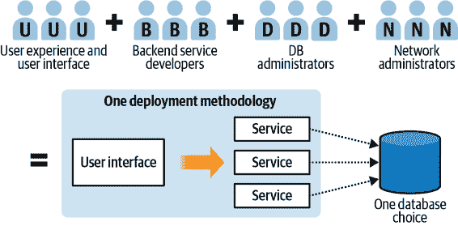
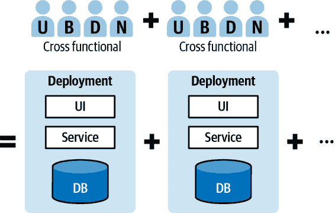
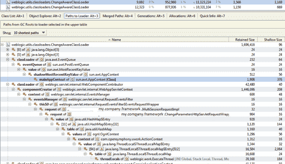

# 第一章：应用平台

马丁·福勒和詹姆斯·刘易斯最初在他们的 [博客文章](https://oreil.ly/ejm5V) 中定义了*微服务*这一架构术语：

> …作为一种特定的软件应用设计方式，由一套独立可部署的服务组成。虽然对于这种架构风格没有精确的定义，但围绕业务能力的组织、自动化部署、端点智能以及语言和数据的分散控制是其共同特征。

采用微服务承诺通过将应用程序分割为由独立团队开发和部署的组件来加速软件开发。它减少了协调和规划大规模软件发布的需求。每个微服务由独立团队构建，以满足特定的业务需求（用于内部或外部客户）。微服务以冗余、水平扩展的方式部署在不同的云资源上，并使用不同的协议通过网络相互通信。

由于这种架构，出现了一些挑战，这些挑战在以前的单体应用中没有出现过。单体应用过去主要部署在同一服务器上，并且很少作为一个精心协调的事件发布。软件发布过程是系统中变化和不稳定性的主要源泉。在微服务中，通信和数据传输成本引入了额外的延迟和可能降低最终用户体验的潜力。数十甚至数百个微服务现在共同工作来创建这种体验。微服务独立发布，但每一个微服务都可能无意中影响其他微服务，从而影响最终用户体验。

管理这些类型的分布式系统需要新的实践、工具和工程文化。加速软件发布不需要以稳定性和安全性为代价。事实上，它们是相辅相成的。本章介绍了高效平台工程团队的文化，并描述了可靠系统的基本构建块。

# 平台工程文化

要管理微服务，一个组织需要标准化特定的通信协议和支持框架。如果每个团队都需要维护自己的全栈开发，或者在与分布式应用的其他部分通信时存在摩擦，那么就会产生许多低效。实践中，标准化导致一个专注于为其他团队提供这些服务的平台团队，而这些团队又专注于开发满足业务需求的软件。

> 我们希望提供的是防护栏，而不是门。
> 
> Netflix 的工程工具总监戴安娜·马什

不是建造门，而是允许团队首先构建适合他们的解决方案，从中学习，并推广到整个组织。

> 设计系统的组织被限制为产生与这些组织的通信结构的副本相符的设计。
> 
> 康威定律

图 1-1 显示了围绕专业领域构建的工程组织。一个团队专门负责用户界面和体验设计，另一个团队负责构建后端服务，另一个团队负责管理数据库，另一个团队负责业务流程自动化，另一个团队负责管理网络资源。

###### 图 1-1\. 围绕技术专业领域构建的组织

康威定律常常被解读为，跨职能团队，就像图 1-2 中所示的那样，可以更快地迭代。毕竟，当团队结构与技术专业化相一致时，任何新的业务需求都需要跨越所有这些专业领域进行协调。

###### 图 1-2\. 跨职能团队

显然，这个系统中也存在浪费，具体来说，每个团队的专家都在独立开发能力。Netflix 没有为每个团队配备专门的站点可靠性工程师，就像 Google 在 *Site Reliability Engineering* 中所推广的那样，该书由 Betsy Beyer 等人（O'Reilly）编辑。也许是因为产品团队编写的软件类型更加同质化（主要是 Java，主要是无状态的横向扩展的微服务），产品工程功能的集中化更有效率。你的组织更像是 Google，致力于从自动驾驶汽车到搜索再到移动硬件再到浏览器等非常不同类型的产品吗？还是更像 Netflix，由一系列以少数几种语言编写、在有限种类平台上运行的业务应用程序组成？

跨职能团队和完全孤立的团队只是一个谱的两端。有效的平台工程可以减少团队专家对某些问题的需求。一个拥有专门平台工程的组织更像是一个混合体，就像图 1-3 中所示的那样。当中央平台工程团队把产品团队视为需要不断赢得的客户，并且几乎不对其客户的行为进行控制时，中央平台工程团队的实力最强。

###### 图 1-3\. 产品团队配备了专门的平台工程

例如，当监控工具分布在整个组织中作为每个微服务中的常见库时，它共享了已知广泛适用的可用性指标的宝贵知识。每个产品团队只需花费一点时间添加适合其业务领域的可用性指标。根据需要，它可以与中央监控团队沟通获取信息和建议，以建立有效的信号。

在 Netflix，最强大的文化潮流是“自由和责任”，这在 2001 年的某个[文化宣言](https://oreil.ly/9vxcd)中有所定义。我是工程工具团队的一员，但我们不能要求其他人采用特定的构建工具。一小部分工程师团队管理着许多产品团队的 Cassandra 集群。这种集中构建工具或 Cassandra 技能的效率，形成了一个自然的沟通枢纽，通过它，这些产品的不同问题得以解决，教训传递给以产品为中心的团队。

在 Netflix，构建工具团队在其最小点时只有两名工程师，为大约 700 名其他工程师服务，同时在推荐的构建工具（从 Ant 到 Gradle）之间进行过渡，并进行了两次重要的 Java 升级（从 Java 6 到 7，然后从 Java 7 到 8），以及其他日常例行事务。每个产品团队完全拥有自己的构建。由于“自由和责任”的原则，我们无法设定一个硬性日期来完全淘汰基于 Ant 的构建工具。我们也无法设定一个硬性日期来要求每个团队升级其 Java 版本（除非新的 Oracle 许可模型为我们做了这件事）。文化驱使我们如此专注于开发者体验，以至于产品团队*愿意*与我们一起迁移。这需要一种努力和共情，只有绝对阻止我们设定硬性要求才能保证。

当像我这样的平台工程师为许多不同的产品团队服务，专注于构建工具这样的技术专业领域时，不可避免地会出现模式。我的团队看到相同的脚本一次又一次地播放，涉及二进制依赖问题、插件版本控制、发布工作流问题等。我们最初致力于自动发现这些模式并在构建输出中发出警告。如果没有自由和责任的文化，也许我们会跳过警告，直接失败构建，要求产品团队修复问题。对构建工具团队来说，这会令人满意——我们不必对我们试图警告团队的失败相关问题负责。但从产品团队的角度来看，构建工具团队学到的每一个“教训”都可能在他们的时间表上随机出现，并且特别是在他们有更紧迫（即使是暂时的）的优先事项时尤为具有破坏性。

更为柔和、不会失败的警告方法出人意料地没有效果。团队几乎从不关注成功构建日志，无论发出多少警告。即使看到了警告，尝试修复它们也存在风险：带有警告的工作构建要比没有警告但行为不端的构建更好。因此，精心制作的弃用警告可能被忽视数月甚至数年。

“护栏而非大门”的方法要求我们的构建工具团队考虑如何以对产品团队可见、需要少量时间和精力行动，并减少随我们一起走的风险的方式分享知识。从中产生的工具几乎过于关注开发人员体验。

首先，我们编写了工具，可以重写 Gradle 构建的 Groovy 代码以自动修复常见模式。这比仅在日志中发出警告要困难得多。它需要对命令式构建逻辑进行保持缩进的抽象语法树修改，这是一般情况下无法解决的问题，但在特定情况下效果显著。自动修复是选择加入的，通过产品团队可以运行的简单命令来接受建议。

接下来，我们编写了监控仪器，报告了潜在可纠正但产品团队未接受建议的模式。我们可以随时间监控组织中的每种有害模式，看到随着团队接受纠正措施其影响逐渐减少。当我们到达一小部分坚持不接受的团队时，我们知道他们是谁，因此我们可以走到他们的桌子前，与他们一对一地合作，倾听他们的顾虑并帮助他们向前迈进。（我做了足够多的这种工作，开始随身携带自己的鼠标。Netflix 工程师使用轨迹球的和那些长期拒绝接受纠正措施的 Netflix 工程师之间有一个可疑的相关性。）最终，这种积极的沟通建立了信任的纽带，使我们未来的建议显得不那么冒险。

我们采取了相当极端的措施来提高建议的可见性，而不会通过破坏构建来引起开发人员的注意。构建输出被精心着色和设计，有时还带有视觉指示，如难以忽视的 Unicode 勾号和*X*标记。建议总是出现在构建的最后，因为我们知道它们是终端上最后输出的内容，我们的 CI 工具默认在工程师检查构建输出时滚动到日志输出的末尾。我们教会了 Jenkins 如何伪装成 TTY 终端来给构建输出着色，但忽略光标移动的转义序列以便依然串行化构建任务进度。

制定这种类型的经验在技术上成本高昂，但与两个选项相比：

自由和责任文化

带领我们通过监控建立了自助自动修复功能，帮助我们理解和与困难团队沟通。

集中控制文化

如果我们“拥有”构建体验，我们可能会急于分解构建。团队将因为要满足我们对一致构建体验的渴望而分心于其他优先事项。由于缺乏自动修复功能，每次变更都会导致更多问题向构建工具团队提出。每次变更的操作量都会大大增加。

一个有效的平台工程团队对开发者体验非常关注，这是至少与产品团队对客户体验的关注同等重要的一个焦点。这应该不足为奇：在一个良好校准的平台工程组织中，开发者就是客户！拥有健康的产品管理学科，专业的用户体验设计师以及深入关注他们工艺的 UI 工程师和设计师，这些都应该是平台工程团队为了他们的开发者客户利益而对齐的指标。

*关于团队结构的更多细节超出了本书的范围，请参考[《团队拓扑》](https://web.devopstopologies.com)（Matthew Skelton 和 Manuel Pais 著，IT Revolution Press 出版）以深入了解该主题。*

一旦团队在文化上达到一致，问题就变成了如何优先考虑平台工程团队可以向其客户群体提供的能力。本书的其余部分呼吁行动，按照（我认为）最重要到不那么重要的顺序列出能力。

# 监控

监控应用基础架构需要最少的组织承诺，是通向更加弹性系统的旅程中所有阶段中最小的组织承诺。正如我们将在后续章节中展示的那样，框架级别的监控仪器化已经发展到了只需打开开关并开始利用的程度。成本效益比已经严重倾向于利益，如果在本书中没有做任何其他事情，请立即开始监控您的生产应用。第二章 将讨论指标构建块，而第四章 将提供您可以使用的具体图表和警报，主要基于 Java 框架提供的仪器化，无需额外工作。

指标、日志和分布式追踪是三种可观察性形式，可用于测量服务可用性并帮助调试复杂的分布式系统问题。在深入研究它们的工作原理之前，了解它们各自能够提供的能力非常有用。

## 可用性监控

可用性信号衡量系统的整体状态以及系统是否按预期运行。它由 *服务水平指标*（SLIs）量化。这些指标包括系统健康的信号（例如资源消耗）和业务指标，如销售的三明治数量或每秒开始的流媒体视频。SLIs 根据称为 *服务水平目标*（SLO）的阈值进行测试，该阈值设置 SLI 范围的上限或下限。SLO 比与业务合作伙伴达成的阈值稍微更为严格或保守，用于预期提供的服务水平，即所谓的 *服务水平协议*（SLA）。其思想是 SLO 应提供某种程度的预警，提示即将违反 SLA 的情况，这样您就不会真正达到违反 SLA 的地步。

指标是衡量可用性的主要可观测工具。它们是 SLI 的一种度量。指标是最常见的可用性信号，因为它们代表系统中所有活动的聚合。它们足够廉价，不需要采样（丢弃部分数据以限制开销），这样可以避免丢弃重要的不可用性指标。

指标是按时间序列排列的数值，表示特定时间的样本或发生在间隔内的个体事件的聚合：

指标

指标 *应该* 具有固定的成本，无论吞吐量如何。例如，一个计算特定代码块执行次数的指标应该仅在一个时间段内发送观察到的执行次数，而不管有多少个执行。我的意思是，一个指标应该在发布时发送“观察到 N 次请求”，而不是在发布间隔期间多次观察到请求 N 次。

指标数据

指标数据不能用于推理任何单个请求的性能或功能。指标遥测权衡了跨所有请求的应用程序行为来推理单个请求的能力。

要有效监控 Java 微服务的可用性，需要监控各种可用性信号。通常信号在第四章中有详细描述，但通常可分为四类，称为 L-USE 方法：¹

延迟

这是衡量执行代码块所花费时间的一种方法。对于常见的基于 REST 的微服务，REST 终端点延迟是衡量应用程序可用性的有用指标，特别是最大延迟。这将在“延迟”中进一步讨论。

利用率

衡量有限资源消耗的程度。处理器利用率是常见的利用率指标。参见 “CPU 利用率”。

饱和度

饱和度是无法提供服务的额外工作的测量。“垃圾收集暂停时间” 展示了如何测量 Java 堆，这在内存压力过大时导致无法完成的工作积累。监视数据库连接池、请求池等池也是常见的做法。

错误

除了纯粹关注性能相关问题外，还必须找到一种方法来量化错误比率与总吞吐量的关系。错误的测量包括在服务端点上产生未预期异常导致的不成功的 HTTP 响应（参见 “错误”），以及更间接的措施，如尝试请求与开启断路器的比率（参见 “断路器”）。

利用率和饱和度可能起初看起来相似，而深入理解它们的区别将影响如何考虑资源的图表化和警报。一个很好的例子是 JVM 内存。您可以通过报告每个内存空间中消耗的字节数来将 JVM 内存作为利用率指标进行测量。您还可以通过垃圾回收所占时间与其他操作相比的比例来测量 JVM 内存的饱和度。在大多数情况下，当利用率和饱和度两种测量方法都可行时，饱和度指标通常会导致定义更明确的警报阈值。当内存利用率超过空间的 95%时很难发出警报（因为垃圾收集将使该利用率降回到该阈值以下），但是如果内存利用率经常超过 95%，垃圾收集器将更频繁地启动，比例上花费的时间将更多地用于垃圾收集，从而饱和度测量将更高。

一些常见的可用性信号列在 表 1-1 中。

表 1-1\. 可用性信号示例

| SLI | SLO | L-USE 标准 |
| --- | --- | --- |
| 进程 CPU 使用率 | 小于 80% | 饱和度 |
| 堆利用率 | 小于可用堆空间的 80% | 饱和度 |
| REST 端点的错误比率 | 小于端点总请求数的 1% | 错误 |
| REST 端点的最大延迟 | 小于 100 毫秒 | 延迟 |

Google 对于如何使用 SLOs 有更为详细的观点。

### Google 对 SLOs 的方法

《[Site Reliability Engineering](http://shop.oreilly.com/product/0636920041528.do)》由 Betsy Beyer 等人（O’Reilly 出版）将服务可用性呈现为竞争组织目标之间的紧张关系：提供新功能和可靠运行现有功能集。它建议产品团队和专门的站点可靠性工程师达成一致，制定一个错误预算，为允许服务在给定时间窗口内不可靠的程度提供可衡量的目标。超出此目标应该让团队将重点转向可靠性而不是功能开发，直到达到目标为止。

Google 对于服务水平目标（SLOs）的观点在《[Site Reliability Workbook](http://shop.oreilly.com/product/0636920132448.do)》的“Alerting on SLOs”章节中有详细解释（由 Betsy Beyer 等人编辑，O’Reilly 出版）。基本上，Google 工程师根据错误预算在任何给定的时间段内的消耗概率进行警报，并在必要时通过从功能开发向可靠性的工程资源转移来组织反应。在这种情况下，“错误”一词指的是超出任何 SLO 的情况。这可能意味着在 RESTful 微服务中超出服务器失败结果的可接受比例，但也可能意味着超过可接受的延迟阈值，接近操作系统底层的文件描述符过载，或任何其他测量的组合。根据这个定义，在指定时间窗口内服务不可靠的时间是不满足一个或多个 SLO 的比例。

对于错误预算的有用概念，你的组织不需要为产品工程师和站点可靠性工程师分开设立功能。即使是一个单独工作且完全负责其操作的产品工程师也可以从考虑在何处暂停功能开发以改善可靠性，反之亦然中获益。

我认为 Google 错误预算方案的额外开销对许多组织来说过多了。开始测量，发现警报功能如何适应你独特的组织，并一旦习惯于测量，考虑是否要全面采用 Google 的流程。

收集、可视化和对应用程序指标进行警报是不断测试服务可用性的过程。有时候，警报本身包含足够的上下文数据，你就知道如何解决问题。在其他情况下，你可能需要在生产环境中隔离一个失败的实例（例如，将其从负载均衡器中移出），并应用进一步的调试技术来发现问题。其他形式的遥测用于这一目的。

### SLO 的一种非正式方法

对于 Netflix 来说，一个不太正式的系统效果很好，其中个别工程团队负责其服务的可用性，在个别产品团队中不存在 SRE/产品工程师的责任分离，并且在组织之间没有对错误预算的如此正式的反应。这两种系统都没有对错；找到一个适合您的系统。

为了本书的目的，我们将以更简单的术语谈论如何衡量可用性：作为错误率或错误比率的测试，延迟、饱和度和利用率指标。我们不会将这些测试的违规行为视为特定的可靠性“错误”，从而从一段时间的错误预算中扣除。如果您想要利用这些测量结果，并将 Google 的 SRE 文化的错误预算和组织动态应用到您的组织中，您可以按照 Google 在这个主题上的指导进行操作。

## 监控作为调试工具

日志和分布式跟踪，在第 3 章中详细介绍，主要用于故障排除，一旦您意识到某段时间不可用。性能分析工具也是调试信号。

对于组织来说，将其整个性能管理投资集中在调试工具周围是非常普遍的（也很容易，因为市场混乱）。应用性能管理 (APM) 供应商有时会将自己销售为一站式解决方案，但其核心技术完全建立在跟踪或日志记录的基础上，并通过聚合这些调试信号提供可用性信号。

为了不特指任何特定的供应商，请考虑[YourKit](https://www.yourkit.com)，这是一个很有价值的性能分析（调试）工具，能够很好地完成这项任务，而不会将自己销售得更多。YourKit 擅长于突出 Java 代码中的计算和内存密集型热点，并且看起来像图 1-4。一些流行的商业 APM 解决方案也有类似的关注点，虽然有用，但并不能替代聚焦于可用性信号。

###### 图 1-4\. YourKit 在性能分析方面表现出色

这些解决方案更为细粒度，以不同的方式记录了特定交互过程中发生的情况。随着粒度的增加，成本也在增加，并且这种成本经常通过降低采样率甚至完全关闭这些信号来缓解。

试图从日志或跟踪信号中测量可用性通常会迫使您在准确性和成本之间进行权衡，而且两者都无法优化。这种权衡存在于跟踪中，因为它们通常是抽样的。跟踪的存储占用比指标高。

## 学会预期失败

如果你还没有以用户为中心的方式监控应用程序，一旦开始，你很可能会面对你的软件目前的现实。你的第一反应可能会是逃避。现实往往是丑陋的。

在一家中型财产保险公司，我们为公司的保险代理使用的主要业务应用程序增加了监控。尽管有严格的发布流程和相对健康的测试文化，该应用程序每分钟表现出大约 1,000 次请求中超过 5 次故障。从某种角度来看，这只是一个 0.5% 的错误比率（可能可以接受，也可能不可以），但故障率对于认为其服务经过了充分测试的公司来说仍然是一个震惊。

认识到系统不会完美的事实，将注意力从追求完美转向监控、警报和快速解决系统遇到的问题。无论控制变化速率的过程多么严格，都不会产生完美的结果。

在进一步发展交付和发布流程之前，通向具有弹性软件的第一步是在当前发布的软件中添加监控。

随着微服务的推广以及应用程序实践和基础设施的变化，监控变得更加重要。许多组件不直接受组织控制。例如，网络层、基础设施和第三方组件和服务的故障可能导致延迟和错误。每个开发微服务的团队都有可能对其他不受其直接控制的系统部分产生负面影响。

软件的最终用户也不期望完美，但希望他们的服务提供商能有效地解决问题。这就是所谓的*服务恢复悖论*，即服务的用户在服务失败后会比之前更信任该服务。

企业需要理解并捕捉他们想要为最终用户提供的用户体验——哪种系统行为会对业务造成问题，哪种行为是用户可以接受的。[*Site Reliability Engineering*](http://shop.oreilly.com/product/0636920041528.do) 和 [*The Site Reliability Workbook*](http://shop.oreilly.com/product/0636920132448.do) 中有更多关于如何为您的业务选择这些的内容。

一旦确定并衡量，您可以采纳 Google 风格，如在 “Google 的 SLO 方法” 中所见，或 Netflix 更不正式的 “上下文和防护栏” 风格，或介于两者之间的任何风格，以帮助您思考您的软件或下一步的行动。在 David N. Blank-Edelman（O'Reilly）的 [*Seeking SRE*](http://shop.oreilly.com/product/0636920063964.do) 书中的 Netflix 第一章，了解更多关于上下文和防护栏的信息。无论您选择遵循 Google 的实践还是更简单的实践，都取决于您的组织、您开发的软件类型以及您希望推广的工程文化。

将“永不失败”的目标替换为能够满足 SLA 的目标后，工程可以开始为系统构建多层次的弹性，最小化故障对最终用户体验的影响。

## 有效的监控建立信任。

在某些企业中，工程仍然被视为服务组织，而不是核心业务能力。在每分钟五次故障率的保险公司中，这是主流观念。在工程部门为公司的保险代理人提供服务的许多情况下，他们之间的主要互动是通过呼叫中心报告和跟踪软件问题。

工程部门定期根据从呼叫中心获得的缺陷信息优先处理 Bug 解决方案，同时对新功能请求也采取了一些措施，每次软件发布都这样做。我想知道现场代理人是否仅仅因为日益增长的 Bug 积压表明这不是他们时间的有效利用，或者因为问题有一个足够好的解决方法而没有报告问题。通过呼叫中心主要了解问题的问题在于它使得关系完全单向化。业务合作伙伴报告问题，工程部门做出响应（最终）。

用户中心的监控文化使得这种关系更具双向性。警报可能提供足够的上下文信息，以识别今天在某些地区代理人所服务的某一类车辆的评级失败。工程部门有机会主动与代理人联系，并提供足够的上下文信息解释问题已经被认识到。

# 交付

改进软件交付流程可以减少引入更多故障到现有系统的机会（或者至少帮助您快速识别并回滚这些变更）。事实证明，良好的监控是演变为安全和有效的交付实践的一个非显而易见的先决条件。

持续集成（CI）和持续交付（CD）之间的划分常常因团队频繁地编写部署自动化脚本并将这些脚本作为持续集成构建的一部分而变得模糊。可以很容易地重新利用 CI 系统作为灵活的通用工作流自动化工具。为了在概念上清晰地划分这两者，无论自动化运行在何处，我们将说持续集成在将微服务构件发布到构件存储库时结束，并从那一点开始交付。在图 1-5 中，软件交付生命周期被描述为从代码提交到部署的事件序列。

###### 图 1-5\. 持续集成与交付之间的边界

各个步骤受不同频率和组织需求的控制措施影响。它们也有根本不同的目标。持续集成的目标是通过自动化测试加速开发者反馈，快速失败，并鼓励及早合并以防止[混合集成](https://oreil.ly/8_74F)。交付自动化的目标是加速发布周期，确保满足安全和合规措施，提供安全可扩展的部署实践，并有助于理解部署景观以监控已部署的资产。

最佳的交付平台还充当当前部署资产清单，进一步放大良好监控的效果：它们帮助将监控转化为行动。在第六章，我们将讨论如何构建端到端资产清单，最终以已部署资产清单结束，使您能够推理代码的最小细节直至已部署的资产（即容器、虚拟机和函数）。

# 持续交付不一定意味着持续部署

真正的持续部署（每次提交通过自动化检查后自动进入生产环境）可能或可能不是您组织的目标。一切相等的情况下，较紧密的反馈循环优于较长的反馈循环，但它伴随着技术、运营和文化成本。本书中讨论的任何交付主题适用于总体上的持续交付，以及特别的持续部署。

一旦有效的监控就位，并且通过对代码的进一步更改引入的系统故障较少，我们可以专注于通过进化的流量管理实践为运行中的系统增加更多的可靠性。

# 流量管理

分布式系统的可靠性很大程度上基于对失败的预期和补偿。可用性监控揭示了这些实际的失败点，调试能力监控帮助理解这些点，交付自动化则有助于在任何增量发布中不引入更多这些问题。流量管理模式将帮助现有实例应对失败的现实。

在第七章，我们将介绍涉及负载均衡（平台、网关和客户端）以及调用弹性模式（重试、速率限制器、防火墙和断路器）的特定缓解策略，这些策略为运行中的系统提供了安全保障。

之所以放在最后，是因为它需要在每个项目基础上进行最高程度的手工编码工作，并且因为你在工作中投入的投资可以通过从前面步骤中学到的知识来指导。

# 未涵盖的能力

平台工程团队通常关注的某些能力未包含在本书中。我想特别提到两个，即测试和配置管理，并解释原因。

## 测试自动化

我对测试的看法是，开源测试自动化工具能够帮助你走出第一步。然而，进一步的投入可能会遭遇收益递减。以下是一些已经很好解决的问题：

+   单元测试

+   模拟/存根

+   基本的集成测试，包括测试容器

+   合约测试

+   构建工具有助于将计算昂贵和廉价的测试套件分开

除非你确实有大量资源（包括计算资源和工程时间）可供使用，否则建议避免另外几个问题。合约测试是一个覆盖这两者一部分内容的技术示例，但成本远远低于其它方法：

+   下游测试（即，每当对库进行提交时，构建所有直接或间接依赖于此库的其他项目，以确定更改是否会导致下游失败）

+   微服务套件的端到端集成测试

我非常支持各种自动化测试，但对整个企业的测试活动持怀疑态度。有时，感受到周围测试爱好者的社会压力，我可能会在一段时间内追随当时的测试潮流：100%测试覆盖率、行为驱动开发、努力吸引非工程师业务伙伴参与测试规范制定、Spock 等等。在开源 Java 生态系统中，一些最聪明的工程工作已经在这个领域进行：考虑 Spock 对字节码操作的创造性运用，实现数据表等功能。

传统上，与单片应用程序一起工作时，软件发布被视为系统变化的主要来源，因此也是潜在的失败来源。重点放在确保软件发布过程不失败上。为了验证待发布的软件稳定性，投入了大量精力确保较低级别的环境与生产环境一致。一旦部署并稳定，就假设系统会保持稳定。

现实情况并非如此。工程团队采用并加倍投入自动化测试实践来解决失败问题，结果失败问题依然顽固地存在。管理层本来就对测试持怀疑态度。当测试未能捕捉问题时，他们原本的信任也会荡然无存。生产环境有一种顽固的习惯，会在细微的、看似总是灾难性的方式上偏离测试环境。在这一点上，如果你逼我在接近 100%的测试覆盖率和一个发展完善的生产监控系统之间做选择，我会毫不犹豫地选择监控系统。这不是因为我对测试持有贬低的看法，而是因为即使在那些业务实践不快速改变的传统企业中，接近 100%的测试覆盖率也是虚幻的。生产环境会表现得完全不同。就像 Josh Long 所说：“没有什么地方能像它一样。”

有效的监控可以警告我们系统由于我们可以预料到的条件（例如硬件故障或下游服务不可用）而无法正常工作。它还不断增加我们对系统的了解，这实际上可以导致测试覆盖我们以前未曾想象的情况。

测试实践的层层堆叠可以限制失败的发生，但永远不可能完全消除，即使在执行最严格质量控制实践的行业中也是如此。在生产中积极测量结果可以降低发现时间，最终解决失败的时间。测试和监控共同是互补的实践，减少最终用户经历失败的次数。在最佳状态下，测试可以防止整类回归问题，而监控则可以迅速识别那些不可避免地存在的问题。

我们的自动化测试套件证明了（在它们自身没有逻辑错误的情况下）我们对系统的了解。生产监控则展示了实际发生了什么。接受自动化测试无法覆盖一切应该是一种巨大的解脱。

因为应用代码始终会存在因未预料到的交互、资源约束等环境因素以及不完美的测试而导致的缺陷，对于任何生产应用程序来说，有效的监控可能被认为比测试更为必要。测试证明了我们认为会发生的事情。监控则展示了正在发生的事情。

## 混沌工程与持续验证

有一个完整的学科围绕着持续验证软件是否如预期运行，通过引入受控故障（混沌实验）和验证来进行。因为分布式系统很复杂，我们无法预料到它们所有的各种互动，这种形式的测试有助于展现复杂系统的意外出现的属性。

混沌工程的整体学科非常广泛，由 Casey Rosenthal 和 Nora Jones（O'Reilly）详细介绍在[*Chaos Engineering*](http://shop.oreilly.com/product/0636920203957.do)中，我不会在这本书中详细讨论。

## 配置即代码

[12-Factor App](https://12factor.net/config)教导我们配置应该与代码[分离](https://12factor.net/config)。这个概念的基本形式，即配置存储为环境变量或在启动时从类似 Spring Cloud Config Server 的集中式配置服务器获取，我认为足够直接，不需要在这里解释。

更复杂的情况涉及*动态*配置，即对中央配置源的更改传播到运行实例，影响它们的行为，在实践中极其危险，必须小心处理。与开源 Netflix [Archaius](https://oreil.ly/uPG3Q)配置客户端配对（它存在于 Spring Cloud Netflix 依赖项和其他地方），还有一个专有的 Archaius 服务器用于此目的。由于动态配置传播到运行实例导致了多个生产事故，这些事故的规模如此之大，以至于交付工程师编写了一个完整的金丝雀分析流程，用于范围界定和逐步推出动态配置更改，借鉴了他们从不同版本代码的自动金丝雀分析中学到的经验教训。这超出了本书的范围，因为许多组织将永远不会从代码更改的自动金丝雀分析中获得足够的实质性好处，以使这种努力值得。

声明式交付是另一种完全不同的配置即代码形式，再次由 Kubernetes 及其 YAML 清单的兴起推广。我的早期职业生涯让我对仅声明式解决方案的完整性产生了永久的怀疑。我认为既有命令式配置又有声明式配置的地方总是存在的。我曾经为一家保险公司的政策管理系统工作过，该系统由一个返回 XML 响应的后端 API 和将这些 API 响应进行 XSLT 转换生成静态 HTML/JavaScript 以在浏览器中呈现的前端组成。

这是一种奇特的模板化方案。其支持者认为 XSLT 赋予了每个页面呈现一种声明性的特性。然而，事实证明，XSLT 本身是图灵完备的，具有令人信服的[存在证明](https://oreil.ly/O1gLz)。声明性定义的典型优点是简单性，有利于像静态分析和修复这样的自动化。但就像 XSLT 案例一样，这些技术似乎不可避免地向图灵完备演化。JSON（[Jsonnet](https://jsonnet.org)）和 Kubernetes（[Kustomize](https://kustomize.io)）也受到相同的力量影响。这些技术无疑是有用的，但我不能再加入呼吁纯粹声明性配置的合唱队伍。除非提到这一点，否则我认为这本书没有太多可添加的内容。

# 封装能力

尽管面向对象编程（OOP）如今备受争议，但其基本概念之一是*封装*。在 OOP 中，封装意味着将状态和行为捆绑在某个单元内，例如 Java 中的类。一个关键思想是隐藏对象的状态，称为*信息隐藏*。在某些方面，平台工程团队的任务类似于为其客户开发团队执行类似的封装任务，用于可靠性最佳实践，不是为了控制信息，而是为了减轻他们处理信息的责任。也许中心团队从产品工程师那里收到的最高赞扬就是“我不必关心你们在做什么”。

接下来的章节将介绍一系列我理解的最佳实践。作为平台工程师，您面临的挑战是以最小干扰的方式将它们传递给您的组织，构建“护栏而非大门”。阅读时，请思考如何封装那些适用于每个业务应用的宝贵知识，并且如何将其传递给您的组织。

如果计划涉及从足够强大的高管获得批准，并向整个组织发送电子邮件要求在某个日期之前采纳，那就是一个大门。您仍然希望领导层的支持，但您需要以更像护栏而非大门的方式提供通用功能：

显式的运行时依赖项

如果您有一个核心库，每个微服务都作为运行时依赖项包含其中，这几乎可以肯定是您的交付机制。开启关键指标，添加常见的遥测标签，配置跟踪，添加流量管理模式等。如果您大量使用 Spring，请使用自动配置类。如果您使用 Java EE，您也可以类似地条件化配置 CDI。

服务客户作为依赖项

特别是在流量管理模式（回退、重试逻辑等）方面，考虑由生产服务的团队来负责制作一个*客户端*与服务交互。毕竟，生产和运营团队比任何人都更了解其弱点和潜在故障点。这些工程师很可能是将这些知识形式化为客户端依赖关系的最佳人选，以便服务的每个消费者能够以最可靠的方式使用它。

注入运行时依赖

如果部署过程相对标准化，您有机会在部署环境中*注入*运行时依赖项。这是 Cloud Foundry 构建包团队采用的方法，用于向在 Cloud Foundry 上运行的 Spring Boot 应用程序注入平台指标实现。您可以采取类似的方法。

在过早封装之前，找到几个团队并在几个应用程序中明确地在代码中实践这一纪律。总结您所学到的东西。

## 服务网格

作为最后的手段，在应用程序旁边（或容器中）封装常见平台功能，与管理它们的控制平面配对，这被称为*服务网格*。

服务网格是应用程序代码之外的基础架构层，用于管理微服务之间的交互。今天最具代表性的实现之一是[Istio](https://istio.io)。这些边车执行诸如流量管理、服务发现和监控等功能，代表应用程序进程操作，使应用程序无需关注这些问题。在最佳情况下，这简化了应用程序开发，但增加了部署和运行服务的复杂性和成本。

长期来看，软件工程的趋势通常是循环的。在可靠性领域，责任的摆动从增加应用程序和开发者责任（例如 Netflix OSS、DevOps）到集中运维团队的责任。服务网格的兴起代表着责任再次回归到集中运维团队手中。

Istio 提倡通过其集中控制平面管理和传播跨一组微服务的策略，这是组织集中的专业团队的要求，他们专门负责理解这些策略的后果。

可敬的 Netflix OSS 套件（其重要部分有 Resilience4j 用于流量管理、HashiCorp Consul 用于发现、Micrometer 用于度量仪器等替代版本）已经考虑了这些应用程序问题。尽管如此，应用程序代码的影响主要是添加一个或多个二进制依赖项，此时某种形式的自动配置接管并装饰否则不受影响的应用程序逻辑。这种方法的明显缺点是语言支持，每种站点可靠性模式的支持都要求组织在其使用的每种语言/框架中实现库。

图 1-6 展示了这种工程周期对衍生价值的乐观看法。幸运的是，在每次从分散化到集中化再到分散化的过渡中，我们都从之前周期中学到并完全封装了其好处。例如，Istio 可能完全封装了 Netflix OSS 堆栈的好处，只为了下一个分散化推动释放出在 Istio 实现中无法实现的潜力。例如，Resilience4j 已经在进行中，讨论如何响应应用程序特定指标的自适应形式的 bulkheads 等模式。

###### 图 1-6。软件工程的循环性质，应用于流量管理

鉴于缺乏特定领域知识，边车的大小也很棘手。边车如何知道应用程序进程将每秒消耗 10,000 个请求，还是仅为 1 个？总体来看，我们如何在不知道最终会存在多少边车的情况下预先确定边车控制平面的大小？

# 边车限于最低公共知识点

边车代理将永远在应用程序特定知识对提高容错性至关重要的下一步方面最弱。按定义，边车与应用程序分离，无法编码任何这个特定于应用程序的领域知识，而不需要应用程序和边车之间的协调。这很可能至少与通过应用程序可包含的语言特定库实现边车提供的功能同样困难。

我相信开源的测试自动化工具能帮助你达到一定程度。超出此范围的任何投资可能会出现收益递减的情况，正如在"服务网格跟踪"中讨论的那样，并反对使用 Sidecar 进行流量管理，就像在"服务网格中的实现"中所述，尽管这些观点可能不受欢迎。与通过显式包含或注入运行时的二进制依赖相比，这些实现是有损的，后者可以增加更多功能，只有在需要支持大量不同语言时才可能成本过高（即便如此，我仍未被说服）。

# 概要

在本章中，我们将平台工程定义为至少是可靠性工程功能的占位符短语，我们将在本书的其余部分中讨论这些功能。只有在以客户为导向的情况下（其中客户是组织中的其他开发人员），平台工程团队才能发挥最佳效果，而不是控制的一种。测试工具、这些工具的采用路径以及针对“护栏而非门”的规则开发的任何过程。

最终，设计你的平台部分也是设计你的组织。你想因什么而闻名？

¹ 我最初是通过 Brendan Gregg 对他的[方法](https://oreil.ly/ikvUz)进行 Unix 系统监控来了解 USE 标准。在那种情况下，延迟测量不像精细，因此缺少*L*。
