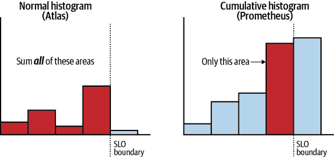

# 第二章：应用程序指标

由于由许多通信微服务组成的分布式系统的复杂性，能够观察系统状态变得尤为重要。变化速率很高，包括新代码发布、独立扩展事件随着负载变化、基础设施更改（云提供商更改）以及动态配置更改在系统中传播。在本章中，我们将重点讨论如何测量和对分布式系统性能进行警报，以及采用的一些行业最佳实践。

组织至少必须致力于一个或多个监控解决方案。可以选择多种选择，包括开源、商业本地部署和 SaaS 提供的解决方案，具有广泛的能力范围。市场已经足够成熟，以至于任何规模和复杂性的组织都可以找到适合其需求的解决方案。

监控系统的选择对保持指标数据的固定成本特性至关重要。例如，StatsD 协议要求应用程序在每个事件基础上向 StatsD 代理发出发射。即使此代理作为同一主机上的旁路进程运行，应用程序仍会承担每个事件基础上创建有效负载的分配成本，因此，此协议至少破坏了指标遥测的这一优势。这并非总是（甚至通常不是）灾难性的，但请注意此成本。

# 黑盒与白盒监控比较

指标收集方法可以根据其能够观察的内容进行分类：

黑盒监控

收集器可以观察输入和输出（例如，系统中的 HTTP 请求和响应），但操作的机制对收集器是未知的。黑盒收集器通过某种方式拦截或包装被观察的进程以进行测量。

白盒

收集器可以观察输入和输出以及操作的内部机制。白盒收集器在应用程序代码中执行此操作。

许多监控系统供应商提供可以附加到应用程序进程的代理，并提供黑盒监控。有时，这些代理收集器可以深入到众所周知的应用程序框架中，以至于在某些方面开始类似于白盒收集器。尽管如此，以任何形式的黑盒监控都受制于代理编写者能够概括所有可能应用代理的应用程序的内容的限制。例如，代理可能能够拦截并计时 Spring Boot 用于数据库事务的机制。代理永远无法推断某个类中的`java.util.Map`字段代表近缓存的形式并作为此类仪表进行操作。

基于服务网格的仪表化也是黑盒的，并且通常比代理功能更弱。虽然代理可以观察和装饰单个方法调用，但服务网格的最细粒度观察是在 RPC 级别。

另一方面，白盒收集听起来像是很多工作。一些有用的度量标准确实可以跨应用程序进行泛化（例如，HTTP 请求时间，CPU 利用率），并且通过黑盒方法进行了很好的仪表化。当一个白盒仪表化库与一个应用程序自动配置机制配对时，其中一些概括化部分类似于黑盒方法。自动配置的白盒仪表化需要与黑盒仪表化相同的开发人员工作水平：具体来说是*零*！

优秀的白盒度量收集器应该捕获与黑盒收集器相同的所有内容，但还应支持捕获更多黑盒收集器根据定义无法捕获的内部细节。对于你的工程实践来说，这两者之间的区别是微不足道的。对于黑盒代理，你必须修改你的交付实践以打包和配置代理（或者与运行时平台集成以替代这个过程）。对于自动配置的白盒度量收集，它捕获了相同的细节集，你必须在构建时包含一个二进制依赖项。

供应商特定的仪表化库倾向于不具有白盒方法的黑盒感，因为框架和库的作者不倾向于添加各种专有仪表化客户端，即使作为可选依赖项，并且在其代码中多次进行仪表化。像 Micrometer 这样的供应商中立的仪表化外观具有“写一次，随处发布”的优势，供框架和库的作者使用。

当然，黑盒和白盒收集器可以互补，即使它们之间存在一些重叠。没有普遍要求选择其中一个而不是另一个。

# 维度度量

大多数现代监控系统采用了由度量名称和一系列键值标签组成的维度命名方案。

虽然监控系统的存储机制在很大程度上有所不同，但总的来说，每个唯一的名称和标签组合都表示为存储中的一个独特条目或行。因此，度量标准的存储成本是其标签集的基数的乘积（即唯一键值标签对的总数）。

例如，一个应用程序范围的计数器指标，名为 `http.server.requests`，包含一个标签，用于观察到的 HTTP 方法，其中仅观察到 GET 和 POST 两种方法，一个服务返回三种状态代码中的一种，以及两个应用程序中的一个 URI，导致最多 <math alttext="2 asterisk 3 asterisk 2 equals 12"><mrow><mn>2</mn> <mo>*</mo> <mn>3</mn> <mo>*</mo> <mn>2</mn> <mo>=</mo> <mn>12</mn></mrow></math> 个不同的时间序列被发送到监控系统并存储。在此示例中，此指标在存储中的表示大致如 表 2-1 所示。例如，协调标签，例如仅端点 `/a1` 将具有 `GET` 方法，仅 `/a2` 将具有 `POST` 方法，可以将唯一时间序列的总数限制在理论最大值以下，在此示例中仅为六行。在许多维度时间序列数据库中，对于每一行代表的唯一名称和标签集，将有一个值环形缓冲区，用于在定义的时间段内保存此指标的样本。当系统包含类似这样的有界环形缓冲区时，您的指标的总成本固定为唯一指标名称/标签的排列数乘以环形缓冲区的大小。

表 2-1\. 维度指标的存储

| 指标名称和标签 | 值 |
| --- | --- |
| http.server.requests{method=GET,status=200,uri=/a1} | [10,11,10,10] |
| http.server.requests{method=GET,status=400,uri=/a1} | [1,0,0,0] |
| http.server.requests{method=GET,status=500,uri=/a1} | [0,0,0,4] |
| http.server.requests{method=POST,status=200,uri=/a2} | [10,11,10,10] |
| http.server.requests{method=POST,status=400,uri=/a2} | [0,0,0,1] |
| http.server.requests{method=POST,status=500,uri=/a2} | [1,1,1,1] |

在某些情况下，指标会定期移动到长期存储。在这一点上，有机会压缩或丢弃标签，以减少存储成本，尽管会牺牲一些维度的粒度。

# 层次指标

在维度指标系统变得流行之前，许多监控系统采用了层次结构方案。在这些系统中，指标仅通过名称定义，没有键值标签对。标签非常有用，以至于出现了一种约定，将类似标签的数据附加到指标名称中，例如用点分隔符。因此，维度系统中具有 `method` 标签为 `GET` 的维度指标 `httpServerRequests`，可能在层次结构系统中表示为 `httpServerRequests.method.GET`。由此产生了查询功能，如通配符运算符，允许跨“标签”进行简单聚合，如表 2-2 所示。

表 2-2\. 使用通配符聚合层次指标

| 指标查询 | 值 |
| --- | --- |
| httpServerRequests.method.GET | 10 |
| httpServerRequests.method.POST | 20 |
| httpServerRequests.method.* | 30 |

然而，在分层系统中，标签并不是一等公民，像这样的通配符会失效。特别是当组织决定像`httpServerRequests`这样在整个堆栈中的许多应用程序中通用的度量标签应该接收一个新标签时，它有可能破坏现有的查询。在表 2-3 中，独立于方法的请求的真实数量是 40，但由于堆栈中的某些应用程序在度量名称中引入了一个新的状态标签，它不再包含在聚合中。即使我们可以作为整个组织同意标准化使用这个新标签，我们的通配符查询（以及任何基于它们构建的仪表板或警报）也会误代表自标签首次在第一个应用程序中引入直到完全在代码库中传播并重新部署的时间内的系统状态。

表 2-3\. 使用通配符的分层度量聚合失败

| Metric query | Value |
| --- | --- |
| httpServerRequests.method.GET | 10 |
| httpServerRequests.method.POST | 20 |
| httpServerRequests.status.200.method.GET | 10 |
| httpServerRequests.method.* | 30 (!!) |

事实上，层次方法迫使标签在它们实际上是独立的键值对时强加了一个顺序。

如果您现在开始进行实时应用程序监控，您应该使用维度监控系统。这意味着您还必须使用维度度量仪表化库以便以充分利用使这些系统如此强大的名称/标签组合的方式记录度量。如果您已经有一些使用分层收集器的仪表化，其中最流行的是 Dropwizard Metrics，您最终将不得不重写此仪表化。通过开发某种方式遍历所有标签并将它们与度量名称组合的命名约定，可以将维度度量转换为分层度量。反向操作很难泛化，因为命名方案的不一致使得将分层名称拆分为维度度量变得困难。

从这一点开始，我们将仅研究维度度量指标的仪表化。

# Micrometer Meter Registries

本章的其余部分将使用[Micrometer](https://micrometer.io)，这是一个支持市场上大多数流行监控系统的 Java 维度度量仪表化库。现在只有两个 Micrometer 的主要替代品可用：

监控系统供应商通常会提供 Java API 客户端。

尽管这些适用于应用程序级别的白盒子仪器，但很少有可能会有整个 Java 生态系统，特别是第三方开源库，会采用特定供应商的仪器客户端进行指标收集。迄今为止，我们可能最接近的是在 Prometheus 客户端的一些开源库中的零星采用。

[OpenTelemetry](https://oreil.ly/xV0Aa)

OpenTelemetry 是一个混合度量和跟踪库。在撰写本文时，OpenTelemetry 还没有 1.0 发布，其关注点显然更多地集中在跟踪而不是度量上，因此度量支持要简单得多。

虽然从一个维度的度量仪器库到另一个维度的仪器库的功能可能会有所不同，但描述的大多数关键概念都适用于它们中的每一个，或者至少你应该开发出对替代方案预期成熟度的理解。

在 Micrometer 中，`Meter`是收集关于您的应用程序的一组测量（我们称之为度量）的接口。

计量器是从并保存在`MeterRegistry`中创建的。每个支持的监控系统都有一个`MeterRegistry`的实现。如何创建注册表因每个实现而异。

Micrometer 项目支持的每个`MeterRegistry`实现都发布了一个库到 Maven Central 和 JCenter（例如，`io.micrometer:micrometer-registry-prometheus`，`io.micrometer:micrometer-registry-atlas`）：

```java
MeterRegistry registry = new PrometheusMeterRegistry(PrometheusConfig.DEFAULT);
```

更多选项的`MeterRegistry`实现同样包含流畅构建器，例如在示例 2-1 中显示的 InfluxDB 注册表。

##### 示例 2-1\. Influx 流畅构建器

```java
MeterRegistry registry = InfluxMeterRegistry.builder(InfluxConfig.DEFAULT)
  .httpClient(myCustomizedHttpClient)
  .build();
```

可以使用`CompositeMeterRegistry`同时将度量发布到多个监控系统。

在示例 2-2 中，创建了一个将指标发送到 Prometheus 和 Atlas 的复合注册表。应该使用复合体创建计量器。

##### 示例 2-2\. 将指标发送到 Prometheus 和 Atlas 的复合计量器注册表

```java
MeterRegistry prometheusMeterRegistry = new PrometheusMeterRegistry(
  PrometheusConfig.DEFAULT);
MeterRegistry atlasMeterRegistry = new AtlasMeterRegistry(AtlasConfig.DEFAULT);

MeterRegistry registry = new CompositeMeterRegistry();
registry.add(prometheusMeterRegistry);
registry.add(atlasMeterRegistry);

// Create meters like counters against the composite,
// not the individual registries that make up the composite
registry.counter("my.counter");
```

Micrometer 包含一个全局静态的`CompositeMeterRegistry`，可以类似于使用 SLF4J 的`LoggerFactory`那样使用。这个静态注册表的目的是允许在不能通过 API 依赖泄漏 Micrometer 的组件中进行仪表化，通过提供一种依赖注入`MeterRegistry`的方式。示例 2-3 展示了全局静态注册表的使用方式与我们从日志库（如 SLF4J）中习惯的方式的相似性。

##### 示例 2-3\. 使用全局静态注册表

```java
class MyComponent {
  Timer timer = Timer.builder("time.something")
    .description("time some operation")
    .register(Metrics.globalRegistry);

  Logger logger = LoggerFactory.getLogger(MyComponent.class);

  public void something() {
    timer.record(() -> {
      // Do something
      logger.info("I did something");
    });
  }
}
```

通过将你在应用程序中引入的任何 MeterRegistry 实现添加到全局静态注册表，任何使用全局注册表的底层库都会将指标注册到你的实现中。复合注册表可以添加到其他复合注册表中。在 Figure 2-1 中，我们在应用程序中创建了一个复合注册表，它同时向 Prometheus 和 Stackdriver 发布指标（即我们对 Prometheus 和 Stackdriver 注册表都调用了 `CompositeMeterRegistry#add(MeterRegistry)`）。然后我们将该复合注册表添加到全局静态复合中。你创建的复合注册表可以通过 Spring、CDI 或 Guice 等框架在整个应用程序中进行依赖注入，以便你的组件向其注册指标。但其他库通常不在此依赖注入的上下文中，因为它们不希望 Micrometer 通过其 API 签名泄露，所以它们会向静态全局注册表注册。最终，指标注册沿着注册表层次结构向下流动。因此，库指标从全局复合流向你的应用程序复合，再流向各个注册表。应用程序指标从应用程序复合流向各个 Prometheus 和 Stackdriver 注册表。


###### 图 2-1\. 全局静态注册表与应用程序注册表的关系

# Spring Boot 自动配置 MeterRegistry

Spring Boot 会自动配置一个复合注册表，并为在类路径上找到的每个支持的实现添加注册表。在你的运行时类路径上依赖`micrometer-registry-{system}`以及该系统的任何必需配置，将导致 Spring Boot 配置注册表。Spring Boot 还会将任何作为`@Bean`的 MeterRegistry 添加到全局静态复合中。通过这种方式，你添加到应用程序中的任何提供 Micrometer 仪表盘的库将自动将它们的指标发送到监控系统！这就是通过白盒仪表化实现黑盒般的体验。作为开发者，你无需显式注册这些指标；它们存在于你的应用程序中就能工作。

# 创建 Meter

对于每种支持的 `Meter` 类型，Micrometer 提供了两种样式来注册指标，具体取决于您需要多少选项。如示例 2-4（part0006_split_006.html#meter_fluent_builder）所示，流畅构建器提供了最多的选项。通常，核心库应该使用流畅构建器，因为为了为所有用户提供健壮的描述和基本单位详细信息，额外的冗长性增加了价值。在具有少量工程师的特定微服务的仪器化中，选择更紧凑的代码和更少的详细信息是可以接受的。一些监控系统支持附加描述文本和基本单位到指标，对于这些系统，Micrometer 将发布这些数据。此外，一些监控系统将使用指标的基本单位信息自动缩放和标记图表的 *y* 轴，使其以人类可读的方式。因此，如果您发布带有“bytes”基本单位的指标，复杂的监控系统将识别此并将 *y* 轴缩放为兆字节或千兆字节，或者任何对于此指标范围最为人类可读的值。阅读“2 GB”比“2147483648 bytes”要容易得多。即使对于那些从根本上不支持基本单位的监控系统，诸如 [Grafana](https://grafana.com) 这样的图表用户界面也允许您手动指定图表的单位，而 Grafana 将为您执行这种智能的人类可读缩放。

##### 示例 2-4\. Meter 流畅构建器

```java
Counter counter = Counter.builder("requests") // Name
  .tag("status", "200")
  .tags("method", "GET", "outcome", "SUCCESS") // Multiple tags
  .description("http requests")
  .baseUnit("requests")
  .register(registry);
```

`MeterRegistry` 包含方便的方法，用于使用较短的形式构造 `Meter` 实例，如 示例 2-5 所示。

##### 示例 2-5\. Meter 构造便利方法

```java
Counter counter = registry.counter("requests",
  "status", "200", "method", "GET", "outcome", "SUCCESS");
```

无论您使用哪种方法来构造计量器，您都必须决定其名称以及应用哪些标签。

# 指标命名

要充分利用指标，它们需要以一种结构化的方式进行组织，以便仅选择名称并对所有标签进行聚合能够产生一个有意义的（尽管不一定总是有用的）值。例如，如果一个指标命名为 `http.server.requests`，那么标签可以识别应用程序、区域（按照公共云的概念）、API 终端、HTTP 方法、响应状态码等。对此指标的所有唯一标签组合进行的聚合测量将为您的应用程序栈中的许多应用程序的每次交互产生吞吐量的测量。在此名称上切换到各种标签的能力使其变得有用。我们可以按区域将此指标在度量上扩展，并观察区域性故障或详细查看特定应用程序，例如，成功响应特定 API 终端以推理通过该关键终端的吞吐量。

假设许多应用程序都使用某种度量标准，如`http.server.requests`，当在`http.server.requests`上构建可视化时，监控系统将显示所有应用程序、地区等的`http.server.requests`性能的聚合，直到您决定对某些内容进行维度钻取。

然而，并非所有的都应该是标签。假设我们试图分别测量 HTTP 请求的数量和数据库调用的数量。

Micrometer 使用一个命名约定，用`.`（点）字符分隔小写单词。示例 2-6 中显示的命名提供了足够的上下文，以便如果只选择名称，则值至少在潜在上是有意义的。例如，如果我们选择`database.queries`，我们可以看到对所有数据库的调用总数。然后我们可以按数据库分组或选择以进一步进行钻取或执行对每个数据库调用贡献的比较分析。

##### 示例 2-6\. 推荐方法

```java
registry.counter("database.queries", "db", "users")
registry.counter("http.requests", "uri", "/api/users")
```

使用 示例 2-7 中展示的方法，如果我们选择度量`calls`，我们将得到一个聚合值，该值是数据库调用和 HTTP 请求的总数。如果没有进一步进行维度钻取，这个值是没有用处的。

##### 示例 2-7\. 不良实践：在应该有不同计量名称的地方使用类型标签

```java
registry.counter("calls",
    "type", "database",
    "db", "users");

registry.counter("calls",
    "type", "http",
    "uri", "/api/users");
```

图 2-2 显示了这种错误命名的影响。假设每个 HTTP 请求您都进行了 10 次数据库调用。如果只绘制`calls`，您将得到约 11,000 次的顶线速率。但是 11,000 是两种类型调用的笨拙总和，其频率始终相差一个数量级。要从中获得任何实用性，我们需要按维度分解，此时我们发现了数据库调用与 HTTP 请求之间的 10 倍关系。必须立即进行维度钻取才能构建可理解的图表，这表明度量命名方案存在问题。


###### 图 2-2\. 错误命名对图表可用性的影响

将相关数据分组是一个良好的做法，比如通过为度量名称添加像“jvm”或“db”这样的命名空间前缀。例如，与 JVM 垃圾回收相关的一组指标可以用`jvm.gc`作为前缀：

```java
jvm.gc.live.data.size
jvm.gc.memory.promoted
jvm.gc.memory.allocated
```

这种命名空间不仅有助于在许多监控系统 UI 和仪表板工具中按字母顺序分组相关指标，还可以用于通过`MeterFilter`一次性影响一组指标。例如，要禁用所有`jvm.gc`指标，我们可以在这个名称上应用一个拒绝`MeterFilter`：

```java
MeterRegistry registry = ...;
registry.config().meterFilter(MeterFilter.denyNameStartsWith("jvm.gc"));
```

不同的监控系统对命名约定有不同的建议，有些命名约定可能对某一系统不兼容。请记住，Micrometer 使用一个命名约定，用`.`（点）字符分隔小写单词。每个用于监控系统的 Micrometer 实现都有一个命名约定，将小写点表示法名称转换为该监控系统推荐的命名约定。

另外，此命名约定还会清理度量名称和标签中的特殊字符，这些字符是监控系统禁止使用的。该约定事实证明不仅仅是为了看起来更惯用。如果以这种形式发货而没有任何命名约定规范化，两个度量，`http.server.requests`和`http.client.requests`，将会破坏 Elasticsearch 索引，因为 Elasticsearch 将点视为用于索引的层次结构形式。如果这些度量没有以点分隔符的形式发送到 SignalFx，我们将无法利用 SignalFx 中用点分隔符对度量进行层次化的 UI 呈现功能。这两种关于点字符的不同观点是互斥的。通过命名约定规范化，这些度量被发送到 Elastic 作为`httpServerRequests`和`httpClientRequests`，并且带有点符号发送到 SignalFx。因此，应用程序代码在不更改工具的情况下保持最大的可移植性。使用 Micrometer 时，米器名称和标签键应遵循这些准则：

+   始终使用点来分隔名称的各个部分。

+   避免在米器名称中添加单位名称或诸如`total`等字词。

因此，选择`jvm.gc.memory.promoted`而不是`jvmGcMemoryPromoted`或`jvm_gc_memory_promoted`。如果您喜欢后者之一（或者如果您的监控系统要求这样做），请在注册表上配置命名约定以进行此转换。但是，在整个软件堆栈中使用点分隔符作为度量名称，可以为各种监控系统提供一致的结果。

对于某些监控系统，单位名称等的存在是惯用命名方案的一部分。再次强调，命名约定可以在适当的情况下添加这些部分。例如，Prometheus 的命名约定在计数器的后缀上添加了`_total`，在定时器的末尾添加了`_seconds`。此外，基本时间单位根据监控系统而异。使用 Micrometer 的`Timer`，您可以以任何粒度记录，并且时间值在发布时进行了缩放。即使您总是以特定粒度记录，包含单位名称在米器名称中也是不准确的。例如，示例 2-8 在 Prometheus 中显示为`requests_millis_seconds`，这显得很尴尬。

##### 示例 2-8\. 不良做法：在米器名称中添加单位

```java
registry.timer("requests.millis")
  .record(responseTime, TimeUnit.MILLISECONDS);
```

可以用自定义命名约定重写 `MeterRegistry` 的默认命名约定，该命名约定可以建立在 `NamingConvention` 接口提供的一些基本构建块上，如示例 2-9 所示。

##### 示例 2-9\. 一个自定义的命名约定，将基本单位作为后缀添加

```java
registry.config()
  .namingConvention(new NamingConvention() { 
      @Override
      public String name(String name, Meter.Type type, String baseUnit) {
          String camelCased = NamingConvention.snakeCase.name(name, type, baseUnit);
          return baseUnit == null ? camelCased :
                  camelCased + "_" + baseUnit;
      }
  });
```


`NamingConvention` 是一个函数式接口，因此这可以简化为一个 lambda，但为了清晰起见，我们在这里保留了匿名类。

如“维度度量”中所述，度量的总存储成本是其每个标记的值集的基数的乘积。选择有助于识别软件故障模式的标记名称。例如，如果监控汽车保险评级应用程序，则将策略度量标记为车辆类别比将其标记为唯一车辆识别号更有用。由于错误或下游服务中断，某一类车辆（如经典卡车）可能开始失败。在超过预定阈值的策略评级错误比率警报上作出响应时，工程师可能会快速确定经典卡车处理存在问题，这是基于车辆类别中前三个评级失败的情况。

# 限制总唯一标记值以控制存储成本

要注意来自用户提供的来源的标记值可能导致度量的基数增加。您应该始终仔细规范化和限制用户提供的输入。有时候原因很隐蔽。考虑记录服务端点上的 HTTP 请求时的 URI 标记。如果我们不将 404s 限制为像“NOT_FOUND”这样的值，那么度量的维度将随着每个无法找到的资源而增长。更加棘手的是，一个将所有非经过身份验证的请求重定向到登录端点的应用程序可能会为最终将在经过身份验证后找不到的资源返回 403，并且因此，403 的一个合理的 URI 标记可能是“REDIRECTION”。允许标记值集合无限增长可能会导致监控系统中的存储溢出，增加成本并可能使您的可观察性堆栈的核心部分不稳定化。

一般来说，避免在像用户 ID 这样的唯一值上记录标记，除非已知该人口规模很小。

标记值必须是非空的，最好是非空白的。尽管 Micrometer 在技术上支持有限情况下的空白标记值，比如对于 Datadog 注册表实现，但空白的标记值在其他不支持它们的监控系统中不具备可移植性。

# 限制总唯一标记值以控制查询成本

除了随着唯一标记值数量的增加而增加存储成本外，查询成本（包括时间和资源）也会随着需要在查询结果中聚合更多时间序列而增加。

## 常见标记

当低级别库提供常见的仪表化时（Micrometer 提供开箱即用的计量器绑定器——参见“计量器绑定器”），它们无法知道此仪表化将在何种应用程序上收集。应用程序是在私有数据中心运行，还是在一组名为的小型 VM 之一上运行，而这些名称从不改变？是在基础设施即服务的公共云资源上？在 Kubernetes 中？几乎每种情况下，特定应用程序的多个运行副本都可能输出指标，即使在生产环境中只有一个副本，在低级测试环境中也只有一个。如果我们能以某种方式对这些不同应用程序实例输出的指标进行分区，以允许我们通过某些维度将行为归因于特定实例，那将非常有用。

计量过滤器（详细介绍请参阅“计量过滤器”）允许您添加常见标签来实现这一点，从而丰富从应用程序发布的每个指标。选择帮助将您的指标数据转化为行动的常见标签。以下是一些始终有用的常见标签：

应用程序名称

考虑到一些指标，比如框架提供的 HTTP 请求指标，将在各种应用程序中具有相同的名称，例如，应用程序服务的`http.server.requests`和向其他服务发出的`http.client.requests`的出站请求。通过应用程序名称进行标记，您可以例如推断出关于跨多个调用者的某个特定服务端点的所有出站请求的情况。

集群和服务器组名称

在“交付管道”中，我们更多地讨论了集群和服务器组的正式定义。如果您拥有这样的拓扑结构，使用集群和服务器组的标签总是有益的。有些组织并不具备这种复杂程度，这也是可以接受的。

实例名称

在某些情况下，这可能是机器的主机名，但并非总是如此（这有助于解释为什么 Micrometer 不会预先使用诸如主机名之类的标签，因为它确实取决于部署的环境）。在公共云环境中，主机名可能不是正确的标签。例如，AWS EC2 具有与实例 ID 不同的本地和外部主机名。实例 ID 实际上是这三个中最容易在 AWS 控制台中找到特定实例的标签，而且确实能唯一标识该实例。因此，在这种情况下，实例 ID 是比主机名更好的标签。在 Kubernetes 中，Pod ID 是正确的实例级标签。

栈

在这个背景下，“堆栈”意味着开发与生产。您可能有多个非生产环境的级别。Shelter Insurance 曾经有“devl”，“test”，“func”和“stage”等多个非生产环境，每个环境都有自己的用途（我可能忘记了其中一个或两个）。在不稳定的低级环境上实践监控是件好事，这样您可以基准您对代码性能和错误数量的预期，随着其在推广路径上向生产线路前进。

在 Table 2-4 中还包括了针对不同部署环境的标签的其他想法。

表 2-4. 云提供商的通用标签

| Provider | 通用标签 |
| --- | --- |
| AWS | 实例 ID，ASG 名称，区域，区域，AMI ID，账户 |
| Kubernetes | Pod ID, namespace, cluster name, Deployment/StatefulSet name, ReplicaSet name |
| Cloud Foundry | CF 应用名称（可能与应用程序名称不同），组织名称，空间名称，实例序数，基金会名称 |

此表说明了为什么 Micrometer 默认不添加这些标签。在这些云提供商中，“命名空间”这一单一概念在 AWS 和 Kubernetes 中有三个不同的名称：区域，命名空间和组织/空间。CloudFoundry 有两个：组织和空间！

应用通用标签是作为平台工程组织开始思考如何为您的组织封装和标准化的好地方。

Example 2-10 展示了在 Spring Boot 中如何通过基于属性的配置应用通用标签。

##### 示例 2-10. 在 Spring Boot 中通过属性添加通用标签

```java
management.metrics.tags:
  application: ${spring.application.name}
  region: us-east-1
  stack: prod
```

或者，您可以在自动配置的`@Configuration`类中应用标签，就像 Example 2-11 中所示。

##### 示例 2-11. 在 Spring Boot 中以编程方式添加通用标签

```java
@Configuration
public class MetricsConfiguration {
  @Bean
  MeterFilter commonTags(@Value("${spring.application.name}") String appName) {
    return MeterFilter.commonTags(
      "application", appName,
      "region", "us-east-1", 
      "stack", "prod"
    )
  }
}
```


这也应该来自环境。

如果您有某些中央动态配置服务器，例如 Spring Cloud Config Server，应用在启动时会查询属性，基于属性的配置允许您立即在整个应用堆栈中交付这些通用标签意见，而无需进行任何代码更改或每个应用的依赖要求。

程序化形式可以通过每个应用的显式运行时二进制依赖项或将依赖项注入应用或运行其容器的形式（如 Tomcat）来交付。

# 米（Meters）的类

许多度量收集器提供几类计量器，每种计量器可能会发出一个或多个度量或统计数据。最常见的是规模、计数器和计时器/摘要。更专业的计量器包括长任务计时器、时间规模和间隔计数器。努力使用最适合任务的最专业的计量器。例如，计时器总是发出一个计数以衡量吞吐量。对于计数特定代码块的执行次数而言，测量其时间会生成相同的计数统计信息，但还会提供关于该代码块延迟分布更丰富的信息，这几乎没有任何优势。

在每种类型的介绍后，选择内置计量器类型的决策指南如 “选择正确的计量器类型” 所述。

# 规模

规模是随时间增加和减少的瞬时值的测量。规模的时间序列图是在应用程序发布度量时瞬时值的样本集合。由于它们是采样的瞬时值，因此可能甚至很可能在不同时间点进行采样时，值会更高或更低。

车辆上的速度表和油量表是规模的经典示例。当您沿着道路行驶时，您会定期瞥一眼速度表（希望如此）。周期性地看到您的速度的瞬时测量足以控制速度，但仍然是真实的，您错过了在看的时候发生的速度变化。

在应用程序中，规模的典型示例可以是集合或映射的大小，或者是运行状态下的线程数。内存和 CPU 的测量也使用规模。图 2-3 展示了单个指标 `jvm.memory.used` 的规模时间序列，该指标标记了几个维度，包括内存空间。这个堆叠图表展示了将内存消耗这样的单一概念维度化如何丰富其在图表中的表示。


###### 图 2-3\. 堆内存使用情况

Micrometer 认为规模应该被采样，而不是被设置，因此没有关于在采样之间可能发生的情况的信息。毕竟，任何在规模值报告给度量后端之前设置的中间值都会丢失，因此似乎在第一次设置这些中间值时几乎没有任何价值。

将规模视为仅在观察时才会更改的计量器。其他所有类型的计量器都会累积中间计数，直到将数据发送到度量后端为止。

`MeterRegistry` 接口包含方法，其中一些显示在 示例 2-12 中，用于构建观察数值、函数、集合和映射的规模。

##### Example 2-12\. 创建规模

```java
List<String> list = registry.gauge(
  "listGauge", Collections.emptyList(),
  new ArrayList<>(), List::size);

List<String> list2 = registry.gaugeCollectionSize(
  "listSize2", Tags.empty(),
  new ArrayList<>());

Map<String, Integer> map = registry.gaugeMapSize(
  "mapGauge", Tags.empty(), new HashMap<>());
```

在第一种情况下，稍微常见的规模形式是监视某些非数值对象的规模。最后一个参数确定观察规模时用于确定规模值的函数。Micrometer 提供了便利方法来监视映射和集合的大小，因为这些情况非常常见。

大多数形式的规模创建仅保持对被观察对象的*弱引用*，以免阻止对象的垃圾回收。您有责任保持对状态对象的强引用，该对象由规模测量。Micrometer 谨慎地不会创建对本应被垃圾回收的对象的强引用。一旦被测量的对象取消引用并被垃圾回收，Micrometer 将开始报告一个 NaN 或空值，具体取决于注册表的实现。

通常返回的`Gauge`实例除了在测试中不实用外，在注册时已设置好以自动跟踪值。

使用直接从`MeterRegistry`创建规模的快捷方法之外，Micrometer 还提供了一个规模流畅构建器（参见 Example 2-13），它具有更多选项。注意`strongReference`选项，它与默认行为相反，防止监视对象被垃圾回收。

##### Example 2-13\. 规模的流畅构建器

```java
Gauge gauge = Gauge
    .builder("gauge", myObj, myObj::gaugeValue)
    .description("a description of what this gauge does") // Optional
    .baseUnit("speed")
    .tags("region", "test") // Optional
    .strongReference(IS_STRONG) // Optional
    .register(registry);
```

Micrometer 具有包括几个规模在内的内置度量标准。一些示例列在 Table 2-5 中。

表 2-5\. Micrometer 内置仪表规的示例

| 指标名称 | 描述 |
| --- | --- |
| jvm.threads.live | 当前活动线程数，包括守护线程和非守护线程 |
| jvm.memory.used | 使用的内存量（以字节为单位） |
| db.table.size | 数据库表中行数的总数 |
| jetty.requests.active | 当前活动请求数 |

特殊类型的`Gauge`称为`TimeGauge`，专门用于测量时间值（参见 Table 2-6）。像`Gauge`一样，不需要设置`TimeGauge`，因为其值在观察时会改变。它们之间唯一的区别在于，`TimeGauge`的值将按监视系统的基本时间单位进行缩放，并在发布时显示。在其他情况下，请遵循值应该以自然的基本单位来测量的一般规则（例如，存储的字节，连接池利用率的连接）。监控系统只在描述时间的基本单位时有所不同的期望。

表 2-6\. Micrometer 内置仪表中时间规模的示例

| 指标名称 | 描述 |
| --- | --- |
| process.uptime | Java 虚拟机的正常运行时间，由 Java 的 Runtime MXBean 报告 |
| kafka.consumer.fetch.latency.avg | 由 Kafka Java 客户端计算和报告的组同步平均时间 |

Kafka 消费者获取延迟平均值是一个例子，有时 Java 客户端库只提供粗略的统计数据，比如平均值，如果我们可以直接影响 Kafka 客户端代码，那么计时器可能更合适。除了查看平均值外，我们还可以得到有关衰减最大延迟、百分位等的信息。

最后一种特殊类型的 `Gauge` 是 `MultiGauge`，用于管理增长或缩减的一组标准的测量。通常在我们想要从像 SQL 查询之类的东西中选择一组受界限但略有变化的标准时，会使用此功能，并为每行报告某些指标作为 `Gauge`。当然，不一定要从数据库获取数据。该测量器可以构建在内存中类似于映射的结构上，或任何其他行数包含至少一个数值列的结构上。Example 2-14 展示了如何创建 `MultiGauge`。

##### Example 2-14\. 创建多测量器

```java
// SELECT count(*), city from customers group by city WHERE country = 'US'
MultiGauge statuses = MultiGauge.builder("customers")
        .tag("country", "US")
        .description("The number of customers by city")
        .baseUnit("customers")
        .register(registry);

...

// Run this periodically whenever you rerun your query
statuses.register(
  resultSet.stream().map(result ->
    Row.of(
      Tags.of("city", result.getAsString("city")),
      result.getAsInt("count")
    )
  )
);
```

在尝试构建报告应用程序中某个事件发生速率的测量器之前，请考虑使用计数器，这更适合此目的。

# 应该使用计数器还是测量器？

永远不要对可以计数的事物进行测量。

# 计数器

计数器报告单个指标，即计数。`Counter`接口允许您按固定数量增加，此数量必须为正数。

可能，尽管罕见，可以通过分数增加计数器。例如，您可以计算像美元这样的基本单位的总和，这些自然有分数金额（尽管将销售计数为另一种计量类型可能更有用，如 “分布摘要” 所示）。

`MeterRegistry` 接口包含便利方法，用于创建计数器，如 Example 2-15 中所示。

##### Example 2-15\. 创建计数器

```java
// No tags Counter counter = registry.counter("bean.counter");

// Adding tags in key-value pairs with varargs Counter counter = registry.counter("bean.counter", "region", "us-east-1");

// Explicit tag list creation 
Counter counter = registry.counter("bean.counter", Tags.of("region", "us-east-1"));

// Adding tags to some other precreated set of tags. Iterable<Tag> predeterminedTags = Tags.of("region", "us-east-1");
Counter counter = registry.counter("bean.counter",
  Tags.concat(
    predeterminedTags,
    "stack", "prod"
  )
);
```


这并非专属于计数器 —— 在其他计量类型上我们将看到类似的 API。

`Counter` 流畅构建器，如 Example 2-16 所示，包含更多选项。

##### Example 2-16\. 计数器的流畅构建器

```java
Counter counter = Counter
    .builder("bean.counter")
    .description("a description of what this counter does") // Optional
    .baseUnit("beans")
    .tags("region", "us-east-1") // Optional
    .register(registry);
```

Micrometer 包含多个内置指标，其中包括多个计数器。一些示例见 Table 2-7。

表格 2-7\. Micrometer 内置仪表中计数器的示例

| 指标名称 | 描述 |
| --- | --- |
| jetty.async.requests | 异步请求总数 |
| postgres.transactions | 执行的事务总数（提交 + 回滚） |
| jvm.classes.loaded | 当前加载到 Java 虚拟机中的类数 |
| jvm.gc.memory.promoted | 老年代内存池在 GC 前后正增长大小的计数 |

在构建图表和警报时，通常应该最关注某个事件在给定时间间隔内发生的速率。考虑一个简单的队列。计数器可用于测量诸如插入和删除项目的速率。

# 当计数器测量事件发生时，它测量的是吞吐量。

当我们谈论事件发生率时，概念上我们在谈论*吞吐量*。在图表上显示计数器作为速率时，我们显示的是吞吐量的度量，即增加计数器的快速程度。当您有机会为每个单独事件操作添加指标时，几乎总是应该使用计时器（参见“计时器”），它们不仅提供吞吐量的度量，还提供其他有用的统计信息。

起初，您可能希望构想可视化绝对计数而不是速率，但绝对计数通常是某些东西使用的快速程度和应用程序实例在仪表化下的寿命的函数。构建仪表板和警报以某个时间间隔内的计数器速率来忽略应用程序的寿命，使您能够在应用程序启动后长时间查看异常行为。

在许多情况下，当我们深入探讨工程师试图可视化绝对计数时，这是为了展示某些真实的与业务相关的数字（销售数量，收入等）。请记住，指标仪表化是为了信号可用性而优化的，因此其实现自然会在持久性和性能之间进行权衡。任何给定的指标发布间隔都可能因为诸如（物理或虚拟）机器故障或应用程序与指标后端之间的网络问题而失败，并且不会重试，因为假设是您会在下一个间隔上追赶。即使是累积计数器，如果关闭前的最终值未能传送到后端，它也会丢失。对于像法定报告所需的关键计数，应该使用其他耐久性存储而不是仅仅作为指标发布（或者也可以*额外*作为指标发布）。

对于某些监控系统，例如 Atlas，计数器以 Micrometer 的速率发布。在 Atlas 中查询并绘制计数器，如示例 2-17 所示，显示的图表其*y*轴是速率。

##### 示例 2-17\. Atlas 计数器速率

```java
name,queue.insert,:eq
```

然而，一些监控系统期望计数器以累积统计数据的形式发布。只有在查询时，计数器才会转换为速率以供显示，例如 Example 2-18。在这种情况下，我们需要使用特定的 `rate` 函数将累积统计转换为速率。在几乎所有监控场景中，访问计数器时都会使用这个 `rate` 函数。

##### 示例 2-18\. Prometheus 计数器速率

```java
rate(queue_insert_sum[2m])
```

很容易统计从特定方法发出的错误数量，或者方法的成功调用总数，但最好还是用计时器记录这些事件，因为它们包括计数和关于操作延迟的其他有用信息。

# 我应该使用计数器、计时器（或分布摘要）吗？

永远不要统计可以计时的事物。如果基本单位不是时间单位，那么推论是，尴尬地说：永远不要统计可以用分布摘要记录的事物。

# 计时器

计时器用于测量短时延迟和这类事件的频率。所有 `Timer` 的实现至少报告几个单独的统计数据：

计数

衡量此计时器的个别记录数量。对于测量 API 端点的 `Timer`，此计数是发送到 API 的请求次数。计数是吞吐量的度量。

总和

满足所有请求所花费的时间总和。因此，如果有三个请求发送到一个 API 端点，分别耗时 5 毫秒、10 毫秒和 15 毫秒，那么总和为 <math alttext="5 plus 10 plus 15 equals 30 m s"><mrow><mn>5</mn> <mo>+</mo> <mn>10</mn> <mo>+</mo> <mn>15</mn> <mo>=</mo> <mn>30</mn> <mi>m</mi> <mi>s</mi></mrow></math> 。这个总和可能直接展示为 30 毫秒，或者根据监控系统的设置以速率的形式展示。我们将很快讨论如何解释这一点。

最大值

单个计时器中最长的计时，但是在一定时间间隔内衰减。Micrometer 在一个环形缓冲区中维护一系列重叠的时间间隔，并在每个时间间隔内跟踪最大值。这个最大值在某种意义上是有些粘性的。需要牢记的重要一点是，这不是从应用程序启动以来看到的所有样本的最大值（这并不是非常有用），而是最近看到的最大值。可以配置最近性来使这个值的衰减速度更快或更慢。

此外，计时器还可以选择性地输出其他统计数据：

服务水平目标（SLO）边界

观察到小于或等于特定边界值的请求总数。例如，到 API 端点的请求中有多少请求花费时间少于 100 毫秒。由于这是一个计数，可以通过总体计数来计算达到服务水平目标的百分比，而且计算起来非常便宜，只要预先知道你想要设置的目标。

百分位数

预计算的百分位数无法与其他标签的百分位数结合使用（例如，集群中几个实例的百分位数无法结合）。

直方图

类似于 SLO 边界，直方图由一系列存储桶的计数组成。直方图可以跨维度求和（例如，跨多个实例对相似存储桶的计数求和），并且可以通过某些监控系统创建百分位数近似值。我们将在 “直方图” 中详细讨论直方图。

让我们通过几个例子来看看这些统计数据可能如何使用及其之间的关系。

## “Count” 意味着 “吞吐量”

计时器的计数统计量是单独有用的。它是*吞吐量*的衡量标准，即定时操作发生的速率。在计时 API 端点时，它是对该端点的请求次数。在衡量队列上的消息时，它是放入队列的消息数量。

计数统计应完全按照 “计数器” 中描述的方式使用，作为速率。根据监控系统的不同，这个统计量将作为累积计数或从 Micrometer 发送时的速率。

## “Count” 和 “Sum” 一起意味着 “可聚合平均”

除了我们马上要讨论的一个例外，总和本身并不真正有意义。如果不考虑操作发生的速率，总和就没有任何意义。对于一个面向用户的 API 端点的单个请求的 1 秒总和可能不好，但是 1,000 个每个 1 毫秒的请求，总和为 1 秒听起来相当不错！

总和和计数可以一起用来创建*可聚合*平均值。如果我们直接发布计时器的平均值，它就不能与其他维度的平均数据（例如其他实例）结合起来推断整体平均值。

考虑 图 2-4 中描述的场景，负载均衡器已将七个请求分发给四个应用程序实例。其中三个应用程序实例位于 Region 1，一个实例位于 Region 2。


###### 图 2-4\. 发送到假设应用程序的请求时间

假设我们已为每个实例的计时器指标打了标签，包括实例 ID 和区域。然后监控系统将看到带有四种不同标签组合的计时器时间序列：

+   Instance=1, Region=1

+   Instance=2, Region=1

+   Instance=3, Region=1

+   Instance=4, Region=2

每个计时器的计数和总和将有时间序列。在 表 2-8 中，这七个请求发生后，累积监控系统将具有相应标签的总和和计数的值。同时还包括该实例的平均值。

表 2-8\. 每个计时器的累积和与计数

| 实例 | 区域 | 计数（操作） | 总计（秒） | 平均（秒/操作） |
| --- | --- | --- | --- | --- |
| 1 | 1 | 2 | 0.022 | 0.011 |
| 2 | 1 | 2 | 0.018 | 0.009 |
| 3 | 1 | 2 | 0.020 | 0.010 |
| 4 | 2 | 1 | 0.100 | 0.100 |

要找出此应用程序的所有实例和区域中此计时器的平均延迟，我们将总和除以计数的总和（参见方程 2-1）。

##### 方程 2-1\. 计算集群平均

<math alttext="StartFraction 0.022 plus 0.018 plus 0.020 plus 0.100 Over 2 plus 2 plus 2 plus 1 EndFraction equals 0.017 s e c o n d s slash o p equals 17 m i l l i s e c o n d s slash o p" display="block"><mrow><mfrac><mrow><mn>0</mn><mo>.</mo><mn>022</mn><mo>+</mo><mn>0</mn><mo>.</mo><mn>018</mn><mo>+</mo><mn>0</mn><mo>.</mo><mn>020</mn><mo>+</mo><mn>0</mn><mo>.</mo><mn>100</mn></mrow> <mrow><mn>2</mn><mo>+</mo><mn>2</mn><mo>+</mo><mn>2</mn><mo>+</mo><mn>1</mn></mrow></mfrac> <mo>=</mo> <mn>0</mn> <mo>.</mo> <mn>017</mn> <mi>s</mi> <mi>e</mi> <mi>c</mi> <mi>o</mi> <mi>n</mi> <mi>d</mi> <mi>s</mi> <mo>/</mo> <mi>o</mi> <mi>p</mi> <mo>=</mo> <mn>17</mn> <mi>m</mi> <mi>i</mi> <mi>l</mi> <mi>l</mi> <mi>i</mi> <mi>s</mi> <mi>e</mi> <mi>c</mi> <mi>o</mi> <mi>n</mi> <mi>d</mi> <mi>s</mi> <mo>/</mo> <mi>o</mi> <mi>p</mi></mrow></math>

如果 Micrometer 只从每个实例发送平均值，我们将无法轻松计算相同的值。像方程 2-2 中显示的对平均值的平均化是不正确的。这里的“平均值”太高了。与区域 2 相比，区域 1 的请求要多得多，并且区域 1 提供的响应速度要快得多。

##### 方程 2-2\. 集群平均值的不正确计算

<math alttext="StartFraction 0.011 plus 0.009 plus 0.010 plus 0.100 Over 4 i n s t a n c e s EndFraction equals 0.032 s e c o n d s slash r e q u e s t equals 32 m i l l i s e c o n d s slash r e q u e s t" display="block"><mrow><mfrac><mrow><mn>0</mn><mo>.</mo><mn>011</mn><mo>+</mo><mn>0</mn><mo>.</mo><mn>009</mn><mo>+</mo><mn>0</mn><mo>.</mo><mn>010</mn><mo>+</mo><mn>0</mn><mo>.</mo><mn>100</mn></mrow> <mrow><mn>4</mn><mi>i</mi><mi>n</mi><mi>s</mi><mi>t</mi><mi>a</mi><mi>n</mi><mi>c</mi><mi>e</mi><mi>s</mi></mrow></mfrac> <mo>=</mo> <mn>0</mn> <mo>.</mo> <mn>032</mn> <mi>s</mi> <mi>e</mi> <mi>c</mi> <mi>o</mi> <mi>n</mi> <mi>d</mi> <mi>s</mi> <mo>/</mo> <mi>r</mi> <mi>e</mi> <mi>q</mi> <mi>u</mi> <mi>e</mi> <mi>s</mi> <mi>t</mi> <mo>=</mo> <mn>32</mn> <mi>m</mi> <mi>i</mi> <mi>l</mi> <mi>l</mi> <mi>i</mi> <mi>s</mi> <mi>e</mi> <mi>c</mi> <mi>o</mi> <mi>n</mi> <mi>d</mi> <mi>s</mi> <mo>/</mo> <mi>r</mi> <mi>e</mi> <mi>q</mi> <mi>u</mi> <mi>e</mi> <mi>s</mi> <mi>t</mi></mrow></math>

这里展示的集群平均值演示假设 Micrometer 以累计值形式传输 sum 和 count。如果 Micrometer 改为传输速率会怎样？表 2-9 展示了标准化为速率的值，例如传输到 Atlas 的值。在本表中，假设在一分钟内发生的七个请求与 图 2-4 中显示的间隔对齐，并且此间隔与我们推送指标到 Atlas 的间隔一致。

表 2-9\. 每个计时器的速率标准化的总和和计数

| 实例 | 区域 | 计数（请求/秒） | 总计（无单位） | 平均（秒/请求） |
| --- | --- | --- | --- | --- |
| 1 | 1 | 0.033 | 0.00037 | 0.011 |
| 2 | 1 | 0.033 | 0.00030 | 0.009 |
| 3 | 1 | 0.033 | 0.00033 | 0.010 |
| 4 | 2 | 0.017 | 0.00167 | 0.100 |

现在的计数列单位是“每秒请求数”而不仅仅是“请求”。无论发布间隔是什么，都将是每秒请求数。在本例中，我们每分钟发布一次；因此，由于我们看到向 Instance 1 的两个请求，我们得出结论：向该实例的请求/秒速率是方程 2-3。

##### 方程 2-3\. 向实例 1 的吞吐量速率

<math alttext="2 r e q u e s t s slash m i n u t e equals 2 r e q u e s t s slash 60 s e c o n d s equals 0.033 r e q u e s t s slash s e c o n d" display="block"><mrow><mn>2</mn> <mi>r</mi> <mi>e</mi> <mi>q</mi> <mi>u</mi> <mi>e</mi> <mi>s</mi> <mi>t</mi> <mi>s</mi> <mo>/</mo> <mi>m</mi> <mi>i</mi> <mi>n</mi> <mi>u</mi> <mi>t</mi> <mi>e</mi> <mo>=</mo> <mn>2</mn> <mi>r</mi> <mi>e</mi> <mi>q</mi> <mi>u</mi> <mi>e</mi> <mi>s</mi> <mi>t</mi> <mi>s</mi> <mo>/</mo> <mn>60</mn> <mi>s</mi> <mi>e</mi> <mi>c</mi> <mi>o</mi> <mi>n</mi> <mi>d</mi> <mi>s</mi> <mo>=</mo> <mn>0</mn> <mo>.</mo> <mn>033</mn> <mi>r</mi> <mi>e</mi> <mi>q</mi> <mi>u</mi> <mi>e</mi> <mi>s</mi> <mi>t</mi> <mi>s</mi> <mo>/</mo> <mi>s</mi> <mi>e</mi> <mi>c</mi> <mi>o</mi> <mi>n</mi> <mi>d</mi></mrow></math>

现在的总计列是无单位的，而不再是秒。这是因为速率的分子和分母都是秒，这些单位会相互抵消。因此，对于实例 1，总计是方程 2-4。在速率标准化系统中，总计的无单位性质强调了其无意义性，独立于与计数（或其他有尺寸的值）的组合。

##### 方程 2-4\. 实例 1 的速率标准化总和

<math alttext="22 m i l l i s e c o n d s slash m i n u t e equals 0.022 s e c o n d s slash 60 s e c o n d s equals 0.00037" display="block"><mrow><mn>22</mn> <mi>m</mi> <mi>i</mi> <mi>l</mi> <mi>l</mi> <mi>i</mi> <mi>s</mi> <mi>e</mi> <mi>c</mi> <mi>o</mi> <mi>n</mi> <mi>d</mi> <mi>s</mi> <mo>/</mo> <mi>m</mi> <mi>i</mi> <mi>n</mi> <mi>u</mi> <mi>t</mi> <mi>e</mi> <mo>=</mo> <mn>0</mn> <mo>.</mo> <mn>022</mn> <mi>s</mi> <mi>e</mi> <mi>c</mi> <mi>o</mi> <mi>n</mi> <mi>d</mi> <mi>s</mi> <mo>/</mo> <mn>60</mn> <mi>s</mi> <mi>e</mi> <mi>c</mi> <mi>o</mi> <mi>n</mi> <mi>d</mi> <mi>s</mi> <mo>=</mo> <mn>0</mn> <mo>.</mo> <mn>00037</mn></mrow></math>

由于单位的抵消作用，每个实例的平均值与累计表中的平均值相同。

对于平均值而言，间隔是什么并不重要。如果间隔是两分钟而不是一分钟，我们对吞吐量的理解会发生变化（即，它正好减半），但额外的一分钟在平均计算中会被抵消。在 Instance 1 的情况下，请求/秒的计数是 Equation 2-5。

##### Equation 2-5\. Instance 1 在两分钟间隔内的吞吐率

<math alttext="2 r e q u e s t s slash 2 m i n u t e s equals 2 r e q u e s t s slash 120 s e c o n d s equals 0.01667 r e q u e s t s slash s e c o n d" display="block"><mrow><mn>2</mn> <mi>r</mi> <mi>e</mi> <mi>q</mi> <mi>u</mi> <mi>e</mi> <mi>s</mi> <mi>t</mi> <mi>s</mi> <mo>/</mo> <mn>2</mn> <mi>m</mi> <mi>i</mi> <mi>n</mi> <mi>u</mi> <mi>t</mi> <mi>e</mi> <mi>s</mi> <mo>=</mo> <mn>2</mn> <mi>r</mi> <mi>e</mi> <mi>q</mi> <mi>u</mi> <mi>e</mi> <mi>s</mi> <mi>t</mi> <mi>s</mi> <mo>/</mo> <mn>120</mn> <mi>s</mi> <mi>e</mi> <mi>c</mi> <mi>o</mi> <mi>n</mi> <mi>d</mi> <mi>s</mi> <mo>=</mo> <mn>0</mn> <mo>.</mo> <mn>01667</mn> <mi>r</mi> <mi>e</mi> <mi>q</mi> <mi>u</mi> <mi>e</mi> <mi>s</mi> <mi>t</mi> <mi>s</mi> <mo>/</mo> <mi>s</mi> <mi>e</mi> <mi>c</mi> <mi>o</mi> <mi>n</mi> <mi>d</mi></mrow></math>

总和是 Equation 2-6。但是当我们进行除法时，平均值仍然相同。在这个除法中，你可以从分子和分母中本质上因子出 *2*。

##### Equation 2-6\. Instance 1 在两分钟间隔内的率标准化总和

<math alttext="22 m i l l i s e c o n d s slash 2 m i n u t e s equals 0.022 s e c o n d s slash 120 s e c o n d s equals 0.00018" display="block"><mrow><mn>22</mn> <mi>m</mi> <mi>i</mi> <mi>l</mi> <mi>l</mi> <mi>i</mi> <mi>s</mi> <mi>e</mi> <mi>c</mi> <mi>o</mi> <mi>n</mi> <mi>d</mi> <mi>s</mi> <mo>/</mo> <mn>2</mn> <mi>m</mi> <mi>i</mi> <mi>n</mi> <mi>u</mi> <mi>t</mi> <mi>e</mi> <mi>s</mi> <mo>=</mo> <mn>0</mn> <mo>.</mo> <mn>022</mn> <mi>s</mi> <mi>e</mi> <mi>c</mi> <mi>o</mi> <mi>n</mi> <mi>d</mi> <mi>s</mi> <mo>/</mo> <mn>120</mn> <mi>s</mi> <mi>e</mi> <mi>c</mi> <mi>o</mi> <mi>n</mi> <mi>d</mi> <mi>s</mi> <mo>=</mo> <mn>0</mn> <mo>.</mo> <mn>00018</mn></mrow></math>

平均值对于监控可用性来说并不理想。一般而言，接受略差一些的平均值，而更好的最坏情况（例如，大于第 99 百分位数的性能）会更好，因为最坏情况通常发生的频率远远超过我们的直觉。尽管如此，通过总和除以计数来计算是简单的，并且几乎所有监控系统都可以实现，即使是没有更复杂数学运算的系统也能如此。因此，平均值至少是跨一系列截然不同的监控系统中的某种基线。如果可能的话，最好根本不要使用平均值。

> 平均值：一个随机数，落在最大值和中位数的 1/2 之间。最常用于忽略现实。
> 
> Gil Tene

相反，对于可用性，查看最大值或高百分位数的统计数据更为有用，如我们将在 “Timers” 中详细讨论的那样。

## 最大值是一个衰减信号，不与推送间隔对齐

Micrometer 将最大值衰减而不是将其与发布间隔对齐，就像它对总和和计数所做的那样。如果我们完美地将最大时间的视图与推送间隔对齐，那么丢失的度量负载意味着我们可能错过看到特别高的最大值（因为在下一个间隔中，我们只会考虑发生在那个间隔内的样本）。

对于像计数这样的其他统计数据，错过发布间隔通常不会有问题，因为在度量负载被丢弃的期间，计数器仍然会累积，并且下一个成功的负载将显示它。

实际上，有很多原因可以解释为何高最大延迟和丢失的度量负载会相关联。例如，如果应用程序受到严重资源压力的影响（比如饱和的网络接口），在同一时间，对于正在计时的 API 端点的用户响应（并且正在跟踪最大值）可能非常高，同时监控系统的度量值发送请求由于读取超时而失败。但这样的条件可能是（而且经常是）暂时的。

也许您有一个客户端负载均衡策略，该策略意识到（从客户端的角度）API 的延迟在承受资源压力的实例中急剧上升，并开始优先考虑其他实例。通过减轻该实例的压力，它得以恢复。

在随后的某个时间段，实例恢复之后，能够推送在这段困难时期中看到的最大延迟是很好的，否则这些延迟会被跳过。事实上，正是这些困难时期我们最关心的，而不是在晴天条件下的最大延迟！

虽然这种衰减的效应是最大值会在实际发生之后的一段时间内“持续存在”。在 图 2-5 中，我们可以看到定时操作的最大值约为 30 毫秒。这个 30 毫秒的操作发生在度量发布间隔之前的某个时刻，当线条从 0（大约在 19:15）首次上升时。


###### 图 2-5\. 衰减的最大值在图表上持续存在一段时间

这个定时器被配置为在两分钟内衰减最大值。因此，它会持续到大约 19:17。由于这个定时器在看到 30 毫秒的时间后没有看到任何操作，最大值衰减后时间序列消失。

Micrometer 通过在 [环形缓冲区](https://oreil.ly/sHbIN) 中跟踪最大值来实现这种衰减行为。环形缓冲区在 `Timer.Builder` 上有 `distributionStatisticsBufferLength` 和 `distributionStatisticExpiry` 的配置选项，您可以使用它们来进行更长时间的衰减，就像 示例 2-20 中所示的那样。默认情况下，Micrometer 使用长度为 3 的环形缓冲区构建定时器，并且指针将每 2 分钟前进一次。

图 2-6 是一个包含三个元素的环形缓冲区的示意图。这个环形缓冲区只是一个带有指向特定元素的指针的数组，在我们发布指标时将从中轮询最大值。每经过 `distributionStatisticExpiry`，指针就会前进到环形缓冲区中的下一个元素。在这个缓冲区中，索引为零的元素没有样本。第一个和第二个索引元素存储着它们自上次重置以来看到的最大样本的状态，为 10 毫秒。第一个索引周围的阴影环表示正在从中轮询的元素。


###### 图 2-6\. 一个包含三个元素的环形缓冲区

图 2-7 展示了一个包含三个元素和两分钟过期时间的定时器环形缓冲区，在八分钟的时间段内发生变化。图下方是关于值如何变化的每分钟描述，其中 `t` 是分钟数。


###### 图 2-7\. 长度为 3 的定时器最大环形缓冲区

t=0

这   这是初始状态。每个环形缓冲区元素都为空。没有观察到计时器记录。在 t=0 和 t=1 之间，观察到两个计时器记录：一个在 10 毫秒，另一个在 8 毫秒。

t=1

由于看到的两个记录中 10 毫秒是较大的，并且每个环形缓冲区元素之前都为空，现在所有元素都在跟踪 10 毫秒作为最大值。如果我们在 t=1 时发布度量，最大值将为 10 毫秒。在 t=1 和 t=2 之间，我们观察到了 7 毫秒的计时，但它没有超过任何环形缓冲区元素中的样本。

t=2

第零个环形缓冲区元素被重置，因为已达到到期时间，并且指针移动到索引 1。在 t=2 和 t=3 之间，我们看到了一个 6 毫秒的计时记录。由于第零个元素已经被清除，它现在跟踪 6 毫秒作为其最大值。轮询最大值为 10 毫秒。

t=3

最旧的两个环形缓冲区元素仍然将 10 毫秒作为最大值，而第零个元素跟踪 6 毫秒。轮询最大值仍然为 10 毫秒，因为指针在索引 1 上。

t=4

索引 1 被重置，并且指针被移到索引 2。索引 2 仍然跟踪 10 毫秒，因此轮询最大值为 10 毫秒。

t=5

没有任何变化。轮询最大值为 10 毫秒。请注意，在此时计时器将报告计数和总和为 0，最大为 10 毫秒！这就是所谓的最大值不像计数和总和那样与发布间隔对齐的含义。

t=6

索引 2 被重置，指针循环回到索引 0，它仍然将其在 t=2 和 t=3 之间观察到的 6 毫秒样本作为最大值。轮询最大值为 6 毫秒。在 t=6 和 t=7 之间，观察到了一个 12 毫秒的样本，它成为环形缓冲区中的最大值。

t=7

轮询最大值为 12 毫秒，观察到的时间在 t=7 之前不久。

t=8

第零个环形缓冲区元素被重置，并且指针移动到索引 1。

## 在时间间隔内总和的总和

没有几种情况下总和的总和是有用的。事实上，我只遇到过一种情况，在 “垃圾收集占用时间的比例” 中我们稍后将会看到，其中垃圾收集（GC）花费的时间总和被分为正在进行垃圾收集的时间间隔的总时间（例如，总共花了多少时间在 GC 中）。即使在这种情况下，如果 JVM 在每次垃圾收集事件发生时为我们提供离散的时间，我们可能也可以开发出更好的垃圾收集警报信号。如果是这样，我们可能会查看高百分位数的 GC 时间或按原因查看最大 GC 时间。

## 时间的基本单位

计时器的适当基本单位因监控系统而异。例如，Prometheus 期望浮点秒精度数据，因为从概念上讲，秒是时间的基本单位。Atlas 期望纳秒精度数据，因为它可以接受并存储整数值。由于无法测量纳秒的一个子分区（在许多情况下甚至无法真正实现纳秒精度），后端利用此优化。无论如何，Micrometer 会自动将定时器按照每个监控系统预期的基本单位进行缩放。

这些基本单位都没有对错之分，也没有更少精确的说法。这只是每个约定的问题。时间的基本单位不影响图表的*精度*。例如，尽管 Micrometer 将时间以秒为单位发送到 Prometheus，但例如用于监视用户界面 API 端点的常见计时器，图表通常仍会以毫秒显示，如图 2-8。


###### 图 2-8\. 一个计时器，以*秒*为基本单位显示为毫秒

我们将在第四章中更详细地讨论图表，但现在只需知道，这种方式的缩放通常由图表界面自动完成。我们只需要告诉它如何解释统计数据，即告诉它显示的时间序列是以秒为单位的，如图 2-9。


###### 图 2-9\. 告知图表库如何解释计时器基本单位

在这种情况下，Grafana 聪明地知道人们更容易读取毫秒而不是秒的小分数，因此它将秒数据缩小到毫秒。类似地，如果在特定监控系统中以纳秒表示时间是规范的，图表库将执行相反的数学操作将值放大到毫秒。

# 常见基本单位不限制您查看数据的方式

对于像时间和数据大小（例如字节）这样的常见单位，您不应该关心您打算*查看*数据以决定记录的比例。通常最好在所有地方都使用一致的基本单位，并允许图表库以后将这种自动缩放到人类可读格式。与其将响应体的有效载荷大小记录为字节（因为它通常很小）和堆大小记录为兆字节（因为它通常很大），不如将它们都记录为字节。稍后在查看时，它们都将被缩放到合理的值。

对于没有明确时间基准偏好的监控系统，Micrometer 会选择一个；通常不可配置，因为在不牺牲精度的情况下，保持所有应用程序的一致性比更改时间基准更重要。

## 使用定时器

`MeterRegistry` 接口包含方便的方法用于创建定时器，如 示例 2-19 所示。

##### 示例 2-19\. 创建定时器

```java
// No tags
Timer  timer = registry.timer("execution.time");

// Adding tags in key-value pairs with varargs
Timer timer = registry.timer("execution.time", "region", "us-east-1");

// Explicit tag list creation
Timer timer = registry.timer("execution.time", Tags.of("region", "us-east-1"));
```

`Timer` 流畅构建器（参见 示例 2-20）包含更多选项。大多数情况下，您不会使用所有这些选项。

##### 示例 2-20\. 定时器的流畅构建器

```java
Timer timer = Timer
    .builder("execution.time")
    .description("a description of what this timer does")
    .distributionStatisticExpiry(Duration.ofMinutes(2))
    .distributionStatisticBufferLength(3)
    .serviceLevelObjectives(Duration.ofMillis(100), Duration.ofSeconds(1))
    .publishPercentiles(0.95, 0.99)
    .publishPercentileHistogram()
    .tags("region", "us-east-1")
    .register(registry);
```

`Timer` 接口提供了几个方便的重载以内联记录计时，例如在 示例 2-21 中。此外，可以用仪表包装 `Runnable` 或 `Callable` 并返回以供以后使用。

##### 示例 2-21\. 使用定时器记录执行

```java
timer.record(() -> dontCareAboutReturnValue());
timer.recordCallable(() -> returnValue());

Runnable r = timer.wrap(() -> dontCareAboutReturnValue());
Callable c = timer.wrap(() -> returnValue());
```

# 定时器与分布摘要

`Timers` 实际上只是分布摘要的一种专门形式（参见 “分布摘要”）。它们知道如何将持续时间缩放到每个监控系统的基本时间单位，并具有自动确定的基本单位。几乎每种需要测量时间的情况下，都应使用 `Timer` 而不是 `DistributionSummary`。唯一的例外是在短时间内记录许多长持续时间事件时，纳秒精度的 `Timer` 在单个间隔内会溢出约 290 年（因为 Java 的长整型最多可以有效存储 9.22e9 秒）。

您还可以在样本实例中存储起始状态，稍后可以停止。样本根据注册表的时钟记录开始时间。开始样本后，执行要计时的代码，并在样本上调用 `stop(Timer)` 完成操作。

注意在 示例 2-22 中，样本累积到的定时器直到停止样本时才确定。这允许从我们正在计时的操作的最终状态动态确定一些标签。当我们处理具有监听器模式的某些事件驱动接口时，使用 `Timer.Sample` 特别常见。该示例是 Micrometer 的 JOOQ 执行监听器的简化形式。

##### 示例 2-22\. 用于事件驱动模式的定时器样本的使用

```java
class JooqExecuteListener extends DefaultExecuteListener {
  private final Map<ExecuteContext, Timer.Sample> sampleByExecuteContext =
    new ConcurrentHashMap<>();

  @Override
  public void start(ExecuteContext ctx) {
    Timer.Sample sample = Timer.start(registry);
    sampleByExecuteContext.put(ctx, sample);
  }

  @Override
  public void end(ExecuteContext ctx) {
    Timer.Sample sample = sampleByExecuteContext.remove(sample);

    sample.stop(registry.timer("jooq.query", ...)); 
  }
}
```


我们通常会基于在 `ExecuteContext` 中找到的数据元素结果添加一些标签。

还有一种`AutoCloseable`形式的计时器示例，用于计时包含已检查异常处理的代码块，如示例 2-23 所示。该模式需要嵌套的`try`语句，这有点不寻常。如果您对此模式感到不舒服，完全可以坚持使用简单的`Timer.Sample`。

##### 示例 2-23\. 使用计时器示例

```java
try (Timer.ResourceSample sample = Timer.resource(registry, "requests")
        .tag("method", request.getMethod()) 
        .description("This is an operation")
        .publishPercentileHistogram()) {
    try { 
        if (outcome.equals("error")) {
            throw new IllegalArgumentException("boom");
        }
        sample.tag("outcome", "success"); 
    } catch (Throwable t) {
        sample.tag("outcome", "error");
    }
}
```


此标签将适用于两个结果。描述文本和百分位直方图也将适用于两个结果。


此嵌套的 try 语句使得可以在 catch 块中访问`Timer.ResourceSample`，以添加错误标签。


我们可以在`try/catch`块的每个分支点添加标签，记录有关结果的信息。

Micrometer 具有包括多个计时器在内的内置度量指标。一些示例见表 2-10。

表 2-10\. Micrometer 内置工具中计时器的示例

| 指标名称 | 描述 |
| --- | --- |
| http.server.requests | Spring Boot 记录 WebMVC 和 WebFlux 请求处理程序执行的时间。 |
| jvm.gc.pause | 花费在 GC 暂停上的时间。 |
| mongodb.driver.commands | 花费在 MongoDB 操作上的时间。 |

计时器是分布式跟踪的度量补充（在第三章中深入讨论），因为跟踪跨度和计时器可以在相同的代码中进行工具化，如示例 2-24 中所示。

# 追踪和度量的交集

分布式跟踪和度量之间的重叠严格限于计时。

示例代码使用了 Zipkin 的 Brave 工具包，稍后我们会再次见到它。

##### 示例 2-24\. 跟踪和计时同一段代码

```java
// Start a new trace ScopedSpan span = tracer.startScopedSpan("encode"); 
try (Timer.ResourceSample sample = Timer.resource(registry, "encode")) {
    try {
      encoder.encode();
      sample.stop(registry.timer("encode", "result", "success"));
    } catch (RuntimeException | Error e) {
      span.error(e);
      sample.stop(registry.timer("encode", "result", "failure"));
      throw e;
    } finally {
      span.finish();
    }
}
```


Brave 没有像 Micrometer 那样的 AutoCloseable 结构，因此仪表化看起来有些不对称。

假设一个特定的代码块，在类似的输入条件下执行的时间大致相同，这是很自然的。我们对此的直觉可能是误导性的。

## 延迟分布的共同特征

了解 Java 应用程序中时间特性的一些常见特征是很重要的。由于输入参数的变化、下游系统、堆的状态以及许多其他变量的影响，同一段代码块在每次执行时不会以相同的时间执行。尽管如此，许多具有类似输入的请求通常会在相似的时间内得到满足。

直觉可能会让人相信，时间大致上是正态分布的，即围绕着平均值有一个中央的峰，对于更快和更慢的响应时间有更低概率的尾部，就像图`2-10`中所示的那样。


###### 图`2-10`。正态分布

在真实世界的案例中，时间几乎总是多峰的，意味着在延迟范围内有多个“峰”，或者时间的分组。最常见的情况是，Java 的时间是双峰的（两个峰，如图`2-11`所示），其中较小的、最右边的峰代表了诸如垃圾收集和 VM 暂停之类的事件。第二个峰也包括了下游服务中多峰性的涟漪效应。


###### 图`2-11`。Java 延迟的典型双峰分布

奇怪的是，最大的、最左边的峰通常（当然不总是）非常窄，含有超过`99%`的时间。因此，在许多情况下，`99`分位数（参见“百分位数/分位数”）会低于平均值，平均值被第二个峰的增高所偏移。

# 标准差

一些度量仪器库和系统会出厂并显示标准差。这个指标只在正态分布的情况下有意义，但我们看到这基本上从未发生过。标准差对于 Java 执行的实际时间不是一个有意义的统计量。忽略它！同时也忽略平均值。

## 百分位数/分位数

我提到过不要使用平均延迟吗？在这一点上，你可能已经看到，我不会错过抨击平均延迟的机会。

> 平均值：一个介于最大值和中位数的`1/2`之间的随机数。通常用于忽略现实。
> 
> 吉尔·特纳

平均延迟是评估延迟行为的一个糟糕的度量标准，最大值是一个有用的警戒阈值，但可能会有尖峰。对于比较性能，我们可以看高百分位数的值，这些值不太尖锐。高最大值尖峰在性能较差的代码中肯定会更普遍，但在任何情况下，它们发生的*时间*都不在你的控制之下，这使得在两个不同实例上运行的相同代码块之间进行比较变得困难。

根据监控系统的不同，术语*百分位数*或*分位数*用于描述与值的排名顺序相关的样本集中的一点。因此，中间分位数，也称为中位数或第`50`百分位数，是一组样本中从最小到最大排列的中间值。

# 中位数与平均值

平均值很少对监控时间有用。从统计学角度来看，平均值是所有样本之和除以总样本数。平均值只是与中位数不同的一个中心度量，一般而言没有更好或更差的代表中心性。即使它是一种“完美”的中心度量，为了证明我们的系统可靠，我们更关心分布的*最差*一半，而不是最好的一半。

百分位数是一种特殊类型的分位数，相对于 100%描述。在从最小到最大排序的 100 个样本列表中，第 99 百分位数（P99）是排序中的第 99 个样本。在 1,000 个样本列表中，第 99.9 百分位数是第 999 个样本。

根据这个定义，百分位数，特别是高百分位数，对确定*大多数*用户正在经历的情况非常有用（即 P99 是 99 个用户中有一个经历的最差延迟）。对于时间，百分位数有效地削减了虚拟机或垃圾收集暂停的突发行为，同时仍保留了大多数用户的体验。

监控高百分位值（如第 99 百分位）并感到放心，你的用户体验响应时间良好，这种诱惑很大。不幸的是，这些统计数据让我们的直觉误入歧途。前 1%通常隐藏着比 P99 大一到两个数量级的延迟。

任何单个请求避开了前 1%的情况恰好有 99%的时间。在考虑`N`个请求时，至少有一个请求处于前 1%的概率为<math alttext="left-parenthesis 1 minus 0.99 Superscript upper N Baseline right-parenthesis asterisk 100 percent-sign"><mrow><mo>(</mo> <mn>1</mn> <mo>-</mo> <mn>0</mn> <mo>.</mo> <msup><mn>99</mn> <mi>N</mi></msup> <mo>)</mo> <mo>*</mo> <mn>100</mn> <mo>%</mo></mrow></math>（当然，假设这些概率是独立的）。惊人的是，只需很少的请求就有超过半数的概率其中一个请求将达到前 1%。对于 100 个单独的请求，这种机会是<math alttext="left-parenthesis 1 minus 0.99 Superscript 100 Baseline right-parenthesis asterisk 100 percent-sign equals 63.3 percent-sign"><mrow><mo>(</mo> <mn>1</mn> <mo>-</mo> <mn>0</mn> <mo>.</mo> <msup><mn>99</mn> <mn>100</mn></msup> <mo>)</mo> <mo>*</mo> <mn>100</mn> <mo>%</mo> <mo>=</mo> <mn>63</mn> <mo>.</mo> <mn>3</mn> <mo>%</mo></mrow></math>！

考虑到用户与您的系统的交互很可能涉及许多资源交互（UI、API 网关、多个微服务调用、一些数据库交互等）。任何单个的端到端*用户交互*在满足其请求的事件链中体验到顶部 1% 的延迟的机会实际上要高于 1%。我们可以将这个机会近似为<math alttext="left-parenthesis 1 minus 0.99 Superscript upper N Baseline right-parenthesis asterisk 100 percent-sign"><mrow><mo>(</mo> <mn>1</mn> <mo>-</mo> <mn>0</mn> <mo>.</mo> <msup><mn>99</mn> <mi>N</mi></msup> <mo>)</mo> <mo>*</mo> <mn>100</mn> <mo>%</mo></mrow></math>。如果微服务链中的单个请求体验到顶部 1% 的延迟，那么整个用户体验都会受到影响，尤其是考虑到顶部 1% 的性能往往比第 99 百分位以下的请求差一个数量级或更多。

# 样本的时间（反）相关性

给出用于确定体验顶部 1% 延迟的机会的公式只是近似值。实际上，高/低延迟的时间相关性会导致机会降低，而反相关性会导致机会增加。换句话说，每个请求的概率并不真正独立。我们几乎从不了解这种相关性的信息，因此这些近似值对于您如何推理您的系统非常有用。

Micrometer 支持两种计算计时器的百分位数的方式：

+   预先计算百分位数值，并直接发送到监控系统。

+   将计时分组到离散的延迟桶中，并将这些桶集合一起发送到监控系统（见“直方图”）。然后监控系统负责从直方图计算百分位数。

预先计算百分位数值是最具可移植性的方法，因为许多监控系统不支持基于直方图的百分位数近似，但它只在一组狭窄的情况下有用（稍后在本节中我们将看到为什么）。预先计算的百分位数可以通过几种不同的方式添加到计时器中。

`Timer`流式构建器支持在构建`Timer`时直接添加百分位数，如示例 2-25 所示。

##### 例 2-25\. 通过构建器向计时器添加百分位数

```java
Timer requestsTimer = Timer.builder("requests")
  .publishPercentiles(0.99, 0.999)
  .register(registry);
```

示例 2-26 展示了如何使用`MeterFilter`添加百分位数。

##### 例 2-26\. 通过 MeterFilter 向计时器添加百分位数

```java
registry.config().meterFilter(new MeterFilter() {
  @Override
  public DistributionStatisticConfig configure(Meter.Id id,
      DistributionStatisticConfig config) {
    if (id.getName().equals("requests")) {
      DistributionStatisticConfig.builder()
        .publishPercentiles(0.99, 0.999)
        .build()
        .merge(config);
    }
    return config;
  }
});

...

// The filter will apply to this timer as it is created
Timer requestsTimer = registry.timer("requests");
```

最后，像 Spring Boot 这样的框架提供了基于属性驱动的`MeterFilter`等效项，允许您声明性地向`Timers`添加百分位数。在示例 2-27 中显示的配置将百分位数添加到任何以名称`requests`为前缀的计时器。

##### 例 2-27\. 在 Spring Boot 中为以“请求”为前缀的度量添加百分位数

```java
management.metrics.distribution.percentiles.requests=0.99,0.999
```

通过`MeterFilter`添加百分位支持，允许您不仅在应用代码中创建`Timers`，还在您的应用中包含的其他库中包含 Micrometer 仪表化。

# 向库代码添加计时器

如果您正在编写一个包含计时代码的库，请不要预先配置计时器，例如百分位数、直方图和 SLO 边界。即使性能成本很低，这些功能也会有一定的性能成本。允许您的库的消费者确定计时是否足够重要以便于这些统计信息的额外开销。特别是，最终用户将希望在打算将计时用作比较措施的情况下打开直方图，如在“自动金丝雀分析”中所示。在需要时，用户可以使用`MeterFilter`配置这些统计信息。

每当一个计时器指标具有多个标签的总唯一组合超过几个时，预先计算的百分位数就无法使用，因为它们无法进行组合或聚合。在两个实例的集群中，如果请求端点的第 90 百分位延迟在一个应用实例上是 100 毫秒，而在另一个实例上是 200 毫秒，我们无法简单地将这两个值平均，以得出集群范围的 90 百分位延迟为 150 毫秒。

表 2-11 解释了为什么要使用中位数（50th 百分位数）作为例子。由于参与计算此百分位数的单个样本已被丢弃，在监控系统中无法重建它们以推导出集群范围的百分位数。

表 2-11\. 两个实例集群中的 P50（中位数）请求延迟

| 实例 | 单个延迟（ms） | P50 延迟（ms） |
| --- | --- | --- |
| 1 | [100,110,125] | 110 |
| 2 | [125,130,140] | 130 |
| 整个集群 | [100,110,125,125,130,140] | 125 |

用预先计算的百分位数值，我们可以简单地绘制所有数值并查找异常值，如来自 Prometheus 查询`requests_second{quantile=0.99}`的图 2-12 所示。


###### 图 2-12\. 单个应用实例的第 99 百分位计时器

这个问题存在其局限性；例如，当实例数量增加（设想我们有一个包含 100 个实例的集群！）时，可视化很快就会变得拥挤。试图限制显示的行数以选择仅显示前 *N* 个最差的延迟可能导致情况，其中图例仍然充满了各个实例的 ID。这是因为，正如我们在图 2-13 中看到的，我们使用 Prometheus 查询`topk(3, requests_second{quantile=0.99})`选择了前三个最差的延迟实例，第三最差的实例几乎每个间隔都会变化。


###### 图 2-13\. 单个应用实例的前三个最差的第 99 分位计时器

由于预先计算分位数的限制，如果您使用支持直方图的监控系统，*永远*使用它们，如下一节所述。

## 直方图

指标总是以聚合形式呈现给监控系统。我们表示为代码块延迟的个体计时不会传送到监控系统。如果这样做的话，指标成本就不再固定，无论吞吐量如何。

我们可以发送一个近似于个体计时的直方图。在直方图中，可能计时范围被划分为一系列桶。对于每个桶（也称为*间隔*或*区间*），直方图会记录有多少个体计时落入该桶中。这些桶是连续且不重叠的。它们通常不是等大小的，因为通常对于我们关心某些部分的粒度比其他部分更详细。例如，对于 API 端点延迟直方图，我们更关心 1、10 和 100 毫秒延迟之间的区别，而不太关心 40 秒和 41 秒的延迟。延迟桶会更加细分在期望值周围而不是远离期望值。

重要的是，通过将所有个体计时累积到桶中，并控制桶的数量，我们可以保留分布的形状同时保持固定成本。

监控系统的存储中，直方图被表示为一系列计数器。在 Prometheus 的情况下，正如表 2-12 中所示，这些计数器具有一个特殊的标记`le`，表示该指标是所有样本少于或等于该标记值（以秒计）的计数。

表 2-12\. 直方图桶在时间序列数据库（Prometheus）中的存储方式

| 指标名称 | 值 |
| --- | --- |
| http_server_requests_seconds_bucket{status=200,le=0.1} | [10,10,12,15] |
| http_server_requests_seconds_bucket{status=200,le=0.2} | [20,20,24,26] |
| http_server_requests_seconds_bucket{status=200,le=0.5} | [30,30,40,67] |
| http_server_requests_seconds_bucket{status=500,le=0.1} | [1,1,2,5] |
| http_server_requests_seconds_bucket{status=500,le=0.2} | [1,1,2,6] |
| http_server_requests_seconds_bucket{status=500,le=0.5} | [1,1,2,6] |

根据监控系统的不同，直方图可能会显示为正常或累计直方图。这两种类型的直方图之间的视觉区别如图 2-14 所示。累计直方图桶表示所有小于或等于其边界的计时的计数。请注意，正常直方图中计时器的计数等于所有桶的总和。


###### 图 2-14\. 累计与正常直方图

与添加任何其他标记类似，向计时器添加直方图数据会将所需存储总量增加至分隔范围中桶数的倍数。在此示例中，由于有三个桶（0.1 秒、0.2 秒和 0.5 秒），将存储其他标记时间序列的排列组合的三倍。

此直方图每个间隔都会发布到监控系统。每个间隔的直方图可以组合成热图。图 2-15 展示了 API 端点延迟的热图。大多数请求在约 1 毫秒内完成，但每个间隔的延迟尾部延伸至超过 100 毫秒。


###### 图 2-15\. 延迟热图

直方图数据还可用于执行百分位数的近似，并且直方图数据的这种常见用法反映在 Micrometer 的选项中，即启用直方图 `publishPercentileHistogram`。在执行应用程序性能的比较测量时（例如比较应用程序两个版本的性能在“自动金丝雀分析”中的相对性能），高百分位数特别有用。默认情况下不启用直方图，因为这会增加监控系统的额外存储成本和应用程序的堆使用量。Netflix 在实践中使用了一种分桶函数，以生成这些近似的合理低误差边界。

直方图发布可以通过几种方式启用计时器。

`Timer` 流畅构建器支持在构建 `Timer` 时直接添加直方图，如 示例 2-28 所示。

##### 示例 2-28\. 通过构建器向计时器添加直方图

```java
Timer requestsTimer = Timer.builder("requests")
  .publishPercentileHistogram()
  .register(registry);
```

可以通过 `MeterFilter` 后期添加直方图支持，如 示例 2-29 所示。这种能力对于将应用程序层层堆叠以实现有效监控至关重要。除了特定的业务逻辑外，应用程序几乎总是包含丰富的二进制依赖层次结构。例如，像 HikariCP 连接池或 RabbitMQ Java 客户端这样的常见依赖的作者可能希望在其代码中包含涉及计时器的仪表化。但是，对于 RabbitMQ Java 客户端的作者来说，他们无法知道 RabbitMQ 交互在您的应用程序中是否足够重要，以至于要承担像百分位直方图这样的分布统计额外成本（无论其优化程度如何）。通过 `MeterFilter` 允许应用程序开发人员打开额外的分布统计功能，使 RabbitMQ Java 客户端作者可以在其代码中使用最小的计时器。

##### 示例 2-29\. 通过 MeterFilter 向计时器添加直方图

```java
registry.config().meterFilter(new MeterFilter() {
  @Override
  public DistributionStatisticConfig configure(Meter.Id id,
      DistributionStatisticConfig config) {
    if (id.getName().equals("requests")) {
      DistributionStatisticConfig.builder()
        .publishPercentileHistogram()
        .build()
        .merge(config); 
    }
    return config;
  }
});

...

// The filter will apply to this timer as it is created Timer requestsTimer = registry.timer("requests");
```


将百分位直方图发布与默认情况下配置的任何其他分布统计数据（或其他`MeterFilter`配置）结合起来。

最后，像 Spring Boot 这样的框架提供了基于属性驱动的`MeterFilter`等效项，允许您以声明方式将直方图添加到任何以`requests`命名前缀的计时器中。在 Example 2-30 中显示的配置为任何以`requests`命名前缀的计时器添加直方图支持。

##### Example 2-30\. 在 Spring Boot 中为以“requests”为前缀的指标添加百分位直方图

```java
management.metrics.distribution.percentiles-histogram.requests=true
```

直方图仅被发送到支持基于直方图数据的百分位数近似的监控系统。

对于 Atlas，请使用`:percentiles`函数，例如 Example 2-31 中所示。

##### Example 2-31\. Atlas 百分位数函数

```java
name,http.server.requests,:eq,
(,99,99.9,),:percentiles
```

对于 Prometheus，请使用`histogram_quantile`函数，例如 Example 2-32 中所示。请从“百分位数/分位数”中回忆起，百分位数只是分位数的一种特殊类型。Prometheus 直方图包含一个称为`Inf`的特殊存储桶，用于捕获超过您（或 Micrometer）定义的最大存储桶的所有样本。请注意，计时器的计数等于`Inf`存储桶中的计数。

##### Example 2-32\. Prometheus 直方图分位数函数

```java
histogram_quantile(
  0.99,
  rate(http_server_requests_seconds_bucket[2m])
)
```

## 服务水平目标边界

与百分位数和直方图类似，服务水平目标（SLO）边界可以通过`Timer`流畅构建器或`MeterFilter`添加。您可能会注意到我说的是“边界”而不是您可能期望的“边界”。在许多情况下，将您的目标层叠是合理的。Gil Tene 在他 2013 年关于监控延迟的[演讲](https://oreil.ly/-LNd6)中谈到了建立 SLO 需求的内容，我在这里进行了 paraphrase，因为这是解释层叠 SLOs 需求的一个非常有用的框架。SLO 需求访谈内容记录在 Example 2-33 中。

##### Example 2-33\. SLO 需求访谈

```java
Q: What are your service level objectives?
A: We need an average response of 10 milliseconds 
Q: What is the worst-case requirement?
A: We don't have one.
Q: So it’s OK for some things to take more than 5 hours?
A: No!
Q: So we think that the worst-case requirement is 5 hours.
A: No! Let's make it 100 milliseconds.
Q: Are you sure? Even if the worst case only happens two times a day?
A: OK, make it 2 seconds.
Q: How often is it OK to have a 1-second response?
A: (Annoyed) I thought you said only a couple of times a day!
Q: That was for the worst case. If half the results are better than
   10 milliseconds, is it OK for every other request other than max
   to be just shy of 2 seconds?
A: (More specific requirements...)
```


哦不，您说了“平均”这个词……我们将假装我们没有听到这个。

此访谈最终产生了一组 SLOs。

+   90%优于 20 毫秒

+   99.99%优于 100 毫秒

+   100%优于 2 秒

我们将配置 Micrometer 以发布 20 毫秒、100 毫秒和 2 秒的 SLO 计数。例如，我们可以简单地比较小于 20 毫秒的请求占总请求数的比率；如果这个比率小于 90%，则发出警报。

Micrometer 将为每个边界发布一个计数，指示未超过该边界的请求数量。一组 SLO 边界共同形成一个粗略直方图，如图 2-16 所示，其中延迟域被划分为从零到最低 SLO 的各个桶，依此类推。


###### 图 2-16\. SLO 边界直方图

发布 SLO 边界确实会影响监控系统中的总存储和应用程序的内存消耗。然而，因为通常只发布一小组边界，与百分位直方图相比，成本相对较低。

百分位直方图和 SLO 可以共同使用。添加 SLO 边界只是比仅使用百分位直方图增加更多的桶。当 SLO 边界除了百分位直方图外也被发布时，所发布的直方图包含 Micrometer 认为为了得到合理的百分位近似所必需的桶，*加上*任何 SLO 边界，如图 2-17 所示（part0007_split_008.html#mixed_percentiles_slos）。


###### 图 2-17\. 服务水平目标边界和百分位直方图桶边界的混合直方图

发布 SLO 边界是测试第*N*个百分位是否超过特定值的一种更便宜（和准确）的方式。例如，如果确定 SLO 是 99%的请求低于 100 毫秒，则发布 100 毫秒的 SLO 边界。要设置对 SLO 边界违规的警报，只需确定低于边界的请求与总请求的比率是否低于 99%。

当监控系统期望普通的直方图（如 Atlas）时，这有点不方便，因为你必须选择并求和所有小于 SLO 边界的桶。在示例 2-34 中，我们想测试是否有 99%的请求少于 100 毫秒（0.1 秒）；但由于无法将标签值视为数值，我们无法使用像`:le`这样的操作符选择所有小于 0.1 秒的时间序列。因此，我们必须使用像`:re`这样的正则表达式运算符执行数值比较。

##### 示例 2-34\. 使用 SLO 边界的 Atlas 警报条件

```java
name,http.server.requests,:eq,
:dup,
slo,0.(0\d+|1),:re,
:div,
0.99,:lt,
uri,_API_ENDPOINT,:eq,:cq
```

在这里，Prometheus 具有优势，因为其直方图是累积表达的。也就是说，所有低于 100 毫秒的样本都累积到所有低于 100 毫秒的边界，包括这个边界。

警报条件显示在示例 2-35 中。

##### 示例 2-35\. 使用 SLO 边界的 Prometheus 警报条件

```java
http_server_requests_seconds_bucket{le="0.1", uri="/API_ENDPOINT"}
/ 
http_server_requests_seconds_count{uri="/API_ENDPOINT"} < 0.99
```


除法符号

这两个查询的视觉效果可以在图 2-18 中看到。



###### 图 2-18\. SLO 边界警报查询：Atlas vs Prometheus

可以通过几种方式为计时器启用 SLO 发布。

`Timer` 流畅构建器支持在创建 `Timer` 时直接添加 SLO，如 示例 2-36 所示。

##### 示例 2-36\. 通过构建器向计时器添加 SLO 边界

```java
Timer requestsTimer = Timer.builder("requests")
  .slo(Duration.ofMillis(100), Duration.ofSeconds(1))
  .register(registry);
```

示例 2-37 展示了如何通过 `MeterFilter` 添加 SLO 边界。

##### 示例 2-37\. 通过 MeterFilter 向计时器添加 SLO 边界

```java
registry.config().meterFilter(new MeterFilter() {
  @Override
  public DistributionStatisticConfig configure(Meter.Id id,
      DistributionStatisticConfig config) {
    if (id.getName().equals("requests")) {
      DistributionStatisticConfig.builder()
        .slo(Duration.ofMillis(100), Duration.ofSeconds(1))
        .build()
        .merge(config);
    }
    return config;
  }
});

...

Timer requestsTimer = registry.timer("requests"); 
```


创建时此计时器将应用过滤器。

下一个计量器类型与计时器非常相似。

# 分布摘要

示例 2-38 展示了分布摘要的使用来追踪事件的分布。在结构上类似于计时器，但记录的值并不代表时间单位。例如，可以使用分布摘要来测量命中服务器的请求的有效载荷大小。

##### 示例 2-38\. 创建分布摘要

```java
DistributionSummary summary = registry.summary("response.size");
```

Micrometer 还提供了一个流畅构建器，如 示例 2-39 所示，用于分布摘要。为了最大可移植性，添加基本单位，因为它们是某些监控系统命名约定的一部分。可选地，您可以提供一个倍增因子，每个记录的样本将在记录时乘以该因子。

##### 示例 2-39\. 分布摘要流畅构建器

```java
DistributionSummary summary = DistributionSummary
    .builder("response.size")
    .description("a description of what this summary does")
    .baseUnit("bytes")
    .tags("region", "test")
    .scale(100)
    .register(registry);
```

分布摘要具有与计时器相同的百分位数、直方图和 SLO 选项。计时器只是专用于测量时间的特殊分布摘要。SLO 是定义为固定值而不是持续时间（例如，`1000` 而不是 `Duration.ofMillis(1000)`，其中 1000 根据为分布摘要分配的基本单位而有所不同），并为代码块计时提供方便的方法。这是可用选项的唯一差异。

一个常见的分布摘要示例是以字节为单位测量的有效载荷大小。

与计时器类似，在许多实际情况下，分布很少是正态的。曾经我测量过字节的有效载荷大小，这在很大程度上是正态的，但左侧分布有明显的降低，因为包括请求头在内的请求有效载荷大小。因此，在具有一定请求头集合的情况下，请求有效载荷小于某个大小的情况是零。

因为分布摘要可以追踪任何计量单位，并且测量值的分布通常不像计时器那样普遍为所知，因此警报分布摘要的最佳方式具有一些微妙之处：

+   当分布是多模式时，就像计时器一样，最好设置在最大值上的警报，以便可以跟踪“最坏情况”所在。

+   在大多数情况下，使用高百分位数如第 99 百分位数进行比较分析仍然是有意义的（参见“自动金丝雀分析”）。

# 长任务计时器

长任务计时器是一种特殊类型的计时器，允许您在事件正在运行时测量时间。计时器直到任务完成后才记录持续时间。长任务计时器提供了几个统计信息：

活动中

当前正在进行的执行次数。

总持续时间

正在测量的代码块的所有正在进行的执行时间总和。

最大

最长的进行中计时。最大值表示最老的仍在运行中的执行时间的总计执行时间。

直方图

用于正在进行的任务的一组离散化桶。

百分位数

预计算的正在进行的执行时间的百分位数。

图 2-19 展示了长任务计时器与普通计时器的根本区别。一旦操作完成，它就不再对总持续时间做出贡献。相比之下，使用计时器进行操作直到完成时才会报告。请注意，在时间 t=3 时，总持续时间增加了 2 而不仅仅是 1。这是因为我们有两个任务在 t=2 开始执行，所以它们在继续运行时每个时间间隔都贡献了 1。在 t=4 时，两个任务都停止了，因此总持续时间降至零，同时活动计数也降至零。

长任务计时器的平均值与计时器的平均值有不同的含义。它是截至目前为止正在运行的活动操作的平均时间。类似地，最大值表示到目前为止运行时间最长的任务，以类似计时器最大值的方式衰减。


###### 图 2-19\. 两个任务的长任务计时器活动和总持续时间

`MeterRegistry`接口包含用于创建长任务计时器的便捷方法，如示例 2-40 所示。

##### 示例 2-40\. 创建长任务计时器

```java
// No tags
LongTaskTimer  timer = registry.more()
  .longTaskTimer("execution.time");

// Adding tags in key-value pairs with varargs
LongTaskTimer timer = registry.more()
  .longTaskTimer("execution.time", "region", "us-east-1");

// Explicit tag list creation
LongTaskTimer timer = registry.more()
  .longTaskTimer("execution.time", Tags.of("region", "us-east-1"));
```

`LongTaskTimer`流畅构建器包含更多选项，如示例 2-41 所示。

##### 示例 2-41\. 长任务计时器的流畅构建器

```java
LongTaskTimer timer = LongTaskTimer
    .builder("execution.time")
    .description("a description of what this timer does") // Optional
    .tags("region", "us-east-1") // Optional
    .register(registry);
```

长任务计时器具有一个记录方法，返回一个`Sample`，稍后可以停止，并提供了方便的方法来记录用 Lambda 包装的代码块，如示例 2-42 所示。

##### 示例 2-42\. 使用长任务计时器记录执行

```java
longTaskTimer.record(() -> dontCareAboutReturnValue());
longTaskTimer.recordCallable(() -> returnValue());

LongTaskTimer.Sample sample = longTaskTimer.start();
// Do something...
sample.stop(longTaskTimer);
```

一个好的长任务计时器示例在[Edda](https://oreil.ly/qXUkv)中，它缓存 AWS 资源，如实例、卷和自动缩放组。通常，所有数据可以在几分钟内刷新。如果 AWS 服务的执行速度比平时慢，可能需要更长时间。可以使用长任务计时器来跟踪刷新元数据的总时间。

在应用程序代码中，通常会使用类似 Spring Boot 的`@Scheduled`来实现此类长时间运行的进程，如示例 2-43 所示。

##### 示例 2-43\. 明确记录的长任务定时器用于计划操作

```java
@Scheduled(fixedDelay = 360000)
void scrapeResources() {
  LongTaskTimer.builder("aws.scrape")
    .description("Time it takes to find instances, volumes, etc.")
    .register(registry)
    .record(() => {
      // Find instances, volumes, autoscaling groups, etc...
    });
}
```

一些框架如 Spring Boot 还会响应`@Timed`注解，当设置`longTask`属性为`true`时创建长任务计时器，如示例 2-44 所示。

##### 示例 2-44\. 基于注解的长任务定时器用于计划操作

```java
@Timed(name = "aws.scrape", longTask = true)
@Scheduled(fixedDelay = 360000)
void scrapeResources() {
  // Find instances, volumes, autoscaling groups, etc...
}
```

如果我们想在此过程超过阈值时发出警报，使用长任务计时器，我们将在超过阈值后的第一个报告间隔收到警报。使用常规计时器，我们要等到进程完成后的第一个报告间隔，这可能需要一个小时后！

# 选择正确的计量器类型

在分层指标系统的仪表化库中（参见“分层指标”），通常仅支持量规和计数器。这导致预先计算统计数据（最常见的是请求吞吐量等比率）并将其呈现给监控系统作为可以上下波动的量规的习惯。由于 Micrometer 始终以一种让您可以在查询时推导出速率的方式公开计数器，因此在应用程序代码中没有必要手动执行此计算。

`Timer`和`DistributionSummary`始终发布事件计数，除其他测量外。永远不应该统计代码块的执行次数，而应该计时。

# 选择哪种计量器类型？

永远不要度量您可以计数的东西，也不要计数您可以计时的东西。

一般来说，当计时超过两分钟、需要监视飞行请求时，尤其是当操作的失败可能使预期时间从几分钟增加到几分钟或几小时时，应选择`LongTaskTimer`。

# 控制成本

随着您为应用程序的更多部分进行仪表化，指标的成本会增加。也许最初您只是开始传输基本的统计数据，比如内存和处理器利用率，并逐渐扩展到额外的领域，如 HTTP 请求监控、缓存性能、数据库交互和连接池饱和度。实际上，许多这些基本用例将会越来越多地由 Spring Boot 等框架自动进行仪表化。

扩展仪表化到额外的组件并非遥测成本高昂的主要来源。要检查单个指标的成本，请考虑指标名称及其所有键-值标签组合的唯一排列。这些形成后端的时间序列集合，我们将其称为指标的*基数*。

通过考虑可能导致大量唯一值的所有可能的键-值标签组合，仔细地界定度量的基数是至关重要的。度量的基数是每个标签键的唯一标签值的乘积。你在标签基数上设置的合理限制因监控系统而异，但通常保持在数千个是一个合理的上限。在 Netflix，一般建议将度量的基数保持在一百万时间序列以下。这可能是大多数组织认为负责任的极限。

记住，度量旨在呈现指标的汇总视图，不应用于尝试检查事件级或请求级性能。其他形式的遥测，如分布式跟踪或日志记录，更适合个体事件级的遥测。

框架提供的遥测通常会精心设计以限制标签基数。例如，Spring Boot 对 Spring WebMVC 和 WebFlux 的时间测量会添加少量标签，但会精确地限制每个标签如何对度量的基数做出贡献。下面的列表解释了每个标签键的含义：

方法

基于 HTTP 规范，HTTP 方法有少量可能的取值，例如，`GET`或`POST`。

状态

HTTP 状态码来自 HTTP 规范，因此在可能的取值方面自然是有限的。此外，大多数 API 端点实际上只会返回少数几个值：200–202 成功/创建/已接受，304 未修改，400 错误请求，500 服务器内部错误，也许还有 403 禁止。大多数情况下，不会返回这么多的变化。

结果

状态码的总结，例如，`SUCCESS`，`CLIENT_ERROR`或`SERVER_ERROR`。

统一资源标识符（URI）

此标签很好地演示了标签基数可能迅速失控的情况。对于状态码为 200 至 400 的情况，URI 将是请求映射到的路径。但是当端点包含路径变量或请求参数时，框架会小心地在此处使用*未替换*路径，而不是请求的原始路径，例如，`/api/customer/{id}` 而不是 `/api/customer/123` 和 `/api/customer/456`。这不仅有助于限制指标的基数，而且对于总体上关于`/api/customer/{id}`所有请求的性能进行推理也更为有用，而不是针对检索特定客户 ID `123` 或 `456` 的请求组。除了路径替换之外，在服务器最终将返回 404 的情况下，还应进一步约束 URI。否则，每个打错的 URI `/api/doesntexist/1`，`/api/doesntexistagain` 等都会导致一个新的标签。因此，Spring Boot 在状态码为 404 时使用了 URI 标签值`NOT_FOUND`。类似地，当状态码为 403 时，它使用`REDIRECT`值，因为服务器可能总是将未经身份验证的请求重定向到身份验证机制，即使请求的路径不存在。

异常

当请求导致 500 内部服务器错误时，此标签包含异常类名，这只是一种简单的方法来对失败的一般类进行分组，例如，空指针异常与下游服务请求的连接超时。同样，基于端点实现，通常只有几种可能的失败类别，因此这是自然而然地受到限制的。

对于 HTTP 服务器请求指标，总基数可能类似于 Equation 2-7。

##### 方程式 2-7. 单个端点的 HTTP 服务器请求指标的基数

<math alttext="2 m e t h o d s times 4 s t a t u s e s times 2 o u t c o m e s times 1 upper U upper R upper I times 3 e x c e p t i o n s equals 48 t a g v a l u e s" display="block"><mrow><mn>2</mn> <mi>m</mi> <mi>e</mi> <mi>t</mi> <mi>h</mi> <mi>o</mi> <mi>d</mi> <mi>s</mi> <mo>×</mo> <mn>4</mn> <mi>s</mi> <mi>t</mi> <mi>a</mi> <mi>t</mi> <mi>u</mi> <mi>s</mi> <mi>e</mi> <mi>s</mi> <mo>×</mo> <mn>2</mn> <mi>o</mi> <mi>u</mi> <mi>t</mi> <mi>c</mi> <mi>o</mi> <mi>m</mi> <mi>e</mi> <mi>s</mi> <mo>×</mo> <mn>1</mn> <mi>U</mi> <mi>R</mi> <mi>I</mi> <mo>×</mo> <mn>3</mn> <mi>e</mi> <mi>x</mi> <mi>c</mi> <mi>e</mi> <mi>p</mi> <mi>t</mi> <mi>i</mi> <mi>o</mi> <mi>n</mi> <mi>s</mi> <mo>=</mo> <mn>48</mn> <mi>t</mi> <mi>a</mi> <mi>g</mi> <mi>v</mi> <mi>a</mi> <mi>l</mi> <mi>u</mi> <mi>e</mi> <mi>s</mi></mrow></math>

不要为了成本而过度优化。特别是，没有必要试图限制零值的发布，因为在理论上的某些应用状态下，特定发布间隔内的所有指标都可能是非零的。正是在这种饱和度最高的时刻，您将发布最多的非零指标，这些指标将主导您的成本，而不是在低点，您可以通过排除零值来发布一些较少的指标。此外，报告零值是一个有用的信号，表明某些事情并未发生，而不是服务根本未报告。

在某些情况下，如果标签的基数不能轻松地通过开箱即用的仪器来限制，你会发现一组指标的配置会让你负责定义如何负责任地限制标签。一个很好的例子是 Micrometer 为 Jetty `HttpClient` 进行仪器化。使用 Jetty `HttpClient` 进行典型请求看起来像 例子 2-45。`HttpClient` API 不提供向 `POST` 调用提供路径变量和稍后替换的变量值的机制，因此当 Micrometer 的 Jetty `Request.Listener` 拦截请求时，路径变量已经被不可逆转地替换了。

##### 例子 2-45。Jersey HTTP 客户端调用带有路径变量字符串连接

```java
Request post = httpClient.POST("https://customerservice/api/customer/" + customerId);
post.content(new StringContentProvider("{\\"detail\\": \\"all\\"}"));
ContentResponse response = post.send();
```

Jetty 客户端指标应该使用未替换的路径来标记 `uri` 标签，原因与 Spring Boot 对 WebMVC 和 WebFlux 进行仪表化时 URI 标签基于未替换的值相同。将如何为 Jetty `HttpClient` 标记变量路径的责任交给了使用 Jetty `HttpClient` 的工程师，如 例子 2-46 所示。

##### 例子 2-46。Jersey HTTP 客户端指标配置

```java
HttpClient httpClient = new HttpClient();
httpClient.getRequestListeners().add(
  JettyClientMetrics
    .builder(
      registry,
      result -> {
        String path = result.getRequest().getURI().getPath();
        if(path.startsWith("/api/customer/")) {
          return "/api/customer/{id}";
        }
        ...
      }
    )
    .build()
);
```

# 协调遗漏

我高中的第一份工作是做快餐店的快餐工人。驶入式快餐窗口为我提供了一些早期的第一手经验，了解如何用统计数据撒谎。

我们作为一家商店的表现是根据客户在菜单上下订单到离开店铺的*平均*持续时间来评估的。我们店通常人手不足，所以有时平均时间会超过我们的目标。我们只需等到活动停顿，然后用我们的一辆车在建筑周围绕圈。几十个三到四秒的服务时间将迅速降低平均值（再次强调，平均值往往是一个有问题的统计指标）！我们可以让我们的服务时间看起来任意好。在某个时候，总部将最短服务时间添加到他们评估的平均统计数据中，我们的作弊就结束了。

在一个奇怪的案例中，一辆公共汽车开进了驶入式快餐窗口，车上每个窗口都点了餐。我们的服务时间仅由菜单附近的压力板控制，服务窗口后，我们无法感知每个订单的服务时间，只能感知每辆车的服务时间。显然，我们没有像对待一辆普通轿车那样快速为公共汽车提供订单，公共汽车对其他服务时间的连锁反应说明了一个称为*协调遗漏*的概念，即如果我们不小心，我们会监视某种定义的服务时间，但排除等待时间。在这个公交事件中，有两个协调遗漏的例子，如 图 2-20 所示。


###### 图 2-20\. 在驶入式快餐窗口中由一辆公共汽车引起的协调遗漏

+   在公交车在窗口接收订单时，只有其他三辆车的服务时间正在记录（已激活菜单上的压力板的三辆车）。菜单后面的两辆车并未被系统观察到。公交车阻塞的实际影响是对其他五名顾客，但我们只会看到三个顾客的服务时间影响。

+   假设服务时间不是通过菜单到离开订单窗口来决定，而是通过仅监控在订单窗口处所用的时间作为服务时间。那么，平均服务时间只受仅仅为公交车服务所需的时间影响，而不受其对后面车辆的复合效应影响。

这些效果类似于线程池对请求时间的影响。如果响应时间是基于请求处理程序开始处理请求时计算的，并在响应提交时结束，那么没有计算请求在队列中等待可用请求处理程序线程开始处理它的时间。

此示例所示的协调省略的另一个后果是，阻塞驶入通道会阻止餐厅被稳定的顾客订单完全压倒。事实上，驶入通道处长队可能已经阻止潜在顾客尝试下单。线程池也可能产生这种效果。协调省略源于几个方面：

无服务器函数

从服务器无服务器函数的执行角度来衡量其执行时间，当然不会记录启动函数所需的时间。

暂停

暂停有很多形式，例如，由于垃圾收集而导致的 JVM 暂停，重新索引的数据库短暂地失去响应性，以及缓存缓冲区刷新到磁盘。执行暂停被报告为飞行时间的较高延迟，但尚未开始计时的操作将报告不现实的低延迟。

负载测试人员

传统的负载测试工具在真正使服务饱和之前会在它们自己的线程池中备份。

对准确的负载测试的需求是如此普遍，以至于我们将会稍微详细地讨论它们。

# 负载测试

一些传统的负载测试工具如 Apache Bench 以特定速率生成请求。从所有响应时间集合生成聚合统计信息。当响应不符合收集桶间隔时，下一个请求将延迟。

这种方式，一个变得过度饱和的服务不会因为无意间协调长时间响应而被推到边缘，导致负载测试退却。这种协调来自于这些类型的测试使用的阻塞请求模型，有效地限制并发量小于或等于运行测试的机器上的核心数。

真正的用户没有这种协调能力。 他们独立于彼此与您的服务进行交互，因此可以更大程度地使服务饱和。 模拟用户行为的一种有效方法是使用非阻塞负载测试使您的服务饱和。 Gatling 和 JMeter 都是这样操作的（但 Apache Bench 不是）。 但是，为了说明有效的负载测试应该如何工作，我们可以使用 Spring 的非阻塞`WebClient`和 Project Reactor 创建一个简单的非阻塞负载测试。 结果如 示例 2-47 所示。 实际上，现在构建这些非阻塞负载测试是如此容易，以至于也许不值得使用专用工具如 JMeter 和 Gatling 的额外认知负担。 您将不得不为自己和您的团队决定这一点。

##### 示例 2-47\. 使用 WebClient 和 Project Reactor 的非阻塞负载测试

```java
public class LoadTest {
  public static void main(String[] args) {
    MeterRegistry meterRegistry = ...; 
    Counter counter = meterRegistry.counter("load.test.requests");

    WebClient client = WebClient.builder()
      .baseUrl("http://" + args[0])
      .build();

    Flux
      .generate(AtomicLong::new, (state, sink) -> { 
        long i = state.getAndIncrement();
        sink.next(i);
        return state;
      })
      .limitRate(1) 
      .flatMap(n -> client.get().uri("/api/endpoint").exchange())
      .doOnNext(resp -> {
        if (resp.statusCode().is2xxSuccessful())
          counter.increment();
      })
      .blockLast();
  }
}
```


配置一个注册表，将负载测试的视角的度量发送到所选择的监控系统。


生成一个无限流，或者如果您想要为特定数量的请求运行此操作，可以使用 `Flux.range(0, MAX_REQUESTS)`。


限制您希望测试发送请求到服务的速率。

这样的反应式负载测试与传统负载测试之间的差异是显著的，如 图 2-21 所示。 传统负载测试（因为它们是阻塞的，因此并发级别只能等于或小于运行测试的机器上的核心数）显示的最大延迟小于 10 毫秒。 非阻塞的反应式负载测试显示了一堆延迟，直到大于 200 毫秒，以及一个强大的大于 200 毫秒的频带，当应用程序变得饱和时。


###### 图 2-21\. 阻塞负载测试与非阻塞（反应式）负载测试之间的效果

如预期的那样，对“延迟”建议的警报条件的影响（如 图 2-22 所示）是明显的。


###### 图 2-22\. 最大延迟的差异

这种效果也会在 图 2-23 中显示出 99 百分位延迟指标上，因此它将出现在我们用于*比较*同一微服务两个版本的响应时间性能的关键指标上（参见“自动金丝雀分析”）。


###### 图 2-23\. 99 百分位延迟的差异

该示例还说明了为什么服务器对自身吞吐量的视图可能具有误导性。吞吐量显示在图 2-24 中，仅在两个测试之间从大约每秒 1 次操作增加到每秒 3 次操作，但这代表有多少请求被*完成*。事实上，在反应式负载测试期间，服务超负荷的情况下，更多的请求被排队在服务的 Tomcat 线程池上，并没有及时处理。

如果出于生产警报标准而监控吞吐量（和延迟），最好在可能的情况下从客户端的角度监控，正如“延迟”中讨论的那样。


###### 图 2-24\. 吞吐量差异

最后，平均延迟显示在图 2-25 中。尽管两个测试之间的平均值提高了一个数量级，但平均值仍然在约 60 毫秒左右，这可能看起来并不那么糟糕。平均值隐藏了很多实际发生的情况，因此并不是一个有用的度量标准。


###### 图 2-25\. 平均延迟差异

现在我们已经看到了许多计量器构建模块以及它们的一些使用方式，让我们把注意力转向应用程序范围内的度量标准如何进行自定义。

# Meter Filters

随着在 Java 堆栈的各个部分添加更多的仪表，有必要在某种程度上控制发布哪些指标以及以何种精度。我首次意识到这一需求是在与 Netflix 评分团队中的一名工程师聊天时（这些工程师控制 Netflix UI 上的点赞/星级评分系统）。他向我展示了一个特定指标的情况，该指标被核心平台库中的大多数用户面向微服务所记录，每个 API 端点大约产生了大约 70,000 个时间序列！这是非常浪费的，因为这些时间序列中绝大多数对于许多产品团队在仪表板和警报中并不实用。仪表化已经为最高可能的精度用例开发。这突显了核心库生产者实际上有多么少的选择权。他们需要为高精度案例进行仪表化，并依赖于他们之后的某些人来调整这种精度，使其对他们有用。正是基于这种经验，Micrometer 计量器过滤器诞生了。

每个注册表都可以配置计量器过滤器，这些过滤器允许对注册和统计信息的时间和方式进行高度控制。计量器过滤器具有三个基本功能：

1.  *Deny*（或接受）注册的计量器。

1.  *Transform* 计量器 ID（例如，更改名称、添加或删除标签、更改描述或基本单位）。

1.  *Configure* 为某些计量器类型配置分布统计信息。

`MeterFilter`的实现以编程方式添加到注册表中，例如在示例 2-48 中。

##### 示例 2-48\. 应用计量器过滤器

```java
registry.config()
    .meterFilter(MeterFilter.ignoreTags("too.much.information"))
    .meterFilter(MeterFilter.denyNameStartsWith("jvm"));
```

计量器过滤器按顺序应用，并且变换或配置计量器的结果会被链接。

# 在应用程序生命周期的早期应用计量器过滤器

出于性能原因，计量器过滤器仅影响在过滤器之后注册的计量器。

## 拒绝/接受计量器

接受/拒绝过滤器的冗长形式显示在示例 2-49 中。

##### 示例 2-49\. 接受/拒绝过滤器的最冗长形式

```java
MeterFilter filter = new MeterFilter() {
  @Override
  public MeterFilterReply accept(Meter.Id id) {
    if(id.getName().contains("test")) {
       return MeterFilterReply.DENY;
    }
    return MeterFilterReply.NEUTRAL;
  }
}
```

`MeterFilterReply`有三种可能的状态：

`DENY`

不允许注册此计量器。当您尝试将计量器注册到注册表并且过滤器返回`DENY`时，注册表将返回该计量器的 NOOP 版本（例如`NoopCounter`、`NoopTimer`）。您的代码可以继续与 NOOP 计量器交互，但其中记录的任何内容都将立即丢弃，且开销最小。

`NEUTRAL`

如果没有其他计量器过滤器返回`DENY`，则计量器的注册将正常进行。

`ACCEPT`

如果过滤器返回`ACCEPT`，则计量器将立即注册，而不会进一步查询任何其他过滤器的接受方法。

`MeterFilter`提供了几个方便的静态构建器用于拒绝/接受类型的过滤器：

`accept()`

接受每个计量器，覆盖随后任何过滤器的决策。

`accept(Predicate<Meter.Id>)`

接受与谓词匹配的任何计量器。

`acceptNameStartsWith(String)`

接受与特定前缀匹配的每个计量器。

`deny()`

拒绝每个计量器，覆盖随后任何过滤器的决策。

`denyNameStartsWith(String)`

拒绝所有名称以匹配前缀开头的计量器。Micrometer 提供的所有开箱即用的`MeterBinder`实现都具有通用前缀的名称，以便在用户界面中轻松进行分组可视化，同时也可以通过前缀轻松禁用/启用它们。例如，您可以使用`MeterFilter.denyNameStartsWith("jvm")`来拒绝所有 JVM 指标。

`deny(Predicate<Meter.Id>)`

拒绝任何与谓词匹配的计量器。

`maximumAllowableMetrics(int)`

在注册表达到一定数量的计量器后拒绝任何计量器。

`maximumAllowableTags(String meterNamePrefix, String tagKey, int maximumTagValues, MeterFilter onMaxReached)`

对匹配系列产生的标签数量设置上限。

*Allowlisting*只有一组特定的指标是监控系统中的一种常见情况，这些系统可能会很昂贵。可以通过静态方法实现这一点：

`denyUnless(Predicate<Meter.Id>)`

拒绝所有不符合谓词的计量器。

米特过滤器按照它们在注册表上配置的顺序应用，因此可以堆叠拒绝/接受过滤器以实现更复杂的规则。在示例 2-50 中，我们明确地接受任何以 `http` 开头的度量标准，并拒绝一切其他情况。因为第一个过滤器对于像 `http.server.requests` 这样的米特给出了接受决策，通用的拒绝过滤器就不再需要提供意见。

##### 示例 2-50\. 仅接受 HTTP 指标，拒绝一切其他情况

```java
registry.config()
    .meterFilter(MeterFilter.acceptNameStartsWith("http"))
    .meterFilter(MeterFilter.deny());
```

## 转换度量标准

米特过滤器还可以转换米特的名称、标签、描述和基本单位。转换度量标准最常见的应用之一是添加通用标签。像 RabbitMQ Java 客户端这样的常见 Java 库的作者不可能猜测到您希望通过应用程序、部署环境、代码运行的实例、应用程序版本等标识 RabbitMQ 指标到达监控系统。将通用标签应用于从应用程序流出的所有度量意味着低级库作者可以保持他们的仪器简单，仅添加与他们正在仪器化的部分相关的标签，例如 RabbitMQ 指标的队列名称。然后，应用程序开发人员可以使用其他识别信息丰富此仪器化。

在示例 2-51 中显示了一个转换过滤器。此过滤器为以名称“test”开头的米特添加名称前缀和额外标签。

##### 示例 2-51\. 转换米特过滤器

```java
MeterFilter filter = new MeterFilter() {
    @Override
    public Meter.Id map(Meter.Id id) {
       if(id.getName().startsWith("test")) {
          return id.withName("extra." + id.getName()).withTag("extra.tag", "value");
       }
       return id;
    }
}
```

`MeterFilter` 为许多常见转换情况提供了方便的构建器：

`commonTags(Iterable<Tag>)`

为所有米特添加一组标签。添加应用名称、主机、区域等常见标签是一种强烈推荐的做法。

`ignoreTags(String...)`

从每个米特中删除匹配的标签键。当标签的基数可能变得过高并开始对监控系统造成压力或成本过高时，这是特别有用的。但您无法快速更改所有仪器点时，可以使用此方法。

`replaceTagValues(String tagKey, Function<String, String> replacement, String... exceptions)`

根据提供的映射替换所有匹配标签键的标签值。这可用于通过将某些标签值映射到其他值来减少标签的总基数。

`renameTag(String meterNamePrefix, String fromTagKey, String toTagKey)`

为以给定前缀开头的每个米特重命名标签键。

在 Netflix 核心平台仪器化的开始部分提到忽略这些标签中的一个或多个，这导致每个 API 端点生成数万个标签，可以显著降低成本。

## 配置分布统计

`Timer`、`LongTaskTimer`和`DistributionSummary`除了基本的计数、总数和最大值外，还包含一组可选的分布统计，可以通过过滤器进行配置。这些分布统计包括预先计算的“百分位数/分位数”、“服务水平目标边界”和“直方图”。可以通过`MeterFilter`进行分布统计的配置，如示例 2-52 所示。

##### 示例 2-52\. 配置分布统计

```java
new MeterFilter() {
    @Override
    public DistributionStatisticConfig configure(Meter.Id id,
          DistributionStatisticConfig config) {
        if (id.getName().startsWith(prefix)) {
            return DistributionStatisticConfig.builder()
                    .publishPercentiles(0.9, 0.95)
                    .build()
                    .merge(config);
        }
        return config;
    }
};
```

通常，您应创建一个仅包含您希望配置的部分的新`DistributionStatisticConfig`，然后与输入配置进行`merge`。这允许您降低注册表提供的分布统计的默认值，并将多个过滤器链在一起，每个过滤器配置分布统计的一部分（例如，您可能希望为所有 HTTP 请求设置 100 毫秒的 SLO，但仅在几个关键端点上设置百分位直方图）。

`MeterFilter`为以下提供了方便的构建器：

`maxExpected(Duration/long)`

管理从计时器或摘要发送的百分位直方图桶的上限。

`minExpected(Duration/long)`

管理从计时器或摘要发送的百分位直方图桶的下限。

Spring Boot 提供了基于属性的过滤器，用于按名称前缀配置 SLO、百分位数和百分位直方图，如下列表所示：

`management.metrics.distribution.percentiles-histogram`

是否发布适合计算可聚合（跨维度）百分位数近似的直方图。

`management.metrics.distribution.minimum-expected-value`

通过夹紧期望值的范围来发布较少的直方图桶。

`management.metrics.distribution.maximum-expected-value`

通过夹紧期望值的范围来发布较少的直方图桶。

`management.metrics.distribution.percentiles`

发布在您的应用程序中计算的百分位值。

`management.metrics.distribution.sla`

发布一个累积直方图，其桶由您的 SLA 定义。

计量器过滤器显示了组织文化如何推动甚至是软件配置的最低层次。例如，几个组织使用它们来分离平台和应用程序指标。

# 分离平台和应用指标

康威定律表明“您发布您的组织结构”。这大致意味着您的系统编写、部署和运行的方式与您的组织有些相似。

我发现了一个常见的模式，我认为这是对这一原则的一个良好的积极说明。在 Netflix，运维工程组织（本书中我们称之为平台工程）构建了解决个体微服务中否则不同的问题的工具。这个组织非常关注客户工程，但它对个体团队的做法没有任何监督或控制，这是因为全面的“自由和责任”文化。但在许多组织中（我不认为这种情况是更好或更差的），平台团队确实代表产品团队集中行事。因此，在 Netflix，单个微服务的监控完全是产品团队的责任（中央团队提供根据需要的建议和协助），而在许多组织中，监控应用程序的责任可能完全由中央平台团队承担。

在其他情况下，责任被分割开来，中央平台团队负责监控某些类型的信号（通常是资源指标，如处理器、内存，以及可能更接近业务的指标，如 API 错误比率），而应用程序团队则负责任何自定义指标。您可能会注意到，在这种情况下，责任基本上按照黑盒和白盒仪器的优点分配（平台团队监控黑盒信号，产品团队监控白盒信号）。这很好地说明了基于代理的仪器装置如何为特定的 SaaS 产品服务平台团队的需求，而产品团队则使用完全不同的监控系统来处理其他信号——即这些类型的仪器装置如何是互补而不是竞争关系的好例子。

让我们考虑这样一个组织，并看看这对应用程序中的度量遥测配置产生的影响。为了使这个概念具体化，假设这个组织正在使用 Prometheus 作为其监控系统。在这种情况下，平台工程师和产品工程师有不同的目标：

平台工程师

平台工程师希望以同样的方式监控组织中的所有微服务。这意味着每个微服务都应该发布一组度量标准，以供平台团队监控。这些度量标准应该有一种一致的方式来确定公共标签（例如，用于堆栈的测试/dev/prod、区域、集群、服务器组名称、应用程序版本和实例标识符）。对于平台团队来说，超出他们打算监控的度量标准集的任何内容都没有价值。这组度量标准随着时间的推移不太可能发生显著变化，因为按照平台团队的责任性质，它们代表了对所有应用程序有用而不与特定业务功能或特性相关联的一般指标。

产品工程师

产品工程师希望仅监视他们自己的微服务。适用于平台工程师的相同一组常用标签对产品工程师也可能有利，但可能有额外的常用标签，进一步区分个体实例的层次，这对平台团队并不重要。例如，应用团队可能部署其微服务的几个集群，这些集群可能包含相同的应用代码，但为其终端用户服务的段不同（例如，内部用户与外部用户）。他们可能也希望将用于区分这种差异的常用标签添加到他们的度量中，因为不同的终端用户群体可能有不同的 SLO。产品工程师应该关注的度量应该更具体于用户体验。它们也可能是以功能为重点的。随着新功能的变化，度量集合也会发生变化。

如果微服务的度量通过单个 `MeterRegistry` 发布，产品工程师对注册表的自定义可能会影响平台团队的微服务可观察性。根据产品团队如何聚合度量标签以供平台团队显示，平台工程师添加额外的常用标签可能会影响产品工程师的警报和仪表板。

因为工程组织是按这种方式结构化的，跨团队边界分工，所以应该想出一种方法，将度量的发布分成不同的仪表注册表，以最好地服务于平台和产品团队的个别职责。“你出货你的组织图。”

由于这种责任划分相当普遍，让我们考虑如何实现这一点。首先，平台团队负责发布一个通用库，一个 JAR 二进制依赖项，每个微服务都可以包含，其中包含这个通用配置。因为微服务团队可能处于不同的发布周期，相对于任何单个微服务的变化速度，平台团队自然需要慢慢发展这个通用配置。在这个通用平台 JAR 中，我们期望看到像在 示例 2-53 中的自动配置。

##### 示例 2-53\. 平台团队自动配置与产品团队共享的度量

```java
@Configuration
public class PlatformMetricsAutoConfiguration {
  private final Logger logger = LoggerFactory.getLogger(
    PlatformMetricsAutoConfiguration.class);

  private final PrometheusMeterRegistry prometheusMeterRegistry =
    new PrometheusMeterRegistry(PrometheusConfig.DEFAULT); 

  @Value("${spring.application.name:unknown}")
  private String appName;

  @Value("${HOSTNAME:unknown}")
  private String host;

  public PlatformMetricsAutoConfiguration() { 
    new JvmGcMetrics().bindTo(prometheusMeterRegistry);
    new JvmHeapPressureMetrics().bindTo(prometheusMeterRegistry);
    new JvmMemoryMetrics().bindTo(prometheusMeterRegistry);
    new ProcessorMetrics().bindTo(prometheusMeterRegistry);
    new FileDescriptorMetrics().bindTo(prometheusMeterRegistry);
  }

  @Bean
  @ConditionalOnBean(KubernetesClient.class)
  MeterFilter kubernetesMeterFilter(KubernetesClient k8sClient) { 
    MeterFilter k8sMeterFilter = new KubernetesCommonTags();
    prometheusMeterRegistry.config().meterFilter(k8sMeterFilter);
    return k8sMeterFilter;
  }

  @Bean
  @ConditionalOnMissingBean(KubernetesClient.class)
  MeterFilter appAndHostTagsMeterFilter() {
    MeterFilter appAndHostMeterFilter = MeterFilter.commonTags(
      Tags.of("app", appName, "host", host));
    prometheusMeterRegistry.config().meterFilter(appAndHostMeterFilter);
    return appAndHostMeterFilter;
  }

  @RestController
  class PlatformMetricsEndpoint {
    @GetMapping(path = "/platform/metrics", produces = TextFormat.CONTENT_TYPE_004)
    String platformMetrics() { 
      return prometheusMeterRegistry.scrape();
    }
  }
}
```


在平台团队的配置中，可以私下创建一个 Prometheus 仪表注册表，而不将其添加到 Spring 应用程序上下文中，因此不受 `MeterFilter`、`MeterBinder` 和产品团队可能通过应用程序上下文配置的其他自定义影响。


平台团队关心的度量直接添加到配置的私有注册表中。


平台团队为在 Kubernetes 中运行的每个微服务提供了一个通用标签计量过滤器。这种做法关注所有微服务团队，并且他们都从相同的一组通用标签中受益（尽管他们可能额外添加自己的）。计量过滤器在构建后立即应用于私有平台计量注册表。提供了一组备用的通用标签，以处理应用程序不在 Kubernetes 中运行的情况。


平台团队为自身设置了一个 API 端点，对每个应用程序都是通用的，与 Spring 自动配置的典型 `/actuator/prometheus` 端点不同，后者完全由产品团队控制以满足其自身需求。

Kubernetes 通用标签的实现，显示在例 2-54，适用于 Spinnaker 的 Kubernetes 实现配置要放置在 Pod 上的注释类型。Spinnaker 将在第五章中详细讨论。

##### 例 2-54 Kubernetes 通用标签，假设服务由 Spinnaker 部署。

```java
public class KubernetesCommonTags implements MeterFilter {
  private final Function<Meter.Id, Meter.Id> idMapper;

  public KubernetesCommonTags(KubernetesClient k8sClient) {
    try {
      Map<String, String> annotations = k8sClient.pods()
        .withName(host)
        .get()
        .getMetadata()
        .getAnnotations();

      for (Map.Entry<String, String> annotation : annotations.entrySet()) {
        logger.info("Kubernetes pod annotation <" + annotation.getKey() +
          "=" + annotation.getValue() + ">");
      }

      idMapper = id -> id.withTags(Tags.of(
        "revision",
          annotations.getOrDefault("deployment.kubernetes.io/revision", "unknown"),
        "app",
          annotations.getOrDefault("moniker.spinnaker.io/application", appName),
        "cluster",
          stream(annotations
            .getOrDefault("moniker.spinnaker.io/cluster", "unknown")
            .split(" ")
          ).reduce((first, second) -> second).orElse("unknown"),
        "location",
          annotations.getOrDefault("artifact.spinnaker.io/location", "unknown"),
        "host", host
      ));
    } catch (KubernetesClientException e) {
      logger.warn("Unable to apply kubernetes tags", e);
      idMapper = id -> id.withTags(Tags.of(
        "app", appName,
        "host", host,
        "cluster", "unknown")
      );
    }
  }

  @Override
  public Meter.Id map(Meter.Id id) {
    return idMapper.apply(id);
  }
}
```

计量过滤器的另一个用例涉及向发布的指标本身添加一层弹性。

# 按监控系统划分指标

假设您的组织选择了 Prometheus 作为其主要监控系统，并且专门的平台工程团队正在操作一系列 Prometheus 实例，这些实例应该从公司库存中的每个应用程序中拉取指标。也许这个平台团队甚至为监控某些通用指标做出贡献，代表产品团队，这些指标被广泛应用于组织中运行的每个 Java 微服务。

这些工程师如何证明他们认为自己有效操作的 Prometheus 实例实际上确实成功地从所有部署的资产中获取指标？存在不同的失败模式。在某些情况下，Prometheus 可能会在尝试从特定应用程序获取指标时超时。这可以从 Prometheus 对自身的监控中看到。但另一种失败模式可能是，我们配置了 Prometheus，以至于它甚至不会尝试从此应用程序获取指标。在这种情况下，Prometheus 会尽职地从所有它知道的应用程序中获取指标，并且对于它不知道的应用程序不报告任何内容。

假设你的组织也在 AWS 上运行其基础架构。我们可以选择将度量指标双重发布，既发送到我们的主要监控系统 Prometheus，也发送到 AWS Cloudwatch。一些调查显示，Cloudwatch（像其他公共云提供商托管的监控解决方案一样）是非常昂贵的，按发送的时间序列数量计费。但我们实际上只想使用 Cloudwatch 来验证 Prometheus 是否按预期工作。

整个过程看起来像图 2-26 所示。Prometheus 团队定期查询部署资产清单的状态（可能通过像第五章描述的有状态交付自动化解决方案）。对于列出的每个应用程序，团队可以检查 Micrometer 维护的 Prometheus 抓取尝试的计数器。未被抓取的应用程序将具有零或空计数器。


###### 图 2-26\. 向 Prometheus 和 Cloudwatch 发送度量指标的过程

示例 2-55 展示了如何使用接受和拒绝的 `MeterFilter` 对来成本有效地仅将对帮助平台团队确定 Prometheus 抓取配置是否按预期工作有用的 Prometheus 度量指标发布到 Cloudwatch。它使用了 Spring Boot 的一个特性称为 `MeterRegistryCustomizer`，允许我们将过滤器和其他注册自定义添加到特定的注册类型，而不是添加到所有注册类型中。

##### 示例 2-55\. 使用 Cloudwatch MeterRegistryCustomizer

```java
@Bean
MeterRegistryCustomizer<CloudwatchMeterRegistry> cloudwatchCustomizations() {
    return registry -> registry.config()
            .meterFilter(MeterFilter.acceptNameStartsWith("prometheus"))
            .meterFilter(MeterFilter.deny());
}
```

与度量指标组织相关的最后一个概念是有关的。

# 仪表绑定器

在许多情况下，监控某些子系统或库涉及不止一个仪表。Micrometer 提供了一个简单的功能接口称为 `MeterBinder`，旨在将一组仪表封装在一起。Spring Boot 自动将任何配置为应用上下文的 `MeterBinder` bean 中的指标注册到度量指标中（即 `@Bean MeterBinder ...`）。示例 2-56 展示了一个简单的仪表绑定器，用于围绕车辆类型封装一些度量指标。

##### 示例 2-56\. 仪表绑定器实现

```java
public class VehicleMeterBinder implements MeterBinder {
  private final Vehicle vehicle;

  public VehicleMeterBinder(Vehicle vehicle) {
    this.vehicle = vehicle;
  }

  @Override
  public void bindTo(MeterRegistry registry) {
    Gauge.builder("vehicle.speed", vehicle, Vehicle::getSpeed)
      .baseUnit("km/h")
      .description("Current vehicle speed")
      .register(registry);

    FunctionCounter.builder("vehicle.odometer", vehicle, Vehicle::readOdometer())
      .baseUnit("kilometers")
      .description("The amount of distance this vehicle has traveled")
      .register(registry);
  }
}
```

当一个仪表绑定器中注册的所有度量指标共享一些公共前缀时最好（在本例中为“vehicle”），特别是当该绑定器被打包并作为广泛应用程序配置的默认配置时。一些团队可能认为这些度量指标在其特定情况下无用，并将其过滤掉以节省成本。具有公共前缀使得通过公共前缀应用拒绝仪表过滤器变得容易，如示例 2-57 所示。通过这种方式，您可以随时间添加和删除仪表绑定器中的度量指标，而过滤逻辑仍然能够广泛包括或排除此仪表绑定器产生的度量指标。

##### 示例 2-57\. 用于来自车辆计量绑定器的度量的基于属性的拒绝过滤器

```java
management.metrics.enable.vehicle: false
```

# 总结

在本章中，你已经学习了如何使用维度指标来衡量应用程序的各个部分。我们还没有具体讨论如何*使用*这些数据。在第四章中，我们将会回到指标这个话题，介绍每个 Java 微服务的有效指标，以及如何构建有效的图表和警报。

您签署的组织承诺是为了利用所有这些维度指标数据，涉及选择一个或多个目标维度监控系统，可以选择一个 SaaS 提供或在本地搭建一个可用的开源系统。对您的代码的影响有限。当使用像 Spring Boot 这样的现代 Java Web 框架时，预打包的仪器将提供大量详细信息，而无需编写任何自定义仪器代码。您只需添加对您选择的监控系统实现的依赖，并提供一些配置以将指标发送到该系统。

在下一章中，我们将看到指标仪表化与分布式跟踪和日志等调试信号的比较。阅读时，请记住，我们刚刚讨论过的指标仪表化旨在提供固定成本的遥测，帮助您了解系统在*整体*上发生了什么。而这些其他遥测来源将提供关于每个单独事件（或请求）级别发生情况的详细信息。
