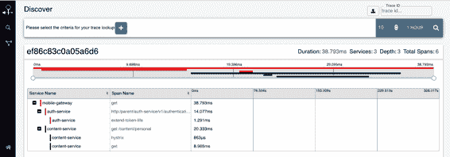
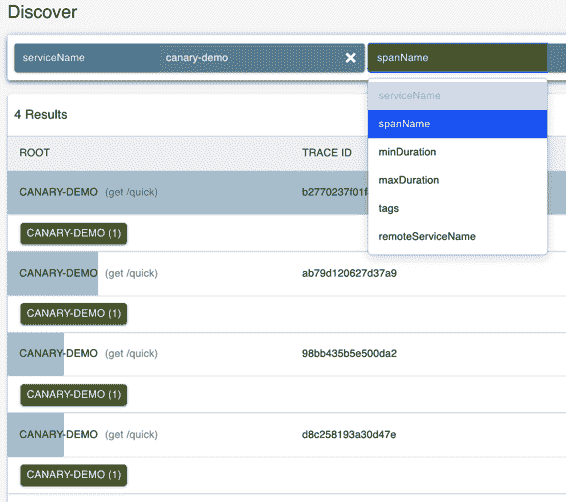
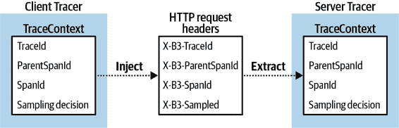
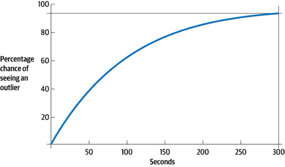
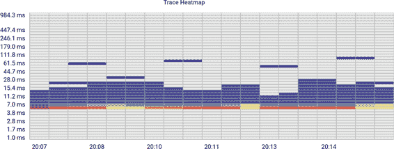
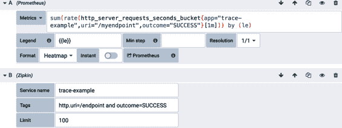
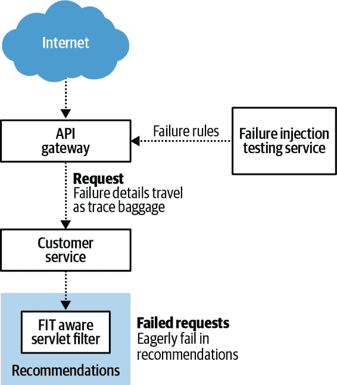

# 第三章：使用可观察性进行调试

如在 第二章 开头提到的，可观察性信号可以根据它们带来的价值大致分为两类：可用性和调试性。聚合应用程序度量提供了最佳的可用性信号。在本章中，我们将讨论另外两个主要信号，即分布式追踪和日志。

我们将展示使用仅开源工具的方法来关联度量和跟踪的一种方法。一些商业供应商也致力于提供这种统一体验。就像在 第二章 中一样，展示特定方法的目的是为了开发对你的可观察性堆栈在完全组装时应具备的最低期望水平。

最后，分布式追踪仪表化，因其需要在微服务层次结构中传播上下文，可以成为系统更深层行为管理的有效场所。我们将讨论一个假设的故障注入测试功能作为其可能性的例子。

# 可观察性的三大支柱……还是两大支柱？

正如 [*《分布式系统可观察性》*](https://learning.oreilly.com/library/view/distributed-systems-observability/9781492033431) 一书中 Cindy Sridharan（O’Reilly）所述，三种不同类型的遥测形成了“可观察性的三大支柱”：日志、分布式追踪和度量。这种三支柱的分类非常普遍，以至于很难准确指出其起源。

虽然日志、分布式追踪和度量是三种具有独特特性的遥测形式，它们大致上有两个目的：证明可用性和用于根本原因诊断的调试。

除非以某种方式减少数据量，否则维护所有这些遥测数据的操作成本将非常高昂。显然，我们只能维护一定时间的遥测数据，因此需要其他的减少策略。

聚合

例如，可以将定时器数据（参见 “定时器”）的预计算统计量呈现为总和、计数和一些有限的分布统计信息。

采样

仅保留某些测量数据。

聚合有效地以请求级粒度的代价压缩了表示，而采样则以系统性能整体视图的代价保留了请求级粒度。除低吞吐量系统外，既保持全请求级粒度又全面表示所有请求的成本都太高。

在*使用可观察性工具进行调试*的重点章节中，保留一些信息的完整粒度对于调试至关重要。从指标中派生的可用性信号将指向问题所在。通过对数据进行维度探索，在某些情况下足以识别问题的根本原因。例如，将特定信号按实例分解成各个信号可能会揭示特定实例的故障。可能出现整个区域故障或应用程序版本故障的情况。在模式不明显的罕见情况下，分布式跟踪或日志中的代表性故障将是确定根本原因的关键。

考虑每个“三支柱”的特征表明，作为事件级遥测的日志和跟踪用于调试，而指标用于证明可用性。

## 日志

日志在软件堆栈中无处不在。无论其结构及最终存储位置如何，日志都具有一些定义特征。

日志与系统吞吐量成正比增长。每次执行记录日志的代码路径，都会产生更多日志数据。即使对日志数据进行抽样，其大小仍然保持这种比例关系。

日志的上下文范围限定在事件中。日志数据提供了关于特定交互执行行为的上下文。当从多个独立的日志事件中聚合数据以推断系统的整体性能时，聚合效果实际上就是一个指标。

显然，日志主要用于调试。先进的日志分析包能够通过聚合日志数据来证明可用性。执行此聚合操作、持久化受聚合影响的数据以及分配已持久化的有效载荷都需要成本。

## 分布式跟踪

跟踪遥测与日志类似，记录每个已接入执行（即事件驱动），但会因果关联地跨系统的不同部分链接个别事件。分布式跟踪系统可以完整地推断出整个系统中用户交互的端到端情况。因此，对于已知存在一些下降情况的请求，用户请求满意度的这种端到端视图显示出系统中哪个部分出现了下降。

跟踪遥测比日志更常见地进行抽样。然而，跟踪数据与日志数据一样，仍然与系统吞吐量成正比增长。

将跟踪集成到现有系统中可能很困难，因为端到端流程中的每个协作者都必须配置为向前传播跟踪上下文。

分布式追踪特别适用于特定类型的性能问题，其中整个系统比应有的速度慢，但没有明显的热点可以快速优化。 有时，您只需看到许多子系统对整个系统性能的贡献，才能意识到需要可视化的系统性“死亡方式”，以便建立解决这种问题的组织意愿，因此需投入时间和资源的关注。

> “很慢”是您要调试的最困难的问题。 “很慢”可能意味着执行用户请求所涉及的多个系统之一速度慢。 它可能意味着跨许多计算机的转换管道的部分之一速度慢。 “很慢”很难，部分原因是问题陈述并未提供有关缺陷位置的许多线索。 部分故障隐藏在黑暗的角落。 并且，直到退化变得非常明显，您才会获得足够的资源（时间、金钱和工具）来解决它。 Dapper 和 Zipkin 的建立是有原因的。
> 
> 杰夫·霍奇斯

在拥有大量微服务的组织中，分布式追踪有助于理解参与处理特定类型请求的服务图（服务之间的依赖关系）。 当然，这假设图中的每个服务都以某种形式进行追踪仪器化。 从最狭义的意义上讲，服务图的最后一层可以是未经仪器化的，但如果由客户端的调用包装的跨度命名，则仍会出现在服务图中。

分布式追踪与日志一样，本质上是事件驱动的，因此最适合作为调试信号，但是除了标签之外，它还承载着重要的服务间关系上下文。

## 度量

日志和分布式追踪在某种程度上比起详细讨论的度量更加相似，因为它们都是经过抽样以控制成本。度量是以聚合形式呈现的，用于全面了解某种服务水平指标（SLI），而不是提供有关构成 SLI 的单个交互的详细信息。

使用度量为现有代码库添加度量部分是手动工作，部分是源于通用框架和库的改进，这些框架和库越来越多地配备了仪器化功能。

度量 SLI 是有目的地收集以针对服务水平目标进行测试的，因此它们旨在证明可用性。

## 适用哪种遥测？

考虑到每种可见性形式的预期用途，请考虑它们的重叠部分。 它们重叠的地方，我们应该强调哪种形式而不是另一种形式？

追踪和日志记录都是调试信号的概念表明它们可能是多余的，尽管不相等。在检索和搜索它们方面一切相等的情况下，具有有效标签和元数据的追踪比日志行更优秀，因为它还提供了有关导致该追踪的调用链的有用上下文（并进一步传播此上下文）。

追踪仪器存在于与度量计时器完全相同的逻辑位置。请注意，分布式追踪仅测量执行。在涉及执行时间的情况下，度量和追踪仪器都可能适用，因为它们互补。度量提供了对代码片段的所有执行的聚合视图（且没有调用者上下文），而分布式追踪提供了单个执行的采样示例。除了计时执行外，度量还计数和测量事物。这些信号没有追踪等效信号。

为了使这更具体，让我们看一下来自示例 3-1 中的典型应用程序日志摘录。这个日志摘录的开始部分包含了一次性事件的信息，说明了配置了哪些组件和启用了哪些功能。这些信息可能对理解为什么应用程序无法按预期运行很重要（例如，如果预期应该配置组件但未配置），但它们不适合作为度量标准，因为它们不是需要随时间聚合以了解系统整体性能的重复事件。它们也不适合作为分布式追踪，因为这些事件特定于此服务的状态，并且与在多个微服务之间协调满足最终用户请求无关。

有其他日志行可以用追踪或度量替换，如在例子后的调用中所述。

##### 示例 3-1。展示遥测选择的典型应用程序日志

```java
.   ____          _            __ _ _
/\\ / ___'_ __ _ _(_)_ __  __ _ \ \ \ \
( ( )\___ | '_ | '_| | '_ \/ _` | \ \ \ \
\\/  ___)| |_)| | | | | || (_| |  ) ) ) )
'  |____| .__|_| |_|_| |_\__, | / / / /
=========|_|==============|___/=/_/_/_/
:: Spring Boot ::       (v...RELEASE)

:56:56 main INFO c.m.MySampleService - Starting MySampleService on
 HOST with PID 12624
:56:56 main INFO c.m.MySampleService - The following profiles are active: logging
:56:56 main INFO o.s.b.c.e.AnnotationConfigEmbeddedWebApplicationContext - Refresh
  org.springframework.boot.context.embedded.AnnotationConfigEmbeddedWebApplication
  Context@2a5c8d3f: startup date [Tue Sep 17 14:56:56 CDT]; root of context
:56:57 background-preinit INFO o.h.v.i.util.Version - HV000001: Hibernate Validator
  5.3.6.Final
:57:02 main INFO o.s.b.c.e.t.TomcatEmbeddedServletContainer - Tomcat initialized
  with port(s): 8080 (http)
:57:03 localhost-startStop-1 INFO i.m.c.i.l.LoggingMeterRegistry - publishing
  metrics to logs every 10s
:57:07 localhost-startStop-1 INFO o.s.b.a.e.m.EndpointHandlerMapping - Mapped
  "{[/env/{name:.*}],methods=[GET],produces=[application/
  vnd.spring-boot.actuator.v1+json || application/json]}" onto public
  java.lang.Object org.springframework.boot.actuate.endpoint.mvc.
  EnvironmentMvcEndpoint.value(java.lang.String)
:57:07 localhost-startStop-1 INFO o.s.b.w.s.FilterRegistrationBean - Mapping filter:
 'metricsFilter' to: [/*]
:57:11 main INFO o.mongodb.driver.cluster - Cluster created with settings
 {hosts=[localhost:27017], mode=SINGLE, requiredClusterType=UNKNOWN,
 serverSelectionTimeout='30000 ms', maxWaitQueueSize=500}
:57:12 main INFO o.s.b.a.e.j.EndpointMBeanExporter - Registering beans for JMX
 exposure on startup
:57:12 main INFO o.s.b.a.e.j.EndpointMBeanExporter - Located managed bean
  'healthEndpoint': registering with JMX server as MBean
  [org.springframework.boot:type=Endpoint,name=healthEndpoint]
:57:12 main INFO o.s.b.c.e.t.TomcatEmbeddedServletContainer - Tomcat started on
  port(s): 8080 (http)
:57:13 cluster-ClusterId{value='5d813a970df1cb31507adbc2', description='null'}-
  localhost:27017 INFO o.mongodb.driver.cluster - Exception in monitor thread
  while connecting to server localhost:27017
com.mongodb.MongoSocketOpenException: Exception opening socket 
  at c.m.c.SocketStream.open(SocketStream.java:63)
  at c.m.c.InternalStreamConnection.open(InternalStreamConnection.java:115)
  at c.m.c.DefaultServerMonitor$ServerMonitorRunnable.run(
    DefaultServerMonitor.java:113)
  at java.lang.Thread.run(Thread.java:748)
Caused by: j.n.ConnectException: Connection refused: connect
  at j.n.DualStackPlainSocketImpl.waitForConnect(Native Method)
  at j.n.DualStackPlainSocketImpl.socketConnect(
    DualStackPlainSocketImpl.java:85)
  at j.n.AbstractPlainSocketImpl.doConnect(AbstractPlainSocketImpl.java:350)
  at j.n.AbstractPlainSocketImpl.connectToAddress(
    AbstractPlainSocketImpl.java:206)
  at j.n.AbstractPlainSocketImpl.connect(AbstractPlainSocketImpl.java:188)
  at j.n.PlainSocketImpl.connect(PlainSocketImpl.java:172)
  at j.n.SocksSocketImpl.connect(SocksSocketImpl.java:392)
  at j.n.Socket.connect(Socket.java:589)
  at c.m.c.SocketStreamHelper.initialize(SocketStreamHelper.java:57)
  at c.m.c.SocketStream.open(SocketStream.java:58)
  ... 3 common frames omitted
:57:13 main INFO c.m.PaymentsController - [GET] Payment 123456 retrieved in 37ms. 
:57:13 main INFO c.m.PaymentsController - [GET] Payment 789654 retrieved in 38ms
... (hundreds of other payments retrieved in <40ms)
:57:13 main INFO c.m.PaymentsController - [GET] Payment 567533 retrieved in 342ms.
:58.00 main INFO c.m.PaymentsController - Payment near cache contains 2 entries. 
```


*既没有度量也没有日志记录，只有追踪。*Mongo 套接字连接尝试可以很容易地通过度量进行计时，其中标签指示成功/失败，并带有类似`exception=ConnectException`的摘要异常标签。这种摘要标签可能足以在查看整个堆栈跟踪之前理解问题。在其他情况下，如果摘要异常标签是类似`exception=NullPointerException`的内容，则在监控系统提醒我们一组异常未能达到已建立的服务水平目标时，记录堆栈跟踪有助于识别具体问题。


*既有跟踪又有度量，没有日志。* 代码中的日志语句可以完全删除。度量和分布式跟踪以一种允许我们综合理解所有支付检索及个别支付的代表性检索的方式捕获所有有趣信息。例如，度量将显示，虽然大多数支付在不到 40 毫秒内检索，但有些支付可能需要一个数量级更长的时间来检索。


*度量，没有跟踪或日志。* 一个近缓存的频繁检索支付可以严格通过一个度量器来监控。在跟踪仪器中没有等效的度量器，并且记录这一点是多余的。

# 你应该选择哪个可观察性工具？

如果可能的话，跟踪比日志记录更可取，因为它可以包含相同的信息，但上下文更丰富。在跟踪和度量重叠的地方，应该从度量开始，因为第一个任务应该是*知道*某个系统不可用。稍后可以添加额外的遥测来帮助解决问题。当你添加跟踪时，从存在定时度量仪器的地方开始，因为很可能也值得使用相同标签的超集进行跟踪。

假设你已经准备好添加分布式跟踪，接下来让我们考虑一下什么构成了一个跟踪，以及它如何被可视化。

# 分布式跟踪的组成部分

一个完整的分布式跟踪是一组单独的*span*的集合，这些 span 包含每个端到端用户请求满意度中每个接触点的性能信息。这些 span 可以组装成一个“冰柱”图，显示每个服务中花费的时间相对多少，如图 3-1 所示。



###### 图 3-1\. Zipkin 冰柱图

Span 包含一个名称和一组键值对标签，很像度量仪器那样。我们在“命名度量”中讨论的许多原则同样适用于分布式跟踪。所以如果一个跟踪 span 被命名为`http.server.requests`，那么标签可以标识区域（以公共云的概念来说）、API 端点、HTTP 方法、响应状态码等。保持度量和跟踪命名的一致性是允许进行遥测相关性的关键（见“遥测相关性”）。

不像度量中的情况，Zipkin span 数据模型包含用于服务名称的特殊字段（用于 Zipkin Dependencies 视图，显示服务图）。这相当于将度量与应用程序名称标记在一起，大多数度量后端不为这个概念设置一个保留标签名。Span 名称也是 Zipkin 数据模型的一个定义字段。两者都被索引以进行查找，因此应避免在 span 和服务名称上设置无界值集的基数。

与度量不同的是，在每种情况下都不必控制跟踪的标签基数。这与跟踪的存储方式有关。表格 2-1 展示了度量如何通过唯一 ID（名称和键/值标签的组合）逻辑地存储在行中。额外的测量数据存储为现有行中的样本。度量的成本是总 ID 数和每个 ID 维护的样本量的乘积。分布式跟踪跨度单独存储，不考虑其他跨度是否具有相同的名称和标签。分布式跟踪的成本是系统吞吐量和采样率的乘积（视为百分比）。

尽管标签基数不会影响分布式跟踪系统的存储成本，但确实会影响*查找*成本。在跟踪系统中，标签可以由跟踪后端标记为可索引（并且在 Zipkin UI 中可以自动完成）。显然，这些标签值集应限制在索引性能范围内。

最好在度量和跟踪之间尽可能重叠标签，以便以后可以进行关联。您还应该使用额外的高基数标签标记分布式跟踪，这些标签可以用于定位来自特定用户或交互的请求，如表 3-1](part0008_split_007.html#overlap_in_trace_metrics_tagging)中所示。努力使值在标签键匹配的地方匹配。

表 3-1\. 分布式跟踪和度量标记的重叠

| 度量标签键 | 跟踪标签键 | 值 |
| --- | --- | --- |
| 应用程序 | 应用程序 | payments |
| 方法 | 方法 | GET |
| 状态 | 状态 | 200 |
| URI | URI | /api/payment/{paymentId} |
|  | 详细的链接 | /api/payment/abc123 |
|  | 用户 | user123456 |

到目前为止，应该清楚地知道，追踪旨在让您了解请求的端到端性能。因此，不应感到意外，Zipkin UI 专注于根据一组参数搜索追踪，如图 3-2 所示。这种列表交换了对端到端性能整体分布的理解，以匹配特定参数集的一组追踪。建立整体分布与此视图之间的关联是“遥测相关性”的主题。



###### 图 3-2\. 在 Zipkin Lens UI 中搜索追踪

与度量类似，添加分布式跟踪到您的应用程序有多种方式。让我们考虑每种方式的一些优势。

# 分布式追踪仪器类型

与度量有关的所有讨论，都适用于分布式追踪仪表化“黑盒与白盒监控”。追踪仪表化在各种架构层面上可用（从基础设施到应用程序的各个组件）。

## 手动追踪

类似 Zipkin 的 Brave 或 OpenTelemetry 的库允许您在代码中显式地为应用程序添加仪表化。在理想情况下被追踪的分布式系统中，一定程度的手动追踪肯定是存在的。通过它，可以向追踪中添加关键的业务特定上下文，而其他形式的预打包仪表化则无法意识到。

## 代理追踪

就像使用度量一样，代理（通常由供应商提供）可以在不进行代码更改的情况下自动添加追踪仪表化。连接代理是应用程序交付流水线的一个变更，这种复杂性成本不应被忽视。

无论您的平台在哪个抽象级别运作，这种成本都是真实的：

+   对于像亚马逊 EC2 这样的基础设施即服务平台，您将不得不将代理及其配置添加到基础 Amazon Machine Image 中。

+   对于一个容器即服务（CaaS）平台，您需要在类似 `openjdk:jre-alpine` 的基础镜像和您的应用程序之间再加一层容器级别。这种影响可能泄漏到您的构建中。如果您正在使用 Gradle 的 `com.bmuschko.docker-spring-boot-application` 插件将 Spring Boot 应用程序打包用于 CaaS 的部署，现在需要用包含代理的镜像覆盖默认的容器镜像。此外，每当包含代理的容器镜像的基础镜像（很可能是 `com.bmuschko.docker-spring-boot-application` 的默认镜像）更新时，您都需要发布新镜像。

+   对于像 Cloud Foundry 或 Heroku 这样的平台即服务（PaaS），除非特定支持代理的集成已被 PaaS 供应商支持，否则您必须使用自定义基础。

## 框架追踪

框架也可以自带遥测功能。由于框架作为二进制依赖项包含在应用程序中，这种形式的遥测在技术上是黑盒解决方案。当框架级仪表化允许用户提供自定义到其自动仪表化触点时，框架级仪表化可以有白盒的感觉。

框架了解其自身的实现特异性，因此可以提供丰富的上下文信息作为标签。

举个例子，为了一个 HTTP 请求处理程序的框架仪表化，可以用参数化的请求 URI 标记 span（例如，`/api/customers/(id)` 和 `/api/customers/1`）。代理仪表化必须意识到并切换所有支持的框架，以提供相同的丰富度，并跟上各框架的变更。

另一个复杂性来自于现代编程范式中日益普遍的异步工作流程，例如响应式编程。适当的跟踪实现需要进程内传播，在响应式上下文中可能会有些棘手，因为您不能简单地将上下文信息放入 `ThreadLocal` 中。此外，在同样的上下文中处理 [映射诊断上下文](https://oreil.ly/h1p0-) 以关联日志和跟踪可能也会有些棘手。

在现有应用中添加框架级别的仪表化可能是比较轻量级的。例如，Spring Cloud Sleuth 为基于 Spring Cloud 的现有应用添加追踪遥测。您只需像 示例 3-2 中那样增加一个额外的依赖项，以及像 示例 3-3 中的少量配置，后者可以在跨组织使用像 Spring Cloud Config Server 这样的集中式动态配置服务器时进行配置。

##### 示例 3-2\. 在 Gradle 构建中 Sleuth 运行时依赖

```java
dependencies {
    runtimeOnly("org.springframework.cloud:spring-cloud-starter-zipkin") 
}
```


请注意，`io.spring.dependency-management` 插件负责将版本添加到此依赖项规范中。

##### 示例 3-3\. Spring Boot 的应用程序配置在 application.yml 中的 Sleuth 配置

```java
spring.zipkin.baseUrl: http://YOUR_ZIPKIN_HOST:9411/
```

## 服务网格跟踪

服务网格是应用代码之外的基础设施层，负责管理微服务之间的交互。许多实现方式通过与应用程序进程关联的 Sidecar 代理来完成这一点。

在某些方面，这种仪表化形式与框架可能实现的方式并没有太大区别，但不要被误导以为它们是相同的。它们在仪表化点上是相似的（装饰 RPC 调用）。框架肯定会比服务网格拥有更多信息。例如，对于 REST 端点跟踪，框架可以访问以一种有损映射到少量 HTTP 状态码之一的方式映射的异常细节。服务网格只能访问状态码。框架可以访问端点的未替换路径（例如 `/api/person/{id}` 而不是 `/api/person/1`）。

与 Sidecar 相比，代理还具有更丰富的潜力，因为它们可以深入到单个方法调用，比 RPC 调用的粒度更细。

添加服务网格不仅会改变交付流水线，还会增加在管理 Sidecar 和它们的控制平面时的额外资源和复杂性成本。

然而，在服务网格层进行仪器化意味着你不必为现有应用程序添加类似 Spring Cloud Sleuth 的框架仪器化，也不必像使用代理仪器化那样更改基础镜像，或者进行手动仪器化。由于服务网格相对于框架而言缺乏信息，引入服务网格主要是为了实现遥测仪器化，这将产生维护网格所需的重大成本，而遥测数据相对较少。例如，网格将观察到对 `/api/customers/1` 的请求，但不会像框架那样具有上下文，即这是对 `/api/customers/(id)` 的请求。因此，从基于网格的仪器化产生的遥测数据将更难按参数化 URI 进行分组。最终，添加运行时依赖可能会更加容易。

## 混合跟踪

白盒（或因自动配置而“感觉像”白盒的框架遥测）和黑盒选项并不是互斥的。事实上，它们可以相互补充得很好。考虑一下 示例 3-4 中的 REST 控制器。Spring Cloud Sleuth 被设计为在请求处理器 `findCustomerById` 周围自动创建一个 span，并标记它与相关信息。通过注入一个 `Tracer`，你可以在仅涉及数据库访问时添加一个更精细的 span。这将用户交互端到端分解成了一个更细粒度的跟踪。现在，我们可以确定数据库在特定微服务中导致请求满意度降低的原因所在。

##### 示例 3-4\. 混合了黑盒和白盒跟踪仪器化

```java
@RestController
public class CustomerController {
  private final Tracer tracer;

  public CustomerController(Tracer tracer) {
    this.tracer = tracer;
  }

  @GetMapping("/customer/{id}") 
  public Customer findCustomerById(@PathVariable String id) {
    Span span = tracer.nextSpan().name("findCustomer"); 
    try (Tracer.SpanInScope ignored = tracer.withSpanInScope(span.start())) {
        Customer customer = ... // Database access to lookup customer
        span.tag("country", customer.getAddress().getCountry()); 
        return customer;
    }
    finally {
        span.finish(); 
    }
  }
}
```


Spring Cloud Sleuth 将自动为此端点添加仪器化，并使用诸如 `http.uri` 的有用上下文进行标记。


开始一个新的 span 将为跟踪冰柱图添加另一个不同的元素。现在，我们可以在整个端到端用户交互的上下文中推断出仅此方法 `findCustomerById` 的成本。


添加业务特定的上下文，黑盒仪器化可能缺乏。也许你的公司最近在新的国家推出了一项服务，作为全球扩张的一部分，由于其新近性，该国家的客户缺乏与你的产品的长期活动历史。看到老客户和新客户之间查找时间的惊人差异可能表明在这种情况下如何加载活动历史的变化。


整个数据访问操作都是使用白盒工具手动进行的。

假设数据库访问是跨应用程序堆栈进行追踪的（可能通过将数据库访问的包装与跟踪仪器封装成一个通用库并在整个组织中共享），则可以有效地追踪数据库，而无需向数据库层本身添加任何形式的白盒或黑盒监控。从调用者的角度来仪器化像 IBM DB2 数据库运行在 z/OS 主机上的情况使用 Zipkin Brave 似乎是一个不可能的任务，但从调用者的角度来看可以完成。

# 有效地跟踪所有对子系统的调用实际上是在跟踪子系统。

通过追踪所有对子系统的*调用*，实际上就像对其自身进行仪器化一样覆盖了子系统。许多组件框架（数据库、缓存、消息队列）提供了某种事件系统，供您挂接。在许多情况下，涂层所有调用者以便仪器化可以简化为确保所有调用应用程序具有能够自动将事件处理程序注入到要仪器化的组件框架的运行时的二进制依赖关系。

从调用者的角度来进行跟踪的另一个影响是它包括两个系统之间的延迟（例如，网络开销）。在一个场景中，一系列调用者正在向服务下游执行请求，服务以固定的最大并发级别提供请求服务（例如，线程池），直到请求开始处理，服务可能甚至没有意识到请求的存在。从调用者的角度仪器化包括请求在等待被下游处理之前在队列中停留的时间。

所有这些上下文信息可能非常昂贵。为了控制成本，在某些时候我们必须对跟踪遥测数据进行采样。

# 采样

如 “可观察性的三大支柱…还是两大支柱？” 所述，一般来说，跟踪数据通常必须进行采样以控制成本，这意味着某些跟踪信息发布到跟踪后端，而其他跟踪信息则不会。

无论采样策略多么聪明，重要的是要记住数据是*被丢弃*的。无论最终得到的一系列追踪信息如何，它们总是会在某种程度上有所偏差。当您将分布式追踪数据与指标数据配对时，这是完全可以接受的。指标应该在异常情况下提醒您，而需要深入调试时则使用追踪信息。

采样策略可以分为几个基本类别，从完全不进行采样到从边缘传播采样决策。

## 无采样

可以保留每一个跟踪样本。一些组织甚至在大规模上做到了这一点，通常付出了巨大的代价。对于 Spring Cloud Sleuth，请通过 bean 定义配置 `Sampler`，如 示例 3-5 所示。

##### 示例 3-5\. 配置 Spring Cloud Sleuth 以始终进行采样

```java
@Bean
public Sampler defaultSampler() {
  return Sampler.ALWAYS_SAMPLE;
}
```

## 速率限制采样器

默认情况下，Spring Cloud Sleuth 保留每秒前 10 个样本（可配置的速率限制阈值），然后以概率方式进行降采样。由于在 Sleuth 中默认使用速率限制抽样，因此速率限制可以通过属性设置，如示例 3-6 所示。

##### 示例 3-6\. 配置 Spring Cloud Sleuth 以保留每秒前 2,000 个样本

```java
spring.sleuth.sampler.rate: 2000
```

其背后的逻辑是，对于某些吞吐量，不丢弃任何东西在成本上是合理划算的。这在很大程度上将由您业务的性质和应用程序的吞吐量来决定。一个地区性的财产和意外保险公司每分钟通过其旗舰应用程序接收 5,000 个请求，大约由 3,500 名外出的保险代理生成的交互产生。由于保险代理的群体不会在一夜之间突然增长一个数量级，因此，为接受此系统的 100%追踪的追踪系统制定稳定的容量计划是可以确定的。

即使您的组织像这家保险公司一样稳定，也要牢记在应用程序可观察性上进一步投资的位置，通常在具有显著规模的技术公司的开源项目和监控系统供应商中，不能假设其客户都有如此稳定的容量计划。考虑到服务端点的延迟高百分位数计算，从分桶直方图中利用高百分位数的近似值仍然比尝试从追踪数据中计算精确百分位数更有意义，即使数学上可以实现使用 100%数据。

关键是要避免在可操作范围内计算分布统计数据的新方法，当已有类似的方法可从专为大规模操作设计的指标遥测中获取时。

基于速率的抽样的一个挑战是存在空洞。当您在调用链中有几个微服务，每个独立地决定是否保留追踪时，会在给定请求的端到端图像中产生空洞。换句话说，基于速率的抽样器在给定追踪 ID 时不能做出一致的抽样决策。当任何个体子系统超过速率阈值时，涉及该子系统的追踪中就会出现空洞。

基于速率抽样器进行容量规划决策时，要注意这些速率是**每个实例**的基础。

## 概率抽样器

概率抽样器计算，以确定需要保留的 100 个追踪中有多少个。它们保证如果选择了 10%的概率，则会保留 100 个追踪中的 10 个，但可能不会是前 10 个或最后 10 个。

在存在概率属性的情况下，Spring Cloud Sleuth 会配置概率采样器而不是速率限制采样器，如示例 3-7 中所示。

##### 示例 3-7\. 配置 Spring Cloud Sleuth 以保留 10%的跟踪

```java
spring.sleuth.sampler.probability: 0.1
```

几个原因使得概率采样器很少是正确的选择：

成本

无论您选择什么概率，您的跟踪成本都会与流量成正比线性增长。也许您从未预料到 API 端点会收到超过每秒 100 个请求，因此您抽样了 10%。如果流量突然增加到每秒 10,000 个请求，您将突然之间将要发送每秒 1,000 个跟踪，而不是 10 个。速率限制采样器通过一种方式限制成本，无论吞吐量如何，都将成本上限固定在一个值上。

洞

像基于速率的采样器一样，概率采样器不查看跟踪 ID 和头部来做出其采样决策。在端到端图像中将会出现洞。对于相对低吞吐量系统，基于速率的采样器可能实际上没有洞，因为没有单个子系统超过速率阈值，但是概率采样器在单位吞吐量上有均匀的洞存在概率，因此即使对于低吞吐量系统，洞可能也会存在。

## 边界采样

边界采样器是概率采样器的一种变体，通过仅在边缘（与您的系统的第一个交互）进行一次采样决策，并将该采样决策传播到其他服务和组件来解决洞的问题。每个组件中的跟踪上下文包含一个采样决策，该决策作为 HTTP 头添加，并由下游组件提取为跟踪上下文，如图 3-3 所示。



###### 图 3-3\. B3 跟踪头将采样决策传播到下游组件

## 采样对异常检测的影响

让我们具体考虑概率采样对异常检测的影响。实际上，任何采样策略都会产生类似的影响，但我们将使用概率采样来具体描述这一点。

建立在采样跟踪上的异常检测系统通常是错误的，除非你的组织承担了 100% 采样的成本。为了说明这一点，让我们考虑一种假设的采样策略，根据每个请求开始时的加权随机数做出关于是否保留追踪的决定（就像 Google 的 Dapper 最初所做的那样）。如果我们对请求进行 1% 的采样，那么一个超出第 99 百分位数的异常值，像其他所有请求一样，有 1% 的机会在采样中存活。看到任何这些个别的异常值的机会是 0.01%。即使在每秒 1,000 个请求的情况下，你可能每秒都会发生 10 个异常值，但在追踪数据中只会每 5 分钟看到一个，如图 3-4 所示（这是一个<math alttext="left-parenthesis 1 minus 0.99 Superscript upper N Baseline right-parenthesis asterisk 100 percent-sign"><mrow><mo>(</mo> <mn>1</mn> <mo>-</mo> <mn>0</mn> <mo>.</mo> <msup><mn>99</mn> <mi>N</mi></msup> <mo>)</mo> <mo>*</mo> <mn>100</mn> <mo>%</mo></mrow></math>的图）。



###### 图 3-4\. 随时间变化的追踪数据中看到异常值的机会

在第 99 百分位数以上可能存在显著范围的异常值，如图 4-20 所示。你可能每秒都会出现一个巨大的业务关键异常值（高于 P99.9），但在任何给定的小时内追踪数据中只会看到*一次*！出于调试目的，让一个或一小组异常值在一定时期内存活是可以接受的——我们仍然可以详细检查异常情况发生的性质。

# 分布式追踪与单体应用

别被*分布式*追踪的名字所迷惑。在单体架构中使用这种形式的可观察性是完全合理的。在最纯粹的微服务架构中，围绕 RPC 调用进行追踪可以在框架级别（比如 Spring）或者在诸如服务网格技术中找到的边车中以黑匣子的方式实现。考虑到微服务架构的单一责任性质，追踪 RPC 实际上可以为你提供关于正在发生的事情的相当多的信息；即，微服务边界实际上也是业务逻辑功能边界。

在一个接收单个端用户请求并执行许多任务以满足该请求的单体应用程序内部，框架级别的仪器化当然价值降低，但你仍然可以在单体应用程序内部的关键功能边界处编写追踪仪器化，方式与编写日志语句相同。通过这种方式，你将能够选择特定的标签，这些标签允许你搜索具有业务上下文的跨度，而框架或服务网格仪器化肯定会缺少这些标签。

实际上，具有业务特定标记的白盒仪器在纯微服务架构中变得至关重要。在许多情况下，我们的关键业务功能在生产环境中并非完全失效，而是在特定（通常是不寻常的）业务特定故障线路上出现问题。也许一个保险公司的政策管理系统无法对肯塔基州的某个县的经典车辆进行定价。在度量和跟踪遥测中同时拥有车辆类别、县和州的信息，使工程师可以在已知故障维度上进行维度钻取，并找到问题区域，然后跳转到跟踪和日志以查看示例故障。

# 业务上下文使得白盒跟踪在单体应用中与分布式系统一样重要

在业务功能边界上的白盒分布式跟踪仪器密度在微服务或单体架构中应大致相同，因为黑盒仪器不会使用帮助后续查找的业务特定上下文标记跨度。

因此，微服务和单体应用之间唯一的区别在于您将更多业务功能边界打包到一个进程中。随着每个额外的业务功能的增加，支持其存在的一切都会随之而来。可观察性并不是例外。

此外，即使是负责单一责任的微服务也可以执行一些任务，包括数据访问，以满足用户请求。

# 遥测数据的关联

由于度量数据是强有力的可用性信号，跟踪和日志数据对调试非常有用，我们可以做的一切都是将它们链接在一起，使得从警报指示可用性缺失到最佳识别潜在问题的调试信息的过渡更加顺畅。在延迟情况下，我们将在仪表板上绘制图表，并在一个衰减的最大值上设置警报。将延迟分布的视图呈现为延迟直方图的热图是一种信息密集的有趣可视化，但我们无法在其上绘制警报阈值。

## 度量到跟踪的相关性

我们可以在热图上绘制示例跟踪（样本），如图 3-5 所示，并通过将热图单元格转换为链接使热图更加交互化，直接跳转到跟踪界面，从中可以查看与这些标准匹配的一组跟踪。因此，负责系统的工程师收到延迟条件的警报后，查看此应用程序的延迟图表集，并可以立即点击跳转到分布式跟踪系统。



###### 图 3-5\. 在 Grafana 中以热图形式呈现的 Zipkin 追踪数据叠加在 Prometheus 直方图上

这种相关性绘图使得指标和追踪一起变得更有价值。通过聚合，我们通常会失去对特定情况下发生了什么的理解，而查看指标数据。另一方面，追踪则缺乏指标提供的整体情况理解。

另外，由于确实可能发生了追踪抽样（再次为了控制成本），已经丢弃了所有匹配特定延迟桶的追踪，即使我们无法深入了解追踪细节，我们仍然能够了解最终用户经历了什么样的延迟。

此可视化是通过独立的 Prometheus 和 Zipkin 查询的组合构建的，如 图 3-6 所示。请注意，指标和追踪工具之间的标签不一定严格对应。Micrometer 的 `Timer` 被称为 `http.server.requests`（在打开直方图时，Prometheus 中称为 `http_server_requests_second_bucket`），使用一个名为 `uri` 的标签进行收集。Spring Cloud Sleuth 以类似的方式仪表化 Spring，但使用 `http.uri` 标记跟踪。这些当然在逻辑上是等价的。



###### 图 3-6\. 独立的 Prometheus 和 Zipkin 查询形成了联合追踪示例热图

然而，应当明确的是，即使标签键（甚至值）不必完全相同，如果您想要将热图过滤到在追踪数据中没有逻辑等价物的指标标签，那么将无法准确地找到与热图上所见内容匹配的样本（会有一些误报）。例如，Spring Cloud Sleuth 最初没有使用 HTTP 状态码或结果标记跟踪，而 Spring 的 Micrometer 工具包则有。通常我们希望将延迟可视化限制在成功或失败的结果之一，因为它们的延迟特性可能会有很大不同（例如，失败由于外部资源不可用而异常快速或由于超时而异常缓慢）。

到目前为止，我们对分布式追踪的探讨严格限于可观察性，但它可以用于影响或管理流量处理的其他目的。

# 使用追踪上下文进行失败注入和实验

在早期讨论分布式追踪的抽样方法时，我们涵盖了边界抽样（参见 “边界抽样”）。在这种方法中，抽样决策是事先做出的（即在边缘处），并且此决策向下游微服务传播，这些微服务参与满足请求。有一个有趣的机会可以做其他事先决策，并利用跟踪上下文将与抽样决策无关的其他信息传递给下游服务。

这其中一个著名的例子是*故障注入测试*（FIT），这是混沌工程的一种特定形式。混沌工程的整体学科是广泛的，并且在[*混沌工程*](http://shop.oreilly.com/product/0636920203957.do)中有详细介绍。

API 网关可以在与由中央 FIT 服务提供的规则协调的前提下，前置添加故障注入决策，并作为跟踪标签向下游传播。稍后，执行路径中的微服务可以使用有关故障测试的信息，以某种方式非自然地使请求失败。图 3-7 显示了整个过程，端到端。



###### 图 3-7\. 从用户请求到故障的故障注入测试过程

将这种决策附加到遥测数据中的一个附加好处是，任何作为故障注入一部分的抽样跟踪都会被标记为这样，因此当稍后查看遥测数据时，您可以区分真实故障和故意故障。示例 3-8 显示了一个简化的 Spring Cloud Gateway 应用程序示例（同时应用了 Spring Cloud Sleuth Starter），查找并将 FIT 决策作为 "baggage" 添加到跟踪上下文，这可以通过设置属性 `spring.sleuth.baggage.tag-fields=failure.injection` 自动转换为跟踪标签。

##### 示例 3-8\. Spring Cloud Gateway 将故障注入测试数据添加到跟踪上下文

```java
@SpringBootApplication
public class GatewayApplication {
    public static void main(String[] args) {
        SpringApplication.run(GatewayApplication.class, args);
    }
}

@RestController
class GatewayController {
    private static final String FAILURE_INJECTION_BAGGAGE = "failure.injection";

    @Value("${remote.home}")
    private URI home;

    @Bean
    BaggagePropagationCustomizer baggagePropagationCustomizer() {
        return builder -> builder.add(BaggagePropagationConfig.SingleBaggageField
                .remote(BaggageField.create(FAILURE_INJECTION_BAGGAGE)));
    }

    @GetMapping("/proxy/path/**")
    public Mono<ResponseEntity<byte[]>> proxyPath(ProxyExchange<byte[]> proxy) {
        String serviceToFail = "";
        if (serviceToFail != null) {
            BaggageField.getByName(FAILURE_INJECTION_BAGGAGE)
              .updateValue(serviceToFail);
        }

        String path = proxy.path("/proxy/path/");
        return proxy.uri(home.toString() + "/foos/" + path).get();
    }
}
```

然后，将一个入站请求过滤器（在这种情况下是一个 WebFlux `WebFilter`）添加到可能参与故障注入测试的所有微服务中，如 示例 3-9 所示。

##### 示例 3-9\. WebFlux WebFilter 用于故障注入测试

```java
@Component
public class FailureInjectionTestingHandlerFilterFunction implements WebFilter {
    @Value("${spring.application.name}")
    private String serviceName;

    @Override
    public Mono<Void> filter(ServerWebExchange exchange, WebFilterChain chain) {
        if (serviceName.equals(BaggageField.getByName("failure.injection")
              .getValue())) {
            exchange.getResponse().setStatusCode(HttpStatus.INTERNAL_SERVER_ERROR);
            return Mono.empty();
        }

        return chain.filter(exchange);
    }
}
```

我们还可以将故障注入测试决策作为 HTTP 客户端指标的一个标签添加，如 示例 3-10 所示。将故障注入测试从我们对与下游服务的 HTTP 客户端交互的错误比率的概念中过滤掉可能是有用的。或者，它们被保留下来以提醒标准来验证对意外故障的警觉和响应的工程学纪律，但数据仍然存在，以便调查工程师可以维度下钻以确定警报是由故障注入引起还是由真实问题引起。

##### 示例 3-10\. 将故障注入测试决策作为 Micrometer 标签添加

```java
@Component
public class FailureInjectionWebfluxTags extends DefaultWebFluxTagsProvider {
    @Value("${spring.application.name}")
    private String serviceName;

    @Override
    public Iterable<Tag> httpRequestTags(ServerWebExchange exchange, Throwable ex) {
        return Tags.concat(
                super.httpRequestTags(exchange, ex),
                "failure.injection",
                serviceName.equals(BaggageField
                  .getByName("failure.injection").getValue()) ? "true" : "false"
        );
    }
}
```

当然，这只是一个草图。由你决定如何定义故障注入服务，以及在什么条件下选择注入故障的请求。对于一组简单的规则，这种服务甚至可以成为你网关应用的一个组成部分。

除了故障注入外，跟踪 "baggage" 还可以用于传播有关请求是否参与 A/B 实验的决策。

# 总结

在本章中，我们展示了监控可用性与监控调试之间的区别。调试信号的事件驱动特性意味着它们倾向于随系统吞吐量的增加而成比例增长，因此需要一种控制成本的限制措施。讨论了控制成本的不同采样方法。调试信号通常被采样的事实应该使我们对试图围绕它们构建聚合操作产生疑虑，因为每种采样形式都会丢弃某些分布的部分，从而使聚合结果产生某种形式的偏差。

最后，我们展示了除了在发布调试信息方面的主要功能外，我们还可以利用跟踪上下文传播来在深度微服务调用链中传播行为。

在接下来的章节中，我们将回到指标的话题，展示你应该从哪些可用性信号开始，这对于几乎每个 Java 微服务都是基础。
