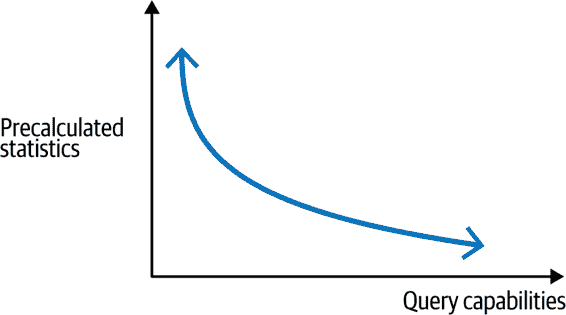
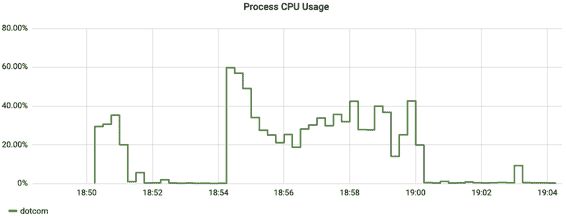

# 第四章：绘图和告警

监控并不一定要全面投入。如果你只在你没有监控（或只有 CPU/内存利用率等资源监控）的终端用户交互中添加一个错误比率的度量，那么在理解你的软件方面，你已经迈出了一大步。毕竟，CPU 和内存可能看起来不错，但用户接口的 API 在所有请求中失败了 5%，失败率在工程组织和业务合作伙伴之间沟通起来要容易得多。

虽然第 2 和 3 章节涵盖了不同形式的监控仪器化，但在这里我们提出了如何有效地利用这些数据通过告警和可视化来促进行动。本章涵盖了三个主要主题。

首先，我们应该思考一个好的 SLI 可视化是什么样的。我们只会展示来自常用的[Grafana](https://grafana.com)绘图和告警工具的图表，因为它是一个免费提供的开源工具，支持许多不同监控系统的数据源插件（因此从一个监控系统到另一个监控系统学习一些 Grafana 是一个非常可转移的技能）。许多相同的建议也适用于集成到供应商产品中的绘图解决方案。

接下来，我们将讨论生成最大价值的测量数据的具体内容，以及如何对它们进行可视化和告警。将其视为你可以逐步添加的 SLI（服务级别指标）清单。逐步增加可能甚至优于一次性实施它们，因为逐个添加指标，你可以真正研究并理解它在你的业务背景下的含义，并进行微小调整以为你带来最大的价值。如果我走进一个保险公司的网络操作中心，我会更加放心地看到只有关于保单评级和提交错误比率的指标，而不是看到一百个低级信号和没有业务表现度量。

引入告警的增量方法也是一个建立信任的重要过程。过快引入过多的告警会导致工程师不堪重负，产生“告警疲劳”。你希望工程师能舒适地订阅更多的告警，而不是将它们静音！如果你还不习惯于值班流程，逐一培训工程师如何应对一个告警条件，有助于团队建立对如何处理异常的知识储备。

因此，本章的重点将是提供关于那些与业务绩效（例如 API 失败率和用户看到的响应时间）尽可能接近的 SLI 的建议，而不与任何特定业务联系起来。在我们涵盖像堆使用或文件描述符之类的内容时，它们将是最有可能直接导致业务绩效下降的一组选择性指标。

重新创建 NASA 的任务控制中心（图 4-1）不应该是良好监控的分布式系统的最终结果。尽管在墙上排列屏幕并填充它们与仪表盘可能看起来很震撼，但屏幕不是行动。他们需要有人关注以响应问题的视觉指示器。当你监控一个火箭的单个实例，成本高昂，人命关天时，这是有道理的。当然，您的 API 请求没有相同的重要性。


###### 图 4-1\. 这不是一个好的榜样！

几乎每个指标收集器都会在任何给定时间收集比您发现有用的更多的数据。虽然每个指标在某些情况下可能有用，但绘制每个指标并不有助于。然而，几个指标（例如最大延迟、错误比率、资源利用率）对于几乎每个 Java 微服务都是强大的可靠性信号（通过调整警报阈值）。这些是我们将重点关注的内容。

最后，市场渴望将人工智能方法应用于监控数据，以自动提供对系统的洞察，而无需过多理解警报标准和关键绩效指标。在本章中，我们将在应用监控的背景下调查几种传统统计方法和人工智能方法。您应该对每种方法的优势和劣势有扎实的了解，以便能够洞悉市场宣传，并为您的需求应用最佳方法。

在进一步之前，值得考虑市场上监控系统的广泛变化以及这对于如何仪器化代码并将数据传递给这些系统的决策的影响。

# 监控系统的差异

在这里讨论监控系统的差异的要点在于，我们将看到如何使用 Prometheus 进行图表绘制和警报的具体内容。像 Datadog 这样的产品与 Prometheus 的查询系统非常不同。两者都很有用。未来将会出现更多具有我们尚未想象到的功能的产品。理想情况下，我们希望我们的监控工具（我们将放入应用程序中的内容）在这些监控系统中是可移植的，不需要更改应用程序代码（除了新的二进制依赖项和一些全局配置）。

分布式跟踪后端系统接收数据的方式比指标系统更具一致性。分布式跟踪仪表化库可能具有不同的传播格式，需要在整个堆栈中选择一致的仪表化库，但数据本身在后端之间基本相似。这在直观上是有道理的，因为数据本质上是分布式跟踪事件的时间信息（通过跟踪 ID 在上下文中粘合在一起）。

指标系统不仅可能表示聚合的计时信息，还可能表示仪表、计数器、直方图数据、百分位数等。它们对于数据聚合的方式并不一致。它们在查询时执行进一步聚合或计算的能力也不同。仪表化库需要发布的时间序列数量与特定指标后端的查询能力之间存在反向关系，如图 4-2 所示。



###### 图 4-2\. 发布时间序列与查询能力之间的反向关系

当初开发 Dropwizard Metrics 时，流行的监控系统是 Graphite，它不像 Prometheus 这样的现代监控系统具有速率计算功能。因此，当发布计数器时，Dropwizard 必须发布累计计数、1 分钟速率、5 分钟速率、15 分钟速率等。因为如果你从不需要查看速率，这样做就显得效率低下，所以仪表化库本身区分了`@Counted`和`@Metered`。仪表化 API 的设计考虑了当代监控系统的能力。

快进到今天，一个意图发布到多个目标指标系统的指标仪表化库需要意识到这些微妙之处。Micrometer 的 `Counter` 将以累计计数和几个移动速率的形式呈现给 Graphite，但对于 Prometheus，仅作为累计计数，因为这些速率可以在查询时使用 PromQL 的 `rate` 函数计算。

对于任何仪表化库的 API 设计而言，今天并不简单地提升早期实现中找到的所有概念，而是要考虑这些结构在当时存在的历史背景。图 4-3 显示 Micrometer 在与 Dropwizard 和 Prometheus 简单客户端前身的重叠以及超出其前身能力的扩展能力之处。显著的是，某些概念已被舍弃，认识到监控空间的进化。在某些情况下，这种差异是微妙的。Micrometer 将直方图作为普通 `Timer`（或 `DistributionSummary`）的特性整合进去。在一个库深处进行仪表化的时候，很难清楚地知道应用是否将这个操作视为足够关键，值得支付额外费用来传送直方图数据。（因此，这个决定应留给下游应用程序的作者，而不是库的作者。）


###### 图 4-3\. 指标仪表化能力重叠

类似地，在 Dropwizard Metrics 时代，监控系统并不包括可帮助推理计时数据的查询功能（无百分位近似，无延迟热力图等）。因此，“不要衡量可以计数的东西，不要计数可以计时的东西”这一概念尚不适用。将 `@Counted` 添加到方法中并不罕见，而现在 `@Counted` 几乎从不是方法的正确选择（方法本质上是可以计时的，并且计时器始终以计数方式发布）。

虽然在撰写本文时 OpenTelemetry 的指标 API 仍处于 beta 阶段，但在过去几年里它并未发生实质性变化，而且看起来仪表基元无法足够有效地构建用于计时和计数的可用抽象。示例 4-1 展示了一个带有不同标签的 Micrometer `Timer`，取决于操作的结果（这是 Micrometer 中计时器最详细的描述方式）。

##### 示例 4-1\. 带有可变结果标签的 Micrometer 计时器

```java
public class MyService {
  MeterRegistry registry;

  public void call() {
    try (Timer.ResourceSample t = Timer.resource(registry, "calls")
        .description("calls to something")
        .publishPercentileHistogram()
        .serviceLevelObjectives(Duration.ofSeconds(1))
        .tags("service", "hi")) {
      try {
        // Do something
        t.tag("outcome", "success");
      } catch (Exception e) {
        t.tags("outcome", "error", "exception", e.getClass().getName());
      }
    }
  }
}
```

即使尝试使用 OpenTelemetry 指标 API 接近此功能也很困难，如 示例 4-2 所示。尚未尝试记录类似百分位直方图或 Micrometer 等效中的 SLO 边界计数。这显然会大大增加此实现的冗长性，而实现已经变得相当冗长。

##### 示例 4-2\. 使用可变结果标签的 OpenTelemetry 定时

```java
public class MyService {
  Meter meter = OpenTelemetry.getMeter("registry");
  Map<String, AtomicLong> callSum = Map.of(
      "success", new AtomicLong(0),
      "failure", new AtomicLong(0)
  );

  public MyService() {
    registerCallSum("success");
    registerCallSum("failure");
  }

  private void registerCallSum(String outcome) {
    meter.doubleSumObserverBuilder("calls.sum")
        .setDescription("calls to something")
        .setConstantLabels(Map.of("service", "hi"))
        .build()
        .setCallback(result -> result.observe(
            (double) callSum.get(outcome).get() / 1e9,
            "outcome", outcome));
  }

  public void call() {
    DoubleCounter.Builder callCounter = meter
        .doubleCounterBuilder("calls.count")
        .setDescription("calls to something")
        .setConstantLabels(Map.of("service", "hi"))
        .setUnit("requests");

    long start = System.nanoTime();
    try {
      // Do something
      callCounter.build().add(1, "outcome", "success");
      callSum.get("success").addAndGet(System.nanoTime() - start);
    } catch (Exception e) {
      callCounter.build().add(1, "outcome", "failure",
          "exception", e.getClass().getName());
      callSum.get("failure").addAndGet(System.nanoTime() - start);
    }
  }
}
```

我认为 OpenTelemetry 的问题在于强调多语言支持，这自然会给项目带来压力，希望为“double sum observer”或“double counter”等计量原语定义一致的数据结构。这对最终用户的 API 造成的影响迫使他们从低级构建块组合成高级抽象的组成部分，比如 Micrometer 的`Timer`。这不仅导致仪器化代码异常冗长，还导致仪器化针对特定监控系统的问题。例如，如果我们试图将计数器发布到旧的监控系统（如 Graphite），而逐步迁移到 Prometheus，则需要显式计算每个间隔的移动速率并进行传送。然而，“double counter”数据结构无法支持这一点。反向问题也存在，即为了满足最广泛的监控系统，需要在 OpenTelemetry 数据结构中包含“double counter”的所有可能可用统计数据的联合，尽管将这些额外的数据发送到现代指标后端是纯粹的浪费。

当你开始探索图表和警报时，你可能想尝试不同的后端。根据你目前的知识做出选择时，也许一年后你会更有经验。确保你的指标*仪器化*允许你在不同的监控系统之间流畅切换（甚至在过渡期间同时发布到两者）。

在我们深入讨论任何特定的 SLI 之前，让我们先来看看什么样的图表才能有效。

# 服务水平指标的有效可视化

这里提供的建议自然是主观的。我倾向于更加粗线和图表上较少的“墨水”，这两者都偏离了 Grafana 的默认设置。老实说，我有点尴尬提出这些建议，因为我不想假定我的审美感比 Grafana 设计团队的优秀设计更高一些。

我将提供的风格感知源于我过去几年工作中的两个重要影响：

看工程师盯着图表凝视和皱眉

当工程师看着图表皱着眉头时，我会感到担忧。尤其担心的是，他们从过于复杂的可视化中得出的教训是监控本身很复杂，也许对他们来说太复杂了。当这些指标在正确呈现时，大多数其实是*非常简单*的。它们应该给人一种这样的感觉。

*定量信息的视觉展示*

曾经有一段时间，我问我遇到的每一位专注于运维工程和开发者体验的用户体验设计师同行同一个问题：哪本书对他们影响最大？*《定量信息的视觉显示》*（Edward Tufte，Graphics Press）总是他们的答案之一。来自这本书对时间序列可视化最相关的想法之一是“数据墨比率”，特别是尽可能*增加*它。如果图表上的“墨水”（或像素）并未传达信息，则传达的是复杂性。复杂性导致眯眼看。眯眼看会让我担心。

让我们从这个角度来考虑，数据-墨比率需要*增加*。接下来的具体建议改变了 Grafana 的默认样式，以最大化这一比率。

## 线宽和阴影风格

Grafana 的默认图表包含 1 像素的实线、线下 10% 的透明填充以及时间片段之间的插值。为了提高可读性，将实线宽度增加到 2 像素并移除填充。填充降低了图表的数据-墨比率，多个图表线条的填充颜色重叠会使人迷失方向。插值有些误导，因为它向普通观察者暗示值可能在两个时间片段之间的对角线上短暂存在。在 Grafana 的选项中，插值的相反称为“步进”。图 4-4 顶部的图表使用默认选项，底部的图表根据这些建议进行了调整。


###### 第 4-4 图。Grafana 图表样式的默认与推荐

在图表编辑器的“可视化”选项卡中更改选项，如图 4-5 所示。


###### 第 4-5 图。Grafana 线宽选项

## 错误与成功

对于计时器，绘制成功和错误等结果的堆叠表示非常常见，我们将在“Errors”中看到，并且在其他场景中也会出现。当我们将成功和错误视为颜色时，许多人会立即想到绿色和红色：交通灯颜色。不幸的是，大部分人口中存在色盲，影响他们区分颜色的能力。对于最常见的变色性视觉障碍，绿色和红色之间的差异很难或根本无法区分！那些受单色视觉障碍影响的人根本无法区分颜色，只能区分亮度。由于本书是单色印刷，我们所有人都可以在短暂的时间内体验一下堆叠的错误和成功图表，见图 4-6。


###### 图 4-6\. 使用不同的线条样式显示辅助功能中的错误

我们需要提供某种错误与成功的视觉指示器，而不仅仅是严格的颜色。在这种情况下，我们选择将“成功”结果绘制为堆叠线，将错误绘制在这些结果上方作为粗点以使其突出显示。

此外，Grafana 没有提供指定时间序列在堆叠表示中出现顺序（即“成功”在堆叠底部或顶部）的选项，即使是针对一组可能值的有限集合也是如此。我们可以通过选择每个值在单独的查询中，并对查询本身进行排序来强制对它们进行排序，如图 4-7 所示。


###### 图 4-7\. 在 Grafana 堆叠表示中排序结果

最后，我们可以覆盖每个单独查询的样式，如图 4-8 所示。


###### 图 4-8\. 为每个结果覆盖线条样式

## “Top k” 可视化

在许多情况下，我们希望按某个类别显示一些“最差”表现的指示器。许多监控系统提供某种查询功能，以选择某些标准的“top k”时间序列。然而，选择“top 3”最差表现者并不意味着图表上会有最多三条线，因为这场“到底”的竞赛是永无止境的，而且最差表现者在图表可视化的时间间隔内可能会发生变化。在最坏的情况下，您将在特定可视化中显示*N*个数据点，并且将显示 3**N*个不同的时间序列！如果您在图 4-9 的任何部分绘制垂直线，并计算它所相交的唯一颜色数量，它将始终小于或等于三，因为此图是使用“top 3”查询构建的。但是图例中有六个项目。


###### 图 4-9\. 具有超过 k 个不同时间序列的 top k 可视化

它可以很容易地变得比这更加繁忙。考虑图 4-10，它显示了一段时间内前五个最长的 Gradle 构建任务时间。由于显示的时间片段内运行的构建任务集合会快速变化，所以图例中填充的值会比简单的五个值多得多。


###### 图 4-10\. Top k 仍然可以在图例中产生比 k 更多的项目

在这种情况下，图例被标签压倒，以至于无法辨认。使用 Grafana 选项将图例移到右侧的表格，并添加一个“最大值”之类的摘要统计数据，如图 4-11 所示。然后，您可以点击表格中的摘要统计数据，按此统计数据对图例作为表格进行排序。现在，当我们查看图表时，我们可以快速看出在我们查看的时间范围内哪些表现最差。


###### 图 4-11\. 为每个结果覆盖线条样式

## Prometheus 速率间隔选择

在本章中，我们将看到使用[范围向量](https://oreil.ly/RnMk3)的 Prometheus 查询。我强烈建议使用至少是抓取间隔的两倍长的范围向量（默认为一分钟）。否则，由于抓取时间的轻微变化可能导致相邻数据点间隔略大于抓取间隔，您可能会错过数据点。类似地，如果服务重新启动且数据点丢失，速率函数将无法在间隙或下一个数据点之间进行速率计算，直到间隔包含至少两个点。使用更长的间隔可避免这些问题。由于应用程序的启动可能比抓取间隔长，具体取决于您的应用程序，如果完全避免间隙对您很重要，您可以选择比两倍抓取间隔更长的范围向量（实际上更接近应用程序启动加两个间隔的任何内容）。

范围向量在 Prometheus 中是一个相对独特的概念，但在其他监控系统中的其他上下文中也适用相同的原理。例如，如果您在警报上设置了最小阈值，并且由于应用程序重新启动而可能出现间隙，则需要构建“间隔内的最小值”类型的查询以进行补偿。

# 计量器

计量器的时间序列表示比即时计量器提供更多关于信息的紧凑表示。当线路穿过警报阈值时，它同样明显，并且有关计量器先前值的历史信息提供了有用的上下文。因此，在图 4-12 中，底部图表更可取。


###### 图 4-12\. 更倾向于使用线图而不是即时计量器

计量器往往呈现尖峰。线程池可能出现短时间接近枯竭的情况，然后恢复。队列会变满然后清空。在 Java 中，内存利用尤其棘手，因为短期分配可能迅速填满分配的大部分空间，但垃圾收集可能会清除大部分消耗。

限制警报频繁性的最有效方法之一是使用滚动计数功能，其结果显示在图 4-13 中（part0009_split_007.html#rolling_count）。通过这种方式，我们可以定义一个只有在过去五个间隔中超过三次超过阈值时才触发警报的警报，或者某种频率和回顾间隔数量的组合。回顾的时间越长，警报首次触发前的时间就越长，因此在寻找关键指标时，不要回顾得太久。


###### 图 4-13\. 滚动计数以限制警报频繁性

作为瞬时值，计量器基本上只是在每个监控系统上直接绘制成图形。计数器稍微复杂一些。

# 计数器

计数器经常针对最大（或较少时是最小）阈值进行测试。对阈值进行测试的需要强化了计数器应被视为速率而不是累积统计数据的想法，无论统计数据如何在监控系统中存储。

图 4-14 显示了一个 HTTP 端点的请求吞吐量作为速率（黄色实线），还显示了自应用进程启动以来对该端点的所有请求的累积计数（绿色点）。图表还显示了在该端点吞吐量上设置的固定最小阈值警报（红色线和区域），阈值设定为每秒 1,000 次请求。这个阈值在相对于速率表示的吞吐量时是有意义的（在此窗口中速率在每秒 1,500 到 2,000 次请求之间变化）。但对累积计数来说意义不大，因为累积计数实际上是吞吐率和进程的长期性的度量。进程的长期性对这个警报来说是不相关的。


###### 图 4-14\. 具有速率最小阈值警报的计数器，并显示累积计数

有时固定阈值很难事先确定。此外，事件发生的速率可能会周期性地波动，例如根据高峰和低峰的业务时间。这在像每秒请求数这样的吞吐量测量中特别常见，如图 4-15 所示（part0009_split_008.html#counter_dynamic_threshold）。如果我们在此服务上设置一个固定阈值，以便检测到流量突然未达到服务的情况（最小阈值），我们将不得不将其设置在此服务看到的最低吞吐量 40 RPS 以下的某个位置。假设最小阈值设置为 30 RPS。这个警报将在业务低峰期流量低于预期值的 75% 时触发，但只有在业务高峰期流量低于预期值的 10% 时才触发！在所有时期，警报阈值的价值并不相等。


###### 图 4-15\. 根据一天中的时间增加流量的服务

在这些情况下，考虑以寻找速率的急剧增加或减少的方式设置警报。一个很好的一般方法是在 图 4-16 中看到的，即取计数器速率，应用平滑函数，并将平滑函数乘以某个因子（例如例子中的 85%）。因为平滑函数自然需要一点时间来对速率的突然变化做出响应，所以检测计数器速率是否低于平滑线，可以在完全不知道预期速率的情况下检测到突然变化。关于动态警报使用平滑统计方法的更详细解释，请参见 “使用预测方法构建警报”。


###### 图 4-16\. 具有双指数平滑阈值的计数器，形成动态警报阈值

在 Micrometer 中，将数据发送到您选择的监控系统是其责任，以便您可以在图表中绘制计数器的速率表示。在 Atlas 的情况下，计数器已经以速率标准化的方式发送，因此对计数器的查询已经返回可以直接绘制的速率值，如 示例 4-3 所示。

##### 示例 4-3\. Atlas 计数器已经是速率，因此选择它们可以绘制速率

```java
name,cache.gets,:eq,
```

其他监控系统期望将累积值发送到监控系统，并在查询时包含某种速率函数。 示例 4-4 将显示与 Atlas 相似的速率线，具体取决于您选择的范围向量（`[]` 中的时间段）。

##### 示例 4-4\. Prometheus 计数器是累积的，因此我们需要显式将其转换为速率

```java
rate(cache_gets[2m])
```

Prometheus 速率函数存在一个问题：当图表时间域内快速添加新的标签值时，Prometheus 速率函数可能生成 NaN 值，而不是零。在 图 4-17 中，我们绘制了随时间变化的 Gradle 构建任务吞吐量。由于在此窗口中，构建任务由项目和任务名称唯一描述，并且一旦任务完成，它就不会再递增，因此在图表选择的时间域内会产生几个新的时间序列。


###### 图 4-17\. 当图表时间域内快速添加新的标签值时，填充 Prometheus 计数器速率为零

在 示例 4-5 中的查询显示了我们可以用来填补间隙的方法。

##### 示例 4-5\. 将 Prometheus 计数器速率填零的查询

```java
sum(gradle_task_seconds_count) by (gradle_root_project_name) -
(
  sum(gradle_task_seconds_count offset 10s) by (gradle_root_project_name) > 0 or
  (
    (sum(gradle_task_seconds_count) by (gradle_root_project_name)) * 0
  )
)
```

如何绘制计数器图表在不同的监控系统中略有不同。有时我们必须明确创建速率，有时计数器从一开始就存储为速率。计时器甚至有更多选项。

# 计时器

`Timer` Micrometer 米生成各种不同的时间序列，只需一个操作即可。用计时器包装代码块（`timer.record(() -> { ... })`）就足以收集有关此块的吞吐量数据，最大延迟（随时间衰减），总延迟总和，以及可选的其他分布统计数据，如直方图、百分位数和 SLO 边界。

在仪表板上，延迟是最重要的要查看的，因为它与用户体验直接相关。毕竟，用户主要关心*他们*的个别请求的性能。他们对系统能够达到的总吞吐量几乎没有关心，除非在某种程度上，某个吞吐量水平会影响其响应时间。

次要地，如果预期流量有一定的形状（可能是基于业务时间、客户时区等的周期性流量），可以包括吞吐量。例如，在预期高峰期间吞吐量的急剧下降可能是系统问题的强有力指标，即本应到达系统的流量未到达系统。

对于许多情况，最好将警报设置在最大延迟上（在这种情况下，意味着每个间隔的最大观察值），并使用高百分位数近似值进行比较分析（见“自动金丝雀分析”）。

# 在最大延迟上设置计时器警报

Java 应用程序中，最大延迟常常比第 99 百分位差一个数量级。最好将警报设置在最大延迟上。

直到我离开 Netflix 并由 Gil Tene 引入了一个[有力的论点](https://oreil.ly/ErwIo)，我才发现甚至衡量最大延迟的重要性。他对最坏情况做了一个特别深刻的观点，类比起搏器的性能，并强调“‘你的心脏将在 99.9%的时间内保持跳动’并不令人放心”。作为一个喜欢有理有据的论点的人，我及时在 2017 年的 SpringOne 会议上将最大延迟作为由 Micrometer `Timer`和`DistributionSummary`实现的关键统计数据推出。在那里，我遇到了一个来自 Netflix 的前同事，并羞怯地提出了这个新想法，意识到 Netflix 实际上并没有监控最大延迟。他立即笑掉，走了一场演讲，让我有些泄气。不久之后，我收到了他的消息，附上了图表，显示了一项关键内部 Netflix 服务上最大延迟比 P99 延迟差一个数量级（他仅仅为了测试这一假设而将最大延迟添加到了这个服务中）。


###### 图 4-18\. Netflix 日志服务中的最大与 P99 延迟（单位：纳秒）

更令人惊讶的是，Netflix 最近经历了一次架构转变，使得 P99 稍微好了一点，但最大延迟显著恶化！很容易辩论说实际上这次变动使事情变得更糟。我珍视这段互动的记忆，因为它生动地说明了每个组织都有可以从其他地方学习的东西：在这种情况下，Netflix 的高度复杂的监控文化从 Domo 那里学到了一个技巧，而 Domo 则是从 Azul Systems 那里学到的。

在 图 4-19 中，我们看到了最大和第 99 百分位数之间数量级的差异。响应延迟通常紧密围绕第 99 百分位数，至少有一个独立的分组接近最大值，反映了垃圾收集、虚拟机暂停等。


###### 图 4-19\. 最大与 P99 延迟

在 图 4-20 中，一个真实的服务展示了一个特征，即平均值浮动在第 99 百分位数之上，因为请求在第 99 百分位数周围非常密集。


###### 图 4-20\. 平均延迟对比 P99 延迟

尽管这个前 1%看起来微不足道，但实际用户会受到这些延迟的影响，因此重要的是要认识到这个边界，并在需要时进行补偿。识别限制前 1%效果的一种认可方法是一种称为“对冲请求”的客户端负载平衡策略（参见“对冲请求”）。

对最大延迟设置警报至关重要（我们将在“延迟”中更详细地讨论原因）。但是，一旦工程师收到问题的警报，他们用于开始理解问题的仪表板不一定需要有这个指标。看到延迟分布作为热度图会更有用（如图 4-21 所示），其中包括导致警报的最大值所在的非零桶，以了解问题相对于该时间系统中传递的规范请求的重要程度。在热度图可视化中，每个垂直列代表一个特定时间切片上的直方图（参考“直方图”的定义）。彩色方框表示在*y*轴上定义的时间范围内的延迟频率。因此，终端用户正在经历的规范延迟应该看起来“热”，而异常值则看起来较“冷”。


###### 图 4-21\. 计时器热度图

大多数请求是否接近最大值而失败，还是只有一个或几个偏离值？这个问题的答案可能会影响警报工程师升级问题并寻求他人帮助的速度。不需要在诊断仪表板上绘制最大值和热度图，如图 4-22 所示。只需包含热度图即可。


###### 图 4-22\. 最大延迟与延迟分布热度图

延迟热度图的绘制也很昂贵，因为它涉及检索每个时间切片上可能的几十个或几百个桶（这些桶是监控系统中的单独时间序列），总量通常达到成千上万个时间序列。这强调了在墙上醒目的显示屏上自动更新此图表没有理由的观点。允许警报系统完成其工作，并根据需要查看仪表板，以限制对监控系统的负载。

有用表示工具箱现在已经发展到需要谨慎使用的程度。

# 何时停止创建仪表板

我在 2019 年拜访了一位曾经的同事，他现在是 Datadog 的运营副总裁。他感叹道，具有讽刺意味的是，由客户构建的仪表板缺乏健康的调节是 Datadog 面临的关键容量问题之一。想象一下，世界各地布满了计算机屏幕和电视显示器，每个都自动以规定的间隔刷新一系列漂亮的图表。我发现这是一个非常迷人的业务问题，因为显然，大量显示 Datadog 品牌的电视显示器可以提高产品的可见性和吸引力，同时又给 SaaS 产品带来了运营噩梦。

我总是觉得“任务控制”仪表板视图有点奇怪。毕竟，图表上的什么视觉指示我存在问题？如果是急剧的尖峰、深谷，或者简单地超出所有合理预期的数值，那么可以创建一个警报阈值来定义不可接受的点，可以自动监视指标（全天候）。

作为值班工程师，收到带有即时指标可视化的警报（或指向其的链接）是件好事。最终，当我们打开警报时，我们希望深入挖掘信息，找出根本原因（或有时确定警报不值得关注）。如果警报链接到一个仪表板，理想情况下，该仪表板应配置成允许立即展开或探索维度。换句话说，电视显示仪表板把人类视为一种低注意力跨度、众所周知不可靠的警报系统。

用于警报的可视化可能在仪表板上一点用也没有，并非所有仪表板上的图表都可以构建警报。例如，图 4-22 展示了同一个计时器的两种表示方式：衰减的最大值和热图。警报系统将观察最大值，但当工程师被警报到异常情况时，看到该时间点周围延迟的分布更有用，以了解影响的严重程度（最大值应该被捕获在热图上可见的延迟桶中）。

不过，要注意构建这些查询的方式！如果你仔细观察，你会发现热图周围没有 15 毫秒的延迟。在这种情况下，Prometheus 的范围向量太接近抓取间隔，结果是图表中短暂的不可见间隙隐藏了 15 毫秒的延迟！由于 Micrometer 在最大图表上衰减，我们仍然可以在最大图表上看到它。

热图的计算成本要比简单的最大线条高得多。对于一个图表来说这没问题，但是在大型组织的各个业务单位中多次展示，这可能会对监控系统本身造成负担。

图表不能替代警报。首先专注于在超出可接受水平时将其作为警报交付给合适的人员，而不是匆忙设置监视器。

###### 提示

人类不断地盯着监视器，这只是一个昂贵的视觉警报系统，用来视觉检测不可接受的水平。

警报应该以一种方式传递给值班人员，使他们能够快速跳转到仪表板，并开始针对失败的指标维度进行深入分析，找出问题所在。

并非每一个 SLO 的警报或违反情况都需要被视为停机紧急情况。

# 每个 Java 微服务的服务水平指标

现在我们已经知道了如何在图表上直观地呈现 SLI，我们将把注意力转向您可以添加的指标。它们以大致的重要性顺序呈现。因此，如果您正在遵循逐步添加图表和警报的方法，请按顺序实施这些操作。

## 错误

在计时一段代码块时，区分成功和不成功的操作是有两个原因的。

首先，我们可以直接使用失败与总计时的比率作为系统中错误发生频率的衡量标准。

此外，成功和失败的结果在响应时间上可能有根本不同的差异，这取决于失败模式。例如，由于对请求输入中某些数据的存在做出了错误假设而导致的`NullPointerException`可能会在请求处理程序中早期失败。然后，它并没有足够的进展来调用其他下游服务，与数据库交互等等，而当请求成功时，系统的大部分时间都会花在这些地方。在这种情况下，以这种方式失败的不成功请求将扭曲我们对系统延迟的看法。延迟实际上会显得比实际情况要好！另一方面，使对另一个微服务进行阻塞下游请求的请求处理程序最终超时的微服务可能表现出比正常情况高得多的延迟（接近进行调用的 HTTP 客户端的超时）。通过不区分错误，我们呈现了对系统延迟的过度悲观的看法。

状态标签（参见“命名指标”）在大多数情况下应该分两个级别添加到计时器中。

状态

提供失败模式的详细错误代码、异常名称或其他特定指标的标签

结果

提供更粗粒度的错误类别的标签，将成功、用户引起的错误和服务引起的错误分开

在编写警报时，与其尝试通过匹配状态代码模式（例如，使用 Prometheus 的非正则表达式标签选择器进行`status !~"2.."`）来选择标签，不如在结果标签上执行精确匹配（`outcome="SERVER_ERROR"`）。通过选择“非 2xx”，我们将服务器错误（如常见的 HTTP 500 内部服务器错误）与用户引起的错误（如 HTTP 400 错误的请求或 HTTP 403 禁止）分组。HTTP 400 的高速率可能表明您最近发布的代码包含 API 中的意外向后不兼容性，或者可能表明新的终端用户（例如，其他上游微服务）正在尝试开始使用您的服务并且尚未正确传递有效载荷。

# Panera 面临的唠叨警报未能区分客户端和服务器错误

Panera Bread, Inc. 面临其监控系统供应商实现的异常检测器的过度活跃警报，用于 HTTP 错误。因为单个用户五次提供错误密码，导致一天中收到多封电子邮件警报。工程师们发现异常检测器未区分客户端和服务器错误比率！客户端错误比率的警报可能对入侵检测很有用，但阈值会比服务器错误比率高得多（当然比短时间内的五次错误高得多）。

HTTP 500 几乎总是服务所有者的责任，需要关注。在最好的情况下，HTTP 500 表明哪里可以进行更多的前端验证，而不是直接给终端用户一个有用的 HTTP 400。我认为“HTTP 500—Internal Server Error”太被动了。类似“HTTP 500—对不起，这是我的错”听起来更好。

当你编写自己的定时器时，常见的模式涉及使用 `Timer` 示例，并推迟标签的确定，直到已知请求是否成功或失败，例如在 Example 4-6 中。该示例保存了操作开始的时间状态。

##### Example 4-6\. 根据操作结果动态确定错误和结果标签

```java
Timer.Sample sample = Timer.start();
try {
  // Some operation that might fail... 
  sample.stop(
    registry.timer(
      "my.operation",
      Tags.of(
        "exception", "none", 
        "outcome", "success"
      )
    )
  );
} catch(Exception e) {
  sample.stop(
    registry.timer(
      "my.operation",
      Tags.of(
        "exception", e.getClass().getName(), 
        "outcome", "failure"
      )
    )
  );
}
```


一些监控系统（如 Prometheus）期望在具有相同名称的度量标准上出现一致的标签键集。因此，即使在这里没有异常，我们也应该使用一些占位符值（如“none”），以反映在失败情况下存在的标签。


或许你有更好的方法来更好地分类失败条件，并提供一个更具描述性的标签值，但即使添加异常类名也可以大大增加对失败类型的理解。`NullPointerException`和调用下游服务时出现的连接超时处理不当是两种非常不同的异常类型。当错误比例上升时，能够深入了解异常名称对于快速了解错误非常有用。通过异常名称，你可以快速转到调试和观测工具，如日志，并搜索在警报条件发生时异常名称的出现情况。

# 在使用 `Class.getSimpleName()` 等作为标签值时要小心

要注意，`Class.getSimpleName()` 和 `Class.getCanonicalName()` 可能返回 null 或空值，例如匿名类实例的情况。如果你将它们之一作为标签值使用，至少要对空值进行检查，并回退到使用 `Class.getName()`。

对于 HTTP 请求指标，例如，Spring Boot 会自动使用`status`标签表示 HTTP 状态码，并且使用`outcome`标签表示`SUCCESS`、`CLIENT_ERROR`或`SERVER_ERROR`之一。

基于此标签，可以绘制每个时间间隔的错误 *率*。错误率在相同的失败条件下可能会剧烈波动，具体取决于系统的流量量。

对于 Atlas，请使用`:and`运算符仅选择`SERVER_ERROR`结果，如示例 4-7 所示。

##### 示例 4-7\. Atlas 中 HTTP 服务器请求的错误率

```java
# don't do this because it fluctuates with throughput!
name,http.server.requests,:eq,
outcome,SERVER_ERROR,:eq,
:and,
uri,$ENDPOINT,:eq,:cq
```

对于 Prometheus，请使用标签选择器，如示例 4-8 所示。

##### 示例 4-8\. Prometheus 中 HTTP 服务器请求的错误率

```java
# don't do this because it fluctuates with throughput!
sum(
  rate(
    http_server_requests_seconds_count{outcome="SERVER_ERROR", uri="$ENDPOINT"}[2m]
  )
)
```

如果每 10 个请求中有一个失败，并且系统每秒处理 100 个请求，则错误率为每秒 10 次失败。如果系统每秒处理 1,000 个请求，则错误率上升到每秒 100 次失败！在这两种情况下，相对于吞吐量的错误 *比率* 为 10%。此错误比率对速率进行了标准化，并且易于设置固定阈值。在图 4-23 中，尽管吞吐量和因此错误率激增，错误比率仍在 10-15%左右。


###### 图 4-23\. 错误比率与错误率

粗粒度的 outcome 标签用于构建代表定时操作错误比率的查询。对于`http.server.requests`，这是`SERVER_ERROR`与总请求数的比率。

对于 Atlas，请使用`:div`函数，将`SERVER_ERROR`结果按所有请求的总数进行划分，如示例 4-9 所示。

##### 示例 4-9\. Atlas 中 HTTP 服务器请求的错误比率

```java
name,http.server.requests,:eq,
:dup,
outcome,SERVER_ERROR,:eq,
:div,
uri,$ENDPOINT,:eq,:cq
```

对于 Prometheus，请类似地使用`/`运算符，如示例 4-10 所示。

##### 示例 4-10\. Prometheus 中 HTTP 服务器请求的错误比率

```java
sum(
  rate(
    http_server_requests_seconds_count{outcome="SERVER_ERROR", uri="$ENDPOINT"}[2m]
  )
) /
sum(
  rate(
    http_server_requests_seconds_count{uri="$ENDPOINT"}[2m]
  )
)
```

# 对于低吞吐量服务，错误率比错误比率更好

通常情况下，除非端点的吞吐量非常低，否则更倾向于使用错误比率，*除非*。在这种情况下，即使错误微小差异也可能导致错误比率发生剧烈变化。在这些情况下，选择一个固定的错误率阈值更为合适。

错误率和比率只是计时器的一种视图。延迟是另一个重要视角。

## 延迟

在此情况下，对最大延迟（每个间隔内观察到的最大值）进行警报，并使用高百分位数（例如第 99 百分位数）进行比较分析，如在 “自动金丝雀分析” 中所示。流行的 Java Web 框架作为其“白盒”（参见 “黑盒与白盒监控”）自动配置指标的一部分，通过丰富的标签对入站和出站请求进行仪表化。我将介绍 Spring Boot 对请求的自动仪表化的详细信息，但大多数其他流行的 Java Web 框架与 Micrometer 类似做了某种非常类似的事情。

### 服务器（入站）请求

Spring Boot 自动配置了一个名为 `http.server.requests` 的计时器指标，用于阻塞和响应式 REST 端点。如果特定端点的延迟是应用性能的关键指标，并且还将用于比较分析，则可以将 `management.metrics.distribution.percentiles-histogram.http.server.requests=true` 属性添加到您的 `application.properties` 中，以从您的应用程序导出百分位直方图。要更精细地启用特定一组 API 端点的百分位直方图，您可以像在 示例 4-11 中那样，在 Spring Boot 中添加 `@Timed` 注解。

##### 示例 4-11\. 使用 @Timed 为单个端点添加直方图

```java
@Timed(histogram = true)
@GetMapping("/api/something")
Something getSomething() {
  ...
}
```

或者，您可以添加一个响应标签的 `MeterFilter`，如 示例 4-12 所示。

##### 示例 4-12\. 一个 MeterFilter，为特定端点添加百分位直方图

```java
@Bean
MeterFilter histogramsForSomethingEndpoints() {
  return new MeterFilter() {
    @Override
    public DistributionStatisticConfig configure(Meter.Id id,
        DistributionStatisticConfig config) {
      if(id.getName().equals("http.server.requests") &&
          id.getTag("uri").startsWith("/api/something")) {
        return DistributionStatisticConfig.builder()
            .percentilesHistogram(true)
            .build()
            .merge(config);
      }
      return config;
    }
  };
}
```

对于 Atlas，示例 4-13 展示了如何将最大延迟与预定的阈值进行比较。

##### 示例 4-13\. Atlas 最大 API 延迟

```java
name,http.server.requests,:eq,
statistic,max,:eq,
:and,
$THRESHOLD,
:gt
```

对于 Prometheus，示例 4-14 是一个简单的比较。

##### 示例 4-14\. Prometheus 最大 API 延迟

```java
http_server_requests_seconds_max > $THRESHOLD
```

可以自定义添加到 `http.server.requests` 的标签。对于阻塞的 Spring WebMVC 模型，请使用 `WebMvcTagsProvider`。例如，我们可以从“User-Agent”请求头中提取有关浏览器及其版本的信息，如 示例 4-15 所示。此示例使用了 MIT 许可的 [Browscap](https://oreil.ly/mkLpG) 库来从用户代理标头中提取浏览器信息。

##### 示例 4-15\. 将浏览器标签添加到 Spring WebMVC 指标中

```java
@Configuration
public class MetricsConfiguration {
  @Bean
  WebMvcTagsProvider customizeRestMetrics() throws IOException, ParseException {
    UserAgentParser userAgentParser = new UserAgentService().loadParser();

    return new DefaultWebMvcTagsProvider() {
      @Override
      public Iterable<Tag> getTags(HttpServletRequest request,
        HttpServletResponse response, Object handler, Throwable exception) {

        Capabilities capabilities = userAgentParser.parse(request
          .getHeader("User-Agent"));

        return Tags
          .concat(
            super.getTags(request, response, handler, exception),
            "browser", capabilities.getBrowser(),
            "browser.version", capabilities.getBrowserMajorVersion()
          );
      }
    };
  }
}
```

对于 Spring WebFlux（非阻塞响应式模型），可以类似地配置 `WebFluxTagsProvider`，如 示例 4-16 所示。

##### 示例 4-16\. 将浏览器标签添加到 Spring WebFlux 指标中

```java
@Configuration
public class MetricsConfiguration {
  @Bean
  WebFluxTagsProvider customizeRestMetrics() throws IOException, ParseException {
      UserAgentParser userAgentParser = new UserAgentService().loadParser();

      return new DefaultWebFluxTagsProvider() {
          @Override
          public Iterable<Tag> httpRequestTags(ServerWebExchange exchange,
              Throwable exception) {

            Capabilities capabilities = userAgentParser.parse(exchange.getRequest()
              .getHeaders().getFirst("User-Agent"));

            return Tags
              .concat(
                super.httpRequestTags(exchange, exception),
                "browser", capabilities.getBrowser(),
                "browser.version", capabilities.getBrowserMajorVersion()
              );
          }
      };
  }
}
```

请注意，`http.server.requests` 计时器仅在服务处理请求时开始计时。如果请求线程池经常处于容量限制状态，则用户的请求会在线程池中等待处理，这段时间对于等待响应的用户来说是非常真实的。`http.server.requests` 中缺失的信息是 Gil Tene 首次描述的一个更大问题的示例，称为协调省略（见“协调省略”），还有其他几种形式。

从调用方（客户端）的视角监控延迟也很有用。在这种情况下，我通常指的是服务对服务的调用者，而不是人类消费者对您的 API 网关或第一个服务交互。服务对其自身延迟的视图不包括网络延迟或线程池争用的影响（例如 Tomcat 的请求线程池或像 Nginx 这样的代理的线程池）。

### 客户端（出站）请求

Spring Boot 还会为阻塞和响应式 *出站* 调用自动配置一个名为 `http.client.requests` 的计时器指标。这使您可以从所有调用者的视角监控服务的延迟，只要它们每个都对所调用服务的名称达成相同的结论。图 4-24 显示了三个服务实例调用同一服务的情况。


###### 图 4-24\. 多个调用方的 HTTP 客户端指标

通过选择 `uri` 和 `serviceName` 标签，我们可以确定被调服务特定端点的性能。通过对所有其他标签进行聚合，我们可以查看端点在所有调用者之间的性能。通过 `clientName` 标签进行维度下钻，可以显示服务从某个客户端的视角看到的性能。即使被调服务每次请求都以相同的时间处理，客户端视角也可能不同（例如，如果一个客户端部署在不同的区域或地域）。在客户端之间存在这种差异可能性的情况下，您可以使用类似 Prometheus 的 `topk` 查询来与警报阈值进行比较，以确保所有客户端对端点性能的整体体验不会因某些特定客户端的异常情况而被淹没，如示例 4-17 所示。

##### 示例 4-17\. 按客户端名称的最大出站请求延迟

```java
topk(
  1,
  sum(
    rate(
      http_client_requests_seconds_max{serviceName="CALLED", uri="/api/..."}[2m]
    )
  ) by (clientName)
) > $THRESHOLD
```

要为 Spring 的 `RestTemplate`（阻塞）和 `WebClient`（非阻塞）接口自动配置 HTTP 客户端仪表化，您需要以特定的方式处理路径变量和请求参数。具体来说，您必须让实现为您执行路径变量和请求参数的替换，而不是使用字符串串联或类似技术来构建路径，如示例 4-18 所示。

##### 示例 4-18\. 允许 RestTemplate 处理路径变量替换

```java
@RestController
public class CustomerController { 
  private final RestTemplate client;

  public CustomerController(RestTemplate client) {
    this.client = client;
  }

  @GetMapping("/customers")
  public Customer findCustomer(@RequestParam String q) {
    String customerId;
    // ... Look up customer ID according to 'q' 
    return client.getForEntity(
      "http://customerService/customer/{id}?detail={detail}",
      Customer.class,
      customerId,
      "no-address"
    );
  }
}

...

@Configuration
public class RestTemplateConfiguration {
  @Bean
  RestTemplateBuilder restTemplateBuilder() { 
    return new RestTemplateBuilder()
      .addAdditionalInterceptors(..)
      .build();
  }
}
```


听起来很险恶？


要利用 Spring Boot 自动配置的 `RestTemplate` 指标，确保为 `RestTemplateBuilder` 创建任何自定义 bean 绑定，而不是 `RestTemplate`（请注意，Spring 也通过自动配置为您提供了 `RestTemplateBuilder` 的默认实例）。Spring Boot 会向它发现的任何这类 bean 附加额外的指标拦截器。一旦创建了 `RestTemplate`，对此配置的应用就太晚了。

思路是 `uri` 标签仍应包含带有路径变量的请求路径 *预替换*，这样您就可以理解到达该端点的请求总数和延迟，而不管正在查找的特定值是什么。此外，这对于控制 `http.client.requests` 指标包含的标签总数至关重要。允许唯一标签的不受限增长最终会超出监控系统的能力（或者如果监控系统供应商按时间序列计费，这会变得非常昂贵）。

非阻塞 `WebClient` 的等效操作在 示例 4-19 中展示。

##### 示例 4-19\. 允许 WebClient 处理路径变量替换

```java
@RestController
public class CustomerController { 
  private final WebClient client;

  public CustomerController(WebClient client) {
    this.client = client;
  }

  @GetMapping("/customers")
  public Mono<Customer> findCustomer(@RequestParam String q) {
    Mono<String> customerId;
    // ... Look up customer ID according to 'q', hopefully in a non-blocking way 
    return customerId
      .flatMap(id -> webClient
          .get()
          .uri(
            "http://customerService/customer/{id}?detail={detail}",
            id,
            "no-address"
          )
          .retrieve()
          .bodyToMono(Customer.class)
      );
  }
}

...

@Configuration
public class WebClientConfiguration {
  @Bean
  WebClient.Builder webClientBuilder() { 
    return WebClient
      .builder();
  }
}
```


听起来很险恶？


确保为 `WebClient.Builder` 创建 bean 绑定，而不是 `WebClient`。Spring Boot 将附加额外的度量 `WebClientCustomizer` 到构建器上，而不是完成的 `WebClient` 实例。

尽管 Spring Boot 添加到客户端指标的默认标签集合相当完整，但是它是可自定义的。特别常见的是将指标与某些请求头（或响应头）的值进行标记。在添加标记自定义时，请确保可能的标签值总数是有界的。不应为诸如唯一客户 ID（当您可能有超过 1,000 个客户时）、随机生成的请求 ID 等添加标签。记住，指标的目的是了解聚合性能，而不是某个单独请求的性能。

作为与我们之前在 `http.server.requests` 标签自定义中使用的稍微不同的示例，我们还可以按订阅级别对客户的检索进行标记，其中订阅级别是在按 ID 检索客户时的响应头。这样，我们可以分别绘制高级客户和基础客户的检索延迟和错误比例。也许业务对向高级客户发送请求的可靠性或性能有更高的期望，这体现在基于这个自定义标签的更紧密的服务水平协议中。

要自定义 `RestTemplate` 的标签，添加你自己的 `@Bean RestTemplateExchangeTagsProvider`，如 示例 4-20 所示。

##### 示例 4-20\. 允许 RestTemplate 处理路径变量替换

```java
@Configuration
public class MetricsConfiguration {
  @Bean
  RestTemplateExchangeTagsProvider customizeRestTemplateMetrics() {
    return new DefaultRestTemplateExchangeTagsProvider() {
      @Override
      public Iterable<Tag> getTags(String urlTemplate,
        HttpRequest request, ClientHttpResponse response) {

        return Tags.concat(
          super.getTags(urlTemplate, request, response),
          "subscription.level",
          Optional
            .ofNullable(response.getHeaders().getFirst("subscription")) 
            .orElse("basic")
        );
      }
    };
  }
}
```


注意 `response.getHeaders().get("subscription")` 可能会返回 `null`！所以无论我们使用 `get` 还是 `getFirst`，我们都需要进行 `null` 检查。

要自定义 `WebClient` 的标签，添加你自己的 `@Bean WebClientExchangeTagsProvider`，如 示例 4-21 所示。

##### 示例 4-21\. 允许 WebClient 处理路径变量替换

```java
@Configuration
public class MetricsConfiguration {
  @Bean
  WebClientExchangeTagsProvider webClientExchangeTagsProvider() {
    return new DefaultWebClientExchangeTagsProvider() {
      @Override
      public Iterable<Tag> tags(ClientRequest request,
        ClientResponse response, Throwable throwable) {

        return Tags.concat(
          super.tags(request, response, throwable),
          "subscription.level",
          response.headers().header("subscription").stream()
            .findFirst()
            .orElse("basic")
        );
      }
    };
  }
}
```

到目前为止，我们一直关注延迟和错误。现在让我们考虑与内存消耗相关的常见饱和度测量。

## 垃圾收集暂停时间

垃圾收集（GC）暂停通常会延迟响应用户请求的交付，它们可能是即将发生的“内存不足”应用程序故障的信号。有几种方法可以查看这个指标。

### 最大暂停时间

为你认为可接受的最大 GC 暂停时间设置一个固定的警报阈值（知道垃圾收集暂停直接影响到最终用户的响应时间），可能为小型和大型 GC 类型选择不同的阈值。绘制 `jvm.gc.pause` 定时器的最大值以设置你的阈值，如 图 4-25 所示。如果你的应用程序经常暂停，并且你想了解随时间变化的典型行为，暂停时间的热图也可能很有趣。


###### 图 4-25\. 最大垃圾收集暂停时间

### 垃圾收集中花费的时间比例

由于 `jvm.gc.pause` 是一个定时器，我们可以单独查看其总和。具体来说，我们可以在一个时间间隔内将其增加的值加起来，然后除以该时间间隔，来确定 CPU 在进行垃圾收集时花费了多少时间。由于在这些时间段内我们的 Java 进程什么都不做，当垃圾收集所花费的时间比例足够大时，应该发出警报。示例 4-22 显示了这个技术的 Prometheus 查询。

##### 示例 4-22\. 根据原因查询 Prometheus 中的垃圾收集时间

```java
sum( 
  sum_over_time( 
    sum(increase(jvm_gc_pause_seconds_sum[2m])[1m:] 
  )
) / 60 
```


对所有单独的原因进行求和，比如“小 GC 结束”。


在过去一分钟内在个别原因中所花费的总时间。


这是我们第一次看到 Prometheus 的 [子查询](https://oreil.ly/34AJs)。它允许我们将两个指标的操作视为 `sum_over_time` 的输入的范围向量。


由于 `jvm_gc_pause_seconds_sum` 的单位是秒（因此总和也是秒），我们已经对一个 1 分钟的时间段进行了求和，将其除以 60 秒，得到在最近一分钟内我们在 GC 中所花费的时间的百分比，其值在 [0, 1] 范围内。

这种技术是灵活的。您可以使用标签选择特定的 GC 原因并评估，例如，仅评估在主要 GC 事件中所占时间的比例。或者，就像我们在这里所做的那样，您可以简单地对所有原因进行求和，并评估给定时间间隔内的总体 GC 时间。很可能，您会发现，如果按原因分别计算这些总和，小 GC 事件对 GC 时间所占比例的贡献并不显著。在 图 4-26 中监控的应用程序每分钟进行一次小集合，毫不奇怪，它在与 GC 相关的活动中仅花费了 0.0182% 的时间。


###### 图 4-26\. 在小 GC 事件中所占时间的比例

如果您没有使用提供像`sum_over_time`这样的聚合函数的监控系统，Micrometer 提供了一个称为`JvmHeapPressureMetrics`的计量器绑定器，如 示例 4-23 所示，预先计算了这种 GC 开销，并提供了一个称为`jvm.gc.overhead`的仪表，其值为 [0, 1] 范围内的百分比，您可以设置一个固定的阈值警报。在 Spring Boot 应用中，您只需将一个`JvmHeapPressureMetrics`实例添加为`@Bean`，它将自动绑定到您的计量注册表。

##### 示例 4-23\. 配置 JVM 堆压力计量器绑定器

```java
MeterRegistry registry = ...

new JvmHeapPressureMetrics(
  Tags.empty(),
  Duration.ofMinutes(1), 
  Duration.ofSeconds(30)
).register(meterRegistry);
```


控制回顾窗口。

### 任何庞大分配的存在

除了选择上述一种形式来监视 GC 中花费的时间外，还最好在 G1 收集器中设置一个警报，以便在 G1 收集器中引起巨大分配时发出警报，因为这表明在代码中的某个地方你正在分配一个 >50% 的总 Eden 空间大小的对象！很可能，有一种方法可以重构应用程序以避免这样的分配，比如分块或流式处理数据。巨大的分配可能发生在诸如解析输入或从尚未达到应用程序可能看到的大小的数据存储中检索对象等操作中，并且更大的对象很可能会使应用程序崩溃。

对于这一点，具体来说，你要查找 `jvm.gc.pause` 计数不为零的地方，其中 `cause` 标签等于 `G1 Humongous Allocation`。

在“可用性监控”中我们提到，当你在这两者之间有选择时，饱和度指标通常优于利用率指标。对于内存消耗来说，这当然是正确的。将垃圾回收中花费的时间视为内存资源问题的衡量标准更容易做到。如果我们小心的话，利用率测量也可以做一些有趣的事情。

## 堆利用率

Java 堆被分为多个池，每个池都有一个定义的大小。Java 对象实例是在堆空间中创建的。堆的最重要部分如下：

Eden 空间（年轻代）

所有的新对象都在这里分配。当这个空间填满时，会发生一次次要的垃圾回收事件。

幸存者空间

当发生次要的垃圾回收时，任何活动对象（可以明确证明仍有引用因此不能被收集的对象）都会被复制到幸存者空间。进入幸存者空间的对象会增加它们的年龄，并且在达到年龄阈值后，会提升到老年代。如果幸存者空间无法容纳年轻代中的所有活动对象（对象跳过幸存者空间直接进入老年代），提升可能会过早发生。这个事实将是我们如何衡量危险分配压力的关键。

老年代

这是存储长期存活对象的地方。当对象存储在 Eden 空间时，会设置该对象的年龄；当达到该年龄时，该对象将被移到老年代。

根本上，我们想知道这些空间中的一个或多个何时变得过于“满”，并且*保持*太“满”。这是一个棘手的监控问题，因为 JVM 垃圾回收设计上会在空间变满时启动。因此，空间填满本身并不是问题的指标。令人担忧的是它保持满的情况。

Micrometer 的 `JvmMemoryMetrics` 米勒绑定器会自动收集 JVM 内存池使用情况，以及当前的总最大堆大小（因为这可以在运行时增加和减少）。大多数 Java Web 框架会自动配置此绑定器。

在 图 4-27 中绘制了几个指标。衡量堆压力的最直接的想法是使用简单的固定阈值，比如总堆消耗的百分比。正如我们所看到的，固定阈值警报会触发得太频繁。最早的警报在 11:44 触发，远早于在这个应用程序中出现内存泄漏的迹象。即使堆暂时超过我们设置的总堆百分比阈值，垃圾收集事件通常会将总消耗带回阈值以下。

在 图 4-27 中：

+   实心垂直条一起是一个按空间消耗堆叠的内存图。

+   细线在 30.0 M 级别周围是允许的最大堆空间。请注意，随着 JVM 尝试在进程的初始堆大小（`-Xms`）和最大堆大小（`-Xmx`）之间选择合适的值，这会波动。

+   粗体线在 24.0 M 级别周围代表了最大允许内存的固定百分比。这是阈值。它是相对于最大值的固定阈值，但在某种意义上是动态的，因为它是最大值的百分比，而最大值本身可能会波动。

+   较浅的条代表实际堆利用率（堆栈图的顶部）超过阈值的点。这是“警报条件”。


###### 图 4-27\. 使用固定阈值对内存利用率发出警报

因此，这种简单的固定阈值不起作用。根据目标监控系统的功能，有更好的选择可用。

### 堆空间填充次数滚动计数

通过在 Atlas 中使用类似滚动计数功能，我们只有在堆超过阈值时才会发出警报——比如，在过去五个间隔中有三个超过阈值——这表明尽管垃圾收集器尽力了，堆消耗仍然是一个问题（见 图 4-28）。

不幸的是，没有多少监控系统具有类似 Atlas 的滚动计数功能。Prometheus 可以通过其 `count_over_time` 操作做类似的事情，但要实现类似“五个中有三个”的动态是有技巧的。


###### 图 4-28\. 使用滚动计数限制警报冗余

还有一种替代方法也很有效。

### 收集后低池内存

Micrometer 的 `JvmHeapPressureMetrics` 为最后一次垃圾收集事件后使用的 Old Generation 堆的百分比添加了一个计量器 `jvm.memory.usage.after.gc`。

`jvm.memory.usage.after.gc` 是一个在范围 [0, 1] 中表示的百分比。当它很高时（一个良好的起始警报阈值大于 90%），垃圾回收无法清理掉太多的垃圾。因此，当老年代被清理时会发生长期暂停事件，这些频繁的长期暂停显著降低了应用程序的性能，并最终导致致命的 `OutOfMemoryException` 错误。

在收集后测量低内存池的微妙变化也是有效的。

### 低总内存

这种技术涉及混合堆使用量和垃圾回收活动的指标。当它们*都*超过阈值时，就会指示出问题：

`jvm.gc.overhead` > 50%

注意，这比“垃圾回收暂停时间”建议的相同指标更低的警报阈值（我们建议为 90%）。我们可以更积极地对待这个指标，因为我们将其与利用率指标配对使用。

`jvm.memory.used/jvm.memory.max` 在过去 5 分钟的任何时间都 > 90%

现在我们知道 GC 开销正在上升，因为一个或多个池继续填满。如果您的应用程序在正常情况下会生成大量短期垃圾，您也可以将其限制为仅老年代池。

GC 开销指标的警报条件是针对测量值的简单测试。

总内存使用的查询略微不太明显。Prometheus 查询显示在示例 4-24 中。

##### 示例 4-24\. 近五分钟内使用的最大内存的 Prometheus 查询

```java
max_over_time(
  (
    jvm_memory_used_bytes{id="G1 Old Gen"} /
    jvm_memory_committed_bytes{id="G1 Old Gen"}
  )[5m:]
)
```

要更好地理解 `max_over_time` 的作用，图 4-29 显示了在几个时间点消耗的伊甸空间总量（在本例中为 `jvm.memory.used{id="G1 Eden Space"}` 的点）及应用一分钟 `max_over_time` 查询到相同查询的结果（实线）。它是一个在指定间隔内的移动最大窗口。

只要堆使用量上升（并且在回看窗口中的当前值之下），`max_over_time`就会精确跟踪它。一旦发生垃圾回收事件，当前的使用视图下降，而`max_over_time`会在回看窗口的较高值上“粘滞”。


###### 图 4-29\. Prometheus 的 `max_over_time` 查看一个一分钟回溯窗口中最大的伊甸空间使用量

这也是我们第一次考虑基于多个条件的警报。警报系统通常允许多个标准的布尔组合。在图 4-30 中，假设 `jvm.gc.overhead` 指标表示查询 A，使用指标表示查询 B，则可以在 Grafana 中对它们一起配置警报。


###### 图 4-30\. 根据两个指标配置 Grafana 警报以用于低总内存

另一个常见的利用率测量是 CPU，它没有一个简单的饱和度类比。

## CPU 利用率

CPU 使用率是一个常见的利用率警报设置，但由于下文描述的不同编程模型的存在，很难建立一个健康的 CPU 使用量的一般规则——这将不得不针对每个应用程序根据其特性进行确定。

例如，运行在 Tomcat 上并使用阻塞 Servlet 模型提供请求的典型 Java 微服务在通常情况下会在耗尽 Tomcat 线程池中的可用线程之前过度利用 CPU。在这些类型的应用程序中，高内存饱和度更为常见（例如，在处理每个请求或大请求/响应主体时创建大量垃圾）。

运行在 Netty 上并使用响应式编程模型的 Java 微服务每个实例都能接受更高的吞吐量，因此 CPU 利用率往往更高。事实上，更好地饱和可用 CPU 资源通常被引述为响应式编程模型的优势！

# 在某些平台上，在调整实例大小之前，请综合考虑 CPU 和内存利用率。

平台即服务的一个常见特性是将实例大小简化为所需的 CPU 或内存量，而随着您增加大小，另一个变量会按比例增加。在 Cloud Foundry 的情况下，CPU 和内存之间的这种比例关系是在一个几乎普遍使用阻塞请求处理模型（如 Tomcat）的时代决定的。正如前面提到的，CPU 在这种模型中往往被低估使用。我曾在一家公司做过咨询，他们采用了非阻塞的响应式模型用于应用程序，注意到内存被显著低估利用，我降低了公司的 Cloud Foundry 实例以减少对内存的消耗。但在这个平台上，CPU 根据请求的内存量分配给实例。通过选择较低的内存要求，公司还意外地使其响应式应用程序失去了它本来可以高效饱和的 CPU！

Micrometer 导出了用于 CPU 监控的两个关键指标，这些指标在 表 4-1 中列出。这两个指标都是从 Java 的操作系统 MXBean (`ManagementFactory.getOperatingSystemMXBean()`) 报告的。

表 4-1\. Micrometer 报告的处理器指标

| 指标 | 类型 | 描述 |
| --- | --- | --- |
| system.cpu.usage | Gauge | 整个系统的最近 CPU 使用率 |
| process.cpu.usage | Gauge | Java 虚拟机进程的最近 CPY 使用率 |

对于企业中应用程序通过阻塞 Servlet 模型提供请求的最常见情况，对 80%的固定阈值进行测试是合理的。反应式应用程序需要通过实验确定它们适当的饱和点。

对于 Atlas，使用`:gt`函数，如示例 4-25 中所示。

##### 示例 4-25\. Atlas CPU 警报阈值

```java
name,process.cpu.usage,:eq,
0.8,
:gt
```

对于 Prometheus，示例 4-26 只是一个比较表达式。

##### 示例 4-26\. Prometheus CPU 警报阈值

```java
process_cpu_usage > 0.8
```

进程 CPU 使用率应该绘制为百分比（监控系统应该期望在 0–1 的范围内输入以适当绘制*y*轴）。请注意图 4-31 中的*y*轴应该是什么样子。



###### 图 4-31\. 进程 CPU 使用率作为百分比

在 Grafana 中，“percent”是“可视化”选项卡中可选择的单位之一。请确保选择“percent (0.0-1.0)”选项，如图 4-32 所示。


###### 图 4-32\. Grafana 百分比单位

还有一个与文件描述符相关的资源指标您应该在每个应用程序上测量。

## 文件描述符

“ulimits” Unix 特性限制单个用户可以使用的资源数量，包括同时打开的文件描述符。文件描述符不仅仅用于文件访问，还用于网络连接、数据库连接等。

您可以使用`ulimit -a`命令查看您的 shell 当前的 ulimits。输出如示例 4-27 所示。在许多操作系统上，1,024 是打开文件描述符的默认限制。像每个服务请求都需要访问读或写文件的情况，其中并发线程数可能会超过操作系统限制，这些情况容易受到这个问题的影响。对于现代微服务，特别是非阻塞微服务，同时数以千计的请求吞吐量并不是不合理的。

##### 示例 4-27\. 在 Unix shell 中运行 ulimit -a 的输出

```java
$ ulimit -a
...
open files (-n) 1024 
...
cpu time (seconds, -t) unlimited
max user processes (-u) 63796
virtual memory (kbytes, -v) unlimited
```


这表示*允许*打开文件的数量，而不是当前打开文件的数量。

这个问题不一定常见，但达到文件描述符限制的影响可能是致命的，可能导致应用程序完全停止响应，具体取决于文件描述符的使用方式。与内存不足错误或致命异常不同，通常应用程序可能会简单地阻塞，但仍然显示为在服务中，因此这个问题特别棘手。由于监控文件描述符利用率非常廉价，在每个应用程序上都应发出警报。使用常见技术和 Web 框架的应用程序可能永远不会超过 5%的文件描述符利用率（有时更低），但一旦问题悄然而至，就会带来麻烦。

# 在编写本书时遇到文件描述符问题

我很久以来一直在监控这个问题，但直到写这本书之前从未亲身经历过问题。一个涉及构建 Grafana 的 Go 构建步骤反复挂起，永远无法完成。显然，Go 依赖解析机制没有仔细限制开放文件描述符的数量！

应用程序可能对数百个调用方开放套接字、向下游服务的 HTTP 连接、连接到数据源和打开的数据文件进行监控，可能会达到文件描述符的限制。当一个进程耗尽文件描述符时，通常情况并不好。你可能会在日志中看到类似 4-28 和 4-29 的错误。

##### 示例 4-28\. Tomcat 因接受新的 HTTP 连接而耗尽文件描述符

```java
java.net.SocketException: Too many open files
  at java.net.PlainSocketImpl.socketAccept(Native Method)
  at java.net.AbstractPlainSocketImpl.accept(AbstractPlainSocketImpl.java:398)
```

##### 示例 4-29\. 当文件描述符耗尽时 Java 无法打开文件

```java
java.io.FileNotFoundException: /myfile (Too many open files)
  at java.io.FileInputStream.open(Native Method)
```

Micrometer 报告了两个在 表 4-2 中显示的指标，用于提醒您应用程序中的文件描述符问题。

表 4-2\. Micrometer 报告的文件描述符指标

| Metric | Type | 描述 |
| --- | --- | --- |
| process.max.fds | Gauge | 最大允许的开放文件描述符，对应于 `ulimit -a` 输出 |
| process.open.fds | Gauge | 开放文件描述符数量 |

通常情况下，开放文件描述符应保持在最大值以下，因此对于像 80% 这样的固定阈值进行测试是预示即将发生问题的良好指标。此警报应设置在*每个应用程序*上，因为文件限制是一个普遍适用的硬限制，可能会使您的应用程序停止服务。

对于 Atlas，使用 `:div` 和 `:gt` 函数，如示例 4-30 所示。

##### 示例 4-30\. Atlas 文件描述符警戒阈值

```java
name,process.open.fds,:eq,
name,process.max.fds,:eq,
:div,
0.8,
:gt
```

对于 Prometheus，4-31 看起来更加简单。

##### 示例 4-31\. Prometheus 文件描述符警戒阈值

```java
process_open_fds / process_max_fds > 0.8
```

到此为止，我们已经覆盖了适用于大多数 Java 微服务的信号。接下来的信号通常有用，但不是普遍存在的。

## 可疑流量

另一个简单的指标，可以从类似 `http.server.requests` 的指标中推导出来，涉及观察异常状态码的出现。快速连续出现的 HTTP 403 Forbidden（以及类似的）或 HTTP 404 Not Found 可能表明有入侵尝试。

不同于绘制错误，监控可疑状态码的总出现次数应作为*速率*，而不是相对于总吞吐量的比率。可以说，每秒出现 10,000 次 HTTP 403 状态码同样可疑，无论系统正常处理每秒 15,000 请求还是 15 百万请求，因此不要让整体吞吐量掩盖异常。

在示例 4-32 中的 Atlas 查询，类似于我们之前讨论的错误率查询，但查看 `status` 标签比 `outcome` 标签具有更精细的粒度。

##### 示例 4-32\. Atlas 中 HTTP 服务器请求中的可疑 403 错误

```java
name,http.server.requests,:eq,
status,403,:eq,
:and,
uri,$ENDPOINT,:eq,:cq
```

在 Prometheus 中使用 `rate` 函数可以实现相同的结果，如在示例 4-33 中所示。

##### 示例 4-33\. Prometheus 中 HTTP 服务器请求中的可疑 403 错误

```java
sum(
  rate(
    http_server_requests_seconds_count{status="403", uri="$ENDPOINT"}[2m]
  )
)
```

下一个指标是专门针对特定类型的应用程序，但仍然常见到足以包含在内。

## 批处理运行或其他长时间运行任务

任何长时间运行任务的最大风险之一是其运行时间显著超过预期。在我早期的职业生涯中，我经常需要为生产部署值班，这些部署通常在一系列午夜批处理运行后执行。在正常情况下，批处理序列应该在凌晨 1 点左右完成。部署时间表是基于这一假设构建的。因此，网络管理员需要在 1 点准备好在计算机上手动上传已部署的工件（这是在第五章之前），以执行该任务。作为产品工程团队的代表，我需要在凌晨 1:15 左右进行简短的烟雾测试，并随时准备帮助解决任何出现的问题。那时，我住在一个没有互联网接入的农村地区，因此我沿着州际公路向人口中心前进，直到我能够获得足够可靠的手机信号来连接到我的电话和 VPN。当批处理过程没有在合理的时间内完成时，有时我会在一些乡村道路上坐上几个小时等待它们完成。在没有生产部署的日子里，也许直到下一个工作日才会知道批处理周期失败了。

如果我们将一个长时间运行的任务包装在 Micrometer 的 `Timer` 中，我们在任务实际完成之前不会知道是否超出了 SLO。因此，如果任务应该不超过 1 小时，但实际运行了 16 小时，那么我们直到第一个发布间隔 *之后* 16 小时才会在监控图表上看到这一情况记录到定时器中。

要监控长时间运行的任务，最好查看正在运行的或活动任务的运行时间。`LongTaskTimer` 执行这种类型的测量。我们可以像在示例 4-34 中那样，向潜在长时间运行的任务中添加这种定时。

##### 示例 4-34\. 基于注解的计划操作的长任务定时器

```java
@Timed(name = "policy.renewal.batch", longTask = true)
@Scheduled(fixedRateString = "P1D")
void renewPolicies() {
  // Bill and renew insurance policies that are beginning new terms today
}
```

长任务定时器提供几种分布统计数据：活动任务计数、最长的请求持续时间、所有请求持续时间的总和，以及关于请求持续时间的百分位数和直方图信息（可选）。

对于 Atlas，根据我们对一小时的纳秒的预期进行测试，如示例 4-35 所示。

##### 示例 4-35\. Atlas 长任务定时器最大警报阈值

```java
name,policy.renewal.batch.max,:eq,
3.6e12, 
:gt
```


一小时的纳秒

对于 Prometheus，示例 4-36 被测试为一小时的秒数。

##### 示例 4-36\. Prometheus 长任务定时器最大警报阈值

```java
policy_renewal_batch_max_seconds > 3600
```

我们已经看到了一些有效的指标示例，希望您现在已经在仪表板上绘制了一个或多个指标，并且能够看到一些有意义的见解。接下来，我们将转向如何在这些指标出现异常时自动发出警报，以便您不必一直观察您的仪表板就知道有什么不对劲。

# 使用预测方法构建警报

固定的警报阈值通常很难*事先*确定，并且由于系统性能随时间漂移，可能需要不断进行调整。如果随着时间的推移，性能倾向于下降（但以一种仍在可接受水平内的方式），那么固定的警报阈值很容易变得太啰嗦。如果性能倾向于改善，那么该阈值将不再是可靠的预期性能度量，除非进行调整。

机器学习是一个颇受吹捧的话题，监控系统将自动确定警报阈值，但它并没有产生承诺的结果。对于时间序列数据，更简单的经典统计方法仍然非常强大。令人惊讶的是，S. Makridakis 等人的论文 [“Statistical and Machine Learning Forecasting Methods: Concerns and Ways Forward”](https://oreil.ly/J43UW) 表明，统计方法的预测误差比机器学习方法低（如图 4-33 所示）。


###### 图 4-33\. 统计学与机器学习技术的一步预测误差

让我们简要介绍一些统计方法，从最不具预测性的朴素方法开始，该方法可与任何监控系统一起使用。随后的方法由于其数学复杂性需要内置的查询功能，因此在监控系统中的通用支持较少。

## 朴素方法

[朴素方法](https://oreil.ly/W_D82) 是一个简单的启发式方法，根据最后观察到的值来预测下一个值：

<math alttext="ModifyingAbove y With caret Subscript upper T plus 1 vertical-bar upper T Baseline equals alpha y Subscript upper T" display="block"><mrow><msub><mover accent="true"><mi>y</mi> <mo>^</mo></mover> <mrow><mi>T</mi><mo>+</mo><mn>1</mn><mo>|</mo><mi>T</mi></mrow></msub> <mo>=</mo> <mi>α</mi> <msub><mi>y</mi> <mi>T</mi></msub></mrow></math>

可以通过将时间序列偏移乘以某个因子来确定朴素方法的动态警报阈值。然后我们可以测试真实线是否曾经低于（如果乘数大于一则超过）预测线。例如，如果真实线是通过系统的吞吐量测量的，则吞吐量突然大幅下降可能表明发生了故障。

Atlas 的警戒标准是每当示例 4-37 返回 `1` 时。该查询设计针对 Atlas 的测试数据集，因此您可以轻松测试并尝试不同的乘数以观察效果。

##### 示例 4-37\. Atlas 天真预测方法的警戒标准

```java
name,requestsPerSecond,:eq,
:dup,
0.5,:mul, 
1m,:offset, 
:rot,
:lt
```


通过这个因子来设置阈值的紧密度。


“回溯”到预测的某个前期间隔。

天真方法的影响可以在 图 4-34 中看到。乘法因子（例如查询中的 0.5）控制我们希望将阈值设置多接近真实值，同时也以同样的量减少预测的尖锐度（即阈值越宽松，预测的尖锐度越低）。由于该方法的平滑程度与拟合松紧成正比，所以即使我们允许 50%的“正常”漂移，警戒阈值在这个时间窗口内仍会触发四次（在图表中间垂直条指示）。


###### 图 4-34\. 利用天真方法进行预测

为了避免过于喋喋不休的警报，我们必须减少预测与指标的拟合紧密度（在本例中，0.45 倍数可以让警报在这个时间窗口内保持静默）。当然，这样做也会允许在触发警报之前对“正常”更多的漂移。

## 单指数平滑

通过在乘以某个因子之前对原始指标进行平滑，我们可以更紧密地拟合阈值到指标上。单指数平滑由 方程 4-1 定义。

##### 方程 4-1\. 其中 <math alttext="0 less-than-or-equal-to alpha less-than-or-equal-to 1"><mrow><mn>0</mn> <mo>≤</mo> <mi>α</mi> <mo>≤</mo> <mn>1</mn></mrow></math>

<math alttext="ModifyingAbove y With caret Subscript upper T plus 1 vertical-bar upper T Baseline equals alpha y Subscript upper T Baseline plus alpha left-parenthesis 1 minus alpha right-parenthesis y Subscript upper T minus 1 Baseline plus alpha left-parenthesis 1 minus alpha right-parenthesis squared y Subscript upper T minus 2 Baseline plus ellipsis equals alpha sigma-summation Underscript n equals 0 Overscript k Endscripts left-parenthesis 1 minus a right-parenthesis Superscript n Baseline y Subscript upper T minus n" display="block"><mrow><msub><mover accent="true"><mi>y</mi> <mo>^</mo></mover> <mrow><mi>T</mi><mo>+</mo><mn>1</mn><mo>|</mo><mi>T</mi></mrow></msub> <mo>=</mo> <mi>α</mi> <msub><mi>y</mi> <mi>T</mi></msub> <mo>+</mo> <mi>α</mi> <mrow><mo>(</mo> <mn>1</mn> <mo>-</mo> <mi>α</mi> <mo>)</mo></mrow> <msub><mi>y</mi> <mrow><mi>T</mi><mo>-</mo><mn>1</mn></mrow></msub> <mo>+</mo> <mi>α</mi> <msup><mrow><mo>(</mo><mn>1</mn><mo>-</mo><mi>α</mi><mo>)</mo></mrow> <mn>2</mn></msup> <msub><mi>y</mi> <mrow><mi>T</mi><mo>-</mo><mn>2</mn></mrow></msub> <mo>+</mo> <mo>...</mo> <mo>=</mo> <mi>α</mi> <munderover><mo>∑</mo> <mrow><mi>n</mi><mo>=</mo><mn>0</mn></mrow> <mi>k</mi></munderover> <msup><mrow><mo>(</mo><mn>1</mn><mo>-</mo><mi>a</mi><mo>)</mo></mrow> <mi>n</mi></msup> <msub><mi>y</mi> <mrow><mi>T</mi><mo>-</mo><mi>n</mi></mrow></msub></mrow></math>

<math alttext="alpha"><mi>α</mi></math> 是平滑参数。当 <math alttext="alpha equals 1"><mrow><mi>α</mi> <mo>=</mo> <mn>1</mn></mrow></math> 时，除第一个外的所有项都被清零，这时就得到了天真方法。小于 1 的值表明前一样本的重要性。

与天真方法类似，Atlas 的警戒标准是每当示例 4-38 返回 `1` 时。

##### 示例 4-38\. 单指数平滑的 Atlas 警戒标准

```java
alpha,0.2,:set,
coefficient,(,alpha,:get,1,alpha,:get,:sub,),:set,
name,requestsPerSecond,:eq,
:dup,:dup,:dup,:dup,:dup,:dup,
0,:roll,1m,:offset,coefficient,:fcall,0,:pow,:mul,:mul,
1,:roll,2m,:offset,coefficient,:fcall,1,:pow,:mul,:mul,
2,:roll,3m,:offset,coefficient,:fcall,2,:pow,:mul,:mul,
3,:roll,4m,:offset,coefficient,:fcall,3,:pow,:mul,:mul,
4,:roll,5m,:offset,coefficient,:fcall,4,:pow,:mul,:mul,
5,:roll,6m,:offset,coefficient,:fcall,5,:pow,:mul,:mul,
:add,:add,:add,:add,:add,
0.83,:mul, 
:lt,
```


通过这个因子来设置阈值的紧密度。

求和 <math alttext="alpha sigma-summation Underscript n equals 0 Overscript k Endscripts left-parenthesis 1 minus a right-parenthesis Superscript n"><mrow><mi>α</mi> <msubsup><mo>∑</mo> <mrow><mi>n</mi><mo>=</mo><mn>0</mn></mrow> <mi>k</mi></msubsup> <msup><mrow><mo>(</mo><mn>1</mn><mo>-</mo><mi>a</mi><mo>)</mo></mrow> <mi>n</mi></msup></mrow></math> 是收敛到 1 的几何级数。例如，对于 <math alttext="alpha equals 0.5"><mrow><mi>α</mi> <mo>=</mo> <mn>0</mn> <mo>.</mo> <mn>5</mn></mrow></math> ，参见 表 4-3。

表 4-3\. 当 <math alttext="alpha equals 0.5"><mrow><mi>α</mi> <mo>=</mo> <mn>0</mn> <mo>.</mo> <mn>5</mn></mrow></math> 时，几何级数收敛到 1。

| <math alttext="upper T"><mi>T</mi></math> | <math alttext="left-parenthesis 1 minus alpha right-parenthesis Superscript upper T"><msup><mrow><mo>(</mo><mn>1</mn><mo>-</mo><mi>α</mi><mo>)</mo></mrow> <mi>T</mi></msup></math> | <math alttext="alpha sigma-summation Underscript n equals 0 Overscript k Endscripts left-parenthesis 1 minus a right-parenthesis Superscript n"><mrow><mi>α</mi> <msubsup><mo>∑</mo> <mrow><mi>n</mi><mo>=</mo><mn>0</mn></mrow> <mi>k</mi></msubsup> <msup><mrow><mo>(</mo><mn>1</mn><mo>-</mo><mi>a</mi><mo>)</mo></mrow> <mi>n</mi></msup></mrow></math> |
| --- | --- | --- |
| 0 | 0.5 | 0.5 |
| 1 | 0.25 | 0.75 |
| 2 | 0.125 | 0.88 |
| 3 | 0.063 | 0.938 |
| 4 | 0.031 | 0.969 |
| 5 | 0.016 | 0.984 |

由于我们不包括所有 `T` 的值，所以平滑函数实际上已经乘以了一个等于我们选择的项数累积和的几何级数的因子。图 4-35 显示了在系列中一个项和两个项的求和相对于真值的情况（从下到上）。


###### 图 4-35\. 选择有限求和的缩放效果

图 4-36 显示了不同选择的 <math alttext="alpha"><mi>α</mi></math> 和 <math alttext="upper T"><mi>T</mi></math> 如何影响动态阈值，无论是平滑程度还是相对于真实指标的近似缩放因子。


###### 图 4-36\. 当选择不同的 <math alttext="alpha"><mi>α</mi></math> 和 <math alttext="upper T"><mi>T</mi></math> 时的平滑和缩放效果

## Universal Scalability Law

在本节中，我们将完全改变思维方式，不再仅仅平滑过去发生的数据点（我们将其用作动态警报阈值），而是使用一种技术来预测未来性能会如何，如果并发/吞吐量超过当前水平，仅使用一小组已看到的性能样本。通过这种方式，我们可以设置预测警报，当接近服务级别目标边界时，希望能够预防问题，而不是对已经超出边界的问题做出反应。换句话说，这种技术允许我们测试一个*预测的*服务级别指标值与我们的 SLO 相比，这是我们尚未经历过的吞吐量。

这种技术基于一个称为 Little 法则和通用可扩展性定律（USL）的数学原理。我们将在这里对数学解释保持最少。你可以跳过所讨论的内容。有关更多细节，Baron Schwartz 的免费可用的*使用通用可扩展性定律进行实用的可扩展性分析*（VividCortex）是一个很好的参考资料。

# 在交付流水线中使用通用可扩展性定律

除了在生产系统中预测即将发生的 SLA 违规外，我们还可以在交付流水线中使用相同的遥测数据，向一个不需要接近其可能在生产中看到的最大流量的软件发送一些流量，并预测生产级别的流量是否能够达到 SLA。而且我们可以在将软件的新版本部署到生产环境之前就做到这一点！

Little 法则，方程式 4-2，描述了队列的行为，涉及三个变量之间的关系：队列大小（ <math alttext="upper N"><mi>N</mi></math> ），延迟（ <math alttext="upper R"><mi>R</mi></math> ），和吞吐量（ <math alttext="upper X"><mi>X</mi></math> ）。如果将排队理论应用于 SLI 预测似乎有点令人费解，不用担心（因为确实如此）。但是对于我们预测 SLI 的目的，<math alttext="upper N"><mi>N</mi></math> 将表示通过我们系统的请求的并发级别，<math alttext="upper X"><mi>X</mi></math> 表示吞吐量，而 <math alttext="upper R"><mi>R</mi></math> 则是诸如平均值或高百分位值的延迟度量。因为这是三个变量之间的关系，只要提供其中两个，我们就能推导出第三个。因为我们关心预测延迟（ <math alttext="upper R"><mi>R</mi></math> ），我们需要在并发（ <math alttext="upper N"><mi>N</mi></math> ）和吞吐量（ <math alttext="upper X"><mi>X</mi></math> ）的两个维度上进行预测。

##### 方程式 4-2\. Little 法则

<math alttext="StartLayout 1st Row 1st Column upper N 2nd Column equals 3rd Column upper X upper R 2nd Row 1st Column upper X 2nd Column equals 3rd Column upper N slash upper R 3rd Row 1st Column upper R 2nd Column equals 3rd Column upper N slash upper X EndLayout" display="block"><mtable><mtr><mtd columnalign="left"><mi>N</mi></mtd> <mtd><mo>=</mo></mtd> <mtd columnalign="left"><mrow><mi>X</mi> <mi>R</mi></mrow></mtd></mtr> <mtr><mtd columnalign="left"><mi>X</mi></mtd> <mtd><mo>=</mo></mtd> <mtd columnalign="left"><mrow><mi>N</mi> <mo>/</mo> <mi>R</mi></mrow></mtd></mtr> <mtr><mtd columnalign="left"><mi>R</mi></mtd> <mtd><mo>=</mo></mtd> <mtd columnalign="left"><mrow><mi>N</mi> <mo>/</mo> <mi>X</mi></mrow></mtd></mtr></mtable></math>

通用可扩展性定律，方程式 4-3，允许我们只根据单一变量（吞吐量或并发性）来预测延迟。该方程式需要三个系数，这些系数将从 Micrometer 维护的模型中根据系统到目前为止的实际性能观察中得出并更新。USL 定义<math alttext="kappa"><mi>κ</mi></math>作为串扰成本，<math alttext="phi"><mi>ϕ</mi></math>作为争用成本，<math alttext="lamda"><mi>λ</mi></math>作为系统在未加载条件下操作的速度。这些系数成为固定值，从而使延迟、吞吐量或并发性的预测仅依赖于另外三个中的一个。Micrometer 还将随着时间的推移发布这些系数的值，因此您可以比较系统的主要性能特征随时间的变化。

##### 方程式 4-3\. 通用可扩展性定律

<math alttext="upper X left-parenthesis upper N right-parenthesis equals StartFraction lamda upper N Over 1 plus phi left-parenthesis upper N minus 1 right-parenthesis plus kappa upper N left-parenthesis upper N minus 1 right-parenthesis EndFraction" display="block"><mrow><mi>X</mi> <mrow><mo>(</mo> <mi>N</mi> <mo>)</mo></mrow> <mo>=</mo> <mfrac><mrow><mi>λ</mi><mi>N</mi></mrow> <mrow><mn>1</mn><mo>+</mo><mi>ϕ</mi><mo>(</mo><mi>N</mi><mo>-</mo><mn>1</mn><mo>)</mo><mo>+</mo><mi>κ</mi><mi>N</mi><mo>(</mo><mi>N</mi><mo>-</mo><mn>1</mn><mo>)</mo></mrow></mfrac></mrow></math>

通过一系列替换，我们可以将<math alttext="upper R"><mi>R</mi></math>表示为<math alttext="upper X"><mi>X</mi></math>或<math alttext="upper N"><mi>N</mi></math>的函数（参见方程式 4-4）。再次，请不要过多思考这些关系，因为 Micrometer 将为您执行这些计算。

##### 方程式 4-4\. 预测的延迟作为吞吐量或并发性的函数。

<math alttext="StartLayout 1st Row 1st Column upper R left-parenthesis upper N right-parenthesis 2nd Column equals 3rd Column StartFraction 1 plus phi left-parenthesis upper N minus 1 right-parenthesis plus kappa upper N left-parenthesis upper N minus 1 right-parenthesis Over lamda EndFraction 2nd Row 1st Column upper R left-parenthesis upper X right-parenthesis 2nd Column equals 3rd Column StartFraction minus StartRoot upper X squared left-parenthesis kappa squared plus 2 kappa left-parenthesis phi minus 2 right-parenthesis plus phi squared right-parenthesis plus 2 lamda upper X left-parenthesis kappa minus phi right-parenthesis plus lamda squared EndRoot plus kappa upper X plus lamda minus phi upper X Over 2 kappa upper X squared EndFraction EndLayout" display="block"><mtable><mtr><mtd columnalign="left"><mrow><mi>R</mi> <mo>(</mo> <mi>N</mi> <mo>)</mo></mrow></mtd> <mtd><mo>=</mo></mtd> <mtd columnalign="left"><mfrac><mrow><mn>1</mn><mo>+</mo><mi>ϕ</mi><mo>(</mo><mi>N</mi><mo>-</mo><mn>1</mn><mo>)</mo><mo>+</mo><mi>κ</mi><mi>N</mi><mo>(</mo><mi>N</mi><mo>-</mo><mn>1</mn><mo>)</mo></mrow> <mi>λ</mi></mfrac></mtd></mtr> <mtr><mtd columnalign="left"><mrow><mi>R</mi> <mo>(</mo> <mi>X</mi> <mo>)</mo></mrow></mtd> <mtd><mo>=</mo></mtd> <mtd columnalign="left"><mfrac><mrow><mo>-</mo><msqrt><mrow><msup><mi>X</mi> <mn>2</mn></msup> <mrow><mo>(</mo><msup><mi>κ</mi> <mn>2</mn></msup> <mo>+</mo><mn>2</mn><mi>κ</mi><mrow><mo>(</mo><mi>ϕ</mi><mo>-</mo><mn>2</mn><mo>)</mo></mrow><mo>+</mo><msup><mi>ϕ</mi> <mn>2</mn></msup> <mo>)</mo></mrow><mo>+</mo><mn>2</mn><mi>λ</mi><mi>X</mi><mrow><mo>(</mo><mi>κ</mi><mo>-</mo><mi>ϕ</mi><mo>)</mo></mrow><mo>+</mo><msup><mi>λ</mi> <mn>2</mn></msup></mrow></msqrt> <mo>+</mo><mi>κ</mi><mi>X</mi><mo>+</mo><mi>λ</mi><mo>-</mo><mi>ϕ</mi><mi>X</mi></mrow> <mrow><mn>2</mn><mi>κ</mi><msup><mi>X</mi> <mn>2</mn></msup></mrow></mfrac></mtd></mtr></mtable></math>

我们将得到一个很好的二维投影，如图 4-37 所示。


###### 图 4-37\. 基于不同吞吐量水平的延迟的 USL 预测。

USL 预测是 Micrometer 中的一种“派生”`Meter`，可以按照示例 4-39 中所示启用。Micrometer 将发布一组`Gauge`计量器，形成每个发布间隔各种吞吐量/并发性水平的预测系列。吞吐量和并发性是相关的测量，因此从这一点开始可以互换地考虑它们。当您选择发布一个与预测相关的计时器相关组时（这些计时器将始终具有相同的名称），Micrometer 将使用公共指标名称作为前缀发布几个附加指标：

timer.name.forecast

一系列带有标签`throughput`或`concurrency`的`Gauge`计量器，基于所选独立变量的类型。在特定时间间隔内，绘制这些计量器将生成类似图 4-37 的可视化效果。

timer.name.crosstalk

系统串扰的直接测量（例如，在 S. Cho 等人论文中描述的分布式系统中的扇出控制，[“Moolle: 可扩展分布式数据存储的扇出控制”](https://oreil.ly/y6qO9)）。

timer.name.contention

系统争用的直接测量（例如，在关系数据库表上的锁定以及一般的任何其他形式的锁同步）。

timer.name.unloaded.performance

理想情况下未负载性能的改进（例如框架性能改进）也可望在负载条件下产生改进。

##### 示例 4-39\. Micrometer 中的通用可扩展性法则预测配置

```java
UniversalScalabilityLawForecast
    .builder(
      registry
        .find("http.server.requests") 
        .tag("uri", "/myendpoint") 
        .tag("status", s -> s.startsWith("2")) 
    )
    .independentVariable(UniversalScalabilityLawForecast.Variable.THROUGHPUT) 
    // In this case, forecast to up to 1,000 requests/second (throughput)
    .maximumForecast(1000)
    .register(registry);
```


预测将基于 Micrometer 搜索结果中名为 `http.server.requests` 的一个或多个计时器（请记住，可能有几个具有不同标签值的计时器）。


我们可以通过仅匹配具有特定键值标签对的计时器来进一步限制预测的计时器集合。


像任何搜索一样，标签值也可以使用 lambda 进行限制。一个很好的例子是将预测限制在任何“2xx”HTTP 状态下。


`Gauge` 直方图的域将是 `UniversalScalabilityLawForecast.Variable.CONCURRENCY` 或 `UniversalScalabilityLawForecast.Variable.THROUGHPUT`，默认为 `THROUGHPUT`。

应用程序在当前吞吐量下体验的延迟将紧随预测的延迟。我们可以根据当前吞吐量的某个放大值设置警报，以确定在该放大的吞吐量下预测的延迟是否仍在我们的 SLO 范围内。

除了在增加吞吐量下预测 SLI 外，对串扰、争用和未负载性能的建模值也是性能改进的强有力指标。毕竟，串扰和争用的减少以及未负载性能的增加直接影响系统在各种负载水平下的预测和实际延迟。

# 总结

本章向您介绍了开始监控每个 Java 微服务可用性所需的工具，这些信号包含在 Java 框架（如 Spring Boot）中。我们还讨论了如何基于类似计数器和计时器的指标类别进行警报和可视化。

虽然您应该努力找到以业务为重点的微服务可用性测量方法，但使用这些基本信号相比仅仅查看盒子指标在理解您的服务表现方面是一个巨大的进步。

在组织上，您已经决定启动一个仪表盘/警报工具。我们在本章中展示了 Grafana。其开源可用性和为多种流行监控系统提供的数据源使其成为一个可靠的选择，可以在不完全锁定到特定供应商的情况下进行构建。

在接下来的章节中，我们将转向交付自动化，看看这些可用性信号如何在决策新微服务发布的适用性方面发挥作用。有效的交付不仅仅是部署的动作；它将监控转化为行动。
