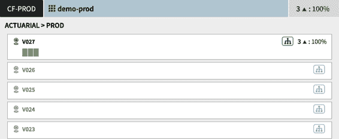

# 第五章：安全的多云持续交付

本书后半部分中本章的安排应表明在实现安全和有效的交付实践中，遥测的重要性。这可能会让人感到意外，因为每个组织都强调测试作为确保安全性的手段，但并非每个组织都以直接关联到最终用户体验的方式积极地进行测量。

本章介绍的概念将以一个名为 Spinnaker 的持续交付工具为例，但与早期章节一样，不同的工具也可以达到类似的目的。我想建立一个你应该从一个值得信赖的 CD 工具中期望的最低基础。

Spinnaker 是一个开源的持续交付解决方案，起源于 2014 年 Netflix 为了帮助管理其 AWS 上的微服务而开发。在 Netflix 之前，有一个称为 Asgard 的工具，它实际上只是一个专为应用程序开发人员设计的替代 AWS 控制台，并且专为 Netflix 在 AWS 上的异常规模构建而成。曾经有一次，我在与 AWS 控制台交互时需要选择安全组。控制台中的 UI 元素是一个普通的 HTML 选择框，显示四个可见元素。由于 Netflix 在此帐户中的广泛规模，可用的安全组在列表框中未排序，且有数千个！像这样的可用性问题导致了 Asgard，进而演变为 Spinnaker。Asgard 实际上只是一个带有一些操作（类似 AWS 控制台）的应用程序清单。Spinnaker 则构想为清单*加*流水线。

2015 年，Spinnaker 开源并添加了其他初始的 IaaS 实现。在不同阶段，Spinnaker 受到了 Google、Pivotal、Amazon 和 Microsoft 等公司以及像 Target 这样的终端用户的重要贡献。许多这些贡献者共同撰写了一本[单独的书籍](https://oreil.ly/fuhPb)，内容是关于 Spinnaker 的。

本章描述的实践适用于各种平台。

# 平台类型

不同类型的平台在组成运行应用程序的高级概念方面具有惊人的共性。本章介绍的概念将大部分是平台中立的。平台可分为以下几类：

基础设施即服务（IaaS）

基础设施即服务提供虚拟化计算资源作为服务。传统上，IaaS 提供商负责服务器、存储、网络硬件、虚拟化层以及用于管理这些资源的 API 和其他形式的用户界面。最初，使用 IaaS 是作为不使用物理硬件的替代方法。在 IaaS 上配置资源涉及构建虚拟机（VM）映像。在 IaaS 上部署需要在交付流水线的某个时刻构建 VM 映像。

容器即服务（CaaS）

容器即服务（CaaS）是对基于容器而不是虚拟机的工作负载的 IaaS 的一种专门化。它为应用程序作为容器部署提供了更高级别的抽象。Kubernetes 当然已成为公有云供应商和本地环境提供的事实标准 CaaS。它提供了许多本书范围之外的其他服务。部署到 CaaS 需要在交付管道中的某个地方（通常在构建时）构建容器的额外步骤。

平台即服务（PaaS）

平台即服务（PaaS）进一步将底层基础架构的细节抽象化，通常允许您直接将应用程序二进制文件（如 JAR 或 WAR）上传到 PaaS API，然后由 PaaS 负责构建图像并进行配置。与 PaaS 的即服务含义相反，有时像 Cloud Foundry 这样的 PaaS 提供是在客户数据中心的虚拟化基础设施上的。它们也可以在 IaaS 提供的基础上进行层叠，以进一步抽象出 IaaS 资源模型，这可能达到保留某种程度的公有云提供商供应商中立性或允许在混合私有/公共云环境中提供类似的交付和管理工作流程的目的。

这些抽象可以由另一家公司提供给您，或者您可以自己构建这个云原生基础设施（就像一些大公司所做的那样）。关键要求是一个弹性的、自助服务的、基于 API 的平台，用于构建。

我们在本章中将做出的一个关键假设是，您正在构建不可变基础设施。虽然 IaaS 的任何内容都不会阻止您构建 VM 映像、启动其实例并在启动后将应用程序放置到其中，但我们假设 VM 映像与应用程序和任何支持软件一起“烘焙”，以便在新实例被配置时应用程序应该能够启动和运行。

进一步的假设是以这种方式部署的应用程序大致上是云原生的。云原生的定义因来源而异，但至少可以适用于本章讨论的部署策略的应用程序是无状态的。[12 因素应用](https://12factor.net/)的其他元素并不是那么关键。

例如，我在 Netflix 管理的一个服务通常需要超过 40 分钟才能启动，这与可处理性标准不符，但在其他方面是不可避免的。同一服务在 AWS 中使用了占用内存极高的实例类型，我们只有一个小型的保留池。这对我的选择施加了限制：我不能同时运行超过四个此服务的实例，所以我不会使用几个禁用的集群进行蓝/绿部署（在“蓝/绿部署”中描述）。

进一步围绕一个共同语言进行讨论，让我们讨论一下所有这些平台共有的资源构建块。

# 资源类型

为了保持我们对交付概念的讨论与平台无关，我们将采用由 Spinnaker 定义的抽象概念，这些概念在不同类型的平台上都非常易于移植：

实例

实例是某些微服务的运行副本（不是在本地开发者机器上，因为我真诚地希望生产流量不会找到那里）。AWS EC2 和 Cloud Foundry 平台都称之为“实例”，非常方便。在 Kubernetes 中，实例是一个 Pod。

服务器组

服务器组表示一组一起管理的实例。不同平台管理实例集合的方式各不相同，但它们通常负责确保运行一定数量的实例。我们通常假设服务器组的所有实例具有相同的代码和配置，因为它们是不可变的（除非不是这样）。服务器组可以在逻辑上完全没有任何实例，但只需潜在地扩展到非零数量的实例。在 AWS EC2 中，服务器组是一个自动扩展组。在 Kubernetes 中，服务器组大致是部署（Deployment）和副本集（ReplicaSet）的组合（其中部署管理副本集的推出），或者是 StatefulSet。在 Cloud Foundry 中，服务器组是一个应用（不要与本列表中定义的应用混淆，我们在本章中将使用该术语）。

集群

集群是跨多个区域可能存在的服务器组集合。在单个区域内，多个服务器组可能表示微服务的不同版本。集群不跨云服务提供商。您可以在不同的云服务提供商中运行两个非常相似的集群，但对于我们的讨论，它们将被视为不同的。集群是一个逻辑概念，在任何云服务提供商中实际上并没有对应的资源类型。更准确地说，它不涵盖特定平台的多个安装。因此，集群不跨多个 Cloud Foundry 基础设施或 Kubernetes 集群。在 AWS EC2 中没有更高级别的抽象来表示一组自动扩展组，在 Kubernetes 中也没有表示部署集合的抽象。Spinnaker 通过命名约定或者附加到它创建的资源的元数据来管理集群成员资格，具体取决于 Spinnaker 在平台实现中的方式。

应用

应用是一个逻辑业务功能，而不是一个特定的资源。所有运行中的应用实例都包括在内。它们可能跨越多个集群和多个地区。它们可能存在于多个云提供商，要么是因为您正在从一个提供商过渡到另一个提供商，要么是因为您有某些具体的业务情况，不希望锁定在一个提供商上，或者出于任何其他原因。只要存在代表这个业务功能实例的运行进程，它就是所谓的应用的一部分。

负载均衡器

负载均衡器是一个组件，它将单独的请求分配给一个或多个服务器组中的实例。大多数负载均衡器有一组策略或算法，可以用来分配流量。此外，它们通常具有健康检查功能，允许负载均衡器确定候选微服务实例是否健康到足以接收流量。在 AWS EC2 中，负载均衡器是应用负载均衡器（或传统的弹性负载均衡器）。在 Kubernetes 中，Service 资源就是负载均衡器。Cloud Foundry 路由器也是一个负载均衡器。

防火墙

防火墙是一组管理对一组服务器组的入站和出站流量的规则。在 AWS EC2 中，这些称为安全组。

Spinnaker 的 Kubernetes 实现在提供商中有些独特。Spinnaker 实际上可以部署任何 Kubernetes 资源，因为它内部使用`kubectl apply`并将清单传递给 Kubernetes 集群。此外，Spinnaker 允许您将清单视为模板，并提供变量替换。然后，它将某些 Kubernetes 对象如 ReplicaSets/Deployments/StatefulSets 映射到服务器组，将 Services 映射到负载均衡器。

图 5-1 显示了一个 Spinnaker 视图，展示了一系列 Kubernetes ReplicaSets。请注意，此基础设施视图还包含对所选资源的编辑、缩放、禁用和删除等操作。在此视图中，`replicaSet helloworldapp-frontend`是“Cluster”资源（在本例中是 Kubernetes 资源类型和名称的结合体），代表一个或多个 Kubernetes 命名空间中的一组 ReplicaSets。`HELLOWORLDWEBAPP-STAGING`是对应于同名 Kubernetes 命名空间的“Region”。`helloworldapp-frontend-v004`是一个服务器组（一个 ReplicaSet）。各个块是对应于 Kubernetes pods 的“Instances”。


###### 图 5-1\. Spinnaker 视图展示了三个 Kubernetes ReplicaSets，并突出显示了操作

# 交付管道

Spinnaker 流水线只是市场上商业和开源软件中众多以交付为重点的流水线解决方案之一。它们从低级别且具有强烈观点的 Spring Cloud Pipelines 到包括 JenkinsX 等交付构建块的持续集成流水线，涵盖了各种解决方案。在本章中，我们将专注于 Spinnaker 流水线，但如果您替换其他流水线解决方案，请寻找一些关键能力：

平台中立性

一个交付解决方案不必支持每个可能的供应商才能被视为平台中立的解决方案，但基于 Kubernetes 自定义资源定义的交付解决方案保证会锁定到特定平台。有了这种锁定，您在部署环境中的任何异构性都意味着您将要使用多种工具。在足够规模的企业中，混合平台使用非常普遍（这也是应该的）。

自动化触发

流水线应该能够根据事件自动触发，尤其是根据工件输入的变化。我们将更多地讨论工件触发如何帮助您以安全和可控的方式重新布置基础设施，详见《云端打包》。

可扩展性

一个良好的流水线解决方案考虑到不同流水线阶段的根本不同的计算特性。“部署”阶段通过调用平台 API 端点来提供新资源，其计算需求非常低，即使该阶段可能运行几分钟。一个流水线执行服务的单个实例可以轻松并行运行数千个这样的阶段。“执行脚本”阶段执行类似 Gradle 任务的操作，其资源需求任意复杂，因此最好将其委托给像容器调度器这样的东西，以确保阶段执行的资源利用不会影响流水线执行服务的性能。

当使用持续集成产品执行部署操作时，它们通常会以显着的方式浪费资源。我曾经参观过的一家金融机构使用 CI 系统 Concourse 进行交付操作，每年的成本达到数百万美元。对于这样的组织来说，运行 30 个 `m4.large` 预留实例在 EC2 上支持一个 Spinnaker 安装每年只需花费超过 15,000 美元。资源的低效性很容易朝另一个方向转变。任意计算复杂度的阶段不应该在主机上或者在 Spinnaker 的 Orca（即流水线）服务中运行。

各种云提供商的*感觉*非常不同。可部署资源对于每种类型的抽象级别也是不同的。

Spinnaker 流水线由大致与云中性相关的阶段组成。也就是说，每个云提供商实现将有相同的基本构建块可用，但是像 “部署” 这样的阶段的配置会因平台而异。

图 5-2 展示了一个将部署到 Kubernetes 的 Spinnaker 流水线的定义。流水线可以非常复杂，包含并行阶段和在特殊配置阶段上定义的多个触发器。


###### 图 5-2\. 展示了一个详细视图的 Spinnaker 流水线，显示了多个阶段

Spinnaker 定义了几种不同的触发器类型。这个流水线是通过发布到 Docker 注册表的新容器镜像来触发的，如 图 5-3 所示。


###### 图 5-3\. Spinnaker 期望的构件定义

图 5-4 展示了两个 Spinnaker 流水线的执行历史，包括我们刚刚看到的配置。阶段流水线是通过 Docker 注册触发器（发布到 Docker 注册表的新容器）最后执行的。在其他情况下，流水线是手动触发的。


###### 图 5-4\. Spinnaker 查看两个不同交付流水线的视图

任何交付流水线的第一个任务是将应用程序打包成一个不可变的部署单元，可以在服务器组的实例中复制。

# 云端的打包

不同云平台提供的各种抽象层面上，存在启动时间、资源效率和成本的权衡。但正如我们将看到的，从包装微服务到部署的各自工作量之间应该没有显著差异。

从 [start.spring.io](https://start.spring.io) 生成一个新的应用程序包括生成一个 Gradle 或 Maven 构建，可以生成一个可运行的 JAR。对于像 Cloud Foundry 和 Heroku 这样的 PaaS 平台，这个可运行的 JAR *是* 部署的输入单元。由云提供商负责获取这个可运行的 JAR 并将其容器化或以其他方式打包，然后为其运行提供一些基础资源。

对于除了 PaaS 外的云平台，应用团队所需的工作量惊人地并没有太大差异。这里的示例使用 Gradle 实现，因为开源工具同时适用于 IaaS 和 CaaS 的用途。同样，类似的工具也可以为 Maven 生产。

PaaS 的典型价值主张之一是，您只需将应用程序二进制文件作为部署过程的输入，并让 PaaS 代表您管理操作系统和软件包补丁，甚至是透明地。但实际操作并非完全如此。在 Cloud Foundry 的情况下，该平台负责以滚动方式进行一定程度的补丁操作，影响服务器组中的一个实例（在 Cloud Foundry 术语中称为“应用程序”）。但这样的补丁操作会带来一定程度的风险：操作系统的任何部分更新都可能对正在其上运行的应用程序产生不利影响。因此，这里存在着风险与回报的权衡，该权衡会仔细界定平台愿意代表用户自动化的更改类型。所有其他的补丁/更新都将应用于平台将应用程序放置在其上的“类型”镜像。Cloud Foundry 称这些为构建包（buildpacks）。例如，Java 版本升级涉及对构建包的更新。平台不会自动更新每个正在运行使用 Java 构建包的应用程序的构建包版本。这确实取决于组织是否重新部署每个使用 Java 构建包的应用程序来获取更新。

对于非 PaaS 环境来说，通过从构建生成除 JAR 之外的另一种类型的工件（或在部署流水线中增加额外阶段），可以在整个组织中更大程度地控制和灵活性地处理基础设施的补丁。虽然 IaaS 和 CaaS 之间的基础镜像类型不同（分别是虚拟机和容器镜像），但在基础镜像上构建您的应用程序的原则允许您将应用程序二进制文件和其上层叠的基础镜像作为每个微服务交付流水线的独立输入。图 5-5 展示了一个假想的微服务交付流水线，首先部署到测试环境，运行测试，并经过审计检查，最终部署到生产环境。请注意，在此示例中 Spinnaker 支持多种触发类型：一种用于新的应用程序二进制文件，另一种用于新的基础镜像。


###### 图 5-5\. 基础镜像的更改会触发流水线

在同一组织中，不同的微服务可能需要更多或更少的阶段来验证应用程序工件和基础镜像的组合是否适合推广到生产环境。使基础镜像的变更*触发*交付流水线是安全和速度的理想平衡点。交付流水线包含所有完全自动化阶段的微服务可能在几分钟内采用新的基础镜像，而具有更严格手动验证和批准阶段的服务可能需要几天时间。这两种服务都以最符合负责团队独特文化和要求的方式采用变更。

## 适用于 IaaS 平台的打包

对于 IaaS 平台，部署的不可变单元是虚拟机镜像。在 AWS EC2 中，此镜像称为 Amazon Machine Image。创建镜像只需实例化基础镜像（其中包含所有微服务的公共偏好设置，如 Java 版本、常见系统依赖项以及监控和调试代理），在其上安装包含应用程序二进制文件的系统依赖项，然后对结果镜像进行快照，并在配置新服务器组时将此镜像作为模板使用。

将实例供应、安装系统依赖项并创建快照的过程称为*烘焙*。甚至不必启动基础镜像的实时副本也是可能的。HashiCorp 的经过考验的开源烘焙解决方案 [Packer](https://www.packer.io) 适用于各种不同的 IaaS 提供商。

图 5-6 显示了构建工具、烘焙工厂和由云提供商管理的服务器组的责任边界。Spinnaker 流水线阶段负责启动烘焙过程，并使用烘焙阶段产生的镜像创建服务器组。它显示每个微服务构建的额外要求，即生产系统依赖项，意味着在 Ubuntu 或 Debian 基础镜像上生产 Debian 包，在 Red Hat 基础镜像上生产 RPM 等。最终，烘培工厂将以某种方式调用操作系统级别的包安装程序，将应用程序二进制文件叠加到基础镜像上（例如，`apt-get install <system-package>`）。


###### 图 5-6\. IaaS 打包参与者

利用 Netflix 的 Nebula Gradle 插件套件中的 Gradle 插件，如 示例 5-1 所示，生成 Debian 或 RPM 系统依赖项非常简单。这将在构建文件中添加一个名为 `buildDeb` 的 Gradle 任务，该任务完成所有生成 Spring Boot 应用程序的 Debian 包所需的工作。这只需要对构建文件进行一行更改！

##### 示例 5-1\. 使用 Nebula Gradle 插件生成 Debian 包

```java
plugins {
  id("org.springframework.boot") version "LATEST"
  id("io.spring.dependency-management") version "LATEST"
  id("nebula.ospackage-application-spring-boot") version "LATEST" 
}

...
```


用 [Gradle 插件门户网站](https://oreil.ly/xPGaq) 上的最新版本替换 `LATEST`，因为 `LATEST` 实际上对 Gradle 插件版本规范无效。

ospackage 插件包含各种选项，用于添加启动脚本，配置配置文件和可运行的文件的输出位置等。不过，无论这些文件发生在何处和发生了什么，组织中的微服务之间应该有足够的共性，以类似于 Netflix 对 `nebula.ospackage-application-spring-boot` 所做的方式封装这些观点，并将它们作为一个构建工具插件进行分发，以便采用变得微不足道。

## 为容器调度器打包

准备微服务以部署到像 Kubernetes 这样的容器调度器可能会类似。有可供选择的工具可以为常见框架（如 Spring Boot）打包，如 Example 5-2 所示。这个插件还了解如何发布到 Docker 注册表，只需进行一些配置（可以很容易地封装并作为组织内的常见构建工具插件进行发布）。

##### 示例 5-2\. 使用 Nebula Gradle 插件生成和发布 Docker 镜像

```java
plugins {
  id("org.springframework.boot") version "LATEST"
  id("io.spring.dependency-management") version "LATEST"
  id("com.bmuschko.docker-spring-boot-application") version "LATEST"
}

if (hasProperty("dockerUser") && hasProperty("dockerPassword")) {
  docker {
    registryCredentials {
      username = dockerUser
      password = dockerPassword
      email = "bot@myorg.com"
    }

    springBootApplication {
      tag = "$dockerUser/${project.name}:${project.version}"
      baseImage = "openjdk:8"
    }
  }
}
```

# 依赖开源构建工具，但小心使用没有经过验证的基础镜像

拥有像本 Muschko 的 Gradle Docker 插件这样的工具很好，可以生成一个包含在某个基础之上构建的应用程序的镜像。但你应该期望你组织中有人正在验证和创建经过批准的镜像，已知性能良好且没有已知缺陷和安全漏洞。这适用于 VM 和容器镜像。

这种方法的缺点是操作系统和其他系统软件包更新是基础 Docker 镜像的一部分，用于生成应用容器镜像。然后需要将基础容器镜像的更改传播到整个组织，这要求我们重新构建应用程序二进制文件，这可能会很不方便。毕竟，要想*仅仅*改变基础镜像而不改变应用程序代码（可能自上次构建以来已经有一系列的源代码更改），我们必须将应用程序代码签出到生产版本的哈希值，并使用新的镜像重新构建。这个过程，因为涉及再次构建，可能会导致应用程序二进制文件无法复现，而我们只是想要更新基础镜像。

在容器化工作负载中添加一个烘烤阶段可以通过删除完全消除需要发布容器镜像的必要性（只需将 JAR 发布到 Maven 构件库），并允许大规模更新基础镜像，再次采用与 IaaS 基础工作负载触发器相同的流程和安全保证。Spinnaker 支持使用 [Kaniko](https://oreil.ly/JpW3V) 烘烤容器镜像，从而无需将容器镜像构建/发布作为构建工作流的一部分。这样做的一个优点是，您可以在更新的基础上重新烘烤相同的应用程序二进制文件（例如，在基础中修复安全漏洞时），有效地运行应用程序代码的不可变副本。

令人惊讶的是，跨所有三种云抽象（IaaS、CaaS 和 PaaS）实现安全的基本更新的愿望导致了所有三者都采用了非常类似的工作流程（以及类似的应用程序开发者体验）。实际上，部署的便捷性不再是这些抽象层次之间的决策标准，我们必须考虑其他差异化因素，比如启动时间、厂商锁定、成本和安全性。

现在我们已经讨论了打包问题，让我们转向可以用来在您的平台上部署这些包的部署策略。

# 删除 + 无部署

如果“删除 + 无部署”听起来很丑陋，那是因为我即将描述的这种小技巧可能仅在某些狭窄情况下有用，但它有助于为随后的其他部署策略奠定框架。

基本思想就是简单地删除现有的部署并部署新的。显然，这样做会导致停机时间，无论多么短暂。停机时间的存在表明，版本间的 API 兼容性并不严格要求，只要您在服务的所有调用方在同一时间进行版本更改的部署协调即可。

后续的每种部署策略都将实现零停机时间。

要将这个概念与您可能熟悉的*非不可变*部署实践联系起来，当在始终运行的虚拟机上安装并启动新的应用程序版本（替换之前运行的版本）时，就会使用删除 + 无部署部署策略。再次强调，本章仅专注于不可变部署，随后的任何其他部署策略都没有明显的可变对应策略。

这种策略在执行基本的 `cf push`（Cloud Foundry 的命令）时也会使用，在 AWS EC2 上操作重新配置 Auto Scaling Group 以使用不同的 Amazon Machine Image 时同样适用。关键在于，通常基本的 CLI 或控制台部署选项确实接受停机时间，并且更多或少地按照这种策略操作。

下一个策略类似，但是没有停机时间。

# 高地人

尽管名称奇特，但 Highlander 策略实际上是当今实践中最常见的零停机策略。名称源自《炫目之剑》电影中的一句口号：“只能有一个。”换句话说，当你部署服务的新版本时，你会替换旧版本。只能有一个。部署结束时，只有新版本在运行。

Highlander 策略是零停机时间的。在实践中，它涉及部署应用程序的新版本并将其添加到负载均衡器，这会导致在销毁旧版本时短时间内同时为两个版本提供服务。因此，这种部署策略的更准确的口号可能是“通常只有一个”。跨版本所需的 API 兼容性源于这种短暂重叠的存在。

Highlander 模型简单，其简单性使其成为许多服务的有吸引力的选择。由于任何给定时间只有一个服务器组，所以无需担心协调以防止来自“其他”不应处于服务状态的运行版本的干扰。

在 Highlander 策略下返回到先前版本的代码涉及重新安装旧版本的微服务（该微服务接收一个新的服务器组版本号）。因此，此伪回滚操作完成所需的时间是安装和初始化应用程序进程所需的时间。

下一个策略提供更快的回滚速度，但需要一些协调和复杂性。

# 蓝/绿部署

蓝/绿部署策略涉及至少两个微服务副本（无论是启用还是禁用状态），涉及到旧版本和新版本的服务器组。在任何给定时间，生产流量都是从这些版本中的一个版本提供的。回滚只是切换哪个副本被视为活动副本。向前滚动到更新版本具有相同的体验。如何实现这种切换逻辑取决于云平台（但由 Spinnaker 编排），但在高层次上涉及影响云平台的负载平衡器抽象以将流量发送到一个版本或另一个版本。

# kubectl apply 默认是一种特定类型的蓝/绿部署。

`kubectl apply`更新 Kubernetes 部署（从 CLI 而不是使用 Spinnaker）默认是滚动蓝/绿部署，允许您回滚到表示先前版本的 ReplicaSet。因为它是一种容器部署类型，所以回滚操作涉及将镜像拉回来。Kubernetes 部署资源在管理滚动蓝/绿部署和回滚的 ReplicaSet 之上实现为控制器。Spinnaker 为 Kubernetes ReplicaSets 提供了更多控制，可以启用蓝/绿功能，包括禁用版本，金丝雀部署等。因此，将 Kubernetes 部署视为一种有限的，持有的蓝/绿部署策略。

负载均衡器切换可能会对部署资产的结构产生影响。例如，在 Kubernetes 上，蓝绿部署基本上要求您使用 ReplicaSet 抽象。蓝绿策略要求 *运行* 资源通过某种方式进行编辑以影响流量。对于 Kubernetes，我们可以通过标签操作来实现这一点，这就是 Spinnaker Kubernetes 实现用来实现蓝绿部署的方法。如果我们尝试编辑 Kubernetes 的 Deployment 对象，将触发一次滚动更新。Spinnaker 会自动向 ReplicaSet 添加特殊标签，间接导致它们被视为启用或禁用，并在服务上添加标签选择器以仅将流量路由到启用的 ReplicaSet。如果您不使用 Spinnaker，则需要创建一些类似的过程，在 ReplicaSet 上原地修改标签，并配置服务以识别这些标签。

蓝/绿色暗示有两个服务器组，其中蓝色或绿色服务器组中的一个正在提供流量服务。蓝绿策略并不总是二元的，颜色也不应暗示这些服务器组需要长期存在，随着新服务版本的可用性而变化。

蓝绿部署通常在任何给定集群中是一个 1:N 的关系，其中一个服务器组是活跃的，而 N 个服务器组是非活跃的。这种 1:N 蓝绿集群的可视化表示如图 5-7 所示。



###### 图 5-7\. Spinnaker 蓝绿集群

回滚服务器组操作，如图 5-8 所示，允许选择这些禁用的服务器组版本之一（V023–V026）。回滚完成后，当前的活跃版本（V027）仍将存在，但被禁用。


###### 图 5-8\. Spinnaker 回滚服务器组操作

根据底层云平台的支持情况，禁用的集群可以保留不接收任何流量的运行实例，或者可以减少到零实例，准备回滚以进行扩展。为了实现最快的回滚形式，禁用的集群应该保留活跃实例。当然，这会增加服务的费用，因为现在你不仅需要支付用于提供实时生产流量的实例集合的成本，还需要支付先前服务版本中剩余实例的成本，这些实例有可能会回滚到。

最终，您需要评估回滚速度与成本之间的权衡，其光谱显示在图 5-9 中。这应该基于每个微服务而不是整个组织来完成。在蓝/绿部署中，对需要运行数百个实例的微服务维护完全缩放禁用的服务器组所产生的额外运营成本，与对只需要少数实例的服务所产生的额外成本并不相等。


###### 图 5-9。按部署策略权衡操作成本与回滚速度

当一个微服务不是纯粹的 RESTful 时，不完全缩放到零禁用集群的蓝/绿部署策略对应用代码本身有影响。

例如考虑一个（至少部分地）事件驱动的微服务，它对 Kafka 主题或 RabbitMQ 队列上的消息做出反应。将负载均衡器从一个服务器组转移到另一个服务器组对这类服务连接到它们的主题/队列没有影响。在某种程度上，应用代码需要响应由外部进程将其置于服务外部的情况，本例中为蓝/绿部署。

同样地，运行在禁用服务器组的实例上的应用程序进程需要响应由外部进程（例如 Spinnaker 中的回滚服务器组操作）将其重新置于*服务中*，在这种情况下重新连接到队列并开始处理工作。Spinnaker 的 AWS 实现蓝/绿部署策略意识到了这个问题，当也在使用[Eureka](https://oreil.ly/ODfkK)服务发现时，使用 Eureka 的 API 端点影响服务的可用性，如表 5-1 所示。

注意这是基于每个实例进行的。Spinnaker 通过定期轮询部署环境的状态来意识到存在哪些实例，从而帮助构建这种自动化。

表 5-1。影响服务可用性的 Eureka API 端点

| 操作 | API | 注释 |
| --- | --- | --- |
| 将实例置于服务外部 | `PUT /eureka/v2/apps/appID/instanceID/status?value=OUT_OF_SERVICE` |  |
| 将实例重新置于服务中（移除覆盖） | `DELETE /eureka/v2/apps/appID/instanceID/status?value=UP` | value=UP 是可选的；它被用作由于移除覆盖而建议的回退状态 |

这假定您的应用程序正在使用 Eureka 服务发现客户端注册到 Eureka。但这样做意味着您可以添加一个 Eureka 状态变更事件监听器，如示例 5-3 所示。

##### 示例 5-3。

```java
// For an application with a dependency on
// 'org.springframework.cloud:spring-cloud-starter-netflix-eureka-client'
@Bean
ApplicationInfoManager.StatusChangeListener statusChangeListener() {
  return new ApplicationInfoManager.StatusChangeListener() {
    @Override
    public String getId() {
      return "blue.green.listener";
    }

    @Override
    public void notify(StatusChangeEvent statusChangeEvent) {
      switch(statusChangeEvent.getStatus()) {
        case OUT_OF_SERVICE:
          // Disconnect from queues...
          break;
        case UP:
          // Reconnect to queues...
          break;
      }
    }
  };
}
```

自然而然，可以使用[Consul](https://www.consul.io)来实现相同类型的工作流程，它是一个动态配置服务器，允许进行标记（例如，按服务器组名称或集群标记），或者任何其他具有以下两个特征的中心数据源：

+   应用程序代码可以通过某种事件监听器几乎实时地响应变更事件。

+   数据可以按服务器组、集群和应用程序至少分组，并且您的应用程序代码能够确定它属于哪个服务器组、集群和应用程序。

相应地响应服务可用性的外部修改的要求也适用于使用持久化 RPC 连接（如[RSocket](https://rsocket.io)或流/双向[GRPC](https://oreil.ly/tNORN)）的微服务，其中禁用的服务器组需要终止任何持久化的 RPC 连接，无论是出站还是入站。

必须监听发现状态事件（或任何其他外部指示器服务可用性）中隐藏且重要的一点是：应用程序意识到其在服务发现中的参与。服务网格（参见“服务网格中的实现”）的目标是将这种责任从应用程序中移出，并将其外部化到旁路进程或容器中，通常是为了快速实现这些模式的多语言支持。稍后我们将讨论该模型的其他问题，但是在消息驱动应用程序的蓝/绿部署中，您希望保留处于禁用状态的服务器组中的活动实例，这是语言特定绑定（在这种情况下是服务发现）必要的一个例子。

# 名称中有什么？

蓝/绿部署与红/黑部署是相同的事物。它们只是不同的颜色组合，但是这些技术确实具有完全相同的意义。

在考虑更复杂的策略（例如自动金丝雀分析）之前，每个团队都应该在实施蓝/绿部署之前进行练习。

# 自动金丝雀分析

蓝/绿部署通常在大多数情况下以相对较低的成本实现了很高的可靠性。并非每个服务都需要进一步发展。然而，我们可以追求额外的安全级别。

虽然蓝/绿部署允许您快速回滚导致意外问题的代码或配置更改，但金丝雀发布通过向现有版本旁边运行的新版本服务的小子集暴露，提供了额外的风险降低级别。

并非每个服务都适合金丝雀部署。低吞吐量的服务使得将流量的一小部分发送到金丝雀服务器组变得困难，但并非不可能，而且不会延长金丝雀适应性的决定时间。金丝雀适应性决策需要花费的时间没有一个正确的数量。对于您来说，在相对低吞吐量的服务上运行几天的金丝雀测试以做出决定可能是完全可以接受的。

许多工程团队存在明显的偏差，低估其服务实际接收的流量，因此认为金丝雀分析等技术无法适用于他们。回想一下“学会预期失败”提到的现实团队，他们的业务应用每分钟接收超过 1,000 个请求。这个吞吐量比大多数该团队工程师的猜测要高得多。这也是实际生产遥测数据应该是首要任务的另一个原因。建立起甚至是短期内在生产中发生的情况的历史，可以帮助你更好地决定哪种技术，例如部署策略，在后续情况下是适当的。

# 我的服务永远不能失败，因为它太重要了

要谨慎对待那种避开自动化金丝雀分析策略的推理，仅仅因为某个微服务对于不失败太重要。相反，应采取一种观念，即失败不仅可能发生，而且无论其对业务的重要性如何，每个服务都会发生故障，据此行事。

金丝雀部署的适应性通过比较旧版本和新版本的服务水平指标来确定。当一个或多个这些 SLI 出现显著恶化时，所有流量都会路由到稳定版本，并且金丝雀测试将被中止。

理想情况下，金丝雀部署应包括三个服务器组，如图 5-10 所示。


###### 图 5-10\. 金丝雀发布参与者

这些金丝雀部署可以描述如下：

生产环境

这是金丝雀部署之前的现有服务器组，包含一个或多个实例。

基线

这个服务器组运行与生产服务器组相同版本的代码和配置。虽然一开始运行另一个旧代码副本似乎有些违反直觉，但我们需要一个基线，它大致在金丝雀发布时启动，因为生产服务器组由于运行了一段时间，可能具有不同的特征，比如堆消耗或缓存内容。能够准确比较旧代码和新代码之间的差异非常重要，而最佳方法是大致同时启动每个副本。

金丝雀

这个服务器组包含了新的代码或配置。

金丝雀的适应性完全由将一组指标相对于基准线（而不是生产集群）进行比较来确定。这意味着正在进行金丝雀测试的应用正在发布带有`cluster`公共标签的度量，以便金丝雀分析系统可以聚合来自属于金丝雀和基准集群的实例的指标，并相互比较这两个聚合指标。

相对比较远比测试一个金丝雀针对一组固定阈值要可取得多，因为固定阈值往往对测试时系统的吞吐量做出某些假设。图 5-11 展示了这个问题。在高峰业务时间，应用展示出更高的响应时间，这时系统流量最大（这是典型情况）。因此，对于固定阈值，也许我们试图设置一个数值，如果响应时间比正常情况差 10%以上，金丝雀测试就会失败。在高峰业务时间，金丝雀测试可能会失败，因为相对于基准线，其性能比差了超过 10%。但是如果我们在非高峰业务时间运行金丝雀测试，它可能会比基准线差得多于 10%，但仍然在设定的固定阈值内，因为这个固定阈值是相对于*不同操作条件*设定的。相对比较的方法更有可能在测试运行时无论是在或者非业务高峰期，都能捕捉到性能下降。


###### 图 5-11\. 对固定阈值的金丝雀测试

在多个场合，我会和组织讨论自动化交付实践，谈论到金丝雀部署，这个想法听起来如此吸引人，以至于激发了对这个主题的兴趣。通常，这些组织没有维度度量仪器，也没有类似蓝/绿部署的自动发布流程。也许是因为金丝雀部署的安全性吸引力，平台有时会包含金丝雀部署功能。通常情况下，它们缺少基线和/或比较测量，因此从这个角度评估平台提供的金丝雀功能，并决定是否放弃其中一个或两个功能，这在许多情况下并不明智。我建议在许多情况下都不应该。

在三集群设置（生产、基准、金丝雀）中，大部分流量将流向生产集群，少量流向基准和金丝雀。金丝雀部署使用负载均衡器配置、服务网格配置或任何其他平台功能来按比例分发流量。

图 5-12 展示了参与 canary 测试的三个集群的 Spinnaker 基础设施视图。在这个案例中，它们在一个名为“PROD-CLUSTER”的单个 Kubernetes 集群上运行（“cluster” 指的是 Kubernetes 集群，不是我们在本章开头定义的交付定义中的含义）。

Spinnaker 与一个开源自动化 canary 分析服务集成，该服务封装了来自 baseline 和 canary 集群的度量评估。


###### 图 5-12\. 应用程序 undergoing a canary 的三个集群

## Spinnaker 配合 Kayenta 使用

[Kayenta](https://oreil.ly/f4KZW) 是一个独立的开源自动化 canary 分析服务，也通过管道阶段和配置深度集成到 Spinnaker 中。

Kayenta 确定每个指标的 canary 和 baseline 之间是否存在显著差异，得出 *pass*、*high* 或 *low* 的分类结果。*High* 和 *low* 都属于失败条件。Kayenta 使用 [Mann-Whitney *U* test](https://oreil.ly/qLYOS) 在两个集群之间进行统计上的比较。这个统计测试的实现称为 judge，Kayenta 可以配置使用其他的 judge，但它们通常涉及超出单一查询度量系统所能达到的代码。

图 5-13 展示了 Kayenta 对多个指标进行分类决策的示例。这张截图来自原始的 Netflix [博客](https://oreil.ly/ik79d) 关于 Kayenta 的内容。在这个案例中，延迟未通过测试。


###### 图 5-13\. Canary 指标

在 Spinnaker 中，一个应用程序的 canary 指标可以在应用程序基础设施视图的“Canary Configs”选项卡中定义。在配置中，如 图 5-14 所示，您可以定义一个或多个服务水平指标。如果足够多的这些指标失败，canary 将失败。


###### 图 5-14\. Spinnaker 中一个应用程序的 canary 配置

图 5-15 展示了单个指标的配置，即处理器利用率。请注意，配置包含一个针对监控系统的特定度量查询，您已经配置 Kayenta 来从中轮询（在本案例中是 Prometheus）。然后，您广泛指示增加或减少（或任何方向的偏差）被认为是不良的。在这种情况下，我们不希望看到处理器利用率显著增加，尽管减少则是受欢迎的。

另一方面，对于应该以某一速率持续处理的应用程序来说，服务吞吐量的*减少*将是一个不良信号。该指标可以标记为足够严重，仅仅失败就应该导致金丝雀失败。


###### 图 5-15\. 处理器利用率金丝雀配置

金丝雀配置一旦建立，就可以在流水线中使用。如图 5-16 所示，一个典型的金丝雀部署流水线。在“配置”阶段定义了触发器，开始评估金丝雀的流程。“将集群名称设置为金丝雀”设置了一个变量，Spinnaker 在随后的“部署金丝雀”阶段中使用该变量来命名金丝雀集群。正是这个变量最终产生了如图 5-12 所示的命名金丝雀集群。


###### 图 5-16\. Spinnaker 中的金丝雀部署流水线

与此同时，Spinnaker 正在检索当前生产版本所基于的工件，并使用这些工件创建基线集群。 “金丝雀分析”阶段的运行时间可能长达数小时甚至数天，具体取决于其配置。如果测试通过，我们将部署一个新的生产集群（使用用于创建金丝雀的相同工件，这些工件可能不再是存储库中最新的版本）。同时，可以拆除不再需要的基线和金丝雀集群。整个流水线可以在 Spinnaker 中配置为串行运行，以便每次只评估一个金丝雀。

金丝雀运行的结果可以通过几种不同的方式查看。Spinnaker 提供了一个“金丝雀报告”选项卡，显示了每个服务水平指标的判断结果，以及单独评估每个进入决策的指标。每个指标可以作为时间序列图在金丝雀运行期间查看，就像 图 5-17 中显示的那样。


###### 图 5-17\. 基线和金丝雀中 CPU 利用率的时间序列可视化

# 当前生产版本并不总是最新版本

注意，从中创建基线的当前生产版本并不总是应用程序二进制（例如 JAR 或 WAR）存储库中最新的版本。在某些情况下，它实际上可能是几个版本较旧的版本，这是因为我们曾试图发布新版本，但它们在试验或其他情况下被回退了。像 Spinnaker 这样的有状态持续交付解决方案的一个价值在于其能力，即轮询环境以获取当前状态，并基于此信息采取行动。

或者，可以将指标的比较视为条形图（或直方图），如 图 5-18 中所示。


###### 图 5-18\. 99 百分位延迟的直方图可视化

最后，也许最有用的是，可以将金丝雀和基准之间的比较可视化为蜂群图，如图 5-19 所示。金丝雀随时间而判断，Kayenta 定期轮询监控系统以获取金丝雀和基准的值。这里的单个样本显示在蜂群图上，以及显示所有样本的基本四分位数（最小值、25th 百分位数、中位数、75th 百分位数和最大值）的箱形图。中位数肯定增加了，但正如在第二章中讨论的那样，像均值和中位数这样的中心度量并不真正有用于判断服务的适用性。这个图表确实突显了这一事实。最大值甚至 75%的延迟在版本之间几乎没有变化。因此，中位数的变化略有增加，但这可能根本不表示性能退化。


###### 图 5-19\. 99 百分位延迟的蜂群图可视化

金丝雀分析的关键指标有时会与我们用于警报的指标不同，因为它们是为了在两个集群之间进行比较分析而设计的，而不是针对绝对测量。即使新的应用程序版本仍然在我们设置为警报测试的服务水平目标边界之下，最好的代码的一般轨迹仍然不要继续向该服务水平目标逐渐退化。

## 为每个微服务提供通用的金丝雀指标

在考虑起始时有用的金丝雀指标时，请考虑 L-USE 首字母缩略词。事实上，对于大多数微服务应该发出警报的相同的服务级别指标也是很好的金丝雀指标，只是稍有不同。

让我们考虑一些好的金丝雀指标，首先是延迟。实际上，第四章中描述的任何信号都是金丝雀分析的好候选者。

### 延迟

一些指示性 API 端点的延迟是一个很好的起点。将指标限制在成功的结果上，因为成功的结果往往具有与不成功的结果不同的延迟特性。想象一下，在生产中修复了导致关键 API 端点失败的错误后，由于该错误导致 API 端点快速失败，而金丝雀却认为修复该错误导致了延迟过高而失败！

在 第四章 中，这个想法是测量一个定时操作的衰减 *最大* 延迟相对于固定的服务水平目标，这个服务水平目标是工程服务级别协议中的保守边界，与业务伙伴确定。但最大延迟往往是波动的。例如，Hypervisor 和垃圾收集暂停或完全连接池大多是暂时的条件（并且超出你的控制），自然会在不同时间影响实例。为了衡量应用程序相对于服务水平目标的适应性，我们希望确保即使在这些条件下，性能仍然是可接受的。但由于它们在不同实例上发生的交错性质，这些效果导致了不良的 *比较* 措施。

对于金丝雀，最好查看像第 99 百分位延迟这样的分布统计，它剔除了这些临时条件表现出来的顶部 1%。99th 百分位数（或其他高百分位数）通常是代码性能 *潜力* 的更好度量，减去临时环境因素。

从 “直方图” 中回忆，为了在群集中计算高百分位延迟（并且限制为特定端点的成功结果），我们需要使用像基于直方图数据的百分位近似这样的方法，可以在此群集中和任何其他标记变化之间进行累加，以此关键 API 端点的成功结果。目前只有少数监控系统支持可聚合的百分位近似。如果您的监控系统不能进行百分位近似，请勿尝试从实例中聚合单个百分位数（我们展示了为什么这样的数学不适用于 “百分位/分位数”）。此外，避免使用其他像平均值这样的测量方法。查看 图 5-18 中的蜂群图，了解像中位数和均值这样的中心性度量如何在版本之间（实际上甚至在相同版本的时间内！）有很大的变化，而没有任何真正的性能变化。

> Average: 介于最大值和中位数的一半之间的随机数。通常用于忽视现实。
> 
> 吉尔·特纳

要计算 Atlas 的可聚合百分位近似，使用 `:percentiles` 函数，如 示例 5-4 所示。

##### Example 5-4\. Atlas 百分位延迟对金丝雀

```java
name,http.server.requests,:eq,
uri,$ENDPOINT,:eq,
:and,
outcome,SUCCESS,:eq,
:and,
(,99,),:percentiles
```

对于 Prometheus，使用 `histogram_quantile` 函数，如 示例 5-5 所示。

##### Example 5-5\. 金丝雀的 Prometheus 百分位延迟

```java
histogram_quantile(
  0.99,
  rate(
    http_server_requests_seconds_bucket{
      uri="$ENDPOINT",
      outcome="SUCCESS"
    }[2m]
  )
)
```

同样地，你应该包括与关键下游资源的交互的延迟指标，如数据库。考虑关系数据库的交互。新代码可能会意外地导致现有数据库索引未被使用（显著增加延迟和数据库负载），或者新索引在投产后表现不如预期。无论我们如何努力在低级环境中复制和测试这些新的交互，实际生产环境永远不会如此。

### 错误比率

错误比率（在 Atlas 的 示例 5-6 和 Prometheus 的 示例 5-7 上）对于某些基准 API 端点（或全部端点）同样非常有用，因为这将确定您是否引入了语义回归问题，这些问题可能未被测试捕获，但却在生产中造成问题。

##### 示例 5-6\. Atlas 中 HTTP 服务器请求的错误比率

```java
name,http.server.requests,:eq,
:dup,
outcome,SERVER_ERROR,:eq,
:div,
uri,$ENDPOINT,:eq,:cq
```

##### 示例 5-7\. Prometheus 中 HTTP 服务器请求的错误比率

```java
sum(
  rate(
    http_server_requests_seconds_count{outcome="SERVER_ERROR", uri="$ENDPOINT"}[2m]
  )
) /
sum(
  rate(
    http_server_requests_seconds_count{uri="$ENDPOINT"}[2m]
  )
)
```

仔细考虑是否在单个金丝雀信号中包含多个 API 端点。假设您有两个单独的 API 端点，它们接收的吞吐量显著不同，一个接收每秒 1,000 次请求，另一个接收每秒 10 次请求。由于我们的服务并非完美（什么是完美？），旧代码在高吞吐量端点上以固定速率失败，每秒 3 次请求，但所有低吞吐量端点的请求都成功。现在想象我们进行代码更改，导致低吞吐量端点的每 10 次请求中有 3 次失败，但不会改变另一个端点的错误比率。如果这些端点被金丝雀判断一起考虑，判断可能会通过回归，因为错误比率略有上升（从 0.3% 到 0.6%）。然而，如果分开考虑，判断肯定会在低吞吐量端点的错误比率上失败（从 0% 到 33%）。

### 堆饱和度

堆利用率可以通过两种方式进行比较：对于总消耗相对于最大堆和分配性能。

总消耗由使用量除以最大值确定，如 示例 5-8 和 示例 5-9 所示。

##### 示例 5-8\. Atlas 堆消耗的金丝雀指标

```java
name,jvm.memory.used,:eq,
name,jvm.memory.max,:eq,
:div
```

##### 示例 5-9\. Prometheus 堆消耗的金丝雀指标

```java
jvm_memory_used / jvm_memory_max
```

分配性能可以通过分配量除以提升量来衡量，如示例 5-10 和 5-11 所示。

##### 示例 5-10\. Atlas 分配性能的金丝雀指标

```java
name,jvm.gc.memory.allocated,:eq,
name,jvm.gc.memory.promoted,:eq,
:div
```

##### 示例 5-11\. Prometheus 分配性能的金丝雀指标

```java
jvm_gc_memory_allocated / jvm_gc_memory_promoted
```

### CPU 利用率

处理器 CPU 利用率可以相对简单地进行比较，如 示例 5-12 和 示例 5-13 所示。

##### 示例 5-12\. Atlas CPU 利用率金丝雀指标

```java
name,process.cpu.usage,:eq
```

##### 示例 5-13\. Prometheus CPU 利用率金丝雀指标

```java
process_cpu_usage
```

逐步增加金丝雀指标，因为失败的金丝雀测试会阻塞生产路径，可能不必要地减慢功能和错误修复的交付速度。金丝雀失败应调整为阻止危险的回归。

# 总结

本章介绍了连续交付概念的高层次，以 Spinnaker 作为其示例系统。你不需要急于采用 Spinnaker 以获取一些好处。对于许多企业来说，我认为清除两个障碍将极大地提高发布成功率：

蓝/绿能力

必须有一个支持 *N* 个活动禁用集群以便快速回滚并考虑到事件驱动应用程序独特需求的蓝/绿部署策略（因为仅切换负载均衡器不足以有效将事件驱动应用程序停止服务）。

已部署资产清单

必须有一些手段来查询部署资产的实时状态。通过定期轮询部署环境的状态，实际上比试图使每个可能的变异动作通过某些像 CI 服务器这样的中央系统并尝试从发生的所有个别变异中重建系统状态更容易（也可能更准确）。

进一步的目标是在交付系统中确保足够的访问和质量控制（再次强调，无论是 Spinnaker 还是其他系统），以允许团队之间的一些部署变化。对于某些部署，特别是静态资产或内部工具，蓝/绿部署可能不会带来显著好处。其他可能会频繁发布，因此需要蓝/绿部署策略中的多个禁用服务器组。有些启动速度快到在禁用的集群中拥有活跃实例会导致成本效率低下。一个以“护栏而非门栓”思维的平台工程团队将更倾向于允许这种管道多样性，而不是组织一致性，从而最大化每个团队独特的安全/成本权衡。

在下一章中，我们将假设已部署资产清单，用于构建一个到每个环境中运行的源代码的工件溯源链。
