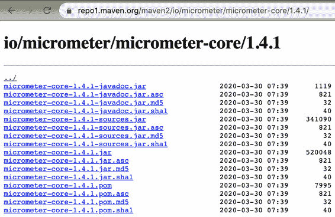
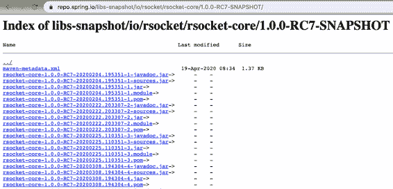
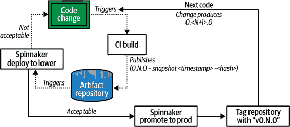
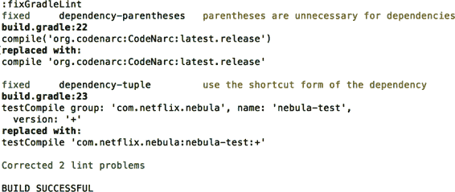

# 第六章 源代码可观察性

通过管道或其他可重复的过程实现安全交付是向前迈出的一步。然而，更重要的是展望如何从部署的资产状态开始观察运行系统。过多关注管道本身可能会导致您后来无法对部署的资产进行清单。

源代码与实时进程一样重要。在组织的源代码中，会指定内部组件与第三方库之间的依赖关系。依赖关系的微小变化可能导致应用程序无法使用。在开发者模仿他们在其他地方看到的工作时，会发现某些模式在整个组织中重复出现。即使是揭示攻击向量的模式，在意识到漏洞之前也会被模仿。在足够大的代码库中，即使是最小的 API 更改也可能显得难以克服。

在 Netflix 的代码库中，我们发现 Guava 版本在深层依赖树中的漂移有时几乎是致命的。试图在整个代码库中从一种日志记录库转换到另一种的尝试花费了多年时间，直到开发了一种组织范围的重构解决方案才得以实现。

另一个重要挑战是确定代码实际部署在多少不同环境中。例如，随着组织在持续交付方面取得进展，回滚的可能性意味着给定微服务在构件存储库中的最新发布版本可能与在生产环境中运行的版本不同。或者在金丝雀测试或蓝绿部署中，如果有超过一个活跃集群，你甚至不会只在生产中独占一个特定版本！

将部署资产映射到源代码对于非单体库（大多数情况）的组织尤为重要。限制内部依赖采纳的任何压力都有效地限制了您的*持续集成*的效果。

本章讨论的是构建工具。这里给出的例子是[Gradle](https://gradle.org)构建工具。这里描述的模式可以在 Maven 或任何其他 Java 构建工具中实现，但是 Gradle 生态系统提供了最丰富的可用具体例子，特别是在其最近在二进制依赖管理和 Netflix Nebula 插件生态系统方面的进展方面。我们还假设微服务的二进制构件以及它们包含的任何核心平台依赖项都发布到像[JFrog Artifactory](https://oreil.ly/3l06u)或[Sonatype Nexus](https://oreil.ly/R7wOr)这样的 Maven 风格的构件存储库。

虽然在软件交付生命周期中，构建工具出现在持续交付之前可能看起来有些奇怪，但是对于你在版本策略和需要包含的元数据种类的考虑来说，理解有状态持续交付工具为您做的生产资产清单是一个重要的前提条件。在给定正确数据的情况下，交付解决方案呈现的生产资产清单应该是溯源链的第一步。我们将涵盖一些需要在传统软件交付生命周期中注入的组成部分，以便您最终能够将部署的资产映射回运行在其中的源代码，如图 6-1 所示。溯源链至少应该引导到一个不可变的工件版本和提交哈希，可能还包括源代码方法级别的引用。


###### 图 6-1。从代码变更到生产的溯源链

假设我们从像 Spinnaker 这样的持续交付工具（介绍见第五章）开始，告诉我们一个代表微服务的应用程序分布在多个云平台上，不同集群中运行着多个版本的代码。如果部署的资源标记了进入它们的工件信息，我们考虑如何确保这些工件信息能够指向微服务代码历史上的唯一可识别位置。

它始于我们从交付系统中需要的特性。

# 本章中使用的术语的含义

本章将使用类似*实例*、*服务器组*和*集群*的术语，这些术语在“资源类型”中已定义，在第五章的开始部分有介绍。

# 有状态资产清单

从代码变更到部署资产的可追溯性资产清单，使您能够回答有关系统当前状态的问题。

建立此清单的第一个目标是有一些记录系统，我们可以查询以列出我们的已部署资源（在生产和较低级别的非生产测试环境中）。这有多困难取决于您的代码可以部署到多少个以及哪些类型的地方。一些组织即使在数据中心中使用虚拟化硬件，也有一组固定的几乎不会改变的虚拟机名称（编号为几十个或几百个），每个虚拟机专用于特定的应用程序。您可以合理地维护一个静态列表，其中包含应用程序名称和托管它们的虚拟机。在资源更加弹性地提供的 IaaS 或 CaaS 中，我们确实需要查询云提供商以获取当前部署的资产列表。

# GitOps 无法实现已部署资产清单

使用 GitOps，您将想要发生的事情的状态存储在 Git 中。在环境中实现的可能是非常不同的事情。这种分歧的最简单示例来自 Kubernetes。当您在 Git 中提交清单并引发部署操作时，Kubernetes 控制器会在目标集群中将该清单变异为可能不同的内容。随着供应商和项目在 Kubernetes 上添加了越来越多的 CRD，变异的范围和数量也在不断增加。通过`kubectl get pod -o yaml`得到的内容与您在 Git 中提交的清单不同。实际上，它甚至可能与另一个 Kubernetes 集群中的内容不同！关键是，即使您成功地将所有*意向操作*通过 Git 进行了限制，您在 Git 中仍然没有对已部署环境的真实图像。

Spinnaker 等系统的一个关键优点是其模型会对已部署基础设施的状态进行实时轮询，跨越 Spinnaker 支持的每个云提供商。换句话说，您可以在一个 API 调用中检索到一致的表示（以应用程序/集群/服务器组/实例为单位）跨越许多云平台的已部署基础设施。这是一个单一的窗格体验用于资产清查。这一优点有两个层面：

无需通过一个系统进行协调

通过主动轮询，我们不需要通过一个系统将已部署环境的所有可能变异集中起来，这个系统可以分开维护状态。理论上，您可以要求这样做，例如，通过强制执行“gitops”，即管理更新应用程序需要在 Git 中进行更新。在这种设置中，不能进行回滚、负载均衡器更改、手动启动服务器组或导致 Git 无法完全了解已部署环境状态的任何其他变异。

实时实例级状态

GitOps 或类似系统无法追踪服务器组中各个实例的状态。例如，AWS EC2 并不保证单个虚拟机的生存能力，只是自动扩展组将尽力在任何给定时间保持指定数量的实例。在 Kubernetes 中也是如此，单个 Pod 的生存能力也不受保证。如果度量遥测被标记为实例 ID、实例序数或 Pod ID，则可以方便地在违反某些服务级别目标时接收警报，能够深入到特定失败实例，并导航到实例级别的实时视图以采取一些补救措施。例如，您可以将一个失败的实例从负载均衡器中移出，允许“服务器组”机制启动另一个实例，并在最终终止之前调查失败实例的根本原因，从而解决立即的用户影响问题。

尽管实时实例级状态对操作非常有益，但它并不立即与我们讨论的工件来源的相关性高。我们真正需要的只是*某些*我们可以询问以列出运行中的服务器组、集群和应用程序的来源（参见示例 6-1）。在本章的其余部分，我们将使用一个 Java 伪代码来描述通过达到一定的来源信息水平应该能够得出的洞察。模型的第一部分封装了资源类型（参见“资源类型”），其定义在之前已经给出。方法的实现，例如`getApplications()`，取决于您使用的部署自动化。例如，`getApplications()`是对 Spinnaker 的 Gate 服务到端点`/applications`的 API 调用。

##### 示例 6-1\. 列出正在运行的部署资产

```java
delivery
  .getApplications()
  .flatMap(application -> application.getClusters())
  .flatMap(cluster -> cluster.getServerGroups())

// Where... class Application {
  String name;
  Team owner;
  Stream<Cluster> clusters;
}

class Cluster {
  String cloudProvider;
  String name;
  Stream<ServerGroup> clusters;
}

class ServerGroup {
  String name;
  String region; 
  String stack; 
  String version;
  boolean enabled;
  Artifact artifact;
}
```


例如，在 AWS 中的`us-east-1`或者 Kubernetes 中的命名空间。


环境的推广级别，如`test`或`production`。

对于 GitOps 系统，`getApplications()`将询问一个或多个 Git 存储库的状态。对于具有一组命名的几乎不会更改的虚拟机的私有数据中心，这可能是一个手动维护的静态列表。

注意，在各个阶段，您应该能够深入研究状态交付系统中数据的各种特征。例如，参见示例 6-2 以获取在 Kubernetes 中具有一些运行足迹的应用程序的团队列表。

##### 示例 6-2\. 发现在 Kubernetes 中运行应用程序的团队

```java
delivery
  .getApplications()
  .filter(application -> application.getClusters()
    .anyMatch(cluster -> cluster.getCloudProvider().equals("kubernetes")))
  .map(application -> application.getTeam())
  .collect(Collectors.toSet())
```

这种深入了解的能力导致更好的可操作性。建立完整的溯源链后，例如，我们应该能够查找最近揭示的方法级安全漏洞。对于关键漏洞，可能希望首先解决生产堆栈，然后再跟进包含最终进入生产路径的低级环境。

为了能够确定服务器组包含哪个`Artifact`，我们需要适当的不可变发布版本。

# 发布版本控制

由于工件存储库是立即在持续交付之前的软件交付生命周期的一部分，唯一的二进制工件版本是工件溯源链中的第一步。对于给定的流水线运行，Spinnaker 跟踪该流水线的工件输入。任何生成的部署资产也将标记有此溯源信息。图 6-2 显示了 Spinnaker 如何跟踪作为流水线输入的 docker 镜像标签和摘要。


###### 图 6-2\. Spinnaker 解析的预期工件（注意，工件是通过摘要而不是标签标识的）

要使此图像版本标签能够唯一标识一段代码，该标签必须对于每个源代码和依赖项的唯一组合都是唯一的。也就是说，如果应用程序的源代码或依赖项发生任何更改，版本号都需要更改，并且需要使用此唯一版本号来检索工件。

# Docker 镜像标签可变

Docker 注册表不保证标签的不可变性。而摘要并非与标签一一对应，尽管摘要是不可变的。发布新版本的 Docker 容器到容器注册表时的常见约定是使用标签“latest”和固定版本（如“1.2.0”）发布镜像。这样，“latest”标签实际上被覆盖，并且与“1.2.0”共享相同的摘要，直到下一个发布版本。尽管从注册表的角度看，镜像标签是可变的，但可以构建一个发布流程，实际上从不更改固定版本号，以便可以使用这种更易读的标签将图像与其中的代码关联起来。

成为部署输入的工件类型取决于目标云平台。对于像 Cloud Foundry 这样的 PaaS，它是一个 JAR 或 WAR；对于 Kubernetes，它是一个容器镜像；对于像 AWS EC2 这样的 IaaS，是从系统包（如 Debian 或 RPM）中“烘焙”的 Amazon Machine Image（参见“面向 IaaS 平台的打包”）。

无论我们是生成 JAR、容器镜像还是 Debian/RPM，都适用相同的版本控制方案考虑。

我们将此讨论缩小到发布到 Maven 仓库的 JAR 包（该讨论同样适用于发布到 Maven 仓库的 Debian 包），但生产不可变版本的最终目标对于发布容器映像到容器注册表也是一样的。

## Maven 仓库

在构件存储库中，通常有两种类型的 Maven 仓库：发布仓库和快照仓库。发布仓库的结构是仓库的基础 URL 加上构件的组、构件和版本。组名中的任何点号在路径中用 `/` 分隔，以确定构件的位置。在 Gradle 中，对 Micrometer 核心 1.4.1 的依赖可以定义为 `implementation io.micrometer:micrometer-core:1.4.1`。

这些依赖在 Maven 中央仓库的构件看起来像 图 6-3。



###### 图 6-3\. micrometer-core 1.4.1 的 Maven 中央仓库目录列表

此目录列表包含二进制 JAR（micrometer-core-1.4.1.jar）、校验和、描述模块的 Maven POM 文件、一组校验和，以及可选的源代码和 javadoc JAR 包。

# Maven 发布版本是不可变的

通常，像 Maven 仓库中的版本 1.4.1 这样的构件版本是不可变的。任何其他代码都不应发布在此版本之上。

Maven 快照仓库的结构略有不同。图 6-4 展示了在 Maven 仓库中如何为依赖 `implementation io.rsocket:rsocket-core:1.0.0-RC7-SNAPSHOT` 结构化 RSocket 的快照。



###### 图 6-4\. RSocket 1.0.0-RC7-SNAPSHOT 的 Spring Artifactory 快照仓库

指向此目录列表的路径具有路径段 `1.0.0-RC7-SNAPSHOT`，但请注意，实际的构件中没有一个包含 `SNAPSHOT`。相反，它们在发布时将 `SNAPSHOT` 替换为时间戳。如果我们查看 `maven-metadata.xml`，我们将看到它维护了发布到此快照仓库的最后时间戳的记录，如 示例 6-3 所示。

##### 示例 6-3\. RSocket 1.0.0-RC7-SNAPSHOT 的 Maven 元数据

```java
<?xml version="1.0" encoding="UTF-8"?>
<metadata modelVersion="1.1.0">
  <groupId>io.rsocket</groupId>
  <artifactId>rsocket-core</artifactId>
  <version>1.0.0-SNAPSHOT</version>
  <versioning>
    <snapshot>
      <timestamp>20200423.184223</timestamp>
      <buildNumber>24</buildNumber>
    </snapshot>
    <lastUpdated>20200423185021</lastUpdated>
    <snapshotVersions>
      <snapshotVersion>
        <extension>jar</extension>
        <value>1.0.0-RC7-20200423.184223-24</value>
        <updated>20200423184223</updated>
      </snapshotVersion>
      <snapshotVersion>
        <extension>pom</extension>
        <value>1.0.0-RC7-20200423.184223-24</value>
        <updated>20200423184223</updated>
      </snapshotVersion>
      ...
    </snapshotVersions>
  </versioning>
</metadata>
```

每次发布新的快照，构件存储库都会更新此 `maven-metadata.xml`。这意味着依赖项 `implementation io.rsocket:rsocket-core:1.0.0-RC7-SNAPSHOT` *不* 是不可变的。如果我们使用版本 `1.0.0-RC7-SNAPSHOT` 标记了某个部署资产，我们没有足够的特定信息来将此快照关联到在部署发生时最新的快照时间戳。

换句话说，Maven 快照版本的问题在于构件库中不能唯一标识二进制依赖项的来源。

微服务版本控制与库版本控制也不同，因为随时可能将在低级环境中进行测试的候选版本 *提升* 到生产环境。如果我们不检查具有类似快照版本的候选二进制文件，并决定其适合提升到生产环境中，*重新构建* 该二进制文件是不安全的。重新构建二进制文件既浪费时间，也浪费构件库存储空间。更重要的是，这引入了任何构建的一部分（或构建时机条件可能会影响生成的二进制文件）不可重复的可能性。

总结我们讨论的微服务版本控制的两个原则，我们需要以下内容：

独特性

每个唯一的源代码和依赖组合都有一个版本号

不变性

保证在构件库中不会覆盖构件版本

Maven 快照不符合独特性测试。

虽然有各种各样的发布版本控制方案可以工作，但使用开源构建工具的一个相对简单的方法可以显著减少微服务版本控制的苦力，同时满足这两个测试。

## 发布版本控制的构建工具

Netflix Nebula 套件包含一个发布插件，提供了一个方便的工作流程，用于计算满足这两个测试的版本号。它包含一组 Gradle 任务用于为您的项目进行版本控制：`final`、`candidate`和`devSnapshot`。在开发库时，通常会生成快照，直到接近发布时，然后可能进行一次或多次发布候选版本，最后生成最终版本。对于微服务版本控制，情况有所不同，因为随时可能将低级环境中运行的特定代码迭代提升到生产环境。图 6-5 展示了一个迭代周期。在这个示例工作流程中，在部署管道的末尾进行标记会提升次要发布号 *N* 到下一个开发迭代。



###### 图 6-5\. 微服务发布版本循环

在代码更改、持续集成构建和生成工件并将其存储在工件存储库中的循环以及交付自动化在较低级别环境中设置新工件的过程中，可能会多次执行，然后才最终促进到生产环境的部署。在只有一个循环的专门情况下，这是理想化的持续部署模型。当在较低级别环境中（可能还会对该较低级别环境进行一些自动化测试）成功部署时，就会进行生产推广。是否立即运送变更并不重要于版本方案。

每次运行构建时，Nebula 发布会查看存储库上的最新标签，例如`v0.1.0`，并选择（默认情况下）生成下一个次要版本的快照（以及候选版本和库的最终构建）。在本例中，这将是次要版本 0.2.0。

在建议的版本周期中，CI 将为使用 Nebula 发布生成不可变快照的存储库执行 Gradle 构建。次要修订版本保持一致，直到最终将部署提升到生产环境，此时您的交付自动化（如 Spinnaker 管道阶段）会为存储库打标签（例如，Spinnaker 作业阶段专门在存储库上执行`./gradlew final`，将当前次要发布迭代的标签推送到 Git 远程）。

# 发布的 SaaS 与打包软件对比

即使打包软件也可以由一系列微服务组成。例如，Spinnaker 本身就是一个旨在一起部署的微服务套件。通常，打包软件还需要额外的步骤：生成某种包含每个单独微服务版本的物料清单。这些版本包含在物料清单中，以表明它们已经*一起*经过测试并且已知可以作为一个组一起工作。物料清单有助于创建可能有多个运行副本的一组微服务。在运行 SaaS 时，生产环境往往是唯一运行的副本，物料清单则不是必需的。

Nebula 发布插件应用于 Gradle 项目的根项目，如示例 6-4 所示。

##### 示例 6-4\. 将 Nebula 发布插件应用于 Gradle 项目的根项目

```java
plugins {
  java
  id("nebula.release") version "LATEST" 
  id("nebula.maven-publish") version "LATEST"
  id("nebula.maven-resolved-dependencies") version "LATEST"
}

project
  .rootProject
  .tasks
  .getByName("devSnapshot")
  .dependsOn(project
    .tasks
    .getByName("publishNebulaPublicationToArtifactory")) 

project
  .gradle
  .taskGraph
  .whenReady(object: Action<TaskExecutionGraph> { 
    override fun execute(graph: TaskExecutionGraph) {
      if (graph.hasTask(":snapshot") ||
        graph.hasTask(":immutableSnapshot")) {

        throw GradleException("You cannot use the snapshot or" +
          "immutableSnapshot task from the release plugin. " +
          "Please use the devSnapshot task.")
      }
    }
  })

publishing {
  repositories {
    maven {
      name = "Artifactory" 
      url = URI.create("https://repo.myorg.com/libs-services-local")
    }
  }
}
```


将`LATEST`替换为[Gradle 插件门户网站](https://oreil.ly/_MRA2)上列出的版本。


每当 CI 构建执行`devSnapshot`时，构建并发布一个工件到 Artifactory。因为我们*还没有*将`final`附加到发布，所以在推广到生产后的阶段运行`./gradlew final`将用当前次要版本（例如，v0.1.0）标记仓库，并将标记推送到仓库，但不会不必要地上传另一个工件到工件库。此标记的存在完成了开发周期。任何随后的代码推送，因此运行`./gradlew devSnapshot`，都会为下一个次要版本生成快照（例如，`0.2.0-snapshot.<timestamp>+<commit_hash>`）。


可选地，确保开发人员不会意外使用 Nebula 发布提供的其他类型的快照任务，这些任务会生成具有不同版本号语义的快照。


定义在`devSnapshot`的`dependsOn`子句中引用的仓库。

对于每次提交（通过自动化测试）都会导致生产部署的持续部署模型，只要较低环境中不需要自动化测试套件，每个次要版本发布将恰好有一个快照。如果在工件发布之前运行了所有检查，并且信任结果足以立即推广到生产环境，则可以轻松使用`./gradlew final`，完全避免不可变的快照。很少有企业会对此感到舒适，并且没有达到这种自动化水平的压力。正如在“分离平台和应用程序度量标准”中提到的，您在某种程度上“发布您的组织图表”。

将每次部署与不可变版本关联是工件溯源链的第一阶段。当您具备了查询交付服务所有当前部署资源的能力 *和* 您的交付自动化某种方式将每次部署与不可变发布版本（无论是存储在 EC2 中的 Auto Scaling 组名称、Kubernetes 标签等）进行标记时，您将解锁遍历所有生产部署资源并映射到可以从工件库检索的工件坐标的能力。

到目前为止显示工件溯源链程度的伪代码在示例 6-5 中。

##### 示例 6-5\. 映射部署资源到工件版本

```java
delivery
  .getApplications()
  .flatMap(application -> application.getClusters())
  .flatMap(cluster -> cluster.getServerGroups())
  .map(serverGroup -> serverGroup.getArtifact()) 

// Where... @EqualsAndHashCode(includes = {"group", "artifact", "version"}) 
class Artifact {
  String group;
  String artifact;
  String version;
  Set<Artifact> dependencies; 
}
```


类型是`Stream<Artifact>`，因为部署和工件之间存在一对一的对应关系。


因为`devSnapshot`生成的不可变的构件版本对于每个源代码和依赖的唯一组合都是独特的，具有相同的组/构件/版本坐标的两个构件也保证具有相同的依赖关系。


在这个阶段，我们还不能确定依赖关系。

我们需要更多的配置来提供包含依赖关系的构件来源证明。

# 在元数据中捕获已解析的依赖关系

将应用程序的依赖关系扩展到更深层次，包括依赖关系，使我们能够快速找到包含可能有问题的*库*版本的已部署资源，例如，由于已识别的安全漏洞。

通常，当我们发布一个 Maven POM 文件以及应用程序时，它包含一个仅列出第一级依赖的`<dependencies>`块。这些是直接列在 Gradle 构建的`dependencies { }`部分中的依赖项。例如，对于从[start.spring.io](https://start.spring.io)生成的示例 Spring Boot 应用程序，第一级依赖可能是类似于示例 6-6 的内容。具体来说，`spring-boot-starter-actuator`和`spring-boot-starter-webflux`是两个第一级依赖项。

##### 示例 6-6\. 示例 Spring Boot 应用程序的第一级依赖

```java
dependencies {
  implementation("org.springframework.boot:spring-boot-starter-actuator")
  implementation("org.springframework.boot:spring-boot-starter-webflux")
  testImplementation("org.springframework.boot:spring-boot-starter-test")
  testImplementation("io.projectreactor:reactor-test")
}
```

为了建立起可靠的来源链，测试依赖并不重要。它们仅在本地开发者机器和持续集成构建期间存在于类路径上，并不会打包进最终部署环境中运行的应用程序中。任何测试依赖中的问题或漏洞都安全地限定在持续集成环境中，并不会在运行的部署应用程序中造成问题。

当这个应用程序发布到像 Artifactory 这样的构件库时，会随着二进制构件一起发布一个 Maven POM 文件，其中包含一个`dependencies`部分，就像在示例 6-7 中一样。

##### 示例 6-7\. Maven POM 中显示的第一级依赖

```java
<dependencies>
  <dependency>
    <groupId>org.springframework.boot</groupId>
    <artifactId>spring-boot-starter-actuator</artifactId>
    <version>2.3.0.M4</version>
    <scope>runtime</scope>
  </dependency>
  <dependency>
    <groupId>org.springframework.boot</groupId>
    <artifactId>spring-boot-starter-webflux</artifactId>
    <version>2.3.0.M4</version>
    <scope>runtime</scope>
  </dependency>
</dependencies>
```

当然，第一级依赖会带入*其他*依赖。从第一级向下递归解析的所有其他依赖的集合被称为依赖的传递闭包。

也许会有人认为，通过递归地从存储库获取每个依赖项的 POM 文件，就可以简单地确定此示例应用程序中的依赖项的传递闭包。遗憾的是，事实并非如此。在构建中通常存在其他约束，这些约束以某种方式影响了已解析并与应用程序一起打包的传递依赖项。例如，某个特定版本可能会被拒绝，因为某个关键错误已由更高版本修复，如示例 6-8 中所示。

##### 示例 6-8\. 拒绝版本并进行替换

```java
configurations.all {
  resolutionStrategy.eachDependency {
    if (requested.group == "org.software" &&
      requested.name == "some-library") {

      useVersion("1.2.1")
      because("fixes critical bug in 1.2")
    }
  }
}
```

# 仅通过从存储库获取标准元数据（如 POM 的 `<dependencies>` 块）来确定依赖项的传递闭包的任何过程都是不正确的。

解析策略等构建时特性的后果是，试图仅通过标准构件元数据（如 POM 的 `<dependencies>` 块）来确定依赖项的传递闭包的任何过程都是不正确的。

试图仅从标准元数据严格构建通用组件分析工具的供应商只能给出对依赖关系使用的*近似值*。而这种近似值通常与现实并不相符。

由于解析策略、强制版本等原因，在发布应用程序二进制文件时，必须以某种方式持久化传递闭包。一个简单的方法是在 POM 的 `<properties>` 元素中包含已解析的传递闭包，以供稍后构建的任何工具使用，以检查组织中使用的依赖关系。

[星云信息](https://oreil.ly/ASOpi)插件专门用于将构建时的元数据附加到 POM 的`<properties>`部分。星云信息默认添加了诸如 Git 提交哈希和分支、源和目标 Java 版本以及构建主机等属性。

`InfoBrokerPlugin`允许我们按键值对随意添加新属性。示例 6-9 展示了如何遍历运行时类路径的传递依赖闭包，并将依赖项列表添加为属性。[`nebula.maven-manifest`](https://oreil.ly/Bb-hM)，由`nebula.maven-publish`自动包含，读取信息代理管理的所有属性，并将它们作为 POM 属性添加。

##### 示例 6-9\. 列出所有传递依赖项并按平面列表排序

```java
plugins {
  id("nebula.maven-publish") version "LATEST" 
  id("nebula.info") version "LATEST"
}

tasks.withType<GenerateMavenPom> {
  doFirst {
    val runtimeClasspath = configurations
      .getByName("runtimeClasspath")
    val gav = { d: ResolvedDependency ->
      "${d.moduleGroup}:${d.moduleName}:${d.moduleVersion}"
    }
    val indented = "\n" + " ".repeat(6)

    project.plugins.withType<InfoBrokerPlugin> {
      add("Resolved-Dependencies", runtimeClasspath
        .resolvedConfiguration
        .lenientConfiguration
        .allModuleDependencies
        .sortedBy(gav)
        .joinToString(
          indented,
          indented,
          "\n" + " ".repeat(4), transform = gav
        )
      )
    }
  }
}
```


用最新版本替换`LATEST`，可以从[Gradle 插件门户](https://oreil.ly/TNrDy)上获得最新版本。

这导致 POM 中的属性列表看起来类似于示例 6-10。

##### 示例 6-10\. 列出、排序并将扁平化的传递依赖闭包添加为 POM 属性

```java
<project ...>
  <groupId>com.example</groupId>
  <artifactId>demo</artifactId>
  <version>0.1.0</version>
  <name>demo</name>
  ...
  <properties>
    <nebula_Change>1b0f8d9</nebula_Change>
    <nebula_Branch>master</nebula_Branch>
    <nebula_X_Compile_Target_JDK>11</nebula_X_Compile_Target_JDK>
    <nebula_Resolved_Dependencies>
      ch.qos.logback:logback-classic:1.2.3
      ch.qos.logback:logback-core:1.2.3
      com.datastax.oss:java-driver-bom:4.5.1
      com.fasterxml.jackson.core:jackson-annotations:2.11.0.rc1
      com.fasterxml.jackson.core:jackson-core:2.11.0.rc1
      com.fasterxml.jackson.core:jackson-databind:2.11.0.rc1
    </nebula_Resolved_Dependencies>
  </properties>
</project>
```

现在，要构建工具来查找所有包含`logback-core`版本 1.2.3 的部署，我们可以使用类似于 Example 6-11 中的伪代码来列出包含特定 `logback-core` 依赖项的所有服务器组。在`Artifact` 类型上的`dependencies` 的填充包括从存储库下载 POM，给定 Artifact 的组/Artifact/版本坐标，并解析`<nebula_Resolved_Dependencies>` POM 属性的内容。

##### Example 6-11\. 将部署资源映射到其中包含的所有依赖项集合

```java
delivery
  .getApplications()
  .flatMap(application -> application.getClusters())
  .flatMap(cluster -> cluster.getServerGroups())
  .filter(artifact -> serverGroup
    .getArtifact()
    .getDependencies()
    .stream()
    .anyMatch(d -> d.getArtifact().equals("logback-core") &&
      d.getVersion().equals("1.2.3"))
  )
```

当眼睛一瞥 POM 文件时，可以稍微改进展平的列表表示，而不会真正影响我们如何解析给定 Artifact 的传递闭包。Example 6-12 展示了如何代替创建传递依赖闭包的最小生成树的漂亮打印。

##### Example 6-12\. 作为 POM 属性添加的传递依赖闭包的树视图

```java
tasks.withType<GenerateMavenPom> {
  doFirst {
    val runtimeClasspath = configurations.getByName("runtimeClasspath")

    val gav = { d: ResolvedDependency ->
      "${d.moduleGroup}:${d.moduleName}:${d.moduleVersion}"
    }

    val observedDependencies = TreeSet<ResolvedDependency> { d1, d2 ->
      gav(d1).compareTo(gav(d2))
    }

    fun reduceDependenciesAtIndent(indent: Int):
      (List<String>, ResolvedDependency) -> List<String> =
      { dependenciesAsList: List<String>, dep: ResolvedDependency ->

        dependenciesAsList + listOf(" ".repeat(indent) +
          dep.module.id.toString()) + (
            if (observedDependencies.add(dep)) {
              dep.children
                .sortedBy(gav)
                .fold(emptyList(), reduceDependenciesAtIndent(indent + 2))
            } else {
              // This dependency subtree has already been printed, so skip
              emptyList()
            }
          )
      }

    project.plugins.withType<InfoBrokerPlugin> {
      add("Resolved-Dependencies", runtimeClasspath
        .resolvedConfiguration
        .lenientConfiguration
        .firstLevelModuleDependencies
        .sortedBy(gav)
        .fold(emptyList(), reduceDependenciesAtIndent(6))
        .joinToString("\n", "\n", "\n" + " ".repeat(4)))
    }
  }
}
```

这会生成一个解析的依赖属性，看起来像 Example 6-13。这在单独查看时更易读，并从工具中使用这样的属性等同于展平表示法——只需去掉每行前面的空格，无论有多少空格。

##### Example 6-13\. 作为 POM 属性显示的传递依赖闭包的树视图

```java
<project ...>
  <groupId>com.example</groupId>
  <artifactId>demo</artifactId>
  <version>0.1.0</version>
  <name>demo</name>
  ...
  <properties>
    <nebula_Change>1b0f8d9</nebula_Change>
    <nebula_Branch>master</nebula_Branch>
    <nebula_X_Compile_Target_JDK>11</nebula_X_Compile_Target_JDK>
    <nebula_Resolved_Dependencies>
      org.springframework.boot:spring-boot-starter-actuator:2.3.0.M4
        io.micrometer:micrometer-core:1.3.7
          org.hdrhistogram:HdrHistogram:2.1.11
          org.latencyutils:LatencyUtils:2.0.3
        org.springframework.boot:spring-boot-actuator-autoconfigure:2.3.0.M4
          com.fasterxml.jackson.core:jackson-databind:2.11.0.rc1
          com.fasterxml.jackson.datatype:jackson-datatype-jsr310:2.11.0.rc1
            com.fasterxml.jackson.core:jackson-annotations:2.11.0.rc1
            com.fasterxml.jackson.core:jackson-core:2.11.0.rc1
            com.fasterxml.jackson.core:jackson-databind:2.11.0.rc1
    </nebula_Resolved_Dependencies>
  </properties>
</project>
```

您可以在这个星云信息输出中看到一个提示，我们可以进一步找到提交（`<nebula_Change>`）的方式。

# 捕获源代码的方法级别利用

更进一步，我们可以捕获给定 Artifact 版本的源代码级别。这是来源链中的最后阶段。完成后，链条从概念上的“应用程序”，包括分布在多个云提供商上的集群，一直到这些应用程序中源代码的方法声明和调用。例如，对于基于 AWS EC2 的 IaaS 部署足迹，现在来源链看起来像 Example 6-14。

##### Example 6-14\. 从应用程序到方法级别源代码的 AWS EC2 完整来源链

```java
Application
  -> Owner (team)
  -> Clusters
    -> Server groups
      -> Instances
      -> Amazon Machine Image (AMI)
        -> Debian
          -> JAR (or WAR)
            -> Git commit
              -> Source abstract syntax tree 
                -> Classes
                  -> Method declarations
                    -> Method invocations
            -> Dependencies
               -> Git commit
                 -> Source abstract syntax tree
                   -> Classes
                     -> Method declarations
                       -> Method invocations
```


如何构建这个是本节的主题。

由于这条链仅通过足够独特的标识元数据从上到下链接，我们几乎可以回答关于我们正在运行的生产环境的任何问题。现在，每个这些场景都有一个确切的答案，可以随时根据当前部署足迹的状态进行更新：

开源第三方库中的零日漏洞

安全团队发现了开源第三方库中一个方法的漏洞。如果被利用，这一漏洞可能导致公司泄露敏感的个人可识别信息，从而造成重大的法律责任和品牌影响。由于这个漏洞的影响广泛，安全团队希望分两个阶段解决这个问题。首先专注于生产环境中涉及到这一漏洞方法的公共界面，然后在较低的环境中处理内部工具和应用程序代码，最终部署到生产环境。在第一阶段，安全团队需要与哪些团队沟通，这些团队的执行路径可能导致到达这一漏洞方法？

平台团队希望废弃或更改一个 API

负责提供每个微服务团队使用的库，以检查给定请求是否处于运行的 A/B 实验中的集中化工具团队，希望改变其库的使用方式。工具团队在其 Github 企业实例上使用源代码搜索机制来查看现有 API 的使用情况，并注意到某些结果指向了死代码。如果团队决定进行 API 更改，哪些活跃开发和部署的代码将受到影响？哪些团队将受到这一潜在变更的影响？如果影响的团队数量较少，工具团队可能可以与受影响的用户逐个会面或举行小型会议和反馈会议，并继续进行更改。如果影响到了更广泛的组织范围，也许需要更渐进地处理这一变更，或者重新考虑整体变更的策略。

当涉及到识别正在运行的微服务执行路径中使用的方法时，有两种方法：

实时监控执行路径

可以附加代理到运行中的 Java 进程中，以监控实际执行的方法。一段时间内观察到的所有方法签名集合近似于可达的执行路径。例如，[Snyk](https://snyk.io)，专注于安全漏洞分析，提供了一个 Java 代理，监控可证明的执行路径以与其方法级漏洞研究匹配，并提醒组织已知的漏洞。这种实时监控自然地*低估*了实际的执行路径集合，因为有些执行路径可能很少被执行（例如异常处理路径）。

从源代码静态分析潜在的执行路径

存在多个 Java 工具来构建[抽象语法树](https://oreil.ly/f0r4M)（源代码的中间表示）。可以遍历此树以查找方法调用。对于源代码库中每个类的抽象语法树的所有方法调用集合表示所有潜在执行的集合。这自然会*过报告*真实的执行路径集合，因为某些方法调用会存在于永远不会评估为真的条件集或永远不会执行的请求映射中。一个开放可用的工具示例是“使用 OpenRewrite 进行结构化代码搜索”。

由于这些方法的欠报告和过报告特性，将它们结合使用可能很有用。任何通过实时监控报告方法使用的应用程序都肯定需要更改。潜在的执行路径可以在第二次通过中进行评估。

静态分析工具需要评估源代码。在示例 6-15 中再次展示的`nebula.info`和`nebula.maven-publish`的结合给出了一个 Git 提交哈希和分支，这足以连接已知在给定服务器组中运行的工件版本与其中包含的源代码。此外，您可以跟踪应用工件的传递依赖闭包，查看每个依赖项的 POM 文件，并查看每个依赖项用于检查其源代码的提交哈希和分支。

##### 示例 6-15。生成 Git 提交哈希和分支的 Gradle 插件。

```java
plugins {
  id("nebula.maven-publish") version "LATEST"
  id("nebula.info") version "LATEST"
}
```

此生成的 POM 属性，如示例 6-16 所示，可以很容易地被工具抓取。

##### 示例 6-16。生成 Git 提交哈希和分支的 Maven POM 属性。

```java
<project ...>
  <groupId>com.example</groupId>
  <artifactId>demo</artifactId>
  <version>0.1.0</version>
  <name>demo</name>
  ...
  <properties>
    <nebula_Change>1b0f8d9</nebula_Change>
    <nebula_Branch>master</nebula_Branch>
  </properties>
</project>
```

要设定关于结构化代码搜索工具应具备的能力类型的预期，可以考虑 OpenRewrite。

## 使用 OpenRewrite 进行结构化代码搜索。

[OpenRewrite](http://github.com/openrewrite)项目是 Java 和其他源代码的大规模重构生态系统，旨在消除工程组织中的技术债务。Rewrite 被设计为可插入各种工作流程，包括以下内容：

+   发现和修复代码作为构建工具任务（例如 Gradle 和 Maven）。

+   用于任意复杂度模式的亚秒级组织范围内代码搜索。

+   大规模发出拉取请求以修复安全漏洞，消除弃用 API 的使用，从一种技术迁移到另一种技术（例如从 JUnit 断言到 AssertJ）等。

+   组织范围内的 Git 提交执行相同操作。

它基于自定义的抽象语法树（AST），用于编码源代码的结构和格式。AST 可以打印以重建源代码，包括其原始格式。重写提供了高级搜索和重构功能，可以转换 AST，以及用于单元测试重构逻辑的实用程序。

重写 AST 的两个关键功能使其适合用于溯源链的目的：

类型属性

每个 AST 元素都蕴含有类型信息。例如，对于字段引用，源代码可能只是引用了`myField`。`myField`的重写 AST 元素还将包含关于`myField`类型的信息，即使它并未在同一源文件甚至同一项目中定义。

非循环和可序列化

大多数包含类型信息的 AST 可能是循环的。循环通常来自泛型类型签名，例如类`A<T extends A<T>>`。这种模式通常出现在 Java 中的抽象构建器类型中。重写会截断这些循环，并为其类型添加序列化注解，以便 AST 可以使用像 Jackson 这样的库进行序列化/反序列化。

准确匹配模式需要类型属性。当查看类似 Example 6-17 的日志记录语句时，我们如何知道`logger`是 SLF4J 还是 Logback 记录器？方法被调用的实例的类类型称为接收器类型。

##### 示例 6-17\. 具有模糊接收器类型的日志记录语句

```java
logger.info("Hi");
```

为整个组织生成带有类型属性的 AST 在计算上是任意复杂的，因为它需要依赖解析、源代码解析和类型属性（基本上是 Java 编译直到生成字节码的过程）。由于重写 AST 是可序列化的，我们可以将它们作为编译的副产品在持续集成环境中集中存储，然后稍后批量操作。

一旦我们为特定源文件生成了序列化的抽象语法树（AST），由于它还包含类型信息，它可以完全独立于同一源代码包或存储库中的其他源文件进行重构和搜索。这使得大规模搜索和重构成为一种真正线性可扩展的操作。

### 从 Java 源代码创建重写 AST

要构建 Java 源代码的重写 AST，可以使用以下其中一个构造函数签名构建`JavaParser`，无论是否在运行时类路径上，如 Example 6-18 所示。

##### 示例 6-18\. 构造 JavaParser 实例

```java
JavaParser();
JavaParser(List<Path> classpath);
```

提供类路径是可选的，因为每个元素的类型属性都是*尽力而为*的。如果我们将 AST 存储在数据存储中以进行组织范围的搜索，最好将其完全存储为类型属性，因为无法预知将要进行的搜索类型。此类搜索包括以下内容：

完全不需要类型

如果您正在应用类似于 Checkstyle 的 `WhitespaceBefore` 规则的自动修复规则，我们严格关注源代码格式化，如果 AST 元素中没有任何类型，这并不影响结果。

部分类型需求

如果要搜索已弃用的 Guava 方法的出现次数，则可以使用指向 Guava 二进制文件的路径构造一个 `JavaParser`。它甚至不必是项目正在使用的 Guava 版本！生成的 AST 将具有有限的类型信息，但足以搜索我们想要的内容。

完整类型需求

当 AST 作为编译的副作用发射到中央数据存储以供后续任意代码搜索时，它们需要具有完整的类型信息，因为我们无法预先知道人们将尝试进行什么样的搜索。

`JavaParser` 包含一个方便的方法，用于从构造解析器的 Java 进程的运行时类路径构建 `JavaParser`，如 示例 6-19 所示。

##### 示例 6-19\. 给解析器提供进行类型归属所需的编译依赖项

```java
new JavaParser(JavaParser.dependenciesFromClasspath("guava"));
```

此实用程序获取要查找的依赖项的“artifact name”。artifact name 是 `group:artifact:version` 坐标的 artifact 部分。例如，对于 Google 的 Guava (`com.google.guava:guava:VERSION`)，artifact name 是 `guava`。

一旦您有了 `JavaParser` 实例，您可以使用 `parse` 方法解析项目中的所有源文件，该方法接受一个 `List<Path>`。 示例 6-20 展示了这一过程。

##### 示例 6-20\. 解析 Java 源路径列表

```java
JavaParser parser = ...;
List<J.CompilationUnit> cus = parser.parse(pathsToSourceFiles);
```

`J.CompilationUnit`

这是 Java 源文件的顶级 AST 元素，包含有关包、导入以及源文件中包含的任何类/枚举/接口定义的信息。 `J.CompilationUnit` 是我们将为 Java 源代码构建重构和搜索操作的基本构建块。

`JavaParser`

这包含了从字符串构建 AST 的 `parse` 方法重载，对于快速构建不同搜索和重构操作的单元测试非常有用。

对于像 Kotlin 这样支持多行字符串的 JVM 语言，这特别方便，如 示例 6-21 所示。

##### 示例 6-21\. 解析 Java 源代码

```java
val cu: J.CompilationUnit = JavaParser().parse("""
    import java.util.Collections;
    public class A {
        Object o = Collections.emptyList();
    }
""")
```

请注意，这返回一个单独的 `J.CompilationUnit`，可以立即对其进行操作。最终，[JEP-355](https://oreil.ly/9p7X8) 也将为 Java 带来多行字符串，因此将能够以纯 Java 代码编写漂亮的 Rewrite 操作单元测试。

在 示例 6-22 中演示的 `dependenciesFromClasspath` 方法特别适用于构建单元测试，因为您可以将影响测试运行时类路径上的模块放置在解析器中，并将其绑定到解析器。 这样，用于单元测试的 AST 将对该依赖项中的类、方法等的引用进行类型归因。

##### 示例 6-22\. 使用类路径对类型进行解析

```java
val cu: J.CompilationUnit = JavaParser(JavaParser.dependenciesFromClasspath("guava"))
    .parse("""
        import com.google.common.io.Files;
        public class A {
            File temp = Files.createTempDir();
        }
    """)
```

### 使用 Rewrite 执行搜索

在前面的示例基础上，我们可以搜索 Guava 的 `Files#createTempDir()` 的用法，如示例 6-23 所示。 `findMethodCalls` 的参数采用 [AspectJ 语法](https://oreil.ly/4UaEQ) 来匹配方法的切入点。

##### 示例 6-23\. 使用 Rewrite 执行搜索

```java
val cu: J.CompilationUnit = JavaParser(JavaParser.dependenciesFromClasspath("guava"))
    .parse("""
        import com.google.common.io.Files;
        public class A {
            File temp = Files.createTempDir();
        }
    """)

val calls: List<J.MethodInvocation> = cu.findMethodCalls(
    "java.io.File com.google.common.io.Files.createTempDir()");
```

`J.CompilationUnit` 上还有许多其他搜索方法，其中包括以下内容：

`boolean hasImport(String clazz)`

寻找导入

`boolean hasType(String clazz)`

检查源文件是否引用了某一类型

`Set<NameTree> findType(String clazz)`

返回所有与特定类型相关的 AST 元素

您还可以向下移动到源文件中的单个类（`cu.getClasses()`）并执行其他操作：

`List<VariableDecls> findFields(String clazz)`

查找在此类中声明的字段，这些字段引用了特定类型。

`List<JavaType.Var> findInheritedFields(String clazz)`

查找从基类继承的字段。 请注意，由于它们是继承的，所以没有 AST 元素可以匹配，但是您可以确定一个类是否有来自基类的特定类型的字段，并查找此字段的用法。

`Set<NameTree> findType(String clazz)`

返回此类内部所有引用特定类型的 AST 元素。

`List<Annotation> findAnnotations(String signature)`

查找所有与 AspectJ 切入点定义中的注释匹配的注释。

`boolean hasType(String clazz)`

检查类是否引用了某一类型。

`hasModifier(String modifier)`

检查类定义上的修饰符（例如，public、private、static）。

`isClass()/isEnum()/isInterface()/isAnnotation()`

检查声明的类型。

AST 更深层次的更多搜索方法可用。

您可以通过扩展 `JavaSourceVisitor` 并实现所需的任何 `visitXXX` 方法来构建自定义搜索访问者。 这些不必复杂。 如示例 6-24 所示，`FindMethods` 仅扩展了 `visitMethodInvocation` 来检查给定调用是否与我们正在寻找的签名匹配。

##### 示例 6-24\. Rewrite 中 FindMethods 操作的实现

```java
public class FindMethods extends JavaSourceVisitor<List<J.MethodInvocation>> {
    private final MethodMatcher matcher;

    public FindMethods(String signature) {
        this.matcher = new MethodMatcher(signature);
    }

    @Override
    public List<J.MethodInvocation> defaultTo(Tree t) {
        return emptyList();
    }

    @Override
    public List<J.MethodInvocation> visitMethodInvocation(J.MethodInvocation method) {
        return matcher.matches(method) ?
          singletonList(method) :
          super.visitMethodInvocation(method);
    }
}
```

通过实例化访问者并在根 AST 节点上调用`visit`来调用自定义访问者，如示例 6-25 所示。`JavaSourceVisitor`可以返回任何类型。您可以使用`defaultTo`定义默认返回，并且可以通过在访问者上覆盖`reduce`来提供自定义减少操作。

##### 示例 6-25。调用自定义重写访问者

```java
J.CompilationUnit cu = ...;

// This visitor can return any type you wish, ultimately
// being a reduction of visiting every AST element
new MyCustomVisitor().visit(cu);
```

### 重构 Java 源代码

将此工件溯源链建立到源代码方法调用级别的一个好处是，您可以有针对性地执行源代码的某些*修复*操作：首先迭代部署的资产并将其映射到二进制文件，然后映射到提交，然后映射到从该提交构建的 AST。

重构代码从 AST 的根开始，对于 Java 来说是`J.CompilationUnit`。调用`refactor()`开始重构操作。我们将详细介绍可以执行的重构操作类型，但在此过程结束时，您可以调用`fix()`，生成一个`Change`实例，允许您生成 git 差异并打印出原始和转换后的源代码。示例 6-26 展示了整个过程的端到端。

##### 示例 6-26。端到端：解析 Java 源代码到打印修复

```java
JavaParser parser = ...;
List<J.CompilationUnit> cus = parser.parse(sourceFiles);

for(J.CompilationUnit cu : cus) {
    Refactor<J.CompilationUnit, J> refactor = cu.refactor();

    // ... Do some refactoring

    Change<J.CompilationUnit> change = refactor.fix();

    change.diff(); // A string representing a git-style patch
    // Relativize the patch's file reference to some other path
    change.diff(relativeToPath);

    // Print out the transformed source, which could be used
    // to overwrite the original source file
    J.CompilationUnit fixed = change.getFixed();
    fixed.print();

    // Useful for unit tests to trim the output of common whitespace
    fixed.printTrimmed();

    // This is null when we synthesize a new compilation unit
    // where one didn't exist before
    @Nullable J.CompilationUnit original = change.getOriginal();
}
```

`rewrite-java`打包了一系列重构构建块，可用于执行低级重构操作。例如，要将所有字段从`java.util.List`更改为`java.util.Collection`，我们可以使用`ChangeFieldType`操作，如在测试形式中所示的示例 6-27。

##### 示例 6-27。更改字段类型的单元测试

```java
@Test
fun changeFieldType() {
    val a = parse("""
        import java.util.List;
        public class A {
           List collection;
        }
    """.trimIndent())

    val fixed = a.refactor()
            .visit(ChangeFieldType(
                    a.classes[0].findFields("java.util.List")[0],
                    "java.util.Collection"))
            .fix().fixed

    assertRefactored(fixed, """
        import java.util.Collection;

        public class A {
           Collection collection;
        }
    """)
}
```

`rewrite-java`模块带有基本的重构构建块，这些构建块类似于 IDE 中找到的许多单独的重构工具：

+   向类、方法或变量添加注解。

+   向类添加字段。

+   添加/删除导入项，可以配置为展开/折叠星号导入。

+   更改字段名称（包括引用该字段的其他源文件，而不仅仅是字段定义的位置）。

+   更改字段类型。

+   更改文字表达式。

+   更改方法名称，包括引用该方法的任何位置。

+   将方法目标更改为从实例方法到静态方法。

+   将方法目标更改为从静态方法到实例方法。

+   在树的任何位置更改类型引用。

+   插入/删除方法参数。

+   删除任何语句。

+   使用字段生成构造函数。

+   重命名变量。

+   重新排序方法参数。

+   取消括号。

+   实现一个接口。

每个操作都定义为`JavaRefactorVisitor`，它是专为改变 AST 而设计的`JavaSourceVisitor`的扩展，在重构操作结束时最终生成一个`Change`对象。

访问者可以是有游标或无游标的。有游标的访问者维护一个已经在树中遍历过的 AST 元素堆栈。尽管需要额外的内存足迹，这种访问者可以基于树中 AST 元素的位置进行操作。许多重构操作不需要此状态。例子 6-28 提供了一个使每个顶层类都变为 final 的重构操作示例。由于类声明可以是嵌套的（例如，内部类），我们使用游标来确定类是否是顶级的或不是。重构操作还应给出一个带有表示操作组的完全限定名称和表示其功能的名称。

##### 示例 6-28\. 使每个顶级类变为 final 的重构操作示例

```java
public class MakeClassesFinal extends JavaRefactorVisitor {
    public MakeClassesFinal {
        super("my.MakeClassesFinal");
        setCursoringOn();
    }

    @Override
    public J visitClassDecl(J.ClassDecl classDecl) {
        J.ClassDecl c = refactor(classDecl, super::visitClassDecl);

        // Only make top-level classes final
        if(getCursor().firstEnclosing(J.ClassDecl.class) == null) {
            c = c.withModifiers("final");
        }

        return c;
    }
}
```

访问者可以通过调用 `andThen(anotherVisitor)` 连接在一起。这对于构建由较低级别组件组成的重构操作流水线非常有用。例如，当 `ChangeFieldType` 找到要转换的匹配字段时，它会将 `AddImport` 访问者链接在一起，如果需要则添加新的导入，以及将 `RemoveImport` 链接在一起，以移除旧的导入，如果不再有引用。

一个开源平台的现成补救措施继续在开源中增长。

此时，来源链已经完整。将连接到源代码方法级细节的各个点连接起来，让你能够以精细的方式观察你部署的足迹，实时回答各种问题。

现在让我们把注意力转移到建立源可靠性的另一个方面：管理二进制依赖。

# 依赖管理

二进制依赖（在 Gradle 构建文件或 Maven POM 文件中定义）带来一系列系统性挑战。我们将讨论其中几个问题，并提出解决策略。你会注意到，在每种情况下，补救措施都是在构建工具层面应用的。

一些组织尝试通过*策展*来限制依赖问题的影响，即禁止使用来自 Maven Central 或 JCenter 等公共存储库源的依赖，而是选择经过批准和策划的一组依赖项。依赖项的策展提出了一系列挑战。特别是考虑到库之间的相互连接，决定将另一个库添加到策划集中涉及添加其整个传递闭包。还存在一种自然倾向，即避免获得添加新工件所需的辛劳，这意味着你的组织会偏向使用略旧的库版本，增加安全漏洞和错误足迹。具有讽刺意味的是，策展的目标通常是为了*提高*安全性。至少，这种权衡值得根据你的声明目标进行评估。

## 版本不对齐

由于冲突解析导致的依赖家族版本不一致，使得该家族无法正确运行。策划的构件仓库增加了版本不一致的可能性。

Jackson 就是一个很好的例子。假设我们将 Spring Boot 的新版本及其传递的依赖带入我们的策划仓库。图 6-6 使用 Gradle 的 `dependencyInsight` 任务来展示 Spring Boot 传递依赖闭包中包含的 Jackson 依赖及其包含方式的路径。

值得注意的是，此列表中显然缺少所有其他不直接由框架需要的 Jackson 模块，例如 `jackson-module-kotlin`、`jackson-module-afterburner` 和 `jackson-modules-java8`。任何使用这些其他模块的微服务在更新到策划仓库中的新版本的 Spring Boot 后，现在存在无法解决的版本不一致（可能会创建运行时问题），直到这些模块的新版本也被添加到策划集中。


###### 图 6-6\. Spring Boot 传递的 Jackson 依赖

动态版本带来了一系列不同的问题。

## 动态版本约束

遗憾的是，Java 构建工具仍然缺乏像[NPM 的选择器](https://oreil.ly/17iNf)那样针对语义化版本的高级范围选择器。相反，我们只能使用像`latest.release`和`2.10.+`（Gradle）、`RELEASE`和`(,2.11.0]`（Maven）这样粗略的选择器。

尽量避免使用`+`类型的选择器，因为它们会按照字典顺序排序版本号。所以 `2.10.9` 被认为比 `2.10.10` 更晚。

Maven 风格的范围选择器不幸地将您固定在一个静态的上限。当进一步的版本发布时，需要在定义它们的所有位置更新上限。

尽管大部分常见的开源库都会谨慎地仅向公共仓库发布正式版本，但偶尔我们仍然会看到即使是被广泛使用的库也发布候选版本。遗憾的是，`latest.release`（Gradle）和`RELEASE`（Maven）选择器无法区分版本号和人类明显的正式发布候选版本。例如，在 2020 年 3 月，Jackson 发布了 `2.11.0.rc1` 版本，这会被`latest.release`选择。不到一年前的 2019 年 9 月，Jackson 发布了 `2.10.0.pr1` 版本（非常规的“pr”后缀显然意味着“预发布”）。这两个版本在语义上都不符合“最新发布”的意图。

我们可以通过向 Gradle 构建中添加两个 Maven 仓库，以此来阻止已知模式的发布候选版本，这两个仓库共同形成了一个不可分割的可解析工件的子集，关于示例 6-29，就是所有非发布候选的 Jackson 模块，以及所有非 Jackson 模块的集合。

##### 示例 6-29\. 在 Gradle 中阻止使用 Jackson 发布候选版本

```java
repositories {
  mavenCentral {
    content {
      excludeVersionByRegex("com\\.fasterxml\\.jackson\\..*", ".*",
        ".*rc.*")
    }
  }
  mavenCentral {
    content {
      includeVersionByRegex("com\\.fasterxml\\.jackson\\..*", ".*",
        "(\\d+\\.)*\\d+")
    }
  }
}
```

未使用的依赖项提出了另一种问题。

## 未使用的依赖项

除了会使打包的微服务体积膨胀（这通常不是一个重大问题），未使用的依赖项还可能导致功能的隐式自动配置，后果严重。

一个 Spring Data REST [漏洞](https://oreil.ly/m6n_W) 让许多人措手不及，即使他们根本没有使用该库，但由于它存在于运行时类路径中，导致 Spring 自动配置了一系列 REST 端点，暴露了攻击向量。

基于 Guice 的 [Governator](https://oreil.ly/yrGcx) 会自动配置类路径中的任何 Guice 模块。Governator 的扫描机制不受包名的限制。类路径中的模块可能依赖于其他模块，但这些依赖项并不一定可靠地在类路径中。经常会发现未使用但已自动配置的 Guice 模块导致应用程序失败，因为之前意外存在于类路径中的依赖项被移除。

未使用的依赖项可以通过 [Nebula Lint](https://oreil.ly/4YFe8) Gradle 插件自动检测和删除。它可以在 Gradle 项目中进行配置，如示例 6-30 所示。

##### 示例 6-30\. Nebula Lint 配置未使用依赖项

```java
plugins {
  id "nebula.lint" version "LATEST"
}

gradleLint.rules = ['unused-dependency']
```

当 `nebula.lint` 被应用时，构建脚本将在任务图中的最后一个任务执行后自动由名为 `lintGradle` 的任务进行 lint 检查。结果会在控制台中报告，如图 6-7 所示。


###### 图 6-7\. Nebula Lint 关于依赖项格式的警告

运行 `./gradlew fixGradleLint` 来自动修复你的构建脚本。自动修复过程列出了所有违规项及其修复方式，如图 6-8 所示。



###### 图 6-8\. Nebula Lint 自动修复依赖项格式

最后一个问题代表了未使用依赖项的镜像相反。

## 未声明的显式使用依赖项

一个应用程序类导入了一个从依赖中定义的类，该依赖是通过传递定义的。有效地将传递依赖项引入类路径的一级依赖项要么被移除，要么其树发生变化，使得传递依赖项不再在类路径中。

未声明的依赖项也可以通过 Nebula Lint 自动检测和添加。它可以在 Gradle 项目中进行配置，如示例 6-31 所示。

##### 示例 6-31\. 未声明依赖项的 Nebula Lint 配置

```java
plugins {
  id "nebula.lint" version "LATEST"
}

gradleLint.rules = ['undeclared-dependency']
```

一旦作为一级依赖项添加，其作为依赖项的可见性，特别是其版本对该应用的重要性更为突出。

# 摘要

本章介绍了一些基本要求，以便设置您的软件交付生命周期，使您可以将部署的资产映射回其中包含的源代码。随着部署资产数量的增加（更小的微服务），确定生产可执行代码中特定代码模式存在的可查询记录系统变得更加重要。

在下一章中，我们将讨论可用于补偿和限制任何微服务架构中存在的失败范围的流量管理和调用弹性模式。
